> 第三部分：高级抽象和编排
> 
> 这一部分侧重于通过使用容器来管理组件系统。最有价值的系统通常包含两个或更多组件。管理少量组件的系统不需要太多自动化就可以管理。但随着系统规模的扩大，没有自动化实现一致性和可重复性是困难的。
> 
> 管理现代服务架构是复杂的，需要自动化工具。这部分深入探讨了高级抽象，如服务、环境和配置。你将学习如何使用 Docker 提供这种自动化工具。
> 
> 第十一章：使用 Docker 和 Compose 的服务
> 
> 本章涵盖

+   理解服务以及它们与容器的关系

+   使用 Docker Swarm 进行基本服务管理

+   使用 Docker Compose 和 YAML 构建声明性环境

+   使用 Compose 和 `deploy` 命令迭代项目

+   扩展服务和清理

> 今天，我们运行的大多数软件都是设计用来与其他程序交互，而不是与人类用户交互。由此产生的相互依赖的过程网服务于集体目的，如处理支付、运行游戏、促进全球通信或提供内容。当你仔细观察这个网络时，你会发现可能运行在容器中的单个运行进程。这些进程被分配内存并在 CPU 上获得时间。它们绑定到网络上，并在特定端口上监听来自其他程序的请求。它们的网络接口和端口在命名系统中注册，以便在该网络上被发现。但随着你扩大视野并检查更多进程，你会注意到它们大多数具有共同的特征和目标。
> 
> 任何必须在网络上被发现和可用的进程、功能或数据都称为服务。这个名字，服务，是一个抽象。通过将这些目标编码到抽象术语中，我们简化了我们谈论使用此模式的事物的方式。当我们谈论一个特定的服务时，我们不需要明确说明该名称应该通过 DNS 或环境适当的发现机制来发现。我们也不需要说明当客户端需要使用它时，该服务应该正在运行。这些期望已经通过服务抽象的普遍理解而传达。这种抽象让我们专注于使任何特定服务特殊的事物。
> 
> 我们可以在我们的工具中反映出相同的优势。Docker 已经为容器做了这件事。容器在第六章 中被描述为使用特定 Linux 命名空间、特定文件系统视图和资源分配启动的进程。我们不必每次谈论容器时都描述这些具体细节，也不必亲自创建这些命名空间。Docker 会为我们完成这些。Docker 还为其他抽象提供了工具，包括服务。
> 
> 本章介绍了 Docker 为在集群模式下处理服务提供的工具。它涵盖了服务生命周期、编排者的角色以及如何与编排者交互以在您的机器上部署和管理服务。您将在本书的剩余部分使用本章中描述的工具。所有容器编排系统，包括 Kubernetes，都提供了相同的概念、问题和基本工具。以下内容将有助于理解您在日常工作中使用的任何编排器。
> 
> 11.1. 一个“HELLO WORLD!”服务
> 
> 与容器入门一样简单，开始使用服务。在这种情况下，您可以通过运行以下两个命令在本地启动一个“Hello World!”网络服务器：
> 
> > `docker swarm init` `1` `docker service create \` `2` `--publish 8080:80 \     --name hello-world \    dockerinaction/ch11_service_hw:v1`

+   1 启用服务抽象

+   2 在 localhost:8080 上启动服务器

> 与容器不同，Docker 服务仅在 Docker 以集群模式运行时才可用。初始化集群模式将启动一个内部数据库以及在 Docker Engine 中执行服务编排的长时间运行的循环；参见图 11.1。蜂群还提供了本书其余部分将要介绍的其他一些功能。在前面代码中运行`init`命令启用服务管理子命令。
> 
> 图 11.1. 初始化蜂群节点
> 
> 
> 
> `service create`子命令定义了一个名为`hello-world`的服务，该服务应在 8080 端口上可用，并使用如图 11.2 所示的镜像`dockerinaction/ch11_service_hw:v1`。图 11.2。
> 
> 图 11.2. 创建您的第一个服务
> 
> 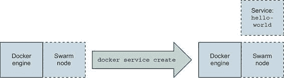
> 
> 运行这两个命令后，您应该会看到一个进度条，描述服务的状态。一旦进度完成，它将被标记为`Running`，并且命令将退出。此时，您应该能够打开 http://localhost:8080 并看到一个友好的小消息，`Hello, World! --ServiceV1`。它还会显示处理请求的任务 ID（容器 ID）。
> 
> 任务是蜂群中的一个概念，代表一个工作单元。每个任务都关联一个容器。尽管可能存在其他类型的任务不使用容器，但这些不是本章的主题。蜂群只与任务一起工作。底层组件将任务定义转换为容器。本书不涉及 Docker 内部结构。就我们的目的而言，可以将任务和容器这两个术语大致互换。
> 
> 图 11.3. 蜂群节点自动创建一个容器来运行服务软件。
> 
> 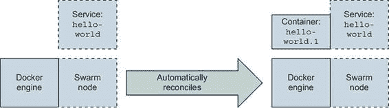
> 
> 这应该感觉就像运行一个类似的容器示例一样。与其关注服务和容器之间的相似之处，不如关注它们之间的不同之处。首先，认识到服务工作负载是用容器实现的。当服务运行时，运行 `docker container ps` 来发现有一个名为 `hello-world.1.pqamgg6bl5eh6p8j4fj503kur` 的容器正在运行。这个容器没有什么特别之处。检查容器不会产生任何特别有趣的结果。你可能注意到了一些 Swarm 特定的标签，但仅此而已。然而，如果你移除容器，会发生一些有趣的事情。本节的剩余部分将描述更高层次的属性，服务生命周期，以及 Swarm 如何使用这些属性来执行诸如服务恢复等小型自动化奇迹。
> 
> 11.1.1\. 自动恢复和复制
> 
> 将服务恢复到生命状态是大多数开发人员和运维人员都比较熟悉的事情。对于这些人来说，手动终止运行服务的唯一进程可能感觉像是在诱惑命运。就像踢一个早期的人工智能机器人——这感觉比我们愿意承担的风险要大。但是，有了正确的工具（以及这些工具的验证），我们可以安心地知道承担这种风险可能不会导致任何类似世界末日般的业务场景。
> 
> 如果你移除驱动 `hello-world` 服务的唯一容器（来自上一节），容器将被停止并移除，但几分钟后它将重新启动。或者至少会有另一个配置相似的容器出现在它的位置。你可以亲自尝试一下：找到运行服务器的容器 ID（使用 `docker ps`）；使用 `docker container rm -f` 来移除它；然后执行几个 `docker container ps` 命令来验证它已被移除，并观察一个替代品出现。接下来，通过使用 图 11.4 中显示的 `service` 子命令来深入了解这种恢复。
> 
> 图 11.4\. Swarm 对服务规范和状态变化的响应时间线
> 
> 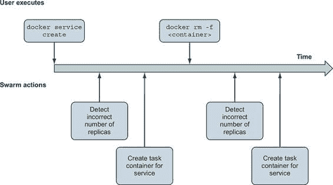
> 
> 首先，运行 `docker service ls` 命令来列出正在运行的服务。列表将包括 `hello-world` 服务，并显示有一个副本正在运行，这可以通过命令输出中 `REPLICAS` 列的 `1/1` 来表示。这可以通过容器重新启动的事实得到证明。接下来，运行 `docker service ps hello-world` 命令来列出与特定服务（在本例中为 `hello-world`）关联的容器。列表包括两个条目。列表将显示第一个条目具有“`Running`”的期望状态和“`Running x minutes ago`”的当前状态。第二个条目将分别列出为 `Shutdown` 和 `Failed`。这两个列提示了一些关键思想，所以现在让我们来详细解释一下。考虑以下来自 `docker service ps` 输出的摘录：
> 
> > `名称                目标状态           当前状态 hello-world.1       运行中             运行中，少于 1 秒前 \_ hello-world.1   关闭            失败，16 秒前`
> > 
> 自主编排器——例如 Docker 中的 Swarm 组件——跟踪两个东西：期望状态和当前状态。期望状态是用户希望系统执行的操作，或者它应该执行的操作。当前状态描述了系统实际执行的操作。编排器跟踪这两个状态描述，并通过改变系统来协调这两个描述。
> 
> 在这个例子中，swarm 编排器注意到`hello-world`服务的容器已失败。在这种情况下，你杀死了进程并不重要。编排器所知道的是进程已失败，服务的期望状态是`运行中`。Swarm 知道如何使一个进程运行：为该服务启动一个容器。这正是它所做的事情。
> 
> 使用自主编排器的高级抽象更像是伙伴关系，而不是使用工具。编排器会记住系统应该如何运行，并在不经过用户请求的情况下对其进行操作。因此，为了有效地使用编排器，您需要了解如何描述系统和它们的操作。通过检查`hello-world`服务，您可以了解很多关于管理服务的内容。
> 
> 当您运行`docker service inspect hello-world`时，Docker 将输出服务的当前期望状态定义。生成的 JSON 文档包括以下内容：

+   服务的名称

+   服务 ID

+   版本控制和时间戳

+   容器工作负载的模板

+   复制模式

+   部署参数

+   类似的回滚参数

+   服务端点的描述

> 前几个条目标识了服务和其变更历史。当涉及到复制模式和部署和回滚参数时，事情开始变得有趣。回想一下我们对服务的定义：任何必须在网络上可发现和可用的进程、功能或数据。运行服务的难度，按定义，更多地关于管理网络上某物的可用性。因此，服务定义主要关于如何运行副本、管理软件的变更以及将请求路由到服务端点以访问该软件，这并不令人惊讶。这些都是与服务抽象独特关联的高级属性。让我们更深入地研究这些。
> 
> 复制模式告诉 Swarm 如何运行工作负载的副本。今天有两种模式：复制和全局。复制模式的服务将创建并维护固定数量的副本。这是默认模式，您现在可以通过使用`docker service scale`命令来实验。通过运行以下命令告诉您的 swarm 运行三个`hello-world`服务的副本：
> 
> > `docker service scale hello-world=3`
> > 
> 容器启动后，你可以使用 `docker container ps` 或 `docker service ps hello-world` 来验证工作，列出单个容器（现在应该是三个）。你应该注意到容器命名约定编码了服务副本号。例如，你应该看到一个名为 `hello-world.3.pqamgg6bl5eh6p8j4fj503kur` 的容器。如果你将服务规模缩小，你也会注意到编号较高的容器首先被删除。所以如果你运行 `docker service scale hello-world=2`，名为 `hello-world .3.pqamgg6bl5eh6p8j4fj503kur` 的容器将被删除。但 `hello-world.1` 和 `hello-world.2` 将保持不变。
> 
> 第二种模式，全局模式，告诉 Docker 在集群中的每个节点上运行一个副本。这种模式目前更难进行实验，因为你正在运行一个单节点集群（除非你正在跳过）。全局模式下的服务对于维护必须在集群中每个节点上本地可用的公共基础设施服务很有用。
> 
> 在这一点上，你不需要深入理解 Docker 集群中复制的机制。但理解维护高服务可用性需要运行该服务软件的副本是至关重要的。使用副本允许你替换或更改副本集中的部分，或者在不受服务可用性影响的情况下生存失败。当你有软件副本时，某些操作故事会变得更加复杂。例如，升级软件并不像停止旧版本并启动新版本那样简单。一些属性会影响变更管理和部署过程。
> 
> 11.1.2\. 自动部署
> 
> 部署复制的服务软件的新版本并不特别复杂，但在自动化此过程时，你应该考虑一些重要的参数。你必须描述部署的特性。这包括顺序、批量大小和延迟。这是通过指定约束和参数给集群编排器，使其在部署过程中遵守来完成的。Docker 集群在部署更新时的操作示意图显示在图 11.5 中。
> 
> 图 11.5\. 将更新的服务定义自动部署到 Docker 集群的时序图
> 
> 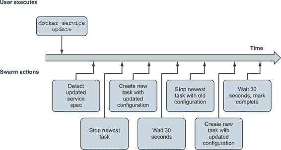
> 
> 考虑以下命令来更新本章早期创建的 `hello-world` 服务：
> 
> > `docker service update \    --image dockerinaction/ch11_service_hw:v2 \    --update-order stop-first \    --update-parallelism 1 \    --update-delay 30s \    hello-world`

+   1 新的镜像

+   2 需要更新的服务的名称

> 此命令告诉 Docker 将`hello-world`服务更改为使用标记为`v2`的镜像。它进一步限定了部署特性：一次只更新一个副本；在更新每个副本批次之间等待 30 秒；在启动替换之前停止每个副本。当你执行此命令时，Docker 将报告每个副本的部署进度以及整体变化。如果一切顺利，它将以声明`Service converged`结束。这是一种特别机械的方式告诉用户命令已成功执行。收敛是一个技术术语，表示服务的当前状态与命令中描述的期望状态相同。
> 
> 更新服务后，你应该能够在浏览器中重新加载应用程序，并看到它已被签名`--ServiceV2`。这不是一个特别有趣的例子，因为一切都很顺利。在现实世界中事情并不这么简单。我们使用并行性来平衡更新服务所需的时间，同时保护用户免受失败转换的影响。我们在更新批次之间引入延迟，以便在启动之前让新的服务实例变得稳定（并确保底层平台保持稳定）。实际上，30 秒可能并不足够。这取决于应用程序。
> 
> Docker 及其 Swarm 组件对应用程序是中立的。它们永远无法预测可能部署的所有应用程序的行为以及它们在运行时可能如何失败。相反，Docker 命令行和 API 为用户提供指定发现问题和验证成功的方法，以及管理失败部署的行为。
> 
> 11.1.3. 服务健康和回滚
> 
> 与编排器的成功合作意味着明确沟通你要求其编排的工作负载的预期需求和行为。尽管 Docker 可以确信停止的容器是不健康的，但并没有一个普遍和准确的关于服务健康状态的定义。这限制了任何编排器对服务健康状态和部署成功或失败所做的安全假设。除非你是经验丰富的服务所有者，否则确定工作负载的健康状态或启动行为预期可能比你想象的要复杂。
> 
> 在深入细节之前，从一个简单的例子开始。在最明显的服务健康问题案例中，新的容器可能无法启动：
> 
> > `docker service update \ --image dockerinaction/ch11_service_hw:start-failure \ hello-world`
> > 
> 当你执行此命令时，Docker 将在`hello-world`服务上启动部署。与其他不同，这次更改将失败。默认情况下，Docker 将在第一个副本启动失败后暂停部署。命令将退出，但它将继续尝试启动该容器。如果你运行`docker service ps hello-world`，你会看到有两个副本仍然在旧版本的服务上，而另一个副本则持续在启动和失败状态之间循环。
> 
> 在这种情况下，部署无法进行。新版本将永远不会启动。因此，服务将处于减容状态，需要人工干预才能修复。通过在`update`命令中使用`--rollback`标志来修复立即问题：
> 
> > `docker service update \    --rollback \    hello-world`
> > 
> 此命令将要求 Docker 将当前状态与之前期望的状态进行协调。Docker 将确定它只需要更改三个副本中的一个（未能启动的那个）。它知道服务目前处于暂停部署状态，并且只有一个副本已过渡到当前期望状态。其他副本将继续运行。
> 
> 知道回滚对于此服务是合适的（没有不兼容的应用状态变化的风险），你可以在部署失败时自动化回滚。使用`--update-failure-action`标志告诉 Swarm 失败的部署应该回滚。但你也应该明确告诉 Swarm 哪些条件应被视为失败。
> 
> 假设你正在运行 100 个副本的服务，并且这些副本将在一个大型机器集群上运行。有可能某些条件会阻止副本正确启动。在这种情况下，只要关键阈值内的副本处于运行状态，就继续部署可能是合适的。在接下来的部署中，告诉 Swarm 在舰队中三分之一处于运行状态的情况下容忍启动失败，以示说明。你将使用`--update-max-failure-ratio`标志并指定 0.6：
> 
> > `docker service update \    --update-failure-action rollback \    --update-max-failure-ratio 0.6 \    --image dockerinaction/ch11_service_hw:start-failure \    hello-world`
> > 
> 当你运行此示例时，你会看到 Docker 尝试逐个部署更新的副本。第一个副本会在延迟过期之前重试几次，然后下一个副本部署开始。第二个副本失败后，整个部署将被标记为失败，并启动回滚。输出将类似于以下内容：
> 
> > `hello-world 整体进度：回滚更新：3 个任务中的 2 个 1/3：运行 [>                  ] 2/3：启动 [=====>             ] 3/3：运行 [>                  ] 回滚：由于失败或任务 tdpv6fud16e4nbg3tx2jpikah 的提前终止，更新已回滚：服务回滚：回滚完成`
> > 
> 命令执行完毕后，服务将处于更新前的相同状态。你可以通过运行`docker service ps hello-world`来验证这一点。请注意，有一个副本未受影响，而其他两个副本启动得较晚，并且几乎同时。此时，所有副本都将从`dockerinaction/ch11_service_hw:v2`镜像运行。
> 
> 正如我们之前提到的，运行并不等同于服务健康。程序可能以多种方式运行，但并不总是正确。像其他编排器一样，Docker 将健康状态与进程状态分开建模，并提供了一些配置点来指定如何确定服务健康状态。
> 
> Docker 对应用程序是中立的。它不假设如何确定特定任务是否健康，而是允许你指定一个健康检查命令。该命令将在每个服务副本的容器内执行。Docker 将在任务容器内按照指定的计划定期执行该命令。这就像发出一个`docker exec`命令一样。健康检查和相关参数可以在创建服务时指定，也可以在服务更新时更改或设置，甚至可以通过使用`HEALTHCHECK` Dockerfile 指令将其指定为镜像元数据。
> 
> 每个服务副本容器（任务）将继承服务的健康和健康检查配置定义。当你想手动检查 Docker 中特定任务的健康状态时，你需要检查容器，而不是服务本身。你一直使用的服务的 v1 和 v2 版本都在镜像中指定了健康检查。这些镜像包含一个名为`httpping`的小型自定义程序。它验证服务在本地主机上是否响应，并且对/的请求导致 HTTP 200 响应代码。Dockerfile 包含以下指令：
> 
> > `HEALTHCHECK --interval=10s CMD ["/bin/httpping"]`
> > 
> 运行`docker container ps`可以看到每个`hello-world`副本在状态列中被标记为健康。你可以通过检查镜像或容器来进一步检查配置。
> 
> 在包含服务软件的镜像中包含一些默认的健康检查配置是一个好主意，但并非总是可用。考虑`dockerinaction/ch11 _service_hw:no-health`这个镜像。这个镜像本质上与 v1 和 v2 镜像相同，但它不包含任何健康检查元数据。现在更新`hello-world`服务以使用这个版本：
> 
> > `docker service update \ --update-failure-action rollback \ --image dockerinaction/ch11_service_hw:no-health \ hello-world`
> > 
> 部署这个版本后，你应该能够再次运行`docker container ps`并看到容器不再被标记为`healthy`。没有健康检查元数据，Docker 无法确定服务是否健康。它只知道软件是否正在运行。接下来，更新服务以从命令行添加健康检查元数据：
> 
> > `docker service update \   
> > 
> 健康监控需要持续评估。这里指定的间隔告诉 Docker 多久检查一次每个服务实例的健康状况。当你运行这个命令时，你可以验证服务副本再次被标记为健康。
> 
> 今天你还可以告诉 Docker 在报告不健康状态之前，健康检查应该重试多少次，启动延迟以及运行健康检查命令的超时时间。这些参数有助于调整行为以适应大多数情况。有时，服务默认或当前的健康检查不适合你的使用方式。在这些情况下，你可以使用`--no-healthcheck`标志创建或更新一个禁用健康检查的服务。
> 
> 在部署过程中，一个新的容器可能无法启动。或者它可能启动了，但并不完全正确（不健康）。但你是如何定义服务健康的呢？时间问题可能会模糊这些定义。你应该等待多长时间才能让实例变得健康？一些但不是所有的服务副本可能会失败或处于不健康状态。你的服务可以容忍多少或多少比例的副本部署失败？一旦你能回答这些问题，你就可以告诉 Docker 那些阈值，并调整从你的应用程序到编排器的健康信号。在此期间，你可以自由地删除`hello-world`服务：
> 
> > `docker service rm hello-world`
> > 
> 当你在命令行管理服务时，设置所有这些参数会变得一团糟。当你管理多个服务时，情况可能会变得更糟。在下一节中，你将学习如何使用 Docker 提供的声明性工具，使事情变得更加易于管理。
> 
> 11.2. 使用 COMPOSE V3 的声明式服务环境
> 
> 到目前为止，你一直在使用 Docker 命令行单独创建、更改、删除或与容器、镜像、网络和卷交互。我们说这样的系统遵循命令式模式。命令式风格的工具执行用户发出的命令。这些命令可能检索特定信息或描述特定更改。编程语言和命令行工具遵循命令式模式。
> 
> 命令式工具的好处是它们使用户能够使用原始命令来描述更复杂的工作流程和系统。但命令必须严格按照精确的顺序执行，以确保它们对工作状态有独占控制。如果另一个用户或进程同时更改系统的状态，这两个用户可能会做出无法检测到的冲突更改。
> 
> 命令式系统有几个问题。用户必须仔细规划和排序所有必要的命令以实现目标，这对用户来说是一项负担。这些计划通常很难审计或测试。在部署之前，时间或共享状态问题难以发现和测试。而且，正如大多数程序员会告诉你的，即使是微小的或无害的错误也可能彻底改变结果。
> 
> 想象一下，你负责构建和维护一个包含 10、100 或 1000 个逻辑服务的系统，每个服务都有自己的状态、网络连接和资源需求。现在想象一下，你正在使用原始容器来管理这些服务的副本。与 Docker 服务相比，管理原始容器将困难得多。
> 
> Docker 服务是声明式抽象，如图 11.6 所示。图 11.6。当我们创建一个服务时，我们声明我们想要该服务的特定数量的副本，Docker 负责维护它们的单个命令。声明式工具使用户能够描述系统的新的状态，而不是描述从当前状态到新状态的步骤。
> 
> 图 11.6. 声明式处理循环
> 
> 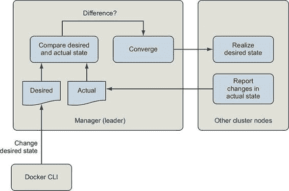
> 
> Swarm 编排系统是一个状态协调循环，它持续比较用户期望的系统声明状态与系统的当前状态。当它检测到差异时，它使用一组简单的规则来改变系统，使其与期望状态相匹配。
> 
> 声明式工具解决了命令式模式的问题。声明式接口通过限制系统操作的方式简化了系统。这使得声明性策略可以通过一个或几个经过良好测试的引擎实现，这些引擎可以将系统收敛到声明状态。它们更容易编写、审计和理解。声明性语句或文档与版本控制系统完美搭配，因为它们允许我们有效地版本控制所描述的系统状态。
> 
> 命令式和声明式工具并不相互竞争。你几乎永远不会单独使用其中之一。例如，当我们创建或更新 Docker 服务时，我们正在使用命令式工具来描述对系统的更改。发出`docker service create`命令是命令式的，但它创建了一个声明式抽象。它汇总了创建和删除容器、评估健康状态、拉取镜像、管理服务发现和网络路由等一系列低级管理命令。
> 
> 随着你构建更复杂的系统，包括服务、卷、网络和配置，你需要达到目标所需的命令行数量将变成一个新的负担。当这种情况发生时，是时候采用更高层次的声明性抽象了。在这种情况下，这个抽象是一个栈或完整的环境，正如 Docker Compose 所描述的那样。
> 
> 当你需要模拟整个服务环境时，你应该使用 Docker 栈。栈描述了服务、卷、网络和其他配置抽象的集合。`docker`命令行提供了部署、删除和检查栈的命令行指令。栈是从整个环境的声明性描述中创建的。这些环境使用 Docker Compose V3 文件格式进行描述。一个描述了之前提到的`hello-world`服务的环境的 Compose 文件可能看起来像以下这样：
> 
> > `version: "3.7" services:   hello-world:     image: dockerinaction/ch11_service_hw:v1     ports:         - 8080:80     deploy:         replicas: 3`
> > 
> Compose 文件使用另一种标记语言（YAML）。并非每个人都熟悉 YAML，这可能会成为采用这一代基础设施和工作负载管理工具中的一些工具的障碍。好消息是，人们很少使用 YAML 的特异功能。大多数人坚持使用基础功能。
> 
> 本章不是对 Compose 或你将用于管理服务的属性的全面调查。官方 Docker 文档应该起到这个作用。你可以在 Compose 中找到每个命令行功能的镜像。下一节是 YAML 和 Compose 文件的简要入门。
> 
> 11.2.1. YAML 入门
> 
> YAML 用于描述结构化文档，这些文档由结构、列表、映射和标量值组成。这些功能定义为连续的块，其中子结构通过嵌套的块定义以大多数高级语言程序员熟悉的方式定义。
> 
> YAML 文档的默认作用域是一个单独的文件或流。YAML 提供了一种机制来指定同一文件中的多个文档，但 Docker 将只使用它在 Compose 文件中遇到的第一个文档。Compose 文件的标准文件名是 docker-compose.yml。
> 
> 注释支持是今天选择 YAML 而不是 JSON 的最受欢迎的原因之一。YAML 文档可以在任何行的末尾包含注释。注释由一个空格后跟一个井号（`#`）标记。解析器会忽略直到行尾的任何字符。元素之间的空行对文档结构没有影响。
> 
> YAML 使用三种类型的数据和两种描述数据的方式，即块和流。流集合的指定方式与 JavaScript 和其他语言中的集合字面量类似。例如，以下是一个流风格中的字符串列表：
> 
> > `["PersonA","PersonB"]`
> > 
> 块样式更为常见，除了特别说明外，本指南将使用块样式。三种数据类型是映射、列表和标量值。
> 
> 映射由一组唯一的属性定义，这些属性以冒号和空格（`:` ）分隔的键/值对形式存在。而属性名必须是字符串值，属性值可以是 YAML 数据类型中的任何一种，但不能是文档。单个结构不能为同一属性有多个定义。考虑以下块样式示例：
> 
> > `image: "alpine" command: echo hello world`
> > 
> 此文档包含一个具有两个属性的单个映射：`image` 和 `command`。`image` 属性有一个标量字符串值，`"alpine"`。`command` 属性有一个标量字符串值，`echo hello world`。标量是一个单一值。前面的示例演示了三种流标量样式中的两种。
> 
> 前面的示例中 `image` 的值以双引号样式指定，这种样式能够通过使用 `\` 转义序列表达任意字符串。大多数程序员都熟悉这种字符串样式。
> 
> 命令的值以纯样式编写。纯样式（未引用）没有标识符，也不提供任何形式的转义。因此，它是最易读的、最有限的和最上下文相关的样式。对于纯样式标量使用了一组规则。纯样式标量

+   必须不为空

+   必须不包含前导或尾随空白字符

+   不应在会造成歧义的地方以指示字符（例如，`-` 或 `:`）开头

+   必须不得包含使用冒号（`:`）和井号（`#`）的字符组合

> 列表（或块序列）是一系列节点，每个元素由一个前导连字符（`-`）指示。例如：
> 
> > `- item 1 - item 2 - item 3 - # 一个空项 - item 4`
> > 
> 最后，YAML 使用缩进来表示内容作用域。作用域决定了每个元素属于哪个块。有一些规则：

+   只能使用空格进行缩进。

+   缩进量不重要，只要

    +   所有同级元素（在同一作用域内）必须有相同的缩进量。

    +   任何子元素都进一步缩进。

> 这些文档是等效的：
> 
> > `top-level:   second-level:          # 三空格   third-level:         # 再多两个空格   - "list item"       # 此列表项额外缩进一个空格   another-third-level: # 与相同两个空格的第三级同级   fourth-level: "string scalar" # 再多六个空格   another-second-level:   # 有三个空格的二级同级   - a list item   - a peer item # 此范围内的列表项有   # 15 个总前导空格   - a peer item # 列表中有空格的同级列表项 --- # 每个作用域级别增加正好一个空格   top-level: second-level:   third-level:   - "list item"   another-third-level:   fourth-level: "string scalar"   another-second-level:   - a list item   - a peer item`
> > 
> YAML 1.2 的完整规范可在 [`yaml.org/spec/1.2/2009-07-21/spec.html`](http://yaml.org/spec/1.2/2009-07-21/spec.html) 找到，并且相当易于阅读。掌握了 YAML 的基本理解，你就可以开始使用 Compose 进行基本的环境建模了。
> 
> 11.2.2\. 使用 Compose V3 的服务集合
> 
> Compose 文件描述了每个 Docker 一级资源类型：服务、卷、网络、机密和配置。考虑一个包含三个服务的集合：一个 PostgreSQL 数据库、一个 MariaDB 数据库以及用于管理这些数据库的 Web 管理界面。你可能可以用以下 Compose 文件来表示这些服务：
> 
> > `version: "3.7" services:   postgres:     image: dockerinaction/postgres:11-alpine     environment:       POSTGRES_PASSWORD: example   mariadb:     image: dockerinaction/mariadb:10-bionic     environment:       MYSQL_ROOT_PASSWORD: example   adminer:     image: dockerinaction/adminer:4     ports:       - 8080:8080`
> > 
> 请记住，这份文档是 YAML 格式的，所有具有相同缩进的属性都属于同一个映射。这个 Compose 文件有两个顶级属性：`version` 和 `services`。`version` 属性告诉 Compose 解释器预期哪些字段和结构。`services` 属性是一个服务名称到服务定义的映射。每个服务定义都是一个属性映射。
> 
> 在这种情况下，`services` 映射有三个条目，键为：`postgres`、`mariadb` 和 `adminer`。每个条目都通过使用一组小的服务属性（如 `image`、`environment` 或 `ports`）定义了一个服务。声明性文档使得具体指定完整的服务定义变得简单。这样做将减少对默认值的隐式依赖，并减少对团队成员的教育负担。省略属性将使用默认值（就像使用命令行界面一样）。这些服务各自定义了容器的 `image`。`postgres` 和 `mariadb` 服务指定了 `environment` 变量。`adminer` 服务使用 `ports` 将请求路由到主机上的端口 8080，到服务容器中的端口 8080。
> 
> 创建和更新堆栈
> 
> 现在请使用这个 Compose 文件创建一个堆栈。记住，Docker 堆栈是一组命名服务、卷、网络、机密和配置的集合。`docker stack` 子命令管理堆栈。在一个空目录中创建一个名为 databases.yml 的新文件。编辑该文件并添加前面的 Compose 文件内容。通过以下命令创建一个新的堆栈并部署其描述的服务：
> 
> > `docker stack deploy -c databases.yml my-databases`
> > 
> 当你运行这个命令时，Docker 将显示如下输出：
> 
> > `Creating network my-databases_default Creating service my-databases_postgres Creating service my-databases_mariadb Creating service my-databases_adminer`
> > 
> 到此为止，您可以通过使用浏览器导航到 http://localhost:8080 来测试服务。服务在其 Docker 网络中的名称是可发现的。当您使用 `adminer` 接口连接到您的 `postgres` 和 `mariadb` 服务时，请记住这一点。`docker stack deploy` 子命令用于创建和更新栈。它始终需要表示栈所需状态的 Compose 文件。每当您使用的 Compose 文件与当前栈中使用的定义不同时，Docker 将确定这两个定义之间的差异，并做出相应的更改。
> 
> 您可以亲自尝试。告诉 Docker 创建 `adminer` 服务的三个副本。在 `adminer` 服务的 `deploy` 属性下指定 `replicas` 属性。您的 databases.yml 文件应该看起来像这样：
> 
> > `version: "3.7" services:   postgres:     image: dockerinaction/postgres:11-alpine     environment:         POSTGRES_PASSWORD: example   mariadb:     image: dockerinaction/mariadb:10-bionic     environment:         MYSQL_ROOT_PASSWORD: example   adminer:     image: dockerinaction/adminer:4     ports:         - 8080:8080     deploy:         replicas: 3`
> > 
> 在您更新了 Compose 文件之后，请重复之前的 `docker stack deploy` 命令：
> 
> > `docker stack deploy -c databases.yml my-databases`
> > 
> 这次，命令将显示一条消息，指出服务正在更新，而不是创建：
> 
> > `Updating service my-databases_mariadb (id: lpvun5ncnleb6mhqj8bbphsf6) Updating service my-databases_adminer (id: i2gatqudz9pdsaoux7auaiicm) Updating service my-databases_postgres (id: eejvkaqgbbl35glatt977m65a)`
> > 
> 消息似乎表明所有服务都在被更改。但实际上并非如此。您可以使用 `docker stack ps` 列出所有任务及其年龄：
> 
> > `docker stack ps   --format '{{.Name}}\t{{.CurrentState}}'   my-databases` `1`

+   1 指定要列出的栈

> 此命令应筛选出有趣的列并报告如下：
> 
> > `my-databases_mariadb.1  Running 3 minutes ago my-databases_postgres.1  Running 3 minutes ago my-databases_adminer.1  Running 3 minutes ago  my-databases_adminer.2  Running about a minute ago my-databases_adminer.3  Running about a minute ago`
> > 
> 此视图暗示在新部署过程中没有触及到任何原始服务容器。唯一的新任务是那些根据当前版本的 databases.yml 文件描述的系统状态所需的 `adminer` 服务的额外副本。您应该注意，当多个副本运行时，`adminer` 服务实际上并不工作得很好。我们在这里仅使用它进行说明。
> 
> 缩小规模和删除服务
> 
> 当你使用 Docker 和 Compose 时，在重新部署或进行更改时，你永远不需要拆解或以其他方式移除整个堆栈。让 Docker 来处理并为你处理更改。当你处理如 `Compose: deletion` 这样的声明性表示时，只有一个情况比较难以处理。
> 
> 当你缩小服务规模时，Docker 会自动删除服务副本。它总是选择编号最高的副本进行删除。例如，如果你有 `adminer` 服务的三个副本正在运行，它们将被命名为 `my-databases_adminer.1`、`my-databases_adminer.2` 和 `my-databases_adminer.3`。如果你将规模缩小到两个副本，Docker 将删除名为 `my-databases_adminer.3` 的副本。当你尝试删除整个服务时，事情会变得奇怪。
> 
> 编辑 databases.yml 文件以删除 `mariadb` 服务定义并将 `adminer` 服务设置为两个副本。文件应如下所示：
> 
> > `version: "3.7" services:   postgres:     image: dockerinaction/postgres:11-alpine     environment:       POSTGRES_PASSWORD: example   adminer:     image: dockerinaction/adminer:4     ports:       - 8080:8080     deploy:       replicas: 2`
> > 
> 现在当你运行 `docker stack deploy -c databases.yml my-databases` 命令时，该命令将生成如下输出：
> 
> > `Updating service my-databases_postgres (id: lpvun5ncnleb6mhqj8bbphsf6) Updating service my-databases_adminer  (id: i2gatqudz9pdsaoux7auaiicm)`
> > 
> 你提供给 `stack deploy` 命令的 Compose 文件没有对 `mariadb` 服务进行任何引用，因此 Docker 没有对该服务进行任何更改。当你再次列出堆栈中的任务时，你会注意到 `mariadb` 服务仍在运行：
> 
> > `docker stack ps \   --format '{{.Name}}\t{{.CurrentState}}' \   my-databases` `1`

+   1 指定要列出哪个堆栈

> 执行此命令将产生以下输出：
> 
> > `my-databases_mariadb.1  Running 7 minutes ago my-databases_postgres.1 Running 7 minutes ago my-databases_adminer.1  Running 7 minutes ago my-databases_adminer.2  Running 5 minutes ago`
> > 
> 你可以看到 `adminer` 服务的第三个副本已被移除，但 `mariadb` 服务仍在运行。这正如预期的那样。可以使用多个 Compose 文件创建和管理 Docker 堆栈。但这样做会创建多个错误机会，并且不推荐这样做。删除服务或其他对象有两种方式。
> 
> 你可以使用 `docker service remove` 手动删除一个服务。这可以工作，但不会获得与声明性表示一起工作的任何好处。如果此更改是手动进行的，并且没有反映在你的 Compose 文件中，则下一次 `docker stack deploy` 操作将再次创建该服务。在堆栈中删除服务的最干净的方法是从你的 Compose 文件中删除服务定义，然后使用 `--prune` 标志执行 `docker stack deploy`。在不进一步更改你的 databases.yml 文件的情况下，运行以下命令：
> 
> > `docker stack deploy \   -c databases.yml \   --prune \   my-databases`
> > 
> 此命令将报告由 databases.yml 描述的服务已更新，但也会报告 `my-databases_mariadb` 已被删除。当您再次列出任务时，您将看到这种情况：
> 
> > `my-databases_postgres.1 运行 8 分钟前 my-databases_adminer.1  运行 8 分钟前 my-databases_adminer.2  运行 6 分钟前`
> > 
> `--prune` 标志将清理堆栈中任何在用于部署操作的 Compose 文件中未明确引用的资源。因此，保留一个代表整个环境的 Compose 文件非常重要。否则，您可能会意外删除不存在的服务或卷、网络、机密和配置。
> 
> 11.3. 状态化服务与数据保留
> 
> 您一直在使用的 Docker 网络包括一个数据库服务。在 第四章 中，您学习了如何使用卷将容器的生命周期与其使用的数据的生命周期分开。这对于数据库来说尤为重要。如前所述，每次容器被替换（无论出于何种原因）时，堆栈将为 `postgres` 服务创建一个新的卷，并为每个副本创建一个新的卷。这将在实际系统中引起问题，因为存储的数据是服务身份的重要组成部分。
> 
> 解决这个问题的最佳方式是通过在 Compose 中建模卷。Compose 文件使用另一个顶级属性名为 `volumes`。与 `services` 类似，`volumes` 是一个卷定义的映射；键是卷的名称，值是定义卷属性的结构的值。您不需要为每个卷属性指定值。Docker 将使用默认值来处理省略的属性值。顶级属性定义了文件内服务可以使用的卷。在服务中使用卷需要您指定需要它的服务的依赖关系。
> 
> Compose 服务定义可以包括一个 `volumes` 属性。该属性是短或长卷规范的列表。它们分别对应于 Docker 命令行支持的卷和挂载语法。我们将使用长格式来增强 databases.yml 并添加一个用于存储 `postgres` 数据的卷：
> 
> > `version: "3.7" volumes:     pgdata: # 空定义使用卷默认值 services:     postgres:         image: dockerinaction/postgres:11-alpine         volumes:             - type: volume               source: pgdata # 上面的命名卷               target: /var/lib/postgresql/data         environment:             POSTGRES_PASSWORD: example     adminer:         image: dockerinaction/adminer:4         ports:             - 8080:8080         deploy:             replicas: 1 # 缩小到 1 个副本以便测试`
> > 
> 在这个例子中，该文件定义了一个名为`pgdata`的卷，`postgres`服务将此卷挂载到`/var/lib/postgresql/data`。该位置是 PostgreSQL 软件将存储任何数据库模式或数据的地方。部署栈并检查结果：
> 
> > `docker stack deploy \ -c databases.yml \ --prune \ my-databases`
> > 
> 在应用更改后运行`docker volume ls`以验证操作是否成功：
> 
> > `DRIVER        VOLUME NAME local         my-databases_pgdata`
> > 
> 栈的名称作为任何为其创建的资源的前缀，例如服务或卷。在这种情况下，Docker 使用前缀`my-databases`创建了名为`pgdata`的卷。你可以花时间检查服务配置或容器，但进行功能测试更有趣。
> 
> 打开 http://localhost:8080，并使用`adminer`界面管理`postgres`数据库。选择`postgresql`驱动程序，使用`postgres`作为主机名，`postgres`作为用户名，`example`作为密码。登录后，创建一些表或插入一些数据。完成后，删除`postgres`服务：
> 
> > `docker service remove my-databases_postgres`
> > 
> 然后使用 Compose 文件恢复服务：
> 
> > `docker stack deploy \ -c databases.yml \ --prune \ my-databases`
> > 
> 因为数据存储在卷中，Docker 能够将新的数据库副本附加到原始的`pg-data`卷上。如果数据没有存储在卷中，而只存在于原始副本中，那么在服务被移除时，数据就会丢失。再次通过`adminer`界面登录数据库（记住用户名是`postgres`，密码是`example`，如 Compose 文件中指定）。检查数据库并查找你做出的更改。如果你正确地遵循了这些步骤，那些更改和数据将会可用。
> 
> 这个例子使用了两个级别的命名间接，使得它有点难以理解。你的浏览器指向 localhost，加载`adminer`服务，但你告诉`adminer`通过`postgres`主机名访问数据库。下一节将解释这种间接性，并描述内置的 Docker 网络增强功能以及如何与服务一起使用它们。
> 
> 11.4. 使用 COMPOSE 进行负载均衡、服务发现和网络
> 
> 在通过网页浏览器访问`adminer`界面时，你正在访问`adminer`服务上发布的端口。服务的端口发布与在容器上发布端口不同。容器直接将主机接口上的端口映射到特定容器的接口，而服务可能由许多副本容器组成。
> 
> 容器网络 DNS 面临类似的挑战。当你解析具有名称的容器的网络地址时，你会得到该容器的地址。但服务可能有副本。
> 
> Docker 通过创建虚拟 IP（VIP）地址并在所有相关副本之间平衡特定服务的请求来适应服务。当连接到 Docker 网络的应用程序查找连接到该网络的另一个服务的名称时，Docker 的内置 DNS 解析器将响应该服务在网络上的虚拟 IP。说明了服务名称和 IP 解析的逻辑流程。
> 
> 图 11.7\. Docker 网络拓扑，服务虚拟 IP 地址和负载均衡
> 
> 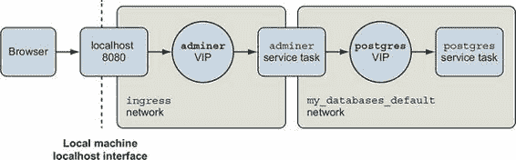
> 
> 同样，当请求进入主机接口以发布端口或来自内部服务时，它将被路由到目标服务的虚拟 IP 地址。从那里，它被转发到服务副本之一。这意味着还有更多关于 Docker 网络的知识需要理解。当你使用服务时，你至少在使用两个 Docker 网络。
> 
> 第一个网络命名为`ingress`，处理从主机接口到服务的所有端口转发。当你以集群模式初始化 Docker 时，它会创建这个网络。在这个堆栈中，只有一个服务具有转发端口，即`adminer`。检查`ingress`网络时，你可以清楚地看到相关的接口：
> 
> > `"容器": { "6f64f8aec8c2...": { "名称": "my-databases_adminer.1.leijm5mpoz8o3lf4yxd7khnqn", "端点 ID": "9401eca40941...", "MAC 地址": "02:42:0a:ff:00:22", "IPv4 地址": "10.255.0.34/16", "IPv6 地址": "" }, "ingress-sbox": { "名称": "ingress-endpoint", "端点 ID": "36c9b1b2d807...", "MAC 地址": "02:42:0a:ff:00:02", "IPv4 地址": "10.255.0.2/16", "IPv6 地址": "" } }`
> > 
> 每个使用端口转发的服务都将在这个网络中有一个接口；`ingress`对于 Docker 服务功能至关重要。
> 
> 第二个网络在堆栈中的所有服务之间共享。你用来创建`my-databases`堆栈的 Compose 文件没有定义任何网络，但如果你在初始部署期间仔细观察，你会看到 Docker 会为你的堆栈创建一个名为`default`的网络。默认情况下，堆栈中的所有服务都将连接到这个网络，并且所有服务之间的通信将通过这个网络进行。当你检查这个网络时，你会看到如下三个条目：
> 
> > `"Containers": {   
> > 
> 顶部两个接口由运行 `postgres` 和 `adminer` 服务的单个容器使用。如果您将 `postgres` 服务名称解析为 IP 地址，您可能会期望得到 10.0.5.14 的地址。但您会得到这里未列出的其他地址。这里列出的地址是容器地址，或内部负载均衡器将请求转发到的地址。您会得到的地址在 `postgres` 服务规范中的端点下列出。当您运行 `docker service inspect my-databases_postgres` 时，部分结果将类似于以下内容：
> 
> > `"Endpoint": {   
> > 
> 那个虚拟 IP 地址由 Docker 内部负载均衡器处理。连接到该地址的连接将被转发到 `postgres` 服务的一个副本。
> 
> 您可以使用 Compose 更改服务网络连接或 Docker 为堆栈创建的网络。Compose 可以创建具有特定名称、类型、驱动程序选项或其他属性的网络。与网络一起工作类似于卷。它分为两部分：一个包含网络定义的顶级 `networks` 属性，以及服务的 `networks` 属性，其中您描述连接。考虑以下最终示例：
> 
> > `version: "3.7" networks:   
> > 
> 此示例将 `my-databases_default` 网络替换为名为 `foo` 的网络。这两个配置在功能上是等效的。
> 
> 有几种场合可以使用 Compose 来建模网络。例如，如果你管理多个堆栈并且想在共享网络上进行通信，你将声明该网络，如前所述，但不是指定驱动程序，而是使用`external: true`属性和网络名称。或者假设你有多个相关的服务组，但这些服务应该独立运行。你将在顶级定义网络，并使用不同的网络附加来隔离这些组。
> 
> 摘要
> 
> 本章介绍了更高层次的 Docker 抽象以及使用 Docker 声明性工具，以及使用 Compose 来建模多服务应用程序的期望状态。Compose 和声明性工具减轻了与命令行管理容器相关的许多繁琐工作。本章涵盖了以下内容：

+   任何必须通过网络可发现和可用的过程、功能或数据都是一项服务。

+   管理器如 Swarm 跟踪并自动协调用户提供的期望状态和 Docker 对象（包括服务、卷和网络）的当前状态。

+   管理器自动化服务的复制、恢复、部署、健康检查和回滚。

+   期望状态是用户希望系统执行的操作，或者它应该执行的操作。人们可以通过使用 Compose 文件以声明性方式描述期望状态。

+   Compose 文件是有结构的文档，以 YAML 表示。

+   使用 Compose 的声明性环境描述可以启用环境版本控制、共享、迭代和一致性。

+   Compose 可以建模服务、卷和网络。有关其功能的完整描述，请参阅官方的 Compose 文件参考材料。

> 第十二章\. 首要级的配置抽象
> 
> 本章涵盖了

+   配置和秘密解决的问题及其形式

+   建模和解决 Docker 服务的配置问题

+   将秘密传递给应用程序的挑战

+   建模和将秘密传递给 Docker 服务

+   在 Docker 服务中使用配置和秘密的方法

> 应用程序通常在多个环境中运行，必须适应这些环境中的不同条件。你可以在本地运行应用程序，在集成有协作应用程序和数据源的开发环境中进行测试，最后在生产环境中运行。也许你会为每个客户部署一个应用程序实例，以便隔离或专门化每个客户的体验。每个部署的适应性和专业化通常通过配置来表示。配置是应用程序解释的数据，以适应其行为以支持用例。
> 
> 配置数据的常见示例包括以下内容：

+   可启用或禁用的功能

+   应用程序所依赖的服务位置

+   内部应用资源及活动的限制，例如数据库连接池大小和连接超时时间

> 本章将向您展示如何使用 Docker 的配置和秘密资源来根据不同的部署需求调整 Docker 服务部署。Docker 将使用一等资源来建模配置和秘密，以根据部署到的环境部署具有不同行为和功能的服务。您将看到命名配置资源的简单方法是有问题的，并了解解决该问题的模式。最后，您将学习如何使用 Docker 服务安全地管理和使用秘密。有了这些知识，您将部署一个示例 Web 应用程序，该应用程序使用 HTTPS 监听器，并使用管理的 TLS 证书。
> 
> 12.1\. 配置分布与管理
> 
> 大多数应用程序作者不希望每次需要更改应用程序的行为时都修改程序源代码并重新构建应用程序。相反，他们编写应用程序以在启动时读取配置数据，并在运行时相应地调整其行为。
> 
> 在开始时，可能可以通过命令行标志或环境变量来表示这种变化。随着程序配置需求的增长，许多实现转向基于文件解决方案。这些配置文件可以帮助你表达更多的配置和更复杂的结构。应用程序可能从 ini、属性、JSON、YAML、TOML 或其他格式的文件中读取其配置。应用程序也可能从网络上的某个配置服务器读取配置。许多应用程序使用多种策略来读取配置。例如，一个应用程序可能首先读取一个文件，然后将某些环境变量的值合并到一个组合配置中。
> 
> 配置应用程序是一个长期存在的问题，有许多解决方案。Docker 直接支持这些应用程序配置模式中的几个。在我们讨论这一点之前，我们将探讨配置更改生命周期如何适应应用程序的更改生命周期。配置控制着广泛的程序行为，因此可能因许多原因而更改，如图 12.1 所示。
> 
> 图 12.1\. 应用程序更改的时间线
> 
> 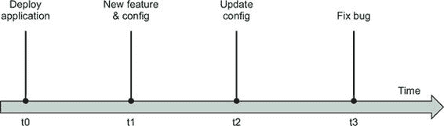
> 
> 让我们考察一些驱动配置变更的事件。配置可能会随着应用程序的增强而改变。例如，当开发者添加一个功能时，他们可能会使用功能标志来控制对该功能的访问。应用程序部署可能需要更新以响应应用程序范围之外的变化。例如，为服务依赖项配置的主机名可能需要从 `cluster-blue` 更新到 `cluster-green`。当然，应用程序可能在不更改配置的情况下更改代码。这些变更可能由应用程序内部或外部的原因引起。无论变更的原因是什么，应用程序的交付流程都必须安全地合并和部署这些变更。
> 
> Docker 服务在很大程度上依赖于配置资源，就像它依赖于包含应用程序的 Docker 镜像一样，如图 12.2 所示。如果缺少配置或密钥，应用程序可能无法启动或正常工作。此外，一旦应用程序表达了对配置资源的依赖，该依赖的存在必须是稳定的。如果应用程序依赖的配置在应用程序重启时消失，应用程序可能会崩溃或以意外的方式表现。如果配置内部的值意外更改，应用程序也可能崩溃。例如，更改配置文件内的条目名称或删除条目将破坏不知道如何读取该格式的应用程序。因此，配置的生命周期必须采用一种方案，以保留现有部署的向后兼容性。
> 
> 图 12.2. 应用程序依赖于配置。
> 
> 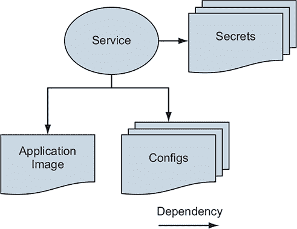
> 
> 如果你将软件和配置的变更分开到不同的管道中，这些管道之间将存在紧张关系。应用程序交付管道通常以应用程序为中心进行建模，假设所有变更都将通过应用程序的源代码库运行。由于配置可能会因与应用程序无关的原因而改变，并且应用程序通常不是为处理配置模型中破坏向后兼容性的变更而构建的，因此我们需要对配置变更进行建模、集成和排序，以避免破坏应用程序。在下一节中，我们将从应用程序中分离配置以解决部署变化问题。然后，在部署时我们将正确配置与服务关联。
> 
> 12.2. 分离应用程序和配置
> 
> 让我们解决一个需要调整部署到多个环境中的 Docker 服务配置的问题。我们的示例应用程序是一个 `greetings` 服务，它用不同的语言说“Hello World！”。这个服务的开发者希望当用户请求时，服务能够返回一个问候语。当母语者验证问候语的翻译准确无误时，它会被添加到 config.common.yml 文件中的问候语列表中：
> 
> > `greetings:   - 'Hello World!'   - 'Hola Mundo!'   - 'Hallo Welt!'`
> > 
> 应用程序镜像构建使用 Dockerfile 中的`COPY`指令，将此通用配置资源填充到`greetings`应用程序镜像中。这是合适的，因为该文件在部署时没有变化或敏感数据。
> 
> 服务还支持加载环境特定的问候语，除了标准问候语。这允许开发团队在每个三个环境中（dev、stage 和 prod）更改和测试显示的问候语。环境特定的问候语将配置在以环境命名的文件中；例如，config.dev.yml:
> 
> > `# config.dev.yml greetings:   - 'Orbis Terrarum salve!'   - 'Bonjour le monde!'`
> > 
> 通用和环境特定的配置文件都必须作为文件存在于`greetings`服务容器文件系统中，如图 12.3 所示。
> 
> 图 12.3. `greetings`服务通过文件支持通用和环境特定的配置。
> 
> 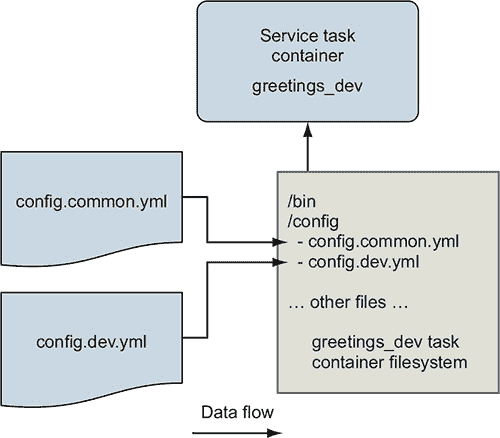
> 
> 因此，我们需要立即解决的问题是如何仅使用部署描述符将环境特定的配置文件放入容器中。请跟随这个示例，通过克隆并阅读[`github.com/dockerinaction/ch12_greetings.git`](https://github.com/dockerinaction/ch12_greetings.git)源代码库中的文件。
> 
> `greetings`应用程序的部署使用 Docker Compose 应用程序格式定义，并作为堆栈部署到 Docker Swarm。这些概念在第十一章中介绍。在这个应用程序中，有三个 Compose 文件。所有环境通用的部署配置包含在 docker-compose.yml 中。还有针对开发和生产环境的环境特定 Compose 文件（例如，docker-compose.prod.yml）。环境特定的 Compose 文件定义了服务在这些部署中使用的额外配置和秘密资源。
> 
> 这里是共享的部署描述符，docker-compose.yml:
> 
> > `version: '3.7'  configs:   env_specific_config:     file: ./api/config/config.${DEPLOY_ENV:-prod}.yml` `1` `services:    api:       image: ${IMAGE_REPOSITORY:-dockerinaction/ch12_greetings}:api       ports:         - '8080:8080'         - '8443:8443'       user: '1000'       configs:         - source: env_specific_config           target: /config/config.${DEPLOY_ENV:-prod}.yml` `2` `uid: '1000'           gid: '1000'           mode: 0400 #默认是 0444 - 对所有用户只读       secrets: []       environment:         DEPLOY_ENV: ${DEPLOY_ENV:-prod}`

+   1 使用环境特定配置文件的内容定义一个配置资源

+   2 将 env_specific_config 资源映射到容器中的文件

> 此 Compose 文件将 `greetings` 应用程序的环境特定配置文件加载到 `api` 服务的容器中。这补充了内置到应用程序镜像中的通用配置文件。`DEPLOY_ENV` 环境变量参数化此部署定义。此环境变量以两种方式使用。
> 
> 首先，当 Docker 插值 `DEPLOY_ENV` 时，部署描述符将产生不同的部署定义。例如，当 `DEPLOY_ENV` 设置为 `dev` 时，Docker 将引用并加载 config.dev.yml。
> 
> 其次，部署描述符中 `DEPLOY_ENV` 变量的值将通过环境变量定义传递给 `greetings` 服务。此环境变量向服务指示其运行的环境，使其能够执行诸如加载以环境命名的配置文件等操作。现在让我们来检查 Docker 配置资源以及如何管理环境特定配置文件。
> 
> 12.2.1\. 使用配置资源
> 
> Docker 配置资源是 Swarm 集群对象，部署作者可以使用它来存储应用程序所需的运行时数据。每个配置资源都有一个集群唯一的名称和最多 500 KB 的值。当 Docker 服务使用配置资源时，Swarm 将在服务容器的文件系统中挂载一个包含配置资源内容的文件。
> 
> 顶层 `configs` 键定义了特定于此应用程序部署的 Docker 配置资源。此 `configs` 键定义了一个包含一个配置资源 `env_specific_config` 的映射：
> 
> > `configs:    env_specific_config:        file: ./api/config/config.${DEPLOY_ENV:-prod}.yml`
> > 
> 当此堆栈部署时，Docker 将将 `DEPLOY_ENV` 变量的值插入到文件名中，读取该文件，并将其存储在 Swarm 集群内名为 `env_specific_config` 的配置资源中。
> 
> 在部署中定义配置不会自动使服务访问它。要使服务访问配置，部署定义必须将其映射到服务自己的 `configs` 键下。配置映射可以自定义结果文件在服务容器文件系统中的位置、所有权和权限：
> 
> > `# ...省略... services:    api:        # ...省略...        user: '1000'        configs:            - source: env_specific_config            target: /config/config.${DEPLOY_ENV:-prod}.yml` `1` `uid: '1000'` `2` `gid: '1000'        mode: 0400` `3`

+   1 覆盖默认目标文件路径为 /env_specific_config

+   2 覆盖默认的 uid 和 gid 为 0，以匹配具有 uid 1000 的服务用户

+   3 覆盖默认文件模式 0444，对所有用户只读

> 在这个例子中，`env_specific_config`资源被映射到`greetings`服务容器中，并进行了几个调整。默认情况下，配置资源被挂载到容器文件系统中的`/<config_name>`；例如，`/env_specific_config`。此示例将`env_specific_config`映射到目标位置`/config/config.$ {DEPLOY_ENV:-prod}.yml`。因此，对于开发环境的部署，环境特定的配置文件将出现在`/config/config.dev.yml`。此配置文件的所有权设置为`userid=1000`和`groupid=1000`。默认情况下，配置资源的文件属于用户 ID 和组 ID 0。文件权限也被限制为模式 0400。这意味着文件只能由文件所有者读取，而默认情况下文件所有者、组和其他用户都可以读取（0444）。
> 
> 这些更改对于这个应用程序来说并非绝对必要，因为它是受我们控制的。该应用程序可以被实现为使用 Docker 的默认设置来工作。然而，其他应用程序可能没有这么灵活，并且可能有启动脚本，这些脚本以特定的方式工作，你不能更改。特别是，你可能需要控制配置文件名和所有权，以便适应想要以特定用户身份运行并从预定位置读取配置文件的程序。Docker 的服务配置资源映射允许你满足这些需求。如果需要，你甚至可以将单个配置资源映射到多个不同的服务定义中。
> 
> 在配置资源和服务定义一起设置之后，让我们部署应用程序。
> 
> 12.2.2\. 部署应用程序
> 
> 通过运行以下命令以开发环境配置部署`greetings`应用程序：
> 
> > `DEPLOY_ENV=dev docker stack deploy \    --compose-file docker-compose.yml greetings_dev`
> > 
> 部署栈之后，你可以通过网页浏览器访问服务，地址为 http://localhost: 8080/，应该会看到一个欢迎信息，如下所示：
> 
> > `欢迎使用 Greetings API 服务器！容器 ID 为 642abc384de5，于 2019-04-16 00:24:37.0958326 +0000 UTC 响应。DEPLOY_ENV: dev` `1`

+   1 从环境变量中读取值“dev”。

> 当您运行`docker stack deploy`时，Docker 会读取应用程序的特定环境配置文件，并将其作为配置资源存储在 Swarm 集群中。然后当`api`服务启动时，Swarm 在临时只读文件系统上创建这些文件的副本。即使您将文件模式设置为可写（例如，`rw-rw-rw-`），它也会被忽略。Docker 将这些文件挂载到配置中指定的目标位置。配置文件的目标位置几乎可以是任何地方，甚至可以是在包含应用程序镜像常规文件的目录内部。例如，`greetings`服务的通用配置文件（`COPY`到应用程序镜像中）和特定环境的配置文件（一个 Docker 配置资源）都可在/config 目录中找到。应用程序容器在启动时可以读取这些文件，并且这些文件在整个容器生命周期内都可用。
> 
> 在启动时，`greetings`应用程序使用`DEPLOY_ENV`环境变量来计算特定环境的配置文件名称；例如，/config/config.dev.yml。然后应用程序读取其两个配置文件并合并问候语列表。您可以通过阅读源存储库中的 api/main.go 文件来了解`greetings`服务是如何做到这一点的。现在，导航到 http://localhost:8080/greeting 端点并发出几个请求。您应该会看到来自通用和特定环境的问候语的混合。例如：
> 
> > `Hello World! Orbis Terrarum salve! Hello World! Hallo Welt! Hola Mundo!`

|    |
| --- |

> 配置资源与配置镜像
> 
> 您可能还记得在第十章中描述的“每个部署阶段配置镜像”模式。在该模式中，特定环境的配置被构建到一个作为容器运行的镜像中，并且该文件系统在运行时挂载到“真实”服务容器的文件系统上。Docker 配置资源自动化了大多数这种模式。使用配置资源会导致一个文件被挂载到服务任务容器中，并且无需创建和跟踪额外的镜像。Docker 配置资源还允许您轻松地将单个配置文件挂载到文件系统的任意位置。在使用容器镜像模式时，最好挂载整个目录，以避免混淆来自哪个镜像的文件。
> 
> 在这两种方法中，您都希望使用唯一标识的配置或镜像名称。然而，在 Docker Compose 应用程序部署描述符中，可以使用变量替换来指定镜像名称，这避免了下一节将要讨论的资源命名问题。

|    |
| --- |

> 到目前为止，我们通过 Docker Compose 部署定义的便利性来管理配置资源。在下一节中，我们将降低抽象级别，并使用`docker`命令行工具直接检查和管理配置资源。
> 
> 12.2.3\. 直接管理配置资源
> 
> `docker config` 命令提供了另一种管理配置资源的方式。`config` 命令有多个子命令用于创建、检查、列出和删除配置资源：分别是 `create`、`inspect`、`ls` 和 `rm`。您可以使用这些命令直接管理 Docker Swarm 集群的配置资源。现在让我们来做这件事。
> 
> 检查 `greetings` 服务的 `env_specific_config` 资源：
> 
> > `docker config inspect greetings_dev_env_specific_config` `1`

+   1 Docker 会自动将配置资源前缀为 greetings_dev 栈名称。

> 这应该会产生类似于以下输出的结果：
> 
> > `[   {   "ID": "bconc1huvlzoix3z5xj0j16u1",   "Version": {   "Index": 2066   },   "CreatedAt": "2019-04-12T23:39:30.6328889Z",   "UpdatedAt": "2019-04-12T23:39:30.6328889Z",   "Spec": {   "Name": "greetings_dev_env_specific_config",   "Labels": {   "com.docker.stack.namespace": "greetings"   },   "Data":   "Z3JlZXRpbmdzOgogIC0gJ09yYmlzIFRlcnJhcnVtIHNhbHZlIScKICAtICdCb25qb3VyIGx   lIG1vbmRlIScK"   }   } ]`
> > 
> `inspect` 命令报告与配置资源及其值相关的元数据。配置的值以 Base64 编码的字符串形式返回在 `Data` 字段中。这些数据未加密，因此在此不提供机密性。Base64 编码仅便于在 Docker Swarm 集群内部传输和存储。当服务引用配置资源时，Swarm 将从集群的中央存储中检索这些数据并将其放置在服务任务文件系统上的一个文件中。
> 
> Docker 配置资源是不可变的，一旦创建后不能更新。`docker config` 命令仅支持 `create` 和 `rm` 操作来管理集群的配置资源。如果您尝试使用相同的名称多次创建配置资源，Docker 将返回一个错误，表示资源已存在：
> 
> > `$ docker config create greetings_dev_env_specific_config \   api/config/config.dev.yml Error response from daemon: rpc error: code = AlreadyExists`  `desc = config greetings_dev_env_specific_config already exists`
> > 
> 同样，如果您更改源配置文件并尝试使用相同的配置资源名称重新部署堆栈，Docker 也会响应错误：
> 
> > `$ DEPLOY_ENV=dev docker stack deploy \   --compose-file docker-compose.yml greetings_dev failed to update config greetings_dev_env_specific_config:`  `Error response from daemon: rpc error: code = InvalidArgument`  `desc = only updates to Labels are allowed`
> > 
> 您可以将 Docker 服务及其依赖关系可视化为一个有向图，就像图 12.4 中所示的一个简单图：
> 
> 图 12.4\. Docker 服务依赖于配置资源。
> 
> 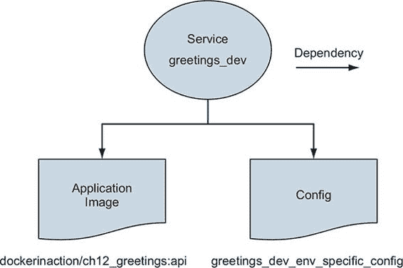
> 
> Docker 正在尝试维护 Docker 服务与其依赖的配置资源之间的一组稳定依赖关系。如果 `greetings_dev_env_specific_config` 资源发生变化或被删除，新的 `greetings_dev` 服务任务可能无法启动。让我们看看 Docker 如何跟踪这些关系。
> 
> 配置资源每个都通过一个唯一的 `ConfigID` 来标识。在这个例子中，`greetings_dev_env_specific_config` 通过 `bconc1huvlzoix3z5xj0j16u1` 来标识，这在 `docker config inspect` 命令的 `greetings_dev_env_specific_config` 输出中是可见的。这个相同的配置资源在 `greetings` 服务定义中通过其 `ConfigID` 来引用。
> 
> 让我们通过使用 `docker service inspect` 命令来验证这一点。这个检查命令只打印 `greetings` 服务的配置资源引用：
> 
> > `docker service inspect \    --format '{{ json .Spec.TaskTemplate.ContainerSpec.Configs }}' \    greetings_dev_api`
> > 
> 对于这个服务实例化，命令生成了以下内容：
> 
> > `[    {    "File": {        "Name": "/config/config.dev.yml",        "UID": "1000",        "GID": "1000",        "Mode": 256    },    "ConfigID": "bconc1huvlzoix3z5xj0j16u1",    "ConfigName": "greetings_dev_env_specific_config"    } ]`
> > 
> 有几点重要的事情需要指出。首先，`ConfigID` 引用了 `greeetings_dev_env_specific_config` 配置资源的唯一配置 ID，`bconc1huvlzoix3z5xj0j16u1`。其次，服务特定的目标文件配置已被包含在服务的定义中。请注意，如果名称已存在，则无法创建配置；如果在使用中，则无法删除配置。回想一下，`docker config` 命令没有提供更新子命令。这可能会让您想知道如何更新配置。图 12.5 展示了解决这个问题的方案。
> 
> 图 12.5\. 部署时复制
> 
> 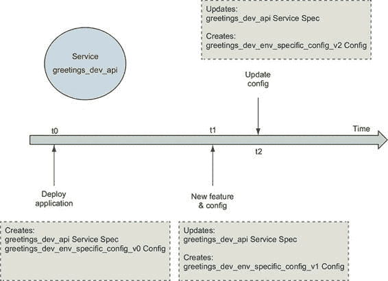
> 
> 答案是您不需要更新 Docker 配置资源。相反，当配置文件发生变化时，部署过程应该创建一个具有不同名称的新资源，然后在服务部署中引用该名称。常见的做法是在配置资源名称后附加版本号。`greetings` 应用程序的部署定义可以定义一个 `env_specific_config_v1` 资源。当配置发生变化时，该配置可以存储在一个名为 `env_specific_config_v2` 的新配置资源中。服务可以通过更新配置引用到这个新的配置资源名称来采用这个新配置。
> 
> 这种不可变配置资源的实现给自动化部署管道带来了挑战。这个问题在 GitHub issue moby/moby 35048 中进行了详细讨论。主要挑战是配置资源的名称不能直接在 YAML Docker Compose 部署定义格式中参数化。自动化部署过程可以通过在运行部署之前使用自定义脚本来替换唯一版本来解决这个问题。
> 
> 例如，假设部署描述符定义了一个配置`env_specific_config_vNNN`。自动化构建过程可以搜索`_vNNN`字符序列，并将其替换为唯一的部署标识符。该标识符可以是部署作业的 ID 或版本控制系统中应用程序的版本。具有 ID 3 的部署作业可以将所有`env_specific_config_vNNN`实例重写为`env_specific_config_v3`。
> 
> 尝试这种配置资源版本控制方案。首先，向 config.dev.yml 文件中添加一些问候语。然后将 docker-compose.yml 中的`env_specific_config`资源重命名为`env_specific_config_v2`。确保更新顶级配置映射以及`api`服务配置列表中的键名。现在通过再次部署栈来更新应用程序。Docker 应该会打印一条消息，说明它正在创建`env_specific_config_v2`并更新服务。现在当你向问候语端点发出请求时，你应该看到你添加的问候语与响应混合在一起。
> 
> 这种方法可能对某些人来说是可接受的，但有几个缺点。首先，从与版本控制不匹配的文件中部署资源可能对某些人来说不是起点。这个问题可以通过存档用于部署的文件副本来缓解。第二个问题是，这种方法将为每次部署创建一组配置资源，并且旧资源需要通过另一个过程清理。这个过程可以定期检查每个配置资源，以确定它是否在使用中，如果不使用则将其删除。
> 
> 我们已经完成了`greetings`应用的开发部署。清理这些资源，并通过移除栈来避免与后续示例冲突：
> 
> > `docker stack rm greetings_dev`
> > 
> 这就完成了对 Docker 配置及其集成到交付管道的介绍。接下来，我们将检查 Docker 对特殊类型配置的支持：机密信息。
> 
> 12.3. 机密信息——一种特殊的配置
> 
> 机密信息与配置非常相似，但有一个重要区别。机密信息的值很重要，通常非常有价值，因为它可以验证身份或保护数据。机密信息可能以密码、API 密钥或私有加密密钥的形式存在。如果这些机密信息泄露，有人可能能够执行未经授权的操作或访问数据。
> 
> 存在另一个复杂问题。在 Docker 镜像或配置文件等工件中分发秘密，使得控制对这些秘密的访问成为一个广泛且困难的问题。分布链中的每一个点都需要有强大而有效的访问控制，以防止泄露。
> 
> 大多数组织在尝试交付秘密而不通过正常的应用程序交付渠道暴露它们时都会放弃。这是因为交付管道通常有很多访问点，而这些点可能没有被设计或配置来确保数据的机密性。组织通过在安全的保险库中存储秘密并在应用程序交付的最后时刻使用专用工具注入它们来避免这些问题。这些工具使应用程序只能在运行时环境中访问其秘密。
> 
> 图 12.6 展示了应用程序配置和秘密数据通过应用程序工件流动的过程。
> 
> 图 12.6\. 第一秘密问题
> 
> 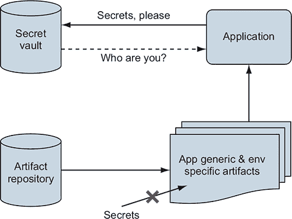
> 
> 如果一个应用程序在没有秘密信息（如密码凭证）的情况下启动，用于认证秘密保险库，那么保险库如何授权访问应用程序的秘密？它不能。这就是第一秘密问题。应用程序需要帮助启动信任链，以便它能够检索其秘密。幸运的是，Docker 的集群、服务和秘密管理设计解决了这个问题，如图 12.7 所示。
> 
> 图 12.7\. Docker Swarm 集群的信任链
> 
> 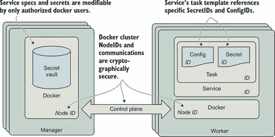
> 
> 第一秘密问题的核心是身份认证。为了一个秘密保险库授权访问特定的秘密，它必须首先验证请求者的身份。幸运的是，Docker Swarm 包含一个安全的秘密保险库，并为你解决了信任初始化问题。Swarm 秘密保险库与集群的身份和安全管理功能紧密集成，这些功能使用安全的通信渠道。Docker 服务 ID 作为应用程序的身份。Docker Swarm 使用服务 ID 来确定服务任务应该访问哪些秘密。当你使用 Swarm 的保险库管理应用程序的秘密时，你可以确信只有拥有 Swarm 集群管理控制权的人或进程才能提供秘密的访问权限。
> 
> Docker 部署和运营服务的解决方案建立在强大且加密学上可靠的基础上。每个 Docker 服务都有一个身份，支持该服务的每个任务容器也是如此。所有这些任务都在具有独特身份的 Swarm 节点上运行。Docker 密钥管理功能建立在这样一个身份基础之上。每个任务都有一个与服务关联的身份。服务定义引用了服务和任务所需的密钥。由于服务定义只能由管理节点上的授权 Docker 用户修改，Swarm 知道哪些密钥服务被授权使用。然后 Swarm 可以将这些密钥传递给将运行服务任务的节点。

|    |
| --- |

> 注意
> 
> Docker 集群技术实现了一个高级、安全的设计，以维护一个安全、高可用性和性能最优的控制平面。您可以在[`www.docker.com/blog/least-privilege-container-orchestration/`](https://www.docker.com/blog/least-privilege-container-orchestration/)了解更多关于这种设计以及 Docker 如何实现它的信息。

|    |
| --- |

> Docker 服务通过使用 Swarm 内置的身份管理功能来建立信任，而不是依赖于通过另一个通道传递的密钥来验证应用程序对其密钥的访问，从而解决了第一个密钥问题。
> 
> 12.3.1\. 使用 Docker 密钥
> 
> 使用 Docker 密钥资源类似于使用 Docker 配置资源，只需进行一些调整。
> 
> 再次强调，Docker 将密钥以文件形式提供给应用程序，这些文件挂载到容器特定的、内存中的只读 `tmpfs` 文件系统。默认情况下，密钥将被放置在容器的文件系统中的 `/run/secrets` 目录下。将密钥传递给应用程序的这种方法避免了将密钥作为环境变量提供时固有的多个泄露问题。

|    |
| --- |

> 作为环境变量的密钥问题
> 
> 使用环境变量作为密钥传输机制的最重要和常见问题如下：

+   您无法将访问控制机制分配给环境变量。

+   这意味着任何由应用程序执行的过程都可能访问这些环境变量。为了说明这一点，考虑一下，如果一个应用程序通过 ImageMagick 进行图像缩放，并且使用包含父应用程序密钥的环境中的不受信任输入执行缩放操作，这可能意味着什么。如果环境包含在知名位置（如云提供商常见的那样）的 API 密钥，这些密钥可能很容易被盗。一些语言和库可以帮助您准备一个安全的过程执行环境，但效果可能会有所不同。

+   许多应用程序在接收到调试命令或崩溃时，会将其所有环境变量打印到标准输出。这意味着您可能会定期在日志中暴露密钥。

|    |
| --- |

> 现在让我们看看如何告诉应用程序秘密或配置文件在容器中的放置位置；参见图 12.8。
> 
> 图 12.8\. 提供作为环境变量读取的秘密文件的位置
> 
> 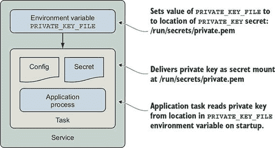
> 
> 当应用程序从文件中读取秘密时，我们通常需要在启动时指定该文件的位置。解决此问题的常见模式是将包含秘密（如密码）的文件位置作为环境变量传递给应用程序。容器中秘密的位置不是敏感信息，并且只有运行在容器内的进程才能访问该文件，前提是文件权限允许。应用程序可以通过读取由环境变量指定的文件来加载秘密。这种模式也适用于传达配置文件的位置。
> 
> 让我们通过一个例子来分析；我们将为`greetings`服务提供一个 TLS 证书和私钥，以便它可以启动一个安全的 HTTPS 监听器。我们将证书的私钥存储为 Docker 秘密，并将公钥作为配置。然后我们将这些资源提供给`greeting`服务的生产服务配置。最后，我们将通过环境变量指定文件的位置给`greetings`服务，以便它知道从哪里加载这些文件。 
> 
> 现在我们将部署一个配置为生产的`greetings`服务的新实例。部署命令与您之前运行的命令类似。然而，生产部署包括一个额外的`--compose-file`选项，用于将部署配置包含在`docker-compose.prod.yml`中。第二个更改是使用名称`greetings_prod`而不是`greetings_dev`来部署堆栈。
> 
> 现在运行这个`docker stack deploy`命令：
> 
> > `DEPLOY_ENV=prod docker stack deploy --compose-file docker-compose.yml \ --compose-file docker-compose.prod.yml \ greetings_prod`
> > 
> 您应该会看到一些输出：
> 
> > `Creating network greetings_prod_default Creating config greetings_prod_env_specific_config service api: secret not found: ch12_greetings-svc-prod-TLS_PRIVATE_KEY_V1`
> > 
> 部署失败是因为找不到`ch12_greetings-svc-prod-TLS_PRIVATE_KEY_V1`秘密资源。让我们检查`docker-compose.prod.yml`文件并确定这是为什么。以下是该文件的内容：
> 
> > `version: '3.7' configs:    ch12_greetings_svc-prod-TLS_CERT_V1:      external: true  secrets:    ch12_greetings-svc-prod-TLS_PRIVATE_KEY_V1:      external: true  services:     api:       environment:         CERT_PRIVATE_KEY_FILE: '/run/secrets/cert_private_key.pem'         CERT_FILE: '/config/svc.crt'         configs:         - source: ch12_greetings_svc-prod-TLS_CERT_V1           target: /config/svc.crt           uid: '1000'           gid: '1000'           mode: 0400         secrets:         - source: ch12_greetings-svc-prod-TLS_PRIVATE_KEY_V1           target: cert_private_key.pem           uid: '1000'           gid: '1000'           mode: 0400`
> > 
> 存在一个顶层 `secrets` 键，定义了一个名为 `ch12_greetings-svc-prod-TLS_PRIVATE_KEY_V1` 的秘密，这与错误报告中报告的内容相同。秘密定义中有一个我们之前未见过的键，`external: true`。这意味着秘密的值不是由这个部署定义定义的，这容易导致泄露。相反，必须由 Swarm 集群管理员使用 `docker` CLI 创建 `ch12_greetings-svc-prod-TLS_PRIVATE_KEY_V1` 秘密。一旦在集群中定义了秘密，这个应用程序部署就可以引用它。
> 
> 现在让我们通过运行以下命令来定义秘密：
> 
> > `$ cat api/config/insecure.key | \    docker secret create ch12_greetings-svc-prod-TLS_PRIVATE_KEY_V1 - vnyy0gr1a09be0vcfvvqogeoj`
> > 
> `docker secret create` 命令需要两个参数：秘密的名称和该秘密的值。值可以通过提供文件的路径来指定，或者使用 `–`（连字符）字符来指示值将通过标准输入提供。这个 shell 命令通过将示例 TLS 证书的私钥 `insecure.key` 的内容打印到 `docker secret create` 命令中，展示了后者的形式。命令成功完成并打印了秘密的 ID：`vnyy0gr1a09be0vcfvvqogeoj`。

|    |
| --- |

> 警告
> 
> 不要将此证书和私钥用于除了处理这些示例之外的其他任何用途。私钥没有被保密，因此不能有效地保护你的数据。

|    |
| --- |

> 使用 `docker secret inspect` 命令来查看 Docker 创建的秘密资源的详细信息：
> 
> > `$ docker secret inspect ch12_greetings-svc-prod-TLS_PRIVATE_KEY_V1 [     {       "ID": "vnyy0gr1a09be0vcfvvqogeoj",       "Version": {           "Index": 2172       },           "CreatedAt": "2019-04-17T22:04:19.3078685Z",           "UpdatedAt": "2019-04-17T22:04:19.3078685Z",           "Spec": {             "Name": "ch12_greetings-svc-prod-TLS_PRIVATE_KEY_V1",             "Labels": {}         }       } ]`
> > 
> 注意，与配置资源不同，这里没有`Data`字段。密钥的值无法通过 Docker 工具或 Docker Engine API 获取。密钥的值被 Docker Swarm 控制平面严格保护。一旦将密钥加载到 Swarm 中，就无法使用`docker` CLI 检索它。密钥仅对使用它的服务可用。您可能还会注意到，密钥的规范不包含任何标签，因为它是在堆栈范围之外管理的。
> 
> 当 Docker 为`greetings`服务创建容器时，密钥将按照与我们之前描述的配置资源的过程几乎相同的方式映射到容器中。以下是`docker-compose.prod.yml`文件中的相关部分：
> 
> > `services:    api:        environment:            CERT_PRIVATE_KEY_FILE: '/run/secrets/cert_private_key.pem'            CERT_FILE: '/config/svc.crt'            secrets:            - source: ch12_greetings-svc-prod-TLS_PRIVATE_KEY_V1            target: cert_private_key.pem            uid: '1000'            gid: '1000'            mode: 0400        # ... 省略 ...`
> > 
> `ch12_greetings-svc-prod-TLS_PRIVATE_KEY_V1`密钥将被映射到容器中，文件名为`cert_private_key.pem`。密钥文件的默认位置是/run/secrets/。此应用程序在其私钥和证书的位置中查找环境变量，因此这些变量也使用文件的完全限定路径定义。例如，`CERT_PRIVATE_KEY_FILE`环境变量的值设置为`/run/secrets/cert_private_key.pem`。
> 
> 生产`greetings`应用程序还依赖于`ch12_greetings_svc-prod-TLS_CERT_V1`配置资源。此配置资源包含`greetings`应用程序将用于提供 HTTPS 服务的公共、非敏感的 x.509 证书。x.509 证书的私钥和公钥一起更改，这就是为什么这些密钥和配置资源作为一对创建的原因。现在通过运行以下命令定义证书的配置资源：
> 
> > `$ docker config create \    ch12_greetings_svc-prod-TLS_CERT_V1 api/config/insecure.crt 5a1lybiyjnaseg0jlwj2s1v5m`
> > 
> `docker config create`命令与密钥创建命令类似。特别是，可以通过指定文件的路径来创建配置资源，就像我们在这里使用`api/config/insecure.crt`所做的那样。命令成功完成并打印了新的配置资源的唯一 ID，`5a1lybiyjnaseg0jlwj2s1v5m`。
> 
> 现在，重新运行部署命令：
> 
> > `$ DEPLOY_ENV=prod docker stack deploy \    --compose-file docker-compose.yml \    --compose-file docker-compose.prod.yml \    greetings_prod Creating service greetings_prod_api`
> > 
> 这次尝试应该会成功。运行`docker service ps greetings_prod_api`并验证服务是否有一个正在运行的单个任务：
> 
> > `ID                NAME              IMAGE                     NODE DESIRED STATE        CURRENT STATE           ERROR               PORTS 93fgzy5lmarp        greetings_prod_api.1   dockerinaction/ch12_greetings:api docker-desktop       运行中             运行中 2 分钟前`
> > 
> 现在生产栈已部署，我们可以检查服务的日志以查看是否找到了 TLS 证书和私钥：
> 
> > `docker service logs --since 1m greetings_prod_api`
> > 
> 该命令将打印`greetings`服务应用程序的日志，其外观应如下所示：
> 
> > `初始化 prod 部署环境的 greetings api 服务器 将从'/run/secrets/cert_private_key.pem'读取 TLS 证书私钥 私钥证书中的字符数 3272 将从'/config/svc.crt'读取 TLS 证书 TLS 证书中的字符数 1960 从/config/config.common.yml 加载环境特定配置 从/config/config.prod.yml 加载环境特定配置 问候：[Hello World! Hola Mundo! Hallo Welt!] 初始化完成 在:8443 启动 https 监听器`
> > 
> 的确，`greetings`应用程序在`/run/secrets/cert_private_key.pem`找到了私钥，并报告该文件包含 3,272 个字符。同样，证书有 1,960 个字符。最后，`greetings`应用程序报告它正在容器内部启动一个监听 8443 端口 HTTPS 流量的监听器。
> 
> 使用网络浏览器打开 https://localhost:8443。示例证书不是由受信任的证书颁发机构签发的，因此你会收到一个警告。如果你通过那个警告，你应该会看到来自 greetings 服务的响应：
> 
> > `欢迎使用 Greetings API 服务器！ID 为 583a5837d629 的容器在 2019-04-17 22:35:07.3391735 +0000 UTC 响应 DEPLOY_ENV: prod`
> > 
> 哇哦！现在 greetings 服务正在使用 Docker 的密钥管理设施提供的 TLS 证书通过 HTTPS 提供服务。你可以像以前一样在 https://localhost:8443/greeting 请求问候。注意，只提供了常见配置中的三个问候。这是因为应用程序针对 prod 环境的特定配置文件 config.prod.yml 没有添加任何问候。
> 
> `greetings`服务现在正在使用 Docker 支持的每种配置形式：包含在应用程序镜像中的文件、环境变量、配置资源和密钥资源。你也看到了如何结合使用所有这些方法，以安全的方式在多个环境中改变应用程序的行为。
> 
> 摘要
> 
> 本章描述了在部署时间而不是构建时间改变应用程序行为的核心挑战。我们探讨了如何使用 Docker 的配置抽象来模拟这种变化。示例应用程序展示了如何使用 Docker 的配置和秘密资源来改变其在不同环境中的行为。这最终导致了一个通过 https 提供流量并具有特定环境数据集的 Docker 服务。本章需要理解的关键点包括：

+   应用程序通常必须适应它们部署到的环境。

+   Docker 配置和秘密资源可用于模拟和适应应用程序的各种部署需求。

+   秘密是难以安全处理的一种特殊类型的配置数据。

+   Docker Swarm 建立信任链，并使用 Docker 服务身份来确保秘密被正确且安全地传递给应用程序。

+   Docker 将配置和秘密作为容器特定的`tmpfs`文件系统上的文件提供给服务，应用程序可以在启动时读取。

+   部署流程必须使用命名方案为配置和秘密资源命名，以便自动化更新服务。

> 第十三章\. 使用 Swarm 在 Docker 主机集群上编排服务
> 
> 本章涵盖

+   Docker 应用程序部署的工作原理和选项

+   将多层应用程序部署到 Docker Swarm

+   Swarm 如何尝试将 Docker 应用程序部署收敛到操作者声明的所需状态

+   Swarm 如何确保在声明的放置和资源约束内，集群中运行着所需数量的副本

+   从集群节点到网络服务实例的请求流量路由以及协作服务如何使用 Docker 网络相互连接

+   控制 Docker 服务容器在集群中的放置

> 13.1\. 使用 Docker Swarm 进行集群
> 
> 应用程序开发者和运维人员经常将服务部署到多个主机上，以实现更高的可用性和可伸缩性。当应用程序部署到多个主机上时，应用程序部署的冗余提供了容量，可以在主机失败或从服务中移除时处理请求。跨多个主机部署还允许应用程序使用比单个主机能提供的更多计算资源。
> 
> 例如，假设你运行一个电子商务网站，该网站通常在单个主机上表现良好，但在大型促销活动期间（将峰值负载提高两倍）运行缓慢。这个网站可能从重新部署到三个主机中受益。然后你应该有足够的容量来处理峰值流量，即使一个主机失败或因升级而停机。在本章中，我们将向你展示如何使用 Swarm 在主机集群上模拟和部署一个 Web API。
> 
> Docker Swarm 提供了一个复杂的平台，用于在多个 Docker 主机上部署和运行容器化应用程序。Docker 的部署工具自动化了将新的 Docker 服务部署到集群或对现有服务进行更改的过程。服务配置更改可能包括在服务定义（docker-compose.yml）中声明的任何内容，例如镜像、容器命令、资源限制、暴露的端口、挂载和消耗的秘密。一旦部署，Swarm 将监督应用程序，以便检测和修复问题。此外，Swarm 将应用程序用户的请求路由到服务的容器中。
> 
> 在本章中，我们将探讨 Docker Swarm 如何支持这些功能中的每一个。我们将基于第十一章和第十二章中探讨的服务、配置和秘密资源。我们还将利用你对 Docker 容器（第二章）、资源限制（第六章）和网络（第五章）的基本知识。
> 
> 13.1.1\. Docker Swarm 模式的介绍
> 
> Docker Swarm 是一种集群技术，它连接了一组运行 Docker 的主机，并允许你在这些机器上运行使用 Docker 服务构建的应用程序。Swarm 协调 Docker 服务在机器集合上的部署和运行。Swarm 根据应用程序的资源需求和机器能力来调度任务。Swarm 集群软件包含在 Docker Engine 和命令行工具中。你可以启用 Swarm 模式并开始使用 Swarm，而无需安装任何额外的组件。图 13.1 显示了 Docker Swarm 部署的组件如何相互关联以及集群的机器如何协作运行应用程序。
> 
> 
> 
> 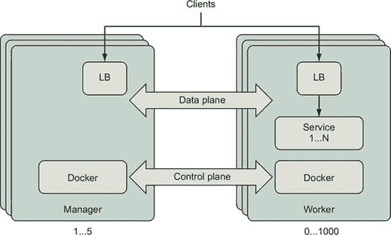
> 
> 当您将 Docker Engine 加入 Swarm 集群时，您指定该机器应该是管理器还是工作者。管理器监听创建、更改或删除实体（如 Docker 服务、配置和机密）定义的指令。管理器指示工作节点创建实现 Docker 服务实例的容器和卷。管理器持续地将集群收敛到您声明的状态。连接集群 Docker Engine 的控制平面描述了所需集群状态的通信以及实现该状态相关的事件。Docker 服务的客户端可以向集群中任何发布该服务的端口发送请求。Swarm 的网络网格将路由从接收请求的任何节点到可以处理该请求的健康服务容器的请求。Swarm 部署和管理轻量级、专用的负载均衡器和网络路由组件，以接收和传输每个发布端口的网络流量。第 13.3.1 节详细解释了 Swarm 网络网格。让我们部署一个集群来处理本章中的示例。
> 
> Swarm 集群可以部署在多种拓扑结构中。每个集群至少有一个管理器来保护集群状态并协调跨工作者的服务。Swarm 管理器需要大多数管理器可用，以便协调并记录对集群的更改。大多数生产级 Swarm 部署应具有三个或五个节点担任管理角色。增加管理器的数量将提高 Swarm 控制平面的可用性，但也会增加管理器确认集群更改所需的时间。有关权衡的详细说明，请参阅 Swarm 管理员指南（[`docs.docker.com/engine/swarm/admin_guide/`](https://docs.docker.com/engine/swarm/admin_guide/))。Swarm 集群可以可靠地扩展到数百个工作节点。社区已经展示了单个 Swarm 集群包含数千个工作节点的测试（请参阅[`dzone.com/articles/docker-swarm-lessons-from-swarm3k`](https://dzone.com/articles/docker-swarm-lessons-from-swarm3k)上的 Swarm3K 项目）。
> 
> Swarm 是 Docker 提供的原生集群应用程序部署选项，很好地支持 Docker 应用程序模型。许多人会发现 Swarm 比其他容器集群技术更容易部署、使用和管理。您可能会发现为单个团队或项目部署小型 Swarm 集群很有用。您可以使用标签将大型 Swarm 集群划分为多个区域，然后通过使用调度约束将服务实例放置到适当的区域。您可以使用对组织有意义的元数据（如`environment=dev`或`zone=private`）对集群资源进行标记，以便集群的实际管理模型与您的术语相匹配。
> 
> 13.1.2\. 部署 Swarm 集群
> 
> 您有很多选项可以从节点集群构建 swarm。本章的示例使用具有五个节点的 Swarm 集群，尽管大多数示例在单个节点上工作，例如 Docker for Mac。您可以按自己的喜好配置 Swarm 集群。由于配置选项种类繁多且变化迅速，我们建议您遵循最新的指南，在您喜欢的基础设施提供商上配置 Swarm 集群。许多人使用`docker-machine`在云提供商（如 DigitalOcean 和 Amazon Web Services）上部署测试集群。
> 
> 本章中的示例使用 Play with Docker([`labs.play-with-docker.com/`](https://labs.play-with-docker.com/))创建和测试。在 Play with Docker 网站上，您可以免费实验 Docker 并了解它。集群使用 Play with Docker 模板创建，该模板配置了三个管理节点和两个工作节点。您至少需要两个工作节点来完成本章的所有练习。
> 
> 部署 Swarm 集群的一般过程如下：

1.  部署至少三个已安装并运行 Docker Engine 的节点，最好是五个。

1.  确保以下端口和协议之间允许机器之间的网络流量：

    1.  TCP 端口 2377 用于集群管理通信

    1.  TCP 和 UDP 端口 7946 用于节点间的通信

    1.  UDP 端口 4789 用于覆盖网络流量

1.  通过在管理节点上运行`docker swarm init`来初始化 Swarm 集群。

1.  记录 Swarm 集群加入令牌或使用`docker swarm join-token`再次显示它们。

1.  使用`docker swarm join`将管理节点和工作节点加入集群。

> 13.2\. 将应用程序部署到 Swarm 集群
> 
> 在本节中，我们将部署一个具有常见三层架构的示例 Web 应用程序。该应用程序具有一个无状态的 API 服务器，连接到 PostgreSQL 关系数据库。API 服务器和数据库都将作为 Docker 服务进行管理。数据库将使用 Docker 卷在重启之间持久化数据。API 服务器将通过一个私有、安全的网络与数据库通信。此应用程序将展示您在前面章节中学到的 Docker 资源如何转换为跨多个节点的部署。
> 
> 13.2.1\. 介绍 Docker Swarm 集群资源类型
> 
> Docker Swarm 支持本书中讨论的几乎所有概念，如图 13.2 所示。当使用 Swarm 时，这些资源在集群级别定义和管理。
> 
> 图 13.2\. Docker Swarm 资源类型
> 
> 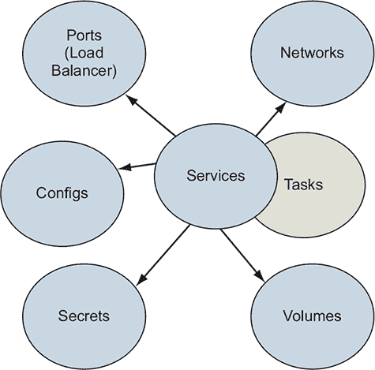
> 
> Docker Swarm 的关键资源类型如下：

+   服务—— Docker 服务定义了在 Swarm 集群节点上运行的应用程序进程。Swarm 管理器解释服务定义并在集群的管理节点和工作节点上创建任务。服务在第十一章中介绍。

+   任务— 任务定义了一个 Swarm 将调度并运行一次直到完成的过程化容器。一个退出的任务可能会根据服务定义的重启策略被新的任务替换。任务还指定了对其他集群资源（如网络和机密）的依赖。

+   网络— 应用可以使用 Docker overlay 网络在服务之间进行流量传输。Docker 网络开销低，因此你可以创建适合你所需安全模型的网络拓扑。第 13.3.2 节描述了 overlay 网络。

+   卷— 卷为服务任务提供持久存储。这些卷绑定到单个节点。卷和挂载在第四章中描述。

+   配置和机密— 配置和机密(第十二章)为集群上部署的服务提供特定环境的配置。

> 示例应用使用了这些 Docker 资源类型中的每一个。
> 
> 13.2.2\. 使用 Docker 服务定义应用及其依赖
> 
> 本章我们将要处理的示例应用是一个简单的三层 Web 应用，包括负载均衡器、API 服务器和 PostgreSQL 数据库。我们将使用 Docker 来模拟这个应用，并将其部署到我们的 Swarm 集群中。从逻辑上讲，应用部署将看起来像图 13.3。
> 
> 图 13.3\. 示例应用的逻辑架构
> 
> 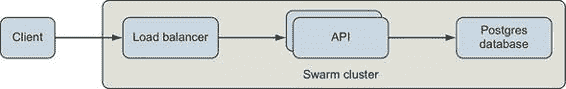
> 
> 应用有一个 API 服务器，包含两个端点：`/`和`/counter`。API 服务将一个端口发布到集群的边缘，该端口由 Swarm 的内置负载均衡器实现。对`/`端点的请求将返回处理请求的容器信息。`/counter`端点将在每次请求中增加一个整数。计数器的值存储在 PostgreSQL 数据库中。
> 
> 让我们分步骤使用 Docker Compose 版本 3 格式定义应用，并综合前几章中介绍的概念。之后，我们将使用`docker stack`命令部署它。这个应用定义的完整内容可以在[`github.com/dockerinaction/ch13_multi_tier_app.git`](https://github.com/dockerinaction/ch13_multi_tier_app.git)找到。`. 克隆这个仓库，随着应用的逐步解释来跟随。
> 
> 应用使用了两个网络，一个公共网络处理来自外部客户端的请求，另一个是更受信任的私有网络。这些网络在`docker-compose.yml`应用描述符中如下描述：
> 
> > `version: '3.7'  networks:   public:     driver: overlay     driver_opts:       encrypted: 'true'   private:     driver: overlay     driver_opts:       encrypted: 'true'       attachable: true`

| |
| --- |

> 注意
> 
> `driver_opts`的值`true`被引号包围，因为 Docker 需要一个字符串或数字。而`attachable`的值`true`没有被引号包围，因为 Docker 需要一个布尔值。

| |
| --- |

> 通过在应用程序描述符的顶级`networks`键中添加命名条目，定义了两个网络。构建此应用程序的团队有一个端到端加密的要求。应用程序定义通过加密应用程序使用的所有网络上的流量，满足了该要求的大部分。唯一剩下的工作是通过使用 TLS 来确保服务发布端口上的通信安全。第 13.3 节解释了为什么应用程序应该确保发布端口的安全，第十二章的`greetings`应用程序展示了实现这一点的其中一种方法。这突出了 Swarm 的一个有趣特性：通过在部署描述符中使用相对简单且可审计的配置，可以轻松满足许多传输加密要求。
> 
> 接下来，数据库需要持久存储来保存其数据。我们在顶级`volumes`键下定义一个 Docker 卷：
> 
> > `volumes:    db-data:`
> > 
> 注意，此卷没有定义任何选项。Swarm 将使用 Docker 内置的`local`卷驱动程序来创建它。该卷将仅限于该 Swarm 节点，并且不会在其他地方复制、备份或共享。一些 Docker 卷插件可以创建和管理跨节点持久化和共享数据的卷；Docker Cloudstor 和 REX-Ray 插件是很好的例子。
> 
> 在我们继续到服务定义之前，创建一个引用 API 将用于访问 PostgreSQL 数据库的密码。密码将在部署过程的最初步骤中将配置在 Swarm 集群中。添加一个顶级`secrets`键，指示从集群的秘密资源中检索密码：
> 
> > `secrets    ch13_multi_tier_app-POSTGRES_PASSWORD:    external: true` `1`

+   1 从集群的秘密资源检索

> 现在我们已经准备好定义应用程序的服务。让我们从定义顶级`services`键下的`postgres`服务开始：
> 
> > `services:    postgres:        image: postgres:9.6.6        networks:            - private            volumes:            - db-data:/var/lib/postgresql/data            secrets:            - source: ch13_multi_tier_app-POSTGRES_PASSWORD    `1`    `target: POSTGRES_PASSWORD    uid: '999'    `2`    `gid: '999'    mode: 0400    environment:            POSTGRES_USER: 'exercise'            POSTGRES_PASSWORD_FILE: '/run/secrets/POSTGRES_PASSWORD'            POSTGRES_DB: 'exercise'            deploy:                replicas: 1    `3`    `update_config:                order: 'stop-first'                rollback_config:                order: 'stop-first'                resources:                    limits:                        cpus: '1.00'                        memory: 50M                    reservations:                        cpus: '0.25'                        memory: 50M`

+   1 从集群管理的秘密中注入 PostgreSQL 密码

+   2 由容器管理的 postgres 用户（uid：999）需要读取该文件。

+   3 通过限制副本数量为 1 并在第一次更新或回滚失败后停止，确保最多只有一个 PostgreSQL 实例

> 此数据库服务将使用官方的 PostgreSQL 镜像来启动数据库。该 PostgreSQL 容器将连接到（仅）`private` 网络，挂载 `db-data` 卷，并使用 `POSTGRES_*` 环境变量来初始化数据库。`POSTGRES_DB` 和 `POSTGRES_USER` 环境变量分别决定了数据库的名称和我们将用于访问数据库的用户。然而，您应该避免通过环境变量将密码等秘密信息提供给进程，因为这些信息很容易泄露。
> 
> 一种更好的方式是从一个安全管理的文件中读取那个秘密。Docker 通过其秘密功能直接支持这一点。PostgreSQL 镜像也支持从文件中读取敏感数据，例如 `POSTGRES_PASSWORD`。对于此堆栈定义，Docker 将从集群的 `ch13_multi_tier_app-POSTGRES_PASSWORD` 秘密资源定义中检索 PostgreSQL 密码。Swarm 将秘密的值放置在容器中挂载的文件 `/run/secrets/POSTGRES_PASSWORD` 中。PostgreSQL 进程在启动时切换到用户 ID 为 `999` 的用户，因此秘密文件的拥有者被配置为可以被该用户读取。

|    |
| --- |

> 注意
> 
> 所有在 Docker 容器内部执行的过程都可以访问该容器的所有环境变量。然而，对文件中数据的访问是由文件权限控制的。所以 `nobody` 无法读取 `$SECRET` 环境变量，除非文件的所有权和权限允许 `nobody` 读取 `/run/secrets/SECRET` 文件。有关详细信息，请参阅第十二章，该章节详细探讨了 Docker 配置和秘密。

|    |
| --- |

> 在 `postgres` 服务定义中看起来是否遗漏了什么？不清楚的一点是客户端将如何连接到数据库。
> 
> 当使用 Docker overlay 网络时，连接到给定网络的客户端将能够通过任何端口相互通信。在连接到 Docker 网络的应用程序之间不存在防火墙。因为 PostgreSQL 默认监听端口 5432，且没有防火墙，所以连接到那个 `private` 网络的其他应用程序也将能够连接到该端口的 `postgres` 服务。
> 
> 现在让我们在 `services` 键下添加一个 API 服务定义：
> 
> > `api:   image: ${IMAGE_REPOSITORY:-dockerinaction/ch13_multi_tier_app}:api   networks:   - public   - private   ports:   - '8080:80'   secrets:   - source: ch13_multi_tier_app-POSTGRES_PASSWORD   target: POSTGRES_PASSWORD   mode: 0400   environment:   POSTGRES_HOST: 'postgres'   POSTGRES_PORT: '5432'   POSTGRES_USER: 'exercise'   POSTGRES_DB: 'exercise'   POSTGRES_PASSWORD_FILE: '/run/secrets/POSTGRES_PASSWORD'   depends_on:   - postgres   deploy:   replicas: 2   restart_policy:   condition: on-failure   max_attempts: 10   delay: 5s   update_config:   parallelism: 1   delay: 5s   resources:   limits:   cpus: '0.50'   memory: 15M   reservations:   cpus: '0.25'   memory: 15M`
> > 
> API 服务器连接到`public`和`private`网络。API 服务器的客户端向集群的 8080 端口发送请求。Swarm 网络路由网格会将客户端请求从网络的边缘转发到一个任务，最终进入端口 80 上的 API 服务器容器。API 服务器连接到仅连接到`private`网络的 PostgreSQL。API 服务器配置为使用在`POSTGRES_*`环境变量中定义的信息连接到 PostgreSQL。
> 
> 注意，PostgreSQL 用户的密码也通过 Docker 密钥提供给 API 服务器。与`postgres`服务一样，密钥被挂载到每个 API 服务容器中作为一个文件。尽管 API 服务使用从头构建的镜像，并且只包含静态的 Golang 二进制文件，但密钥挂载仍然有效，因为 Docker 为您管理底层的`tmpfs`文件系统挂载。Docker 会尽最大努力帮助您安全地管理和使用密钥。
> 
> API 服务定义的其余部分管理了 Swarm 如何部署服务的具体细节。`depends_on`键包含了一个 API 服务器所依赖的其他服务的列表——在这个例子中，是`postgres`。当我们部署堆栈时，Swarm 会在`api`服务之前启动`postgres`服务。`deploy`键声明了 Swarm 应该如何在集群中部署`api`服务。
> 
> 在这个配置中，Swarm 将在集群中部署两个副本，并尝试保持这么多任务运行以支持服务。`restart_policy`决定了 Swarm 如何根据其健康检查处理服务任务退出或进入失败状态。
> 
> 在这里，当任务启动失败时，Swarm 将重新启动任务。重启是一个误称，因为 Swarm 实际上会启动一个新的容器而不是重启失败的容器。Swarm 默认无限次数地重启服务任务。API 服务的配置在每次重启之间有 5 秒的延迟，最多重启任务 10 次。
> 
> 服务作者应该仔细思考他们的重启策略，以确定 Swarm 启动服务所需的时间和尝试次数。首先，无限尝试通常是没有用的。其次，无限重试过程可能会耗尽集群资源，这些资源在启动新容器时被消耗，但清理不够快。
> 
> API 服务使用一个简单的`update_config`，该配置将服务的更新推出限制为一次一个任务。在这个配置中，Swarm 将通过关闭具有旧配置的任务，启动一个具有新配置的任务，并在新任务健康之前等待，来更新服务。延迟配置在任务替换操作之间引入了一个间隔，以保持集群和服务流量的稳定性，在推出过程中。
> 
> 在第十一章中讨论了许多重启、更新和回滚配置的选项。你可以对这些选项进行微调，以补充应用程序的行为并创建一个健壮的部署过程。第十一章。
> 
> 13.2.3\. 部署应用程序
> 
> 在本节中，我们将把我们定义的应用程序部署到 Swarm 集群中。我们将使用第十一章中介绍的`docker stack`命令来完成这项工作。图 13.4 显示了该命令如何与集群进行通信。
> 
> 图 13.4\. Docker 控制平面的通信路径
> 
> 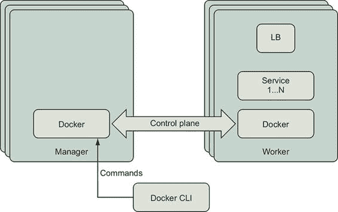
> 
> 通过向 Swarm 集群的管理节点发出适当的`docker`命令来管理 Docker 服务、网络和其他 Swarm 资源。当你使用`docker` CLI 发出命令时，它将连接到 Docker Engine API 并请求更新 Swarm 集群的状态。Swarm 的领导者将编排所需的更改，以将集群上的实际应用程序资源收敛到所需状态。
> 
> 如果你向工作节点发出 Docker 命令来管理集群或其资源，你将收到一个错误：
> 
> > `[worker1] $ docker node ls 错误响应来自守护进程：此节点不是 Swarm 管理器。工作节点不能用于查看或修改集群状态。请在管理节点上运行此命令或提升当前节点为管理器。`
> > 
> 在你的集群中的任何管理节点上打开一个命令外壳。使用`docker node ls`列出集群的节点：
> 
> > `[manager1] $ docker node ls ID                            HOSTNAME            STATUS             AVAILABILITY        MANAGER STATUS      ENGINE VERSION 7baqi6gedujmycxwufj939r44 *   manager1            Ready Active              Reachable           18.06.1-ce bbqicrevqkfu8w4f9wli1tjcr     manager2            Ready Active              Leader              18.06.1-ce hdpskn4q93f5ou1whw9ht8y01     manager3            Ready Active              Reachable           18.06.1-ce xle0g72ydvj24sf40vnaw08n0     worker1             Ready Active                                  18.06.1-ce l6fkyzqglocnwc0y4va2anfho     worker2             Ready Active                                  18.06.1-ce [manager1] $`
> > 
> 在前面的输出中，请注意命令是在名为`manager1`的节点上执行的。该节点正在运行管理角色，但不是当前集群的领导者。当向此节点发出集群管理命令时，它将被转发到领导者进行处理。
> 
> 使用 Git 将应用程序克隆到管理节点，并切换到`ch13_multi_tier_app`目录：
> 
> > `git clone https://github.com/dockerinaction/ch13_multi_tier_app.git cd ch13_multi_tier_app`
> > 
> 我们现在可以使用`docker stack`部署应用程序了。`stack`子命令可以部署以两种格式定义的应用程序。第一种格式是我们将使用的 Docker Compose 格式。第二种是较旧且不太受欢迎的分布式应用程序包（DAB）格式。因为我们使用的是 Docker Compose 格式，所以我们将使用`--compose-file`指定组合文件的路径。现在让我们将我们的组合应用程序部署到 Swarm：
> 
> > `docker stack deploy --compose-file docker-compose.yml multi-tier-app`
> > 
> 应用部署应失败并显示错误信息，指出未找到`ch13_multi_tier_app-POSTGRES_PASSWORD`：
> 
> > `$ docker stack deploy --compose-file docker-compose.yml multi-tier-app Creating network multi-tier-app_private Creating network multi-tier-app_public service postgres: secret not found: ch13_multi_tier_app-POSTGRES_PASSWORD`
> > 
> `docker`命令的输出显示 Swarm 能够创建网络，但不能创建服务。Swarm 要求在部署之前，所有服务所依赖的集群级资源都必须存在。因此，当 Docker 确定资源依赖项缺失时，它会停止应用程序的部署。已创建的资源保持原样，可以在后续的部署尝试中使用。这些预部署检查有助于构建健壮的应用程序交付流程。快速失败的部署行为帮助我们迅速发现缺失的依赖项。
> 
> 此应用程序所依赖的缺失的集群级资源是`ch13_multi_tier_app-POSTGRES_PASSWORD`密钥。回想一下，应用程序对该密钥的引用表明它是外部定义的：
> 
> > `secrets:   ch13_multi_tier_app-POSTGRES_PASSWORD:     external: true              # 从集群的密钥资源中检索`
> > 
> 在此上下文中，`external` 表示定义在应用程序部署定义之外，并由 Swarm 提供。现在让我们将应用程序的数据库密码作为 Docker secret 存储在 Swarm 集群中：
> 
> > `echo 'mydbpass72' | docker secret create \   ch13_multi_tier_app-POSTGRES_PASSWORD -`

|    |
| --- |

> 注意
> 
> 这个密码只在这个由 Swarm 管理的 Docker secret 中定义。你可以使用任何有效的 PostgreSQL 密码。请随意更改它。这展示了在 Swarm 中如何轻松安全地处理分布式应用程序的秘密。

|    |
| --- |

> `docker secret` 命令应该成功并打印 Docker 分配的随机标识符来管理秘密。你可以通过列出集群中的秘密来验证秘密是否已创建：
> 
> > `docker secret ls --format "table {{.ID}} {{.Name}} {{.CreatedAt}}"` `1`

+   1 以秘密标识符、名称和自创建以来时间（可选）格式化输出为表格

> 列表应显示秘密最近被创建：
> 
> > `ID NAME CREATED <random id> ch13_multi_tier_app-POSTGRES_PASSWORD 6 seconds ago`
> > 
> 现在让我们再次尝试部署堆栈：
> 
> > `[manager1] $ docker stack deploy \   --compose-file docker-compose.yml multi-tier-app Creating service multi-tier-app_postgres Creating service multi-tier-app_api`
> > 
> `docker stack` 命令应该报告它已为多级应用程序创建了两个 Docker 服务：`multi-tier-app_postgres` 和 `multi-tier-app_api`。列出服务并检查其状态：
> 
> > `docker service ls \   --format "table {{.Name}} {{.Mode}} {{.Replicas}}"` `1`

+   1 以服务名称、模式（可选）和副本数（可选）格式化输出为表格

> 该命令将生成如下输出：
> 
> > `NAME MODE REPLICAS multi-tier-app_api replicated 2/2 multi-tier-app_postgres replicated 1/1`
> > 
> 每个服务都有预期的副本数。PostgreSQL 有一个任务，API 在`REPLICAS`列中有两个任务。
> 
> 你可以通过检查日志来检查`api`服务是否正确启动：
> 
> > `docker service logs --follow multi-tier-app_api`
> > 
> 每个`api`任务都应该记录一条消息，说明它正在初始化，从文件中读取 PostgreSQL 密码，并监听请求。例如：
> 
> > `$ docker service logs --no-task-ids multi-tier-app_api multi-tier-app_api.1@worker1    | 2019/02/02 21:25:22     初始化 api 服务器 multi-tier-app_api.1@worker1    | 2019/02/02 21:25:22     将从 '/run/secrets/POSTGRES_PASSWORD' 读取 postgres 密码 multi-tier-app_api.1@worker1    | 2019/02/02 21:25:22     dial tcp: lookup postgres on 127.0.0.11:53: no such host multi-tier-app_api.1@worker1    | 2019/02/02 21:25:23     dial tcp 10.0.0.12:5432: connect: connection refused multi-tier-app_api.1@worker1    | 2019/02/02 21:25:25     初始化完成，启动 http 服务 multi-tier-app_api.2@manager1   | 2019/02/02 21:25:22     初始化 api 服务器 multi-tier-app_api.2@manager1   | 2019/02/02 21:25:22     将从 '/run/secrets/POSTGRES_PASSWORD' 读取 postgres 密码 multi-tier-app_api.2@manager1   | 2019/02/02 21:25:22     dial tcp: lookup postgres on 127.0.0.11:53: no such host multi-tier-app_api.2@manager1   | 2019/02/02 21:25:23     dial tcp: lookup postgres on 127.0.0.11:53: no such host multi-tier-app_api.2@manager1   | 2019/02/02 21:25:25     初始化完成，启动 http 服务`
> > 
> `docker service logs <service name>` 命令将服务任务部署的节点上的日志消息流式传输到您的终端。您可以通过在管理节点上对 Docker 引擎发出此命令来查看任何服务的日志，但不能在工作节点上。当您查看服务日志时，Docker 引擎连接到集群中运行其任务的引擎，检索日志，并将其返回给您。
> 
> 从日志消息中，我们可以看到这些 `api` 任务似乎正在 `worker1` 和 `manager1` 节点上运行。您的服务任务可能已在不同节点上启动。我们可以通过 `docker service ps` 命令来验证这一点，该命令列出了服务的任务。运行以下命令：
> 
> > `docker service ps \    --format "table {{.ID}} {{.Name}} {{.Node}} {{.CurrentState}}" \` `1` `multi-tier-app_api`

+   1 以表格格式输出必要任务数据（可选）

> 此命令将产生如下输出：
> 
> > `ID NAME NODE CURRENT STATE 5jk32y4agzst multi-tier-app_api.1 worker1 运行 16 分钟前 nh5trkrpojlc multi-tier-app_api.2 manager1 运行 16 分钟前`
> > 
> `docker service ps` 命令报告说，`api` 服务正在运行两个任务，正如预期的那样。请注意，任务以 `<stack name>_<service name>.<replica slot number>` 的形式命名；例如，`multi-tier-app_api.1`。每个任务也都有一个唯一的 ID。`docker service ps` 命令列出了服务上的任务及其状态，无论它们在集群的哪个位置运行。
> 
> 相比之下，当在 `manager1` 节点上运行 `docker container ps` 时，它只显示该节点上运行的单个容器：
> 
> > `$ docker container ps --format "table {{.ID}} {{.Names}} {{.Status}}" CONTAINER ID NAMES STATUS 4a95fa59a7f8 multi-tier-app_api.2.nh5trkrpojlc3knysxza3sffl     Up 27 minutes (healthy)`
> > 
> 服务任务容器的名称由任务名称和唯一的任务 ID 组成。两个`ps`命令都报告说该任务正在运行且状态良好。`api`服务器的镜像定义了一个`HEALTHCHECK`，因此我们可以确信这是真的。
> 
> 太好了——我们的应用程序成功部署，一切看起来都很健康！
> 
> 打开网页浏览器，将其指向集群中任意节点的 8080 端口。Play with Docker 用户应在网页控制台顶部看到一个 8080 超链接。您也可以使用`curl`命令从集群的某个节点向 8080 端口发起 HTTP 请求：
> 
> > `curl http://localhost:8080`
> > 
> `api`服务器应该响应一个类似于以下简单的消息：
> 
> > `欢迎来到 API 服务器！容器 id 256e1c4fb6cb 在 2019-02-03 00:31:23.0915026 +0000 UTC 响应`

|    |
| --- |

> 提示
> 
> 如果您使用 Play with Docker，每个集群节点的详细页面将有一个指向该节点上发布的端口的链接。您可以打开该链接或使用`curl`。

|    |
| --- |

> 当您多次发出该请求时，您应该看到不同的容器 ID 在为您提供服务。这个 shell 脚本将发出四个 HTTP 请求并产生以下输出：
> 
> > ``$ for i in `seq 1 4`; do curl http://localhost:8080; sleep 1; done;`` `1` `欢迎来到 API 服务器！` `2` `服务器 9c2eea9f140c 在 2019-02-05 17:51:41.2050856 +0000 UTC 响应欢迎来到 API 服务器！服务器 81fbc94415e3 在 2019-02-05 17:51:42.1957773 +0000 UTC 响应欢迎来到 API 服务器！服务器 9c2eea9f140c 在 2019-02-05 17:51:43.2172085 +0000 UTC 响应欢迎来到 API 服务器！服务器 81fbc94415e3 在 2019-02-05 17:51:44.241654 +0000 UTC 响应欢迎来到 API 服务器！`

+   1 使用 Bash shell 命令向应用程序发出四个请求；您可以将“localhost”替换为任何集群节点的主机名。

+   2 每个 HTTP 请求的输出

> 在这里，`curl`程序向一个集群节点发出 HTTP GET 请求。在上面的例子中，`curl`程序在集群的某个节点上运行并向该节点上的 8080 端口发送请求。由于没有防火墙阻止`curl`打开到该网络位置的套接字，Docker Swarm 的服务网格将处理到 8080 端口的连接并将请求路由到活动容器。我们将在下一节更详细地研究请求是如何路由到 Docker 服务的。
> 
> 13.3. COMMUNICATING WITH SERVICES RUNNING ON A SWARM CLUSTER
> 
> Docker 使集群外部的客户端连接到集群中运行的服务变得容易。Swarm 还帮助集群内部运行的服务在共享 Docker 网络时找到并相互联系。在本节中，我们将首先探讨 Docker 如何将服务暴露给集群外的世界。然后我们将查看 Docker 服务如何通过使用 Swarm 的服务发现和 overlay 网络功能相互通信。
> 
> 13.3.1\. 使用 Swarm 路由网格路由客户端请求到服务
> 
> Swarm 路由网格提供了一种简单的方法，将运行在容器集群上的服务暴露给外部世界，这是 Swarm 最吸引人的特性之一。路由网格结合了几个复杂的网络构建块来发布服务端口。图 13.5 描述了 Swarm 为示例应用程序创建的逻辑网络拓扑。
> 
> 图 13.5\. 示例应用程序的 Swarm 网络组件
> 
> 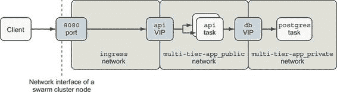
> 
> Swarm 为每个发布的端口在每个集群节点上设置一个监听器。您可以配置端口以监听 TCP、UDP 或两种类型的流量。客户端应用程序可以连接到任何集群节点上的此端口并发出请求。
> 
> Swarm 通过结合 Linux `iptables` 和 `ipvs` 功能来实现此监听器。一个 `iptables` 规则将流量重定向到为服务分配的专用虚拟 IP (VIP)。通过使用 Linux 内核功能 IP 虚拟服务器，`ipvs`，服务的专用 VIP 可在 Swarm 集群中提供。IPVS 是一个传输层负载均衡器，它将 TCP 或 UDP 服务的请求转发到其实际端点。IPVS 不是一个针对 HTTP 等协议的应用层负载均衡器。Swarm 使用 `ipvs` 为每个发布的 Service 端口创建一个 VIP。然后，它将 VIP 绑定到 `ingress` 网络，该网络在 Swarm 集群中可用。
> 
> 回到我们的示例应用程序，当流量到达 TCP 端口 8080 的集群节点时，`iptables` 将该流量重定向到 `ingress` 网络上附加的 `api` 服务 VIP。IPVS 将流量从 VIP 转发到最终端点，即 Docker 服务任务。
> 
> Swarm 的路由网格将处理来自客户端的连接，连接到健康的服务任务，并将客户端的请求数据转发到服务任务。图 13.6 展示了 Swarm 如何将 `curl` 的 HTTP 请求路由到 API 服务任务并返回。
> 
> 图 13.6\. 将 HTTP 请求路由到服务任务
> 
> 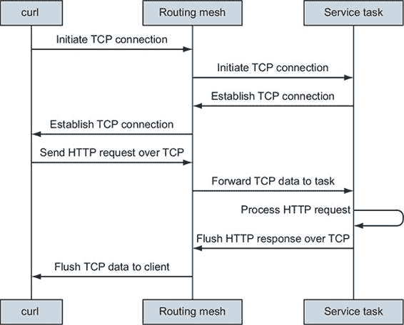
> 
> 当程序连接到发布的端口时，Swarm 将尝试连接到该服务的健康任务。如果服务已扩展到零个副本或不存在健康任务，路由网格将拒绝启动网络连接。一旦建立了 TCP 连接，客户端就可以继续到传输的下一阶段。在 API 服务的例子中，客户端将 HTTP GET 请求写入 TCP 套接字连接。路由网格接收这些数据并将其发送到处理此连接的任务。
> 
> 重要的是要注意，服务任务不需要在处理客户端连接的节点上运行。发布端口为 Docker 服务建立了一个稳定的入口点，该入口点独立于该服务任务在 Swarm 集群中的临时位置。您可以使用 `docker service inspect` 检查服务发布的端口：
> 
> > `$ docker service inspect --format="{{json .Endpoint.Spec.Ports}}" \    multi-tier-app_api [    {    "Protocol": "tcp",    "TargetPort": 80,    "PublishedPort": 8080,    "PublishMode": "ingress"    } ]`
> > 
> 此输出指示 `multi-tier-app_api` 在 TCP 端口 8080 上连接到 `ingress` 网络的监听器，并且流量将被路由到端口号为 80 的服务任务上。

|    |
| --- |

> 跳过路由网格
> 
> 另一种名为 `host` 的 `PublishMode` 跳过了路由网格和 `ingress` 网络的连接。当使用此模式时，客户端将直接连接到指定主机上的服务任务。如果那里部署了任务，它可以处理连接；否则，连接尝试将失败。
> 
> 这种 `PublishMode` 可能最适合在 `global` 模式下部署的服务，这样在集群节点上就只有一个任务，确保任务可以处理请求并避免端口冲突。全局服务在 第 13.4.3 节 中有更详细的解释。

|    |
| --- |

> 客户端通过使用 HTTP 与示例应用程序的 API 服务进行交互。HTTP 是一种应用协议（第 7 层），它通过 TCP/IP（第 4 层）网络协议进行传输。Docker 还支持监听 UDP/IP（第 4 层）的服务。Swarm 路由网格依赖于 IPVS，它在第 4 层路由和平衡网络流量。
> 
> 在第 4 层和第 7 层之间进行路由的区别很重要。因为 Swarm 在 IP 层路由和负载均衡连接，这意味着客户端连接将在后端服务任务之间进行平衡，而不是 HTTP 请求。当一个客户端通过单个连接发出许多请求时，所有这些请求都将发送到单个任务，而不会像预期的那样分布到所有后端服务任务。请注意，Docker 企业版支持 HTTP 协议（第 7 层）的负载均衡，也存在第三方解决方案。
> 
> 13.3.2. 与 overlay 网络一起工作
> 
> Docker Swarm 提供一种名为 overlay 网络的网络资源类型，如图 13.7 所示。#filepos1439530。此网络在逻辑上将其流量与其他网络分离，运行在另一个网络之上。Swarm 集群的 Docker 引擎可以创建连接在不同 Docker 主机上运行的容器的 overlay 网络。在 Docker overlay 网络中，只有连接到该网络的容器可以与该网络上的其他容器通信。overlay 网络将连接到该网络的容器之间的通信与其他网络隔离开来。
> 
> 图 13.7. overlay 网络的分层视图
> 
> 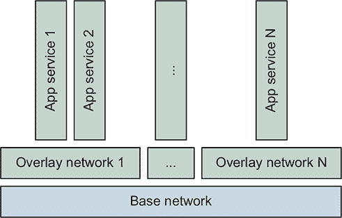
> 
> 考虑覆盖网络的一种方式是，它增强了第五章中描述的用户定义的桥接网络，使其能够跨越 Docker 主机。就像用户定义的桥接网络一样，附加到覆盖网络的所有容器都可以作为对等节点直接相互通信。覆盖网络的一个特殊例子是 `ingress` 网络。
> 
> `ingress` 网络是一个特殊用途的覆盖网络，它是 Docker 在初始化一个集群时创建的。`ingress` 网络的唯一职责是将连接到集群内 Docker 服务发布的端口的客户端流量进行路由。这个网络由 Swarm 管理，并且只有 Swarm 可以将容器附加到 `ingress` 网络。你应该知道，`ingress` 网络的默认配置是没有加密的。
> 
> 如果你的应用程序需要端到端加密，所有发布端口的应使用 TLS 终止它们的连接。TLS 证书可以存储为 Docker 机密，并在服务启动时检索，就像我们在本章中演示的密码，以及在 第十二章 中的 TLS 证书一样。
> 
> 接下来，我们将探讨 Docker 如何帮助服务在共享网络上发现和连接到彼此。
> 
> 13.3.3\. 在覆盖网络中查找服务
> 
> Docker 服务使用域名系统 (DNS) 来发现它们在共享的 Docker 网络上其他 Docker 服务的位置。如果程序知道该服务的名称，它就可以连接到 Docker 服务。在我们的示例应用程序中，`api` 服务器通过 `POSTGRES_HOST` 环境变量配置了数据库服务的名称：
> 
> > `api:   # ... snip ...       environment:         POSTGRES_HOST: 'postgres'`
> > 
> 当一个 `api` 任务创建到 PostgreSQL 数据库的连接时，它将通过 DNS 将 `postgres` 名称解析为 IP。附加到 Docker 覆盖网络的容器会自动由 Docker 配置，通过一个特殊的解析器 127.0.0.11 进行 DNS 查询。这也适用于用户定义的桥接网络和 MACVLAN 网络。Docker 引擎处理发送到 127.0.0.1 的 DNS 查询。如果名称解析请求是针对该网络上存在的 Docker 服务，Docker 将响应该服务的虚拟 IP 地址。如果查询是针对另一个名称，Docker 将将请求转发到该容器主机的正常 DNS 解析器。
> 
> 在我们的示例应用程序中，这意味着当 `api` 服务查找 `postgres` 时，该主机上的 Docker 引擎将响应 `postgres` 服务端点的虚拟 IP，例如，10.0.27.2。`api` 数据库连接驱动程序可以连接到这个虚拟 IP，Swarm 将路由连接到 `postgres` 服务任务，该任务可能位于 10.0.27.3。你可能期望这种方便的名称解析和网络路由功能存在，但并非所有容器编排器都以这种方式工作。
> 
> 如果你还记得之前显示的 图 13.5，你也许也能解释一些看起来不寻常的东西。图 13.8 在这里重现了那个图表。
> 
> 图 13.8\. 示例应用的 Swarm 网络组件
> 
> 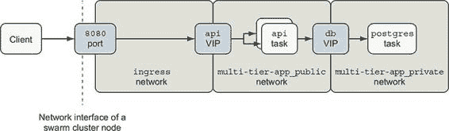
> 
> `api` 服务有三个虚拟 IP，分别在每个它附加的三个覆盖网络上建立其存在：`ingress`、`multi-tier-app_public` 和 `multi-tier-app_private`。如果你检查 `api` 服务的端点，你应该看到输出验证了这三个网络上的 `VirtualIPs`：
> 
> > `docker service inspect --format '{{ json .Endpoint.VirtualIPs }}' \ multi-tier-app_api [ { "NetworkID": "5oruhwaq4996xfpdp194k82td", "Addr": "10.255.0.8/16" }, { "NetworkID": "rah2lj4tw67lgn87of6n5nihc", "Addr": "10.0.2.2/24" }, { "NetworkID": "vc12njqthcq1shhqtk4eph697", "Addr": "10.0.3.2/24" } ]`

+   1 入口网络层

+   2 多层-app_private 网络层

+   3 multi-tier-app_public 网络层

> 跟随一个实验，该实验演示了附加到网络上的服务及其背后的容器的可发现性。启动一个 shell 并将其附加到 `multi-tier-app_private` 网络上：
> 
> > `docker container run --rm -it --network multi-tier-app_private \ alpine:3.8 sh`
> > 
> 我们可以将我们的 shell 容器附加到应用程序的 `private` 网络上，因为它被定义为 `attachable`：
> 
> > `private: driver: overlay driver_opts: encrypted: "true" attachable: true`
> > 
> 默认情况下，只有 Swarm 可以将容器服务任务附加到网络。这个 `private` 网络被特别设置为可附加，以便进行此服务发现练习。
> 
> Ping `postgres` 服务一次。你应该看到类似以下输出：
> 
> > `/ # ping -c 1 postgres PING postgres (10.0.2.6): 56 数据字节 64 字节来自 10.0.2.6: seq=0 ttl=64 time=0.110 ms  --- postgres ping 统计信息 --- 1 个数据包已传输，1 个数据包已接收，0% 数据包丢失，往返时间最小/平均/最大 = 0.110/0.110/0.110 ms`
> > 
> 现在 ping `api` 服务：
> 
> > `/ # ping -c 1 api PING api (10.0.2.2): 56 数据字节 64 字节来自 10.0.2.2: seq=0 ttl=64 time=0.082 ms  --- api ping 统计信息 --- 1 个数据包已传输，1 个数据包已接收，0% 数据包丢失，往返时间最小/平均/最大 = 0.082/0.082/0.082 ms`
> > 
> 让我们使用 Netcat 从 `private` 网络上的 shell 手动发出对 `api` 服务的请求：
> 
> > `$ printf 'GET / HTTP/1.0\nHost: api\n\n' | nc api 80`

+   1 创建一个 HTTP 请求并通过 Netcat 发送到 API

> 你应该看到与上一节类似的输出：
> 
> > `HTTP/1.0 200 OK 连接: 关闭 内容类型: text/plain; charset=utf-8 日期: Wed, 13 Feb 2019 05:21:43 GMT 内容长度: 98  欢迎来到 API 服务器！服务器 82f4ab268c2a 在 2019-02-13 05:21:43.3537073 +0000 UTC 响应。`
> > 
> 我们成功从连接到`private`网络的 shell 向`api`服务发出了请求。这是因为`api`服务除了连接到`public`和`ingress`网络外，还连接到了`private`网络。你还可以从你的 shell 连接到 PostgreSQL 数据库：
> 
> > `/ # nc -vz postgres 5432 postgres (10.0.2.6:5432) open`
> > 
> 这个 Netcat 命令在端口 5432 上打开到`postgres`主机名的套接字，然后立即关闭。Netcat 的输出表明它成功连接到了`postgres` VIP，10.0.2.6。这可能会让你感到惊讶。毕竟，如果你回顾`postgres`服务定义，你可以确认我们从未发布或暴露过任何端口。这里发生了什么？
> 
> 连接到给定 Docker 网络的容器之间的通信是完全开放的。在 Docker overlay 网络上的容器之间没有防火墙。因为 PostgreSQL 服务器正在监听端口 5432，并且连接到`private`网络，所以任何连接到该网络的另一个容器都可以连接到它。
> 
> 在某些情况下，这种行为可能很方便。然而，你可能需要以不同于你习惯的方式处理连接服务之间的访问控制。接下来，我们将讨论一些隔离服务间通信的想法。
> 
> 13.3.4. 使用 overlay 网络隔离服务间通信
> 
> 许多人通过限制可以连接到该服务的网络连接来控制对服务的访问。例如，使用允许从服务 A 到服务 B 流量流动但禁止从 B 到 A 反向流量的防火墙是很常见的。这种方法不适合 Docker overlay 网络，因为连接到给定网络的对等体之间没有防火墙。流量在两个方向上自由流动。overlay 网络唯一可用的访问控制机制是（或不是）连接到网络。
> 
> 然而，你可以通过使用 Docker overlay 网络来实现应用程序流量流的实质性隔离。Overlay 网络轻量级且易于 Swarm 创建，因此可以用作设计工具来创建安全的应用程序通信拓扑。你可以为你的应用程序部署使用细粒度、特定于应用程序的网络，以避免共享服务来实现隔离。示例应用程序展示了这种方法，除了将`private`网络设置为可连接之外。
> 
> 需要记住的关键点是，尽管在范围紧密的网络中流量可能仅限于几个容器，但并没有使用网络标识来验证和授权流量的说法。当应用程序需要控制对其功能的访问时，应用程序必须在应用级别验证客户端的身份和授权。示例应用程序通过使用 PostgreSQL 用户名和密码来控制对 `postgres` 数据库的访问。这确保了只有 `api` 服务可以与我们的部署中的数据库交互。`api` 服务旨在匿名使用，因此它没有实现身份验证，但它当然可以。
> 
> 你可能会遇到的一个挑战是集成集中式、共享的服务，例如日志服务。假设我们的示例应用程序和集中式日志服务连接到共享网络。Docker 网络将允许 `logging` 服务在需要时（或攻击者）联系 `api` 或 `postgres` 服务。
> 
> 解决这个问题的方法是部署集中式日志服务或其他共享服务作为发布端口的 Docker 服务。Swarm 将在 `ingress` 网络上为 `logging` 服务设置监听器。运行在集群内部的客户端可以像连接其他已发布服务一样连接到该服务。来自集群内部运行的任务和容器的连接将按照第 13.3.1 节中描述的方式路由到日志服务。因为日志服务的监听器将在 Swarm 集群的每个节点上可用，所以日志服务应该验证其客户端。
> 
> 让我们用一个简单的 `echo` 服务来演示这个想法，该服务会回复你发送的任何输入。首先创建该服务：
> 
> > `docker service create --name echo --publish '8000:8' busybox:1.29 \ nc -v -lk -p 8 -e /bin/cat`
> > 
> 如果你通过集群节点的 8000 端口使用 Netcat (`nc`) 向 `echo` 服务发送数据：
> 
> > `echo "Hello netcat my old friend, I've come to test connections again." \ | nc -v -w 3 192.168.1.26 8000` `1`

+   1 将 192.168.1.26 替换为你的集群节点之一的 IP 地址，或者在 Linux 上使用 $(hostname -i) 来替换当前主机的 IP 地址。

> Netcat 应该打印出类似于以下内容的响应：
> 
> > `192.168.1.26 (192.168.1.26:8000) open Hello netcat my old friend, I've come to test connections again.`
> > 
> 客户端应通过使用该服务发布的端口连接到共享服务。切换到或重新打开上一节中创建的 shell，以便我们可以验证一些事情：
> 
> > `docker container run --rm -it --network multi-tier-app_private \ alpine:3.8 sh`
> > 
> 然后，如果你尝试 ping `echo` 服务，ping 将报告错误：
> 
> > `/ $ ping -c 1 echo ping: bad address 'echo'`
> > 
> 当尝试解析主机名 `echo` 时，`nslookup` 也会出现相同的情况：
> 
> > `/ $ nslookup echo nslookup: can't resolve '(null)': Name does not resolve`
> > 
> 当附加到`multi-tier-app_private`网络时，`echo`服务的名称无法解析。`api`服务需要连接到在集群边缘由`echo`服务发布的端口，就像在 Swarm 集群外运行的进程一样。到达`echo`服务的唯一途径是通过`ingress`网络。
> 
> 我们可以关于这个设计说一些好事。首先，所有客户端都以统一的方式到达`echo`服务，通过一个已发布的端口。其次，因为我们没有将`echo`服务连接到任何网络（除了隐含的`ingress`网络连接），所以它是隔离的，无法连接到其他服务，除了那些已发布的。第三，Swarm 已经将应用程序认证责任推入应用层，这是它们应该所在的地方。
> 
> 这种设计的主要影响之一是，使用 Docker Compose 描述的应用程序可能依赖于两组服务及其位置名称。首先，一些服务被限定在应用程序的部署范围内，并在其中定义（例如，`api`依赖于`postgres`）。其次，有一些服务，如`echo`服务，应用程序可能依赖于，但它们使用不同的部署生命周期和范围进行管理。这些后者的服务可能被许多应用程序共享。这种第二种类型的服务需要在一个注册表中注册，如企业级的 DNS，以便应用程序可以找到其位置。接下来，我们将检查在发现位置后，如何在服务 VIP 之后平衡客户端连接。
> 
> 13.3.5. 负载均衡
> 
> 让我们探索 Docker 客户端连接如何在 Docker 服务的任务之间进行平衡。客户端通常通过虚拟 IP 连接到 Docker 服务。Docker 服务有一个名为`endpoint-mode`的属性，默认为`vip`。到目前为止，我们一直在使用这个默认的`vip`端点模式。当服务使用`vip`端点模式时，客户端将通过 VIP 访问服务。到该 VIP 的连接将由 Docker 自动进行负载均衡。
> 
> 例如，在第 13.3.3 节中，我们将 shell 附加到`multi-tier-app_private`网络，并使用 Netcat 向`api`发出 HTTP 请求。当 Netcat 将`api`主机名解析为 IP 时，Docker 的内部 DNS 回复了`api`服务的 VIP。在这种情况下，有多个健康的服务任务可用。Docker 的网络路由实现负责在 VIP 后面的健康任务之间平均分配连接。
> 
> Docker 基于网络的负载均衡实现被用于所有通过 VIP 端点路由的流量。这种流量可能来自内部覆盖网络，或者通过发布到`ingress`网络的端口进入。
> 
> Docker 不保证哪个服务任务将处理客户端的请求。即使客户端与健康的任务运行在同一节点上，客户端的请求也可能被发送到另一个节点上的健康任务。这在 `global` 模式（与端点模式不同）的服务中也是真实的，其中每个实例都运行在每个集群节点上。
> 
> 13.4\. 在集群上放置服务任务
> 
> 在本节中，我们将研究 Swarm 如何在集群周围放置任务，并尝试在声明的约束内运行所需数量的服务副本。首先，我们将介绍 Swarm 管理任务放置的粗粒度控制。然后，我们将向您展示如何通过使用亲和力和反亲和力来控制任务放置，这些亲和力和反亲和力是通过内置和操作员指定的节点标签实现的。
> 
> 我们将使用由 Play with Docker 模板创建的五个节点 Swarm 集群，如图 13.9 所示。
> 
> 图 13.9\. 测试 Swarm 集群
> 
> 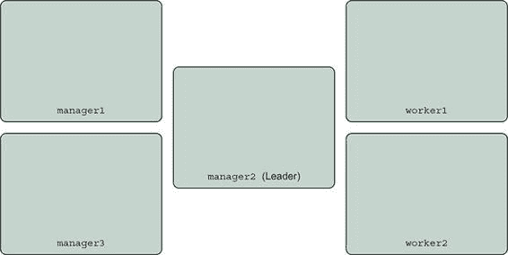
> 
> 此集群有三个管理节点和两个工作节点，其名称如下：

+   `manager1`

+   `manager2`

+   `manager3`

+   `worker1`

+   `worker2`

> 13.4.1\. 复制服务
> 
> 对于 Docker 服务而言，默认且最常用的部署模式是复制模式。Swarm 将尝试始终保持服务定义中指定的副本数量运行。Swarm 会持续协调 Docker Compose 定义或 `docker service` 命令中指定的服务期望状态，以及集群上服务任务的状态。此协调循环，如图 13.10 所示，将不断启动或停止任务以匹配，以确保服务具有所需的健康副本数量。
> 
> 图 13.10\. 事件协调循环
> 
> 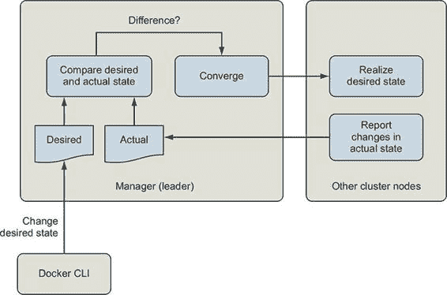
> 
> 复制服务是有用的，因为你可以将服务扩展到所需的副本数量，以处理负载，并且你的集群有足够的资源来支持。
> 
> 在此模式下，Swarm 将在具有足够计算资源（内存、CPU）并满足服务标签约束的集群节点上调度一个服务任务以启动。Swarm 尝试将服务的任务分散到集群的各个节点上。这种策略有助于提高服务的可用性并平衡节点间的负载。我们将在下一节中控制任务运行的位置。现在，让我们看看当我们开始扩展示例应用的 `api` 服务时会发生什么。
> 
> 默认情况下，`api` 服务配置为具有两个副本。部署定义还预留和限制了每个容器可以使用的 CPU 和内存资源：
> 
> > `      deploy:         replicas: 2         restart_policy:             condition: on-failure             max_attempts: 10             delay: 5s         update_config:             parallelism: 1             delay: 5s         resources:           limits:             cpus: '0.50'             memory: 15M           reservations:             cpus: '0.25'             memory: 15M`
> > 
> 当 Swarm 为每个 `api` 任务进行调度时，它将寻找至少有 15 MB 内存和 0.25 个 CPU 的节点，这些资源尚未被其他任务保留。一旦识别到具有足够资源的节点，Swarm 将为该任务创建一个容器，该容器限制为（再次）15 MB 内存，并且可能使用高达 0.5 个 CPU。
> 
> 总体而言，`api` 服务开始时有两个副本，总共保留了 0.5 个 CPU 和 30 MB 内存。现在让我们将我们的服务扩展到五个副本：
> 
> > `docker service scale multi-tier-app_api=5`
> > 
> 服务现在总共保留了 75 MB 的内存和 1.25 个 CPU。Swarm 能够为 `api` 服务的任务找到资源，并将它们分散在这个集群中：
> 
> > `$ docker service ps multi-tier-app_api \   --filter 'desired-state=running' \   --format 'table {{.ID}} {{.Name}} {{.Node}} {{.CurrentState}}' ID           NAME                 NODE     CURRENT STATE dekzyqgcc7fs multi-tier-app_api.1 worker1  Running 4 minutes ago 3el58dg6yewv multi-tier-app_api.2 manager1 Running 5 minutes ago qqc72ylzi34m multi-tier-app_api.3 manager3 Running about a minute ago miyugogsv2s7 multi-tier-app_api.4 manager2 Starting 4 seconds ago zrp1o0aua29y multi-tier-app_api.7 worker1  Running 17 minutes ago`
> > 
> 现在我们来演示一下当服务保留集群所有资源时的样子。只有在你使用的集群允许你耗尽集群资源并阻止其他任务调度的情况下，你才应该跟随操作。我们完成这些操作后，会撤销所有这些设置，但在某个时刻，将无法再调度任何保留 CPU 的新任务。我们建议你不要在 Play with Docker (PWD) 上运行这种资源耗尽练习，因为底层的机器是由使用 PWD 的每个人共享的。
> 
> 首先，让我们将我们的 `api` 任务保留的 CPU 从四分之一 CPU 增加到整个 CPU：
> 
> > `docker service update multi-tier-app_api --reserve-cpu 1.0 --limit-cpu 1.0`
> > 
> 你会看到 Docker 在节点容量限制下为每个任务重新创建容器时，正在将任务在节点间调度。
> 
> 现在我们尝试将服务扩展到更多的副本数量，这将耗尽集群的可用资源。例如，如果你运行的是一个五节点集群，并且每个节点有 2 个 CPU，那么总共应该有 10 个 CPU 可用。
> 
> 以下输出来自一个有 10 个可用 CPU 的集群。`postgres` 服务已保留 1 个 CPU。`api` 服务可以成功扩展到 9 个副本：
> 
> > `$ docker service scale multi-tier-app_api=9 multi-tier-app_api scaled to 9 overall progress: 9 out of 9 tasks 1/9: running   [==================================================>] ... snip ... 9/9: running   [==================================================>] verify: Service converged`
> > 
> 所有 10 个 CPU 现在都已被 `api` 和 `postgres` 服务保留。当将服务扩展到 10 个副本时，`docker` 程序似乎挂起了：
> 
> > `docker service scale multi-tier-app_api=10 multi-tier-app_api scaled to 10 overall progress: 9 out of 10 tasks 1/10: running   [==================================================>] ... snip ... 10/10: no suitable node (insufficient resources on 5 nodes)` `1`

+   1 创建第 10 个 api 任务时资源不足

> 输出报告集群的五个节点上资源不足，无法启动第 10 个任务。问题发生在 Swarm 尝试为第 10 个 `api` 服务任务槽调度任务时。当你耗尽可预订资源时，你需要使用 `^C` 键盘操作中断 `docker stack deploy` 命令以获取终端或等待命令超时。Docker 命令将建议你运行 `docker service ps multi-tier-app_api` 以获取更多信息并检查服务是否收敛。
> 
> 现在就去做，并验证 `api` 任务是否已分布到所有集群节点，Swarm 无法调度最后一个任务。在这种情况下，我们知道除非我们增加集群容量或减少期望的副本数量，否则集群永远不会收敛。让我们撤销我们的更改。

|    |
| --- |

> 自动缩放服务
> 
> Docker Swarm 不支持使用内置功能自动缩放服务。第三方解决方案可以使用资源使用指标，如 CPU 或内存利用率，或应用程序级别的指标，如每任务的 HTTP 请求。Docker Flow 项目是一个很好的起点，[`monitor.dockerflow.com/auto-scaling/`](https://monitor.dockerflow.com/auto-scaling/)。

|    |
| --- |

> 我们有几种方法可以撤销缩放更改。我们可以从源定义重新部署我们的堆栈，使用 `docker service rollback` 子命令回滚服务配置更改，或者“向前滚动”并将服务缩放直接设置为可以工作的某个值。尝试回滚：
> 
> > `$ docker service rollback multi-tier-app_api multi-tier-app_api rollback: manually requested rollback overall progress: rolling back update: 9 out of 9 tasks ... snip ... verify: Service converged`
> > 
> `service rollback` 子命令将服务的期望配置回滚一个版本。`multi-tier-app_api` 的先前配置有九个副本。你可以通过运行 `docker service ls` 来确认此配置是否生效。输出应显示 `multi-tier-app_api` 服务正在运行的副本数已达到预耗尽数；例如，9/9。你可能想知道如果你再次运行 `rollback` 会发生什么。如果你执行另一个 `rollback`，Docker 将恢复具有 10 个服务副本的配置，再次耗尽资源。也就是说，Docker 将撤销回滚，使我们回到起点。由于我们想撤销多个更改，我们需要另一种方法。
> 
> 在我们的情况下，最干净的方法是从其源定义重新部署服务：
> 
> > `docker stack deploy --compose-file docker-compose.yml multi-tier-app`
> > 
> 使用`docker service ps`查看服务任务，以确保服务已返回 Docker Compose 应用程序定义中声明的状态：
> 
> > `docker service ps multi-tier-app_api \      --filter 'desired-state=running' \      --format 'table {{.ID}} {{.Name}} {{.Node}} {{.CurrentState}}' ID           NAME                 NODE     CURRENT STATE h0to0a2lbm87 multi-tier-app_api.1 worker1  正在运行大约一分钟前 v6sq9m14q3tw multi-tier-app_api.2 manager2 正在运行大约一分钟前`
> > 
> 手动缩放更改已消失。正如预期的那样，有两个`api`任务。
> 
> 注意，一个任务正在`worker1`节点上运行，而另一个任务正在`manager2`节点上运行。这并不是我们大多数部署所期望的任务放置方式。通常，我们希望实现如下架构目标：

+   为运行 Swarm 控制平面保留管理节点，以便它们有专门的计算资源

+   将发布端口的隔离服务，因为它们比`private`服务更容易受到攻击

> 我们将在下一节中使用 Swarm 内置的功能来限制任务运行的位置，以实现这些目标以及更多。
> 
> 13.4.2\. 限制任务运行的位置
> 
> 我们经常想要控制应用程序在集群中的哪些节点上运行。我们可能想要这样做，以便将工作负载隔离到不同的环境或安全区域，利用特殊的机器能力，如 GPU，或者为关键功能保留一组节点。
> 
> Docker 服务提供了一种名为放置约束的功能，允许您控制服务任务可以分配到的节点。使用放置约束，您可以指定服务任务应该或不应该运行的位置。约束可以使用集群节点的内置和用户定义属性。我们将通过每个示例来演示。
> 
> 在上一节中，我们看到当进行扩展时，`api`服务被分配到所有节点。`api`服务不仅运行在管理节点上，还与`postgres`数据库在同一节点上运行，如图 13.11 所示。
> 
> 图 13.11\. API 服务任务无处不在
> 
> 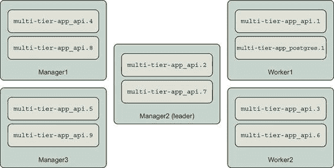
> 
> 许多系统架构师会调整这种部署架构，以便管理节点专门用于运行 Swarm 集群。对于重要的集群来说，这是一个好主意，因为如果服务消耗如 CPU 等资源，Swarm 可能会在监督任务和响应影响集群上所有服务操作的操作命令时落后。此外，由于 Swarm 管理器控制集群，因此应严格控制对这些节点（以及 Docker Engine API）的访问。我们可以使用 Swarm 的节点可用性和服务放置约束来实现这一点。
> 
> 让我们先确保我们的服务不在管理节点上运行。Swarm 集群中的所有节点默认情况下都可以运行服务任务。然而，我们可以通过使用`docker node update`命令的`--availability`选项来重新配置节点的可用性。有三个可用性选项：`active`、`pause`和`drain`。`active`选项表示调度程序可以分配新任务给该节点。`pause`选项表示现有任务将继续运行，但不会为新任务分配给该节点。`drain`选项表示现有任务将被关闭并在另一个节点上重新启动，并且不会为新任务分配给该节点。
> 
> 因此，我们可以将管理节点的可用性设置为`drain`以防止服务任务在其上运行：
> 
> > `docker node update --availability drain manager1 docker node update --availability drain manager2 docker node update --availability drain manager3`
> > 
> 一旦运行了这些命令，`docker node ls`的输出应反映可用性的变化：
> 
> > `docker node ls --format 'table {{ .ID }} {{ .Hostname }} {{ .Availability }}' ID                        HOSTNAME AVAILABILITY ucetqsmbh23vuk6mwy9itv3xo manager1 Drain b0jajao5mkzdd3ie91q1tewvj manager2 Drain kxfab99xvgv71tm39zbeveglj manager3 Drain rbw0c466qqi0d7k4niw01o3nc worker1  Active u2382qjg6v9vr8z5lfwqrg5hf worker2  Active`
> > 
> 我们可以验证 Swarm 是否已将`multi-tier-app`服务任务迁移到工作节点：
> 
> > `docker service ps multi-tier-app_api multi-tier-app_postgres \    --filter 'desired-state=running' \    --format 'table {{ .Name }} {{ .Node }}' NAME                      NODE multi-tier-app_postgres.1 worker2 multi-tier-app_api.1      worker1 multi-tier-app_api.2      worker2`
> > 
> 如果您在管理节点上运行`docker container ps`，您不应看到任何与服务任务相关的容器。
> 
> 放置约束通过表达服务基于某些元数据应在或不应在节点上运行来工作。约束的一般形式如下：
> 
> > `<节点属性>` 等于或不等于 `<值>`
> > 
> 当一个服务被限制在某个节点上运行时，我们说它对该节点有亲和力。当它必须不在某个节点上运行时，我们说它对该节点有反亲和力。您将在本讨论和其他关于服务放置的讨论中看到这些术语的使用。Swarm 的约束语言用`==`表示相等（匹配），用`!=`表示不等。当服务定义了多个约束时，节点必须满足所有约束，任务才能被调度到那里。也就是说，多个约束是`AND`在一起的。例如，假设您想在不在公共安全区的 Swarm 工作节点上运行一个服务。一旦您配置了集群的区元数据，您可以通过运行具有以下约束的服务来实现这一点：`node.role == worker`和`node .labels.zone != public`。
> 
> Docker 支持几个节点属性，可以用作约束的基础：

+   `node.id`— 蜂群集群中节点的唯一标识符（例如，`ucetqsmbh23vuk6mwy9itv3xo`）

+   `node.hostname`— 节点的计算机名，（例如，`worker2`）

+   `node.role`— 节点在集群中的角色，可以是`manager`或`worker`

+   `node.labels.<label name>`— 由操作员应用于节点的标签（例如，具有`zone=public`标签的节点将具有节点属性`node.labels.zone=public`）

+   `engine.labels`— 描述节点和 Docker Engine 关键属性的标签集合，例如 Docker 版本和操作系统（例如，`engine.labels.operatingsystem==ubuntu 16.04`）

> 让我们继续组织我们的系统，通过将集群的 worker 节点分为`public`和`private`区域来组织系统。一旦我们有了这些区域，我们将更新`api`和`postgres`服务，以便它们的任务只在期望的区域中运行。
> 
> 您可以使用`docker node update`命令的`--label-add`选项通过自己的元数据标记 Swarm 集群节点。此选项接受一个键/值对列表，这些键/值对将被添加到节点的元数据中。还有一个`--label-rm`选项可以从节点中删除元数据。这些元数据将可用于将任务约束到特定的节点。
> 
> 让我们将`worker1`识别为`private`区域的一部分，将`worker2`识别为公共区域的一部分：
> 
> > `$ docker node update --label-add zone=private worker1 worker1 $ docker node update --label-add zone=public worker2 worker2`
> > 
> 现在将`api`服务约束到`public`区域。`docker service create`和`update`命令有选项可以添加和删除任务调度约束，分别是`--constraint-add`和`--constraint-rm`。我们添加到服务中的约束告诉 Swarm 只在具有`zone`标签等于`public`的节点上调度`api`服务任务：
> 
> > `docker service update \ --constraint-add 'node.labels.zone == public' \ multi-tier-app_api`
> > 
> 如果一切顺利，Docker 将报告`api`服务的任务已收敛到新状态：
> 
> > `multi-tier-app_api 总进度：2/2 任务 1/2：运行   [==================================================>] 2/2：运行   [==================================================>] 验证：服务收敛`
> > 
> 您可以验证`api`任务已被重新调度到`worker2`节点：
> 
> > `docker service ps multi-tier-app_api \ --filter 'desired-state=running' \ --format 'table {{ .Name }} {{ .Node }}' NAME NODE multi-tier-app_api.1 worker2 multi-tier-app_api.2 worker2`
> > 
> 不幸的是，我们无法在`docker service ps`输出中显示节点标签信息，也无法看到我们使用`docker node ls`添加的标签。目前，查看节点标签的唯一方法是检查节点。以下是一个快速 bash shell 脚本，用于显示集群中所有节点的计算机名、角色和标签信息：
> 
> > ``for node_id in `docker node ls -q | head`; do docker node inspect \ --format '{{.Description.Hostname}} {{.Spec.Role}} {{.Spec.Labels}}'\ "${node_id}"; done;``
> > 
> 这个脚本应该输出以下内容：
> 
> > `manager1 manager map[] manager2 manager map[] manager3 manager map[] worker1 worker map[zone:private] worker2 worker map[zone:public]`
> > 
> 这并不理想，但比试图回忆哪些节点有哪些标签要好。
> 
> 我们需要对这个系统进行的最后调整是将 `postgres` 数据库迁移到 `private` 区域。在这样做之前，使用 `curl` 向 `api` 服务的 `/counter` 端点发出一些查询：
> 
> > `curl http://127.0.0.1:8080/counter`
> > 
> `/counter` 端点将一条记录插入一个具有自增 `id` 列的表中。当 `api` 服务响应时，它会打印出该列中的所有 ID。如果你向该端点发出三个请求，第三个响应的输出应类似于以下内容：
> 
> > `# curl http://127.0.0.1:8080/counter SERVER: c098f30dd3c4 DB_ADDR: postgres DB_PORT: 5432 ID: 1 ID: 2 ID: 3`
> > 
> 这可能看起来有点偏离主题，但插入这些记录将有助于在稍后展示一个关键点。
> 
> 让我们将 `postgres` 任务约束在 `private` 区域：
> 
> > `$ docker service update --constraint-add 'node.labels.zone == private' \    multi-tier-app_postgres multi-tier-app_postgres overall progress: 1 out of 1 tasks 1/1: running   [==================================================>] verify: Service converged`
> > 
> `postgres` 任务现在正在 `worker1` 节点上运行：
> 
> > `$ docker service ps multi-tier-app_postgres \    --filter 'desired-state=running' \    --format 'table {{ .Name }} {{ .Node }}' NAME                      NODE multi-tier-app_postgres.1 worker1`
> > 
> 现在，如果你向 `/counter` 端点发出请求，你会看到以下内容：
> 
> > `$ curl http://127.0.0.1:8080/counter SERVER: c098f30dd3c4 DB_ADDR: postgres DB_PORT: 5432 ID: 1`
> > 
> 计数器已重置。我们的数据去哪了？它丢失了，因为 `postgres` 数据库使用了本地于集群节点的 `db-data` 卷。严格来说，数据并没有丢失。如果 `postgres` 任务迁移回 `worker2` 节点，它将挂载原始卷并从 3 继续计数。如果你在自己的集群中跟随操作并且没有注意到数据丢失，那可能是因为 `postgres` 最初恰好部署到了 `worker1`。这种缺乏确定性和可能的数据丢失并不是一个好的情况。我们能做些什么？
> 
> 默认的 Docker 卷存储驱动程序使用节点的存储。这个存储驱动程序不会在 Swarm 集群中共享或备份数据。有一些 Docker 存储驱动程序增加了这样的功能，包括 Docker CloudStor 和 Rex-Ray。这些驱动程序将使你能够在集群中创建和共享卷。在将重要数据提交给它们之前，你应该仔细调查和测试这些驱动程序。
> 
> 确保任务在给定的节点上持续运行的另一种方法是将其约束到特定的节点。相关的约束选项包括节点主机名、节点 ID 或用户定义的标签。现在，让我们将`postgres`任务约束到`worker1`节点，以确保它不会从该节点移动，即使`private`区域扩展：
> 
> > `docker service update --constraint-add 'node.hostname == worker1' \     multi-tier-app_postgres`
> > 
> 现在，`postgres`服务将不会从该节点移动。检查服务的放置约束显示有两个是活动的：
> 
> > `$ docker service inspect \     --format '{{json .Spec.TaskTemplate.Placement.Constraints }}' \     multi-tier-app_postgres ["node.hostname == worker1","node.labels.zone == private"]`
> > 
> 如果我们想要继续使用这些放置约束，我们将在示例应用程序的 docker-compose.yml 中指定这些。以下是表达`postgres`服务约束的方法：
> 
> > `services:   postgres:     # ... 省略 ...     deploy:       # ... 省略 ...         placement:           constraints:             - node.labels.zone == private             - node.hostname == worker1`
> > 
> 现在放置约束在下次使用`docker stack deploy`部署应用程序时不会丢失。

|    |
| --- |

> 注意
> 
> 为了在像 Swarm 这样的容器集群上安全地运行包含重要数据的数据库，你需要进行大量的谨慎工程。具体的策略可能因数据库实现而异，以便你可以利用数据库特定的复制、备份和数据恢复优势。

|    |
| --- |

> 现在我们已经探讨了如何将服务约束到特定的节点，让我们完全相反的方向，使用`global`服务部署服务到每个地方。
> 
> 13.4.3\. 使用全局服务在每个节点上执行一个任务
> 
> 你可以通过声明服务的模式为`global`来在每个 Swarm 集群的节点上部署一个服务任务。当你想要随着集群的大小扩展服务时，这很有用。常见的用例包括日志记录和监控服务。
> 
> 让我们部署第二个`echo`服务实例作为`global`服务：
> 
> > `docker service create --name echo-global \   --mode global \` `1` `--publish '9000:8' \` `2` `busybox:1.29 nc -v -lk -p 8 -e /bin/cat`

+   1 使用“global”而不是“replicated”

+   2 发布端口 9000 以避免与 echo 服务冲突

> 如果你运行`docker service ls`，你会看到`echo-global`服务正在`global`模式下运行。我们迄今为止部署的其他服务的模式将是`replicated`，默认模式。
> 
> 你可以验证 Swarm 是否在每个可用于任务调度的节点上部署了一个任务。此示例使用上一节的 Swarm 集群，其中只有工作节点可用于任务。`docker service ps`命令确认每个节点上都有一个任务：
> 
> > `docker service ps echo-global \     --filter 'desired-state=running' \     --format 'table {{ .Name }} {{ .Node }}' NAME                                  NODE echo-global.u2382qjg6v9vr8z5lfwqrg5hf worker2 echo-global.rbw0c466qqi0d7k4niw01o3nc worker1`
> > 
> 您可以像使用`echo`服务一样与`echo-global`服务进行交互。使用以下命令发送几条消息：
> 
> > `[worker1] $  echo 'hello' |  nc 127.0.0.1 -w 3 9000` `1`

+   1 通过已发布的端口发送到 echo-global 服务

> 记住客户端连接将通过服务的虚拟 IP 路由（见第 13.3.5 节）。由于 Docker 网络的路由行为，全局服务的客户端可能会连接到另一个节点上的任务，而不是它自己的。随着集群规模的增加，连接到另一个节点上的全局服务任务的概率也会增加，因为连接是均匀分配的。如果您通过`docker service logs --follow --timestamps echo-global`检查日志并向服务发送消息，您可以看到基于连接的负载均衡正在发生。
> 
> 以下输出是通过连接到`worker1`并每隔 1 秒发送消息产生的：
> 
> > `2019-02-23T23:51:01.042747381Z echo-global.0.rx3o7rgl6gm9@``worker2``    | connect to [::ffff:10.255.0.``95``]:8 from [::ffff:10.255.0.3]:40170 ([::ffff:10.255.0.3]:40170) 2019-02-23T23:51:02.134314055Z echo-global.0.hp01yak2txv2@``worker1``    |  connect to [::ffff:10.255.0.``94``]:8 from [::ffff:10.255.0.3]:40172 ([::ffff:10.255.0.3]:40172) 2019-02-23T23:51:03.264498966Z echo-global.0.rx3o7rgl6gm9@``worker2``    | connect to [::ffff:10.255.0.``95``]:8 from [::ffff:10.255.0.3]:40174 ([::ffff:10.255.0.3]:40174) 2019-02-23T23:51:04.398477263Z echo-global.0.hp01yak2txv2@``worker1``    | connect to [::ffff:10.255.0.``94``]:8 from [::ffff:10.255.0.3]:40176 ([::ffff:10.255.0.3]:40176) 2019-02-23T23:51:05.412948512Z echo-global.0.rx3o7rgl6gm9@``worker2``    | connect to [::ffff:10.255.0.``95``]:8 from [::ffff:10.255.0.3]:40178 ([::ffff:10.255.0.3]:40178)`
> > 
> 发送消息的`nc`客户端程序在`worker1`上运行。此日志输出显示客户端的连接在`worker2`上的任务（IP 以`.95`结尾）和`worker1`上的任务（IP 以`.94`结尾）之间弹跳。
> 
> 13.4.4\. 在真实集群上部署实际应用程序
> 
> 前面的练习展示了 Swarm 如何尝试将应用程序的实际已部署资源收敛到应用程序部署描述符中指示的期望状态。
> 
> 随着应用程序的更新、集群资源（如节点和共享网络）的添加或删除，或操作员提供新的配置和机密信息，集群的所需状态会发生变化。Swarm 处理这些事件，并在集群管理节点之间复制的内部日志中更新状态。当 Swarm 看到改变所需状态的事件时，管理器的领导者向集群的其他部分发出命令，以收敛到所需状态。Swarm 将通过启动或更新服务任务、覆盖网络和其他资源来收敛到所需状态，这些资源由操作员指定的约束条件所限制。
> 
> 你可能想知道从 Swarm 的哪些功能开始。首先，列出你想要运行的应用程序类型以及它们将需要的 Swarm 资源类型。其次，考虑你想要如何组织在集群上运行的应用程序。第三，决定集群是否将支持有状态服务（如数据库），并确定一个安全地管理数据的方法。
> 
> 记住，你可以从部署仅使用 Swarm 的网络、配置和机密管理功能的无状态服务开始。这种方法提供了深入了解 Swarm 和服务的多宿主环境操作方式的机会，而不会将数据置于风险之中。
> 
> 通过对集群资源进行深思熟虑的设计和主动监控，你可以确保应用程序在需要时获得所需的资源。你还可以设定集群应托管哪些活动和数据的预期。
> 
> 摘要
> 
> 本章探讨了在 Swarm 管理的宿主集群上运行 Docker 服务的一些方面。练习展示了如何使用 Swarm 最重要的和最常用的功能来部署多种类型的应用程序。我们看到了当集群资源耗尽时会发生什么，并展示了如何从该状态中恢复。我们还重新配置了集群和服务部署，以实现用户定义的架构目标。本章需要理解的关键点包括：

+   管理员定义了由服务共享的集群范围内的资源，如网络、配置和机密信息。

+   服务除了使用集群范围内的资源外，还定义了它们自己的服务范围资源。

+   Swarm 管理器存储和管理集群所需状态的更新。

+   当有足够的资源可用时，Swarm 管理器将实际的应用程序和资源部署收敛到所需状态。

+   服务任务是非持久的，服务更新会导致任务被新的容器替换。

+   只要集群在满足服务放置约束条件的节点上有足够的可用资源，服务任务就可以扩展到所需状态。
