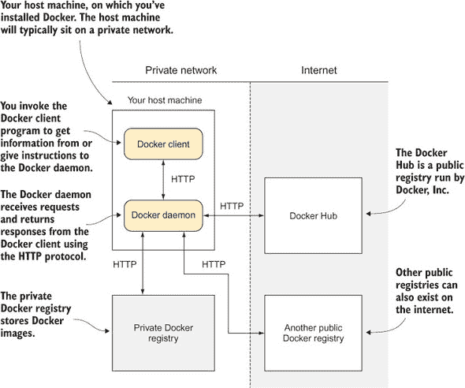
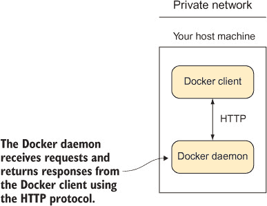
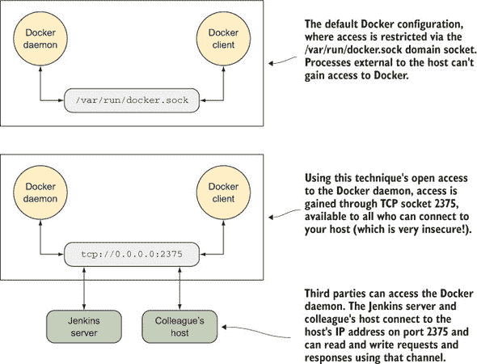
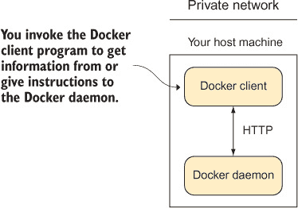
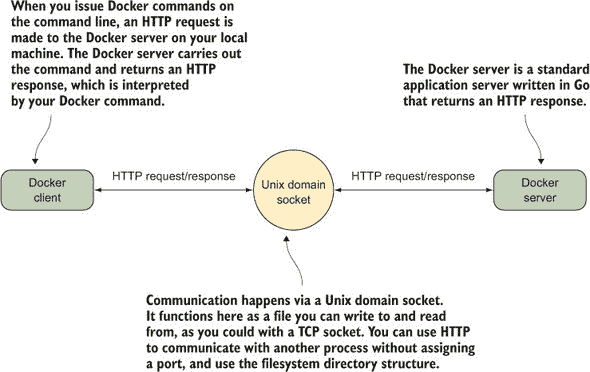
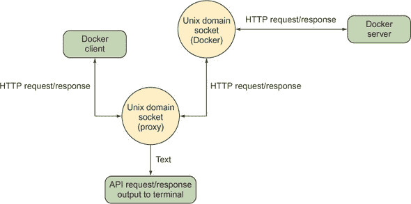
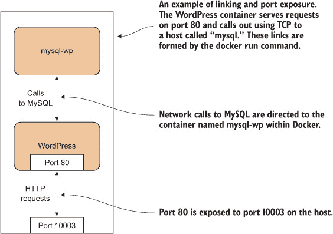
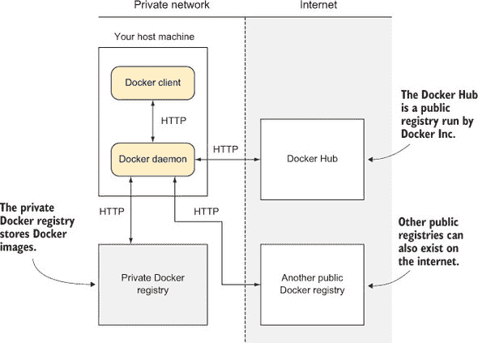
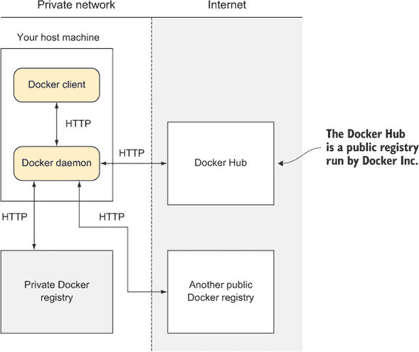

## 第一部分\. Docker 基础知识

本书第一部分由第一章和第二章组成，这些章节将帮助您开始使用 Docker 并涵盖其基础知识。

第一章解释了 Docker 的起源及其核心概念，如镜像、容器和分层。最后，您将通过创建第一个 Dockerfile 来亲自动手。

第二章介绍了一些有用的技术，以帮助您更深入地理解 Docker 的架构。依次介绍每个主要组件，我们将涵盖 Docker 守护进程与其客户端、Docker 注册表和 Docker Hub 之间的关系。

到第一部分结束（部分 1）时，您将熟悉核心 Docker 概念，并能够展示一些有用的技术，为本书的其余部分打下坚实的基础。

## 第二章\. 理解 Docker：引擎室内部


**本章涵盖**

+   Docker 的架构

+   跟踪您主机上 Docker 的内部结构

+   使用 Docker Hub 查找和下载镜像

+   设置您自己的 Docker 注册表

+   容器之间进行通信


掌握 Docker 的架构是全面理解 Docker 的关键。在本章中，您将了解您机器和网络上的 Docker 主要组件的概述，并学习一些将有助于发展这种理解的技术。

在此过程中，您将学习一些实用的技巧，这些技巧将帮助您更有效地使用 Docker（和 Linux）。本书中更晚和更高级的技术大多基于您在这里看到的内容，因此请特别注意以下内容。

### 2.1\. Docker 的架构

图 2.1 展示了 Docker 的架构，这将是本章的核心。我们将从高层次的角度开始，然后专注于每个部分，使用旨在巩固您理解的技术。

##### 图 2.1\. Docker 架构概述



在撰写本文时，您的主机上的 Docker 分为两部分——一个带有 RESTful API 的守护进程和一个与守护进程通信的客户端。图 2.1 显示了运行 Docker 客户端和守护进程的主机。


##### 提示

RESTful API 使用标准的 HTTP 请求类型，如`GET`、`POST`、`DELETE`等，来表示资源和它们上的操作。在这种情况下，镜像、容器、卷等是表示的资源。


您可以通过调用 Docker 客户端来获取守护进程的信息或向其下达指令；守护进程是一个服务器，它通过 HTTP 协议接收来自客户端的请求并返回响应。反过来，它将向其他服务发出请求以发送和接收镜像，同样使用 HTTP 协议。服务器将接受来自命令行客户端或任何被授权连接的人的请求。守护进程还负责在幕后处理您的镜像和容器，而客户端则作为您和 RESTful API 之间的中介。

私有 Docker 仓库是一个存储 Docker 镜像的服务。这些镜像可以从任何具有相关访问权限的 Docker 守护进程请求。此仓库位于内部网络中，不可公开访问，因此被认为是私有的。

您的主机通常会位于一个私有网络中。如果需要，Docker 守护进程会调用互联网以检索镜像。

Docker Hub 是由 Docker Inc. 运营的公共仓库。互联网上还可以存在其他公共仓库，您的 Docker 守护进程可以与它们交互。

在第一章中我们提到 Docker 容器可以被运送到任何可以运行 Docker 的地方——这并不完全正确。实际上，只有当 *守护进程* 可以安装时，容器才会在该机器上运行。

从 图 2.1 中可以得出的关键点是，当您在机器上运行 Docker 时，您可能正在与机器上的其他进程交互，甚至可能与网络或互联网上运行的服务交互。

现在您已经了解了 Docker 的布局，我们将介绍与图中不同部分相关的各种技术。

### 2.2\. Docker 守护进程

Docker 守护进程（见 图 2.2）是您与 Docker 交互的中心，因此它是开始了解所有相关部分的最佳起点。它控制您机器上 Docker 的访问权限，管理容器和镜像的状态，并协调与外部世界的交互。

##### 图 2.2\. Docker 守护进程




##### 提示

*守护进程* 是一个在后台运行而不是直接受用户控制的进程。*服务器* 是一个接收来自客户端的请求并执行满足这些请求所需操作的进程。守护进程通常也是服务器，它们接受来自客户端的请求以执行这些操作。`docker` 命令是一个客户端，而 Docker 守护进程则充当服务器，负责处理您的 Docker 容器和镜像。


让我们看看一些技术，这些技术展示了 Docker 如何作为一个守护进程有效运行，以及你使用`docker`命令与之交互时，仅限于执行简单请求以执行操作，这与与 Web 服务器的交互非常相似。第一种技术允许其他人连接到你的 Docker 守护进程并执行你可能在主机机器上执行的操作，第二种技术说明了 Docker 容器是由守护进程管理的，而不是由你的 shell 会话管理。

| |
| --- |

**将你的 Docker 守护进程向世界开放**

尽管默认情况下你的 Docker 守护进程只能在你的主机上访问，但允许其他人访问它可能有很好的理由。你可能有一个需要远程调试的问题，或者你可能希望允许你的 DevOps 工作流程的另一个部分在主机机器上启动一个进程。

| |
| --- |

##### 警告

虽然这可能是一种强大且有用的技术，但它被认为是不安全的。任何有权访问的人（包括挂载了 Docker 套接字的容器）都可以利用 Docker 套接字获得 root 权限。

| |
| --- |

**问题**

你希望向其他人开放你的 Docker 服务器。

**解决方案**

以开放的 TCP 地址启动 Docker 守护进程。

图 2.3 概述了此技术的工作原理。

##### 图 2.3\. Docker 可访问性：正常和开放



在你开放 Docker 守护进程之前，你必须首先关闭正在运行的守护进程。你如何做到这一点将取决于你的操作系统（非 Linux 用户应参阅附录 A）。如果你不确定如何操作，请从以下命令开始：

```
$ sudo service docker stop
```

如果你收到如下消息，

```
The service command supports only basic LSB actions (start, stop, restart,
try-restart, reload, force-reload, status). For other actions, please try
to use systemctl.
```

则你有基于 systemctl 的启动系统。尝试以下命令：

```
$ systemctl stop docker
```

如果此操作成功，你不应看到此命令的任何输出：

```
$ ps -ef | grep -E 'docker(d| -d| daemon)\b' | grep -v grep
```

一旦 Docker 守护进程停止，你可以手动重新启动它，并使用以下命令将其向外部用户开放：

```
$ sudo docker daemon -H tcp://0.0.0.0:2375
```

此命令以守护进程(`docker daemon`)启动，使用`-H`标志定义主机服务器，使用 TCP 协议，打开所有 IP 接口（使用`0.0.0.0`），并打开标准的 Docker 服务器端口（`2375`）。

你可以使用以下命令从外部连接：

```
$ docker -H tcp://<your host's ip>:2375 <subcommand>
```

或者，你可以导出`DOCKER_HOST`环境变量（如果你必须使用`sudo`来运行 Docker，则此方法不可用——参见技术 41 以了解如何删除此要求）：

```
$ export DOCKER_HOST=tcp://<your host's ip>:2375
$ docker <subcommand>
```

注意，你还需要在本地机器上执行以下操作之一，因为 Docker 不再监听默认位置。

如果你希望在你的主机上永久更改此设置，你需要配置你的启动系统。有关如何操作的更多信息，请参阅附录 B。

| |
| --- |

##### 警告

如果你使用此技术使 Docker 守护进程监听端口，请注意，将 IP 指定为`0.0.0.0`将允许所有网络接口（包括公共和私有）的用户访问，这通常被认为是不安全的。

| |
| --- |

**讨论**

如果你有一个强大的机器，在安全的私有本地网络内专门用于 Docker，这是一个很好的技术，因为网络上的每个人都可以轻松地将 Docker 工具指向正确的位置——`DOCKER_HOST`是一个众所周知的环境变量，它将通知大多数访问 Docker 的程序在哪里查找。

作为停止 Docker 服务并手动运行它的相对繁琐过程的替代，你可以将挂载 Docker 套接字作为卷（从技术 45）与使用 socat 工具从外部端口转发流量结合起来——只需运行`docker run -p 2375:2375 -v /var/run/docker.sock:/var/run/docker.sock sequenceid/socat`。

你将在本章后面的技术 5 中看到这个技术允许的特定示例。

|  |

**以守护进程运行容器**

随着你对 Docker（如果你和我们一样）越来越熟悉，你可能会开始考虑 Docker 的其他用例，其中第一个就是将 Docker 容器作为后台服务运行。

通过软件隔离以可预测的行为运行 Docker 容器是 Docker 的主要用例之一。这项技术将允许你以适合你操作的方式管理服务。

**问题**

你想在后台以服务形式运行一个 Docker 容器。

**解决方案**

使用`docker run`命令的`-d`标志，并使用相关的容器管理标志来定义服务特性。

Docker 容器——就像大多数进程一样——默认情况下将在前台运行。将 Docker 容器在后台运行的最明显方法就是使用标准的`&`控制操作符。虽然这可行，但如果你在终端会话中注销，你可能会遇到问题，需要使用`nohup`标志，它会在你的本地目录中创建一个包含输出的文件，你需要管理这个文件...你明白了：使用 Docker 守护进程的功能来做这件事要整洁得多。

要这样做，你使用`-d`标志。

```
$ docker run -d -i -p 1234:1234 --name daemon ubuntu:14.04 nc -l 1234
```

当与`docker run`一起使用时，`-d`标志将容器作为守护进程运行。`-i`标志使这个容器能够与你的 Telnet 会话交互。使用`-p`你可以将容器中的 1234 端口发布到主机。`--name`标志允许你给容器起一个名字，这样你以后就可以引用它了。最后，你使用 netcat（`nc`）在 1234 端口上运行一个简单的监听回声服务器。

你现在可以连接到它，并通过 Telnet 发送消息。你会看到容器通过使用`docker logs`命令接收到了消息，如下所示。

##### 列表 2.1\. 使用 Telnet 连接到容器 netcat 服务器

```
$ telnet localhost 1234            *1*
 Trying ::1...
Connected to localhost.
Escape character is '^]'.
hello daemon                       *2*
 ^]                                *3*

telnet> q                          *4*
 Connection closed.
$ docker logs daemon               *5*
 hello daemon
$ docker rm daemon                 *6*
 daemon
$
```

+   ***1*** **使用 telnet 命令连接到容器的 netcat 服务器**

+   ***2*** **输入要发送到 netcat 服务器的文本行**

+   ***3*** **按下 Ctrl-]然后回车键退出 Telnet 会话**

+   ***4*** **输入 q 然后回车键退出 Telnet 程序**

+   ***5*** **运行 docker logs 命令以查看容器的输出**

+   ***6*** **使用 rm 命令清理容器**

你可以看到，以守护进程模式运行容器很简单，但在操作上还有一些问题需要回答：

+   如果服务失败会发生什么？

+   当服务终止时会发生什么？

+   如果服务反复失败会发生什么？

幸运的是，Docker 为这些问题中的每一个都提供了标志！


##### 注意

虽然重启标志通常与守护进程标志（`-d`）一起使用，但使用`-d`运行这些标志不是必需的。


`docker run--restart`标志允许你在容器终止时应用一组规则（所谓的“重启策略”）（见表 2.1）。

##### 表 2.1\. Docker 重启标志选项

| **策略** | **描述** |
| --- | --- |
| no | 容器退出时不重启 |
| always | 容器退出时总是重启 |
| unless-stopped | 总是重启，但会记住显式停止 |
| on-failure[:max-retry] | 仅在失败时重启 |

`no`策略很简单：当容器退出时，不会重启。这是默认设置。

`always`策略也很简单，但值得简要讨论：

```
$ docker run -d --restart=always ubuntu echo done
```

此命令以守护进程模式（`-d`）运行容器，并在终止时总是重启容器（`--restart=always`）。它发出一个简单的`echo`命令，快速完成，然后退出容器。

如果你运行前面的命令，然后运行一个`docker ps`命令，你会看到类似以下的内容：

```
$ docker ps
CONTAINER ID        IMAGE               COMMAND             CREATED
      STATUS                         PORTS               NAMES
69828b118ec3        ubuntu:14.04        "echo done"         4 seconds ago
       Restarting  (0) Less than a second ago             sick_brattain
```

`docker ps`命令列出所有正在运行的容器及其信息，包括以下内容：

+   容器创建的时间（`CREATED`）。

+   容器的当前状态——通常这将会是`Restarting`，因为它只会运行很短的时间（`STATUS`）。

+   容器上次运行的退出代码（也位于`STATUS`下）。`0`表示运行成功。

+   容器名称。默认情况下，Docker 通过连接两个随机单词来命名容器。有时这会产生奇怪的结果（这就是我们通常建议给它们一个有意义的名称的原因）。

注意，`STATUS`列还告诉我们容器在不到一秒前退出并正在重启。这是因为`echo done`命令立即退出，而 Docker 必须不断地重启容器。

需要注意的是，Docker 会重用容器 ID。重启时不会改变，并且对于这个 Docker 调用，`ps`表中只会有一条记录。

指定`unless-stopped`几乎等同于`always`——两者都会在运行`docker stop`命令停止容器时停止重启，但`unless-stopped`会确保如果守护进程重启（例如，如果你重启了电脑），则记住这个停止状态，而`always`将再次将容器启动起来。

最后，`on-failure` 策略仅在容器从其主进程返回非零退出代码（通常表示失败）时重启：

```
$ docker run -d --restart=on-failure:10 ubuntu /bin/false
```

此命令以守护进程模式（`-d`）运行容器，并设置重启尝试次数的限制（`--restart=on-failure:10`），如果超过此限制则退出。它运行一个简单的命令（`/bin/false`），该命令快速完成并肯定会失败。

如果您运行前面的命令并等待一分钟，然后运行 `docker ps -a`，您将看到类似以下内容的输出：

```
$ docker ps -a
CONTAINER ID      IMAGE               COMMAND           CREATED
      STATUS                      PORTS               NAMES
b0f40c410fe3      ubuntu:14.04        "/bin/false"      2 minutes ago
      Exited (1) 25 seconds ago                       loving_rosalind
```

**讨论**

创建在后台运行的服务往往伴随着确保在异常环境中后台服务不会崩溃的困难。因为它不是立即可见的，用户可能不会注意到某些东西没有正确工作。

这种技术让您不再需要考虑由环境和处理重启引起的服务的偶然复杂性。您可以专注于核心功能。

具体来说，您和您的团队可能会使用这项技术在同一台机器上运行多个数据库，并避免编写设置它们的说明或保持它们运行而需要打开终端。

|  |

**将 Docker 移动到不同的分区**

Docker 在一个文件夹下存储与您的容器和镜像相关的所有数据。因为它可以存储大量不同的镜像，所以这个文件夹可能会迅速变大！

如果您的宿主机有不同分区（在企业 Linux 工作站中很常见），您可能会更快地遇到空间限制。在这些情况下，您可能希望将 Docker 运行的目录移动。

**问题**

您想移动 Docker 存储数据的位置。

**解决方案**

使用 `-g` 标志指定新位置来停止和启动 Docker 守护进程。

假设您想从 /home/dockeruser/mydocker 运行 Docker。首先，停止您的 Docker 守护进程（参见附录 B [kindle_split_035.xhtml#app02]，讨论如何执行此操作）。然后运行此命令：

```
$ dockerd -g /home/dockeruser/mydocker
```

在此目录下将创建一组新的文件夹和文件。这些文件夹是 Docker 内部的，因此请谨慎操作（正如我们所发现的！）。

您应该知道，此命令看起来会从您之前的 Docker 守护进程中清除容器和镜像。不要绝望。如果您终止了您刚刚运行的 Docker 进程，并重新启动您的 Docker 服务，您的 Docker 客户端将重新指向其原始位置，您的容器和镜像将返回给您。如果您想使这次移动永久化，您需要相应地配置主机的启动过程。

**讨论**

除了这个明显的用例（在磁盘空间有限的情况下回收磁盘空间）之外，如果你想要严格划分图像和容器的集合，你也可以使用这个技术。例如，如果你可以访问多个由不同所有者拥有的私有 Docker 注册库，那么确保你不小心将私有数据给了错误的人可能值得额外的努力。


### 2.3\. Docker 客户端

Docker 客户端（见图 2.4）是 Docker 架构中最简单的组件。这是你在机器上输入`docker run`或`docker pull`等命令时运行的。它的任务是通过对 Docker 守护进程的 HTTP 请求进行通信。

##### 图 2.4\. Docker 客户端



在本节中，你将了解如何窃听 Docker 客户端和服务器之间的消息。你还将看到一种使用浏览器作为 Docker 客户端的方法，以及一些与端口映射相关的基本技术，这些技术是向编排迈出的第一步，在本书的第四部分（kindle_split_022.xhtml#part04）中讨论。


**使用 socat 监控 Docker API 流量**

有时`docker`命令可能不会按预期工作。大多数情况下，命令行参数的某个方面没有被理解，但偶尔会有更严重的问题，例如 Docker 二进制文件过时。为了诊断问题，查看你与 Docker 守护进程通信的数据流可能很有用。


##### 注意

别慌！这个技术的存在并不意味着 Docker 需要经常调试，或者它在任何方面都不稳定！这个技术主要作为一个理解 Docker 架构的工具，同时也向你介绍 socat，一个强大的工具。如果你像我们一样，在许多不同的位置使用 Docker，你使用的 Docker 版本可能会有所不同。和任何软件一样，不同版本将会有不同的功能和标志，这可能会让你感到困惑。


**问题**

你想调试一个与 Docker 命令相关的问题。

**解决方案**

使用流量嗅探器检查 API 调用并构建自己的。

在这个技术中，你将在你的请求和服务器套接字之间插入一个代理 Unix 域套接字，以查看通过它的内容（如图 2.5 所示）。请注意，你需要 root 或 sudo 权限才能使这个操作生效。

##### 图 2.5\. 主机上的 Docker 客户端/服务器架构



要创建这个代理，你将使用 socat。


##### 小贴士

`socat`是一个强大的命令，它允许你在几乎任何类型的数据通道之间中继数据。如果你熟悉 netcat，你可以将其视为加强版的 netcat。要安装它，请使用你系统的标准包管理器。


```
$ socat -v UNIX-LISTEN:/tmp/dockerapi.sock,fork \
  UNIX-CONNECT:/var/run/docker.sock &
```

在这个命令中，`-v`使输出可读，并指示数据流。`UNIX-LISTEN`部分告诉`socat`监听 Unix 套接字，`fork`确保`socat`在第一个请求后不会退出，而`UNIX-CONNECT`告诉`socat`连接到 Docker 的 Unix 套接字。`&`指定命令在后台运行。如果你通常使用 sudo 运行 Docker 客户端，你在这里也需要这样做。

你请求的守护进程将经过的新路由可以在图 2.6 中看到。每个方向的所有流量都将被`socat`看到并记录到你的终端，除了 Docker 客户端提供的任何输出。

##### 图 2.6\. 在 socat 作为代理插入后的 Docker 客户端和服务器



简单`docker`命令的输出现在看起来类似于这个：

```
$ docker -H unix:///tmp/dockerapi.sock ps -a                               *1*
 > 2017/05/15 16:01:51.163427  length=83 from=0 to=82
GET /_ping HTTP/1.1\r
Host: docker\r
User-Agent: Docker-Client/17.04.0-ce (linux)\r
\r
< 2017/05/15 16:01:51.164132  length=215 from=0 to=214
HTTP/1.1 200 OK\r
Api-Version: 1.28\r
Docker-Experimental: false\r
Ostype: linux\r
Server: Docker/17.04.0-ce (linux)\r
Date: Mon, 15 May 2017 15:01:51 GMT\r
Content-Length: 2\r
Content-Type: text/plain; charset=utf-8\r
\r
OK> 2017/05/15 16:01:51.165175  length=105 from=83 to=187                  *2*
 GET /v1.28/containers/json?all=1 HTTP/1.1\r
Host: docker\r
User-Agent: Docker-Client/17.04.0-ce (linux)\r
\r
< 2017/05/15 16:01:51.165819  length=886 from=215 to=1100                  *3*
 HTTP/1.1 200 OK\r
Api-Version: 1.28\r
Content-Type: application/json\r
Docker-Experimental: false\r
Ostype: linux\r
Server: Docker/17.04.0-ce (linux)\r
Date: Mon, 15 May 2017 15:01:51 GMT\r
Content-Length: 680\r
\r
[{"Id":"1d0d5b5a7b506417949653a59deac030ccbcbb816842a63ba68401708d55383e",
 "Names":["/example1"],"Image":"todoapp","ImageID":
 "sha256:ccdda5b6b021f7d12bd2c16dbcd2f195ff20d10a660921db0ac5bff5ecd92bc2",
 "Command":"npm start","Created":1494857777,"Ports":[],"Labels":{},
 "State":"exited","Status":"Exited (0) 45 minutes ago","HostConfig":
 {"NetworkMode":"default"},"NetworkSettings":{"Networks":{"bridge":
 {"IPAMConfig":null,"Links":null,"Aliases":null,"NetworkID":
 "6f327d67a38b57379afa7525ea63829797fd31a948b316fdf2ae0365faeed632",
 "EndpointID":"","Gateway":"","IPAddress":"","IPPrefixLen":0,
 "IPv6Gateway":"","GlobalIPv6Address":"","GlobalIPv6PrefixLen":0,
 "MacAddress":""}}},"Mounts":[]}]                                        *4*
 CONTAINER ID        IMAGE               COMMAND             CREATED
      STATUS                      PORTS               NAMES              *5*
 1d0d5b5a7b50        todoapp             "npm start"         45 minutes ago
      Exited (0) 45 minutes ago                       example1
```

+   ***1*** **你发出的查看请求和响应的命令**

+   ***2*** **HTTP 请求从这里开始，左侧带有右尖括号。**

+   ***3*** **HTTP 响应从这里开始，左侧带有左尖括号。**

+   ***4*** **Docker 服务器响应的 JSON 内容**

+   ***5*** **用户通常看到的输出，由 Docker 客户端从前面的 JSON 中解释**

前面输出的具体内容将随着 Docker API 的增长和发展而变化。当你运行前面的命令时，你会看到更晚的版本号和不同的 JSON 输出。你可以通过运行`docker version`命令来检查你的客户端和服务器 API 版本。


##### 警告

如果你以前作为 root 运行了 socat，你需要使用 sudo 来运行`docker -H`命令。这是因为 dockerapi.sock 文件属于 root。


使用 socat 不仅是一种强大的调试 Docker 的方法，而且还可以调试你在工作中可能遇到的任何其他网络服务。

**讨论**

对于这项技术，可以想出许多其他用例：

+   Socat 就像瑞士军刀一样，可以处理相当多的不同协议。前面的例子显示了它正在监听 Unix 套接字，但你也可以使用`TCP-LISTEN:2375,fork`而不是`UNIX-LISTEN:...`参数来让它监听外部端口。这相当于技术 1 的一个更简单版本。采用这种方法，无需重新启动 Docker 守护进程（这将杀死所有正在运行的容器）。你可以根据需要随时启动和停止 socat 监听器。

+   由于前面的点设置简单且临时，你可以将其与技术 47 结合使用，以远程连接同事的运行中的容器并帮助他们调试问题。你还可以使用不常用的`docker attach`命令连接到他们使用`docker run`启动的相同终端，这样你可以直接协作。

+   如果你有一个共享的 Docker 服务器（可能使用技术 1 设置），你可以使用暴露外部的能力，并在 Docker 套接字和外部世界之间设置 socat 作为代理，使其充当原始审计日志，记录所有请求的来源和它们所做的事情。

| |
| --- |
| |

**在浏览器中使用 Docker**

推广新技术可能会很困难，所以简单有效的演示是无价的。使演示亲身体验甚至更好，这就是为什么我们发现创建一个允许用户在浏览器中与容器交互的网页是一个很好的技术。它以易于访问的方式让新用户第一次尝试 Docker，允许他们创建容器，在浏览器中使用容器终端，连接到他人的终端，并共享控制。显著的“哇”效果也不无裨益！

**问题**

你希望展示 Docker 的强大功能，而不需要用户自己安装它或运行他们不理解命令。

**解决方案**

使用开放端口和启用跨源资源共享（CORS）的 Docker 守护进程启动，然后在你的选择中提供 docker-terminal 存储库。

REST API 最常见的使用是在服务器上公开它，并在网页上使用 JavaScript 调用它。因为 Docker 恰好通过 REST API 执行所有交互，所以你应该能够以相同的方式控制 Docker。尽管这最初可能看起来令人惊讶，但这种控制甚至可以扩展到通过浏览器中的终端与容器交互。

我们已经在技术 1 中讨论了如何在 2375 端口启动守护进程，所以这里不会对此进行详细说明。此外，CORS 的内容也太多，无法在这里展开。如果你不熟悉它，可以参考 Monsur Hossain 的《CORS in Action》（Manning, 2014）。简而言之，CORS 是一种机制，它小心地绕过了 Java-Script 通常的限制，只允许访问当前域名。在这种情况下，CORS 允许守护进程在不同于你提供 Docker 终端页面的端口上监听。要启用 CORS，你需要使用带有`--api-enable-cors`选项启动 Docker 守护进程，并选择使其监听端口的选项。

现在所有先决条件都已解决，让我们开始运行。首先，你需要获取代码：

```
git clone https://github.com/aidanhs/Docker-Terminal.git
cd Docker-Terminal
```

然后你需要提供文件：

```
python2 -m SimpleHTTPServer 8000
```

上述命令使用 Python 内置的模块从目录中提供静态文件。你可以自由使用你喜欢的任何等效方法。现在在你的浏览器中访问 http://localhost:8000 并启动一个容器。

图 2.7 展示了 Docker 终端是如何连接的。页面托管在你的本地计算机上，并连接到本地计算机上的 Docker 守护进程以执行任何操作。

##### 图 2.7\. Docker 终端的工作原理


如果你想将此链接提供给其他人，请注意以下事项：

+   另一个人不得使用任何类型的代理。这是我们遇到的最常见的错误来源——Docker 终端使用 WebSockets，而目前它们无法通过代理工作。

+   显然，提供`localhost`的链接不会起作用——您需要提供外部 IP 地址。

+   Docker 终端需要知道在哪里找到 Docker API——它应该根据您在浏览器中访问的地址自动完成此操作，但这是需要注意的事项。


##### 提示

如果您对 Docker 更熟悉，您可能会想知道为什么我们没有在这个技术中使用 Docker 镜像。原因是我们仍在介绍 Docker，并且不想为 Docker 新手增加复杂性。将这项技术 Docker 化留作读者的练习。


**讨论**

尽管我们最初使用这项技术作为 Docker 的一个令人兴奋的演示（在可丢弃的机器上轻松共享多个终端可能很难设置，即使使用终端复用器），但我们发现它在一些无关领域有一些有趣的应用。一个例子是使用它来监控命令行中的一些任务的小组训练员。您或他们无需安装任何东西；只需打开您的浏览器，您就可以连接到他们的终端，随时提供帮助！

在类似的情况下，这也有一些协作的优势。在过去，当我们想要与同事分享一个错误时，我们会在 Docker 容器中重现错误，以便我们可以一起追踪它。有了这项技术，就不需要事先进行可能的“但为什么我要用 Docker？”讨论。

|  |

**通过端口连接到容器**

Docker 容器从一开始就被设计为运行服务。在大多数情况下，这些将是一定类型的 HTTP 服务。其中相当一部分将通过浏览器访问的 Web 服务。

这导致了一个问题。如果您在内部环境中在端口 80 上运行多个 Docker 容器，它们都无法在您的宿主机的端口 80 上访问。这项技术展示了您如何通过公开和映射容器中的端口来管理这种常见场景。

**问题**

您想在宿主机的端口上提供多个 Docker 容器服务。

**解决方案**

使用 Docker 的`-p`标志将容器的端口映射到您的宿主机器。

在这个例子中，我们将使用 tutum-wordpress 镜像。假设您想在宿主机器上运行两个这样的镜像来提供不同的博客。

由于许多人之前都想要这样做，有人已经准备了一个任何人都可以获取并启动的镜像。要从外部位置获取镜像，您可以使用`docker pull`命令。默认情况下，镜像将从 Docker Hub 下载：

```
$ docker pull tutum/wordpress
```

当您尝试运行图片而它们尚未存在于您的机器上时，图片也会自动检索。

要运行第一个博客，请使用以下命令：

```
$ docker run -d -p 10001:80 --name blog1 tutum/wordpress
```

此 `docker run` 命令以守护进程（`-d`）模式运行容器，并带有发布标志（`-p`）。它标识了要映射到容器端口（`80`）的宿主机端口（`10001`），并为容器指定一个名称以识别它（`--name blog1 tutum/wordpress`）。

您可以对第二个博客做同样的操作：

```
$ docker run -d -p 10002:80 --name blog2 tutum/wordpress
```

如果您现在运行此命令，

```
$ docker ps | grep blog
```

您将看到两个博客容器被列出，它们的端口映射看起来像这样：

```
$ docker ps | grep blog
9afb95ad3617  tutum/wordpress:latest  "/run.sh" 9 seconds ago
 Up 9 seconds   3306/tcp, 0.0.0.0:10001->80/tcp  blog1
31ddc8a7a2fd  tutum/wordpress:latest  "/run.sh" 17 seconds ago
 Up 16 seconds  3306/tcp, 0.0.0.0:10002->80/tcp  blog2
```

现在，您可以通过导航到 http://localhost:10001 和 http://localhost:10002 来访问您的容器。

当您完成时（假设您不想保留它们——我们将在下一个技术中使用它们），运行此命令：

```
$ docker rm -f blog1 blog2
```

如果需要，您现在应该能够通过自己管理端口分配来在您的宿主机上运行多个相同的镜像和服务。

| |
| --- |

##### 小贴士

当使用 `-p` 标志时，很容易忘记哪个端口是宿主机的，哪个端口是容器的。我们将其视为像从左到右阅读一句话。用户连接到宿主机（`-p`），然后该宿主机端口被传递到容器端口（`host_port:container_port`）。如果您熟悉 SSH 的端口转发命令，这也是相同的格式。

| |
| --- |

**讨论**

暴露端口是 Docker 许多用例中极其重要的部分，您将在本书的许多地方遇到它，尤其是在 第四部分 中，容器之间的通信是日常生活的一部分。

在 技术 80 中，我们将向您介绍虚拟网络，并解释它们在幕后做什么以及它们如何将宿主机端口导向正确的容器。

| |
| --- |
| |

**允许容器通信**

最后一种技术展示了您如何通过暴露端口将容器打开到宿主机网络。您并不总是想将服务暴露给宿主机或外界，但您会想将容器连接到彼此。

此技术展示了您如何使用 Docker 的用户定义网络功能来实现这一点，确保外界无法访问您的内部服务。

**问题**

您希望允许容器之间进行内部通信。

**解决方案**

使用用户定义的网络来使容器能够相互通信。

用户定义的网络简单且灵活。我们使用之前的技术在容器中运行了几个 WordPress 博客，让我们看看我们如何从另一个容器（而不是从您已经看到的从外界）访问它们。

首先，您需要创建一个用户定义的网络：

```
$ docker network create my_network
0c3386c9db5bb1d457c8af79a62808f78b42b3a8178e75cc8a252fac6fdc09e4
```

此命令创建了一个新的虚拟网络，它存在于您的机器上，您可以使用它来管理容器通信。默认情况下，您连接到该网络的任何容器都可以通过其名称相互看到。

接下来，假设你仍然使用前一种技术运行着 `blog1` 和 `blog2` 容器，你可以即时将其中一个连接到你的新网络。

```
$ docker network connect my_network blog1
```

最后，你可以启动一个新的容器，明确指定网络，并查看你是否能从博客的着陆页检索到前五行 HTML。

```
$ docker run -it --network my_network ubuntu:16.04 bash
root@06d6282d32a5:/# apt update && apt install -y curl
[...]
root@06d6282d32a5:/# curl -sSL blog1 | head -n5
<!DOCTYPE html>
<html  lang="en-US" xml:lang="en-US">
<head>
        <meta name="viewport" content="width=device-width" />
        <meta http-equiv="Content-Type" content="text/html; charset=utf-8" />
root@06d6282d32a5:/# curl -sSL blog2
curl: (6) Could not resolve host: blog2
```

| |
| --- |

##### 小贴士

给容器命名非常有用，可以分配易于记忆的主机名，稍后可以引用，但这不是严格必要的——如果只有出站连接，那么你可能不需要查找容器。如果你发现你确实想查找主机名但尚未分配名称，你可以求助于使用终端提示中列出的短镜像 ID（除非它已被主机名覆盖）或在 `docker ps` 输出中。

| |
| --- |

我们的新容器成功访问了我们连接到 `my_network` 的博客，显示了在浏览器中访问它时我们会看到的页面的一些 HTML。另一方面，我们的新容器看不到第二个博客。因为我们从未将其连接到 `my_network`，这很合理。

**讨论**

你可以使用这种技术在一个集群上设置任意数量的容器，只要容器有某种方式可以发现彼此的名称。在 技术 80 中，你将看到一种与 Docker 网络很好地集成的实现方法。同时，下一个技术将从更小的规模开始，展示能够明确连接单个容器及其提供的服务的一些好处。

一个值得注意的额外点是 `blog1` 容器的有趣最终状态。默认情况下，所有容器都连接到 Docker `bridge` 网络，所以当我们要求它加入 `my_network` 时，它除了已经连接的网络外，还加入了该网络。在 技术 80 中，我们将更详细地探讨这一点，看看如何使用 *网络跨越* 作为某些实际场景的模型。

| |
| --- |
| |

**为端口隔离链接容器**

在前一种技术中，你看到了如何让容器与用户定义的网络通信。但还有一种更老的方法来声明容器通信——Docker 的链接标志。这不再是推荐的工作方式，但它已经存在于 Docker 中很长时间了，如果你在野外遇到它，了解这一点是值得的。

**问题**

你希望在不使用用户定义网络的情况下允许容器之间通信。

**解决方案**

使用 Docker 的链接功能，允许容器之间相互通信。

以 WordPress 示例为背景，我们将把 MySQL 数据库层从 WordPress 容器中分离出来，并将它们相互链接，而不需要端口配置或创建网络。图 2.8 展示了最终状态。

##### 图 2.8\. WordPress 配置与链接容器



| |
| --- |

##### 注意

如果您已经可以暴露端口到主机并使用它，为什么还要使用链接呢？链接允许您封装并定义容器之间的关系，而无需将服务暴露给主机的网络（以及可能的外部世界）。例如，您可能出于安全原因想要这样做。

| |
| --- |

按以下顺序运行您的容器，在第一个和第二个命令之间暂停大约一分钟：

```
$ docker run --name wp-mysql \
  -e MYSQL_ROOT_PASSWORD=yoursecretpassword -d mysql
$ docker run --name wordpress \
  --link wp-mysql:mysql -p 10003:80 -d  wordpress
```

首先，您需要给 MySQL 容器命名为 `wp-mysql`，这样您以后就可以引用它了。您还必须提供一个环境变量，以便 MySQL 容器可以初始化数据库（`-e MYSQL_ROOT_PASSWORD=yoursecretpassword`）。您将以守护进程模式运行这两个容器（`-d`），并使用 Docker Hub 的官方 MySQL 镜像引用。

在第二个命令中，您将 WordPress 镜像命名为 `wordpress`，以防您以后需要引用它。您还将 wp-mysql 容器链接到 WordPress 容器（`--link wp-mysql:mysql`）。WordPress 容器内部对 `mysql` 服务器的引用将被发送到名为 `wp-mysql` 的容器。您还使用了本地端口映射（`-p 10003:80`），如技术 6 所述，并添加了 Docker Hub 的官方 WordPress 镜像引用（`wordpress`）。请注意，链接不会等待链接容器中的服务启动；因此，需要在命令之间暂停。更精确的做法是在运行 WordPress 容器之前，在 `docker logs wp-mysql` 的输出中查找“mysqid: ready for connections”。

如果您现在导航到 http://localhost:10003，您将看到 WordPress 的介绍屏幕，并可以设置您的 WordPress 实例。

这个示例的核心是第二个命令中的 `--link` 标志。此标志设置容器的宿主文件，以便 WordPress 容器可以引用 MySQL 服务器，并且这将路由到名为 `wp-mysql` 的任何容器。这具有显著的好处，即可以无需对 WordPress 容器进行任何更改即可更换不同的 MySQL 容器，这使得不同服务的配置管理变得更加容易。

| |
| --- |

##### 注意

容器必须按正确的顺序启动，以便可以在已存在的容器名称上进行映射。在撰写本文时，Docker 不支持动态解析链接。

| |
| --- |

为了以这种方式链接容器，它们的端口必须在构建镜像时指定为暴露。这是通过在镜像构建的 Dockerfile 中使用 `EXPOSE` 命令来实现的。Dockerfile 中 `EXPOSE` 指令中列出的端口也用于使用 `-P` 标志（“发布所有端口”而不是 `-p`，后者指定特定端口）到 `docker run` 命令。

通过以特定顺序启动不同的容器，您已经看到了 Docker 编排的一个简单示例。Docker 编排是任何协调 Docker 容器运行的过程。这是一个庞大且重要的主题，我们将在本书的第四部分（part 4）中深入探讨。

通过将工作负载分割成独立的容器，您已经朝着为您的应用程序创建微服务架构迈出一步。在这种情况下，您可以在不触及 WordPress 容器的情况下在 MySQL 容器上执行工作，反之亦然。这种对运行服务的精细控制是微服务架构的关键操作优势之一。

**讨论**

对一组容器进行这种精确控制并不常见，但它可以作为非常直接且易于推理的替换容器的简单方法。使用此技术示例，您可能想测试不同的 MySQL 版本——WordPress 镜像不需要了解这一点，因为它只是查找`mysql`链接。


### 2.4\. Docker 注册服务器

一旦创建了您的镜像，您可能希望与其他用户共享它们。这就是 Docker 注册器概念出现的地方。

图 2.9 中的三个注册服务器在可访问性方面有所不同。一个是私有网络上的，一个是公开在公共网络上的，另一个是公开的，但仅对注册了 Docker 的用户可访问。它们都使用相同的 API 执行相同的功能，这就是 Docker 守护进程如何能够相互交换地与它们通信。

##### 图 2.9\. Docker 注册服务器



Docker 注册服务器允许多个用户通过 RESTful API 从中央存储库推送和拉取镜像。

注册服务器代码，就像 Docker 本身一样，是开源的。许多公司（如我们公司）设置私有注册服务器以存储和共享其专有镜像。在我们更详细地了解 Docker Inc. 的注册服务器之前，我们将讨论这一点。


**设置本地 Docker 注册服务器**

您已经看到 Docker Inc. 提供了一个服务，人们可以公开分享他们的镜像（如果您想私下进行，您可以选择付费）。但是，您可能有多个原因希望在无需通过枢纽的情况下共享镜像——一些企业喜欢尽可能多地保留内部资源，也许您的镜像很大，通过互联网传输会太慢，或者您可能希望在实验期间保持镜像的私密性，而不想承诺付费。无论原因如何，都有一个简单的解决方案。

**问题**

您希望有一种方式来本地托管您的镜像。

**解决方案**

在您的本地网络中设置一个注册服务器。只需在拥有大量磁盘空间的机器上执行以下命令：

```
$ docker run -d -p 5000:5000 -v $HOME/registry:/var/lib/registry registry:2
```

此命令使注册表在 Docker 主机的 5000 端口上可用（`-p 5000:5000`）。使用 `-v` 标志，它使你的主机上的注册表文件夹（/var/lib/registry）在容器中作为 `$HOME/registry` 可用。因此，注册表的文件将存储在主机上的 /var/lib/registry 文件夹中。

在所有你想访问此注册表的机器上，将以下内容添加到你的守护进程选项中（其中 `HOSTNAME` 是你的新注册表服务器的主机名或 IP 地址）：`--insecure-registry HOSTNAME`（有关如何操作的详细信息，请参阅附录 B）。你现在可以发出以下命令：`docker push HOSTNAME:5000/image:tag`。

如你所见，本地注册表最基本的配置级别，所有数据都存储在 `$HOME/registry` 目录中，是简单的。如果你想扩展或使其更健壮，GitHub 上的存储库（[`github.com/docker/distribution/blob/v2.2.1/docs/storagedrivers.md`](https://github.com/docker/distribution/blob/v2.2.1/docs/storagedrivers.md)）概述了一些选项，例如在 Amazon S3 中存储数据。

你可能想知道 `--insecure-registry` 选项。为了帮助用户保持安全，Docker 只允许你从具有签名 HTTPS 证书的注册表拉取。我们已经覆盖了这一点，因为我们相当确信我们可以信任我们的本地网络。不过，不用说，你在互联网上做这件事应该更加谨慎。

**讨论**

由于注册表设置起来非常简单，因此出现了许多可能性。如果你的公司有多个团队，你可能会建议每个人在备用机器上启动并维护一个注册表，以便在存储镜像和移动它们时具有一定的灵活性。

如果你有一个内部 IP 地址范围，这特别有效——`--insecure-registry` 命令将接受 CIDR 表示法，例如 `10.1.0.0/16`，用于指定允许不安全的 IP 地址范围。如果你不熟悉这个，我们强烈建议你联系你的网络管理员。


### 2.5\. Docker Hub

Docker Hub（见图 2.10）是由 Docker Inc. 维护的注册表。它上面有数万个可供下载和运行的镜像。任何 Docker 用户都可以设置一个免费账户，并将公共 Docker 镜像存储在那里。除了用户提供的镜像外，还维护了官方镜像以供参考。

##### 图 2.10\. Docker Hub



你的镜像通过用户身份验证得到保护，还有一个类似 GitHub 的星级系统来衡量流行度。官方镜像可以是像 Ubuntu 或 CentOS 这样的 Linux 发行版，预安装的软件包如 Node.js，或者像 WordPress 这样的完整软件栈。


**查找和运行 Docker 镜像**

Docker 仓库支持类似于 GitHub 的社交编码文化。如果您想尝试新的软件应用程序，或者寻找一个特定目的的新应用程序，Docker 镜像可以是一个简单的方法来实验，而不会干扰您的宿主机，配置虚拟机，或者担心安装步骤。

**问题**

您想要找到一个作为 Docker 镜像的应用程序或工具并尝试使用它。

**解决方案**

使用 `docker search` 命令查找要拉取的镜像，然后运行它。

假设您对 Node.js 感兴趣。在以下示例中，我们使用 `docker search` 命令搜索了匹配“node”的镜像：

```
$ docker search node
NAME                      DESCRIPTION
 STARS     OFFICIAL   AUTOMATED
node                      Node.js is a JavaScript-based platform for...
   3935      [OK]                                                      *1*
 nodered/node-red-docker   Node-RED Docker images.
   57                   [OK]                                           *2*
 strongloop/node           StrongLoop, Node.js, and tools.
   38                   [OK]                                           *3*
 kkarczmarczyk/node-yarn   Node docker image with yarn package manage...
   25                   [OK]                                           *4*
 bitnami/node              Bitnami Node.js Docker Image
   19                   [OK]
siomiz/node-opencv        _/node + node-opencv
   10                   [OK]
dahlb/alpine-node         small node for gitlab ci runner
   8                    [OK]
cusspvz/node              Super small Node.js container (~15MB) ba...
   7                    [OK]
anigeo/node-forever       Daily build node.js with forever
   4                    [OK]
seegno/node               A node docker base image.
   3                    [OK]
starefossen/ruby-node     Docker Image with Ruby and Node.js installed
   3                    [OK]
urbanmassage/node         Some handy (read, better) docker node images
   1                    [OK]
xataz/node                very light node image
   1                    [OK]
centralping/node          Bare bones CentOS 7 NodeJS container.
   1                    [OK]
joxit/node                Slim node docker with some utils for dev
   1                    [OK]
bigtruedata/node          Docker image providing Node.js & NPM
   1                    [OK]
1science/node             Node.js Docker images based on Alpine Linux
   1                    [OK]
domandtom/node            Docker image for Node.js including Yarn an...
   0                    [OK]
makeomatic/node           various alpine + node based containers
   0                    [OK]
c4tech/node               NodeJS images, aimed at generated single-p...
   0                    [OK]
instructure/node          Instructure node images
   0                    [OK]
octoblu/node              Docker images for node
   0                    [OK]
edvisor/node              Automated build of Node.js with commonly u...
   0                    [OK]
watsco/node               node:7
   0                    [OK]
codexsystems/node         Node.js for Development and Production
   0                    [OK]
```

+   ***1*** **`docker search` 的输出按星级数量排序。**

+   ***2*** **描述是上传者对镜像目的的解释。**

+   ***3*** **官方镜像是指 Docker Hub 信任的镜像。**

+   ***4*** **自动构建的镜像是指使用 Docker Hub 的自动构建功能构建的镜像。**

一旦您选择了一个镜像，您可以通过在名称上执行 `docker pull` 命令来下载它：

```
$ docker pull node                                                         *1*
 Using default tag: latest
latest: Pulling from library/node
5040bd298390: Already exists
fce5728aad85: Pull complete
76610ec20bf5: Pull complete
9c1bc3c30371: Pull complete
33d67d70af20: Pull complete
da053401c2b1: Pull complete
05b24114aa8d: Pull complete
Digest:
 sha256:ea65cf88ed7d97f0b43bcc5deed67cfd13c70e20a66f8b2b4fd4b7955de92297
Status: Downloaded newer image for node:latest                             *2*
```

+   ***1*** **从 Docker Hub 拉取名为 `node` 的镜像**

+   ***2*** **如果 Docker 拉取了新的镜像（而不是确定您已经拥有的镜像没有更新的镜像），您将看到此消息。您的输出可能会有所不同。**

然后，您可以使用 `-t` 和 `-i` 标志交互式地运行它。`-t` 标志为您创建一个 TTY 设备（一个终端），而 `-i` 标志指定此 Docker 会话是交互式的：

```
$ docker run -t -i node /bin/bash
root@c267ae999646:/# node
> process.version
'v7.6.0'
>
```


##### **提示**

您可以通过在先前的 `docker run` 调用中将 `-t -i` 替换为 `-ti` 或 `-it` 来节省按键。从现在起，您将在本书中看到这一点。


通常，镜像维护者会有关于如何运行镜像的具体建议。在 [`hub.docker.com`](http://hub.docker.com) 网站上搜索镜像将带您到镜像的页面。描述标签可能会提供更多信息。


##### **警告**

如果您下载了一个镜像并运行它，您正在运行可能无法完全验证的代码。尽管使用受信任的镜像相对安全，但在互联网上下载和运行软件时，没有任何东西可以保证 100%的安全性。


带着这些知识和经验，您现在可以充分利用 Docker Hub 上的丰富资源。实际上有成千上万的镜像可以尝试，有很多东西可以学习。享受吧！

**讨论**

Docker Hub 是一个极好的资源，但有时它可能很慢——值得停下来决定如何最好地构建您的 Docker 搜索命令以获得最佳结果。无需打开浏览器即可进行搜索的能力，让您能够快速了解生态系统中可能感兴趣的项目，因此您可以更好地针对可能满足您需求的镜像的文档。

当您正在重建镜像时，偶尔运行一次搜索以查看星星数量是否表明 Docker 社区已经开始围绕您当前使用的不同镜像聚集也是有益的。


### 摘要

+   您可以将 Docker 守护进程 API 对外开放，他们只需要一种方式来发起 HTTP 请求——一个网页浏览器就足够了。

+   容器不必接管您的终端。您可以在后台启动它们，稍后再回来处理。

+   您可以使容器通过用户定义的网络（推荐方法）或通过链接进行通信，以非常明确地控制容器间的通信。

+   由于 Docker 守护进程 API 通过 HTTP，如果您遇到问题，使用网络监控工具调试它相对容易。

+   一个特别有用的调试和跟踪网络调用的工具是 `socat`。

+   设置注册表不仅仅是 Docker Inc. 的领域；您可以在本地网络上免费设置自己的注册表以存储私有镜像。

+   Docker Hub 是一个寻找和下载现成镜像的好地方，尤其是那些由 Docker Inc. 正式提供的镜像。
