## 第二部分\. Docker 和开发

在 第一部分 中，你通过示例学习了 Docker 的核心概念和架构。第二部分 将带你从这个基础出发，展示 Docker 在开发中的应用。

第三章 涵盖了使用 Docker 作为轻量级虚拟机。这是一个有争议的领域。尽管虚拟机和 Docker 容器之间存在关键差异，但在许多情况下，使用 Docker 可以显著加快开发速度。这也是一个在进入更高级的 Docker 使用之前熟悉 Docker 的有效方法。

第四章，第五章，和 第六章 涵盖了超过 20 种技术，使构建、运行和管理 Docker 容器更加高效。除了构建和运行容器外，你还将学习如何使用卷持久化数据以及保持你的 Docker 主机有序。

第七章 涵盖了配置管理的重要领域。你将使用 Dockerfile 和传统的配置管理工具来控制你的 Docker 构建。我们还将涵盖创建和维护最小 Docker 镜像以减少镜像膨胀。在本部分结束时，你将拥有大量有用的技术，用于单次使用的 Docker，并准备好将 Docker 带入 DevOps 环境。

## 第三章\. 使用 Docker 作为轻量级虚拟机

| |
| --- |

**本章涵盖**

+   将虚拟机转换为 Docker 镜像

+   管理你的容器服务的启动

+   在进行过程中保存你的工作

+   管理你机器上的 Docker 镜像

+   在 Docker Hub 上共享镜像

+   用 Docker 玩 2048 并获胜

| |
| --- |

自世纪初以来，虚拟机（VM）在软件开发和部署中变得无处不在。将机器抽象为软件使得在互联网时代软件和服务的移动和控制变得更加容易和便宜。

| |
| --- |

##### 小贴士

虚拟机是一种模拟计算机的应用程序，通常用于运行操作系统和应用程序。它可以放置在任何（兼容的）可用的物理资源上。最终用户会像在物理机器上一样体验软件，但管理硬件的人员可以专注于更大规模的资源分配。

| |
| --- |

Docker 不是一个 VM 技术。它不模拟机器的硬件，也不包含操作系统。默认情况下，Docker 容器不受特定硬件限制。如果 Docker 虚拟化了任何东西，它虚拟化的是服务运行的环境，而不是机器。此外，Docker 无法轻松运行 Windows 软件（甚至是为其他 Unix 衍生操作系统编写的软件）。

然而，从某些角度来看，Docker 可以像虚拟机一样使用。对于互联网时代的开发人员和测试人员来说，没有 init 进程或直接硬件交互的事实通常并不重要。而且存在许多显著的共性，例如其与周围硬件的隔离以及其易于采用更细粒度的软件交付方法。

本章将带您了解您可能以前使用虚拟机时使用的 Docker 场景。使用 Docker 不会给您带来任何明显的功能优势，但 Docker 在环境移动和跟踪方面的速度和便利性可能会改变您的开发流程。

### 3.1. 从虚拟机到容器

在一个理想的世界里，从虚拟机迁移到容器将只是运行针对与虚拟机类似的 Docker 镜像的配置管理脚本这么简单。对于我们这些不处于这种幸福状态的人来说，本节将展示您如何将虚拟机转换为容器——或者容器。

| |
| --- |

**将您的虚拟机转换为容器**

Docker Hub 没有所有可能的基镜像，因此对于一些利基 Linux 发行版和用例，人们需要创建自己的。例如，如果您在虚拟机中有一个现有的应用程序状态，您可能希望将该状态放入 Docker 镜像中，以便您可以在此基础上进一步迭代，或者通过使用存在于那里的工具和相关技术来从 Docker 生态系统获益。

理想情况下，您可能希望从头开始构建您虚拟机的等效版本，使用标准的 Docker 技术，例如 Dockerfile 与标准配置管理工具相结合（参见第七章 chapter 7）。然而，现实情况是，许多虚拟机并没有得到仔细的配置管理。这可能是因为虚拟机随着人们的使用而有机地增长，而将其以更结构化的方式重新创建所需的投入并不值得。

**问题**

您有一个想要转换为 Docker 镜像的虚拟机。

**解决方案**

归档并复制虚拟机的文件系统，并将其打包成 Docker 镜像。

首先，我们将虚拟机分为两大类：

+   *本地虚拟机*——虚拟机磁盘镜像存在于您的计算机上，虚拟机执行也在您的计算机上。

+   *远程虚拟机*——虚拟机磁盘镜像存储和虚拟机执行发生在别处。

对于这两组虚拟机（以及您想要从其创建 Docker 镜像的任何其他内容）的原则是相同的——您得到一个文件系统的 TAR 包，并将 TAR 文件添加到`scratch`镜像的`/`目录下。

| |
| --- |

##### 小贴士

`ADD` Dockerfile 命令（与它的兄弟命令`COPY`不同）在它们放置在像这样的镜像中时，会解包 TAR 文件（以及 gzip 文件和其他类似文件类型）。

| |
| --- |
| |

##### 小贴士

`scratch`镜像是一个零字节的伪镜像，您可以在其上构建。通常，它用于此类情况，您想要使用 Dockerfile 复制（或添加）一个完整的文件系统。

| |
| --- |

我们现在将探讨一个您有一个本地 VirtualBox 虚拟机的情况。

在你开始之前，你需要做以下几步：

1.  安装`qemu-nbd`工具（在 Ubuntu 上作为`qemu-utils`包的一部分提供）。

1.  确定你的虚拟机磁盘镜像的路径。

1.  关闭你的虚拟机。

如果你的虚拟机磁盘镜像格式为.vdi 或.vmdk，这个技术应该效果很好。其他格式可能会遇到不同的成功。以下代码演示了如何将你的虚拟机文件转换为虚拟磁盘，这允许你复制其中的所有文件。

##### 列表 3.1\. 提取虚拟机镜像的文件系统

```
$ VMDISK="$HOME/VirtualBox VMs/myvm/myvm.vdi"            *1*
 $ sudo modprobe nbd                                     *2*
 $ sudo qemu-nbd -c /dev/nbd0 -r $VMDISK3((CO1-3))       *3*
 $ ls /dev/nbd0p*                                        *4*
 /dev/nbd0p1 /dev/nbd0p2
$ sudo mount /dev/nbd0p2 /mnt                            *5*
 $ sudo tar cf img.tar -C /mnt .                         *6*
 $ sudo umount /mnt && sudo qemu-nbd -d /dev/nbd0        *7*
```

+   ***1*** **设置一个指向你的虚拟机磁盘镜像的变量**

+   ***2*** **初始化 qemu-nbd 所需的内核模块**

+   ***3*** **将虚拟机磁盘连接到虚拟设备节点**

+   ***4*** **列出可用于在此磁盘上挂载的分区编号**

+   ***5*** **使用 qemu-nbd 将选定的分区挂载到/mnt**

+   ***6*** **从/mnt 创建名为 img.tar 的 TAR 文件**

+   ***7*** **卸载并清理 qemu-nbd 后的操作**


##### 注意

要选择要挂载的分区，运行`sudo cfdisk /dev/nbd0`以查看可用选项。注意，如果你在任何地方看到 LVM，你的磁盘有一个非平凡的分区方案——你需要做一些额外的研究来了解如何挂载 LVM 分区。


如果你的虚拟机是远程管理的，你有选择：要么关闭虚拟机并要求你的运维团队执行你想要的分区的转储，要么在虚拟机运行时创建虚拟机的 TAR 文件。

如果你得到了分区转储，你可以相当容易地挂载它，然后按照以下步骤将其转换为 TAR 文件：

##### 列表 3.2\. 提取分区

```
$ sudo mount -o loop partition.dump /mnt
$ sudo tar cf $(pwd)/img.tar -C /mnt .
$ sudo umount /mnt
```

或者，你也可以从运行中的系统创建一个 TAR 文件。在登录系统后，这个过程相当简单：

##### 列表 3.3\. 提取运行中虚拟机的文件系统

```
$ cd /
$ sudo tar cf /img.tar --exclude=/img.tar --one-file-system /
```

现在，你已经有了一个文件系统镜像的 TAR 文件，你可以使用`scp`将其传输到另一台机器。


##### 警告

从运行中的系统创建 TAR 文件可能看起来是最简单的选项（无需关闭，安装软件或向其他团队提出请求），但它有一个严重的缺点——你可能会复制一个处于不一致状态的文件，并在尝试使用你的新 Docker 镜像时遇到奇怪的问题。如果你必须走这条路，首先尽可能停止尽可能多的应用程序和服务。


一旦你获得了你的文件系统的 TAR 文件，你可以将其添加到你的镜像中。这是这个过程最简单的一步，只需要一个两行的 Dockerfile。

##### 列表 3.4\. 将存档添加到 Docker 镜像

```
FROM scratch
ADD img.tar /
```

现在，你可以运行`docker build.`，你就有你的镜像了！


##### 注意

Docker 提供了`ADD`命令的替代方案，即`docker import`命令，你可以使用`cat img.tar | docker import - new_image _name`。但是，在镜像上使用额外指令构建将需要你创建一个 Dockerfile，所以可能更简单的是走`ADD`路线，这样你可以轻松地查看你的镜像历史。


现在，你已经在 Docker 中有了镜像，你可以开始对其进行实验。在这种情况下，你可能从基于你的新镜像创建一个新的 Dockerfile 开始，以实验去除文件和包。

一旦你完成了这个，并且对结果满意，你就可以在运行的容器上使用 `docker export` 来导出一个新的、更精简的 TAR 文件，你可以将其用作创建新镜像的基础，并重复此过程，直到你得到一个满意的镜像。

图 3.1 中的流程图展示了这个过程。

##### 图 3.1\. 镜像剥离流程图

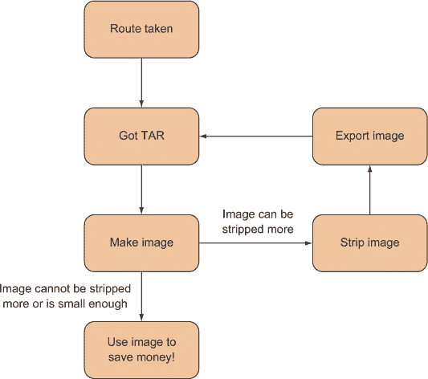

**讨论**

这种技术演示了一些在将虚拟机转换为 Docker 镜像之外的环境中也有用的基本原理和技术。

最广泛地说，它表明 Docker 镜像本质上是一组文件和一些元数据：`scratch` 镜像是可以在其上放置 TAR 文件的空文件系统。当我们查看 *slim* Docker 镜像时，我们将回到这个主题。

更具体地说，你已经看到了如何将 TAR 文件添加到 Docker 镜像中，以及如何使用 `qemu-nbd` 工具。

一旦你有了你的镜像，你可能需要知道如何像更传统的宿主机一样运行它。因为 Docker 容器通常只运行一个应用程序进程，这有些违背常理，下一项技术将涉及这一点。

| |
| --- |
| |

**类似主机的容器**

我们现在将转向 Docker 社区内讨论的更具争议性的领域之一——运行类似主机的镜像，从启动时就有多个进程运行。

在 Docker 社区的一些部分，这被认为是不良的格式。容器不是虚拟机——它们之间存在显著差异——假装没有差异可能会导致混淆和后续问题。

无论好坏，这项技术将向你展示如何运行类似主机的镜像，并讨论一些与此相关的问题。

| |
| --- |

##### **注意**

运行类似主机的镜像可以是说服 Docker 拒绝者 Docker 有用的好方法。随着他们更多地使用它，他们将更好地理解这种范式，并且微服务方法对他们来说将更有意义。在我们引入 Docker 的公司，我们发现这种单体方法是将人们从在开发服务器和笔记本电脑上开发转移到更封闭和可管理的环境中的绝佳方式。从那里，将 Docker 引入测试、持续集成、托管和 DevOps 工作流程变得微不足道。

| |
| --- |
| |

##### 虚拟机与 Docker 容器之间的差异

这些是虚拟机和 Docker 容器之间的一些差异：

+   Docker 是以应用程序为导向的，而虚拟机是以操作系统为导向的。

+   Docker 容器与其他 Docker 容器共享操作系统。相比之下，每个虚拟机都有自己的操作系统，由虚拟机管理程序管理。

+   Docker 容器的设计是为了运行一个主要进程，而不是管理多个进程集。

| |
| --- |

**问题**

你希望你的容器拥有一个类似主机的正常环境，其中设置了多个进程和服务。

**解决方案**

使用设计用于运行多个进程的基础容器。

对于这个技术，你将使用一个设计用于模拟主机的镜像，并配备你需要的应用程序。基础镜像将是 phusion/baseimage Docker 镜像，这是一个设计用于运行多个进程的镜像。

首步是启动镜像，然后使用 `docker exec` 进入它。

##### 列表 3.5\. 运行 phusion 基础镜像

```
user@docker-host$ docker run -d phusion/baseimage                  *1*
 3c3f8e3fb05d795edf9d791969b21f7f73e99eb1926a6e3d5ed9e1e52d0b446e  *2*
 user@docker-host$ docker exec -i -t 3c3f8e3fb05d795 /bin/bash     *3*
 root@3c3f8e3fb05d:/#                                              *4*
```

+   ***1*** **在后台启动镜像**

+   ***2*** **返回新容器的 ID**

+   ***3*** **将容器 ID 传递给 docker exec 并分配一个交互式终端**

+   ***4*** **启动的容器终端的提示**

在此代码中，`docker run` 将在后台启动镜像，启动镜像的默认命令，并返回新创建的容器的 ID。

然后，你将这个容器 ID 传递给 `docker exec`，这是一个在已运行的容器内启动新进程的命令。`-i` 标志允许你与新的进程交互，而 `-t` 表示你想要设置一个 TTY，以便你可以在容器内启动一个终端（`/bin/bash`）。

如果你等待一分钟，然后查看进程表，你的输出将类似于以下内容。

##### 列表 3.6\. 在类似主机的容器中运行的进程

```
root@3c3f8e3fb05d:/# ps -ef                                                *1*
 UID  PID  PPID  C STIME TTY     TIME CMD
root   1     0  0 13:33 ?   00:00:00 /usr/bin/python3 -u /sbin/my_init     *2*
 root   7     0  0 13:33 ?   00:00:00 /bin/bash                            *3*
 root 111     1  0 13:33 ?   00:00:00 /usr/bin/runsvdir -P /etc/service    *4*
 root 112   111  0 13:33 ?   00:00:00 runsv cron                           *5*
 root 113   111  0 13:33 ?   00:00:00 runsv sshd
root 114   111  0 13:33 ?   00:00:00 runsv syslog-ng
root 115   112  0 13:33 ?   00:00:00 /usr/sbin/cron -f
root 116   114  0 13:33 ?   00:00:00 syslog-ng -F -p /var/run/syslog-ng.pid
 --no-caps
root 117   113  0 13:33 ?   00:00:00 /usr/sbin/sshd -D
root 125     7  0 13:38 ?   00:00:00 ps -ef                                *6*
```

+   ***1*** **运行 ps 命令以列出所有运行中的进程**

+   ***2*** **一个简单的 init 进程，用于运行所有其他服务**

+   ***3*** **由 docker exec 启动并作为你的 shell 的 bash 进程**

+   ***4*** **runsvdir 运行在传入的 /etc/service 目录中定义的服务。**

+   ***5*** **在这里使用 runsv 命令启动了三个标准服务（cron、sshd 和 syslog）**

+   ***6*** **当前正在运行的 ps 命令**

你可以看到，容器启动起来就像主机一样，初始化了诸如 cron 和 sshd 等服务，使其看起来类似于标准的 Linux 主机。

**讨论**

尽管这可能在为新手工程师进行 Docker 初始演示时很有用，或者在你特定的环境下确实有用，但值得注意的是，这是一个有些争议的想法。

容器使用的历史通常倾向于将它们用于将工作负载隔离到“每个容器一个服务”。类似主机的镜像方法的支持者认为，这并不违反该原则，因为容器仍然可以在其运行的系统中履行一个单一的离散功能。

最近，Kubernetes 的 pod 和 docker-compose 概念的日益流行使得类似主机的容器相对冗余——可以在更高层次上将独立的容器连接成一个单一实体，而不是使用传统的 init 服务来管理多个进程。

下一个技术将探讨如何将这样的单体应用程序拆分成微服务风格的容器。

|  |

**将系统分割成微服务容器**

我们已经探讨了如何将容器用作单体实体（如经典服务器），并解释了这可以快速将系统架构迁移到 Docker 的一种很好的方式。然而，在 Docker 的世界里，通常认为将系统尽可能分割是最佳实践，直到每个容器运行一个服务，并且所有容器通过网络连接。

使用每个容器一个服务的主要原因是通过单一责任原则更容易地分离关注点。如果你有一个容器只做一项工作，那么在开发、测试和生产软件开发生命周期中，你更容易处理这个容器，同时减少对其与其他组件交互的担忧。这使得交付更加敏捷，软件项目更具可扩展性。然而，这也创造了管理开销，因此考虑它是否值得你的用例是很好的。

不论哪种方法更适合你，最佳实践方法的一个明显优势是，使用 Dockerfile 进行实验和重建要快得多，正如你将看到的。

**问题**

你希望将你的应用程序分解成独立且更易于管理的服务。

**解决方案**

为每个独立的服务进程创建一个容器。

如我们之前提到的，在 Docker 社区中关于“每个容器一个服务”规则应该多么严格地遵循有一些争议，其中一部分源于对定义的分歧——是单个进程，还是满足需求的一组进程的组合？这通常归结为一个声明，即如果有机会从头开始重新设计系统，大多数人会选择微服务。但有时实用性胜过理想主义——在评估我们的组织使用 Docker 时，我们发现自己不得不走单体路线，以便尽可能快且容易地让 Docker 工作。

让我们来看看使用 Docker 内部单体的一些具体缺点。首先，以下列表展示了如何构建一个包含数据库、应用程序和 Web 服务器的单体。

| |
| --- |

##### 注意

这些示例仅用于说明目的，并相应地进行了简化。直接尝试运行它们不一定能成功。

| |
| --- |

##### 列表 3.7\. 设置一个简单的 PostgreSQL、NodeJS 和 Nginx 应用程序

```
FROM ubuntu:14.04
RUN apt-get update && apt-get install postgresql nodejs npm nginx
WORKDIR /opt
COPY . /opt/                                  # {*}
RUN service postgresql start && \
    cat db/schema.sql | psql && \
    service postgresql stop
RUN cd app && npm install
RUN cp conf/mysite /etc/nginx/sites-available/ && \
    cd /etc/nginx/sites-enabled && \
    ln -s ../sites-available/mysite
```

| |
| --- |

##### 小贴士

每个 Dockerfile 命令在之前的基础上创建一个单独的新层，但使用`&&`在你的`RUN`语句中实际上确保了多个命令作为一个命令运行。这很有用，因为它可以使你的镜像更小。如果你以这种方式运行一个包更新命令，如`apt-get update`，并附带一个安装命令，你将确保每次安装包时，它们都将来自更新的包缓存。

| |
| --- |

前面的示例是一个概念上简单的 Dockerfile，它在容器内安装所需的一切，然后设置数据库、应用程序和 Web 服务器。不幸的是，如果你想要快速重建你的容器——任何对你仓库下任何文件的更改都将从 `{*}` 开始重建一切，因为缓存无法重用。如果你有一些缓慢的步骤（数据库创建或 `npm install`），你可能需要等待一段时间才能重建容器。

解决这个问题的方法是将 `COPY . /opt/` 指令拆分为应用程序的各个部分（数据库、应用程序和 Web 设置）。

##### 列表 3.8\. 单体应用的 Dockerfile

```
FROM ubuntu:14.04
RUN apt-get update && apt-get install postgresql nodejs npm nginx
WORKDIR /opt
COPY db /opt/db                                     -+
RUN service postgresql start && \                    |- db setup
    cat db/schema.sql | psql && \                    |
    service postgresql stop                         -+
COPY app /opt/app                                   -+
RUN cd app && npm install                            |- app setup
RUN cd app && ./minify_static.sh                    -+
COPY conf /opt/conf                                 -+
RUN cp conf/mysite /etc/nginx/sites-available/ && \  +
    cd /etc/nginx/sites-enabled && \                 |- web setup
    ln -s ../sites-available/mysite                 -+
```

在前面的代码中，`COPY` 命令被拆分为两个单独的指令。这意味着数据库不会在每次代码更改时重建，因为可以重用之前在代码之前交付的未更改文件的缓存。不幸的是，因为缓存功能相当简单，每次对模式脚本进行更改时，容器仍然需要完全重建。唯一解决这个问题的方法是从顺序设置步骤中移开，并创建多个 Dockerfile，如 列表 3.9 到 3.11 所示。

##### 列表 3.9\. postgres 服务的 Dockerfile

```
FROM ubuntu:14.04
RUN apt-get update && apt-get install postgresql
WORKDIR /opt
COPY db /opt/db
RUN service postgresql start && \
    cat db/schema.sql | psql && \
    service postgresql stop
```

##### 列表 3.10\. nodejs 服务的 Dockerfile

```
FROM ubuntu:14.04
RUN apt-get update && apt-get install nodejs npm
WORKDIR /opt
COPY app /opt/app
RUN cd app && npm install
RUN cd app && ./minify_static.sh
```

##### 列表 3.11\. nginx 服务的 Dockerfile

```
FROM ubuntu:14.04
RUN apt-get update && apt-get install nginx
WORKDIR /opt
COPY conf /opt/conf
RUN cp conf/mysite /etc/nginx/sites-available/ && \
    cd /etc/nginx/sites-enabled && \
    ln -s ../sites-available/mysite
```

当 `db`、`app` 或 `conf` 中的任何一个文件夹发生变化时，只需要重建一个容器。当你有超过三个容器或者有耗时设置步骤时，这尤其有用。通过一些小心谨慎，你可以为每个步骤添加必要的最小文件，从而获得更有用的 Dockerfile 缓存。

在应用程序 Dockerfile (列表 3.10) 中，`npm install` 的操作由一个文件 `package.json` 定义，因此你可以修改你的 Dockerfile 以利用 Dockerfile 层缓存，并且只在必要时重建缓慢的 `npm install` 步骤，如下所示。

##### 列表 3.12\. 更快的 nginx 服务的 Dockerfile

```
FROM ubuntu:14.04
RUN apt-get update && apt-get install nodejs npm
WORKDIR /opt
COPY app/package.json /opt/app/package.json
RUN cd app && npm install
COPY app /opt/app
RUN cd app && ./minify_static.sh
```

现在，你有了三个独立的、分开的 Dockerfile，而之前只有一个。

**讨论**

很遗憾，没有免费的午餐——你用多个 Dockerfile 中的重复内容换取了单个简单的 Dockerfile。你可以通过添加另一个 Dockerfile 作为基础镜像来部分解决这个问题，但一些重复内容并不罕见。此外，现在启动你的镜像有一些复杂性——除了 `EXPOSE` 步骤使适当的端口可用于链接和更改 Postgres 配置外，你还需要确保每次容器启动时都链接容器。幸运的是，有一个名为 *Docker Compose* 的工具可以做到这一点，我们将在 技巧 76 中介绍。

到目前为止，在本节中，你已经将虚拟机转换成了 Docker 镜像，运行了一个类似主机的容器，并将单体拆分成了单独的 Docker 镜像。

如果在阅读这本书之后，您仍然想在容器内运行多个进程，有一些特定的工具可以帮助您做到这一点。其中之一——Supervisord——将在下一个技术中介绍。

|  |

**管理容器服务的启动**

如 Docker 文献中明确指出的，Docker 容器 *不是* 虚拟机。Docker 容器和虚拟机之间的一个主要区别是，容器设计用来运行一个进程。当该进程完成后，容器就会退出。这与 Linux 虚拟机（或任何 Linux OS）不同，因为它没有 init 进程。

init 进程在 Linux OS 上运行，进程 ID 为 1，父进程 ID 为 0。这个 init 进程可能被称为“init”或“systemd”。无论它叫什么，它的任务是管理该操作系统上运行的所有其他进程的维护工作。

如果您开始尝试使用 Docker，可能会发现您想要启动多个进程。例如，您可能想要运行 cron 作业来整理您的本地应用程序日志文件，或者在内容器中设置一个内部 memcached 服务器。如果您选择这条路径，您可能最终会编写 shell 脚本来管理这些子进程的启动。实际上，您将模拟 init 进程的工作。不要这样做！其他人之前已经遇到过许多由进程管理引起的问题，并且已经在预包装系统中得到了解决。

无论您在容器内运行多个进程的原因是什么，避免重新发明轮子是很重要的。

**问题**

您想要在容器内管理多个进程。

**解决方案**

使用 Supervisor 来管理容器中的进程。

我们将向您展示如何配置一个同时运行 Tomcat 和 Apache 网络服务器的容器，并以受管理的方式启动和运行，由 Supervisor 应用程序 ([`supervisord.org/`](http://supervisord.org/)) 管理进程启动。

首先，在新的空目录中创建您的 Dockerfile，如下所示。

##### 列表 3.13\. 示例 Supervisor Dockerfile

```
FROM ubuntu:14.04                                                    *1*
 ENV DEBIAN_FRONTEND noninteractive                                  *2*
 RUN apt-get update && apt-get install -y python-pip apache2 tomcat7 *2*
 RUN pip install supervisor                                          *3*
 RUN mkdir -p /var/lock/apache2                                      *4*
 RUN mkdir -p /var/run/apache2                                       *4*
 RUN mkdir -p /var/log/tomcat                                        *4*
 RUN echo_supervisord_conf > /etc/supervisord.conf                   *5*
 ADD ./supervisord_add.conf /tmp/supervisord_add.conf                *6*
 RUN cat /tmp/supervisord_add.conf >> /etc/supervisord.conf          *7*
 RUN rm /tmp/supervisord_add.conf                                    *8*
 CMD ["supervisord","-c","/etc/supervisord.conf"]                    *9*
```

+   ***1*** **从 ubuntu:14.04 开始**

+   ***2*** **设置一个环境变量以指示此会话是非交互式的**

+   ***3*** **安装 python-pip（用于安装 Supervisor）、apache2 和 tomcat7**

+   ***4*** **使用 pip 安装 Supervisor**

+   ***5*** **创建运行应用程序所需的维护目录**

+   ***6*** **使用 echo_supervisord_conf 工具创建默认的 supervisord 配置文件**

+   ***7*** **将 Apache 和 Tomcat 的 supervisord 配置设置追加到 supervisord 配置文件**

+   ***8*** **删除您上传的文件，因为它不再需要**

+   ***9*** **现在您只需要在容器启动时运行 Supervisor**

您还需要为 Supervisor 配置，以指定它需要启动哪些应用程序，如下一个列表所示。

##### 列表 3.14\. supervisord_add.conf

```
[supervisord]                                                              *1*
 nodaemon=true                                                             *2*

# apache
[program:apache2]                                                          *3*
 command=/bin/bash -c "source /etc/apache2/envvars && exec /usr/sbin/apache2
 -DFOREGROUND"                                                          *4*

# tomcat
[program:tomcat]                                                           *5*
 command=service start tomcat                                              *6*
 redirect_stderr=true                                                      *7*
 stdout_logfile=/var/log/tomcat/supervisor.log                             *7*
 stderr_logfile=/var/log/tomcat/supervisor.error_log
```

+   ***1*** **声明 supervisord 的全局配置部分**

+   ***2*** **不会将 Supervisor 进程作为守护进程运行，因为它是容器的前台进程**

+   ***3*** **新程序的节声明**

+   ***4*** **启动该节中声明的程序的命令**

+   ***5*** **新程序的节声明**

+   ***6*** **启动该节中声明的程序的命令**

+   ***7*** **与日志记录相关的配置**

你使用 Dockerfile 构建镜像时使用标准的单命令 Docker 过程，因为你正在使用 Dockerfile。运行此命令以执行构建：

```
docker build -t supervised .
```

你现在可以运行你的镜像了！

##### 列表 3.15\. 运行受监督的容器

```
$ docker run -p 9000:80 --name supervised supervised                         *1*
 2015-02-06 10:42:20,336 CRIT Supervisor running as root (no user in config
 file)                                                                    *2*
 2015-02-06 10:42:20,344 INFO RPC interface 'supervisor' initialized
2015-02-06 10:42:20,344 CRIT Server 'unix_http_server' running without any
 HTTP authentication checking
2015-02-06 10:42:20,344 INFO supervisord started with pid 1                  *2*
 2015-02-06 10:42:21,346 INFO spawned: 'tomcat' with pid 12                  *3*
 2015-02-06 10:42:21,348 INFO spawned: 'apache2' with pid 13                 *3*
 2015-02-06 10:42:21,368 INFO reaped unknown pid 29
2015-02-06 10:42:21,403 INFO reaped unknown pid 30
2015-02-06 10:42:22,404 INFO success: tomcat entered RUNNING state, process  *4*
 has stayed up for > than 1 seconds (startsecs)                           *4*
 2015-02-06 10:42:22,404 INFO success: apache2 entered RUNNING state, process
 has stayed up for > than 1 seconds (startsecs)                           *4*
```

+   ***1*** **将容器的端口 80 映射到主机的端口 9000，给容器命名，并指定你正在运行的镜像名称，该名称已通过之前的构建命令标记**

+   ***2*** **启动 Supervisor 进程**

+   ***3*** **启动管理进程**

+   ***4*** **Supervisor 已认为管理进程已成功启动。**

如果你导航到 http://localhost:9000，你应该能看到你启动的 Apache 服务器的默认页面。

要清理容器，请运行以下命令：

```
docker rm -f supervised
```

**讨论**

这种技术使用 Supervisor 来管理你的 Docker 容器中的多个进程。

如果你感兴趣的是 Supervisor 的替代方案，还有`runit`，它在技术 12 中提到的 phusion 基础镜像中使用过。


### 3.2\. 保存和恢复你的工作

有些人说，代码只有在提交到源代码控制中才算完成——对于容器来说，持有同样的态度并不总是有害的。使用快照可以通过 VM 保存状态，但 Docker 采取了更加积极的措施来鼓励保存和重用你的现有工作。

我们将介绍“保存游戏”的开发方法、标记的细微之处、使用 Docker Hub 以及在你的构建中引用特定镜像。由于这些操作被认为是如此基本，Docker 使它们相对简单快捷。尽管如此，这仍然可能是 Docker 新手感到困惑的话题，所以在下一段中，我们将带你了解这一主题的完整理解步骤。


**“保存游戏”方法：低成本源代码控制**

如果你曾经开发过任何类型的软件，你很可能至少一次惊叹过，“我确信它之前是工作的！”也许你的语言没有这么冷静。当你匆忙地编写代码以赶上截止日期或修复错误时，无法将系统恢复到已知的好（或可能只是“更好”）状态，这是许多损坏键盘的原因。

源代码控制在这方面有很大帮助，但在这个特定情况下存在两个问题：

+   源代码可能不会反映你的“工作”环境文件系统的状态。

+   你可能还不愿意提交代码。

第一个问题比第二个问题更重要。尽管像 Git 这样的现代源代码控制工具可以轻松创建本地临时分支，但捕获整个开发文件系统的状态并不是源代码控制的目的。

Docker 通过其提交功能提供了一种便宜且快速的方法来存储容器开发文件系统的状态，这正是我们将要探讨的。

**问题**

您想保存您开发环境的状态。

**解决方案**

定期提交您的容器，以便您可以在该点恢复状态。

让我们假设您想从 第一章 中更改您的待办事项应用程序。ToDoCorp 的 CEO 不高兴，希望浏览器标题显示“ToDoCorp 的待办应用”而不是“Swarm+React - TodoMVC”。

您不确定如何实现这一点，所以您可能想启动您的应用程序并通过更改文件来实验，看看会发生什么。

##### 列表 3.16\. 在终端中调试应用程序

```
$ docker run -d -p 8000:8000 --name todobug1 dockerinpractice/todoapp
 3c3d5d3ffd70d17e7e47e90801af7d12d6fc0b8b14a8b33131fc708423ee4372
$ docker exec -i -t todobug1 /bin/bash 2((CO7-2))
```

`docker run` 命令在后台（`-d`）启动待办事项应用程序，将容器的端口 8000 映射到主机上的端口 8000（`-p 8000:8000`），命名为 todobug1（`--name todobug1`）以便于引用，并返回容器 ID。在容器中启动的命令将是构建 `dockerinpractice/todoapp` 镜像时指定的默认命令。我们已经为您构建了它，并在 Docker Hub 上提供。

第二个命令将在运行中的容器中启动 `/bin/bash`。使用 `todobug1` 作为名称，但您也可以使用容器 ID。`-i` 使此 `exec` 运行交互式，`-t` 确保该 `exec` 将像终端一样工作。

现在您已经在容器中，所以实验的第一步是安装一个编辑器。我们更喜欢 vim，所以我们使用了以下命令：

```
apt-get update
apt-get install vim
```

经过一点努力，您会意识到需要更改的文件是 local.html。因此，您将此文件的第 5 行更改为以下内容：

```
<title>ToDoCorp's ToDo App</title>
```

然后，传来消息说 CEO 可能希望标题为小写，因为她听说这样看起来更现代。您想两种情况都做好准备，所以您提交了当前的状态。在另一个终端中，您运行以下命令。

##### 列表 3.17\. 提交容器状态

```
$ docker commit todobug1                                               *1*
 ca76b45144f2cb31fda6a31e55f784c93df8c9d4c96bbeacd73cad9cd55d2970      *2*
```

+   ***1*** **将您之前创建的容器转换为镜像**

+   ***2*** **您已提交的容器的新的镜像 ID**

您现在已将容器提交为镜像，您可以在以后运行它。


##### 注意

提交容器只存储提交时文件系统的状态，而不是进程。记住，Docker 容器不是虚拟机！如果您的环境状态依赖于无法通过标准文件恢复的运行进程的状态，这种技术不会以您需要的方式存储状态。在这种情况下，您可能希望考虑使您的开发流程可恢复。


接下来，您将本地.html 文件更改为其他可能的必需值：

```
<title>todocorp's todo app</title>
```

再次提交：

```
$ docker commit todobug1
071f6a36c23a19801285b82eafc99333c76f63ea0aa0b44902c6bae482a6e036
```

现在，你有两个图像 ID 代表两种选项（在我们的例子中是 ca76b45144f2 cb31f da6a31e55f784c93df8c9d4c96bbeacd73cad9cd55d2970 和 071f6a36c23a19801285 b82eafc99333c76f63ea0aa0b44902c6bae482a6e036，但你的将是不同的）。当 CEO 来评估她想要哪一个时，你可以运行任何一个镜像并让她决定要提交哪一个。

你可以通过打开新的终端并运行以下命令来完成这项操作。

##### 列表 3.18\. 同时运行两个提交的镜像作为容器

```
$ docker run -p 8001:8000 \
 ca76b45144f2cb31fda6a31e55f784c93df8c9d4c96bbeacd73cad9cd55d2970     *1*
 $ docker run -p 8002:8000 \
 071f6a36c23a19801285b82eafc99333c76f63ea0aa0b44902c6bae482a6e036     *2*
```

+   ***1*** **将容器的端口 8000 映射到主机的端口 8001 并指定小写图像 ID**

+   ***2*** **将容器的端口 8000 映射到主机的端口 8002 并指定大写图像 ID**

以这种方式，你可以在 http://localhost:8001 上提供大写选项，在 http://localhost:8002 上提供小写选项。

| |
| --- |

##### 注意

容器外部（如数据库、Docker 卷或其他服务）的任何依赖项在提交时都不会存储。这种技术没有外部依赖项，所以你不需要担心这一点。

| |
| --- |

**讨论**

这种技术展示了 `docker commit` 的功能，以及它如何在开发工作流程中使用。Docker 用户往往被引导仅将 `docker commit` 作为正式的 `commit-tag-push` 工作流程的一部分来使用，因此记住它还有其他用途也是好的。

我们发现，当我们协商了一系列复杂的命令来设置应用程序时，这是一个有用的技术。一旦容器提交成功，也会记录你的 bash 会话历史，这意味着有一组步骤可以恢复你的系统状态。这可以节省 *很多* 时间！当你正在尝试一个新功能且不确定是否完成，或者当你重新创建了一个错误并希望尽可能确保可以返回到损坏状态时，这也很有用。

你可能会想知道是否有比使用长随机字符字符串更好的方法来引用镜像。接下来的技术将探讨给这些容器命名，以便更容易引用。

| |
| --- |
| |

**Docker 标记**

通过提交，你现在已经保存了容器的状态，并且你的镜像 ID 是一个随机字符串。显然，很难记住和管理这些图像 ID 的大量数量。使用 Docker 的标记功能给你的图像提供可读的名称（和标签）并将它们创建的原因提醒自己会很有帮助。

精通这项技术将允许你一眼看出你的镜像用途，使你在机器上的镜像管理变得简单得多。

**问题**

你想要方便地引用和存储 Docker 提交。

**解决方案**

使用 `docker tag` 命令来命名你的提交。

在其基本形式中，对 Docker 镜像进行标记是简单的。

##### 列表 3.19\. 简单的 `docker tag` 命令

```
$ docker tag \                                                           *1*
   071f6a36c23a19801285b82eafc99333c76f63ea0aa0b44902c6bae482a6e036 \    *2*
   imagename                                                             *3*
```

+   ***1*** **docker tag 命令**

+   ***2*** **你想命名的图像 ID**

+   ***3*** **你想要给你的镜像取的名字**

这给你的镜像赋予了一个你可以引用的名称，如下所示：

```
docker run imagename
```

这比记住随机的字母和数字字符串要容易得多！

如果你想要与他人分享你的镜像，标签的使用远不止这些。不幸的是，关于标签的术语可能相当令人困惑。诸如 *镜像名称* 和 *存储库* 这样的术语可以互换使用。表 3.1 提供了一些定义。

##### 表 3.1\. Docker 标签术语

| **术语** | **含义** |
| --- | --- |
| 镜像 | 一个只读层。 |
| 名称 | 你的镜像名称，例如 “todoapp。” |
| 标签 | 作为动词，它指的是给镜像命名。作为名词，它是镜像名称的修饰符。 |
| 存储库 | 一个托管标记的镜像集合，这些镜像共同构成了容器的文件系统。 |

在这个表格中最令人困惑的术语可能是“镜像”和“存储库”。我们一直在松散地使用术语 *镜像* 来指代我们从中启动容器的层集合，但从技术上讲，一个镜像是一个单层，它递归地引用其父层。一个 *存储库* 是托管的意思，这意味着它存储在某处（要么是在你的 Docker 守护进程中，要么是在一个注册表中）。此外，一个存储库是由标记的镜像组成的集合，这些镜像构成了容器的文件系统。

与 Git 的类比在这里可能会有所帮助。当克隆 Git 存储库时，你检查出你请求的文件的状态。这与镜像类似。存储库是每个提交的文件的历史记录，追溯到初始提交。因此，你在“头部”的“层”处检查出存储库。其他“层”（或提交）都在你克隆的存储库中。

实际上，“镜像”和“存储库”这两个术语的使用几乎是互换的，所以不必过于担心这一点。但请注意，这些术语确实存在，并且被类似地使用。

你到目前为止所看到的是如何给镜像 ID 赋予一个名称。令人困惑的是，这个名称并不是镜像的“标签”，尽管人们经常这样称呼它。我们区分了“标记”（动词）和可以赋予镜像名称的“标签”（名词）。这个标签（名词）允许你命名镜像的特定版本。你可能添加一个标签来管理对同一镜像不同版本的引用。例如，你可以用版本名称或提交日期来标记一个镜像。

一个带有多个标签的存储库的好例子是 Ubuntu 镜像。如果你拉取 Ubuntu 镜像然后运行 `docker images`，你会得到类似于以下列表的输出。

##### 列表 3.20\. 带有多个标签的镜像

```
$ docker images
REPOSITORY      TAG        IMAGE ID       CREATED       VIRTUAL SIZE
ubuntu          trusty     8eaa4ff06b53   4 weeks ago   192.7 MB
ubuntu          14.04      8eaa4ff06b53   4 weeks ago   192.7 MB
ubuntu          14.04.1    8eaa4ff06b53   4 weeks ago   192.7 MB
ubuntu          latest     8eaa4ff06b53   4 weeks ago   192.7 MB
```

存储库列列出了称为“ubuntu”的托管层集合。通常这被称为“镜像”。标签列这里列出了四个不同的名称（trusty、14.04、14.04.1 和 latest）。镜像 ID 列列出了相同的镜像 ID。这是因为这些不同标记的镜像实际上是相同的。

这表明你可以从相同的镜像 ID 拥有多个标签的仓库。从理论上讲，尽管这些标签以后可能指向不同的镜像 ID。例如，如果“trusty”获得安全更新，例如，维护者可能会通过新的提交更改图像 ID，并用“trusty”、“14.04.2”和“latest”进行标记。

默认情况下，如果没有指定标签，则给你的镜像一个“latest”标签。


##### 注意

在 Docker 中，“latest”标签没有特殊意义——它是标记和拉取的默认值。这*并不一定*意味着这是为该镜像设置的最后一个标签。你的镜像的“latest”标签可能是一个旧版本的镜像，因为后来构建的版本可能被标记为特定的标签，如“v1.2.3”。


**讨论**

在本节中，我们介绍了 Docker 镜像标记。就其本身而言，这项技术相对简单。我们发现的真正挑战——并且在这里集中关注的是——在 Docker 用户中术语的松散使用。值得再次强调的是，当人们谈论一个镜像时，他们可能指的是一个标记过的镜像，甚至是一个仓库。另一个特别常见的错误是将镜像称为容器：“只需下载容器并运行它。”使用 Docker 一段时间的工作同事仍然经常向我们提问，“容器和镜像之间的区别是什么？”

在下一个技术中，你将学习如何使用 Docker 镜像库与他人共享你现在标记的图像。

|  |

**在 Docker Hub 上共享图像**

如果你能与他人共享这些名称（和图像）以及描述性的图像名称，那么标记图像将更有帮助。为了满足这一需求，Docker 提供了轻松将图像移动到其他地方的能力，并且 Docker Inc.创建了 Docker Hub 作为一项免费服务，以鼓励这种共享。


##### 注意

要遵循这项技术，你需要一个 Docker Hub 账户，你之前已经通过在主机机器上运行`docker login`登录过。如果你还没有设置一个，你可以在[`hub.docker.com`](http://hub.docker.com)上设置一个。只需按照说明进行注册。


**问题**

你希望公开分享一个 Docker 镜像。

**解决方案**

使用 Docker Hub 注册表来共享你的图像。

与标记一样，围绕注册表的术语可能会令人困惑。表 3.2 应有助于你了解术语的使用方式。

##### 表 3.2\. Docker 注册表术语

| **术语** | **含义** |
| --- | --- |
| 用户名 | 你的 Docker 注册表用户名。 |
| 注册表 | 注册表存储图像。注册表是一个你可以上传图像或从中下载图像的存储库。注册表可以是公共的或私有的。 |
| 注册表主机 | Docker 注册表运行的主机。 |
| Docker Hub | 默认的公共注册表，托管在[`hub.docker.com`](https://hub.docker.com)。 |
| 索引 | 与注册表主机相同。这似乎是一个已弃用的术语。 |

正如您之前看到的，您可以多次标记一个镜像。这对于“复制”一个镜像以便您控制它非常有用。

假设您在 Docker Hub 上的用户名是“adev”。以下三个命令展示了如何将“debian:wheezy”镜像从 Docker Hub 复制到您自己的账户下。

##### 列表 3.21\. 复制公共镜像并将其推送到 adev 的 Docker Hub 账户

```
docker pull debian:wheezy                             *1*
 docker tag debian:wheezy adev/debian:mywheezy1       *2*
 docker push adev/debian:mywheezy1                    *3*
```

+   ***1*** **从 Docker Hub 拉取 Debian 镜像**

+   ***2*** **使用您的用户名（adev）和标签（mywheezy1）标记 wheezy 镜像**

+   ***3*** **推送新创建的标签**

现在，您已经有一个可以维护、参考和构建的 Debian wheezy 镜像的引用。

如果您有一个私有仓库要推送，过程是相同的，但您必须在标签之前指定仓库的地址。比如说，您有一个从 [`mycorp.private.dockerregistry`](http://mycorp.private.dockerregistry) 提供服务的仓库。以下列表将标记并推送镜像。

##### 列表 3.22\. 复制公共镜像并将其推送到开发者的私有仓库

```
docker pull debian                                                    *1*
 docker tag debian:wheezy \
mycorp.private.dockerregistry/adev/debian:mywheezy1                   *2*
 docker push mycorp.private.dockerregistry/adev/debian:mywheezy1      *3*
```

+   ***1*** **从 Docker Hub 拉取 Debian 镜像**

+   ***2*** **使用您的仓库（mycorp.private.dockerregistry）、用户名（adev）和标签（mywheezy1）标记 wheezy 镜像**

+   ***3*** **将新创建的标签推送到私有仓库。请注意，在打标签和推送时都需要私有仓库服务器的地址，这样 Docker 才能确保它推送到正确的位置。**

前面的命令不会将镜像推送到公共 Docker Hub，而是将其推送到私有仓库，这样任何有权访问该服务资源的人都可以拉取它。

**讨论**

现在，您有权限与他人共享您的镜像。这是一种很好的方式来分享工作、想法，甚至您面临的问题与其他工程师。

正如 GitHub 不是唯一的公开 Git 服务器一样，Docker Hub 也不是唯一的公开 Docker 仓库。但就像 GitHub 一样，它是最受欢迎的。例如，RedHat 在 [`access.redhat.com/containers`](https://access.redhat.com/containers) 有一个中心。

再次强调，就像 Git 服务器一样，公共和私有 Docker 仓库可能具有不同的功能和特性，使得其中一个或另一个对您更有吸引力。如果您正在评估它们，您可能需要考虑诸如成本（购买、订阅或维护）、遵守 API、安全功能和性能等因素。

在下一个技术中，我们将探讨如何引用特定的镜像以帮助避免当您使用的镜像引用不具体时出现的问题。

|  |

**在构建中引用特定镜像**

大多数时候，您会在构建中引用通用镜像名称，如“node”或“ubuntu”，并且不会有问题。

如果你引用了一个镜像名称，那么在标签保持不变的情况下，镜像本身可能会发生变化，这听起来可能有些矛盾。仓库名称只是一个参考，它可能被修改以指向不同的底层镜像。使用冒号表示法（例如 `ubuntu:trusty`）指定标签也不能消除这种风险，因为安全更新可以使用相同的标签自动重建易受攻击的镜像。

大多数情况下，你会希望这样——镜像的维护者可能已经找到了改进，修补安全漏洞通常是一件好事。然而，偶尔这也可能给你带来痛苦。这不仅仅是一个理论风险：这种情况在我们身上已经发生多次，导致持续交付构建难以调试。在 Docker 的早期阶段，最流行的镜像会定期添加和删除包（包括一次难忘的场合，`passwd` 命令消失了！），使得之前工作的构建突然中断。

**问题**

你想要确保你的构建来自一个特定且不变的镜像。

**解决方案**

为了确保你正在构建针对一组特定的文件，请在 Dockerfile 中指定特定的镜像 ID。

这里有一个例子（可能对你不起作用）：

##### 列表 3.23\. 带有特定镜像 ID 的 Dockerfile

```
FROM 8eaa4ff06b53                                        *1*
 RUN echo "Built from image id:" > /etc/buildinfo        *2*
 RUN echo "8eaa4ff06b53" >> /etc/buildinfo               *2*
 RUN echo "an ubuntu 14.4.01 image" >> /etc/buildinfo    *2*
 CMD ["echo","/etc/buildinfo"]                           *3*
```

+   ***1*** **从特定的镜像（或层）ID 构建**

+   ***2*** **在此镜像内运行命令以将构建的镜像记录在新镜像中的一个文件中**

+   ***3*** **构建的镜像默认会输出你在 /etc/buildinfo 文件中记录的信息。**

要从特定的镜像（或层）ID 构建如下，该镜像 ID 及其数据必须存储在本地 Docker 守护进程上。Docker 仓库不会执行任何类型的查找，以在 Docker Hub 上可用的镜像层中找到该镜像 ID，或在任何其他配置的仓库中。

注意，你引用的镜像不需要标记——它可以是任何你本地的层。你可以从任何你希望的层开始构建。这可能对某些需要为 Dockerfile 构建分析执行的手术或实验性程序很有用。

如果你希望远程持久化镜像，最好是将镜像标记并推送到你控制的远程仓库。


##### 警告

值得指出的是，当之前工作的 Docker 镜像突然不再工作时，可能会发生几乎相反的问题。通常这是因为网络中发生了变化。一个难忘的例子是，我们有一次构建在早上无法执行 `apt-get update`。我们假设这是本地 deb 缓存的问题，并尝试调试但没有成功，直到一位友好的系统管理员指出，我们正在构建的 Ubuntu 版本已经不再受支持。这意味着 `apt-get update` 的网络调用返回了 HTTP 错误。


**讨论**

虽然这可能听起来有点理论化，但了解您想要构建或运行的镜像的更具体信息的优缺点是很重要的。

更加具体可以使得您行动的结果更加可预测和可调试，因为关于哪个 Docker 镜像被下载或曾经下载的模糊性更少。缺点是您的镜像可能不是最新可用的，因此您可能会错过关键更新。您更倾向于哪种状态将取决于您的特定用例以及您在 Docker 环境中需要优先考虑的内容。

在下一节中，您将应用您所学到的知识到一个相对有趣的现实场景：在 2048 中获胜。


### 3.3. 环境作为进程

一种看待 Docker 的方式是将其视为将环境转换为进程。虚拟机也可以以同样的方式处理，但 Docker 使这一过程更加方便和高效。

为了说明这一点，我们将向您展示快速启动、存储和重新创建容器状态如何让您做到其他情况下（几乎）不可能的事情——在 2048 中获胜！


**“保存游戏”方法：在 2048 中获胜**

这种技术旨在在向您展示如何使用 Docker 轻松回滚状态的同时，为您提供一些轻松的娱乐。如果您不熟悉 2048，它是一款上瘾的游戏，您需要在棋盘上推动数字。如果您想先熟悉一下，原始版本可在[`gabrielecirulli.github.io/2048`](http://gabrielecirulli.github.io/2048)上找到。

**问题**

您希望定期保存容器状态，以便在必要时回滚到已知状态。

**解决方案**

使用`docker commit`来“保存游戏”，无论您是否确定能在 2048 中存活。

我们创建了一个单体镜像，您可以在其中使用 Docker 容器玩 2048，该容器包含一个 VNC 服务器和 Firefox。

要使用此镜像，您需要安装一个 VNC 客户端。流行的实现包括 TigerVNC 和 VNC Viewer。如果您没有，在主机上的包管理器中快速搜索“vnc client”应该会得到有用的结果。

要启动容器，请运行以下命令。

##### 列表 3.24. 启动 2048 容器

```
$ docker run -d -p 5901:5901 -p 6080:6080 --name win2048 imiell/win2048   *1*
 $ vncviewer localhost:1                                                  *2*
```

+   ***1*** **运行 imiell/win2048 镜像作为守护进程**

+   ***2*** **使用 VNC 获取容器的 GUI 访问权限**

首先，您从为我们准备的`imiell/win2048`镜像运行一个容器。您将其在后台启动，并指定它应该打开两个端口（5901 和 6080）到主机。这些端口将由容器内自动启动的 VNC 服务器使用。您还给了容器一个名字，以便以后方便使用：`win2048`。

您现在可以运行您的 VNC 查看器（可执行文件可能取决于您安装了什么），并指示它连接到您的本地计算机。由于容器已暴露了适当的端口，连接到 localhost 实际上会连接到容器。如果您的宿主上没有 X 显示（除了标准桌面），则 `localhost` 后的 `:1` 是合适的——如果您有，您可能需要选择不同的数字，并查看您的 VNC 查看器的文档以手动指定 VNC 端口为 `5901`。

一旦您连接到 VNC 服务器，您将需要输入密码。此镜像上 VNC 的密码是“vncpass”。然后您将看到一个带有 Firefox 标签和预加载的 2048 表格的窗口。点击它以获得焦点，并玩到您准备好保存游戏为止。

要保存游戏，您在提交后标记命名容器：

##### 列表 3.25\. 提交并标记游戏状态

```
$ docker commit win2048 1((CO14-1))                                   *1*
 4ba15c8d337a0a4648884c691919b29891cbbe26cb709c0fde74db832a942083     *2*
 $ docker tag 4ba15c8d337 my2048tag:$(date +%s)                       *3*
```

+   **1** **提交 `win2048` 容器**

+   **2** **引用您的提交的标记**

+   **3** **使用当前时间作为整数标记提交**

通过提交 `win2048` 容器生成了一个镜像 ID，现在您想给它一个独特的名称（因为您可能正在创建许多这样的镜像）。为此，您可以使用 `date +%s` 的输出作为镜像名称的一部分。这输出自 1970 年第一天以来的秒数，提供了一个独特（对我们来说）、不断增长的价值。`$(command)` 语法只是在该位置替换 `command` 的输出。如果您愿意，您可以手动运行 `date +%s` 并将输出粘贴为镜像名称的一部分。

您可以继续玩游戏，直到您输掉为止。现在来点魔法！您可以使用以下命令返回到您的保存点。

##### 列表 3.26\. 返回保存的游戏

```
$ docker rm -f win2048
$ docker run -d -p 5901:5901 -p 6080:6080 --name win2048 my2048tag:$mytag
```

`$mytag` 是从 `docker images` 命令中选择的标记。重复 `tag`、`rm` 和 `run` 步骤，直到完成 2048。

**讨论**

我们希望这很有趣。这个例子比实际更有趣，但我们已经使用——并看到其他开发者使用——这种技术取得了很好的效果，尤其是在他们的环境复杂且他们所做的工作相对具有调查性和复杂时。


### 摘要

+   您可以创建一个看起来像“正常”主机的 Docker 容器。有些人认为这是不好的做法，但它可能对您的业务有益或适合您的用例。

+   将虚拟机转换为 Docker 镜像相对简单，这是迈向 Docker 的第一步。

+   您可以监督容器上的服务，以模仿它们之前的类似虚拟机操作。

+   随时保存您的作品是提交的正确方式。

+   您可以通过使用其构建 ID 来指定要从中构建的特定 Docker 镜像。

+   您可以为您的图像命名，并在 Docker Hub 上免费与世界分享。

+   您甚至可以使用 Docker 的提交功能在 2048 等游戏中获胜！

## 第四章\. 构建镜像


**本章涵盖**

+   镜像创建的一些基础知识

+   操作 Docker 构建缓存以实现快速和可靠的构建

+   在镜像构建过程中配置时区

+   从主机直接在容器上运行命令

+   深入研究镜像构建过程中创建的层

+   在构建和使用镜像时使用更高级的 ONBUILD 功能

| |
| --- |

要超越 Docker 的基本使用，你将想要开始创建自己的构建块（镜像），以有趣的方式组合在一起。本章将涵盖镜像创建的一些重要部分，探讨你可能遇到的实际问题。

### 4.1\. 构建镜像

尽管 Dockerfile 的简单性使它们成为节省时间的强大工具，但也有一些细微之处可能会引起混淆。我们将向您介绍一些节省时间的功能及其细节，从 `ADD` 指令开始。然后我们将介绍 Docker 构建缓存，它如何让你失望，以及如何操纵它以获得优势。

记得查阅官方 Docker 文档，了解完整的 Dockerfile 指令，网址为 [`docs.docker.com`](https://docs.docker.com)。

| |
| --- |

**使用 ADD 将文件注入到您的镜像中**

尽管可以在 Dockerfile 中使用 `RUN` 命令和基本的 shell 基本操作来添加文件，但这很快就会变得难以管理。为了解决将大量文件放入镜像而无需麻烦的需求，`ADD` 命令被添加到了 Dockerfile 命令列表中。

**问题**

你希望以简洁的方式下载并解压 tarball 到你的镜像中。

**解决方案**

将文件打包并压缩，然后在 Dockerfile 中使用 `ADD` 指令。

使用 `mkdir add_example && cd add_example` 创建一个用于此 Docker 构建的新环境。然后检索一个 tarball 并给它一个你可以稍后引用的名字。

##### 列表 4.1\. 下载 TAR 文件

```
$ curl \
https://www.flamingspork.com/projects/libeatmydata/
 libeatmydata-105.tar.gz > my.tar.gz
```

在这种情况下，我们使用了一个来自另一种技术的 TAR 文件，但它可以是任何你喜欢的 tarball。

##### 列表 4.2\. 将 TAR 文件添加到镜像中

```
FROM debian
RUN mkdir -p /opt/libeatmydata
ADD my.tar.gz /opt/libeatmydata/
RUN ls -lRt /opt/libeatmydata
```

使用 `docker build --no-cache .` 构建此 Dockerfile，输出应该如下所示：

##### 列表 4.3\. 使用 TAR 文件构建镜像

```
$ docker build --no-cache .
Sending build context to Docker daemon 422.9 kB
Sending build context to Docker daemon
Step 0 : FROM debian
 ---> c90d655b99b2
Step 1 : RUN mkdir -p /opt/libeatmydata
 ---> Running in fe04bac7df74
 ---> c0ab8c88bb46
Removing intermediate container fe04bac7df74
Step 2 : ADD my.tar.gz /opt/libeatmydata/
 ---> 06dcd7a88eb7
Removing intermediate container 3f093a1f9e33
Step 3 : RUN ls -lRt /opt/libeatmydata
 ---> Running in e3283848ad65
/opt/libeatmydata:
total 4
drwxr-xr-x 7 1000 1000 4096 Oct 29 23:02 libeatmydata-105

/opt/libeatmydata/libeatmydata-105:
total 880
drwxr-xr-x 2 1000 1000   4096 Oct 29 23:02 config
drwxr-xr-x 3 1000 1000   4096 Oct 29 23:02 debian
drwxr-xr-x 2 1000 1000   4096 Oct 29 23:02 docs
drwxr-xr-x 3 1000 1000   4096 Oct 29 23:02 libeatmydata
drwxr-xr-x 2 1000 1000   4096 Oct 29 23:02 m4
-rw-r--r-- 1 1000 1000   9803 Oct 29 23:01 config.h.in
[...edited...]
-rw-r--r-- 1 1000 1000   1824 Jun 18  2012 pandora_have_better_malloc.m4
-rw-r--r-- 1 1000 1000    742 Jun 18  2012 pandora_header_assert.m4
-rw-r--r-- 1 1000 1000    431 Jun 18  2012 pandora_version.m4
 ---> 2ee9b4c8059f
Removing intermediate container e3283848ad65
Successfully built 2ee9b4c8059f
```

你可以从这个输出中看到，tarball 已经被 Docker 守护进程（所有文件的扩展输出已被编辑）解压到目标目录中。Docker 将解压大多数标准类型的 tarfile（.gz, .bz2, .xz, .tar）。

值得注意的是，尽管你可以从 URL 下载 tarball，但只有当它们存储在本地文件系统中时，它们才会自动解压。这可能会导致混淆。

如果你使用以下 Dockerfile 重复执行前面的过程，你会注意到文件被下载但没有解压。

##### 列表 4.4\. 直接从 URL 添加 TAR 文件

```
FROM debian
RUN mkdir -p /opt/libeatmydata
ADD \                                                   *1*
 https://www.flamingspork.com/projects/libeatmydata/libeatmydata-105.tar.gz \
/opt/libeatmydata/                                      *2*
 RUN ls -lRt /opt/libeatmydata
```

+   ***1*** **文件通过 URL 从互联网检索。**

+   ***2*** **目标目录由目录名和尾随斜线指示。如果没有尾随斜线，则参数被视为下载文件的文件名。**

这里是生成的构建输出：

```
Sending build context to Docker daemon 422.9 kB
Sending build context to Docker daemon
Step 0 : FROM debian
 ---> c90d655b99b2
Step 1 : RUN mkdir -p /opt/libeatmydata
 ---> Running in 6ac454c52962
 ---> bdd948e413c1
Removing intermediate container 6ac454c52962
Step 2 : ADD \
https://www.flamingspork.com/projects/libeatmydata/libeatmydata-105.tar.gz
 /opt/libeatmydata/
Downloading [==================================================>] \
419.4 kB/419.4 kB
 ---> 9d8758e90b64
Removing intermediate container 02545663f13f
Step 3 : RUN ls -lRt /opt/libeatmydata
 ---> Running in a947eaa04b8e
/opt/libeatmydata:
total 412
-rw------- 1 root root 419427 Jan  1  1970 \
libeatmydata-105.tar.gz                        *1*
  ---> f18886c2418a
Removing intermediate container a947eaa04b8e
Successfully built f18886c2418a
```

+   ***1*** **libeatmydata-105.tar.gz 文件已下载并放置在/opt/libeatmydata 目录中，未解压。**

注意，在先前的 Dockerfile 中的`ADD`行末尾没有斜杠，文件将下载并保存为该文件名。末尾的斜杠表示文件应该下载并放置在指定的目录中。

所有新的文件和目录都属于 root（或在容器内具有组或用户 ID 为 0 的任何人）。


##### 文件名中的空白字符

如果你的文件名中有空白字符，你需要使用`ADD`（或`COPY`）的引号形式：

```
ADD "space file.txt" "/tmp/space file.txt"
```


**讨论**

`ADD` Dockerfile 指令是一个非常强大的工具，具有许多不同的功能，你可以利用这些功能。如果你打算编写超过几个 Dockerfile（随着你阅读这本书，你很可能会这样做），阅读官方 Dockerfile 指令文档是值得的——文档并不多（在撰写本文时，文档中列出了 18 条指令）并且你只会经常使用其中的一些。

人们经常询问如何添加未解压的压缩文件。为此，你应该使用`COPY`命令，它看起来与`ADD`命令完全一样，但不会解压任何文件，也不会从互联网上下载。

|  |

**不使用缓存重建**

使用 Dockerfile 构建利用了一个有用的缓存功能：只有当命令已更改时，已构建的步骤才会重新构建。下一个列表显示了从第一章重建待办事项应用程序的重建输出。

##### 列表 4.5\. 使用缓存重建

```
$ docker build .
Sending build context to Docker daemon  2.56 kB
Sending build context to Docker daemon
Step 0 : FROM node
 ---> 91cbcf796c2c
Step 1 : MAINTAINER ian.miell@gmail.com
 ---> Using cache                                *1*
  ---> 8f5a8a3d9240                              *2*
 Step 2 : RUN git clone -q https://github.com/docker-in-practice/todo.git
 ---> Using cache
 ---> 48db97331aa2
Step 3 : WORKDIR todo
 ---> Using cache
 ---> c5c85db751d6
Step 4 : RUN npm install > /dev/null
 ---> Using cache
 ---> be943c45c55b
Step 5 : EXPOSE 8000
 ---> Using cache
 ---> 805b18d28a65
Step 6 : CMD npm start
 ---> Using cache
 ---> 19525d4ec794
Successfully built 19525d4ec794                 *3*
```

+   ***1*** **表示你正在使用缓存**

+   ***2*** **指定缓存的镜像/层 ID**

+   ***3*** **最终镜像“重建”，但实际上没有任何变化。**

尽管这很有用且节省时间，但这并不总是你想要的行为。

以先前的 Dockerfile 为例，假设你已更改了源代码并将其推送到 Git 仓库。新的代码不会被检出，因为`git clone`命令没有改变。就 Docker 构建而言，它是相同的，因此可以重用缓存的镜像。

在这些情况下，你将想要不使用缓存重建你的镜像。

**问题**

你想在不使用缓存的情况下重建 Dockerfile。

**解决方案**

要强制不使用镜像缓存进行重建，请使用带有`--no-cache`标志的`docker build`运行。以下列表使用`--no-cache`运行了先前的构建。

##### 列表 4.6\. 不使用缓存强制重建

```
$ docker build --no-cache .                                   *1*
 Sending build context to Docker daemon  2.56 kB
Sending build context to Docker daemon
Step 0 : FROM node
 ---> 91cbcf796c2c
Step 1 : MAINTAINER ian.miell@gmail.com
 ---> Running in ca243b77f6a1                                 *2*
  ---> 602f1294d7f1                                           *3*
 Removing intermediate container ca243b77f6a1
Step 2 : RUN git clone -q https://github.com/docker-in-practice/todo.git
 ---> Running in f2c0ac021247
 ---> 04ee24faaf18
Removing intermediate container f2c0ac021247
Step 3 : WORKDIR todo
 ---> Running in c2d9cd32c182
 ---> 4e0029de9074
Removing intermediate container c2d9cd32c182
Step 4 : RUN npm install > /dev/null
 ---> Running in 79122dbf9e52
npm WARN package.json todomvc-swarm@0.0.1 No repository field.
 ---> 9b6531f2036a
Removing intermediate container 79122dbf9e52
Step 5 : EXPOSE 8000
 ---> Running in d1d58e1c4b15
 ---> f7c1b9151108
Removing intermediate container d1d58e1c4b15
Step 6 : CMD npm start
 ---> Running in 697713ebb185
 ---> 74f9ad384859
Removing intermediate container 697713ebb185
Successfully built 74f9ad384859                               *4*
```

+   ***1*** **重建 Docker 镜像，忽略带有--no-cache 标志的缓存层**

+   ***2*** **这次没有提及缓存**

+   ***3*** **中间的镜像 ID 与先前的列表不同。**

+   ***4*** **构建了一个新镜像。**

输出结果没有提及缓存，并且每个中间层 ID 都与列表 4.5 中的输出不同。

类似的问题也可能在其他情况下发生。我们最初在使用 Dockerfile 时遇到了困惑，因为网络问题导致命令无法从网络中正确检索某些内容，但命令并没有出错。我们一直调用`docker build`，但产生的错误却一直存在！这是因为一个“不良”的镜像已经进入了缓存，而我们不了解 Docker 缓存的工作方式。最终我们弄明白了。

**讨论**

在您有了最终的 Dockerfile 之后，移除缓存可以是一个有用的合理性检查，以确保它从头到尾都能正常工作，尤其是当您在公司内部使用可能已经更改的 Web 资源时。如果您使用`ADD`，这种情况不会发生，因为 Docker 会每次都下载文件以检查它是否已更改，但如果您非常确信它将保持不变，只想继续编写 Dockerfile 的其余部分，这种行为可能会让人感到厌烦。

|  |

**打破缓存**

使用`--no-cache`标志通常足以解决任何与缓存相关的问题，但有时您可能需要一个更细致的解决方案。例如，如果您有一个耗时较长的构建，您可能希望使用缓存到某个点，然后使缓存失效以重新运行命令并创建新镜像。

**问题**

您希望从 Dockerfile 构建的特定点无效化 Docker 构建缓存。

**解决方案**

在命令后添加一个无害的注释以使缓存失效。

从[`github.com/docker-in-practice/todo`](https://github.com/docker-in-practice/todo)中的 Dockerfile 开始（这对应于以下输出中的`Step`行），我们已经进行了构建，并在 Dockerfile 中`CMD`行的旁边添加了注释。您可以在下面看到再次执行`docker build`的输出：

```
$ docker build .                                         *1*
 Sending build context to Docker daemon  2.56 kB
Sending build context to Docker daemon
Step 0 : FROM node
 ---> 91cbcf796c2c
Step 1 : MAINTAINER ian.miell@gmail.com
 ---> Using cache
 ---> 8f5a8a3d9240
Step 2 : RUN git clone -q https://github.com/docker-in-practice/todo.git
 ---> Using cache
 ---> 48db97331aa2
Step 3 : WORKDIR todo
 ---> Using cache
 ---> c5c85db751d6
Step 4 : RUN npm install
 ---> Using cache
 ---> be943c45c55b
Step 5 : EXPOSE 8000
 ---> Using cache                                        *2*
  ---> 805b18d28a65
Step 6 : CMD ["npm","start"] #bust the cache             *3*
  ---> Running in fc6c4cd487ce
 ---> d66d9572115e                                       *4*
 Removing intermediate container fc6c4cd487ce
Successfully built d66d9572115e
```

+   ***1*** **一个“正常”的 Docker 构建**

+   ***2*** **缓存已使用到这里。**

+   ***3*** **缓存已被失效，但命令本身实际上没有改变。**

+   ***4*** **已创建新镜像。**

这个技巧之所以有效，是因为 Docker 将行中的非空白更改视为新命令，因此不会重新使用缓存的层。

您可能想知道（就像我们最初查看 Docker 时那样），您是否可以将 Docker 层从镜像移动到另一个镜像，像 Git 中的更改集一样随意合并。在 Docker 中目前无法做到这一点。层被定义为从给定镜像的更改集。因此，一旦缓存被打破，它就不能在构建过程中稍后重用的命令中重新应用。因此，建议如果可能的话，将不太可能改变的命令放在 Dockerfile 的顶部。

**讨论**

对于 Dockerfile 的初始迭代，将每个命令拆分成单独的层对于迭代速度来说非常好，因为你可以选择性地重新运行过程的部分，如前一个列表所示，但这对于生成小型最终镜像来说并不那么好。对于具有一定复杂性的构建来说，接近 42 层的硬限制并不罕见。为了减轻这种情况，一旦你有一个满意的正常构建，你应该查看 技术 56 中的步骤，以创建一个生产就绪的镜像。

|  |

**使用构建参数进行智能缓存中断**

在之前的技术中，你看到了如何通过更改相关行在构建过程中中断缓存。

在这个技术中，我们将通过控制是否从构建命令中断缓存来更进一步。

**问题**

你希望在构建时按需中断缓存，而不需要编辑 Dockerfile。

**解决方案**

在你的 Dockerfile 中使用 `ARG` 指令来启用手术式缓存中断。

为了演示这一点，你将再次使用 [`github.com/docker-in-practice/todo`](https://github.com/docker-in-practice/todo) 中的 Dockerfile，但对其做一点小的修改。

你想要在 `npm install` 之前控制缓存的中断。你为什么要这样做呢？正如你所学的，默认情况下，Docker 只有在 Dockerfile 中的命令更改时才会中断缓存。但是，让我们想象一下，有更新的 npm 包可用，你想要确保你得到它们。一个选项是手动更改这一行（如你在之前的技术中看到的），但实现相同目标的一种更优雅的方法是使用 Docker `ARGS` 指令和 bash 技巧。

按照以下方式将 `ARG` 行添加到 Dockerfile 中。

##### 列表 4.7\. 具有可中断缓存的简单 Dockerfile

```
WORKDIR todo
ARG CACHEBUST=no          *1*
 RUN npm install
```

+   ***1*** **`ARG` 指令为构建设置环境变量。**

在这个例子中，你使用 `ARG` 指令设置 `CACHEBUST` 环境变量，并在 `docker build` 命令未设置时将其默认设置为 `no`。

现在按照“正常”方式构建 Dockerfile：

```
$ docker build .
Sending build context to Docker daemon   2.56kB
Step 1/7 : FROM node
latest: Pulling from library/node
aa18ad1a0d33: Pull complete
15a33158a136: Pull complete
f67323742a64: Pull complete
c4b45e832c38: Pull complete
f83e14495c19: Pull complete
41fea39113bf: Pull complete
f617216d7379: Pull complete
cbb91377826f: Pull complete
Digest: sha256:
 a8918e06476bef51ab83991aea7c199bb50bfb131668c9739e6aa7984da1c1f6
Status: Downloaded newer image for node:latest
 ---> 9ea1c3e33a0b
Step 2/7 : MAINTAINER ian.miell@gmail.com
 ---> Running in 03dba6770157
 ---> a5b55873d2d8
Removing intermediate container 03dba6770157
Step 3/7 : RUN git clone https://github.com/docker-in-practice/todo.git
 ---> Running in 23336fd5991f
Cloning into 'todo'...
 ---> 8ba06824d184
Removing intermediate container 23336fd5991f
Step 4/7 : WORKDIR todo
 ---> f322e2dbeb85
Removing intermediate container 2aa5ae19fa63
Step 5/7 : ARG CACHEBUST=no
 ---> Running in 9b4917f2e38b
 ---> f7e86497dd72
Removing intermediate container 9b4917f2e38b
Step 6/7 : RUN npm install
 ---> Running in a48e38987b04
npm info it worked if it ends with ok
[...]
added 249 packages in 49.418s
npm info ok
 ---> 324ba92563fd
Removing intermediate container a48e38987b04
Step 7/7 : CMD npm start
 ---> Running in ae76fa693697
 ---> b84dbc4bf5f1
Removing intermediate container ae76fa693697
Successfully built b84dbc4bf5f1
```

如果你再次使用完全相同的 `docker build` 命令构建它，你会观察到 Docker 构建缓存被使用，并且结果镜像没有进行任何更改。

```
$ docker build .
Sending build context to Docker daemon   2.56kB
Step 1/7 : FROM node
 ---> 9ea1c3e33a0b
Step 2/7 : MAINTAINER ian.miell@gmail.com
 ---> Using cache
 ---> a5b55873d2d8
Step 3/7 : RUN git clone https://github.com/docker-in-practice/todo.git
 ---> Using cache
 ---> 8ba06824d184
Step 4/7 : WORKDIR todo
 ---> Using cache
 ---> f322e2dbeb85
Step 5/7 : ARG CACHEBUST=no
 ---> Using cache
 ---> f7e86497dd72
Step 6/7 : RUN npm install
 ---> Using cache
 ---> 324ba92563fd
Step 7/7 : CMD npm start
 ---> Using cache
 ---> b84dbc4bf5f1
Successfully built b84dbc4bf5f1
```

到目前为止，你决定你想强制重新构建 npm 包。也许一个错误已经被修复，或者你想要确保你是最新的。这就是你在 列表 4.7 中添加到 Dockerfile 中的 `ARG` 变量发挥作用的地方。如果这个 `ARG` 变量在你的主机上从未使用过，那么从那个点开始缓存将被中断。

这是你在 `docker build` 中使用 `build-arg` 标志并配合 bash 技巧强制使用新值的地方：

```
$ docker build --build-arg CACHEBUST=${RANDOM} .       *1*
 Sending build context to Docker daemon 4.096 kB
Step 1/9 : FROM node
 ---> 53d4d5f3b46e
Step 2/9 : MAINTAINER ian.miell@gmail.com
 ---> Using cache
 ---> 3a252318543d
Step 3/9 : RUN git clone https://github.com/docker-in-practice/todo.git
 ---> Using cache
 ---> c0f682653a4a
Step 4/9 : WORKDIR todo
 ---> Using cache
 ---> bd54f5d70700
Step 5/9 : ARG CACHEBUST=no                            *2*
  ---> Using cache
 ---> 3229d52b7c33
Step 6/9 : RUN npm install                             *3*
  ---> Running in 42f9b1f37a50
npm info it worked if it ends with ok
npm info using npm@4.1.2
npm info using node@v7.7.2
npm info attempt registry request try #1 at 11:25:55 AM
npm http request GET https://registry.npmjs.org/compression
npm info attempt registry request try #1 at 11:25:55 AM
[...]
Step 9/9 : CMD npm start
 ---> Running in 19219fe5307b
 ---> 129bab5e908a
Removing intermediate container 19219fe5307b
Successfully built 129bab5e908a
```

+   ***1*** 使用带有 `build-arg` 标志的 `docker build` 命令，将 `CACHEBUST` 参数设置为 bash 生成的伪随机值

+   ***2*** **因为 `ARG CACHEBUST=no` 行本身没有更改，所以这里使用了缓存。**

+   ***3*** **因为 CACHEBUST 参数被设置为一个之前未设置的值，缓存被打破，npm 安装命令再次运行。**

注意，缓存是在 `ARG` 行之后的行上打破的，而不是 `ARG` 行本身。这可能会有些令人困惑。关键是要注意“运行中”这个短语——这意味着已经创建了一个新的容器来运行构建行。

解释 `${RANDOM}` 参数的用法是值得的。Bash 提供了这个保留变量名，以便你能够轻松地获取一个长度为一到五位数的值：

```
$ echo ${RANDOM}
19856
$ echo ${RANDOM}
26429
$ echo ${RANDOM}
2856
```

这可能很有用，比如当你想要一个可能唯一的值来为特定脚本的运行创建文件时。

如果你担心冲突，你甚至可以生成一个更长的随机数：

```
$ echo ${RANDOM}${RANDOM}
434320509
$ echo ${RANDOM}${RANDOM}
1327340
```

注意，如果你没有使用 bash（或具有此 `RANDOM` 变量的 shell），这个技术将不起作用。在这种情况下，你可以使用 date 命令来生成一个新鲜值：

```
$ docker build --build-arg CACHEBUST=$(date +%s) .
```

**讨论**

这种技术在使用 Docker 时展示了一些实用的功能。你已经学会了如何使用 `--build-args` 标志向 Dockerfile 传递一个值，并在需要时打破缓存，创建一个不更改 Dockerfile 的新构建。

如果你使用 bash，你也已经学会了 `RANDOM` 变量的用法，以及它在 Docker 构建之外的其他上下文中的有用性。

|  |

**使用 ADD 指令进行智能缓存打破**

在前面的技术中，你看到了如何在构建过程中选择性地打破缓存，这比使用 `--no-cache` 标志完全忽略缓存要高级。

现在，你将把它提升到下一个层次，这样你就可以在必要时自动打破缓存。这可以为你节省大量的时间和计算资源——因此，也可以节省金钱！

**问题**

你希望在远程资源发生变化时打破缓存。

**解决方案**

使用 Dockerfile 的 `ADD` 指令仅在 URL 的响应发生变化时打破缓存。

Dockerfile 早期的一些批评之一是，它们声称能够产生可靠的构建结果是不准确的。确实，我们在 2013 年就这个问题与 Docker 的创造者进行了讨论（[`mng.bz/B8E4`](http://mng.bz/B8E4)）。

具体来说，如果你在 Dockerfile 中使用如下指令调用网络，

```
RUN git clone https://github.com/nodejs/node
```

默认情况下，Docker 构建将在每个 Docker 守护程序上执行一次。GitHub 上的代码可能会发生重大变化，但就你的 Docker 守护程序而言，构建是更新的。即使年复一年，同一个 Docker 守护程序仍然会使用缓存。

这可能听起来像是一个理论上的担忧，但对于许多用户来说，这是一个非常现实的问题。我们在工作中已经多次看到这种情况发生，导致困惑。你已经看到了一些解决方案，但对于许多复杂或大型构建，这些解决方案还不够细致。

**智能缓存打破模式**

假设你有一个如下所示的 Dockerfile（注意，它不会工作！它只是一个 Dockerfile 模式，用于展示原理）。

##### 列表 4.8\. 一个示例 Dockerfile

```
FROM ubuntu:16.04
RUN apt-get install -y git and many other packages     *1*
 RUN git clone https://github.com/nodejs/node          *2*
 WORKDIR node
RUN make && make install                               *3*
```

+   ***1*** **安装一系列作为先决条件的包**

+   ***2*** **克隆一个经常变化的仓库（nodejs 只是一个例子）**

+   ***3*** **运行 make 和 install 命令，用于构建项目**

这个 Dockerfile 在创建高效的构建过程中提出了一些挑战。如果你每次都想要从头开始构建一切，解决方案很简单：使用 `docker build` 的 `--no-cache` 参数。但问题在于，每次你运行构建时，你都会在第二行重复包的安装，而这（大部分）是不必要的。

这个挑战可以通过在 `git clone` 之前清除缓存来解决（如上一种技术所示）。然而，这又提出了另一个挑战：如果 Git 仓库没有更改呢？那么你将进行可能代价高昂的网络传输，随后是可能代价高昂的 `make` 命令。网络、计算和磁盘资源都被不必要地使用了。

解决这个问题的方法之一是使用 技术 23，每次当你知道远程仓库已更改时，都传递一个具有新值的构建参数。但这也仍然需要手动调查来确定是否发生了更改，并采取干预措施。

你需要的是一个命令，它可以确定资源自上次构建以来是否已更改，然后才清除缓存。

**`ADD` 指令——意外的好处**

现在是时候使用 `ADD` 指令了！

你已经熟悉 `ADD`，因为它是 Dockerfile 的一个基本指令。通常它用于将文件添加到结果镜像中，但 `ADD` 有两个有用的特性，你可以在这种情况下利用它们：它缓存它引用的文件的内容，并且它可以接受网络资源作为参数。这意味着你可以在网络请求的输出发生变化时随时清除缓存。

你如何在克隆仓库时利用这一点？嗯，这取决于你通过网络引用的资源性质。许多资源在仓库本身更改时会有一个页面发生变化，但这些会因资源类型而异。在这里，我们将关注 GitHub 仓库，因为这是一个常见的用例。

GitHub API 提供了一个有用的资源，可以帮助你在这里。它为每个仓库提供了返回最新提交 JSON 的 URL。当创建新提交时，响应的内容会发生变化。

##### 列表 4.9\. 使用 `ADD` 触发缓存清除

```
FROM ubuntu:16.04
ADD https://api.github.com/repos/nodejs/node/commits    *1*
 /dev/null                                           *2*
RUN git clone https://github.com/nodejs/node            *3*
 [...]
```

+   ***1*** **当创建新提交时更改的 URL**

+   ***2*** **文件输出去向无关紧要，所以我们将其发送到 /dev/null。**

+   ***3*** **仅在发生更改时才会进行 git clone**

前一个列表的结果是，只有在最后一次构建之后向仓库提交了提交时，缓存才会被破坏。不需要人工干预，也不需要手动检查。

如果你想要使用频繁更改的仓库测试此机制，请尝试使用 Linux 内核。

##### 列表 4.10\. 将 Linux 内核代码添加到镜像中

```
FROM ubuntu:16.04
ADD https://api.github.com/repos/torvalds/linux/commits /dev/null    *1*
 RUN echo "Built at: $(date)" >> /build_time                         *2*
```

+   ***1*** **使用 Linux 仓库的 ADD 命令**

+   ***2*** **将系统日期输出到构建的镜像中，这将显示最后一次缓存破坏构建发生的时间**

如果你创建一个文件夹，将前面的代码放入 Dockerfile 中，然后定期运行以下命令（例如每小时一次），输出日期只有在 Linux Git 仓库更改时才会改变。

##### 列表 4.11\. 构建 Linux 代码镜像

```
$ docker build -t linux_last_updated .                *1*
 $ docker run linux_last_updated cat /build_time      *2*
```

+   ***1*** **构建镜像并给它命名为 linux_last_updated**

+   ***2*** **输出结果镜像中 /build_time 文件的内容**

**讨论**

这种技术展示了一种宝贵的自动化技术，以确保仅在必要时进行构建。

它还展示了 `ADD` 命令的一些工作细节。你看到“文件”可以是网络资源，如果文件（或网络资源）的内容从以前的构建中更改，则会发生缓存破坏。

此外，你还看到了网络资源有相关的资源可以指示你引用的资源是否已更改。虽然你可以，例如，引用主 GitHub 页面来查看是否有任何更改，但该页面可能比最后一次提交更改得更频繁（例如，如果网页响应的时间被埋藏在页面源代码中，或者如果每个响应都有一个唯一的引用字符串）。

在 GitHub 的情况下，你可以引用 API，正如你所看到的。其他服务，如 BitBucket，提供类似资源。例如，Kubernetes 项目提供此 URL 来指示哪个版本是稳定的：[`storage.googleapis.com/kubernetesrelease/release/stable.txt`](https://storage.googleapis.com/kubernetesrelease/release/stable.txt)。如果你正在构建基于 Kubernetes 的项目，你可以在 Dockerfile 中添加一条 `ADD` 行，以便在响应更改时破坏缓存。

| |
| --- |
| |

**在容器中设置正确的时间区域**

如果你曾经安装过完整的操作系统，你就会知道设置时区是设置过程的一部分。即使容器不是操作系统（或虚拟机），它也包含告诉程序如何解释配置时区时间的文件。

**问题**

你想要为你的容器设置正确的时间区域。

**解决方案**

将容器的 localtime 文件替换为指向你想要的时间区域的链接。

以下列表展示了问题。无论你在世界的哪个地方运行它，容器都会显示相同的时区。

##### 列表 4.12\. 以错误时区开始的容器

```
$ date +%Z                          *1*
 GMT                                *2*
 $ docker run centos:7 date +%Z     *3*
 UTC                                *4*
```

+   ***1*** **运行命令以显示主机上的时区**

+   ***2*** **主机上的时区是 GMT。**

+   ***3*** **运行容器并输出容器内的日期**

+   ***4*** **容器中的时区是 GMT。**

容器包含确定容器使用哪个时区来解释它获取的时间值的文件。实际使用的时间当然由主机操作系统跟踪。

下一个列表显示了如何设置您想要的时区。

##### 列表 4.13\. 替换 centos:7 默认时区的 Dockerfile

```
FROM centos:7                                         *1*
 RUN rm -rf /etc/localtime                            *2*
 RUN ln -s /usr/share/zoneinfo/GMT /etc/localtime     *3*
 CMD date +%Z                                         *4*
```

+   ***1*** **从我们刚才查看的 centos 镜像启动**

+   ***2*** **删除现有的 localtime 链接文件**

+   ***3*** **将 /etc/localtime 链接替换为指向您想要的时区的链接**

+   ***4*** **显示容器的时区作为默认要运行的命令**

在 列表 4.13 中，关键文件是 /etc/localtime。它指向一个文件，告诉容器在请求时间时使用哪个时区。默认时间是以 UTC 时间标准给出的，如果文件不存在（例如，最小的 BusyBox 镜像没有它），则使用该时间。

下一个列表显示了构建前面 Dockerfile 的输出。

##### 列表 4.14\. 构建替换时区的 Dockerfile

```
$ docker build -t timezone_change .                    *1*
 Sending build context to Docker daemon 62.98 kB
Step 1 : FROM centos:7
7: Pulling from library/centos
45a2e645736c: Pull complete
Digest: sha256:
 c577af3197aacedf79c5a204cd7f493c8e07ffbce7f88f7600bf19c688c38799
Status: Downloaded newer image for centos:7
 ---> 67591570dd29
Step 2 : RUN rm -rf /etc/localtime
 ---> Running in fb52293849db
 ---> 0deda41be8e3
Removing intermediate container fb52293849db
Step 3 : RUN ln -s /usr/share/zoneinfo/GMT /etc/localtime
 ---> Running in 47bf21053b53
 ---> 5b5cb1197183
Removing intermediate container 47bf21053b53
Step 4 : CMD date +%Z
 ---> Running in 1e481eda8579
 ---> 9477cdaa73ac
Removing intermediate container 1e481eda8579
Successfully built 9477cdaa73ac
$ docker run timezone_change                         *2*
 GMT                                                 *3*
```

+   ***1*** **构建容器**

+   ***2*** **运行容器**

+   ***3*** **输出指定的时区**

以这种方式，您可以在容器内部指定要使用的时区——并且仅限于容器内部。许多应用程序都依赖于这个设置，所以如果您运行 Docker 服务，它并不罕见。

这种容器级时间粒度还可以解决另一个问题。如果您为跨国组织工作，并在全球数据中心的服务器上运行许多不同的应用程序，那么在您的镜像中更改时区并相信它无论在哪里都能报告正确的时间，这是一个有用的技巧。

**讨论**

由于 Docker 镜像的目的是明确地提供无论在哪里运行容器都一致的经验，因此如果您希望根据镜像部署的位置得到不同的结果，您可能会遇到一些事情。

例如，如果您正在为不同地点的用户自动生成数据 CSV 电子表格，他们可能对数据格式有一定的期望。美国用户可能期望日期以 mm/dd 格式显示，而欧洲用户可能期望日期以 dd/mm 格式显示，中国用户可能期望日期以他们自己的字符集显示。

在下一个技术中，我们将考虑区域设置，这会影响日期和时间在 `local` 格式中的打印方式，以及其他方面。

|  |

**区域管理**

除了时区之外，区域也是 Docker 镜像的另一个方面，在构建镜像或运行容器时可能相关。


##### **注意**

区域设置定义了您的程序应使用哪种语言和国家设置。通常，区域设置将通过`LANG`、`LANGUAGE`和`locale-gen`变量在环境中设置，以及以`LC_`开头的变量，例如`LC_TIME`，其设置决定了时间如何显示给用户。

|  |

##### 注意

编码（在这个上下文中）是文本在计算机上以字节形式存储的方式。关于这个主题的良好介绍可以在 W3C 这里找到：[`www.w3.org/International/questions/qa-what-is-encoding`](https://www.w3.org/International/questions/qa-what-is-encoding)。花时间理解这个主题是值得的，因为它在各种上下文中都会出现。


**问题**

您在应用程序构建或部署中看到编码错误。

**解决方案**

确保在 Dockerfile 中正确设置了语言特定的环境变量。

编码问题并不总是对所有用户都很明显，但在构建应用程序时可能会致命。

这里是构建 Docker 中的应用程序时典型的编码错误的一些示例。

##### 列表 4.15\. 典型的编码错误

```
MyFileDialog:66: error: unmappable character for encoding ASCII

UnicodeEncodeError: 'ascii' codec can't encode character u'\xa0' in
 position 20: ordinal not in range(128)
```

这些错误可能会使构建或应用程序完全失败。


##### 提示

在错误中需要注意的关键词列表不完整，包括“encoding”、“ascii”、“unicode”、“UTF-8”、“character”和“codec”。如果您看到这些单词，那么您可能正在处理一个编码问题。


**这与 Docker 有什么关系？**

当您设置一个完整的操作系统时，您通常会通过一个设置过程引导，该过程要求您确认首选时区、语言、键盘布局等。

如您所知，Docker 容器不是为通用用途设置的完整操作系统。相反，它们是（越来越多地）用于运行应用程序的最小环境。因此，默认情况下，它们可能不会包含您在操作系统中习惯的所有设置。

尤其是 Debian 在 2011 年移除了对区域设置包的依赖，这意味着默认情况下，基于 Debian 镜像的容器中没有区域设置。例如，以下列表显示了基于 Debian 的 Ubuntu 镜像的默认环境。

##### 列表 4.16\. Ubuntu 容器上的默认环境

```
$  docker run -ti ubuntu bash
root@d17673300830:/# env
HOSTNAME=d17673300830
TERM=xterm
LS_COLORS=rs=0 [...]
HIST_FILE=/root/.bash_history
PATH=/usr/local/sbin:/usr/local/bin:/usr/sbin:/usr/bin:/sbin:/bin
PWD=/
SHLVL=1
HOME=/root
_=/usr/bin/envj
```

默认情况下，在镜像中没有可用的`LANG`或类似的`LC_`设置。

我们的 Docker 主机在下一个列表中显示。

##### 列表 4.17\. Docker 主机 OS 上的 LANG 设置

```
$ env | grep LANG
LANG=en_GB.UTF-8
```

在我们的 shell 中有一个`LANG`设置，它通知应用程序我们的终端首选编码是英国英语，文本以 UTF-8 编码。

为了演示编码问题，我们将在本地创建一个包含 UTF-8 编码的英国货币符号（英国的英镑符号）的文件，然后展示根据终端的编码，该文件的解释如何变化。

##### 列表 4.18\. 创建并显示一个 UTF-8 编码的英国货币符号

```
$ env | grep LANG
LANG=en_GB.UTF-8
$ echo -e "\xc2\xa3" > /tmp/encoding_demo        *1*
 $ cat /tmp/encoding_demo                        *2*
 £                                               *2*
```

+   ***1*** **使用带有-e 标志的 echo 将两个字节输出到文件中，这两个字节代表一个英国英镑符号**

+   ***2*** **读取文件；我们将看到一个英镑符号。**

在 UTF-8 中，英镑符号由两个字节表示。我们使用`echo -e`和`\x`表示法输出这两个字节，并将输出重定向到文件。当我们`cat`文件时，终端读取这两个字节并知道将输出解释为英镑符号。

现在如果我们更改我们的终端编码以使用西方（ISO Latin 1）编码（这也设置了我们的本地`LANG`），然后输出文件，看起来相当不同：

##### 列表 4.19\. 使用英国货币符号演示编码问题

```
$ env | grep LANG               *1*
 LANG=en_GB.ISO8859-1           *1*
 $ cat /tmp/encoding_demo       *2*
 £                             *2*
```

+   ***1*** **现在`LANG`环境变量被设置为西方（ISO Latin 1），这是由终端设置的。**

+   ***2*** **这两个字节被解释为两个不同的字符，显示给我们。**

`\xc2`字节被解释为带上方重音符号的大写*A*，而`\xa3`字节被解释为英国英镑符号！


##### 注意

我们上面故意使用“我们”而不是“你”！调试和控制编码是一件棘手的事情，这可以取决于运行应用程序的状态、你设置的环境变量、运行的应用程序以及所有创建你正在检查的数据的前置因素！


如你所见，编码可能会受到终端中设置的编码集的影响。回到 Docker，我们注意到在我们的 Ubuntu 容器中默认没有设置编码环境变量。因此，当你在主机或容器中运行相同的命令时，可能会得到不同的结果。如果你看到似乎与编码相关的错误，你可能需要在你的 Dockerfile 中设置它们。

**在 Dockerfile 中设置编码**

我们现在将探讨如何控制基于 Debian 的镜像的编码。我们选择这个镜像，因为它可能是更常见的上下文之一。此示例将设置一个简单的镜像，它只输出其默认环境变量。

##### 列表 4.20\. 设置 Dockerfile 示例

```
FROM ubuntu:16.04                                     *1*
 RUN apt-get update && apt-get install -y locales     *2*
 RUN locale-gen en_US.UTF-8                           *3*
 ENV LANG en_US.UTF-8                                 *4*
 ENV LANGUAGE en_US:en                                *5*
 CMD env                                              *6*
```

+   ***1*** **使用基于 Debian 的基础镜像**

+   ***2*** **更新软件包索引并安装区域设置包**

+   ***3*** **为美国英语生成区域设置，编码为 UTF-8**

+   ***4*** **设置`LANG`环境变量**

+   ***5*** **设置`LANGUAGE`环境变量**

+   ***6*** **默认的命令`env`将显示容器的环境设置。**

你可能想知道`LANG`和`LANGUAGE`变量之间的区别是什么。简而言之，`LANG`是首选语言和编码设置的默认设置。它还在应用程序查找更具体的`LC_*`设置时提供默认值。`LANGUAGE`用于在主要语言不可用时，为应用程序提供一个按顺序排列的语言偏好列表。更多信息可以通过运行`man locale`来获取。

现在你可以构建镜像，并运行它以查看发生了什么变化。

##### 列表 4.21\. 构建`encoding`镜像并运行

```
$ docker build -t encoding .         *1*
 [...]
$ docker run encoding                *2*
 no_proxy=*.local, 169.254/16
LANGUAGE=en_US:en                    *3*
 HOSTNAME=aa9d6c8a3ff5
HOME=/root
HIST_FILE=/root/.bash_history
PATH=/usr/local/sbin:/usr/local/bin:/usr/sbin:/usr/bin:/sbin:/bin
LANG=en_US.UTF-8                     *4*
 PWD=/
```

+   ***1*** **构建编码 Docker 镜像**

+   ***2*** **运行构建的 Docker 镜像**

+   ***3*** **在环境中设置了 LANGUAGE 变量**

+   ***4*** **在环境中设置了 LANG 变量**

**讨论**

与之前的时间区域技术一样，这个技术展示了人们经常遇到的一个问题。像许多我们遇到的更令人烦恼的问题一样，这些问题在构建镜像时并不总是显而易见，这使得调试这些问题所浪费的时间非常令人沮丧。因此，在支持使用 Docker 镜像的其他人时，值得记住这些设置。

|  |

**使用 image-stepper 通过镜像层进行步骤**

如果你构建了一个包含多个步骤的镜像，你可能会发现自己想要知道某个特定文件是在哪个步骤中引入的，或者它在构建的某个特定时刻处于什么状态。逐层检查每个镜像层可能会很费力，因为你需要确定层的顺序，检索每个 ID，并使用该 ID 启动每一层。

这个技术展示了如何用一行命令按顺序标记构建的每一层，这意味着你只需要递增一个数字就可以遍历镜像并找出你需要知道的信息。

**问题**

你希望轻松地引用构建的每个步骤。

**解决方案**

使用 docker-in-practice/image-stepper 镜像来为你的镜像排序标签。

为了说明这个技术，我们首先会展示一个实现这一结果的脚本，以便你理解它是如何工作的。然后，我们将提供一个构建的镜像，以便更容易地实现这一结果。

这是一个简单的脚本，它会按照创建顺序给给定镜像（myimage）中的每一层打上标签。

myimage 的 Dockerfile 如下。

##### 列表 4.22\. 具有多层镜像的 Dockerfile

```
FROM debian              *1*
 RUN touch /file1        *2*
 RUN touch /file2        *2*
 RUN touch /file3        *2*
 RUN touch /file4        *2*
 RUN touch /file5        *2*
 RUN touch /file6        *2*
 RUN touch /file7        *2*
 RUN touch /file8        *2*
 RUN touch /file9        *2*
 RUN touch /file10       *2*
 CMD ["cat","/file1"]    *3*
```

+   ***1*** **使用 debian 作为基础镜像**

+   ***2*** **在单独的层中创建 10 个文件**

+   ***3*** **运行一个自定义命令来显示第一个文件**

这是一个简单的 Dockerfile，但它清楚地表明了你在构建过程中的哪个阶段。

使用以下命令构建此 Docker 镜像。

##### 列表 4.23\. 构建 myimage 镜像

```
$ docker build -t myimage -q .                                            *1*
 sha256:b21d1e1da994952d8e309281d6a3e3d14c376f9a02b0dd2ecbe6cabffea95288  *2*
```

+   ***1*** **使用静默（-q）标志构建镜像，并标记为 myimage**

+   ***2*** **镜像标识符是唯一的输出。**

镜像构建完成后，你可以运行以下脚本。

##### 列表 4.24\. 以数字顺序标记 myimage 的每一层

```
#!/bin/bash
x=1                                                    *1*
 for id in $(docker history -q "myimage:latest" |      *2*
 grep -vw missing                                   *3*
 | tac)                                             *4*
 do
    docker tag "${id}" "myimage:latest_step_${x}"      *5*
     ((x++))                                           *6*
 done
```

+   ***1*** **初始化计数器变量（x）为 1**

+   ***2*** **运行一个循环来检索镜像的历史记录**

+   ***3*** **不考虑远程构建的层，这些层标记为缺失（见下面的注释）**

+   ***4*** **使用 tac 实用程序来反转 docker history 命令输出的镜像 ID 顺序**

+   ***5*** **在循环的每次迭代中，使用递增的数字适当地标记镜像**

+   ***6*** **增加步骤计数器**

如果你将前面的文件保存为 tag.sh 并运行它，镜像将按层顺序标记。


##### 注意

这种打标签的方法技术仅适用于本地构建的镜像。有关更多信息，请参阅技术 16 中的注释。


##### 列表 4.25\. 打标签和显示层

```
$ ./tag.sh                                                              *1*
 $ docker images | grep latest_step                                     *2*
 myimage   latest_step_12   1bfca0ef799d   3 minutes ago   123.1 MB     *3*
 myimage   latest_step_11   4d7f66939a4c   3 minutes ago   123.1 MB     *3*
 myimage   latest_step_10   78d31766b5cb   3 minutes ago   123.1 MB     *3*
 myimage   latest_step_9    f7b4dcbdd74f   3 minutes ago   123.1 MB     *3*
 myimage   latest_step_8    69b2fa0ce520   3 minutes ago   123.1 MB     *3*
 myimage   latest_step_7    b949d71fb58a   3 minutes ago   123.1 MB     *3*
 myimage   latest_step_6    8af3bbf1e7a8   3 minutes ago   123.1 MB     *3*
 myimage   latest_step_5    ce3dfbdfed74   3 minutes ago   123.1 MB     *3*
 myimage   latest_step_4    598ed62cabb9   3 minutes ago   123.1 MB     *3*
 myimage   latest_step_3    6b290f68d4d5   3 minutes ago   123.1 MB     *3*
 myimage   latest_step_2    586da987f40f   3 minutes ago   123.1 MB     *3*
 myimage   latest_step_1    19134a8202e7   7 days ago      123.1 MB     *4*
```

+   ***1*** **运行来自列表 4.24 的脚本**

+   ***2*** **运行带有简单 grep 的 docker images 命令，以查看打标签的层**

+   ***3*** **构建 myimage 镜像的步骤**

+   ***4*** **原始（较旧）的基础镜像也已标记为 latest_step_1。**

现在你已经了解了原理，我们将演示如何将这个一次性脚本 docker 化，使其适用于通用情况。


##### 注意

该技术的代码可在[`github.com/docker-in-practice/image-stepper`](https://github.com/docker-in-practice/image-stepper)找到。


首先，将之前的脚本转换成一个可以接受参数的脚本。

##### 列表 4.26\. image-stepper 镜像的通用打标签脚本

```
#!/bin/bash                                                       *1*
 IMAGE_NAME=$1                                                    *1*
 IMAGE_TAG=$2                                                     *1*
 if [[ $IMAGE_NAME = '' ]]                                        *1*
 then                                                             *1*
     echo "Usage: $0 IMAGE_NAME [ TAG ]"                          *1*
     exit 1                                                       *1*
 fi                                                               *1*
 if [[ $IMAGE_TAG = '' ]]                                         *1*
 then                                                             *1*
     IMAGE_TAG=latest                                             *1*
 fi                                                               *1*
 x=1                                                              *2*
 for id in $(docker history -q "${IMAGE_NAME}:${IMAGE_TAG}" |     *2*
 grep -vw missing | tac)                                       *2*
 do                                                               *2*
     docker tag "${id}" "${IMAGE_NAME}:${IMAGE_TAG}_step_$x"      *2*
     ((x++))                                                      *2*
 done                                                             *2*
```

+   ***1*** **定义一个 bash 脚本，它可以接受两个参数：要处理的镜像名称和要升级到的标签**

+   ***2*** **将参数替换后的列表 4.24 中的脚本**

你可以将列表 4.26 中的脚本嵌入到一个 Docker 镜像中，并将其放置在 Dockerfile 中，作为默认的`ENTRYPOINT`运行。

##### 列表 4.27\. image-stepper 镜像的 Dockerfile

```
FROM ubuntu:16.04                                          *1*
 RUN apt-get update -y && apt-get install -y docker.io     *2*
 ADD image_stepper /usr/local/bin/image_stepper            *3*
 ENTRYPOINT ["/usr/local/bin/image_stepper"]               *4*
```

+   ***1*** **使用 Ubuntu 作为基础层**

+   ***2*** **安装 docker.io 以获取 Docker 客户端二进制文件**

+   ***3*** **将列表 4.26 中的脚本添加到镜像中**

+   ***4*** **默认运行 image_stepper 脚本**

列表 4.27 中的 Dockerfile 创建了一个运行列表 4.26 中脚本的镜像。在列表 4.28 中的命令运行此镜像，并将`myimage`作为参数。

当这个镜像在你的主机上构建的另一个 Docker 镜像上运行时，将为每个步骤创建标签，让你可以轻松地按顺序查看层。

由 docker.io 包安装的客户端二进制版本必须与主机机器上 Docker 守护进程的版本兼容，通常意味着客户端不能比守护进程更新。

##### 列表 4.28\. 对另一个镜像运行 image-stepper

```
$ docker run --rm                                                          *1*
 -v /var/run/docker.sock:/var/run/docker.sock                           *2*
 dockerinpractice/image-stepper                                         *3*

 myimage                                                                *4*

 Unable to find image 'dockerinpractice/image-stepper:latest' locally      *5*
 latest: Pulling from dockerinpractice/image-stepper                       *5*
 b3e1c725a85f: Pull complete                                               *5*
 4daad8bdde31: Pull complete                                               *5*
 63fe8c0068a8: Pull complete                                               *5*
 4a70713c436f: Pull complete                                               *5*
 bd842a2105a8: Pull complete                                               *5*
 1a3a96204b4b: Pull complete                                               *5*
 d3959cd7b55e: Pull complete                                               *5*
 Digest: sha256:                                                           *5*
 65e22f8a82f2221c846c92f72923927402766b3c1f7d0ca851ad418fb998a753       *5*
 Status: Downloaded newer image for dockerinpractice/image-stepper:latest  *5*
 $ docker images | grep myimage                                            *6*

 myimage    latest            2c182dabe85c    24 minutes ago   123 MB      *7*
 myimage    latest_step_12    2c182dabe85c    24 minutes ago   123 MB      *7*
 myimage    latest_step_11    e0ff97533768    24 minutes ago   123 MB      *7*
 myimage    latest_step_10    f46947065166    24 minutes ago   123 MB      *7*
 myimage    latest_step_9     8a9805a19984    24 minutes ago   123 MB      *7*
 myimage    latest_step_8     88e42bed92ce    24 minutes ago   123 MB      *7*
 myimage    latest_step_7     5e638f955e4a    24 minutes ago   123 MB      *7*
 myimage    latest_step_6     f66b1d9e9cbd    24 minutes ago   123 MB      *7*
 myimage    latest_step_5     bd07d425bd0d    24 minutes ago   123 MB      *7*
 myimage    latest_step_4     ba913e75a0b1    24 minutes ago   123 MB      *7*
 myimage    latest_step_3     2ebcda8cd503    24 minutes ago   123 MB      *7*
 myimage    latest_step_2     58f4ed4fe9dd    24 minutes ago   123 MB      *7*
 myimage    latest_step_1     19134a8202e7    2 weeks ago      123 MB      *7*
 $ docker run myimage:latest_step_8 ls / | grep file                       *8*
 file1                                                                     *9*
 file2                                                                     *9*
 file3                                                                     *9*
 file4                                                                     *9*
 file5                                                                     *9*
 file6                                                                     *9*
 file7                                                                     *9*
```

+   ***1*** **以容器形式运行 image-stepper 镜像，完成后删除容器**

+   ***2*** **挂载主机的 docker 套接字，这样你就可以使用列表 4.27 中安装的 Docker 客户端**

+   ***3*** **从 Docker Hub 下载 image-stepper 镜像**

+   ***4*** **为之前创建的 myimage 打标签**

+   ***5*** **docker run 命令的输出**

+   ***6*** **运行 docker images 并 grep 出你刚刚标记的镜像**

+   ***7*** **镜像已打标签。**

+   ***8*** **随机选择一个步骤并列出根目录中的文件，grep 出列表 4.27 中的 Dockerfile 创建的文件**

+   ***9*** **显示的文件是到该步骤为止创建的文件。**


##### 注意

在非 Linux 操作系统（如 Mac 和 Windows）上，你可能需要在 Docker 首选项中指定 Docker 运行的文件夹，作为文件共享设置。

| |
| --- |

这种技术有助于查看在构建过程中某个特定文件是如何被添加的，或者文件在构建的某个特定点处于什么状态。在调试构建时，这可能非常有价值！

**讨论**

这种技术用于技术 52 中，以演示已删除的秘密在镜像的层中是可访问的。

| |
| --- |
| |

**ONBUILD 和 golang**

`ONBUILD`指令可能会让新的 Docker 用户感到困惑。这个技术通过构建和运行一个带有两行 Dockerfile 的 Go 应用程序，在真实世界场景中展示了其用法。

**问题**

你希望减少构建应用程序所需的镜像步骤。

**解决方案**

使用`ONBUILD`命令来自动化和封装镜像的构建。

首先，你将运行这个过程，然后我们将解释正在发生的事情。我们将使用的例子是 outyet 项目，这是 golang GitHub 仓库中的一个例子。它所做的只是设置一个返回页面的网络服务，告诉你 Go 1.4 是否已经可用。

按以下方式构建镜像。

##### 列表 4.29\. 构建 outyet 镜像

```
$ git clone https://github.com/golang/example       *1*
 $ cd example/outyet                                *2*
 $ docker build -t outyet .                         *3*
```

+   ***1*** **克隆 Git 仓库**

+   ***2*** **导航到 outyet 文件夹**

+   ***3*** **构建 outyet 镜像**

从生成的镜像运行容器，并检索提供的网页。

##### 列表 4.30\. 运行和验证 outyet 镜像

```
$ docker run                                                          *1*
 --publish 8080:8080                                               *2*
 --name outyet1 -d outyet                                          *3*
 $ curl localhost:8080                                                *4*
 <!DOCTYPE html><html><body><center>                                  *5*
     <h2>Is Go 1.4 out yet?</h2>                                      *5*
     <h1>                                                             *5*
         <a href="https://go.googlesource.com/go/+/go1.4">YES!</a>    *5*
     </h1>                                                            *5*
 </center></body></html>                                              *5*
```

+   ***1*** **`--publish`标志告诉 Docker 将容器的端口 8080 发布到外部端口 6060。**

+   ***2*** **`--name`标志为容器提供一个可预测的名称，以便更容易地与之交互。**

+   ***3*** **在后台运行容器**

+   ***4*** **卷曲输出容器的端口**

+   ***5*** **容器提供的网页**

就这样——一个简单的应用程序，返回一个网页，告诉你 Go 1.4 是否已经发布。

如果你环顾克隆的仓库，你会看到 Dockerfile 只有两行！

##### 列表 4.31\. onyet Dockerfile

```
FROM golang:onbuild           *1*
 EXPOSE 8080                  *2*
```

+   ***1*** **从 golang:onbuild 镜像开始构建**

+   ***2*** **暴露端口 8080**

还感到困惑吗？好吧，当你查看 golang:onbuild 镜像的 Dockerfile 时，这可能更有意义。

##### 列表 4.32\. golang:onbuild Dockerfile

```
FROM golang:1.7                         *1*
 RUN mkdir -p /go/src/app               *2*
 WORKDIR /go/src/app                    *3*
 CMD ["go-wrapper", "run"]              *4*
 ONBUILD COPY . /go/src/app             *5*
 ONBUILD RUN go-wrapper download        *6*
 ONBUILD RUN go-wrapper install         *7*
```

+   ***1*** **使用 golang:1.7 镜像作为基础**

+   ***2*** **创建一个文件夹来存储应用程序**

+   ***3*** **移动到那个文件夹**

+   ***4*** **将结果镜像的命令设置为调用 go-wrapper 来运行 go 应用程序**

+   ***5*** **第一个 ONBUILD 命令将 Dockerfile 上下文中的代码复制到镜像中。**

+   ***6*** **第二个 ONBUILD 命令使用 go-wrapper 命令下载任何依赖项。**

+   ***7*** **第三个 ONBUILD 指令**

golang:onbuild 镜像定义了当在其他 Dockerfile 的`FROM`指令中使用该镜像时会发生什么。结果是，当 Dockerfile 使用此镜像作为基础时，`ONBUILD`命令将在`FROM`镜像下载后立即触发，并且（如果未覆盖）当结果镜像作为容器运行时将运行`CMD`。

现在下面列表中`docker build`命令的输出可能更有意义。

```
Step 1 : FROM golang:onbuild                                       *1*
 onbuild: Pulling from library/golang                              *1*
 6d827a3ef358: Pull complete                                       *1*
 2726297beaf1: Pull complete                                       *1*
 7d27bd3d7fec: Pull complete                                       *1*
 62ace0d726fe: Pull complete                                       *1*
 af8d7704cf0d: Pull complete                                       *1*
 6d8851391f39: Pull complete                                       *1*
 988b98d9451c: Pull complete                                       *1*
 5bbc96f59ddc: Pull complete                                       *1*
 Digest: sha256:
 886a63b8de95d5767e779dee4ce5ce3c0437fa48524aedd93199fb12526f15e0
 Status: Downloaded newer image for golang:onbuild
 # Executing 3 build triggers...                                   *2*
 Step 1 : COPY . /go/src/app                                       *3*
 Step 1 : RUN go-wrapper download                                  *4*
  ---> Running in c51f9b0c4da8
+ exec go get -v -d                                                *5*
 Step 1 : RUN go-wrapper install                                   *6*
  ---> Running in adaa8f561320
+ exec go install -v                                               *7*
 app
 ---> 6bdbbeb8360f
Removing intermediate container 47c446aa70e3
                                                                   *8*
 Removing intermediate container c51f9b0c4da8                      *8*
 Removing intermediate container adaa8f561320
                                                                   *8*
 Step 2 : EXPOSE 8080                                              *9*
  ---> Running in 564d4a34a34b
 ---> 5bf1767318e5
Removing intermediate container 564d4a34a34b
Successfully built 5bf1767318e5
```

+   ***1*** **执行 FROM 指令，并使用 golang:onbuild 镜像。**

+   ***2*** **Docker 构建发出运行 ONBUILD 指令的意图。**

+   ***3*** **执行第一个 ONBUILD 指令，将 Dockerfile 上下文中的 Go 代码复制到构建中。**

+   ***4*** **触发第二个 ONBUILD 指令，用于下载。**

+   ***5*** **go-wrapper 调用触发对 go get 的 shell 调用。**

+   ***6*** **执行第三个 ONBUILD 指令，该指令安装应用程序。**

+   ***7*** **go-wrapper 调用触发对 go install 的 shell 调用。**

+   ***8*** **由 ONBUILD 命令创建的三个容器被移除。**

+   ***9*** **Dockerfile 的第二行中运行的 EXPOSE 指令。**

这种技术的结果是，你有一个简单的方法来构建一个只包含运行它所需的代码的镜像，不再需要更多。在镜像中留下构建工具不仅使其比需要的大，还增加了运行容器的安全攻击面。

**讨论**

由于 Docker 和 Go 是目前经常一起看到的流行技术，我们使用了这个例子来展示如何使用`ONBUILD`来构建 Go 二进制文件。

`ONBUILD`镜像的其他示例存在。Docker Hub 上有可用的`node:onbuild`和`python:onbuild`镜像。

希望这能激发你构建自己的`ONBUILD`镜像，以帮助你的组织处理常见的构建模式。这种标准化可以帮助进一步减少不同团队之间的阻抗不匹配。


### 概述

+   你可以从你的本地机器和互联网上插入文件到镜像中。

+   缓存是构建镜像的关键部分，但它可能是一个反复无常的朋友，有时需要提示才能完成你想要的事情。

+   你可以使用构建参数或使用`ADD`指令来“打破”缓存，或者你可以使用`no-cache`选项完全忽略缓存。

+   `ADD`指令通常用于将本地文件和文件夹注入到构建的镜像中。

+   系统配置在 Docker 内部可能仍然相关，而镜像构建时间是一个很好的进行配置的时间。

+   你可以使用“image-stepper”技术（技术 27）来调试你的构建过程，该技术为你标记构建的每个阶段。

+   时区设置是在配置容器时最常见的“陷阱”，尤其是当你是一家非美国或跨国公司时。

+   带有`ONBUILD`的镜像非常容易使用，因为你可能根本不需要自定义构建。

## 第五章\. 运行容器


**本章涵盖**

+   在 Docker 中使用 GUI 应用程序

+   获取容器信息

+   您可以终止容器的不同方式

+   在远程机器上启动容器

+   使用和管理 Docker 卷以持久共享数据

+   学习您的第一个 Docker 模式：数据和开发工具容器


在使用 Docker 时，如果不运行容器，您将无法走得很远，如果您想充分利用它们提供的功能，那么有很多东西需要理解。

本章将探讨运行容器的一些细节，检查一些具体用例，并详细阐述通过卷实现的可能性的处理。

### 5.1. 运行容器

尽管这本书的大部分内容都是关于运行容器的，但有一些与在您的宿主机上运行容器相关的实用技术可能并不立即明显。我们将探讨您如何使 GUI 应用程序工作，在远程机器上启动容器，检查容器的状态及其源镜像，关闭容器，管理远程机器上的 Docker 守护程序，以及使用通配符 DNS 服务使测试更容易。


**在 Docker 中运行 GUI**

您已经看到了使用 VNC 服务器在技术 19 中从 Docker 容器中提供 GUI 的一种方式。这是查看 Docker 容器中应用程序的一种方法，它是自包含的，只需要一个 VNC 客户端即可使用。

幸运的是，有一种更轻量级且集成度更高的方式在您的桌面上运行 GUI，但这需要您进行更多的设置。它将目录挂载到管理 X 服务器的宿主机上，以便容器可以访问。

**问题**

您希望在容器中运行 GUI，就像它们是正常的桌面应用程序一样。

**解决方案**

创建一个包含您的用户凭证和程序的镜像，并将您的 X 服务器绑定挂载到它上。

图 5.1 显示了最终设置将如何工作。

##### 图 5.1. 与宿主机的 X 服务器通信

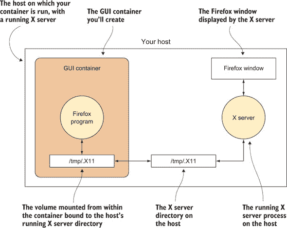

容器通过宿主机`/tmp/.X11`目录的挂载与宿主机链接，这就是容器如何在宿主机的桌面上执行操作的方式。

首先，在某个方便的地方创建一个新的目录，并使用`id`命令确定您的用户和组 ID，如下所示。

##### 列表 5.1. 设置目录和获取用户详细信息

```
$ mkdir dockergui
$ cd dockergui
$ id                                                                 *1*
 uid=1000(dockerinpractice) \                                        *2*
 gid=1000(dockerinpractice) \                                        *3*
 groups=1000(dockerinpractice),10(wheel),989(vboxusers),990(docker)
```

+   ***1*** **获取您在 Dockerfile 中需要的关于您用户的信息**

+   ***2*** **注意您的用户 ID（uid）。在这种情况下，它是 1000。**

+   ***3*** **注意您的组 ID（gid）。在这种情况下，它是 1000。**

现在创建一个名为 Dockerfile 的文件，如下所示。

##### 列表 5.2. Dockerfile 中的 Firefox

```
FROM ubuntu:14.04

RUN apt-get update
RUN apt-get install -y firefox                   *1*

RUN groupadd -g GID USERNAME                     *2*
 RUN useradd -d /home/USERNAME -s /bin/bash \
-m USERNAME -u UID -g GID                        *3*
 USER USERNAME                                   *4*
 ENV HOME /home/USERNAME                         *5*
 CMD /usr/bin/firefox                            *6*
```

+   ***1*** **安装 Firefox 作为 GUI 应用程序。您可以将此更改为您可能想要的任何应用程序。**

+   ***2*** **将宿主机的组添加到镜像中。用 GID 替换您的组 ID，用 USERNAME 替换您的用户名。**

+   ***3*** **将您的用户账户添加到镜像中。将 USERNAME 替换为您的用户名，UID 替换为您的用户 ID，GID 替换为您的组 ID。**

+   ***4*** **镜像应以您创建的用户身份运行。将 USERNAME 替换为您的用户名。**

+   ***5*** **设置 HOME 变量。将 USERNAME 替换为您的用户名。**

+   ***6*** **默认情况下在启动时运行 Firefox**

现在，您可以从该 Dockerfile 构建，并将结果标记为“gui”：

```
$ docker build -t gui .
```

按以下方式运行：

```
docker run -v /tmp/.X11-unix:/tmp/.X11-unix \                    *1*
 -h $HOSTNAME -v $HOME/.Xauthority:/home/$USER/.Xauthority \     *2*
 -e DISPLAY=$DISPLAY gui                                         *3*
```

+   ***1*** **将 X 服务器目录绑定到容器**

+   ***2*** **在容器中将 DISPLAY 变量设置为与主机上使用的相同，以便程序知道与哪个 X 服务器通信**

+   ***3*** **为容器提供适当的凭据**

您将看到一个 Firefox 窗口弹出！

**讨论**

您可以使用此技术来避免混淆您的桌面工作和开发工作。例如，使用 Firefox，您可能想以可重复的方式查看您的应用程序在没有网络缓存、书签或搜索历史的情况下如何表现，以便进行测试。如果您在尝试启动镜像并运行 Firefox 时看到无法打开显示的错误消息，请参阅技术 65 了解允许容器在主机上启动图形应用程序的其他方法。

我们理解有些人几乎在 Docker 内运行所有应用程序，包括游戏！虽然我们没有做到那么极端，但了解有人可能已经遇到了您遇到的问题是有用的。

|  |

**检查容器**

虽然 Docker 命令让您可以访问有关镜像和容器的信息，但有时您可能想了解更多关于这些 Docker 对象内部元数据的信息。

**问题**

您想找出容器的 IP 地址。

**解决方案**

使用 `docker inspect` 命令。

`docker inspect` 命令以 JSON 格式提供 Docker 的内部元数据，包括 IP 地址。此命令会产生大量输出，因此这里只显示了镜像元数据的一个简短片段。

##### 列表 5.3\. 镜像的原始 `inspect` 输出

```
$ docker inspect ubuntu | head
{
    "Architecture": "amd64",
    "Author": "",
    "Comment": "",
    "Config": {
        "AttachStderr": false,
        "AttachStdin": false,
        "AttachStdout": false,
        "Cmd": [
            "/bin/bash"
$
```

您可以通过名称或 ID 检查镜像和容器。显然，它们的元数据将不同——例如，容器将具有“状态”等运行时字段，而镜像则没有（镜像没有状态）。

在这种情况下，您想找出主机上的容器 IP 地址。为此，您可以使用带有 `format` 标志的 `docker inspect` 命令。

##### 列表 5.4\. 确定容器的 IP 地址

```
docker inspect \                                *1*
 --format '{{.NetworkSettings.IPAddress}}' \    *2*
 0808ef13d450                                   *3*
```

+   ***1*** **docker inspect 命令**

+   ***2*** **格式标志。这使用 Go 模板（此处未介绍）来格式化输出。在此，IPAddress 字段是从 inspect 输出的 NetworkSettings 字段中获取的。**

+   ***3*** **您想要检查的 Docker 项目的 ID**

这种技术对于自动化很有用，因为接口可能比其他 Docker 命令更稳定。

以下命令提供了所有运行容器的 IP 地址并对其进行了 ping 操作。

##### 列表 5.5\. 获取运行容器的 IP 地址并对每个进行 ping

```
$ docker ps -q | \                                                      *1*
 xargs docker inspect --format='{{.NetworkSettings.IPAddress}}' | \     *2*
 xargs -l1 ping -c1                                                     *3*
 PING 172.17.0.5 (172.17.0.5) 56(84) bytes of data.
64 bytes from 172.17.0.5: icmp_seq=1 ttl=64 time=0.095 ms

--- 172.17.0.5 ping statistics ---
1 packets transmitted, 1 received, 0% packet loss, time 0ms
rtt min/avg/max/mdev = 0.095/0.095/0.095/0.000 ms
```

+   ***1*** **获取所有运行容器的容器 ID**

+   ***2*** **针对所有容器 ID 运行 inspect 命令以获取它们的 IP 地址**

+   ***3*** **逐个 IP 地址运行 ping 命令**

注意，因为 `ping` 只接受一个 IP 地址，所以我们不得不向 `xargs` 传递一个额外的参数，告诉它为每行运行命令。


##### 小贴士

如果你没有正在运行的容器，运行以下命令来启动一个：docker run -d ubuntu sleep 1000。


**讨论**

检查容器和在 [技术 47 中跳入容器的方法可能是你调试容器为何不工作的两个最重要的工具。当你认为你已经以特定方式配置了容器但行为出乎意料时，Inspect 最为出色——你的第一步应该是检查容器，以验证 Docker 是否同意你对端口和卷映射的预期，以及其他事项。

|  |

**干净地杀死容器**

如果容器终止时的状态对你很重要，你可能想了解 `docker kill` 和 `docker stop` 之间的区别。如果你需要应用程序优雅地关闭以保存数据，这个区别也可能很重要。

**问题**

你想要干净地终止一个容器。

**解决方案**

使用 `docker stop` 而不是 `docker kill` 来干净地终止容器。

需要理解的关键点是 `docker kill` 的行为与标准的命令行 `kill` 程序不同。

`kill` 程序通过向指定的进程发送 `TERM` 信号（即信号值 15），除非有其他指示。此信号指示程序应该终止，但它不会强制程序。大多数程序在处理此信号时会执行某种类型的清理，但程序可以按自己的意愿行事——包括忽略信号。

与之相反，`KILL` 信号（即信号值 9）强制指定的程序终止。

令人困惑的是，`docker kill` 在运行进程上使用 `KILL` 信号，给其中的进程没有机会处理终止。这意味着可能会在文件系统中留下一些散乱的文件，例如包含运行进程 ID 的文件。根据应用程序管理状态的能力，这可能会或可能不会在你再次启动容器时给你带来问题。

更令人困惑的是，`docker stop` 命令的行为类似于标准的 `kill` 命令，发送 `TERM` 信号（见 表 5.1），但它将等待 10 秒钟，如果容器没有停止，则发送 `KILL` 信号。

##### 表 5.1\. 停止和杀死

| **命令** | **默认信号** | **默认信号值** |
| --- | --- | --- |
| kill | TERM | 15 |
| docker kill | KILL | 9 |
| docker stop | TERM | 15 |

简而言之，不要像使用`kill`命令那样使用`docker kill`。你最好养成使用`docker stop`的习惯。

**讨论**

虽然我们推荐在日常使用中使用`docker stop`，但`docker kill`有一些额外的可配置性，允许你通过`--signal`参数选择发送给容器的信号。如前所述，默认是`KILL`，但你也可以发送`TERM`或一些不太常见的 Unix 信号。

如果你正在编写自己的应用程序，你将在容器中启动它，那么`USR1`信号可能会引起你的兴趣。这个信号是专门为应用程序保留的，以便它们可以随意使用它，在某些地方它被用作打印进度信息或等效信息的指示——你可以用它来做任何你觉得合适的事情。"HUP"是另一个流行的信号，传统上被服务器和其他长时间运行的应用程序解释为触发配置文件的重新加载和“软”重启。当然，在开始向应用程序发送随机信号之前，确保检查你正在运行的应用程序的文档！

|  |

**使用 Docker Machine 来配置 Docker 主机**

在你的本地机器上设置 Docker 可能并不太难——有一个方便的脚本可以使用，或者你可以使用几个命令来为你的包管理器添加适当的源。但是当你试图在其他主机上管理 Docker 安装时，这可能会变得很繁琐。

**问题**

你想在机器上启动一个与你的机器分开的 Docker 主机上的容器。

**解决方案**

Docker Machine 是管理远程机器上 Docker 安装的官方解决方案。

如果你需要在多个外部主机上运行 Docker 容器，这项技术将非常有用。你可能出于许多原因想要这样做：通过在你的物理主机内配置一个虚拟机来测试 Docker 容器之间的网络；通过 VPS 提供商在更强大的机器上配置容器；进行某种疯狂实验以冒主机损坏的风险；在多个云提供商之间进行选择。无论出于什么原因，Docker Machine 可能正是你所需要的答案。它也是进入更复杂的编排工具（如 Docker Swarm）的门户。

**什么是 Docker Machine**

Docker Machine 主要是一个方便的程序。它将配置外部主机的大量潜在复杂的指令包装起来，并将它们转换成几个易于使用的命令。如果你熟悉 Vagrant，它有类似的感觉：通过一致的界面简化了其他机器环境的配置和管理。如果你回想起我们在第二章中的架构概述，看待 Docker Machine 的一种方式是想象它正在帮助管理来自一个客户端的不同 Docker 守护进程（参见图 5.2）。

##### 图 5.2\. Docker Machine 作为外部主机的客户端

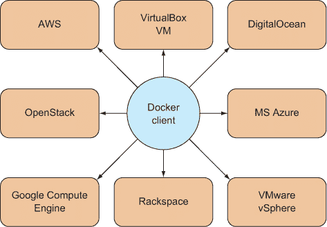

图 5.2 中 Docker 主机提供商的列表并不全面，并且可能会增长。在撰写本文时，以下驱动程序可用，允许您配置给定的主机提供商：

+   Amazon Web Services

+   DigitalOcean

+   Google Compute Engine

+   IBM SoftLayer

+   Microsoft Azure

+   Microsoft Hyper-V

+   OpenStack

+   Oracle VirtualBox

+   Rackspace

+   VMware Fusion

+   VMware vCloud Air

+   VMware vSphere

必须指定的选项将根据驱动程序提供的功能有很大差异。在一端，在你的机器上配置 Oracle VirtualBox VM 只提供了 3 个用于 `create` 的标志，而与 OpenStack 的 17 个相比。


##### 注意

值得澄清的是，Docker Machine 并不是 Docker 的任何类型的集群解决方案。其他工具，如 Docker Swarm，履行这一功能，我们将在后面讨论。


**安装**

安装涉及一个简单的二进制文件。不同架构的下载链接和安装说明可在此处找到：[`github.com/docker/machine/releases`](https://github.com/docker/machine/releases)。


##### 注意

您可能希望将二进制文件移动到标准位置，如 /usr/bin，并在继续之前确保将其重命名或创建到 `docker-machine` 的符号链接，因为下载的文件可能具有较长的名称，后缀为二进制文件的架构。


**使用 Docker Machine**

为了演示 Docker Machine 的使用，您可以首先创建一个带有 Docker 守护进程的 VM，您可以在其上工作。


##### 注意

为了使此操作生效，您需要安装 Oracle 的 VirtualBox。它在大多数包管理器中广泛可用。


```
$ docker-machine create --driver virtualbox host1                         *1*
 INFO[0000] Creating CA: /home/imiell/.docker/machine/certs/ca.pem
INFO[0000] Creating client certificate:
 /home/imiell/.docker/machine/certs/cert.pem
INFO[0002] Downloading boot2docker.iso to /home/imiell/.docker/machine/cache/
 boot2docker.iso...
INFO[0011] Creating VirtualBox VM...
INFO[0023] Starting VirtualBox VM...
INFO[0025] Waiting for VM to start...
INFO[0043] "host1" has been created and is now the active machine.        *2*
 INFO[0043] To point your Docker client at it, run this in your shell:

 $(docker-machine env host1)                                            *3*
```

+   ***1*** **使用 docker-machine 的 create 子命令创建一个新的主机，并使用 --driver 标志指定其类型。该主机已被命名为 `host1`。**

+   ***2*** **您的机器现在已创建。**

+   ***3*** **运行此命令以设置 DOCKER_HOST 环境变量，该变量设置 Docker 命令将运行的默认主机**

Vagrant 用户在这里会感到非常自在。通过运行这些命令，您已创建了一个可以现在管理 Docker 的机器。如果您遵循输出中给出的说明，可以直接 SSH 到新的 VM：

```
$ eval $(docker-machine env host1)                                        *1*
 $ env | grep DOCKER                                                      *2*
 DOCKER_HOST=tcp://192.168.99.101:2376                                    *3*
 DOCKER_TLS_VERIFY=yes                                                    *4*
 DOCKER_CERT_PATH=/home/imiell/.docker/machine/machines/host1             *4*
 DOCKER_MACHINE_NAME=host1
$ docker ps -a                                                            *5*
 CONTAINER ID   IMAGE    COMMAND   CREATED     STATUS   PORTS      NAMES
$ docker-machine ssh host1                                                *6*
                         ##        .
                  ## ## ##       ==
               ## ## ## ##      ===
           /""""""""""""""""\___/ ===
      ~~~ {~~ ~~~~ ~~~ ~~~~ ~~ ~ /  ===- ~~~
           \______ o          __/
             \    \        __/
              \____\______/
 _                 _   ____     _            _
| |__   ___   ___ | |_|___ \ __| | ___   ___| | _____ _ __
| '_ \ / _ \ / _ \| __| __) / _` |/ _ \ / __| |/ / _ \ '__|
| |_) | (_) | (_) | |_ / __/ (_| | (_) | (__|   <  __/ |
|_.__/ \___/ \___/ \__|_____\__,_|\___/ \___|_|\_\___|_|
Boot2Docker version 1.5.0, build master : a66bce5 - Tue Feb 10 23:31:27 UTC 2015
Docker version 1.5.0, build a8a31ef
docker@host1:~$
```

+   ***1*** **$() 将 docker-machine env 命令的输出应用于您的环境。docker-machine env 输出一组命令，您可以使用这些命令来设置 Docker 命令的默认主机。**

+   ***2*** **环境变量名称都以前缀 DOCKER_ 开头。**

+   ***3*** **DOCKER_HOST 变量是 VM 上 Docker 守护进程的端点。**

+   ***4*** **这些变量处理与新主机连接的安全性方面。**

+   ***5*** **docker 命令现在指向您创建的 VM 主机，而不是之前使用的宿主机。您在新 VM 上没有创建任何容器，因此没有输出。**

+   ***6*** **ssh 子命令将直接带您到新的 VM 本身。**

**管理主机**

从一个客户端机器管理多个 Docker 宿主机可能会使跟踪发生的事情变得困难。Docker Machine 提供了各种管理命令来简化这个过程，如 表 5.2 所示。

##### 表 5.2\. Docker-machine 命令列表

| **子命令** | **操作** |
| --- | --- |
| create | 创建新的机器 |
| ls | 列出 Docker 宿主机 |
| stop | 停止机器 |
| start | 启动机器 |
| restart | 停止并启动机器 |
| rm | 销毁机器 |
| kill | 关闭机器 |
| inspect | 返回机器元数据的 JSON 表示形式 |
| config | 返回连接到机器所需的配置 |
| ip | 返回机器的 IP 地址 |
| url | 返回机器上 Docker 守护进程的 URL |
| upgrade | 将宿主机上的 Docker 版本升级到最新版本 |

以下示例列出了两个机器。活动机器带有星号标记，并且与它关联有一个状态，类似于容器或进程的状态：

```
$ docker-machine ls
NAME   ACTIVE  DRIVER      STATE    URL                        SWARM
host1          virtualbox  Running  tcp://192.168.99.102:2376
host2  *       virtualbox  Running  tcp://192.168.99.103:2376
```


##### 小贴士

你可能想知道如何切换回原始宿主机 Docker 实例。在撰写本文时，我们还没有找到一种简单的方法来做这件事。你可以选择使用 `docker-machine rm` 删除所有机器，或者如果这不是一个选项，你可以手动取消之前使用 `unset DOCKER_HOST DOCKER_TLS_VERIFY DOCKER_CERT_PATH` 设置的环境变量。


**讨论**

你可以将这看作是将机器转化为进程，就像 Docker 本身可以将环境转化为进程一样。

使用 Docker Machine 设置手动管理多个宿主机上的容器可能很有吸引力，但如果你在代码更改时发现需要手动关闭容器、重新构建它们并重新启动，我们鼓励你查看本书的 第四部分。这类繁琐的任务完全可以由计算机完美完成。技术 87 涵盖了 Docker Inc. 提供的官方解决方案，用于创建容器的自动集群。技术 84 如果你喜欢集群的统一视图，但又希望保留对容器最终运行位置的完全控制，可能很有吸引力。

|  |

**通配符 DNS**

当使用 Docker 时，拥有许多需要引用中心或外部服务的运行容器是非常常见的。在测试或开发此类系统时，通常使用静态 IP 地址为这些服务。但对于许多基于 Docker 的系统，如 OpenShift，IP 地址是不够的。这类应用程序要求存在 DNS 查询。

解决这个问题的通常方法是编辑你在其上运行服务的宿主机的 /etc/hosts 文件。但这并不总是可能的。例如，你可能没有权限编辑该文件。这也不总是实用的。你可能需要维护太多的宿主机，或者其他的定制 DNS 查询缓存可能会造成干扰。

在这些情况下，有一个使用“真实”DNS 服务器的解决方案。

**问题**

你需要一个可解析的 DNS URL 来指定一个 IP 地址。

**解决方案**

使用 NIP.IO 网络服务，无需任何 DNS 设置，将 IP 地址解析为可解析的 DNS URL。

这很简单。NIP.IO 是一个基于网络的在线服务，可以自动将 IP 地址转换为 URL。你只需将 URL 中的“IP”部分“[`IP.nip.io`](http://IP.nip.io)”替换为你想要的 IP 地址即可。

假设你想要解析的 URL 指向的 IP 地址是“10.0.0.1”。你的 URL 可能看起来像这样，

[`myappname.10.0.0.1.nip.io`](http://myappname.10.0.0.1.nip.io)

其中`myappname`指的是你为应用程序选择的名称，`10.0.0.1`指的是你希望 URL 解析到的 IP 地址，而`nip.io`是互联网上管理此 DNS 查找服务的“真实”域名。

`myappname.`部分是可选的，因此这个 URL 解析到的 IP 地址相同：

[`10.0.0.1.nip.io`](http://10.0.0.1.nip.io)

**讨论**

这种技术在各种环境中都很有用，而不仅仅是使用基于 Docker 的服务。

显然，这种技术不适合生产或正式的 UAT 环境，因为它向第三方提交 DNS 请求，并揭示了有关你内部 IP 地址布局的信息。但它在开发工作中可以是一个非常实用的工具。

如果你使用 HTTPS 服务，请确保你使用的 URL（或一个合适的通配符）已经嵌入到你所使用的证书中。


### 5.2. 卷——一个持续的问题

容器是一个强大的概念，但有时你想要访问的东西并不总是准备好被封装。你可能有一个存储在大型集群上的引用 Oracle 数据库，你想要连接到它进行测试。或者，你可能有一个已经设置好的大型遗留服务器，上面有无法轻易复制的二进制文件。

当你开始使用 Docker 时，你想要访问的大部分内容可能都是容器外部的数据和程序。我们将带你从从主机简单挂载文件到更复杂的容器模式：数据容器和开发工具容器。我们还将展示我们偏爱的远程网络挂载方法，这只需要 SSH 连接即可工作，我们还将探讨通过 BitTorrent 协议与其他用户共享数据的方法。

卷是 Docker 的核心部分，外部数据引用的问题也是 Docker 生态系统快速变化的另一个领域。


**Docker 卷：持久性问题**

容器的强大之处很大程度上源于它们封装了环境文件系统的大部分状态，这对于有用。

有时，你可能不想将文件放入容器中。你可能有一些大文件想要在容器之间共享或单独管理。一个经典的例子是你想要容器访问的大型集中式数据库，但你也不想其他（可能更传统的）客户端与你的新式容器一起访问。

解决方案是*卷*，这是 Docker 管理容器生命周期之外文件的一种机制。尽管这与容器“部署在任何地方”的哲学相悖（例如，你无法在没有兼容数据库可供挂载的地方部署依赖于数据库的容器），但在现实世界的 Docker 使用中，这是一个有用的功能。

**问题**

你想在容器内访问主机上的文件。

**解决方案**

使用 Docker 的卷标志从容器内访问主机文件。图 5.3 说明了使用卷标志与主机文件系统交互。

##### 图 5.3\. 容器内的卷

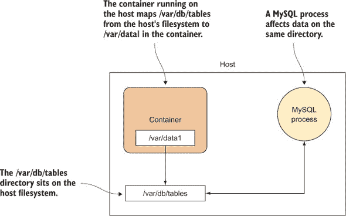

以下命令显示了主机上的 `/var/db/tables` 目录被挂载到 `/var/data1`，并且可以运行以启动容器，如图 5.3 所示。

```
$ docker run -v /var/db/tables:/var/data1 -it debian bash
```

`-v` 标志（长格式为 `--volume`）表示需要外部容器卷。随后的参数以冒号分隔的两个目录的形式给出卷规范，指示 Docker 将外部 `/var/db/tables` 目录映射到容器的 `/var/data1` 目录。如果这两个目录不存在，它们将被创建。

警惕覆盖现有目录。即使目录已经在镜像中存在，容器的目录也会被映射。这意味着你映射到容器内部的目录将实际上消失。如果你尝试映射一个关键目录，会发生一些有趣的事情！例如，尝试将空目录挂载到 `/bin` 上。

还要注意，在 Dockerfile 中，假设卷不会持久化。如果你在 Dockerfile 中添加了一个卷，然后对该文件夹进行了更改，这些更改不会持久化到生成的镜像中。

| |
| --- |

##### 警告

如果你的主机运行 SELinux，你可能会遇到困难。如果强制执行 SELinux 策略，容器可能无法写入 `/var/db/tables` 目录。你会看到一个“权限被拒绝”的错误。如果你需要解决这个问题，你将不得不与你的系统管理员（如果你有的话）交谈，或者关闭 SELinux（仅限开发目的）。有关 SELinux 的更多信息，请参阅技术 113。

| |
| --- |

**讨论**

从主机在容器中公开文件是我们进行单个容器实验时最常执行的操作之一——容器旨在是短暂的，在某个文件上花费大量时间工作后，很容易将其删除。最好确保文件安全，无论发生什么情况。

此外，还有优势，那就是使用技术 114 中的方法将文件复制到容器中的正常开销根本不存在。像技术 77 中的数据库这样的数据库，如果它们变得很大，将是明显的受益者。

最后，您将看到许多使用 `-v /var/run/docker.sock:/var/run/docker.sock` 的技术，其中之一就是技术 45。这会将特殊的 Unix 套接字文件暴露给容器，并展示了这项技术的重要功能——您不仅限于所谓的“常规”文件——您还可以允许更多基于文件系统的非典型用例。但如果您遇到设备节点（例如）的权限问题，您可能需要参考技术 93 来了解 `--privileged` 标志的作用。

|  |

**使用 Resilio 同步的分布式卷**

当在团队中实验 Docker 时，您可能希望团队成员之间共享大量数据，但您可能没有足够的资源来分配一个具有足够容量的共享服务器。这种懒惰的解决方案是在需要时从其他团队成员那里复制最新的文件——对于较大的团队来说，这会迅速失控。

解决方案是使用用于文件共享的去中心化工具——无需专用资源。

**问题**

您想在互联网上跨主机共享卷。

**解决方案**

使用名为 Resilio 的技术通过互联网共享卷。

图 5.4 展示了您所追求的设置。

##### 图 5.4\. 使用 Resilio

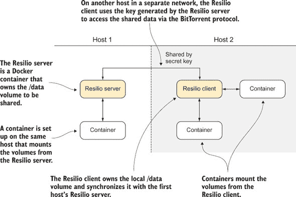

最终结果是卷（`/data`）通过互联网方便地同步，无需任何复杂的设置。

在您的主服务器上，运行以下命令以在第一台主机上设置容器：

```
[host1]$ docker run -d -p 8888:8888 -p 55555:55555 \       *1*
 --name resilio ctlc/btsync
$ docker logs resilio                                      *2*
 Starting btsync with secret: \
ALSVEUABQQ5ILRS2OQJKAOKCU5SIIP6A3
                                                           *3*
 By using this application, you agree to our Privacy Policy and Terms.
http://www.bittorrent.com/legal/privacy
http://www.bittorrent.com/legal/terms-of-use

total physical memory 536870912 max disk cache 2097152
Using IP address 172.17.4.121

[host1]$ docker run -i -t --volumes-from resilio \         *4*
 ubuntu /bin/bash
$ touch /data/shared_from_server_one                       *5*
 $ ls /data
shared_from_server_one
```

+   ***1*** 以守护进程容器运行已发布的 ctlc/btsync 图像，调用 btsync 二进制文件，并打开所需的端口

+   ***2*** 获取 resilio 容器的输出，以便您可以记录下密钥

+   ***3*** 记录此密钥——它将因您的运行而不同

+   ***4*** 启动一个带有 Resilio 服务器卷的交互式容器

+   ***5*** 将文件添加到 /data 卷

在第二台服务器上打开终端并运行以下命令以同步卷：

```
[host2]$ docker run -d --name resilio-client -p 8888:8888 \
-p 55555:55555 \
ctlc/btsync ALSVEUABQQ5ILRS2OQJKAOKCU5SIIP6A3                 *1*
 [host2]$ docker run -i -t --volumes-from resilio-client \
ubuntu bash
                                                              *2*
 $ ls /data
shared_from_server_one
                                                              *3*
 $ touch /data/shared_from_server_two                         *4*
 $ ls /data
shared_from_server_one  shared_from_server_two
```

+   ***1*** 以守护进程模式启动一个由 host1 上运行的守护进程生成的密钥的 resilio 客户端容器

+   ***2*** 启动一个交互式容器，挂载来自您的客户端守护进程的卷

+   ***3*** 在 host1 上创建的文件已传输到 host2。

+   ***4*** 在 host2 上创建第二个文件

在 host1 的运行容器上，您应该看到文件已经在主机之间同步，就像第一个文件一样：

```
[host1]$ ls /data
shared_from_server_one  shared_from_server_two
```

**讨论**

文件的同步没有时间保证，因此您可能需要等待数据同步。对于较大的文件来说，这种情况尤为明显。


##### 警告

由于数据可能通过互联网发送，并且由你无法控制的协议处理，如果你有任何有意义的关于安全性、可扩展性或性能的约束，你不应该依赖这种技术。


我们已经演示了这种技术在两个容器之间是有效的，正如开头提到的，但它也应该适用于团队中的许多成员。除了明显的大文件不适合版本控制的使用场景之外，还包括备份，甚至可能是 Docker 镜像本身，尤其是如果这种技术与像技术 72 中展示的高效压缩机制结合使用时。为了避免冲突，确保镜像总是单向流动（例如，从构建机器到多个服务器），或者遵循一个协议来执行更新。

|  |

**保留你的容器 bash 历史**

在容器内进行实验，知道你完成时可以清除一切，可以是一种解放的经历。但当你这样做时，你会失去一些便利。我们多次遇到的一个问题是忘记在容器内运行的一系列命令。

**问题**

你希望将你的容器 bash 历史与主机的 bash 历史共享。

**解决方案**

使用`-e`标志、Docker 挂载和 bash 别名可以自动将容器的 bash 历史与主机的 bash 历史共享。

为了理解这个问题，我们将展示一个简单的场景，其中丢失这个历史记录是非常令人烦恼的。

想象你在 Docker 容器中进行实验，在工作的过程中你做了一些有趣且可重用的操作。我们将使用一个简单的`echo`命令作为这个例子，但这也可能是一个由多个程序组成的复杂拼接，最终产生有用的输出：

```
$ docker run -ti --rm ubuntu /bin/bash
$ echo my amazing command
$ exit
```

经过一段时间后，你想回忆起你之前运行的令人难以置信的`echo`命令。不幸的是，你记不起来了，而且你也不再在屏幕上看到终端会话以便滚动查看。出于习惯，你尝试在主机的 bash 历史中查找：

```
$ history | grep amazing
```

没有任何东西返回，因为 bash 历史被保存在现在已移除的容器中，而不是你返回的主机中。

要将你的 bash 历史与主机共享，你可以在运行 Docker 镜像时使用卷挂载。以下是一个示例：

```
$ docker run -e HIST_FILE=/root/.bash_history \      *1*
  -v=$HOME/.bash_history:/root/.bash_history \       *2*
  -ti ubuntu /bin/bash
```

+   ***1*** **设置 bash 获取的环境变量。这确保了你挂载的 bash 历史文件是你想要的。**

+   ***2*** **将容器的根 bash 历史文件映射到主机上**


##### 提示

你可能希望将容器的 bash 历史与主机的 bash 历史分开。一种方法是通过更改前面`-v`参数的第一部分值来实现。


每次都要输入这些内容确实很麻烦，所以为了使其更用户友好，你可以在你的`~/.bashrc`文件中设置一个别名：

```
$ alias dockbash='docker run -e HIST_FILE=/root/.bash_history \
 -v=$HOME/.bash_history:/root/.bash_history
```

这仍然不是无缝的，因为如果您想执行`docker run`命令，您必须记得输入`dockbash`。为了获得更无缝的体验，您可以将这些添加到您的~/.bashrc 文件中：

##### **列表 5.6\. 自动挂载主机 bash 历史记录的函数别名**

```
function basher() {                                       *1*
   if [[ $1 = 'run' ]]                                    *2*
   then
    shift                                                 *3*
     /usr/bin/docker run \                                *4*
       -e HIST_FILE=/root/.bash_history \
      -v $HOME/.bash_history:/root/.bash_history "$@"     *5*
   else
    /usr/bin/docker "$@"                                  *6*
   fi
}
alias docker=basher                                       *7*
```

+   ***1*** **创建一个名为 basher 的 bash 函数，该函数将处理 docker 命令\**

+   ***2*** **确定 basher/docker 的第一个参数是否为“run”**

+   ***3*** **从您传递的参数列表中删除该参数**

+   ***4*** **运行您之前运行的 docker run 命令，调用 Docker 运行时的绝对路径以避免与以下 docker 别名混淆。绝对路径是通过在实施此解决方案之前在主机上运行“which docker”命令来发现的。**

+   ***5*** **将“run”之后的参数传递给 Docker 运行时**

+   ***6*** **使用原始参数运行 docker 命令**

+   ***7*** **当在命令行上调用 docker 命令时，将 docker 命令别名设置为已创建的 basher 函数。这确保在 bash 在路径上找到 docker 二进制文件之前，docker 的调用被捕获。**

**讨论**

现在，当您下次打开 bash shell 并运行任何`docker run`命令时，该容器内运行的命令将被添加到您的主机 bash 历史记录中。请确保 Docker 的路径正确。例如，它可能位于/bin/docker。


##### **注意**

您需要从主机的原始 bash 会话中注销，以便更新历史文件。这是由于 bash 及其如何更新内存中保留的 bash 历史的一个细微差别。如果有疑问，退出您所知道的全部 bash 会话，然后重新启动一个以确保您的历史记录尽可能最新。


许多带有提示的命令行工具也会存储历史记录，SQLite 就是一个例子（将历史记录存储在.sqlite_history 文件中）。如果您不想使用 Docker 中描述的集成日志解决方案技术 102，您可以使用类似的实践使您的应用程序写入一个最终位于容器外的文件。请注意，日志的复杂性，如日志轮转，意味着可能更简单的是使用日志目录卷而不是仅仅一个文件。

|  |

**数据容器**

如果您在主机上大量使用卷，管理容器的启动可能会变得复杂。您可能还希望数据仅由 Docker 管理，而不是在主机上普遍可访问。更干净地管理这些事情的一种方法是用数据仅容器设计模式。

**问题**

您想在容器内使用外部卷，但只想让 Docker 访问文件。

**解决方案**

启动一个数据容器，并在运行其他容器时使用`--volumes-from`标志。

图 5.5 展示了数据容器模式的结构，并解释了它是如何工作的。需要注意的是，在第二个主机上，容器不需要知道数据在磁盘上的位置。它们只需要知道数据容器的名称，然后就可以正常工作了。这可以使容器的操作更加便携。

##### 图 5.5\. 数据容器模式

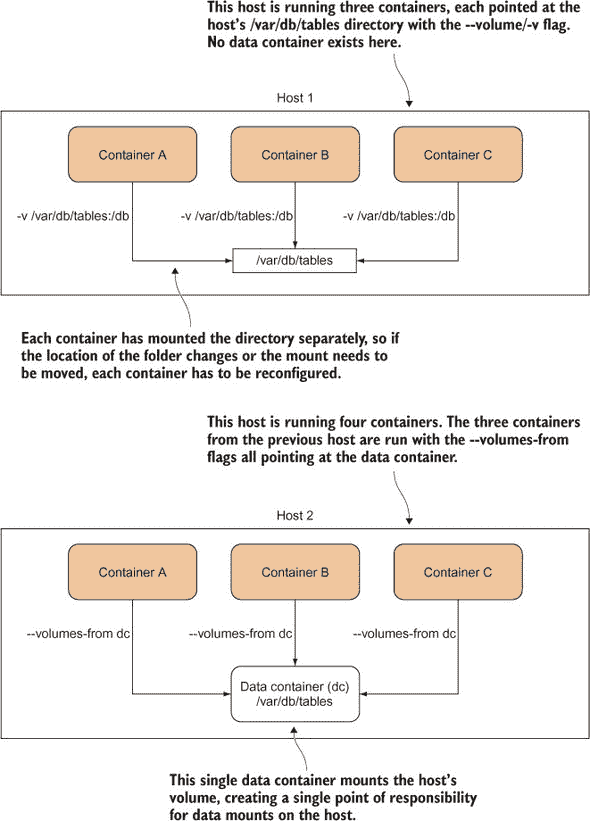

与直接映射主机目录相比，这种方法的一个好处是，对这些文件的访问由 Docker 管理，这意味着非 Docker 进程不太可能影响其内容。


##### 注意

人们通常对是否需要运行仅数据容器感到困惑。它不需要！它只需要存在，已经在主机上运行过，并且没有被删除。


让我们通过一个简单的例子来了解如何使用这项技术。

首先，您运行您的数据容器：

```
$ docker run -v /shared-data --name dc busybox \
  touch /shared-data/somefile
```

`-v` 参数不会将卷映射到主机目录，因此它会在该容器的责任范围内创建目录。这个目录通过 `touch` 命令添加一个文件，容器立即存在——数据容器不需要运行就可以被使用。我们使用了小巧但功能齐全的 busybox 镜像来减少数据容器需要的额外负担。

然后您运行另一个容器来访问您刚刚创建的文件：

```
docker run -t -i --volumes-from dc busybox /bin/sh
/ # ls /shared-data
somefile
```

**讨论**

`--volumes-from` 标志允许您通过在当前容器中挂载它们来引用数据容器的文件——您只需要传递一个定义了卷的容器的 ID。busybox 镜像没有 bash，因此您需要启动一个更简单的 shell 来验证 `dc` 容器中的 /shared-data 文件夹对您是否可用。

您可以启动任意数量的容器，所有这些容器都从指定的数据容器的卷中读取和写入。

您不需要使用这种模式来使用卷——您可能会发现这种方法比直接挂载主机目录更难管理。然而，如果您喜欢将管理数据的责任干净利落地委托给 Docker 内部管理的单个点，不受其他主机进程的干扰，那么数据容器可能对您很有用。


##### 警告

如果您的应用程序从多个容器向同一个数据容器记录日志，确保每个容器的日志文件都写入唯一的文件路径是很重要的。如果不这样做，不同的容器可能会覆盖或截断文件，导致数据丢失，或者它们可能会写入交错的数据，这更难分析。同样，如果您从数据容器中调用 `--volumes-from`，您允许该容器可能覆盖您的目录，因此在这里要小心名称冲突。


重要的是要理解这种模式可能会导致大量磁盘使用，这可能相对难以调试。因为 Docker 在数据容器内管理卷，并且当最后一个引用它的容器退出时不会删除卷，所以卷上的任何数据都将持续存在。这是为了防止数据丢失。有关管理方面的建议，请参阅技术 43。

| |
| --- |
| |

**使用 SSHFS 进行远程卷挂载**

我们已经讨论了挂载本地文件，但很快就会提出如何挂载远程文件系统的问题。例如，您可能希望将远程服务器上的参考数据库共享并作为本地处理。

虽然在理论上您可以在主机系统和服务器上设置 NFS，并通过挂载该目录来访问文件系统，但对于大多数用户来说，这有一个更快、更简单的方法，不需要在服务器端进行设置（只要存在 SSH 访问）。

| |
| --- |

##### 注意

您需要 root 权限才能使此技术生效，并且您需要安装 FUSE（Linux 的“用户空间文件系统”内核模块）。您可以通过在终端中运行`ls /dev/fuse`来查看该文件是否存在，以确定您是否安装了后者。

| |
| --- |

**问题**

您希望挂载远程文件系统而不需要任何服务器端配置。

**解决方案**

使用 SSHFS（SSH 文件系统）技术挂载远程文件系统，使其看起来像是您机器上的本地文件系统。

此技术通过使用 SSH 的 FUSE 内核模块提供对文件系统的标准接口，同时在后台通过 SSH 进行所有通信。SSHFS 还提供各种幕后功能（如远程文件预读），以促进文件本地化的错觉。结果是，一旦用户登录到远程服务器，他们就会看到文件，就像它们是本地的一样。图 5.6 有助于解释这一点。

##### 图 5.6\. 使用 SSHFS 挂载远程文件系统

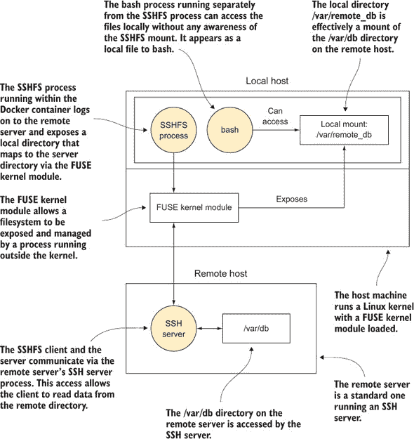

| |
| --- |

##### 警告

虽然此技术不使用 Docker 卷功能，并且文件通过文件系统可见，但这并不提供任何容器级别的持久性。任何更改都仅发生在远程服务器的文件系统中。

| |
| --- |

您可以通过运行以下命令开始，根据您的环境进行调整。

第一步是在您的宿主机上启动一个带有`--privileged`的容器：

```
$ docker run -t -i --privileged debian /bin/bash
```

然后，当它启动时，在容器内部运行`apt-get update && apt-get install sshfs`来安装 SSHFS。

当 SSHFS 成功安装后，按照以下方式登录到远程主机：

```
$ LOCALPATH=/path/to/local/directory                        *1*
 $ mkdir $LOCALPATH                                         *2*
 $ sshfs user@host:/path/to/remote/directory $LOCALPATH     *3*
```

+   ***1*** **选择一个目录来挂载远程位置** 

+   ***2*** **创建挂载的本地目录**

+   ***3*** **在此处替换您的远程主机用户名、远程主机地址和远程路径**

现在，您将在您刚刚创建的文件夹中看到远程服务器路径的内容。

| |
| --- |

##### 小贴士

最简单的方法是将挂载到新创建的目录上，但如果您使用`-o nonempty`选项，也可以挂载一个已存在的目录，其中已经存在文件。有关更多信息，请参阅 SSHFS 手册页。


要干净地卸载文件，请使用以下`fusermount`命令，根据需要替换路径：

```
fusermount -u /path/to/local/directory
```

**讨论**

这是一种快速从容器（和在标准 Linux 机器上）内实现远程挂载的绝佳方法，只需付出最小的努力。

尽管我们只在这个技术中讨论了 SSHFS，但成功管理这一点将打开 Docker 内部 FUSE 文件系统的美妙（有时也奇怪）世界。从在 Gmail 中存储您的数据到跨多台机器存储 PB 级数据的分布式 GlusterFS 文件系统，为您打开了众多机会。

|  |

**通过 NFS 共享数据**

在一个大公司中，NFS 共享目录可能已经在使用中——NFS 是中央位置提供文件的一个经过充分验证的选项。为了使 Docker 获得影响力，通常非常重要能够访问这些共享文件。

Docker 默认不支持 NFS，在每一个容器上安装 NFS 客户端以便挂载远程文件夹并不是最佳实践。相反，建议的方法是让一个容器充当从 NFS 到更符合 Docker 概念的翻译器：卷。

**问题**

您希望无缝访问通过 NFS 的远程文件系统。

**解决方案**

使用基础设施数据容器来代理对您的远程 NFS 文件系统的访问。

这种技术建立在技术 37 的基础上，我们在那里创建了一个数据容器来管理运行系统中的数据。

图 5.7 展示了这一技术的抽象概念。NFS 服务器将内部目录作为/export 文件夹暴露出来，该文件夹绑定在主机上。然后 Docker 主机使用 NFS 协议将此文件夹挂载到其/mnt 文件夹上。然后创建了一个所谓的“基础设施容器”，它绑定挂载文件夹。

##### 图 5.7\. 作为 NFS 访问经纪人的基础设施容器

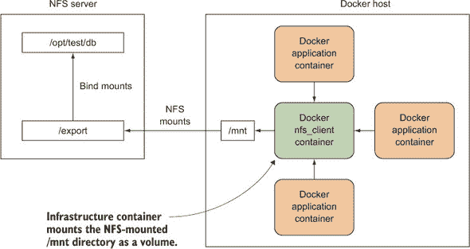

乍一看，这可能会显得有些过度设计，但好处是它为 Docker 容器提供了一定程度的间接性：它们只需要挂载来自预先约定的基础设施容器的卷，而负责基础设施的人可以关心内部管道、可用性、网络等问题。

对 NFS 的全面介绍超出了本书的范围。在这个技术中，我们将通过在同一个主机上拥有 NFS 服务器组件，通过在 Docker 容器上设置这样的共享来介绍这一步骤。这已经在 Ubuntu 14.04 上进行了测试。

假设您想共享主机上的/opt/test/db 文件夹的内容，该文件夹包含文件 mybigdb.db。

以 root 身份安装 NFS 服务器并创建一个具有开放权限的导出目录：

```
# apt-get install nfs-kernel-server
# mkdir /export
# chmod 777 /export
```


##### 注意

我们已使用开放权限创建了 NFS 共享，这对于生产系统来说并不是一个安全的方法。我们采取这种方法是为了简化本教程。NFS 安全性是一个复杂且多样化的主题，超出了本书的范围。有关 Docker 和安全的更多信息，请参阅第十四章 chapter 14。


现在将 db 目录绑定到您的导出目录：

```
# mount --bind /opt/test/db /export
```

您现在应该能够看到 `/opt/test/db` 目录的内容在 `/export` 中：


##### 提示

如果您希望重启后此设置持续有效，请将此行添加到您的 /etc/fstab 文件中：`/opt/test/db /export none bind 0 0`


现在将此行添加到您的 /etc/exports 文件中：

```
/export       127.0.0.1(ro,fsid=0,insecure,no_subtree_check,async)
```

对于这个概念验证示例，我们在 `127.0.0.1` 上进行本地挂载，这在一定程度上抵消了效果。在现实世界的场景中，您会将其限制为某个 IP 地址类，例如 `192.168.1.0/24`。如果您喜欢玩火，可以用 `*` 代替 `127.0.0.1` 来向世界开放。为了安全起见，我们在这里以只读（`ro`）方式挂载，但您可以通过将 `ro` 替换为 `rw` 来挂载为读写。请记住，如果您这样做，您需要在 `async` 标志之后添加一个 `no_root_squash` 标志，但在走出这个沙盒之前请考虑安全问题。

通过 NFS 将目录挂载到 `/mnt` 目录，导出您之前在 `/etc/exports` 中指定的文件系统，然后重新启动 NFS 服务以应用更改：

```
# mount -t nfs 127.0.0.1:/export /mnt
# exportfs -a
# service nfs-kernel-server restart
```

现在您已经准备好运行您的基础设施容器：

```
# docker run -ti --name nfs_client --privileged
 -v /mnt:/mnt busybox /bin/true
```

现在您可以在没有权限或对底层实现了解的情况下运行您想要访问的目录：

```
# docker run -ti --volumes-from nfs_client debian /bin/bash
root@079d70f79d84:/# ls /mnt
myb
root@079d70f79d84:/# cd /mnt
root@079d70f79d84:/mnt# touch asd
touch: cannot touch `asd': Read-only file system
```

**讨论**

这种在多个容器中集中挂载共享资源并提供特权的模式非常强大，可以使开发工作流程变得更加简单。


##### 提示

如果您要管理很多这样的容器，您可以通过为容器指定命名约定（例如 `--name nfs_client_opt_database_live`）来简化管理，该容器公开了 `/opt/database/live` 路径。

|  |

##### 提示

请记住，这种技术只通过隐蔽性提供安全性（这根本不是安全性）。正如您稍后将会看到的，任何可以运行 Docker 可执行文件的人实际上在主机上都有 root 权限。


用于代理访问和抽象细节的基础设施容器在某种程度上等同于网络中的服务发现工具——服务的运行细节或其所在位置的具体细节并不重要。您只需要知道它的名字。

事实上，您之前已经在技术 35 中看到过`--volumes-from`的使用。细节略有不同，因为访问是通过容器内运行的而不是在主机上运行的基础设施进行协商的，但使用名称引用可用卷的原则仍然适用。您甚至可以用这个技术中的容器替换掉那个容器，如果配置正确，应用程序不会注意到它们检索文件的位置有任何变化。

|  |

**开发工具容器**

如果您是一位经常在其他机器上遇到困难，没有您在独特如雪花般的开发环境中拥有的程序或配置的工程师，这项技术可能适合您。同样，如果您想与他人分享您升级后的开发环境，Docker 可以使其变得简单。

**问题**

您想在其他机器上访问您的开发环境。

**解决方案**

创建一个包含您设置的 Docker 镜像，并将其放置在注册表中。

作为演示，我们将使用我们的一个开发工具镜像。您可以通过运行`docker pull dockerinpractice/docker-dev-tools-image`来下载它。如果您想检查 Dockerfile，该仓库可在[`github.com/docker-in-practice/docker-dev-tools-image`](https://github.com/docker-in-practice/docker-dev-tools-image)找到。

启动容器很简单——一个简单的`docker run -t -i docker-inpractice/docker-dev-tools-image`将为您提供一个我们开发环境中的 shell。您可以浏览我们的 dotfiles，也许可以给我们一些关于设置的反馈。

当与其他技术结合使用时，这种技术的真正威力才会显现。在下面的列表中，您可以看到一个用于在主机网络上显示 GUI 和挂载主机代码的 dev 工具容器。

##### 列表 5.7\. 运行带 GUI 的 dev-tools 镜像

```
docker run -t -i \
-v /var/run/docker.sock:/var/run/docker.sock \     *1*
 -v /tmp/.X11-unix:/tmp/.X11-unix \                *2*
 -e DISPLAY=$DISPLAY \                             *3*
 --net=host --ipc=host \                           *4*
 -v /opt/workspace:/home/dockerinpractice \        *5*
 dockerinpractice/docker-dev-tools-image
```

+   ***1*** **将 Docker 套接字挂载到主机，以便访问主机的 Docker 守护进程**

+   ***2*** **挂载 X 服务器 Unix 域套接字，以便您可以启动基于 GUI 的应用程序（见技术 29）**

+   ***3*** **设置环境变量，指示容器使用主机显示**

+   ***4*** **这些参数绕过容器网络桥接，允许您访问主机的进程间通信文件（见技术 109）。**

+   ***5*** **将工作区域挂载到容器的家目录**

之前的命令为您提供了一个可以访问主机资源的环境：

+   网络

+   Docker 守护进程（在主机上运行正常 Docker 命令）

+   进程间通信（IPC）文件

+   X 服务器启动基于 GUI 的应用程序，如果需要


##### 注意

如挂载主机目录时通常所做的那样，请务必小心不要挂载任何关键目录，因为您可能会造成损害。通常最好避免在根目录下挂载任何主机目录。


**讨论**

我们提到你可以访问 X 服务器，因此值得查看技术 29 以提醒一些可能性。

对于一些更侵入式的开发工具，可能用于检查主机上的进程，你可能需要查看技术 109 以了解如何授予查看系统某些（默认情况下）受限部分的权限。技术 93 也是一篇重要的阅读材料——仅仅因为容器可以看到你系统的一部分，并不意味着它有权限修改它们。

| |
| --- |

### 摘要

+   如果你需要从容器内部访问外部数据，你应该使用卷。

+   SSHFS 是一种简单的方法，无需额外设置即可访问其他机器上的数据。

+   在 Docker 中运行 GUI 应用程序只需要对镜像进行少量准备。

+   你可以使用数据容器来抽象化你的数据位置。

## 第六章\. 每日 Docker

| |
| --- |

**本章涵盖**

+   监控你的容器和卷空间使用情况

+   从容器中分离而不停止它们

+   在图表中可视化你的 Docker 镜像谱系

+   从主机直接在容器上运行命令

| |
| --- |

就像任何中等复杂度的软件项目一样，Docker 有很多角落和缝隙，如果你想要尽可能保持体验的流畅，那么了解这些角落和缝隙是很重要的。

本章的技术将向你展示其中一些更重要的事项，以及介绍一些第三方构建的工具来解决他们自己的问题。把它想象成你的 Docker 工具箱。

### 6.1\. 保持整洁

如果你和我们一样（如果你认真地遵循这本书），你日益增长的 Docker 依赖性意味着你将在选择的主机上启动多个容器，并下载各种镜像到你的主机上。

随着时间的推移，Docker 将占用越来越多的资源，需要对容器和卷进行一些维护。我们将展示如何以及为什么需要这样做。我们还将介绍一些可视化工具，以保持你的 Docker 环境干净整洁，以防你想要从命令行中解脱出来。

运行容器固然很好，但你很快就会发现自己想要做的不仅仅是启动一个前台的单个命令。我们将探讨在不终止容器的情况下退出运行中的容器，以及在运行中的容器内执行命令。

| |
| --- |

**无需 sudo 运行 Docker**

Docker 守护进程以 root 用户身份在机器的背景中运行，赋予它相当大的权限，它将这些权限暴露给用户。需要使用`sudo`是这一结果，但它可能不方便，并使得一些第三方 Docker 工具无法使用。

**问题**

你希望能够在不使用`sudo`的情况下运行`docker`命令。

**解决方案**

官方解决方案是将自己添加到`docker`组。

Docker 通过用户组管理围绕 Docker Unix 域套接字的权限。出于安全原因，发行版默认不会让您成为该组的成员，因为这实际上授予了系统完全的 root 访问权限。

通过将自己添加到该组，您将能够以自己的身份使用`docker`命令：

```
$ sudo addgroup -a username docker
```

重新启动 Docker 并完全注销并重新登录，或者如果更容易的话，重新启动您的机器。现在您不需要记住输入`sudo`或设置别名以以自己的身份运行 Docker。

**讨论**

这是在本书后面部分使用的许多工具中的一项极其重要的技术。一般来说，任何想要与 Docker 通信（而不在容器中启动）的东西都需要访问 Docker 套接字，这需要`sudo`或本技术中描述的设置。Docker Compose，在技术 76 中介绍，是 Docker Inc.的官方工具，是此类工具的例子。

| |
| --- |
| |

**维护容器**

新的 Docker 用户经常抱怨，在短时间内，您可能会在系统中拥有许多处于各种状态的容器，而在命令行上没有标准工具来管理这些容器。

**问题**

您想清理系统上的容器。

**解决方案**

设置别名以运行清理旧容器的命令。

这里最简单的方法是删除所有容器。显然，这是一个有点像核选项的操作，只有在您确定这是您想要的时才应该使用。

以下命令将删除您主机上的所有容器。

```
$ docker ps -a -q | \                         *1*
 xargs --no-run-if-empty docker rm -f         *2*
```

+   ***1*** **获取所有容器 ID 的列表，包括正在运行的和已停止的，并将它们传递给...**

+   ***2*** **...`docker rm -f`命令，它将删除传递给它的任何容器，即使它们正在运行。**

简单解释一下`xargs`，它将输入的每一行都作为参数传递给后续命令。我们在这里添加了一个额外的参数`--no-run-if-empty`，如果前一个命令没有输出，则避免运行该命令，以避免错误。

如果您正在运行可能希望保留的容器，但想删除所有已退出的容器，您可以过滤`docker ps`命令返回的项目：

```
docker ps -a -q --filter status=exited | \         *1*
 xargs --no-run-if-empty docker rm                 *2*
```

+   ***1*** **`--filter`标志告诉`docker ps`命令您想要返回哪些容器。在这种情况下，您正在限制它只返回已退出的容器。其他选项是正在运行和重新启动。**

+   ***2*** **这次您不需要强制删除容器，因为根据您提供的过滤器，它们不应该在运行。**

事实上，删除所有已停止的容器是一个如此常见的用例，以至于 Docker 添加了一个专门为此用例的命令：`docker container prune`。然而，此命令仅限于该用例，并且您需要参考本技术中的命令来进行任何更复杂的容器操作。

作为更高级用例的示例，以下命令将列出所有退出代码非零的容器。如果您系统中有许多容器，并且您想自动化检查和删除任何意外退出的容器，您可能需要这样做：

```
comm -3 \                                                     *1*
 <(docker ps -a -q --filter=status=exited | sort) \           *2*
 <(docker ps -a -q --filter=exited=0 | sort) | \              *3*
 xargs --no-run-if-empty docker inspect > error_containers    *4*
```

+   ***1*** **运行 comm 命令以比较两个文件的内容。-3 参数抑制同时出现在两个文件中的行（在本例中，那些退出代码为零的行）并输出其他行。**

+   ***2*** **查找已退出的容器 ID，对它们进行排序，并将它们作为文件传递给 comm**

+   ***3*** **查找退出代码为 0 的容器，对它们进行排序，并将它们作为文件传递给 comm**

+   ***4*** **对退出代码非零的容器运行 docker inspect（通过 comm 管道传入）并将输出保存到 error_containers 文件**


##### **提示**

如果您之前没有见过，`<(command)` 语法称为 *进程替换*。它允许您将命令的输出作为文件处理，并将其传递给另一个命令，这在无法使用管道输出时非常有用。


上述示例相当复杂，但它展示了通过组合不同的实用程序可以获得的强大功能。它输出所有已停止的容器 ID，然后仅选择那些退出代码非零的容器（那些以意外方式退出的容器）。如果您觉得难以理解，可以先单独运行每个命令，并首先以这种方式理解它们，这有助于学习构建块。

这样的命令对于收集生产环境中的容器信息可能很有用。您可能需要对其进行修改，以便运行 cron 来清除以预期方式退出的容器。


##### 将这些单行命令作为命令提供

您可以将命令作为别名添加，以便在登录到您的宿主机时更容易运行。为此，请将以下类似行添加到您的 ~/.bashrc 文件末尾：

```
alias dockernuke='docker ps -a -q | \
xargs --no-run-if-empty docker rm -f'
```

您下次登录时，可以从命令行运行 `dockernuke` 来删除您系统上找到的任何 Docker 容器。

我们发现这节省了惊人的时间。但请注意！以这种方式删除生产容器很容易，正如我们所证明的那样。即使您足够小心，不会删除正在运行的容器，您仍然可能会删除非运行但仍然有用的数据容器。


**讨论**

本书中的许多技术最终都会创建容器，尤其是在介绍 Docker Compose 的 技术 76 以及在有关编排的章节中——毕竟，编排就是管理多个容器。您可能会发现这里讨论的命令对于清理您的机器（本地或远程）以在每个技术完成后获得一个全新的开始很有用。

|  |

**维护卷**

尽管卷是 Docker 的一个强大功能，但它们也伴随着显著的运营劣势。因为卷可以在不同的容器之间共享，所以当挂载它们的容器被删除时，卷不能被删除。想象一下图 6.1 中描述的场景。

##### 图 6.1\. 当容器被移除时，/var/db 会发生什么？

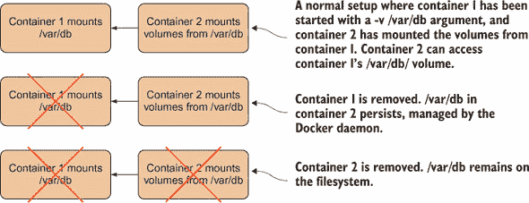

“很简单！”你可能会想，“当最后一个引用容器的容器被删除时，删除卷！”确实，Docker 可以选择这个选项，当垃圾回收编程语言从内存中删除对象时，这种方法就是：当没有其他对象引用它时，它可以被删除。

但 Docker 认为这可能会让人们不小心丢失有价值的数据，因此更喜欢让用户决定是否在删除容器时删除卷。不幸的是，这的一个副作用是，默认情况下，卷会保留在你的 Docker 守护进程的主机磁盘上，直到它们被手动删除。如果这些卷充满了数据，你的磁盘可能会被填满，因此了解管理这些孤儿卷的方法是有用的。

**问题**

你使用太多的磁盘空间，因为存在孤儿 Docker 挂载在你的主机上。

**解决方案**

在调用`docker rm`时使用`-v`标志，或者如果你忘记了，可以使用`docker volume`子命令来销毁它们。

在图 6.1 描述的场景中，如果你总是使用带有`-v`标志的`docker rm`命令，你可以确保删除`/var/db`。`-v`标志会在没有其他容器挂载的情况下删除任何关联的卷。幸运的是，Docker 足够智能，能够知道是否有其他容器挂载了该卷，因此不会有任何令人不快的惊喜。

最简单的方法是养成习惯，每次删除容器时都输入`-v`。这样你就可以保留控制卷是否被删除的权利。但这种方法的问题是你可能并不总是想删除卷。如果你正在向这些卷写入大量数据，你很可能不想丢失这些数据。此外，如果你养成了这样的习惯，它很可能会变得自动化，你只有在为时已晚时才会意识到你已经删除了某些重要的东西。

在这些场景中，你可以使用在经过许多抱怨和第三方解决方案之后添加到 Docker 中的命令：`docker volume prune`。这将删除任何未使用的卷：

```
$ docker volume ls                                                              *1*
 DRIVER              VOLUME NAME
local                80a40d34a2322f505d67472f8301c16dc75f4209b231bb08faa8ae48f  *2*
 36c033f                                                                     *2*
 local               b40a19d89fe89f60d30b3324a6ea423796828a1ec5b613693a740b33   *2*
 77fd6a7b                                                                    *2*
 local               bceef6294fb5b62c9453fcbba4b7100fc4a0c918d11d580f362b09eb   *2*
 58503014                                                                    *2*
 $ docker volume prune                                                          *3*
 WARNING! This will remove all volumes not used by at least one container.
Are you sure you want to continue? [y/N] y                                      *4*
 Deleted Volumes:
80a40d34a2322f505d67472f8301c16dc75f4209b231bb08faa8ae48f36c033f                *5*
 b40a19d89fe89f60d30b3324a6ea423796828a1ec5b613693a740b3377fd6a7b               *5*

Total reclaimed space: 230.7MB
```

+   ***1*** **运行命令以列出 Docker 所知的卷**

+   ***2*** **存在于机器上的卷，无论它们是否在使用**

+   ***3*** **运行命令以删除未使用的卷**

+   ***4*** **确认删除卷**

+   ***5*** **已删除的卷**

如果你想要跳过确认提示，可能是因为自动化脚本，你可以将`-f`传递给`docker volume prune`以跳过它。

| |
| --- |

##### 小贴士

如果你想要从不再被任何容器引用的未删除卷中恢复数据，你可以使用 `docker volume inspect` 来发现卷所在的目录（可能位于 `/var/lib/docker/volumes/` 之下）。然后你可以以 root 用户浏览它。


**讨论**

删除卷可能不是你经常需要做的事情，因为容器中的大文件通常是从主机机器挂载的，并且不会存储在 Docker 数据目录中。但每周清理一次是值得的，以避免它们堆积，尤其是如果你在使用来自技术 37 的数据容器。

|  |

**不停止容器就分离容器**

当使用 Docker 时，你经常会发现自己处于一个有交互式 shell 的位置，但退出 shell 会终止容器，因为它是容器的主要进程。幸运的是，有一种方法可以从容器中分离出来（如果你想要的话，可以使用 `docker attach` 再次连接到容器）。

**问题**

你想要在不停止容器的情况下从容器交互中分离出来。

**解决方案**

使用 Docker 内置的快捷键组合从容器中退出。

Docker 实用地实现了一个不太可能被任何其他应用程序需要的键序列，并且也不太可能意外按下。

假设你使用 `docker run -t -i -p 9005:80 ubuntu /bin/bash` 启动了一个容器，然后使用 `apt-get` 安装了一个 Nginx 网络服务器。你想要通过一个快速的 `curl` 命令来测试它是否可以从你的主机访问 `localhost:9005`。

按下 Ctrl-P 然后按下 Ctrl-Q。请注意，不是一次性按下这三个键。


##### 注意

如果你使用 `--rm` 和分离运行，容器在终止时仍然会被删除，无论是命令完成还是你手动停止它。


**讨论**

如果你已经启动了一个容器，但可能忘记在后台启动它，这种技术很有用，就像在技术 2 中展示的那样。它还允许你在需要检查容器状态或提供一些输入时，自由地连接和断开容器。

|  |

**使用 Portainer 管理你的 Docker 守护进程**

当演示 Docker 时，很难演示容器和镜像之间的区别——终端上的线条不是可视的。此外，如果你想要从许多容器中杀死和删除特定的容器，Docker 的命令行工具可能不太友好。这个问题通过创建一个用于管理主机上镜像和容器的点击工具得到了解决。

**问题**

你想在主机上管理容器和镜像，而不使用 CLI。

**解决方案**

使用 Portainer，这是 Docker 的核心贡献者之一创建的工具。

Portainer 最初是 DockerUI，您可以在[`github.com/portainer/portainer`](https://github.com/portainer/portainer)上阅读关于它的内容并找到源代码。因为没有先决条件，您可以直接跳到运行它：

```
$ docker run -d -p 9000:9000 \
-v /var/run/docker.sock:/var/run/docker.sock \
portainer/portainer -H unix:///var/run/docker.sock
```

这将在后台启动 Portainer 容器。如果您现在访问 http://localhost:9000，您将看到仪表板，它为您提供了计算机上 Docker 的快速信息。

容器管理功能可能是这里最有用的功能之一——转到容器页面，您将看到正在运行的容器列表（包括 Portainer 容器），并有一个显示所有容器的选项。从这里，您可以执行容器的批量操作（例如终止它们）或点击容器名称以深入了解容器并执行与该容器相关的单个操作。例如，您将看到移除正在运行的容器的选项。

图片页面看起来与容器页面相当相似，也允许您选择多个图片并对它们执行批量操作。点击图片 ID 会提供一些有趣的选择，例如从图片创建容器和标记图片。

请记住，Portainer 可能落后于官方 Docker 功能——如果您想使用最新和最好的功能，您可能被迫求助于命令行。

**讨论**

Portainer 是许多 Docker 接口之一，也是最受欢迎的之一，具有许多功能和活跃的开发。作为一个例子，您可以使用它来管理远程机器，也许是在它们上启动容器后使用技术 32。

|  |

**生成 Docker 镜像的依赖关系图**

Docker 的文件分层系统是一个极其强大的想法，它可以节省空间并使构建软件更快。但是，一旦您开始使用大量图片，理解您的图片之间的关系可能会变得困难。`docker images -a`命令将返回系统上所有层的列表，但这并不是一个用户友好的方式来理解这些关系——通过使用 Graphviz 创建它们的树状图来可视化这些关系要容易得多。

这也是 Docker 使复杂任务变得简单的力量的一个展示。在主机机器上安装所有组件以生成图片以前可能需要一系列冗长且容易出错的操作，但使用 Docker，它可以变成一个单一的便携式命令，失败的可能性要小得多。

**问题**

您想可视化存储在主机上的图片树。

**解决方案**

使用我们创建的具有此功能的图片（基于 CenturyLink Labs 的一个版本）以输出 PNG 或获取网页视图。此图片包含使用 Graphviz 生成 PNG 图像文件的脚本。

这种技术使用 `dockerinpractice/docker-image-graph` 的 Docker 镜像。这个镜像可能会随着时间的推移而过时，停止工作，因此你可能需要运行以下命令来确保它是最新的。

##### 列表 6.1\. 构建最新的 docker-image-graph 镜像（可选）

```
$ git clone https://github.com/docker-in-practice/docker-image-graph
$ cd docker-image-graph
$ docker build -t dockerinpractice/docker-image-graph
```

在你的 `run` 命令中，你只需要挂载 Docker 服务器套接字，然后就可以开始了，正如下一个列表所示。

##### 列表 6.2\. 生成你的层树镜像

```
$ docker run --rm \                                          *1*
 -v /var/run/docker.sock:/var/run/docker.sock \              *2*
 dockerinpractice/docker-image-graph > docker_images.png     *3*
```

+   ***1*** **在生成镜像时删除容器**

+   ***2*** **挂载 Docker 服务器的 Unix 域套接字，以便你可以在容器内访问 Docker 服务器。如果你已经更改了 Docker 守护进程的默认设置，这将不起作用。**

+   ***3*** **指定一个镜像并生成一个 PNG 作为输出**

图 6.2 显示了我们机器上的一个镜像树的 PNG 图像。你可以从这张图中看出，节点和 golang:1.3 镜像共享一个共同的根，而 golang:runtime 只与 golang:1.3 镜像共享全局根。同样，mesosphere 镜像是基于与 ubuntu-upstart 镜像相同的根构建的。

##### 图 6.2\. 镜像树图

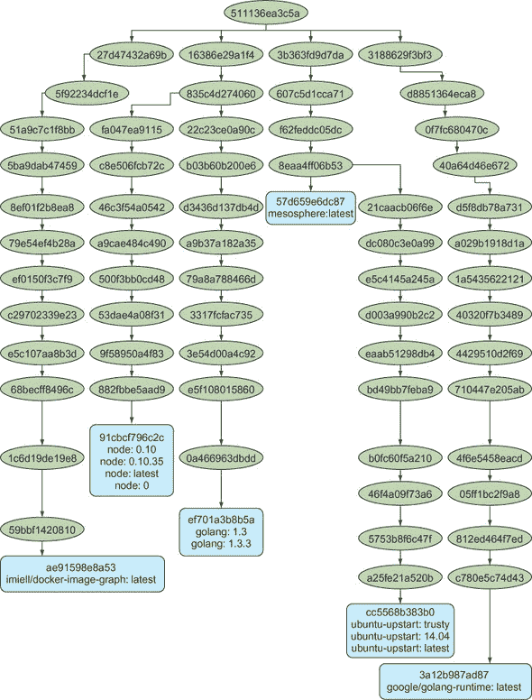

你可能会想知道树上的全局根节点是什么。这是 *scratch* 伪镜像，大小正好为 0 字节。

**讨论**

当你开始构建更多的 Docker 镜像时，也许作为第九章（kindle_split_020.xhtml#ch09）中持续交付的一部分，跟踪镜像的历史和它基于什么构建可能会变得令人不知所措。如果你试图通过共享更多层来优化大小以加快交付速度，这尤其重要。定期拉取所有镜像并生成图表可以是一种很好的跟踪方法。

|  |

**直接操作：在容器上执行命令**

在 Docker 的早期阶段，许多用户向他们的镜像添加了 SSH 服务器，以便他们可以从外部使用 shell 访问它们。Docker 对此持批评态度，因为它将容器视为虚拟机（我们知道容器不是虚拟机），并为不需要的系统增加了进程开销。许多人反对说，一旦启动，就没有简单的方法进入容器。因此，Docker 引入了 `exec` 命令，这是一个更整洁的解决方案，用于在容器启动后影响和检查其内部结构。我们在这里讨论的就是这个命令。

**问题**

你想在运行的容器上执行命令。

**解决方案**

使用 `docker exec` 命令。

以下命令在后台启动一个容器（使用 `-d`）并告诉它永远睡眠（什么也不做）。我们将这个命令命名为 `sleeper`。

```
docker run -d --name sleeper debian sleep infinity
```

现在你已经启动了一个容器，你可以使用 Docker 的 `exec` 命令对它执行各种操作。这个命令可以被视为有三个基本模式，如 表 6.1 中列出。

##### 表 6.1\. Docker `exec` 模式

| **模式** | **描述** |
| --- | --- |
| 基本 | 在容器中同步地在命令行上运行命令 |
| 守护进程 | 在容器后台运行命令 |
| 交互式 | 运行命令并允许用户与之交互 |

首先，我们将介绍基本模式。以下命令在我们的`sleeper`容器内运行一个`echo`命令。

```
$ docker exec sleeper echo "hello host from container"
hello host from container
```

注意，此命令的结构与`docker run`命令非常相似，但不同的是，我们给出的是正在运行的容器的 ID，而不是镜像的 ID。`echo`命令指的是容器内的 echo 二进制，而不是外部。

守护进程模式在后台运行命令；您在终端中看不到输出。这可能对定期维护任务很有用，例如清理日志文件，您只需运行命令然后忘记：

```
$ docker exec -d sleeper \                      *1*
 find / -ctime 7 -name '*log' -exec rm {} \;    *2*
 $                                              *3*
```

+   ***1*** **-d 标志以守护进程的方式在后台运行命令，类似于 docker run。**

+   ***2*** **删除过去七天未更改且以“log”结尾的所有文件**

+   ***3*** **立即返回，无论完成所需时间长短**

最后，我们有交互模式。这允许您在容器内运行任何您喜欢的命令。要启用此模式，您通常需要指定 shell 应该以交互式方式运行，在以下代码中是 bash：

```
$ docker exec -i -t sleeper /bin/bash
root@d46dc042480f:/#
```

`-i`和`-t`参数与您在`docker run`中熟悉的参数做相同的事情——它们使命令交互式，并设置一个 TTY 设备，以便 shell 可以正确运行。运行此命令后，您将在容器内看到一个提示符正在运行。

**讨论**

当出现问题时，进入容器是一个基本的调试步骤，或者如果您想了解容器正在做什么。通常不可能使用技术 44 启用的附加和分离方法，因为容器中的进程通常在前台运行，这使得无法访问 shell 提示符。因为`exec`允许您指定要运行的二进制文件，所以这不是问题...只要容器文件系统实际上有您要运行的二进制文件。

特别是，如果您已经使用技术 58 创建了一个包含单个二进制的容器，您将无法启动一个 shell。在这种情况下，您可能希望坚持使用技术 57 作为低开销的方式来允许`exec`。

|  |

**您是否在一个 Docker 容器中？**

在创建容器时，通常将逻辑放在 shell 脚本中，而不是直接在 Dockerfile 中编写脚本。或者您可能有一些在容器运行时使用的脚本。无论如何，这些任务通常针对容器内的使用进行了精心定制，并在“正常”机器上运行可能会造成损害。在这种情况下，有一些安全措施来防止意外在容器外执行是有用的。

**问题**

您的代码需要知道您是否在 Docker 容器中操作。

**解决方案**

检查/.dockerenv 文件是否存在。如果存在，你很可能在一个 Docker 容器中。

注意，这并不是一个绝对保证——如果有人或任何东西移除了/.dockerenv 文件，这个检查可能会给出误导性的结果。这些情况不太可能发生，但最坏的情况是你会得到一个假阳性，没有任何不良影响；你会认为你不在 Docker 容器中，在最坏的情况下*不会*运行可能具有破坏性的代码。

一个更现实的情况是，Docker 的这个未经记录的行为在 Docker 的新版本中已经被改变或删除（或者你使用的是在行为首次实现之前发布的版本）。

代码可能是启动 bash 脚本的一部分，如下所示，然后是启动脚本代码的其余部分。

##### 列表 6.3\. 如果在容器外运行，Shell 脚本将失败

```
#!/bin/bash
if ! [ -f /.dockerenv ]
then
    echo 'Not in a Docker container, exiting.'
    exit 1
fi
```

当然，你也可以使用相反的逻辑来确定你*不在*容器内运行，如果你有这个需求：

##### 列表 6.4\. 如果在容器内运行，Shell 脚本将失败

```
#!/bin/bash
if [ -f /.dockerenv ]
then
    echo 'In a Docker container, exiting.'
    exit 1
fi
```

此示例使用 bash 来确定文件的存在，但绝大多数编程语言都会有自己的方式来确定容器（或主机）文件系统上文件的存在。

**讨论**

你可能会想知道这种情况发生的频率。这种情况经常发生，足以成为 Docker 论坛上的常规讨论点，在那里关于这是否是一个有效用例，或者你的应用程序设计中的其他方面是否有问题的宗教式争论会爆发。

将这些讨论放在一边，你可能会轻易地陷入需要根据是否在 Docker 容器中切换代码路径的情况。我们遇到的一个例子是使用 Makefile 构建容器。


### 摘要

+   你可以配置你的机器，让你可以在不使用`sudo`的情况下运行 Docker。

+   使用内置的 Docker 命令来清理未使用的容器和卷。

+   可以使用外部工具以新的方式公开有关你的容器的信息。

+   `docker exec`命令是进入正在运行的容器的正确方式——请抵制安装 SSH。

## 第七章\. 配置管理：整理你的环境


**本章涵盖**

+   使用 Dockerfile 管理镜像构建

+   使用传统的配置管理工具构建镜像

+   管理构建镜像所需的秘密信息

+   减小镜像大小以实现更快、更轻、更安全的交付


配置管理是管理你的环境，使其稳定和可预测的艺术。例如，Chef 和 Puppet 等工具试图减轻系统管理员管理多台机器的负担。在一定程度上，Docker 通过使软件环境隔离和可移植来减少这种负担。即便如此，仍然需要配置管理技术来生成 Docker 镜像，这是一个重要的认识点。

到本章结束时，你将知道如何将现有工具与 Docker 集成，解决一些 Docker 特定的问题，如从层中删除机密，并遵循最小化最终镜像的最佳实践。随着你对 Docker 的经验越来越丰富，这些技术将使你能够为满足任何配置需求构建镜像。

### 7.1\. 配置管理和 Dockerfile

Dockerfile 被认为是构建 Docker 镜像的标准方式。在配置管理方面，Dockerfile 常常令人困惑。你可能会有很多问题（尤其是如果你有其他配置管理工具的经验），例如

+   如果基础镜像发生变化会怎样？

+   如果我安装的软件包发生变化并且我重新构建会发生什么？

+   这是否取代了 Chef/Puppet/Ansible？

事实上，Dockerfile 非常简单：从一个给定的镜像开始，Dockerfile 指定了一系列 shell 命令和元指令给 Docker，这将产生所需的最终镜像。

Dockerfile 为提供 Docker 镜像提供了一个通用、简单和通用的语言。在它们内部，你可以使用任何你喜欢的方式来达到预期的最终状态。你可以调用 Puppet，复制另一个脚本，或者复制整个文件系统！

首先，我们将考虑你如何处理 Dockerfile 带来的某些小挑战。然后，我们将继续讨论我们刚刚概述的更复杂的问题。


**使用 `ENTRYPOINT` 创建可靠的定制工具**

Docker 允许你在任何地方运行命令的潜力意味着，复杂的定制指令或脚本可以在命令行上预先配置并封装成打包的工具。

容易被误解的 `ENTRYPOINT` 指令是这一过程的关键部分。你将看到它是如何使你能够创建封装良好、定义清晰且足够灵活以供使用的 Docker 镜像的。

**问题**

你想要定义容器将运行的命令，但将命令的参数留给用户。

**解决方案**

使用 Dockerfile 的 `ENTRYPOINT` 指令。

作为演示，我们将想象一个简单的企业场景，其中常规管理员任务之一是清理旧的日志文件。这通常容易出错，人们会不小心删除错误的东西，因此我们将使用 Docker 镜像来降低出现问题的风险。

以下脚本（你保存时应将其命名为`clean_log`）会删除超过一定天数的日志，天数作为命令行选项传入。在任何地方创建一个新文件夹，取任何你喜欢的名字，进入它，并在其中放置 `clean_log`。

##### 列表 7.1\. `clean_log` shell 脚本

```
#!/bin/bash
echo "Cleaning logs over $1 days old"
find /log_dir -ctime "$1" -name '*log' -exec rm {} \;
```

注意，日志清理发生在 /log_dir 文件夹上。这个文件夹只有在运行时挂载时才会存在。你可能也注意到脚本中没有检查是否传入了参数。原因将在我们通过技术时揭晓。

现在，让我们在同一目录下创建一个 Dockerfile 来创建一个图像，其中脚本作为定义的命令或*入口点*运行。

##### 列表 7.2\. 使用 `clean_log` 脚本创建图像

```
FROM ubuntu:17.04
ADD clean_log /usr/bin/clean_log        *1*
 RUN chmod +x /usr/bin/clean_log
ENTRYPOINT ["/usr/bin/clean_log"]       *2*
 CMD ["7"]                              *3*
```

+   ***1*** **将之前的公司 clean_log 脚本添加到图像中**

+   ***2*** **定义此图像的入口点为 clean_log 脚本**

+   ***3*** **定义入口点命令的默认参数（7 天）**


##### 小贴士

你会注意到我们通常更喜欢 `CMD` 和 `ENTRYPOINT` 的数组形式（例如，`CMD ["/usr/bin/command"]`），而不是 shell 形式（`CMD /usr/bin/command`）。这是因为 shell 形式会自动将一个 `/bin/bash -c` 命令添加到你提供的命令之前，这可能会导致意外的行为。然而，有时 shell 形式更有用（参见技术 55）。


`ENTRYPOINT` 和 `CMD` 之间的区别常常让人困惑。理解的关键点是，当图像启动时，入口点总是会运行，即使你在 `docker run` 调用中提供了命令。如果你尝试提供命令，它将作为参数添加到入口点，替换 `CMD` 指令中定义的默认值。你只能通过在 `docker run` 命令中显式传递 `--entrypoint` 标志来覆盖入口点。这意味着使用 `/bin/bash` 命令运行图像不会给你一个 shell；相反，它将 `/bin/bash` 作为参数提供给 clean_log 脚本。

由于 `CMD` 指令定义了默认参数，因此提供的参数不需要检查。以下是如何构建和调用此工具的方法：

```
docker build -t log-cleaner .
docker run -v /var/log/myapplogs:/log_dir log-cleaner 365
```

在构建图像后，通过将 `/var/log/myapplogs` 挂载到脚本将使用的目录，并传递 365 来删除一年以上的日志文件，而不是一周，来调用图像。

如果有人试图不指定天数而错误地使用该图像，他们将会收到一个错误信息：

```
$ docker run -ti log-cleaner /bin/bash
Cleaning logs over /bin/bash days old
find: invalid argument `-name' to `-ctime'
```

**讨论**

这个例子相当简单，但你可以想象一个公司可以将它应用于在其整个企业中集中管理脚本，这样它们就可以通过私有仓库安全地维护和分发。

您可以在 Docker Hub 的 dockerinpractice/log-cleaner 上查看和使用我们在此技术中创建的图像。

|  |

**通过指定版本避免包漂移**

Dockerfile 具有简单的语法和有限的功能，它们可以极大地帮助阐明构建的要求，并有助于提高镜像生产的稳定性，但它们不能保证可重复的构建。我们将探讨解决此问题的多种方法之一，以减少当底层包管理依赖项发生变化时出现意外风险。

这种技术有助于避免那些“昨天还工作过”的时刻，如果您使用过经典配置管理工具，可能会觉得这种方法很熟悉。构建 Docker 镜像与维护服务器在本质上相当不同，但一些经验教训仍然适用。


##### 注意

这种技术仅适用于基于 Debian 的镜像，例如 Ubuntu。Yum 用户可以在他们的包管理器下找到类似的技术来实现。


**问题**

您想确保您的 deb 软件包是您期望的版本。

**解决方案**

运行一个脚本来捕获您按需设置的系统的所有依赖包的版本。然后在您的 Dockerfile 中安装特定的版本，以确保版本与您期望的完全一致。

您可以使用`apt-cache`调用在您已验证为 OK 的系统上执行基本版本检查：

```
$ apt-cache show nginx | grep ^Version:
Version: 1.4.6-1ubuntu3
```

然后，您可以在 Dockerfile 中这样指定版本：

```
RUN apt-get -y install nginx=1.4.6-1ubuntu3
```

这可能足以满足您的需求。但这并不能保证 nginx 这个版本的依赖项与您最初验证的版本相同。

您可以通过在参数中添加`--recurse`标志来获取所有这些依赖项的信息：

```
apt-cache --recurse depends nginx
```

此命令的输出非常大，因此获取版本要求列表很困难。幸运的是，我们维护了一个 Docker 镜像（还有什么别的？），这使得这个过程更容易。它输出您需要放入 Dockerfile 中的`RUN`行，以确保所有依赖项的版本都是正确的。

```
$ docker run -ti dockerinpractice/get-versions vim
RUN apt-get install -y \
vim=2:7.4.052-1ubuntu3 vim-common=2:7.4.052-1ubuntu3 \
vim-runtime=2:7.4.052-1ubuntu3 libacl1:amd64=2.2.52-1 \
libc6:amd64=2.19-0ubuntu6.5 libc6:amd64=2.19-0ubuntu6.5 \
libgpm2:amd64=1.20.4-6.1 libpython2.7:amd64=2.7.6-8 \
libselinux1:amd64=2.2.2-1ubuntu0.1 libselinux1:amd64=2.2.2-1ubuntu0.1 \
libtinfo5:amd64=5.9+20140118-1ubuntu1 libattr1:amd64=1:2.4.47-1ubuntu1 \
libgcc1:amd64=1:4.9.1-0ubuntu1 libgcc1:amd64=1:4.9.1-0ubuntu1 \
libpython2.7-stdlib:amd64=2.7.6-8 zlib1g:amd64=1:1.2.8.dfsg-1ubuntu1 \
libpcre3:amd64=1:8.31-2ubuntu2 gcc-4.9-base:amd64=4.9.1-0ubuntu1 \
gcc-4.9-base:amd64=4.9.1-0ubuntu1 libpython2.7-minimal:amd64=2.7.6-8 \
mime-support=3.54ubuntu1.1 mime-support=3.54ubuntu1.1 \
libbz2-1.0:amd64=1.0.6-5 libdb5.3:amd64=5.3.28-3ubuntu3 \
libexpat1:amd64=2.1.0-4ubuntu1 libffi6:amd64=3.1~rc1+r3.0.13-12 \
libncursesw5:amd64=5.9+20140118-1ubuntu1 libreadline6:amd64=6.3-4ubuntu2 \
libsqlite3-0:amd64=3.8.2-1ubuntu2 libssl1.0.0:amd64=1.0.1f-1ubuntu2.8 \
libssl1.0.0:amd64=1.0.1f-1ubuntu2.8 readline-common=6.3-4ubuntu2 \
debconf=1.5.51ubuntu2 dpkg=1.17.5ubuntu5.3 dpkg=1.17.5ubuntu5.3 \
libnewt0.52:amd64=0.52.15-2ubuntu5 libslang2:amd64=2.2.4-15ubuntu1 \
vim=2:7.4.052-1ubuntu3
```

在某个时候，您的构建将因为某个版本不再可用而失败。当这种情况发生时，您将能够看到哪个软件包已更改，并审查更改以确定它是否适合您特定镜像的需求。

此示例假设您正在使用 ubuntu:14.04。如果您使用的是不同的 Debian 版本，请 fork 仓库并更改 Dockerfile 的`FROM`指令，然后构建它。仓库在此处可用：[`github.com/docker-in-practice/get-versions.git`](https://github.com/docker-in-practice/get-versions.git)。

尽管这种技术可以帮助您提高构建的稳定性，但在安全性方面却无能为力，因为您仍然在下载您无法直接控制的仓库中的软件包。

**讨论**

这种技术可能看起来需要付出很多努力来确保文本编辑器完全符合你的预期。然而，在实际应用中，包的漂移可能导致难以追踪的 bug。库和应用程序在构建过程中可能会以微妙的方式发生变化，弄清楚发生了什么可能会让你的日子变得糟糕。

通过在 Dockerfile 中尽可能紧密地锁定版本，你可以确保以下两种情况之一发生。要么构建成功，你的软件将像昨天一样表现，要么由于某个软件发生变化而无法构建，你需要重新测试你的开发流程。在后一种情况下，你会知道发生了什么变化，并且可以将任何随之而来的失败缩小到那个特定的变化。

重点是，当你进行持续构建和集成时，减少变化的变量数量可以减少调试时间。这对你企业的资金来说意味着节省。

| |
| --- |
| |

**使用 perl -p-i -e 替换文本**

当使用 Dockerfile 构建镜像时，你通常需要在多个文件中替换特定的文本项。存在许多解决方案，但我们将介绍一个相对不寻常但特别适用于 Dockerfile 的解决方案。

**问题**

你希望在构建过程中修改文件中的特定行。

**解决方案**

使用`perl -p -i -e`命令。

我们推荐这个命令有几个原因：

+   与`sed -i`（一个语法和效果相似的命令）不同，这个命令默认就可以在多个文件上工作，即使它遇到其中一个文件的问题。这意味着你可以在目录中使用`'*'`通配符模式运行它，而不用担心在包的后续版本中添加目录时它会突然中断。

+   与`sed`一样，你可以在搜索和替换命令中用其他字符替换正斜杠。

+   记忆起来很容易（我们称之为“perl pie”命令）。

| |
| --- |

##### 注意

这种技术假设你对正则表达式有所了解。如果你不熟悉正则表达式，有很多网站可以帮助你。

| |
| --- |

这里是这个命令典型使用的一个例子：

```
perl -p -i -e 's/127\.0\.0\.1/0.0.0.0/g' *
```

在这个命令中，`-p`标志让 Perl 在处理所有看到的行时假设一个循环。`-i`标志让 Perl 就地更新匹配的行，而`-e`标志让 Perl 将提供的字符串视为 Perl 程序。`s`是 Perl 的一个指令，用于搜索和替换输入中匹配的字符串。在这里，`127.0.0.1`被替换为`0.0.0.0`。`g`修饰符确保所有匹配项都被更新，而不仅仅是任何给定行的第一个匹配项。最后，星号（`*`）将更新应用于此目录中的所有文件。

前面的命令是 Docker 容器中一个相当常见的操作。当用作监听地址时，它将标准的 localhost IP 地址（`127.0.0.1`）替换为指示“任何”IPv4 地址（`0.0.0.0`）。许多应用程序通过只监听该地址来限制对 localhost IP 的访问，并且通常你会在它们的配置文件中将地址更改为“任何”地址，因为你会从主机访问应用程序，对于容器来说，主机看起来是一个外部机器。


##### 提示

如果 Docker 容器中的应用程序似乎无法从主机机器访问，尽管端口是开放的，那么尝试在应用程序配置文件中将监听地址更新为`0.0.0.0`并重新启动可能是有价值的。可能是因为应用程序拒绝你，因为你不是从它的 localhost 来的。在运行镜像时使用`--net=host`（稍后在技巧 109 中介绍）可以帮助确认这个假设。


`perl -p -i -e`（和`sed`）的另一个不错特性是，如果你在转义斜杠时感到尴尬，可以使用其他字符来替换正斜杠。以下是我们脚本中的一个真实世界示例，该脚本向默认的 Apache 站点文件添加了一些指令。这个尴尬的命令，

```
perl -p -i -e 's/\/usr\/share\/www/\/var\/www\/html/g' /etc/apache2/*
```

变成这样：

```
perl -p -i -e 's@/usr/share/www@/var/www/html/@g' /etc/apache2/*
```

在极少数情况下，如果你想匹配或替换`/`和`@`字符，你可以尝试其他字符，如`|`或`#`。

**讨论**

这是一个在 Docker 世界内外都适用的技巧。这是你武器库中的一个有用工具。

我们发现这个技巧特别有用，因为它在 Dockerfile 中的应用非常广泛，而且易于记忆：如果你不介意这个双关语，那就是“易如反掌”。

|  |

**简化镜像**

Dockerfile 的设计及其生成 Docker 镜像的后果是，最终的镜像包含了 Dockerfile 中每个步骤的数据状态。在构建镜像的过程中，可能需要复制秘密以确保构建可以工作。这些秘密可能是 SSH 密钥、证书或密码文件。在提交镜像之前删除这些秘密并不能真正提供保护，因为它们将存在于最终镜像的更高层。恶意用户可以轻易地从镜像中提取它们。

处理这个问题的方法之一是简化生成的镜像。

**问题**

你想要从镜像的层历史中删除秘密信息。

**解决方案**

使用该镜像实例化一个容器，导出它，导入它，然后使用原始镜像 ID 对其进行标记。

为了演示这种情况可能有用的情况，让我们在一个新目录中创建一个简单的 Dockerfile，该目录包含一个“大秘密”。运行`mkdir secrets && cd secrets`，然后在那个文件夹中创建一个包含以下内容的 Dockerfile。

##### 列表 7.3\. 一个复制并删除秘密的 Dockerfile

```
FROM debian
RUN echo "My Big Secret" >> /tmp/secret_key      *1*
 RUN cat /tmp/secret_key                         *2*
 RUN rm /tmp/secret_key                          *3*
```

+   ***1*** **在你的构建中放置一个包含一些机密信息的文件。**

+   ***2*** **对包含机密信息的文件进行操作。这个 Dockerfile 只是简单地显示文件，但你的可能需要 SSH 到另一个服务器或在镜像中加密那个机密信息。**

+   ***3*** **删除机密文件。**

现在运行`docker build -t mysecret .`来构建和标记该 Dockerfile。

一旦构建完成，你可以使用`docker history`命令检查生成的 Docker 镜像的层：

```
$ docker history mysecret                                                   *1*
 IMAGE        CREATED        CREATED BY                             SIZE
55f3c131a35d 3 days ago /bin/sh -c rm /tmp/secret_key                       *2*
 5b376ff3d7cd 3 days ago /bin/sh -c cat /tmp/secret_key             0 B
5e39caf7560f 3 days ago /bin/sh -c echo "My Big Secret" >> /tmp/se 14 B     *3*
 c90d655b99b2 6 days ago /bin/sh -c #(nop) CMD [/bin/bash]          0 B
30d39e59ffe2 6 days ago /bin/sh -c #(nop) ADD file:3f1a40df75bc567 85.01 MB *4*
 511136ea3c5a 20 months ago                                         0 B     *5*
```

+   ***1*** **运行针对你创建的镜像名称的 docker history 命令**

+   ***2*** **删除机密密钥的层**

+   ***3*** **添加机密密钥的层**

+   ***4*** **添加了 Debian 文件系统的层。请注意，这个层是历史中最大的一个。**

+   ***5*** **空层（无内容层）**

现在假设你已经从公共注册表中下载了这个镜像。你可以检查层历史记录，然后运行以下命令来揭示机密信息：

```
$ docker run 5b376ff3d7cd cat /tmp/secret_key
My Big Secret
```

在这里，我们运行了一个特定的层，并指示它`cat`出我们在更高层删除的机密密钥。如你所见，文件是可访问的。

现在你有一个包含机密信息且你已看到可以被黑客攻击以揭示其机密的“危险”容器。为了使这个镜像安全，你需要将其*扁平化*。这意味着你将在镜像中保留相同的数据，但删除中间分层信息。为了实现这一点，你需要将镜像导出为一个简单运行的容器，然后重新导入并标记生成的镜像：

```
$ docker run -d mysecret /bin/true                                  *1*
 28cde380f0195b24b33e19e132e81a4f58d2f055a42fa8406e755b2ef283630f
$ docker export 28cde380f | docker import - mysecret                *2*
 $ docker history mysecret
IMAGE             CREATED         CREATED BY  SIZE
fdbeae08751b  13 seconds ago              85.01 MB                  *3*
```

+   ***1*** **运行一个简单的命令以允许容器快速退出，因为你不需要它一直运行**

+   ***2*** **运行 docker export 命令，以容器 ID 作为参数，输出文件系统内容的 TAR 文件。这个 TAR 文件被管道传输到 docker import 命令，该命令接受 TAR 文件并从内容创建镜像。**

+   ***3*** **显示最终文件集的唯一层的 docker history 输出**

`docker import`命令的`-`参数表示你希望从命令的标准输入读取 TAR 文件。`docker import`命令的最后一个参数表示导入的镜像应该如何标记。在这种情况下，你正在覆盖之前的标记。

因为现在镜像中只有一个层，所以没有包含机密信息的层的记录。现在无法从镜像中提取任何机密信息。

**讨论**

这种技术在本书的多个地方都很有用，例如在第 7.3 节中。

如果你考虑使用这种技术，需要考虑的一点是，多层镜像在层缓存和下载时间上的好处可能会丢失。如果你的组织对此进行周密计划，这种技术可以在这些镜像的实际应用中发挥作用。

|  |

**使用 Alien 管理外部包**

尽管本书（以及互联网上）的大多数 Dockerfile 示例都使用基于 Debian 的镜像，但软件开发的现实意味着许多人不会仅处理它们。

幸运的是，存在一些工具可以帮助你完成这项工作。

**问题**

你想从外国发行版安装一个包。

**解决方案**

使用名为 Alien 的工具转换包。Alien 集成到我们将作为技术一部分使用的 Docker 镜像中。

Alien 是一个命令行工具，旨在将各种格式之间的包文件进行转换，这些格式列于 表 7.1 中。不止一次，我们被要求使来自外国包管理系统的包工作，例如 CentOS 中的 .deb 文件，以及非 Red Hat 基础系统中的 .rpm 文件。

##### 表 7.1\. Alien 支持的包格式

| **扩展名** | **描述** |
| --- | --- |
| .deb | Debian 包 |
| .rpm | Red Hat 包管理 |
| .tgz | Slackware 压缩的 TAR 文件 |
| .pkg | Solaris PKG 包 |
| .slp | Stampede 包 |
|  |

##### 注意

对于这项技术的目的，Solaris 和 Stampede 包并未完全涵盖。Solaris 需要特有的 Solaris 软件，而 Stampede 是一个已废弃的项目。


在研究这本书时，我们发现，在非 Debian 基础发行版上安装 Alien 可能会有点麻烦。鉴于这是一本 Docker 书，我们自然决定以 Docker 镜像的形式提供转换工具。作为额外的好处，这个工具使用了 技术 49 中的 `ENTRYPOINT` 命令来简化工具的使用。

例如，让我们下载并转换（使用 Alien）eatmydata 包，该包将在 技术 62 中使用。

```
$ mkdir tmp && cd tmp                                           *1*
 $ wget \
http://mirrors.kernel.org/ubuntu/pool/main/libe/libeatmydata
 /eatmydata_26-2_i386.deb                                    *2*
 $ docker run -v $(pwd):/io dockerinpractice/alienate           *3*
 Examining eatmydata_26-2_i386.deb from /io
eatmydata_26-2_i386.deb appears to be a Debian package          *4*
 eatmydata-26-3.i386.rpm generated
eatmydata-26.slp generated
eatmydata-26.tgz generated
================================================
/io now contains:
eatmydata-26-3.i386.rpm
eatmydata-26.slp
eatmydata-26.tgz
eatmydata_26-2_i386.deb
================================================
$ ls -1                                                         *5*
 eatmydata_26-2_i386.deb
eatmydata-26-3.i386.rpm
eatmydata-26.slp
eatmydata-26.tgz
```

+   ***1*** **创建一个工作目录**

+   ***2*** **检索你想要转换的包文件**

+   ***3*** **运行 dockerinpractice/alienate 镜像，将当前目录挂载到容器的 /io 路径。容器将检查该目录，并尝试转换它找到的任何有效文件。**

+   ***4*** **容器在运行 Alien 包装脚本时通知你其操作。**

+   ***5*** **文件已转换为 RPM、Slackware TGZ 和 Stampede 文件。**

或者，你可以将包的 URL 直接传递给 `docker run` 命令进行下载和转换：

```
$ mkdir tmp && cd tmp
$ docker run -v $(pwd):/io dockerinpractice/alienate \
http://mirrors.kernel.org/ubuntu/pool/main/libe/libeatmydata
 /eatmydata_26-2_i386.deb
wgetting http://mirrors.kernel.org/ubuntu/pool/main/libe/libeatmydata
 /eatmydata_26-2_i386.deb
--2015-02-26 10:57:28--  http://mirrors.kernel.org/ubuntu/pool/main/libe
 /libeatmydata/eatmydata_26-2_i386.deb
Resolving mirrors.kernel.org (mirrors.kernel.org)... 198.145.20.143,
 149.20.37.36, 2001:4f8:4:6f:0:1994:3:14, ...
Connecting to mirrors.kernel.org (mirrors.kernel.org)|198.145.20.143|:80...
 connected.
HTTP request sent, awaiting response... 200 OK
Length: 7782 (7.6K) [application/octet-stream]
Saving to: 'eatmydata_26-2_i386.deb'

     0K .......                         100% 2.58M=0.003s

2015-02-26 10:57:28 (2.58 MB/s) - 'eatmydata_26-2_i386.deb' saved
 [7782/7782]

Examining eatmydata_26-2_i386.deb from /io
eatmydata_26-2_i386.deb appears to be a Debian package
eatmydata-26-3.i386.rpm generated
eatmydata-26.slp generated
eatmydata-26.tgz generated
=========================================================
/io now contains:
eatmydata-26-3.i386.rpm
eatmydata-26.slp
eatmydata-26.tgz
eatmydata_26-2_i386.deb
=========================================================
$ ls -1
eatmydata_26-2_i386.deb
eatmydata-26-3.i386.rpm
eatmydata-26.slp
eatmydata-26.tgz
```

如果你想在容器中运行 Alien，你可以使用以下命令启动容器：

```
docker run -ti --entrypoint /bin/bash dockerinpractice/alienate
```


##### 警告

Alien 是一个尽力而为的工具，并且不能保证它能与给定的包一起工作。


**讨论**

Docker 的使用使沉睡已久的“发行版之战”变得尖锐。大多数组织已经适应了仅仅成为 Red Hat 或 Debian 商店，无需担心其他包管理系统。现在，在组织内部引入基于“alien”发行版的 Docker 镜像的请求并不罕见。

这就是这项技术可以提供帮助的地方，因为“外国”包可以被转换为更友好的格式。这个话题将在 第十四章 中再次讨论，我们将讨论安全性。


### 7.2\. 使用 Docker 的传统配置管理工具

现在我们将讨论 Dockerfile 如何与更传统的配置管理工具一起工作。

我们在这里将探讨传统的配置管理使用 `make`，展示您如何使用现有的 Chef 脚本来使用 Chef Solo 配置您的镜像，并查看一个构建来帮助非 Docker 专家构建镜像的 shell 脚本框架。


**传统方式：使用 make 与 Docker**

在某个时候，您可能会发现拥有大量的 Dockerfile 限制了您的构建过程。例如，如果您将自己限制在运行 `docker build`，则无法生成任何输出 *文件*，并且 Dockerfile 中没有变量。

这个对额外工具的需求可以通过多种工具（包括普通的 shell 脚本）来解决。在这个技术中，我们将探讨如何将古老的 `make` 工具扭曲以与 Docker 一起工作。

**问题**

您想在 `docker build` 执行周围添加额外的任务。

**解决方案**

使用一个古老的（在计算机术语中）工具，称为 `make`。

如果您之前没有使用过它，`make` 是一个工具，它接受一个或多个输入文件并生成一个输出文件，但它也可以用作任务运行器。以下是一个简单的示例（注意，所有缩进都必须是制表符）：

##### 列表 7.4\. 一个简单的 Makefile

```
.PHONY: default createfile catfile               *1*

default: createfile                              *2*

createfile: x.y.z                                *3*

catfile:                                         *4*
     cat x.y.z

x.y.z:                                           *5*
     echo "About to create the file x.y.z"
    echo abc > x.y.z
```

+   ***1*** **默认情况下，make 假设所有目标都是将被任务创建的文件名。.PHONY 表示对于哪些任务名称这不是真的。**

+   ***2*** **按照惯例，Makefile 中的第一个目标是“default”。当没有明确的目标运行时，make 将选择文件中的第一个。您可以看到，“default”将执行“createfile”作为其唯一的依赖项。**

+   ***3*** **createfile 是一个依赖于 x.y.z 任务的虚拟任务。**

+   ***4*** **catfile 是一个运行单个命令的虚拟任务。**

+   ***5*** **x.y.z 是一个文件任务，运行两个命令并创建目标文件 x.y.z。**


##### 警告

Makefile 中的所有缩进都必须是制表符，并且每个目标中的命令都在不同的 shell 中运行（因此环境变量不会传递）。

| |
| --- |

一旦您在名为 Makefile 的文件中有了前面的内容，您可以使用类似 `make createfile` 的命令调用任何目标。

现在我们来看看 Makefile 中的一些有用模式——我们将讨论的其余目标将是虚拟的，因为使用文件更改跟踪来自动触发 Docker 构建（尽管可能，但很困难）。Dockerfile 使用层缓存，因此构建通常很快。

第一步是运行一个 Dockerfile。因为 Makefile 由 shell 命令组成，所以这很简单。

##### 列表 7.5\. 构建镜像的 Makefile

```
base:
    docker build -t corp/base .
```

正常情况下，这种变化会按预期工作（例如，通过管道将文件传递到 `docker build` 以删除上下文，或使用 `-f` 使用不同命名的 Dockerfile），你可以使用 `make` 的依赖项功能自动构建必要的基镜像（用于 `FROM`）。例如，如果你将多个仓库检出到名为 `repos` 的子目录中（这也很容易用 `make` 完成），你可以在以下列表中添加一个目标。

##### 列表 7.6\. 在子目录中构建镜像的 Makefile

```
app1: base
    cd repos/app1 && docker build -t corp/app1 .
```

这种方法的缺点是，每次你的基础镜像需要重建时，Docker 都会上传一个包含所有你的仓库的构建上下文。你可以通过显式传递一个构建上下文 TAR 文件给 Docker 来解决这个问题。

##### 列表 7.7\. 使用特定文件集构建镜像的 Makefile

```
base:
    tar -cvf - file1 file2 Dockerfile | docker build -t corp/base -
```

这种显式的依赖声明如果目录中包含大量与构建无关的文件，将提供显著的加速。如果你想将所有构建依赖项保存在不同的目录中，你可以稍微修改这个目标。

##### 列表 7.8\. 使用特定文件集和重命名路径构建镜像的 Makefile

```
base:
    tar --transform 's/^deps\///' -cf - deps/* Dockerfile | \
        docker build -t corp/base -
```

在这里，你将 `deps` 目录中的所有内容添加到构建上下文中，并使用 `tar` 的 `--transform` 选项（在 Linux 上最近的 `tar` 版本中可用）从文件名中去除任何前缀“deps/”。在这种情况下，一个更好的方法是将 `deps` 和 Dockerfile 放在自己的目录中，以便允许正常的 `docker build`，但了解这种高级用法是有用的，因为它在最不可能的地方也可能派上用场。不过，在使用之前，一定要仔细思考，因为它会增加你的构建过程的复杂性。

简单的变量替换是一个相对简单的问题，但（就像之前使用 `--transform` 一样）在使用之前要仔细思考——Dockerfile 故意不支持变量，以便保持构建过程易于重复。

在这里，我们将使用传递给 `make` 的变量，并使用 `sed` 进行替换，但你也可以按你喜欢的方式传递和替换。

##### 列表 7.9\. 使用基本的 Dockerfile 变量替换构建镜像的 Makefile

```
VAR1 ?= defaultvalue
base:
    cp Dockerfile.in Dockerfile
    sed -i 's/{VAR1}/$(VAR1)/' Dockerfile
    docker build -t corp/base .
```

每次运行基础目标时，Dockerfile 都会重新生成，你可以通过添加更多的 `sed -i` 行来添加更多的变量替换。要覆盖 `VAR1` 的默认值，运行 `make VAR1=newvalue base`。如果你的变量包含斜杠，你可能需要选择不同的 `sed` 分隔符，如 `sed -i 's#{VAR1}#$(VAR1)#' Dockerfile`。

最后，如果你一直将 Docker 作为构建工具使用，你需要知道如何从 Docker 中提取文件。我们将根据你的使用情况介绍几种不同的可能性。

##### 列表 7.10\. 从镜像中复制文件的 Makefile

```
singlefile: base
    docker run --rm corp/base cat /path/to/myfile > outfile
multifile: base
    docker run --rm -v $(pwd)/outdir:/out corp/base sh \
        -c "cp -r /path/to/dir/* /out/"
```

在这里，`singlefile` 在一个文件上运行 `cat` 并将输出管道到一个新文件。这种方法的优势是自动设置文件的正确所有者，但如果有多个文件，就会变得繁琐。`multifile` 方法在容器中挂载一个卷，并将所有文件从目录复制到卷。你可以通过一个 `chown` 命令来设置文件的正确所有者，但请注意，你可能需要用 `sudo` 来调用它。

Docker 项目本身在从源构建 Docker 时使用卷挂载方法。

**讨论**

对于像 `make` 这样古老的工具出现在一本关于相对较新的技术 Docker 的书中，可能会显得有些奇怪。为什么不使用像 Ant、Maven 或其他许多通用构建工具中的一种较新的构建技术呢？

答案是，尽管 `make` 有很多缺点，但它是一个工具，

+   很难在短时间内消失

+   文档齐全

+   非常灵活

+   广泛可用

在花费许多小时与新的构建技术的错误或文档不完善（或未记录）的限制作斗争，或者尝试安装这些系统的依赖项之后，`make` 的功能已经帮我们节省了很多次。而且，`make` 在五年后仍然可能可用，而其他工具可能已经消失，或者已经由其所有者停止维护。

|  |

**使用 Chef Solo 构建镜像**

对于 Docker 的新手来说，可能会感到困惑，不知道 Dockerfile 是否是唯一支持的配置管理工具，以及现有的配置管理工具是否应该移植到 Dockerfile 中。这两者都不是事实。

尽管 Dockerfile 被设计成一种简单且可移植的提供镜像的方法，但它们也足够灵活，允许任何其他配置管理工具接管。简而言之，如果你能在终端中运行它，你就可以在 Dockerfile 中运行它。

作为这个演示的一部分，我们将向你展示如何在 Dockerfile 中使用 Chef，这是最成熟的配置管理工具之一，以展示如何在 Dockerfile 中启动和运行 Chef。使用像 Chef 这样的工具可以减少你配置镜像所需的工作量。


##### 注意

虽然不需要熟悉 Chef 就能理解这个技术，但第一次轻松地使用它时，需要一些熟悉度。涵盖整个配置管理工具本身就是一本书。通过仔细学习和一些研究，这个技术可以帮助你很好地理解 Chef 的基础知识。


**问题**

你希望通过使用 Chef 来减少配置工作量。

**解决方案**

在你的容器中安装 Chef，并在该容器内使用 Chef Solo 运行食谱来配置它，所有这些都在你的 Dockerfile 中完成。

你将要配置的是一个简单的 Hello World Apache 网站。这将让你尝到 Chef 在配置方面能为你做什么。

Chef Solo 不需要外部 Chef 服务器设置。如果你已经熟悉 Chef，此示例可以轻松地修改以启用你的现有脚本来联系你的 Chef 服务器，如果你希望这样做的话。

我们将逐步介绍创建此 Chef 示例的过程，但如果你想要下载可工作的代码，它作为一个 Git 仓库可用。要下载它，请运行以下命令：

```
git clone https://github.com/docker-in-practice/docker-chef-solo-example.git
```

我们将从设置一个输出“Hello World！”（还能是什么？）的 Apache 服务器开始，当你访问它时。网站将从 mysite.com 服务器提供，并在镜像上设置一个 `mysiteuser` 用户。

首先，创建一个目录，并使用你需要的文件来设置 Chef 配置。

##### 列表 7.11\. 为 Chef 配置创建必要的文件

```
$ mkdir chef_example
$ cd chef_example
$ touch attributes.json                                   *1*
 $ touch config.rb                                        *2*
 $ touch Dockerfile                                       *3*
 $ mkdir -p cookbooks/mysite/recipes                      *4*
 $ touch cookbooks/mysite/recipes/default.rb
$ mkdir -p cookbooks/mysite/templates/default             *5*
 $ touch cookbooks/mysite/templates/default/message.erb
```

+   ***1*** **Chef 属性文件，它定义了此镜像（或节点，在 Chef 术语中）的变量，将包含此镜像的运行列表中的食谱和其他信息。**

+   ***2*** **Chef 配置文件，它为 Chef 配置设置一些基本变量**

+   ***3*** **构建镜像的 Dockerfile**

+   ***4*** **创建默认食谱文件夹，用于存储构建镜像的 Chef 指令**

+   ***5*** **创建动态配置内容的模板**

首先，我们将填写 attributes.json。

##### 列表 7.12\. attributes.json

```
{
        "run_list": [
                "recipe[apache2::default]",
                "recipe[mysite::default]"
        ]
}
```

此文件列出你将要运行的食谱。apache2 食谱将从公共仓库检索；mysite 食谱将在这里编写。

接下来，在你的 config.rb 中填写一些基本信息，如下一个列表所示。

##### 列表 7.13\. config.rb

```
base_dir        "/chef/"
file_cache_path base_dir + "cache/"
cookbook_path   base_dir + "cookbooks/"
verify_api_cert true
```

此文件设置有关位置的基本信息，并添加配置设置 `verify_api_cert` 以抑制一个无关的错误。

现在，我们进入工作的核心：镜像的 Chef 食谱。代码块中每个以 `end` 结尾的段落定义了一个 Chef 资源。

##### 列表 7.14\. cookbooks/mysite/recipes/default.rb

```
user "mysiteuser" do                                   *1*
     comment "mysite user"
    home "/home/mysiteuser"
    shell "/bin/bash"
end

directory "/var/www/html/mysite" do                    *2*
     owner "mysiteuser"
    group "mysiteuser"
    mode 0755
    action :create
end

template "/var/www/html/mysite/index.html" do          *3*
     source "message.erb"
    variables(
        :message => "Hello World!"
    )
    user "mysiteuser"
    group "mysiteuser"
    mode 0755
end

web_app "mysite" do                                    *4*
     server_name "mysite.com"
    server_aliases ["www.mysite.com","mysite.com"]     *5*
     docroot "/var/www/html/mysite"
    cookbook 'apache2'
end
```

+   ***1*** **创建一个用户**

+   ***2*** **创建一个用于 web 内容的目录**

+   ***3*** **定义一个将放置在 web 文件夹中的文件。此文件将从“source”属性中定义的模板创建。**

+   ***4*** **定义一个用于 apache2 的 web 应用**

+   ***5*** **在实际场景中，你需要将 mysite 的引用更改为你的网站名称。如果你从主机访问或测试，这并不重要。**

网站的内容包含在模板文件中。它包含一行，Chef 将读取该行，并用 config.rb 中的“Hello World！”消息进行替换。然后，Chef 将替换后的文件写入模板目标 (/var/www/html/mysite/index.html)。这里使用的是我们不会在这里介绍的模板语言。

##### 列表 7.15\. cookbooks/mysite/templates/default/message.erb

```
<%= @message %>
```

最后，你使用 Dockerfile 将所有内容组合起来，该文件设置 Chef 预先条件并运行 Chef 来配置镜像，如下一个列表所示。

##### 列表 7.16\. Dockerfile

```
FROM ubuntu:14.04

RUN apt-get update && apt-get install -y git curl

RUN curl -L \
https://opscode-omnibus-packages.s3.amazonaws.com/ubuntu/12.04/x86_64
 /chefdk_0.3.5-1_amd64.deb \
-o chef.deb
RUN dpkg -i chef.deb && rm chef.deb                                *1*

COPY . /chef                                                       *2*

WORKDIR /chef/cookbooks                                            *3*
 RUN knife cookbook site download apache2                          *3*
 RUN knife cookbook site download iptables                         *3*
 RUN knife cookbook site download logrotate                        *3*

RUN /bin/bash -c 'for f in $(ls *gz); do tar -zxf $f; rm $f; done' *4*

RUN chef-solo -c /chef/config.rb -j /chef/attributes.json          *5*

CMD /usr/sbin/service apache2 start && sleep infinity              *6*
```

+   ***1*** **下载并安装 Chef。如果这个下载对您不起作用，请检查本讨论中之前提到的 docker-chef-solo-example 中的最新代码，因为可能现在需要 Chef 的较新版本。**

+   ***2*** **将工作文件夹的内容复制到镜像上的/chef 文件夹**

+   ***3*** **移动到 cookbooks 文件夹，并使用 Chef 的 knife 工具将 apache2 cookbooks 及其依赖项作为 tar 包下载**

+   ***4*** **提取下载的 tar 包并删除它们**

+   ***5*** **运行 chef 命令来配置您的镜像。提供您已经创建的属性和配置文件。**

+   ***6*** **定义镜像的默认命令。无限期休眠的命令确保容器在服务命令完成其工作后不会立即退出。**

您现在可以构建并运行该\image：

```
docker build -t chef-example .
docker run -ti -p 8080:80 chef-example
```

如果您现在导航到 http://localhost:8080，您应该看到您的“Hello World！”消息。


##### 警告

如果您的 Chef 构建耗时较长且您正在使用 Docker Hub 工作流程，构建可能会超时。如果发生这种情况，您可以在您控制的机器上执行构建，支付支持的服务费用，或者将构建步骤分解成更小的块，以便 Dockerfile 中的每个单独步骤所需的时间更少。


虽然这是一个简单的例子，但使用这种方法的好处应该是显而易见的。使用相对简单的配置文件，将镜像配置到所需状态的具体细节由配置管理工具处理。这并不意味着您可以忘记配置的细节；更改值将需要您理解语义以确保不会破坏任何东西。但这种方法可以为您节省大量时间和精力，尤其是在您不需要深入了解细节的项目中。

**讨论**

这种技术的目的是纠正关于 Dockerfile 概念的常见误解，特别是它与其他配置管理工具（如 Chef 和 Ansible）是竞争对手。

Docker 真正是（正如我们在本书的其他地方所说）一种*打包*工具。它允许您以可预测和打包的方式展示构建过程的结果。您如何选择构建它取决于您。您可以使用 Chef、Puppet、Ansible、Makefiles、shell 脚本，或者手动雕刻它们。

大多数人之所以不使用 Chef、Puppet 等工具来构建镜像，主要是因为 Docker 镜像往往被构建为单一用途和单一进程的工具。但如果你已经有了配置脚本，为什么不重用它们呢？


### 7.3\. 小巧玲珑

如果你正在创建大量镜像并将它们发送到各个地方，镜像大小的问题更有可能出现。尽管 Docker 使用镜像分层可以帮助解决这个问题，但您可能拥有如此众多的镜像，这并不实用来管理。

在这些情况下，在你的组织中有关将镜像减小到尽可能小的最佳实践可能会有所帮助。在本节中，我们将向你展示一些这些实践，甚至如何将标准实用工具镜像减小一个数量级——一个更小的对象可以在你的网络中传输。


**减小镜像大小的技巧**

假设你从第三方那里获得了一个镜像，并且你想使镜像更小。最简单的方法是从一个可以工作的镜像开始，移除不必要的文件。

经典的配置管理工具通常不会移除任何东西，除非明确指示它们这样做——相反，它们从一个非工作状态开始，添加新的配置和文件。这导致了为特定目的而构建的 *雪花* 系统，这些系统可能与你在对全新服务器运行配置管理工具时得到的结果大相径庭，尤其是如果配置随着时间的推移而演变的话。得益于 Docker 中的分层和轻量级镜像，你可以执行这个过程的逆过程，并尝试移除某些内容。

**问题**

你希望使你的镜像更小。

**解决方案**

按照以下步骤通过移除不必要的包和文档文件来减小图像大小：

1.  运行镜像。

1.  进入容器。

1.  移除不必要的文件。

1.  将容器提交为新的镜像（参见技术 15）。

1.  平滑化镜像（参见技术 52）。

书中已经介绍了最后两个步骤，所以这里我们只介绍前三个步骤。

为了说明如何操作，我们将使用技术 49 中创建的镜像，并尝试减小该镜像的大小。

首先，将镜像作为容器运行：

```
docker run -ti --name smaller --entrypoint /bin/bash \
dockerinpractice/log-cleaner
```

因为这是一个基于 Debian 的镜像，你可以先查看你可能不需要哪些包，并移除它们。运行 `dpkg -l | awk '{print $2}'` 将会得到系统上安装的包列表。

然后，你可以逐个对这些包运行 `apt-get purge -y package_name` 命令。如果出现警告信息“你即将执行可能有害的操作”，按回车键继续。

一旦你移除了所有可以安全移除的包，你可以运行以下命令来清理 apt 缓存：

```
apt-get autoremove
apt-get clean
```

这是一个相对安全的方式来减少镜像中的空间。

通过移除文档可以进一步显著节省空间。例如，运行 `rm -rf /usr/share/doc/* /usr/share/man/* /usr/share/info/*` 常常可以移除你很可能永远不需要的大文件。你可以通过手动运行 `rm` 命令来删除你不需要的二进制文件和库，将这一过程提升到下一个层次。

另一个可以大量节省空间的地方是 /var 文件夹，它应该包含临时数据，或者不是程序运行所必需的数据。

此命令将删除所有以 .log 后缀结尾的文件：

```
find /var | grep '\.log$' | xargs rm -v
```

现在，你将拥有一个比之前更小的镜像，准备好提交。

**讨论**

使用这个相对手动的过程，你可以轻松地将原始 dockerinpractice/ log-cleaner 镜像减小到几十 MB，如果你有动力，甚至可以使其更小。记住，由于 Docker 的分层，你需要像在 技术 52 中解释的那样导出和导入镜像；否则，镜像的整体大小将包括已删除的文件。

技术 59 将向您展示一种更有效（但风险更大）的方法，可以显著减小您镜像的大小。


##### 小贴士

这里描述的命令的示例维护在 [`github.com/docker-in-practice/log-cleaner-purged`](https://github.com/docker-in-practice/log-cleaner-purged)，并且可以通过 Docker 从 dockerinpractice/log-cleaner-purged 拉取。

|  |
|  |

**使用 BusyBox 和 Alpine 的微型 Docker 镜像**

自从 Linux 开始，就存在可以嵌入到低功耗或廉价计算机上的小型、可用的操作系统。幸运的是，这些项目的努力已经重新用于生产用于重要尺寸的 Docker 镜像。

**问题**

你需要一个小巧、功能齐全的镜像。

**解决方案**

在构建自己的镜像时，使用小型基础镜像，如 BusyBox 或 Alpine。

这又是技术前沿快速变化的一个领域。两个流行的最小 Linux 基础镜像选择是 BusyBox 和 Alpine，它们各有不同的特点。

如果您追求精简但实用，BusyBox 可能符合您的需求。如果您使用以下命令启动 BusyBox 镜像，会发生一些令人惊讶的事情：

```
$ docker run -ti busybox /bin/bash
exec: "/bin/bash": stat /bin/bash: no such file or directory2015/02/23 >
09:55:38 Error response from daemon: Cannot start container >
73f45e34145647cd1996ae29d8028e7b06d514d0d32dec9a68ce9428446faa19: exec: >
"/bin/bash": stat /bin/bash: no such file or directory
```

BusyBox 非常精简，没有 bash！相反，它使用 ash，这是一个符合 POSIX 标准的 shell——实际上是一个比 bash 和 ksh 等更高级的 shell 有限的版本。

```
$ docker run -ti busybox /bin/ash
/ #
```

由于许多类似这样的决策，BusyBox 镜像的重量不到 2.5 MB。


##### 警告

BusyBox 可能会包含一些其他令人惊讶的惊喜。例如，`tar` 版本将难以解包使用 GNU `tar` 创建的 TAR 文件。


如果您只想编写一个只需要简单工具的小脚本，这将非常棒，但如果您想运行其他任何东西，您将不得不自己安装它。BusyBox 不包含包管理。

其他维护者已经向 BusyBox 添加了包管理功能。例如，progrium/busybox 可能不是最小的 BusyBox 容器（它目前略小于 5 MB），但它有 opkg，这意味着你可以轻松地安装其他常见包，同时将镜像大小保持在绝对最小。例如，如果你缺少 bash，你可以这样安装：

```
$ docker run -ti progrium/busybox /bin/ash
/ # opkg-install bash > /dev/null
/ # bash
bash-4.3#
```

当提交时，这将产生一个 6 MB 的镜像。

另一个有趣的 Docker 镜像是 gliderlabs/alpine。它与 BusyBox 类似，但提供了更广泛的包，您可以在 [`pkgs.alpinelinux.org/packages`](https://pkgs.alpinelinux.org/packages) 上浏览。

这些包被设计为在安装时保持精简。以一个具体的例子来说，以下是一个 Dockerfile，它生成的镜像大小略超过四分之一千兆字节。

##### 列表 7.17\. Ubuntu 加上 mysql-client

```
FROM ubuntu:14.04
RUN apt-get update -q \
&& DEBIAN_FRONTEND=noninteractive apt-get install -qy mysql-client \
&& apt-get clean && rm -rf /var/lib/apt
ENTRYPOINT ["mysql"]
```


##### 小贴士

在 `apt-get install` 前面的 `DEBIAN_FRONTEND=noninteractive` 确保安装过程中不会提示任何输入。由于在运行命令时无法轻易设计对问题的响应，这在 Dockerfile 中通常很有用。


相比之下，以下列表的结果是一个略大于 36 MB 的镜像。

##### 列表 7.18\. Alpine 加上 `mysql-client`

```
FROM gliderlabs/alpine:3.6
RUN apk-install mysql-client
ENTRYPOINT ["mysql"]
```

**讨论**

这是在过去几年中发展迅速的一个领域。Alpine 基础镜像已经超越了 BusyBox，在 Docker 标准中占据了一席之地，这得益于 Docker Inc. 的支持。

此外，其他更“标准”的基础镜像也在进行瘦身。当我们准备本书的第二版时，Debian 镜像大约有 100 MB，比最初要小得多。

这里值得注意的一点是，关于减少镜像大小或使用更小的基础镜像的讨论很多，但这并不是需要解决的问题。记住，通常最好的做法是花时间和精力克服现有的瓶颈，而不是追求可能效果甚微的理论效益。

|  |

**最小容器 Go 模型**

虽然通过删除冗余文件来精简工作容器可以提供启示，但还有一个选项——编译没有依赖项的最小二进制文件。

这样做极大地简化了配置管理的任务——如果只有一个文件要部署且不需要任何包，那么大量的配置管理工具就变得多余了。

**问题**

你想要构建没有外部依赖的二进制 Docker 镜像。

**解决方案**

构建一个静态链接的二进制文件——在它启动运行时不会尝试加载任何系统库。

为了展示这如何有用，我们首先创建一个包含小型 C 程序的 Hello World 镜像。然后我们将展示如何为更有用的应用程序做类似的事情。

**最小 Hello World 二进制文件**

要创建最小的 Hello World 二进制文件，首先创建一个新的目录和一个 Dockerfile，如下所示。

##### 列表 7.19\. Hello Dockerfile

```
FROM gcc                                                   *1*
 RUN echo 'int main() { puts("Hello world!"); }' > hi.c    *2*
 RUN gcc -static hi.c -w -o hi                             *3*
```

+   ***1*** **gcc 镜像是为编译设计的。**

+   ***2*** **创建一个简单的单行 C 程序**

+   ***3*** **使用 -static 标志编译程序，并使用 -w 抑制警告**

上述 Dockerfile 编译了一个没有依赖项的简单 Hello World 程序。你现在可以构建它，并从容器中提取那个二进制文件，如下一个列表所示。

##### 列表 7.20\. 从镜像中提取二进制文件

```
$ docker build -t hello_build .                                            *1*
 $ docker run --name hello hello_build /bin/true                           *2*
 $ docker cp hello:/hi hi                                                  *3*
 $ docker rm hello                                                         *4*
 hello                                                                     *4*
$ docker rmi hello_build                                                   *4*
 Deleted: 6afcbf3a650d9d3a67c8d67c05a383e7602baecc9986854ef3e5b9c0069ae9f2
$ mkdir -p new_folder                                                      *5*
 $ mv hi new_folder                                                        *6*
 $ cd new_folder                                                           *7*
```

+   ***1*** **构建包含静态链接“hi”二进制的镜像**

+   ***2*** **使用一个简单的命令运行镜像以复制出二进制文件**

+   ***3*** **使用 docker cp 命令复制“hi”二进制文件**

+   ***4*** **清理：你不再需要这些了**

+   ***5*** **创建一个名为“new_folder”的新文件夹**

+   ***6*** **将“hi”二进制文件移动到这个文件夹**

+   ***7*** **更改目录到这个新文件夹**

你现在在新的目录中有一个静态构建的二进制文件，并且已经移动到该目录。

现在创建另一个 Dockerfile，如下列所示。

##### 列表 7.21\. 最小 Hello Dockerfile

```
FROM scratch        *1*
 ADD hi /hi         *2*
 CMD ["/hi"]        *3*
```

+   ***1*** **使用零字节 scratch 镜像**

+   ***2*** **将“hi”二进制文件添加到镜像**

+   ***3*** **默认镜像运行“hi”二进制文件**

按照以下列表所示构建和运行它。

##### 列表 7.22\. 创建最小容器

```
$ docker build -t hello_world .
Sending build context to Docker daemon 931.3 kB
Sending build context to Docker daemon
Step 0 : FROM scratch
 --->
Step 1 : ADD hi /hi
 ---> 2fe834f724f8
Removing intermediate container 01f73ea277fb
Step 2 : ENTRYPOINT /hi
 ---> Running in 045e32673c7f
 ---> 5f8802ae5443
Removing intermediate container 045e32673c7f
Successfully built 5f8802ae5443
$ docker run hello_world
Hello world!
$ docker images | grep hello_world
hello_world      latest    5f8802ae5443   24 seconds ago  928.3 kB
```

镜像构建、运行，总大小不到 1 MB。

**一个最小的 Go 网络服务器镜像**

这只是一个相对简单的例子，但你也可以将同样的原则应用到用 Go 编写的程序中。Go 语言的一个有趣特性是构建这样的静态二进制文件相对容易。

为了展示这一能力，我们创建了一个简单的 Go 语言网络服务器，其代码可在 [`github.com/docker-in-practice/go-web-server`](https://github.com/docker-in-practice/go-web-server) 找到。

构建此简单网络服务器的 Dockerfile 如下列所示。

##### 列表 7.23\. 用于静态编译 Go 网络服务器的 Dockerfile

```
FROM golang:1.4.2                                 *1*
 RUN CGO_ENABLED=0 go get \                       *2*
 -a -ldflags '-s' -installsuffix cgo \            *3*
 github.com/docker-in-practice/go-web-server      *4*
 CMD ["cat","/go/bin/go-web-server"]              *5*
```

+   ***1*** **这个构建已知可以与 golang 镜像的这个版本号兼容；如果构建失败，可能是因为这个版本已经不再可用。**

+   ***2*** **“go get”从提供的 URL 获取源代码并在本地编译。CGO_ENABLED 环境变量设置为 0 以防止交叉编译。**

+   ***3*** **为 Go 编译器设置一系列杂项标志以确保静态编译并减小大小**

+   ***4*** **Go 网络服务器源代码仓库**

+   ***5*** **默认生成的镜像输出可执行文件**

如果你将这个 Dockerfile 保存到一个空目录中并构建它，你现在将拥有一个包含程序的镜像。因为你指定了镜像的默认命令以输出可执行内容，你现在只需运行镜像并将输出发送到主机上的文件，如下列所示。

##### 列表 7.24\. 从镜像获取 Go 网络服务器

```
$ docker build -t go-web-server .                   *1*
 $ mkdir -p go-web-server && cd go-web-server       *2*
 $ docker run go-web-server > go-web-server         *3*
 $ chmod +x go-web-server                           *4*
 $ echo Hi > page.html                              *5*
```

+   ***1*** **构建并标记镜像**

+   ***2*** **创建一个新目录以存放二进制文件并移动到该目录**

+   ***3*** **运行镜像并将二进制输出重定向到文件**

+   ***4*** **使二进制文件可执行**

+   ***5*** **为服务器创建一个网页以提供服务**

现在，就像“hi”二进制文件一样，你有一个没有库依赖或需要访问文件系统的二进制文件。因此，我们将从零字节 scratch 镜像创建一个 Dockerfile 并将其添加到其中，就像之前一样。

##### 列表 7.25\. Go 网络服务器 Dockerfile

```
FROM scratch
ADD go-web-server /go-web-server           *1*
 ADD page.html /page.html                  *2*
 ENTRYPOINT ["/go-web-server"]             *3*
```

+   ***1*** **将静态二进制文件添加到镜像**

+   ***2*** **添加一个网页供网络服务器服务**

+   ***3*** 将二进制文件设置为图像默认运行的程序

现在构建它并运行图像。生成的图像大小略大于 4 MB。

##### 列表 7.26\. 构建和运行 Go 网络服务器图像

```
$ docker build -t go-web-server .
$ docker images | grep go-web-server
go-web-server    latest    de1187ee87f3  3 seconds ago   4.156 MB
$ docker run -p 8080:8080 go-web-server -port 8080
```

您可以通过 http://localhost:8080 访问它。如果端口已被占用，您可以将前面代码中的 8080 替换为您选择的端口。

**讨论**

如果您可以将应用程序捆绑到一个二进制文件中，为什么还要使用 Docker 呢？您可以移动二进制文件，运行多个副本，等等。

如果您想这样做，可以，但您将失去以下内容：

+   Docker 生态系统中的所有容器管理工具

+   Docker 镜像中包含重要应用程序信息的元数据，例如端口、卷和标签

+   给予 Docker 操作能力的隔离性

作为具体示例，etcd 默认是一个静态二进制文件，但当我们在技术 74 中检查它时，我们将演示它在容器内，以便更容易地看到相同的过程如何在多台机器上工作，并简化部署。

|  |

**使用 inotifywait 精简容器**

我们现在将通过使用一个巧妙的工具来将我们的容器精简到下一级别，这个工具会告诉我们当运行容器时正在引用哪些文件。

这可以被称为核选项，因为它在生产环境中实施可能会有相当大的风险。但即使您不真正使用它，它也可以是一种了解您系统的有益方式——配置管理的一个关键部分是了解您的应用程序需要什么才能正确运行。

**问题**

您希望将容器减少到可能的最小文件和权限集。

**解决方案**

使用 inotify 监控程序访问的文件，然后删除任何看起来未使用的文件。

在高层次上，您需要知道在容器中运行命令时哪些文件被访问。如果您从容器文件系统中删除所有其他文件，理论上您仍然会拥有所需的一切。

在本教程中，我们将使用来自技术 56 的 log-cleaner-purged 图像。您将安装 inotify-tools，然后运行`inotifywait`来获取关于哪些文件被访问的报告。然后，您将运行图像的入口点（log_clean 脚本）的模拟。接着，使用生成的文件报告，您将删除任何未被访问的文件。

##### 列表 7.27\. 在使用 inotifywait 监控的同时执行手动安装步骤

```
[host]$ docker run -ti --entrypoint /bin/bash \                            *1*
 --name reduce dockerinpractice/log-cleaner-purged                         *2*
 $ apt-get update && apt-get install -y inotify-tools                      *3*
 $ inotifywait -r -d -o /tmp/inotifywaitout.txt \                          *4*
 /bin /etc /lib /sbin /var                                                 *5*
 inotifywait[115]: Setting up watches.  Beware: since -r was given, this >
may take a while!
inotifywait[115]: Watches established.
$ inotifywait -r -d -o /tmp/inotifywaitout.txt /usr/bin /usr/games \       *6*
 /usr/include /usr/lib /usr/local /usr/sbin /usr/share /usr/src
inotifywait[118]: Setting up watches.  Beware: since -r was given, this >
may take a while!
inotifywait[118]: Watches established.
$ sleep 5                                                                  *7*
 $ cp /usr/bin/clean_log /tmp/clean_log                                    *8*
 $ rm /tmp/clean_log                                                       *8*
 $ bash                                                                    *9*
 $ echo "Cleaning logs over 0 days old"                                    *9*
 $ find /log_dir -ctime "0" -name '*log' -exec rm {} \;                    *9*
 $ awk '{print $1$3}' /tmp/inotifywaitout.txt | sort -u > \
/tmp/inotify.txt                                                           *10*
 $ comm -2 -3 \                                                            *11*
 <(find /bin /etc /lib /sbin /var /usr -type f | sort) \
<(cat /tmp/inotify.txt) > /tmp/candidates.txt
$ cat /tmp/candidates.txt | xargs rm                                       *12*
 $ exit                                                                    *13*
 $ exit                                                                    *13*
```

+   ***1*** **覆盖此图像的默认入口点**

+   ***2*** 为容器赋予一个您稍后可以引用的名字

+   ***3*** 安装 inotify-tools 包

+   ***4*** 以递归（-r）和守护进程（-d）模式运行`inotifywait`以获取在 outfile（使用-o 标志指定）中访问的文件列表

+   ***5*** **指定您感兴趣的文件夹。请注意，您不需要监控/tmp，因为如果监控它本身，/tmp/inotifywaitout.txt 将导致无限循环。**

+   ***6*** **在/usr 文件夹的子文件夹上再次调用 inotifywait。/usr 文件夹中的文件太多，inotifywait 无法处理，因此您需要分别指定每个文件夹。**

+   ***7*** **休眠以给 inotifywait 足够的时间启动**

+   ***8*** **访问您需要使用的脚本文件以及 rm 命令，以确保它们被标记为已使用。**

+   ***9*** **启动 bash shell，就像脚本执行时一样，并运行脚本中的命令。请注意，这将失败，因为我们没有从主机挂载任何实际的日志文件夹。**

+   ***10*** **使用 awk 实用程序从 inotifywait 日志的输出中生成文件名列表，并将其转换为唯一且排序的列表**

+   ***11*** **使用 comm 实用程序输出文件系统上未访问的文件列表**

+   ***12*** **删除所有未访问的文件**

+   ***13*** **退出您启动的 bash shell 然后是容器本身**

到目前为止，您已经

+   对文件进行监控以查看哪些文件被访问

+   运行所有命令以模拟脚本的运行

+   运行命令以确保您访问到您肯定会需要的脚本，以及 rm 实用程序

+   获取了运行期间未访问的所有文件的列表

+   删除了所有未访问的文件

现在，您可以扁平化这个容器（参见技术 52）以创建一个新的镜像并测试它是否仍然工作。

##### 列表 7.28\. 扁平化镜像并运行它

```
$ ID=$(docker export reduce | docker import -)               *1*
 $ docker tag $ID smaller                                    *2*
 $ docker images | grep smaller
smaller  latest  2af3bde3836a  18 minutes ago  6.378 MB      *3*
 $ mkdir -p /tmp/tmp                                         *4*
 $ touch /tmp/tmp/a.log                                      *4*
 $ docker run -v /tmp/tmp:/log_dir smaller \
/usr/bin/clean_log 0
Cleaning logs over 0 days old
$ ls /tmp/tmp/a.log                                          *5*
 ls: cannot access /tmp/tmp/a.log: No such file or directory
```

+   ***1*** **将镜像扁平化并将 ID 放入变量“ID”中**

+   ***2*** **将新扁平化的镜像标记为“较小”**

+   ***3*** **现在镜像的大小已经小于之前的 10%。**

+   ***4*** **创建一个新的文件夹和文件以模拟测试的日志目录**

+   ***5*** **在测试目录上运行新创建的镜像，并检查创建的文件是否已被删除**

我们将这个镜像的大小从 96 MB 减少到大约 6.5 MB，并且它仍然看起来可以工作。节省了很多！


##### 警告

这种技术，就像超频 CPU 一样，并不是对粗心大意者的优化。这个特定的例子之所以效果良好，是因为它是一个范围相当有限的应用程序，但您的关键业务应用程序可能更复杂和动态，在访问文件方面。您可能会轻易删除在运行期间未访问但可能在其他某个时刻需要的文件。


如果您对通过删除将来需要的文件而可能破坏镜像感到有些紧张，您可以使用/tmp/candidates.txt 文件来获取未更改的最大文件列表，如下所示：

```
cat /tmp/candidates.txt | xargs wc -c | sort -n | tail
```

您可以删除那些您确信应用不需要的大文件。这里同样可以取得显著的成效。

**讨论**

虽然这种技术被作为 Docker 技术提出，但它属于“通常有用”的技术类别，可以在其他环境中应用。它在调试你不太清楚发生了什么的过程时特别有用，你希望看到哪些文件被引用。`strace`是另一种执行此操作的方法，但`inotifywait`在某些方面是一个更容易使用的工具。

这种一般方法也被用作减少容器攻击面的一个攻击途径，在技术 97 的背景下。

|  |

**大可以很美**

虽然本节是关于保持镜像小，但值得记住的是，小不一定更好。正如我们将讨论的，一个相对较大的单体镜像可能比一个小型镜像更有效率。

**问题**

你想要减少 Docker 镜像的磁盘空间使用和网络带宽。

**解决方案**

为你的组织创建一个通用、大型的单体基础镜像。

这看似矛盾，但一个大的单体镜像可能会节省磁盘空间和网络带宽。

记住，当 Docker 容器运行时，Docker 使用的是写时复制机制。这意味着你可能有数百个 Ubuntu 容器在运行，但每个启动的容器只使用少量的额外磁盘空间。

如果你你的 Docker 服务器上有许多不同的、较小的镜像，如图 7.1 所示，那么使用的磁盘空间可能比有一个包含所有所需内容的较大单体镜像要多。

##### 图 7.1. 许多小型基础镜像与较少的大型基础镜像

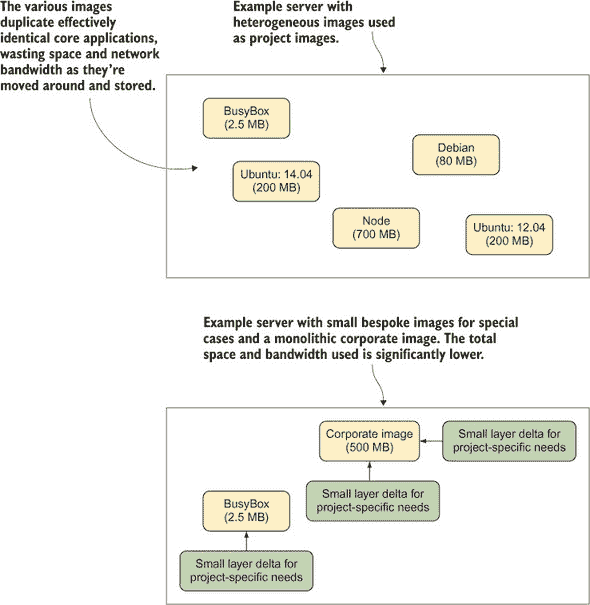

你可能会想起共享库的原则。共享库可以被多个应用程序同时加载，从而减少运行所需程序所需的磁盘和内存量。同样，为你的组织创建一个共享的基础镜像可以节省空间，因为它只需要下载一次，并且应该包含你所需的一切。之前在多个镜像中需要的程序和库现在只需要一次。

此外，跨团队共享一个中央管理的单体镜像还可以带来其他好处。这个镜像的维护可以集中化，改进可以共享，构建过程中出现的问题只需要解决一次。

如果你打算采用这种技术，以下是一些需要注意的事项：

+   基础镜像首先应该是可靠的。如果它表现不一致，用户会避免使用它。

+   基础镜像的更改必须在用户可以查看的地方进行跟踪，以便用户可以自己调试问题。

+   回归测试对于更新基础镜像时减少混淆是必不可少的。

+   在基础镜像中添加的内容要小心，一旦它被添加到基础镜像中，就很难移除，镜像可能会迅速膨胀。

**讨论**

我们在我们的 600 人开发公司中有效地使用了这项技术。核心应用程序的每月构建被捆绑到一个大型镜像中，并发布到内部 Docker 注册库。团队默认基于所谓的“纯”企业镜像进行构建，如果需要，可以在其上创建定制层。

值得查看技术 12 以获取有关单体容器的一些额外细节——特别是关于 phusion/base 镜像 Docker 镜像的提及，这是一个考虑到运行多个进程而设计的镜像。

| |
| --- |

### 摘要

+   `ENTRYPOINT`是另一种启动 Docker 容器的方法，它允许在运行时配置参数。

+   通过扁平化镜像可以防止构建过程中的机密信息通过镜像层泄露。

+   可以使用 Alien 将不属于所选基础镜像发行版的软件包集成。

+   传统的构建工具，如`make`，以及现代的如 Chef，在 Docker 世界中仍然有其位置。

+   可以通过使用更小的基础镜像、使用适合任务的编程语言或删除不必要的文件来减小 Docker 镜像的大小。

+   考虑到镜像的大小是否是您需要解决的最重要挑战是值得考虑的。
