## 第三部分\. Docker 和 DevOps

现在，你已经准备好将 Docker 超越你的开发环境，并开始在软件交付的其他阶段使用它。构建和测试自动化是 DevOps 运动的基石。我们将通过自动化软件交付生命周期、部署和现实环境测试来展示 Docker 的强大功能。

第八章 将展示各种交付和改进持续集成的技术，使你的软件交付更加可靠和可扩展。

第九章 专注于持续交付。我们将解释什么是持续交付，并探讨 Docker 可以如何用来改进你开发管道的这一方面。

第十章 展示了如何充分利用 Docker 的网络模型，创建多容器服务，模拟现实网络，以及按需创建网络。

本部分将带你从开发一直走到你可以考虑在生产环境中运行 Docker 的阶段。

## 第八章\. 持续集成：加速你的开发管道


**本章涵盖**

+   使用 Docker Hub 工作流程作为 CI 工具

+   加速你的 I/O 重量级构建

+   使用 Selenium 进行自动化测试

+   在 Docker 中运行 Jenkins

+   使用 Docker 作为 Jenkins 从属节点

+   与你的开发团队一起扩展可用计算资源


在本章中，我们将探讨各种技术，这些技术将使用 Docker 来使你的持续集成（CI）工作得以实现和改进。

到现在为止，你应该已经理解 Docker 非常适合用于自动化。它的轻量级特性，以及它赋予你将环境从一个地方迁移到另一个地方的能力，可以使它成为 CI 的关键推动者。我们发现本章中的技术对于在商业环境中使 CI 过程可行非常有价值。

在本章结束时，你将了解 Docker 如何使 CI（持续集成）过程更快、更稳定、可重复。通过使用测试工具如 Selenium，以及使用 Jenkins Swarm 插件扩展你的构建能力，你将看到 Docker 如何帮助你从 CI 过程中获得更多。


##### 注意

如果你不知道，*持续集成* 是一种软件生命周期策略，用于加速开发管道。通过在代码库中每次进行重大更改时自动重新运行测试，你可以获得更快、更稳定的交付，因为正在交付的软件有一个基本的稳定性水平。


### 8.1\. Docker Hub 自动构建

Docker Hub 自动构建功能在技术 10 中提到，尽管我们没有详细介绍它。简而言之，如果您指向包含 Dockerfile 的 Git 仓库，Docker Hub 将处理构建镜像并使其可供下载的过程。任何 Git 仓库中的更改都会触发镜像重建，这使得它作为 CI 流程的一部分非常有用。

| |
| --- |

**使用 Docker Hub 工作流程**

这种技术将向您介绍 Docker Hub 工作流程，它使您能够触发镜像的重建。

| |
| --- |

##### 备注

对于本节，您需要在 docker.com 上创建一个账户，并将其与 GitHub 或 Bitbucket 账户关联。如果您还没有设置并关联这些账户，可以在 github.com 和 bitbucket.org 的主页上找到说明。

| |
| --- |

**问题**

您希望在代码更改时自动测试并推送更改到您的镜像。

**解决方案**

设置 Docker Hub 仓库并将其与您的代码链接。

虽然 Docker Hub 构建并不复杂，但需要执行多个步骤：

1.  在 GitHub 或 Bitbucket 上创建您的仓库。

1.  克隆新的 Git 仓库。

1.  向您的 Git 仓库添加代码。

1.  提交源代码。

1.  推送 Git 仓库。

1.  在 Docker Hub 上创建一个新的仓库。

1.  将 Docker Hub 仓库链接到 Git 仓库。

1.  等待 Docker Hub 构建完成。

1.  提交并推送源代码的更改。

1.  等待第二次 Docker Hub 构建完成。

| |
| --- |

##### 备注

Git 和 Docker 都使用“仓库”一词来指代一个项目。这可能会让人困惑。Git 仓库和 Docker 仓库不是同一回事，尽管在这里我们将这两种类型的仓库关联起来。

| |
| --- |

**在 GitHub 或 Bitbucket 上创建您的仓库**

在 GitHub 或 Bitbucket 上创建一个新的仓库。您可以给它任何您想要的名称。

**克隆新的 Git 仓库**

将您的新的 Git 仓库克隆到您的宿主机上。此命令将可在 Git 项目的主页上找到。

切换到该仓库的目录。

**向您的 Git 仓库添加代码**

现在您需要向项目中添加代码。

您可以添加任何喜欢的 Dockerfile，但以下列表显示了一个已知可以工作的示例。它由两个文件组成，代表一个简单的开发工具环境。它安装了一些首选的实用工具，并输出您拥有的 bash 版本。

##### 列表 8.1\. Dockerfile—简单的开发工具容器 Dockerfile

```
FROM ubuntu:14.04
ENV DEBIAN_FRONTEND noninteractive
RUN apt-get update
RUN apt-get install -y curl                              *1*
 RUN apt-get install -y nmap                             *1*
 RUN apt-get install -y socat                            *1*
 RUN apt-get install -y openssh-client                   *1*
 RUN apt-get install -y openssl                          *1*
 RUN apt-get install -y iotop                            *1*
 RUN apt-get install -y strace                           *1*
 RUN apt-get install -y tcpdump                          *1*
 RUN apt-get install -y lsof                             *1*
 RUN apt-get install -y inotify-tools                    *1*
 RUN apt-get install -y sysstat                          *1*
 RUN apt-get install -y build-essential                  *1*
 RUN echo "source /root/bash_extra" >> /root/.bashrc     *2*
 ADD bash_extra /root/bash_extra                         *3*
 CMD ["/bin/bash"]
```

+   ***1*** **安装有用的软件包**

+   ***2*** **在根的 bashrc 中添加一行以源 bash_extra**

+   ***3*** **将源代码中的 bash_extra 添加到容器中**

现在您需要添加您所引用的 bash_extra 文件，并给它以下内容：

```
bash --version
```

此文件仅用于说明。它表明您可以在启动时创建一个 bash 文件。在这种情况下，它显示您在 shell 中使用的 bash 版本，但它可以包含所有各种设置您 shell 到您首选状态的东西。

**提交源代码**

要提交您的源代码，请使用以下命令：

```
git commit -am "Initial commit"
```

**推送 Git 仓库**

现在您可以使用以下命令将源代码推送到 Git 服务器：

```
git push origin master
```

**在 Docker Hub 上创建一个新的仓库**

接下来，您需要在 Docker Hub 上为该项目创建一个仓库。转到[`hub.docker.com`](https://hub.docker.com)，确保您已登录。然后点击创建并选择创建自动化构建。

第一次，您需要完成账户链接过程。您将看到一个提示，要求将您的账户链接到托管 Git 服务。选择您的服务并按照说明链接您的账户。您可能会被提供选择给予 Docker Inc.完全访问权限或更有限访问权限以进行集成的选项。如果您选择更有限的访问权限，您应该阅读您特定服务的官方文档，以确定您在剩余步骤中可能需要做哪些额外工作。

**将 Docker Hub 仓库链接到 Git 仓库**

您将看到一个选择 Git 服务的屏幕。选择您使用的源代码服务（GitHub 或 Bitbucket），并从提供的列表中选择您的新仓库。

您将看到一个带有构建配置选项的页面。您可以保留默认设置，然后在底部点击创建仓库。

**等待 Docker Hub 构建完成**

您将看到一个带有解释链接成功的消息的页面。点击构建详情链接。

接下来，您将看到一个显示构建详细信息的页面。在构建历史记录下，将有一个条目用于这个第一个构建。如果您没有看到任何列出内容，您可能需要点击按钮来手动触发构建。构建 ID 旁边的状态字段将显示为挂起、完成、构建中或错误。如果一切顺利，您将看到前三个状态之一。如果您看到错误，说明出了问题，您需要点击构建 ID 来查看错误详情。


##### 注意

构建开始可能需要一些时间，所以在等待时看到挂起状态一段时间是完全正常的。


定期刷新，直到您看到构建已完成。一旦完成，您可以使用同一页面上列出的`docker pull`命令拉取镜像。

**提交并推送源代码的更改**

现在您决定在登录时想要更多关于您环境的信息，因此您想要输出您正在运行的发行版的详细信息。为了实现这一点，将这些行添加到您的 bash_extra 文件中，使其现在看起来像这样：

```
bash --version
cat /etc/issue
```

然后按照步骤 4 和 5 进行提交和推送。

**等待第二个 Docker Hub 构建完成**

如果您返回到构建页面，构建历史记录部分应该会显示一条新行，您可以像第 8 步一样跟踪此构建。


##### 小贴士

如果您的构建出现错误（如果没有问题则不会收到邮件），您将会收到邮件，所以一旦您习惯了这种工作流程，您只需要在收到邮件时检查一下。


现在，你可以使用 Docker Hub 工作流程。你会很快习惯这个框架，并发现它对于保持构建更新和减少手动重建 Dockerfile 的认知负担非常有价值。

**讨论**

由于 Docker Hub 是镜像的规范来源，在你的 CI 流程中推送那里可以使一些事情变得更加简单（例如，向第三方分发镜像）。不需要自己运行构建过程更容易，并给你带来一些额外的优势，比如在 Docker Hub 的列表上有一个勾选标记，表明构建是在受信任的服务器上执行的。

对你的构建有额外的信心可以帮助你遵守 技术 70 中的 *Docker 协议*——在 技术 113 中，我们将探讨特定机器有时如何影响 Docker 构建，因此使用一个完全独立的系统对于提高最终结果的可信度是有益的。


### 8.2. 更高效的构建

CI 意味着更频繁地重建你的软件和测试。尽管 Docker 使交付 CI 更容易，但你可能遇到的下一个问题是计算资源上的负载增加。 

我们将探讨在磁盘 I/O、网络带宽和自动化测试方面缓解这种压力的方法。


**使用 eatmydata 加速 I/O 密集型构建**

由于 Docker 非常适合自动化构建，随着时间的推移，你可能会执行大量的磁盘 I/O 密集型构建。Jenkins 作业、数据库重建脚本和大型代码签出都会对你的磁盘造成严重打击。在这些情况下，你会感激任何可以获得的加速，无论是为了节省时间还是为了最小化由于资源竞争而产生的许多开销。

这种技术已被证明可以提高高达 1:3 的速度，我们的经验也证实了这一点。这可不是小事情！

**问题**

你希望加速你的 I/O 密集型构建。

**解决方案**

eatmydata 是一个程序，它将你的系统调用写入数据，并通过绕过持久化这些更改所需的工作来使它们变得超级快。这涉及一些安全性的缺乏，因此不建议在常规使用中，但它对于设计用于不持久化的环境非常有用，例如在测试中。

**安装 eatmydata**

要在你的容器中安装 eatmydata，你有多种选择：

+   如果你运行的是基于 deb 的发行版，你可以使用 `apt-get install` 安装它。

+   如果你运行的是基于 rpm 的发行版，你可以在网上搜索并下载它后使用 `rpm --install` 安装它。例如，rpmfind.net 是一个很好的起点。

+   作为最后的手段，如果你已经安装了编译器，你可以直接下载并按照下面的列表进行编译。

##### 列表 8.2. 编译和安装 eatmydata

```
$ url=https://www.flamingspork.com/projects/libeatmydata
 /libeatmydata-105.tar.gz                                    *1*
 $ wget -qO- $url | tar -zxf - && cd libeatmydata-105           *2*
 $ ./configure --prefix=/usr                                    *3*
 $ make                                                         *4*
 $ sudo make install                                            *5*
```

+   ***1*** **Flamingspork.com 是维护者的网站。**

+   ***2*** **如果此版本未下载，请访问网站查看是否已更新到大于 105 的版本。**

+   ***3*** **如果您想将 eatmydata 可执行文件安装到除/usr/bin 之外的其他位置，请更改前缀目录。**

+   ***4*** **构建 eatmydata 可执行文件**

+   ***5*** **安装软件；此步骤需要 root 权限**

**使用 eatmydata**

一旦在您的镜像上安装了 libeatmydata（无论是从软件包还是从源代码），在执行任何命令之前运行 eatmydata 包装脚本，以利用它：

```
docker run -d mybuildautomation eatmydata /run_tests.sh
```

图 8.1 从高层次展示了 eatmydata 如何节省您处理时间。

##### 图 8.1\. 应用程序写入磁盘（顶部）和带有 eatmydata（底部）的情况

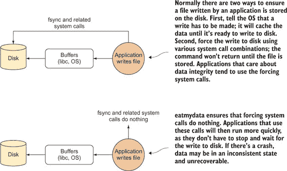


##### 警告

eatmydata 跳过了确保数据安全写入磁盘的步骤，因此存在数据尚未写入磁盘而程序认为它已经写入磁盘的风险。对于测试运行，这通常无关紧要，因为数据是可丢弃的，但不要使用 eatmydata 来加速任何数据重要的环境！


请注意，运行`eatmydata docker run ...`以启动 Docker 容器，可能是在您的宿主机上安装 eatmydata 或挂载 Docker 套接字之后，由于第二章中概述的 Docker 客户端/服务器架构，这不会产生您可能期望的效果。相反，您需要在每个您想要使用 eatmydata 的容器内安装 eatmydata。

**讨论**

尽管具体用例可能会有所不同，但您应该能够立即应用的一个地方是技术 68。在 CI 作业的数据完整性通常并不重要——您通常只对成功或失败感兴趣，在失败的情况下，您通常只关心日志。

另一项相关的技术是技术 77。数据库是数据完整性真正非常重要的一个地方（任何流行的数据库都将设计为在机器电源丢失的情况下不会丢失数据），但如果你只是运行一些测试或实验，这将是您不需要的开销。

|  |

**为快速构建设置包缓存**

由于 Docker 适合于开发、测试和生产中频繁重建服务，您可能会迅速达到一个需要反复大量访问网络的点。一个主要原因是下载来自互联网的包文件。这甚至可能在单台机器上也是一个缓慢（且昂贵）的开销。这项技术向您展示了如何设置本地缓存以用于您的包下载，包括 apt 和 yum。

**问题**

您希望通过减少网络 I/O 来加速您的构建。

**解决方案**

为您的包管理器安装一个 Squid 代理。图 8.2 说明了这项技术的工作原理。

##### 图 8.2\. 使用 Squid 代理缓存包

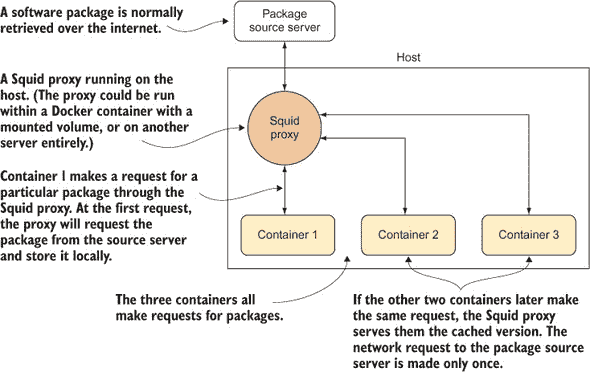

由于软件包的调用首先发送到本地 Squid 代理，并且只有在第一次请求时才通过互联网请求，因此对于每个软件包，应该只有一个互联网请求。如果你有数百个容器都从互联网下载相同的大型软件包，这可以为你节省大量时间和金钱。

| |
| --- |

##### 注意

当你在主机上设置此配置时，可能会遇到网络配置问题。以下各节提供了建议，以确定是否出现这种情况，但如果你不确定如何进行，你可能需要寻求友好的网络管理员帮助。

| |
| --- |

**Debian**

对于 Debian（也称为 apt 或 .deb）软件包，设置更简单，因为有预包装版本。

在基于 Debian 的主机上运行以下命令：

```
sudo apt-get install squid-deb-proxy
```

通过 telnet 到端口 8000 确保服务已启动：

```
$ telnet localhost 8000
Trying ::1...
Connected to localhost.
Escape character is '^]'.
```

如果看到前面的输出，请按 Ctrl-] 然后按 Ctrl-d 退出。如果没有看到此输出，则 Squid 要么未正确安装，要么安装在了非标准端口。

要设置你的容器使用此代理，我们提供了以下示例 Dockerfile。请注意，从容器的角度来看，主机的 IP 地址可能会在每次运行时发生变化。因此，你可能希望在安装新软件之前将此 Dockerfile 转换为在容器内运行的脚本。

##### 列表 8.3\. 配置 Debian 镜像以使用 apt 代理

```
FROM debian
RUN apt-get update -y && apt-get install net-tools                 *1*
 RUN echo "Acquire::http::Proxy \"http://$( \
route -n | awk '/⁰.0.0.0/ {print $2}' \                           *2*
 ):8000\";" \                                                       *3*
 > /etc/apt/apt.conf.d/30proxy                                     *4*
 RUN echo "Acquire::http::Proxy::ppa.launchpad.net  DIRECT;" >> \
    /etc/apt/apt.conf.d/30proxy
CMD ["/bin/bash"]
```

+   ***1*** **确保路由工具已安装**

+   ***2*** **为了确定容器视角下的主机 IP 地址，运行路由命令并使用 awk 从输出中提取相关 IP 地址（见技术 67）。**

+   ***3*** **端口 8000 用于连接到主机上的 Squid 代理。**

+   ***4*** **将带有适当 IP 地址和配置的回显行添加到 apt 的代理配置文件中。**

**Yum**

在主机上，通过使用你的包管理器安装 squid 软件包来确保 Squid 已安装。

然后，你需要更改 Squid 配置以创建更大的缓存空间。打开 /etc/squid/squid.conf 文件，将开始的注释行 `#cache_dir ufs /var/spool/squid` 替换为以下内容：`cache_dir ufs /var/spool/squid 10000 16 256`。这会创建一个 10,000 MB 的空间，应该足够使用。

通过 telnet 到端口 3128 确保服务已启动：

```
$ telnet localhost 3128
Trying ::1...
Connected to localhost.
Escape character is '^]'.
```

如果看到前面的输出，请按 Ctrl-] 然后按 Ctrl-d 退出。如果没有看到此输出，则 Squid 要么未正确安装，要么安装在了非标准端口。

要设置你的容器使用此代理，我们提供了以下示例 Dockerfile。请注意，从容器的角度来看，主机的 IP 地址可能会在每次运行时发生变化。你可能希望在安装新软件之前将此 Dockerfile 转换为在容器内运行的脚本。

##### 列表 8.4\. 配置 CentOS 镜像以使用 yum 代理

```
FROM centos:centos7
RUN yum update -y && yum install -y net-tools            *1*
 RUN echo "proxy=http://$(route -n | \                   *2*
 awk '/⁰.0.0.0/ {print $2}'):3128" >> /etc/yum.conf     *3*
 RUN sed -i 's/^mirrorlist/#mirrorlist/' \
/etc/yum.repos.d/CentOS-Base.repo                        *4*
 RUN sed -i 's/^#baseurl/baseurl/' \                     *4*
/etc/yum.repos.d/CentOS-Base.repo                        *4*
 RUN rm -f /etc/yum/pluginconf.d/fastestmirror.conf      *5*
 RUN yum update -y                                       *6*
 CMD ["/bin/bash"]
```

+   ***1*** **确保路由工具已安装**

+   ***2*** **为了从容器的角度确定主机的 IP 地址，运行 route 命令并使用 awk 从输出中提取相关 IP 地址**

+   ***3*** **使用端口 3128 连接到主机上的 Squid 代理。**

+   ***4*** **尽可能避免缓存未命中，移除镜像列表并仅使用基础 URL。这确保你只击中一组 URL 来获取软件包，因此你更有可能击中缓存文件。**

+   ***5*** **移除 fastestmirror 插件，因为它不再需要。**

+   ***6*** **确保镜像被检查。当运行 yum update 时，配置文件中列出的镜像可能包含过时的信息，因此第一次更新可能会很慢。**

如果你以这种方式设置两个容器并在两个容器中依次安装相同的大型软件包，你应该会注意到第二个安装比第一个下载其依赖项要快得多。

**讨论**

你可能已经观察到你可以在容器上而不是在主机上运行 Squid 代理。这里没有展示这个选项是为了保持解释简单（在某些情况下，需要更多步骤才能使 Squid 在容器中工作）。你可以阅读更多关于此内容，以及如何使容器自动使用代理的信息，请参阅[`github.com/jpetazzo/squid-in-a-can`](https://github.com/jpetazzo/squid-in-a-can)。

|  |

**容器中的无头 Chrome**

运行测试是 CI 的关键部分，大多数单元测试框架都可以在 Docker 中无问题运行。但有时需要更复杂的测试，从确保多个微服务正确协作到确保网站前端功能仍然正常。访问网站前端需要某种类型的浏览器，因此为了解决这个问题，我们需要一种方法在容器内启动浏览器，然后对其进行程序化控制。

**问题**

你想在容器内测试 Chrome 浏览器，而不需要 GUI。

**解决方案**

在镜像中使用 Puppeteer Node.js 库来自动化 Chrome 操作。

这个库由 Google Chrome 开发团队维护，它允许你针对测试目的编写针对 Chrome 的脚本。它是“无头”的，这意味着你不需要 GUI 就可以与之工作。


##### 注意

此镜像也由我们在 GitHub 上维护[`github.com/docker-in-practice/docker-puppeteer`](https://github.com/docker-in-practice/docker-puppeteer)。它也可以作为 Docker 镜像通过 `docker pull dockerinpractice/docker-puppeteer` 获取。


以下列表显示了一个 Dockerfile，它将创建一个包含所有启动 Puppeteer 所需内容的镜像。

##### 列表 8.5\. Puppeteer Dockerfile

```
FROM ubuntu:16.04                                                          *1*
 RUN apt-get update -y && apt-get install -y \                             *2*
     npm python-software-properties curl git \                             *2*
     libpangocairo-1.0-0 libx11-xcb1 \                                     *2*
     libxcomposite1 libxcursor1 libxdamage1 \                              *2*
     libxi6 libxtst6 libnss3 libcups2 libxss1 \                            *2*
     libxrandr2 libgconf-2-4 libasound2 \                                  *2*
     libatk1.0-0 libgtk-3-0 vim gconf-service \                            *2*
     libappindicator1 libc6 libcairo2 libcups2 \                           *2*
     libdbus-1-3 libexpat1 libfontconfig1 libgcc1 \                        *2*
     libgdk-pixbuf2.0-0 libglib2.0-0 libnspr4 \                            *2*
     libpango-1.0-0 libstdc++6 libx11-6 libxcb1 \                          *2*
     libxext6 libxfixes3  libxrender1 libxtst6 \                           *2*
     ca-certificates fonts-liberation lsb-release \                        *2*
     xdg-utils wget                                                        *2*
 RUN curl -sL https://deb.nodesource.com/setup_8.x | bash -                *3*
 RUN apt-get install -y nodejs                                             *4*
 RUN useradd -m puser                                                      *5*
 USER puser                                                                *6*
 RUN mkdir -p /home/puser/node_modules                                     *7*
 ENV NODE_PATH /home/puppeteer/node_modules                                *8*
 WORKDIR /home/puser/node_modules                                          *9*
 RUN npm i webpack                                                         *10*
 RUN git clone https://github.com/GoogleChrome/puppeteer                   *11*
 WORKDIR /home/puser/node_modules/puppeteer                                *12*
 RUN npm i .                                                               *13*
 WORKDIR /home/puser/node_modules/puppeteer/examples                       *14*
 RUN perl -p -i -e \                                                       *15*
     "s/puppeteer.launch\(\)/puppeteer.launch({args: ['--no-sandbox']})/" **15*
 CMD echo 'eg: node pdf.js' && bash                                        *15*
```

+   ***1*** **以 Ubuntu 基础镜像开始**

+   ***2*** **安装所有必需的软件。这是大多数用于在容器中运行 Chrome 所需的显示库。**

+   ***3*** **设置最新的 nodejs 版本**

+   ***4*** **安装 Ubuntu 的 nodejs 软件包**

+   ***5*** 创建一个非 root 用户，“puser”（库运行所需的用户）

+   ***6*** 创建一个 node modules 文件夹

+   ***7*** 将 NODE_PATH 环境变量设置为 node 模块文件夹

+   ***8*** 将当前工作目录设置为 node 模块路径

+   ***9*** 安装 webpack（Puppeteer 的依赖项）

+   ***10*** 克隆 Puppeteer 模块代码

+   ***11*** 进入 Puppeteer 代码文件夹

+   ***12*** 安装 Puppeteer NodeJS 库

+   ***13*** 进入 Puppeteer 示例文件夹

+   ***14*** 将 no-sandbox 参数添加到 Puppeteer 启动参数中，以克服在容器内运行时的安全设置

+   ***15*** 使用 bash 启动容器，并添加一个有用的 echo 命令

使用以下命令构建和运行此 Dockerfile：

```
$ docker build -t puppeteer .
```

然后运行它：

```
$ docker run -ti puppeteer
eg: node pdf.js
puser@03b9be05e81d:~/node_modules/puppeteer/examples$
```

您将看到一个终端和运行`node pdf.js`的建议。

pdf.js 文件包含一个简单的脚本，作为使用 Puppeteer 库可以做什么的示例。

##### 列表 8.6\. pdf.js

```
'use strict';                                                  *1*
 const puppeteer = require('puppeteer');                       *2*
 (async() => {                                                 *3*
   const browser = await puppeteer.launch();                   *4*
   const page = await browser.newPage();                       *5*
   await page.goto(
    'https://news.ycombinator.com', {waitUntil: 'networkidle'}
  );                                                           *6*
   await page.pdf({                                            *7*
     path: 'hn.pdf',                                           *7*
     format: 'letter'                                          *7*
   });                                                         *7*
   await browser.close();                                      *8*
 })();                                                         *9*
```

+   ***1*** 以严格模式运行 JavaScript 解释器，这可以捕获技术上允许但常见的不安全操作

+   ***2*** 导入 Puppeteer 库

+   ***3*** 创建一个异步块，代码将在其中运行

+   ***4*** 使用`puppeteer.launch`函数启动浏览器。代码在启动完成前暂停，使用`await`关键字

+   ***5*** 使用`newPage`函数使浏览器等待页面（相当于浏览器标签页）可用

+   ***6*** 使用`page.goto`函数打开 HackerNews 网站，并在继续之前等待没有网络流量

+   ***7*** 使用`page.pdf`函数以信函格式创建当前标签页的 PDF，并调用文件`hn.pdf`

+   ***8*** 关闭浏览器并等待终止完成

+   ***9*** 调用异步块返回的函数

Puppeteer 用户除了这个简单的示例之外，还有许多选项可用。本技术的范围不包括详细解释 Puppeteer API。如果您想更深入地了解 API 并调整此技术，请查看 GitHub 上的 Puppeteer API 文档：[`github.com/GoogleChrome/puppeteer/blob/master/docs/api.md`](https://github.com/GoogleChrome/puppeteer/blob/master/docs/api.md)。

**讨论**

这种技术展示了如何使用 Docker 来针对特定浏览器进行测试。

下一个技术以两种方式扩展了这一点：通过使用 Selenium，这是一个流行的测试工具，可以针对多个浏览器进行工作，并将其与一些 X11 的探索相结合，这样您就可以看到在图形窗口中运行的浏览器，而不是像本技术中使用的那种无头模式。

|  |

**在 Docker 内运行 Selenium 测试**

我们还没有详细研究的一个 Docker 用例是运行图形应用程序。在第三章中，使用 VNC 连接到容器以在“保存游戏”的开发方法（技术 19）中，但这可能有些笨拙——窗口被包含在 VNC 观看器窗口内，桌面交互可能有点受限。我们将通过演示如何使用 Selenium 编写图形测试来探索这种方法的替代方案。我们还将向你展示如何使用此镜像作为 CI 工作流程的一部分来运行测试。

**问题**

你希望在 CI 流程中运行图形程序的同时，有选择地在自己的屏幕上显示这些相同的图形程序。

**解决方案**

将你的 X11 服务器套接字共享以在你的屏幕上查看程序，并在你的 CI 流程中使用 xvfb。

无论你需要做什么来启动你的容器，你都必须将 X11 用于显示窗口的 Unix 套接字作为卷挂载在容器内，并且你需要指出你的窗口应该显示在哪个显示上。你可以在你的主机上运行以下命令来双重检查这两件事是否设置为默认值：

```
~ $ ls /tmp/.X11-unix/
X0
~ $ echo $DISPLAY
:0
```

首个命令检查 X11 服务器 Unix 套接字是否在技术其余部分假设的位置运行。第二个命令检查应用程序使用的环境变量以查找 X11 套接字。如果你的这些命令的输出与这里的输出不匹配，你可能需要修改此技术中命令的一些参数。

现在你已经检查了你的机器设置，你需要确保容器内的应用程序能够无缝地显示在容器外部。你需要克服的主要问题是你的计算机为了防止其他人连接到你的机器、接管你的显示以及可能记录你的按键而设置的安全措施。在技术 29 中，你简要地看到了如何做到这一点，但我们没有讨论它是如何工作的或查看任何替代方案。

X11 有多种方式来验证容器以使用你的 X 套接字。首先，我们将查看 .Xauthority 文件——它应该存在于你的家目录中。它包含主机名以及每个主机必须使用的“秘密饼干”以连接。通过给你的 Docker 容器分配与你的机器相同的主机名，并使用容器外相同的用户名，你可以使用现有的 .Xauthority 文件。

##### 列表 8.7\. 使用启用 Xauthority 的显示启动容器

```
$ ls $HOME/.Xauthority
/home/myuser/.Xauthority
$ docker run -e DISPLAY=$DISPLAY -v /tmp/.X11-unix:/tmp/.X11-unix \
    --hostname=$HOSTNAME -v $HOME/.Xauthority:$HOME/.Xauthority \
    -it -e EXTUSER=$USER ubuntu:16.04 bash -c 'useradd $USER && exec bash'
```

允许 Docker 访问套接字的第二种方法是一个更直接的工具，但它存在安全问题，因为它禁用了 X 为您提供的所有保护。如果没有人能访问您的计算机，这可能是一个可接受的解决方案，但您应该始终首先尝试使用.Xauthority 文件。您可以通过运行`xhost -`（尽管这将锁定您的 Docker 容器）来在尝试以下步骤后再次保护自己：

##### 列表 8.8\. 使用 xhost 启用显示启动容器

```
$ xhost +
access control disabled, clients can connect from any host
$ docker run -e DISPLAY=$DISPLAY -v /tmp/.X11-unix:/tmp/.X11-unix \
    -it ubuntu:16.04 bash
```

在前面的列表中，第一行禁用了对 X 的所有访问控制，第二行运行了容器。请注意，您不需要设置主机名或挂载除了 X 套接字之外的内容。

一旦您启动了容器，就是时候检查它是否正常工作了。如果您选择.Xauthority 路径，可以通过运行以下命令来完成：

```
root@myhost:/# apt-get update && apt-get install -y x11-apps
[...]
root@myhost:/# su - $EXTUSER -c "xeyes"
```

或者，如果您选择 xhost 路径，可以使用以下略有不同的命令，因为您不需要以特定用户身份运行该命令：

```
root@ef351febcee4:/# apt-get update && apt-get install -y x11-apps
[...]
root@ef351febcee4:/# xeyes
```

这将启动一个经典的应用程序来测试 X 是否工作——xeyes。当您在屏幕上移动光标时，应该会看到眼睛跟随。请注意，（与 VNC 不同）应用程序集成到您的桌面中——如果您多次启动 xeyes，您会看到多个窗口。

是时候开始使用 Selenium 了。如果您以前从未使用过它，它是一个具有自动化浏览器操作能力的工具，通常用于测试网站代码——它需要一个图形显示来运行浏览器。尽管它最常与 Java 一起使用，但我们将使用 Python 来允许更多的交互性。

以下列表首先安装 Python、Firefox 和一个 Python 包管理器，然后使用 Python 包管理器安装 Selenium Python 包。它还下载了 Selenium 用于控制 Firefox 的“驱动”二进制文件。然后启动 Python REPL，并使用 Selenium 库创建 Firefox 实例。

为了简单起见，这里只涵盖 xhost 路径——要选择 Xauthority 路径，您需要为用户创建一个家目录，以便 Firefox 有地方保存其配置文件设置。

##### 列表 8.9\. 安装 Selenium 需求并启动浏览器

```
root@myhost:/# apt-get install -y python2.7 python-pip firefox wget
[...]
root@myhost:/# pip install selenium
Collecting selenium
[...]
Successfully installed selenium-3.5.0
root@myhost:/# url=https://github.com/mozilla/geckodriver/releases/download
 /v0.18.0/geckodriver-v0.18.0-linux64.tar.gz
root@myhost:/# wget -qO- $url | tar -C /usr/bin -zxf -
root@myhost:/# python
Python 2.7.6 (default, Mar 22 2014, 22:59:56)
[GCC 4.8.2] on linux2
Type "help", "copyright", "credits" or "license" for more information.
>>> from selenium import webdriver
>>> b = webdriver.Firefox()
```

正如您可能已经注意到的，Firefox 已经启动并出现在您的屏幕上。

您现在可以尝试使用 Selenium。以下是一个针对 GitHub 的示例会话——您需要了解 CSS 选择器的基本知识才能理解这里发生的事情。请注意，网站经常更改，因此这个特定的片段可能需要修改才能正确工作：

```
>>> b.get('https://github.com/search')
>>> searchselector = '#search_form input[type="text"]'
>>> searchbox = b.find_element_by_css_selector(searchselector)
>>> searchbox.send_keys('docker-in-practice')
>>> searchbox.submit()
>>> import time
>>> time.sleep(2) # wait for page JS to run
>>> usersxpath = '//nav//a[contains(text(), "Users")]'
>>> userslink = b.find_element_by_xpath(usersxpath)
>>> userslink.click()
>>> dlinkselector = '.user-list-info a'
>>> dlink = b.find_elements_by_css_selector(dlinkselector)[0]
>>> dlink.click()
>>> mlinkselector = '.meta-item a'
>>> mlink = b.find_element_by_css_selector(mlinkselector)
>>> mlink.click()
```

这里详细的内容并不重要，尽管您可以通过在命令之间切换到 Firefox 来了解正在发生的事情——我们正在导航到 GitHub 上的 docker-in-practice 组织，并点击组织链接。主要的收获是我们正在容器中用 Python 编写命令，并看到它们在容器内运行的 Firefox 窗口中生效，但它们在桌面上可见。

这对于调试你编写的测试非常棒，但你是如何将它们集成到具有相同 Docker 镜像的 CI 管道中的呢？CI 服务器通常没有图形显示，所以你需要在不挂载自己的 X 服务器套接字的情况下使它工作。但 Firefox 仍然需要一个 X 服务器来运行。

有一个有用的工具叫做 xvfb，它模拟了一个 X 服务器的运行，供应用程序使用，但不需要显示器。

为了看看这是如何工作的，我们将安装 xvfb，提交容器，将其标记为`selenium`，并创建一个测试脚本：

##### 列表 8.10\. 创建 Selenium 测试脚本

```
>>> exit()
root@myhost:/# apt-get install -y xvfb
[...]
root@myhost:/# exit
$ docker commit ef351febcee4 selenium
d1cbfbc76790cae5f4ae95805a8ca4fc4cd1353c72d7a90b90ccfb79de4f2f9b
$ cat > myscript.py << EOF
from selenium import webdriver
b = webdriver.Firefox()
print 'Visiting github'
b.get('https://github.com/search')
print 'Performing search'
searchselector = '#search_form input[type="text"]'
searchbox = b.find_element_by_css_selector(searchselector)
searchbox.send_keys('docker-in-practice')
searchbox.submit()
print 'Switching to user search'
import time
time.sleep(2) # wait for page JS to run
usersxpath = '//nav//a[contains(text(), "Users")]'
userslink = b.find_element_by_xpath(usersxpath)
userslink.click()
print 'Opening docker in practice user page'
dlinkselector = '.user-list-info a'
dlink = b.find_elements_by_css_selector(dlinkselector)[99]
dlink.click()
print 'Visiting docker in practice site'
mlinkselector = '.meta-item a'
mlink = b.find_element_by_css_selector(mlinkselector)
mlink.click()
print 'Done!'
EOF
```

注意`dlink`变量赋值的微妙差异（索引位置为`99`而不是`0`）。通过尝试获取包含文本“Docker in Practice”的第 100 个结果，你会触发一个错误，这将导致 Docker 容器以非零状态退出，并触发 CI 管道中的失败。

是时候尝试一下了：

```
$ docker run --rm -v $(pwd):/mnt selenium sh -c \
"xvfb-run -s '-screen 0 1024x768x24 -extension RANDR'\
python /mnt/myscript.py"
Visiting github
Performing search
Switching to user search
Opening docker in practice user page
Traceback (most recent call last):
  File "myscript.py", line 15, in <module>
      dlink = b.find_elements_by_css_selector(dlinkselector)[99]
      IndexError: list index out of range
$ echo $?
1
```

你已经运行了一个自我删除的容器，它在一个虚拟 X 服务器下执行 Python 测试脚本。不出所料，它失败了，并返回了一个非零退出代码。

| |
| --- |

##### 注意

`sh -c "command string here"`是 Docker 默认处理`CMD`值的不幸结果。如果你用 Dockerfile 构建了这个镜像，你就可以移除`sh -c`，并将`xvfb-run -s '-screen 0 1024x768x24 -extension RANDR'`作为 entrypoint，这样你就可以通过镜像参数传递测试命令。

| |
| --- |

**讨论**

Docker 是一个灵活的工具，可以用于一些最初令人惊讶的用途（在这种情况下是图形应用程序）。有些人甚至将所有图形应用程序都在 Docker 中运行，包括游戏！

我们不会走那么远（技术 40 确实考虑了至少为你的开发工具做这件事），但我们发现重新审视对 Docker 的假设可以导致一些令人惊讶的使用案例。例如，附录 A 讨论了在安装 Docker for Windows 后，在 Windows 上运行图形 Linux 应用程序。

| |
| --- |

### 8.3\. 容器化你的 CI 流程

一旦你在团队间建立了一致的开发流程，也重要的是要有一个一致的建设流程。随机失败的构建会抵消 Docker 的作用。

因此，将整个 CI 流程容器化是有意义的。这不仅确保了你的构建是可重复的，还允许你将 CI 流程移动到任何地方，而不用担心会遗漏一些重要的配置（很可能会在后来的沮丧中找到）。

在这些技术中，我们将使用 Jenkins（因为这是最广泛使用的 CI 工具），但同样的技术也适用于其他 CI 工具。我们这里不假设对 Jenkins 有很高的熟悉度，但也不会涵盖设置标准测试和构建的内容。这些信息对这里的技术不是必需的。

| |
| --- |

**在 Docker 容器中运行 Jenkins 主节点**

将 Jenkins 主节点放在容器内并不像为从节点做同样的事情那样有那么多好处（参见下一技术），但它确实提供了不可变镜像的正常 Docker 优势。我们发现，能够提交已知良好的主节点配置和插件，可以显著减轻实验的负担。

**问题**

你需要一个可移植的 Jenkins 服务器。

**解决方案**

使用官方 Jenkins Docker 镜像来运行你的服务器。

在 Docker 容器中运行 Jenkins 为你提供了比直接主机安装更多的优势。在我们办公室，经常听到“别动我的 Jenkins 服务器配置！”或者更糟糕的是，“谁动了我的 Jenkins 服务器？”的抱怨，而能够通过`docker export`运行中的容器状态来克隆 Jenkins 服务器的状态，以便进行升级和更改的实验，有助于平息这些抱怨。同样，备份和迁移也变得更容易。

在这个技术中，我们将使用官方的 Jenkins Docker 镜像并进行一些修改，以方便后续需要访问 Docker 套接字的技术，例如从 Jenkins 中执行 Docker 构建。


##### 注意

本书中的 Jenkins 相关示例可在 GitHub 上找到：`git clone https://github.com/docker-in-practice/jenkins.git`。

|  |

##### 注意

本书中的 Jenkins 相关技术将使用此 Jenkins 镜像及其`run`命令作为服务器。


**构建服务器**

我们首先准备一个我们想要的服务器插件列表，并将其放置在一个名为 jenkins_plugins.txt 的文件中：

```
swarm:3.4
```

这个非常短的列表包括 Jenkins 的 Swarm 插件（与 Docker Swarm 无关），我们将在后续技术中使用它。

以下列表显示了构建 Jenkins 服务器的 Dockerfile。

##### 列表 8.11\. Jenkins 服务器构建

```
FROM jenkins                                                  *1*
 COPY jenkins_plugins.txt /tmp/jenkins_plugins.txt            *2*
 RUN /usr/local/bin/plugins.sh /tmp/jenkins_plugins.txt       *3*
 USER root                                                    *4*
 RUN rm /tmp/jenkins_plugins.txt                              *4*
 RUN groupadd -g 999 docker                                   *5*
 RUN addgroup -a jenkins docker                               *5*
 USER jenkins                                                 *6*
```

+   ***1*** **使用官方 Jenkins 镜像作为基础**

+   ***2*** **复制要安装的插件列表**

+   ***3*** **将插件运行到服务器中**

+   ***4*** **切换到 root 用户并删除插件文件**

+   ***5*** **将具有与主机机器相同组 ID 的 Docker 组添加到容器中（你的数字可能不同）**

+   ***6*** **切换回容器中的 Jenkins 用户**

没有给出`CMD`或`ENTRYPOINT`指令，因为我们希望继承官方 Jenkins 镜像中定义的启动命令。

Docker 在你的主机机器上的组 ID 可能不同。要查看你的 ID，请运行以下命令以查看本地组 ID：

```
$ grep -w ^docker /etc/group
docker:x:999:imiell
```

如果不同，请替换该值。


##### 警告

如果你计划在 Jenkins Docker 容器内运行 Docker，Jenkins 服务器环境和你的从节点环境中的组 ID 必须匹配。如果你选择移动服务器（在本地服务器安装中会遇到相同的问题），也可能存在潜在的便携性问题。环境变量本身无法帮助解决这个问题，因为组需要在构建时设置，而不是动态配置。


在此场景下构建镜像，请运行以下命令：

```
docker build -t jenkins_server .
```

**运行服务器**

现在，您可以使用此命令在 Docker 下运行服务器：

```
docker run --name jenkins_server -p 8080:8080 \       *1*
 -p 50000:50000 \                                     *2*
 -v /var/run/docker.sock:/var/run/docker.sock \       *3*
 -v /tmp:/var/jenkins_home \                          *4*
 -d \                                                 *5*
 jenkins_server
```

+   ***1*** **将 Jenkins 服务器端口 8080 打开到主机**

+   ***2*** **如果您想附加 Jenkins“构建从属节点”服务器，容器上需要打开 50000 端口。**

+   ***3*** **挂载 Docker 套接字，以便您可以从容器内与 Docker 守护进程交互**

+   ***4*** **将 Jenkins 应用程序数据挂载到主机机器/tmp，这样您就不会遇到文件权限错误。如果您在生产环境中使用此功能，请考虑运行它时挂载一个任何用户都可写入的文件夹。**

+   ***5*** **以守护进程模式运行服务器**

如果您访问 http://localhost:8080，您将看到 Jenkins 配置界面——按照流程进行，可能需要使用`docker exec`（在技术 12 中描述）来检索在第一步中提示的密码。

一旦完成，您的 Jenkins 服务器将准备就绪，您的插件已经安装（以及一些其他插件，具体取决于您在设置过程中选择的选项）。要检查此，请转到“管理 Jenkins”>“管理插件”>“已安装”，并查找 Swarm 以验证它是否已安装。

**讨论**

您会看到我们像在技术 45 中做的那样，将 Docker 套接字挂载到这个 Jenkins 主节点上，从而提供对 Docker 守护进程的访问。这允许您通过在主机上运行容器来使用内置的主从节点执行 Docker 构建。


##### **注意**

此技术及相关技术的代码可在 GitHub 上找到：[`github.com/docker-in-practice/jenkins`](https://github.com/docker-in-practice/jenkins)。

|  |
|  |

**包含复杂开发环境**

Docker 的可移植性和轻量级特性使其成为 CI 从属节点（CI 主节点连接以执行构建的机器）的明显选择。Docker CI 从属节点是 VM 从属节点（甚至是从裸机构建机器的更大飞跃）。它允许您在单个主机上执行多种环境下的构建，快速拆解和建立干净的环境以确保不受污染的构建，并使用所有熟悉的 Docker 工具来管理您的构建环境。

能够将 CI 从属节点视为另一个 Docker 容器特别有趣。您在某个 Docker CI 从属节点上遇到神秘的构建失败吗？拉取镜像并尝试自行构建。

**问题**

您想缩放和修改您的 Jenkins 从属节点。

**解决方案**

使用 Docker 将您的从属节点配置封装在 Docker 镜像中，并部署。

许多组织设置了一个重型 Jenkins 从属节点（通常与服务器在同一主机上），由中央 IT 功能维护，在一段时间内发挥了有用的作用。随着时间的推移，团队扩大了代码库并发生了分歧，对安装、更新或更改更多软件的需求也随之增长，以便作业可以运行。

图 8.3 展示了这个场景的简化版本。想象一下，数百个软件包和多个新的请求都给过载的基础设施团队带来了头疼。

##### 图 8.3\. 过载的 Jenkins 服务器

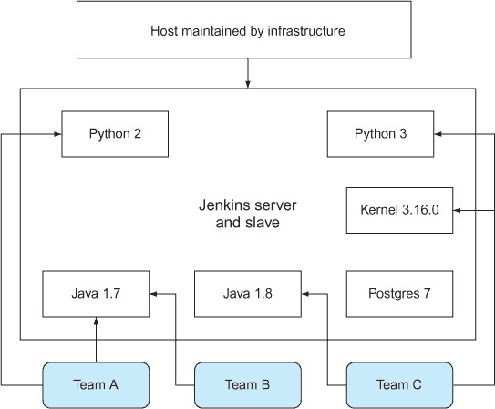


##### 注意

这种技术已被构建来向您展示在容器中运行 Jenkins 从属节点的关键要素。这使得结果不太便携，但更容易掌握。一旦您理解了本章中所有技术，您将能够创建一个更便携的设置。


已知会出现僵局，因为系统管理员可能不愿意更新他们的配置管理脚本，因为他们担心会破坏另一组的构建，而且团队对变化的缓慢越来越感到沮丧。

Docker（自然地）通过允许多个团队使用他们自己的 Jenkins 从属节点的基镜像，同时使用之前相同的硬件，提供了一个解决方案。您可以在上面创建包含所需共享工具的镜像，并允许团队根据他们的需求对其进行修改。

一些贡献者已在 Docker Hub 上上传了他们自己的参考从属节点；您可以通过在 Docker Hub 上搜索“jenkins slave”来找到它们。以下列表是一个最小的 Jenkins 从属节点 Dockerfile。

##### 列表 8.12\. 纯粹的 Jenkins 从属节点 Dockerfile

```
FROM ubuntu:16.04
ENV DEBIAN_FRONTEND noninteractive
RUN groupadd -g 1000 jenkins_slave                   *1*
 RUN useradd -d /home/jenkins_slave -s /bin/bash \   *1*
-m jenkins_slave -u 1000 -g jenkins_slave            *1*
 RUN echo jenkins_slave:jpass | chpasswd             *2*
 RUN apt-get update && apt-get install -y \
openssh-server openjdk-8-jre wget iproute2           *3*
 RUN mkdir -p /var/run/sshd                          *4*
 CMD ip route | grep "default via" \                 *4*
 | awk '{print $3}' && /usr/sbin/sshd -D
```

+   ***1*** **创建 Jenkins 从属用户和组**

+   ***2*** **将 Jenkins 用户密码设置为“jpass”。在更复杂的设置中，您可能希望使用其他认证方法。**

+   ***3*** **安装所需的软件以作为 Jenkins 从属节点运行。**

+   ***4*** **在启动时，从容器的角度输出主机的 IP 地址，并启动 SSH 服务器**

构建从属节点镜像，标记为 `jenkins_slave`：

```
$ docker build -t jenkins_slave .
```

使用以下命令运行它：

```
$ docker run --name jenkins_slave -ti -p 2222:22 jenkins_slave
172.17.0.1
```


##### Jenkins 服务器需要运行

如果您的主机上还没有运行 Jenkins 服务器，请使用之前的技术设置一个。如果您急于完成，请运行以下命令：

```
$ docker run --name jenkins_server -p 8080:8080 -p 50000:50000 \
dockerinpractice/jenkins:server
```

如果您在本地机器上运行它，这将使 Jenkins 服务器在 http://localhost:8080 上可用。您在使用它之前需要完成设置过程。


如果您导航到 Jenkins 服务器，您将看到图 8.4 所示的页面。

##### 图 8.4\. Jenkins 主页

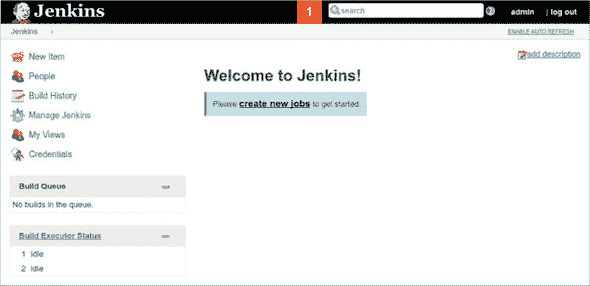

您可以通过点击“构建执行器状态”>“新建节点”并添加节点名称作为永久代理来添加从属节点，如图 8.5 所示。将其命名为 `mydockerslave`。

##### 图 8.5\. 命名新节点页面

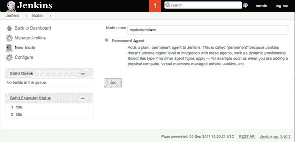

点击“确定”，并使用这些设置进行配置，如图 8.6 所示：

+   将“远程根目录”设置为/home/jenkins_slave。

+   给它一个标签“dockerslave”。

+   确保选中“通过 SSH 启动从节点代理”选项。

+   将主机设置为容器内看到的路由 IP 地址（使用之前的`docker run`命令输出）。

+   点击“添加”以添加凭据，并将用户名设置为“jenkins_slave”，密码设置为“jpass”。现在从下拉列表中选择这些凭据。

+   将“主机密钥验证策略”设置为手动信任密钥验证策略，这将接受首次连接时的 SSH 密钥，或者设置为非验证验证策略，这将不执行 SSH 主机密钥检查。

+   点击“高级”以显示端口字段，并将其设置为 2222。

+   点击“保存”。

##### 图 8.6. Jenkins 节点设置页面

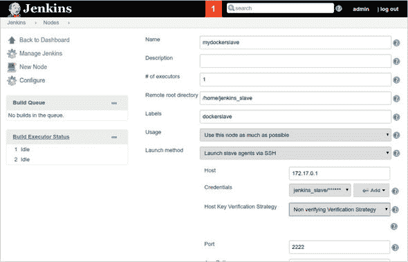

现在点击进入新的从节点，并点击“启动从节点代理”（假设这不会自动发生）。一分钟后你应该能看到从节点代理被标记为在线。

通过点击左上角的 Jenkins 返回主页，然后点击“新建项目”。创建一个名为“test”的 Freestyle 项目，在“构建”部分，点击“添加构建步骤”>“执行 Shell”，命令为`echo done`。向上滚动，并选择“限制项目运行位置”并输入标签表达式“dockerslave”。你应该能看到“标签下的从节点”设置为 1，这意味着作业现在已链接到 Docker 从节点。点击“保存”以创建作业。

点击“立即构建”，然后点击左侧出现的构建链接“#1”。然后点击“控制台输出”，你应该在主窗口中看到如下输出：

```
Started by user admin
Building remotely on mydockerslave (dockerslave)
 in workspace /home/jenkins_slave/workspace/test
[test] $ /bin/sh -xe /tmp/jenkins5620917016462917386.sh
+ echo done
done
Finished: SUCCESS
```

干得好！你已经成功创建了你的 Jenkins 从节点。

现在如果你想创建自己的定制从节点，你只需要修改从节点镜像的 Dockerfile 以符合你的口味，然后运行它而不是示例中的那个。

| |
| --- |

##### 注意

该技术及相关技术的代码可在 GitHub 上找到，链接为[`github.com/docker-in-practice/jenkins`](https://github.com/docker-in-practice/jenkins)。

| |
| --- |

**讨论**

这种技术引导你创建一个容器来充当虚拟机，类似于技术 12，但增加了 Jenkins 集成的复杂性。一个特别有用的策略是在容器内挂载 Docker 套接字并安装 Docker 客户端二进制文件，以便你可以执行 Docker 构建。有关挂载 Docker 套接字（用于不同目的）的信息，请参阅技术 45，有关安装详情，请参阅附录 A。

| |
| --- |
| |

**使用 Jenkins 的 Swarm 插件扩展 CI**

能够重现环境是一个巨大的胜利，但你的构建能力仍然受限于你拥有的专用构建机器的数量。如果你想要利用 Docker 从节点的新发现灵活性在不同的环境中进行实验，这可能会变得令人沮丧。容量也可能因为更平凡的原因成为问题——你团队的成长！

**问题**

你希望你的 CI 计算能力与你的开发工作率同步扩展。

**解决方案**

使用 Jenkins 的 Swarm 插件和 Docker Swarm 从节点动态提供 Jenkins 从节点。


##### 注意

这之前已经提到过，但在这里重复一遍：Jenkins 的 Swarm 插件与 Docker 的 Swarm 技术根本无关。它们是完全无关的两件事，碰巧使用了同一个词。它们可以在这里一起使用纯粹是巧合。


许多中小型企业都有一个 CI 模型，其中一个或多个 Jenkins 服务器被专门用于提供运行 Jenkins 作业所需的资源。这如图 8.7 所示。

##### 图 8.7\. 之前：Jenkins 服务器——对一个开发者来说可以，但无法扩展

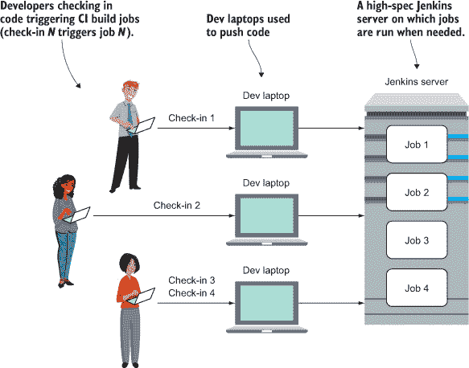

这在一段时间内工作得很好，但随着 CI 流程变得更加嵌入式，容量限制通常会被达到。大多数 Jenkins 工作负载都是由源控制的提交触发的，因此随着更多开发者的提交，工作负载会增加。当忙碌的开发者不耐烦地等待他们的构建结果时，运营团队收到的投诉数量就会激增。

一个整洁的解决方案是拥有与提交代码的人数一样多的 Jenkins 从节点，如图 8.8 所示。

##### 图 8.8\. 之后：计算能力随团队扩展

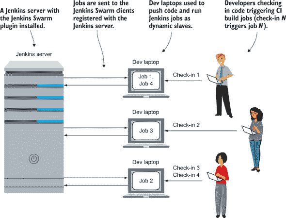

在列表 8.13 中显示的 Dockerfile 创建了一个安装了 Jenkins Swarm 客户端插件的镜像，允许具有适当 Jenkins Swarm 服务器插件的 Jenkins 主节点连接并运行作业。它以与上一技术中正常 Jenkins 从节点 Dockerfile 相同的方式开始。

##### 列表 8.13\. Dockerfile

```
FROM ubuntu:16.04
ENV DEBIAN_FRONTEND noninteractive
RUN groupadd -g 1000 jenkins_slave
RUN useradd -d /home/jenkins_slave -s /bin/bash \
-m jenkins_slave -u 1000 -g jenkins_slave
RUN echo jenkins_slave:jpass | chpasswd
RUN apt-get update && apt-get install -y \
openssh-server openjdk-8-jre wget iproute2
RUN wget -O /home/jenkins_slave/swarm-client-3.4.jar \                    *1*
 https://repo.jenkins-ci.org/releases/org/jenkins-ci/plugins/swarm-client
 /3.4/swarm-client-3.4.jar
COPY startup.sh /usr/bin/startup.sh                                       *2*
 RUN chmod +x /usr/bin/startup.sh                                         *3*
 ENTRYPOINT ["/usr/bin/startup.sh"]                                       *4*
```

+   ***1*** **检索 Jenkins Swarm 插件**

+   ***2*** **将启动脚本复制到容器中**

+   ***3*** **将启动脚本标记为可执行**

+   ***4*** **将启动脚本设置为默认运行的命令**

以下列表是复制到前面 Dockerfile 中的启动脚本。

##### 列表 8.14\. startup.sh

```
#!/bin/bash
export HOST_IP=$(ip route | grep ^default | awk '{print $3}')  *1*
 export JENKINS_IP=${JENKINS_IP:-$HOST_IP}                     *2*
 export JENKINS_PORT=${JENKINS_PORT:-8080}                     *3*
 export JENKINS_LABELS=${JENKINS_LABELS:-swarm}                *4*
 export JENKINS_HOME=${JENKINS_HOME:-$HOME}                    *5*
 echo "Starting up swarm client with args:"
echo "$@"
echo "and env:"
echo "$(env)"
set -x                                                         *6*
 java -jar \                                                   *7*
 /home/jenkins_slave/swarm-client-3.4.jar \
  -sslFingerprints '[]' \
  -fsroot "$JENKINS_HOME" \                                    *8*
   -labels "$JENKINS_LABELS" \                                 *9*
   -master http://$JENKINS_IP:$JENKINS_PORT "$@"               *10*
```

+   ***1*** **确定主机的 IP 地址**

+   ***2*** **使用主机 IP 作为 Jenkins 服务器 IP，除非在此脚本的调用环境中设置了 JENKINS_IP**

+   ***3*** **默认将 Jenkins 端口设置为 8080**

+   ***4*** **将此从节点的 Jenkins 标签设置为“swarm”**

+   ***5*** **默认将 Jenkins 主目录设置为 jenkins_slave 用户的家目录**

+   ***6*** **将在此处运行的命令记录为脚本的输出部分**

+   ***7*** **运行 Jenkins Swarm 客户端**

+   ***8*** **将根目录设置为 Jenkins 主目录**

+   ***9*** **设置标签以识别作业客户端**

+   ***10*** **将 Jenkins 服务器设置为指向从属节点**

大部分前面的脚本设置并输出了 Java 调用末尾的环境。Java 调用运行 Swarm 客户端，将运行它的机器转换为一个动态的 Jenkins 从属节点，该节点以`-fsroot`标志指定的目录为根，运行带有`-labels`标志的作业，并指向带有`-master`标志指定的 Jenkins 服务器。带有`echo`的行仅提供了有关参数和环境设置的调试信息。

构建和运行容器是一个简单的过程，只需运行现在应该熟悉的模式：

```
$ docker build -t jenkins_swarm_slave .
$ docker run -d --name \
jenkins_swarm_slave jenkins_swarm_slave \
-username admin -password adminpassword
```

`username`和`password`应该是具有创建从属节点权限的 Jenkins 实例上的账户——`admin`账户将工作，但您也可以为此目的创建另一个账户。

现在您已经在这台机器上设置了一个从属节点，您可以在其上运行 Jenkins 作业。按照常规设置 Jenkins 作业，但在“限制此项目可以运行的位置”部分添加`swarm`作为标签表达式（参见技术 67）。


##### 警告

Jenkins 作业可能是一个繁琐的过程，而且它们运行可能会对笔记本电脑产生负面影响。如果作业很重，您可以适当地设置作业和 Swarm 客户端的标签。例如，您可能将一个作业的标签设置为 4CPU8G，并将其与在 4CPU 机器上运行且具有 8GB 内存的 Swarm 容器匹配。


此技术给出了一些关于 Docker 概念的指示。可预测且可移植的环境可以放置在多个主机上，减少昂贵服务器的负载，并将所需的配置减少到最低。

虽然这不是一个不考虑性能就无法推广的技术，但我们认为在这里有很大的空间将贡献开发者的计算机资源转化为一种游戏形式，在不需要昂贵的新硬件的情况下提高开发组织的效率。

**讨论**

您可以通过将其设置为所有您地产的 PC 上的监督系统服务来自动化此过程（参见技术 82）。


##### 注意

该技术及相关技术的代码可在 GitHub 上找到，链接为[`github.com/docker-in-practice/jenkins`](https://github.com/docker-in-practice/jenkins)。

|  |
|  |

**安全升级容器化的 Jenkins 服务器**

如果您在生产环境中使用 Jenkins 有一段时间，您会知道 Jenkins 经常发布更新以进行安全和功能更改。

在一个专用、非 Docker 化的主机上，这通常通过软件包管理为您管理。使用 Docker，升级的推理可能会稍微复杂一些，因为您可能已经将服务器与其数据分离。

**问题**

您希望可靠地升级您的 Jenkins 服务器。

**解决方案**

运行一个 Jenkins 更新器镜像，该镜像将处理 Jenkins 服务器的升级。

这种技术作为由多个部分组成的 Docker 镜像提供。

首先，我们将概述构建镜像的 Dockerfile。此 Dockerfile 从库 Docker 镜像（其中包含 Docker 客户端）中提取，并添加一个管理升级的脚本。

该镜像在 Docker 命令中运行，将主机上的 Docker 项目挂载，使其能够管理任何所需的 Jenkins 升级。

**Dockerfile**

我们从 Dockerfile 开始。

##### 列表 8.15\. Jenkins 升级器的 Dockerfile

```
FROM docker                                        *1*
 ADD jenkins_updater.sh /jenkins_updater.sh        *2*
 RUN chmod +x /jenkins_updater.sh                  *3*
 ENTRYPOINT /jenkins_updater.sh                    *4*
```

+   ***1*** **使用 docker 标准库镜像**

+   ***2*** **添加 jenkins_updater.sh 脚本（将在下文讨论）**

+   ***3*** **确保 jenkins_updater.sh 脚本可执行**

+   ***4*** **将镜像的默认入口点设置为 jenkins_updater.sh 脚本**

上述 Dockerfile 将备份 Jenkins 的需求封装在一个可执行的 Docker 镜像中。它使用 `docker` 标准库镜像来获取一个 Docker 客户端在容器中运行。该容器将运行 列表 8.16 中的脚本，以管理主机上 Jenkins 所需的任何升级。


##### 注意

如果你的 docker 守护进程版本与 `docker` Docker 镜像中的版本不同，你可能会遇到问题。请尝试使用相同的版本。


**jenkins_updater.sh**

这是管理容器内升级的 shell 脚本。

##### 列表 8.16\. 用于备份和重启 Jenkins 的 Shell 脚本

```
#!/bin/sh                                                           *1*
 set -e                                                             *2*
 set -x                                                             *3*
 if ! docker pull jenkins | grep up.to.date                         *4*
 then
    docker stop jenkins                                             *5*
     docker rename jenkins jenkins.bak.$(date +%Y%m%d%H%M)          *6*
     cp -r /var/docker/mounts/jenkins_home \                        *7*
           /var/docker/mounts/jenkins_home.bak.$(date +%Y%m%d%H%M)  *7*
     docker run -d \                                                *8*
         --restart always \                                         *9*
         -v /var/docker/mounts/jenkins_home:/var/jenkins_home \     *10*
         --name jenkins \                                           *11*
         -p 8080:8080 \                                             *12*
         jenkins                                                    *13*
 fi
```

+   ***1*** **此脚本使用 sh shell（而不是 /bin/bash shell），因为 Docker 镜像上只有 sh 可用**

+   ***2*** **确保如果脚本中的任何命令失败，则脚本将失败**

+   ***3*** **将脚本中运行的所有命令记录到标准输出**

+   ***4*** **仅在“docker pull jenkins”不输出“up to date”时触发**

+   ***5*** **升级时，首先停止 Jenkins 容器**

+   ***6*** **停止后，将 Jenkins 容器重命名为“jenkins.bak.”，后面跟着分钟数**

+   ***7*** **将 Jenkins 容器镜像状态文件夹复制到备份**

+   ***8*** **运行 Docker 命令启动 Jenkins，并以守护进程方式运行**

+   ***9*** **设置 Jenkins 容器始终重启**

+   ***10*** **将 Jenkins 状态卷挂载到主机文件夹**

+   ***11*** **给容器命名为“jenkins”，以防止意外同时运行多个此类容器**

+   ***12*** **将容器中的 8080 端口映射到主机的 8080 端口**

+   ***13*** **最后，将要运行的 Jenkins 镜像名称传递给 Docker 命令**

上述脚本尝试使用 `docker pull` 命令从 Docker Hub 拉取 `jenkins`。如果输出包含“up to date”短语，则 `docker pull | grep ...` 命令返回 `true`。但只有当输出中没有“up to date”时，你才希望升级。这就是为什么在 `if` 语句后面用 `!` 符号取反的原因。

结果是，只有当你下载了“最新”的 Jenkins 图像的新版本时，`if` 块中的代码才会被触发。在这个块中，运行的 Jenkins 容器会被停止并重命名。你选择重命名而不是删除它，以防升级失败，你需要恢复到之前的版本。此外，包含 Jenkins 状态的主机挂载文件夹也会进行备份。

最后，使用 `docker run` 命令启动最新下载的 Jenkins 图像。

| |
| --- |

##### 注意

根据个人喜好，你可能想要更改主机挂载文件夹或运行中的 Jenkins 容器的名称。

| |
| --- |

你可能会想知道这个 Jenkins 图像是如何连接到主机的 Docker 守护进程的。为了实现这一点，使用在 技术 66 中看到的方法运行图像。

**jenkins-updater 图像调用**

以下命令将执行 Jenkins 升级，使用之前创建的包含 shell 脚本的图像：

##### 列表 8.17\. 运行 Jenkins 更新器的 Docker 命令

```
docker run                                                 *1*
     --rm \                                                *2*
     -d \                                                  *3*
     -v /var/lib/docker:/var/lib/docker \                  *4*
     -v /var/run/docker.sock:/var/run/docker.sock \        *5*
     -v /var/docker/mounts:/var/docker/mounts              *6*
         dockerinpractice/jenkins-updater                  *7*
```

+   ***1*** **docker run 命令**

+   ***2*** **容器完成其工作后删除容器**

+   ***3*** **在后台运行容器**

+   ***4*** **将主机上的 docker 守护进程文件夹挂载到容器中**

+   ***5*** **将主机上的 docker socket 挂载到容器中，以便在容器内运行 docker 命令**

+   ***6*** **挂载主机上的 docker 挂载文件夹，其中存储 Jenkins 数据，以便 jenkins_updater.sh 脚本可以复制文件**

+   ***7*** **指定 dockerinpractice/jenkins-updater 图像是将要运行的图像**

**自动化升级**

以下一行命令使得在 crontab 中运行变得容易。我们在我们的家用服务器上运行这个命令。

```
0 * * * * docker run --rm -d -v /var/lib/docker:/var/lib/docker -v
 /var/run/docker.sock:/var/run/docker.sock -v
 /var/docker/mounts:/var/docker/mounts dockerinpractice/jenkins-updater
```

| |
| --- |

##### 注意

前面的命令都在一行中，因为 crontab 如果前面有反斜杠，不会忽略换行符，这与 shell 脚本的行为不同。

| |
| --- |

最终结果是，单个 crontab 条目可以安全地管理 Jenkins 实例的升级，而无需你担心。

自动清理旧备份容器和卷挂载的任务留作读者的练习。

**讨论**

这种技术展示了我们在整本书中遇到的一些事情，这些事情可以应用于除了 Jenkins 之外的类似情境。

首先，它使用核心 `docker` 图像与主机上的 Docker 守护进程通信。其他可移植脚本可能被编写来以其他方式管理 Docker 守护进程。例如，你可能想要编写脚本来删除旧卷，或者报告守护进程的活动。

更具体地说，`if` 块模式可以用来在可用新图像时更新和重启其他图像。出于安全原因或进行小幅度升级而更新图像并不罕见。

如果您担心升级版本时的困难，也值得指出的是，您不需要采取“最新”的镜像标签（这项技术就是这样做的）。许多镜像有不同的标签，跟踪不同的版本号。例如，您的镜像`exampleimage`可能有一个`exampleimage:latest`标签，以及`example-image:v1.1`和`exampleimage:v1`标签。这些标签中的任何一个都可能随时更新，但`:v1.1`标签不太可能移动到新的版本，而`:latest`标签则更有可能移动到新的版本，比如与新的`:v1.2`标签相同（可能需要升级步骤）或甚至`:v2.1`标签，其中新的主要版本`2`表明可能对任何升级过程造成更大的破坏。

这种技术还概述了 Docker 升级的回滚策略。通过使用卷挂载将容器和数据分离可能会对任何升级的稳定性造成紧张。通过保留在服务正常工作时的旧容器和旧数据的副本，更容易从故障中恢复。

**数据库升级和 Docker**

数据库升级是一个特别的环境，其中稳定性问题至关重要。如果您想将数据库升级到新版本，您必须考虑升级是否需要更改数据库数据结构和存储。仅仅运行新版本的镜像作为容器并期望它工作是不够的。如果数据库足够智能，知道它看到的数据版本并可以相应地进行升级，那么情况会变得更加复杂。在这些情况下，您可能会更愿意进行升级。

许多因素会影响您的升级策略。您的应用程序可能可以容忍乐观的方法（正如您在这里看到的 Jenkins 示例），假设一切都会顺利，并在（不是如果）发生故障时做好准备。另一方面，您可能要求 100%的可用性，并且不能容忍任何类型的故障。在这种情况下，通常需要一个经过充分测试的升级计划，并且比仅运行`docker pull`更深入地了解平台（无论是否涉及 Docker）。

虽然 Docker 不能消除升级问题，但版本化镜像的不可变性可以使推理它们变得更加简单。Docker 还可以通过两种方式帮助您为故障做准备：在主机卷中备份状态，并使测试可预测状态变得更容易。您在管理和理解 Docker 所做之事时付出的代价可以给您在升级过程中带来更多的控制和确定性。


### 摘要

+   您可以使用 Docker Hub 工作流程在代码更改时自动触发构建。

+   通过使用 eatmydata 和包缓存可以显著加快构建速度。

+   通过使用代理缓存外部工件（如系统包）可以加快构建速度。

+   您可以在 Docker 内部运行 GUI 测试（如 Selenium）。

+   您的 CI 平台（如 Jenkins）本身也可以从容器中运行。

+   Docker CI 从属节点让你可以完全控制你的环境。

+   你可以使用 Docker 和 Jenkins 的 Swarm 插件将构建过程外包给整个团队。

## 第九章. 持续交付：与 Docker 原则完美契合

| |
| --- |

**本章涵盖**

+   开发者和运维之间的 Docker 合同

+   在不同环境之间手动控制构建可用性

+   在低带宽连接之间移动构建

+   在环境中集中配置所有容器

+   使用 Docker 实现零停机时间部署

| |
| --- |

一旦你确信所有的构建都在一致的 CI 过程中进行了质量检查，下一步合乎逻辑的做法就是开始考虑将每个好的构建部署给用户。这个目标被称为持续交付（CD）。

在本章中，我们将提到你的“CD 管道”——你的构建在“CI 管道”之后所经历的过程。有时这条分界线可能会变得模糊，但将 CD 管道视为当你有一个在构建过程中通过初始测试的最终镜像时开始。图 9.1 图 9.1 展示了镜像可能如何通过 CD 管道直到（希望）达到生产。

##### 图 9.1. 典型的 CD 管道

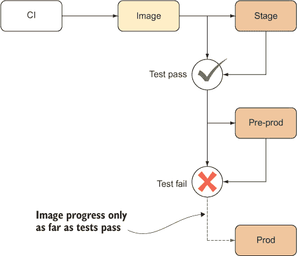

值得重复的是，最后一点——CI 输出的镜像应该是最终的，并且在 CD 过程中不应被修改！Docker 通过不可变镜像和状态封装使这一点变得容易执行，因此使用 Docker 已经让你在 CD 道路上前进了一步。

当本章完成后，你将完全理解为什么 Docker 的不可变性使其成为你的 CD 策略的完美伙伴。通过这种方式，Docker 可以成为任何组织中任何 DevOps 策略的关键推动者。

### 9.1. 与 CD 管道中的其他团队互动

首先，我们将稍微退后一步，看看 Docker 如何改变开发和运维之间的关系。

软件开发中的一些最大挑战并非技术性的——根据角色和专长将人们分成团队是一种常见做法，但这也可能导致沟通障碍和孤立。拥有一个成功的 CD 管道需要所有团队在流程的所有阶段都参与进来，从开发到测试再到生产。为所有团队提供一个单一参考点可以通过提供结构来帮助缓解这种互动。

| |
| --- |

**Docker 合同：减少摩擦**

Docker 的一个目标是可以轻松地表达输入和输出，这些输入和输出与包含单个应用程序的容器相关。这可以在与其他人合作时提供清晰性——沟通是协作的重要组成部分，了解 Docker 如何通过提供一个单一参考点来简化事情，可以帮助你赢得 Docker 怀疑者。

**问题**

你希望合作团队的交付成果清晰且无歧义，以减少你的交付管道中的摩擦。

**解决方案**

使用**Docker 合约**来促进团队之间的清晰交付。

随着公司的规模扩大，他们经常发现，他们曾经拥有的扁平、精简的组织结构，其中关键人物“了解整个系统”，转变为一个更加结构化的组织，其中不同的团队有不同的责任和能力。我们在我们工作的组织中亲眼目睹了这一点。

如果不进行技术投资，随着团队之间的交付，摩擦可能会产生。关于日益复杂的系统、将发布版本“扔过墙”以及有缺陷的升级的抱怨变得司空见惯。越来越多的“嗯，在我们的机器上它运行得很好！”的叫声将引起所有相关人员的挫败感。图 9.2 提供了一个简化的但具有代表性的场景视图。

##### 图 9.2\. 之前：典型的软件工作流程

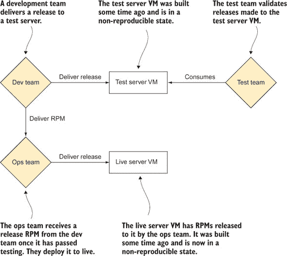

图 9.2 中的工作流程有许多问题，这些可能对你来说很熟悉。它们都归结为管理状态困难。测试团队可能在与运维团队设置不同的机器上测试某些内容。理论上，所有环境的更改都应该被仔细记录，当发现问题时应回滚，并保持一致性。不幸的是，商业压力和人类行为的现实通常与这一目标作对，导致环境漂移。

解决这个问题的现有方案包括虚拟机和 RPM。虚拟机可以通过向其他团队提供完整的机器表示来减少环境风险的范围。缺点是虚拟机是相对单一的整体，团队难以高效地操作。在另一端，RPM 提供了一种打包应用程序的标准方式，有助于在部署软件时定义依赖关系。但这并没有消除配置管理问题，而且使用由其他团队创建的 RPM 进行部署比使用在互联网上经过实战检验的 RPM 更容易出错。

**Docker 合约**

Docker 所能做到的是在团队之间提供一个清晰的分离线，其中 Docker 镜像既是边界也是交换的单位。我们称之为**Docker 合约**，如图 9.3 所示。

##### 图 9.3\. 之后：Docker 合约


使用 Docker，所有团队参考点变得更加清晰。而不是处理在不可复制的状态下蔓延的单一虚拟（或真实）机器，所有团队都在讨论相同的代码，无论是测试、生产还是开发。此外，数据和代码之间有一个清晰的分离，这使得更容易推断问题是由数据或代码的变化引起的。

由于 Docker 使用非常稳定的 Linux API 作为其环境，因此交付软件的团队在以他们喜欢的任何方式构建软件和服务方面拥有更多的自由，同时有信心它在各种环境中可以可预测地运行。这并不意味着你可以忽略它运行的环境，但它确实减少了环境差异导致问题的风险。

由于只有一个参考接触点，因此产生了各种操作效率。由于所有团队都能从一个已知的起点描述和重现问题，因此错误重现变得容易得多。升级成为负责交付变更的团队的责任。简而言之，状态由进行变更的人管理。所有这些好处都大大减少了通信开销，并允许团队继续他们的工作。这种减少的通信开销还可以帮助鼓励向微服务架构的转变。

这不是纯粹的理论优势：我们在一个拥有 500 多名开发者的公司中亲身体验了这种改进，并且这是 Docker 技术聚会上的常见讨论话题。

**讨论**

这种技术概述了一种策略，在你继续阅读本书的过程中，有助于确定其他技术如何适应这个新世界。例如，技术 76 描述了一种以与在生产系统中运行相同的方式运行基于微服务的应用程序的方法，消除了配置文件调整的来源。当你发现自己在不同环境中遇到外部 URL 或其他不变因素时，技术 85 将提供关于服务发现的信息——将配置文件散布变成单一真相来源的好方法。

| |
| --- |

### 9.2. 促进 Docker 镜像的部署

在尝试实施 CD 时遇到的第一问题是将构建过程的输出移动到适当的位置。如果你能够为 CD 管道的所有阶段使用单个注册库，这似乎解决了这个问题。但这也未涵盖 CD 的一个关键方面。

CD 背后的一个关键思想是*构建提升*：管道的每个阶段（用户验收测试、集成测试和性能测试）只有在前一个阶段成功后才能触发下一个阶段。使用多个注册库，你只需通过仅在构建阶段通过时在下一个注册库中提供它们，就可以确保只使用*提升的*构建。

我们将探讨几种在注册库之间移动镜像的方法，甚至探讨一种在没有注册库的情况下共享 Docker 对象的方法。

| |
| --- |

**手动镜像注册库镜像**

最简单的镜像镜像场景是你有一个与两个注册库都有高速连接的机器。这允许使用正常的 Docker 功能来执行镜像复制。

**问题**

你想在两个注册库之间复制一个镜像。

**解决方案**

手动使用 Docker 的标准拉取和推送命令来传输图片。

解决这个问题的方法包括：

+   从仓库拉取图片

+   重新标记图片

+   推送重新标记的图片

如果你有一个在 test-registry.company.com 的镜像，并且你想将其移动到 stage-registry.company.com，这个过程很简单。

##### 列表 9.1\. 从测试仓库到预发布仓库传输图片

```
$ IMAGE=mygroup/myimage:mytag
$ OLDREG=test-registry.company.com
$ NEWREG=stage-registry.company.com
$ docker pull $OLDREG/$MYIMAGE
[...]
$ docker tag -f $OLDREG/$MYIMAGE $NEWREG/$MYIMAGE
$ docker push $NEWREG/$MYIMAGE
$ docker rmi $OLDREG/$MYIMAGE
$ docker image prune -f
```

在这个过程中有三个重要点需要注意：

1.  新镜像已被强制标记。这意味着任何在机器上（为了层缓存目的而留下）的具有相同名称的旧镜像将丢失图片名称，因此新镜像可以用所需的名称进行标记。

1.  所有悬挂的图片都已经删除。尽管层缓存对于加快部署速度非常有用，但留下未使用的图片层会迅速耗尽磁盘空间。一般来说，随着时间的推移，旧层被使用的可能性越小，它们就越过时。

1.  你可能需要使用`docker login`登录到你的新仓库。

图片现在可以在新的仓库中使用，用于 CD 管道的后续阶段。

**讨论**

这种技术说明了关于 Docker 标记的一个简单点：标记本身包含有关它所属仓库的信息。

大多数情况下，用户看不到这个问题，因为他们通常从默认仓库（docker.io 上的 Docker Hub）拉取。当你开始使用仓库时，这个问题就会显现出来，因为你必须明确地用仓库位置标记仓库，以便将其推送到正确的端点。

|  |

**通过受限连接传输图片**

即使有分层，推送和拉取 Docker 镜像也可能是一个带宽密集型的过程。在一个免费大带宽连接的世界里，这不会是问题，但有时现实迫使我们必须处理数据中心之间的低带宽连接或昂贵的带宽计费。在这种情况下，你需要找到一种更有效的方法来传输差异，否则你每天多次运行管道的理想 CD 将遥不可及。

理想解决方案是一个工具，它将减少镜像的平均大小，使其甚至比经典的压缩方法还要小。

**问题**

你想在两个机器之间通过低带宽连接复制一张图片。

**解决方案**

导出镜像，将其分割，传输块，然后在另一端导入重新组合的镜像。

要完成所有这些，我们首先需要介绍一个新工具：bup。它被创建为一个具有非常高效去重功能的备份工具——去重是指识别数据重复使用的地方，并且只存储一次。它在包含许多相似文件的存档上工作得特别出色，这恰好是 Docker 允许你导出镜像的格式。

对于这项技术，我们创建了一个名为 dbup（代表“Docker bup”）的镜像，这使得使用 bup 去重镜像变得更加容易。您可以在[`github.com/docker-in-practice/dbup`](https://github.com/docker-in-practice/dbup)找到其背后的代码。

作为演示，让我们看看从 ubuntu:14.04.1 镜像升级到 ubuntu:14.04.2 时，我们可以节省多少带宽。请注意，在实际操作中，您会在每个镜像的顶部有一系列层，Docker 会在底层层发生变化后完全重新传输这些层。相比之下，这项技术会识别出显著的相似性，并为您节省比以下示例中看到的更多的带宽。

第一步是拉取这两个镜像，以便我们可以看到通过网络传输了多少内容。

##### 列表 9.2\. 检查并保存两个 Ubuntu 镜像

```
$ docker pull ubuntu:14.04.1 && docker pull ubuntu:14.04.2
[...]
$ docker history ubuntu:14.04.1
IMAGE        CREATED     CREATED BY                                    SIZE
ab1bd63e0321 2 years ago /bin/sh -c #(nop) CMD [/bin/bash]             0B
<missing>    2 years ago /bin/sh -c sed -i 's/^#\s*\(deb.*universe\... 1.9kB
<missing>    2 years ago /bin/sh -c echo '#!/bin/sh' > /usr/sbin/po... 195kB
<missing>    2 years ago /bin/sh -c #(nop) ADD file:62400a49cced0d7... 188MB
<missing>    4 years ago                                                0B
$ docker history ubuntu:14.04.2
IMAGE        CREATED     CREATED BY                                    SIZE
44ae5d2a191e 2 years ago /bin/sh -c #(nop) CMD ["/bin/bash"]           0B
<missing>    2 years ago /bin/sh -c sed -i 's/^#\s*\(deb.*universe\... 1.9kB
<missing>    2 years ago /bin/sh -c echo '#!/bin/sh' > /usr/sbin/po... 195kB
<missing>    2 years ago /bin/sh -c #(nop) ADD file:0a5fd3a659be172... 188MB
$ docker save ubuntu:14.04.1 | gzip | wc -c
65973497
$ docker save ubuntu:14.04.2 | gzip | wc -c
65994838
```

每个镜像的底层（`ADD`）是大小的主要部分，您可以看到被添加的文件是不同的，因此您可以将其整个镜像大小视为推送新镜像时将传输的量。此外，请注意，Docker 注册表使用 gzip 压缩来传输层，因此我们在测量中包括了这一点（而不是从`docker history`获取大小）。在初始部署和后续部署中，都正在传输大约 65 MB。

为了开始，您需要两样东西——一个目录来存储 bup 用作存储的数据池，以及 dockerinpractice/dbup 镜像。然后，您可以继续将您的镜像添加到 bup 数据池中。

##### 列表 9.3\. 将两个 Ubuntu 镜像保存到 bup 数据池中

```
$ mkdir bup_pool
$ alias dbup="docker run --rm \
    -v $(pwd)/bup_pool:/pool -v /var/run/docker.sock:/var/run/docker.sock \
    dockerinpractice/dbup"
$ dbup save ubuntu:14.04.1
Saving image!
Done!
$ du -sh bup_pool
74M     bup_pool
$ dbup save ubuntu:14.04.2
Saving image!
Done!
$ du -sh bup_pool
96M     bup_pool
```

将第二张图片添加到 bup 数据池中，仅使大小增加了大约 20 MB。假设您在添加 ubuntu:14.04.1 后同步了文件夹到另一台机器（可能使用 rsync），再次同步文件夹时，只需传输 20 MB（而不是之前的 65 MB）。

然后，您需要加载另一端的镜像。

##### 列表 9.4\. 从 bup 数据池中加载镜像

```
$ dbup load ubuntu:14.04.1
Loading image!
Done!
```

在注册表之间传输的过程可能看起来像这样：

1.  在 host1 上执行`docker pull`

1.  在 host1 上执行`dbup save`

1.  从 host1 到 host2 的`rsync`

1.  在 host2 上执行`dbup load`

1.  在 host2 上执行`docker push`

这项技术打开了许多以前可能无法实现的可能性。例如，现在您可以重新排列和合并层，而无需担心通过低带宽连接传输所有新层需要多长时间。

**讨论**

即使遵循最佳实践并在最后阶段添加您的应用程序代码，bup 也可能有所帮助——它会识别出大部分代码没有变化，并且只将差异添加到数据池中。

数据池可以非常大，例如数据库文件，bup 可能会表现得非常好（如果你已经决定在容器内部使用技术 77，这意味着没有卷）。这实际上有些不寻常——数据库的导出和备份通常非常高效地进行增量传输，但实际的磁盘存储可以有很大差异，有时甚至会使像 rsync 这样的工具失效。除此之外，dbup 将你的镜像的完整历史记录放在你的指尖——无需存储三个完整的镜像副本以进行回滚。你可以随意从池中提取它们。不幸的是，目前还没有方法清理你不再需要的镜像池，所以你可能需要时不时地清理池。

虽然你可能目前看不到 dbup 的即时需求，但请记住它，以防你的带宽账单开始增长。

| |

**将 Docker 对象作为 TAR 文件共享**

TAR 文件是 Linux 上移动文件的经典方法。Docker 允许你在没有可用注册表且无法设置注册表的情况下创建 TAR 文件并手动传输。在这里，我们将向您展示这些命令的细节。

**问题**

你想要与他人共享镜像和容器，但没有可用的注册表。

**解决方案**

使用 `docker export` 或 `docker save` 创建 TAR 文件形式的工件，然后通过 SSH 使用 `docker import` 或 `docker load` 消费它们。

如果你随意使用这些命令，区分它们可能很难理解，所以让我们花点时间快速了解一下它们的功能。表 9.1 概述了这些命令的输入和输出。

##### 表 9.1\. 导出和导入与保存和加载

| **命令** | **创建？** | **什么？** | **从什么？** |
| --- | --- | --- | --- |
| export | TAR 文件 | 容器文件系统 | 容器 |
| import | Docker 镜像 | 平坦文件系统 | TAR 文件 |
| save | TAR 文件 | Docker 镜像（带有历史记录） | 镜像 |
| load | Docker 镜像 | Docker 镜像（带有历史记录） | TAR 文件 |

前两个命令与平坦文件系统一起工作。`docker export` 命令输出构成容器状态的文件 TAR 文件。像 Docker 中的常规操作一样，运行中的进程的状态不会存储——只有文件。`docker import` 命令从一个 TAR 文件创建一个没有历史记录或元数据的 Docker 镜像。

这些命令不是对称的——你不能仅使用 `import` 和 `export` 从现有的容器创建一个容器。这种不对称性可能很有用，因为它允许你使用 `docker export` 将镜像导出到 TAR 文件，然后使用 `docker import` “丢失”所有层历史记录和元数据。这是技术 52 中描述的镜像扁平化方法。

如果你导出或保存到 TAR 文件，文件默认发送到 `stdout`，所以请确保你将其保存到如下文件：

```
docker pull debian:7:3
[...]
docker save debian:7.3 > debian7_3.tar
```

与刚刚创建的 TAR 文件类似，可以在网络上安全地传输（尽管你可能想先使用`gzip`进行压缩），其他人可以使用它们完整地导入镜像。如果你有权限，可以通过电子邮件或`scp`发送：

```
$ scp debian7_3.tar example.com:/tmp/debian7_3.tar
```

你可以更进一步，直接将镜像发送到其他用户的 Docker 守护进程——前提是你有权限。

##### 列表 9.5\. 通过 SSH 直接发送镜像

```
docker save debian:7.3 | \          *1*
 ssh example.com \                  *2*
 docker load -                      *3*
```

+   ***1*** **提取 Debian 版本 7.3 的镜像并将其通过 ssh 命令管道传输**

+   ***2*** **在远程机器上运行命令，例如 example.com**

+   ***3*** **接受给定的 TAR 文件并创建包含所有历史的镜像。破折号表示 TAR 文件是通过标准输入传递的。**

如果你想丢弃镜像的历史，可以使用`import`而不是`load`。

##### 列表 9.6\. 通过 SSH 直接传输 Docker 镜像，丢弃层

```
docker export $(docker run -d debian:7.3 true) | \
    ssh example.com docker import
```


##### 注意

与`docker import`不同，`docker load`不需要在末尾添加破折号来指示 TAR 文件是通过标准输入传递的。


**讨论**

你可能还记得技术 52 中的导出和导入过程，你看到了如何通过扁平化镜像来移除可能隐藏在下层的秘密。如果你将镜像传输给其他人，考虑到秘密可能在下层可访问的事实是值得注意的——意识到你在顶层镜像中删除了公钥，但在下层它仍然可用，可能会带来真正的麻烦，因为你应该将其视为已泄露并更改所有地方。

如果你发现自己经常使用这种技术进行镜像传输，可能值得花点时间设置自己的注册表，使事情不那么随意。技术 9。


### 9.3\. 配置你的镜像以适应环境

如本章引言所述，持续交付（CD）的一个基石是“在所有地方做同样的事情”的概念。在没有 Docker 的情况下，这意味着构建一次部署工件并在所有地方使用它。在 Docker 化的世界中，这意味着在所有地方使用相同的镜像。

但环境并不完全相同——例如，外部服务可能有不同的 URL。对于“正常”应用程序，你可以使用环境变量来解决这个问题（前提是它们不容易应用于多台机器）。相同的解决方案也可以用于 Docker（明确传递变量），但 Docker 还有更好的方法来做这件事，并带来一些额外的优势。


**使用 etcd 通知你的容器**

Docker 镜像被设计成可以在任何地方部署，但部署后你通常会想添加一些额外的信息来影响应用程序运行时的行为。此外，运行 Docker 的机器可能需要保持不变，因此你可能需要一个外部信息源（这使得环境变量不太适用）。

**问题**

在运行容器时，您需要一个外部配置源。

**解决方案**

设置 etcd，一个分布式键/值存储，以存储您的容器配置。

etcd 存储信息片段，可以是多节点集群的一部分以实现容错。在这个技术中，您将创建一个 etcd 集群来存储您的配置，并使用 etcd 代理来访问它。


##### 注意

etcd 存储的每个值都应该保持较小——小于 512 KB 是一个很好的经验法则；超过这个点，您应该考虑进行基准测试以验证 etcd 是否仍然按您期望的方式运行。这个限制不仅适用于 etcd。您应该在其他键/值存储（如 Zookeeper 和 Consul）中记住这一点。


因为 etcd 集群节点需要相互通信，所以第一步是确定您的外部 IP 地址。如果您打算在不同的机器上运行节点，您需要每个节点的外部 IP 地址。

##### 列表 9.7\. 确定本地机器的 IP 地址

```
$ ip addr | grep 'inet ' | grep -v 'lo$\|docker0$'
    inet 192.168.1.123/24 brd 192.168.1.255 scope global dynamic wlp3s0
    inet 172.18.0.1/16 scope global br-0c3386c9db5b
```

在这里，我们查找了所有 IPv4 接口，并排除了 LoopBack 和 Docker。该列表的第一行（该行上的第一个 IP 地址）是您需要的，它代表本地网络上的机器——如果您不确定，请从另一台机器上尝试 ping 它。

我们现在可以开始使用三个节点集群，所有节点都在同一台机器上运行。请注意以下参数——每行中公开和宣传的端口都会改变，集群节点和容器的名称也是如此。

##### 列表 9.8\. 设置三个节点的 etcd 集群

```
$ IMG=quay.io/coreos/etcd:v3.2.7
$ docker pull $IMG
[...]
$ HTTPIP=http://192.168.1.123                                            *1*
 $ CLUSTER="etcd0=$HTTPIP:2380,etcd1=$HTTPIP:2480,etcd2=$HTTPIP:2580"    *2*
 $ ARGS="etcd"
$ ARGS="$ARGS -listen-client-urls http://0.0.0.0:2379"                   *3*
 $ ARGS="$ARGS -listen-peer-urls http://0.0.0.0:2380"                    *4*
 $ ARGS="$ARGS -initial-cluster-state new"
$ ARGS="$ARGS -initial-cluster $CLUSTER"
$ docker run -d -p 2379:2379 -p 2380:2380 --name etcd0 $IMG \
    $ARGS -name etcd0 -advertise-client-urls $HTTPIP:2379 \
    -initial-advertise-peer-urls $HTTPIP:2380
912390c041f8e9e71cf4cc1e51fba2a02d3cd4857d9ccd90149e21d9a5d3685b
$ docker run -d -p 2479:2379 -p 2480:2380 --name etcd1 $IMG \
    $ARGS -name etcd1 -advertise-client-urls $HTTPIP:2479 \
    -initial-advertise-peer-urls $HTTPIP:2480
446b7584a4ec747e960fe2555a9aaa2b3e2c7870097b5babe65d65cffa175dec
$ docker run -d -p 2579:2379 -p 2580:2380 --name etcd2 $IMG \
    $ARGS -name etcd2 -advertise-client-urls $HTTPIP:2579 \
    -initial-advertise-peer-urls $HTTPIP:2580
3089063b6b2ba0868e0f903a3d5b22e617a240cec22ad080dd1b497ddf4736be
$ curl -L $HTTPIP:2579/version
{"etcdserver":"3.2.7","etcdcluster":"3.2.0"}
$ curl -sSL $HTTPIP:2579/v2/members | python -m json.tool | grep etcd
            "name": "etcd0",                                             *5*
             "name": "etcd1",                                            *5*
             "name": "etcd2",                                            *5*
```

+   ***1*** **您的机器的外部 IP 地址**

+   ***2*** **在集群定义中使用机器的外部 IP 地址，为节点提供与其他节点通信的方式。因为所有节点都将位于同一主机上，所以集群端口（用于连接到其他节点）必须不同。**

+   ***3*** **处理客户端请求的端口**

+   ***4*** **用于与其他集群节点通信的监听端口，对应于$CLUSTER 中指定的端口**

+   ***5*** **当前连接到集群的节点**

您现在已启动了集群，并从其中一个节点收到了响应。在前面的命令中，任何提到“对等节点”的内容都是控制 etcd 节点如何找到并相互通信的方式，而任何提到“客户端”的内容则定义了其他应用程序如何连接到 etcd。

让我们看看 etcd 的分布式特性是如何发挥作用的。

##### 列表 9.9\. 测试 etcd 集群的容错能力

```
$ curl -L $HTTPIP:2579/v2/keys/mykey -XPUT -d value="test key"
{"action":"set","node": >
{"key":"/mykey","value":"test key","modifiedIndex":7,"createdIndex":7}}
$ sleep 5
$ docker kill etcd2
etcd2
$ curl -L $HTTPIP:2579/v2/keys/mykey
curl: (7) couldn't connect to host
$ curl -L $HTTPIP:2379/v2/keys/mykey
{"action":"get","node": >
{"key":"/mykey","value":"test key","modifiedIndex":7,"createdIndex":7}}
```

在前面的代码中，您向您的 etcd2 节点添加了一个键，然后将其杀死。但 etcd 已自动将信息复制到其他节点，并且仍然能够提供信息。尽管前面的代码暂停了五秒钟，但 etcd 通常在不到一秒钟内就会复制（即使是在不同的机器上）。现在您可以自由地`docker start etcd2`使其再次可用——在此期间您所做的任何更改都会复制回它。

你可以看到数据仍然可用，但手动选择另一个节点来连接有点不方便。幸运的是，etcd 有一个解决方案——你可以以“代理”模式启动一个节点，这意味着它不会复制任何数据；相反，它将请求转发到其他节点。

##### 列表 9.10\. 使用 etcd 代理

```
$ docker run -d -p 8080:8080 --restart always --name etcd-proxy $IMG \
    etcd -proxy on -listen-client-urls http://0.0.0.0:8080 \
    -initial-cluster $CLUSTER
037c3c3dba04826a76c1d4506c922267885edbfa690e3de6188ac6b6380717ef
$ curl -L $HTTPIP:8080/v2/keys/mykey2 -XPUT -d value="t"
{"action":"set","node": >
{"key":"/mykey2","value":"t","modifiedIndex":12,"createdIndex":12}}
$ docker kill etcd1 etcd2
$ curl -L $HTTPIP:8080/v2/keys/mykey2
{"action":"get","node": >
{"key":"/mykey2","value":"t","modifiedIndex":12,"createdIndex":12}}
```

这现在让你有了一些自由去实验当超过一半的节点离线时 etcd 的行为。

##### 列表 9.11\. 使用超过一半节点下线的 etcd

```
$ curl -L $HTTPIP:8080/v2/keys/mykey3 -XPUT -d value="t"
{"errorCode":300,"message":"Raft Internal Error", >
"cause":"etcdserver: request timed out","index":0}
$ docker start etcd2
etcd2
$ curl -L $HTTPIP:8080/v2/keys/mykey3 -XPUT -d value="t"
{"action":"set","node": >
{"key":"/mykey3","value":"t","modifiedIndex":16,"createdIndex":16}}
```

当一半或更多的节点不可用时，etcd 允许读取但阻止写入。

你现在可以看到，在集群中的每个节点上启动一个 etcd 代理作为检索集中配置的“大使容器”是可能的，如下所示。

##### 列表 9.12\. 在大使容器中使用 etcd 代理

```
$ docker run -it --rm --link etcd-proxy:etcd ubuntu:14.04.2 bash
root@8df11eaae71e:/# apt-get install -y wget
root@8df11eaae71e:/# wget -q -O- http://etcd:8080/v2/keys/mykey3
{"action":"get","node": >
{"key":"/mykey3","value":"t","modifiedIndex":16,"createdIndex":16}}
```


##### 小贴士

大使（ambassador）是一种所谓的“Docker 模式”，在 Docker 用户中有些流行。大使容器被放置在应用程序容器和某些外部服务之间，并处理请求。它类似于代理，但它内置了一些智能来处理特定情况的具体要求——就像现实生活中的大使一样。


一旦你在所有环境中运行了 etcd，在环境中创建一个机器只需启动它并链接到 etcd-proxy 容器——然后所有 CD 构建到该机器都将使用环境的正确配置。下一个技术将展示如何使用 etcd 提供的配置来驱动零停机时间升级。

**讨论**

上一节中展示的大使容器利用了技术 8 中引入的链接标志。正如那里所指出的，链接在 Docker 世界中已经有些不受欢迎，现在实现相同功能的一种更符合习惯的方式是在虚拟网络上的命名容器，这在技术 80 中有介绍。

拥有一个提供世界一致视图的关键/值服务器集群，比在多台机器上管理配置文件前进了一大步，并帮助你朝着实现技术 70 中描述的 Docker 合同迈进。


### 9.4\. 升级运行中的容器

为了实现每天多次部署到生产环境的理想，在部署过程的最后一步——关闭旧应用程序并启动新应用程序——减少停机时间非常重要。如果每次切换都是一个小时的流程，那么每天部署四次就没有意义了！

由于容器提供了一个隔离的环境，许多问题已经得到了缓解。例如，你不必担心两个版本的应用程序使用相同的工 作目录并相互冲突，或者重新读取某些配置文件并获取新值而不需要重新启动使用新代码。

不幸的是，这有一些缺点——不再简单地在原地更改文件，因此软重启（用于获取配置文件更改）变得更加困难。因此，我们发现，无论你是更改几个配置文件还是数千行代码，始终执行相同的升级过程是一种最佳实践。

让我们看看一个升级过程，它将实现面向 Web 应用程序的零停机时间部署的黄金标准。


**使用 confd 实现零停机时间切换**

因为容器可以在主机上并排存在，所以移除一个容器并启动一个新的容器的简单切换方法可以在几秒钟内完成（并且它允许快速回滚）。

对于大多数应用程序来说，这可能会足够快，但对于启动时间较长或高可用性要求的应用程序，需要另一种方法。有时这可能是一个不可避免地复杂的流程，需要与应用程序本身进行特殊处理，但面向 Web 的应用程序有一个你可能首先考虑的选项。

**问题**

您需要能够以零停机时间升级面向 Web 的应用程序。

**解决方案**

在您的主机上使用 confd 与 nginx 结合进行两阶段切换。

Nginx 是一个非常受欢迎的 Web 服务器，它具有一个关键内置功能——它可以在不断开服务器连接的情况下重新加载配置文件。通过将其与 confd 结合，这是一个可以从中央数据存储（如 etcd）检索信息并相应地更改配置文件的工具，你可以更新 etcd 上的最新设置，并观察其他一切为你处理。


##### 注意

Apache HTTP 服务器和 HAProxy 也都提供零停机时间重新加载，如果你有现有的配置专业知识，可以使用它们代替 nginx。


第一步是启动一个将作为旧应用程序运行的应用程序，你最终会更新它。Python 随 Ubuntu 一起提供，并内置了 Web 服务器，所以我们将用它作为示例。

##### 列表 9.13\. 在容器中启动简单的文件服务器

```
$ ip addr | grep 'inet ' | grep -v 'lo$\|docker0$'
    inet 10.194.12.221/20 brd 10.194.15.255 scope global eth0
$ HTTPIP=http://10.194.12.221
$ docker run -d --name py1 -p 80 ubuntu:14.04.2 \
  sh -c 'cd / && python3 -m http.server 80'
e6b769ec3efa563a959ce771164de8337140d910de67e1df54d4960fdff74544
$ docker inspect -f '{{.NetworkSettings.Ports}}' py1
map[80/tcp:[{0.0.0.0 32768}]]
$ curl -s localhost:32768 | tail | head -n 5
<li><a href="sbin/">sbin/</a></li>
<li><a href="srv/">srv/</a></li>
<li><a href="sys/">sys/</a></li>
<li><a href="tmp/">tmp/</a></li>
<li><a href="usr/">usr/</a></li>
```

HTTP 服务器已成功启动，我们使用了 `inspect` 命令的过滤器选项来提取有关主机上哪个端口映射到容器内部点的信息。

现在请确保 etcd 正在运行——这个技术假设你仍然在之前技术相同的工作环境中。这次你将使用 etcdctl（简称“etcd 控制器”）与 etcd 交互（而不是直接 `curl` etcd），以简化操作。

##### 列表 9.14\. 下载并使用 etcdctl Docker 镜像

```
$ IMG=dockerinpractice/etcdctl
$ docker pull dockerinpractice/etcdctl
[...]
$ alias etcdctl="docker run --rm $IMG -C \"$HTTPIP:8080\""
$ etcdctl set /test value
value
$ etcdctl ls
/test
```

这已下载了我们准备好的 etcdctl Docker 镜像，并设置了一个别名，始终连接之前设置的 etcd 集群。现在启动 nginx。

##### 列表 9.15\. 启动 nginx + confd 容器

```
$ IMG=dockerinpractice/confd-nginx
$ docker pull $IMG
[...]
$ docker run -d --name nginx -p 8000:80 $IMG $HTTPIP:8080
ebdf3faa1979f729327fa3e00d2c8158b35a49acdc4f764f0492032fa5241b29
```

这是我们之前准备的一个镜像，它使用 confd 从 etcd 检索信息并自动更新配置文件。我们传递的参数告诉容器它可以连接到哪个 etcd 集群。不幸的是，我们还没有告诉它在哪里可以找到我们的应用程序，所以日志中充满了错误。

让我们在 etcd 中添加适当的信息。

##### 列表 9.16\. 展示 nginx 容器的自动配置

```
$ docker logs nginx
Using http://10.194.12.221:8080 as backend
2015-05-18T13:09:56Z ebdf3faa1979 confd[14]: >
ERROR 100: Key not found (/app) [14]
2015-05-18T13:10:06Z ebdf3faa1979 confd[14]: >
ERROR 100: Key not found (/app) [14]
$ echo $HTTPIP
http://10.194.12.221
$ etcdctl set /app/upstream/py1 10.194.12.221:32768
10.194.12.221:32768
$ sleep 10
$ docker logs nginx
Using http://10.194.12.221:8080 as backend
2015-05-18T13:09:56Z ebdf3faa1979 confd[14]: >
ERROR 100: Key not found (/app) [14]
2015-05-18T13:10:06Z ebdf3faa1979 confd[14]: >
ERROR 100: Key not found (/app) [14]
2015-05-18T13:10:16Z ebdf3faa1979 confd[14]: >
ERROR 100: Key not found (/app) [14]
2015-05-18T13:10:26Z ebdf3faa1979 confd[14]: >
INFO Target config /etc/nginx/conf.d/app.conf out of sync
2015-05-18T13:10:26Z ebdf3faa1979 confd[14]: >
INFO Target config /etc/nginx/conf.d/app.conf has been updated
$ curl -s localhost:8000 | tail | head -n5
<li><a href="sbin/">sbin/</a></li>
<li><a href="srv/">srv/</a></li>
<li><a href="sys/">sys/</a></li>
<li><a href="tmp/">tmp/</a></li>
<li><a href="usr/">usr/</a></li>
```

etcd 的更新已被 confd 读取并应用到 nginx 配置文件中，允许你访问你的简单文件服务器。包含`sleep`命令是因为 confd 已被配置为每 10 秒检查更新。在幕后，运行在 confd-nginx 容器中的 confd 守护进程会轮询 etcd 集群中的更改，使用容器内的模板仅在检测到更改时重新生成 nginx 配置。

假设我们决定我们想要服务/etc 而不是/。现在我们将启动我们的第二个应用程序并将其添加到 etcd。因为我们将有两个后端，我们最终会从它们各自得到响应。\

##### 列表 9.17\. 使用 confd 为 nginx 设置两个后端 Web 服务

```
$ docker run -d --name py2 -p 80 ubuntu:14.04.2 \
  sh -c 'cd /etc && python3 -m http.server 80'
9b5355b9b188427abaf367a51a88c1afa2186e6179ab46830715a20eacc33660
$ docker inspect -f '{{.NetworkSettings.Ports}}' py2
map[80/tcp:[{0.0.0.0 32769}]]
$ curl -s $HTTPIP:32769 | tail | head -n 5
<li><a href="udev/">udev/</a></li>
<li><a href="update-motd.d/">update-motd.d/</a></li>
<li><a href="upstart-xsessions">upstart-xsessions</a></li>
<li><a href="vim/">vim/</a></li>
<li><a href="vtrgb">vtrgb@</a></li>
$ echo $HTTPIP
http://10.194.12.221
$ etcdctl set /app/upstream/py2 10.194.12.221:32769
10.194.12.221:32769
$ etcdctl ls /app/upstream
/app/upstream/py1
/app/upstream/py2
$ curl -s localhost:8000 | tail | head -n 5
<li><a href="sbin/">sbin/</a></li>
<li><a href="srv/">srv/</a></li>
<li><a href="sys/">sys/</a></li>
<li><a href="tmp/">tmp/</a></li>
<li><a href="usr/">usr/</a></li>
$ curl -s localhost:8000 | tail | head -n 5
<li><a href="udev/">udev/</a></li>
<li><a href="update-motd.d/">update-motd.d/</a></li>
<li><a href="upstart-xsessions">upstart-xsessions</a></li>
<li><a href="vim/">vim/</a></li>
<li><a href="vtrgb">vtrgb@</a></li>
```

在前面的过程中，我们在将其添加到 etcd 之前检查了新容器是否正确启动（见图 9.4）。我们可以通过覆盖 etcd 中的`/app/upstream/py1`键来一步完成这个过程——这在你只需要一次只访问一个后端时也很有用。

##### 图 9.4\. 将 py2 容器添加到 etcd

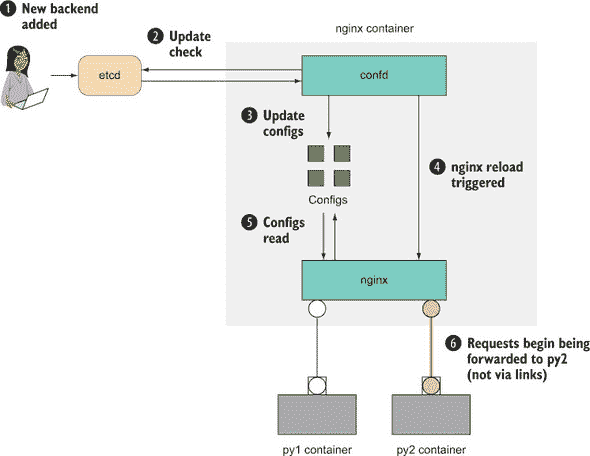

在两阶段切换中，第二阶段是移除旧的后端和容器。

##### 列表 9.18\. 移除旧的上游地址

```
$ etcdctl rm /app/upstream/py1
PrevNode.Value: 192.168.1.123:32768
$ etcdctl ls /app/upstream
/app/upstream/py2
$ docker rm -f py1
py1
```

新的应用程序自行启动并运行！应用程序在任何时候都没有对用户不可用，也没有必要手动连接到 Web 服务器机器来重新加载 nginx。

**讨论**

confd 的使用不仅限于配置 Web 服务器：如果你有任何包含需要根据外部值更新的文本的文件，confd 就会介入——它是存储在磁盘上的配置文件和单点真相 etcd 集群之间一个有用的连接器。

如前所述的技术中提到的，etcd 不是为存储大值而设计的。也没有理由你必须与 confd 一起使用 etcd——对于最流行的键值存储，有大量的集成可用，所以如果你已经有了对你有效的东西，你可能不需要添加另一个移动部件。

在后续的技术 86 中，当我们查看在生产中使用 Docker 时，你会看到一个方法，如果你想要更新服务的后端服务器，可以避免手动更改 etcd。


### 摘要

+   Docker 为开发和运维团队之间的合同提供了一个很好的基础。

+   在注册表中移动镜像可以是控制构建在 CD 管道中进展的好方法。

+   Bup 比层更能有效地压缩镜像传输。

+   Docker 镜像可以作为 TAR 文件进行移动和共享。

+   etcd 可以作为环境的中央配置存储。

+   通过结合 etcd、confd 和 nginx 可以实现零停机时间部署。

## 第十章. 网络模拟：无需痛苦的现实环境测试

| |
| --- |

**本章涵盖**

+   掌握 Docker Compose

+   在麻烦的网络上进行应用程序测试

+   初探 Docker 网络驱动程序

+   为 Docker 主机之间无缝通信创建基础网络

| |
| --- |

作为您的 DevOps 工作流程的一部分，您可能会以某种方式使用网络。无论您是试图找出本地 memcache 容器在哪里，连接到外部世界，还是将运行在不同主机上的 Docker 容器连接起来，您迟早都会想要连接到更广泛的网络。

在阅读本章后，您将了解如何使用 Docker Compose 将容器作为一个单元进行管理，并通过使用 Docker 的虚拟网络工具来模拟和管理网络。本章是向编排和服务发现迈出的小小第一步——我们将在本书的第四部分（part 4）中更深入地探讨这些主题。

### 10.1. 容器通信：超越手动链接

在技术 8 中，您看到了如何使用链接连接容器，我们提到了容器依赖关系明确声明提供的优势。不幸的是，链接有许多缺点。启动每个容器时必须手动指定链接，容器必须按正确顺序启动，链接中不允许有循环，而且无法替换链接（如果容器死亡，所有依赖的容器都必须重新启动以重新创建链接）。除此之外，它们已被弃用！

Docker Compose 是目前最受欢迎的替代方案，用于替代之前涉及复杂链接设置的所有内容，我们现在将探讨它。

| |
| --- |

**一个简单的 Docker Compose 集群**

Docker Compose 最初是*fig*，这是一个现在已弃用的独立项目，旨在简化使用适当的参数（链接、卷和端口）启动多个容器的痛苦。Docker Inc.非常喜欢这个项目，因此他们收购了它，进行了改造，并以新的名称发布。

这种技术通过一个简单的 Docker 容器编排示例向您介绍 Docker Compose。

**问题**

您想要协调主机机器上连接的容器。

**解决方案**

使用 Docker Compose，这是一个用于定义和运行多容器 Docker 应用程序的工具。

核心思想是，而不是用复杂的 shell 脚本或 Makefile 连接容器启动命令，您声明应用程序的启动配置，然后使用单个简单命令启动应用程序。

| |
| --- |

##### 注意

我们假设您已安装 Docker Compose——有关最新建议，请参阅官方说明 ([`docs.docker.com/compose/install`](http://docs.docker.com/compose/install))。


在这个技术中，我们将使用 echo 服务器和客户端尽可能简单。客户端每五秒向 echo 服务器发送熟悉的“Hello world！”消息，然后接收回消息。


##### 提示

该技术的源代码可在 [`github.com/docker-in-practice/docker-compose-echo`](https://github.com/docker-in-practice/docker-compose-echo) 找到。


以下命令为您创建一个目录，以便在创建服务器镜像时工作：

```
$ mkdir server
$ cd server
```

使用以下列表中的代码创建服务器 Dockerfile。

##### 列表 10.1\. Dockerfile——一个简单的 echo 服务器

```
.FROM debian
RUN apt-get update && apt-get install -y nmap       *1*
 CMD ncat -l 2000 -k --exec /bin/cat                *2*
```

+   ***1*** 安装 nmap 包，它提供了此处使用的 ncat 程序

+   ***2*** 默认情况下，在启动镜像时运行 ncat 程序

`-l 2000` 参数指示 `ncat` 在端口 2000 上监听，`-k` 告诉它同时接受多个客户端连接，并在客户端关闭连接后继续运行，以便更多客户端可以连接。最后的参数 `--exec /bin/cat` 将使 `ncat` 为任何传入的连接运行 `/bin/cat`，并将通过连接传输的任何数据转发到正在运行的程序。

接下来，使用此命令构建 Dockerfile：

```
$ docker build -t server .
```

现在您可以设置发送消息到服务器的客户端镜像。创建一个新的目录，并将 client.py 文件和 Dockerfile 放在那里：

```
$ cd ..
$ mkdir client
$ cd client
```

我们将在下一列表中使用一个简单的 Python 程序作为 echo 服务器客户端。

##### 列表 10.2\. client.py——一个简单的 echo 客户端

```
import socket, time, sys                                     *1*
 while True:
    s = socket.socket(socket.AF_INET, socket.SOCK_STREAM)    *2*
     s.connect(('talkto',2000))                              *3*
     s.send('Hello, world\n')                                *4*
     data = s.recv(1024)                                     *5*
     print 'Received:', data                                 *6*
     sys.stdout.flush()                                      *7*
     s.close()                                               *8*
     time.sleep(5)                                           *9*
```

+   ***1*** 导入所需的 Python 包

+   ***2*** 创建一个套接字对象

+   ***3*** 使用套接字连接到端口 2000 上的“talkto”服务器

+   ***4*** 向套接字发送带有换行符的字符串

+   ***5*** 创建一个 1024 字节的缓冲区以接收数据，并在收到消息时将数据放入 data 变量

+   ***6*** 将接收到的数据打印到标准输出

+   ***7*** 清空标准输出缓冲区，以便您可以查看传入的消息

+   ***8*** 关闭套接字对象

+   ***9*** 等待 5 秒并重复

客户端的 Dockerfile 很简单。它安装 Python，添加 client.py 文件，并在启动时默认运行，如下所示列表。

##### 列表 10.3\. Dockerfile——一个简单的 echo 客户端

```
FROM debian
RUN apt-get update && apt-get install -y python
ADD client.py /client.py
CMD ["/usr/bin/python","/client.py"]
```

使用此命令构建客户端：

```
docker build -t client .
```

为了展示 Docker Compose 的价值，我们首先将手动运行这些容器：

```
docker run --name echo-server -d server
docker run --name client --link echo-server:talkto client
```

完成后，使用 Ctrl-C 退出客户端，并删除容器：

```
docker rm -f client echo-server
```

即使在这个简单的例子中，也可能出现很多问题：首先启动客户端会导致应用程序启动失败；忘记删除容器会在你尝试重启时导致问题；以及错误地命名容器会导致失败。随着你的容器及其架构变得更加复杂，这类编排问题只会增加。

Compose 通过将这些容器的启动和配置的编排封装在一个简单的文本文件中，为你管理启动和关闭命令的细节。

Compose 需要一个 YAML 文件。你可以在新目录中创建它：

```
cd ..
mkdir docker-compose
cd docker-compose
```

YAML 文件的内容如下所示。

##### 列表 10.4\. docker-compose.yml—Docker Compose echo 服务器和客户端 YAML 文件

```
version: "3"                   *1*
 services:
  echo-server:                 *2*
     image: server             *3*
     expose:                   *4*
     - "2000"

  client:                      *2*
     image: client             *5*
     links:                    *6*
     - echo-server:talkto
```

+   ***1*** **此 Docker Compose 文件遵循规范的第 3 版。**

+   ***2*** **运行服务的引用名称是它们的标识符：在这个例子中是 echo-server 和 client。**

+   ***3*** **每个部分必须定义使用的镜像：在这个例子中是客户端和服务器镜像。**

+   ***4*** **将 echo-server 的端口 2000 暴露给其他服务**

+   ***5*** **每个部分必须定义使用的镜像：在这个例子中是客户端和服务器镜像。**

+   ***6*** **定义了一个到 echo-server 的链接。客户端内的“talkto”引用将被发送到 echo 服务器。映射是通过在运行容器中动态设置/etc/hosts 文件来完成的。**

docker-compose.yml 的语法相当容易理解：每个服务都在`services`键下命名，配置在缩进的部分中声明。每个配置项的名称后面都有一个冒号，这些项的属性要么在同一行上声明，要么在下一行上声明，且与缩进级别相同。

在这里需要理解的关键配置项是客户端定义中的`links`。这以与`docker run`命令设置链接相同的方式创建，但 Compose 会为你处理启动顺序。实际上，大多数 Docker 命令行参数在 docker-compose.yml 语法中都有直接的对应项。

在这个例子中，我们使用了`image:`语句来定义每个服务使用的镜像，但你也可以通过在`build:`语句中定义 Dockerfile 的路径来让 docker-compose 动态地重建所需的镜像。Docker Compose 会为你执行构建。

| |
| --- |

##### 小贴士

YAML 文件是一种具有简单语法的文本配置文件。你可以了解更多信息，请参阅[`yaml.org`](http://yaml.org)。

| |
| --- |

现在所有基础设施都已设置，运行应用程序变得简单：

```
$ docker-compose up
Creating dockercompose_server_1...
Creating dockercompose_client_1...
Attaching to dockercompose_server_1, dockercompose_client_1
client_1 | Received: Hello, world
client_1 |
client_1 | Received: Hello, world
client_1 |
```

| |
| --- |

##### 小贴士

如果你启动 docker-compose 时遇到类似“无法连接到 Docker 守护进程在 http+unix://var/run/docker.sock—is it running？”的错误，问题可能是你需要用 sudo 运行它。

| |
| --- |

当您看够了，多次按 Ctrl-C 退出应用程序。您可以使用相同的命令随意重新启动它，无需担心删除容器。请注意，如果您重新运行它，它将输出“Recreating”而不是“Creating”。

**讨论**

我们在上一节中提到了可能需要 `sudo` 的情况——如果您适用，您可能需要重新查看技术 41，因为它使得使用与 Docker 守护进程交互的工具变得容易得多。

Docker Inc. 宣称 Docker Compose 已准备好在生产环境中使用，无论是像这里所示的单台机器，还是通过集群模式在多台机器上部署——您将在技术 87 中看到如何做到这一点。

现在，您已经掌握了 Docker Compose 的使用方法，我们将继续探讨 docker-compose 的更复杂和实际应用场景：使用 socat、卷和链接的替代品，为主机机器上运行的 SQLite 实例添加类似服务器的功能。

|  |

**使用 Docker Compose 的 SQLite 服务器**

SQLite 默认没有 TCP 服务器的概念。通过构建在之前的技术之上，此技术为您提供了一种使用 Docker Compose 实现 TCP 服务器功能的方法。

具体来说，它基于以下之前介绍的工具和概念：

+   卷

+   使用 socat 进行代理

+   Docker Compose

我们还将介绍链接的替代品——网络。


##### 注意

此技术要求在您的宿主机上安装 SQLite 版本 3。我们还建议您安装 rlwrap，以便在与 SQLite 服务器交互时进行行编辑更加友好（这是可选的）。这些软件包可以从标准的软件包管理器中免费获取。


此技术的代码可在此处下载：[`github.com/docker-in-practice/docker-compose-sqlite`](https://github.com/docker-in-practice/docker-compose-sqlite)。

**问题**

您希望使用 Docker 在宿主机上高效地开发一个复杂的应用程序，该应用程序引用外部数据。

**解决方案**

使用 Docker Compose。

图 10.1 给出了此技术架构的概述。从高层次来看，有两个正在运行的 Docker 容器：一个负责执行 SQLite 客户端，另一个负责代理到这些客户端的单独 TCP 连接。请注意，执行 SQLite 的容器没有暴露给宿主机；代理容器实现了这一点。这种将责任分离成离散单元的做法是微服务架构的常见特征。

##### 图 10.1\. SQLite 服务器的工作原理

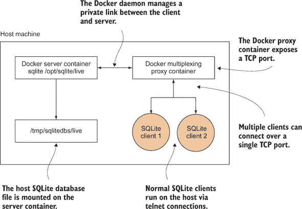

我们将为所有节点使用相同的镜像。在下一个列表中设置 Dockerfile。

##### 列表 10.5\. SQLite 服务器、客户端和代理 Dockerfile 的集成

```
FROM ubuntu:14.04
RUN apt-get update && apt-get install -y rlwrap sqlite3 socat      *1*
 EXPOSE 12345                                                      *2*
```

+   ***1*** **安装所需的应用程序**

+   ***2*** **暴露端口 12345，以便节点可以通过 Docker 守护进程进行通信**

以下列表显示了 docker-compose.yml，它定义了容器应该如何启动。

##### 列表 10.6\. SQLite 服务器和代理 docker-compose.yml

```
version: "3"
services:
  server:                                                         *1*
     command: socat TCP-L:12345,fork,reuseaddr >
EXEC:'sqlite3 /opt/sqlite/db',pty                                 *2*
     build: .                                                     *3*
     volumes:                                                     *4*
     - /tmp/sqlitedbs/test:/opt/sqlite/db
    networks:
    - sqlnet                                                      *5*

  proxy:                                                          *6*
     command: socat TCP-L:12346,fork,reuseaddr TCP:server:12345   *7*
     build: .                                                     *8*
     ports:                                                       *9*
     - 12346:12346
    networks:
    - sqlnet                                                      *10*
 networks:                                                        *11*
   sqlnet:
    driver: bridge
```

+   ***1*** **服务器和代理容器定义在这个段落中。**

+   ***2*** **创建一个 socat 代理，将 SQLite 调用的输出链接到 TCP 端口**

+   ***3*** **在启动时从同一目录下的 Dockerfile 构建镜像**

+   ***4*** **将测试 SQLite 数据库文件挂载到容器内的/opt/sqlite/db**

+   ***5*** **这两个服务将成为 sqlnet Docker 网络的一部分。**

+   ***6*** **服务器和代理容器定义在这个段落中。**

+   ***7*** **创建一个 socat 代理，将数据从 12346 端口传递到服务器容器的 12345 端口**

+   ***8*** **在启动时从同一目录下的 Dockerfile 构建镜像**

+   ***9*** **将端口 12346 发布到主机**

+   ***10*** **这两个服务将成为 sqlnet Docker 网络的一部分。**

+   ***11*** **定义了容器可以加入的网络的列表**

服务器容器中的 socat 进程将在 12345 端口上监听，并允许多个连接，如`TCP-L:12345,fork,reuseaddr`参数所指定的。`EXEC:`后面的部分告诉`socat`为每个连接在/opt/sqlite/db 文件上运行 SQLite，并为进程分配一个伪终端。客户端容器中的 socat 进程具有与服务器容器相同的监听行为（除了在不同的端口上），但不会在响应传入连接时运行任何东西，而是将建立到 SQLite 服务器的 TCP 连接。

与之前的技术相比，一个显著的不同点是使用网络而不是链接——网络提供了一种在 Docker 内部创建新虚拟网络的方法。Docker Compose 默认情况下始终会使用一个新的“桥接”虚拟网络；它只是在先前的 Compose 配置中明确命名了。因为任何新的桥接网络都允许通过服务名称访问容器，所以不需要使用链接（尽管如果你想为服务设置别名，仍然可以使用链接）。

尽管这个功能可以在一个容器中实现，但服务器/代理容器设置使得这个系统的架构更容易扩展，因为每个容器负责一项工作。服务器负责打开 SQLite 连接，而代理负责将服务暴露给主机机器。

以下列表（从存储库中的原始内容简化，[`github.com/docker-in-practice/docker-compose-sqlite`](https://github.com/docker-in-practice/docker-compose-sqlite)）在您的宿主机上创建了两个最小的 SQLite 数据库，test 和 live。

##### 列表 10.7\. setup_dbs.sh

```
#!/bin/bash
echo "Creating directory"
SQLITEDIR=/tmp/sqlitedbs
rm -rf $SQLITEDIR                                          *1*
 if [ -a $SQLITEDIR ]                                      *2*
 then
    echo "Failed to remove $SQLITEDIR"
    exit 1
fi
mkdir -p $SQLITEDIR
cd $SQLITEDIR
echo "Creating DBs"
echo 'create table t1(c1 text);' | sqlite3 test            *3*
 echo 'create table t1(c1 text);' | sqlite3 live           *4*
 echo "Inserting data"
echo 'insert into t1 values ("test");' | sqlite3 test      *5*
 echo 'insert into t1 values ("live");' | sqlite3 live     *6*
 cd - > /dev/null 2>&1                                     *7*
 echo "All done OK"
```

+   ***1*** **从之前的运行中删除任何目录**

+   ***2*** **如果目录仍然存在，则抛出错误**

+   ***3*** **创建包含一个表的测试数据库**

+   ***4*** **创建包含一个表的实时数据库**

+   ***5*** **向表中插入一行包含字符串“test”**

+   ***6*** **向表中插入一个包含字符串“live”的行**

+   ***7*** **返回到上一个目录**

要运行此示例，请设置数据库并调用 docker-compose up，如下所示。

##### 列表 10.8\. 启动 Docker Compose 集群

```
$ chmod +x setup_dbs.sh
$ ./setup_dbs.sh
$ docker-compose up
Creating network "tmpnwxqlnjvdn_sqlnet" with driver "bridge"
Building proxy
Step 1/3 : FROM ubuntu:14.04
14.04: Pulling from library/ubuntu
[...]
Successfully built bb347070723c
Successfully tagged tmpnwxqlnjvdn_proxy:latest
[...]
Successfully tagged tmpnwxqlnjvdn_server:latest
[...]
Creating tmpnwxqlnjvdn_server_1
Creating tmpnwxqlnjvdn_proxy_1 ... done
Attaching to tmpnwxqlnjvdn_server_1, tmpnwxqlnjvdn_proxy_1
```

然后，在另一个或多个其他终端中，您可以通过运行 Telnet 来创建针对一个 SQLite 数据库的多个会话。

##### 列表 10.9\. 连接到 SQLite 服务器

```
$ rlwrap telnet localhost 12346         *1*
 Trying 127.0.0.1...                    *2*
 Connected to localhost.                *2*
 Escape character is '^]'.              *2*
 SQLite version 3.7.17                  *3*
 Enter ".help" for instructions
sqlite> select * from t1;               *4*
 select * from t1;
test
sqlite>
```

+   ***1*** **使用 rlwrap 包装的 Telnet 连接到代理，以获得命令行的编辑和历史功能**

+   ***2*** **Telnet 连接的输出**

+   ***3*** **连接到 SQLite**

+   ***4*** **在 sqlite 提示符下运行 SQL 命令**

如果您想将服务器切换到实时状态，您可以通过更改 docker-compose.yml 中的 `volumes` 行来更改配置，

```
- /tmp/sqlitedbs/test:/opt/sqlite/db
```

到此为止：

```
- /tmp/sqlitedbs/live:/opt/sqlite/db
```

然后重新运行此命令：

```
$ docker-compose up
```

| |
| --- |

##### 警告

尽管我们对这种 SQLite 客户端的复用进行了一些基本测试，但我们不对该服务器在任何负载下的数据完整性和性能做出任何保证。SQLite 客户端并非设计成以这种方式工作。这项技术的目的是演示以这种方式公开二进制文件的一般方法。

| |
| --- |

这种技术展示了 Docker Compose 如何将相对复杂和棘手的事情变得健壮和简单。在这里，我们使用了 SQLite，并通过将容器连接到代理来将 SQLite 调用代理到主机上的数据，从而赋予了它额外的服务器功能。使用 Docker Compose 的 YAML 配置可以显著简化容器复杂性的管理，它将正确编排容器的棘手问题从手动、易出错的流程转变为更安全、自动化的流程，并且可以置于源代码控制之下。这是我们进入编排之旅的开始，您将在本书的第四部分中听到更多关于它的内容。

**讨论**

使用 Docker Compose 的 `depends_on` 功能，您可以通过控制启动顺序来有效地模拟链接的功能。要全面了解 Docker Compose 所提供的所有可能选项，我们建议您阅读官方文档[`docs.docker.com/compose/compose-file/`](https://docs.docker.com/compose/compose-file/)。

要了解更多关于 Docker 虚拟网络的信息，请查看技术 80——它详细介绍了 Docker Compose 在幕后是如何设置您的虚拟网络的。

| |
| --- |

### 10.2\. 使用 Docker 模拟现实世界的网络

大多数使用互联网的人将其视为一个黑盒，它以某种方式从世界各地的其他地方检索信息并将其显示在他们的屏幕上。有时他们会遇到速度慢或连接中断的情况，因此对 ISP 的咒骂并不少见。

当您构建包含需要连接的应用程序镜像时，您可能对哪些组件需要连接到何处以及整体设置看起来如何有了更深入的了解。但有一点是恒定的：您仍然可能会遇到网络缓慢和连接中断。即使是拥有并运营自己数据中心的大型公司，也观察到了不可靠的网络以及它给应用程序带来的问题。

我们将探讨几种您可以通过实验不稳定的网络来确定您可能在实际世界中遇到的问题的方法。


**使用 Comcast 模拟麻烦的网络**

尽管我们可能希望当我们在多台机器上分发应用程序时拥有完美的网络条件，但现实情况要糟糕得多——关于数据包丢失、连接中断和网络分区的故事比比皆是，尤其是在通用云服务提供商那里。

在您的堆栈在实际世界中遇到这些情况之前对其进行测试是明智的，以了解其行为——为高可用性设计的应用程序不应该因为外部服务开始经历显著的额外延迟而停止运行。

**问题**

您希望能够将不同的网络条件应用到单个容器中。

**解决方案**

使用 Comcast（网络工具，而不是 ISP）。

Comcast ([`github.com/tylertreat/Comcast`](https://github.com/tylertreat/Comcast)) 是一个有趣命名的工具，用于在您的 Linux 机器上更改网络接口，以便将不寻常的（或者如果您不幸，是典型的！）条件应用于它们。

每当 Docker 创建一个容器时，它也会创建虚拟网络接口——这就是所有容器都有不同的 IP 地址并且可以互相 ping 的原因。因为这些是标准网络接口，只要您能找到网络接口名称，您就可以在上面使用 Comcast。这说起来容易做起来难。

以下列表显示了一个包含 Comcast、所有先决条件和一些调整的 Docker 镜像。

##### 列表 10.10\. 准备运行 `comcast` 镜像

```
$ IMG=dockerinpractice/comcast
$ docker pull $IMG
latest: Pulling from dockerinpractice/comcast
[...]
Status: Downloaded newer image for dockerinpractice/comcast:latest
$ alias comcast="docker run --rm --pid=host --privileged \
-v /var/run/docker.sock:/var/run/docker.sock $IMG"
$ comcast -help
Usage of comcast:
  -cont string
        Container ID or name to get virtual interface of
  -default-bw int
        Default bandwidth limit in kbit/s (fast-lane) (default -1)
  -device string
        Interface (device) to use (defaults to eth0 where applicable)
  -dry-run
        Specifies whether or not to actually commit the rule changes
  -latency int
        Latency to add in ms (default -1)
  -packet-loss string
        Packet loss percentage (e.g. 0.1%)
  -stop
        Stop packet controls
  -target-addr string
        Target addresses, (e.g. 10.0.0.1 or 10.0.0.0/24 or >
10.0.0.1,192.168.0.0/24 or 2001:db8:a::123)
  -target-bw int
        Target bandwidth limit in kbit/s (slow-lane) (default -1)
  -target-port string
        Target port(s) (e.g. 80 or 1:65535 or 22,80,443,1000:1010)
  -target-proto string
        Target protocol TCP/UDP (e.g. tcp or tcp,udp or icmp) (default >
"tcp,udp,icmp")
  -version
        Print Comcast's version
```

我们在这里添加的调整提供了 `-cont` 选项，允许您引用容器而不是必须找到虚拟接口的名称。请注意，我们不得不向 `docker run` 命令添加一些特殊标志，以便给容器更多的权限——这样 Comcast 就可以自由地检查和修改网络接口。

为了了解 Comcast 可以带来的差异，我们首先需要了解正常网络连接是什么样的。打开一个新的终端并运行以下命令，以设定对基准网络性能的预期：

```
$ docker run -it --name c1 ubuntu:14.04.2 bash
root@0749a2e74a68:/# apt-get update && apt-get install -y wget
[...]
root@0749a2e74a68:/# ping -q -c 5 www.example.com
PING www.example.com (93.184.216.34) 56(84) bytes of data.

--- www.example.com ping statistics ---
5 packets transmitted, 5 received, 0% packet loss, >
time 4006ms                                                            *1*
 rtt min/avg/max/mdev = 86.397/86.804/88.229/0.805 ms                  *2*
 root@0749a2e74a68:/# time wget -o /dev/null https://www.example.com

real    0m0.379s                                                       *3*
 user    0m0.008s
sys     0m0.008s
root@0749a2e74a68:/#
```

+   ***1*** **这台机器与 [www.example.com](http://www.example.com) 之间的连接似乎很可靠，没有数据包丢失。**

+   ***2*** **平均往返时间是大约 100 毫秒，对于 [www.example.com](http://www.example.com)。**

+   ***3*** **下载 [www.example.com](http://www.example.com) 的 HTML 主页所需的总时间大约是 0.7 秒。**

完成这些操作后，让容器继续运行，你可以对其应用一些网络条件：

```
$ comcast -cont c1 -default-bw 50 -latency 100 -packet-loss 20%
Found interface veth62cc8bf for container 'c1'
sudo tc qdisc show | grep "netem"
sudo tc qdisc add dev veth62cc8bf handle 10: root htb default 1
sudo tc class add dev veth62cc8bf parent 10: classid 10:1 htb rate 50kbit
sudo tc class add dev veth62cc8bf parent 10: classid 10:10 htb rate 1000000kb
 it
sudo tc qdisc add dev veth62cc8bf parent 10:10 handle 100: netem delay 100ms
 loss 20.00%
sudo iptables -A POSTROUTING -t mangle -j CLASSIFY --set-class 10:10 -p tcp
sudo iptables -A POSTROUTING -t mangle -j CLASSIFY --set-class 10:10 -p udp
sudo iptables -A POSTROUTING -t mangle -j CLASSIFY --set-class 10:10 -p icmp
sudo ip6tables -A POSTROUTING -t mangle -j CLASSIFY --set-class 10:10 -p tcp
sudo ip6tables -A POSTROUTING -t mangle -j CLASSIFY --set-class 10:10 -p udp
sudo ip6tables -A POSTROUTING -t mangle -j CLASSIFY --set-class 10:10 -p icmp
Packet rules setup...
Run `sudo tc -s qdisc` to double check
Run `comcast --device veth62cc8bf --stop` to reset
```

上述命令应用了三种不同的条件：对所有目的地的 50 KBps 带宽限制（让人回忆起拨号上网），增加 100 毫秒的延迟（加上任何固有的延迟），以及 20%的丢包率。

Comcast 首先识别容器适当的虚拟网络接口，然后调用一系列标准的 Linux 命令行网络工具来应用流量规则，并在执行过程中列出其操作。让我们看看我们的容器对此的反应：

```
root@0749a2e74a68:/# ping -q -c 5 www.example.com
PING www.example.com (93.184.216.34) 56(84) bytes of data.

--- www.example.com ping statistics ---
5 packets transmitted, 2 received, 60% packet loss, time 4001ms
rtt min/avg/max/mdev = 186.425/189.429/195.008/3.509 ms
root@0749a2e74a68:/# time wget -o /dev/null https://www.example.com

real    0m1.993s
user    0m0.011s
sys     0m0.011s
```

成功！ping 报告了额外的 100 毫秒延迟，而`wget`的计时显示略大于 5 倍减速，大约符合预期（带宽限制、延迟增加和丢包都将影响这个时间）。但关于丢包有些奇怪——它似乎比预期大三倍。重要的是要记住，ping 只发送了几包，丢包不是一个精确的“五分之一”计数器——如果你将 ping 计数增加到 50，你会发现结果丢包更接近预期。

注意，我们应用的规定适用于通过此网络接口的所有网络连接。这包括与主机和其他容器的连接。

现在我们指导 Comcast 移除这些规则。遗憾的是，Comcast 目前还不能添加和移除单个条件，因此更改网络接口上的任何内容意味着完全移除并重新添加接口上的规则。如果你想要恢复正常的容器网络操作，也需要移除这些规则。不过，如果你退出容器，无需担心移除它们——当 Docker 删除虚拟网络接口时，它们将被自动删除。

```
$ comcast -cont c1 -stop
Found interface veth62cc8bf for container 'c1'
[...]
Packet rules stopped...
Run `sudo tc -s qdisc` to double check
Run `comcast` to start
```

如果你想要深入了解，可以研究 Linux 流量控制工具，可能使用带有`-dry-run`的 Comcast 生成要使用的命令示例集。全面探讨所有可能性超出了本技术的范围，但请记住，如果你可以将它放入容器中，并且它触网，你就可以对其进行操作。

**讨论**

经过一些实施努力，你完全有理由使用 Comcast 不仅仅是为了手动控制容器带宽。例如，假设你正在使用像 btsync 这样的工具(技术 35)，但希望限制可用带宽以避免占用你的连接——下载 Comcast，将其放入容器中，并使用`ENTRYPOINT`(技术 49)在容器启动时设置带宽限制。

要做到这一点，你需要安装 Comcast 的依赖项（在 Dockerfile 中的`alpine`镜像中列出，见[`github.com/docker-in-practice/docker-comcast/blob/master/Dockerfile`](https://github.com/docker-in-practice/docker-comcast/blob/master/Dockerfile)），并且可能需要给容器至少赋予网络管理员权限——你可以在技术 93 中了解更多关于权限的内容。

| |
| --- |
| |

**使用 Blockade 模拟麻烦的网络**

康卡斯特（Comcast）是一个功能丰富的工具，有多个应用场景，但它无法解决一个重要的用例——如何批量将网络条件应用到容器中？手动对数十个容器运行 Comcast 将非常痛苦，而对数百个容器来说则几乎不可想象！这对于容器来说尤其是一个相关的问题，因为启动容器的成本非常低——如果你试图在单台机器上运行一个包含数百个虚拟机而不是容器的复杂网络模拟，你可能会发现你面临更大的问题，比如内存不足！

在讨论模拟多机网络的背景下，有一种特定的网络故障在这个规模下变得有趣——网络分区。这是指一组网络机器分裂成两个或更多部分，使得同一部分中的所有机器可以相互通信，但不同部分之间无法通信。研究表明，这种情况的发生频率可能比你想象的要高，尤其是在消费级云上！

沿着经典的 Docker 微服务路线，这些问题变得尤为突出，拥有进行实验的工具对于理解你的服务如何处理这些问题至关重要。

**问题**

你希望协调为大量容器设置网络条件，包括创建网络分区。

**解决方案**

使用 Blockade（[`github.com/worstcase/blockade`](https://github.com/worstcase/blockade)）——一个开源软件，最初来自戴尔团队，用于“测试网络故障和分区”。

阻塞（Blockade）通过读取当前目录下的配置文件（blockade.yml）来定义如何启动容器以及应用哪些条件到它们上。为了应用条件，它可能会下载包含所需实用工具的其他镜像。完整的配置细节可以在 Blockade 文档中找到，因此我们只介绍基本内容。

首先，你需要创建一个 blockade.yml 文件。

##### 列表 10.11. blockade.yml 文件

```
containers:
  server:
    container_name: server
    image: ubuntu:14.04.2
    command: /bin/sleep infinity

  client1:
    image: ubuntu:14.04.2
    command: sh -c "sleep 5 && ping server"

  client2:
    image: ubuntu:14.04.2
    command: sh -c "sleep 5 && ping server"

network:
  flaky: 50%
  slow: 100ms
  driver: udn
```

在前面的配置中，容器被设置为代表两个客户端连接的服务器。在实践中，这可能是数据库服务器及其客户端应用程序，你没有必要限制你想要模拟的组件数量。如果你能在 compose .yml 文件中（参见技术 76）表示它，那么你很可能在 Blockade 中对其进行建模。

我们在这里指定了网络驱动程序为`udn`——这使得 Blockade 模仿 Docker Compose 在技术 77 中的行为，创建一个新的虚拟网络，以便容器可以通过容器名称相互 ping。为此，我们必须明确指定服务器的`container_name`，因为 Blockade 默认会生成一个。`sleep 5`命令是为了确保在启动客户端之前服务器正在运行——如果你更喜欢使用 Blockade 的链接，它们将确保容器按正确的顺序启动。现在不用担心`network`部分；我们很快就会回到它。

使用 Blockade 的第一步通常是拉取镜像：

```
$ IMG=dockerinpractice/blockade
$ docker pull $IMG
latest: Pulling from dockerinpractice/blockade
[...]
Status: Downloaded newer image for dockerinpractice/blockade:latest
$ alias blockade="docker run --rm -v \$PWD:/blockade \
-v /var/run/docker.sock:/var/run/docker.sock $IMG"
```

你会注意到，与之前的技术（如`--privileged`和`--pid=host`）相比，我们缺少了一些`docker run`的参数。Blockade 使用其他容器来执行网络操作，因此它本身不需要权限。另外，请注意挂载当前目录到容器中的参数，这样 Blockade 就能访问 blockade.yml 并在一个隐藏文件夹中存储状态。


##### 注意

如果你在一个网络文件系统上运行，当你第一次启动 Blockade 时可能会遇到奇怪的权限问题——这很可能是由于 Docker 试图以 root 用户创建隐藏状态文件夹，但网络文件系统不配合。解决方案是使用本地磁盘。


最后，我们来到了关键时刻——运行 Blockade。确保你位于保存 blockade.yml 的目录中：

```
$ blockade up
NODE     CONTAINER ID   STATUS  IP          NETWORK  PARTITION
client1  613b5b1cdb7d   UP      172.17.0.4  NORMAL
client2  2aeb2ed0dd45   UP      172.17.0.5  NORMAL
server   53a7fa4ce884   UP      172.17.0.3  NORMAL
```


##### 注意

在启动时，Blockade 有时可能会显示一些关于/proc 中文件不存在的神秘错误。首先需要检查的是容器是否在启动时立即退出，这阻止了 Blockade 检查其网络状态。此外，请尽量抵制使用 Blockade `-c`选项来指定自定义配置文件路径的诱惑——容器内部只能访问当前目录的子目录。


我们配置文件中定义的所有容器都已启动，并且我们得到了有关已启动容器的大量有用信息。现在让我们应用一些基本的网络条件。在新终端（使用`docker logs -f 613b5b1cdb7d`）中跟踪 client1 的日志，这样你就可以看到当你改变设置时发生了什么：

```
$ blockade flaky --all                                           *1*
 $ sleep 5                                                       *2*
 $ blockade slow client1                                         *3*
 $ blockade status                                               *4*
 NODE     CONTAINER ID   STATUS  IP          NETWORK  PARTITION
client1  613b5b1cdb7d   UP      172.17.0.4  SLOW
client2  2aeb2ed0dd45   UP      172.17.0.5  FLAKY
server   53a7fa4ce884   UP      172.17.0.3  FLAKY
$ blockade fast --all                                            *5*
```

+   ***1*** **使所有容器的网络变得不可靠（丢弃数据包**）

+   ***2*** **延迟下一个命令以给前一个命令足够的时间生效并记录一些输出**

+   ***3*** **使 client1 容器的网络变慢（向数据包添加延迟**）

+   ***4*** **检查容器当前的状态**

+   ***5*** **将所有容器恢复到正常操作**

`flaky`和`slow`命令使用前一个配置文件中`network`部分定义的值（列表 10.11）——无法在命令行上指定限制。如果你愿意，可以在容器运行时编辑 blockade.yml，然后选择性地将新限制应用于容器。请注意，容器可以处于**慢速**或**不可靠**的网络中，但不能同时处于两者。尽管有这些限制，但针对数百个容器运行此功能的便利性相当显著。

如果你回顾一下`client1`的日志，你现在应该能够看到不同命令何时生效：

```
64 bytes from 172.17.0.3: icmp_seq=638 ttl=64 time=0.054 ms        *1*
 64 bytes from 172.17.0.3: icmp_seq=639 ttl=64 time=0.098 ms
64 bytes from 172.17.0.3: icmp_seq=640 ttl=64 time=0.112 ms
64 bytes from 172.17.0.3: icmp_seq=645 ttl=64 time=0.112 ms        *2*
 64 bytes from 172.17.0.3: icmp_seq=652 ttl=64 time=0.113 ms
64 bytes from 172.17.0.3: icmp_seq=654 ttl=64 time=0.115 ms
64 bytes from 172.17.0.3: icmp_seq=660 ttl=64 time=100 ms          *3*
 64 bytes from 172.17.0.3: icmp_seq=661 ttl=64 time=100 ms
64 bytes from 172.17.0.3: icmp_seq=662 ttl=64 time=100 ms
64 bytes from 172.17.0.3: icmp_seq=663 ttl=64 time=100 ms
```

+   ***1*** **`icmp_seq`** 是连续的（没有数据包被丢弃）且**`time`** 低（延迟小）。

+   ***2*** **`icmp_seq`** 开始跳过数字——**`flaky`** 命令已经生效。

+   ***3*** **`time`** 的时间发生了大幅跳跃——**`slow`** 命令已经生效。

所有这些都很实用，但我们已经可以通过在 Comcast 之上进行一些（可能很痛苦）的脚本编写来实现，所以让我们来看看 Blockade 的杀手级功能——网络分区：

```
$ blockade partition server client1,client2
$ blockade status
NODE     CONTAINER ID   STATUS  IP          NETWORK  PARTITION
client1  613b5b1cdb7d   UP      172.17.0.4  NORMAL   2
client2  2aeb2ed0dd45   UP      172.17.0.5  NORMAL   2
server   53a7fa4ce884   UP      172.17.0.3  NORMAL   1
```

这使得我们的三个节点被分成了两个盒子——服务器在一个盒子中，客户端在另一个盒子中，它们之间无法通信。你会看到`client1`的日志已经停止了任何操作，因为所有的 ping 数据包都丢失了。尽管如此，客户端之间仍然可以互相通信，你可以通过在它们之间发送几个 ping 数据包来验证这一点：

```
$ docker exec 613b5b1cdb7d ping -qc 3 172.17.0.5
PING 172.17.0.5 (172.17.0.5) 56(84) bytes of data.

--- 172.17.0.5 ping statistics ---
3 packets transmitted, 3 received, 0% packet loss, time 2030ms
rtt min/avg/max/mdev = 0.109/0.124/0.150/0.018 ms
```

没有数据包丢失，延迟低……看起来连接良好。分区和其他网络条件独立运行，因此你可以在应用分区的同时玩转数据包丢失。你可以定义的分区数量没有限制，因此你可以随心所欲地玩转复杂的场景。

**讨论**

如果你需要的功能比 Blockade 和 Comcast 各自能提供的还要强大，你可以将它们结合起来。Blockade 在创建分区和执行启动容器的繁重工作方面非常出色；将 Comcast 加入其中，你可以对每个容器的网络连接进行精细控制。

值得注意的是，查看 Blockade 的完整帮助文档——它提供了其他你可能觉得有用的功能，例如“混乱”功能，可以随机影响具有各种条件的容器，以及命令的`--random`参数，这样你就可以（例如）看到当容器随机被杀死时你的应用程序如何反应。如果你听说过 Netflix 的 Chaos Monkey，这是一种在更小规模上模仿它的方法。


### 10.3 Docker 和虚拟网络

Docker 的核心功能都是关于隔离。前面的章节展示了进程和文件系统隔离的一些好处，而本章你看到了网络隔离。

你可以认为网络隔离有两个方面：

+   *独立沙盒*——每个容器都有自己的 IP 地址和要监听的端口集合，不会与其他容器（或主机）冲突。

+   *沙盒组*——这是单个沙盒的逻辑扩展——所有隔离的容器都在一个私有网络中分组在一起，允许您在不干扰您机器所在的网络（以及招致您公司网络管理员的愤怒！）的情况下进行实验。

前两种技术提供了网络隔离这两个方面的实际示例——Comcast 通过操纵单个沙盒来为每个容器应用规则，而 Blockade 中的分区则依赖于对私有容器网络的完全监督能力来将其分割成片段。幕后，它看起来有点像图 10.2。

##### 图 10.2\. 主机机器上的内部 Docker 网络

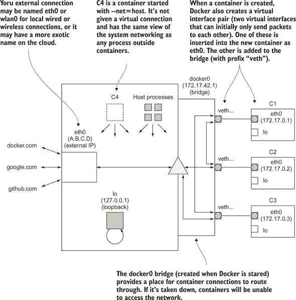

桥接如何工作的确切细节并不重要。只需说，桥接在容器之间创建了一个扁平网络（它允许直接通信，没有中间步骤）并将请求转发到外部连接。

Docker Inc.随后根据用户反馈调整了此模型，允许您使用*网络驱动程序*创建自己的虚拟网络，这是一个插件系统，用于扩展 Docker 的网络功能。这些插件要么是内置的，要么由第三方提供，应该完成所有必要的网络连接工作，让您可以继续使用它。

您创建的新网络可以被视为额外的沙盒组，通常在沙盒内提供访问权限，但不允许跨沙盒通信（尽管网络行为的精确细节取决于驱动程序）。

| |
| --- |

**创建另一个 Docker 虚拟网络**

当人们第一次了解到他们可以创建自己的虚拟网络时，一个常见的反应是询问他们如何创建默认 Docker 桥接的副本，以便容器集之间可以通信但与其他容器隔离。Docker Inc.意识到这将是一个受欢迎的请求，因此它被实现为初始实验版中虚拟网络的第一批功能之一。

**问题**

您需要一个由 Docker Inc.支持的创建虚拟网络解决方案。

**解决方案**

使用嵌套在`docker network`下的 Docker 子命令集创建您自己的虚拟网络。

内置的“桥接”驱动程序可能是最常用的驱动程序——它是官方支持的，并允许您创建默认内置桥接的新副本。然而，在这个技术中，我们将稍后探讨一个重要的区别——在非默认桥接中，您可以通过名称 ping 容器。

您可以使用`docker network ls`命令查看内置网络列表：

```
$ docker network ls
NETWORK ID          NAME                DRIVER              SCOPE
100ce06cd9a8        bridge              bridge              local
d53919a3bfa1        host                host                local
2d7fcd86306c        none                null                local
```

在这里，你可以看到在我的机器上始终可用的三个网络，容器可以加入这些网络。`bridge` 网络是容器默认到达的地方，能够与其他桥接上的容器通信。`host` 网络指定了在启动容器时使用 `--net=host` 的情况（容器将网络视为机器上运行的任何正常程序），而 `none` 对应于 `--net=none`，这是一个只有回环接口的容器。

让我们添加一个新的 `bridge` 网络，为容器提供一个新的平坦网络以自由通信：

```
$ docker network create --driver=bridge mynet
770ffbc81166d54811ecf9839331ab10c586329e72cea2eb53a0229e53e8a37f
$ docker network ls | grep mynet
770ffbc81166        mynet               bridge              local
$ ip addr | grep br-
522: br-91b29e0d29d5: <NO-
     CARRIER,BROADCAST,MULTICAST,UP> mtu 1500 qdisc noqueue state DOWN group
 default
    inet 172.18.0.1/16 scope global br-91b29e0d29d5
$ ip addr | grep docker
5: docker0: <NO-
     CARRIER,BROADCAST,MULTICAST,UP> mtu 1500 qdisc noqueue state DOWN group
 default
    inet 172.17.0.1/16 scope global docker0
```

这创建了一个新的网络接口，它将使用与正常 Docker 桥接不同的 IP 地址范围。对于桥接，新的网络接口名称目前将以 `br-` 开头，但将来可能会改变。

让我们现在启动两个连接到网络的容器：

```
$ docker run -it -d --name c1 ubuntu:14.04.2 bash                    *1*
 87c67f4fb376f559976e4a975e3661148d622ae635fae4695747170c00513165
$ docker network connect mynet c1                                    *2*
 $ docker run -it -d --name c2 \
--net=mynet ubuntu:14.04.2 bash                                      *3*
 0ee74a3e3444f27df9c2aa973a156f2827bcdd0852c6fd4ecfd5b152846dea5b
$ docker run -it -d --name c3 ubuntu:14.04.2 bash                    *4*
```

+   ***1*** **启动名为 c1 的容器（在默认桥接上）**

+   ***2*** **将容器 c1 连接到 mynet 网络**

+   ***3*** **在 mynet 网络中创建名为 c2 的容器**

+   ***4*** **启动名为 c3 的容器（在默认桥接上）**

前面的命令展示了将容器连接到网络的两种不同方式——先启动容器然后附加服务，以及一步创建和附加。

这两种情况有所不同。第一个会在启动时连接到默认网络（通常是 Docker 桥接网络，但可以通过 Docker 守护进程的参数进行自定义），然后添加一个新的接口，以便它也能访问 mynet。第二个只会连接到 mynet——任何在正常 Docker 桥接上的容器都无法访问它。

让我们进行一些连通性检查。首先我们应该查看我们容器的 IP 地址：

```
$ docker exec c1 ip addr | grep 'inet.*eth'            *1*
     inet 172.17.0.2/16 scope global eth0
    inet 172.18.0.2/16 scope global eth1
$ docker exec c2 ip addr | grep 'inet.*eth'            *2*
     inet 172.18.0.3/16 scope global eth0
$ docker exec c3 ip addr | grep 'inet.*eth'
    inet 172.17.0.3/16 scope global eth0               *3*
```

+   ***1*** **列出 c1 的接口和 IP 地址——一个在默认桥接上，一个在 mynet 中**

+   ***2*** **列出 mynet 内 c2 的接口和 IP 地址**

+   ***3*** **列出默认桥接上 c3 的接口和 IP 地址**

现在我们可以进行一些连通性测试：

```
$ docker exec c2 ping -qc1 c1                                      *1*
 PING c1 (172.18.0.2) 56(84) bytes of data.

--- c1 ping statistics ---
1 packets transmitted, 1 received, 0% packet loss, time 0ms
rtt min/avg/max/mdev = 0.041/0.041/0.041/0.000 ms
$ docker exec c2 ping -qc1 c3
                                                                   *2*
 ping: unknown host c3                                             *2*
$ docker exec c2 ping -qc1 172.17.0.3
                                                                   *2*
 PING 172.17.0.3 (172.17.0.3) 56(84) bytes of data.

--- 172.17.0.3 ping statistics ---
1 packets transmitted, 0 received, 100% packet loss, time 0ms
$ docker exec c1 ping -qc1 c2                                      *3*
 PING c2 (172.18.0.3) 56(84) bytes of data.

--- c2 ping statistics ---
1 packets transmitted, 1 received, 0% packet loss, time 0ms
rtt min/avg/max/mdev = 0.047/0.047/0.047/0.000 ms
$ docker exec c1 ping -qc1 c3
                                                                   *4*
 ping: unknown host c3                                             *4*
$ docker exec c1 ping -qc1 172.17.0.3
                                                                   *4*
 PING 172.17.0.3 (172.17.0.3) 56(84) bytes of data.

--- 172.17.0.3 ping statistics ---
1 packets transmitted, 1 received, 0% packet loss, time 0ms
rtt min/avg/max/mdev = 0.095/0.095/0.095/0.000 ms
```

+   ***1*** **尝试从容器 2 ping 容器 1 的名称（成功）**

+   ***2*** **尝试从容器 2 ping 容器 3 的名称和 IP 地址（失败）**

+   ***3*** **尝试从容器 1 ping 容器 2 的名称（成功）**

+   ***4*** **尝试从容器 1 ping 容器 3 的名称和 IP 地址（失败，成功）**

这里发生了很多事情！以下是关键要点：

+   在新的桥接上，容器可以通过 IP 地址和名称相互 ping。

+   在默认桥接上，容器只能通过 IP 地址相互 ping。

+   横跨多个桥接的容器可以访问它们所属的任何网络中的容器。

+   容器之间无法通过桥接相互访问，即使使用 IP 地址。

**讨论**

这种新的桥接器创建功能在技术 77 中使用 Docker Compose，在技术 79 中使用 Blockade 时被使用，以提供容器通过名称 ping 对方的能力。但你也已经看到，这是一个高度灵活的功能，具有建模合理复杂网络的可能性。

例如，你可能想尝试使用一个*堡垒主机*，一个单独的锁定机器，它为访问另一个价值更高的网络提供访问权限。通过将你的应用程序服务放在一个新的桥接器中，然后仅通过连接到默认和新的桥接器的容器来公开服务，你可以在保持自己机器隔离的同时开始运行一些相对现实的渗透测试。

| |
| --- |
| |

**使用 Weave 设置底物网络**

底物网络是在另一个网络之上构建的软件级网络层。实际上，你最终得到一个看起来像是本地的网络，但在底层它是在其他网络之间进行通信。这意味着从性能的角度来看，网络的行为将不如本地网络可靠，但从可用性的角度来看，它可以非常方便：你可以像它们在同一房间里一样与完全不同位置的节点通信。

这对于 Docker 容器来说尤其有趣——容器可以在主机之间无缝连接，就像在网络之间连接主机一样。这样做消除了对计划单个主机上可以容纳多少容器的迫切需求。

**问题**

你希望在主机之间无缝地通信容器。

**解决方案**

使用 Weave Net（在本技术中其余部分简称为“Weave”）来设置一个网络，允许容器像在本地网络中一样相互通信。

我们将使用 Weave ([`www.weave.works/oss/net/`](https://www.weave.works/oss/net/))来演示底物网络的原理，这是一个为此目的设计的工具。图 10.3 展示了典型 Weave 网络的概览。

##### 图 10.3.一个典型的 Weave 网络

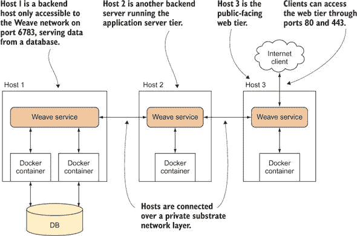

在图 10.3 中，主机 1 无法访问主机 3，但它们可以通过 Weave 网络相互通信，就像它们是本地连接的一样。Weave 网络不对公众开放——只对在 Weave 下启动的容器开放。这使得在不同环境中开发、测试和部署代码相对简单，因为网络拓扑可以在每种情况下都保持一致。

**安装 Weave**

Weave 是一个单一的二进制文件。你可以在[`www.weave.works/docs/net/latest/install/installing-weave/`](https://www.weave.works/docs/net/latest/install/installing-weave/)找到安装说明。

之前链接（以及以下方便起见列出）中的说明对我们有效。Weave 需要安装在你希望成为 Weave 网络一部分的每个主机上：

```
$ sudo curl -L git.io/weave -o /usr/local/bin/weave
$ sudo chmod +x /usr/local/bin/weave
```

| |
| --- |

##### 警告

如果你在此技术中遇到问题，你的机器上可能已经有一个 Weave 二进制文件，它是另一个软件包的一部分。


**设置 Weave**

要遵循此示例，你需要两个主机。我们将它们称为`host1`和`host2`。确保它们可以通过 ping 相互通信。你需要第一个启动 Weave 的主机的 IP 地址。

获取主机公共 IP 地址的一个快速方法是使用浏览器访问[`ifconfig.co/`](https://ifconfig.co/)，或者运行`curl https://ifconfig.co`，但请注意，你可能需要为两个主机打开防火墙，以便它们可以通过开放的互联网连接。如果你选择正确的 IP 地址，你还可以在本地网络中运行 Weave。


##### **提示**

如果你在使用此技术时遇到问题，很可能是网络以某种方式被防火墙隔离。如果你不确定，请咨询你的网络管理员。具体来说，你需要确保端口 6783 对 TCP 和 UDP 都开放，端口 6784 仅对 UDP 开放。


在第一个主机上，你可以运行第一个 Weave 路由器：

```
host1$ curl https://ifconfig.co                                         *1*
 1.2.3.4
host1$ weave launch
                                                                        *2*
 [...]
host1$ eval $(weave env)                                                *3*
 host1$ docker run -it --name a1 ubuntu:14.04 bash                      *4*
 root@34fdd53a01ab:/# ip addr show ethwe                                *5*
 43: ethwe@if44: <BROADCAST,MULTICAST,UP,LOWER_UP> mtu 1376 qdisc noqueue
 state UP group default
    link/ether 72:94:41:e3:00:df brd ff:ff:ff:ff:ff:ff
    inet 10.32.0.1/12 scope global ethwe
       valid_lft forever preferred_lft forever
```

+   ***1*** **确定 host1 的 IP 地址**

+   ***2*** **在 host1 上启动 Weave 服务。这需要在每个主机上执行一次，并且它将下载并运行一些 Docker 容器，在后台运行以管理底层数据网络。**

+   ***3*** **在此 shell 中设置 docker 命令以使用 Weave。如果你关闭了 shell 或打开了一个新的 shell，你需要再次运行此命令。**

+   ***4*** **启动容器**

+   ***5*** **检索 Weave 网络上容器的 IP 地址**

Weave 负责在容器中插入一个额外的接口`ethwe`，它为 Weave 网络提供一个 IP 地址。

你可以在`host2`上执行类似的步骤，但需要告诉 Weave 关于 host1 位置的信息：

```
host2$ sudo weave launch 1.2.3.4                                           *1*
 host2$ eval $(weave env)                                                  *2*
 host2$ docker run -it --name a2 ubuntu:14.04 bash
                                                                           *3*
 root@a2:/# ip addr show ethwe                                             *3*
 553: ethwe@if554: <BROADCAST,MULTICAST,UP,LOWER_UP> mtu 1376 qdisc noqueue
 state UP group default
    link/ether fe:39:ca:74:8a:ca brd ff:ff:ff:ff:ff:ff
    inet 10.44.0.0/12 scope global ethwe
       valid_lft forever preferred_lft forever
```

+   ***1*** **以 root 用户在 host2 上启动 Weave 服务。这次你需要添加第一个主机的公共 IP 地址，以便它可以连接到另一台主机。**

+   ***2*** **为 Weave 的服务设置适当的环境**

+   ***3*** **与 host1 的步骤相同**

在`host2`上唯一的区别是，你需要告诉 Weave 它与`host1`上的 Weave 进行对等连接（通过 IP 地址或主机名指定，可选的`:port`，这样 host2 就可以到达它）。

**测试你的连接**

现在你已经设置好了一切，你可以测试你的容器是否可以相互通信。让我们以`host2`上的容器为例：

```
root@a2:/# ping -qc1 10.32.0.1                                   *1*
 PING 10.32.0.1 (10.32.0.1) 56(84) bytes of data.

--- 10.32.0.1 ping statistics ---
1 packets transmitted, 1 received, 0% packet loss, time 0ms      *2*
 rtt min/avg/max/mdev = 1.373/1.373/1.373/0.000 ms
```

+   ***1*** **ping 其他服务器分配的 IP 地址**

+   ***2*** **成功的 ping 响应**

如果你收到成功的 ping 响应，你已证明在跨越两个主机的自分配私有网络内存在连接性。你也能够通过容器名称 ping，就像使用自定义网桥一样。


##### **提示**

由于 ICMP 协议（ping 使用）消息可能被防火墙阻止，因此这可能不起作用。如果不起作用，尝试在另一台主机上 telnet 到端口 6783 以测试是否可以建立连接。


**讨论**

子网是强有力地使网络和防火墙偶尔混乱的世界有秩序的工具。Weave 甚至声称可以智能地路由您的流量穿过部分分割的网络，其中某些主机 B 可以看到 A 和 C，但 A 和 C 不能通信—这可能会在技术 80 中熟悉。尽管如此，请记住，有时这些复杂的网络设置存在是有原因的——堡垒主机的全部目的就是为了安全而隔离。

所有这些功能都付出了代价—有报道称 Weave 网络有时比“原始”网络慢得多，并且您必须在后台运行额外的管理工具（因为网络插件模型不涵盖所有用例）。

Weave 网络具有许多额外的功能，从可视化到与 Kubernetes 的集成（我们将在技术 88 中介绍 Kubernetes 作为编排器）。我们建议您查看 Weave Net 概述以了解更多信息并充分利用您的网络—[`www.weave.works/docs/net/latest/overview/`](https://www.weave.works/docs/net/latest/overview/).

我们在这里没有涵盖的一件事是内置的覆盖网络插件。根据您的用例，这可能值得研究作为 Weave 的可能替代品，尽管它需要使用 Swarm 模式(技术 87)或设置一个全局可访问的键/值存储（可能是 etcd，来自技术 74)。


### 摘要

+   Docker Compose 可以用来设置容器集群。

+   康卡斯特和 Blockade 都是测试坏网络中容器的有用工具。

+   Docker 虚拟网络是链接的替代方案。

+   您可以使用虚拟网络在 Docker 中手动建模网络。

+   Weave Net 对于在主机之间连接容器很有用。
