## 第四部分. 从单机到云端的编排

第四部分 涵盖了编排的基本领域。一旦你在同一环境中运行任意数量的容器，你就需要考虑如何以一致和可靠的方式管理它们，因此我们将探讨一些目前最流行的工具。

第十一章 解释了编排的重要性，并从使用 systemd 管理基于单个主机的 Docker 服务开始，逐步发展到使用 Consul 和 Registrator 在网络上进行服务发现。

第十二章 讨论了集群化的 Docker 环境，我们将简要介绍 Docker Swarm，然后讨论最流行的编排工具 Kubernetes。然后我们将通过展示如何使用 Docker 在本地模拟 AWS 服务来反转这个过程。最后，我们将介绍在 Mesos 上构建 Docker 框架。

第十三章 对在选择基于 Docker 的平台时可能考虑的因素进行了深入讨论。选择可能会让人感到困惑，但这可能有助于你整理思路，并在需要时做出更好的决策。

## 第十一章. 容器编排入门

| |
| --- |

**本章内容涵盖**

+   使用 systemd 管理简单的 Docker 服务

+   使用 Helios 管理多主机 Docker 服务

+   使用 Hashicorp 的 Consul 进行服务发现

+   使用 Registrator 进行服务注册

| |
| --- |

Docker 所基于的技术以不同形式存在了一段时间，但 Docker 是成功吸引技术行业兴趣的解决方案。这使得 Docker 处于一个令人羡慕的位置——Docker 的份额完成了启动工具生态系统的初始工作，这形成了一个自我维持的循环，吸引人们进入生态系统并为它做出贡献。

这在编排方面尤其明显。在看到提供该领域服务的公司名单后，你会认为每个人都对如何做事有自己的看法，并开发了他们自己的工具。

尽管生态系统是 Docker（以及为什么我们在本书中如此频繁地从中汲取）的一个巨大优势，但可能的编排工具数量对于新手和资深人士来说都可能令人感到压倒性。本章将介绍一些最显著的工具，并让你对高级提供的内容有所了解，这样在评估你希望框架为你做什么时，你将更加了解。

安排编排工具的家族树有许多方法。图 11.1 展示了我们熟悉的一些工具。树的根部是`docker run`，这是启动容器的最常见方式。所有受 Docker 启发的工具都是这个分支的延伸。左侧是那些将容器组视为单一实体的工具。中间展示了专注于在 systemd 和服务文件下管理容器的工具。最后，右侧将单个容器视为其本身。随着你向下移动分支，这些工具最终会为你做更多的事情，无论是跨多台主机工作还是从你手中移除手动容器部署的繁琐。

##### 图 11.1\. Docker 生态系统中的编排工具

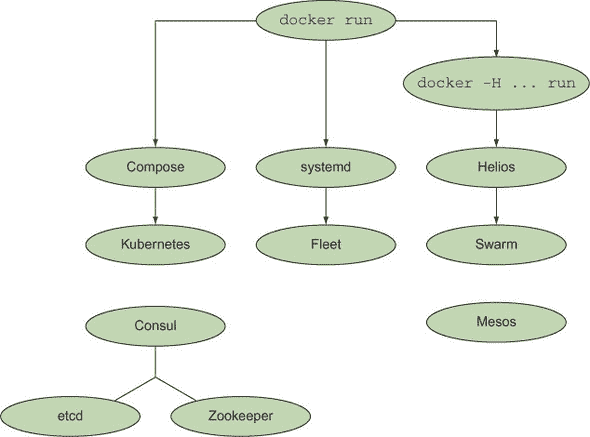

你会注意到图中有两个看似孤立的区域——Mesos 和 Consul/etcd/Zookeeper 组。Mesos 是一个有趣的案例——它在 Docker 之前就存在了，它对 Docker 的支持是一个附加功能而不是核心功能。尽管如此，它工作得非常好，应该仔细评估，至少为了看看你可能在其他工具中想要哪些功能。相比之下，Consul、etcd 和 Zookeeper 根本不是编排工具。相反，它们提供了编排的重要补充：服务发现。

本章和下一章将导航这个编排生态系统。在本章中，我们将介绍一些工具，这些工具可以让你有更细粒度的控制，并且可能感觉从手动管理容器过渡过来不那么跳跃。我们将查看在单个主机和多个主机上管理 Docker 容器，然后查看保存和检索容器部署位置信息的方法。然后，在下一章中，我们将查看更完整的解决方案，这些解决方案抽象了很多细节。

阅读这两章时，当你遇到每个编排工具时，后退一步，尝试想出一个工具可能有用的场景可能会有所帮助。这将有助于明确某个特定工具对你是否相关。我们将沿途提供一些示例，帮助你开始。

我们将从关注单个计算机开始，逐步深入。

### 11.1\. 简单的单主机 Docker

在本地机器上管理容器可能是一个痛苦的经历。Docker 提供的用于管理长时间运行容器的功能相对原始，使用链接和共享卷启动容器可能是一个令人沮丧的手动过程。

在第十章中，我们探讨了使用 Docker Compose 来简化链接管理，因此现在我们将解决另一个痛点，看看如何在单台机器上管理长时间运行的容器，使其更加稳健。


**使用 systemd 管理主机的容器**

在这个技术中，我们将带你设置一个简单的 Docker 服务与 systemd。如果你已经熟悉 systemd，这一章将相对容易理解，但我们假设你对这个工具没有先前的知识。

使用 systemd 来控制 Docker 对于拥有运营团队且更喜欢坚持使用他们已经理解和有工具支持的成熟技术的公司来说是有用的。

**问题**

你想要管理主机上运行的 Docker 容器服务。

**解决方案**

使用 systemd 来管理你的容器服务。

systemd 是一个系统管理守护进程，它在 Fedora 中取代了 SysV init 脚本。它管理你的系统上的服务——从挂载点到进程到一次性脚本，作为单独的“单元”。随着它传播到其他发行版和操作系统，它越来越受欢迎，尽管一些系统（以写作时的 Gentoo 为例）可能存在安装和启用它的问题。值得四处寻找其他人对你类似的设置中 systemd 的经验。

在这个技术中，我们将演示如何通过运行第一章中的待办事项应用程序来由 systemd 管理你的容器的启动。

**安装 systemd**

如果你的主机系统上没有 systemd（你可以通过运行`systemctl status`来检查，看你是否能得到一个连贯的响应），你可以使用标准的软件包管理器直接在你的主机操作系统上安装它。

如果你不喜欢以这种方式干扰你的主机系统，推荐的玩法是使用 Vagrant 来配置一个 systemd 就绪的虚拟机，如下面的列表所示。我们在这里简要介绍它，但请参阅附录 C 以获取有关安装 Vagrant 的更多建议。

##### 列表 11.1.一个 Vagrant 设置

```
$ mkdir centos7_docker                         *1*
 $ cd centos7_docker                           *1*
 $ vagrant init jdiprizio/centos-docker-io     *2*
 $ vagrant up         )                        *3*
 $ vagrant ssh                                 *4*
```

+   ***1*****创建并进入一个新的文件夹**

+   ***2*****初始化文件夹以用作 Vagrant 环境，指定 Vagrant 镜像**

+   ***3*****启动虚拟机**

+   ***4*****SSH 连接到虚拟机**

| |
| --- |

##### 注意

在写作时，jdiprizio/centos-docker-io 是一个合适且可用的虚拟机镜像。如果你在阅读时它不再可用，你可以将前面列表中的字符串替换为另一个镜像名称。你可以在 HashiCorp 的“Discover Vagrant Boxes”页面上搜索一个：[`app.vagrantup.com/boxes/search`](https://app.vagrantup.com/boxes/search)（“box”是 Vagrant 用来指代虚拟机镜像的术语）。为了找到这个镜像，我们搜索了“docker centos”。在尝试启动它之前，你可能需要查找有关命令行`vagrant box add`命令的帮助，以了解如何下载你的新虚拟机。

| |
| --- |

**在 systemd 下设置简单的 Docker 应用程序**

现在你有一个安装了 systemd 和 Docker 的机器，我们将使用它来运行第一章中的待办事项应用程序。

systemd 通过读取简单的 INI 文件格式的配置文件来工作。

| |
| --- |

##### 提示

INI 文件是简单的文本文件，其基本结构由部分、属性和值组成。


首先，你需要以 root 用户在/etc/systemd/system/todo.service 中创建一个服务文件，如下所示。在这个文件中，你告诉 systemd 在这个主机上以端口 8000 运行名为“todo”的 Docker 容器。

##### 列表 11.2\. /etc/systemd/system/todo.service

```
[Unit]                                                        *1*
 Description=Simple ToDo Application
After=docker.service                                          *2*
 Requires=docker.service                                      *3*
[Service]                                                     *4*
 Restart=always                                               *5*
 ExecStartPre=/bin/bash \
-c '/usr/bin/docker rm -f todo || /bin/true'                  *6*
 ExecStartPre=/usr/bin/docker pull dockerinpractice/todo      *7*
 ExecStart=/usr/bin/docker run --name todo \
-p 8000:8000 dockerinpractice/todo                            *8*
 ExecStop=/usr/bin/docker rm -f todo                          *9*

[Install]                                                     *10*
 WantedBy=multi-user.target                                   *11*
```

+   ***1*****单元部分定义了 systemd 对象的通用信息。**

+   ***2*****在 Docker 服务启动后启动此单元。**

+   ***3*****此单元要成功运行，Docker 服务必须正在运行。**

+   ***4*****服务部分定义了特定于 systemd 服务单元类型的配置信息。**

+   ***5*****如果服务终止，总是重新启动它。**

+   ***6*****如果服务 termExecStartPre 定义了一个在单元启动前运行的命令。为了确保在启动之前删除容器，你在这里可以毫不犹豫地删除它。**

+   ***7*****确保在运行容器之前已下载镜像。**

+   ***8*****ExecStart 定义了在服务启动时运行的命令。**

+   ***9*****ExecStop 定义了在服务停止时运行的命令。**

+   ***10*****安装部分包含 systemd 启用单元时的信息。**

+   ***11*****通知 systemd，当它进入多用户目标阶段时，你想启动此单元。**

此配置文件应明确指出 systemd 提供了一种简单的声明性模式来管理进程，将依赖关系管理的细节留给 systemd 服务。这并不意味着你可以忽略细节，但它确实为你提供了大量管理 Docker（和其他）进程的工具。


##### 注意

Docker 默认不设置任何容器重启策略，但请注意，你设置的任何策略都将与大多数进程管理器冲突。如果你正在使用进程管理器，请不要设置重启策略。


启用新单元只需调用`systemctl enable`命令。如果你想在这个单元启动时自动启动系统，你还可以在 multi-user.target.wants systemd 目录中创建一个符号链接。一旦完成，你可以使用`systemctl start`启动单元。

```
$ systemctl enable /etc/systemd/system/todo.service
$ ln -s '/etc/systemd/system/todo.service' \
'/etc/systemd/system/multi-user.target.wants/todo.service'
$ systemctl start todo.service
```

然后只需等待它启动。如果有问题，你会得到通知。

要检查一切是否正常，请使用`systemctl status`命令。它将打印出有关单元的一些一般信息，例如运行时间长短和进程 ID，然后是来自进程的若干日志行。在这种情况下，看到`Swarm 服务器启动端口 8000`是一个好兆头：

```
[root@centos system]# systemctl status todo.service
todo.service - Simple ToDo Application
   Loaded: loaded (/etc/systemd/system/todo.service; enabled)
   Active: active (running) since Wed 2015-03-04 19:57:19 UTC; 2min 13s ago
  Process: 21266 ExecStartPre=/usr/bin/docker pull dockerinpractice/todo \
(code=exited, status=0/SUCCESS)
  Process: 21255 ExecStartPre=/bin/bash -c /usr/bin/docker rm -f todo || \
/bin/true (code=exited, status=0/SUCCESS)
  Process: 21246 ExecStartPre=/bin/bash -c /usr/bin/docker kill todo || \
/bin/true (code=exited, status=0/SUCCESS)
 Main PID: 21275 (docker)
   CGroup: /system.slice/todo.service
           ??21275 /usr/bin/docker run --name todo
 -p 8000:8000 dockerinpractice/todo

Mar 04 19:57:24 centos docker[21275]: TodoApp.js:117:        \
// TODO scroll into view
Mar 04 19:57:24 centos docker[21275]: TodoApp.js:176:        \
if (i>=list.length()) { i=list.length()-1; } // TODO .length
Mar 04 19:57:24 centos docker[21275]: local.html:30:    \
<!-- TODO 2-split, 3-split -->
Mar 04 19:57:24 centos docker[21275]: model/TodoList.js:29:        \
// TODO one op - repeated spec? long spec?
Mar 04 19:57:24 centos docker[21275]: view/Footer.jsx:61:        \
// TODO: show the entry's metadata
Mar 04 19:57:24 centos docker[21275]: view/Footer.jsx:80:        \
todoList.addObject(new TodoItem()); // TODO create default
Mar 04 19:57:24 centos docker[21275]: view/Header.jsx:25:        \
// TODO list some meaningful header (apart from the id)
Mar 04 19:57:24 centos docker[21275]: > todomvc-swarm@0.0.1 start /todo
Mar 04 19:57:24 centos docker[21275]: > node TodoAppServer.js
Mar 04 19:57:25 centos docker[21275]: Swarm server started port 8000
```

你现在可以访问端口 8000 上的服务器。

**讨论**

这种技术中的原则可以应用于不仅仅是 systemd——大多数进程管理器，包括其他 init 系统，都可以以类似的方式进行配置。如果你感兴趣，你可以利用这一点来替换系统上运行的现有服务（可能是一个 PostgreSQL 数据库）的 docker 化版本。

在下一个技术中，我们将进一步在 systemd 中实现我们在技术 77 中创建的 SQLite 服务器。

|  |

**编排宿主机的容器启动**

与 docker-compose（截至写作时）不同，systemd 是一种成熟的技术，适用于生产。在这个技术中，我们将向你展示如何使用 systemd 实现类似于 docker-compose 的本地编排功能。


##### 注意

如果你遇到这个技术的问题，你可能需要升级你的 Docker 版本。版本 1.7.0 或更高版本应该可以正常工作。


**问题**

你想在生产环境中在一个主机上管理更复杂的容器编排。

**解决方案**

使用具有依赖服务的 systemd 来管理你的容器。

为了演示在更复杂场景下使用 systemd 的方法，我们将重新实现来自技术 77 的 SQLite TCP 服务器示例，并在 systemd 中实现。展示了我们计划中的 systemd 服务单元配置的依赖关系。

##### 图 11.2\. systemd 单元依赖关系图

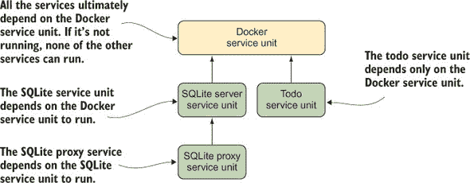

这与你在技术 77 中看到的 Docker Compose 示例中的架构类似。这里的一个关键区别是，而不是将 SQLite 服务视为一个单一的单一实体，每个容器都是一个独立的实体。在这个场景中，SQLite 代理可以独立于 SQLite 服务器停止。

这是 SQLite 服务器服务的列表。和之前一样，它依赖于 Docker 服务，但与之前技术中的待办示例有一些不同。

##### 列表 11.3\. /etc/systemd/system/sqliteserver.service

```
[Unit]                                                      *1*
 Description=SQLite Docker Server
After=docker.service                                        *2*
 Requires=docker.service                                    *3*

[Service]
Restart=always
ExecStartPre=-/bin/touch /tmp/sqlitedbs/test                *4*
 ExecStartPre=-/bin/touch /tmp/sqlitedbs/live               *4*
 ExecStartPre=/bin/bash \
-c '/usr/bin/docker kill sqliteserver || /bin/true'         *5*
 ExecStartPre=/bin/bash \                                   *5*
-c '/usr/bin/docker rm -f sqliteserver || /bin/true'
 ExecStartPre=/usr/bin/docker \
pull dockerinpractice/docker-compose-sqlite                 *6*
 ExecStart=/usr/bin/docker run --name sqliteserver \        *7*
 -v /tmp/sqlitedbs/test:/opt/sqlite/db \
dockerinpractice/docker-compose-sqlite /bin/bash -c \
'socat TCP-L:12345,fork,reuseaddr \
EXEC:"sqlite3 /opt/sqlite/db",pty'
ExecStop=/usr/bin/docker rm -f sqliteserver                 *8*

[Install]
WantedBy=multi-user.target
```

+   ***1*****单元部分定义了 systemd 对象的一般信息。**

+   ***2*****在 Docker 服务启动后启动此单元**

+   ***3*****此单元要成功运行，Docker 服务必须正在运行。**

+   ***4*****这些行确保在服务启动之前 SQLite 数据库文件存在。touch 命令前的破折号表示 systemd，如果命令返回错误代码，则启动应失败。**

+   ***5*****ExecStartPre 定义了在单元启动之前要运行的命令。为了确保在启动容器之前将其删除，你在这里有偏见地删除它。**

+   ***6*****确保在运行容器之前下载了镜像**

+   ***7*****ExecStart 定义了服务启动时要运行的命令。请注意，我们将 socat 命令包装在“/bin/bash -c”调用中，以避免混淆，因为 ExecStart 行是由 systemd 运行的。**

+   ***8*****ExecStop 定义了服务停止时要运行的命令。**


##### 小贴士

在 systemd 中，路径必须是绝对路径。

接下来是 SQLite 代理服务的列表。这里的关键区别在于代理服务依赖于你刚刚定义的服务进程，而这个服务进程又依赖于 Docker 服务。


##### 列表 11.4\. /etc/systemd/system/sqliteproxy.service

```
[Unit]
Description=SQLite Docker Proxy
After=sqliteserver.service                                            *1*
 Requires=sqliteserver.service                                        *2*

[Service]
Restart=always
ExecStartPre=/bin/bash -c '/usr/bin/docker kill sqliteproxy || /bin/true'
ExecStartPre=/bin/bash -c '/usr/bin/docker rm -f sqliteproxy || /bin/true'
ExecStartPre=/usr/bin/docker pull dockerinpractice/docker-compose-sqlite
ExecStart=/usr/bin/docker run --name sqliteproxy \
-p 12346:12346 --link sqliteserver:sqliteserver \
dockerinpractice/docker-compose-sqlite /bin/bash \
-c 'socat TCP-L:12346,fork,reuseaddr TCP:sqliteserver:12345'          *3*
 ExecStop=/usr/bin/docker rm -f sqliteproxy

[Install]
WantedBy=multi-user.target
```

+   ***1*****代理单元必须在之前定义的 sqliteserver 服务之后运行。**

+   ***2*****代理要求在启动之前服务器实例必须正在运行。**

+   ***3*****运行容器**

使用这两个配置文件，我们已经为在 systemd 的控制下安装和运行 SQLite 服务奠定了基础。现在我们可以启用这些服务：

```
$ sudo systemctl enable /etc/systemd/system/sqliteserver.service
ln -s '/etc/systemd/system/sqliteserver.service' \
'/etc/systemd/system/multi-user.target.wants/sqliteserver.service'
$ sudo systemctl enable /etc/systemd/system/sqliteproxy.service
ln -s '/etc/systemd/system/sqliteproxy.service' \
'/etc/systemd/system/multi-user.target.wants/sqliteproxy.service'
```

并启动它们：

```
$ sudo systemctl start sqliteproxy
$ telnet localhost 12346
[vagrant@centos ~]$ telnet localhost 12346
Trying ::1...
Connected to localhost.
Escape character is '^]'.
SQLite version 3.8.2 2013-12-06 14:53:30
Enter ".help" for instructions
Enter SQL statements terminated with a ";"
sqlite> select * from t1;
select * from t1;
test
```

注意，由于 SQLite 代理服务依赖于 SQLite 服务器服务来运行，你只需要启动代理——依赖项会自动启动。

**讨论**

在本地机器上管理长期运行的应用程序时面临的挑战之一是依赖服务的管理。例如，一个 Web 应用程序可能期望作为服务在后台运行，但也可能依赖于数据库和 Web 服务器。这可能听起来很熟悉——你在技术 13 中覆盖了 Web-app-db 结构。

技术 76 展示了如何使用依赖关系等设置这种结构，但像 systemd 这样的工具已经在这个问题上工作了一段时间，并且可能提供 Docker Compose 不提供的灵活性。例如，一旦你写好了服务文件，你可以启动你想要的任何一个，systemd 将处理启动任何依赖服务，甚至在必要时启动 Docker 守护进程本身。


### 11.2\. 手动多主机 Docker

现在你已经熟悉了在机器上一些相当复杂的 Docker 容器排列，是时候考虑更宏大的目标了——让我们进入多主机世界，以便我们能够在更大规模上使用 Docker。

在本章的剩余部分，你将手动使用 Helios 运行一个多主机环境，以介绍你多主机 Docker 的概念。在下一章，你将看到更多自动化和复杂的方法来实现相同的结果以及更多。


**使用 Helios 手动多主机 Docker**

将一组机器的所有控制权交给一个应用程序可能会让人感到害怕，所以用更手动的方法慢慢适应是有好处的。

对于那些大部分基础设施都是静态的，并且对使用 Docker 运行关键服务感兴趣但（可以理解地）希望在过程中有人监督的公司来说，Helios 是理想的。

**问题**

你希望能够用容器配置多个 Docker 主机，但仍然保留对运行位置的手动控制。

**解决方案**

使用 Spotify 的 Helios 工具来精确管理其他主机上的容器。

Helios 是 Spotify 目前用于在生产环境中管理服务器的一个工具，它有一个令人愉悦的特性，那就是易于上手且稳定（正如你所期望的）。Helios 允许你管理跨多个主机的 Docker 容器的部署。它提供了一个单行命令界面，你可以使用它来指定你想要运行的内容以及运行的位置，以及查看当前状态的权限。

由于我们只是介绍 Helios，我们将为了简单起见在 Docker 内的单个节点上运行一切——请不要担心，任何与在多个主机上运行相关的内容都将被清楚地突出显示。Helios 的高层次架构在图 11.3 中概述。

##### 图 11.3\. Helios 安装的鸟瞰图

![Images/11fig03_alt.jpg]

如你所见，运行 Helios 时只需要一个额外的服务：Zookeeper。Helios 使用 Zookeeper 来跟踪所有主机的状态，并在主节点和代理节点之间作为通信通道。

| |
| --- |

##### 小贴士

Zookeeper 是一个用 Java 编写的轻量级分布式数据库，它针对存储配置信息进行了优化。它是 Apache 开源软件产品套件的一部分。它在功能上与 etcd（你可以在第九章 chapter 9 中了解到，本章你还将再次看到）相似。

| |
| --- |

对于这项技术，你需要知道的是 Zookeeper 以一种方式存储数据，使得可以通过运行多个 Zookeeper 实例将其分布到多个节点上（既为了可扩展性也为了可靠性）。这听起来可能与我们第九章 chapter 9 中对 etcd 的描述相似——这两个工具有显著的相似之处。

要启动我们将在这项技术中使用的单个 Zookeeper 实例，请运行以下命令：

```
$ docker run --name zookeeper -d jplock/zookeeper:3.4.6
cd0964d2ba18baac58b29081b227f15e05f11644adfa785c6e9fc5dd15b85910
$ docker inspect -f '{{.NetworkSettings.IPAddress}}' zookeeper
<*co>172.17.0.9
```

| |
| --- |

##### 注意

当在一个单独的节点上启动 Zookeeper 实例时，你将想要暴露端口以便其他主机可以访问，并使用卷来持久化数据。查看 Docker Hub 上的 Dockerfile 获取有关应使用哪些端口和文件夹的详细信息([`hub.docker.com/r/jplock/zookeeper/~/dockerfile/`](https://hub.docker.com/r/jplock/zookeeper/~/dockerfile/))。你也可能想在多个节点上运行 Zookeeper，但配置 Zookeeper 集群超出了这项技术的范围。

| |
| --- |

你可以使用 zkCli.sh 工具检查 Zookeeper 存储的数据，无论是交互式地还是通过管道输入到它。初始启动时相当健谈，但它会带你进入一个交互式提示，你可以在其中运行针对 Zookeeper 存储数据的类似文件树结构的命令。

```
$ docker exec -it zookeeper bin/zkCli.sh
Connecting to localhost:2181
2015-03-07 02:56:05,076 [myid:] - INFO  [main:Environment@100] - Client >
environment:zookeeper.version=3.4.6-1569965, built on 02/20/2014 09:09 GMT
2015-03-07 02:56:05,079 [myid:] - INFO  [main:Environment@100] - Client >
environment:host.name=917d0f8ac077
2015-03-07 02:56:05,079 [myid:] - INFO  [main:Environment@100] - Client >
environment:java.version=1.7.0_65
2015-03-07 02:56:05,081 [myid:] - INFO  [main:Environment@100] - Client >
environment:java.vendor=Oracle Corporation
[...]
2015-03-07 03:00:59,043 [myid:] - INFO
 [main-SendThread(localhost:2181):ClientCnxn$SendThread@1235] -
 Session establishment complete on server localhost/0:0:0:0:0:0:0:1:2181,
 sessionid = 0x14bf223e159000d, negotiated timeout = 30000

WATCHER::

WatchedEvent state:SyncConnected type:None path:null
[zk: localhost:2181(CONNECTED) 0] ls /
[zookeeper]
```

目前还没有任何进程针对 Zookeeper 运行，所以目前存储的只有一些内部 Zookeeper 信息。请保持此提示打开，随着我们的进展我们将重新访问它。

Helios 本身分为三个部分：

+   *主节点*——这是用于在 Zookeeper 中进行更改的接口。

+   *代理*——这个代理在每个 Docker 主机上运行，根据 Zookeeper 启动和停止容器，并将状态信息反馈回来。

+   *命令行工具*——这些工具用于向主节点发送请求。

图 11.4 展示了当我们对其执行操作时，最终系统是如何连接在一起的（箭头指示数据流）。

##### 图 11.4\. 在单主机 Helios 安装上启动容器

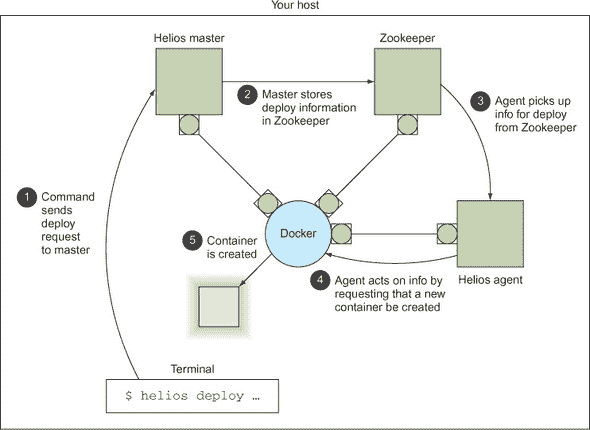

现在 Zookeeper 已经启动，是时候启动 Helios 了。我们需要在指定我们之前启动的 Zookeeper 节点 IP 地址的情况下运行主节点：

```
$ IMG=dockerinpractice/docker-helios
$ docker run -d --name hmaster $IMG helios-master --zk 172.17.0.9
896bc963d899154436938e260b1d4e6fdb0a81e4a082df50043290569e5921ff
$ docker logs --tail=3 hmaster
03:20:14.460 helios[1]: INFO  [MasterService STARTING] ContextHandler: >
Started i.d.j.MutableServletContextHandler@7b48d370{/,null,AVAILABLE}
03:20:14.465 helios[1]: INFO  [MasterService STARTING] ServerConnector: >
Started application@2192bcac{HTTP/1.1}{0.0.0.0:5801}
03:20:14.466 helios[1]: INFO  [MasterService STARTING] ServerConnector: >
Started admin@28a0d16c{HTTP/1.1}{0.0.0.0:5802}
$ docker inspect -f '{{.NetworkSettings.IPAddress}}' hmaster
172.17.0.11
```

现在让我们看看 Zookeeper 中有什么新变化：

```
[zk: localhost:2181(CONNECTED) 1] ls /
[history, config, status, zookeeper]
[zk: localhost:2181(CONNECTED) 2] ls /status/masters
[896bc963d899]
[zk: localhost:2181(CONNECTED) 3] ls /status/hosts
[]
```

看起来 Helios 主节点创建了一系列新的配置项，包括将自己注册为主节点。不幸的是，我们目前还没有任何主机。

让我们通过启动一个代理来解决这个问题，该代理将使用当前主机的 Docker 套接字在以下位置启动容器：

```
$ docker run -v /var/run/docker.sock:/var/run/docker.sock -d --name hagent \
dockerinpractice/docker-helios helios-agent --zk 172.17.0.9
5a4abcb271070d0171ca809ff2beafac5798e86131b72aeb201fe27df64b2698
$ docker logs --tail=3 hagent
03:30:53.344 helios[1]: INFO  [AgentService STARTING] ContextHandler: >
Started i.d.j.MutableServletContextHandler@774c71b1{/,null,AVAILABLE}
03:30:53.375 helios[1]: INFO  [AgentService STARTING] ServerConnector: >
Started application@7d9e6c27{HTTP/1.1}{0.0.0.0:5803}
03:30:53.376 helios[1]: INFO  [AgentService STARTING] ServerConnector: >
Started admin@2bceb4df{HTTP/1.1}{0.0.0.0:5804}
$ docker inspect -f '{{.NetworkSettings.IPAddress}}' hagent
172.17.0.12
```

再次，让我们回到 Zookeeper 查看：

```
[zk: localhost:2181(CONNECTED) 4] ls /status/hosts
[5a4abcb27107]
[zk: localhost:2181(CONNECTED) 5] ls /status/hosts/5a4abcb27107
[agentinfo, jobs, environment, hostinfo, up]
[zk: localhost:2181(CONNECTED) 6] get /status/hosts/5a4abcb27107/agentinfo
{"inputArguments":["-Dcom.sun.management.jmxremote.port=9203", [...]
[...]
```

您可以看到，`/status/hosts`现在包含一个条目。进入主机对应的 Zookeeper 目录，可以揭示 Helios 存储的主机内部信息。


##### 注意

当在多个主机上运行时，您需要将`--name $(hostname -f)`作为参数传递给 Helios 主节点和代理。您还需要为主节点暴露端口 5801 和 5802，为代理暴露端口 5803 和 5804。


让我们使与 Helios 的交互更加简单：

```
$ alias helios="docker run -i --rm dockerinpractice/docker-helios \
helios -z http://172.17.0.11:5801"
```

前面的别名意味着调用`helios`将启动一个临时容器来执行您想要的操作，并首先指向正确的 Helios 集群。请注意，命令行界面需要指向 Helios 主节点而不是 Zookeeper。

一切都已经设置好了。我们能够轻松地与我们的 Helios 集群交互，所以现在是时候尝试一个示例了。

```
$ helios create -p nc=8080:8080 netcat:v1 ubuntu:14.04.2 -- \
sh -c 'echo hello | nc -l 8080'
Creating job: {"command":["sh","-c","echo hello | nc -l 8080"], >
"creatingUser":null,"env":{},"expires":null,"gracePeriod":null, >
"healthCheck":null,"id": >
"netcat:v1:2067d43fc2c6f004ea27d7bb7412aff502e3cdac", >
"image":"ubuntu:14.04.2","ports":{"nc":{"externalPort":8080, >
"internalPort":8080,"protocol":"tcp"}},"registration":{}, >
"registrationDomain":"","resources":null,"token":"","volumes":{}}
Done.
netcat:v1:2067d43fc2c6f004ea27d7bb7412aff502e3cdac
$ helios jobs
JOB ID            NAME   VERSION HOSTS COMMAND                  ENVIRONMENT
netcat:v1:2067d43 netcat v1      0     sh -c "echo hello | nc -l 8080"
```

Helios 围绕*作业*的概念构建——在将任务发送到主机执行之前，必须将所有要执行的内容表达为作业。至少，您需要一个包含 Helios 启动容器所需的基本信息的镜像：要执行的命令以及任何端口、卷或环境选项。您可能还希望使用一些其他高级选项，包括健康检查、过期日期和服务注册。

之前的命令创建了一个将在端口 8080 上监听、打印“hello”给第一个连接到端口的实体，然后终止的任务。

您可以使用`helios hosts`列出可用于作业部署的主机，然后使用`helios deploy`实际执行部署。然后`helios status`命令显示作业已成功启动：

```
$ helios hosts
HOST         STATUS        DEPLOYED RUNNING CPUS MEM  LOAD AVG MEM USAGE >
OS                      HELIOS  DOCKER
5a4abcb27107.Up 19 minutes 0        0       4    7 gb 0.61     0.84      >
Linux 3.13.0-46-generic 0.8.213 1.3.1 (1.15)
$ helios deploy netcat:v1 5a4abcb27107
Deploying Deployment{jobId=netcat:v1: >
2067d43fc2c6f004ea27d7bb7412aff502e3cdac, goal=START, deployerUser=null} >
on [5a4abcb27107]
5a4abcb27107: done
$ helios status
JOB ID            HOST         GOAL  STATE   CONTAINER ID PORTS
netcat:v1:2067d43 5a4abcb27107.START RUNNING b1225bc      nc=8080:8080
```

当然，我们现在想验证服务是否正常工作：

```
$ curl localhost:8080
hello
$ helios status
JOB ID            HOST         GOAL  STATE         CONTAINER ID PORTS
netcat:v1:2067d43 5a4abcb27107.START PULLING_IMAGE b1225bc      nc=8080:8080
```

`curl` 的结果清楚地告诉我们服务正在运行，但现在 `helios status` 显示了一些有趣的内容。在定义作业时，我们注意到在服务“hello”之后，作业将终止，但前面的输出显示了一个 `PULLING_IMAGE` 状态。这是由于 Helios 管理作业的方式——一旦你部署到主机上，Helios 将尽力保持作业运行。你在这里看到的状态是 Helios 正在完成完整的作业启动过程，这恰好涉及到确保图像被拉取。

最后，我们需要清理自己的事情。

```
$ helios undeploy -a --yes netcat:v1
Undeploying netcat:v1:2067d43fc2c6f004ea27d7bb7412aff502e3cdac from >
[5a4abcb27107]
5a4abcb27107: done
$ helios remove --yes netcat:v1
Removing job netcat:v1:2067d43fc2c6f004ea27d7bb7412aff502e3cdac
netcat:v1:2067d43fc2c6f004ea27d7bb7412aff502e3cdac: done
```

我们要求将作业从所有节点中移除（如果需要，终止它并停止任何更多的自动重启），然后我们删除了作业本身，这意味着它不能再部署到任何其他节点。

**讨论**

Helios 是将你的容器部署到多个主机的一种简单且可靠的方式。与我们在后面将要讨论的许多技术不同，背后没有魔法来确定适当的位置——Helios 以最小的麻烦在你想放置容器的确切位置启动容器。

但这种简单性一旦你转移到更高级的部署场景中就会付出代价——像资源限制、动态扩展等功能目前都缺失，因此你可能发现自己需要重新发明部分像 Kubernetes (技术 88) 这样的工具来达到你想要的部署行为。

| |
| --- |

### 11.3. 服务发现：这里有什么？

本章的引言将服务发现称为编排的另一方面——能够将你的应用程序部署到数百台不同的机器上是没有问题的，但如果你无法找出哪些应用程序位于何处，你就无法真正*使用*它们。

尽管它不像编排那样饱和，但服务发现领域仍然有许多竞争对手。它们都提供略微不同的功能集并不利于这一领域。

在服务发现方面，通常有两个功能是人们所期望的：一个通用的键/值存储和一个通过某些方便的接口（可能是 DNS）检索服务端点的方法。etcd 和 Zookeeper 是前者的例子，而 SkyDNS（我们不会深入探讨的工具）是后者的例子。实际上，SkyDNS 使用 etcd 来存储它所需的信息。

| |
| --- |

**使用 Consul 来发现服务**

etcd 是一个非常流行的工具，但它确实有一个特定的竞争对手经常被提及：Consul。这有点奇怪，因为还有其他工具与 etcd 更相似（Zookeeper 与 etcd 有相似的功能集，但实现语言不同），而 Consul 通过一些有趣的功能来区分自己，如服务发现和健康检查。实际上，如果你眯起眼睛，Consul 可能看起来有点像 etcd、SkyDNS 和 Nagios 的结合体。

**问题**

您需要能够分发信息到、在容器内发现服务以及监控一组容器。

**解决方案**

在每个 Docker 主机上启动带有 Consul 的容器，以提供服务目录和配置通信系统。

Consul 试图成为一个通用的工具，用于执行在需要协调多个独立服务时所需的一些重要任务。这些任务可以通过其他工具执行，但在一个地方配置它们可能很有用。从高层次来看，Consul 提供以下功能：

+   *服务配置*—一个用于存储和共享小值的键/值存储，例如 etcd 和 Zookeeper

+   *服务发现*—一个用于注册服务的 API 和一个用于发现它们的 DNS 端点，例如 SkyDNS

+   *服务监控*—一个用于注册健康检查的 API，例如 Nagios

您可以使用所有、一些或其中之一的功能，因为没有绑定。如果您有现有的监控基础设施，就没有必要用 Consul 替换它。

这个技术将涵盖 Consul 的服务发现和服务监控方面，但不涉及键/值存储。在这一点上，etcd 和 Consul 之间有很强的相似性，使得第九章中的最后两个技术（技术 74 和 75）在阅读 Consul 文档后可以相互转换。

图 11.5 展示了一个典型的 Consul 配置。

##### 图 11.5\. 一个典型的 Consul 配置

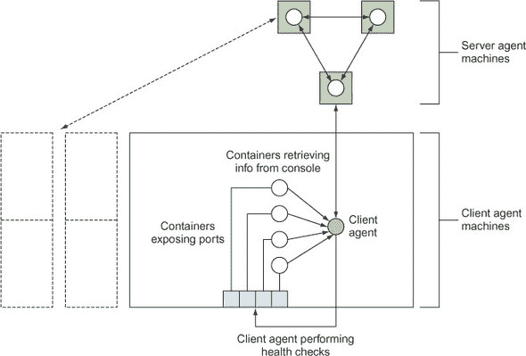

存储在 Consul 中的数据是*服务器*代理的责任。这些代理负责对存储的信息达成*共识*——这一概念存在于大多数分布式数据存储系统中。简而言之，如果您丢失了不到一半的服务器代理，您有保证能够恢复您的数据（参见技术 74 中关于 etcd 的示例）。因为这些服务器非常重要并且有更高的资源需求，将它们放在专用机器上是一个典型的选择。


##### 注意

尽管这个技术中的命令将把 Consul 数据目录（/data）留在容器内，但通常将此目录指定为至少服务器的卷是一个好主意，这样您可以保留备份。


建议您控制的所有可能希望与 Consul 交互的机器都应该运行一个客户端代理。这些代理将请求转发到服务器并运行健康检查。

启动 Consul 的第一步是启动一个服务器代理：

```
c1 $ IMG=dockerinpractice/consul-server
c1 $ docker pull $IMG
[...]
c1 $ ip addr | grep 'inet ' | grep -v 'lo$\|docker0$\|vbox.*$'
    inet 192.168.1.87/24 brd 192.168.1.255 scope global wlan0
c1 $ EXTIP1=192.168.1.87
c1 $ echo '{"ports": {"dns": 53}}' > dns.json
c1 $ docker run -d --name consul --net host \
-v $(pwd)/dns.json:/config/dns.json $IMG -bind $EXTIP1 -client $EXTIP1 \
-recursor 8.8.8.8 -recursor 8.8.4.4 -bootstrap-expect 1
88d5cb48b8b1ef9ada754f97f024a9ba691279e1a863fa95fa196539555310c1
c1 $ docker logs consul
[...]
       Client Addr: 192.168.1.87 (HTTP: 8500, HTTPS: -1, DNS: 53, RPC: 8400)
      Cluster Addr: 192.168.1.87 (LAN: 8301, WAN: 8302)
[...]
==> Log data will now stream in as it occurs:

    2015/08/14 12:35:41 [INFO] serf: EventMemberJoin: mylaptop 192.168.1.87
[...]
    2015/08/14 12:35:43 [INFO] consul: member 'mylaptop' joined, marking >
health alive
    2015/08/14 12:35:43 [INFO] agent: Synced service 'consul'
```

因为我们想将 Consul 用作 DNS 服务器，所以我们已将一个文件插入到 Consul 读取配置的文件夹中，以请求它监听端口 53（DNS 协议的注册端口）。然后我们使用您可能从早期技术中认识到的命令序列来尝试找到机器的外部 IP 地址，以便与其他代理通信并监听客户端请求。


##### 注意

IP 地址`0.0.0.0`通常用于指示应用程序应在机器上的所有可用接口上监听。我们故意没有这样做，因为一些 Linux 发行版有一个监听在`127.0.0.1`的 DNS 缓存守护进程，这禁止在`0.0.0.0:53`上监听。

| |
| --- |

在前面的`docker run`命令中有三个值得注意的事项：

+   我们使用了`--net host`。虽然在 Docker 世界中这可能会被视为一个错误，但替代方案是在命令行上暴露多达八个端口——这是一个个人偏好的问题，但我们认为在这里是合理的。它还有助于绕过一个潜在的 UDP 通信问题。如果你选择手动操作，则不需要设置 DNS 端口——你可以将默认的 Consul DNS 端口（8600）在主机上暴露为端口 53。

+   两个`recursor`参数告诉 Consul 在请求的地址由 Consul 本身未知时，应该查看哪些 DNS 服务器。

+   `-bootstrap-expect 1`参数意味着 Consul 集群将仅用一个代理启动，这并不稳健。典型的设置会将此设置为 3（或更多），以确保集群在所需数量的服务器加入之前不会启动。要启动额外的服务器代理，请添加一个`-join`参数，正如我们将在启动客户端时讨论的那样。

现在让我们转到第二台机器，启动一个客户端代理，并将其添加到我们的集群中。

**警告** 由于 Consul 期望在与其他代理通信时能够监听特定的端口集，因此在单个机器上设置多个代理同时展示其在现实世界中的工作方式是有些棘手的。我们现在将使用不同的主机——如果你决定使用 IP 别名，请确保传递一个`-node newAgent`，因为默认情况下将使用主机名，这可能会产生冲突。

```
c2 $ IMG=dockerinpractice/consul-agent
c2 $ docker pull $IMG
[...]
c2 $ EXTIP1=192.168.1.87
c2 $ ip addr | grep docker0 | grep inet
    inet 172.17.42.1/16 scope global docker0
c2 $ BRIDGEIP=172.17.42.1
c2 $ ip addr | grep 'inet ' | grep -v 'lo$\|docker0$'
    inet 192.168.1.80/24 brd 192.168.1.255 scope global wlan0
c2 $ EXTIP2=192.168.1.80
c2 $ echo '{"ports": {"dns": 53}}' > dns.json
c2 $ docker run -d --name consul-client --net host \
-v $(pwd)/dns.json:/config/dns.json $IMG -client $BRIDGEIP -bind $EXTIP2 \
-join $EXTIP1 -recursor 8.8.8.8 -recursor 8.8.4.4
5454029b139cd28e8500922d1167286f7e4fb4b7220985ac932f8fd5b1cdef25
c2 $ docker logs consul-client
[...]
    2015/08/14 19:40:20 [INFO] serf: EventMemberJoin: mylaptop2 192.168.1.80
[...]
    2015/08/14 13:24:37 [INFO] consul: adding server mylaptop >
(Addr: 192.168.1.87:8300) (DC: dc1)
```

| |
| --- |

##### 注意

我们使用的镜像基于 gliderlabs/consul-server:0.5 和 gliderlabs/consul-agent:0.5，并包含一个 Consul 的新版本，以避免 UDP 通信中可能出现的“Refuting a suspect message”等日志记录的潜在问题。当镜像的 0.6 版本发布时，你可以切换回 gliderlabs 的镜像。

| |
| --- |

所有客户端服务（HTTP、DNS 等）都已配置为在 Docker 桥接 IP 地址上监听。这为容器提供了一个已知的位置，它们可以从 Consul 检索信息，并且它只在机器内部暴露 Consul，迫使其他机器直接访问服务器代理，而不是通过客户端代理到服务器代理的较慢路径。为确保桥接 IP 地址在所有主机上保持一致，你可以查看 Docker 守护进程的`--bip`参数。

如前所述，我们已经找到了外部 IP 地址并将集群通信绑定到它。`-join`参数告诉领事最初在哪里查找以找到集群。不用担心对集群形成进行微观管理——当两个代理最初相遇时，它们会进行“八卦”，传递有关在集群中找到其他代理的信息。最后的`-recursor`参数告诉领事用于 DNS 请求的 DNS 服务器（这些请求不是尝试查找已注册的服务）。

让我们验证代理是否已通过客户端机器上的 HTTP API 连接到服务器。我们将使用的 API 调用将返回客户端代理当前认为在集群中的成员列表。在大型、快速变化的集群中，这可能并不总是与集群成员匹配——为此还有一个（较慢）的 API 调用。

```
c2 $ curl -sSL $BRIDGEIP:8500/v1/agent/members | tr ',' '\n' | grep Name
[{"Name":"mylaptop2"
{"Name":"mylaptop"
```

现在领事基础设施已经搭建完成，是时候看看您如何注册和发现服务了。注册的典型流程是在初始化后让您的应用程序对本地客户端代理进行 API 调用，这会提示客户端代理将信息分发到服务器代理。为了演示目的，我们将手动执行注册步骤。

```
c2 $ docker run -d --name files -p 8000:80 ubuntu:14.04.2 \
python3 -m http.server 80
96ee81148154a75bc5c8a83e3b3d11b73d738417974eed4e019b26027787e9d1
c2 $ docker inspect -f '{{.NetworkSettings.IPAddress}}' files
172.17.0.16
c2 $ /bin/echo -e 'GET / HTTP/1.0\r\n\r\n' | nc -i1 172.17.0.16 80 \
| head -n 1
HTTP/1.0 200 OK
c2 $ curl -X PUT --data-binary '{"Name": "files", "Port": 8000}' \
$BRIDGEIP:8500/v1/agent/service/register
c2 $ docker logs consul-client | tail -n 1
    2015/08/15 03:44:30 [INFO] agent: Synced service 'files'
```

在这里，我们在容器中设置了一个简单的 HTTP 服务器，将其暴露在主机上的 8000 端口，并检查它是否工作。然后我们使用 curl 和领事 HTTP API 注册了一个服务定义。这里绝对必要的是服务的名称——端口，以及领事文档中列出的其他字段都是可选的。ID 字段值得提一下——它默认为服务的名称，但必须在所有服务中是唯一的。如果您想有多个服务实例，您需要指定它。

来自领事日志的行告诉我们服务已同步，因此我们应该能够从服务 DNS 接口检索有关它的信息。这些信息来自服务器代理，因此它作为验证，表明该服务已被接受到领事目录中。您可以使用`dig`命令查询服务 DNS 信息并检查其是否存在：

```
c2 $ EXTIP1=192.168.1.87
c2 $ dig @$EXTIP1 files.service.consul +short                  *1*
 192.168.1.80
c2 $ BRIDGEIP=172.17.42.1
c2 $ dig @$BRIDGEIP files.service.consul +short                *2*
 192.168.1.80
c2 $ dig @$BRIDGEIP files.service.consul srv +short            *3*
 1 1 8000 mylaptop2.node.dc1.consul.
c2 $ docker run -it --dns $BRIDGEIP ubuntu:14.04.2 bash        *4*
 root@934e9c26bc7e:/# ping -c1 -q www.google.com               *5*
 PING www.google.com (216.58.210.4) 56(84) bytes of data.

--- www.google.com ping statistics ---
1 packets transmitted, 1 received, 0% packet loss, time 0ms
rtt min/avg/max/mdev = 25.358/25.358/25.358/0.000 ms
root@934e9c26bc7e:/# ping -c1 -q files.service.consul          *6*
 PING files.service.consul (192.168.1.80) 56(84) bytes of data.

--- files.service.consul ping statistics ---
1 packets transmitted, 1 received, 0% packet loss, time 0ms
rtt min/avg/max/mdev = 0.062/0.062/0.062/0.000 ms
```

+   ***1***从服务器代理 DNS 查找文件服务的 IP 地址。此 DNS 服务对您的领事集群中的任意机器都可用，允许它们也能从服务发现中受益。

+   ***2***从客户端代理 DNS 查找文件服务的 IP 地址。如果使用$BRIDGEIP 失败，您可能希望尝试使用$EXTIP1。

+   ***3***从客户端代理 DNS 请求文件服务的 SRV 记录

+   ***4***启动一个配置为仅使用本地客户端代理作为 DNS 服务器的容器

+   ***5***验证外部地址的查找仍然有效

+   ***6***验证服务查找在容器内自动工作


##### 注意

SRV 记录是通过 DNS 通信服务信息的一种方式，包括协议、端口和其他条目。在前面的例子中，您可以在响应中看到端口号，并且您得到了提供服务的机器的规范主机名而不是 IP 地址。

| |
| --- |

高级用户可能希望避免手动设置`--dns`参数，而是通过配置 Docker 守护进程本身的`--dns`和`--bip`参数来避免，但请记住覆盖 Consul 代理的默认值，否则您可能会遇到意外的行为。

在技术 80 中，Consul DNS 服务与 Docker 虚拟网络之间的相似之处很有趣——两者都允许您通过可读的名称发现容器，而 Docker 具有内置的跨多个节点使用 overlay 网络使此功能工作的能力。关键区别在于 Consul 存在于 Docker 之外，因此可能更容易集成到现有系统中。

然而，如本技术的开头所述，Consul 还有一个有趣的功能，我们将对其进行探讨：健康检查。

健康检查是一个大主题，所以我们将在全面的 Consul 文档中留出细节，并查看监控的一个选项——脚本检查。它运行一个命令，并根据返回值设置健康状态，0 表示成功，1 表示警告，任何其他值表示关键。您可以在最初定义服务时注册健康检查，或者在我们这里这样做的一个单独的 API 调用中。

```
c2 $ cat >check <<'EOF'                                              *1*
 #!/bin/sh
set -o errexit
set -o pipefail

SVC_ID="$1"
SVC_PORT=\
"$(wget -qO - 172.17.42.1:8500/v1/agent/services | jq ".$SVC_ID.Port")"
wget -qsO - "localhost:$SVC_PORT"
echo "Success!"
EOF
c2 $ cat check | docker exec -i consul-client sh -c \
'cat > /check && chmod +x /check'                                    *2*
 c2 $ cat >health.json <<'EOF'                                       *3*
 {
  "Name": "filescheck",
  "ServiceID": "files",
  "Script": "/check files",
  "Interval": "10s"
}
EOF
c2 $ curl -X PUT --data-binary @health.json \
172.17.42.1:8500/v1/agent/check/register                             *4*
 c2 $ sleep 300                                                      *5*
 c2 $ curl -sSL 172.17.42.1:8500/v1/health/service/files | \
python -m json.tool | head -n 13                                     *6*
 [
    {
        "Checks": [
            {
                "CheckID": "filescheck",
                "Name": "filescheck",
                "Node": "mylaptop2",
                "Notes": "",
                "Output": "/check: line 6: jq: not \
found\nConnecting to 172.17.42.1:8500 (172.17.42.1:8500)\n",
                "ServiceID": "files",
                "ServiceName": "files",
                "Status": "critical"
            },
c2 $ dig @$BRIDGEIP files.service.consul srv +short                 *7*
 c2 $
```

+   ***1*****创建一个检查脚本，验证服务的 HTTP 状态码是否为“200 OK”。服务端口从作为参数传递给脚本的服务 ID 中查找。**

+   ***2*****将检查脚本复制到 Consul 代理容器中**

+   ***3*****创建一个用于发送到 Consul HTTP API 的健康检查定义。服务 ID 必须在 ServiceID 字段和脚本命令行中指定。**

+   ***4*****将健康检查 JSON 提交给 Consul 代理**

+   ***5*****等待检查输出被传达给服务器代理**

+   ***6*****检索您已注册的检查的健康检查信息**

+   ***7*****尝试查找文件服务，但没有结果**

| |
| --- |

##### 注意

由于健康检查的输出可能在每次执行时都会改变（例如，如果它包含时间戳），Consul 仅在状态改变时或每五分钟（尽管这个间隔是可配置的）与服务器同步检查输出。因为状态最初是关键的，所以在这种情况下没有初始状态改变，因此您需要等待间隔以获取输出。

| |
| --- |

我们为文件服务添加了一个每 10 秒运行一次的健康检查，但检查结果显示该服务处于关键状态。因此，Consul 已自动将失败的端点从 DNS 返回的条目中移除，使我们没有服务可用。这在生产环境中自动从多后端服务中移除服务器特别有用。

在容器内运行 Consul 时遇到错误的原因是一个重要的注意事项。所有检查都在容器内运行，因此，由于检查脚本必须复制到容器中，你还需要确保任何需要的命令都已安装在容器中。在这种情况下，我们缺少`jq`命令（一个从 JSON 中提取信息的有用工具），我们可以手动安装，尽管对于生产环境来说，正确的方法是向镜像中添加层。

```
c2 $ docker exec consul-client sh -c 'apk update && apk add jq'
fetch http://dl-4.alpinelinux.org/alpine/v3.2/main/x86_64/APKINDEX.tar.gz
v3.2.3 [http://dl-4.alpinelinux.org/alpine/v3.2/main]
OK: 5289 distinct packages available
(1/1) Installing jq (1.4-r0)
Executing busybox-1.23.2-r0.trigger
OK: 14 MiB in 28 packages
c2 $ docker exec consul-client sh -c \
'wget -qO - 172.17.42.1:8500/v1/agent/services | jq ".files.Port"'
8000
c2 $ sleep 15
c2 $ curl -sSL 172.17.42.1:8500/v1/health/service/files | \
python -m json.tool | head -n 13

    {
        "Checks": [
            {
                "CheckID": "filescheck",
                "Name": "filescheck",
                "Node": "mylaptop2",
                "Notes": "",
                "Output": "Success!\n",
                "ServiceID": "files",
                "ServiceName": "files",
                "Status": "passing"
            },
```

我们现在使用 Alpine Linux（见[技术 57）包管理器将`jq`安装到镜像中，通过手动执行脚本中之前失败的行来验证它是否工作，然后等待检查重新运行。现在它成功了！

使用脚本健康检查，你现在拥有了构建围绕应用程序的监控的关键构建块。如果你能将健康检查表达为一系列在终端中运行的命令，你就可以让 Consul 自动运行它——这不仅仅限于 HTTP 状态。如果你发现自己想要检查 HTTP 端点返回的状态码，那么你很幸运，因为这是一项如此常见的任务，以至于 Consul 中的三种健康检查类型之一就是专门为此设计的，而且你不需要使用脚本健康检查（我们上面为了说明目的这样做）。 

最后一种健康检查类型，即生存时间，需要与你的应用程序进行更深入的集成。状态必须定期设置为健康，否则检查将自动设置为失败。结合这三种类型的健康检查，你可以在系统之上构建全面的监控。

为了完成这项技术，我们将查看服务器代理镜像中包含的可选 Consul Web 界面。它提供了对集群当前状态的宝贵洞察。你可以通过访问服务器代理的外部 IP 地址上的端口 8500 来访问它。在这种情况下，你需要访问`$EXTIP1:8500`。记住，即使你在服务器代理主机上，`localhost`或`127.0.0.1`也不会工作。

**讨论**

我们在这个技术中涵盖了大量的内容——Consul 是一个大主题！幸运的是，正如你在技术 74 中关于利用 etcd 中的键值存储所获得的知识可以迁移到其他键值存储（如 Consul）一样，这个服务发现知识也可以迁移到其他提供 DNS 接口的工具（SkyDNS 可能是你遇到的一个）。

我们所讨论的与使用主机网络堆栈和使用外部 IP 地址相关的细微差别也是可以迁移的。大多数需要跨多个节点进行发现的容器化分布式工具可能存在类似问题，因此了解这些潜在问题是有价值的。

|  |

**使用 Registrator 进行自动服务注册**

到目前为止，Consul（以及任何服务发现工具）的明显缺点是管理服务条目创建和删除的开销。如果你将其集成到你的应用程序中，你将有多处实现，并且有多个可能出错的地方。

集成也不适用于你无法完全控制的程序，所以当你启动数据库等时，你最终将不得不编写包装脚本。

**问题**

你不希望手动管理 Consul 中的服务条目和健康检查。

**解决方案**

使用注册器。

这种技术将在之前的技术基础上构建，并假设你有一个两部分的 Consul 集群可用，如之前所述。我们还将假设其中没有服务，所以你可能需要重新创建你的容器从头开始。

注册器（[`gliderlabs.com/registrator/latest/`](http://gliderlabs.com/registrator/latest/))简化了管理 Consul 服务的复杂性——它监视容器的启动和停止，根据暴露的端口和容器环境变量注册服务。看到这一功能的最简单方法是亲自尝试。

我们所做的一切都将是在具有客户端代理的机器上。如前所述，除了服务器代理之外，不应在其他机器上运行任何容器。

启动注册器所需的命令如下：

```
$ IMG=gliderlabs/registrator:v6
$ docker pull $IMG
[...]
$ ip addr | grep 'inet ' | grep -v 'lo$\|docker0$'
    inet 192.168.1.80/24 brd 192.168.1.255 scope global wlan0
$ EXTIP=192.168.1.80
$ ip addr | grep docker0 | grep inet
    inet 172.17.42.1/16 scope global docker0
$ BRIDGEIP=172.17.42.1
$ docker run -d --name registrator -h $(hostname)-reg \
-v /var/run/docker.sock:/tmp/docker.sock $IMG -ip $EXTIP -resync \
60 consul://$BRIDGEIP:8500 # if this fails, $EXTIP is an alternative
b3c8a04b9dfaf588e46a255ddf4e35f14a9d51199fc6f39d47340df31b019b90
$ docker logs registrator
2015/08/14 20:05:57 Starting registrator v6 ...
2015/08/14 20:05:57 Forcing host IP to 192.168.1.80
2015/08/14 20:05:58 consul: current leader  192.168.1.87:8300
2015/08/14 20:05:58 Using consul adapter: consul://172.17.42.1:8500
2015/08/14 20:05:58 Listening for Docker events ...
2015/08/14 20:05:58 Syncing services on 2 containers
2015/08/14 20:05:58 ignored: b3c8a04b9dfa no published ports
2015/08/14 20:05:58 ignored: a633e58c66b3 no published ports
```

这里前几个命令，用于拉取镜像和查找外部 IP 地址，应该看起来很熟悉。这个 IP 地址被提供给注册器，以便它知道为服务宣传哪个 IP 地址。Docker 套接字被挂载，以便注册器能够自动通知容器启动和停止。我们还告诉注册器如何连接到 Consul 代理，并且我们希望所有容器每 60 秒刷新一次。由于注册器应该自动通知容器更改，因此此最终设置有助于减轻注册器可能错过更新的影响。

现在，注册器正在运行，注册第一个服务变得极其简单。

```
$ curl -sSL 172.17.42.1:8500/v1/catalog/services | python -m json.tool
{
    "consul": []
}
$ docker run -d -e "SERVICE_NAME=files" -p 8000:80 ubuntu:14.04.2 python3 \
-m http.server 80
3126a8668d7a058333d613f7995954f1919b314705589a9cd8b4e367d4092c9b
$ docker inspect 3126a8668d7a | grep 'Name.*/'
    "Name": "/evil_hopper",
$ curl -sSL 172.17.42.1:8500/v1/catalog/services | python -m json.tool
{
    "consul": [],
    "files": []
}
$ curl -sSL 172.17.42.1:8500/v1/catalog/service/files | python -m json.tool
[
    {
        "Address": "192.168.1.80",
        "Node": "mylaptop2",
        "ServiceAddress": "192.168.1.80",
        "ServiceID": "mylaptop2-reg:evil_hopper:80",
        "ServiceName": "files",
        "ServicePort": 8000,
        "ServiceTags": null
    }
]
```

在注册服务时，我们唯一需要付出的努力是传递一个环境变量来告诉注册器使用哪个服务名称。默认情况下，注册器使用基于斜杠之后和标签之前的容器名称组件的名称：“mycorp.com/myteam/myimage:0.5”将具有名称“myimage”。这是否有用或者你想手动指定某些内容，将取决于你的命名约定。

其余的值基本上如您所期望的那样。注册器已经发现了正在监听的端口，将其添加到 Consul，并设置了一个服务 ID，试图给出你可以找到容器的提示（这就是为什么在注册器容器中设置了主机名）。

**讨论**

Registrator 在处理快速变化的环境和容器高周转率方面非常出色，确保你不需要担心你的服务创建检查被创建。

除了服务详情外，如果存在，Registrator 还会从环境中收集一些信息，包括标签、每个端口的（如果有多个）服务名称，以及使用健康检查（如果你使用 Consul 作为数据存储）。通过在环境中指定检查详情的 JSON 格式，可以启用所有三种类型的 Consul 健康检查——你可以在“Registrator 后端”文档的 Consul 部分[`gliderlabs.com/registrator/latest/user/backends/#consul`](http://gliderlabs.com/registrator/latest/user/backends/#consul)中了解更多信息，或者回顾先前的技术以获得对 Consul 健康检查的简要介绍。


### 摘要

+   systemd 单元对于控制单台机器上的容器执行非常有用。

+   可以在 systemd 单元中表达依赖关系以提供启动编排。

+   Helios 是一个生产级、简单、多主机编排解决方案。

+   Consul 可以存储有关你服务的信息，从而实现动态服务发现。

+   Registrator 可以自动将基于容器的服务注册到 Consul 中。

## 第十二章\. 以 Docker 为操作系统的数据中心


**本章涵盖**

+   如何使用官方 Docker 解决方案进行编排

+   Mesos 可以用来管理 Docker 容器的不同方式

+   Docker 编排生态系统中的两个重量级工具，Kubernetes 和 OpenShift


如果你回顾一下上一章中的图 11.1，我们现在将继续沿着树的分支向下移动，并转向那些可以去除一些细节以提高生产力的工具。这些工具大多数都是针对跨多台机器的大规模部署而设计的，但你完全可以在一台机器上使用它们。

就像上一章一样，我们建议为每个工具尝试想出一个场景，以明确你环境中可能的用例。我们将继续在过程中给出示例作为起点。

### 12.1\. 多主机 Docker

将 Docker 容器移动到目标机器并启动的最佳流程在 Docker 界是一个备受争议的话题。许多知名公司已经创建了他们自己的做事方式，并将其发布到世界。如果你能决定使用哪些工具，你将能从中获得巨大的益处。

这是一个快速发展的主题——我们见证了多个 Docker 编排工具的诞生和消亡，因此我们在考虑是否迁移到全新的工具时建议谨慎。因此，我们尝试选择了具有显著稳定性或动力的工具（或两者兼有）。


**使用 swarm 模式的无缝 Docker 集群**

能够完全控制您的集群是件好事，但有时微观管理并不是必要的。实际上，如果您有多个没有复杂要求的应用程序，您可以充分利用 Docker 在任何地方运行的承诺——没有理由您不能将容器投放到集群中，让集群决定在哪里运行它们。

如果实验室能够将计算密集型问题分解成小块，Swarm 模式对于研究实验室可能很有用。这将使他们能够非常容易地在机器集群上运行他们的问题。

**问题**

您有多个安装了 Docker 的主机，并且您希望能够在不需要微观管理它们运行位置的情况下启动容器。

**解决方案**

使用 Docker 的 Swarm 模式，这是 Docker 本身构建的用于处理编排的功能。

Docker 的 Swarm 模式是 Docker Inc. 提供的官方解决方案，用于将一组主机视为单个 Docker 守护进程并将服务部署到它们。它的命令行与您熟悉的 `docker run` 命令非常相似。Swarm 模式是从 Docker 官方工具演变而来的，您会将其与 Docker 一起使用，并且它已被集成到 Docker 守护进程本身。如果您在任何地方看到对“Docker Swarm”的旧引用，它们可能指的是较旧的工具。

Docker 集群由多个节点组成。每个节点可能是一个管理者或一个工作节点，这些角色是灵活的，可以在集群中随时更改。管理者负责协调服务部署到可用的节点，而工作节点只会运行容器。默认情况下，管理者也可以运行容器，但您将看到如何更改这一点。

当管理者启动时，它会为集群初始化一些状态，然后监听来自其他节点以添加到集群的传入连接。


##### **注意**

集群中使用的所有 Docker 版本必须至少为 1.12.0。理想情况下，您应该尽量保持所有版本完全相同，否则您可能会遇到由于版本不兼容而产生的问题。


首先，让我们创建一个新的集群：

```
h1 $ ip addr show | grep 'inet ' | grep -v 'lo$\|docker0$' # get external IP
    inet 192.168.11.67/23 brd 192.168.11.255 scope global eth0
h1 $ docker swarm init --advertise-addr 192.168.11.67
Swarm initialized: current node (i5vtd3romfl9jg9g4bxtg0kis) is now a
manager.

To add a worker to this swarm, run the following command:

    docker swarm join \
    --token SWMTKN-1-4blo74l0m2bu5p8synq3w4239vxr1pyoa29cgkrjonx0tuid68
 -dhl9o1b62vrhhi0m817r6sxp2 \
    192.168.11.67:2377

To add a manager to this swarm, run 'docker swarm join-token manager' and
follow the instructions.
```

这创建了一个新的集群，并将主机 `h1` 上的 Docker 守护进程设置为管理者。

现在，您可以检查您新创建的集群：

```
h1 $ docker info
[...]
Swarm: active
 NodeID: i5vtd3romfl9jg9g4bxtg0kis
 Is Manager: true
 ClusterID: sg6sfmsa96nir1fbwcf939us1
 Managers: 1
 Nodes: 1
 Orchestration:
  Task History Retention Limit: 5
 Raft:
  Snapshot Interval: 10000
  Number of Old Snapshots to Retain: 0
  Heartbeat Tick: 1
  Election Tick: 3
 Dispatcher:
  Heartbeat Period: 5 seconds
 CA Configuration:
  Expiry Duration: 3 months
 Node Address: 192.168.11.67
 Manager Addresses:
  192.168.11.67:2377
[...]
h1 $ docker node ls
$ docker node ls
ID                           HOSTNAME  STATUS  AVAILABILITY  MANAGER STATUS
i5vtd3romfl9jg9g4bxtg0kis *  h1        Ready   Active        Leader
```

现在，您可以通过运行管理者启动后指定的命令，使不同主机上的 Docker 守护进程加入作为工作节点：

```
h2 $ docker swarm join \
     --token SWMTKN-1-4blo74l0m2bu5p8synq3w4239vxr1pyoa29cgkrjonx0tuid68
 -dhl9o1b62vrhhi0m817r6sxp2 \
     192.168.11.67:2377
This node joined a swarm as a worker.
```

`h2` 现已作为工作节点添加到我们的集群中。在任一主机上运行 `docker info` 将会显示 `Nodes` 计数已增加到 2，而 `docker node ls` 将列出这两个节点。

最后，让我们启动一个容器。在 Swarm 模式中，这被称为部署服务，因为有一些额外的功能与容器不兼容。在部署服务之前，我们将标记管理器为具有可用性`drain`——默认情况下，所有管理器都可用于运行容器，但在这个技术中，我们想展示远程机器调度能力，所以我们将限制以避免管理器。Drain 将导致节点上任何现有的容器重新部署到其他地方，并且不会在该节点上安排新的服务。

```
h1 $ docker node update --availability drain i5vtd3romfl9jg9g4bxtg0kis
h1 $ docker service create --name server -d -p 8000:8000 ubuntu:14.04 \
        python3 -m http.server 8000
vp0fj8p9khzh72eheoye0y4bn
h1 $ docker service ls
ID            NAME    MODE        REPLICAS  IMAGE         PORTS
vp0fj8p9khzh  server  replicated  1/1       ubuntu:14.04  *:8000->8000/tcp
```

这里有几个需要注意的事项。最重要的是，群集会自动选择一台机器来启动容器——如果你有多个工作节点，管理器会根据负载均衡选择一个。你可能也认出了`docker service create`的一些参数与`docker run`中的参数相似——许多参数是共享的，但阅读文档是值得的。例如，`docker run`中的`--volume`参数在`--mount`参数中有不同的格式，你应该阅读相关的文档。

现在是时候检查并查看我们的服务是否正在运行：

```
h1 $ docker service ps server
ID            NAME      IMAGE         NODE  DESIRED STATE  CURRENT STATE
          ERROR  PORTS
mixc9w3frple  server.1  ubuntu:14.04  h2    Running        Running 4
minutes ago
h1 $ docker node inspect --pretty h2 | grep Addr
 Address:               192.168.11.50
h1 $ curl -sSL 192.168.11.50:8000 | head -n4
<!DOCTYPE HTML PUBLIC "-//W3C//DTD HTML 4.01//EN"
 "http://www.w3.org/TR/html4/strict.dtd">
<html>
<head>
<meta http-equiv="Content-Type" content="text/html; charset=ascii">
```

Swarm 模式默认启用了一项附加功能，称为*路由网格*。这允许群集中的每个节点似乎都可以为群集中已发布端口的全部服务提供服务——任何传入的连接都会转发到适当的节点。

例如，如果你再次回到`h1`管理节点（我们知道它没有运行服务，因为它有可用性`drain`），它仍然会在端口 8000 上对任何请求做出响应：

```
h1 $ curl -sSL localhost:8000 | head -n4
<!DOCTYPE HTML PUBLIC "-//W3C//DTD HTML 4.01//EN"
 "http://www.w3.org/TR/html4/strict.dtd">
<html>
<head>
<meta http-equiv="Content-Type" content="text/html; charset=ascii">
```

这对于一种简单的服务发现尤其有用——只要你知道一个节点的地址，你就可以非常容易地访问所有服务。

一旦完成 Swarm 的使用，你可以关闭所有服务并删除集群。

```
$ docker service rm server
server
$ docker swarm leave
Error response from daemon: You are attempting to leave the swarm on a >
node that is participating as a manager. Removing the last manager erases >
all current state of the swarm. Use `--force` to ignore this message.
$ docker swarm leave --force
Node left the swarm.
```

正如你所见，如果正在关闭节点中的最后一个管理节点，Swarm 模式会警告你，因为群集中的所有信息都将丢失。你可以使用`--force`来覆盖此警告。你还需要在所有工作节点上运行`docker swarm leave`。

**讨论**

这是对 Docker 中 Swarm 模式的简要介绍，这里还没有涵盖很多内容。例如，你可能已经注意到我们在初始化 Swarm 后提到的能够连接更多主节点到 Swarm 的能力——这对于弹性很有用。其他感兴趣的主题包括存储服务配置信息的内置功能（就像你在技术 74 中使用 etcd 一样），使用约束来引导容器的放置，以及有关如何在失败时回滚容器升级的信息。我们建议你参考[`docs.docker.com/engine/swarm/`](https://docs.docker.com/engine/swarm/)的官方文档以获取更多信息。

| |
| --- |
| |

**使用 Kubernetes 集群**

您已经看到了两种极端的编排方法——Helios 的保守方法以及 Docker Swarm 的更自由的方法。但一些用户和公司可能会期望他们的工具更加复杂。

这种可定制编排的需求可以通过许多选项来满足，但有一些选项比其他选项使用和讨论得更多。在一种情况下，这无疑部分归因于背后的公司，但人们希望 Google 知道如何构建编排软件。

**问题**

您想要跨主机管理 Docker 服务。

**解决方案**

使用 Kubernetes 和其强大的抽象功能来管理您的容器集群。

Kubernetes 是由 Google 创建的一个工具，适用于那些希望获得清晰指导和建议，以及最佳实践来安排应用程序和它们之间状态关系的公司。它允许您使用专门设计的工具来管理基于指定结构的动态基础设施。

在我们开始使用 Kubernetes 之前，让我们快速看一下 Kubernetes 的高级架构，如图 12.1 图 12.1。

##### 图 12.1\. Kubernetes 高级视图

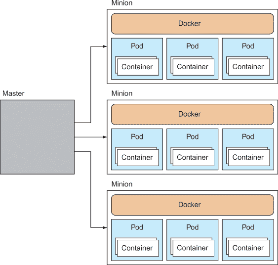

Kubernetes 采用主从架构。主节点负责接收有关在集群上运行什么的命令，并编排其资源。每个从节点上都安装了 Docker，以及一个 *kubelet* 服务，该服务管理每个节点上运行的 pods（容器组）。集群的信息存储在 etcd 中，这是一个分布式键/值数据存储（见技术 74），这也是集群的真相来源。


##### 提示

我们将在本技术的后面再次讨论这个问题，所以现在不必过于担心，但一个 *pod* 是一组相关的容器。这个概念的存在是为了便于管理和维护 Docker 容器。


Kubernetes 的最终目标是使大规模运行容器变得简单，只需声明您想要的内容，让 Kubernetes 确保集群满足您的需求。在这个技术中，您将看到如何通过运行一个命令将一个简单的服务扩展到指定的大小。


##### 注意

Kubernetes 最初是由 Google 开发的，作为一种在规模上管理容器的方法。Google 已经在规模上运行容器超过十年，当 Docker 变得流行时，它决定开发这个容器编排系统。Kubernetes 建立在 Google 丰富经验的基础上。Kubernetes 也被称为“K8s”。


Kubernetes 的安装、设置和功能的全面介绍是一个大且快速变化的话题，超出了本书的范围（无疑也将很快成为一本自己的书）。在这里，我们将专注于 Kubernetes 的核心概念，并设置一个简单的服务，以便您可以了解它。

**安装 Kubernetes**

你可以直接在主机上通过 Minikube 安装 Kubernetes，这将为你提供一个单节点集群，或者使用 Vagrant 安装一个由虚拟机管理的多节点集群。在这个技术中，我们将关注第一种选项——后一种选项最好通过研究来识别 Kubernetes 最新版本的正确选项。

在本地开始使用 Kubernetes 的推荐方法是按照 Minikube 的官方文档在[`kubernetes.io/docs/tasks/tools/install-minikube/`](https://kubernetes.io/docs/tasks/tools/install-minikube/)上安装一个单节点集群。

Minikube 是 Kubernetes 项目中的一个专用工具，旨在简化本地开发过程，但它目前有些受限。如果你想挑战自己更多，我们建议搜索设置使用 Vagrant 的多节点 Kubernetes 集群的指南——这个过程会随着 Kubernetes 版本的更新而变化，所以我们这里不会提供具体的建议（尽管，在撰写本文时，我们发现[`github.com/Yolean/kubeadm-vagrant`](https://github.com/Yolean/kubeadm-vagrant)是一个合理的起点）。

在你安装了 Kubernetes 之后，你可以从这里开始。以下输出将基于一个多节点集群。我们将首先创建一个单个容器，并使用 Kubernetes 将其扩展。

**单个容器的扩展**

用于管理 Kubernetes 的命令是`kubectl`。在这种情况下，你将使用`run`子命令在 pod 内运行指定的镜像作为容器。

```
$ kubectl run todo --image=dockerinpractice/todo             *1*
 $ kubectl get pods | egrep "(POD|todo)"                     *2*
 POD          IP  CONTAINER(S)  IMAGE(S)  HOST         >
LABELS              STATUS    CREATED          MESSAGE
todo-hmj8e                               10.245.1.3/  >      *3*
 run=todo  Pending   About a minute                          *4*
```

+   ***1*** **“todo”是结果 pod 的名称，要启动的镜像通过“--image”标志指定；这里我们使用的是来自第一章的 todo 镜像。**

+   ***2*** **“get pods”子命令到 kubectl 列出所有 pod。我们只对“todo”感兴趣，所以我们 grep 那些和标题。**

+   ***3*** **“todo-hmj8e”是 pod 名称。**

+   ***4*** **标签是与 pod 关联的 name=value 对，例如这里的“run”标签。pod 的状态是“挂起”，这意味着 Kubernetes 正在准备运行它，很可能是由于它正在从 Docker Hub 下载镜像。**

Kubernetes 通过从`run`命令（在先前的例子中是`todo`）中获取名称，添加一个连字符，并添加一个随机字符串来选择 pod 名称。这确保了它不会与其他 pod 名称冲突。

在等待几分钟下载 todo 镜像后，你最终会看到其状态已变为“运行”：

```
$ kubectl get pods | egrep "(POD|todo)"
POD         IP          CONTAINER(S)   IMAGE(S)               >
HOST                   LABELS              STATUS    CREATED         MESSAGE
todo-hmj8e  10.246.1.3                                        >
10.245.1.3/10.245.1.3  run=todo  Running   4 minutes
                        todo           dockerinpractice/todo  >
                                           Running   About a minute
```

这次 IP、CONTAINER(S)和 IMAGE(S)列都被填充了。IP 列给出了 pod 的地址（在这种情况下是`10.246.1.3`），容器列中每行对应 pod 中的一个容器（在这种情况下我们只有一个，`todo`）。

你可以通过直接点击 IP 地址和端口来测试容器（todo）确实已经启动并运行，并正在提供服务：

```
$ wget -qO- 10.246.1.3:8000
<html manifest="/todo.appcache">
[...]
```

到目前为止，我们还没有看到直接运行 Docker 容器时的太多区别。为了体验 Kubernetes，您可以通过运行`resize`命令来扩展此服务：

```
$ kubectl resize --replicas=3 replicationController todo
resized
```

此命令告诉 Kubernetes，您希望 todo 副本控制器确保集群中运行着三个 todo 应用的实例。


##### 提示

一个副本控制器是 Kubernetes 服务，确保集群中运行着正确数量的 pod。


您可以使用`kubectl get pods`命令检查 todo 应用的额外实例是否已启动：

```
$ kubectl get pods | egrep "(POD|todo)"
POD         IP           CONTAINER(S)   IMAGE(S)                >
HOST                    LABELS              STATUS    CREATED         MESSAGE
todo-2ip3n  10.246.2.2                                          >
10.245.1.4/10.245.1.4   run=todo  Running   10 minutes
                         todo           dockerinpractice/todo   >
                                            Running   8 minutes
todo-4os5b  10.246.1.3                                          >
10.245.1.3/10.245.1.3   run=todo  Running   2 minutes
                         todo           dockerinpractice/todo   >
                                            Running   48 seconds
todo-cuggp  10.246.2.3                                          >
10.245.1.4/10.245.1.4   run=todo  Running   2 minutes
                         todo           dockerinpractice/todo   >
                                            Running   2 minutes
```

Kubernetes 已经采用了`resize`指令和 todo 副本控制器，并确保启动了正确数量的 pod。注意，它在一个主机（10.245.1.4）上放置了两个，在另一个（10.245.1.3）上放置了一个。这是因为 Kubernetes 的默认调度器默认情况下有一个算法，它会将 pod 分散到各个节点上。


##### 提示

调度器是一种软件，它决定工作项应该在何时何地运行。例如，Linux 内核有一个调度器，它决定下一个应该运行的任务。调度器从极其简单到极其复杂不等。


您已经开始看到 Kubernetes 如何使跨多个主机管理容器变得更加容易。接下来，我们将深入探讨 Kubernetes 的核心概念——pod。

**使用 pod**

一个*pod*是一组设计成以某种方式协同工作并共享资源的容器。

每个 pod 都有自己的 IP 地址，并共享相同的卷和网络端口范围。因为 pod 的容器共享 localhost，所以容器可以依赖不同服务在部署的任何地方都是可用和可见的。

图 12.2 使用两个共享卷的容器说明了这一点。在该图中，容器 1 可能是一个读取共享卷中数据文件的 Web 服务器，而共享卷则由容器 2 更新。因此，这两个容器都是无状态的；状态存储在共享卷中。

##### 图 12.2\. 一个包含两个容器的 pod

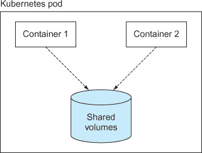

这种分离责任的设计通过允许您分别管理服务的每个部分，从而促进了微服务方法。您可以在不关心其他容器的情况下升级 pod 中的一个容器。

以下 pod 规范定义了一个复杂的 pod，其中一个容器（`simplewriter`）每 5 秒向文件写入随机数据，另一个容器从同一文件中读取。文件通过卷（`pod-disk`）共享。

##### 列表 12.1\. complexpod.json

```
{
  "id": "complexpod",                                     *1*
   "kind": "Pod",                                         *2*
   "apiVersion": "v1beta1",                               *3*
   "desiredState": {                                      *4*
     "manifest": {                                        *4*
       "version": "v1beta1",                              *3*
       "id": "complexpod",                                *5*
       "containers": [{                                   *6*
         "name": "simplereader",                          *7*
         "image": "dockerinpractice/simplereader",        *7*
         "volumeMounts": [{                               *8*
           "mountPath": "/data",                          *9*
           "name": "pod-disk"                             *10*
         }]
      },{
        "name": "simplewriter",                           *7*
         "image": "dockerinpractice/simplewriter",        *7*
         "volumeMounts": [{                               *11*
           "mountPath": "/data",                          *12*
           "name": "pod-disk"                             *13*
         }]
      }],
      "volumes": [{                                       *14*
         "name": "pod-disk",                              *15*
         "emptydir": {}                                   *16*
       }]
    }
  }
}
```

+   ***1*** **为实体赋予名称**

+   ***2*** **指定此对象的类型**

+   ***3*** **指定 JSON 针对的 Kubernetes 版本**

+   ***4*** **pod 规范的核心在于“desiredState”和“manifest”属性。**

+   ***5*** **为实体赋予名称**

+   ***6*** **pod 中容器的详细信息存储在这个 JSON 数组中**

+   ***7*** **每个容器都有一个用于参考的名称，Docker 镜像在“image”属性中指定。**

+   ***8*** **每个容器都指定了卷挂载点。**

+   ***9*** **挂载路径是挂载在容器文件系统上的卷的路径。这可以为每个容器设置不同的位置。**

+   ***10*** **卷挂载名称指的是 pod 清单中“volumes”定义中的名称。**

+   ***11*** **每个容器都指定了卷挂载点。**

+   ***12*** **挂载路径是挂载在容器文件系统上的卷的路径。这可以为每个容器设置不同的位置。**

+   ***13*** **卷挂载名称指的是 pod 清单中“volumes”定义中的名称。**

+   ***14*** **“volumes”属性定义了为此 Pod 创建的卷。**

+   ***15*** **卷的名称在先前的“volumeMounts”条目中引用。**

+   ***16*** **一个与 Pod 生命周期共享的临时目录**

要加载此 Pod 规范，创建一个包含前面列表的文件，并运行此命令：

```
$ kubectl create -f complexpod.json
pods/complexpod
```

等待一分钟以下载镜像后，您可以通过运行`kubectl log`并指定感兴趣的 Pod 和容器来查看容器的日志输出。

```
$ kubectl log complexpod simplereader
2015-08-04T21:03:36.535014550Z '? U
[2015-08-04T21:03:41.537370907Z] h(³eSk4y
[2015-08-04T21:03:41.537370907Z] CM(@
[2015-08-04T21:03:46.542871125Z] qm>5
[2015-08-04T21:03:46.542871125Z] {Vv_
[2015-08-04T21:03:51.552111956Z] KH+74    f
[2015-08-04T21:03:56.556372427Z] j?p+!\
```

**讨论**

我们在这里只是触及了 Kubernetes 功能和潜力的表面，但这应该让您对它能做什么以及它如何简化 Docker 容器的编排有一个概念。

下一个技术将直接利用 Kubernetes 的一些更多功能。Kubernetes 还作为 OpenShift 背后的编排引擎在技术 90 和 99 中使用。

|  |

**从 Pod 内部访问 Kubernetes API**

通常，Pod 可以完全独立于彼此运行，甚至不知道它们是作为 Kubernetes 集群的一部分运行的。但 Kubernetes 确实提供了一个丰富的 API，并且允许容器访问这个 API，这为自我检查和自适应行为打开了大门，同时也使得容器能够自行管理 Kubernetes 集群。

**问题**

您想从 Pod 内部访问 Kubernetes API。

**解决方案**

使用`curl`从 Pod 中的容器内部访问 Kubernetes API，使用对容器可用的授权信息。

这是本书中较短的技巧之一，但它包含了很多内容。这也是为什么它是一个有用的技巧来研究。在其它方面，我们将涵盖

+   `kubectl`命令

+   启动 Kubernetes Pod

+   访问 Kubernetes Pod

+   Kubernetes 的反模式

+   持久令牌

+   Kubernetes 机密

+   Kubernetes 的“向下 API”

**没有 Kubernetes 集群？**

如果你没有访问 Kubernetes 集群的权限，你有几种选择。许多云服务提供商提供按需付费的 Kubernetes 集群。然而，为了减少依赖，我们推荐使用 Minikube（在上一技术中提到），它不需要信用卡。

关于如何安装 Minikube 的信息，请参阅[`kubernetes.io/docs/tasks/tools/install-minikube/`](https://kubernetes.io/docs/tasks/tools/install-minikube/)文档。

**创建 pod**

首先，你将使用 `kubectl` 命令在新的 `ubuntu` pod 内部创建一个容器，然后你将在命令行中访问该容器内的 shell。（`kubectl run` 目前在 pod 和容器之间强制执行 1-1 的关系，尽管在一般情况下 pod 的灵活性更高。）

##### 列表 12.2\. 创建和设置容器

```
$ kubectl run -it ubuntu --image=ubuntu:16.04 --restart=Never    *1*
 If you don't see a command prompt, try pressing enter.          *2*
 root@ubuntu:/# apt-get update -y && apt-get install -y curl     *3*
 [...]
root@ubuntu:/                                                    *4*
```

+   ***1*** **使用 -ti 标志的 kubectl 命令，将 pod 命名为“ubuntu”，使用现在熟悉的 ubuntu:16.04 镜像，并告诉 Kubernetes 一旦 pod/container 退出不要重启**

+   ***2*** **kubectl 有用地向你指出，除非你按下 Enter 键，否则你的终端可能不会显示提示。**

+   ***3*** **这是按下 Enter 键时在容器内看到的提示，我们正在更新容器的包系统并安装 curl。**

+   ***4*** **安装完成后，将返回提示。**

你现在处于 `kubectl` 命令创建的容器中，并确保 curl 已安装。

| |
| --- |

##### 警告

从 shell 访问和修改 pod 被视为 Kubernetes 的反模式。我们在这里使用它来演示 pod 内部可以做到什么，而不是 pod 应该如何使用。

| |
| --- |

##### 列表 12.3\. 从 pod 访问 Kubernetes API

```
root@ubuntu:/# $ curl -k -X GET \                                           *1*
   -H "Authorization: Bearer \                                              *2*
   $(cat /var/run/secrets/kubernetes.io/serviceaccount/token)" <3> \
  https://${KUBERNETES_PORT_443_TCP_ADDR}:${KUBERNETES_SERVICE_PORT_HTTPS}  *3*
 {
  "paths": [                                                                *4*
     "/api",
    "/api/v1",
    "/apis",
    "/apis/apps",
    "/apis/apps/v1beta1",
    "/apis/authentication.k8s.io",
    "/apis/authentication.k8s.io/v1",
    "/apis/authentication.k8s.io/v1beta1",
    "/apis/authorization.k8s.io",
    "/apis/authorization.k8s.io/v1",
    "/apis/authorization.k8s.io/v1beta1",
    "/apis/autoscaling",
    "/apis/autoscaling/v1",
    "/apis/autoscaling/v2alpha1",
    "/apis/batch",
    "/apis/batch/v1",
    "/apis/batch/v2alpha1",
    "/apis/certificates.k8s.io",
    "/apis/certificates.k8s.io/v1beta1",
    "/apis/extensions",
    "/apis/extensions/v1beta1",
    "/apis/policy",
    "/apis/policy/v1beta1",
    "/apis/rbac.authorization.k8s.io",
    "/apis/rbac.authorization.k8s.io/v1alpha1",
    "/apis/rbac.authorization.k8s.io/v1beta1",
    "/apis/settings.k8s.io",
    "/apis/settings.k8s.io/v1alpha1",
    "/apis/storage.k8s.io",
    "/apis/storage.k8s.io/v1",
    "/apis/storage.k8s.io/v1beta1",
    "/healthz",
    "/healthz/ping",
    "/healthz/poststarthook/bootstrap-controller",
    "/healthz/poststarthook/ca-registration",
    "/healthz/poststarthook/extensions/third-party-resources",
    "/logs",
    "/metrics",
    "/swaggerapi/",
    "/ui/",
    "/version"
  ]
}
root@ubuntu:/# curl -k -X GET -H "Authorization: Bearer $(cat              *5*
 /var/run/secrets/kubernetes.io/serviceaccount/token)"                  *5*
 https://${KUBERNETES_PORT_443_TCP_ADDR}:                               *5*
 ${KUBERNETES_SERVICE_ORT_HTTPS}/version                                *5*
 {
  "major": "1",                                                            *6*
   "minor": "6",
  "gitVersion": "v1.6.4",
  "gitCommit": "d6f433224538d4f9ca2f7ae19b252e6fcb66a3ae",
  "gitTreeState": "dirty",
  "buildDate": "2017-06-22T04:31:09Z",
  "goVersion": "go1.7.5",
  "compiler": "gc",
  "platform": "linux/amd64"
}
```

+   ***1*** **使用 curl 命令访问 Kubernetes API。-k 标志允许 curl 在客户端未部署证书的情况下工作，而与 API 通信所使用的 HTTP 方法由 -X 标志指定为 GET。**

+   ***2*** **-H 标志向请求添加一个 HTTP 头部。这是一个将在稍后讨论的认证令牌。**

+   ***3*** **要联系的网络地址是由 pod 内可用的环境变量构建的。**

+   ***4*** **API 的默认响应是列出它提供的可消费路径。**

+   ***5*** **这次请求是针对 /version 路径的。**

+   ***6*** **对 /version 请求的响应是指定正在运行的 Kubernetes 版本。**

前面的列表涵盖了大量的新内容，但我们希望它能让你对在 Kubernetes pod 中动态执行的操作有一个大致的了解，而不需要任何设置。

从这个列表中可以得出的关键点是，信息被提供给 pod 内的用户，允许 pod 与 Kubernetes API 建立联系。这些信息项统称为“向下 API”。目前，向下 API 包括两类数据：环境变量和暴露给 pod 的文件。

在前面的例子中，使用文件向 Kubernetes API 提供认证令牌。这个令牌在文件 /var/run/secrets/kubernetes.io/serviceaccount/token 中可用。在列表 12.3 中，这个文件通过`cat`命令运行，`cat`命令的输出作为`Authorization:` HTTP 头的一部分提供。此头指定使用的授权类型为`Bearer`，携带令牌是`cat`命令的输出，因此`curl`的`-H`参数如下：

```
-H "Authorization: Bearer
$(cat /var/run/secrets/kubernetes.io/serviceaccount/token)"
```

| |
| --- |

##### 注意

*Bearer tokens*是一种认证方法，它只需要提供一个指定的令牌——不需要提供更多的身份信息（如用户名/密码）。*Bearer shares*基于类似的原则，持有股份的人有权出售它们。现金也是同样的方式——实际上，在英国现金中，钞票上有“我承诺按需支付持票人...”的短语。

| |
| --- |

向下公开的 API 项是一种 Kubernetes“秘密”。任何秘密都可以使用 Kubernetes API 创建并通过 pod 中的文件公开。这种机制允许将秘密与 Docker 镜像和 Kubernetes pod 或部署配置分离，这意味着权限可以独立于更开放的项目进行管理。

**讨论**

值得注意的是这种技术，因为它涵盖了大量的内容。关键是要掌握的是，Kubernetes pods 拥有可供它们使用的信息，允许它们与 Kubernetes API 交互。这允许应用程序在 Kubernetes 中运行，监控并针对集群周围的活动进行操作。例如，你可能有一个基础设施 pod，它监视 API 以查找新出现的 pods，调查它们的活动，并将这些数据记录在其他地方。

虽然基于角色的访问控制（RBAC）不在此书的范围之内，但值得提一下，这会对安全性产生影响，因为你不希望集群中的任何用户都能拥有这种级别的访问权限。因此，API 的部分部分将需要除了携带令牌之外的东西来获取访问权限。

这些与安全相关的考虑使得这项技术与 Kubernetes 和安全各占一半。无论如何，这对于任何打算“真正”使用 Kubernetes 的人来说都是一个重要的技术，可以帮助他们了解 API 的工作原理以及它可能被滥用的潜在方式。

| |
| --- |
| |

**使用 OpenShift 在本地运行 AWS API**

在本地开发中，一个巨大的挑战是测试应用程序与其他服务的兼容性。如果服务可以被放入容器中，Docker 可以提供帮助，但这仍然没有解决外部第三方服务的大范围问题。

一个常见的解决方案是拥有测试 API 实例，但这些通常提供虚假的响应——如果应用程序围绕一个服务构建，则无法进行更完整的测试。例如，想象一下您想使用 AWS S3 作为应用程序的上传位置，然后处理上传——测试这一点将花费金钱。

**问题**

您希望在本地上有 AWS 类似的 API 可供开发使用。

**解决方案**

设置 LocalStack 并使用可用的 AWS 服务等效项。

在本教程中，您将使用 Minishift 设置一个 OpenShift 系统，然后在上面运行 LocalStack 的一个 Pod。OpenShift 是围绕 Kubernetes 的一个由 RedHat 赞助的包装器，它提供了更适合企业级 Kubernetes 生产部署的额外功能。

在本技术中，我们将介绍

+   在 OpenShift 中创建路由

+   安全上下文约束

+   OpenShift 和 Kubernetes 之间的差异

+   使用公共 Docker 镜像测试 AWS 服务


##### 注意

要遵循此技术，您需要安装 Minishift。Minishift 类似于您在技术 89 中看到的 Minikube。区别在于它包含 OpenShift 的安装（在技术 99 中全面介绍）。


**LocalStack**

LocalStack 是一个项目，旨在为您提供尽可能完整的 AWS API 集，以便在没有成本的情况下进行开发。这对于测试或在运行真正的 AWS 之前尝试代码来说非常棒，可能避免浪费时间和金钱。

LocalStack 在您的本地机器上启动以下核心云 API：

+   API 网关在 http://localhost:4567

+   Kinesis 在 http://localhost:4568

+   DynamoDB 在 http://localhost:4569

+   DynamoDB Streams 在 http://localhost:4570

+   Elasticsearch 在 http://localhost:4571

+   S3 在 http://localhost:4572

+   Firehose 在 http://localhost:4573

+   Lambda 在 http://localhost:4574

+   SNS 在 http://localhost:4575

+   SQS 在 http://localhost:4576

+   Redshift 在 http://localhost:4577

+   ES（Elasticsearch Service）在 http://localhost:4578

+   SES 在 http://localhost:4579

+   Route53 在 http://localhost:4580

+   CloudFormation 在 http://localhost:4581

+   CloudWatch 在 http://localhost:4582

LocalStack 支持在 Docker 容器中运行，或直接在机器上运行。它基于 Moto 构建，而 Moto 又基于 Boto 构建，Boto 是一个 Python AWS SDK 的模拟框架。

在 OpenShift 集群中运行可以让你运行许多这些 AWS API 环境。然后，你可以为每组服务创建不同的端点，并将它们彼此隔离。此外，你不必太担心资源使用，因为集群调度器会处理这个问题。但是 LocalStack 不是直接运行的，所以我们将指导您完成使其工作所需的所有步骤。

**确保 Minishift 已设置**

在这个阶段，我们假设你已经设置了 Minishift ——你应该查看官方文档以了解如何开始，请参阅[`docs.openshift.org/latest/minishift/getting-started/index.html`](https://docs.openshift.org/latest/minishift/getting-started/index.html)。

##### 列表 12.4\. 检查 Minishift 是否设置正确

```
$ eval $(minishift oc-env)
$ oc get all
No resources found.
```

**更改默认安全上下文约束**

安全上下文约束（SCCs）是 OpenShift 的一个概念，它允许对 Docker 容器的权限进行更细粒度的控制。它们控制 SELinux 上下文（参见技术 100），可以从运行中的容器中删除能力（参见技术 93），可以确定 pod 可以以哪个用户运行，等等。

要使此运行，你需要更改默认的 `restricted` SCC。你也可以创建一个单独的 SCC 并将其应用于特定项目，但你可以自己尝试。

要更改 `restricted` SCC，你需要成为集群管理员：

```
$ oc login -u system:admin
```

然后，你需要使用以下命令编辑受限 SCC：

```
$ oc edit scc restricted
```

你将看到 `restricted` SCC 的定义。

在这个阶段，你需要做两件事：

+   允许容器以任何用户（在这种情况下为 `root`）运行

+   防止 SCC 限制你的 setuid 和 setgid 能力

**允许 RunAsAny**

LocalStack 容器默认以 root 用户运行，但出于安全原因，OpenShift 默认不允许容器以 root 用户运行。相反，它会选择一个非常高的范围内的 UID，并以该 UID 运行。请注意，UID 是数字，与映射到 UID 的字符串用户名不同。

为了简化问题，并允许 LocalStack 容器以 root 用户运行，更改以下行，

```
runAsUser:
 type: MustRunAsRange
```

读取如下：

```
runAsUser:
 type: RunAsAny
```

这允许容器以任何用户身份运行，而不是在 UID 范围内。

**允许 SETUID 和 SETGID 能力**

当 LocalStack 启动时，它需要成为另一个用户来启动 ElastiCache。ElastiCache 服务不会以 root 用户启动。

为了解决这个问题，LocalStack 将启动命令 `su` 到容器中的 LocalStack 用户。由于 `restricted` SCC 明确禁止更改用户或组 ID 的操作，你需要移除这些限制。通过删除以下行来完成此操作：

```
- SETUID
- SETGID
```

**保存文件**

完成这两个步骤后，保存文件。

记录主机信息。如果你运行此命令，

```
$ minishift console --machine-readable | grep HOST | sed 's/^HOST=\(.*\)/\1/'
```

你将获得 Minishift 实例从你的机器可访问的主机。注意这个主机，因为你稍后需要替换它。

**部署 pod**

部署 LocalStack 与运行以下命令一样简单：

```
$ oc new-app localstack/localstack --name="localstack"
```


##### 备注

如果你想要深入了解 localstack 镜像，它可在[`github.com/localstack/localstack`](https://github.com/localstack/localstack)找到。


这将使用 localstack/localstack 镜像，并为您创建围绕它的 OpenShift 应用程序，设置内部服务（基于 LocalStack Docker 镜像的 Dockerfile 中公开的端口），在 Pod 中运行容器，并执行各种其他管理任务。

**创建路由**

如果您想从外部访问服务，您需要创建 OpenShift 路由，这些路由为 OpenShift 网络内的服务创建外部地址。例如，要为 SQS 服务创建路由，创建一个如下所示的文件，称为 route.yaml：

##### 列表 12.5\. route.yaml

```
apiVersion: v1                        *1*
 kind: Route                          *2*
 metadata:                            *3*
   name: sqs                          *4*
 spec:                                *5*
   host: sqs-test.HOST.nip.io         *6*
   port:                              *7*
     targetPort: 4576-tcp             *7*
   to:                                *8*
     kind: Service                    *9*
     name: localstack                 *9*
```

+   ***1*** **yaml 文件顶部指定了 Kubernetes API 版本。**

+   ***2*** **正在创建的对象类型被指定为“Route”。**

+   ***3*** **元数据部分包含有关路由的信息，而不是路由本身的规范。**

+   ***4*** **在这里为路由指定了一个名称。**

+   ***5*** **规范部分指定了路由的详细信息。**

+   ***6*** **主机是路由将被映射到的 URL，即客户端击中的 URL。**

+   ***7*** **端口部分标识了路由将前往“to”部分中指定的服务的哪个端口**

+   ***8*** **“to”部分标识了请求将被路由到的位置。**

+   ***9*** **在这种情况下，它基于 LocalStack 服务。**

通过运行此命令创建路由，

```
$ oc create -f route.yaml
```

这将根据您刚刚创建的 yaml 文件创建路由。然后，对于您想要设置的每个服务，都会重复此过程。

然后运行 `oc get all` 以查看您在 OpenShift 项目中创建的内容：

```
$ oc get all                                                                 *1*
 NAME DOCKER REPO TAGS UPDATED                                               *2*
 is/localstack 172.30.1.1:5000/myproject/localstack latest 15 hours ago      *2*
 NAME REVISION DESIRED CURRENT TRIGGERED BY                                  *3*
 dc/localstack 1 1 1 config,image(localstack:latest)                         *3*
 NAME DESIRED CURRENT READY AGE                                              *4*
 rc/localstack-1 1 1 1 15
                         *4*
 NAME HOST/PORT PATH SERVICES PORT TERMINATION WILDCARD                      *5*
 routes/sqs sqs-test.192.168.64.2.nip.io localstack 4576-tcp None
 NAME CLUSTER-IP EXTERNAL-IP PORT(S) AGE                                     *6*
 svc/localstack 172.30.187.65  4567/TCP,4568/TCP,4569/TCP,4570/TCP,4571/TCP  *6*
4572/TCP,4573/TCP,4574/TCP,4575/TCP,4576/TCP,4577/TCP,4578/TCP,           *6*
4579/TCP,4580/TCP,4581/TCP,4582/TCP,8080/TCP 15h                          *6*
 NAME READY STATUS RESTARTS AGE                                              *7*
 po/localstack-1-hnvpw 1/1 Running 0 15h                                     *7*
```

+   ***1*** **返回您 OpenShift 项目中最重要的项目**

+   ***2*** **首先列出的是图像流。这些对象跟踪本地或远程图像的状态。**

+   ***3*** **接下来，列出部署配置，这些配置指定了 Pod 应该如何部署到集群中。**

+   ***4*** **第三类是复制配置，它指定了运行 Pod 的复制特性。**

+   ***5*** **第四类是您项目中设置的路线。**

+   ***6*** **接下来列出的是服务。在这里，您可以看到 Dockerfile 中公开的端口在服务中公开。**

+   ***7*** **最后，列出项目中的 Pod。**

虽然技术上不是您项目中可用的所有对象，但`oc get all`命令显示了运行应用程序最重要的那些对象。

类似于 SQS 的 AWS 服务现在可以通过 URL 端点访问，以测试您的代码。

**访问服务**

您现在可以从主机访问服务。以下是一个创建 SQS 流的示例：

```
$ aws --endpoint-url=http://kinesis-test.192.168.64.2.nip.io kinesis
 list-streams                                                        *1*
 {                                                                      *2*
  "StreamNames": []                                                     *2*
 }                                                                      *2*
 $ aws --endpoint-url=http://kinesis-test.192.168.64.2.nip.io kinesis
 create-stream --stream-name teststream --shard-count 2              *3*
 $ aws --endpoint-url=http://kinesis-test.192.168.64.2.nip.io kinesis
 list-streams                                                        *4*
 {                                                                      *5*
  "StreamNames": [                                                      *5*
  "teststream"                                                          *5*
  ]                                                                     *5*
 }                                                                      *5*
```

+   ***1*** **aws 客户端应用程序用于访问新创建的端点，并要求 kinesis 列出其流。**

+   ***2*** **JSON 输出指示不存在流。**

+   ***3*** **再次调用 aws 客户端以创建一个名为“teststream”的 SQS 流，其分片数为 2。**

+   ***4*** **再次，您请求 kinesis 流的列表。**

+   ***5*** **JSON 输出指示存在一个名为“teststream”的流。**


##### 注意

`aws` 客户端是您需要安装以使此功能正常工作的组件。或者，您可以直接 curl API 端点，但我们不建议这样做。还假设您已经运行了 `aws configure` 并指定了您的 AWS 密钥和默认区域。实际指定的值对 LocalStack 没有关系，因为它不进行身份验证。


在这里，我们只介绍了一种服务类型，但这种技术可以轻松扩展到本技术开头列出的其他服务。

**讨论**

这种技术让您感受到了 OpenShift（以及 OpenShift 所基于的 Kubernetes）的力量。以一个可用的端点和所有内部连接都得到妥善处理的方式启动一个有用的应用程序，在许多方面是 Docker 提供的可移植性承诺的实现，扩展到了数据中心层面。

例如，这可以进一步发展，可以在同一个 OpenShift 集群上启动多个 LocalStack 实例。对 AWS API 的测试可以在不必要增加更多资源的情况下并行进行（当然，这取决于您的 OpenShift 集群大小和测试需求）。因为这些都是代码，持续集成可以设置成在每次提交 AWS 代码库时动态启动和关闭 LocalStack 实例以进行通信。

除了指出 Kubernetes 的各个方面外，这个特定的技术还展示了像 OpenShift 这样的产品是如何在 Kubernetes 上构建，以扩展其功能。例如，安全上下文约束是 OpenShift 的概念（尽管安全上下文也在 Kubernetes 中），而“路由”是 OpenShift 在 Kubernetes 上创建的一个概念，最终被直接用于 Kubernetes 的实现。随着时间的推移，为 OpenShift 开发的功能已经上传到 Kubernetes，并成为了其提供的一部分。

您将在技术 99 中再次看到 OpenShift，我们将探讨它如何作为一个平台，安全地让用户运行容器。

|  |

**在 Mesos 上构建框架**

当讨论众多编排可能性时，您可能会发现特别提到的一个替代 Kubernetes 的选项：Mesos。通常这后面会跟着一些晦涩难懂的说法，比如“Mesos 是一个框架的框架”和“Kubernetes 可以在 Mesos 上运行”。

我们遇到的最恰当的类比是将 Mesos 视为为您的数据中心提供内核。仅凭它本身，您无法做任何有用的事情——价值在于您将其与初始化系统和应用程序结合使用时。

对于一个低技术含量的解释，想象一下您面前有一只猴子坐在控制所有机器的面板前，它有权随意启动和停止应用程序。当然，您需要给猴子一个非常清晰的指令列表，说明在特定情况下应该做什么，何时启动应用程序等等。您可以自己完成所有这些，但这很耗时，而猴子又便宜。

Mesos 是那只猴子！

Mesos 对于具有高度动态和复杂基础设施的公司来说很理想，这些公司可能有过自行开发生产编排解决方案的经验。如果您不符合这些条件，您可能更适合使用现成的解决方案，而不是花费时间定制 Mesos。

**问题**

您有一系列规则用于控制应用程序和作业的启动，您希望在不手动在远程机器上启动它们并跟踪它们的状态的情况下强制执行这些规则。

**解决方案**

使用 Mesos，这是一个灵活且强大的工具，它提供了资源管理的抽象。

Mesos 是一个成熟的软件，用于在多台机器上提供资源管理的抽象。它已经由您所熟知的公司在生产环境中进行了实战测试，因此它稳定且可靠。


##### 注意

您需要 Docker 1.6.2 或更高版本，以便 Mesos 能够使用正确的 Docker API 版本。


图 12.3 展示了一个通用的生产 Mesos 设置。

##### 图 12.3\. 一个通用的生产 Mesos 设置

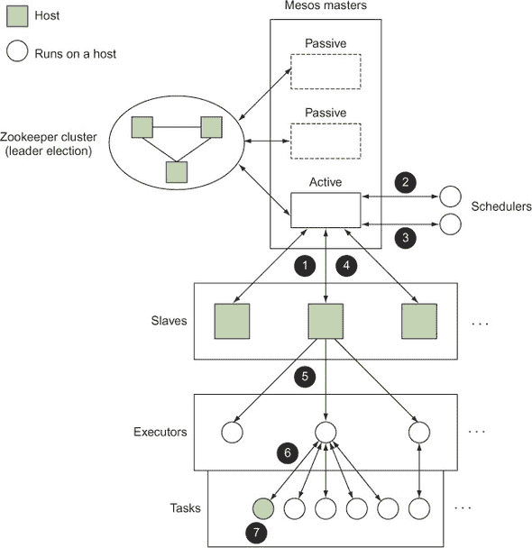

参考此图，您可以看到启动任务的基本 Mesos 生命周期如下：

+   ***1*****从节点在节点上运行，跟踪资源可用性并向主节点报告。**

+   ***2*****主节点从一个或多个从节点接收有关可用资源的信息，并向调度器提供资源。**

+   ***3*****调度器从主节点接收资源，决定在哪里运行任务，并将此信息反馈给主节点。**

+   ***4*****主节点将任务信息传递给适当的从节点。**

+   ***5*****每个从节点将任务信息传递给节点上的现有执行器或启动一个新的执行器。**

+   ***6*****执行器读取任务信息并在节点上启动任务。**

+   ***7*****任务运行。**

Mesos 项目提供了主节点和从节点，以及内置的 shell 执行器。您的任务是提供一个 *框架*（或 *应用程序*），它由一个调度器（在我们的猴子类比中的“指令列表”）和可选的自定义执行器组成。

许多第三方项目提供了可以集成到 Mesos 中的框架（我们将在下一技术中更详细地探讨一个），但为了更好地理解如何充分利用 Mesos 和 Docker 的功能，我们将构建一个仅包含调度器的框架。如果您有启动应用程序的高度复杂逻辑，这可能就是您的最终选择路线。


##### 注意

您不必在 Mesos 中使用 Docker，但由于本书的主题是关于这个，我们将使用它。由于 Mesos 非常灵活，因此我们不会深入探讨许多细节。我们还将在一个计算机上运行 Mesos，但我们会尽量使其尽可能真实，并指出您需要做什么才能投入使用。

| |
| --- |

我们尚未解释 Docker 在 Mesos 生命周期中的位置——这个谜题的最后一部分是 Mesos 提供了对 *containerizers* 的支持，允许您隔离您的执行器或任务（或两者）。Docker 不是唯一可以在这里使用的工具，但由于它非常流行，Mesos 为您提供了一些特定的 Docker 功能来帮助您开始。

我们的示例将仅对运行的任务进行容器化，因为我们使用的是默认执行器。如果您有一个仅运行语言环境的自定义执行器，其中每个任务都涉及动态加载和执行一些代码，您可能需要考虑对执行器进行容器化。作为一个示例用例，您可能有一个作为执行器的 JVM，它会在运行时加载和执行代码片段，从而避免为可能非常小的任务带来 JVM 启动开销。

图 12.4 展示了在我们的示例中创建新的 Docker 化任务时幕后将发生什么。

##### 图 12.4\. 单主机 Mesos 设置启动容器


不再拖延，让我们开始吧。首先您需要启动一个主节点：

##### 列表 12.6\. 启动主节点

```
$ docker run -d --name mesmaster redjack/mesos:0.21.0 mesos-master \
--work_dir=/opt
24e277601260dcc6df35dc20a32a81f0336ae49531c46c2c8db84fe99ac1da35
$ docker inspect -f '{{.NetworkSettings.IPAddress}}' mesmaster
172.17.0.2
$ docker logs -f mesmaster
I0312 01:43:59.182916   1 main.cpp:167] Build: 2014-11-22 05:29:57 by root
I0312 01:43:59.183073   1 main.cpp:169] Version: 0.21.0
I0312 01:43:59.183084   1 main.cpp:172] Git tag: 0.21.0
[...]
```

主节点启动时有些冗长，但你应该会发现它很快就会停止记录日志。请保持此终端打开，以便您可以看到启动其他容器时发生了什么。

| |
| --- |

##### 注意

通常，Mesos 设置将具有多个 Mesos 主节点（一个活动节点和几个备份节点），以及一个 Zookeeper 集群。在 Mesos 网站上的“Mesos 高可用性模式”页面（[`mesos.apache.org/documentation/latest/high-availability`](http://mesos.apache.org/documentation/latest/high-availability)）上有设置此内容的文档。您还需要公开端口 5050 以进行外部通信，并使用 work_dir 文件夹作为卷来保存持久信息。您还需要一个从属节点。不幸的是，这有点麻烦。Mesos 的一个定义特征是能够对任务强制资源限制，这要求从属节点能够自由地检查和管理进程。因此，运行从属节点的命令需要将许多外部系统细节暴露在容器内部。

| |
| --- |

##### 列表 12.7\. 启动从属节点

```
$ docker run -d --name messlave --pid=host \
  -v /var/run/docker.sock:/var/run/docker.sock -v /sys:/sys \
  redjack/mesos:0.21.0 mesos-slave \
  --master=172.17.0.2:5050 --executor_registration_timeout=5mins \
  --isolation=cgroups/cpu,cgroups/mem --containerizers=docker,mesos \
  --resources="ports(*):[8000-8100]"
1b88c414527f63e24241691a96e3e3251fbb24996f3bfba3ebba91d7a541a9f5
$ docker inspect -f '{{.NetworkSettings.IPAddress}}' messlave
172.17.0.3
$ docker logs -f messlave
I0312 01:46:43.341621 32398 main.cpp:142] Build: 2014-11-22 05:29:57 by root
I0312 01:46:43.341789 32398 main.cpp:144] Version: 0.21.0
I0312 01:46:43.341795 32398 main.cpp:147] Git tag: 0.21.0
[...]
I0312 01:46:43.554498 32429 slave.cpp:627] No credentials provided. >
Attempting to register without authentication
I0312 01:46:43.554633 32429 slave.cpp:638] Detecting new master
I0312 01:46:44.419646 32424 slave.cpp:756] Registered with master >
master@172.17.0.2:5050; given slave ID 20150312-014359-33558956-5050-1-S0
[...]
```

在这一点上，您也应该在 Mesos 主节点终端中看到一些活动，开始于几行像这样的内容：

```
I0312 01:46:44.332494     9 master.cpp:3068] Registering slave at >
slave(1)@172.17.0.3:5051 (8c6c63023050) with id >
20150312-014359-33558956-5050-1-S0
I0312 01:46:44.333772     8 registrar.cpp:445] Applied 1 operations in >
134310ns; attempting to update the 'registry'
```

这两个日志的输出显示您的从属节点已启动并连接到主节点。如果您没有看到这些，请停止并仔细检查您的主节点 IP 地址。当没有连接的从属节点来启动任务时，尝试调试框架为什么无法启动任务可能会很令人沮丧。

无论如何，命令中 列表 12.7 有很多内容。在 `run` 和 `redjack/mesos:0.21.0` 之间的所有参数都是 Docker 参数，它们主要包含向从机容器提供大量关于外部世界的信息。在 `mesos-slave` 之后的参数更有趣。首先，`master` 告诉你的从机在哪里可以找到你的主机（或你的 Zookeeper 集群）。接下来的三个参数，`executor _registration_timeout`、`isolation` 和 `containerizers`，都是针对 Mesos 设置的调整，当与 Docker 一起工作时应该始终应用。最后，但同样重要的是，你需要让 Mesos 从机知道哪些端口是可以分配作为资源的。默认情况下，Mesos 提供 31000–32000，但我们想要一个更低且更容易记住的。

现在简单的步骤已经完成，我们来到了设置 Mesos 的最后阶段——创建一个调度器。

幸运的是，我们有一个现成的示例框架供你使用。让我们试试看它做了什么，然后探索它是如何工作的。请保持你的两个 `docker logs -f` 命令在你的主容器和从容器上打开，这样你就可以看到通信是如何发生的。

以下命令将从 GitHub 获取示例框架的源代码库并启动它。

##### 列表 12.8\. 下载并启动示例框架

```
$ git clone https://github.com/docker-in-practice/mesos-nc.git
$ docker run -it --rm -v $(pwd)/mesos-nc:/opt redjack/mesos:0.21.0 bash
# apt-get update && apt-get install -y python
# cd /opt
# export PYTHONUSERBASE=/usr/local
# python myframework.py 172.17.0.2:5050
I0312 02:11:07.642227   182 sched.cpp:137] Version: 0.21.0
I0312 02:11:07.645598   176 sched.cpp:234] New master detected at >
master@172.17.0.2:5050
I0312 02:11:07.645800   176 sched.cpp:242] No credentials provided. >
Attempting to register without authentication
I0312 02:11:07.648449   176 sched.cpp:408] Framework registered with >
20150312-014359-33558956-5050-1-0000
Registered with framework ID 20150312-014359-33558956-5050-1-0000
Received offer 20150312-014359-33558956-5050-1-O0\. cpus: 4.0, mem: 6686.0, >
ports: 8000-8100
Creating task 0
Task 0 is in state TASK_RUNNING
[...]
Received offer 20150312-014359-33558956-5050-1-O5\. cpus: 3.5, mem: 6586.0, >
ports: 8005-8100
Creating task 5
Task 5 is in state TASK_RUNNING
Received offer 20150312-014359-33558956-5050-1-O6\. cpus: 3.4, mem: 6566.0, >
ports: 8006-8100
Declining offer
```

你会注意到我们已经将 Git 仓库挂载到 Mesos 镜像中。这是因为它包含了我们需要的所有 Mesos 库。不幸的是，如果不这样做，安装它们可能会有些痛苦。

我们的 `mesos-nc` 框架旨在在所有可用的主机上，从 8000 到 8005 的所有可用端口上运行 `echo 'hello <task id>' | nc -l <port>`。由于 netcat 的工作方式，这些“服务器”在你访问它们时就会终止，无论是通过 curl、Telnet、nc 还是你的浏览器。你可以通过在新终端中运行 `curl localhost:8003` 来验证这一点。它将返回预期的响应，并且你的 Mesos 日志将显示正在生成一个任务来替换已终止的任务。你还可以使用 `docker ps` 来跟踪正在运行的任务。

值得指出的是，Mesos 在这里跟踪分配的资源，并在任务终止时将其标记为可用。特别是，当你访问 `localhost:8003`（随时可以再次尝试）时，仔细看看 `Received offer` 行——它显示了两个端口范围（因为它们没有连接），包括刚刚释放的那个：

```
Received offer 20150312-014359-33558956-5050-1-O45\. cpus: 3.5, mem: 6586.0, >
ports: 8006-8100,8003-8003
```

| |
| --- |

##### 警告

Mesos 从机使用前缀“mesos-”命名它启动的所有容器，并且它假设类似的东西可以被从机自由管理。请小心你的容器命名，否则你可能会让 Mesos 从机杀死自己。

| |
| --- |

框架代码（myframework.py）注释良好，以防你感到好奇。我们将探讨一些高级设计。

```
class TestScheduler
(mesos.interface.Scheduler):
[...]
    def registered(self, driver, frameworkId, masterInfo):
[...]
    def statusUpdate(self, driver, update):
[...]
    def resourceOffers(self, driver, offers):
[...]
```

所有 Mesos 调度器都是基于基本 Mesos 调度器类的子类，并且它们实现了一系列方法，Mesos 会在适当的时候调用这些方法，以便你的框架能够对事件做出反应。尽管我们在前面的代码片段中实现了三个方法，但其中两个是可选的，并且为了演示目的添加了额外的日志记录。你必须实现的方法是`resourceOffers`——如果一个框架不知道何时可以启动任务，那么它就没有多少意义。你可以自由地添加任何额外的用于你自己的目的的方法，例如`init`和`_makeTask`，只要它们不与 Mesos 期望使用的方法冲突，所以请确保你阅读了文档([`mesos.apache.org/documentation/latest/app-framework-development-guide/`](http://mesos.apache.org/documentation/latest/app-framework-development-guide/))。

| |
| --- |

##### 小贴士

如果你最终编写了自己的框架，你可能需要查看一些方法和结构的相关文档。不幸的是，在撰写本文时，只有 Java 方法的文档被生成。寻找结构探索起点的读者可能希望从 Mesos 源代码中的 include/mesos/mesos.proto 文件开始。祝你好运！

| |
| --- |

让我们更详细地看看我们感兴趣的主要方法：`resourceOffers`。这是决定启动任务或拒绝 offer 的地方。图 12.5 显示了在 Mesos 调用我们的框架中的`resourceOffers`之后执行的流程（通常是因为某些资源已可供框架使用）。

##### 图 12.5\. 框架`resourceOffers`执行流程

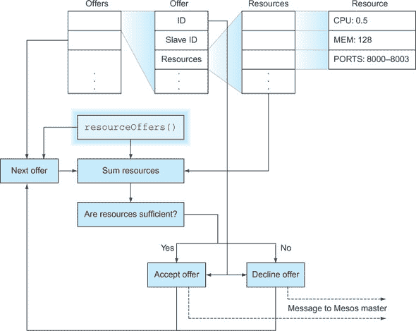

`resourceOffers` 接收一个包含多个 offer 的列表，其中每个 offer 对应一个 Mesos slave。offer 包含了在从节点上启动的任务可用的资源详情，典型的实现会使用这些信息来确定启动任务的最佳位置。启动任务会向 Mesos master 发送消息，然后 master 继续执行图 12.3 中概述的生命周期。

**讨论**

需要注意的是`resourceOffers`的灵活性——你的任务启动决策可以基于你选择的任何标准，从外部服务的健康检查到月亮的相位。这种灵活性可能是一个负担，因此存在预制的框架来移除一些低级细节并简化 Mesos 的使用。这些框架中的一个将在下一个技巧中介绍。

你可能想查阅 Roger Ignazio 的《Mesos in Action》（Manning，2016）以获取更多关于 Mesos 可以做什么的详细信息——我们在这里只是触及了表面，你看到了 Docker 如何轻松地嵌入其中。

| |
| --- |
| |

**使用 Marathon 微管理 Mesos**

到现在为止，你应该已经意识到，即使是对于一个非常简单的框架，你也需要考虑很多关于 Mesos 的事情。能够依赖应用程序被正确部署非常重要——框架中一个错误的后果可能从无法部署新应用程序到整个服务中断。

随着你规模的扩大，风险也在增加，除非你的团队习惯于编写可靠的动态部署代码，否则你可能想要考虑一个经过更多实战检验的方法——Mesos 本身非常稳定，但一个定制的内部框架可能不如你期望的那样可靠。

Marathon 适合没有内部部署工具经验的公司，但需要在一个相对动态的环境中部署容器时，需要一个支持良好且易于使用的解决方案。

**问题**

你需要一个可靠的方式来利用 Mesos 的力量，同时避免陷入编写自己框架的困境。

**解决方案**

使用 Marathon，这是 Mesos 之上的一层，提供了一个更简单的接口，让你更快地投入生产。

Marathon 是由 Mesosphere 为管理长期运行的应用程序而构建的 Apache Mesos 框架。营销材料将其描述为数据中心（其中 Mesos 是内核）的`init`或`upstart`守护进程。这不是一个不合理的类比。

Marathon 通过允许你启动一个包含 Mesos master、Mesos slave 以及 Marathon 本身的单个容器来简化入门过程。这对于演示很有用，但并不适合生产环境的 Marathon 部署。为了得到一个真实的 Marathon 设置，你需要一个 Mesos master 和 slave（来自之前的技术）以及一个 Zookeeper 实例（来自技术 84）。确保所有这些都在运行，然后我们将通过运行 Marathon 容器开始。

```
$ docker inspect -f '{{.NetworkSettings.IPAddress}}' mesmaster
172.17.0.2
$ docker inspect -f '{{.NetworkSettings.IPAddress}}' messlave
172.17.0.3
$ docker inspect -f '{{.NetworkSettings.IPAddress}}' zookeeper
172.17.0.4
$ docker pull mesosphere/marathon:v0.8.2
[...]
$ docker run -d -h $(hostname) --name marathon -p 8080:8080 \
mesosphere/marathon:v0.8.2 --master 172.17.0.2:5050 --local_port_min 8000 \
--local_port_max 8100 --zk zk://172.17.0.4:2181/marathon
accd6de46cfab65572539ccffa5c2303009be7ec7dbfb49e3ab8f447453f2b93
$ docker logs -f marathon
MESOS_NATIVE_JAVA_LIBRARY is not set. Searching in /usr/lib /usr/local/lib.
MESOS_NATIVE_LIBRARY, MESOS_NATIVE_JAVA_LIBRARY set to >
'/usr/lib/libmesos.so'
[2015-06-23 19:42:14,836] INFO Starting Marathon 0.8.2 >
(mesosphere.marathon.Main$:87)
[2015-06-23 19:42:16,270] INFO Connecting to Zookeeper... >
(mesosphere.marathon.Main$:37)
[...]
[2015-06-30 18:20:07,971] INFO started processing 1 offers, >
launching at most 1 tasks per offer and 1000 tasks in total
 (mesosphere.marathon.tasks.IterativeOfferMatcher$:124)
[2015-06-30 18:20:07,972] INFO Launched 0 tasks on 0 offers, >
declining 1 (mesosphere.marathon.tasks.IterativeOfferMatcher$:216)
```

就像 Mesos 本身一样，Marathon 相当健谈，但（也像 Mesos 一样）它停止得相当快。在这个阶段，它将进入你从编写自己的框架中熟悉的循环——考虑资源提供并决定如何处理它们。因为我们还没有启动任何东西，你应该看不到任何活动；这就是为什么在先前的日志中看到`declining 1`的原因。

Marathon 提供了一个看起来很不错的 Web 界面，这就是为什么我们在主机上暴露了 8080 端口——在你的浏览器中访问 http://localhost:8080 来打开它。

我们将直接进入 Marathon，因此让我们创建一个新的应用程序。为了澄清一些术语——在 Marathon 的世界里，“app”指的是一组具有完全相同定义的一个或多个任务。

点击右上角的“新建应用”按钮，将弹出一个对话框，您可以使用它来定义您想要启动的应用。我们将继续使用我们自己创建的框架的风格，将 ID 设置为“marathon-nc”，保留 CPU、内存和磁盘空间在默认值（以匹配我们对 mesos-nc 框架施加的资源限制），并将命令设置为`echo "hello $MESOS_TASK_ID" | nc -l $PORT0`（使用任务可用的环境变量——注意，这是数字零）。将端口字段设置为 8000，以指示您想要监听的位置。目前我们将跳过其他字段。点击创建。

您新定义的应用现在将列在 Web 界面上。状态将短暂显示为“部署中”，然后显示为“运行中”。您的应用现在已启动！

如果您点击“应用列表”中的“/marathon-nc”条目，您将看到您应用的唯一 ID。您可以从以下片段中获取完整的配置，并通过 curl 适当的端口上的 Mesos 从节点容器来验证它是否正在运行。确保您保存 REST API 返回的完整配置，因为它将在以后很有用——在以下示例中已保存到 app.json 中。

```
$ curl http://localhost:8080/v2/apps/marathon-nc/versions
{"versions":["2015-06-30T19:52:44.649Z"]}
$ curl -s \
http://localhost:8080/v2/apps/marathon-nc/versions/2015-06-30T19:52:44.649Z \
> app.json
$ cat app.json
{"id":"/marathon-nc", >
"cmd":"echo \"hello $MESOS_TASK_ID\" | nc -l $PORT0",[...]
$ curl http://172.17.0.3:8000
hello marathon-nc.f56f140e-19e9-11e5-a44d-0242ac110012
```

注意从`curl`应用输出的“hello”后面的文本——它应该与界面中的唯一 ID 匹配。但是检查要快——运行那个`curl`命令将使应用终止，Marathon 将重新启动它，并且 Web 界面中的唯一 ID 将改变。一旦您验证了所有这些，请继续点击“销毁应用”按钮以删除 marathon-nc。

这工作得很好，但你可能已经注意到，我们没有通过 Marathon 实现我们设定的目标——编排 Docker 容器。尽管我们的应用在容器内，但它是在 Mesos 从节点容器中启动的，而不是在自己的容器中。阅读 Marathon 文档揭示，在 Docker 容器内创建任务需要更多的配置（就像我们编写自己的框架时一样）。

幸运的是，我们之前启动的 Mesos 从节点已经具备所需的设置，所以我们只需要修改一些 Marathon 选项——特别是应用选项。通过使用之前保存的 Marathon API 响应（保存在 app.json 中），我们可以专注于添加启用 Docker 使用的 Marathon 设置。为了在这里进行操作，我们将使用方便的`jq`工具，尽管通过文本编辑器来做也同样简单。

```
$ JQ=https://github.com/stedolan/jq/releases/download/jq-1.3/jq-linux-x86_64
$ curl -Os $JQ && mv jq-linux-x86_64 jq && chmod +x jq
$ cat >container.json <<EOF
{
  "container": {
    "type": "DOCKER",
    "docker": {
      "image": "ubuntu:14.04.2",
      "network": "BRIDGE",
      "portMappings": [{"hostPort": 8000, "containerPort": 8000}]
    }
  }
}
$ # merge the app and container details
$ cat app.json container.json | ./jq -s add > newapp.json
```

我们现在可以将新的应用定义发送到 API，并看到 Marathon 启动它：

```
$ curl -X POST -H 'Content-Type: application/json; charset=utf-8' \
--data-binary @newapp.json http://localhost:8080/v2/apps
{"id":"/marathon-nc", >
"cmd":"echo \"hello $MESOS_TASK_ID\" | nc -l $PORT0",[...]
$ sleep 10
$ docker ps --since=marathon
CONTAINER ID  IMAGE         COMMAND              CREATED             >
STATUS             PORTS                   NAMES
284ced88246c  ubuntu:14.04  "\"/bin/sh -c 'echo  About a minute ago  >
Up About a minute  0.0.0.0:8000->8000/tcp  mesos- >
1da85151-59c0-4469-9c50-2bfc34f1a987
$ curl localhost:8000
hello mesos-nc.675b2dc9-1f88-11e5-bc4d-0242ac11000e
$ docker ps --since=marathon
CONTAINER ID  IMAGE         COMMAND              CREATED         >
STATUS                     PORTS                   NAMES
851279a9292f  ubuntu:14.04  "\"/bin/sh -c 'echo  44 seconds ago  >
Up 43 seconds              0.0.0.0:8000->8000/tcp  mesos- >
37d84e5e-3908-405b-aa04-9524b59ba4f6
284ced88246c  ubuntu:14.04  "\"/bin/sh -c 'echo  24 minutes ago  >
Exited (0) 45 seconds ago                          mesos-1da85151-59c0-
4469-9c50-2bfc34f1a987
```

与我们之前的技术中自定义的框架一样，Mesos 已经为我们启动了一个运行应用的 Docker 容器。运行`curl`命令将终止应用和容器，然后自动启动一个新的容器。

**讨论**

与之前的技术中的自定义框架和 Marathon 相比，存在一些显著的不同。例如，在自定义框架中，我们对接受资源出价有极其细粒度的控制，以至于我们可以挑选和选择要监听的各个端口。要在 Marathon 中做类似的事情，你需要对每个单独的从节点施加设置。

相比之下，Marathon 内置了许多功能，这些功能如果自己构建可能会出错，包括健康检查、事件通知系统和 REST API。这些都不是简单的事情来实现，使用 Marathon 可以让你有信心，你不是第一个尝试的人。至少，与定制框架相比，Marathon 的支持要容易得多，我们发现 Marathon 的文档比 Mesos 的文档更容易接近。

我们已经介绍了设置和使用 Marathon 的基础知识，但还有许多更多的事情要查看和执行。我们看到的更有趣的建议之一是使用 Marathon 启动其他 Mesos 框架，可能包括你自己的定制框架！我们鼓励你探索——Mesos 是一个高质量的编排工具，而 Marathon 在其之上提供了一个可用的层。

| |
| --- |

### 摘要

+   你可以使用 Docker Swarm 模式在机器集群上启动服务。

+   为 Mesos 编写自定义框架可以让你对容器调度有细粒度的控制。

+   在 Mesos 之上的 Marathon 框架提供了一种简单的方式来利用 Mesos 的一些功能。

+   Kubernetes 是一个生产质量的编排工具，并有一个你可以利用的 API。

+   OpenShift 可以用来设置一些 AWS 服务的本地版本。

## 第十三章\. Docker 平台

| |
| --- |

**本章涵盖**

+   影响 Docker 平台选择的因素

+   采用 Docker 时需要考虑的领域

+   2018 年 Docker 供应商领域的状况

| |
| --- |

本章的标题可能看起来有些令人困惑。前一章没有涵盖 Kubernetes 和 Mesos 这样的 Docker 平台吗？

嗯，是的，也不是。尽管 Kubernetes 和 Mesos 可以说是可以运行 Docker 的平台，但在本书中，我们将“平台”理解为一种产品（或集成技术集），它允许您以结构化的方式运行和管理 Docker 容器的操作。您可以将本章视为比纯技术更偏向基础设施。

在撰写本文时，存在几个 Docker 平台：

+   AWS Fargate

+   AWS ECS (弹性容器服务)

+   AWS EKS (弹性 Kubernetes 服务)

+   Azure AKS (Azure Kubernetes 服务)

+   OpenShift

+   Docker 数据中心

+   “原生” Kubernetes

| |
| --- |

##### 注意

“原生” Kubernetes 意味着在您偏好的任何底层基础设施上运行和管理自己的集群。您可能希望在您自己的数据中心中的专用硬件上运行它，或者在云提供商的虚拟机上运行它。

| |
| --- |

平台采用的难点在于决定选择哪个平台，以及了解在组织内查看 Docker 采用时需要考虑什么。本章将提供一个决策图，以帮助做出合理的平台选择。它将帮助你理解为什么你可能会选择 OpenShift 而不是 Kubernetes，或者 AWS ECS 而不是 Kubernetes 等等。

本章分为三个部分。第一部分讨论了对于希望采用 Docker 的组织来说，哪些技术或解决方案是合适的决策因素。第二部分讨论了在考虑采用 Docker 时需要考虑的领域。第三部分讨论了截至 2018 年的供应商格局。

我们已在多个组织中部署了 Docker，并在多次会议以及在这些组织中讨论了采用的挑战。这些经验教会我们的是，尽管这些组织面临的挑战组合是独特的，但在开始容器之旅之前，需要理解决策模式和挑战类别。

### 13.1. 组织选择因素

本节将概述一些可能影响你组织内 Docker 平台选择的重大因素。图 13.1 展示了这些因素及其相互关系。

##### 图 13.1. 驱动平台选择的因素

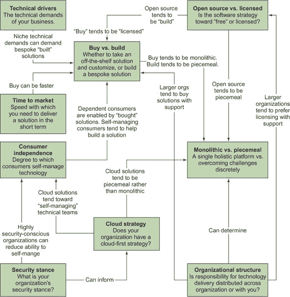

在详细讨论这些因素之前，我们将简要定义每个因素及其含义。你可能已经考虑过所有这些因素并理解了它们是什么，但组织内部和组织之间的不同术语可能会使术语变得不明确，并且某些术语在某些组织中比在其他组织中更常用。

+   *购买与自建*——这指的是组织在新的软件部署方面采取的不同方法。一些组织更喜欢购买解决方案，而另一些组织则更喜欢自己构建和维护。这反过来又可能影响选择哪个平台（或哪些平台）。

+   *技术驱动因素*——一些企业通过其技术的特定特性来区分自己，例如高性能或运营成本效率。支撑这些特性的基础可能非常特定，而一些特定的技术组件可能无法由通用服务或工具提供支持。这可能导致更多定制化解决方案，从而推动“自建”而不是“购买”的方法。

+   *单体与模块化*——这同样是一种组织可以采取的一般文化方法，针对软件解决方案。一些组织更喜欢将解决方案集中在一个单体实体中（一个集中的服务器或服务），而另一些组织则更喜欢逐个解决问题。后者方法可以被视为更灵活和适应性更强，而前者在规模上可能更有效率。

+   *上市时间*—经常，组织（出于商业或文化原因）会感到压力，需要快速向用户交付解决方案。这种压力可能会在未来牺牲成本或灵活性，从而优先考虑某些平台而非其他平台。

+   *开源与许可*—如今，组织通常更倾向于选择开源产品而非许可产品，但仍然有很好的理由从供应商那里许可产品。另一个推动组织向开源解决方案转变的相关主题是对特定供应商或平台的锁定恐惧，这可能导致随着时间的推移，对该产品的依赖性增加，从而增加许可成本。

+   *消费者独立性*—你部署的平台将会有消费者。这些可以是个人、团队或整个业务单元。无论这些消费者的规模如何，他们都将有自己的文化和运作模式。这里的关键问题是他们在运营环境中在技术上是多么自我管理，以及他们的开发需求是多么定制化？对这些问题的回答可能会决定你决定部署的平台特征。

+   *云战略*—如今，很少有组织对云计算没有明确的立场。无论你是否打算立即将工作负载迁移到云中，解决方案是否为云原生可能会成为你决策过程中的一个因素。即使你已经决定迁移到云，你仍然需要考虑该战略是否仅限于一个云，或者是否设计为可以在云之间甚至返回数据中心的可移植性。

+   *安全立场*—随着组织越来越重视安全作为其 IT 战略的一部分，越来越多的组织正在认真对待安全问题。无论是国家支持的行为者、业余（或专业）黑客、工业间谍活动还是简单的盗窃，安全是每个人都持有立场的问题。对这个领域的关注程度可能有所不同，因此这可能在平台选择中发挥作用。

+   *组织结构*—许多先前的定义，如果你在一家企业组织中工作，可能对你更有意义，而不是在相反类型的组织中工作。

在这本书中，我们将*企业*广泛定义为内部各个职能之间独立性程度较低的组织。例如，如果你运行一个集中的 IT 职能，你是否可以在不参考业务其他部分（如安全、开发团队、开发工具团队、财务、运营/DevOps 团队）的情况下部署解决方案而不会产生后果？如果是这样，我们认为这正是一个企业组织的对立面。企业组织往往规模更大（因此职能更独立），并且受到更多的监管（内部和外部），这往往限制了它们实施变革的自由，从而减少了变革的后果。

相比之下，非企业组织（在本书中）是指那些通过自我决定过程自由部署解决方案的组织。根据这个定义，初创公司通常被视为非企业组织，因为它们可以快速做出决定，而不需要参考或更快地确定他人的需求。

虽然非企业组织倾向于偏好某些策略（如“构建”而非“购买”），但考虑这些决策对业务长期后果的影响仍然是有益的。

让我们更具体地看看各种因素如何相互作用，以支持或反对不同的平台。希望其中一些能与你或你的情况产生共鸣。

在这次讨论之后，我们将继续探讨运行 Docker 平台可能带来的具体挑战。有了这些因素作为背景，你可以做出明智的决定，选择最适合你组织需求的技术。

#### 13.1.1. 市场投放时间

首先考虑最简单的因素：市场投放时间可能是有帮助的。组织内的每个人都感到一些压力，需要快速交付解决方案，但这种压力的可协商性或可取性可能会有所不同。

如果直接竞争对手已经采用容器化策略，并成功地利用它来降低成本，那么高级管理层可能会对您的解决方案交付时间产生兴趣。

另一方面，如果你为一家更保守的组织工作，快速交付的解决方案可能会被视为产生负面影响，例如锁定在匆忙交付或过时平台，这种平台无法随着需求的变化而变化。

更有经验的人可能会建议你抵制在面临这些危险时采用第一个可信解决方案的冲动。

通常，快速交付的压力推动人们倾向于“购买”而非“构建”，以及“单一”而非“分块”的解决方案来解决复杂的业务挑战。（这些选择将在下一节中进一步讨论。）这些挑战可以通过将解决问题的责任分配给这些供应商的解决方案来解决。但这并不总是可能的，尤其是如果产品还不够成熟。

迫于交付的压力也可能导致匆忙交付定制解决方案，以满足企业短期需求。这在高度技术导向的组织中尤为普遍，并且可能非常有效，通过控制核心技术和了解其运作方式，在竞争中取得优势。然而，如果技术不是你业务的关键差异化因素，这可能会导致难以摆脱的“白象”技术，如果行业超过了你的领先地位，那么这种技术可能会变得难以移除。

类似地，采用点击即用的云技术可以显著缩短你的上市时间。缺点可能是随之而来的对该提供商解决方案的锁定，随着规模的扩大而增加成本，以及未来任何迁移的成本。它还可以减少技术特性或解决方案的灵活性，使你依赖于云供应商产品的增长和发展。

#### 13.1.2. 购买与构建

购买解决方案可以以多种方式成为有效的策略。正如你所看到的，它可以缩短上市时间。如果你的组织在开发人员方面受到限制，你还可以利用产品的（假设）不断扩大的功能集，以相对较少的投资向客户提供更多服务。

如果你选择将其作为供应商提供的服务在本地以外的地方运营，购买解决方案还可以降低运营成本。你能够走这条道路的程度可能受到你的安全立场的限制：软件只有在运行在由使用该组织的硬件和运营下才被认为是安全的。

自己搭建平台，无论是从头开始还是基于现有的开源软件，可能对你有吸引力，因为你正在阅读这本书。毫无疑问，你会在这一过程中学到很多东西，但从商业角度来看，这种方法存在许多风险。

首先，你可能需要一支高度熟练的团队来继续构建和维护这个产品。与你的想象相比，这可能要困难得多（尤其是如果你在工作中和大学里一直围绕着计算机科学家）去寻找能够编程和操作复杂 IT 系统的人，尤其是在近年来这些技能需求很高的时期。

第二，随着时间的推移，容器平台世界将成熟，现有玩家将提供类似的功能集和围绕它们商品化的技能。在这些产品面前，几年前为特定组织需求构建的定制解决方案可能会显得不必要地昂贵，而曾经它是市场差异化因素。

可以采用的一种策略是“先建后买”，即组织为了满足其即时需求而构建一个平台，但等到市场已经确定了一个看起来将成为标准的产品时再考虑购买。当然，存在这样的风险，即构建的平台变成一个难以放弃的“宠物”。截至写作时，Kubernetes 似乎已经几乎完全主导了大多数流行的 Docker 平台。因此，如果你认为这是一个对未来有利的赌注，你可能会放弃定制的解决方案，转而选择 Kubernetes。

早期就下注的两个平台之一是 OpenShift，它在 Docker 出现在技术舞台上后不久就拥抱了它。它围绕 Docker 和 Kubernetes 重写了其整个代码库。因此，它目前是企业中一个非常受欢迎的选择。相比之下，亚马逊使用 Mesos 作为其 ECS 解决方案的基础，随着 Kubernetes 的普及，它越来越显得小众。

#### 13.1.3\. 单体与零散

是否运行一个针对所有 Docker 需求的单一“单体”平台，还是从独立的“零散”解决方案中构建功能，这个问题与“购买与自建”问题密切相关。当考虑从供应商那里购买单体解决方案时，上市时间可能是一个有力的理由来选择与他们合作。同样，这种方法也有其权衡之处。

最大的危险是所谓的“锁定”。一些供应商对每个部署解决方案的机器收费。如果你的 Docker 资产随着时间的推移而显著增长，许可费用可能会变得难以承受，平台可能会成为你脖子上的财务磨石。一些供应商甚至拒绝支持其他供应商提供的 Docker 容器，这使得它们的实际采用几乎成为不可能。

相反的是零散的方法。通过零散，我们指的是你可以（例如）有一个用于构建容器的解决方案，另一个用于存储容器（如 Docker 注册表），另一个用于扫描容器，还有一个用于运行容器（也许甚至为这个或任何前面的类别提供多个解决方案）。我们将在本章下一节中更深入地探讨可能需要解决的“部分”是什么。

再次，如果你是一个需要快速行动的小型（可能资金充裕）企业，单体方法可以为你提供帮助。零散的方法允许你在需要时采用不同的解决方案，为不同的部分提供更多灵活性和努力的重点。

#### 13.1.4\. 开源与许可

在过去十年中，开源已经取得了长足的进步，现在已成为供应商或支持解决方案的标准要求。这其中包含了一个不常明显的危险。尽管许多解决方案是开源的，但锁定并不一定能够避免。理论上，如果你与支持供应商发生冲突，软件的知识产权可供使用，但通常管理和支持代码库所需的技能并不具备。

如最近一位会议演讲者所说，“开源加供应商支持是新的锁定。”有人可能会认为这是供应商为你的组织带来的价值的有效理由——如果你需要大量罕见技能来管理所需的平台，你无论如何都需要为此付费。

这个混合体中一个有趣的新增元素是云计算解决方案，它们可以被视为既开源又许可。它们通常基于开源软件和开放标准（如亚马逊的 EKS），但它们可以将你锁定在其特定实现的标准和技术上，并以此方式获得你的锁定。

另一个有趣的情况是红帽（Red Hat）的 OpenShift 平台。OpenShift 是一个需要许可证才能运行的供应商提供的平台。但它的代码可在 GitHub 上获取，社区贡献可以被接受到主线中。因此，红帽提供的有价值的服务包括支持、功能开发和历史代码库的维护。从理论上讲，因此，如果你觉得他们的产品没有带来价值，你可以离开他们的实现。

#### 13.1.5\. 安全立场

安全问题可能会对平台选择产生重大影响。企业供应商如红帽（Red Hat）在安全管理方面有着强大的历史，OpenShift 在原生 Kubernetes 提供的安全保护之上增加了 SELinux 保护，以增强容器安全。

安全对你来说的重要性可能会有很大差异。我们参与过一些公司，其中开发人员对生产数据库拥有完全和信任的访问权限，也参与过一些公司，其中对安全的担忧达到了顶峰。这些不同的担忧程度在开发和生产中驱使出非常不同的行为，因此也会影响平台选择。

以一个简单的例子来说明：你是否信任你的数据和代码符合亚马逊网络服务（AWS）的安全标准和产品？在此我们并没有特别指出 AWS——据我们所知和所经历，他们的安全标准在云空间中通常被认为是首屈一指的。此外，你是否信任你的开发团队能够管理与应用团队相关的必要责任？关于 AWS S3 存储桶上暴露的私人数据已经有很多故事，这已经成为许多公司的关注点。

| |
| --- |

##### 备注

在 S3 上暴露数据的责任明确属于 AWS 的消费者，而不是 AWS 本身。AWS 为你提供了全面的安全管理工具，但他们无法为你管理安全和操作需求。

| |
| --- |

#### 13.1.6\. 消费者独立性

一个很少被考虑的因素是团队希望自我管理的程度。在较小的组织中，这种程度的变化通常小于在较大的组织中。在较大的组织中，你可以得到从高度熟练且要求尖端技术平台到不太熟练且只想以精心策划的方式部署简单稳定 Web 应用的开发团队。

这些不同的需求可能导致不同的平台选择。例如，我们见过一些环境中，一个业务单元对集中式、精心策划和单一的平台感到满意，而另一个业务单元则要求高度的控制和特定的技术要求。这类用户可能会推动你选择比供应商提供的更定制的平台。如果这些用户愿意帮助构建和维护平台，就可以形成富有成效的合作伙伴关系。

如果您足够大，并且您的开发社区足够多样化，您甚至可能需要考虑为您的 Docker 平台追求多个选项。

#### 13.1.7\. 云战略

大多数从事 IT 业务的公司都对云平台持有某种立场。一些公司完全接受它，而另一些公司仍在开始走向它的旅程，正在迁移过程中，甚至正在回到老式的数据中心。 

您的组织是否采用云 Docker 平台可以通过这种立场来确定。需要考虑的因素集中在是否存在所谓的“云供应商锁定”的恐惧，即将应用程序和数据从云供应商的数据中心迁移变得过于昂贵而无法容忍。这可以通过使用开放标准和产品来防范，甚至可以通过在那些云供应商提供的通用计算资源上运行现有产品（而不是使用他们精选的有时是云供应商特定的产品）来防范。

#### 13.1.8\. 组织结构

组织结构是任何公司的基本特征，它影响着这里的所有其他因素。例如，如果开发团队与运维团队分离，这往往意味着采用一个标准化的平台，两个团队都可以管理和与之工作。

类似地，如果运营的不同部分被不同的团队原子化，这往往会导致平台交付的零散方法。我们看到的这种例子之一是在大型组织中管理 Docker 注册库。如果已经有一个集中管理的工件存储库，那么简单地升级现有的存储库并将其用作 Docker 注册库（假设它支持这种用途）是有意义的。这样，存储库的管理和运营成本比为本质上相同的挑战构建单独的解决方案要低。

#### 13.1.9\. 多个平台？

在这一点上可能适当提及的一个模式是，对于有不同需求的大型组织，另一种方法是有可能的。您可能有一些消费者更喜欢他们可以使用的托管平台，而同一组织中的其他消费者可能要求更定制的解决方案。

在这种情况下，为第一组用户提供一个高度意见化且易于管理的平台，为其他人提供更灵活且可能更自我管理的解决方案是有意义的。在我们所了解的一个案例中，有三个选项可供选择：一个自我管理的 Nomad 集群、一个 AWS 管理的解决方案和一个 OpenShift 选项。

这种方法的明显困难在于，管理多个平台类别的成本增加，以及在整个组织中有效沟通这些选项的挑战。

#### 13.1.10\. 组织因素结论

希望这次讨论能引起你的共鸣，并给你一些关于在需求不同的组织中为 Docker（或任何技术）选择适当平台复杂性的想法。尽管这可能看起来有些抽象，但下一节将更加具体，因为我们将探讨在选择业务解决方案时你可能需要考虑的具体挑战。这次讨论为我们提供了评估这些问题及其可能解决方案的适当视角。

### 13.2. 采用 Docker 时需要考虑的领域

最后，我们将讨论在实施 Docker 平台时可能需要解决的具体功能挑战。

它分为三个部分：

+   *安全和控制*—探讨将取决于你组织的安全和控制立场的项目

+   *构建和推送镜像*—探讨在开发和交付镜像和工作负载时需要考虑的一些事项

+   *运行容器*—考虑在操作平台时需要思考的问题

在此过程中，我们将考虑一些具体的技术。提及一个产品并不意味着我们对其表示认可，我们提及的产品也不会详尽无遗。软件产品可以改进和衰落，可以被替换或合并。它们在这里被提及只是为了说明你平台选择的实际后果。

如果我们讨论的许多项目看起来很神秘，或者与你的组织无关，那么很可能你的组织没有太多限制，因此你有更大的自由去做你想做的事情。如果是这样，你可以考虑这一章提供了对大型和受监管企业中看到的某些挑战的见解。

#### 13.2.1. 安全和控制

我们将首先处理安全问题，因为从许多方面来看，你的安全和控制立场将从根本上影响你处理所有其他话题的方式。此外，如果你的组织对安全的关注不如其他组织，你可能对解决本节中概述的问题不太关心。


##### 注意

当我们提到“控制”时，指的是覆盖在开发团队和运行团队操作之上的治理系统。这包括集中管理的软件开发生命周期、许可证管理、安全审计、一般审计等。一些组织的管理较为宽松，而另一些则较为严格。


##### 镜像扫描

无论你在哪里存储你的镜像，你都有在存储点检查这些镜像是否符合你期望的黄金机会。你可能想要检查的内容取决于你的用例，但以下是一些你可能希望实时回答的具体问题的例子：

+   哪些镜像使用了 bash 的 shellshock 版本？

+   任何镜像上是否有过时的 SSL 库？

+   哪些镜像基于现在可疑的基础镜像？

+   哪些镜像上安装了非标准（或完全错误）的开发库或工具？


##### 注意

Shellshock 是 2014 年发现的 bash 中的一个特别严重的安全漏洞。安全公司在披露一系列相关漏洞的第一天就记录了数百万次针对该漏洞的攻击和探测。


图 13.2 展示了软件开发生命周期中图像扫描的基本工作流程。图像被构建并推送到注册表，这会触发图像扫描。扫描器可以检查注册表上的图像，或者下载它并对其进行处理。根据你对图像的担忧程度，你可以同步检查图像并阻止其使用，直到它得到批准，或者你可以异步检查图像并向提交用户提供报告。通常，对于生产中使用的图像，采用偏执的方法，而在开发中使用异步建议方法。

##### 图 13.2. 图像扫描工作流程

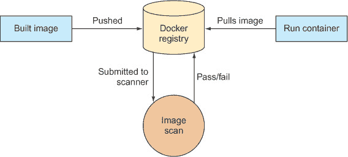

在图像扫描的世界里，有很多选择，但它们并不完全相同。最重要的是理解扫描器大致分为两类：一类专注于已安装的包，另一类主要是为深入扫描图像中的软件而设计的。第一类的例子有 Clair 和 OpenSCAP，第二类的例子有 Black Duck Software、Twistlock、Aqua Security、Docker Inc. 以及许多其他公司。这两类之间有一些重叠，但主要的分界线是成本：维护必要的信息数据库以跟上各种库或二进制文件中的弱点需要更高的成本，因此深度扫描器往往成本更高。

这种划分可能对你的决策有相关性。如果你的图像是半可信的，你可能可以假设用户没有恶意，并使用一个更简单的包扫描器。这将为你提供有关标准包及其适当风险水平的指标和信息，而无需花费太多成本。

虽然扫描器可以降低你图像中恶意或不受欢迎软件的风险，但它们并不是万能的。我们评估它们的经验表明，即使是最好的扫描器也不是完美的，并且它们在识别某些类型的二进制文件或库的问题上可能比其他类型更好。例如，有些可能比用 C++ 编写的（比如说）更成功地识别 npm 包问题，反之亦然。参见第十四章技术 94 中的图像，我们用它来测试和验证这些扫描器。

另一点需要注意是，尽管扫描器可以在不可变图像上工作并检查这些图像的静态内容，但仍然存在一个风险，即容器可以在运行时构建和运行恶意软件。静态图像分析无法解决这个问题，因此你可能需要考虑运行时控制。

就像本节中的所有主题一样，在选择扫描器时，你必须考虑你想要实现的目标。你可能想要

+   防止恶意行为者在构建中插入对象

+   强制执行公司范围内的软件使用标准

+   快速修补已知的和标准的 CVE

| |
| --- |

##### 注意

CVE 是软件漏洞的标识符，用于允许对特定错误的通用和明确的识别。


最后，你可能还想要考虑将此工具集成到你的 DevOps 管道中的成本。如果你找到一个让你满意的扫描器，并且它与你的平台（或其他相关 DevOps 工具）很好地集成，那么这可能是它有利的一个因素。

##### 镜像完整性

镜像完整性和镜像扫描经常被混淆，但它们并不是同一件事。而*镜像扫描*确定镜像中有什么，*镜像完整性*确保从 Docker 注册表中检索的内容与安全放置的内容相同。（*镜像验证*也是描述这一要求的另一种常见方式。）

想象以下场景：Alice 将一个镜像放入仓库（镜像 A），在它经过任何必须的流程以检查该镜像之后，Bob 想要在服务器上运行该镜像。Bob 从服务器请求镜像 A，但 Bob 并不知道，攻击者（Carol）已经破坏了网络，并在 Bob 和注册表之间放置了一个代理。当 Bob 下载镜像时，他实际上得到了一个恶意镜像（镜像 C），该镜像会运行代码，将机密数据传输到网络外的第三方 IP 地址。（见图 13.3。）

##### 图 13.3\. 镜像完整性破坏

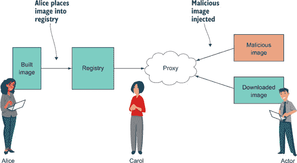

问题随之而来：当下载 Docker 镜像时，你如何确保它就是你所请求的那个？确保这一点正是镜像完整性所解决的问题。

Docker Inc. 在其 Content Trust 产品中带了个头，也称为 Notary。该产品使用私钥对镜像清单进行签名，确保当内容使用公钥解密时，内容与上传到注册表的内容相同。Content Trust 提供了关于密钥责任委派的其他功能，这里不会详细介绍。

在 Docker 提供的范围内，截至 2018 年没有太多可以报告的，这可以说是对他们在这一领域工程领导地位的致敬。像 Kubernetes 和 OpenShift 这样的领先产品在出厂时提供的功能非常有限，所以如果你不购买 Docker 的产品，你可能必须自己集成这些。对于许多组织来说，这样的努力不值得付出努力，因此他们将依赖现有的（可能是外围的）防御措施。

如果你设法实现了镜像完整性解决方案，你仍然必须考虑如何在你的组织中管理这些密钥。那些足够关心并走到这一步的组织可能已经为此制定了政策和解决方案。

##### 第三方镜像

在继续讨论图像的话题时，另一个在提供平台时常见的挑战是如何处理外部图像的问题。同样，这里的根本困难是信任问题：如果你有一个想要将 Docker 图像带入你平台的供应商，你如何确保它安全运行？在多租户环境中，这是一个特别重要的问题，因为不同的团队（他们不一定相互信任）必须在同一主机上运行容器。

一种方法就是简单地禁止所有第三方图像，只允许使用存储在企业网络内的代码和工件构建已知和精选的基础图像。一些供应商的图像仍然可以在这种制度下运行。如果供应商图像本质上是一个在标准 JVM（Java 虚拟机）下运行的 JAR（Java 归档）文件，那么可以从该工件在网络上重新创建和构建该图像，并在批准的 JVM 图像下运行。

然而，不可避免的是，并非所有图像或供应商都会接受这种方法。如果允许第三方图像的压力足够大（根据我们的经验，确实是这样的），你有几个选择：

+   信任你的扫描仪

+   通过肉眼检查图像

+   让将图像带入组织的团队负责其管理

在没有图像完全嵌入到系统中之前，你不太可能完全信任扫描仪为你提供关于第三方图像安全性的充分确定性，因此责任可能需要放在其他地方。

第二种选择，手动检查图像，不可扩展且容易出错。最后一种选择是最简单且最容易实施的。

我们看到过采取所有三种方法的环境，平台管理团队对图像进行合理性检查，但最终责任落在将图像带入的组织应用团队。通常，组织中已经存在将虚拟机图像带入组织的流程，因此对于 Docker 图像，简单的方法是复制此程序。这里值得指出的一项关键差异是，尽管虚拟机是多租户的，因为它们与同租户共享一个虚拟机管理程序，但 Docker 图像共享一个功能齐全的操作系统，这为攻击提供了更大的攻击面（有关更多信息，请参阅第十四章 chapter 14 关于安全的内容）。

另一个选择是在自己的硬件环境中沙箱化图像的运行，例如通过在集群上标记 Kubernetes 节点，或使用像 ECS 这样的云产品的单独实例，或者在不同的硬件甚至网络上运行一个完全独立的平台。

##### 秘密

以某种方式（尤其是在你进入生产阶段时），需要以安全的方式管理特权信息。特权信息包括传递给构建的文件或数据，例如

+   SSL 密钥

+   用户名/密码组合

+   客户识别数据

将秘密数据传递到软件生命周期中的做法可以在多个点进行。一种方法是在构建时将秘密嵌入到你的镜像中。这种方法被高度反对，因为它会将特权数据传播到镜像的任何地方。

更受认可的方法是在运行时让平台将秘密放入你的容器中。有各种方法可以做到这一点，但需要回答几个问题：

+   秘密在存储时是否被加密？

+   秘密在传输过程中是否被加密？

+   谁可以访问秘密（在存储中或在容器运行时）？

+   如何在容器内暴露秘密？

+   你能否追踪或审计谁看到了或使用了秘密？

Kubernetes 有一个所谓的“秘密”功能。许多人对这一点感到惊讶的是，它在持久存储（一个 etcd 数据库）中以纯文本形式存储。技术上，它是 base64 编码的，但从安全角度来看，这是纯文本（未加密，且容易逆转）。如果有人带着包含这些信息的磁盘离开，他们可以轻松地访问这些秘密。

目前，有一些概念验证实现，如 HashiCorp 的 vault 与 Kubernetes 集成。Docker Swarm 自带更安全的秘密支持，但 Docker Inc.似乎在 2017 年底将宝押在了 Kubernetes 上。

##### 审计

在生产环境（或任何其他敏感环境）中运行时，证明你对谁运行了什么命令以及何时运行可能变得至关重要。这对于开发者来说可能不是那么明显，因为开发者不太关心恢复此类信息。

这个“根”问题的原因在第十四章中有详细说明，但可以简要地在这里说，给予用户对 Docker 套接字的访问实际上给了他们整个主机的 root 控制权。这在许多组织中是禁止的，因此至少需要可追溯地访问 Docker。

这些是你可能需要回答的一些问题：

+   谁（或什么）能够运行`docker`命令？

+   你对谁运行它有什么控制权？

+   你对运行的内容有什么控制权？

对于这个问题，存在一些解决方案，但它们相对较新，通常作为其他更大解决方案的一部分。例如，OpenShift 通过为 Kubernetes 添加强大的 RBAC（基于角色的访问控制）而走在前列。Kubernetes 后来将其添加到其核心。云提供商通常有更多云原生的方法通过（在 AWS 的情况下）使用 IAM 角色或嵌入在 ECS 或 EKS 中的类似功能来实现这种控制。

由 Twistlock 和 Aqua Security 等供应商提供的容器安全工具提供了一种管理特定 Docker 子命令和标志可以由谁运行的方法，通常是通过在你和 Docker 套接字之间添加一个中间套接字或其他类型的代理来实现，该代理可以代理对 Docker 命令的访问。

在记录谁做了什么方面，原生功能在 OpenShift 等产品中进展缓慢，但现在已经有了。如果你查看其他产品，不要假设这种功能已经完全实现！

##### 运行时控制

运行时控制可以被视为更高层次的审计。受监管的企业可能希望能够确定其整个环境中正在运行的内容，并对此进行报告。这些报告的输出可以与现有的配置管理数据库（CMDB）进行比较，以查看是否存在任何异常或无法解释的运行工作负载。

在这个层面，你可能需要回答以下问题：

+   你如何判断正在运行什么？

+   你能将内容与你的注册表/注册表和/或你的 CMDB 匹配起来吗？

+   自启动以来，是否有容器更改了关键文件？

再次强调，这可能与一些可能成为你 Docker 策略一部分的其他产品有关，所以要注意它们。或者，这可能是你整体应用程序部署策略和网络架构的副作用。例如，如果你使用 Amazon VPC 构建和运行容器，建立和报告其中的内容是一个相对简单的问题。

在这个领域，另一个常见的卖点就是异常检测。安全解决方案提供了复杂的机器学习解决方案，声称能够学习容器应该做什么，如果它看起来做了不寻常的事情，比如连接到与应用程序无关的外部应用程序端口，它们会向你发出警报。

这听起来很棒，但你需要考虑这在操作层面上如何运作。你可能会得到很多误报，这些可能需要大量的维护——你有资源来处理这些吗？一般来说，组织越大，对安全的意识越强，就越有可能对此表示关注。

##### 法医

法医类似于审计，但更加专注。当发生安全事件时，各方都想知道发生了什么。在物理和虚拟机旧世界中，有大量的安全措施来协助事件后的调查。各种描述的代理和监视进程可能已经在操作系统上运行，或者可以在网络甚至硬件级别放置监听器。

这些是一些安全事件发生后，法医团队可能希望得到解答的问题：

+   你能说出谁运行了容器吗？

+   你能说出谁构建了容器吗？

+   你能确定容器消失后它做了什么吗？

+   你能确定容器消失后可能做了什么吗？

在这个背景下，你可能需要强制使用特定的日志解决方案，以确保系统活动信息在容器实例化之间持续存在。

Sysdig 及其 Falco 工具（这是一个开源工具）是该领域另一个有趣且具有潜力的产品。如果你熟悉 tcpdump，这个工具看起来非常相似，允许你查询正在进行的系统调用。以下是一个此类规则的示例：

```
container.id != host and proc.name = bash
```

如果在容器中运行 bash shell，则匹配。

Sysdig 的商业产品不仅限于监控，还允许你根据定义的规则集对跟踪的行为采取行动。

#### 13.2.2. 构建和分发镜像

在安全得到保障后，我们转向构建和分发。本节探讨了在构建和分发镜像时你可能需要考虑的事项。

##### 构建镜像

在构建镜像时，有几个领域你可能需要考虑。

第一，尽管 Dockerfile 是标准，但构建镜像的其他方法也存在（参见第七章），因此如果多种方式可能会引起混淆或彼此不兼容，强制执行一个标准可能是可取的。你可能还有一个战略性的配置管理工具，你希望将其与标准操作系统部署集成。

我们的实际经验表明，Dockerfile 方法在开发者中根深蒂固且受欢迎。学习更复杂的 CM 工具以符合公司对虚拟机的标准，通常不是开发者有时间或意愿去做的事情。S2I 或 Chef/Puppet/Ansible 等方法更常用于便利或代码重用。支持 Dockerfile 将确保你将收到更少的问题和来自开发社区的反对。

第二，在敏感环境中，你可能不希望所有用户都能构建镜像，因为镜像可能被内部或外部的其他团队信任。可以通过适当的标记或镜像提升（见下文）或基于角色的访问控制来限制构建。

第三，值得考虑的是开发者的体验。出于安全原因，并不总是可能允许用户从公共仓库下载 Docker 镜像，甚至无法在他们的本地环境中运行 Docker 工具（参见第十四章）。如果情况如此，你可能想要探索以下几种选项：

+   获得标准工具的批准。这可能会很昂贵，有时由于安全挑战和业务需求，成本过高以至于难以实现。

+   创建一个可丢弃的沙盒，其中可以构建 Docker 镜像。如果虚拟机是瞬时的、受限制的且经过严格审计，许多安全担忧将显著减轻。

+   通过任何 Docker 客户端提供对上述沙盒的远程访问（但请注意，这并不一定显著减少许多攻击面）。

第四，在部署应用程序时，开发者体验的一致性也值得考虑。例如，如果开发者在他们的笔记本电脑或测试环境中使用 docker-compose，他们可能会对在生产环境中切换到 Kubernetes 部署感到抵触。（随着时间的推移，这个最后一点变得越来越不重要，因为 Kubernetes 已成为标准。）

##### 注册表

到现在为止，您应该很明显需要注册表。有一个开源示例，Docker Distribution，但它不再是主导选择，主要是因为 Docker 注册表是一个知名 API 的实现。如果您想付费购买企业注册表，或者想自己运行开源注册表，现在有众多选择可供选择。

Docker Distribution 是 Docker 数据中心产品的一部分，它具有一些吸引人的功能（如内容信任）。

无论您选择哪个产品，都有一些可能不那么明显的问题需要考虑：

+   这个注册表与您的身份验证系统兼容吗？

+   它是否有基于角色的访问控制（RBAC）？

认证和授权对企业来说非常重要。一个快速且便宜的免费注册表解决方案可以在开发中完成工作，但如果您有安全或 RBAC 标准需要维护，这些要求将排在您的列表之首。

一些工具具有较粗粒度的 RBAC 功能，如果您突然发现自己正在接受审计并发现不足，这可能是一个很大的漏洞。

+   *它有推广图像的手段吗？*—并非所有图像都是平等的。有些是快速且草率的开发实验，其中正确性不是必需的，而有些则是为防弹的生产使用而设计的。您组织的流程可能需要您区分这两者，而注册表可以通过管理通过单独实例或通过标签强制执行的门来帮助您做到这一点。

+   *它与您的其他工件存储库兼容吗？*—您可能已经有了用于 TAR 文件、内部包等工件存储库。在一个理想的世界里，您的注册表可能只是那个存储库中的一个功能。如果这不是一个选项，集成或管理开销将是一个您应该注意的成本。

##### 基础镜像

如果您在考虑标准，团队使用的基镜像（或镜像）可能需要一些考虑。

首先，您想使用哪个根镜像，以及应该包含什么？通常，组织会有一个他们偏好的标准 Linux 发行版。如果是这样，那么这个版本可能被强制作为基础。

第二，您将如何构建和维护这些镜像？在发现漏洞的情况下，谁（或什么）负责确定您是否受到影响或哪些镜像受到影响？谁负责修补受影响的领域？

第三，基础镜像中应该包含什么？是否有一组所有用户都想要的工具，或者你想让各个团队自己决定？你想将这些需求分离成单独的子镜像吗？

第四，这些镜像和子镜像将如何重建？通常需要创建某种类型的管道。通常这会使用某种类型的持续集成工具，例如 Jenkins，在触发某些事件时自动构建基础镜像（以及随后从该镜像构建任何子镜像）。

如果你负责基础镜像，你可能会经常被问到这个镜像的大小。人们经常争论说，瘦镜像更好。在某些方面（如安全性）可能会有这样的争论，但这个问题通常是被想象出来的，而不是真实的，尤其是在性能方面。这种情况的矛盾性质在技术 60 中进行了讨论。

##### 软件开发生命周期

软件开发生命周期（SDLC）是软件采购、创建、测试、部署和退役的既定流程。在其理想状态下，它旨在通过确保软件在具有共同利益并希望集中资源的团队中一致性地评估、购买和使用来减少低效率。

如果你已经有 SDLC 流程，Docker 如何融入其中？人们可能会陷入哲学讨论，即 Docker 容器是一个包（如 rpm）还是一个完整的 Linux 发行版（因为其内容可能在开发者的控制之下）。无论如何，争论的关键点通常是所有权。谁对镜像中的什么负责？这就是 Docker 分层文件系统（见第一章）发挥作用的地方。因为最终镜像中创建的内容是完全可审计的（假设内容是可信的），所以追踪到谁负责软件栈的哪个部分相对简单。

一旦确定了责任，你可以考虑如何处理补丁：

+   *你如何确定哪些镜像需要更新？*—一个扫描器可以在这里帮助，或者任何可以识别可能感兴趣的工件中文件的工具。

+   *你如何更新它们？*—一些平台允许你触发容器的重建和部署（如 OpenShift，或者可能是你手工制作的管道）。

+   *你如何告诉团队进行更新？*—一封电子邮件足够吗？或者你需要一个可识别的负责人。再次强调，你的公司政策可能会在这里起到指导作用。现有的政策应该适用于更传统的已部署软件。

在这个新世界中，关键点是负责容器的团队数量可能比过去更多，需要评估或更新的容器数量也可能显著增加。如果你没有建立相应的流程来处理软件交付的增加，所有这些都可能给你的基础设施团队带来沉重的负担。如果情况恶化，你可能需要通过向用户的镜像中添加层来强制他们更新，如果他们不排队的话。如果你运行的是共享平台，这一点尤为重要。你甚至可以考虑使用你的编排工具将“顽皮”的容器放在特定的隔离主机上以降低风险。通常，这些事情都是考虑得太晚，必须即兴发挥。

#### 13.2.3\. 运行容器

现在我们将探讨容器的运行。在许多方面，运行容器与运行单个进程几乎没有区别，但 Docker 的引入可能会带来自己的挑战，Docker 所启用的行为变化也可能迫使你思考基础设施的其他方面。

##### 操作系统

当运行 Docker 平台时，你运行的操作系统可能变得很重要。企业操作系统可能落后于最新的内核版本，正如你将在第十六章（chapter 16）中看到的，运行的内核版本对你的应用程序可能非常重要。

从历史上看，Docker 是一个非常快速发展的代码库，并不是所有的精选操作系统都能够跟上（1.10 对我们来说是一个特别痛苦的过渡，因为对镜像的存储格式进行了重大更改）。在你向供应商承诺他们的应用程序将在你的 Kubernetes 集群上运行之前，检查你的包管理器中可用的 Docker（和相关技术，如 Kubernetes）的版本是值得的。

##### 共享存储

当你的用户开始部署应用程序时，他们首先关心的一件事就是他们的数据去哪里。Docker 的核心使用的是与运行中的容器无关的卷（见第五章 chapter 5）。

这些卷可以由多种类型的存储支持，这些存储可以是本地或远程挂载的，但关键点是存储可以被多个容器共享，这使得它非常适合运行跨容器周期持久化的数据库。

+   *共享存储是否容易配置？*——共享存储在维护和配置方面可能很昂贵，无论是从所需的基础设施还是按小时成本来看。在许多组织中，配置存储不仅仅是调用 API 并等待几秒钟的事情，就像在 AWS 这样的云提供商中那样。

+   *共享存储支持是否准备好应对增加的需求？*——因为部署 Docker 容器和开发或测试的新环境非常容易，对共享存储的需求可能会急剧增加。考虑你是否为此做好了准备是值得的。

+   *共享存储是否可在部署位置之间使用？*——你可能拥有多个数据中心或云提供商，甚至两者混合。所有这些位置能否无缝通信？这是否是一个要求？或者，这是一个不要求的要求？监管约束和为开发者启用功能的需求都可能为你创造工作。

##### 网络

关于网络，在实施 Docker 平台时，你可能需要考虑以下几点。

如 第十章 所见，默认情况下，每个 Docker 容器都会从预留的 IP 地址集中分配一个 IP 地址。如果你引入了一个管理你网络上容器运行的产品，可能还有其他网络地址集被预留。例如，Kubernetes 的服务层使用一组网络地址来维护和路由其节点集群中的稳定端点。

一些组织为特定目的预留 IP 范围，因此你需要警惕冲突。例如，如果某个 IP 地址范围被预留用于特定的数据库集，那么使用你集群内 IP 范围的容器或服务可能接管这些 IP，从而阻止集群内其他应用程序访问该数据库集。这些数据库的流量最终会被路由到集群内的容器或服务 IP。

网络性能也可能变得非常重要。如果你已经在网络上部署了软件定义网络（SDN，例如 Nuage 或 Calico），再为 Docker 平台添加更多 SDN（例如 OpenVSwitch 或甚至另一个 Calico 层）可能会明显降低性能。

容器也可能以你意想不到的方式影响网络。许多应用程序传统上使用稳定的源 IP 地址作为外部服务认证的一部分。然而，在容器世界中，容器提供的源 IP 可能是容器 IP 或容器运行的宿主机的 IP（该宿主机执行网络地址转换 [NAT] 回到容器）。此外，如果它来自主机集群，提供的 IP 不能保证是稳定的。确保 IP 展示稳定性的方法存在，但通常需要一些设计和实施工作。

负载均衡是另一个可能需要大量努力的领域。关于这个话题有很多内容要涵盖，它可能成为另一本书的主题，但这里有一个简要的列表：

+   哪个产品更受欢迎/是标准产品（例如，NGinx、F5s、HAProxy、HTTPD）？

+   你将如何处理 SSL 终止？

+   你是否需要一个相互认证的 TLS 解决方案？

+   证书将在你的平台上如何生成和管理？

+   你的负载均衡器是否以与其他业务应用程序一致的方式影响头部信息（如果不一致，请准备进行大量的调试）？

最后，如果您除了已经拥有或使用的任何数据中心外，还在使用云服务提供商，您可能需要考虑用户如何从云服务提供商连接回本地服务。

##### 记录

几乎每个应用程序都会与其相关的日志文件。大多数应用程序都希望以持久的方式访问这些日志（尤其是在生产环境中），因此通常需要某种集中式日志记录服务。由于容器是短暂的（而虚拟机和专用服务器通常不是），如果容器死亡且日志存储在其文件系统上，这些日志数据可能会丢失。因此，转向容器化世界可能会因为这些原因而使日志记录挑战更加突出。

由于记录是应用程序功能的核心和常见部分，因此集中化和标准化它通常是有意义的。容器提供了实现这一目标的机会。

##### 监控

大多数应用程序在某种程度上都需要进行监控，与容器监控相关的供应商和产品种类繁多。这仍然是一个新兴领域。

在 Docker 领域有一个产品非常受欢迎，那就是 Prometheus。它最初由 SoundCloud 开发，随着时间的推移越来越受欢迎，尤其是在它成为云原生计算基金会的一部分之后。

由于容器与虚拟机或物理机器不同，传统的监控工具在容器内部、作为边车，或者在主机上（如果它们不具备容器感知能力）可能不会很好地工作。

话虽如此，如果您正在运行一组主机并需要维护它们，传统的、成熟的监控工具将非常有用。很可能，在您试图从集群中榨取最大性能以供最终用户使用时，它们会被大量依赖。这是假设平台成功的前提下。我们的经验表明，需求往往远超过供应。

### 13.3. 供应商、组织和产品

想从 Docker 中赚钱的公司和组织并不少见。在这里，我们将探讨截至 2018 年最大的和最有影响力的参与者，并尝试描述他们的努力方向以及他们的产品可能如何为您服务。

#### 13.3.1. 云原生计算基金会（CNCF）

这些组织中的第一个不同之处在于它不是一个公司，但可能是这个领域最有影响力的参与者。CNCF（云原生计算基金会）成立于 2015 年，旨在推广容器技术的共同标准。创始成员包括

+   谷歌

+   推特

+   英特尔

+   思科

+   国际商业机器公司（IBM）

+   Docker

+   虚拟机软件公司（VMWare）

它的成立与 Kubernetes 1.0 的发布相吻合，Kubernetes 1.0 是由谷歌捐赠给 CNCF 的（尽管谷歌在之前一段时间就已经开源了它）。

CNCF 在容器领域的作用实际上是“造王者”。由于涉及的各种玩家的集体力量如此之大，当 CNCF 支持一项技术时，你知道关于它的两件事：它将得到投资和支持，而且不太可能有一个供应商比另一个供应商更受青睐。后一个因素对 Docker 平台消费者尤其重要，因为它意味着你的技术选择在可预见的未来不太可能过时。

CNCF 已经批准了大量的技术。我们将探讨其中一些最重要的：

+   Kubernetes

+   CNI

+   Containerd

+   Envoy

+   Notary

+   Prometheus

##### Kubernetes

Kubernetes 是 CNCF 的创始和最重要的技术之一。它是由谷歌捐赠给社区的，最初是作为开源软件，然后是给 CNCF。

虽然它是开源的，但其对社区的捐赠是谷歌将云技术商品化并使消费者更容易离开其他云服务提供商（其中最突出的是 AWS）的策略的一部分。

Kubernetes 是大多数 Docker 平台的基础技术，最著名的是 OpenShift，还有 Rancher，甚至是 Docker Inc. 自己的 Docker Datacenter，因为它们除了支持 Swarm 之外，还支持 Kubernetes。

##### CNI

CNI 代表容器网络接口。该项目为容器管理网络接口提供了一个标准接口。正如你在第十章节中看到的，网络对于容器管理来说可能是一个复杂的领域，而这个项目就是试图帮助简化其管理。

这里有一个（非常）简单的示例，它定义了一个环回接口：

```
{
    "cniVersion": "0.2.0",
    "type": "loopback"
}
```

此文件可能被放置在 /etc/cni/net.d/99-loopback.conf 中，并用于配置环回网络接口。

更复杂的示例可以在以下 Git 仓库中找到：[`github.com/containernetworking/cni`](https://github.com/containernetworking/cni)。

##### Containerd

Containerd 是 Docker 守护进程的社区版本。它管理容器的生命周期。Runc 是其姐妹项目，负责运行容器本身。

##### Envoy

Envoy 是在 Lyft 建立的，以将他们的架构从单体架构迁移到微服务架构。它是一个高性能的开源边缘和服务代理，使网络对应用程序透明。

它允许直接管理关键的网络和集成挑战，如负载均衡、代理和分布式跟踪。

##### Notary

Notary 是 Docker Inc. 设计和构建的工具，用于签名和验证容器镜像的完整性。（请参阅第 317 页，“镜像完整性。”）

##### Prometheus

Prometheus 是一个与容器配合得很好的监控工具。它在社区中越来越受欢迎，例如，Red Hat 在他们的 OpenShift 平台上从 Hawkular 切换到 Prometheus。

#### 13.3.2\. Docker, Inc.

Docker Inc.是寻求从开源 Docker 项目中获利的商业实体。


##### 注意

开源 Docker 项目已被 Docker Inc.更名为 Moby，试图为盈利目的保留 Docker 名称。到目前为止，这个名字还没有流行起来，所以在这本书中您不会看到太多关于 Moby 的提及。


如您所预期的那样，Docker Inc.在 Docker 产品空间中是一个早期的领导者。他们将多个产品组合成一个名为 Docker Datacenter 的单一产品。这包括对 Notary、注册表、Swarm 以及 Docker 开源的几个其他项目的支持、集成和功能。最近，Kubernetes 的支持已经提供。

由于 Docker 在早期就加入了这个领域，并且其在 Docker 早期就拥有强大的技术声誉，因此他们的产品在“快速进入生产”这一指标上非常吸引人。随着时间的推移，Docker 的产品在其他人赶上之后失去了优势。由于其“全要全不要”的策略和按服务器计费的模式，Docker 的业务模式在内部销售上遇到了困难，这使客户对单一供应商产生了强烈的依赖，该供应商可能对他们整个 Docker 平台进行勒索。

#### 13.3.3\. Google

Kubernetes 是由谷歌在 2014 年创建的，当时 Docker 的流行度激增。它的目的是将谷歌内部容器平台（Borg）背后的原则带给更广泛的受众。

大约在同一时间，谷歌云服务诞生了。推广 Kubernetes 是他们云战略的一部分。（请参阅第 327 页，“Kubernetes。”）

谷歌提供了一项名为 Google Kubernetes Engine (GKE)的付费服务，用于管理 Kubernetes 集群，类似于 AWS 的 EKS。

对于谷歌来说，其云服务是他们的一项关键业务优先事项，而 Kubernetes 的支持和鼓励是该战略的核心部分。

#### 13.3.4\. Microsoft

微软在多个方面参与了 Docker，所有这些都有助于扩展其 Azure 云服务。

首先，从 Windows 10 开始，微软已经在 Windows 平台上原生实现了 Docker API 到容器的支持。这使得 Windows 容器可以被构建和运行。对于 Windows 节点上的 Kubernetes 支持已有计划，但截至写作时，它仍处于早期阶段。

其次，微软在其.NET 平台的基础上推出了一项名为 Dotnet Core（如果您更喜欢，可以称为.NET Core）的产品，该产品为 Linux 上的.NET 代码库提供支持。并非所有.NET 库都受到支持，因此将您的 Windows 应用程序迁移过去绝非易事（到目前为止），但许多组织会对在 Linux 平台上运行他们的 Windows 代码的可能性感兴趣，甚至对从头开始构建以在任一平台上运行的可能性感兴趣。

第三，Azure 提供了一种针对 Kubernetes（AKS）的产品，也类似于 AWS 的 EKS 和谷歌云的 GKE。

所有这些努力都可以看作是为了鼓励用户迁移到 Azure 云。能够在 Windows 或 Linux（甚至两者都相同）上运行类似的工作负载对许多组织来说很有吸引力。特别是如果数据已经存储在他们自己的数据中心中。此外，微软处于一个很好的位置，可以向已经在微软技术上有大量投资并希望迁移到云的组织提供有吸引力的许可证套餐。

#### 13.3.5\. 亚马逊

亚马逊现在有几款容器产品，但可以说它在容器领域起步较晚。它的第一个产品是弹性容器服务（ECS），它使用 Mesos 在底层来管理容器的部署及其宿主机的管理。

这最初获得了一些关注，但很快在行业中被 Kubernetes 的流行所超越。亚马逊在 2017 年底通过宣布弹性 Kubernetes 服务（EKS）做出了回应，该服务（就像之前提到的 GKE 和 AKS 服务一样）是一个精选的 Kubernetes 服务。ECS 仍然得到支持，但似乎很自然地认为 EKS 将是它们更具战略性的服务。在 2017 年底还宣布了 Fargate，这是一个无需管理任何 EC2 实例即可原生运行容器的服务。

所有这些服务都提供了与其他 AWS 服务的紧密集成，如果你将 AWS 视为你软件的长期平台，这将非常方便。显然，AWS 的商业目标是确保你愿意继续支付他们的服务费用，但他们对 Kubernetes API 的广泛支持可以给消费者一些安慰，即与 AWS 平台的联系可以比其他服务更松散。

#### 13.3.6\. 红帽

红帽的商业战略是为客户定制、支持和管理工作核心软件，所谓的“开源品酒师”战略。红帽与其他商业玩家不同，它们不提供通用的云服务供消费者使用（尽管 OpenShift online 可以被视为云服务，因为它是一个外部托管的服务）。

红帽在两个领域关注容器。第一个是 OpenShift，这是一个围绕 Kubernetes 的产品，可以在多个环境中运行和支持，例如在本地上与这里提到的云提供商（以及一些其他提供商）一起运行，以及作为 Red Hat 的 OpenShift Online 服务的一部分。

OpenShift 的开发引入了各种企业功能（如 RBAC、内置镜像存储和 Pod 部署触发器），这些功能已经融入到核心 Kubernetes 中。

### 摘要

+   影响你选择 Docker 平台的一些主要决定因素可能包括你的“购买”与“构建”立场、你的安全立场、你的云战略，以及你的组织是否倾向于用“单体”或“零散”的产品来解决技术挑战。

+   这些因素反过来又可能受到你的软件的技术驱动因素、上市时间要求、消费者独立性的水平、你的开源策略以及你的组织结构的影响。

+   在一个较大的组织中，采用多平台方法可能是有意义的，但可能需要小心确保这些平台之间方法的一致性，以减少未来的组织低效率。

+   在实施 Docker 平台时可能需要考虑的主要功能区域包括如何构建镜像、镜像扫描和完整性、密钥管理、镜像注册以及底层操作系统。

+   Docker 平台领域的显著参与者包括 Docker Inc.、三大云服务提供商（AWS、Google Cloud Platform 和 Microsoft Azure）以及云原生计算基金会（CNCF）。

+   CNCF 是一个极具影响力的组织，它孵化并支持 Docker 平台的关键开源技术组件。CNCF 的全面认可是一个信号，表明这项技术将是可持续的。
