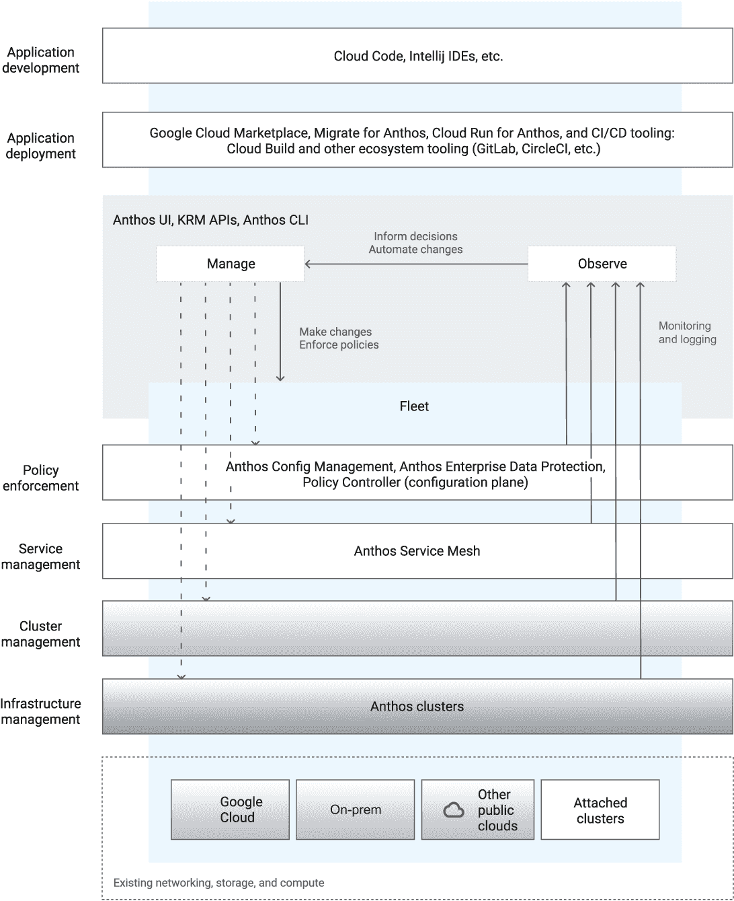

# 1 Anthos 概述

阿帕尔纳·辛哈

本章涵盖

+   现代应用程序的解剖结构

+   使用 Anthos 加速软件开发

+   使用 Anthos 在规模上标准化操作

+   谷歌的起源

+   如何阅读这本书

软件已经统治世界一段时间了。作为消费者，我们已经习惯了那些使叫车或存支票等事情变得更快、更智能、更高效的应用程序。日益增多的是，我们的健康、教育、娱乐、社交生活和就业都得到了现代软件应用程序的增强。在这些应用程序的另一端，是一系列大小企业，它们提供这些改进的体验、服务和产品。现代应用程序不仅部署在消费者手中，也部署在企业供应链的各个点上。许多传统行业（如零售、媒体、金融服务、教育和物流）的主要交易系统正在逐渐被频繁自动更新、高效扩展并融入更多实时智能的现代微服务所取代。新的以数字为先的初创公司正在利用这个机会颠覆传统商业模式，而企业老牌公司则急于现代化他们的系统，以便竞争并避免被颠覆。

本书将带您了解 Anthos 的解剖结构——平台、开发环境、自动化和扩展的元素，以及与谷歌适应的模式的连接，以在任何行业的现代软件开发中达到卓越。每一章都包括如何使用该平台的具体示例，其中几章还包括动手练习来实现这些技术。

## 1.1 现代应用程序的解剖结构

什么是现代应用程序？当你想到那些改善你生活的软件时，你可能想到的是那些交互性强、快速（低延迟）、连接性强、智能、具有情境感知、可靠、安全且在任何设备上易于使用的应用程序。随着技术的进步，现代应用程序的能力，如安全性、可靠性、感知能力和智能水平，也在不断提高。例如，新的开发框架如 React 和 Angular 极大地提高了应用程序的交互性水平，而新的运行时如 Node.js 则增加了功能。现代应用程序具有通过频繁更新不断改进的特性。在后台，这些应用程序通常由许多持续改进的服务组成。这种模块化是通过打破旧的“单体”应用程序编写模式实现的，在这种模式中，所有各种功能都紧密耦合在一起。

以模块或微服务形式编写的应用程序提供了多项优势：组成服务可以独立演进或随着时间的推移替换为其他更可扩展或更优越的服务。此外，现代微服务模式在分离关注点和在服务之间设置合同方面做得更好，这使得检查和修复问题变得更加容易。这种将应用程序作为微服务编写、更新和部署的方法，这些微服务可以一起使用，但也可以独立更新、扩展和调试，是现代软件开发的精髓。在这本书中，我们将这种模式称为“现代”或“云原生”应用程序开发。术语*云原生*适用于此处，因为微服务模式非常适合在分布式基础设施或云上运行。微服务可以逐步推出、扩展、修订、替换、调度、重新调度，并在分布式服务器上紧密打包，从而创建一个高效、可扩展、可靠的系统，该系统响应迅速且经常更新。

现代应用程序可以按照一系列架构和运营原则从头开始编写（*greenfield*）或通过重构现有的*brownfield*应用程序来实现。应用程序现代化的最终目标通常是加速收入，通常这涉及到 IT 部门之外的业务线（LOB）团队。大多数传统企业的 IT 部门在历史上一直专注于降低成本和优化运营。尽管降低成本和优化运营可能是应用程序现代化的副产品，但它们并不是最重要的好处。当然，现代化过程本身需要前期投资。Anthos 是谷歌云在混合和多云环境中进行应用程序现代化的平台。它提供了实现高投资回报率应用程序现代化所需的方法和技术基础。强调通过 API、微服务和云可移植性实现模块化的 IT 战略，结合一个能够自动化重用、实验和成本效益扩展以及安全可靠运营的开发者平台，是成功应用程序现代化的基本关键前提。

Anthos 的一个方面是现代开发者体验，它加速了业务线应用程序的开发。它针对重构棕色地带应用程序和编写基于微服务和 API 的应用程序进行了优化。它提供统一的本地、本地和云开发，从源到生产的自动化事件驱动。开发者可以使用现代语言和框架快速编写代码，并使用本地仿真和测试以及集成 CI/CD，Anthos 支持快速迭代、实验和高级部署策略。Anthos 开发者体验强调云 API、容器和函数，但企业平台团队也可以对其进行定制。Anthos 开发者体验的一个关键目标是让团队每天多次发布代码，从而提高速度和可靠性。Anthos 具有内置的速度和投资回报率指标，以帮助开发团队衡量和优化其性能。数据驱动的基准测试通过预先包装的最佳实践蓝图得到增强，团队可以部署这些蓝图以实现性能的下一个层次。

Anthos 的另一个方面是为中央 IT 提供的操作员体验。Anthos 以其独特可扩展、简化的方式在多个云中运行操作而脱颖而出。这一功能得益于谷歌在过去 20 年发明和磨练的非凡技术基础，该技术基础在相对低成本的基础设施上运行具有极高可靠性的服务。这是通过使用由 Kubernetes、Istio、Knative 和其他构建块组成的抽象层标准化基础设施来实现的，以及 Anthos 特定的扩展和集成，用于自动化配置、安全和操作。Anthos 的操作员体验提供高级安全性和策略控制、自动声明性配置、高度可扩展的服务可视化和操作，以及自动资源和成本管理。它具有广泛的自动化、测量和故障避免能力，用于高可用性、云、本地、边缘、虚拟化和裸机基础设施上的安全服务管理。

企业和小公司一样发现，多云和边缘计算是他们的新现实，无论是通过自然发展还是通过收购。许多国家的法规要求证明在云之间迁移应用程序的能力，并展示对主权支持的故障容忍度。未受监管的公司发现多云对于提供开发者的选择和访问创新服务是必要的。在边缘运行服务和提供更高智能的机会进一步扩大了基础设施的影响范围。一些 IT 组织自行开发跨云平台集成，但这项工作每天都在变得更加困难。以可扩展、可维护的方式构建跨云平台极为困难，更重要的是，这种方法会从宝贵的开发者时间中扣除用于产品创新的时间。

Anthos 提供了一个基于谷歌在软件开发和站点可靠性工程（SRE）操作多年经验和技术创新的解决方案，并辅以谷歌云管理数百万企业客户现代应用基础设施的经验。Anthos 的独特之处在于同时满足 LOB 开发者和中央 IT 的需求，在两个领域都具备高级功能。开发者和操作员在不同环境中的体验一致性使企业能够通过 Anthos 获得应用现代化带来的最大回报率。

### 1.1.1 加速软件开发

软件产品创新和新的客户体验是数字经济中新收入增长的引擎。但在创新过程中，只有少数想法能转化为成功的新产品；大多数失败并消失。随着每个行业过渡到软件驱动，新产品创新依赖于拥有高度敏捷和高效的软件开发流程。开发者是新国王的制造者。没有敏捷、高效的开发流程和平台，公司可能无法创新，或者以非常高的成本进行创新，甚至产生负的回报率。广泛的 DevOps 研究评估¹研究（DORA）在几年内对超过 30,000 名 IT 专业人士进行了调查，涉及各种 IT 职能。它表明，软件开发的高超是商业成功的标志。考虑到现代应用在推动经济中的重要性，这一点并不令人惊讶。

DORA 量化了这些好处，表明“精英”或表现最高的软件团队在实现收入和业务目标方面比低绩效团队高出两倍。精英团队的区别特征是频繁发布软件。DORA 发现以下四个关键指标提供了对软件开发卓越的准确测量：

+   部署频率

+   变更的领先时间

+   变更失败率

+   恢复服务时间

高效团队频繁发布软件，例如，每天发布几次。相比之下，表现不佳的团队每月发布次数不到一次。该研究还发现，频繁发布的团队软件缺陷率较低，并且比其他团队更快地从错误中恢复。因此，除了更具创新性和现代性之外，他们的软件更加可靠和安全。年复一年，DORA 结果也显示，越来越多的企业正在投资于能够实现精英表现的工具和实践。

为什么开发速度较快的团队有更好的业务成果？一般来说，更高的速度意味着开发者可以进行更多的实验和测试，因此在相同的时间内可以提出更好的答案。但还有一个原因。开发速度较快的团队通常已经将编写和部署代码变成了一种自动化、低成本的流程，这附带的效果是使更多的人成为开发者，特别是那些在业务方面比在工具方面更根深蒂固的人。因此，高速度的开发者团队有更多的业务线思维和更深入的用户需求理解。快速实验和关注用户的结合产生了更好的业务成果。Anthos 是跨云运行的共同基础层，为加速应用程序交付提供统一的开发者体验。

### 1.1.2 在规模上标准化运营

开发者可能是新的国王制造者，但运营团队是每天运营王国的团队。运营包括提供、升级、管理、故障排除和扩展服务、基础设施和云的各个方面。通常，网络、计算、存储、安全、身份、资产管理、计费和可靠性工程都是企业运营团队的一部分。传统的 IT 团队在 IT 运营方面的人员比例从 15%-30%不等。这个团队并不总是明显地参与与业务线的全新产品介绍，但它经常奠定基础，选择云服务、发布服务目录，并使服务符合业务使用。未能投资于运营自动化往往意味着这个团队成为瓶颈和固定成本来源。

反之，现代化运营对速度有巨大的积极影响。现代应用程序开发团队通常由一个非常精简的运营团队支持，其中 80%以上的员工从事软件开发而非运营。这种以开发者为中心的比例只有通过现代化的基础设施和可扩展的自动化运营才能实现。这意味着运营非常精简，并使用广泛的自动化来快速上线新服务。也许 Anthos 最大的价值在于在各个环境中一致地自动化运营，这是由一个独特的开放云方法实现的，该方法起源于谷歌自身的基础设施。

## 1.2 谷歌的起源

谷歌的软件开发流程经过多年的优化和微调，以最大化开发者的生产力和创新，这吸引了世界上最优秀的软件开发者，并导致了软件和软件开发及交付实践的创新良性循环。Anthos 开发堆栈从这些基础中发展而来，并建立在谷歌向行业引入的核心开源技术之上。

Anthos 的核心是 Kubernetes，这是一个通过容器抽象层管理基础设施的广泛编排和自动化模型。Kubernetes 上面的层基于谷歌的 SRE 或运营实践，这些实践标准化了大规模服务的控制、安全和管理工作。这一层的服务管理根植于基于 Google Istio 的云服务网格。企业策略和配置自动化通过 Anthos Config Management 构建在这一层，以提供大规模的自动化和安全保障。这个平台可以在多个云上运行，并抽象出下面的不同网络、存储和计算层（见图 1.1）。

图 1.1 Anthos 组件和功能

在 Anthos 堆栈之上是开发者体验和 DevOps 工具，包括使用 Knative 的部署环境以及与 Tekton 集成的 CICD。

## 摘要

+   现代软件应用程序提供了一系列商业优势，并在许多行业中推动了转型。

+   这些应用程序的后端通常基于云原生微服务架构模式，这允许极大的可扩展性、模块化，以及一系列适合在分布式基础设施上运行的运营和 DevOps 优势。

+   Anthos 是一个起源于 Google Cloud 的平台，用于托管云原生应用程序，提供开发和运营方面的优势。

* * *

^(1.)[`www.devops-research.com/research.xhtml`](https://www.devops-research.com/research.xhtml).
