# 基于 Kubernetes 构建的计算环境

Scott Surovich

本章涵盖

+   理解 Kubernetes 管理、架构、组件和资源

+   声明式应用程序管理

+   理解 Kubernetes 资源

+   控制 Pod 调度

+   例子和案例研究

就像许多新技术一样，Kubernetes 可能难以学习和实施。手动创建集群需要包括公钥基础设施、Kubernetes、Linux 和网络在内的广泛技能集。许多供应商认识到这个问题，并自动化了集群创建，允许你创建具有很少或没有 Kubernetes 背景的 Kubernetes 集群。虽然自动化允许任何人创建集群，但它也消除了很多可以帮助你解决作为集群管理员或平台开发者可能遇到的问题的 Kubernetes 知识。

经常出现的问题是，“你真的需要了解 Kubernetes 吗？”答案因你在集群中扮演的角色而异，但无论你将扮演什么角色，你都需要对 Kubernetes 的功能有一定的了解。例如，如果你是集群管理员，你应该了解所有集群组件如何交互。这种理解将帮助你排查集群和工作负载部署问题。作为开发者，你应该了解基本的 Kubernetes 操作和各种 Kubernetes 资源，也称为 Kubernetes *对象*，这些资源可以用来部署你的工作负载。了解如何通过使用选择器、容忍度和亲和/反亲和规则等选项将部署强制推送到节点或一组节点也很重要。

在本章中，你将学习 Kubernetes 集群中每个组件如何与其他组件交互。一旦你理解了基本交互，你将了解最常用的 Kubernetes 资源。最后，为了结束本章，你将学习 Kubernetes 如何调度工作负载的细节，以及如何根据标签、选择器和亲和/反亲和规则来约束调度器放置工作负载。

## 3.1 为什么你需要了解 Kubernetes？

Anthos 的核心是 Kubernetes，它为在集群中运行的应用程序提供计算引擎。Kubernetes 是由 Google 创建的一个开源项目，已经存在多年。在撰写本文时，云原生计算基金会已经认证了 90 个 Kubernetes 产品。认证产品包括来自 IBM、Canonical、SUSE、Mirantis、VMware、Rancher、Amazon、Microsoft 以及当然，Google 的发行版。

听到常见的抱怨说部署 Kubernetes “太难了”，大多数供应商解决方案使其变得更容易。虽然使安装更容易对于大多数企业来说是必要的步骤，并且可以腾出时间专注于更重要的事情，但它也导致了一个问题：不了解集群中包含的基本组件和资源。

使用不同的服务示例，假设您有一个需要新数据库的应用程序。您可能不知道如何创建新的数据库模式或 SQL 查询，但您知道 Google 提供了 MySQL，并为应用程序创建了一个新实例。MySQL 实例将自动创建，一旦部署，您就可以使用 GCP 控制台创建数据库。

由于您可能没有强大的 SQL 背景，您可能会在数据库中创建一个具有多个字段的单个表，这些字段将与应用程序一起工作。数据库可能在几天或几周内表现良好，但随着其变大，性能将开始变慢。虽然单个表数据库易于实现，但并不是一个优化的解决方案。如果您有 SQL 背景，您会创建一个具有多个表和关系的数据库，使数据库更高效和可扩展。

这种场景类似于理解 Kubernetes 的工作原理以及系统提供的功能。为了充分发挥 Kubernetes 的潜力，您应该了解其底层架构和每个组件的作用。了解组件如何相互集成以及可以使用哪些资源将帮助您在部署集群或部署应用程序时做出良好的架构决策。

涵盖每个集群组件和 Kubernetes 包含的超过 60 种资源类型的详细信息可以填满一系列书籍。由于本章中的许多主题引用了包括 Pods 和 DaemonSets 在内的资源，因此它将从一个 Kubernetes 资源口袋指南开始，提供最常用 API 资源的简要定义。

在本章中，我们将提供 Kubernetes 组件、资源和常用附加组件的背景信息，这些组件为 Anthos 提供计算能力。如果您对 Kubernetes 比较陌生，市场上许多书籍都解释了如何构建集群以及如何使用 kubectl，并专门用整章内容介绍每个 Kubernetes 资源。本章应被视为资源介绍，深入关注如何在集群中控制部署的位置。

### 3.1.1 技术要求

本章的实践部分将要求您能够访问在 GCP 上运行的 Kubernetes 集群，并采用以下部署模式：

+   集群必须在同一区域的至少两个不同的区域中部署。本章中展示的示例将基于 us-east4 区域的 us-east4-a、us-east4-b 和 us-east4-c 区域，但您可以使用不同的区域来部署您的集群。

+   每个区域必须至少包含一个 Kubernetes 节点。

本章内容不仅限于 GCP 上的 Kubernetes；练习中所使用的资源和结构适用于任何 Kubernetes 集群。

### 3.1.2 历史和概述

由于本书的读者可能对 Kubernetes 较新或是有经验的 Kubernetes 管理员，我们在在线附录 A 中添加了一些关于从物理服务器到容器的历史和进化的信息。

### 3.1.3 管理 Kubernetes 集群

当一家公司决定在云中运行 Kubernetes 集群时，他们通常会使用云提供商的本地产品，例如以下这些：

+   谷歌 Kubernetes 引擎（GKE）: [`cloud.google.com/kubernetes-engine/`](https://cloud.google.com/kubernetes-engine/)

+   亚马逊弹性 Kubernetes 服务（EKS）: [`aws.amazon.com/eks/`](https://aws.amazon.com/eks/)

+   微软 Azure Kubernetes 服务（AKS）: [`mng.bz/GR7V`](http://mng.bz/GR7V)

使用本地产品是获取新集群并快速运行的最快和最简单的方法，因为提供商已经自动化了安装。要从零开始到运行集群，您只需要提供一些信息，如节点数量和大小、区域和地区。有了这些信息和点击或 API 调用，您可以在几分钟内拥有一个集群，准备好部署您的应用程序。

Google 是第一个提供其 Kubernetes 解决方案的云服务提供商，该解决方案既适用于云环境也适用于本地环境，而不需要任何专门的硬件解决方案。在 Google 这样做之前，其他提供的产品要求组织为每个云提供商及其本地集群部署不同的解决方案。为多个安装使用不同的解决方案通常会导致各种不同的问题，包括以下这些：

+   增加人员以支持每个部署

+   本地和远程部署应用程序的差异

+   不同的身份管理解决方案

+   不同的 Kubernetes 版本

+   不同的安全模型

+   标准化集群操作的困难

+   没有所有集群的单个视图

这些差异使得运行 Kubernetes 的工作更加困难，最终对组织来说成本更高。

Google 认识到这些问题，并创建了 Anthos，它通过提供一种 Kubernetes 安装和管理解决方案来解决本地和远程挑战，该解决方案不仅适用于 GCP 和本地集群，还适用于运行 Anthos 的其他云提供商，如 AWS 和 Azure。

使用 Anthos 无论部署在哪里都提供统一的平台。想象一下，您有一个单一的支持路径和一套通用的工具，用于 GCP、AWS、Azure 和本地环境中的所有集群。Anthos 为组织提供了许多优势，包括以下这些：

+   在 Anthos 控制台中查看集群的统一视图

+   一个通用的服务网格提供

+   使用 ACM 进行配置管理

+   Google 支持的所有选项：所有集群组件的单一点联系

最好的是，Anthos 基于上游 Kubernetes，因此您获得所有标准功能，但还增加了 Anthos 提供的工具和组件，这使得多云集群管理更加容易。

接下来，我们将深入了解构成 Kubernetes 集群的架构以及组件之间是如何相互通信的。

## 3.2 Kubernetes 架构

任何基础设施一样，Kubernetes 由多个组件组成，这些组件通过通信来创建集群。这些组件被分为两层：控制平面和工作节点。控制平面负责保持集群状态，接受传入请求，调度工作负载，并运行控制器，而工作节点则与控制平面通信，以报告可用资源，运行容器工作负载，并维护节点网络规则。

如果你正在 GCP 上运行 Anthos，你可能不熟悉控制平面或工作节点的组件，因为你不会像在本地安装中那样与之交互。本节将解释，Kubernetes 集群有一个名为控制平面的层，其中包含运行 Kubernetes 所需的组件。当集群在 GCP 上运行时，控制平面是在一个 Google 管理的项目中创建的，这限制了你对管理节点和 Kubernetes 组件的交互。

所有 GKE 集群都可以在 GCP 控制台中查看，位于 Kubernetes 引擎部分。对于每个集群，你可以通过在详情面板中点击集群，然后选择节点来查看节点的详细信息。节点详细信息将显示，如图 3.1 所示。

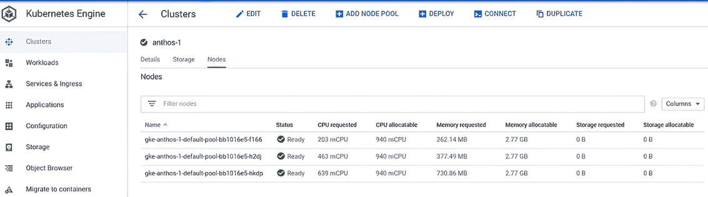

图 3.1 GKE 节点详细信息

与 GCP 上的 GKE 不同，本地安装的 GKE 提供了对控制平面节点和集群 Kubernetes 资源的访问。当然，Google 仍然支持本地控制平面，但你可能需要检查组件以排查任何问题或对集群进行配置更改。如果你只在 GCP 上部署了 GKE，你可能不了解控制平面的所有组件以及它们是如何交互的。理解这种交互对于故障排除和找到任何问题的根本原因至关重要。

注意：当你在本地部署 GKE 集群时，会创建三个 Kubernetes 配置文件。其中一个将以用户集群的名称加上 -kubeconfig 后缀命名，一个是 kubeconfig，最后一个叫做 internal-cluster-kubeconfig-debug。kubeconfig 文件配置为针对管理集群的负载均衡地址，而 internal-cluster-kubeconfig-debug 则配置为直接针对管理集群的 API 服务器。

要查看多个配置文件，请参阅图 3.2。

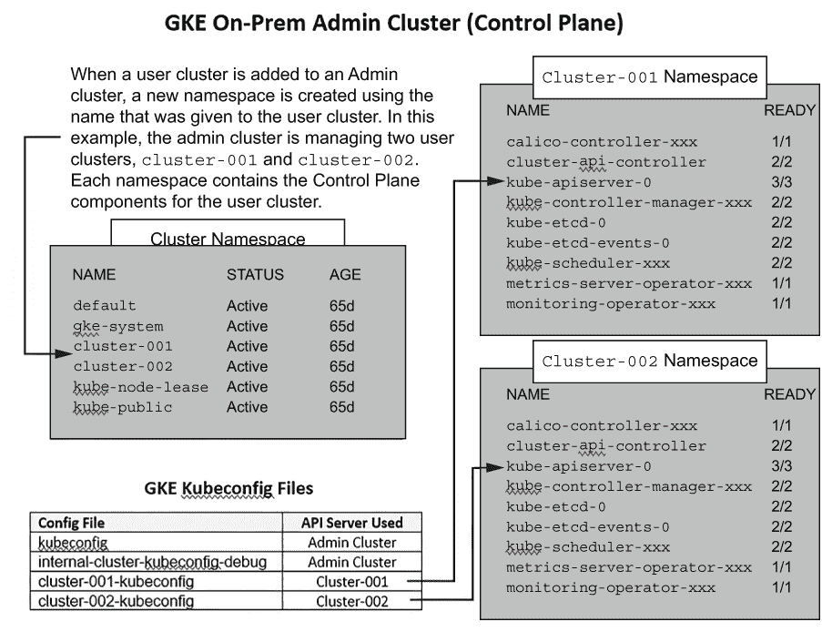

图 3.2 管理集群和用户集群配置文件

在理解系统的重要性之后，让我们继续了解集群中的每一层，从控制平面开始。

### 3.2.1 理解集群层

第一层，控制平面，包含五个或六个组件（实际上，两个控制器实际上包含多个组件）。控制平面包括提供集群管理、集群状态和调度功能的组件。我们将在下一节中详细说明每个组件，但现在，我们只想介绍这里所示的控制平面组件：

+   ETCD

+   Kubernetes API 服务器

+   Kubernetes 调度器

+   包含多个控制器的 Kubernetes 控制器管理器

    +   节点控制器

    +   端点控制器

    +   副本控制器

    +   服务帐户/令牌控制器

+   包含多个控制器的云控制器管理器

    +   路由控制器

    +   服务控制器

    +   节点控制器

要查看控制平面的图形表示，请参阅图 3.3。在本节结束时，我们将提供一个完整的组件图，包括每个组件的通信方式。

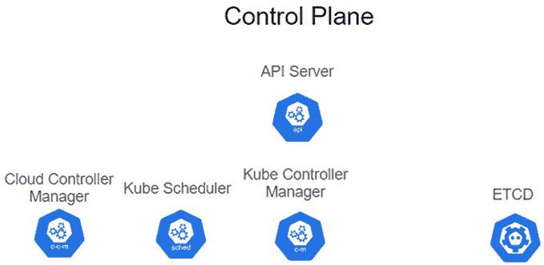

图 3.3 控制平面组件

集群的第二层是由工作节点组成的集合，它们负责运行集群工作负载。每个工作节点有三个组件协同工作以运行应用程序，如图 3.4 所示。

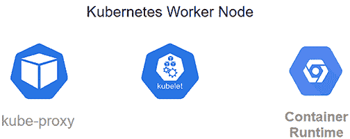

图 3.4 工作节点组件

到目前为止，我们还没有解释每个组件如何与其他组件交互。在我们展示集群交互的完整图之前，我们需要了解集群中的每个组件。在下一节中，我们将解释每个集群组件，并在本节结束时，我们将结合两个图来展示所有组件之间的连接性。

### 3.2.2 控制平面组件

如前所述，控制平面包括多达六个组件。每个组件协同工作以提供集群服务。理解每个组件是提供强大、稳定的集群的关键。

etcd

集群中的每个资源和其状态都维护在 etcd 键值数据库中。整个集群状态都存储在这个数据库中，使得 etcd 成为集群中最重要的组件。如果没有一个正常工作的 etcd 数据库，你就没有了一个正常工作的集群。

由于 etcd 非常重要，你应该在集群中始终至少运行三个副本。根据集群的大小，你可能想要运行超过三个，但无论你决定运行多少，总是运行奇数个副本。运行奇数个 etcd 节点允许集群选举一个多数领导者，最小化 etcd 集群进入脑裂状态的机会。如果一个集群进入脑裂状态，多个节点声称自己是多数领导者，这会导致数据不一致和损坏。如果你发现自己处于脑裂状态，你需要从 etcd 备份中重新创建 etcd 集群。

虽然运行多个副本会使 etcd 高可用，但您还需要创建数据库的常规备份，并将其存储在集群外的一个安全位置。如果您丢失整个集群或 etcd 数据库损坏，您将能够恢复备份以恢复节点或整个集群。我们将在本章后面解释备份 etcd 的过程。

在使 etcd 高可用并创建常规备份之后，对 etcd 的最后一个考虑因素是安全性。etcd 数据库包含每个 Kubernetes 资源，因此它将包含敏感数据，如机密，这些机密可能包含密码等数据。如果有人获得了您的 etcd 数据库副本，他们可以轻松地拉取任何资源，因为默认情况下，它们以明文形式存储。

覆盖 etcd 可能需要整整一章。有关 etcd 的更多信息，请访问主 etcd 网站 [`etcd.io/docs/`](https://etcd.io/docs/)。Google 还提供了备份 GKE 本地集群的步骤和脚本。您可以在 [`mng.bz/zm1r`](http://mng.bz/zm1r) 找到文档和脚本。

Kubernetes API 服务器

API 服务器是集群的大门。所有进入集群的请求都通过 API 服务器进入，它将与其他组件交互以完成请求。这些请求来自 kubectl CLI、Kubernetes Dashboard 或直接 JSON API 调用的用户和服务。

这实际上是一个事件驱动的中心辐射模型。API 服务器封装了 etcd。所有其他组件都与 API 服务器通信。API 服务器不会直接响应请求与控制器通信。相反，控制器会监视相关的更改事件。

Kubernetes 调度器

如果 API 服务器收到创建 Pod 的请求，它将与 Kubernetes 调度器通信，调度器将决定哪个工作节点将运行工作负载。

当工作负载尝试请求无法满足的资源或具有无法匹配的约束时，它将无法调度，Pod 也不会启动。如果发生这种情况，您需要找出调度失败的原因，或者更改您的部署代码，或者向您的节点添加资源以满足请求。

Kubernetes 控制器管理器

控制器管理器通常被称为*控制循环*。为了使 Kubernetes 保持所有资源处于请求的、期望的状态，必须将每个资源的状态与其请求状态进行比较。实现这一过程的过程被称为*控制循环*。

Kubernetes 控制器管理器由一个二进制文件组成，该文件为每个“逻辑”控制器运行单独的线程。包含的控制器及其角色在表 3.1 中显示。

表 3.1 包含的控制器及其角色

| 控制器 | 描述 |
| --- | --- |
| 节点 | 维护所有节点的状态 |
| 复制 | 维护复制控制器的 Pod 数量 |
| 端点 | 维护 Pod 到服务的映射，为服务创建端点 |
| 服务账户/令牌 | 为命名空间创建初始默认账户和 API 令牌 |

从表中可以得出的主要概念是，通过使用控制循环，管理器不断检查其控制的资源（资源），以保持它们处于声明状态。

Kubernetes 控制器管理器处理内部 Kubernetes 资源状态。如果你使用云服务提供商，你的集群将需要一个控制器来维护某些资源，这就是云控制器管理器的角色。

云控制器管理器

注意：你可能在每个你交互的集群中都不会看到这个控制器。一个集群只有在配置了与云服务提供商接口的情况下才会运行云控制器。

为了给云服务提供商提供灵活性，云控制器管理器与标准的 Kubernetes 控制器管理器是分开的。通过解耦这两个控制器，每个云服务提供商都可以向其服务中添加可能与其他提供商或基础 Kubernetes 组件不同的功能。

与 Kubernetes 控制器管理器类似，云控制器管理器使用控制循环来维护资源的期望状态。它也是一个运行多个控制器及其进程的单个二进制文件，如表 3.2 所示。

表 3.2 云控制器管理器运行的控制器

| 控制器 | 描述 |
| --- | --- |
| 节点 | 创建节点资源并维护位于云服务提供商中的节点状态 |
| 路由 | 维护网络路由以提供节点通信 |
| 服务 | 维护云服务提供商组件，如负载均衡器、网络过滤和 IP 地址 |

最后，当我们说“云服务提供商”时，我们并不是指你仅限于使用公共云服务提供商。在撰写本文时，Kubernetes 支持以下云服务提供商：

+   Amazon AWS

+   Microsoft Azure

+   Google Cloud Platform (GCP)

+   OpenStack

+   华为

+   vSphere

现在已经解释了控制平面，让我们继续讨论工作节点组件。

### 3.2.3 工作节点组件

从高层次来看，你应该对控制平面中的组件有一个基本的了解。它是负责集群交互和工作负载部署的层。单独的控制平面不能做很多事情——它需要一个目标，一旦调度，就可以运行实际的工作负载，这就是工作节点的作用所在。

kubelet

kubelet 是负责运行 Pod 并向 Kubernetes 调度器报告节点状态的组件。当调度器决定哪个节点将运行工作负载时，kubelet 从 API 服务器检索它，并根据拉取的规范创建 Pod。

kube-proxy

我们将在下一节讨论服务时详细介绍这一点，但到目前为止，你只需要了解 kube-proxy 的基本概述。kube-proxy 负责创建和删除网络规则，这些规则允许 Pod 进行网络连接。如果主机操作系统提供了数据包过滤器，kube-proxy 将使用它；如果没有提供，流量将由 kube-proxy 本身管理。

根据你为集群选择的网络提供商，你可能可以选择在无 kube-proxy 模式下运行你的集群。像 Cilium 这样的容器网络接口（CNI）使用 eBPF 提供与 kube-proxy 相同的功能，但无需在基本 CNI 部署之外添加额外的组件。

容器运行时

容器运行时是负责在主机上运行实际容器的组件。人们通常将容器运行时简称为 Docker。这是可以理解的，因为 Docker 确实将容器普及开来，但多年来，其他替代方案也被开发出来。其中两种最受欢迎的替代方案是 CRI-O 和 containerd。

曾经，容器运行时被集成到 kubelet 中，这使得添加新的运行时变得困难。随着 Kubernetes 的成熟，团队开发了容器运行时接口（CRI），它提供了简单“插入”容器运行时的能力。无论使用哪种运行时，其责任都是相同的：在节点上运行实际的容器。

现在我们已经回顾了每一层及其组件，让我们展示这两层之间的连接以及组件如何交互，如图 3.5 所示。

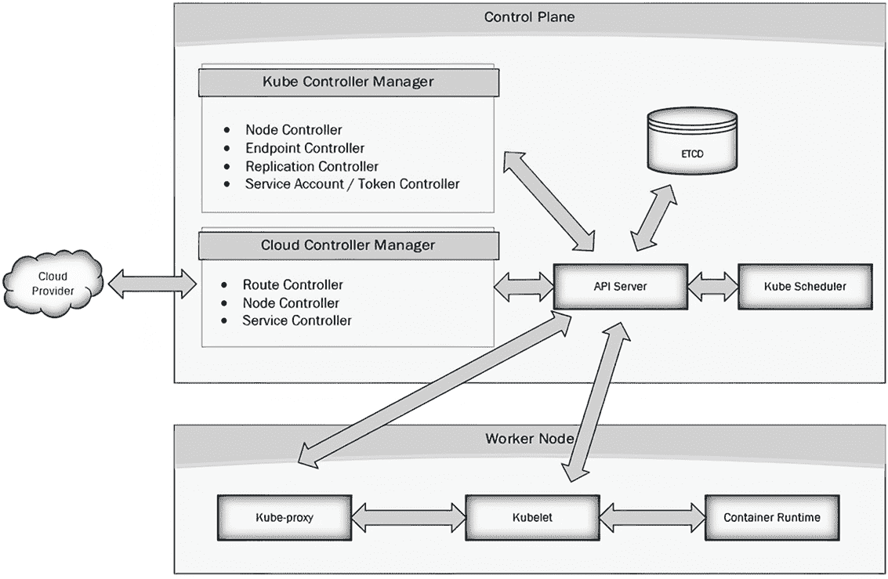

图 3.5 集群组件通信

这就完成了关于 Kubernetes 集群组件的部分。了解组件如何交互将帮助你诊断问题，并理解集群作为一个系统如何交互。

根据你的角色，了解集群组件及其交互可能不如了解集群资源那么重要。Kubernetes 资源被每个与集群交互的用户使用，用户至少应该了解最常用的资源。作为参考，你可以在 Kubernetes 网站上阅读有关 Kubernetes 资源的信息，网址为 [`mng.bz/0yRm`](http://mng.bz/0yRm)。

要在 Kubernetes 上有效地部署应用程序，你需要了解基础设施的功能，从 Kubernetes 对象开始。接下来，我们将继续探讨 DevOps 范式和 Kubernetes 集群组件。

### 3.2.4 理解声明性和命令性

在 DevOps 中，自动化框架可以使用两种不同的实现方法，被称为 *DevOps 范式*。它们包括声明性模型和命令性模型。

本章将解释每个范式，但在深入探讨它们之间的差异之前，你应该了解控制循环的概念。

理解控制循环

为了维持您期望的状态，Kubernetes 实现了一套控制循环。控制循环是一个无限循环，它始终检查资源的声明状态是否与其当前状态相同。

如果您声明部署应该有三个 Pod 副本，并且意外删除了一个 Pod，Kubernetes 将创建一个新的 Pod 以保持状态同步。图 3.6 显示了 ReplicaSet 控制循环的图形表示以及它如何维持期望的副本计数。

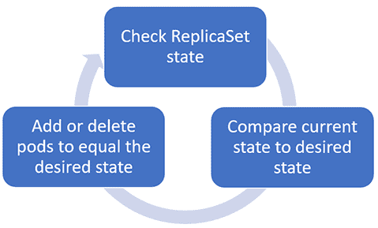

图 3.6 控制循环示例

如您所见，控制循环不需要复杂就能维持期望状态。副本控制器简单地循环遍历集群中所有的 ReplicaSet 资源，比较当前可用的 Pod 数量与声明的期望 Pod 数量。Kubernetes 将添加或删除 Pod，以使当前副本计数等于在部署上设置的计数。

理解 Anthos 的功能以及 Kubernetes 如何维护部署的声明状态对于任何 Kubernetes 用户来说都很重要，但这只是开始。因为许多供应商已经使得部署集群变得非常简单，开发人员和管理员往往忽略了理解整个系统的优势。如前所述，为了设计一个有效的集群或应用程序，您应该了解集群组件的基本功能。在下一节中，将介绍 Kubernetes 架构，包括控制平面和工作节点组件以及它们之间的交互方式。

需要理解的第一批概念之一是声明性模型和命令性模型之间的区别。表 3.3 提供了每个模型的简要描述。

表 3.3 声明性和命令性模型

| 模型 | 描述 |
| --- | --- |
| 声明性 | 开发者声明他们希望系统执行的操作；无需告诉系统*如何*执行。声明性模型使用 Kubernetes 清单来声明应用程序的期望状态。 |
| 命令性 | 开发者负责创建实现所需最终状态所需的每个步骤。创建部署的步骤完全由开发者定义。命令性模型使用 kubectl 命令（如 create、run 和 delete）告诉 API 服务器要管理哪些资源。 |

在声明性模型中，您可以在单个文件中管理多个资源。例如，如果我们想部署一个包含新命名空间、部署和服务的新 NGINX 网络服务器，我们将创建一个包含所有资源的单个 YAML 文件。然后，使用 kubectl apply 命令部署该清单，该命令将创建每个资源并添加一个包含最后应用的配置的注释。因为 Kubernetes 跟踪资源，并且您在单个文件中拥有所有资源，所以管理部署和资源的变化更容易。

在 imperative 模型中，你必须运行多个命令来创建你的最终部署。使用之前的示例，其中你想要部署一个 NGINX 服务器、一个服务和一个 Ingress 规则，你需要执行以下三个 kubectl 命令：

```
kubectl create ns web-example
kubectl run ngnix-web --image=nginx:v1 -n web-example
kubectl create service clusterip nginx-web -tcp=80:80
```

虽然这会完成与我们的声明式示例相同的部署，但它有一些限制，在简单的示例中并不立即明显。一个限制是 kubectl 命令不允许你为每个资源配置所有可用的选项。在示例中，我们部署了一个运行 NGINX 的 Pod。如果我们需要添加第二个容器来执行专门的任务，如日志记录，我们就无法通过 imperative 方式添加它，因为 kubectl 命令没有在 Pod 中启动两个容器的选项。

避免使用 imperative 部署是一个好习惯，除非你试图快速解决问题。如果你出于任何原因使用了 imperative 命令，你应该跟踪你的更改，以便你可以修改你的声明式清单，以保持它们与任何更改同步。

要理解 Kubernetes 如何使用声明式模型，你需要了解系统如何通过使用控制循环来维护声明状态与当前运行状态之间的同步，以对部署进行管理。

### 3.2.5 理解 Kubernetes 资源

在本书的整个过程中，你会看到对多个 Kubernetes 资源的引用。如本章前面所述，一个新集群包含 60 多种资源类型，不包括可能通过 CRDs（自定义资源定义）添加的任何自定义资源。有多个 Kubernetes 书籍可供选择，因此本章将只提供每个资源的简介，以提供在大多数章节中都将使用的基礎知识。

记住所有基本资源是有挑战性的，你可能并不总是有口袋指南可用。幸运的是，你可以使用一些命令来查找资源以及每个资源可用的选项。第一个命令，如下所示，列出了集群上可用的所有 API 资源：

```
kubectl api-resources
NAME               SHORTNAMES   APIVERSION   NAMESPACED     KIND
bindings                            v1          true        Binding
componentstatuses       cs          v1          false       ComponentStatus
configmaps              cm          v1          true        ConfigMap
endpoints               ep          v1          true        Endpoints
events                  ev          v1          true        Event
limitranges         limits          v1          true        LimitRange
namespaces              ns          v1          false       Namespace
nodes                   no          v1          false       Node
persistentvolumeclaims  pvc         v1          true    PersistentVolumeClaim
persistentvolumes       pv          v1          false       PersistentVolume
pods                    po          v1          true        Pod
podtemplates                        v1          true        PodTemplate
replicationcontrollers  rc          v1          true    ReplicationController
resourcequotas       quota          v1          true        ResourceQuota
secrets                             v1          true        Secret
serviceaccounts         sa          v1          true        ServiceAccount
services               svc          v1          true        Service
```

输出提供了资源的名称——如果可以在命名空间级别使用，任何简短名称——以及资源的类型。如果你知道每个资源的作用，但忘记了名称或是否可以在命名空间级别设置，这将很有帮助。如果你需要任何资源的额外信息，Kubernetes 提供了下一个命令，它为每个资源提供详细信息：

```
kubectl explain <resource name>
```

explain 命令提供了资源及其在清单中可用的所有字段的简要描述。例如，接下来你会看到一个关于 Pod 的简要描述以及创建资源时可以使用的一些字段：

```
KIND:   Pod
VERSION: v1

DESCRIPTION:
   Pod is a collection of containers that can run on a host. This resource is created by clients and scheduled onto hosts.
FIELDS:
  apiVersion  <string>
   APIVersion defines the versioned schema of this representation of an
   object. Servers should convert recognized schemas to the latest internal
   value, and may reject unrecognized values. More info:
   https://git.k8s.io/community/contributors/devel/sig-architecture/api-conventions.md#resources

  kind <string>
   Kind is a string value representing the REST resource this object
   represents. Servers may infer this from the endpoint the client submits
   requests to. Cannot be updated. In CamelCase. More info:
   https://git.k8s.io/community/contributors/devel/sig-architecture/api-conventions.md#types-kinds

  metadata   <Object>
   Standard object’s metadata. More info:
   https://git.k8s.io/community/contributors/devel/sig-architecture/api-conventions.md#metadata
```

如你所见，每个字段都有详细的解释和链接，当适用时提供额外的详细信息。

您可能无法始终访问安装了 kubectl 的系统，因此表 3.4 提供了大多数您将在集群中使用的常见资源的简要描述。

表 3.4 集群中使用的资源

| Kubernetes 资源 | 描述 |
| --- | --- |
| ConfigMaps | 存储 Pod 的配置数据。 |
| EndpointSlice | 一组用作服务目标的 Pod。 |
| Namespace | 用于在多个开发人员或应用程序之间划分集群。 |
| Node | 为 Kubernetes 集群提供计算能力。 |
| PersistentVolumeClaim | 允许应用程序声明持久卷。 |
| PersistentVolume | 在集群层配置的存储资源。PersistentVolumeClaim 请求由 PersistentVolume 提供。 |
| Pod | 一个容器或一组容器。 |
| ResourceQuota | 设置配额限制，按命名空间强制执行。 |
| Secret | 存储特定类型的秘密数据。数据字段中值的总字节数必须小于 MaxSecretSize 配置值。 |
| ServiceAccount | 提供一个身份，可以对其进行身份验证和授权以访问集群中的资源。 |
| Service | 提供一个名为抽象的软件服务，由代理监听的本地端口和确定哪些 Pod 将响应用户通过代理发送的请求的选择器组成。 |
| CustomResourceDefinition | 表示应该在 API 服务器上公开的资源。 |
| DaemonSet | 用于将容器部署到集群中的所有节点或节点子集。这包括在初始部署之后可能添加的任何新节点。 |
| Deployment | 允许对 Pod 和 ReplicaSet 进行声明性更新。 |
| ReplicaSet | 确保在任何给定时间都有指定数量的 Pod 副本正在运行。 |
| StatefulSet | StatefulSet 代表一组具有一致标识和控制 Pod 启动和停止的 Pod。 |
| Ingress | 一组规则，用于将入站连接定向到 Pod 端点。 |
| NetworkPolicy | 定义了一组 Pod 允许的网络流量。 |
| PodSecurityPolicy | 控制对影响 Pod 和容器将应用的安全上下文产生影响的能力的请求。 |
| ClusterRole | 集群级别的 PolicyRules 逻辑分组，可以作为一个单元由 RoleBinding 或 ClusterRoleBinding 引用。 |
| ClusterRoleBinding | 将 ClusterRole 中定义的权限分配给用户、组或服务账户。ClusterRoleBinding 的作用域是集群范围的。 |
| Role | PolicyRules 的逻辑分组，可以作为一个单元由 RoleBinding 引用。 |
| RoleBinding | 将 Role 中定义的权限分配给用户、组或服务账户。它可以引用同一命名空间中的 Role 或全局命名空间中的 ClusterRole。RoleBinding 的作用域仅限于其定义的命名空间。 |
| StorageClass | 描述可以动态预配 PersistentVolumes 的存储类别的参数。 |

了解可用的资源是创建最佳应用程序部署和帮助解决集群或部署问题的关键之一。如果没有对这些资源的了解，如果 Ingress 规则没有按预期工作，你可能不知道该查看什么。使用表中的资源，你可以找到三个对于 Ingress 规则所必需的资源。第一个是 Ingress 本身，第二个是服务，最后一个是端点/端点切片。

观察 Ingress 资源之间的流程，一个进入的请求会被 Ingress 控制器评估，并找到匹配的 Ingress 资源。Ingress 规则根据 Ingress 规则中定义的服务名称路由流量，最后请求被发送到由服务创建的端点对应的 Pod。

### 3.2.6 Kubernetes 资源深入探讨

如果你对资源已经有了一定的了解，对资源和它们用途的简要概述是一个很好的复习。我们意识到并非每位读者都有与 Kubernetes 资源互动多年的经验，因此在本节中，你将找到一些最常用集群资源的额外细节。

所有 GKE Kubernetes 集群共有的一个特点是，无论是在本地还是远程，它们都是基于上游 Kubernetes 代码构建的，并且它们都包含 Kubernetes 资源的基本集合。与这些基本类型交互是你可能每天都会做的事情，对每个组件、其功能和用例示例有深入理解是很重要的。

命名空间

命名空间为名称提供范围。资源名称需要在命名空间内是唯一的，但不能跨命名空间。

命名空间在集群中的租户之间创建逻辑分离，为集群提供多租户功能。根据 Gartner 的定义，“多租户是指软件操作的模式，其中一个或多个应用程序的多个独立实例在共享环境中运行。实例（租户）在逻辑上是隔离的，但在物理上是集成的” ([`mng.bz/Kl74`](http://mng.bz/Kl74))。

在命名空间级别创建的 Kubernetes 资源被称为 *namespaced*。如果你看到某个资源是 namespaced 的，这意味着该资源是在命名空间级别而不是集群级别进行管理的。

在命名空间中，你可以创建提供安全和资源限制的资源。为了提供一个安全的多租户集群，你可以使用以下类别的 Kubernetes 资源：

+   RBAC

+   资源配额

+   网络策略

+   命名空间安全资源（以前称为 Pod 安全策略）

我们将在本节中更详细地讨论每个资源，但就目前而言，你需要理解的是，命名空间是集群的逻辑分区。

当你创建服务时，也会使用命名空间，我们将在服务部分中介绍。服务被分配一个 DNS 名称，包括服务名称和命名空间。例如，如果你在名为 sales 的命名空间中创建名为 myweb1 和 myweb2 的两个服务，在一个名为 cluster.local 的集群中，分配的 DNS 名称如下：

+   myweb1.sales.svc.cluster.local

+   myweb2.sales.svc.cluster.local

Pods

Pod 是 Kubernetes 可以管理的最小部署单元，可能包含一个或多个容器。如果一个 Pod 运行多个容器，它们都共享一个公共的网络堆栈，允许每个容器使用 localhost 或 127.0.0.1 与 Pod 中的其他容器通信。它们还共享挂载到 Pod 的任何卷，允许每个容器访问共享的文件位置。

当 Pod 创建时，它会分配一个 IP 地址，分配的地址应被视为短暂的。你不应该针对 Pod 的 IP 地址，因为它在 Pod 被替换时可能会在某个时刻发生变化。要针对在 Pod 中运行的应用程序，你应该针对服务名称，这将使用端点将流量导向运行应用程序的正确 Pod。我们将在本节的相关主题中讨论端点和服务。

虽然没有关于单个 Pod 中应该有多少容器的标准，但最佳实践是添加应该一起调度和管理的容器。在决定将多个容器添加到 Pod 时，应考虑扩展和 Pod 重启等操作。这些事件在 Pod 级别处理，而不是在容器级别，因此这些操作将影响 Pod 中的所有容器。

示例

你创建一个包含 Web 服务器和数据库的 Pod。你决定你需要扩展 Web 服务器以处理当前的流量负载。当你扩展 Pod 时，它将扩展*两者*：Web 服务器和数据库服务器。

如果只想扩展 Web 服务器，你应该部署一个包含 Web 服务器的 Pod 和一个包含数据库服务器的第二个 Pod，这将允许你独立扩展每个应用程序。

许多设计模式在 Pod 中使用多个容器。Pod 中多个容器的常见用例被称为*边车*。边车是与 Pod 中的主容器一起运行的容器，通常用于在不修改主容器的情况下添加一些功能。以下是一些使用边车处理任务的常见示例：

+   日志记录

+   监控

+   Istio 边车

+   备份边车（即 Veritas NetBackup）

你可以在 Kubernetes 网站上查看其他示例，网址为[`mng.bz/91Ja`](http://mng.bz/91Ja)。

理解 Pod 是理解 Kubernetes 部署的关键点。它们将成为你将与之交互的最常见资源。

标签和选择器

Kubernetes 使用标签来识别、组织和链接资源，允许你识别属性。当你创建 Kubernetes 中的资源时，你可以提供一个或多个键值对标签，如 app:frontend-webserver 或 lob=sales。

选择器用于引用一组资源，允许你选择你想要链接或选择的资源（资源集），使用分配的标签。你可以将选择器视为一种动态分组机制——任何匹配选择器的标签都将被添加为目标。这将在下一节中展示，该节将介绍使用选择器将服务链接到运行应用程序的 Pod 的服务资源。

服务

我们可以使用许多之前提到的资源来全面了解它们如何连接以创建一个应用程序。拼图中的最后一部分是服务资源，它将应用程序暴露出来，允许它使用定义的 DNS 名称接受请求。

记住，当你创建一个包含你的应用程序的 Pod 时，它会被分配一个 IP 地址。当 Pod 被替换时，这个 IP 地址将会改变，这就是为什么你永远不希望使用 IP 地址来配置连接到 Pod 的原因。

与本质上短暂的 Pod 不同，一旦创建，服务就是稳定的，很少被删除和重新创建，提供稳定的 IP 地址和 DNS 名称。即使服务被删除和重新创建，DNS 名称也将保持不变，提供一个稳定的名称，你可以将其作为目标来访问应用程序。在 Kubernetes 中，你可以创建几种服务类型，如表 3.5 所示。

表 3.5 Kubernetes 中的服务

| 服务名称 | 描述 | 网络范围 |
| --- | --- | --- |
| 集群 IP | 在集群内部暴露服务。 | 通过使用入口规则内部和外部暴露 |
| 节点端口 | 在集群内部暴露服务。使用分配的节点端口向外部客户端暴露服务。使用任何工作节点 DNS/IP 地址与节点端口结合将提供对 Pod（s）的连接。 | 内部和外部 |
| 负载均衡器 | 在集群内部暴露服务。使用外部负载均衡器服务在集群外部暴露服务。 | 内部和外部 |

现在我们用一个例子来解释 Kubernetes 如何使用服务在一个名为 sales 的命名空间和一个名为 cluster.local 的集群中暴露一个应用程序：

1.  为 NGINX 服务器创建了一个部署。

    +   部署的名称是 nginx-frontend。

    +   部署已被标记为 app: frontend-web。

    +   已创建了三个副本。

    三个运行中的 Pod 已经被分配了 IP 地址 192.10.1.105、192.10.3.107 和 192.10.4.108。

1.  为了提供对服务器的访问，部署了一个名为 frontend-web 的新服务。在创建服务的清单中，使用了一个*标签* *选择器*来选择任何匹配 app: frontend-web 的 Pod。

1.  Kubernetes 将使用服务请求和选择器来创建匹配的端点。

    因为选择器匹配了用于 NGINX 服务器的部署中使用的标签，Kubernetes 将创建一个链接到三个 Pod IP（192.10.1.105、192.10.3.107 和 192.10.4.108）的端点。

1.  服务将从集群的 Service IP 池中接收一个 IP 地址，以及使用 <service name>.<namespace>.svc.<cluster domain> 创建的 DNS 名称。

    因为应用名称是 nginx-frontend，DNS 名称将是 nginx-frontend.sales.svc.cluster.local。

如果任何 Pod IP 由于重启而更改，kube-controller-manager 将更新端点，为您提供稳定的端点访问 Pods，即使 Pod IP 地址发生变化。

EndpointSlices

EndpointSlices 将 Kubernetes 服务映射到运行应用程序的 Pod(s)，通过服务选择器和具有匹配标签的 Pod(s)之间的匹配标签进行链接。图 3.7 展示了其图形表示。

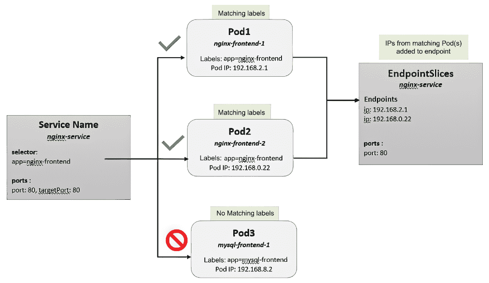

图 3.7 Kubernetes 端点

在此图中，在命名空间中创建了一个名为 nginx-service 的服务。该服务使用 key app 的选择器，其值等于 nginx-frontend。使用选择器，Kubernetes 将在命名空间中查找任何匹配的标签，标签等于 app=nginx-frontend。该命名空间有三个正在运行的 Pod，其中两个 Pod 已标记为 app=nginx-frontend。因为选择器匹配，所有匹配的 Pod IP 地址都被添加到 EndpointSlices。

Annotations

Annotations 在第一眼看起来可能类似于选择器。它们是键值对，就像标签一样，但与标签不同，它们不是由选择器用来创建服务集合的。

您可以使用 annotations 在资源中创建记录，如 Git 分支信息、图像散列、支持联系人等。

ConfigMaps

ConfigMaps 用于存储非机密的应用信息，与容器镜像分离。虽然您可以直接在容器镜像中存储配置，但这会使您的部署变得过于僵化——任何配置更改都需要您创建新的镜像。这将导致维护多个镜像，每个配置一个。

更好的方法是将配置存储在 ConfigMap 中，当 Pod 启动时读取。根据应用需求，ConfigMaps 可以作为文件挂载到容器中，或作为环境变量。使用不同配置部署镜像只需要不同的 ConfigMap，而不是整个镜像构建。

例如，假设你有一个需要根据部署位置不同配置不同的 Web 服务器镜像。你希望在容器运行的位置无关的情况下在整个组织中使用相同的镜像。为了实现这一点，你创建了一个配置为使用 ConfigMap 进行 Web 服务器配置的 Web 容器镜像。通过使用外部配置，你通过允许容器之外进行配置，使你的镜像具有可移植性。

机密

机密就像 ConfigMap 一样，因为它们包含 Pod 将使用的外部信息。与 ConfigMap 不同，机密不是以明文形式存储的；它们是使用 Base64 编码存储的。

如果你之前使用过 Base64 编码，你可能认为它与明文没有太大区别，或者没有更安全——你是对的。Kubernetes 中的机密不使用 Base64 编码来隐藏机密；它们是 Base64 编码的，以便机密可以存储二进制信息。如果有人有权查看机密，解码信息是微不足道的。因此，建议你使用像 Vault 或 Google Secret Manager 这样的外部机密管理器来加密你的机密。

注意

你也可以在存储在 etcd 中的机密时对其进行加密，但这仅加密数据库中的值，而不是 Kubernetes。如果你启用此功能，你只保护了 etcd 数据库中的机密。为了保护你的机密，你应该使用两种加密方法，因为这将保护你在集群和 etcd 中的机密。

etcd 在第 3.2.2 节“控制平面组件”中进行了讨论。

资源配额

记住，命名空间用于为应用程序或团队提供逻辑分离。因为集群可能被多个应用程序共享，我们需要有一种方法来控制单个命名空间可能对其他集群资源产生的影响。幸运的是，Kubernetes 包括资源配额来提供资源控制。

可以在任何命名空间的标准 Kubernetes 资源上设置配额；因此，资源配额是在命名空间级别设置的，并控制命名空间可以消耗的资源，包括以下内容：

+   CPU

+   内存

+   存储

+   Pods

+   服务

配额允许你控制命名空间可以消耗的资源，允许你与多个命名空间共享集群，同时为集群资源提供“保证”。

RBAC

基于角色的访问控制（RBAC）用于控制用户在集群内可以执行的操作。角色被创建并分配权限，然后这些权限被分配给用户或组，从而为集群提供权限。

为了提供基于角色的访问控制（RBAC），Kubernetes 使用角色和绑定资源。角色用于为资源或资源集创建一组权限，而绑定用于将权限集分配给用户或服务。

角色和集群角色

角色为资源或资源集创建一组权限。Kubernetes 中使用了两种不同类型的角色来定义权限的范围，如表 3.6 所示。

表 3.6 Kubernetes 中使用的角色

| 角色类型 | 范围 | 描述 |
| --- | --- | --- |
| 角色 | 命名空间 | 角色中的权限只能在创建它的命名空间中使用。 |
| 集群角色 | 集群 | 集群角色中的权限可以在集群范围内使用。 |

对于 Kubernetes 新手来说，角色的范围可能会令人困惑。Role 资源比 ClusterRole 资源更直接。当您创建一个 Role 时，它必须包含一个命名空间值，这将在指定的命名空间中创建角色。因为角色仅存在于命名空间中，所以它只能用于在自身命名空间中分配权限——它不能用于集群中的其他任何地方。

ClusterRole 在集群级别创建，可以在集群的任何地方用于分配权限。当分配到集群级别时，ClusterRole 中授予的权限将被分配给集群中所有定义的资源。然而，如果您在命名空间级别使用 ClusterRole，权限将仅在指定的命名空间中可用。

两个最常见的 ClusterRole 是内置的 admin 和 view。Role 和 ClusterRole 本身并不将一组权限分配给任何用户。要将 Role 分配给用户，您需要使用 RoleBinding 或 ClusterRoleBinding 绑定 Role。

角色绑定和集群角色绑定

角色仅定义了允许资源使用的权限集；它们不会将授予的权限分配给任何用户或服务。要授予角色中定义的权限，您需要创建一个绑定。

与角色和 ClusterRole 类似，绑定有两个范围，如表 3.7 中所述。

表 3.7 绑定类型及其范围

| 绑定类型 | 范围 | 描述 |
| --- | --- | --- |
| 角色绑定 | 命名空间 | 可以用于仅在其创建的命名空间中分配权限 |
| 集群角色绑定 | 集群 | 可以用于在集群范围内分配权限 |

既然我们已经讨论了 Kubernetes 资源，让我们继续讨论如何控制 Pod 将被调度到何处运行。

### 3.2.7 控制 Pod 调度

在本节中，我们将解释如何使用节点标签、亲和/反亲和规则、选择器、污点和容忍等特性来控制工作负载放置的位置。

随着 Kubernetes 的流行，用例已经增长并变得更加复杂。您可能会遇到需要特殊调度的部署，如下所示：

+   需要 GPU 或其他专用硬件的 Pod

+   强制 Pod 在同一个节点上运行

+   强制 Pod 在不同的节点上运行

+   特定的本地存储需求

+   使用本地安装的 NVMe 驱动器

如果你只是将清单部署到你的集群中，调度器在选择节点时不会考虑任何“特殊”的考虑因素。如果你部署了一个需要 CUDA 的 Pod，并且 Pod 被调度到一个没有 GPU 的节点上，应用程序将无法启动，因为所需的硬件将不可用给应用程序。

Kubernetes 提供了使用在节点级别和你的部署中设置的先进调度选项来强制 Pod 在特定节点或节点集上运行的能力。在节点级别，我们使用节点标签和节点污点来分组节点，在部署级别，我们使用节点选择器、亲和力/反亲和力规则以及污点/容忍度来决定 Pod 的放置。

使用节点标签和污点

在节点级别，你可以使用两种方法来控制将在节点或节点上调度的 Pod。第一种方法是标记节点，第二种是污点节点。尽管这两种方法都允许你控制 Pod 是否将在节点上调度，但它们有不同的使用场景——要么吸引 Pod，要么排斥 Pod。

吸引与排斥

你可以使用标签来分组你部署中要针对的一组节点，强制 Pod 在这些特定的节点上运行。当你标记一个节点时，你并没有拒绝任何工作负载。标签是一个可选值，如果部署中设置了使用标签的值，则可以由部署使用。这样，你为可能需要标签提供的某些要求的 Pod 设置了一个吸引力，例如，gpu=true。

要使用 kubectl 标记节点，你使用以下标签选项：

```
kubectl label nodes node1 gpu=true
```

如果一个部署需要 GPU，它将使用一个选择器告诉调度器它需要在具有标签 gpu=true 的节点上调度。调度器将寻找具有匹配标签的节点，然后将 Pod 调度到具有匹配标签的节点之一上。如果找不到匹配的标签，Pod 将无法被调度，并且不会启动。

使用标签是完全可选的。使用之前的示例标签，如果你创建的部署没有选择 gpu=true 标签，你的 Pod 不会被排除在包含该标签的节点之外。

污点（Taints）的工作方式不同：而不是创建一个邀请 Pod 在其上运行的键值，你使用污点来排斥任何无法容忍污点设置的值的调度请求。要创建一个污点，你需要提供一个键值和一个效果，这控制着 Pod 是否被调度。例如，如果你想控制具有 GPU 的节点，你可以使用 kubectl 在节点上设置一个污点，如下所示：

```
kubectl taint nodes node1 gpu=true:NoSchedule
```

这将使用键值对 gpu=true 和效果 NoSchedule 污点节点 1，这告诉调度器排斥所有不包含对 gpu=true 的容忍的调度请求。与标签不同，标签会允许未指定标签的 Pods 被调度，而具有 NoSchedule 效果的污点设置将拒绝任何不“容忍”gpu=true 的 Pod 被调度。

污点（Taints）有三个可以设置的效果：NoSchedule、PreferNoSchedule 和 NoExecute。每个效果都设置了对污点如何应用的控制：

+   NoSchedule—这是一个“硬”设置，将拒绝任何不耐受污点的调度请求。

+   PreferNoSchedule—这是一个“软”设置，将尝试避免调度一个不耐受污点的 Pod。

+   NoExecute—这影响节点上已经运行的 Pods；它不用于调度 Pod。

现在我们已经解释了如何在节点上创建标签和污点，我们需要了解部署是如何配置来控制 Pod 放置的。

使用节点选择器

当创建 Pod 时，你可以在你的清单中添加节点选择器来控制 Pod 将被调度到的节点。通过使用分配给节点的任何标签，你可以强制调度器在某个节点或一组节点上调度 Pod。

你可能不知道集群上所有可用的标签。如果你有权限，可以使用 kubectl 通过带有 —show-labels 选项的 get nodes 命令来获取节点和所有标签的列表，如下所示：

```
kubectl get nodes --show-labels
```

这将列出每个节点及其分配的标签，如下所示：

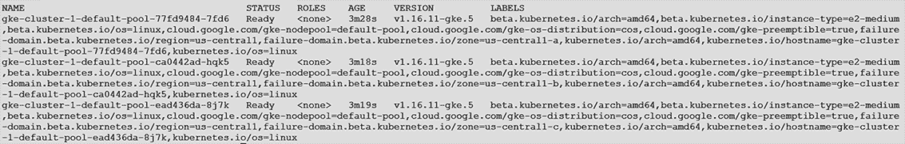

你还可以在 GCP 控制台中看到节点标签，如图 3.8 所示，通过点击节点的详细信息。

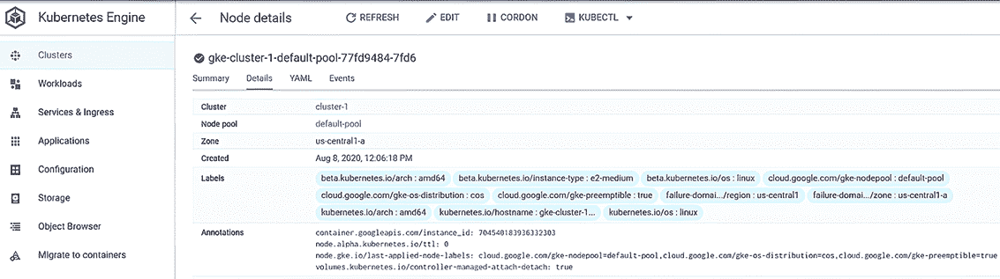

图 3.8 GCP 节点控制台视图

在镜像中使用集群中的标签，我们可以创建一个清单，通过使用节点选择器在第三个节点上部署 NGINX，如下所示：

```
apiVersion: apps/v1
kind: Deployment
metadata:
 Labels:
   run: nginx-test
 name: nginx-test
spec:
 replicas: 1
 selector:
   matchLabels:
   run: nginx-test
 template:
   metadata:
   creationTimestamp: null
   labels:
     run: nginx-test
   spec:
    containers:
    - image: bitnami/nginx
     name: nginx-test
   nodeSelector:
     kubernetes.io/hostname: gke-cluster-1-default-pool-ead436da-8j7k
```

使用节点选择器中的值 kubernetes.io/hostname:gke-cluster-1-default-pool-ead436da-8j7k，我们强制 Pod 在集群的第三个节点上运行。为了验证 Pod 是否在正确的节点上调度，我们可以使用 kubectl 使用 -o wide 选项获取 Pods，如下所示，如图 3.9 所示：

```
kubectl get pods -o wide
```

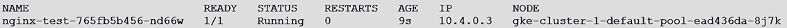

图 3.9 获取具有宽输出的 Pods

节点选择器选项允许你使用任何标签来控制将用于调度你的 Pods 的节点。如果节点选择器值与任何节点不匹配，Pod 将无法调度，并将保持挂起状态，直到它被删除或在节点上更新匹配选择器的标签。在下一个示例中，如图 3.10 所示，我们尝试将部署强制到具有集群中不存在的主机值的节点选择器。首先，我们可以使用 kubectl get pods 查看所有 Pods 的状态来检查状态。

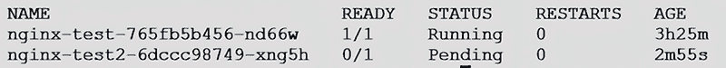

图 3.10 get pods 输出

注意，nginx-test2 Pod 处于挂起状态。检查 Pod 为什么无法启动的下一步是描述 Pod：

```
kubectl describe pod nginx-test2-6dccc98749-xng5h
```

将显示 Pod 的描述，如图 3.11 所示，包括输出底部的当前状态。

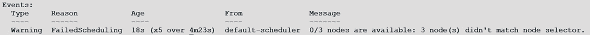

图 3.11 kubectl describe 输出

在消息区域，状态显示 0/3 个节点可用：3 个节点未匹配节点选择器。因为我们的节点选择器没有匹配任何现有标签，Pod 无法启动。要解决这个问题，您应验证节点选择器是否正确，如果正确，请验证是否有节点具有相同的标签集。

使用亲和规则

节点亲和性是控制 Pod 在哪个节点上运行的另一种方式。与节点选择器不同，亲和规则可以执行以下操作：

+   包含比简单的匹配标签更复杂的语法。

+   根据亲和规则匹配进行调度，但如果找不到匹配项，Pod 将在任何节点上调度。

与只有一个值的节点选择器不同，节点亲和规则可以包含操作符，允许进行更复杂的选择。表 3.8 包含操作符列表及其评估描述。

表 3.8 操作符及其描述

| 操作符 | 描述 |
| --- | --- |
| In | 检查标签是否在列表中。如果列表中有任何值，则视为匹配。 |
| NotIn | 检查标签是否在列表中，如果值不在列表中，则视为匹配。 |
| Exists | 检查标签是否存在；如果存在，则视为匹配。注意：标签的值无关紧要，且在匹配中不进行评估。 |
| DoesNotExist | 检查标签是否存在；如果标签与列表中的任何标签不匹配，则视为匹配。注意：标签的值无关紧要，且在匹配中不进行评估。 |
| Gt | 用于比较标签中的数值；如果值大于（Gt）标签，则视为匹配。注意：此操作符仅与单个数字一起使用。 |
| Lt | 用于比较标签中的数值；如果值小于（Lt）标签，则视为匹配。注意：此操作符仅与单个数字一起使用。 |

使用节点亲和规则，您可以根据需求选择软亲和性或硬亲和性。您可以使用两个偏好创建亲和规则：RequiredDuringSchedulingIgnoredDuringExecution，也称为硬亲和性，和 preferredDuringSchedulingIgnoredDuringExecution，也称为软亲和性。如果您使用硬亲和性，亲和性必须匹配，否则 Pod 将无法调度。但是，如果您使用软亲和性，如果匹配，则将使用亲和规则。如果没有找到匹配项，Pod 将在集群中的任何节点上调度。

创建节点亲和规则

节点亲和性在 PodSpec 中的 manifest 中设置，在亲和性字段下，作为 nodeAffinity。为了更好地解释如何使用节点亲和规则，让我们使用一个示例集群创建一个使用亲和规则的 manifest。

该集群有三个节点，如表 3.9 所示。在规则中我们将使用的标签将以粗体显示。

表 3.9 集群中的节点

| 节点 | 节点标签 |
| --- | --- |
| 节点 1 | beta.kubernetes.io/arch=amd64,beta.kubernetes.io/instance-type=e2-medium,beta.kubernetes.io/os=linux,cloud.google.com/gke-nodepool=default-pool,cloud.google.com/gke-os-distribution=cos,cloud.google.com/gke-preemptible=true,failure-domain.beta.kubernetes.io/region=us-central1,**failure-domain.beta.kubernetes.io/zone=us-central1-a**,kubernetes.io/arch=amd64,kubernetes.io/hostname=gke-cluster-1-default-pool-77fd9484-7fd6,kubernetes.io/os=linux |
| 节点 2 | beta.kubernetes.io/arch=amd64,beta.kubernetes.io/instance-type=e2-medium,beta.kubernetes.io/os=linux,cloud.google.com/gke-nodepool=default-pool,cloud.google.com/gke-os-distribution=cos,cloud.google.com/gke-preemptible=true,failure-domain.beta.kubernetes.io/region=us-central1,**failure-domain.beta.kubernetes.io/zone=us-central1-b**,kubernetes.io/arch=amd64,kubernetes.io/hostname=gke-cluster-1-default-pool-ca0442ad-hqk5,kubernetes.io/os=linux |
| 节点 3 | beta.kubernetes.io/arch=amd64,beta.kubernetes.io/instance-type=e2-medium,beta.kubernetes.io/os=linux,cloud.google.com/gke-nodepool=default-pool,cloud.google.com/gke-os-distribution=cos,cloud.google.com/gke-preemptible=true,failure-domain.beta.kubernetes.io/region=us-central1,**failure-domain.beta.kubernetes.io/zone=us-central1-c**,kubernetes.io/arch=amd64,kubernetes.io/hostname=gke-cluster-1-default-pool-ead436da-8j7k,kubernetes.io/os=linux |

我们希望创建一个部署，在 us-central1-a 或 us-central1-c 区域中创建一个 NGINX 服务器。使用以下清单，我们可以使用基于 failure-domain.beta.kubernetes.io/zone 键的亲和力规则在任一区域创建 Pod：

```
apiVersion: v1
kind: Pod
metadata:
 name: nginx-affinity
spec:
 affinity:
  nodeAffinity:
   requiredDuringSchedulingIgnoredDuringExecution:
    nodeSelectorTerms:
    - matchExpressions:
     - key: failure-domain.beta.kubernetes.io/zone
      operator: In
      values:
      - us-central1-a
      - us-central1-c
 containers:
 - name: nginx-affinity
  image: bitnami/nginx
```

通过在 matchExpressions 中使用键 failure-domain.beta.kubernetes.io/zone，我们设置亲和力评估为 true，如果节点标签匹配 us-central1-a 或 us-central1-c。因为集群中的第二个节点具有标签值 us-central2-b，它将评估为 false，并且不会被选中来运行 Pod。

使用 Pod 亲和力和反亲和力规则

Pod 亲和力规则将确保已部署的 Pod 在具有匹配标签的同一组节点上运行，而反亲和力规则用于确保 Pod 不会在具有匹配标签的同一节点上运行。Pod 亲和力规则用于与节点亲和力规则不同的用例。节点亲和力允许您根据集群节点标签选择节点，而 Pod 亲和力和反亲和力规则使用已在集群中运行的 Pod 的标签。

创建 Pod 亲和力规则

当你创建一个亲和规则时，你是在告诉调度器将你的 Pod 放置在具有与亲和规则中选定的值匹配的现有 Pod 的节点上。Pod 亲和规则，就像节点亲和规则一样，可以创建为软亲和规则或硬亲和规则。它们也使用与节点亲和规则相同的运算符，包括 In*、NotIn*、Exists*和 DoesNotExist，但它们*不支持*Gt 或 Lt 运算符。

Pod 亲和规则在 PodSpec 中的亲和性和 podAffinity 字段中指定。它们需要一个节点亲和规则不使用的额外参数——topologyKey。topologyKey 被 Kubernetes 用来创建一个将用于检查亲和规则的节点列表。使用 topologyKey，你可以决定根据不同的过滤器（如区域或节点）来查找匹配项。

例如，假设你有一个按节点许可的软件包，每次运行软件一部分的 Pod 运行在另一个节点上时，你需要购买额外的许可证。为了降低成本，你决定创建一个亲和规则，强制 Pod 在现有已许可的 Pod 运行的地方运行。现有的 Pod 使用名为 license 的标签，其值为 widgets。以下是一个示例清单，它创建了一个在具有标签 license=widgets 的现有 Pod 的节点上的 Pod。由于我们需要在同一节点上运行以维护许可，我们将使用一个按 kubernetes.io/hostname 过滤的 topologyKey：

```
apiVersion: v1
kind: Pod
metadata:
 name: widgets-license-example
spec:
 affinity:
  podAffinity:
   requiredDuringSchedulingIgnoredDuringExecution:
   - labelSelector:
     matchExpressions:
     - key: license
      operator: In
      values:
      - widgets
    topologyKey: kubernetes.io/hostname
 containers:
 - name: nginx-widgets
  image: nginx-widgets
```

清单告诉 Kubernetes 创建名为 nginx-widgets 的 Pod，在已经运行使用标签 license 且值为 widgets 的 Pod 的主机上运行名为 nginx-widgets 的镜像。

创建 Pod 反亲和规则

反亲和规则与亲和规则相反。亲和规则根据一组规则对 Pod 进行分组，而反亲和规则用于在不同的节点上运行 Pod。当你使用反亲和规则时，你是在告诉 Kubernetes 你*不希望*Pod 运行在另一个节点上，该节点上已经运行了一个具有规则中声明的值的现有 Pod。使用反亲和规则的一些常见用例包括强制 Pod 避免其他正在运行的 Pod 或跨可用区域分散 Pod。

Pod 反亲和规则在 PodSpec 中的亲和性和 podAntiAffinity 字段中指定。它们也需要 topologyKey 参数来过滤将用于比较亲和规则的节点列表。

在我们的亲和示例中，我们使用了一个使用节点主机名的 topologyKey。如果我们为部署使用相同的键，则不会考虑区域；它只会避免将 Pod 放置在另一个正在运行的 Pod 所在的同一节点上。尽管 Pod 会分散到各个节点，但选定的节点可能都在同一区域，这将无法跨区域分散 Pod。

为了将 Pod 分散到不同的区域，我们将使用标签 failure-domain.beta.kubernetes.io/zone，并且我们将使用操作符 In 来比较标签 app 的值为 nginx-frontend，如以下代码片段所示。我们还将使用软反亲和规则，而不是硬规则，允许 Kubernetes 在没有其他选择的情况下使用相同的区域：

```
apiVersion: v1
kind: Pod
metadata:
 name: nginx-frontend-antiaffinity-example
spec:
 podAntiAffinity:
  preferredDuringSchedulingIgnoredDuringExecution:
   podAffinityTerm:
    labelSelector:
     matchExpressions:
     - key: app
      operator: In
      values:
      - nginx-frontend
    topologyKey: failure-domain.beta.kubernetes.io/zone
 containers:
 - name: nginx-frontned
  image: bitnami/nginx
```

通过使用 failure-domain.beta.kubernetes.io/zone 作为拓扑键，我们告诉 Kubernetes 我们希望避免将任何具有 app=nginx-frontend 标签的 Pod 放置在同一个区域。

使用污染和容忍度

虽然你可能更可能需要将 Pod 调度到特定的节点，但存在一些用例，你可能希望只为特定的工作负载保留特定的节点，从而基本上禁用默认调度。与 nodeSelector 和亲和规则不同，污染用于自动排斥，而不是吸引，Pod 到节点。当你想要节点默认拒绝任何调度尝试，除非部署明确指定了要在节点上调度的正确“容忍度”时，这很有用。例如，想象你有一个包含数百个节点和几个具有 GPU 可用性的节点的集群。因为 GPU 很昂贵，我们希望限制这些节点上的 Pod 只用于需要 GPU 的应用程序，拒绝任何标准调度请求。

使用如 nodeSelector 或亲和规则之类的控制项不会告诉 Kubernetes 调度器避免使用某个节点。这些提供了开发者控制 Pod 部署方式的能力，如果它们不提供这些中的任何一个，调度器将尝试使用集群中的任何节点。因为 GPU 很昂贵，我们希望拒绝任何在不需要使用 GPU 的节点上运行 Pod 的调度尝试。

创建节点污染

要停止调度器在节点上调度 Pod，你需要使用带有 taint 命令的 kubectl 和要污染的节点、键值以及效果。键值可以是任何你想要分配的值，效果可以是以下三个值之一：NoSchedule、PreferNoSchedule 或 NoExecute*，如表 3.10*中所述。

表 3.10 污染效果

| Effect | 描述 |
| --- | --- |
| NoSchedule | 如果 Pod 没有指定与节点污染匹配的容忍度，它将不会被调度到该节点上。 |
| PreferNoSchedule | 如果 Pod 没有指定与节点污染匹配的容忍度，调度器将尝试避免在节点上调度 Pod。 |
| NoExecute | 如果 Pod 已经在节点上运行并且添加了污染，如果 Pod 不匹配污染，它将被从节点上驱逐。 |

例如，如果我们有一个名为 node1 的节点上有一个 GPU，我们可以使用以下命令来污染该节点：

```
kubectl taint nodes node1 gpu=:NoSchedule
```

污点命令中的键告诉调度器必须匹配什么污点才能允许 Pod 在节点上调度。如果 Pod 请求没有使用容忍匹配污点，则基于 NoSchedule 的效果，调度器不会在节点上调度 Pod。

创建具有容忍的 Pod

默认情况下，一旦节点设置了污点，调度器将不会尝试在该受污节点上运行任何 Pod。按设计，您设置污点是为了告诉调度器避免在任何调度中使用该节点，除非部署明确请求在该节点上运行。要允许 Pod 在已设置污点的节点上运行，您需要在部署中提供一个*容忍*。容忍用于告诉调度器 Pod 可以“容忍”节点上的污点，这将允许调度器使用与容忍匹配并分配了污点的节点。

注意污点不会吸引 Pod 请求——它们只会拒绝任何没有设置容忍的 Pod。因此，要将 Pod 引导到具有污点的节点上运行，您需要设置一个容忍和一个节点选择，或者节点亲和性。选择器将告诉调度器使用具有匹配标签的节点，然后容忍告诉调度器 Pod 可以容忍节点上设置的污点。因为容忍告诉调度器“偏好”具有匹配污点的节点，如果找不到这样的节点，调度器将使用集群中具有匹配标签的任何节点。

关键要点容忍和节点选择器/亲和规则协同工作，以选择 Pod 将要运行的节点。

通过在您的清单的 pod.spec 部分分配一个或多个包含要匹配的键、操作符、可选值和污点效果的容忍来创建容忍。

该键必须分配给与您想要在节点上调度 Pod 的节点匹配的键。操作值告诉调度器简单地查找键（存在）或匹配键值（等于）。如果您使用等于操作符，您的容忍必须包含一个值字段。最后，必须匹配效果，Pod 才能在节点上调度。

要调度一个可以容忍 node1 的 GPU 污点的 Pod，您需要在 PodSpec 中添加以下内容：

```
spec:
 tolerations:
 - key: "gpu"
  operator: "Exists"
  effect: "NoSchedule"
```

添加容忍告诉调度器 Pod 应该被分配到具有 gpu 污点键和 NoSchedule 效果的节点。

控制 Pod 的调度位置是确保您的应用程序部署能够满足分配的 SLA/SLO 目标的关键点。

## 3.3 进阶主题

本节包含了一些我们希望在章节中包含的进阶主题。我们认为这些主题很重要，但它们不是理解章节主要主题所必需的。

### 3.3.1 聚合 ClusterRoles

当向集群添加新组件时，通常会创建一个新的 ClusterRole，并将其分配给用户以管理该服务。有时可能会创建一个角色，并且你可能注意到被分配了 ClusterRole 的 admin 用户默认具有对新组件的权限。在其他时候，你可能注意到新添加的组件，如 Istio，不允许内置的 admin 角色使用任何 Istio 资源。

看起来像 admin 这样的角色默认没有权限访问每个资源可能听起来有些奇怪。Kubernetes 包含两个 ClusterRoles，它们提供某种形式的 admin 访问权限：admin ClusterRole 和 cluster-admin ClusterRole。它们可能听起来很相似，但分配给它们的权限方式非常不同。

cluster-admin 角色很简单——它为所有权限分配了通配符，提供对每个资源的访问权限，包括新资源。admin 角色没有分配通配符权限。分配给 admin 角色的每个权限通常都是明确分配的。因为该角色不使用通配符，所以任何新的权限都需要为新资源分配。

为了使这个过程更容易，Kubernetes 有一个称为聚合 ClusterRoles 的概念。当创建一个新的 ClusterRole 时，可以通过分配一个 aggregationRule 来将其聚合到任何其他 ClusterRole。以下是一个帮助解释聚合如何工作的示例。默认的 admin ClusterRole 看起来与下一个示例类似：

```
kind: ClusterRole
apiVersion: rbac.authorization.k8s.io/v1
metadata:
 name: admin

...

aggregationRule:
 clusterRoleSelectors:
  - matchLabels:
    rbac.authorization.k8s.io/aggregate-to-admin: "true"
```

在这个代码片段中，你可以看到 admin ClusterRole 有一个包含 rbac.authorization.k8s.io/aggregate-to-admin: 'true' 的 aggregationRule。当创建一个新的 ClusterRole 时，如果它使用相同的聚合规则，它可以自动与内置的 admin ClusterRole 聚合。例如，已经部署到集群中的新 CRD 创建了一个新的 ClusterRole。因为新 ClusterRole 的权限应该分配给管理员，所以它已经创建了一个与 rbac.authorization.k8s.io/aggregate-to-admin: "true" 匹配的聚合规则，如下所示：

```
apiVersion: rbac.authorization.k8s.io/v1
kind: ClusterRole
metadata:
 name: aggregate-example-admin
 labels:
  rbac.authorization.k8s.io/aggregate-to-admin: "true"
rules:
- apiGroups: ["newapi"]
 resources: ["newresource"]
 verbs: ["get", "list", "watch", "create", "update", "patch", "delete"]
```

这将创建一个名为 aggregated-example-admin 的新 ClusterRole，将 get、list、watch、create、patch 和 delete 等操作分配给 newapi apiGroup 中的资源 newresource。这个新的 ClusterRole 可以绑定到任何你想分配权限的用户，但由于权限是管理员所需的，它还分配了一个标签 rbac.authorization.k8s.io/aggregate-to-admin: "true"，这与在 admin ClusterRole 中分配的聚合规则相匹配。标签匹配，因此 API 服务器上的控制器会注意到匹配的标签，并将新 ClusterRole 的权限与 admin ClusterRole 合并。

### 3.3.2 自定义调度器

在 Kubernetes 中，最被误解的概念之一是集群如何调度工作负载。你经常会听到在 Kubernetes 集群上部署的应用程序具有高可用性，当正确部署时，它们确实是。为了部署高可用性应用程序，了解 kube-scheduler 如何做出决策以及你的部署可以影响其决策的选项是有益的。

默认的 Kubernetes 调度器，kube-scheduler，负责根据一系列标准将 Pod 调度到工作节点，包括节点亲和性、污点和容忍度以及节点选择器。尽管 Kubernetes 包含了基础调度器，但你并不局限于只使用单个调度器来处理所有部署。如果你需要基础调度器不包括的特殊调度考虑因素，你可以通过在清单中指定调度器来创建自定义调度器，如果没有提供，则将使用默认调度器。创建自定义调度器超出了本书的范围，但你可以在 Kubernetes 网站上了解更多关于自定义调度器的信息：[`mng.bz/jm9y`](http://mng.bz/jm9y)。

以下是一个将调度器设置为名为 custom-scheduler1 的自定义调度器的 Pod 的例子：

```
apiVersion: v1
kind: Pod
metadata:
  name: nginx-web
spec:
 containers:
 - name: nginx
    image: bitnami/nginx
 schedulerName: custom-scheduler1
```

Kubernetes 调度器监视 API 服务器以查找需要调度的 Pod。一旦确定一个 Pod 需要被调度，它将通过一个多阶段决策过程来确定最合适的节点，这个过程将过滤掉节点，然后对未被过滤掉的节点进行评分。

## 3.4 例子和案例研究

使用本章的知识，解决接下来案例研究中提出的每个要求。记住，如果你在不同地区部署了你的 GKE 集群，请将练习中的示例区域替换为你的区域。为了节省任何潜在的成本，示例只需要每个区域一个节点。

### 3.4.1 FooWidgets Industries

你被要求协助 FooWidgets Industries 处理他们新部署的 GKE 集群。他们很快发现他们没有内部技能来完成部署，因此集群的当前状态是在三个 GCP 区域中的简单、新的集群。

集群概述和需求

FooWidgets Industries 有一个部署在三个区域（us-east4-a、us-east4-b 和 us-east4-c）的 GKE 集群。公司根据内部标准和专用硬件使用有不同的 Pod 放置要求。他们包括了期望的工作负载放置和应分配给节点的标签的分解，如表 3.11 所示。

表 3.11 工作负载放置

| 区域 | 所需工作负载 | 标签/污点 | 节点名称 |
| --- | --- | --- | --- |
| us-east4-a | 任何工作负载 | disk=fast | gke-cls1-pool1-1d704097-4361 |
| us-east4-b | 仅需要 GPU 的工作负载 | workload=gpu | gke-cls1-pool1-52bcec35-tf0q |
| us-east4-c | 任何工作负载 |  | gke-cls1-pool1-e327d1de-6ts3 |

工作说明书要求你在表中提供需求。集群尚未配置到初始部署阶段，需要你完成以下配置：

+   创建任何节点标签或污点，以根据表中记录的支持工作负载实现工作负载放置。

+   创建一个使用 NGINX 镜像的示例部署，以演示根据 FooWidgets Industries 提供的需求成功放置工作负载。

下一个部分包含解决 FooWidgets 需求的方案。你可以跟随方案进行操作，或者如果你感到舒适，配置你的集群以满足需求并使用方案来验证你的结果。

FooWidgets Industries 解决方案：标签和污点

第一项要求是创建可能需要的任何标签或污点。使用需求表，我们可以得知我们需要在 us-east4-a 中的节点上添加 disk=fast 的标签。这个标签将允许部署强制在具有所需快速磁盘的应用程序节点上进行调度。第二项要求是将 us-east4-b 区域中运行的任何工作负载限制为仅需要 GPU 的应用程序。对于这个要求，我们决定将 us-east4-b 区域中的所有节点污点化为 workload=gpu。

为什么一个解决方案使用标签，而另一个使用污点？你可能还记得，标签和污点用于完成不同的调度需求：我们使用标签来吸引工作负载，而使用污点来排斥它们。在需求中，FooWidgets 明确指出 us-east4-a 和 us-east4-c 可以运行任何类型的工作负载，但 us-east4-b 必须仅运行需要 GPU 的工作负载。如果创建了一个没有在节点上指定标签的部署，调度器仍然会考虑该节点作为潜在的调度节点。标签用于强制部署到特定的节点，但它们不会拒绝不包含标签请求的工作负载。这种行为与被分配了污点的节点大不相同。当一个节点被污点化时，它会排斥任何不包含分配节点污点容忍的工作负载。如果一个部署没有为节点污点指定任何容忍，调度器将自动排除污点节点进行工作负载调度。

创建标签和污点

我们需要在 us-east4-a 中的节点上添加 disk=fast 的标签。为了添加标签，我们使用 kubectl label 命令，提供节点和标签：

```
kubectl label node gke-cls1-pool1-1d704097-4361 disk=fast
```

接下来，我们需要在 us-east4-b 区域的节点上添加 workload=gpu 的污点。记住，污点会排斥任何不能容忍分配节点污点的请求，但它不会吸引工作负载。这意味着你还需要添加一个标签来引导 GPU Pods 到正确的节点。为了污点节点，我们使用 kubectl taint 命令，提供节点名称和污点：

```
kubectl taint node gke-cls1-pool1-52bcec35-tf0q workload=gpu:NoSchedule
```

然后，为节点添加标签以吸引 GPU Pods：

```
kubectl label node gke-cls1-pool1-52bcec35-tf0q workload=gpu
```

注意，我们没有在 us-east4-c 区域的节点上添加标签或污点，因为该区域可以运行任何工作负载。

现在节点已标记，您需要创建示例部署以验证工作负载放置是否符合表格中的要求。

创建需要快速磁盘访问的部署

要将需要快速磁盘访问的部署强制到 us-east4-a 区域，您需要在部署中添加一个 nodeSelector。以下代码片段创建了一个包含使用标签 disk=fast 的 nodeSelector 的 NGINX 服务器，强制工作负载在 us-east4-a 区域的节点上运行：

```
apiVersion: v1
kind: Pod
metadata:
 labels:
  run: nginx-fast
 name: nginx-fast
spec:
 containers:
 - image: nginx
  name: nginx-fast
 restartPolicy: Always
 nodeSelector:
  disk: fast
```

当您创建并执行清单时，nodeSelector 会告诉调度器使用带有标签 disk:fast 的节点。为了验证选择器是否正常工作，我们可以使用 -o wide 列出 Pods，以列出 Pod 运行的节点。在 us-east4-a 中，我们有一个单独的节点，gke-cls1-pool1-1d704097-436。kubectl get pods 的缩略输出确认 Pod 已正确调度：

```
NAME        READY   STATUS     AGE     IP        NODE              
nginx-fast  1/1     Running    4m49s   10.8.0.4  gke-cls1-pool1-1d704097-4361
```

现在您已确认需要快速磁盘访问的 Pod 可以正确调度，您需要创建一个部署来测试需要 GPU 的工作负载。

创建需要 GPU 的部署

任何需要 GPU 的工作负载都需要在 us-east4-b 区域的节点上调度。我们已经在该区域的节点上添加了污点，为了确认需要 GPU 的工作负载可以正确调度，我们需要创建一个使用以下代码的容忍度测试部署：

```
apiVersion: v1
kind: Pod
metadata:
 labels:
  run: nginx-gpu
 name: nginx-gpu
spec:
 containers:
 - image: nginx
  name: nginx-gpu
 restartPolicy: Always
 nodeSelector:
  workload: gpu
 tolerations:
 - key: "workload"
  operator: "Equal"
  value: "gpu"
  effect: "NoSchedule"
```

当应用此代码片段时，您可以使用 kubectl get pods -o wide 验证 Pod 是否正在 us-east4-b 区域的正确节点上运行：

```
NAME       READY    STATUS   AGE    IP          NODE              
nginx-gpu  1/1      Running  3s     10.8.2.6    gke-cls1-pool1-52bcec35-tf0q
```

将输出与列出每个区域节点的表格进行比较，可以验证 Pod 已在 us-east4-b 区域的节点上调度。

恭喜！您已成功解决工作负载需求，并证明了您理解如何根据节点标签和污点调度工作负载。

## 摘要

+   控制计划接收并存储对象并调度工作负载，而工作节点是实际容器在 Kubernetes 调度器调度后执行的地方。

+   可用两种不同的部署模型：声明式和命令式。

+   您已经了解了 Kubernetes 资源及其功能。

+   您可以使用选择器、污点、容忍度和亲和力以及反亲和力规则来控制哪些节点将用于特定工作负载。
