# 4 Anthos 服务网格：大规模的安全性和可观察性

Onofrio Petragallo

本章涵盖

+   旁路代理和无代理架构

+   介绍 Istio 的主要功能

+   使用 Istio 的安全和可观察性

+   探索 Anthos 服务网格

+   带有代码的实际示例

云原生的一个关键方面是将您的应用程序拆分为微服务。这意味着原本可能运行在单个服务器上的应用程序现在有多个服务，由多个 Pod 作为独立组件支持。随着应用程序扩展其服务，您可能会遇到的问题变得难以调试。随着这种附加的复杂性，我们需要一个工具来帮助组织、安全和增强微服务引入的扩展复杂性。另一个重要问题是，企业通常拥有大量的微服务，并且并不总是能够控制、管理和观察它们——这是服务网格可以解决的问题。

在本章中，我们将讨论 Anthos 服务网格（ASM）以及 ASM 从流行的开源框架 Istio（[`istio.io/`](https://istio.io/)）继承的特性，Istio 是用于创建、管理和实施服务网格的框架。

服务网格的实施不仅通过专用通信管理控制平面促进了微服务之间的通信；还包括观察服务之间通信的工具——提高可观察性、增强安全性、控制应用流量流和模拟应用故障。

Anthos 服务网格是 Google 管理的一项服务，它允许企业从单一位置管理混合云或多云架构中存在的所有服务网格，提供对所有微服务的完整和深入可见性。服务网格拓扑的可视化和与 Cloud Monitoring 的完全集成，为用户提供识别失败的工作负载或其他问题的工具，使问题解决更快。

Anthos 服务网格提供的安全功能允许您通过相互认证（mTLS；[`mng.bz/1Mly`](http://mng.bz/1Mly)）管理通信的认证、授权和加密，以确保微服务之间通信的双向安全和信任；mTLS 确保了高水平的安全性，最小化了相关风险。Istio 的流量管理功能为用户提供工具，通过请求路由、故障注入、请求超时、断路器和镜像来操纵流量。

正如您所看到的，Istio 包含了几个可能难以调试的复杂功能。目前市场上很少有产品提供对 Istio 的支持，这使您必须自行支持您自己的服务网格。Google 通过在 Anthos 中包含 ASM 来解决这一不足，为您的 Kubernetes 集群和 Istio 提供单一的支持点。

在详细讨论 Anthos 服务网格功能和 Istio 之前，让我们首先解释一下服务网格实际上是什么。

## 4.1 技术要求

本章的实践部分需要你能够访问一个运行在 GCP 上的 Kubernetes 集群，其部署模式如下：一个至少有三个节点、每个节点有四个 CPU 和 16 GB RAM 的 GKE 集群。

## 4.2 什么是服务网格？

要了解服务网格是如何工作的以及为什么它正在成为微服务工具箱中的标准工具，你需要了解服务网格提供的内容。采用服务网格的主要优势包括以下能力：

+   观察和监控各个微服务之间的所有通信

+   可用微服务之间的安全连接

+   通过多集群和多云架构模式提供具有弹性的服务（分布式服务）

+   提供高级流量管理：A/B 测试、流量分割和金丝雀发布

服务网格是微服务架构中的一个基础设施层，它控制服务之间的通信。我们不仅可以在运行在 Kubernetes 集群中的微服务架构内创建服务网格，还可以创建跨越多个集群或甚至运行在虚拟机上的非微服务服务的单个服务网格。

服务网格管理每个微服务的所有入站（或传入）流量和出站（或传出）流量。流量管理是一个复杂的话题，大多数用户都不想处理。为了减轻这种负担，Istio 不要求开发者在他们的应用逻辑中进行任何更改；相反，服务网格通过使用 Sidecar 代理方法或无代理方法来处理所有这些。

Sidecar 代理是服务网格的主要组件之一，它管理每个微服务的入站和出站流量，同时将自己从微服务的应用逻辑中抽象出来。因为所有流量都通过 Sidecar 代理流动，所以它可以监控这些流量，并将指标和日志发送到集中式控制平面。

以下三种方法可供选择，其中 Sidecar 代理是创建服务最常见的方法：

+   *Sidecar 代理*—在微服务架构中使用，每个代理都与微服务相连，具有与微服务相同的生命周期，但作为单独的进程执行，如图 4.1 所示。

    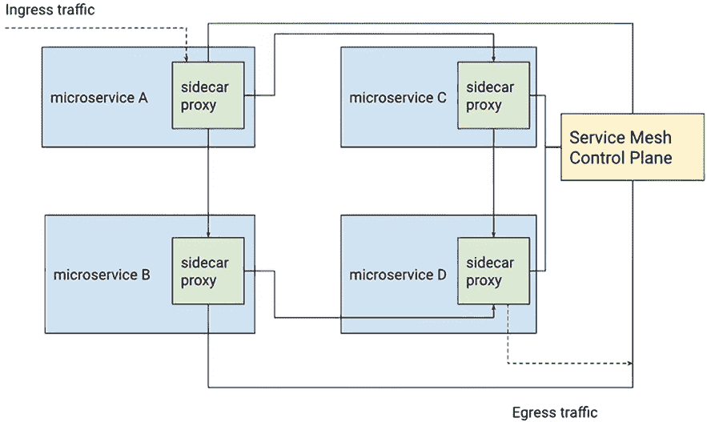

    图 4.1 Sidecar 代理架构

+   *无代理*—在微服务架构中使用，微服务可以通过 Google 开发的远程过程调用系统 gRPC 直接将遥测数据发送到控制平面。

+   *虚拟机内的代理*—一个 L7 代理作为进程或代理在虚拟机内部运行，可以像 Sidecar 代理一样添加到服务网格中。

在了解了服务网格是什么以及创建服务网格的方法之后，让我们回顾 Anthos 服务网格如何使用每种方法。为了实时监控来自各种服务网格网络微服务之间所有传入和传出通信的遥测数据，ASM 使用以下两种方法：

+   使用 Envoy（[`www.envoyproxy.io/`](https://www.envoyproxy.io/)）代理的无代理代理方法，每个 Pod 上附加的开源服务代理，以获取实时遥测，如图 4.2 所示。

    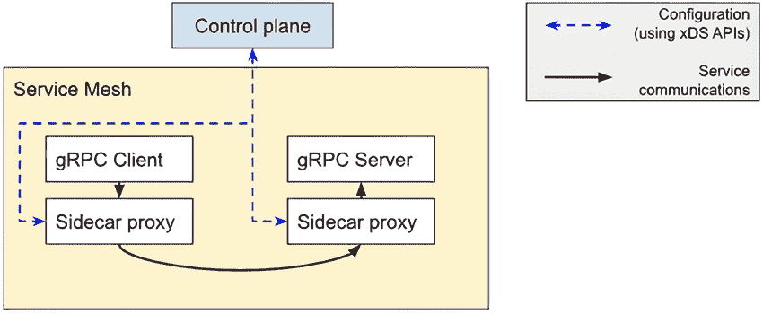

    图 4.2 侧边车代理方法

+   使用 Google Cloud Traffic Director（[`cloud.google.com/traffic-director`](https://cloud.google.com/traffic-director)）的无代理方法，该方法可以使用 xDS API（[`github.com/envoyproxy/data-plane-api`](https://github.com/envoyproxy/data-plane-api)）与 gRPC 一起使用，正如图 4.3 所示，这是 Envoy 与控制平面通信所使用的技术。

    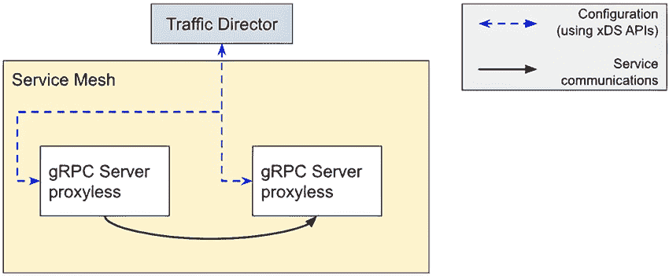

    图 4.3 无代理方法

无代理方法从您的部署中移除了 Istio 侧边车。通过移除侧边车，我们消除了服务网络流量中的额外跳数，从而降低了网络延迟，提高了服务的整体响应时间。

单个服务网格可以包含使用标准 Istio 侧边车和无代理方法的服务的组合。这种灵活性允许您为不同的应用程序使用正确的方法，包括使用无代理方法进行 gRPC，为不使用 gRPC 的服务使用侧边车，以及为使用 gRPC 的服务使用侧边车。

如前几章所述，Anthos 是一个完整的平台，由 Google 提供，用于构建在混合云或多云平台上运行的应用程序。Anthos 服务网格是主要组件，为开发人员和集群管理员提供服务管理。

在下一节中，我们将探讨 Istio 的特性，它是 Anthos 服务网格的基础。

## 4.3 Istio 简介

Istio 是一个开源平台，提供了一种统一的方式来集成微服务、管理微服务之间的流量流、执行策略和聚合遥测数据。Istio 的控制平面在底层集群管理平台（如 Kubernetes）之上提供了一个抽象层。Istio 的主要功能（[`mng.bz/WA6x`](http://mng.bz/WA6x)）如下：

+   对 HTTP、gRPC、WebSocket 和 TCP 流量的自动负载均衡

+   使用强大的路由规则、重试、故障转移和故障注入进行细粒度流量行为控制

+   支持访问控制、速率限制和配额的可插拔策略层和配置 API

+   集群内所有流量的自动指标、日志和跟踪，包括集群入口和出口

+   在集群中实现基于强身份验证和授权的安全服务间通信

由于其开源性质，Istio 可扩展且适用于各种环境：例如，您可以在本地、云中、虚拟机内或与微服务一起执行它，允许您根据安全和监控需求自定义服务网格。

要理解 Istio，您需要了解系统的底层架构。在下一节中，我们将解释 Istio 的组件及其提供的功能。

### 4.3.1 Istio 架构

Istio 的灵活架构允许您从头开始实现服务网格。开发者在使用集群之前不需要安装 Istio——服务网格可以在开发者实现和部署他们的服务之前或之后部署。记住，如图 4.4 所示，Istio 使用边车代理注入来拦截来自微服务网络内外部的入站和出站流量，因此没有对开发者的依赖。

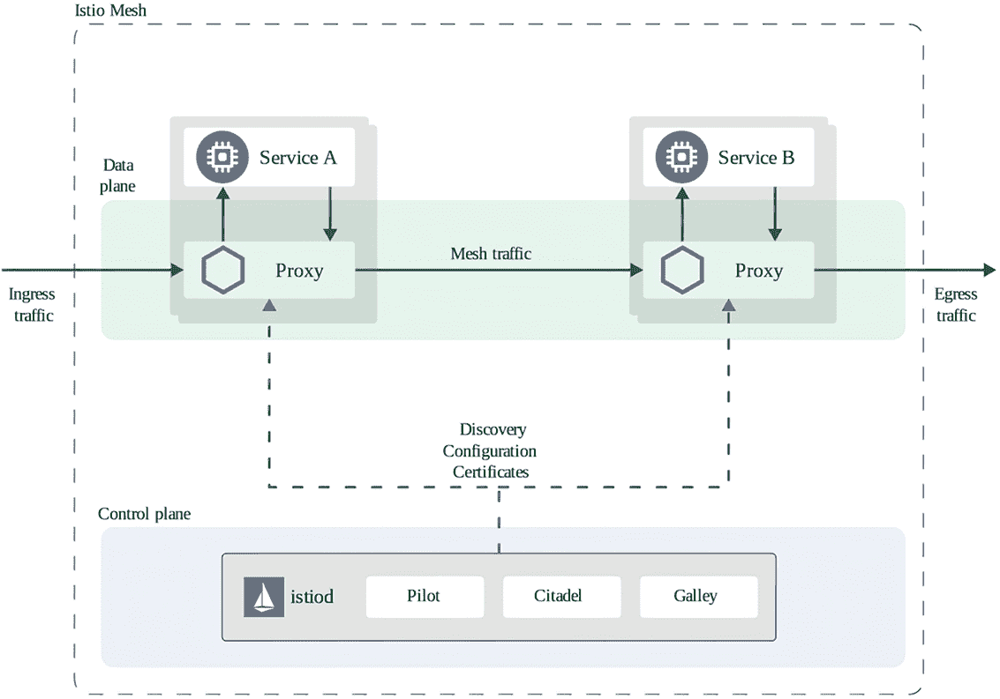

图 4.4 详细 Istio 架构

从 Istio 版本 1.5 开始，Istio 架构的主要组件是边车代理和 istiod，其中包含三个子组件：Pilot、Citadel 和 Galley*.*

Istiod 提供服务发现、配置和证书管理，以及控制流量行为进入 Envoy 代理特定配置的高级路由规则，在运行时将它们注入到边车中。它还充当证书颁发机构，生成证书以允许数据平面中的安全 mTLS 通信。Istiod 包含以下三个进程以提供其服务：

+   *Pilot*—负责跨服务网格部署的 Envoy 代理实例的生命周期。Pilot 抽象了平台特定的服务发现机制，并符合任何可以消费 Envoy API 的边车。

+   *Galley*—解释 Kubernetes 的 YAML 文件，并将它们转换为 Istio 理解的格式。Galley 使得 Istio 能够与 Kubernetes 以外的环境（例如虚拟机）一起工作，因为它将各种配置数据转换为 Istio 理解的通用格式。

+   *Citadel*—通过内置的身份和凭证管理，实现强大的服务间和终端用户身份验证。

到目前为止，我们已经从高层次概述了 Istio，但现在让我们详细探讨 Istio 的功能。我们可以将这些功能分为三个主要类别：流量管理、安全和可观察性。

### 4.3.2 Istio 流量管理

Istio 提供强大的流量管理功能（[`istio.io/latest/docs/tasks/traffic-management/`](https://istio.io/latest/docs/tasks/traffic-management/)），允许用户控制入站和出站流量。这种控制不仅限于简单地路由流量到特定服务；它还提供了在应用程序的不同版本之间分割流量以及模拟故障和超时的能力。表 4.1 展示了 Istio 的流量管理功能。

表 4.1 Istio 流量管理功能

| 功能 | 描述 |
| --- | --- |
| 入口 | 控制服务网格的入口流量，通过 Istio 网关使用 TLS 或 mTLS 暴露服务到服务网格之外。在另一章中，我们将深入探讨 Anthos 的入口。 |
| 出口 | 控制服务网格的出口流量，将流量路由到外部系统，对出站流量执行 TLS，并配置出站网关使用 HTTPS 代理。 |
| 请求路由和流量分割 | 动态地将流量路由到多个微服务版本，或以逐步和受控的方式将流量从某个版本迁移到另一个版本。 |
| 故障注入 | 提供可配置的 HTTP 延迟和故障注入功能，通过 HTTP 状态码允许开发者发现生产环境中可能出现的问题。 |

流量管理是 Istio 的强大功能之一，允许开发者完全控制流量，甚至可以控制到将单个用户引导到应用程序的新版本，而其他所有请求都导向当前版本。故障注入功能使开发者能够在服务之间引入延迟，模拟 HTTP 延迟或故障，以验证应用程序对意外问题的反应。所有这些功能都可以在不修改应用程序代码的情况下由用户使用，这为旧“传统”开发时代提供了巨大优势。

安全是每个人的责任，但并非每个人都有足够的背景知识来编写增强应用程序安全性的代码。就像流量管理功能一样，Istio 提供了额外的安全功能，而无需开发者编写任何代码。

在下一节中，我们将解释 Istio 和 ASM 包含的安全功能。

### 4.3.3 Istio 安全性

网格中的服务需要通过网络连接相互通信，因此您需要考虑额外的安全措施来防御各种攻击，包括中间人攻击和未知服务通信。Istio 包括增强应用程序安全性的组件（[`istio.io/latest/docs/tasks/security/`](https://istio.io/latest/docs/tasks/security/)），从内置的证书颁发机构到对等认证和授权，帮助您采用零信任策略。

Istio 提供的第一个组件是为了提高您的应用程序安全性，包括处理证书管理，包括带有现有根证书的 Istio 证书授权（CA）。在密码学中，证书授权机构或认证机构是一个发行数字证书的实体。数字证书证实了证书中命名的主题对公钥的所有权。这允许其他人依赖与对应于认证公钥的私钥相关的签名或声明——证明证书所有者的身份。CA 充当受信任的第三方：既受证书所有者的信任，也受依赖证书的实体的信任。

在一个组织中，根证书的签署者可能希望继续负责签署组织中所有实体的所有证书。也可能出现负责签署根证书的人希望将签署证书的责任委托给下属实体。在这种情况下，我们将下属实体称为*委托 CA*。

Istio 的证书授权可以通过多种方式配置。默认情况下，CA 生成一个自签名的根证书和密钥，用于签署微服务的证书。Istio 的 CA 还可以使用管理员指定的证书和密钥以及管理员指定的根证书来签署证书。最后一种配置在企业环境中最为常见，其中 CA 配置了现有的根证书或委托 CA 签名证书和密钥。

Istio 中的 CA 用于为网格中的每个工作负载安全地提供强大的身份。证书使用 X.509 证书颁发，这是一个定义公钥证书格式的标准。X.509 证书用于许多协议中，包括 TLS/SSL，这是 HTTPS 的基础，是浏览网页的安全协议。

Istio 代理，与每个 Envoy 代理并行运行，与 istiod 的 Istio CA 组件协同工作，以实现大规模的关键和证书轮换自动化。由于证书的轮换和分发是自动化的，一旦配置完成，集群的操作员或用户几乎不需要额外的开销——这是 Istio 确保服务间通信安全的一个强大功能。

证书是我们服务网格中额外安全的基础。在下一节中，我们将讨论身份验证和相互 TLS 加密——一个依赖于颁发的证书来保护网格工作负载的安全层。

Istio 身份验证

Istio 使用对等身份验证进行服务间身份验证和验证发起连接的客户端。Istio 还提供 mTLS 作为全栈传输身份验证解决方案，无需修改任何应用程序代码即可启用。对等身份验证提供了以下好处：

+   每个服务都有一个强大的身份，代表其在集群中的角色，以实现集群内部的互操作性。

+   之间所有服务通信的加密。

+   一个密钥管理系统，用于自动化密钥和证书的生成、分发和轮换。

Istio 允许使用 JSON Web Token (JWT) 验证进行请求级别的认证，支持许多认证提供者（例如，Google Auth [[`developers.google.com/identity`](https://developers.google.com/identity)]）。

Istio 授权

Istio 为操作员提供了一种定义授权策略的机制，以控制对服务网格、命名空间以及服务网格内工作负载的访问，如图 4.5 所示。可以通过类型（如 TCP 或 HTTP）和请求者的身份来限制流量。授权提供的优势如下：

+   *授权*—在工作负载之间以及从用户到工作负载之间。

+   *灵活的语义*—操作员可以在 Istio 属性上定义自定义条件，并使用 DENY 和 ALLOW 动作调整策略以满足其需求。

+   *高性能*—Istio 授权在 Envoy 代理上原生化应用。

+   *灵活性*—原生支持 gRPC、HTTP、HTTPS 和 HTTP2，以及所有常规 TCP 协议。

+   *分布式*—每个 Envoy 代理运行自己的授权引擎，授权每个请求执行。

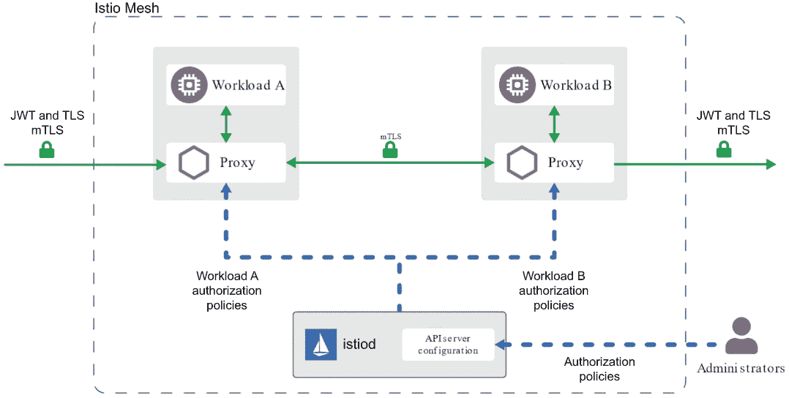

图 4.5 Istio 授权架构

在本章开头，我们提到服务网格的一个优势是能够组织微服务。随着服务数量的增长，你的架构复杂性也会增加。维护健康状态和排查服务问题的唯一方法是拥有一个强大的工具集，允许你深入了解网格活动。在下一节中，我们将介绍你可以与 Istio 一起使用的工具，以查看网格中的活动。

### 4.3.4 Istio 可观察性

为了提供对服务网格的视图，Istio 提供了多个附加组件 ([`istio.io/latest/docs/tasks/observability/`](https://istio.io/latest/docs/tasks/observability/))，这些组件提供分布式跟踪、指标和日志记录以及仪表板。

Istio 包含一些选项，提供具有分布式跟踪的网格。分布式跟踪允许你跟踪用户通过所有服务，并了解请求延迟、序列化和并行性。你可以配置 Istio 将分布式指标发送到不同的系统，包括 Jaeger ([`www.jaegertracing.io/`](https://www.jaegertracing.io/))、Zipkin ([`zipkin.io/`](https://zipkin.io/)) 和 Lightstep ([`lightstep.com/`](https://lightstep.com/))。

Jaeger 是 Uber 技术公司作为开源发布的一个分布式跟踪系统，用于监控和调试基于微服务的分布式系统，包括以下功能：分布式上下文传播、分布式事务监控、根本原因分析、服务依赖分析以及性能优化。

Zipkin 和 Lightstep 是其他分布式跟踪系统。它们帮助收集解决服务架构中延迟问题的所需时间数据。功能包括收集和查找此数据。

您可以从 Envoy 代理和 TCP 会话收集所有指标和日志，并使用 Istio 指标自定义指标，通过 Kiali ([`kiali.io/`](https://kiali.io/))、Prometheus ([`prometheus.io/`](https://prometheus.io/)) 或 Grafana ([`grafana.com/`](https://grafana.com/)) 使所有数据可用。

如图 4.6 所示的 Kiali，是一个基于 Istio 的服务网格的管理控制台，可以根据来自 Envoy 侧边代理的遥测数据构建服务图。Kiali 提供仪表板和可观察性，并让您通过强大的配置和验证功能操作您的网格。它通过推断流量拓扑显示您的服务网格结构，并显示您的网格健康状况。Kiali 提供详细的指标、强大的验证、Grafana 访问以及与 Jaeger 的强大集成，用于分布式跟踪。此应用允许您使用 Kubernetes JWT 令牌提供原生 RBAC 权限。用户提供的 JWT 允许访问他们在集群中可以访问的所有命名空间，同时拒绝所有没有对命名空间权限的用户——所有这些都不需要集群管理员进行任何配置。

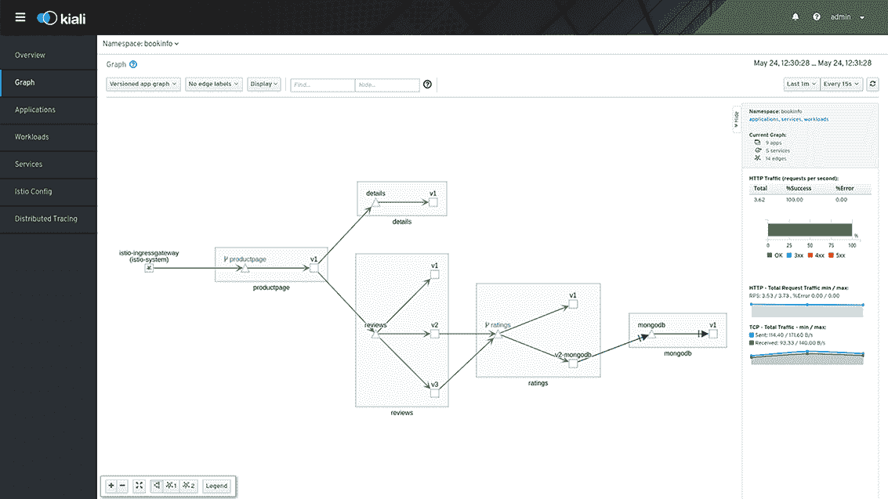

图 4.6 Kiali 控制台 UI

Prometheus 是一个开源的系统监控和警报应用，具有以下特性：一个多维数据模型，通过指标名称和键值对识别时间序列数据，以及一个名为 PromQL 的灵活查询语言来使用这种维度。时间序列收集通过 HTTP 的拉模型进行，并且支持通过中介网关推送时间序列。

Grafana 是一个开源的可视化和分析软件应用。它允许您查询、可视化、警报和探索您的指标，无论它们存储在哪里。它为您提供了将时间序列数据库数据转换为美丽图表和可视化的工具。Grafana 可以连接到 Prometheus 和 Kiali。

现在我们已经了解了 Istio，让我们看看 Istio 在由 Google Cloud 管理的 Anthos 服务网格中使用时提供了哪些功能和优势。

## 4.4 什么是 Anthos 服务网格？

Anthos Service Mesh 提供了一系列功能和工具，帮助您以统一的方式观察和管理安全、可靠的服务。使用 Anthos Service Mesh，您将获得 Google 测试和支持的 Istio 分发版，由 Google 管理，让您能够在 Google Cloud 和其他平台上创建和部署服务网格，并获得完整的 Google 支持。

根据您想要设计和实施的架构，在 Anthos Service Mesh 中使用 Istio 功能会有所不同，包括全云、多云、混合云或边缘。每种实现都有不同的可用功能；因此，有必要检查各种场景支持的功能可用性（见 [`mng.bz/81R2`](http://mng.bz/81R2)）。

在安装 Anthos Service Mesh 之前，请始终检查文档并选择最合适和最新的配置配置文件。配置配置文件是 IstioOperator API 使用的 YAML 文件，用于定义和配置与 Anthos Service Mesh 一起安装的功能。截至编写时，您可以在以下场景中安装 ASM：

+   在单个项目中运行的 Google Cloud 上的 Anthos 集群 (GKE)

+   在不同项目之间运行的 Google Cloud 上的 Anthos 集群 (GKE)

+   在 VMware 上的 Anthos 集群 (GKE)

+   在裸金属上运行的 Anthos 集群 (GKE)

+   在 AWS 上运行的 Anthos 集群 (GKE)

+   附加集群 Amazon Elastic Kubernetes Service (Amazon EKS)

+   附加集群 Microsoft Azure Kubernetes Service (Microsoft AKS)

## 4.5 安装 ASM

您在 GCP 上的 GKE 集群和本地安装 ASM 的方式不同。您可以在 ASM 网站上查看最新的安装程序，网址为 [`mng.bz/El7l`](http://mng.bz/El7l)。解释安装的每个选项超出了单章的范围，但将 ASM 部署到 GKE 集群并包含所有测试组件的步骤只需要几个步骤，如下所述，针对 ASM 1.12 在集群中：

1.  按以下方式下载 ASM 安装脚本：

    ```
    curl https://storage.googleapis.com/csm-artifacts/asm/asmcli_1.12 > asmcli
    ```

1.  使脚本可执行如下：

    ```
    chmod +x asmcli
    ```

1.  使用 asmcli 安装 ASM：

    ```
    ./asmcli install --project_id PROJECT_ID --cluster_name CLUSTER_NAME --cluster_location CLUSTER_LOCATION --output_dir ./asm-downloads --enable_all
    ```

在 Istio 部署到 Kubernetes 集群后，您可以直接开始配置和使用它。要做的第一件事是定义您想要采用哪种方法来使代理在服务网格内进行通信。

在下一节中，我们将定义 Istio 如何处理边车代理注入。

### 4.5.1 边车代理注入

由于可以在每个工作负载或微服务旁边注入边车代理，因此激活 Anthos Service Mesh 功能是一个简单、透明的过程。您可以通过更新 Pod 的 Kubernetes 清单手动注入边车代理，或者您可以使用自动边车注入。默认情况下，所有命名空间都禁用了边车自动注入。要为单个命名空间启用自动注入，请执行

```
kubectl label namespace NAMESPACE istio.io/rev=asm-managed --overwrite
```

其中 NAMESPACE 是您应用程序服务的 *namespace* 名称，rev=asm-managed 是发布渠道（见 [`mng.bz/Nm72`](http://mng.bz/Nm72)）*。

所有通道都基于一般可用（GA）版本（尽管某些功能可能并非总是 GA，如标记所示）。新的 Anthos Service Mesh 版本首先发布到快速通道，随着时间的推移，将升级到常规和稳定通道。这种进展允许您选择满足您的业务、稳定性和功能需求的通道。

由于 sidecar 在创建 Pod 时注入，在您执行命令后，您必须重启任何正在运行的 Pod 以使更改生效。当 Kubernetes 调用 webhook 时，将应用 admissionregistration.k8s.io/v1beta1#MutatingWebhookConfiguration 配置。默认配置将 sidecar 注入到任何命名空间中带有 istio-injection=enabled 标签的 Pod 中。该标签应与上一个命令一致。istio-sidecar-injector 配置映射指定了注入 sidecar 的配置。

您重启 Pod 的方式很大程度上取决于它们的创建方式，如这里所述：

1.  如果您使用了部署，您应该首先更新或重新创建部署，如下所示，这将重启所有 Pod，并添加 sidecar 代理：

    ```
    kubectl rollout restart deployment -n YOUR_NAMESPACE
    ```

1.  如果您没有使用部署，您应该按照以下方式删除 Pod。它们将自动与 sidecar 一起重新创建：

    ```
    kubectl delete pod -n YOUR_NAMESPACE --all
    ```

1.  检查命名空间中的所有 Pod 是否都注入了 sidecar：

    ```
    kubectl get pod -n YOUR_NAMESPACE
    ```

1.  在以下示例中，您将注意到上一个命令的输出中，READY 列表明每个工作负载存在两个容器：*主容器和 sidecar 代理容器*：

    ```
    NAME          READY  STATUS  RESTARTS  AGE
    YOUR_WORKLOAD      2/2   Running  0     20s
    ```

我们现在已经看到了如何使用带有 sidecar 代理的方法安装 Anthos Service Mesh，以及选择正确配置文件的重要性。现在让我们看看 Anthos Service Mesh 的其他功能和使用它们的优点。

### 4.5.2 统一可观察性

Anthos Service Mesh 最重要的和最有用的功能之一是可观察性。通过代理架构实现服务网格并利用 Google Cloud Monitoring 服务确保对网格中存在的各种微服务之间发生的事情有深入的了解。

通过代理，每个微服务可以自动发送遥测数据，开发者无需在应用程序中添加任何代码。所有流量都被代理拦截，遥测数据被发送到 Anthos Service Mesh。此外，每个代理都会将数据发送到 Google Cloud Monitoring 和 Google Cloud Logging，无需额外开发，使用 Google 提供的 API。

第一章中讨论的 Anthos Service Mesh 控制平面提供了两个主要仪表板：表格视图和拓扑视图。在表格视图中，您可以看到集群中部署的所有服务。您可以查看所有指标，并且可以添加 SLI 和 SLO 以更好地监控您的服务。

在拓扑视图中，服务网格以图形地图的形式表示。所有服务，如工作负载、Pod、系统服务和相关所有者都作为节点网络连接。此视图提供了对整个服务网格整体性能的全面了解，以及对每个节点内部信息的深入了解。

### 4.5.3 运营敏捷性

如果可观察性是管理服务网格最“明显”的功能之一，那么在微服务架构中管理流量则是另一个管理操作的基本资产。由于 Anthos Service Mesh 基于 Istio，它继承了 Istio 提供的多数流量和网络管理功能([`mng.bz/DZ79`](http://mng.bz/DZ79)*)，因此接下来让我们看看这些功能。

请求路由和流量分割

使用 Istio，您可以将流量重定向到集群中部署的同一微服务的多个版本，并安全地（在可能的配额下）控制从微服务的旧版本到新安装版本的部分流量。这两种选项都允许您在部署新功能或修复可能影响业务的错误时保持敏捷。

例如，让我们假设我们需要紧急修复一个微服务。在新版本部署后，我们可以将一小部分入站流量重定向，验证修复是否正确，然后完全将流量重定向到新版本，而无需任何停机时间。如果修复仅针对特定情况执行，则可以同时保持微服务的两个版本活跃，根据预先设定的规则将流量重定向到两个版本，而不必删除运行良好的旧版本。

通过这些流量管理功能，Anthos Service Mesh 可以管理 A/B 测试，允许您将特定百分比的流量引导到服务的某个新版本。当您想通过先使用一小部分用户流量测试新版本的服务，如果一切顺利，然后逐步增加百分比同时淘汰旧版本时，这种做法非常有用。

多亏了这些功能，可以直接测试发布的服务的新版本，实现金丝雀部署或渐进式发布策略。如果服务的新版本在少量流量下没有出现任何问题，您可以将所有流量转移到新版本，并丢弃旧版本。

在图 4.7 中，使用带有流量分流的金丝雀部署来将 5%的流量重定向到测试服务 A 的新版本。

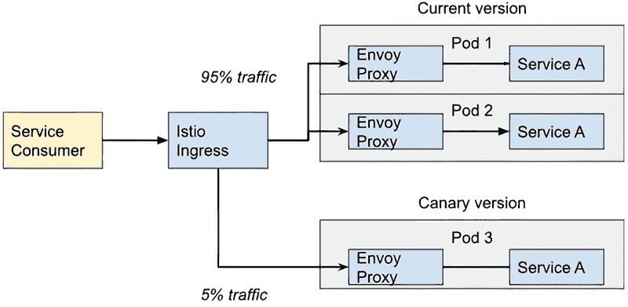

图 4.7 基于 流量的 Istio 金丝雀部署功能

在图 4.8 中，使用带有流量分流的金丝雀部署将 iPhone 的流量重定向以测试服务 A 的新版本。


图 4.8 基于 user-agent 的 Istio 金丝雀部署功能

管理生产环境的运维部门利用这些功能，在发布修复和新版本的微服务时计划。这些场景中的每一个都可以即时执行，而不会干扰最终用户。

电路断开

微服务架构是为了可扩展性、敏捷性和弹性而生的，但设计并实现这些架构以管理高负载或管理外部服务的集成并不总是容易，这可能导致可能的停机或超时。如前所述，服务网格独立于应用程序代码和使用的编程语言，因此这有助于采用专门用于管理办公室的功能。

允许您管理架构中的超时、故障和负载的功能称为 *电路断开* ([`mng.bz/lJAM`](http://mng.bz/lJAM))。在设计微服务架构时，您必须始终确保能够正确处理故障。这些故障可能不仅是由应用程序代码中的错误引起的，也可能是由外部因素引起的，例如网络或基础设施。在发生故障或无法达到 SLA（特定服务的可用性和/或性能）的情况下，电路断开会自动允许您将流量重定向到另一个微服务或外部服务，以限制停机时间或限制最终用户功能损失。

让我们看看一个例子。在图 4.9 中，服务消费者正在调用 Istio 入口以调用 Service A，该服务分布在两个 Pod 中。假设 Service A 在 Pod 1 中存在负载问题，变得不可达。多亏了电路断开功能，Istio 将关闭代理到 Pod 1 中 Service A 的连接，并将所有流量重定向到 Pod 2 中的代理，直到 Pod 1 中的 Service A 正常工作。

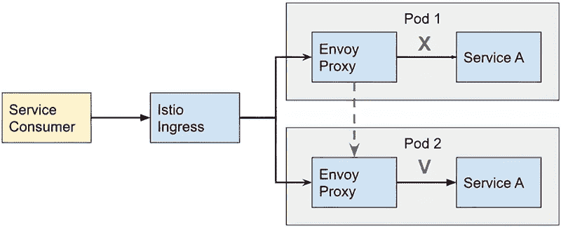

图 4.9 Istio 电路断开功能示例

出口控制

通常情况下，当涉及到服务网格时，一个重要的功能是控制入口网关以确保网络的安全性。然而，如果我们发现自己处于需要我们控制服务网格出向流量的情况下（例如，法规要求，如 PCI [[`mng.bz/Bl7g`](http://mng.bz/Bl7g)]）或客户的要求，那么，多亏了 Istio 和出口网关控制，我们可以覆盖所需的安全。

使用 Anthos Service Mesh，您可以通过专用出口网关或必要时使用外部 HTTPS 代理来配置从服务网格到外部服务（HTTP 或 HTTPS）的流量路由。对于这些外部服务的连接，从服务网格执行 TLS 原始（SDS 或文件挂载）。请参阅图 4.10 以了解说明。

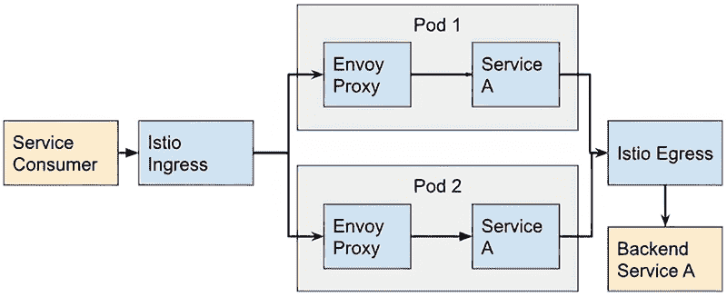

图 4.10 Istio 出口控制示例

### 4.5.4 政策驱动安全

自从采用容器、共享服务和分布式架构以来，减轻内部威胁和最小化及限制数据泄露变得更加困难，确保工作负载之间的通信保持加密、认证和授权。Anthos Service Mesh 的安全功能([`mng.bz/dJOX`](http://mng.bz/dJOX)*)*有助于减轻这些威胁，配置上下文相关的服务级别或上下文相关的网络。

在 Istio 等解决方案出现之前，保护应用程序是应用程序开发者的责任，许多任务复杂且耗时，包括以下内容：

+   加密应用程序与其他服务之间的通信，这需要证书管理和维护

+   创建特定语言的模块以基于开放身份标准（如 JSON Web 令牌（JWTs））进行访问认证

+   实施复杂的授权系统以限制使用呈现的 JWT 上的断言允许的权限

而不是开发者花费时间创建和管理这种安全措施，他们可以利用 Istio 的功能，这些功能无需任何额外代码即可解决每个任务。

使用 Anthos Service Mesh，可以通过声明性标准和无需修改任何应用程序代码的方式，采用与零信任安全原则一致的深度防御姿态。ASM 的主要安全特性包括管理的私有证书颁发机构、基于身份的访问控制、请求声明感知的访问控制策略、使用基于身份的代理进行用户认证以及访问日志和监控。

第一个特性，管理的私有证书颁发机构（Mesh CA），包括为 mTLS 颁发证书的 Google 管理的多区域私有证书颁发机构。Mesh CA 是一个高度可靠和可扩展的服务，针对云平台上的动态扩展工作负载进行了优化。Mesh CA 允许您在 Anthos 集群之间依赖单一信任根。当使用 Mesh CA 时，您可以使用工作负载身份池提供粗粒度隔离。默认情况下，如果客户端和服务器不在同一工作负载身份池中，则认证失败。

下一个特性，基于身份的访问控制（防火墙）策略，允许您根据 mTLS 身份与对等方的 IP 地址配置网络安全策略。这使您能够创建独立于工作负载网络位置的策略。目前仅支持同一 Google Cloud 项目中集群之间的通信。

第三个特性，请求声明感知的访问控制（防火墙）策略，允许您根据 HTTP 或 gRPC 请求的 JWT 头中的请求声明来授予对服务的访问权限。Anthos Service Mesh 允许您断言 JWT 是由受信任实体签发的，因此您可以配置策略，仅当请求声明存在或与指定的值匹配时，才允许来自某些客户端的访问。

第四个特性，使用身份感知代理进行用户身份验证，通过使用身份感知代理（IAP）对在 Anthos Service Mesh Ingress 网关上公开的任何服务进行访问的用户进行身份验证。IAP 可以验证从浏览器登录的用户，与自定义身份提供者集成，并颁发一个短期有效的 JWT 令牌或 RCToken，然后可以使用它通过边车在网关或下游服务（通过使用边车）授予访问权限。

最终特性，访问日志记录和监控，确保访问日志和指标在 Google Cloud 的操作套件中可用，并提供一个集成仪表板来理解基于这些数据的某个服务或工作负载的访问模式。您还可以选择配置一个私有目标。Anthos Service Mesh 允许您通过仅记录可配置时间窗口内的成功访问来减少访问日志中的噪音。被安全策略拒绝或导致错误的请求始终会被记录，这样您可以显著减少与日志摄取、存储和处理相关的成本，而不会丢失关键的安全信号。

## 4.6 结论

在本章中，我们了解了什么是服务网格，实施它的优势是什么，以及 Anthos Service Mesh 如何利用 Istio 的潜力来管理整个服务网格。得益于 Anthos Service Mesh，开发者可以更敏捷地实施微服务架构，并且不需要担心在应用程序代码中实现监控探针，通过利用边车代理和无代理方法。

运营结构可以实时监控服务网格内发生的所有事件，保证所需的服务级别。流量分割和滚动发布功能允许您有效地发布新版本的服务，确保一切正常工作。得益于安全功能，服务网格可以抵御来自网络外部或内部的潜在风险，实施有效的身份验证和授权策略。

## 4.7 例子和案例研究

使用本章的知识，解决以下案例研究中的每个要求。

### 4.7.1 永恒工业

永恒工业要求您在 GCP 上运行的 GKE 集群上启用 ASM。该集群将用于初始服务网格测试，并应安装所有功能，以便开发者可以测试任何功能。他们还要求您部署一个在线精品应用程序，以证明服务网格按预期运行。

由于他们刚开始使用 Istio 以及使用服务网格的优势，他们除了部署 ASM 和精品演示应用程序外，没有其他特殊要求。唯一的额外要求是提供证明，表明精品应用程序在 GCP 控制台中按预期在网格中运行。

下一节包含解决 Evermore 需求的解决方案。您可以跟随解决方案进行操作，或者如果您感到舒适，您可以配置您的集群以满足需求，并使用解决方案来验证您的结果。

Evermore Industries 解决方案：安装 ASM

要安装 ASM，您可以下载 ASM 安装脚本以部署带有所有组件的 ASM。按照以下步骤在运行在 GCP 上的 GKE 集群上安装带有所有组件的 ASM：

1.  下载 ASM 安装脚本：

    ```
    curl https://storage.googleapis.com/csm-artifacts/asm/asmcli_1.12 > asmcli
    ```

1.  使安装器可执行：

    ```
    chmod +x asmcli
    ```

1.  您需要从您的项目和 GKE 集群中获取以下信息以执行安装脚本：项目 ID、GKE 集群名称和 GKE 集群位置。

1.  使用您的集群信息执行安装脚本以安装 ASM：

    ```
    ./asmcli install --project_id gke-test1-123456 --cluster_name gke-dev-001 --cluster_location us-central1-c --output_dir ./asm-downloads --enable_all
    ```

1.  安装将花费几分钟。一旦安装完成，您将看到类似以下的消息：

    ```
      asmcli: Successfully installed ASM.
    ```

1.  使用以下代码验证 istio-system 命名空间中是否有健康且成功启动的 Pods：

    ```
    kubectl get pods -n istio-system
    ```

1.  这应该显示有四个正在运行的 Pods：两个 istio-ingressgateway Pods 和两个 istiod Pods。以下是一个示例输出：

    ```
    NAME                  READY  STATUS 
    istio-ingressgateway-68fb877774-9tm8j  1/1   Running istio-ingressgateway-68fb877774-qf5dp  1/1   Running 
    istiod-asm-1124-2-78fb6c7f98-n4xpp    1/1   Running
    istiod-asm-1124-2-78fb6c7f98-sgttk    1/1   Running
    ```

现在 Istio 已部署，您需要创建一个命名空间并启用 Istio 以进行 sidecar 注入。

Evermore Industries 解决方案：启用 sidecar 注入

要为命名空间启用 sidecar 注入，请按照以下步骤操作：

1.  创建一个用于部署 Boutique 应用程序的命名空间。在我们的示例中，我们将使用名为 demo 的命名空间：

    ```
    kubectl create namespace demo
    ```

1.  接下来，我们需要使用正确的标签标记命名空间以启用 sidecar 注入。从 Istio 1.7 开始，用于启用 sidecar 注入的标签从通用的 istio-injection 更改为使用控制平面版本的值。

1.  要在标签中找到我们将使用的控制平面版本，检索 istio-system 命名空间中的标签：

    ```
    kubectl -n istio-system get pods -l app=istiod --show-labels
    ```

1.  这将返回 istiod Pods 的标签，其中包含我们需要的值。输出将类似于以下示例。（注意：我们需要的标签值已加粗。）

    ```
    NAME                READY  STATUS  RESTARTS  AGE  LABELS
    istiod-asm-1124-2-78fb6c7f98-n4xpp  1/1   Running  0     44m  app=istiod,install.operator.istio.io/owning-resource=unknown,istio.io/rev=asm-1124-2,istio=istiod,operator.istio.io/component=Pilot,pod-template-hash=78fb6c7f98,sidecar.istio.io/inject=false
    istiod-asm-1124-2-78fb6c7f98-sgttk  1/1   Running  0     44m  app=istiod,install.operator.istio.io/owning-resource=unknown,istio.io/rev=asm-1124-2,istio=istiod,operator.istio.io/component=Pilot,pod-template-hash=78fb6c7f98,sidecar.istio.io/inject=false
    ```

1.  使用 istio/io 值，按照以下方式标记 demo 命名空间以启用 sidecar 注入：

    ```
    kubectl label namespace demo istio.io/rev=asm-1124-2
    ```

Evermore Industries 解决方案：安装 Boutique 应用程序

现在 ASM 已安装，并且我们已经创建了一个带有正确标签的新命名空间以启用 sidecar 注入，我们可以部署 Boutique 应用程序。按照以下步骤部署 Boutique 演示：

1.  从 Git 仓库下载 Boutique 演示应用程序。以下命令将下载 GIT 仓库到名为 online-boutique 的目录中：

    ```
    kpt pkg get https://github.com/GoogleCloudPlatform/microservices-demo.git/release online-boutique
    ```

1.  使用 online-boutique 目录中的文件部署应用程序：

    ```
    kubectl apply -n demo -f online-boutique
    ```

    此命令将安装几个部署和服务到演示命名空间。Pod 启动可能需要几分钟。您可以监视命名空间或列出命名空间中的 Pod 以验证每个 Pod 进入运行状态，并且每个 Pod 显示两个容器。（请记住，每个 Pod 将为 Istio 代理注入一个 sidecar。）

1.  一旦所有 Pod 都在运行，演示命名空间的输出应类似于以下内容：

    ```
    NAME                   READY  STATUS
    adservice-6b74979749-2qd77        2/2   Running
    cartservice-6fc79c6d86-tvncv       2/2   Running  checkoutservice-7c95787547-8dmzw     2/2   Running  currencyservice-67674dbdf7-hkw78     2/2   Running  emailservice-799966ff9f-qcb6s      2/2   Running  frontend-597d957cdf-dmdwr        2/2   Running  loadgenerator-88f7dbff5-cn78t      2/2   Running  paymentservice-5bdd645d9f-4w9f9     2/2   Running  productcatalogservice-7ffbf4fbf5-j98sq  2/2   Running  recommendationservice-599dfdc445-gpmww  2/2   Running  redis-cart-57bd646894-tdxwb       2/2   Running  shippingservice-5f4d856dc-cwtcl     2/2   Running  
    ```

1.  作为部署的一部分，创建了一个负载均衡器服务，允许从互联网连接到 Boutique 应用程序。要找到分配的 IP 地址，请从演示命名空间获取名为 frontend-external 的服务：

    ```
    kubectl get services frontend-external -n demo
    ```

    此代码将输出服务详情，其中将包含您可以使用的外部地址来验证应用程序是否运行。

1.  使用步骤 3 中的输出地址通过网页浏览器连接到应用程序。一旦连接，您应该看到 Boutique 的主页，如图 4.11 所示。


图 4.11 在线 Boutique 网络应用程序

Evermore Industries 解决方案：使用 GCP 控制台观察服务

Evermore 的最终要求是使用 GCP 控制台证明 Boutique 应用程序在网格中运行。为了证明这一点，您可以从 GCP 控制台导航到 Anthos > 服务网格，如图 4.12 所示。

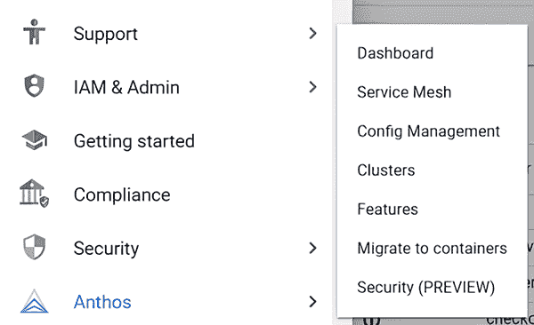

图 4.12 Google Cloud 控制台：Anthos 菜单

此界面将提供服务网格中所有服务的列表。默认的表格视图，如图 4.13 所示，将显示每个服务及其指标，包括请求、延迟和失败。

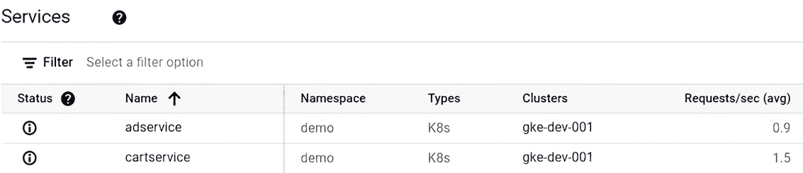

图 4.13 Anthos 服务网格：服务列表

您可以通过点击控制台右上角的拓扑按钮从表格视图更改到拓扑视图。这将提供网格服务的图形拓扑布局，如图 4.14 所示。

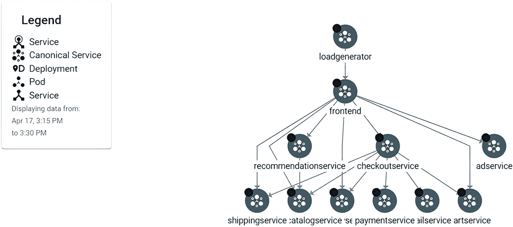

图 4.14 Anthos 服务网格：拓扑视图

两个视图都会显示服务网格中的服务。因为我们看到了 Boutique 应用程序的预期服务，这证明了部署在网格内部成功运行。在这个练习中，你在 GKE 集群中部署了 ASM，创建了一个启用 sidecar 注入的新命名空间，并将测试应用程序部署到服务网格中。

## 摘要

+   基于 Anthos Service Mesh 的服务网格有助于组织在规模上运行微服务。

+   我们涵盖了 Istio 的所有组件以及每个组件如何提供服务网格功能。

+   ASM 通过使用相互 TLS（mTLS）加密网格资源之间的所有通信以及使用本地的 Istio 身份验证和授权策略来提高工作负载之间的安全性。

+   ASM 提供流量路由能力，允许更灵活的发布过程，包括 A/B 测试和金丝雀部署。

+   您可以在发布任何新代码之前发现应用程序故障，通过使用断路器和故障注入来主动查找应用程序处理常见问题（如网络延迟或 HTTP 错误）的方式，从而提高可用性和弹性。

+   ASM 提供了对整个服务网格以及多个环境之间的可见性、监控、安全和控制。

+   由于 Envoy 代理边车的存在，开发者无需修改他们的代码即可使用 ASM 的功能，该边车负责处理应用程序的流量流。
