# 5 运维管理

Jason Quek

本章涵盖了

+   使用统一云界面管理 Kubernetes 集群

+   管理 Anthos 集群

+   日志记录和监控

+   Anthos 部署模式

运维是指确保你的集群运行正常、活跃、安全，并能向用户提供服务的行为。为此，在云时代，一种主流的思想已经得到采纳并迅速发展：一种称为 DevOps 的运维实践。

DevOps 最简单的定义是“开发者和 IT 运维的结合。”DevOps 旨在解决两大要点。第一点是通过对整个基础设施进行代码化管理，通过自动化测试、频繁发布来实现持续交付。你可以根据开发者的技能集使用如 Terraform 或 Pulumi 等框架来实现这一点。第二点，DevOps 经常被忽视的部分是 IT 运维，这包括诸如日志记录和监控等任务，然后利用这些指标来扩展和管理系统。你可以使用如 Prometheus 和 Grafana 等开源项目来管理这些任务。团队可以通过实施额外的安全工具链来进一步提高性能，从而构建现代的 DevSecOps 实践。

在 DevOps 开发之前，谷歌开发了一种称为*站点可靠性工程（SRE）*的方法。这种方法通过自动化和编码化基础设施操作中的所有任务，以增强系统的可靠性，如果出现问题，可以通过代码自动修复。SRE 团队不仅负责保持环境稳定，还要处理新的运维功能和基础设施的改进。

DevOps 和 SRE 都分配了不同的责任给不同的团队；然而，它们的目标是相同的：能够快速高效地实施变更，尽可能自动化，并持续监控和提升系统。这种共性是工程和运维团队打破壁垒（封闭团队）并共同承担系统责任“愿望”的基础。

任何一种方法都会带来许多相同的优势，但它们以不同的方式解决问题。例如，在 DevOps 方法中，一个专门的运维团队可能会负责基础设施的运维管理方面，将问题转交给另一个开发团队来解决。这与 SRE 方法不同，在 SRE 方法中，运维是由开发团队驱动的，并从软件工程的角度来处理，允许一个 SRE 团队解决他们自己团队内部的问题。

Anthos 提供了一条路径，使用框架中提供的工具来构建强大的 DevOps 或 SRE 文化。本章将向产品所有者、开发者和基础设施团队展示，通过使用 Anthos，他们能够构建一个 DevOps/SRE 文化，这将有助于减少他们公司中的壁垒，构建可靠的系统，并提高开发效率。

在下一节中，我们将解释 Anthos 包含的工具，从 Google Cloud 控制台中的统一用户界面开始，然后是集中式日志记录和监控，最后是环境，这些都是提供构建块以实现操作实践的关键概念。

## 5.1 Google Cloud 控制台的统一用户界面

在当今一切皆代码的时代，软件工程师以从命令行或作为代码执行所有操作为荣。然而，当出现影响现实服务的生产问题时，直观且辅助的用户界面可以帮助工程师快速识别问题。这正是 Google 统一用户界面发挥作用的地方，如图 5.1 所示。

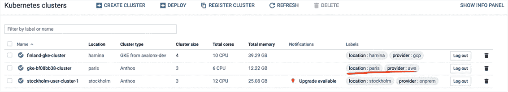

图 5.1 已注册到 Google Cloud 控制台的多集群

这些工具允许您在一个视图中查看多个项目，如 Kubernetes 集群。将此视图提供给管理员，使他们能够对所有可用资源进行监督，而无需登录到三个不同的集群，如图 5.1 所示。此视图还显示了资源的位置、其提供者以及管理集群所需的任何操作。

访问此视图需要用户已经登录到 Google Cloud 控制台，该控制台由 Google Cloud Identity 保护，为防御恶意行为者提供了额外的安全层。拥有此类视图的访问权限满足了 DevOps 原则之一：使用工具来提供对系统的可观察性。

要获得单视图，您需要将您的集群注册到您的 GCP 项目中。在下一节中，我们将介绍如何注册在任意主要云服务提供商或本地运行的 Anthos 上的集群。

### 5.1.1 将集群注册到 Google Cloud 控制台

负责将集群连接到 Google Cloud 控制台的组件称为 Connect，通常在集群创建后作为最后一步之一部署。如果集群由 Anthos 在 GKE、AWS 或 Azure 上部署，Connect 代理将在集群创建时自动部署。然而，如果集群不是由 Anthos 部署的（例如 EKS、AKS、OpenShift 和 Rancher 集群），代理将需要单独部署，因为 Anthos 不参与安装过程。此过程将在本章后面进行说明。

由于 Anthos 是遵循 Kubernetes 最佳实践构建的，Connect 代理被表示为 Kubernetes 部署，该镜像由 Google 作为 Anthos 框架的一部分提供。代理也可以在 Google Cloud 控制台中看到，可以像任何其他 Kubernetes 对象一样进行管理，如图 5.2 所示。

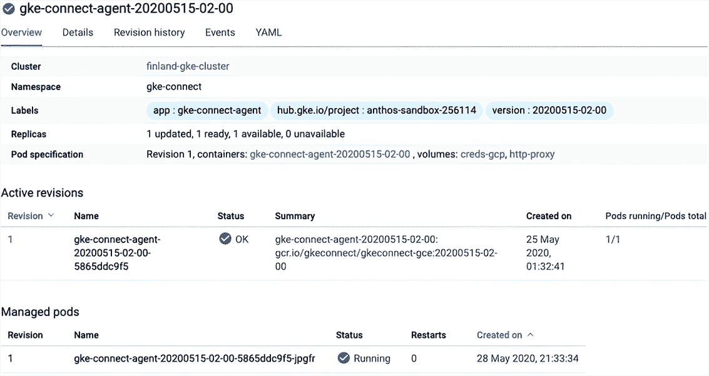

图 5.2 部署在 GKE 集群上的 Connect 代理

Connect Agent 充当 Google Cloud 控制台向其已部署的集群发出命令并报告 vCPU 使用情况的渠道，以进行许可。这引出了一个重要观点：集群需要能够访问 Google Cloud API（egress）；然而，集群不需要通过 Google Cloud API（ingress）可访问。由于在第一次连接后初始化的单向隧道，对延迟的影响最小。

那么，Google Cloud 控制台是如何发出 Kubernetes API 命令的，例如列出 Pod 以在 Google Cloud 控制台上显示？答案是通过对 Connect Agent 建立一个持久的 TLS 1.2 连接到 GCP 以等待请求，从而消除为用户集群设置入站防火墙规则的需要。

传输层安全性（TLS）是一种加密协议，旨在在发送方和接收方之间提供隐私和数据完整性。它使用基于共享秘密的对称加密来确保消息是私密的。消息使用公钥签名以确保真实性，并包含消息完整性检查以确保消息完整。简而言之，通过互联网到 Connect Agent 的通信通道与互联网银行转账一样安全。完整的通信流程可以在第二章图 2.2 中查看。

需要注意的一个重要观点是，如图 5.3 所示，用于 Anthos 部署与 Google Cloud 通信的互联网上的出站 TLS 加密连接。这种设置简化了事情，因为不需要为 Anthos 部署添加入站防火墙规则——只需向 Google Cloud 发送出站流量——而且不需要任何虚拟专用网络（VPN）。

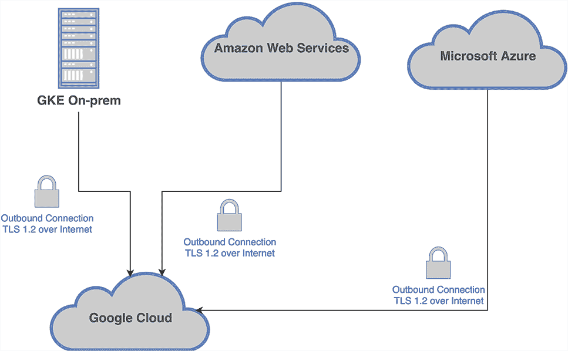

图 5.3 Anthos 部署到 Google Cloud 的出站连接

Kubernetes 的一个优点是其标准化，这意味着这个代理将能够向由 Google 或**任何**提供符合云原生计算基金会定义的 Kubernetes 兼容分布的提供商创建的集群发出 Kubernetes API 命令。

在大型企业中，IT 安全通常想知道 Connect Agent 向 Google Cloud API 发送了什么，这是一个棘手的问题，因为人们担心如果 Google 共享解密流量的密钥，它实际上是在覆盖已经实施的安全措施。有关 Connect Agent 实际向 Google Cloud 发送的信息的更多细节，可以在 Google 的这篇白皮书中找到（[`mng.bz/rdAZ`](https://cloud.google.com/files/security-features-for-connect-for-anthos.pdf)）。Google 还明确表示，没有客户数据通过 Connect Agent 发送，并且它仅用于提供与 Kubernetes API 通信的功能，并为 Anthos 计费提供许可度量。

### 5.1.2 认证

访问 Google Kubernetes Engine 应该使用身份和访问管理（IAM）角色来管理对 GKE 集群的访问。以下部分涉及 GKE 本地、GKE on AWS、GKE on Azure 以及与 Anthos 连接的集群。

要访问 Anthos 集群，拥有项目访问权限的用户始终必须提供 Kubernetes 服务账户（KSA）令牌、基本身份验证或针对集群配置的身份提供者进行身份验证。

使用 KSA 令牌将是最容易设置的，但它需要令牌轮换和一种安全的方式定期向需要访问集群的用户分发令牌。使用基本身份验证将是最不安全的，因为需要密码管理要求，但如果没有可用的身份提供者，它仍然作为身份验证方法得到支持。如果您必须使用基本身份验证，一个建议是在密码泄露事件中实施密码轮换策略。

推荐的做法是设置 Google Cloud Identity（OIDC）以与 Google Cloud Identity 配合使用，这样用户就可以利用现有的安全设置来管理对他们的集群的访问。截至 2020 年 9 月，OIDC 在 GKE 本地集群中通过命令行（而不是控制台）支持。强烈建议采用稳固的 KSA 令牌轮换和分发策略。这可以像利用 Google Secret Manager 那样简单，其中可以通过 IAM 权限控制检索令牌的权限，并且可以使用 Cloud Scheduler 每七天更新一次令牌。

一旦设置了 OIDC 与 Google Cloud Identity，用户可以使用 gcloud CLI 或 Google Cloud 控制台（如图 5.4 所示）对用户集群进行身份验证。

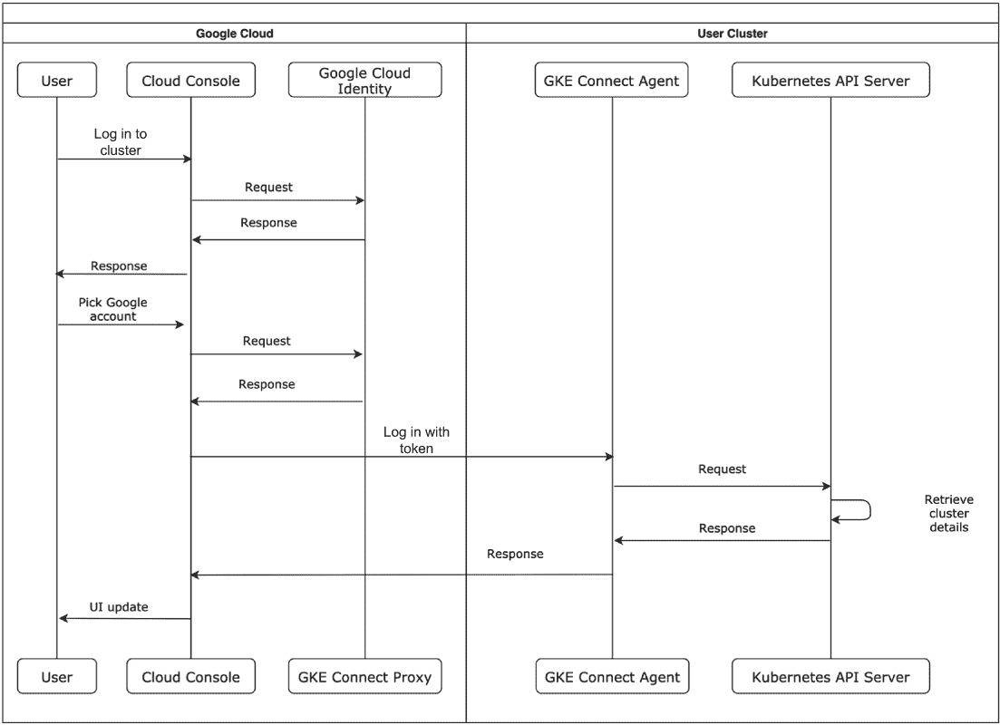

图 5.4 使用 Google Cloud Identity 的 OIDC 身份验证流程

在图 5.4 中，我们展示了使用 Google Cloud Identity 的 OIDC 身份流。通过 Anthos Identity Service，遵循 OIDC 和轻量级目录访问协议（LDAP）协议的其他提供者可以提供身份。这个过程允许使用 Microsoft Active Directory 或 LDAP 服务器等技术实现无缝的用户管理，并遵循只有一个单一的真实身份来源的原则。

### 5.1.3 集群管理

在注册集群和身份验证后，用户将能够看到 Pods、Services、ConfigMaps 和持久卷，这些通常可以从 GKE 原生集群中获取。在本节中，将介绍通过 Google Cloud 控制台可用的集群管理选项。然而，为了构建良好的 SRE 实践，集群管理应该是自动化和脚本化的。然而，能够从用户友好的界面进行修改也是很不错的。

在 GCP 上有 Google Kubernetes Engine 经验的管理员知道从 Google Cloud 控制台连接到集群是多么容易。他们只需导航到集群列表，如图 5.5 所示，然后点击连接按钮。

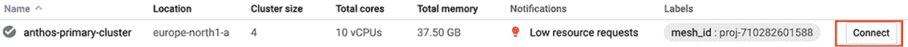

图 5.5 GCP 控制台中的集群列表

一旦点击连接，如图 5.6 所示的弹出窗口将提供在 Google Cloud Shell 中运行的命令，以连接到所选集群。

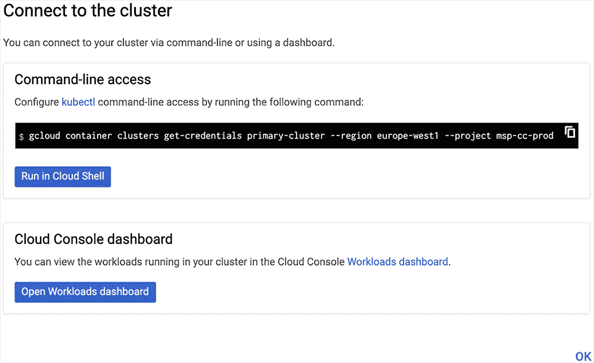

图 5.6 GKE 中最好的功能之一——通过 gcloud 生成 kubectl 凭据

对于本地和其它云集群，本章后面将讨论的 Connect 网关功能允许操作管理员通过不同的命令远程管理他们的集群。

如图 5.7 所示，Google Cloud 控制台提供了一个用户友好的界面来编辑和应用 YAML 部署。通过这个界面，管理员可以在不通过 kubectl 命令行的情况下修改 Kubernetes 配置，这在紧急情况下可以节省一些时间。这些在 Google Cloud 控制台上的操作转换为 Kubernetes API 调用或 kubectl edit 命令，并通过 Connect Agent 发送到 Anthos 集群。当然，这种方法应仅用于分类或开发情况，不一定适用于生产，但它展示了从本地命令行打开对 Connect Agent 访问的未来可能性。

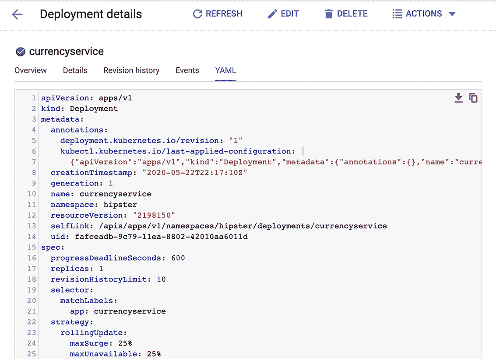

图 5.7 从 Google Cloud 控制台编辑 YAML 定义

如图 5.8 所示，Google Cloud 控制台还提供了有关节点底层 Docker、kubelet 和内存压力的有用信息。利用这些信息，管理员可以在节点发生故障时快速进行根本原因分析，并且可以隔离和排空节点。

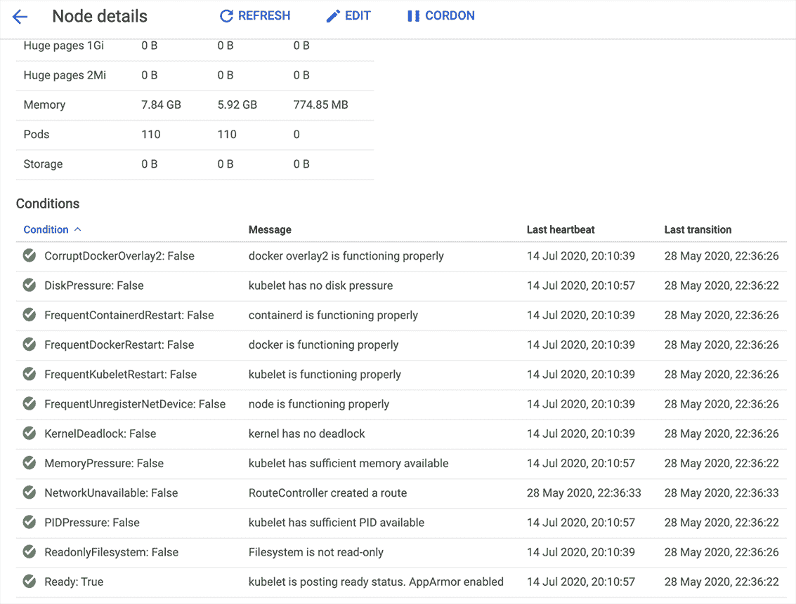

图 5.8 来自 Google Cloud 控制台的节点信息

在 Google Cloud 控制台中列出工作负载时，用户可以看到所有集群的部署，并按集群进行筛选。这种能力提供了对所有集群中运行的服务概述，并指示是否有任何服务出现问题或达到扩展限制。一个常见问题是由于 CPU 或内存不足而无法部署 Pods。这可以在控制台中清晰地看到，如图 5.9 所示的明亮的红色错误信息。

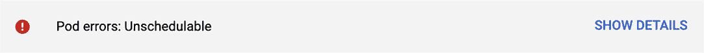

图 5.9 无法调度的 Pods 错误

使用工具交互式地查看集群对于实时查看对象状态、节点状态等非常有用。尽管这个工具在适当的场景下（例如，在诊断影响生产的未知问题，且用户友好的界面减少了在高压情况下记住命令的需求）可能很有帮助，但你可能会发现自己更频繁地查看日志和创建监控事件，而不是实时查看。在下一节中，我们将详细介绍 Anthos 包含的日志和监控功能。

### 5.1.4 日志和监控

Kubernetes 提供了不同类型的日志，这对于管理员在管理集群时进行调查非常有用。一种类型是系统日志，Kubernetes 系统服务如 kube-apiserver、etcd、kube-scheduler 和 kube-controller-manager 都会记录这些日志。集群还有应用程序日志，其中包含在 Kubernetes 集群上运行的所有工作负载的日志详情。这些日志可以通过 Connect Agent 访问，该 Agent 与 Kubernetes API 通信，并基本上发出一个 kubectl logs 命令。

这两种日志类型，如图 5.10 所示，不是存储在云端，而是根据需求从 Kubernetes API 中检索，这导致检索延迟增加，但在 IT 安全请求的情况下有时是必要的。

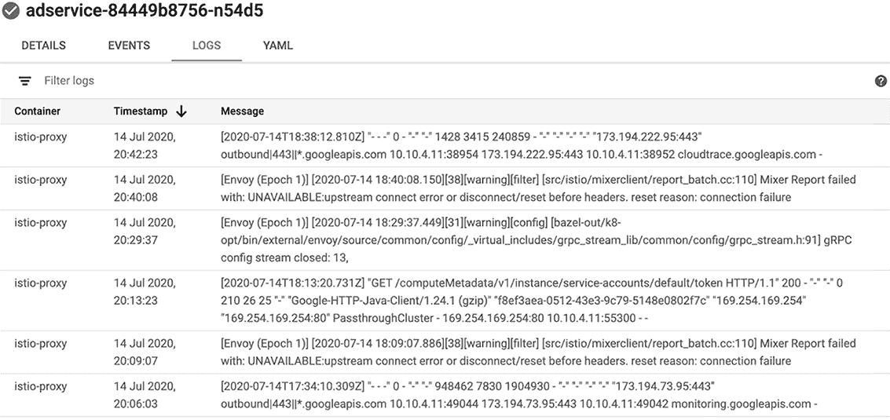

图 5.10 容器日志

日志主要关于错误——在执行任何 Kubernetes Pod 期间输出到标准输出流的警告。这些日志被写入节点本身，如果 GKE 集群上启用了 Google Cloud 操作套件（以前称为 Stackdriver）代理，则日志会被聚合并转发到云日志 API 并写入云端。

指标是关于服务的观察，例如内存消耗或每秒请求数。这些观察结果被保存为历史趋势，可用于扩展服务或识别实施中可能存在的问题。鉴于每个服务每秒或每分钟可能都有成十上百万的观察结果，这取决于业务需求，以可用的方式管理这些数据并非易事。我们将在下一小节中提出一些解决方案，涉及 Google 的云日志和监控服务。您还可以使用合作伙伴技术，如 Elastic Stack、Prometheus、Grafana 或 Splunk 来理解指标。更多信息请参阅[`mng.bz/VpmO`](http://mng.bz/VpmO)或[`mng.bz/xdAY`](http://mng.bz/xdAY)。

在本地部署 GKE 的日志和监控

当在本地集群上安装 GKE 时，管理员可以在几个不同的可观察性选项之间进行选择。第一种选择是使用 Google 的本地云日志和云监控解决方案。云日志和云监控处理基础设施和云服务，以及 Kubernetes 日志和监控。所有日志数据都可以根据 Kubernetes 对象类型以分层级别显示。默认情况下，GKE 日志仅从 kube-system、gke-system、gke-connect、istio-system 和配置管理系统命名空间收集日志和指标，这些命名空间用于跟踪集群健康，并将数据发送到 Google Cloud 的云日志和云监控。这项服务是完全管理的，包括仪表板和警报功能，以构建一个有用的监控控制面板。云日志和云监控通常用于监控 Google Cloud 资源，并对某些日志事件发出警报，同时也作为监控服务健康状况的单个视图。如果组织愿意使用和学习新的日志和监控堆栈，并希望有一个低成本且完全管理的选项，这是一个推荐的选择。

某些组织可能由于内部决策而希望禁用云日志和云监控。尽管可以禁用，但 Google 支持服务级别协议（SLA）将失效，并且 Google 支持在解决 GKE 本地操作问题时只能尽力而为。

第二种选择是使用 Prometheus、Alertmanager 和 Grafana，这是一个流行的开源项目集合，用于收集应用程序和系统级别的日志，并提供警报和仪表板功能。Prometheus 和 Grafana 作为 Kubernetes 监控附加工作负载部署，因此能够享受到在 Kubernetes 上运行的扩展性和可靠性。当使用此解决方案时，Google 的支持仅限于基本操作、基本安装和配置。有关 Prometheus 和 Alertmanager 的更多信息，请访问[`prometheus.io`](https://prometheus.io)，有关 Grafana，请访问[`grafana.com`](https://grafana.com)。

此选项可以用于任何 Kubernetes 配置，并且可以使用许多预构建的 Grafana 包来监控 Kubernetes 集群的健康状况。一个缺点是，管理员必须管理 Prometheus，确保其健康，并管理其运行时的历史指标存储，就像管理任何其他应用程序工作负载一样。可以使用其他工具，如 Thanos，来查询、聚合、降采样和管理多个 Prometheus 源，以及将历史指标存储在对象存储中，如 Google Cloud Storage 或任何兼容 S3 的对象存储。有关 Thanos 的更多信息，请访问[`thanos.io/`](https://thanos.io/)。

对于已经使用开源技术构建了日志和监控服务并且之前已经部署过此堆栈的组织来说，这个选项很简单。它还提高了可移植性，并减少了由于使用开源技术而导致的供应商锁定。

第三种选择是使用经过验证的解决方案，如 Elastic Stack、Splunk 或 Datadog，从 Anthos 集群中消费日志和指标，并将其提供给运维团队。如果当前日志方法已经到位，并且组织依赖合作伙伴来管理日志和监控系统的高可用性，那么这个选项很有吸引力。选择这个选项的组织通常已经购买了此堆栈，并使用它来处理其整体操作中的许多异构系统。

第四种选择也是一种分层遥测方法，对于开始使用 Anthos 进行混合之旅的组织来说，这是一个推荐的方法。这种方法的理由有很多，首先是因为 Anthos 集群的平台和系统数据始终与 Cloud Monitoring 和 Cloud Logging 紧密耦合，因此管理员无论如何都需要学习 Cloud Monitoring 和 Cloud Logging 以获取最新的日志和指标。此外，它没有任何额外成本，并且是 Anthos 套件的一部分。第二个原因是，构建混合环境通常需要将应用程序迁移到混合环境，开发者习惯于与这些合作伙伴解决方案一起工作，并围绕该堆栈构建调试和运营模式。这使得它成为一个受支持的选项，可以减少将工作负载迁移到混合环境时的运营摩擦。第三个原因是建立在不同提供商之间平衡故障点的能力，并有一个备份选项。

### 5.1.5 服务网格日志

如第四章所述，Anthos Service Mesh 是一个可选组件，但包含在 Anthos 平台中。它是开源 Istio 的扩展和受支持版本，包含在 Anthos 中并由 Google 支持。Google 扩展的部分能力是将注入您的 Pod 的边车代理的遥测数据直接上传到 Google Cloud 的 Cloud Monitoring API 和 Cloud Logging API。然后，这些指标用于在 Google Cloud 控制台中可视化预配置的仪表板。有关更多详细信息，请参阅第三章。

将这些指标存储在 Google Cloud 上还允许您拥有关于微服务之间延迟、错误和流量的历史信息，这样您就可以对任何问题进行事后分析。您还可以进一步使用这些指标来驱动服务级别指标和 Pod 扩展策略，并识别需要优化的服务。

### 5.1.6 使用服务级别指标和协议

Anthos 服务网格的服务级别指标（SLIs）、服务级别目标（SLOs）和服务级别协议（SLAs）是您可以使用来构建 Anthos 部署的 SRE 实践的功能。在设计 Anthos 的运营管理流程时，考虑这些概念是必要的。

两个指标衡量服务级别：延迟和可用性。延迟是服务响应所需的时间，而可用性表示服务响应的频率。当系统从 DevOps 视角进行设计时，管理员必须考虑 Anthos 升级和扩展需求，并相应地规划，以确保它们不影响这些指标。

对于服务级别目标，您应该从最坏情况的角度考虑，而不是最佳情况，尽可能使决策数据驱动。例如，如果延迟不切实际且不影响用户体验，甚至无法发布服务。根据用户体验找到可接受的最高延迟，然后根据业务需求进行降低。教育您的业务利益相关者，接近 99.99999% 的可用性目标非常昂贵，并且通常必须达成一个实际的权衡。谷歌 SRE 书籍中提到的一个重要概念是，努力使服务足够可靠，但不超过必须的程度。您可以在 [`mng.bz/Al77`](http://mng.bz/Al77) 上找到更多关于谷歌 SRE 书籍的信息。了解 Anthos 升级、回滚和安全更新的程序和风险对于确定服务级别目标是否现实是至关重要的。

您还应该为要衡量的服务级别目标定义一个合规期。设置的 SLO 可以是任何测量周期——一天、一周或一个月。这允许负责服务的团队决定何时回滚、发布热补丁或放慢开发速度以优先修复错误。SLI 和 SLO 还使产品所有者能够向需要它们的用户提供服务级别协议，并提供现实的延迟和可用性协议。

## 5.2 Anthos 命令行管理

您可以使用各种命令行工具来处理 Anthos 版本的集群创建、扩展和升级，例如 gkectl、gkeadmin 和 anthos-gke。本章的目的不是取代 Google Cloud 的文档，而是总结了一些操作和需要注意的问题。

提醒：管理员集群仅用于监控和管理用户集群。将其视为类似于 GKE 的无形控制平面，不要在那里部署可能影响它的服务。

小贴士：您可以使用类似 ktx 的 kubeconfig 管理器，从 [`github.com/heptiolabs/ktx`](https://github.com/heptiolabs/ktx)，它允许管理员轻松地在管理员集群和用户集群上下文之间切换。

在下一节中，我们将把段拆分为 GKE on-prem 和 GKE on AWS，因为工具和安装过程不同。

### 5.2.1 使用 GKE on-prem 的 CLI 工具

GKE 本地安装使用 VMware 的 API¹以编程方式构建管理工作站、管理集群节点和用户集群节点。持久卷由单个 VMware 数据存储或 vSAN 提供电力，网络由分布式或标准 vSphere 交换机提供。这些就像在构建 GKE 集群时 Google Cloud 提供的 IaaS 组件：因此得名 GKE on-prem。拥有管理集群、用户集群和节点池的概念反映了 GKE 的最佳实践。

当前的安装过程是下载一个名为 gkeadm 的工具，该工具创建一个管理工作站。管理集群和用户集群都是从该管理工作站安装的，如以下所述。尽管 gkeadm 的版本适用于 Windows、Linux 和 macOS，但本节将仅解释 Linux 的简略过程：

1.  第一步是从云存储桶下载工具：

    ```
    gsutil cp gs://gke-on-prem-release-public/gkeadm/<anthos version>/linux/gkeadm ./chmod +x gkeadm
    ```

1.  接下来，创建一个预填充的配置文件：

    ```
    ./gkeadm create config
    ```

1.  填写 vCenter 凭证、GCP 白名单服务账户密钥路径（在购买 Anthos 后，客户被要求提供一个服务账户，Google 将将其列入白名单以便下载镜像和其他专有工具），以及 vCenter 证书授权机构证书路径。

vCenter 证书授权机构的证书可以按以下方式下载：

```
curl -k "https://[SERVER_ADDRESS]/certs/download.zip" > download.zip
```

解压 download.zip 文件后，相关证书可以在 certs/lin 文件夹中找到。带有 .0 后缀的文件是根证书。将其重命名为 vcenter.crt，并在安装配置文件的引用中使用它。

当您创建新的用户集群或在安装过程中时，vCenter 和 F5 Big-IP 凭证以纯文本形式保存在配置文件中。保护 F5 凭证的一种方法是通过围绕 Google Cloud Secret Manager 和 gcloud 的包装。

要创建一个由 Google Secret Manager 保护的密码，请使用以下代码：

```
echo "vcenterp455w0rd" | gcloud secrets create vcenterpass --data-file=- --replication-policy=user-managed --locations=us-east1
```

要检索由 Google Secret Manager 保护的密码，请输入以下代码：

```
gcloud secrets versions access latest --secret="vcenterpass"
```

此秘密现在通过 Google IAM 策略得到保护，并且可以编写一个包装脚本以检索秘密，替换配置文件中的占位符，应用它，然后删除文件。

创建 Anthos 集群组件的过程正在迅速演变，对于较新版本对配置文件进行一些更改并不罕见。您可以在 [`mng.bz/Zova`](http://mng.bz/Zova) 了解最新的发布流程。

集群管理：创建新的用户集群

*gkectl* 命令用于此操作。一般来说，管理员应该限制他们的设置，使其包含一个管理员集群与 10 个用户集群的比例。用户集群应至少有 3 个节点，最多有 100 个节点。如前所述，新版本可能会增加这些数字。当发布新的 Anthos 版本时，您可以在相应版本的配额和限制部分中检查新的限制。

一般建议至少为至少一个集群留出一些空间，该集群可以在您的本地环境中创建。这为运维团队提供了重新创建集群并在升级或分类期间移动 Pod 的空间。

保持良好的文档，例如，哪些 IP 地址已经被分配给其他用户集群，以便可以轻松地确定不重叠的 IP 地址。考虑到用户集群可以扩展到 100 个节点，因此请为每个范围保留多达 100 个 IP 地址以保持这种可能性。

将配置文件源代码控制起来，但不要提交 vSphere 用户名和密码。将此类敏感信息提交到存储库可能会带来安全风险，因为任何有权访问存储库的人都可以获取这些登录详情。可以使用 ytt 等工具来模板化配置 YAML 并执行代码审查，您应该使用存储库扫描器来防止此类错误发生（例如，[`mng.bz/Rl7O`](http://mng.bz/Rl7O)）。

节点池也可以使用不同的机器形状创建，因此请正确设置它们以适应您的工作负载。这样做还可以让您对要扩展的机器类型有更细粒度的控制，并节省成本。对于生产工作负载，使用三个副本的用户集群主节点以实现高可用性，但对于开发，一个副本应该就足够了。

验证配置文件以确保文件有效。检查既包括语法检查，也包括程序性检查，例如使用 gkectl check-config 命令检查 IP 范围冲突和 IP 可用性：

```
gkectl check-config --kubeconfig [ADMIN_CLUSTER_KUBECONFIG] --config [CONFIG_FILE]
```

在进行几次验证后，可以通过传递 —fast 标志跳过大多数耗时验证。

接下来，如果选择了捆绑式负载均衡器，则应创建 seesaw 负载均衡器。如果您在配置了集成负载均衡器选项的集群构建之前没有创建 seesaw 节点，您将在集群预检查期间收到错误。要创建 seesaw 节点，请使用 gkectl create loadbalancer 命令：

```
gkectl create loadbalancer --kubeconfig [ADMIN_CLUSTER_KUBECONFIG] --config [CONFIG_FILE]
```

在创建新的用户集群后，请记住，对于捆绑式负载均衡的 seesaw 版本，用户随后可以按以下方式创建用户集群：

```
gkectl create cluster --kubeconfig [ADMIN_CLUSTER_KUBECONFIG] --config [CONFIG_FILE]
```

如果配置文件已经过验证，您也可以添加 —skip-validation-all 标志。

整个用户集群过程，包括启动带有主节点和工作节点镜像的新 VMware 虚拟机并将它们加入集群，可能需要 20-30 分钟，具体取决于硬件。管理员还可以从 VMware vCenter 控制台看到正在创建的节点。

高可用性配置

在生产环境中，由于堆栈的不同部分可能会出现故障，从网络到硬件再到虚拟化层，高可用性对于 Anthos 部署是必要的。

管理集群的高可用性（HA）利用 vSphere 集群设置中的 vSphere HA 来保护 GKE 本地集群在主机故障时不会中断。这确保了管理集群节点在 vSphere 集群的不同物理节点之间分布，因此，在物理节点故障的情况下，管理集群仍然可用。

要启用 HA 用户控制平面，只需在 GKE 本地配置文件中指定 usercluster.master.replicas: 3。这将为每个用户集群创建三个用户集群主节点，消耗三倍的资源，但提供高可用 Kubernetes 设置。

集群管理：扩展

管理员可以使用`gkectl` CLI 来扩展或缩减节点。他们更改配置文件以设置期望的副本数量，并执行以下命令来更新节点池：

```
gkectl update cluster --kubeconfig [USER_CLUSTER_KUBECONFIG] --config [CONFIG_FILE]
```

集群管理：升级 Anthos

与任何升级过程一样，在过程中可能会出现故障。已经投入了大量努力来使升级过程健壮，包括在执行升级之前添加预检查来捕捉潜在问题。当开发升级时，Google 的每个产品团队都紧密合作，以避免 Kubernetes、ACM 和 ASM 等组件之间出现任何潜在的不兼容性。为了方便访问，将此链接添加为书签以快速访问：[`mng.bz/nJV8`](http://mng.bz/nJV8)。

由于对新功能的需求，新的 Anthos 版本频繁出现，因此升级 Anthos 是一种常见活动。这也可能意味着升级到 Kubernetes 的新版本，由于 Istio 对 Kubernetes 的依赖，这会影响 Anthos Service Mesh。升级链很复杂，这就是为什么我们建议保留一些备用硬件资源，这些资源可以用来创建 Anthos 集群的新版本，然后在拆除旧版本集群之前将工作负载迁移到新集群。这个过程通过在升级失败时提供简单的回滚路径来降低升级相关的风险。在这种升级路径中，你应该在即将升级的旧集群中运行的微服务前面有一个负载均衡器，它可以引导流量从旧集群到新集群，因为它们将同时存在。然而，如果这不是一个选项，管理员可以在原地升级 Anthos 集群。

首先，咨询升级路径。从 GKE on-prem 1.3.2 版本开始，管理员可以直接升级到同一次要版本中的任何版本；否则，需要按顺序升级。从版本 1.7 开始，管理员可以将他们的管理集群保留在较旧版本上，而只需升级管理工作站和用户集群。作为最佳实践，管理员仍然应该安排管理集群的升级以保持最新。

接下来，下载 gkeadm 工具，它必须与您升级的目标版本相同，并运行 gkeadm 来升级管理工作站，运行 gkectl 来升级您的用户集群，最后升级管理集群。

在原地升级时，会创建一个具有最新版本镜像的新节点，并将工作负载从旧版本中移除并逐步转移到最新版本，一个节点接一个节点。管理员应该为物理主机计划额外的资源，以容纳至少一个用于升级目的的用户节点。完整的流程可以在图 5.11 中查看。

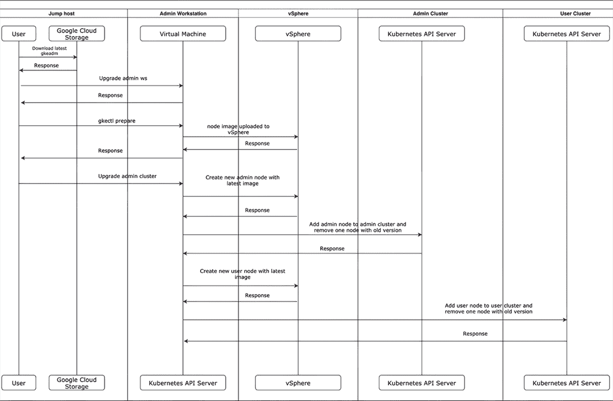

图 5.11 升级流程

对于命令的详细列表，请参阅[`mng.bz/Px7v`](http://mng.bz/Px7v)以获取确切细节。

集群管理：备份集群

可以通过遵循[`mng.bz/Jl7a`](http://mng.bz/Jl7a)中找到的步骤来备份 Anthos 管理集群。建议您将其作为生产 Anthos 环境设置的一部分，定期安排备份，并在升级 Anthos 版本时进行按需备份。

通过运行备份脚本可以备份 Anthos 用户集群的 etcd，您可以在此处了解更多信息[`mng.bz/wPAa`](http://mng.bz/wPAa)。请注意，这仅备份集群的 etcd，即 Kubernetes 配置。Google 还表示，这应该是最后的手段。GKE 的备份承诺将使这个过程更简单，并且最近已提供([`mng.bz/X5MM`](http://mng.bz/X5MM))。

此过程不会备份任何特定于应用程序的数据，例如持久卷。这些应该定期使用如 Velero 等几种可用的工具之一备份到另一个存储设备。

您应该将集群备份视为与从服务器备份的任何数据相同。建议您练习从备份中恢复管理集群和用户集群，以及特定于应用程序的数据，以增强对备份和恢复过程的信心。

Google 正在为 Anthos 开发几个新增功能。其中一个即将添加的重要功能将被命名为 Anthos 企业数据保护，它将提供备份集群级配置的功能，例如自定义资源定义，以及命名空间级配置和应用数据从 Google Cloud 控制台备份到云存储桶，以及使用备份进行恢复的能力。

### 5.2.2 AWS 上的 GKE

GKE 在 AWS 使用 AWS EC2 实例和其他组件来构建 GKE 集群，这意味着这些不是 EKS 集群。如果用户登录 AWS 控制台，他们将只能看到管理集群和用户集群节点作为单独的 AWS EC2 实例。区分这一点与在 Anthos 中管理 EKS 集群非常重要，因为根据集群类型，分配给各个云提供商的责任不同。

GKE 在 AWS 的安装是通过 gcloud CLI 的 gcloud container aws clusters create 命令完成的。对于 Terraform 用户，以下仓库中提供了安装 Anthos 上 GKE 的示例 terraform 代码：[`mng.bz/71R7`](http://mng.bz/71R7)。此示例代码将进一步简化安装过程，并消除后续步骤中提到的堡垒主机和管理服务器需求。

安装过程是首先获取 AWS 密钥管理服务 (KMS) 密钥，然后使用 anthos-gke，它反过来使用 Terraform 生成 Terraform 代码。Terraform 是 HashiCorp 提供的基础设施即代码开源工具，用于定义计算环境的目标状态。Terraform 代码是声明性的，并使用 Terraform 提供商，这些提供商通常由云提供商如 Google、AWS 和 Microsoft 贡献，将它们的云配置 API 映射到 Terraform 代码。生成的 Terraform 代码描述了 GKE 在 AWS 基础设施将如何看起来。它具有类似于 GKE on-prem 的组件，如负载均衡器和 EC2 虚拟机，但它使用 Terraform AWS 提供商在 AWS 上实例化基础设施。您可以在 [`www.terraform.io/`](https://www.terraform.io/) 上了解更多关于 Terraform 的信息。

GKE 在 AWS 的架构可以在图 5.12 中看到，该图来自 Google Cloud 文档，网址为 [`mng.bz/mJAW`](http://mng.bz/mJAW)。

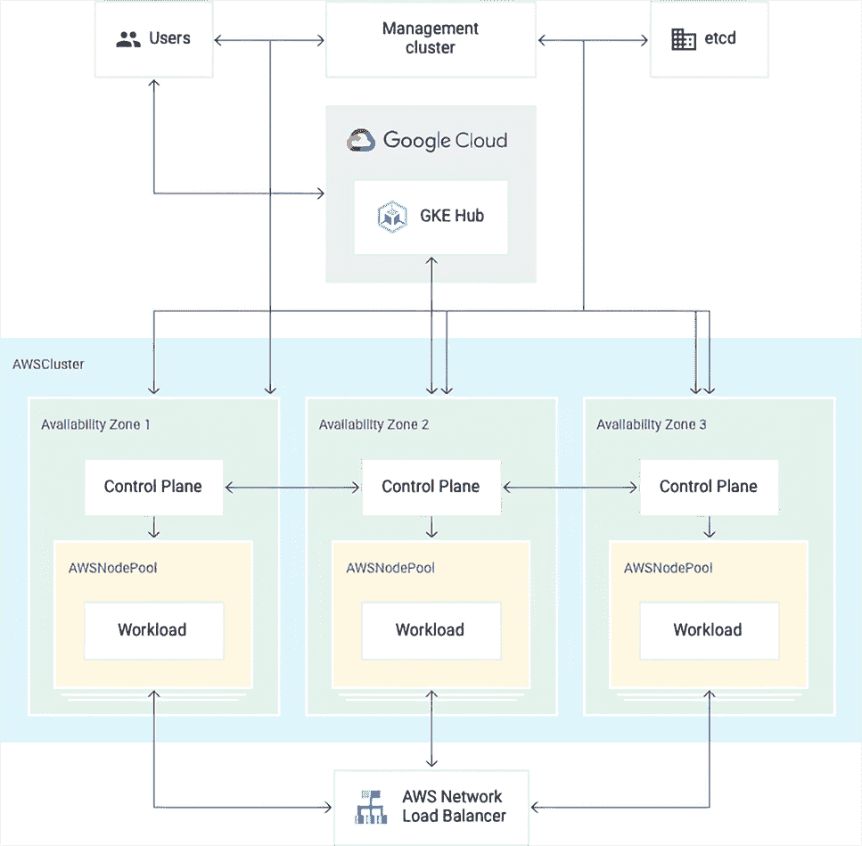

图 5.12 GKE 在 AWS 架构

节点池的使用类似于 GKE，能够在集群内拥有不同的机器大小。

注意：要进行任何 GKE 在 AWS 的操作管理，管理员将不得不登录到堡垒主机，它是管理服务的一部分。

连接到管理服务

在执行任何管理操作时，管理员需要连接到在管理服务初始安装期间部署的堡垒主机。此脚本名为 bastion-tunnel.sh，并在管理服务安装期间由 Terraform 生成。

集群管理：创建新的用户集群

使用 bastion-tunnel 脚本连接到管理服务。连接到堡垒主机后，管理员使用 Terraform 生成一个清单，在 YAML 文件中配置一个示例集群：

```
terraform output cluster_example > cluster-0.yaml
```

在此 YAML 文件中，管理员随后更改 AWSCluster 和 AWSNodePool 规范。请确保将集群文件保存到代码仓库中，因为它将被用于扩展用户集群。

自定义资源是 Kubernetes 的扩展，用于添加额外的功能，例如用于配置 AWS EC2 实例。AWS 集群和对象以 YAML 文件的形式表示，在管理服务集群中引用 AWSCluster 和 AWSNodePool 自定义资源，这些资源解释这个 YAML 文件并根据 AWS 相应地调整资源。要了解更多关于自定义资源的信息，请参阅[`mng.bz/51R8`](http://mng.bz/51R8)。

集群管理：扩展

你可能会遇到需要额外计算能力的情况，这时你需要扩展集群。幸运的是，Anthos 节点池可以扩展集群，包括最小和最大节点数。如果你创建了一个在最小和最大节点数上具有相同计数的集群，你可以在以后更改该设置以扩展你的集群。要扩展 AWS 上的 GKE 集群，你只需要管理员通过在创建用户集群时更新 minNodeCount 并应用到管理服务中来修改 YAML 文件：

```
apiVersion: multicloud.cluster.gke.io/v1
kind: AWSNodePool
metadata:
 name: cluster-0-pool-0
spec:
 clusterName: cluster-0
 version: 1.20.10-gke.600
 minNodeCount: 3
 maxNodeCount: 10
```

集群管理：升级

在 AWS 上升级 GKE 分为两个步骤，首先处理管理服务，然后是用户集群。要升级 AWS 管理服务上的 GKE，管理员必须从具有 AWS GKE 配置的目录升级 AWS 管理服务上的 GKE。然后，用户必须首先下载最新的 anthos-gke 二进制文件。接下来，用户将需要修改 anthos-gke.yaml 文件到目标版本：

```
apiVersion: multicloud.cluster.gke.io/v1
kind: AWSManagementService
metadata:
 name: management
spec:
 version: <target_version>
```

最后，为了验证和应用版本更改，运行以下代码：

```
anthos-gke aws management init
anthos-gke aws management apply
```

管理服务将关闭，因此无法应用对用户集群的更改，但用户集群将继续运行其工作负载。

要升级用户集群，管理员需要使用以下命令在管理服务中切换上下文，从 AWS 目录上的 GKE 切换：

```
anthos-gke aws management get-credentials
```

然后，升级用户集群的版本就像使用以下命令一样简单：

```
kubectl edit awscluster <cluster_name>
```

编辑 YAML 文件以指向正确的 GKE 版本：

```
apiVersion: multicloud.cluster.gke.io/v1
kind: AWSCluster
metadata:
 name: cluster-0
spec:
 region: us-east-1
 controlPlane:
  version: <gke_version>
```

提交此更改后，CRD 开始逐个遍历控制平面中的节点并将它们升级到 AWS 上 GKE 的最新版本。此升级过程会导致控制平面停机，这意味着集群可能无法在完成之前报告不同节点池的状态。

最后，最后一步是升级实际的节点池。相同的程序适用：管理员只需编辑 YAML 文件到所需的版本，并按照以下方式将 YAML 文件应用到管理服务：

```
apiVersion: multicloud.cluster.gke.io/v1
kind: AWSNodePool
metadata:
 name: cluster-0-pool-0
spec:
 clusterName: cluster-0
 region: us-east-1
 version: <gke-version>
```

## 5.3 Anthos 附加集群

Anthos 附加集群允许您查看您的 Kubernetes 集群，并由 AWS 的 Elastic Kubernetes Service (EKS)、Azure Kubernetes Service (AKS) 或任何符合规范的 Kubernetes 集群提供配置和管理。在这种情况下，集群的扩展和配置是从各自的云中完成的。然而，这些集群仍然可以通过将它们注册到 Google Cloud 并部署 Connect Agent 来由 Anthos 附加和管理，如图 5.13 所示。

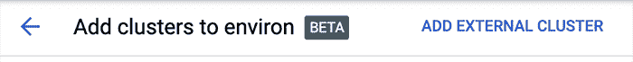

图 5.13 添加外部集群（自行提供 Kubernetes）

GKE 也以相同的方式处理，可以从另一个项目附加到 Anthos 项目中，如下所示：

1.  管理员必须为 EKS 或 AKS 集群生成一个 kubeconfig，然后在该生成的集群注册命令中的 gcloud 中提供该 kubeconfig。有关如何为 EKS 或 AKS 集群生成 kubeconfig 文件的 AWS 和 Azure 文档。管理员还可以使用以下模板手动生成一个，并提供必要的证书、服务器信息和服务账户令牌：

    ```
    apiVersion: v1
    kind: Config
    users:
    - name: svcs-acct-dply
     user:
      token: <replace this with token info>
    clusters:
    - cluster:
      certificate-authority-data: <replace this with certificate-authority-data info>
      server: <replace this with server info>
     name: self-hosted-cluster
    contexts:
    - context:
      cluster: self-hosted-cluster
      user: svcs-acct-dply
     name: svcs-acct-context
    current-context: svcs-acct-context
    ```

1.  管理员必须创建一个 Google 服务账户和一个服务账户密钥，以提供注册，如图 5.14 所示。

    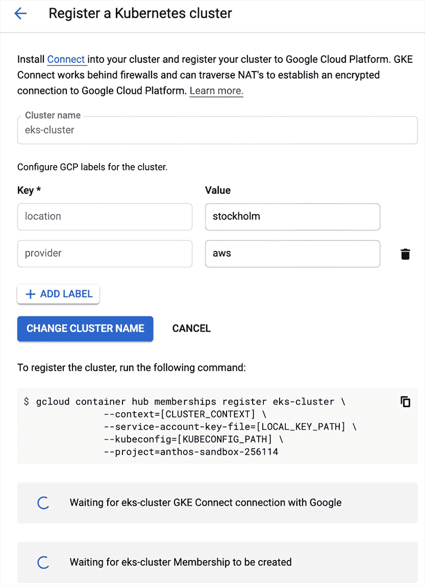

    图 5.14 为外部集群生成注册命令

1.  管理员将在生成的注册命令中提供这两项内容，并在 Connect Agent 部署到外部集群后，在 Google Cloud 控制台中可见。

## 5.4 裸金属上的 Anthos

在裸金属上运行和管理 Anthos 通常需要在操作系统配置空间中具备额外的技能集，因为它基于在 RHEL、Ubuntu 或 CentOS 上安装 Anthos。有关在裸金属上安装和升级 Anthos 的详细步骤，请参阅第十七章。

裸金属上的 Anthos 与 VMware 上的 Anthos 类似，但在其部署模型上具有更多灵活性，且不依赖于 VMware。与在虚拟化机器上运行 Kubernetes 相比，使用裸金属上的 Anthos 的好处包括性能提升、Google 在安装所有 Anthos 组件期间提供支持，以及能够直接从 Google Cloud Marketplace 将应用程序部署到 Anthos 集群。然而，与在 VMware 上使用 Anthos 并具有自定义存储驱动程序的原生支持相比，团队将不得不管理自己的存储设备，为裸金属集群上的 Anthos 提供持久和性能良好的存储。

在为裸金属上的 Anthos 设计操作管理流程时，你必须做出几个关键决策。首先是容量规划和资源估算。与需要使用公共云资源或 VMware 资源池来配置新节点的其他设置不同，新的裸金属节点必须进行配置。如果在节点升级期间有零停机时间的要求，这需要额外的容量需求，因为在升级过程中节点总是有可能失败，从而导致容量下降。

第二点是尽可能自动化节点的先决条件安装。许多公司还需要一个基础操作系统的金盘镜像，这必须由安全团队审核，并持续更新安全补丁和最新版本。这应该集成到裸金属上的 Anthos 配置过程中，以验证与 Anthos 安装的兼容性。一个选项是设置 PXE 引导服务器，并让新配置的裸金属服务器指向 PXE 引导服务器，以将裸金属节点的操作系统安装到正确的配置。

第三点是确定在裸金属上运行 Anthos 的不同部署方式，包括独立、多集群或混合集群部署。灵活性也意味着复杂性，并且需要为不同的部署构建不同的操作模型。第十七章将更详细地介绍差异，但本章强调了在选择不同的部署模型时以下操作考虑因素：

+   *独立集群部署*——这种部署模型，如图 5.15 所示，将管理员集群和用户集群放在同一个集群中。在这种配置下，工作负载在具有 SSH 凭证的同一节点上运行，并且在这些节点中存储了 Google 服务账户密钥。这种配置非常适合边缘部署，因此，操作模型应该为每个新配置和部署的独立集群引入 SSH 凭证和服务账户密钥生成，以及当集群被入侵或丢失时撤销这些凭证的计划。高可用性设置至少需要五个节点。

    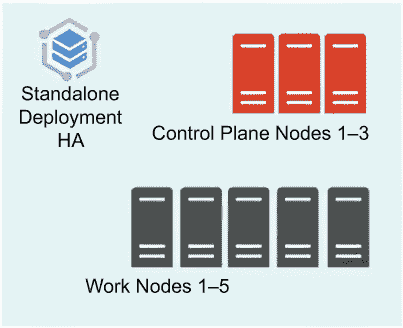

    图 5.15 独立部署

+   *多集群部署*——这种部署模型，如图 5.16 所示，有一个管理员集群和一个或多个用户集群，类似于 VMware 上的 Anthos。这种模型具有许多优点，例如集群的管理员/用户隔离、多租户设置（即每个团队都可以有自己的集群）以及升级的集中计划。缺点是节点需求增加，高可用性设置至少需要八个节点。因此，在为多个边缘位置设置时需要更多努力，并且更适合数据中心设置。

    

    图 5.16 多集群部署

+   *混合集群部署*——这种部署模型，如图 5.17 所示，允许在管理集群上运行用户工作负载并管理其他用户集群。这种模型将多集群部署所需的节点数量减少到五个，以实现高可用性设置，但它与在可能包含独立集群部署中敏感数据的节点上运行用户工作负载具有相同的安全问题。使用混合集群部署可以通过安全级别对工作负载进行分层，并为需要更高安全性的工作负载引入用户集群。

    

    图 5.17 混合部署

## 5.5 连接网关

注册 Anthos 集群允许用户通过 UI 与他们交互，但管理员通常有一套脚本工具箱，他们使用这些脚本来通过 kubectl 命令行与集群交互。在 GKE 本地、AWS 或 Azure 上，这些集群通常只能通过管理工作站或堡垒主机访问。另一方面，GKE 用户可以使用 gcloud 并从 kubectl 生成 kubeconfig 详细信息到他们的本地机器上的集群。通过连接网关，这个问题得到了解决。

管理员可以连接到任何已注册的 Anthos 集群，并通过连接代理生成 kubeconfig，使用户能够通过 kubectl 使用这些集群。有了这个功能，管理员将不需要使用跳转主机来部署到集群上的 GKE，而是可以通过运行 gcloud 命令来生成 kubeconfig，通过 kubectl 进行连接。

设置需要模拟策略，该策略允许连接代理服务帐户模拟用户帐户，代表他们发出命令。创建模拟的 ClusterRole 和 ClusterRoleBinding 的 YAML 文件示例在此处可见：

```
# [USER_ACCOUNT] is an email, either USER_EMAIL_ADDRESS or GCPSA_EMAIL_ADDRESS
$ USER_ACCOUNT=foo@example.com
$ cat <<EOF > /tmp/impersonate.yaml
apiVersion: rbac.authorization.k8s.io/v1
kind: ClusterRole
metadata:
 name: gateway-impersonate
rules:
- apiGroups:
 - ""
 resourceNames:
 - ${USER_ACCOUNT}
 resources:
 - users
 verbs:
 - impersonate
---
apiVersion: rbac.authorization.k8s.io/v1
kind: ClusterRoleBinding
metadata:
 name: gateway-impersonate
roleRef:
 kind: ClusterRole
 name: gateway-impersonate
 apiGroup: rbac.authorization.k8s.io
subjects:
- kind: ServiceAccount
 name: connect-agent-sa
 namespace: gke-connect
EOF
```

在设置好模拟策略后，管理员必须运行图 5.18 中显示的命令来生成 kubeconfig，如图 5.19 所示。


图 5.18 获取 GKE 本地集群凭证的命令

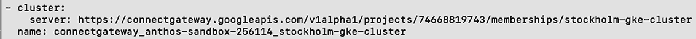

图 5.19 通过 gcloud 生成的 kubeconfig

在此 kubeconfig 就绪后，管理员即使从本地机器也可以管理 GKE 本地工作负载，同时受到 Google Cloud Identity 的安全保护。这种方法还开启了构建将部署到不同 Anthos 集群的管道的可能性。

## 5.6 Azure 上的 Anthos

Anthos GKE 集群可以安装在 Azure 上，其架构由一个托管在 GCP 上的多云 API 组成，该 API 为 Azure 中的 GKE 集群提供生命周期管理功能，如图 5.20 所示。您还可以通过本章中提到的 Connect 网关访问 Azure GKE 集群。Anthos 在 Azure 上使用 Azure 原生技术，如 Azure 负载均衡器、Azure Active Directory 和 Azure 虚拟机，但通过多云 API 依赖 Anthos 来管理 GKE 集群的生命周期操作。这为在三个主要公有云和本地部署应用程序提供了一种统一的方式。

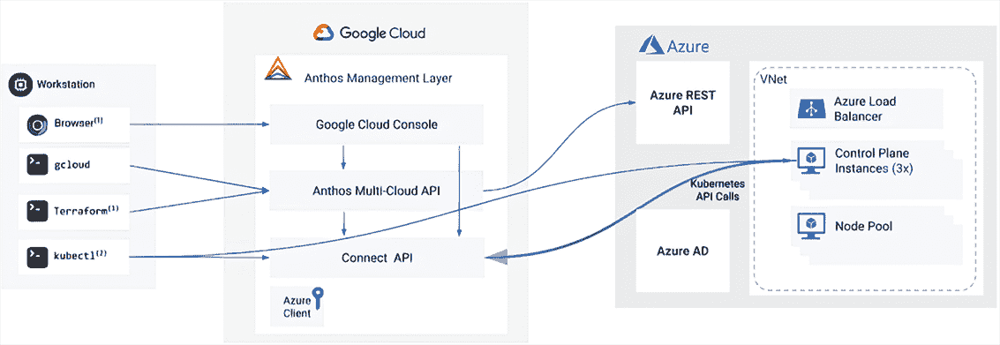

图 5.20 Anthos 在 Azure 的架构

作为先决条件，管理员必须安装 gcloud CLI。此外，管理员必须拥有以下 Azure 内置角色，如所示：

+   应用程序管理员

+   用户访问管理员

+   贡献者

下一步是创建 Azure Active Directory 应用程序、虚拟网络和集群的资源组，并授予 Azure Active Directory 应用程序必要的权限。详细的先决条件信息可以在公共文档中找到，网址为[`mng.bz/61Rp`](http://mng.bz/61Rp)。

### 5.6.1 集群管理：创建

要创建新的用户集群，管理员必须首先设置一个带有 SSH 密钥对的 Azure 客户端：

```
export SUBSCRIPTION_ID=$(az account show --query "id" --output tsv)
export TENANT_ID=$(az account list \
 --query "[?id=='${SUBSCRIPTION_ID}'].{tenantId:tenantId}" --output tsv)
export APPLICATION_ID=$(az ad app list --all \
 --query "[?displayName=='APPLICATION_NAME'].appId" --output tsv)

gcloud alpha container azure clients create CLIENT_NAME \
 --location=GOOGLE_CLOUD_LOCATION *\*
 --tenant-id="${TENANT_ID}" \
 --application-id="${APPLICATION_ID}"

CERT=$(gcloud alpha container azure clients get-public-cert --location=GOOGLE_CLOUD_LOCATION \
   CLIENT_NAME*)*
az ad app credential reset --id "${APPLICATION_ID}" --cert "${CERT}" --append

ssh-keygen -m PEM -t rsa -b 4096 -f KEY_PATH

SSH_PUBLIC_KEY=$(cat KEY_PATH.pub)

ssh-keygen -m PEM -t rsa -b 4096 -f ~/.ssh/anthos-multicloud-key
SSH_PUBLIC_KEY=$(cat ~/.ssh/anthos-multicloud-key.pub)
```

接下来，管理员需要将 Azure 资源组、VNet 和子网 ID 分配给环境变量；添加 IAM 权限；并运行 gcloud 命令以创建 Anthos 在 Azure 的集群：

```
CLUSTER_RG_ID=$(az group show --resource-group=CLUSTER_RESOURCE_GROUP_NAME \
 --query "id" -otsv)
VNET_ID=$(az network vnet show --resource-group=VNET_RESOURCE_GROUP_NAME \
 --name=VNET_NAME *--query "id" -otsv)*
SUBNET_ID=$(az network vnet subnet show \
 --resource-group=VNET_RESOURCE_GROUP_NAME --vnet-name=VNET_NAME \
 --name default --query "id" -otsv)

PROJECT_ID="$(gcloud config get-value project)"
gcloud projects add-iam-policy-binding "$PROJECT_ID" \
 --member="serviceAccount:$PROJECT_ID.svc.id.goog[gke-system/gke-multicloud-agent]" \
 --role="roles/gkehub.connect"

gcloud alpha container azure clusters create CLUSTER_NAME \
  --location GOOGLE_CLOUD_LOCATION \
  --client CLIENT_NAME \
  --azure-region AZURE_REGION \
  --pod-address-cidr-blocks POD_CIDR \
  --service-address-cidr-blocks SERVICE_CIDR \
  --vm-size VM_SIZE *\*
  --cluster-version 1.19.10-gke.1000 \
  --ssh-public-key "$SSH_PUBLIC_KEY" \
  --resource-group-id "$CLUSTER_RG_ID" \
  --vnet-id "$VNET_ID" \
  --subnet-id "$SUBNET_ID"
```

然后，此集群应可在管理员的 GKE 控制台中使用。最后，管理员向集群添加节点池以部署工作负载：

```
SUBNET_ID=$(az network vnet subnet show \
 --resource-group=VNET_RESOURCE_GROUP_NAME --vnet-name=VNET_NAME \
 --name default --query "id" -otsv)
SSH_PUBLIC_KEY=$(cat KEY_PATH.pub)

gcloud alpha container azure node-pools create NODE_POOL_NAME \
  --cluster=CLUSTER_NAME \
  --location GOOGLE_CLOUD_LOCATION *\*
  --node-version=1.19.10-gke.1000 \
  --vm-size=VM_SIZE \
  --max-pods-per-node=110 \
  --min-nodes=MIN_NODES \
  --max-nodes=MAX_NODES *\*
  --ssh-public-key="${SSH_PUBLIC_KEY}" \
  --subnet-id="${SUBNET_ID}"
```

### 5.6.2 集群管理：删除

要删除集群，管理员必须首先删除属于集群的所有节点池：

```
gcloud alpha container azure node-pools delete NODE_POOL_NAME \
  --cluster CLUSTER_NAME \
  --location GOOGLE_CLOUD_LOCATION

gcloud alpha container azure clusters delete CLUSTER_NAME \
  --location GOOGLE_CLOUD_LOCATION
```

在 Anthos 在 Azure 上准备好自动扩展后，管理员控制成本和管理每个集群的最小资源需求变得容易。建议使用像 HashiCorp Vault 这样的安全设备来存储 SSH 密钥以进行检索和轮换。

## 摘要

+   最佳的学习方式是通过实践，最好的建议是尝试在各个提供商上构建集群，以了解可用的优化以及管理员在日常管理 Anthos 操作时需要执行的操作。这是构建持续改进过程的关键，因为 Anthos 经常发布新功能，以使 Kubernetes 集群管理更加简单和快速。

+   我们介绍了如何使用 Google Cloud 控制台操作和管理各种 Anthos 集群类型的工作负载。

+   您可以了解 Anthos 部署中可用的各种日志记录和监控选项以及需要考虑的标准。

+   你现在已经了解了如何通过命令行操作和管理各种类型的 Anthos 部署，以及 Google Cloud 与部署之间发生什么样的通信。

+   你学习了如何在混合环境中升级、扩展以及设计 Anthos 的操作管理流程。

* * *

^ (1.) 除了 VMware，还可以在裸金属上使用 Anthos。这是第十七章讨论的主题。
