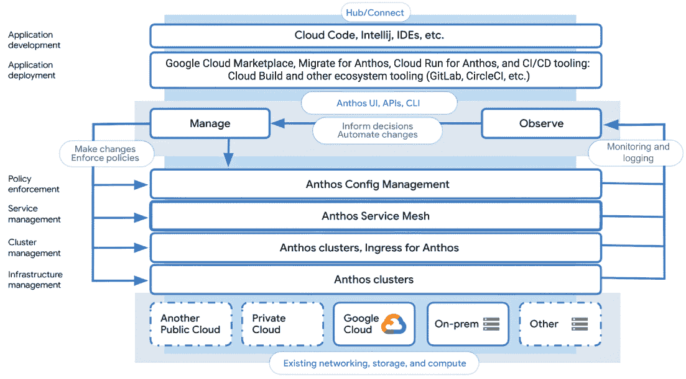
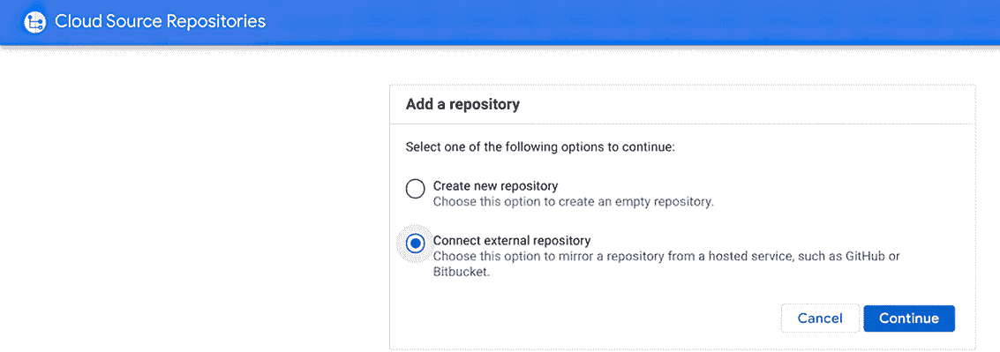
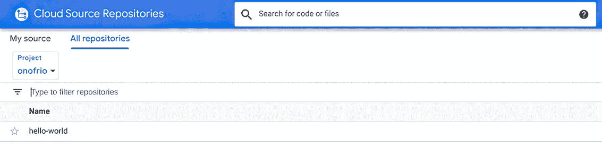
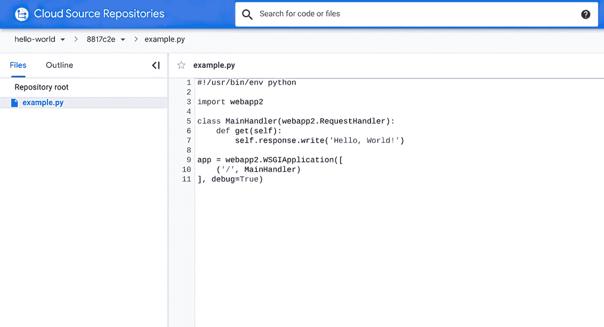
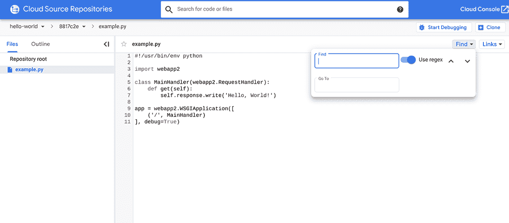
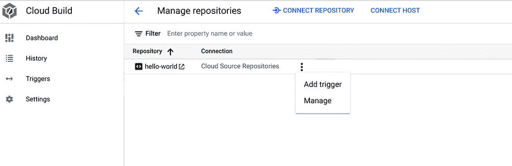
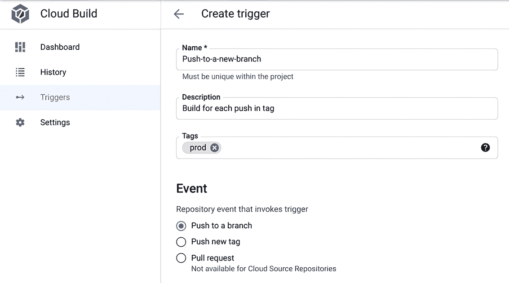
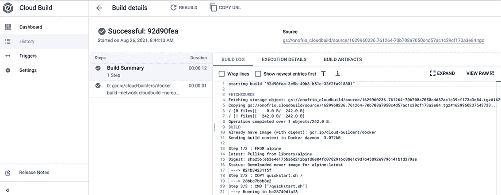
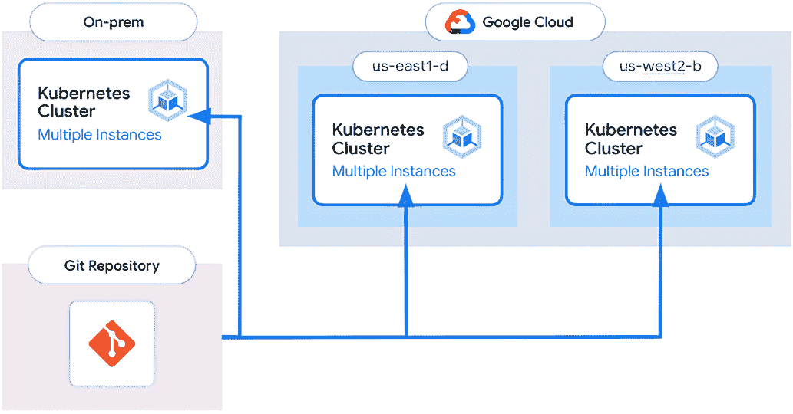

# 6 将所有内容整合

Onofrio Petragallo

本章涵盖

+   Anthos 组件如何提供独特且强大的开发者体验

+   使用不同的 Anthos 产品部署应用程序

+   使用策略执行进行管理和一致性

+   使用 Anthos Service Mesh 观察和保障应用程序

正如我们在前面的章节中看到的，Anthos 是一个现代应用程序平台，为云和混合环境提供一致的开发和运营体验。在本章中，您将了解平台的主要层和主要功能。图 6.1 展示了 Anthos 组件和功能以及它们如何跨越您的环境提供 Anthos 的功能，从基础设施管理到支持应用程序开发。

图 6.1 Anthos 组件和功能

## 6.1 应用程序开发

对于开发者来说，Anthos 提供了一个基于 Kubernetes 的最先进的容器管理平台。开发者可以使用这个平台快速轻松地构建和部署现有的基于容器的应用程序和基于微服务的架构。对开发者而言的关键好处包括以下内容：

+   使用 Anthos Config Management 进行配置以及代码的 Git 兼容管理和 CI/CD 工作流程

+   使用 Anthos Service Mesh 和 Cloud Monitoring 以及 Cloud Logging 提供的无代码抽象层，以实现统一的可观察性

+   使用 mTLS 和节流提供无代码的服务保护

开发者可以使用他们偏好的 IDE 开发现代应用程序：例如，他们可以使用 IntelliJ ([`www.jetbrains.com/idea/`](https://www.jetbrains.com/idea/)) 或 Visual Studio Code 来实现可在 Anthos 上运行的云原生应用程序。

Google Cloud 提供了 Cloud Code ([`cloud.google.com/code`](https://cloud.google.com/code))，这是一个 IntelliJ、Visual Studio Code 和 Google Cloud Shell 的插件，允许您获得一个与 IDE 完全集成的 Kubernetes 开发和调试环境。得益于 Cloud Code，您可以直接从 IDE 中创建和管理集群，并且可以轻点几下将代码部署到 Anthos 集群或 Cloud Run for Anthos。您还可以执行以下操作：

+   使用 Cloud Code 在 IDE 中调试代码，利用内置的 IDE 调试功能

+   查看您的 Kubernetes 集群和 Cloud Run 服务的底层资源和元数据。您只需点击一下即可对这些资源采取行动：您可以获取描述、查看日志、管理密钥或直接进入 Pod 的终端。

+   在与 Google Cloud 配置文件交互时，IDE 特性包括代码补全、内联文档、代码检查和代码片段的即插即用支持。

在底层，IDE 的 Cloud Code 使用流行的工具，如 Skaffold([`skaffold.dev/`](https://skaffold.dev/))、Jib([`github.com/GoogleContainerTools/jib`](https://github.com/GoogleContainerTools/jib))和 kubectl([`mng.bz/Nm9X`](http://mng.bz/Nm9X))，以实时提供关于您代码的持续反馈。

## 6.2 应用程序部署

一旦您的应用程序开发完成，您可以为全面的应用程序测试和部署重用您喜欢的 CI/CD 工具。Google Cloud 提供了一些云原生工具，允许您加快构建、测试和发布应用程序的速度。

### 6.2.1 Cloud Source Repositories

Cloud Source Repositories 是由 Google 管理的 Git 仓库（见[`cloud.google.com/source-repositories`](https://cloud.google.com/source-repositories)）。Git([`git-scm.com`](https://git-scm.com)*)是一个免费、开源、分布式版本控制系统，旨在以速度和效率处理从小到非常大的项目。使用 Cloud Source Repositories，您可以免费访问无限数量的私有仓库，以您想要的方式组织代码。将 GitHub 或 Bitbucket 仓库的代码镜像到此处，以使用强大的代码搜索、代码探索和诊断功能。

图 6.2 显示了 Google Cloud 控制台的第一页，我们可以选择创建一个新的仓库或连接现有的一个。

图 6.2 从 Google Cloud 控制台连接现有的 Git 仓库

假设我们想要创建一个新的仓库，图 6.3 显示了项目“onofrio”内 Git 仓库的列表视图。“hello-world”是在项目内部创建的新 Git 仓库。

图 6.3 Git 仓库列表

图 6.4 显示新仓库的内容，示例.py 文件。

图 6.4 仓库根视图

如果我们点击单个文件，我们可以看到文件的内容，如图 6.5 所示。

图 6.5 文件内容视图

使用 Cloud Source Repositories，您可以通过内置的持续集成集成快速获得代码更改的反馈。当您将更改推送到 Cloud Source Repositories 时，您可以轻松配置触发器，以自动使用 Cloud Build 进行构建和测试。

图 6.6 使用正则表达式的文件搜索

您还可以使用强大的正则表达式在多个目录中进行搜索，如图 6.6 所示。正则表达式（regex）允许您细化您的搜索或在项目、文件和代码仓库中进行单一的目标搜索。

### 6.2.2 Cloud Build

Cloud Build ([`cloud.google.com/build`](https://cloud.google.com/build)*)* 是一种在 Google Cloud Platform 基础设施上运行构建的服务。Cloud Build 可以从各种仓库或云存储空间导入源代码，按照您的规格进行构建，并生成如 Docker 容器或 Java 存档等工件。使用 Cloud Build，您可以通过 Google 的全球网络访问连接的机器，从而显著减少应用程序的构建时间。您可以在高 CPU 虚拟机上运行构建，或缓存源代码、镜像或其他依赖项，以进一步提高构建速度。图 6.7 显示了 Cloud Build 中的构建历史。

图 6.7 构建历史

从 Git 仓库拉取请求进行构建、测试和部署的过程很简单。您可以在 Google Cloud 控制台上设置一个触发器，当您将更改推送到 Cloud Source repository、Bitbucket 或 GitHub 时，自动创建、测试或部署源代码。图 6.8 显示了如何将 Cloud Build 与现有的 Cloud Source repository 集成。在仪表板中，您可以找到 Cloud Source Repositories 上的所有 Git 仓库。您可以通过点击“添加触发器”来创建一个触发器，如图 6.8 所示。

图 6.8 从现有仓库添加触发器

在选择仓库后，您可以创建一个触发器来构建软件。如图 6.9 所示，带有“prod”标签的触发器将在仓库中进行推送操作时构建。

图 6.9 触发器配置

对于每个构建，您都可以看到所有日志的执行详情，如图 6.10 所示。

图 6.10 构建执行详情

Cloud Build 通过允许您识别软件包漏洞来帮助您保护容器。您可以为 Ubuntu、Debian 和 Alpine 自动运行软件包漏洞扫描。

一旦构建了容器化应用程序，您可以通过 Anthos 将其部署到多个云平台，作为 CI/CD 管道的一部分。Cloud Build 包含预装了语言和工具的构建器镜像。

在将构建任务发送到 Cloud Build 之前，您也可以在开发机器上本地运行构建。您可以在本地机器上使用本地开源构建器进行构建和调试。

### 6.2.3 艺术品注册库

一旦构建了容器化应用程序，Artifact Registry ([`cloud.google.com/artifact-registry`](https://cloud.google.com/artifact-registry)*)* 提供了一个单一的位置，您的团队可以从这里管理 Docker 镜像，执行漏洞扫描，并使用细粒度访问控制来决定谁可以访问什么。当您将代码提交到 Cloud Source Repositories、GitHub 或 Bitbucket 时，您可以自动创建和推送镜像到私有仓库。

Artifact Registry 允许您在 Linux 发行版中扫描 Docker 容器中的软件包漏洞。您还可以在 Google Cloud 控制台 Web 界面中通过单点点击添加和删除镜像标签，以及执行以下任务：

+   创建触发器以自动保存您的构建

+   基于代码或存储库中的标签更改创建容器

+   从 Google Cloud 控制台搜索所有以前的构建

+   查看有关构建的信息，例如触发器、来源、步骤和日志

### 6.2.4 Google Cloud 市场 place

除了您开发的应用程序外，您还可以部署由 Google 合作伙伴和供应商在 Google Cloud Marketplace 上提供的现成市场应用程序([`cloud.google.com/marketplace`](https://cloud.google.com/marketplace)*)。您可以在 Google Cloud 上找到经过 Google Cloud 审查的集成解决方案，以满足您所有的 IT 需求。得益于与 Anthos 的紧密集成，您可以选择可以在本地和多云环境中部署的解决方案和应用程序。使用 Google Cloud Marketplace 可以加快您和您的团队获取解决方案的过程。如果 Google 已经是您的首选合作伙伴之一，您可以在无需联系产品供应商的情况下进行购买。您可以通过与 Google Cloud 集成部署来构建可扩展和可重复的采购流程，而无需单独联系产品供应商。有关 Anthos 的容器化和现成应用程序及解决方案的部署方式的所有详细信息，请参阅第十四章。

### 6.2.5 为 Anthos 迁移

如果您已经在本地或另一个云中的虚拟机上运行应用程序，并且希望将其部署到 Anthos 上，您可以利用专属的 Migrate for Anthos 技术([`cloud.google.com/migrate/anthos`](https://cloud.google.com/migrate/anthos)*)*. Migrate for Anthos 通过允许应用程序从虚拟机迁移到原生容器来简化并加快传统应用程序的现代化。这种独特的自动化方法允许您从虚拟机中提取关键应用程序元素，以便您可以将它们轻松地放置在 Google Kubernetes Engine 或 Anthos 集群中的容器中。Migrate for Anthos 的详细信息请参阅第十五章。

## 6.3 政策执行

扩展多个混合、本地和多云环境在资源管理和一致性方面增加了复杂性。Anthos 提供了一个统一的声明性模型，用于计算、网络，甚至管理云和数据中心服务。

将配置作为数据是管理这种复杂性的常见方法，允许您在版本控制下存储您混合环境的期望状态，并直接应用以获得可重复的结果。Anthos 通过 Anthos Config Management 实现了这一点，该管理工具与本地或云中的 Anthos 集群集成，允许您部署和监控存储在中央 Git 仓库中的配置更改，如图 6.11 所示。

图 6.11 使用 Anthos Config Management 应用和执行常见策略。

此方法使用核心 Kubernetes 概念，如命名空间、标签和注解，来确定如何以及在哪里将配置更改应用于您的所有 Kubernetes 集群，包括它们所在的位置。Anthos Config Management 为您的 Anthos 环境提供以下优势：

+   真实、控制和管理的单一来源

+   在所有集群上一步式部署

+   丰富的继承模型以应用更改

+   使用 Policy Controller 进行高级政策执行和控制

您可以在第十一章和第十三章中找到有关 Anthos Config Management 的所有详细信息。

## 6.4 服务管理

正如我们在第四章中看到的，Anthos Service Mesh 通过提供以下功能和服务的以下功能来管理您的服务网格环境：

+   您 mesh 的 GKE 集群内所有流量的服务指标和日志将自动导入 Google Cloud。

+   它在 Anthos Service Mesh 仪表板中自动生成深入的遥测数据。

+   一目了然地了解服务之间的服务关系——了解谁连接到每个服务以及它们依赖哪些服务。

+   通过 Anthos Service Mesh 证书授权机构（Mesh CA）保护服务之间的流量，自动生成和轮换证书，以便您能够轻松地使用 Istio 策略启用 TLS 身份验证（mTLS）。

+   快速查看您服务的通信安全状态，以及与其他服务的关联关系。

+   深入了解您的服务指标，并使用 Cloud Monitoring 将它们与其他 Google Cloud 指标结合使用。

+   通过服务级别目标，您可以清晰地了解您的服务健康状况，这使您能够轻松定义和发送关于您的服务健康标准的警报。

## 摘要

+   Anthos 组件为开发者提供所有开发和应用其应用程序所需的工具。

+   Anthos 应用程序开发功能包括 Cloud Code，它是 IntelliJ、Visual Studio Code 和 Google Cloud Shell 的插件。

+   可以使用各种组件来部署应用程序，包括使用 Cloud Source Repository 和 Cloud Build 进行版本控制，以构建源代码。

+   政策执行为多个云提供商和混合云环境提供管理和一致性。

+   Anthos Service Mesh 提供服务指标和日志，以传达安全状态和健康状况。
