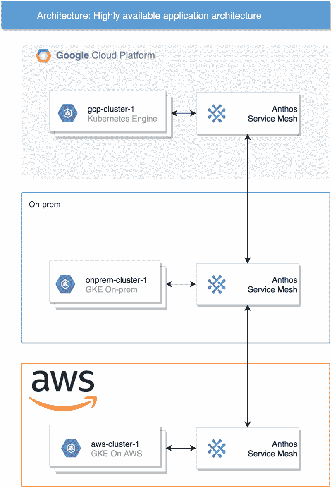
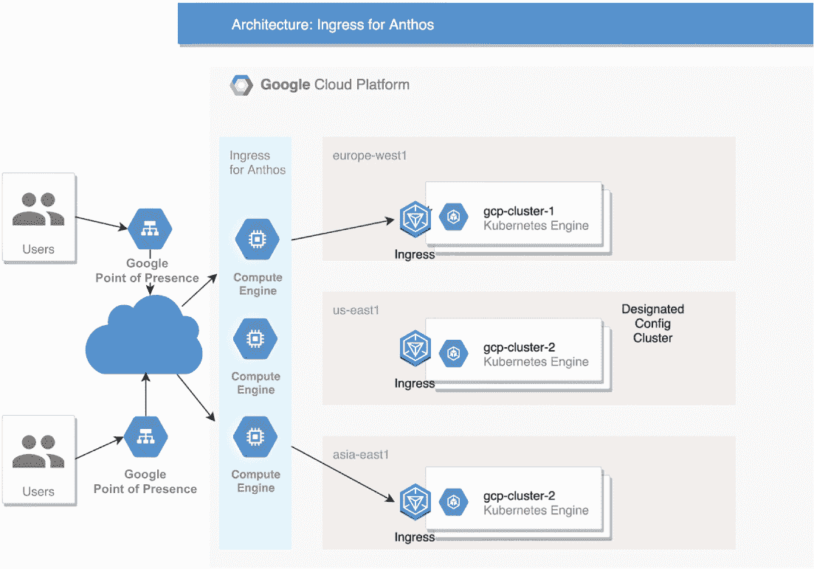
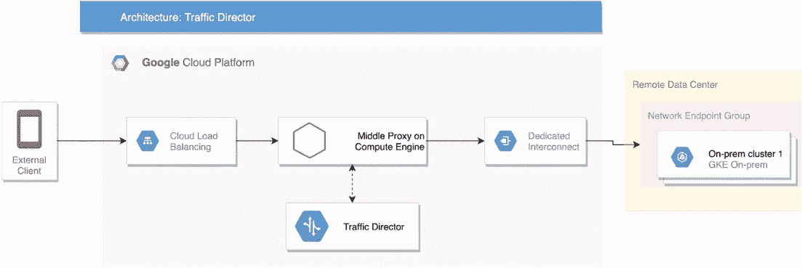
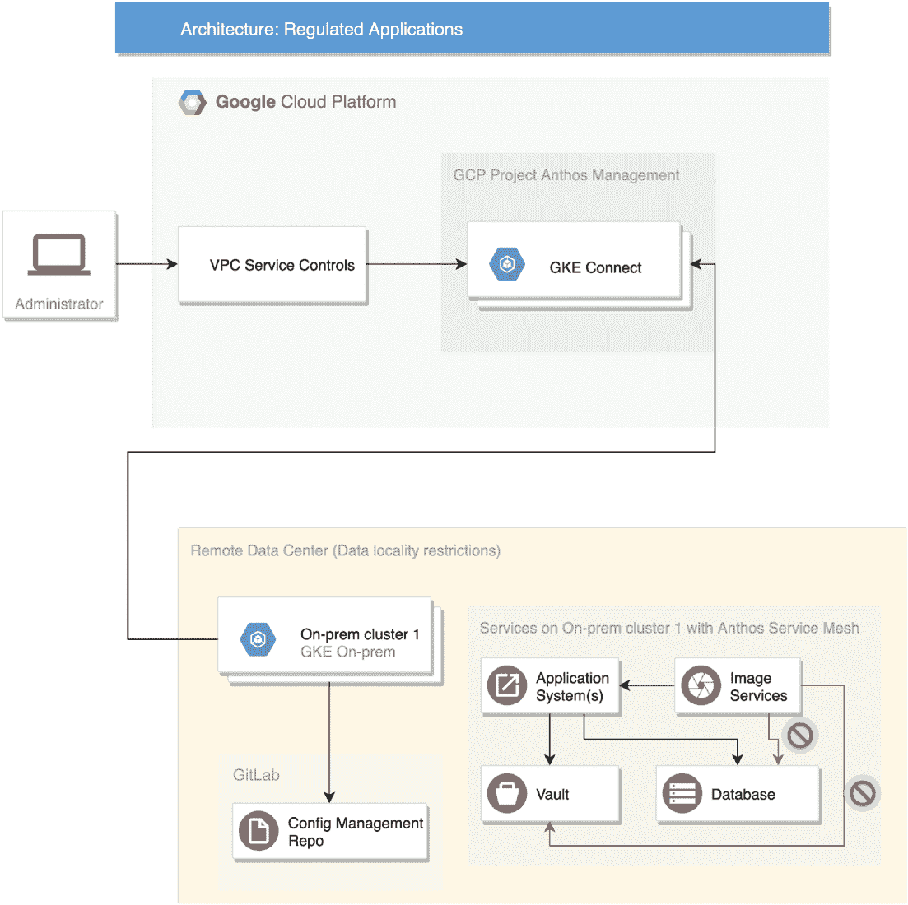
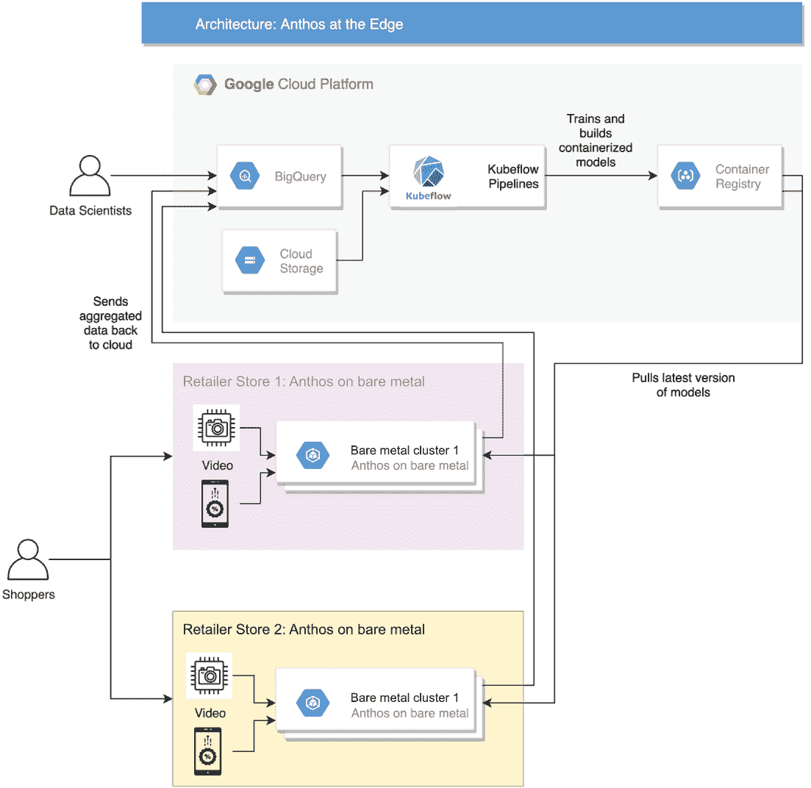

# 7 混合应用程序

贾森·奎克

本章涵盖

+   高可用应用程序

+   地理上分布式的应用程序

+   混合多云应用程序

+   受法律监管的应用程序

+   必须在边缘运行的应用程序

在现实世界中，应用程序受到诸如数据本地性要求、资源限制、无法保证稳定连接到云的情况（例如在棒球场、建筑工地或战斗机上）等规则的约束，需要在边缘进行低延迟计算以避免大量数据传输。应用程序必须可用，并能在区域灾难或云服务中断中生存。

然而，仍然存在运行与 Kubernetes 平台提供的一致性和稳定性相同的应用程序的需求。因此，像 Anthos 这样的解决方案被设计出来，为这类应用程序创建一个符合规定的分布式云平台。

在本章中，我们将探讨这些不同的情况，并展示涉及使用 Anthos 及其产品套件的各种架构，以支持这些类型的应用程序。

## 7.1 高可用应用程序

这类应用程序必须每天 24 小时、每周 7 天运行。管理交易的金融机构、医疗保健应用程序和交通管理只是少数几个在短时间内不可用就会影响现实世界应用的事例。

在 Google Kubernetes Engine 中，您可以在一个区域内创建跨可用区的集群。这种做法在区域内某个可用区发生故障时提供保障——其他可用区仍在运行应用程序。Kubernetes 调度器随后会在其他活跃的可用区上的节点上启动额外的副本，以满足 Kubernetes 配置中定义的副本要求。

然而，如果整个区域或整个云服务提供商都宕机了怎么办？福布斯杂志上的一篇文章([`mng.bz/DZa0`](http://mng.bz/DZa0))提到了一个场景，其中一家银行客户希望使用单一云服务，而监管机构担心在故障期间会发生什么。客户估计在云服务中断期间最多会有两小时的停机时间，但该计划被监管机构拒绝，因为它不是一个可行的选择。

在这种情况下，公司可能需要跨越多个云和区域，但这样做会引入管理多个云服务提供商的复杂性和开销，同时还需要在他们的运营、开发和安全管理上具备双倍的技能集。

使用 Anthos，公司可以在一个统一的部署、扩展、安全和开发模式上标准化 Kubernetes，同时仍然能够利用多个云服务提供商的可用性，并在区域和可用区之间迁移工作负载。

### 7.1.1 架构

图 7.1 所示的设置很简单：安装 Anthos GKE、AWS 上的 GKE 和本地 GKE，并将它们全部包含在一个服务网格中。这样的设置不仅能在区域级别提供高可用性，还能在云服务提供商级别提供高可用性。

图 7.1 多云可用性与服务网格连接

注意，这种结构假设应用只需可用，但不一定需要从互联网上可访问。这种区别很重要，因为即使是在极其不可能的情况下，某个云服务提供商出现严重故障，这种架构也能生存。即使 Anthos 集群无法在有限时间内访问 Google Cloud API，它们仍然可以继续运行。

### 7.1.2 优势

在所有三个云中安装托管 Kubernetes 服务可能看起来很简单，但每个云都有不同的流程、选项和最佳实践。可用的 Kubernetes 版本在云服务提供商之间也有所不同。通过使用 Anthos，这些问题由幕后工作的 Google 工程师处理，确保一切在不同的云上都能正常工作。例如，Workload Identity 可以在混合云和多云环境中部署，以提供统一的身份验证框架。这种情况提供了真正的多云托管服务的感觉，客户对 Google 说：“把我的预算拿去，帮助我在任何地方管理我的集群，甚至是在你的竞争对手的服务上。”

### 7.1.3 局限性

这样的应用通常需要一个地方来持久化状态，这就会对提供商产生依赖，除非组织选择在云上托管自己的数据解决方案。随着 Kubernetes 原生数据库（如 CockroachDB）的出现，这些数据库可以部署在多个集群中，或者使用 MirrorMaker 在多个集群中的 Kafka 部署之间复制消息，这个问题开始有了稳健的解决方案。

Anthos 不管理构建集群所使用的底层网络、存储和计算资源，组织仍然需要管理网络并确保在混合云和多云环境中存储和计算的可用性。这全部关乎 Kubernetes API，并使其在整个组织中的任何表面上对开发者可用——这是一个与竞争对手产品不同的共享责任。

重要的是要理解，这样的架构可能不容易构建和维护，但对于有监管、财务和声誉原因需要其应用始终可用且具有灾难恢复能力的组织来说，Anthos 提供了一条通往这一目标的路径。

## 7.2 地理分布式应用

这些应用必须分布在全球各地，以服务全球用户。一个托管服务能够从世界任何地方的单个 IP 地址路由到最近的集群，这使得应用在全球范围内的扩展变得更加简单。

对于这种设置来说，最重要的是提供用户从他们最近的位置访问此应用程序的途径，以最小化延迟。该应用程序通常是部署到不同区域集群中的微服务的精确副本，但没有要求它跨越多个云。这与多地理数据库相结合，这些数据库可以作为 Google 的托管服务（例如 Spanner）或 CockroachDB 使用，CockroachDB 可以部署在全球范围内的多个 Kubernetes 集群中。

然而，使用 Anthos，同一个应用程序可以部署在多个区域，这为各种市场开辟了新的机遇。将这一切联系在一起的一个重要组件是 Anthos for Ingress，这是一个为分布式集群提供的云托管网关。

使用 Anthos for Ingress，所有应用程序的用户都可以通过一个任播 IP 访问它，并被路由到用户最近的集群。这种能力在零售行业中非常重要，因为客户流失已被证明与电子商务网站的延迟直接相关。

### 7.2.1 Anthos for Ingress 架构

Anthos for Ingress 建立在现有的 Google HTTP 负载均衡架构之上，使用 Google Cloud 存在点有效地将流量路由到最近的可用集群，如图 7.2 所示。在这种架构下，您可以在特定区域的 Anthos 集群上部署需要为不同区域的新受众提供服务的应用程序，并配置 Anthos for Ingress 将流量发送到该新区域，同时保持相同的 IP 地址和域名。

图 7.2 Anthos for Ingress 架构

任何集群都可以被指定为配置集群，并且在这个集群上部署了两个自定义 Kubernetes 对象，MultiClusterIngress 和 MultiClusterService，这只是一个 Anthos Ingress 控制器的集中配置存储，供其读取。

Anthos Ingress 控制器是一组 Compute Engine 实例，这些实例位于用户控制之外的多个 Google Cloud 区域，并由 Google 管理。这些实例必须放置在最近的 Google 存在点，以便根据 Anthos 集群（这些集群是同一 Anthos 舰队中的成员）和 Pod 可用性做出路由决策¹。

Anthos for Ingress 的关键概念是使用网络端点组（NEGs）。NEGs 是一组后端端点或服务，可以在 Anthos 集群上部署。如图 7.2 所示的 Anthos for Ingress 服务中的 Compute Engine 实例根据服务的可用性路由到正确的 NEG。

要了解更多关于 Anthos for Ingress 网络的信息，请参阅第十章。

### 7.2.2 Anthos for Ingress 的优势

创建负载均衡器以将流量从也了解每个集群服务可用状态的存在点路由到集群是一项复杂任务。这个过程将问题分解为单个集群问题，因此开发者可以专注于构建更多功能，并知道它们可以以标准化的方式在全球范围内部署，并且用户可以以低延迟访问。

### 7.2.3 Anthos 的入口限制

目前，Ingress for Anthos 仅限于 Anthos Google Kubernetes Engine 集群，不支持 GKE on-prem 或 GKE on AWS 集群。然而，可能存在一个同时支持 GKE on-prem 集群的解决方案——使用 Traffic Director 可能是一个可能的解决方案。

## 7.3 具有互联网访问的混合多云应用

一些企业已经投资于远程数据中心或采用多云策略，这使得 Anthos 成为适合他们的产品。然而，当将他们的服务暴露给公共互联网时，他们需要保护这些应用，以防止恶意行为者干扰其可用性和延迟。Anthos 的入口限制之一是这些集群必须在 Google Cloud 上，但它们还需要路由到部署在私有和公共云中的应用。因此，他们可以使用 Traffic Director，它可以将流量路由到混合多云架构中的集群。

### 7.3.1 Traffic Director 架构

Traffic Director 架构看起来与 Anthos 的入口设置相似，但关键区别在于所有服务都必须在 Service Mesh 中，Traffic Director 才能工作。有关 Service Mesh 的更多详细信息，请参阅第四章。图 7.3 概述了使用 Traffic Director 路由混合应用的方法。

图 7.3 混合应用的 Traffic Director 架构

在图 7.3 中，GKE on-prem 集群提供后端服务，用于与 Traffic Director 一起使用。然后，Traffic Director 将 Google Cloud 负载均衡器引导到将流量路由到 GKE on-prem 集群。这种范式也适用于其他云上的 Anthos 集群。

### 7.3.2 Traffic Director 的优势

Traffic Director 允许使用 Google Cloud 负载均衡器作为混合应用的入口，并且在这个过程中，可以使用云原生服务，例如 Google Cloud Armor ([`cloud.google.com/armor`](https://cloud.google.com/armor)*),* Cloud CDN ([`cloud.google.com/cdn`](https://cloud.google.com/cdn)*),* Identity-Aware Proxy ([`cloud.google.com/iap`](https://cloud.google.com/iap)*),* 以及托管证书 ([`mng.bz/lJPz`](http://mng.bz/lJPz)*).* 

所有进入应用中的交通，无论服务托管在何处，都将通过一个谷歌接入点进入谷歌云负载均衡器，然后通过由流量导演编程的 Envoy 代理进行代理，连接到服务网格中的服务。该服务可以托管在本地或多个云中，但通过服务网格来识别。通过使用这些服务，本地混合应用可以免受拒绝服务（DDoS）攻击的保护，这对于混合应用来说可能是一个问题。

如果应用不在谷歌 Kubernetes Engine 上运行，流量导演还可以将流量引导到谷歌计算引擎。流量导演还可以用于在云服务和本地服务之间分割流量，以帮助服务从本地迁移到云，而无需停机。

### 7.3.3 流量导演的限制

在图 7.3 中，中间代理部署在托管实例组上，根据来自外部负载均衡器的流量进行扩展，然后再将其转发到本地 GKE 集群。这种额外的计算成本由应用所有者承担。

## 7.4 受法律监管的应用

一组应用属于高度监管的行业，这些行业受到数据本地性限制的约束。这些行业的列表包括金融机构、医疗保健提供者、制药公司和政府机构。

这类应用需要持续的监控和复杂的审计和安全策略，这些可以通过 GKE 本地、Anthos 配置管理、Anthos 服务网格和 VPC 服务控制来辅助实现。

### 7.4.1 架构

VPC 服务控制允许管理员限制对某些谷歌云 API 的访问，仅允许特定的 IP 地址、身份和客户端设备。这些 API 包括 gkehub.googleapis.com、gkeconnect.googleapis.com、meshca.googleapis.com 和 containerregistry.googleapis.com，它们是 Anthos 提供中使用的 GKE Hub、GKE Connect、Anthos 服务网格和容器注册服务。此过程使用 BeyondCorp ([`cloud.google.com/beyondcorp`](https://cloud.google.com/beyondcorp)*)，*这是一个由谷歌云推广的概念：信任应该建立在身份上，而不是网络，网络内部使用零信任策略。这使用户能够从任何受信任的位置安全地工作，而无需 VPN。参见图 7.4 以了解设置的可视化。

图 7.4 带有 VPC 服务控制、ACM 和 ASM 的受监管应用

企业可以将 Anthos 集群配置为从本地托管的仓库读取配置管理，在一个位置设置基于角色的访问控制，并通过持续同步传播此设置。通过部署 Anthos Config Management 的 Policy Controller，管理员和安全团队可以定义策略以限制未经批准的容器注册库的使用，防止创建特权 Pod，并定义只读操作系统文件系统。要详细了解如何操作，请参阅第十三章。

使用 Anthos Service Mesh，管理员可以强制所有 Pod 之间的相互 TLS 通信，并定义哪些 Pod 可以相互通信——而且仅限于彼此，没有其他。这种限制防止了对敏感数据的未授权访问，并在系统上部署了恶意 Pod 的情况下防止数据泄露。欲深入了解此主题，请参阅第四章。

### 7.4.2 优势

上一节中提到的所有服务都是为了特定目的而构建的，并将安全性视为其最高考虑因素。例如，如果 Anthos Config Management 与仓库断开连接，最后同步的策略仍然有效。所有组件也都经过测试，以确保它们可以相互工作，并且任何问题都可以通过 Google 支持快速解决。

此架构也具有可扩展性和自动化能力，因此可以创建新的本地监管集群，将其连接到相同的 ACM 和 ASM 工件，并从已经完成的工作中受益。

## 7.5 必须在边缘运行的应用程序

边缘设备对不同公司和业务用例意味着不同的事情。例如，电信边缘用例将涉及 5G 能力的计算需求。请参阅第八章，了解 Anthos 如何实现这一用例的详细情况。

边缘设备还可以由零售商和远程制造站点使用，在这些地方，应用程序可以部署得更靠近用户，以提供低延迟体验，同时提供高性能计算。一个例子是在比赛进行时直接在体育场计算棒球比赛的统计数据，并将这些统计数据实时传递给解说员和观众。这是美国职业棒球大联盟决定在每个棒球场使用 Anthos 在云中以及本地处理和分析数据背后的驱动力（见[`mng.bz/Blyq`](http://mng.bz/Blyq)）。

这些应用程序必须在资源需求低且不依赖于持续互联网连接的边缘设备上运行。最大的问题与通过空中部署软件的最新版本到这些边缘节点有关。Anthos 在边缘提供这种能力，同时仍然允许开发人员以云原生的方式统一部署他们的应用程序，并相信由于 Kubernetes 的合规部署，他们的应用程序将以与云相同的方式运行。

### 7.5.1 架构

图 7.5 所示的架构代表了未来的零售商店，顾客可以在没有任何收银员的情况下购物。零售商仍然可以通过视频安全地监控购买，通过商店中的应用程序进行交易，以及识别交通热点，确定何时补货商品，并在提供实时低延迟体验的同时遵守隐私法规。

图 7.5 Anthos 边缘零售架构

对于此类用例，将使用许多机器学习模型用于盗窃检测、库存不足检测、推荐和确定交通热点。例如，可以使用 RetailNet 在零售店中进行人数统计和热点检测，参考此处：[`mng.bz/dJ9z`](http://mng.bz/dJ9z)。为此设置所需的是一个可以持续训练和更新模型，并在边缘以高性能计算进行推理的可靠部署方式。如图 7.5 所示，您可以使用 Anthos on bare metal 来实现这一点。将流媒体视频数据回传到云中进行推理需要大量带宽，并导致延迟，从而降低商店的实时体验。

然后，可以将汇总和匿名化的数据发送回云中，并通过 Kubeflow 进行模型训练，然后更新并在本地再次部署，创建一个反馈循环，以持续更新和增强模型的准确性。

### 7.5.2 优势

一个关键的好处是由于直接访问硬件并跳过虚拟机许可证的成本，边缘应用程序的性能得到了提升。Anthos on edge 1.9+还可以使用私有镜像库而不是 gcr.io 来拉取容器镜像，这样它就可以完全断网运行。

### 7.5.3 限制

没有虚拟化层，节点扩展需要您安装新的硬件节点并将它们连接到裸金属设备的集群。

## 摘要

+   不同的 Google Cloud 和 Anthos 服务在可用性、地理分布、受监管行业和边缘计算的不同用例中发挥着重要作用。许多企业需要这些不同的用例来丰富他们的数字产品，并可以使用规定的架构来实现这一点。

+   使用 Anthos，公司可以采用统一的部署、扩展、安全和开发模式来标准化 Kubernetes，并保持跨区域和可用区迁移工作负载的能力。

+   像工作负载身份这样的解决方案可以部署在多个和混合云中，以提供统一的身份验证框架。

+   Anthos Ingress 允许您创建负载均衡器，将流量从存在点路由到集群，这允许以标准化的方式在全球范围内部署功能，并使用户能够以低延迟访问。

+   Traffic Director 允许使用 Google Cloud 负载均衡器作为混合应用程序的前端，并使用服务网格的一部分云原生服务。

+   VPC 服务控制允许管理员限制对特定 Google Cloud API 的访问，仅限于特定的 IP 地址、身份和客户端服务。

+   Anthos on the edge 通过直接应用访问硬件来提高应用程序的性能，从而绕过虚拟机许可证的成本。

***

^（1.）请参阅第二章以了解舰队的定义。
