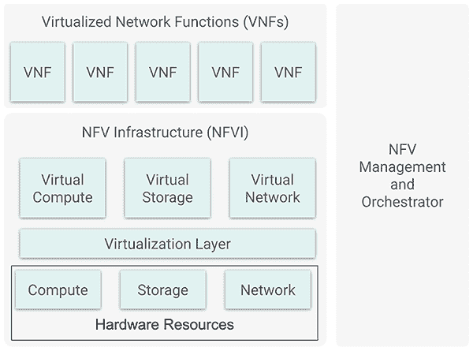
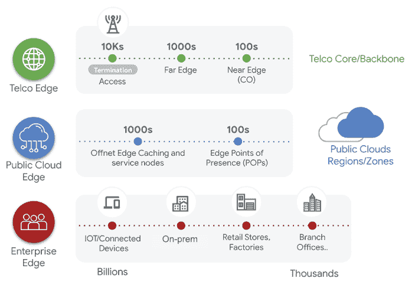
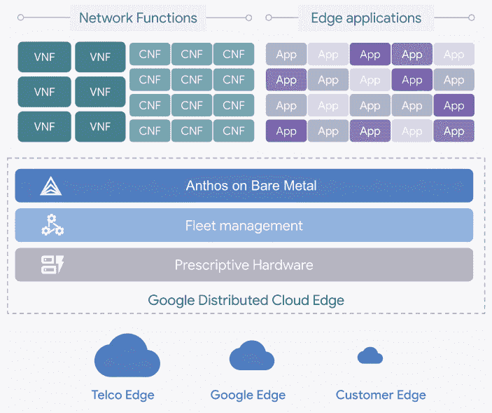
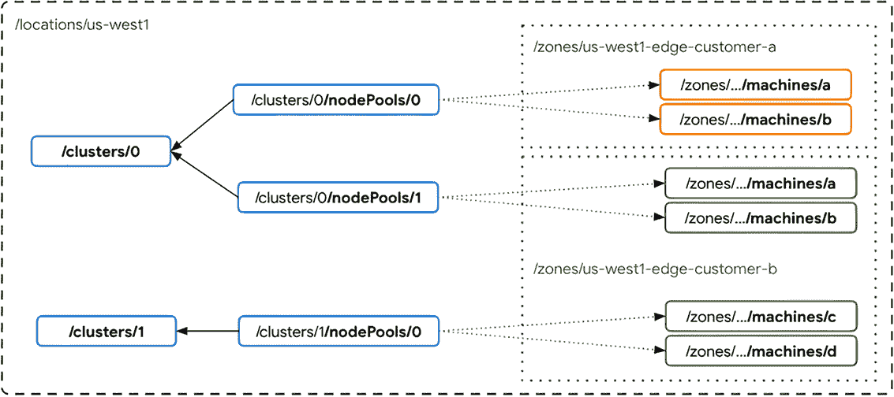
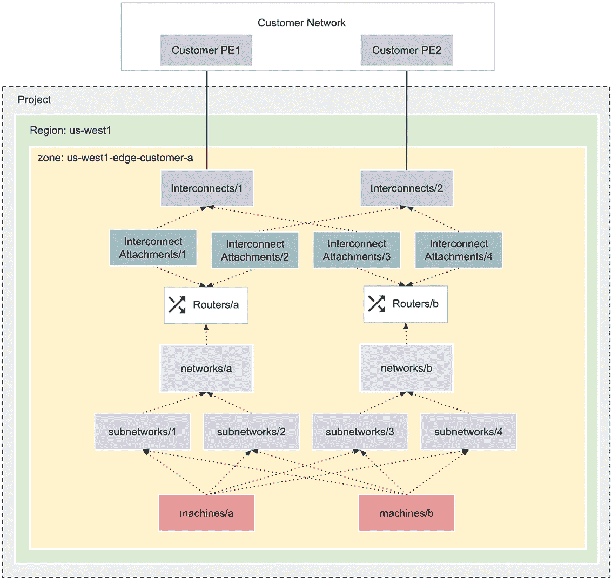
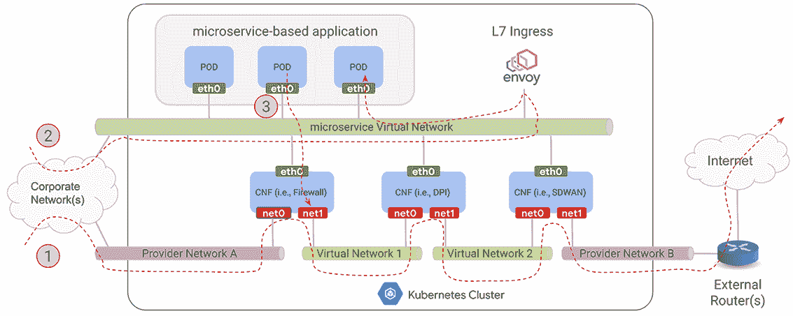
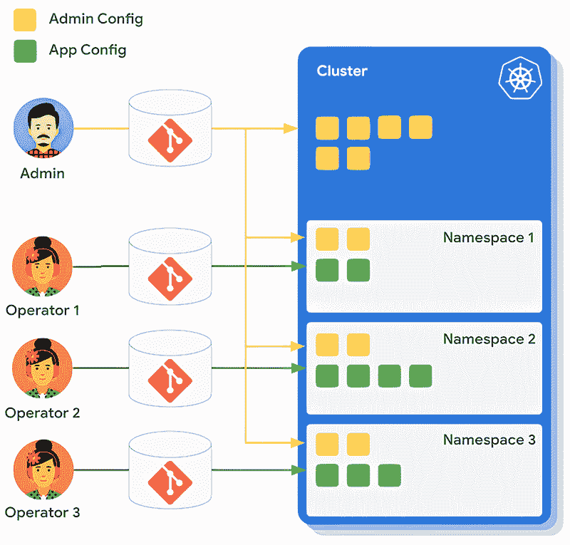
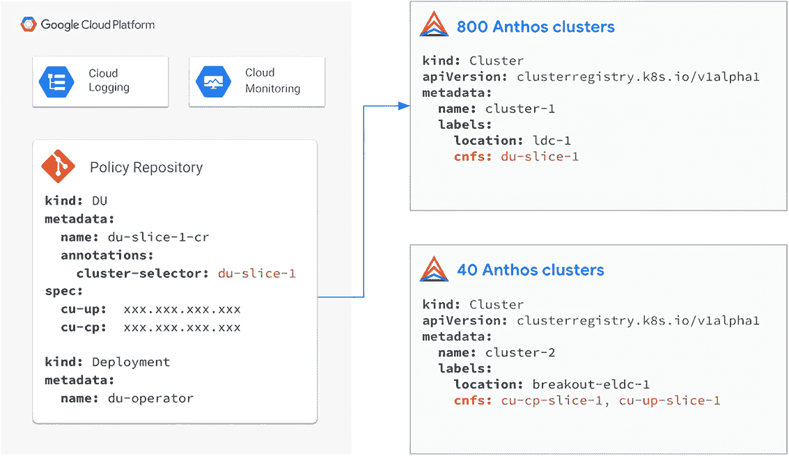
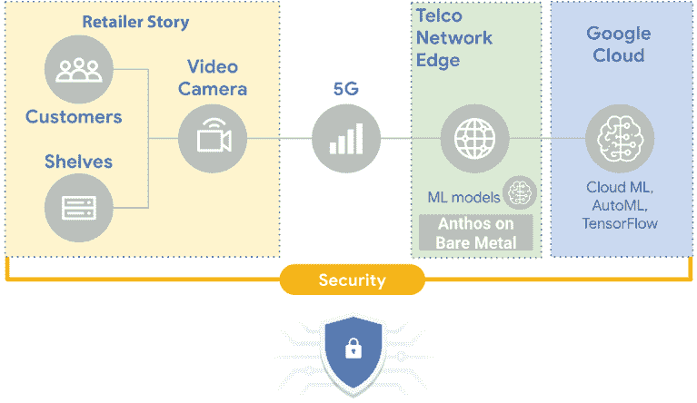

# 8 在边缘和电信世界工作

Giovanni Galloro

本章涵盖

+   电信网络功能向云原生网络功能的演变

+   Edge 应用场景

+   支持电信和边缘工作负载的 Anthos 特定功能

+   Google 分布式云边缘

本章主要介绍如何使用 Anthos 作为边缘和电信工作负载的启用平台，这些工作负载分为以下两类：

+   *云原生网络功能* —电信网络功能的演变，无论是已经虚拟化还是仍以物理设备部署，向容器化工作负载发展，以实现更高的效率、性能和管理便捷性。这一演变也将由新的 5G 相关网络功能驱动。

+   *新的边缘应用*—将在边缘位置、靠近最终用户处部署的工作负载，以减少延迟并启用新的应用类型，如自动驾驶、智能城市、智能视频监控、增强现实、虚拟现实以及远程医疗/手术。通常此类应用将受益于并由 5G 网络提供支持，在很大程度上将以容器化工作负载的形式部署。

## 8.1 电信应用演变

在本节中，您将找到电信网络功能向网络功能虚拟化和云原生网络功能演变的回顾。

### 8.1.1 网络功能虚拟化简介

传统上，网络运营商通常在专用的、专有的硬件设备上实现网络功能。从 2010 年代中期开始，随着电信运营商考虑虚拟化其网络功能，网络功能虚拟化（NFV）的概念出现，遵循了导致 IT 服务器虚拟化的相同模式，将多种网络设备类型整合到行业标准的大批量服务器、交换机和存储中，以降低成本并提高效率、敏捷性和弹性。

一种趋势开始将网络设备转化为虚拟网络功能（VNFs）：通过虚拟机管理程序在行业标准 x86 服务器上部署的虚拟机。如图 8.1 所示，NFV 架构的三个主要工作域如下：

+   *虚拟化网络功能（VNFs**）*—符合 x86 规范的虚拟机版本的网络设备

+   *网络功能虚拟化基础设施（NFVI**）*—构建托管虚拟网络功能的硬件（服务器、存储、网络设备）和软件组件（虚拟化软件）

+   *管理和编排（MANO**）*—支持基础设施虚拟化和虚拟网络功能生命周期管理及编排的物理或软件资源



图 8.1 高级 NFV 架构框架

### 8.1.2 NFV 用例

作为此倡议的一部分创建的一些虚拟化网络功能，其采用程度不同，如下所示：

+   *vCPE* *(家庭和企业 CPE [客户场所设备] 的虚拟化)*—将路由器引入运营商网络。采用这种方法，高级路由和网络功能从传统的服务提供商在企业场所或消费者家中部署的接入路由器转移到运行在运营商自己的 NFVI（网络功能虚拟化基础设施）上行业标准硬件上的 VNFs。客户的本地设备被更简单的硬件所取代。

+   *vPE* *(PE [提供商边缘] 路由的虚拟化)*—在此方法中，部署在服务提供商边缘的路由器，通常与部署在客户场所的路由器相连，也被虚拟化。

+   *vEPC (演进分组核心) 虚拟化*—虚拟化移动核心网络和 IP 多媒体子系统的网络功能：移动管理实体、服务网关和分组数据网络网关。

+   *vCDN*—CDN（内容分发网络）的虚拟化。本用例旨在虚拟化通常在本地部署的第三方 CDN 设备。

+   *vRAN*—无线接入网络（RANs）中移动基站的虚拟化最初被认为是 NFV 的一个用例，主要是因为移动基站占移动网络总拥有成本和能耗的大部分。这种方法在 NFV 中并没有有效实现，但获得前面描述的容器化工作负载的好处以及需要与 5G 相关的新的无线网络功能的目标正在推动这些功能的转型到 CNFs（云原生网络功能）。

### 8.1.3 向云原生网络功能的演进

电信运营商和网络功能供应商正在考虑基于容器的云原生网络功能，作为 VNFs（虚拟网络功能）的演进，以充分实现上述 NFV（网络功能虚拟化）的好处，并增加云原生应用在可移植性、敏捷性、可管理性和效率方面的改进。

云原生计算基金会（CNCF）内部的各项倡议旨在支持电信运营商（和网络供应商）获得云原生技术所宣称的好处。这些倡议主要由电信用户组（[`github.com/cncf/telecom-user-group`](https://github.com/cncf/telecom-user-group)）领导，该用户组产生了各种资产，包括存储库中可用的白皮书和以下关于云原生网络功能的定义：

云原生网络功能（CNF）是一个实现网络功能的云原生应用。一个 CNF 由一个或多个微服务组成，并已使用云原生原则开发，包括不可变基础设施、声明性 API 和“可重复部署过程”。

## 8.2 新边缘应用

下文包含了对利用 5G 网络更高带宽和更低延迟的新边缘应用特性的描述。

### 8.2.1 5G 作为新边缘应用的推动者

5G 网络的特点，包括其更大的连续频谱、更先进的无线电天线技术（大规模 MIMO）、更好的调制方案以及核心和 RAN 之间信号流的变化/优化，提供了具有显著更高带宽和更低延迟的网络能力。电信服务提供商和应用程序/数字服务开发者正在寻求利用这些特性，在将会有更多设备连接并且将以非常高的速度交换信息的应用中使用，从而实现改进的场景：自动驾驶、智能城市、智能工厂、智能视频监控、增强现实、虚拟现实和远程医疗/手术。

为了满足这些要求，工作负载将在许多情况下部署在边缘位置，靠近终端设备或用户，以进行近乎实时的数据处理和分析，使智能设备能够在不将数据发送到云端并返回的情况下进行操作和响应。这类应用将主要作为容器化工作负载部署。通常，5G 将主要基于软件定义，继续 NFV 开始的转型；将需要进一步的自动化，因为其将处理的速度和体积；并将基于开源软件。

### 8.2.2 边缘计算

边缘计算将使应用能够快速响应，提供近乎实时的洞察，减少对连接到中央数据中心或云的网络依赖，并减少需要集中传输的数据量。Gartner 预测，到 2025 年，75%的企业生成数据将在传统的集中式数据中心或云之外创建和处理（见[`mng.bz/rdDE`](http://mng.bz/rdDE)）。

如图 8.2 所示，边缘基础设施将在广泛分布的位置部署，在许多情况下，其规模小于中央数据中心，如下所示：

+   *电信边缘*—电信运营商的小型数据中心、接入点和网络机柜

+   *公共云边缘*—云提供商/全球广播商的接入点和 CDN 边缘

+   *企业边缘*—企业/终端用户的分支机构、零售店、仓库和工厂



图 8.2 边缘部署

计算节点数量通常会增长，将出现需要具有管理数以万计的计算集群的能力的中央管理平面。

### 8.2.3 边缘应用示例

以下是一些应用和用例的示例，这些应用和用例将利用部署在边缘位置的优势，并通过本地执行 AI 模型对图像、视频、音频和其他类型的数据进行分析和预测：

+   *预测性维护*—在现场分析制造工厂和机器数据，以预测故障发生之前的情况，并优化正常运行时间和维护团队的工作

+   *制造质量检查*—分析装配线上的产品图片和视频，以检查是否符合质量标准

+   *工人安全*—通过图片和视频分析正确的安全措施实施和安全设备的使用

+   *诊断服务和患者监测*—使用部署到边缘的计算机视觉解决方案处理图像，这可以提高诊断准确性和检查效率

+   *零售店的队列和货架管理*—分析视频流以检查排队人数或货架上的商品可用性，以及打开现金收银机或相应地补充商品

+   *自动驾驶汽车和工业车辆*—为自动驾驶车辆摄取和收集的数据提供低延迟处理

+   *通过 AR/VR 进行制造工人指导和培训*—在边缘部署的 AI 模型，具有物体检测和识别、实时捕获等功能

+   *物流跟踪*—通过图像和视频识别运输中的包裹、物品、托盘和车辆，并更新跟踪系统的 AI 模型

+   *库存管理和生产计划*—通过图像对资产状态进行近实时分析，为生产和供应链履行提供输入

## 8.3 Anthos 作为边缘和电信工作负载的平台

在本节中，我们将讨论 Anthos 如何提供基础支持边缘 Anthos 部署和电信工作负载的执行。我们还将深入了解谷歌为此目的设计的特定解决方案。

### 8.3.1 Google 分布式云边缘

如图 8.3 所示的 Google 分布式云边缘（GDCE），是谷歌提供的一项全面管理解决方案，旨在支持电信虚拟化和云原生网络功能以及边缘应用程序，包括软件、操作系统和硬件（服务器和 TOR 网络交换机），这些都在谷歌管理的机架上。它基于 Anthos 在裸机（在第十七章中详细描述）上，并且可以部署在前述章节中描述的以下站点类型： 

+   *公共云边缘*—谷歌边缘位置

+   *电信边缘*—由电信提供商拥有

+   *企业边缘*—由最终客户拥有（例如在零售店、工厂车间、分支机构和大体育场）



图 8.3 Google 分布式云边缘高级架构

GDCE 为用户提供车队管理功能，以管理所有硬件和软件资产，并通过在裸机上的 Anthos 功能支持容器化工作负载和虚拟机。

GDCE 还为用户提供 VPN 连接到 GCP，使用户能够与在客户 VPC 中运行的其他应用程序和其他 GCP 服务进行交互。为了服务高性能和低延迟工作负载，GDCE 还提供了一些高网络性能特性，如 SR-IOV 和 DPDK。谷歌云负责运营和管理底层基础设施，将云体验扩展到客户现场。

Google 提供计算、网络和存储硬件。这些硬件被运送到目标位置并由 Google 管理。Google 运营团队远程管理和监控 Google 设备。

客户需要在目标位置指定一个联系人（客户人员的一部分，不是 Google 人员），该联系人有权访问设备并执行基本管理任务。这些包括，例如，冷启动、更换部件、在设备上运行本地诊断的能力以及常见的系统管理任务。硬件连接并运行后，用户可以使用标准的 Google API 工具使用该服务。

GDCE Kubernetes 集群由控制平面和工作节点组成。工作节点组织成节点池。控制平面托管在 GCP 的单个计算区域。工作节点是 GDCE 机架上的服务器，每个工作节点使用一个完整的物理服务器。一个机架或一组共享空间、电源、冷却和连续网络布线的机架群定义为一个 GDCE 区域。

Google 分布式云边缘容器资源模型

GDCE 的资源模型与 Anthos 和其他 Anthos 部署选项不同。在这里，您可以找到用于描述、实现和管理 GDCE 实现计算架构的容器资源列表，如图 8.4 所示：

+   *区域*—区域代表一组共享网络布线或单个故障域的机器。区域可以代表一个机架或放置在同一位置的多个机架。GDCE 区域资源与 GCE 计算区域不同。列出 GCE 计算区域不会返回 GDCE 区域。区域代表单个故障域。为了部署具有高可用性和容错能力的应用，并帮助保护免受故障的影响，用户需要将应用部署到与同一区域相连的多个区域。

+   *机器*—机器代表一个物理服务器。机器资源元数据包括它所在的机架以及其他属性和标签。机器是用户只读资源。在部署时，根据 GDCE 系统的物理位置，将机器分配到特定的区域。每个物理机器都是分布式云边缘集群中的一个节点。机器可以是其指定区域内部署的 Kubernetes 集群的一部分。

+   *集群* —集群由控制平面和零个或多个节点池组成。它位于特定区域，并且只能连接来自该区域的节点池。如果用户尝试连接位于不同区域的机器节点池，操作将失败。

+   *节点池*—节点池是 GDCE 区域内机器的逻辑分组，用于向集群添加工作节点。

+   *VPN 连接*——GDCE 支持设置 VPN 连接到 GCP 项目，允许在 GDCE Kubernetes 集群上运行的工作负载直接连接到 GCP 资源。在建立 VPN 连接之前，应在集群中创建至少一个节点池。



图 8.4 Google 分布式云边缘容器资源模型

Google 分布式云边缘网络资源模型

除了 Kubernetes 集群资源、API 和默认的 Kubernetes Pod 网络之外，GDCE 还允许客户在 GDCE 区域内配置额外的网络，并将它们与客户网络连接起来，用于不同的目的。例如，在网络功能用例中，客户可能会创建一个操作、管理和维护网络以及一个信号网络，每个网络都有不同的多个子网，这些子网连接到网络功能 Pod 的次要接口。

图 8.5 描述了 GDCE 中网络模型所涉及的资源及其关系。从高层次来看，以下五种类型的资源与边缘网络配置相关：

+   *网络*——GDCE 区域中的虚拟网络，具有私有地址空间，可能包含一个或多个子网。网络与其他 GDCE 区域中的网络隔离。

+   *子网*——GDCE 网络中的第二层（VLAN）子网。子网有自己的广播域和客户分配的无类别域间路由。网络内的子网可以相互通信。GDCE 区域内不同网络中的子网无法相互通信。

+   *互连*——代表 GDCE 与客户网络之间一个或多个物理链接的逻辑链路捆绑。互连只能在 GDCE 站点初始化时创建。通常配置多个互连以提供高可用性。

+   *互连附加*——根据客户请求在互连之上提供的虚拟链接，以在 GDCE 网络和客户网络（例如，VRF）之间提供隔离的连接。通过互连附加流动的数据包将是不标记的或标记为客户指定的 VLAN ID。

+   *路由器*——用于在 GDCE 区域内配置网络路由功能的虚拟路由实例。例如，客户可以使用它配置 GDCE 网络与客户网络之间的互连附加上的 BGP 对等会话，或者通过 Pod 子网，以便某些 Pod 可以向 GDCE 通告前缀。默认情况下，从子网接收到的路由将被重新广播。



图 8.5 Google 分布式云边缘网络资源模型

这些资源类似于 Google Cloud 网络抽象，但有一些差异，如下所述：

+   为 GDCE 创建的所有网络资源都位于 GDCE 区域内部。GDCE 网络无法直接连接到 GCP VPC。不同 GDCE 区域内的网络也无法直接相互连接，除非客户有意将其连接。

+   GDCE 子网支持 VLAN，因此在第二层中相互隔离。

系统管理员应创建和维护所有网络资源。应用程序开发者/所有者只能查看网络资源。

### 8.3.2 Anthos 针对电信和边缘工作负载的功能

除了 GDCE 的具体特性外，Anthos 的功能在标准产品中也是可用的，以帮助部署、执行和管理边缘和电信工作负载。其中一些功能是专门为此目的设计的，并且主要在 Anthos 裸金属上提供，这是最适合这些工作负载的版本，也是 GDCE 的核心。其他功能，如 Anthos Config Management，虽然提供的是通用功能，但也可以适应边缘和电信应用。

Pod 的多个网络接口

常见的容器化网络功能（CNFs）需求是在默认的 Kubernetes 接口之上为 Pods 提供额外的网络接口。这通常是为了在数据平面和管理/控制平面之间保持分离，出于性能或安全原因，或者为了隔离其他原因的网络流。Anthos 通过使用 Multus CNI 插件的特定实现，在裸金属上的 Anthos 上提供此功能。

建筑学

此功能允许单个 Pod 连接到多个网络。默认的 Kubernetes 接口在 Pod 中显示为 eth0，而通过 Multus CNI 创建的额外接口默认显示为 net1、net2 等，并可进行配置。用于额外接口的 CNI 可以是以下之一：

+   IPvlan

+   MacVLAN

+   桥接

+   SR-IOV

设置

要启用此功能，用户必须执行以下三个步骤：

1.  *启用多网络接口。* 通过将 multipleNetworkInterfaces 字段添加到 Anthos 裸金属集群自定义资源的 clusterNetwork 部分并将它设置为 true，来为 Pods 启用多网络接口，如下所示：

    ```
    ...
     clusterNetwork:
      multipleNetworkInterfaces: true
      pods:
       cidrBlocks:
       - 192.168.0.0/16
      services:
       cidrBlocks:
       - 10.96.0.0/12
     ...
    ```

1.  *指定网络接口。* 使用 NetworkAttachmentDefinition 自定义资源来指定额外的网络接口。NetworkAttachmentDefinition 自定义资源对应于 Pods 可用的网络。这些自定义资源可以在集群创建时的集群配置清单中指定，或者直接添加到现有的目标集群中：

    ```
    apiVersion: "k8s.cni.cncf.io/v1"
    kind: NetworkAttachmentDefinition
    metadata:
     name: gke-network-1
    spec:
     config: ‘{
     "type": "ipvlan",
     "master": “ens224”,
     “mode”: “l2”,
     "ipam": {
      "type": "whereabouts",
      "range": "172.120.0.0/24"
     }
    }’
    ```

1.  *将网络接口分配给 Pod*。您可以通过 k8s.v1.cni.cncf.io/networks:注解在 Pod 或部署清单中启用多个 NIC，使用对应于特定 NetworkAttachmentDefinition 自定义资源和其命名空间的值，如下例所示，其中网络接口由两个 NetworkAttachmentDefinition 自定义资源的名称指定，即 gke-network-1 和 gke-network-2，在目标集群的默认命名空间中：

    ```
    ---
    apiVersion: apps/v1
    kind: Deployment
    metadata:
     name: sample-deployment
    spec:
    ...
     template:
      metadata:
       annotations:
        k8s.v1.cni.cncf.io/networks: default/gke-network-1, default/gke-network-2
       labels:
        app: sample-deployment
     ...
    ```

将网络接口限制在节点池中

使用 k8s.v1.cni.cncf.io/nodeSelector 注解来指定对于哪些节点，NetworkAttachmentDefinition 自定义资源是有效的。在裸金属上的 Anthos 集群强制任何引用此自定义资源的 Pod 部署在这些特定的节点上。在以下示例中，裸金属上的 Anthos 集群强制将所有分配给 multinicNP 节点池的 gke-network-1 网络接口的 Pod 进行部署。裸金属上的 Anthos 集群相应地使用 baremetal.cluster.gke.io/node-pool 标签标记节点池：

```
apiVersion: "k8s.cni.cncf.io/v1"
kind: NetworkAttachmentDefinition
metadata:
 annotations:
  k8s.v1.cni.cncf.io/nodeSelector: baremetal.cluster.gke.io/node-pool=multinicNP
 name: gke-network-1
spec:
...
```

关于 SR-IOV 插件的说明

SR-IOV 是一种规范，它本质上允许物理 PCIe 设备的虚拟化。它允许您将符合规范的网络设备（在主机节点上识别为物理功能 PF，通常代表单个 NIC 端口）分割成多个虚拟功能（VF），这些虚拟功能可以直接被虚拟化工作负载访问。SR-IOV 对网络硬件的直接访问提供了增强的性能，因此它被广泛应用于基于 VM 的 VNFs。

SR-IOV CNI 插件([`github.com/intel/sriov-cni`](https://github.com/intel/sriov-cni))允许 Kubernetes Pod 直接连接到 SR-IOV VF，并将 VF 绑定到 DPDK 驱动程序，这为云原生网络功能提供了增强的网络性能，就像之前为 VNFs 所做的那样。



图 8.6 使用多个 NIC 连接不同的网络段

在图 8.6 中，您可以看到一个示例图，展示了多个 CNF 串联在一起，通过使用多 NIC Pod 连接多个网络段来提供不同的服务（防火墙、深度包检测、SD-WAN）。

在裸金属上的 Anthos 上运行基于 VM 的工作负载

并非所有网络功能都将部署为 CNFs，其中一些将保持为 VNFs，因此对于一段时间内两种部署模型的共存将是必需的。为了满足这种情况以及其他将部分工作负载作为 VM 而不是容器运行的要求，裸金属上的 Anthos 提供了通过 Anthos VM Runtime 运行基于 VM 工作负载的可能性，该 Runtime 基于 KubeVirt。

在下一节中展示了在裸金属上的 Anthos 上运行 VM 所需的任务的综合描述。

启用 Anthos VM Runtime

要启用 Anthos VM Runtime，您需要执行以下操作：

1.  更新 VMRuntime 自定义资源，将 enabled 设置为 true，如下例所示：

    ```
    apiVersion: vm.cluster.gke.io/v1
    kind: VMRuntime
    metadata:
     name: vmruntime
    Spec:
     enabled: true
     # useEmulation default to false if not set.
     useEmulation: true
     # vmImageFormat default to "qcow2" if not set.
     vmImageFormat: qcow2
    ```

1.  如果您的节点不支持硬件虚拟化，或者您不确定，请将 useEmulation 设置为 true。如果可用，硬件虚拟化比软件仿真提供更好的性能。如果未指定，useEmulation 字段默认为 false。

1.  您可以通过设置支持两种磁盘镜像格式值（raw 和 qcow2）的 vmImageFormat 字段来更改您创建的虚拟机使用的镜像格式。如果您不设置 vmImageFormat，Anthos VM Runtime 将使用 raw 磁盘镜像格式创建虚拟机。与 qcow2（一种写时复制格式）相比，raw 格式可能提供更好的性能，但可能使用更多的磁盘。

1.  保存配置并验证 VMRuntime 自定义资源是否启用：您可以执行 kubectl describe vmruntime vmruntime 并检查描述是否显示 VMRuntime.Status.Ready 设置为 true。

创建虚拟机

在创建虚拟机之前，建议配置一个 cloud-init 文件以确保您在创建虚拟机后可以访问控制台。您可以通过以下两种方式创建自定义 cloud-init 文件。最简单的方法是在创建虚拟机时指定--os=<OPERATING_SYSTEM>标志。此方法自动配置一个简单的 cloud-init 文件，适用于以下操作系统：

+   Ubuntu

+   CentOS

+   Debian

+   Fedora

您的虚拟机创建后，您可以使用以下凭据首次访问它，然后更改密码：

```
user: root
password: changeme
```

如果您的镜像包含不同的基于 Linux 的操作系统或您需要更高级的配置，您可以手动创建一个自定义 cloud-init 文件，并通过指定--cloud-init-file=<path/to/file>标志来指定该文件的路径。在其最基本的形式中，cloud-init 文件是一个包含以下内容的 YAML 文件：

```
#cloud-config
user: root
password: changeme
lock_passwd: false
chpasswd: {expire: false}
disable_root: false
ssh_authorized_keys:
- <ssh-key>
```

要使用 kubectl 创建虚拟机，您需要遵循以下步骤：

1.  使用以下命令安装 virtctl 插件：sudo -E ./bmctl install virtctl。

1.  执行命令 kubectl virt create vm。以下示例包含参数：

    ```
    kubectl virt create vm VM_NAME \
      --boot-disk-access-mode=MODE \
      --boot-disk-size=DISK_SIZE \
      --boot-disk-storage-class="DISK_CLASS" \
      --cloud-init-file=FILE_PATH \
      --cpu=CPU_NUMBER \
      --image=IMAGE_NAME \
      --memory=MEMORY_SIZE
    ```

参数在此处解释：

+   *VM_NAME*—您想要创建的虚拟机名称。

+   *MODE*—启动磁盘的访问模式。可能的值是 ReadWriteOnce（默认）或 ReadWriteMany。

+   *DISK_SIZE*—您希望启动磁盘的大小。默认值是 20Gi。

+   *DISK_CLASS*—启动磁盘的存储类别。默认值是 local-shared。

+   *FILE_PATH*—自定义 cloud-init 文件的完整路径。根据镜像的不同，这可能是在创建虚拟机后获得控制台访问权限所必需的。

+   *CPU_NUMBER*—您想要为虚拟机配置的 CPU 数量。默认值是 1。

+   *IMAGE_NAME*—虚拟机镜像，可以是 ubuntu20.04（默认）、centos8 或镜像的 URL。

+   *MEMORY_SIZE*—虚拟机的内存大小。默认值是 4Gi。

如果未指定参数，则使用默认值。

或者，还可以应用一个定义 VirtualMachine 自定义资源的清单，这还启用了流行的 GitOps 部署方法（声明性和异步管理）。

大型计算集群的编排和自动化

边缘和无线接入网络 CNFs 部署的一个影响是需要一个中央控制平面，能够管理更广泛且更细粒度分布的计算集群，并且部署多个应用程序实例，这些实例可能比在传统的数据中心或公共云中部署的实例大几个数量级。在某些情况下，您可能需要在成百上千个计算集群上部署相同应用程序的实例，这些集群分布在边缘位置。通常，您需要根据特定标准动态定义实例必须部署的位置，以极短的通知时间来适应网络、监控对象或应用程序用户的变化需求。Anthos Config Management 提供的中央配置和政策管理能力将满足这一需求的关键。

Anthos Config Management

Anthos Config Management 的功能在第十一章中进行了详细描述。在这里，我们讨论了其中一些特别适用于在大量集群上管理应用程序和网络功能部署的功能：

+   多仓库模式

+   集群选择器

多仓库模式

在 Anthos Config Management 中启用多仓库模式允许您将来自多个仓库的配置同步到同一组集群中，如图 8.7 所示。一个单一的 *root 仓库*，通常由中央平台团队管理，托管集群和中央定义的命名空间范围内的配置，而可选的 *命名空间仓库* 用于配置特定命名空间中的对象。这种能力扩展了 ACM 的使用范围，不仅限于平台配置和政策管理，还包括应用程序的部署：可以将命名空间仓库的设置和控制委托给应用程序发布团队。中央定义的命名空间资源是继承的，而应用程序团队可以自由配置与应用程序相关的资源（部署、配置映射等）。如果根仓库和命名空间仓库之间出现冲突，只有根仓库中的声明应用于集群。



图 8.7 多仓库的 Anthos Config Management

命名空间仓库由 RepoSync 资源定义，由中央平台团队在特定命名空间中部署，或者如果由中央团队委托，则由应用程序团队直接部署。

图 8.8 中的图表示了根仓库和两个命名空间仓库的结构，其中数字标识以下内容：

1\. 由中央管理员/平台团队定义的根配置。

2\. 由中央团队定义的配置，由于它位于它们的父文件夹中，因此对命名空间是通用的。

3\. 中央团队在每个特定命名空间文件夹中定义的资源，包括 RepoSync 资源。（这也可以委托给应用程序团队。）

4, 5. 应用配置清单由应用团队管理。


图 8.8 ACM 示例配置具有多个仓库

集群选择器

ACM 提供了两个特定的资源对象，允许您使用 Kubernetes 标签和选择器方法，有选择地选择应用特定配置或部署的集群。

集群对象识别 ACM 管理的特定集群，并分配任意标签以识别所有集群相关属性（位置、硬件能力、目的等）：

```
kind: Cluster
apiVersion: clusterregistry.k8s.io/v1alpha1
metadata:
 name: edge-cluster-112a
 labels:
  location: london-12
  environment: production
  kind: edge
  gpu: yes
```

ClusterSelector 对象用于选择仅具有给定标签或标签组合的集群。以下 ClusterSelector 仅选择具有环境：生产和环境：边缘标签的集群——例如，用于针对所有在边缘位置部署的生产集群：

```
kind: ClusterSelector
apiVersion: configmanagement.gke.io/v1
metadata:
 name: production-edge
spec:
 selector:
  matchLabels:
   environment: production
   kind: edge
```

可以使用 configmanagement.gke.io/ cluster-selector: 注解从任何 ACM 管理的 Kubernetes 资源引用 ClusterSelector 对象，以选择该资源将在哪个集群上部署。

以下 ClusterRole 仅将在边缘位置部署的生产集群上创建：

```
kind: ClusterRole
apiVersion: rbac.authorization.k8s.io/v1
metadata:
 name: node-reader
 annotations:
  configmanagement.gke.io/cluster-selector: production-edge
rules:
- apiGroups: [""]
 resources: ["nodes"]
 verbs: ["get", "list", "watch"]
```

ClusterSelector 对象也可以由应用特定资源引用，以有选择地定义将托管应用实例的集群，并且如果使用多个仓库，则在 RepoSync 资源中仅同步特定命名空间仓库到特定集群。

在图 8.9 中，您可以看到一个由操作员管理的自定义资源（kind: DU）定义的分布式单元 CNF 示例，该资源部署在数百个标记为 cnfs: du-slice-1 的 Anthos 集群上，但不在专门用于中央单元（cnfs: cu-cp-slice1, cu-up-slice-1）的集群上。



图 8.9 ACM 示例配置使用集群选择器将不同的 CNFs 部署到不同的集群

所有这些配置都是通过持续与 Git 仓库（根目录和，如果存在，命名空间）同步来驱动的，该仓库作为事实来源。整个集群将定期收敛到期望状态，因此，例如，以下事情会发生：

+   被分配 cnfs: du-slice-1 标签的任何集群将立即部署 CNF。

+   任何通过更改标签更改目的地或目的的集群将删除 CNF，并立即应用新的期望配置。

+   CNF 配置的任何更新都将立即部署到所有期望的集群。

### 8.3.3 解决方案架构示例：智能零售

除了本章中提供的部署示例之外，我们还将描述一个基于 Anthos 为零售商构建的边缘应用架构。

零售商的一个目标是在商店中部署尽可能小的基础设施，只留下视频摄像头作为端点。部署的应用是实时排队管理，如图 8.10 所示。它从监控收银台结账线的视频摄像头开始，并通过商店中的 5G 调制解调器实时传输视频流，通过 5G 连接到电信运营商的边缘位置。电信运营商的边缘网络接收所有 5G 流量，那里的软件智能地将零售店流量发送到在此边缘部署的 Anthos 裸金属集群。在那里，基于容器的机器学习应用对传入的视频流进行机器学习推理，并检测零售店中有多少人排队。如果这个数字超过某个阈值，就会通过相同的低延迟 5G 路径发送通知到商店，该路径与视频流进入的路径相同。



图 8.10 边缘智能零售解决方案的高级架构

此外，AI/ML 应用还将有关此事件和其他事件的元数据发送到 Google Cloud。稍后，Google Cloud 安全地处理这些信息，为零售商提供洞察力，并训练未来模型的迭代。凭借 Google Cloud 精密的 AI/ML 产品套件，我们可以轻松训练和部署适用于任何应用的任何地点的高度精确模型。

这种架构可以扩展到其他智能零售应用，例如按客户定制的个性化、数字标牌、实时推荐、无接触结账和货架自动补货。所有对延迟敏感的处理，如视频或图像机器学习推理，都在电信边缘发生，而所有非实时组件，如模型训练和数据分析，则在云端运行。

## 摘要

+   市场趋势和持续发展的平台能力推动电信网络功能和边缘应用向 Kubernetes 和 Anthos 作为理想的部署平台发展。

+   NFV 的目标是实现电信网络功能从专用、专有硬件设备向在行业标准 x86 服务器上部署的虚拟机的转变。这种转型已经开始，但并未完全按照预期实现。

+   5G 正在推动新应用的兴起，这些应用以容器化工作负载的形式部署在边缘位置，并使用 5G 网络的高带宽和低延迟，提供近乎实时的数据处理，并允许智能设备在不将数据发送到云端并返回的情况下进行操作和响应。

+   Anthos 提供了关键能力，这些能力对于边缘和电信工作负载的部署、执行和管理至关重要：虚拟机运行时、硬件加速器、每个 Pod 的多个网络接口以及大型车队管理。

+   Google 分布式云边缘 (GDCE) 是 Google 提供的一个完全托管解决方案，基于裸金属上的 Anthos，旨在支持电信虚拟化和云原生网络功能以及边缘应用，并包括软件、操作系统和硬件，这些都在 Google 管理的机架上。它可以在 Google、电信或企业边缘部署。
