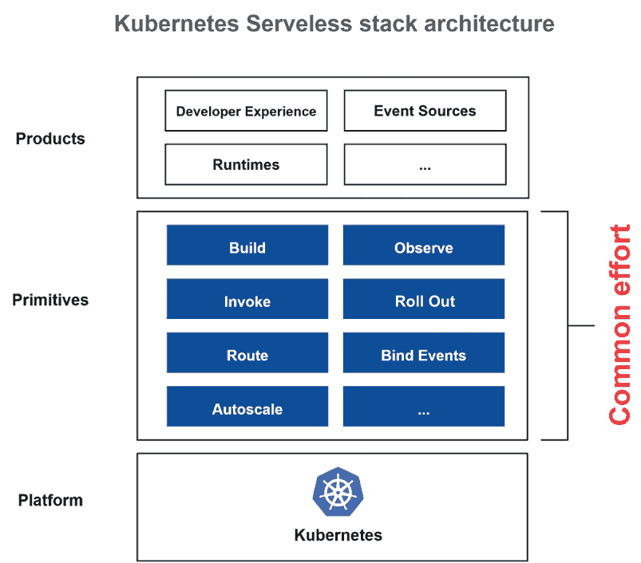
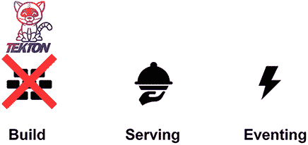
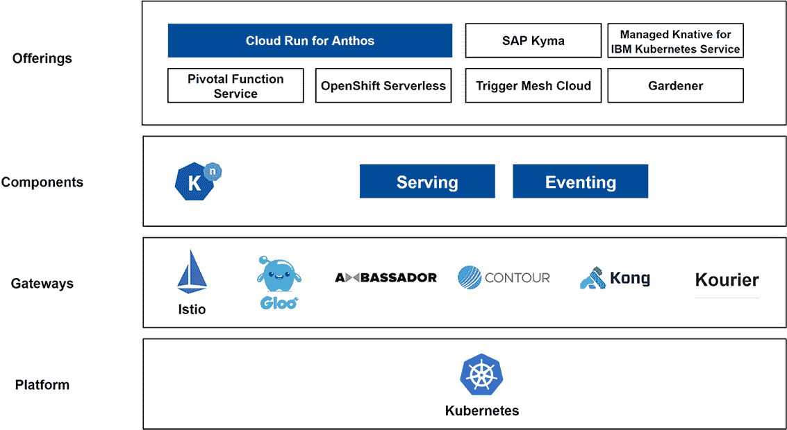
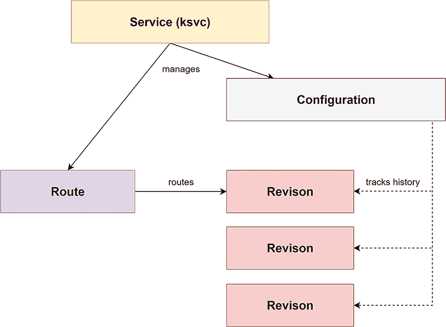
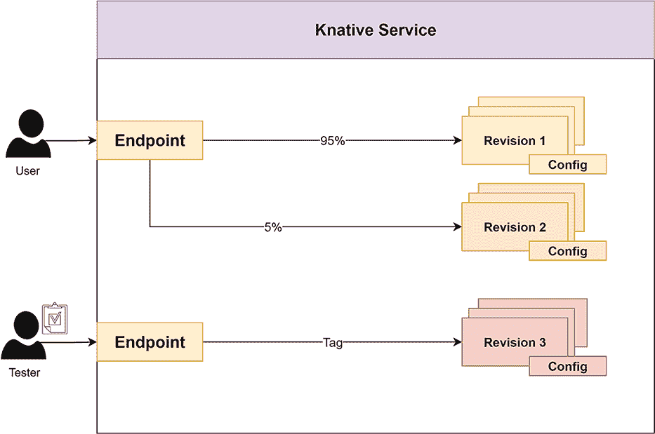
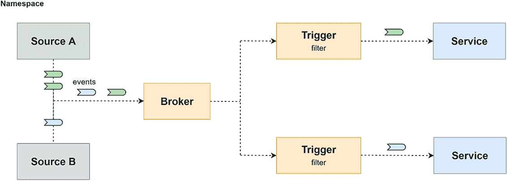
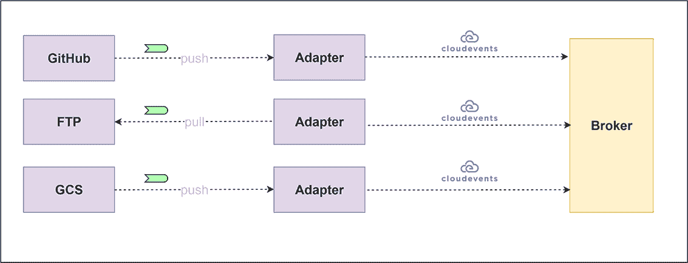
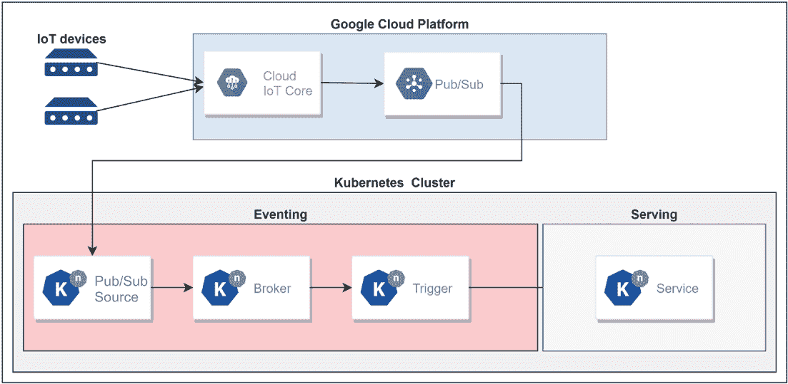
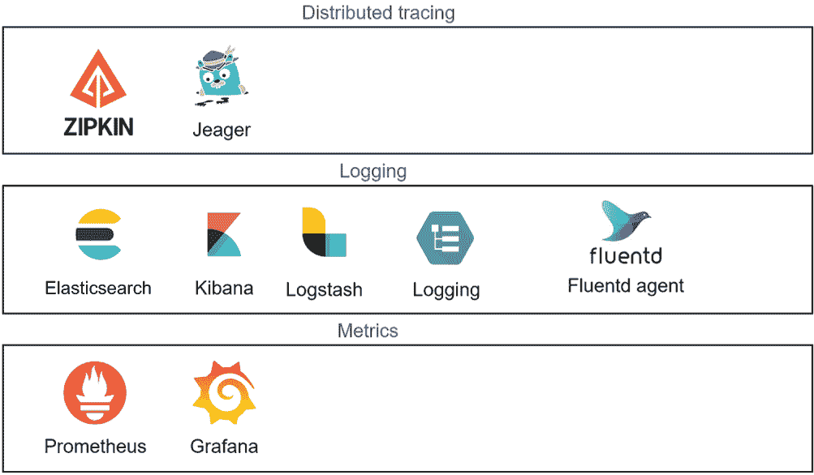
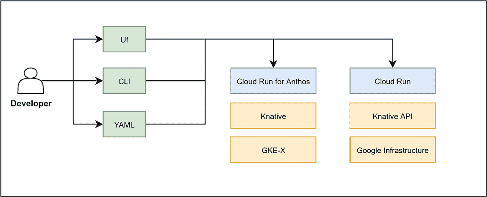

# 9 无服务器计算引擎（Knative）

Konrad Cłapa

本章涵盖

+   无服务器简介

+   Knative Serving 和 Eventing 组件

+   Knative 在 Anthos 上

在我们深入细节之前，让我们设定场景。在本章中，我们将讨论基于名为 Knative 的开源项目构建的 Google Cloud Platform 的托管服务。该项目启动的目的是允许更快地开发 Kubernetes 应用程序，而无需理解它们使用的复杂 Kubernetes 概念。使用这项服务，Google 会将 Knative serving 安装并管理在您的 Anthos GKE 集群内部。使用 Knative 与 Anthos 而不是开源 Knative 的一个好处是，Google 的自动化和站点可靠性工程师处理所有安装和维护工作。Anthos 与众多 GCP 服务集成，如云负载均衡（[`cloud.google.com/load-balancing`](https://cloud.google.com/load-balancing)）、云装甲（[`cloud.google.com/armor`](https://cloud.google.com/armor)）、云 CDN（[`cloud.google.com/cdn/docs/overview`](https://cloud.google.com/cdn/docs/overview)）等，使企业级的 Knative 成为现实。

我们已经在第三章中讨论了 Kubernetes，因此我们了解安装和维护它的复杂性。Google Kubernetes Engine 解决了这个问题。除了 Kubernetes 之外，我们还需要了解如何运行和操作云原生应用程序。Knative 做的是抽象那些实现细节，并允许您在任何 Kubernetes 集群上为无服务器容器化工作负载提供服务。

在本章中，我们将探讨什么是无服务器，向您介绍 Knative，并讨论 Anthos 如何提供企业级基于容器的无服务器平台。

## 9.1 无服务器简介

关于什么是无服务器的讨论很多。无服务器与函数即服务（FaaS）之间的比较很常见——这几乎是一场意识形态的争论。为了保持简单，让我们看看云原生计算基金会（Cloud Native Computing Foundation）的定义：

无服务器计算是指一种新的云原生计算模式，它通过不需要服务器管理来构建和运行应用程序的架构来实现。

Google 的完全托管云运行服务完美符合这一定义，因为它从开发者和操作者那里抽象了计算层。它允许您部署将用于服务 HTTP(S) 请求的容器。应用的扩展由平台本身处理。

虽然 Google Cloud Functions 提供了类似的功能，但它们对您可以使用的服务运行时语言有更多的意见。使用 Cloud Run，您可以使用任何可以运行响应 HTTPS 调用的服务的语言。Cloud Run 不需要您使用 Anthos。

当我们思考 Cloud Run 时，我们可以考虑以下一组无服务器功能：

+   *无服务器*—开发者无需担心底层计算基础设施。

+   *多语言*—应用程序可以用任何语言编写。

+   *事件驱动*—容器/函数由外部事件触发。

+   *自动扩展*—容器可以根据请求自动扩展。

+   *可移植性*—您的容器/应用程序应该能够在任何 Kubernetes 平台上运行。

## 9.2 Knative

因为您已经知道 Kubernetes 是一个用于构建平台的平台，为什么不使用它来构建基于容器的无服务器平台呢？Knative 就像任何其他 Kubernetes 应用程序一样运行在 Kubernetes 之上。您甚至可以看到一些 Knative 贡献者的声明，他们认为不应该称之为“无服务器”，那么让我们把 Knative 看作是一个可以在您运行 Kubernetes 的任何地方提供无服务器平台的平台。听起来公平吗？

### 9.2.1 简介

假设您想构建自己的基于 Kubernetes 的无服务器平台。您可能会得到图 9.1 所示的图表，显示了所有必需的组件。显然，在构建像自动扩展、可观察性、部署等基本功能方面存在一些重复的工作。Knative 正在为您提供所有这些基本功能，这样您就可以在 Kubernetes 上运行无服务器工作负载时拥有一个共同的体验。



图 9.1 Kubernetes 无服务器堆栈架构

现在从开发者的角度来看思考。他们只需要定义依赖项，编写代码，并将其放入容器中。然后，他们将应用程序部署到 Knative。他们不需要关心如何提供服务的细节。但这并不意味着他们失去了微调服务的能力。他们可以设置多个参数，如并发性（每个容器可以服务的请求数量）、最小/最大实例（为 Knative 服务可以配置的最小/最大容器实例），以及其他许多参数。Knative 隐藏了与扩展和流量管理相关的所有 Kubernetes 复杂性，并提供了一种观察工作负载的方法。这就是所说的简单开始开发 Kubernetes 应用程序，对吧？

Knative 与 CaaS、FaaS 和 PaaS 的比较

在本章的第二部分，我们了解 Knative 正在尝试解决什么问题：使无服务器工作负载能够在任何地方运行，同时具有 Kubernetes 的灵活性，但隐藏复杂性。表 9.1 展示了 Knative 与平台即服务（PaaS；[`mng.bz/WAKX`](http://mng.bz/WAKX)）、容器即服务（CaaS；[`mng.bz/81gg`](http://mng.bz/81gg)）和函数即服务（FaaS；[`www.ibm.com/topics/faas`](https://www.ibm.com/topics/faas)）的比较，以及支持的各种功能。DIY 表示您需要开发一些功能才能使用该功能。

表 9.1 Knative 与 PaaS、CaaS 和 FaaS 的比较

| 功能 | Knative | PaaS | CaaS | FaaS |
| --- | --- | --- | --- | --- |
| 简单的用户体验/设计体验 | 是 | 是 |  | 是 |
| 事件驱动 | 是 | 是 |  | 是 |
| 基于容器 | 是 | 是 | 是 | 是 |
| 自动扩展 | 是 | 是 | DIY | 是 |
| 资源缩放到 0 | 是 | 是 |  | 是 |
| 负载均衡 | 是 | 是 | DIY | 是 |
| 无限制的执行时间 | 是* | 是 | 是 |  |
| 无限制的计算/内存限制 | 是** | 是** | 是** |  |
| 支持多种编程语言 | 是 | 是 | 是 | 有限 |
| * 对于像 Cloud Run 这样的托管服务可能会有所限制**。取决于平台。 |

如我们所见，Knative 提供了 FaaS 的所有优势，同时也赋予你几乎在任何语言中运行应用程序的能力。与 FaaS 相比，执行时间的限制要高得多。在许多需要更长时间请求处理时间的情况下，Knative 是一个解决方案。你终于可以访问诸如卷和网络等高级功能，以便在需要时调整你的工作负载。与所有具有更高灵活性的计算服务一样，责任划分线更多地转向了你。你需要构建自己的容器并确保你可以利用所有高级功能。但说真的：谁不喜欢对自己的应用程序有更多的控制，直到你获得 FaaS 的所有好处？

### 9.2.2 Knative 历史

Google 启动了 Knative，但现在有 IBM、RedHat 和 SAP 等多家公司参与其中。完整的文档和源代码可以在以下位置找到：[`github.com/knative`](https://github.com/knative)。Knative 最初是一组组件，允许你构建和运行无状态工作负载，同时订阅事件。以下两个活跃的项目，如图 9.2 所示，正在 GitHub 上进展：

+   *Knative 服务*—允许你提供无服务器容器化工作负载

+   *Knative 事件*—允许订阅外部事件



图 9.2 Knative 组件

第三个项目，*Knative 构建*，它帮助构建容器，已被弃用并转变为 Tekton 管道([`github.com/tektoncd/pipeline`](https://github.com/tektoncd/pipeline))项目。正如你在第九章中将学到的，它被 Google 用于构建 Anthos 的 Cloud Build。

在撰写本文时，Knative 服务和事件都已经进入 1.x 版本，其中事件略落后于服务。Knative 的开发愿景是提供 App Engine([`cloud.google.com/appengine`](https://cloud.google.com/appengine))的简单性，但允许 Kubernetes 带来的灵活性。例如，使用 Knative，你可以通过在 Knative 服务¹对象上设置流量配置来修改路由到应用程序的不同版本，而不是更改底层网络对象的配置（例如，Istio）。这种设置类似于 App Engine，你只需运行一个命令即可执行任务，它可以用于金丝雀部署和 A/B 测试。Knative 赋予你将无服务器容器运行在任何地方的能力，无论是在云中还是在本地数据中心。

正如您很快就会学到的那样，已经存在多个基于 Knative 的、完全托管的云服务，这使得避免陷入 Kubernetes 的复杂性变得更加容易。对于本书来说，最有趣的一个当然是 Knative for Anthos，这是市场上最先进的提供之一。

## 9.3 Knative 架构

让我们来看看图 9.3 所示的 Knative 架构。如您所见，存在多个层级，其中一些组件是即插即用或可选的。



图 9.3 Knative 架构

Knative 可以在任何可以运行 Kubernetes 的计算平台上运行。它既可以基于虚拟机，也可以基于裸金属服务器。对于流量路由，使用 Service Mesh Gateway。显然，最流行的是 Istio，但也支持其他替代方案，包括 Gloo、Ambassador、Contour 和 Kourier，还有更多即将到来。要了解更多关于 Istio 的信息，请参阅第四章。除此之外，我们还将 Knative 组件作为 Kubernetes 应用程序安装。请注意，这些组件可以单独安装和操作。如果您不感兴趣自己管理 Knative 安装，可以使用许多现有的托管服务之一——Google Cloud Run 和 Google Cloud Run for Anthos、OpenShift Serverless、IBM Cloud Kubernetes Service 的托管 Knative——在这些服务中，Knative 及其底层的 Kubernetes 都由提供商管理。这些服务的列表可以在以下链接找到：[`mng.bz/El6r`](http://mng.bz/El6r)。

### 9.3.1 Knative Kubernetes 资源类型

Knative 附带一组控制器和自定义资源定义（CRDs），它们扩展了原生 Kubernetes API。因此，与 Knative 的集成非常类似于与 Kubernetes API 本身的交互。我们将在下一节中查看 Knative 资源。

如果您考虑一个简单的 Kubernetes 应用程序，您应该有 Pods、Deployments 和 Services 等对象。如果您包含 Service Mesh，您将拥有额外的资源来处理流量管理，如虚拟服务和目标规则。使用 Knative，您可以通过单个资源——Knative Service——来控制您的部署，这允许您部署工作负载并处理流量。所有必需的 Kubernetes 和 Service Mesh 资源都将为您创建。

### 9.3.2 Knative Serving

Knative Serving 允许您轻松部署基于容器的无服务器工作负载，并通过 HTTP(s) 请求（最近宣布支持 gRPC）向用户提供服务。例如，您可以使用 Knative Serving 提供整个电子商务网站的前端。它根据需求自动扩展您的负载（从 0 到 N），并将流量路由或分割到您选择的版本（修订版）。要使用原生 Kubernetes 实现这一点，您需要使用额外的 Kubernetes 资源，如 HorizontalPodAutoscaler（HPA；[`mng.bz/NmaX`](http://mng.bz/NmaX)）。Knative Serving 通过添加新的 CRDs（如 Knative Serving Service、Configuration、Route 和 Revision）扩展了 Kubernetes API。图 9.4 展示了 Knative 资源之间的依赖关系。



图 9.4 Knative Serving 资源

接下来将描述每个 CRD：

+   *服务（API 路径 service.serving.knative.dev）*—Knative Serving 中最重要的资源。它自动创建您的工作负载整个生命周期所需的其他 Knative 资源。随着服务的更新，会创建一个新的修订版。在 Knative 服务中，您定义容器版本和流量规则。

注意：这与原生 Kubernetes 服务 *对象* 不同，这可能会让新用户一开始感到困惑。

例如，一个将简单的 Hello World 工作负载部署到 Knative Serving 的服务定义将自动创建其他资源：修订版、配置和路由：

```
apiVersion: serving.knative.dev/v1
kind: Service
metadata:
  name: helloworld
  namespace: default
spec:
  template:
    spec:
      containers:
        - image: docker.io/{username}/helloworld
          env:
            - name: TARGET
              value: "Python Sample v1"
```

+   *修订版（API 路径 revision.serving.knative.dev）*—容器版本及其配置的不可变快照。它定义了实际提供给用户的内容。

+   *配置（API 路径 configuration.serving.knative.dev**）*—强制执行您工作负载所需状态的配置部分。它允许您将代码（容器）与配置部分分离。配置的修改会导致创建新的修订版。

+   *路由（API 路径 route.serving.knative.dev）*—将端点映射到一个或多个修订版。

当您使用 Knative 时，您不再需要担心原生 Kubernetes 和服务网格资源，如 Deployments、Services 和 VirtualServices。您将应用程序定义为 Knative 服务，所有“后端”资源都将为您创建。

流量管理

当您想使用新镜像更新 Knative 服务时，会创建一个新的修订版，并且默认情况下，流量将指向新的修订版，如图 9.5 所示。您可以在金丝雀（[`mng.bz/DZ50`](http://mng.bz/DZ50)）发布上进行 A/B 测试，通过定义 metadata.spec.traffic 属性来控制应将多少流量路由到特定的修订版。您还可以仅通过专用 URL 标记特定的修订版以使其可访问。



图 9.5 Knative 服务流量流向

要实现图 9.5 中所示的路由，您需要在 Knative Service 中设置 metadata.spec 的 traffic 属性：

```
 traffic:
  - tag: current
    revisionName: helloworld-v1
    percent: 95%
  - tag: candidate
    revisionName: helloworld-v2
    percent: 5%
  - tag: latest
    latestRevision: true
    percent: 0
```

如您所见，通过单个 Kubernetes 对象，开发者可以控制整个工作负载的托管方式。无需深入 Kubernetes 后端。

Knative Serving 控制平面

现在，让我们看看 Knative Serving 控制平面，它允许所有这些魔法发生。正如我们之前所说的，Kubernetes 使用 Istio 或任何其他支持的服务网格进行流量管理。它还附带了一些服务，负责运行和扩展工作负载。

要检索您使用 Knative 安装的 knative-serving 命名空间中的服务列表，请使用 kubectl get services -n knative-serving。它将显示以下服务：

```
NAME                TYPE        CLUSTER-IP       EXTERNAL-IP   PORT(S)                  AGE
activator-service   ClusterIP   10.96.61.11      <none>        80/TCP,81/TCP,9090/TCP   1h
autoscaler          ClusterIP   10.104.217.223   <none>        8080/TCP,9090/TCP        1h
controller          ClusterIP   10.101.39.220    <none>        9090/TCP                 1h
webhook             ClusterIP   10.107.144.50    <none>        443/TCP                  1h
```

如您所见，对于这样一个复杂的服务，它没有很多支持服务。让我们逐一查看：

+   *Activator*—接收并缓冲不活跃修订版的请求，并向自动扩展器报告指标。它还会在自动扩展器根据报告的指标扩展修订版后重试对修订版的请求。

+   *Autoscaler*—根据定义的参数设置处理负载所需的 Pod 数量。

+   *Controller*—监控和协调在 CRDs 中定义的 Knative 对象。当创建新的 Knative Service 时，它会创建配置和路由。它将创建修订版和相应的部署以及 Knative Pod 自动扩展器。

+   *Webhook*—拦截、验证和修改 Kubernetes API 调用，包括 CRD 插入和更新。设置默认值并拒绝不一致和无效的对象。

如果您使用 kubectl get deployments -n knative-serving 检索您安装 Knative 的命名空间中的部署列表，您将看到以下部署：

```
NAME                     DESIRED   CURRENT   UP-TO-DATE   AVAILABLE   AGE
activator                1         1         1            1           1h
autoscaler               1         1         1            1           1h
controller               1         1         1            1           1h
networking-certmanager   1         1         1            1           1h
networking-istio         1         1         1            1           1h
webhook                  1         1         1            1           1h
```

我们已经讨论了这四个服务，但我们还没有看到以下两个部署：

+   *Networking-certmanager*—将集群入口与 cert manager 对象进行协调。

+   *Networking-istio*—将集群入口与 Istio 虚拟服务进行协调。

### 9.3.3 Knative Eventing

Eventing 是 Knative 组件，它协调来自 Kubernetes 集群内部或外部的各种来源的事件。这一事件驱动架构的重要元素允许您使用现有的事件源触发您的服务，并为需要自定义源但尚未提供的情况构建新的源。此过程与 FaaS 不同，在 FaaS 中，函数仅通过 HTTP 请求或其他预定义触发器（如 Google Cloud Storage 事件）触发。

所有的 Knative Eventing 对象都定义为 CRDs。这确保了事件按照 Knative 对象中定义的方式使用控制器进行处理。可扩展性会自动处理，因为事件触发对您的容器的调用。它为您提供了类似于 Knative Serving 的可扩展性，因此您可以从小规模的事件负载开始，并扩展以处理事件流。

您可以使用大约 20 个预定义的事件源，而且这个列表还在增长。您也可以开发自己的事件源。Knative Eventing 也是可插拔的，因此您可以选择在处理事件时如何存储事件——是在内存中还是持久存储——Knative 使用开放的 CNCF 标准 CloudEvents 来解析原始事件。事件的目标可以是 Knative 和 Kubernetes 服务。Eventing 管道很简单——就像一个简单的事件被发送到单个服务一样——但它们也可以变得非常复杂。为了理解 Cloud Run，我们先集中关注基础知识。

Knative Eventing 资源

Knative 事件的最基本组件是 Broker 和 Trigger。如果我们看图 9.6，我们会看到事件是从外部源生成的，并被 Broker 捕获。在那里，一个或多个 Trigger 接收事件，过滤它们，并将它们传递到服务。



图 9.6 Knative Eventing 资源

Knative 的架构明确地分离了关注点。Knative Eventing Broker 是一个事件网格，它拉取或接收事件，而 Knative Trigger 则负责过滤和将事件路由到目标。事件源是 Knative Eventing 的控制平面，确保事件被发送到 Broker。现在让我们更仔细地看看这些资源。

Broker API 路径 broker.eventing.knative.dev 实质上是一个可寻址的事件投递系统，您可以通过在命名空间上设置标签来安装它，这与您在想要对 Pods 进行旁路注入时对 Istio 所做的操作类似。事件由 Broker 接收，然后发送给订阅者。消息存储在由 Broker 管理的通道中。

通道可以是简单的内存通道，也可以为了可靠性目的使用持久存储。这些示例包括 Pub/Sub 和 Kafka。通道的配置存储在 ConfigMaps 中。如果您想有不同的消息类型，您可以将 Broker 安装到多个命名空间中。您还可以过滤 Broker 接受哪些事件。下面是一个 Knative Broker 的示例定义：

```
apiVersion: eventing.knative.dev/v1
kind: Broker
metadata:
  annotations:
    eventing.knative.dev/broker.class: MTChannelBasedBroker
  name: default
  namespace: default
spec:
  config:
    apiVersion: v1
    kind: ConfigMap
    name: config-br-default-channel
    namespace: knative-eventing
```

Triggers API 路径 trigger.eventing.knative.dev 将事件与一个服务匹配，因此它定义了事件类型（例如，一个 Cloud Storage 对象将事件发送到该服务）。触发器可以根据一个或多个属性过滤事件。如果存在多个属性，所有属性值都需要匹配。这种方法还可以从接收的事件中产生新的事件类型。这可以是一个过滤包含敏感数据事件的不错用例。下面是一个 Knative 触发器的示例定义：

```
apiVersion: eventing.knative.dev/v1alpha1
kind: Trigger
metadata:
  name: helloworld-python
  namespace: knative-samples
spec:
  broker: default
  filter:
    attributes:
      type: dev.knative.samples.helloworld
      source: dev.knative.samples/helloworldsource
  subscriber:
    ref:
      apiVersion: v1
      kind: Service
      name: helloworld-python
```

源 API 路径 `<source_name>.eventing.knative.dev` 被定义为 CRD。列表仍在增长，包括 AWS SQS、Google Cloud Pub/Sub、Google Cloud Scheduler、Google Cloud Storage、GitHub 和 GitLab。事件的全列表请参阅 [`knative.dev/docs/eventing/sources/`](https://knative.dev/docs/eventing/sources/)。你可以使用现有的源或创建自己的源。以下示例展示了如何配置 CloudPubSubSource 事件源。每当消息被发布到名为 testing 的 Pub/Sub 主题时，将生成事件：

```
apiVersion: events.cloud.google.com/v1
kind: CloudPubSubSource
metadata:
  name: cloudpubsubsource-test
spec:
  topic: testing
  sink:
    ref:
      apiVersion: v1
      kind: Service
      name: event-display
```

在图 9.7 中，你可以看到事件源是如何工作的。



图 9.7 事件源的工作原理

事件根据源是否能够推送事件而被拉取或推送。如果不能，则需要拉取事件。适配器被开发出来以理解事件并将它们转换为通用的 CloudEvents 格式。一旦转换，它们就可以供代理在新格式中拾取。

事件源的工作原理

事件源由控制平面和数据平面组成。控制平面负责与权威源配置事件交付、数据平面的设置和清理——简单来说，它创建 webhooks 和订阅。数据平面执行推送/拉取操作，然后验证并将数据转换为 CloudEvents。

在现有源的基础上，你可以使用 Kubernetes 运算符、容器源或现有服务创建自己的事件源。要了解如何开发自己的源，请参阅 Knative Eventing 文档 ([`mng.bz/lJBz`](http://mng.bz/lJBz))。

Knative 用例

使用 Knative，你可以覆盖从简单的单个服务到非常复杂的多微服务应用的各种用例。通过使用 Knative Serving，你可以创建 HTTP 和 gRPC ([`grpc.io/docs/what-is-grpc/introduction/`](https://grpc.io/docs/what-is-grpc/introduction/)) 服务、webhooks 和 API。你还可以管理发布和回滚，并控制应用程序的流量。使用 Knative Eventing，你可以创建简单或非常复杂的事件处理管道。通过结合这两个服务，你可以交付一个完全云原生、事件驱动的应用程序。

让我们看看将运行中的服务绑定到 Cloud IoT Core ([`cloud.google.com/iot-core`](https://cloud.google.com/iot-core)) 的简单示例，如图 9.8 所示。来自 IoT 设备的消息被发送到 Google Cloud IoT Core 并同步到 Pub/Sub。Knative Eventing 服务使用 Pub/Sub 源从主题获取消息。消息被发送到代理并转换为 CloudEvents。触发器确保事件被发送到可以进一步处理、记录或显示给用户的正确服务。



图 9.8 将运行中的服务绑定到 IoT Core

如果你想要尝试 Pub/Sub 示例，我们鼓励你遵循[`mng.bz/Bljq`](http://mng.bz/Bljq)上的逐步教程。

### 9.3.4 可观测性

Knative 自带日志和跟踪功能，如图 9.9 所示。以下开源软件得到支持：

+   Prometheus 和 Grafana 用于指标

+   ELK（Elasticsearch、Logstash 和 Kibana）堆栈用于日志

+   Jaeger 或 Zipkin 用于分布式跟踪



图 9.9 Knative 可观测性生态系统

要了解更多关于指标和跟踪的信息，请参阅第四章。

你还可以通过使用*Fluent Bit*代理与 Google Cloud Logging（以前称为 Stackdriver Logging）集成日志。每个组件的安装过程在[`mng.bz/dJlz`](http://mng.bz/dJlz)找到的文章中有详细描述。

因为这些组件像任何其他 Kubernetes 应用一样部署，你可以通过暴露 Kubernetes 服务来访问它们。以下是一个部署后运行在集群中的 Pod 示例：

```
NAME                                  READY     STATUS    RESTARTS   AGE
grafana-798cf569ff-v4q74              1/1       Running   0          2d
kibana-logging-7d474fbb45-6qb8x       1/1       Running   0          2d
kube-state-metrics-75bd4f5b8b-8t2h2   4/4       Running   0          2d
node-exporter-cr6bh                   2/2       Running   0          2d
node-exporter-mf6k7                   2/2       Running   0          2d
node-exporter-rhzr7                   2/2       Running   0          2d
prometheus-system-0                   1/1       Running   0          2d
prometheus-system-1                   1/1       Running   0          2d
```

### 9.3.5 安装 Knative

如果你运行一个包含但不限于以下内容的 Kubernetes 集群，你可以在多个云平台或本地安装 Knative：

+   Amazon EKS

+   Google GKE

+   IBM IKS

+   Red Hat OpenShift Cloud Platform

+   Minikube

最后，Knative 不过是一个 Kubernetes 应用。你可以使用 YAML 文件或操作符来安装它。要了解更多关于操作符的信息，请参阅[`mng.bz/rdRE`](http://mng.bz/rdRE)。Knative Serving 组件的安装过程如下：

+   自定义资源定义的安装

+   安装 Serving 的核心组件

+   安装网络层

+   DNS 配置

+   可选 Serving 扩展的安装

Knative Eventing 组件的安装包括以下步骤：

+   自定义资源定义的安装

+   安装 Eventing 的核心组件

+   默认通道（消息传递）层的安装

+   安装（事件）代理层

+   可选 Eventing 扩展（源）

完成 Serving 和 Eventing 的安装后，你可以安装上一节中描述的可观测性组件。端到端安装的逐步过程可在[`mng.bz/Vp0r`](http://mng.bz/Vp0r)找到。

### 9.3.6 将应用部署到 Knative

你可以遵循一个简单的指南将你的第一个应用程序部署到 Knative，这就像应用一个单一的 Knative 服务对象一样简单，如下所示。这假设你已经在 Docker Hub 中存储了一个容器化的 Python 应用程序，该应用程序响应“Hello Python Sample v1!”（查看[`mng.bz/xdRq`](http://mng.bz/xdRq)以检查该应用程序的源代码）：

1.  运行以下命令以创建 Knative 服务：

    ```
    kubectl apply -f service.yaml
    ```

    其中 Service 在 service.yaml 文件中定义如下：

    ```
    apiVersion: serving.knative.dev/v1
    kind: Service
    metadata:
      name: test
      namespace: default
    spec:
      template:
        spec:
          containers:
            - image: docker.io/<user>/<image_name>
              env:
                - name: TARGET
                  value: "v1"
    ```

1.  一旦部署，将为你创建多个对象，包括 Pods、Knative 服务、配置、修订和路由。你可以通过运行以下代码来验证它们：

    ```
    kubectl get pod,ksvc,configuration,revision,route
    ```

1.  你可以通过以下方式访问服务并获取 Istio 入口网关的 IP 地址：

    ```
    kubectl get ksvc helloworld-python  --output=custom-columns=NAME:.metadata.name,URL:.status.url
    ```

    这将返回以下 URL：

    ```
    NAME                URL
    helloworld-python   http://helloworld-python.default.1.2.3.4.xip.io
    ```

1.  现在通过运行 curl 查询来测试应用程序：

    ```
    curl http://helloworld-python.default.1.2.3.4.xip.io
    ```

    注意，xip.io 域称为魔法 DNS。你可以在安装 Knative 时配置它（见 [`mng.bz/Al9E`](http://mng.bz/Al9E)）。

1.  你应该看到以下输出：

    ```
    Hello Python Sample v1!
    ```

    你已成功部署了你的第一个 Knative 应用程序！

为了获得一些 Knative 的实践经验，我们建议你查看表 9.2 中所示的示例。它们涵盖了支持多种语言的 Knative 应用程序开发和部署场景。我们特别推荐 Mete Atamel 的 Knative 教程，它从非常简单的部署引导你到非常复杂的部署，包括使用 Google Cloud 服务如 Pub/Sub、AI API 和 BigQuery。我们相信你会有很多乐趣！

表 9.2 部署到 Knative 的参考

| 标题 | URL |
| --- | --- |
| Knative Serving 代码示例 | [`knative.dev/docs/serving/samples/`](https://knative.dev/docs/serving/samples/) |
| Knative Eventing 代码示例 | [`knative.dev/docs/eventing/samples/`](https://knative.dev/docs/eventing/samples/) |
| Mete Atamel 带有多个示例的 Knative 教程 | [`github.com/meteatamel/knative-tutorial`](https://github.com/meteatamel/knative-tutorial) |

Knative 概述

使用 Knative 服务，你不再需要在 Kubernetes 的灵活性和函数即服务的简单性之间做出选择——你可以两者兼得。你可以在任何地方运行你的无服务器工作负载。使用 Knative Eventing，你可以订阅并接收来自多个预定义源的事件，以及使用云原生架构定义自己的源。

Cloud Run 与 Knative on Anthos 对比

Cloud Run 是一个完全管理的无服务器产品，而 Knative on Anthos 在你的 Anthos 集群之上运行，如图 9.10 所示。你可以与任何版本的 Cloud Run 交互。然而，Cloud Run 在 Google 基础设施上运行，因此你不需要担心底层平台。



图 9.10 Cloud Run 和 Knative on Anthos 架构

注意：为了本书的目的，我们将把 Cloud Run（完全管理）称为 Cloud Run。

尽管我们知道主要区别是什么，但你可能仍然想知道哪个服务更好地满足你的工作负载需求。表 9.3 展示了更多关于这些区别的细节。

Cloud Run 与 Knative on Anthos 对比

| 功能 | Cloud Run | Knative on Anthos |
| --- | --- | --- |
| 价格 | 按使用付费 | GKE Anthos 成本 |
| 计算 | CPU 和内存限制 | 根据 GKE 集群节点的能力（包括 GPU） |
| 隔离 | 基于 gVisor 或其他沙盒 | 默认 GKE 隔离 |
| 缩放 | 1,000 个容器，具有可扩展配额 | 根据 GKE 集群 |
| URL/SSL | 自动生成 URL 和 SSL | 可以配置自定义域名 |
| 域名 | 可以创建自定义域名 |  |
| 网络 | 通过无服务器 VPC 访问访问 VPC | 直接访问 VPC |
| 服务网格 | 集成服务网格 | 连接到 Istio 服务网格的服务 |
| 执行环境 | Google 基础设施 | GKE 集群 |

那么，何时选择每个提供项呢？这很大程度上取决于您希望对应用程序执行有多大的控制权，以及您是否需要为 GKE 节点定制硬件。例如，您可能想使用 GPU 来提升您的机器学习管道的性能。在这种情况下，选择在 Anthos 上运行的 Knative 是最佳选择。

## 摘要

+   Knative 抽象化了 Kubernetes 的复杂性。

+   工作负载可以移植到任何 Kubernetes 集群。

+   Knative 拥有多个组件，可以解决多个用例。

+   事件是协调来自各种来源的事件的组件。

+   托管是允许您部署基于容器的无服务器工作负载并将其提供给用户的组件。

+   无服务器 Kubernetes 工作负载可以使用 Anthos 上的 Knative 进行部署和托管。

+   应用程序的版本可以通过修订版进行控制。

+   可以使用修订版参数来管理应用程序的流量。

+   您可以使用丰富的开源生态系统中的工具来监控、记录和跟踪，从而深入了解您的应用程序。

* * *

^（1.）本章节的下一节将解释 Knative Serving。
