# 10 网络环境

Ameer Abbas

本章涵盖

+   Anthos 云网络和多个云环境之间的混合连接

+   Anthos Kubernetes 和 GKE 网络，包括 Dataplane v2

+   Anthos 多集群网络，包括服务发现和路由

+   服务间和客户端到服务连接

Anthos 网络可以分为四个部分。每个部分为环境（例如，公共云和本地）、Anthos GKE 集群以及服务间通信等实体提供一层连接。如图 10.1 所示，这四层包括：

+   *云网络和混合连接*——涉及网络的最底层，涵盖不同基础设施环境如何相互连接。

+   *Anthos GKE 网络*——Anthos GKE 集群的实施方式多种多样，取决于它们部署的基础设施。本节涵盖 Anthos GKE 集群网络，包括在各种环境中如何进行入口操作。

+   *多集群网络*——讨论各种 Anthos GKE 集群如何相互连接。Anthos GKE 集群可以部署在单一基础设施环境中（例如，在 GCP 中），也可以部署在多个基础设施环境中（例如，GCP 和本地数据中心）。

+   *服务和客户端连接*——讨论在 Anthos 上运行的应用程序如何相互连接。本节还讨论运行在 Anthos 平台外部的客户端和服务如何连接到 Anthos 平台内部运行的服务。

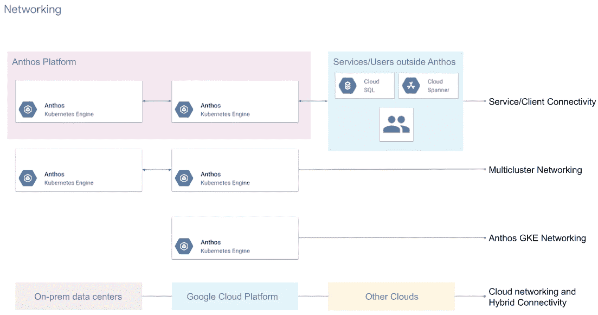

图 10.1 Anthos 网络的四层

## 10.1 云网络和混合连接

本节讨论基础设施环境层面的网络连接的各个方面。Anthos 是一个多云平台，可以在一个或多个公共和私有云环境中运行。在基础设施层，您可以以下方式部署 Anthos：

+   *在单一云环境中*——例如，GCP 或本地数据中心，甚至在其他公共云中

+   *在多/混合云环境中*——例如，在 GCP 和一家或多家本地数据中心部署的平台

### 10.1.1 单云部署

Anthos 平台可以部署在单云环境中。单云环境可以是 GCP、其他公共或私有云，或本地数据中心。

Anthos 在 GCP 上

Anthos 在 GCP 中使用放置在虚拟专用云（VPC；[`cloud.google.com/vpc`](https://cloud.google.com/vpc)）内的资源。您可以在 GCP 中以多种方式配置 VPC。根据公司的需求，一个单一 VPC（在单个 GCP 项目中）可能就足够了。在更复杂的设计中，可能需要共享 VPC、对等 VPC，甚至多个不同的 VPC。Anthos 平台可以与各种 VPC 设计协同工作。在选择正确的 VPC 架构时，事先考虑是很重要的，因为这可能会在以后带来可扩展性和运营方面的后果。我们将在下一节讨论各种 VPC 设计和决策标准。

单一 VPC

单一 VPC 是最简单的设计。对于所有内容都包含在单个 GCP 项目中的小型环境，您可以选择单一 VPC。单一 VPC 导致网络扁平化，这意味着使用 VPC 的所有资源都在同一网络中。您可以通过 Anthos 平台各个层次的安全功能来控制资源之间的连接性。例如，您可以在网络层使用 VPC 防火墙（[`cloud.google.com/vpc/docs/firewalls`](https://cloud.google.com/vpc/docs/firewalls)），在 Kubernetes Dataplane 内使用 Kubernetes NetworkPolicies ([`mng.bz/ZoWj`](http://mng.bz/ZoWj)*)*，以及在服务网格层使用 Anthos Service Mesh ([`mng.bz/RlOn`](http://mng.bz/RlOn)) 认证和授权策略。采用这种方法，多个团队可以在同一 GCP 项目和同一 VPC 中使用资源。如图 10.2 所示的单一 VPC 设计也简化了网络管理。所有资源，无论在 Anthos 平台内部还是外部，都位于同一扁平网络中，并且可以按照安全规则允许的方式轻松通信。无需额外的配置即可连接资源。

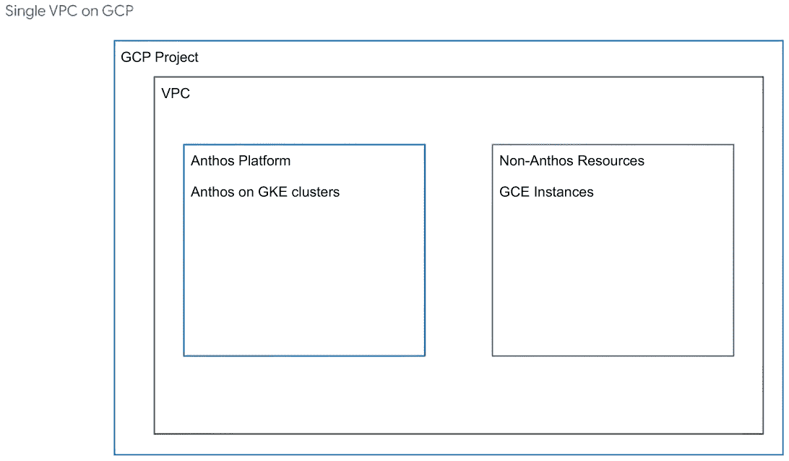

图 10.2 GCP 中的单一 VPC 架构

单一 VPC 设计的主要挑战是可扩展性。尽管单一 VPC 设计可能适用于中小型实施，但对于大型实施来说，可能无法实现，因为你将开始遇到 VPC 限制（[`cloud.google.com/vpc/docs/quota`](https://cloud.google.com/vpc/docs/quota)）。随着组织的增长，可能需要为不同的产品、团队或环境创建单独的项目。单一 VPC 设计不支持多项目环境。根据行业，可能存在禁止在单一 VPC 中托管所有资源的法规，并要求进行某种程度的网络或项目分离。

当为 Anthos 设计您的网络结构时，您必须事先了解并考虑平台的长期性。例如，在两到四年后，平台将扩展多少，是否会出现需要考虑的任何其他限制，无论是配额还是法规方面的？

共享 VPC

使用共享 VPC（[`cloud.google.com/vpc/docs/shared-vpc`](https://cloud.google.com/vpc/docs/shared-vpc)）是 GCP 上为 Anthos 平台配置网络的推荐方式。您可以使用图 10.3 中显示的共享 VPC 设计，适用于简单和复杂（大规模和多租户）的 Anthos 环境。共享 VPC 允许单个 VPC 在多个项目中共享，从而在多个租户之间共享单个扁平网络空间，每个租户都在自己的项目中。通过产品/租户分离 GCP 项目，可以在项目级别实现细粒度的 IAM 权限控制。同时，多个项目中的资源仍然可以相互连接（如果允许），就像它们在单个网络中一样。

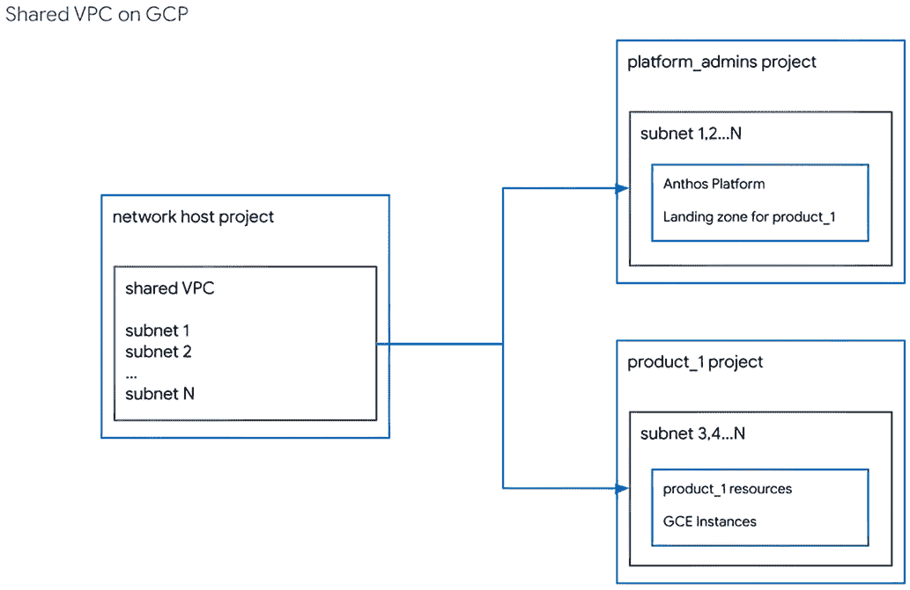

图 10.3 GCP 中的共享 VPC 架构

网络主机项目包含一个集中的“共享”VPC。所有网络资源都位于此网络主机项目中，包括子网、防火墙规则和网络权限。一个集中的网络团队拥有并控制网络主机项目。这种安排确保由一个合格的网络专家团队强制执行组织的网络最佳实践。然后，多个服务项目可以使用主机项目的网络资源。子网从网络主机项目共享到多个服务项目，并由每个服务项目内的资源使用。

对于 GCP 上的 Anthos，建议创建一个服务项目，并将其命名为类似 platform_admins。Anthos 平台（所有 GKE 集群）位于 platform_admins 项目中。platform_admins 项目（正如其名称所示）由平台管理员团队拥有，该团队负责管理和维护 Anthos 平台的生命周期。平台管理员是网络主机项目的众多租户之一。同样，产品和环境也有它们自己的服务项目。Anthos 是一个共享的多租户平台，每个租户都获得一个“着陆区”，在其中运行他们的服务。着陆区是一组在 Anthos 平台上运行服务所需的资源，通常是（一个或多个）Anthos GKE 集群中的一个（或多个）命名空间以及运行该服务所需的一组策略。所有非 Anthos 资源（属于一个服务）都在单个服务项目的 GCP 项目中配置和管理。这样，多个租户可以拥有自己的非 Anthos 资源项目，并且他们都可以在 GCP 集群上共享单个 Anthos GKE。使用共享 VPC 允许 Anthos 和非 Anthos 资源相互连接。

多个 VPC

前两个 VPC 实现导致网络扁平化，所有资源都在单个逻辑 VPC 中配置。在某些情况下，安全或监管限制可能需要将资源分离到多个 VPC 中。公司或组织还可能希望每个团队或产品管理自己的网络。

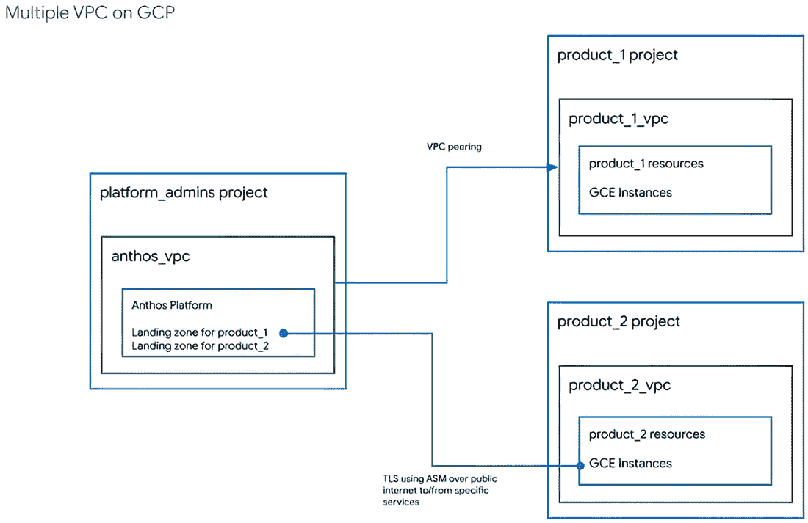

图 10.4 GCP 中的多个 VPC 架构

Anthos GKE 在 GCP 平台可以安装在一个 VPC 中。多租户允许您与多个租户共享 Anthos GKE on GCP，如图 10.4 所示。您可能需要将运行在 Anthos 平台上的服务连接到平台外的服务。在这个设计中，这些服务运行在不同的 VPC 中。例如，运行在 GCP 中 Anthos GKE 上的服务可能运行在名为 anthos_vpc 的 VPC 中，而非 Anthos 资源可能运行在名为 product_1_vpc 的 VPC 中。您可以通过以下方式连接这些服务：

+   *IPsec VPN* ([`mng.bz/2a4N`](http://mng.bz/2a4N))—您可以在两个 VPC 之间创建一个 IPsec VPN 隧道。IPsec VPN 流量以安全的方式在公共互联网上传输。两个网络之间的流量由一个 VPN 网关加密，然后由另一个 VPN 网关解密，以保护数据在互联网上的传输。然而，通过公共互联网传输可能会导致性能下降。IPsec VPN 对于大规模环境可能很有帮助。

+   *VPC 网络对等连接* ([`mng.bz/1MvZ`](http://mng.bz/1MvZ))—您可以对多个 VPC 进行对等连接，以实现 VPC 互连，而无需通过 IPsec VPN 连接 VPC。VPC 对等连接提供了与单个 VPC 相同的数据平面和性能特性，但具有管理（安全和配置）边界，从而为 VPC 到 VPC 流量提供更好的安全性和性能。VPC 网络对等连接需要两个 VPC 的网络管理员之间的协调。它不允许重叠的 IP 地址。此外，两个 VPC 的所有者都维护有单独的防火墙，并设置所需的规则以允许两个 VPC 的子网之间的流量。

+   *公共互联网和安全的入口*—如果 VPC 对等连接或 VPN 不是可行的选项，服务可以通过公共互联网进行通信。在这种情况下，可以使用高级功能，如 Anthos Service Mesh，使用 TLS 或 mTLS（相互 TLS）加密网络之间的流量。如果只有少数服务需要跨 VPC 的连接，这种方法效果很好，因为这种方法需要为每个服务（目标服务）进行配置，而前两种方法是在 TCP/IP 层连接两个网络。

在单个非 GCP 环境中部署 Anthos

您可以在各种非 GCP 环境中部署 Anthos，包括本地数据中心、公共云和私有云。在基础设施层，您应该考虑两种主要的网络设计：单网络和多网络。

单一扁平网络

如其名所示，扁平网络由一个单一的逻辑网络空间组成，其中既包含 Anthos 资源，也包含非 Anthos 资源（例如，在 Anthos 平台外运行的虚拟机）。扁平网络是一组通过路由器和交换机连接的子网，每个 IP 端点在正确的路由（和防火墙）规则下可以切换或路由到另一个端点。单个 GCP VPC 是扁平网络的一个例子，您可能拥有多个子网和路由/防火墙规则，以允许任何两个端点之间的路由。

与多个不同的网络相比，扁平网络更容易管理，但在安全性方面需要更加严谨，因为所有实体都在同一个逻辑网络空间中。防火墙规则、网络策略和其他功能可以确保只有允许的实体才能访问网络。扁平网络也可能遇到可扩展性问题。通常，这些网络使用 RFC1918 地址空间（[`datatracker.ietf.org/doc/html/rfc1918`](https://datatracker.ietf.org/doc/html/rfc1918)），它提供有限数量的 IP 地址（接近 1800 万个地址）。通常，扁平逻辑网络要求所有资源使用相同的 RFC1918 空间。在某些情况下，大型组织可能会使用自己的公共 IP 地址空间进行内部寻址，这违反了这一普遍规则。无论 IP 地址的使用情况如何，重要的是要注意，在扁平网络中，两个端点不能有相同的 IP 地址。

多个网络

Anthos 还可以部署在多网络环境中。根据需要，Anthos GKE 集群可以部署在单个或多个网络上。通常，如果 Anthos 在同一网络中部署，则更容易管理在 Anthos 平台上运行的应用的网络连接。尽管如此，在某些情况下，可能需要连接这些多个网络。您有以下几种方式将运行在 Anthos 平台上的应用连接到多个网络：

+   *VPN/ISP*—您可以通过 VPN 将多个网络连接在一起，或者选择的 ISP 可能提供这种连接性。这些是连接多个本地数据中心时的典型选择。

+   *VPC 对接*—如果 Anthos 部署在提供 VPC 对接功能的公共云上，您可以使用 VPC 对接。

+   *网关或 mTLS*—服务可以通过 TLS、mTLS 或安全的 API 网关在公共互联网上安全连接。这种功能通过服务网格（如 Anthos 服务网格（ASM；[`cloud.google.com/service-mesh/docs/overview`](https://cloud.google.com/service-mesh/docs/overview)））或 API 网关（如 Apigee [`cloud.google.com/apigee`](https://cloud.google.com/apigee)）来实现。* 这是在每个服务级别上完成的，而前两种选项是在网络层配置的。

### 10.1.2 多/混合云部署

Anthos 是一个多云平台，可以部署到多个环境中，例如，公有/私有云和本地数据中心。在多个环境中管理网络具有挑战性，因为每个环境都是独特的，而且根据提供商的不同，管理资源的方式也不同。例如，GCP VPC 的配置方式与 AWS VPC 或数据中心网络不同。Anthos 在多个环境中提供了一个统一的接口。您可以通过以下三种方式将 Anthos 平台部署到多个环境中：

+   *多云部署*—您可以将 Anthos 平台部署到多个公有云环境中，例如，GCP 和一个或多个公有云，如 AWS 和 Azure。

+   *混合云部署*—您可以将 Anthos 平台部署到 GCP 和一个或多个本地数据中心。

+   *多和混合云部署*—这种部署是之前提到的两种部署的组合。例如，您可以将 Anthos 平台部署到 GCP、一个或多个本地数据中心以及一个或多个非 GCP 的公有云。

多/混合网络

当您在多个基础设施环境中部署 Anthos 时，这些环境必须与 GCP 具有网络连接。有三种网络连接选项可用于连接多个基础设施环境：云互连、云 VPN 和公共互联网。

云互连

云互连 ([`mng.bz/Pxe2`](http://mng.bz/Pxe2)) 通过一个高可用、低延迟的连接将本地网络扩展到 Google 的网络。您可以使用专用互连直接连接到 Google，或者使用合作伙伴互连通过支持的服务提供商连接到 Google。专用互连在您的本地网络和 Google 网络之间提供直接的物理连接。专用互连使您能够在网络之间传输大量数据，这可能比在公共互联网上购买额外的带宽更经济高效。

对于专用互连，您在公共位置（见 [`mng.bz/JlQp`](http://mng.bz/JlQp)）配置 Google 网络和您自己的路由器之间的专用互连连接。图 10.5 显示了 VPC 网络和您的本地网络之间的单个专用互连连接。

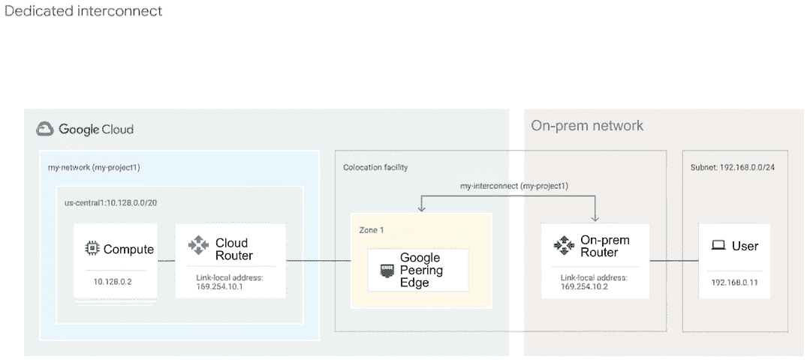

图 10.5 GCP 和本地数据中心之间的专用互连

对于这种基本设置，在公共托管设施中，Google 网络和本地路由器之间配置了一个专用互连连接。

当您创建 VLAN 附件（[`mng.bz/wPR7`](http://mng.bz/wPR7)）时，您将其与云路由器（[`mng.bz/qdlK`](http://mng.bz/qdlK)）关联。此云路由器为 VLAN 附件及其对应的本地对等路由器创建 BPG 会话。云路由器接收您的本地路由器广播的路由。这些路由作为自定义动态路由添加到您的 VPC 网络中。云路由器还向本地对等路由器广播谷歌云资源的路由。

根据您的可用性需求，您可以将专用互连配置为支持关键任务服务或可以容忍一些停机时间的应用程序。为了达到特定的可靠性水平，谷歌提供了以下两种规定配置：

+   实现专用互连的 99.99%（每年 52.60 分钟）可用性（[`mng.bz/71ax`](http://mng.bz/71ax)）（推荐）

+   实现专用互连的 99.9%可用性（[`mng.bz/516q`](http://mng.bz/516q)）

云互连是将 GCP 和非 GCP 环境连接起来的最稳健和最安全的选项，也是连接 GCP 和一个或多个本地数据中心的推荐选项。

云 VPN

云 VPN（[`mng.bz/mJPn`](http://mng.bz/mJPn)）*通过 IPSec VPN 连接安全地将您的对等网络连接到您的 VPC 网络。在两个网络之间传输的流量由一个 VPN 网关加密，然后由另一个 VPN 网关解密，这保护了您的数据在互联网上的传输。谷歌云提供高可用性 VPN，通过额外的/冗余 VPN 连接以更高的成本提供更高的正常运行时间和吞吐量。

每个云 VPN 隧道可以支持总吞吐量高达每秒 3 千兆比特的入站和出站。您可以使用多个云 VPN 隧道来增加您的入站和出站带宽。

您可以使用云 VPN 在 GCP 和本地数据中心之间，以及 GCP 和其他公共云供应商之间进行连接。这是设置最简单的选项，您可以在没有任何延迟的情况下运行。云 VPN 还可以与云互连结合使用，作为次要连接选项。

公共互联网

在多个环境中运行的 Anthos 平台上的应用程序可以在不使用云互连或 VPN 的情况下通过公共互联网连接。平台上的应用程序通过 TLS/mTLS 在公共互联网上连接。

Anthos 服务网格（ASM）是 Anthos 平台的一部分。ASM 使用注入到每个 Pod 中的客户端代理来连接服务。这些代理的一个安全特性是使用 mTLS 来确保连接的安全性。通过在多个环境中使用共同的根证书颁发机构，边车代理可以通过网关（例如，入口或东西向网关）在公共互联网上使用安全的 mTLS 连接。有关 Anthos 服务网格的详细信息，请参阅第四章。

如果许多服务需要在环境之间进行连接，那么此选项可能无法在操作上扩展。在这种情况下，建议您使用前面提到的网络连接选项之一。

断开连接的环境

在某些情况下，您可能需要具有完全相互断开的环境。Anthos 平台支持断开连接的环境。断开连接的环境必须与 GCP 有网络连接，以便平台（即 Anthos 集群）可以注册到 GCP 项目。这仅适用于控制平面流量。对于某些 Anthos 功能，需要注册集群。例如，要在 Anthos 集群上使用多集群入口，所有参与的集群都必须注册到 GCP。断开连接环境中的服务将无法相互通信。

## 10.2 Anthos GKE 网络

Anthos GKE 集群可以部署到各种环境中，例如，在 GCP 上、在本地数据中心 VMware 上、在裸金属服务器上，以及在 AWS 上。除了支持的 Anthos 集群外，您还可以将任何符合规范的 Kubernetes 集群注册到 Anthos 平台。例如，您可以将运行在 AWS 上的 EKS 集群和运行在 Azure 上的 AKS 集群注册到 Anthos 平台。目前，以下六种类型的 Anthos 集群可供使用：

+   GCP 上的 Anthos 集群（GKE）

+   VMware 上的 Anthos 集群（本地数据中心的 GKE）

+   基于裸金属的 Anthos 集群

+   AWS 上的 Anthos 集群（AWS 上的 GKE）

+   Azure 上的 Anthos 集群（Azure 上的 GKE）

+   Anthos 附加集群（符合 Kubernetes 规范的集群）

### 10.2.1 Anthos 集群网络

集群 IP 寻址

所有 Anthos GKE 集群都需要以下三个 IP 子网：

+   节点和 API 服务器 IP 地址

+   Pod IP 地址

+   服务或 ClusterIP 地址

*节点和 API 服务器 IP 地址*是局域网（对于本地数据中心）或 VPC（对于公共云）IP 地址。每个节点和 API 服务器都分配一个单独的 IP 地址。根据所需的节点/API 服务器的数量，确保您有足够的 IP 地址。

*Pod IP 地址*分配给 Anthos GKE 集群中的每个 Pod。Anthos 集群中的每个节点都分配了一个唯一的 IP 地址范围，该范围用于分配 Pod IP 地址（在该节点内部运行）。如果 Pod 从一个节点移动到另一个节点，其 IP 地址将根据新节点的 IP 地址范围进行更改。API 服务器使用一个大的 IP 范围，通常称为 Pod CIDR IP 范围，例如/14 或/16（你可以在[`mng.bz/610G`](http://mng.bz/610G)上了解 IP 子网）。然后服务器将这个范围平均分成更小的 IP 范围，并为每个节点分配一个唯一的范围。你定义每个节点期望的 Pod 数量，API 服务器将使用这个数量将大子网切割成每个节点的小子网。例如，如果你希望每个节点有 30 个 Pod，每个节点至少需要一个/27。你的 Pod IP 范围必须足够大，以容纳*N*个子网，每个子网有 32 个地址，其中*N*是集群中节点的最大数量。

Pod IP 地址在集群内部是可路由的。它们可能或可能不可从集群外部路由，这取决于集群的类型和实现方式。这一点将在下一节中详细讨论。

*服务或 ClusterIP 地址*分配给每个 Kubernetes 服务。与 Pod IP 地址不同，Pod IP 地址可能会随着 Pod 在节点之间移动而改变，而 ClusterIP 地址保持静态，并作为多个表示单个 Kubernetes 服务的 Pod 的负载均衡虚拟 IP 地址（VIP）。正如其名所示，服务 IP 或 ClusterIP 对集群是本地相关的，并且不能从集群外部访问。集群内部的服务可以使用 ClusterIP 访问服务。

集群网络数据平面

Anthos GKE 集群提供了两种网络数据平面的选项。

GKE 数据平面 v1：kube-proxy 和 Calico

Kubernetes 使用 kube-proxy 组件管理 Pod 和 Service 之间的连接。默认情况下，它作为每个节点上的静态 Pod 部署。任何运行 1.16 或更高版本的 GKE 集群都部署了一个作为 DaemonSet 的 kube-proxy。

kube-proxy 不是一个内联代理，而是一个基于出口的负载均衡控制器。它监视 Kubernetes API 服务器，并通过向节点的 iptables 子系统添加和删除目标 NAT 规则，持续地将 ClusterIP 映射到健康的 Pod。当一个在 Pod 中运行的容器向服务的 ClusterIP 发送流量时，节点随机选择一个 Pod 并将流量路由到该 Pod。

当你配置服务时，你可以通过定义端口和 targetPort 的值来可选地重映射其监听端口。端口是客户端到达应用程序的地方。targetPort 是应用程序在 Pod 内部监听流量的端口。kube-proxy 通过在节点上添加和删除 iptables 规则来管理这个端口重映射。

在 GKE Dataplane v1 中，Kubernetes NetworkPolicies 使用 Calico 组件实现。Calico 是一个开源的容器、虚拟机和基于主机的工作负载的网络和网络安全解决方案。此实现使用依赖于 Linux 内核中 iptables 功能的组件。Dataplane v2 解决并解决了一些这些问题。

GKE Dataplane v2：eBPF 和 Cilium

如图 10.6 所示的 GKE Dataplane v2 是一个具有观点的数据平面，它利用了扩展伯克利包过滤器 (eBPF) 和 Cilium 的力量，Cilium 是一个开源项目，它使用 eBPF 使 Linux 内核对 Kubernetes 有所了解。

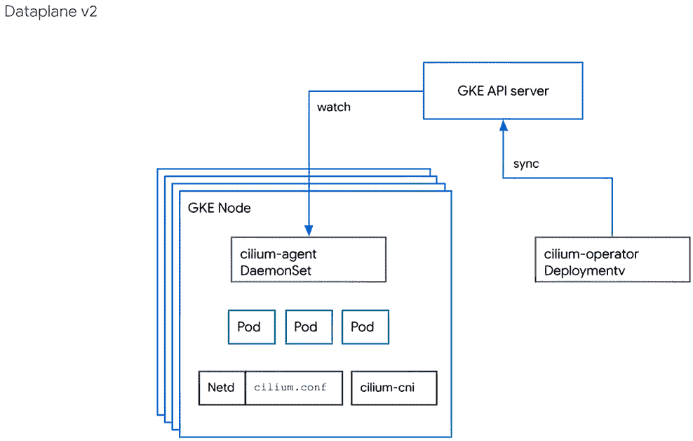

图 10.6 GKE Dataplane v2 架构

Dataplane V2 通过提供可编程数据路径来解决可观察性、可伸缩性和功能需求。eBPF，一种新的 Linux 网络范式，向 Linux 内核内部的网络堆栈公开可编程钩子。通过在用户空间和内核空间之间跳转，丰富内核的用户空间信息的能力，使得可以在高速下对网络数据包进行上下文感知的操作。

新数据平面增加了两个新的集群组件：用于编程 eBPF 数据路径的 cilium-agent DaemonSet 和管理 Cilium-内部 CRDs 并帮助 cilium-agent 避免监视每个 Pod 的 cilium-operator Deployment。

数据平面还消除了 Calico 集群组件——calico-node DaemonSet 和 calico-typha Deployment。这些组件提供 NetworkPolicy 执行功能，该功能由 cilium-agent DaemonSet 提供。

数据平面还从节点中移除了 kube-proxy 静态 Pod。kube-proxy 为集群提供服务解析功能，该功能也由 cilium-agent 提供。

Dataplane V2 为 Anthos 集群提供网络可编程性和可伸缩性，如图 10.7 所示。企业使用 Kubernetes NetworkPolicies 来声明 Pod 之间如何相互通信。然而，之前没有可伸缩的方式来调试和审计这些策略的行为。在 GKE 中使用 eBPF 后，你现在可以执行实时策略，以及以最小影响节点 CPU 和内存资源的方式，以行速率关联策略操作（允许/拒绝）到 Pod、命名空间和政策名称。当数据包进入虚拟机时，可以在内核中安装专门的 eBPF 程序来决定如何路由数据包。与 iptables 不同，eBPF 程序可以访问 Kubernetes 特定的元数据，包括网络策略信息。这样，它们不仅可以允许或拒绝数据包，还可以将带注释的操作报告回用户空间。这些事件使您能够生成网络策略日志。

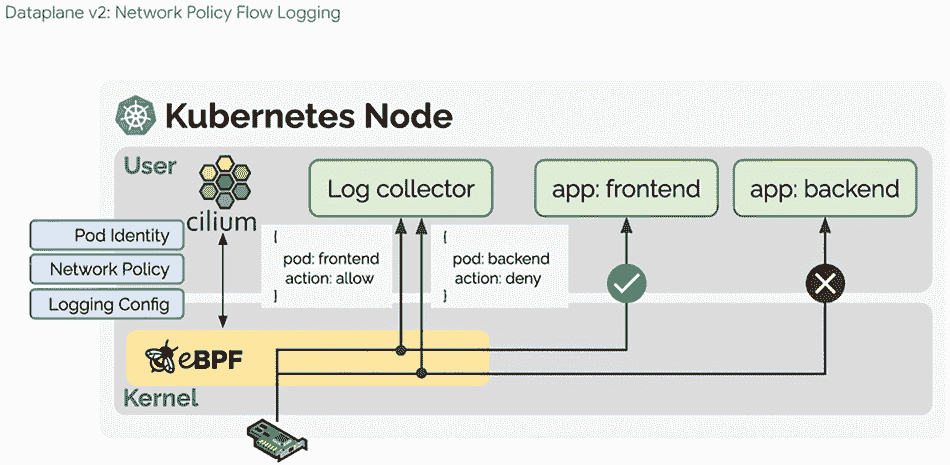

图 10.7 GKE Dataplane v2：网络策略流日志

表 10.1 显示了 GKE Dataplane v1 和 v2 之间网络功能的比较。

表 10.1

| 网络功能 | 现有 | 新 Dataplane |
| --- | --- | --- |
| 集群 IP 服务解析 | kube-proxy 使用 iptables | cilium-agent 在套接字上使用 eBPF |
| 节点端口服务解析 | kube-proxy 使用 iptables | cilium-agent 在 eth0 TC 钩子上使用 eBPF |
| 负载均衡器服务解析 | kube-proxy 使用 iptables 重定向到服务链 | cilium-agent 在 eth0 TC 钩子上使用 eBPF（与之前相同的钩子） |
| 网络策略执行 | Calico 使用 iptables | cilium-agent 在套接字以及 eth0 TC 钩子上使用 eBPF |

根据 Anthos 集群的类型和实现，网络设计和需求会有所不同。在下一节中，我们将从网络需求和最佳实践的角度分析每种类型的 Anthos 集群。

GCP 上的 Anthos GKE

Anthos GKE 集群在 GCP 上运行，并使用 GCP VPC 功能进行 Kubernetes 网络功能。GCP 上 Anthos GKE 的两种实现方式可用：VPC 原生集群和基于路由的集群。

VPC 原生集群

这是 Anthos GKE 在 GCP 集群中的默认和推荐实现。使用别名 IP 地址范围的集群称为 VPC 原生集群。VPC 原生集群使用真实的 VPC IP 地址作为 Pod IP 范围。此选项允许单个集群内的 Pod 到 Pod 通信，以及在同一 VPC 中多个（VPC 原生）集群之间的通信。它还允许 Pod 直接连接到任何可路由的 VPC 实体，例如 GCE 实例。VPC 原生集群使用次要 IP 地址范围用于 Pod IP 和服务 IP 范围。VPC 原生集群提供以下优势：

+   Pod IP 地址在集群的 VPC 网络内以及通过 VPC 网络对等连接的 VPC 网络中是原生可路由的。

+   在您的集群中创建 Pod 之前，Pod IP 地址已在 VPC 网络中预留。这可以防止与 VPC 网络中的其他资源发生冲突，并允许您更好地规划 IP 地址分配。

+   Pod IP 地址范围不依赖于自定义静态路由。它们不会消耗系统生成的和自定义静态路由配额。相反，自动生成的子网路由处理 VPC 原生集群的路由。

+   您可以创建仅适用于 Pod IP 地址范围的防火墙规则，而不是集群节点上的任何 IP 地址。

+   Pod IP 地址范围，以及通常的子网次要 IP 地址范围，可以通过连接到 Cloud VPN 或 Cloud Interconnect 的本地网络使用 Cloud Router 访问。

基于路由的集群

使用 Google Cloud Routes 的集群称为基于路由的集群。Google Cloud routes 定义了网络流量从 VM 实例到其他目的地的路径。基于路由的集群中的 Pod IP 地址范围不是 VPC IP 地址，因此不能在 VPC 内部原生路由。为每个 Pod IP 地址范围创建 Cloud Routes，以便集群内的 Pods 可以与其他节点上运行的 Pods 通信。基于路由的集群不提供多个 Anthos GKE 集群之间的 Pod 到 Pod 跨集群连接。要创建基于路由的集群，您必须明确关闭 VPC 原生选项。

在基于路由的集群中，每个节点为 Pods 分配了一个/24 范围的 IP 地址。使用/24 范围，您有 256 个地址，但每个节点的最大 Pod 数量是 110。通过提供大约是可能 Pod 数量两倍的可用 IP 地址，Kubernetes 可以在 Pod 被添加到节点和从节点移除时减轻 IP 地址重用的风险。

基于路由的集群有一系列 IP 地址，用于 Pods 和 Services。尽管这个范围用于 Pods 和 Services，但它被称为*Pod 地址范围*。Pod 地址范围的最后/20 用于 Services。一个/20 范围有 4,096 个地址，这些地址既用于 Services 也用于 Pods。

在命令输出中，Pod 地址范围被称为 clusterIpv4Cidr，用于 Services 的地址范围被称为 servicesIpv4Cidr。例如，gcloud container clusters describe 的输出可能包含如下内容：

```
clusterIpv4Cidr: 10.96.0.0/16
...
servicesIpv4Cidr: 10.96.240.0/20
```

对于 GKE 1.7 版本及以后的版本，Pod 地址范围可以从任何 RFC1918 块：10.0.0.0/8、172.16.0.0/12 或 192.168.0.0/16。对于早期版本，Pod 地址范围必须来自 10.0.0.0/8。

给定 GKE 集群的节点、Pods 和 Services 的最大数量由集群子网的大小和 Pod 地址范围的大小决定。创建集群后，您不能更改 Pod 地址范围的大小。在创建集群时，请确保您选择的 Pod 地址范围足够大，以容纳集群预期的增长。

Anthos GKE 集群 IP 分配

Kubernetes 使用以下 IP 范围来为节点、Pods 和 Service 分配 IP 地址：

+   *节点 IP*—在 Anthos GKE 集群中，节点是一个 GCE 实例。每个节点都从集群的 VPC 网络中分配了一个 IP 地址。这个节点 IP 提供了从控制组件（如 kube-proxy 和 kubelet）到 Kubernetes API 服务器的连接。这个 IP 是节点连接到集群其余部分的方式。

+   *Pod IP CIDR*—每个节点都有一个 IP 地址池，GKE 将这些地址分配给在该节点上运行的 Pods（默认情况下为/24 CIDR 块）。在创建集群时，您可以可选地指定 IP 地址的范围。灵活的 Pod CIDR 范围功能允许您减小给定节点池中节点 Pod IP 地址范围的尺寸。每个 Pod 从其节点的 Pod CIDR 范围内分配一个单独的 IP 地址。这个 IP 地址由 Pod 内所有运行的容器共享，并将它们连接到集群中运行的其他 Pod。您可以在节点上运行的 Pod 的最大数量等于 Pod IP CIDR 范围的一半。例如，您可以在/24 范围内运行最多 110 个 Pod，而不是您可能预期的 256 个。这个 Pod 数量提供了一个缓冲区，以便 Pod 不会因为特定节点 Pod IP 地址范围内的 IP 地址暂时不足而变得不可调度。对于小于/24 的范围，可以安排的 Pod 数量是范围内 IP 地址数量的一半。

+   *服务 IP*—每个服务都有一个 IP 地址，称为 ClusterIP，从集群的 VPC 网络中分配。在创建集群时，您可以可选地自定义 VPC 网络。在 Kubernetes 中，您可以将任意键值对称为*labels*分配给任何 Kubernetes 资源。Kubernetes 使用标签将多个相关的 Pod 组合成一个逻辑单元，称为服务。服务有一个稳定的 IP 地址和端口，并为标签选择器中定义的所有标签匹配的 Pod 集提供负载均衡。

出流量和控制

对于 VPC 原生集群，Pod 的出流量使用正常的 VPC 路由功能进行路由。Pod IP 地址作为源 IP 地址保留在 TCP 头部。您必须创建适当的防火墙规则以允许 Pod 与其他 VPC 资源之间的流量。您还可以使用 NetworkPolicy 进一步控制集群内 Pod 之间的流量以及 Pod 的出流量。这些策略由上一节中解释的 GKE Dataplane 实现强制执行。在服务层，您可以通过 ASM 使用出口策略来控制什么流量离开集群。在这种情况下，一个名为 istio-egressgateway 的 Envoy 代理存在于服务网格的边缘，所有出流量都通过它流过。对于基于路由的集群，所有 Pod 的出流量都通过节点 IP 地址进行 NAT。

负载均衡器和入口

GKE 提供以下三种类型的负载均衡器来控制访问并尽可能均匀地分散集群中的入流量。您可以为一个服务同时配置多种类型的负载均衡器：

+   外部负载均衡器管理来自集群外部和您的 Google Cloud VPC 网络外部的流量。它们使用与 Google Cloud 网络关联的转发规则将流量路由到 Kubernetes 节点。

+   内部负载均衡器管理来自同一 VPC 网络内部的流量。与外部负载均衡器一样，它们使用与 Google Cloud 网络关联的转发规则将流量路由到 Kubernetes 节点。

+   HTTP(S)负载均衡器是专门用于 HTTP(S)流量的外部负载均衡器。它们使用 Ingress 资源而不是转发规则来将流量路由到 Kubernetes 节点。

这里描述的外部和内部负载均衡器是 TCP/L4 负载均衡器。如果您的服务需要从集群外部和您的 VPC 网络外部可达，您可以通过将服务类型字段设置为 Loadbalancer 来配置您的服务作为负载均衡器。然后 GKE 在服务前面部署一个网络负载均衡器。网络负载均衡器了解您集群中的所有节点，并配置您的 VPC 网络防火墙规则以允许从 VPC 网络外部连接到服务，使用服务的公共 IP 地址。您可以将静态公共 IP 地址分配给服务。

对于需要从同一 VPC 网络内部到达您的集群的流量，您可以配置您的服务以部署一个内部负载均衡器。内部负载均衡器从您的集群 VPC 子网中选择一个 IP 地址，而不是外部 IP 地址。VPC 网络内的应用程序或服务可以使用此 IP 地址与集群内的服务进行通信。以下是一个创建内部负载均衡器的服务描述示例。您可以通过删除注释（这会创建一个内部负载均衡器）以相同的方式配置外部负载均衡器：

```
apiVersion: v1
kind: Service
metadata:
  name: ilb-service
  annotations:
    cloud.google.com/load-balancer-type: "Internal"  ❶
  labels:
    app: hello
spec:
  type: LoadBalancer                                 ❷
  selector:
    app: hello
  ports:
  - port: 80
    targetPort: 8080
    protocol: TCP
```

❶ 该注释创建了一个内部 Google 负载均衡器。

❷ 创建一个 Google 负载均衡器

许多应用程序，如 RESTful Web 服务 API，使用 HTTP(S)进行通信。您可以通过使用 Kubernetes Ingress 资源允许 VPC 网络外部的客户端访问此类应用程序。Ingress 资源允许您将主机名和 URL 路径映射到集群内的服务。Ingress 资源与一个或多个服务对象相关联，每个对象都与一组 Pod 相关联。当您创建 Ingress 资源时，GKE Ingress 控制器创建一个 Google Cloud HTTP(S)负载均衡器，并根据 Ingress 及其相关服务的信息进行配置。要使用 Ingress，您必须启用 HTTP 负载均衡附加组件。GKE 集群默认启用 HTTP 负载均衡。GKE Ingress 资源有以下两种类型：

+   外部 HTTP(S)负载均衡器的 Ingress 部署了 Google Cloud 外部 HTTP(S)负载均衡器。这个面向互联网的负载均衡器作为管理可扩展的负载均衡资源池在全球 Google 边缘网络上部署。

+   内部 HTTP(S)负载均衡的 Ingress 部署了 Google Cloud 内部 HTTP(S)负载均衡器。这个内部 HTTP(S)负载均衡器由位于您的 GKE 集群外部但位于您的 VPC 网络之外的 Envoy 代理系统提供支持。

HTTP(S)负载均衡，由入口配置，包括以下功能：

+   服务灵活配置。入口定义了流量如何到达您的服务以及如何将流量路由到您的应用程序。此外，入口可以为您的集群中的多个服务提供一个单一的 IP 地址。

+   与 Google Cloud 网络服务的集成。

+   支持多个 TLS 证书。入口可以指定使用多个 TLS 证书进行请求终止。

当您创建入口资源时，GKE 根据清单中的规则和相关服务清单在 Google Cloud 项目中配置 HTTP(S)负载均衡器。负载均衡器向节点的 NodePort 发送请求。在请求到达节点后，选择的 GKE Dataplane 将流量路由到适当的 Pod（对于所需的服务）。对于 Dataplane v1，节点使用其 iptables NAT 表来选择 Pod。kube-proxy 管理节点上的 iptables 规则。对于 Dataplane v2，GKE 使用 eBPF 和 Cilium 代理提供此功能。

在以下示例中，入口定义将 demo.example.com 的流量路由到名为 frontend 的服务，端口为 80，将 demo-backend.example.com 的流量路由到名为 users 的服务，端口为 8080：

```
apiVersion: networking.k8s.io/v1beta1
kind: Ingress
metadata:
  name: demo
spec:
  rules:
  - host: demo.example.com               ❶
    http:
      paths:
      - backend:
          serviceName: frontend          ❶
          servicePort: 80                ❶
  - host: demo-backend.example.com       ❷
    http:
      paths:
      - backend:
          serviceName: users             ❷
          servicePort: 8080              ❷
```

❶ 请求 demo.example.com 的托管服务被转发到端口 80 上的服务 frontend。

❷ 请求 demo-backend.example.com 的托管服务被转发到端口 8080 上的服务用户。

容器原生负载均衡

容器原生负载均衡是在 GKE 中使用网络端点组（NEGs）直接对 Pod 端点进行负载均衡的实践。使用入口，服务绑定的流量从 HTTP 负载均衡器发送到节点上的任何节点 IP。在请求到达节点后，GKE Dataplane 将流量路由到所需的 Pod，这个过程会产生额外的跳数。在某些情况下，Pod 甚至可能不在节点上运行，因此节点将请求发送到运行所需 Pod 的节点。额外的跳数增加了延迟，并使流量路径更加复杂。

使用 NEGs 时，流量直接从负载均衡器负载均衡到 Pod IP，而不是穿越节点。此外，Pod 就绪网关被实施，以从负载均衡器的角度确定 Pod 的健康状况，而不仅仅是 Kubernetes 集群内的健康探测。这使得负载均衡器基础设施能够意识到生命周期事件，如 Pod 启动、Pod 丢失或 VM 丢失，从而提高了整体流量的稳定性。这些功能解决了之前描述的限制，并导致网络性能更高且更稳定。

当以下所有条件都为真时，默认为服务启用容器原生负载均衡：

+   对于在 GKE 集群 1.17.6-gke.7 及更高版本中创建的服务

+   使用 VPC 原生集群

+   不使用共享 VPC

+   不使用 GKE 网络策略

对于 NEGs 不是默认设置的集群，仍然强烈建议使用容器本机负载均衡，但必须在每个服务的基础上显式启用。该注解应按以下方式应用于服务：

```
kind: Service
...
  annotations:
    cloud.google.com/neg: ‘{"ingress": true}’    ❶
...
```

❶ 该注解为服务中的 Pod 创建一个网络端点组。

在服务清单中，您必须使用 type: NodePort，除非您正在使用容器本机负载均衡。如果您正在使用容器本机负载均衡，请使用 type: ClusterIP。

共享 VPC 的考虑事项和最佳实践

GKE 入口控制器使用 Google Cloud 服务帐户来部署和管理 Google Cloud 资源。当 GKE 集群位于共享 VPC 的服务项目中时，此服务帐户可能没有管理主机项目拥有的网络资源的权利。入口控制器积极管理防火墙规则，以提供负载均衡器和 Pod 之间以及集中式健康检查器和 Pod 之间的访问。您可以通过以下方式管理：

+   *手动防火墙规则提供*—如果您的安全策略仅允许从主机项目进行防火墙管理，您可以手动提供这些防火墙规则。当在共享 VPC 中部署入口时，入口资源事件提供了您需要提供访问的具体防火墙规则。要手动提供防火墙规则，请使用 describe 命令查看入口资源：

    ```
    kubectl describe ingress INGRESS_NAME
    ```

    此命令的输出，如下所示，应包含可以在主机网络项目中实施的所需防火墙规则：

    ```
    Events:
    Type    Reason  Age                    From                     Message
    ----    ------  ----                   ----                     -------
    Normal  Sync    9m34s (x237 over 38h)  loadbalancer-controller  Firewall change required by network admin: `gcloud compute firewall-rules update k8s-fw-l7--6048d433d4280f11 --description "GCE L7 firewall rule" --allow tcp:30000-32767,tcp:8080 --source-ranges 130.211.0.0/22,209.85.152.0/22,209.85.204.0/22,35.191.0.0/16 --target-tags gke-l7-ilb-test-b3a7e0e5-node --project <project>`
    ```

+   *自动防火墙规则提供*—一种自动方法是授予 GKE 入口控制器服务帐户更新防火墙规则的权限。您通过创建自定义 IAM 角色，提供在主机网络项目中管理防火墙规则的能力，然后将此角色授予 GKE 入口服务帐户。

    首先，创建一个具有所需权限的自定义 IAM 角色：

    ```
    gcloud iam roles create ROLE_NAME \
       --project PROJECT_ID \
       --title ROLE_TITLE \
       --description ROLE_DESCRIPTION \
       --permissions=compute.networks.updatePolicy, compute.firewalls.*\
       --stage GA
    ```

然后，将自定义角色授予 GKE 入口控制器服务帐户：

```
gcloud projects add-iam-policy-binding my-project \
    --member=user:SERVICE_ACCOUNT  \
    --role=roles/gke-ingress-fw-management
```

多集群入口

在某些情况下，您必须在多个 GKE 集群上运行相同的服务。多集群拓扑结构由许多因素驱动，包括应用的用户邻近性、集群和区域高可用性、安全性和组织分离、集群迁移以及数据本地性。*多集群* 入口（MCI），如图 10.8 所示，是用于 Anthos GKE 集群的云托管多集群入口控制器。它是一个由 Google 托管的云服务，支持在集群和区域之间部署共享的负载均衡资源。多集群入口旨在满足多集群、多区域环境的负载均衡需求。它是外部 HTTP(S)负载均衡器的控制器，用于提供来自互联网的流量在单个或多个集群之间的入口。多集群入口的多集群支持满足许多用例，包括以下内容：

+   一个单一、一致的 VIP，与应用部署的全球位置无关

+   通过健康检查和流量故障转移实现的多区域、多集群可用性

+   通过公共 Anycast VIP 进行基于邻近性的路由，以降低客户端延迟

+   透明集群迁移以进行升级或集群重建

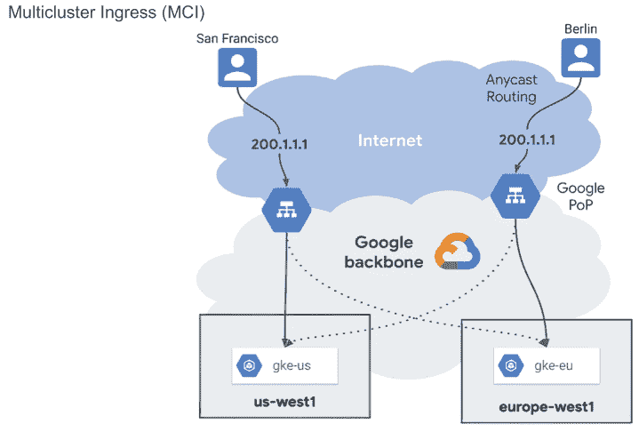

图 10.8 多集群入口到 GCP 中的多个 GKE 集群

多集群入口是一个 Ingress 控制器，它使用 NEGs（网络端点组）来编程外部 HTTP(S)负载均衡器。当你创建一个 MultiClusterIngress 资源时，GKE 会部署计算引擎负载均衡器资源，并在集群中配置适当的 Pod 作为后端。NEGs 用于动态跟踪 Pod 端点，因此 Google 负载均衡器拥有正确的健康后端集合。

多集群入口使用集中的 Kubernetes API 服务器在多个集群中部署入口。这个集中的 API 服务器被称为*配置集群*。任何 GKE 集群都可以充当配置集群。配置集群使用两种自定义资源类型：MultiClusterIngress 和 MultiClusterService。通过在配置集群上部署这些资源，Anthos 入口控制器在多个集群中部署负载均衡器。以下概念和组件构成了多集群入口：

+   *Anthos 入口控制器*—一个全球分布的控制平面，作为集群外部的服务运行。这允许控制器的生命周期和操作独立于 GKE 集群。

+   *配置集群*—一个选择的运行在 Google Cloud 上的 GKE 集群，其中部署了 MultiClusterIngress 和 MultiClusterService 资源。这是这些多集群资源的集中控制点，这些资源存在于单个逻辑 API 中，并且可以从单个逻辑 API 访问，以保持所有集群的一致性。入口控制器监视配置集群并协调负载均衡基础设施。

+   *舰队*—一个将集群和基础设施分组的概念，管理资源，并在它们之间保持一致的政策（有关舰队的更多详细信息，请参阅第二章）。MCI 使用舰队的概念来应用不同集群中的入口。你注册到舰队的集群对 MCI 可见，因此可以用作入口的后端。舰队具有一种称为*命名空间一致性*的特性，它假设跨集群中具有相同名称和相同命名空间的资源是同一资源的实例。实际上，这意味着不同集群中 ns1 命名空间具有标签 app: foo 的 Pod 都被视为多集群入口视角下的同一应用后端池的一部分。图 10.9 显示了两个服务 foo 和 bar 在两个集群上运行，并由 MCI 进行负载均衡的示例。

    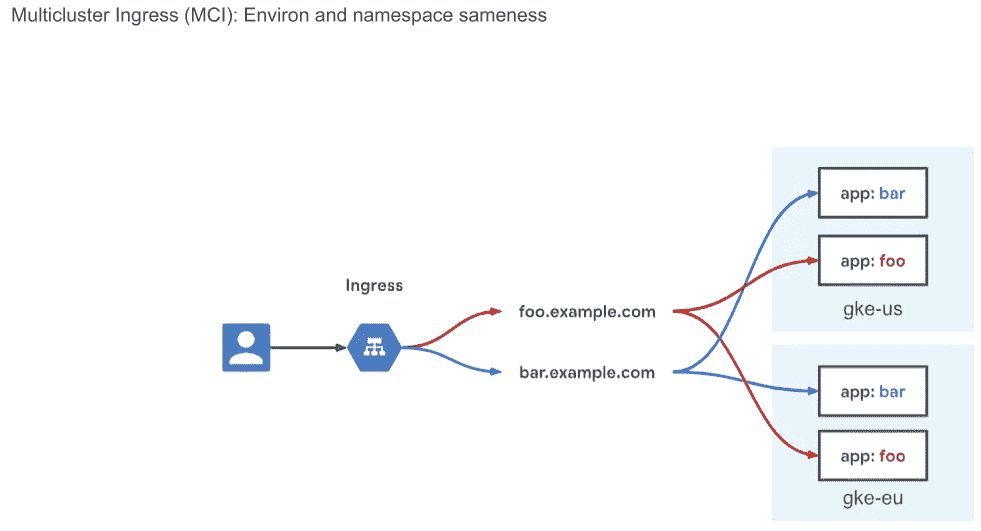

    图 10.9 多集群入口：舰队和命名空间一致性

+   *成员集群*—注册到舰队中的集群被称为成员集群。舰队中的成员集群构成了 MCI 所了解的后端的全范围。

在配置集群配置完成后，您为您的多集群 Service 创建了两个自定义资源，MultiClusterIngress 和 MultiClusterService。请注意，资源名称与 Service 和 Ingress 相比较相似，这是在单个集群中需要 Ingress 的。以下是在配置集群上部署的这些资源的示例：

```
# MulticlusterService with cluster selector
apiVersion: networking.gke.io/v1beta1
kind: MultiClusterService
metadata:
  name: foo
  namespace: blue
spec:
  template:
    spec:
      selector:
        app: foo
      ports:
      - name: web
        protocol: TCP
        port: 80
        targetPort: 80
  clusters:                                  ❶
  - link: "europe-west1-c/gke-eu"            ❷
  - link: "asia-northeast1-a/gke-asia-1"     ❷
# MulticlusterIngress
apiVersion: networkin.g.gke.io/v1alpha1
kind: MultiClusterIngress
metadata:
  name: foobar-ingress
  namespace: blue
spec:
  template:
    spec:
      backend:
        serviceName: default-backend
        servicePort: 80
      rules:
      - host: foo.example.com
        backend:
          serviceName: foo                   ❸
          servicePort: 80
      - host: bar.example.com
        backend:
          serviceName: bar                   ❸
          servicePort: 80
```

❶ MultiClusterService 规范看起来与 Service 规范类似，增加了一个集群部分来定义在多个集群中的 Service。

❷ 多个集群中运行的 Service 的 GKE 集群 URI 链接

❸ MultiClusterIngress 规范与 Ingress 规范类似，但指向的是 MultiClusterService（而不是 Service）。

注意，MulticlusterService 在底部包含一个集群选择段。移除此段会将 Ingress 流量发送到所有成员集群。如果您想从特定集群（或多个集群）中移除 MCI 流量（例如，如果您正在对集群进行升级或维护），则添加集群选择器可能很有用。如果 MulticlusterService 资源中存在集群段，则 Ingress 流量只会发送到列表中可用的集群。集群通过 <region | zone>/<name> 明确引用。同一舰队和区域内的成员集群应具有唯一名称，以避免命名冲突。像 Service 一样，MulticlusterService 是 Pod 的选择器，但它还可以选择标签和集群。它所选择的集群池称为成员集群，这些是注册到舰队的所有集群。此 MulticlusterService 在所有成员集群中部署了一个派生 Service，选择器为 app: foo。如果该集群中存在 app: foo Pods，则那些 Pod IP 将被添加为 MulticlusterService 的后端。

Anthos on-prem（在 VMware 上）

在 VMware 上的 Anthos on-prem 集群自动创建一个岛屿模式配置，其中 Pods 可以在集群内部直接相互通信，但不能从集群外部访问。这种配置在网络上形成一个“岛屿”，该岛屿未连接到外部网络。集群在集群节点之间形成一个完整的节点到节点的网状结构，允许 Pod 直接访问集群内的其他 Pod。

网络要求

Anthos on-prem 集群是通过一个管理员工作站虚拟机安装的，该虚拟机包含部署 Anthos on-prem 集群所需的所有工具和配置。管理员工作站虚拟机部署一个管理员集群。管理员集群部署一个或多个用户集群。您的应用程序运行在用户集群上。管理员集群管理多个用户集群的部署和生命周期。您不会在管理员集群上运行应用程序。在您的 Anthos on-prem 初始安装中，您创建了以下虚拟机（VM）：

+   一个用于管理员工作站的虚拟机

+   四个用于管理员集群的虚拟机

+   三个用于用户集群的虚拟机（如果需要，您还可以创建额外的用户集群或更大的用户集群）

在您的 vSphere 环境中，您必须有一个能够支持创建这些虚拟机的网络。您的网络还必须能够支持 vCenter Server 和负载均衡器。您的网络需要支持向互联网的出站流量，以便您的管理工作站和集群节点可以获取 GKE 本地组件并调用某些 Google 服务。如果您想外部客户端调用您的 GKE 本地集群中的服务，您的网络必须支持来自互联网的入站流量。IP 地址架构和分配将在下一节讨论。

Anthos 本地集群 IP 分配

在 VMware 集群上运行 Anthos 本地所需的以下 IP 地址：

+   *节点 IP*—节点（虚拟机或 VM）的动态主机配置协议（DHCP）或静态分配的 IP 地址。必须在数据中心内可路由。您可以手动分配静态 IP。节点 IP 地址取决于 Anthos 本地集群中负载均衡器的实现。如果集群配置为集成模式负载均衡或捆绑模式负载均衡，您可以为节点使用 DHCP 或静态分配的 IP 地址。如果集群配置为手动模式负载均衡，您必须为节点使用静态 IP 地址。在这种情况下，请确保预留足够的 IP 地址以应对集群增长。负载均衡模式将在下一节详细讨论。

+   *Pod IP CIDR*—集群中所有 Pod 的非路由 CIDR 块。从这个范围中，每个节点分配较小的/24 范围。如果您需要一个*N*节点的集群，请确保此块足够大，以支持*N* x /24 块。

+   *服务 IP*—在孤岛模式下，类似于 Pod CIDR 块，因此这仅在集群内部使用，是任何不与节点、VIP 或 Pod CIDR 块重叠的私有 CIDR 块。您可以在多个集群之间共享相同的块。块的大小决定了服务的数量。除了您的服务外，一个服务 IP 地址块还用于集群控制平面服务。入口服务需要一个服务 IP，Kubernetes 服务（如集群 DNS）需要 10 个或更多的 IP 地址。

出站流量和控制

从 Pod 到集群外部的所有出站流量都通过节点 IP 进行 NAT。您可以使用 NetworkPolicy 进一步控制集群内 Pod 之间的流量以及 Pod 的出站流量。这些策略由每个集群内运行的 Calico 强制执行。在服务层，您可以通过 ASM 使用 EgressPolicy 来控制什么流量离开集群。在这种情况下，一个名为 istio-egressgateway 的 Envoy 代理存在于服务网格的边缘，所有出站流量都通过它流过。

负载均衡器

Anthos 本地集群提供两种从集群外部访问服务的方法：负载均衡器和入口。本节讨论负载均衡器和不同的实现模式。

Anthos on-prem 集群可以运行在三种负载均衡模式之一：集成、手动或捆绑：

+   *集成模式*—使用集成模式时，Anthos on-prem 使用 F5 BIG-IP 负载均衡器。客户需要提供带有适当许可的 F5 BIG-IP 负载均衡器。您需要拥有足够的权限来设置和管理 F5 负载均衡器的用户角色。管理员角色或资源管理员角色就足够了。有关更多信息，请参阅 [`mng.bz/oJnN`](http://mng.bz/oJnN)。您需要预留多个 VIP 地址用于服务，这些服务被配置为负载均衡器类型。每个服务需要一个 VIP。所需的 VIP 数量取决于负载均衡器类型服务的数量。您需要在集群配置文件中指定这些 VIP，并且 Anthos on-prem 会自动配置 F5 BIG-IP 负载均衡器以使用这些 VIP。

    集成模式的优势在于您可以使用企业级负载均衡器，并且其配置主要是自动化的。此模式也是具有偏见的，因为它要求使用 F5 负载均衡器，这可能会产生额外的许可和支持成本。

+   *手动模式*—使用手动模式时，Anthos on-prem 使用您选择的负载均衡器。与集成模式相比，手动负载均衡模式需要额外的配置。您需要手动配置用于服务的 VIP。在手动负载均衡的情况下，您不能运行负载均衡器类型的服务。相反，您可以创建节点端口类型的服务，并手动配置负载均衡器以使用它们作为后端。您必须指定用于这些服务的节点端口值。您可以选择 30000-32767 范围内的值。有关更多信息，请参阅 [`mng.bz/nJov`](http://mng.bz/nJov)。

    手动模式的优势在于您在选择负载均衡器方面拥有绝对自由。另一方面，配置是手动的，这可能会导致运营成本增加。

+   *捆绑模式*—在捆绑负载均衡模式下，Anthos on-prem 提供并管理负载均衡器。与集成模式不同，不需要为负载均衡器购买许可证，并且您必须进行的设置工作非常少。GKE on-prem 提供的捆绑负载均衡器是 *Seesaw 负载均衡器* ([`github.com/google/seesaw`](https://github.com/google/seesaw))。Seesaw 负载均衡器在 VMware 内作为虚拟机运行。我们建议您在捆绑负载均衡模式下使用 vSphere 6.7+ 和 Virtual Distributed Switch 6.6+。您可以在高可用性 (HA) 和非 HA 模式下运行 Seesaw 负载均衡器。在 HA 模式下，配置了两个 Seesaw 虚拟机。在非 HA 模式下，配置了一个 Seesaw 虚拟机。

    捆绑模式的优点是一个团队可以监督集群创建和负载均衡器配置。例如，集群管理团队不需要依赖单独的网络团队提前获取、运行和配置负载均衡器。另一个优点是配置完全自动化。Anthos on-prem 会自动在负载均衡器上配置服务 VIP。

在 VMware 集群中，只要在服务的规范中配置了 loadBalancerIP 字段，Anthos on VMware 集群就可以运行类型为 Loadbalancer 的服务。在 loadBalancerIP 字段中，您需要提供您想要使用的 VIP。这将配置在 F5 上，指向服务的 NodePort。

以下是一个服务清单的示例。您可以通过 SERVICE VIP 访问名为 frontend 的 Anthos on-prem 集群内部运行的服务：

```
apiVersion: v1
kind: Service
metadata:
  labels:
    app: guestbook
  name: frontend
spec:
  ports:
  - port: 80
    protocol: TCP
    targetPort: 80
  selector:
    app: guestbook
  type: LoadBalancer
  loadBalancerIP: [SERVICE VIP]     ❶
```

❶ 负载均衡器 IP 地址在服务规范中定义。

除了服务 VIP 之外，负载均衡器还需要 Kubernetes API 服务器的控制平面 VIP。最后，每个 Anthos on-prem 集群内部运行一个 Ingress 控制器。Ingress 控制器服务也有一个称为 Ingress VIP 的 VIP。通过 Ingress 暴露的服务使用 Ingress VIP 访问 Kubernetes 服务。

Anthos on-prem 的高级负载均衡架构如图 10.10 所示。

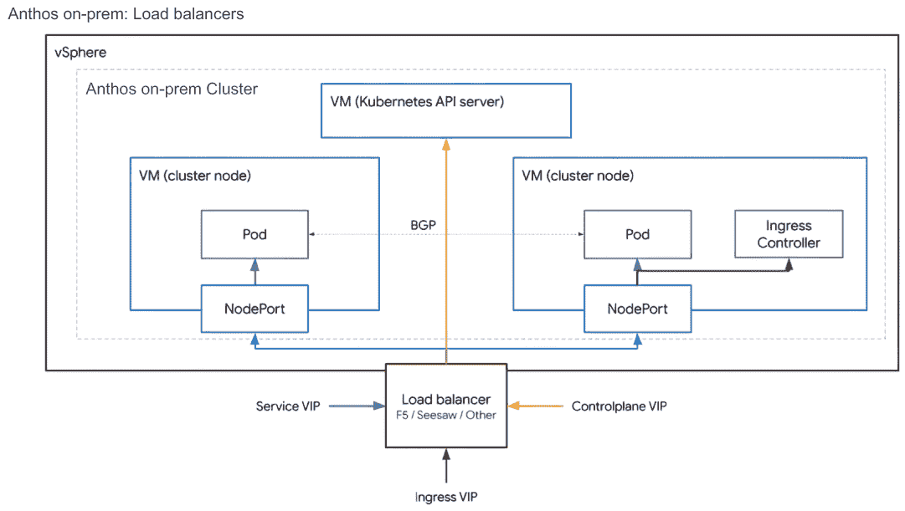

图 10.10 Anthos on-prem：负载均衡器网络架构

表 10.2 总结了在各种模式下准备负载均衡必须执行的操作。

表 10.2 如何为负载均衡做准备

|  | 集成/捆绑模式 | 手动模式 |
| --- | --- | --- |
| 在创建集群之前选择 VIP | 是 | 是 |
| 在创建集群之前选择节点 IP 地址 | 如果使用 DHCP 否，如果使用静态 IP 地址 是 | 是 |
| 在创建集群之前选择 nodePort 值 | 否 | 是 |
| 手动配置您的负载均衡器 | 否 | 是 |

Ingress

Anthos on-prem 包含一个基于 Envoy 的 Ingress 控制器的 L7 负载均衡器，该控制器处理集群内部部署的 ClusterIP 服务中的 Ingress 对象规则。Ingress 控制器本身在集群中作为 NodePort 服务暴露。Ingress NodePort 服务可以通过 L3/L4 F5 负载均衡器访问。安装配置了负载均衡器上的 VIP 地址（Ingress VIP）（端口 80 和 443）。VIP 指向 Ingress 控制器的 NodePort 服务端口。这就是外部客户端如何访问集群中的服务。

要通过 Ingress 暴露服务，您必须创建一个 DNS A 记录，将 DNS 名称指向 Ingress VIP。然后您可以创建一个服务和一个 Ingress 资源。例如，假设您想暴露一个示例 guestbook 应用程序的前端服务。首先，为 guestbook 应用程序创建一个指向 Ingress VIP 的 DNS A 记录，如下所示：

```
*.guestbook.com    A   [INGRESS_VIP]
```

接下来，为前端部署创建一个服务。请注意，服务类型为 ClusterIP：

```
apiVersion: v1
kind: Service
metadata:
  labels:
    app: guestbook
  name: frontend
spec:
  ports:
  - port: 80
    protocol: TCP
    targetPort: 80
  selector:
    app: guestbook
  type: ClusterIP     ❶
```

❶ 对于入口，服务类型是 ClusterIP（而不是 Loadbalancer）。

最后，创建入口规则：

```
apiVersion: extensions/v1beta1
kind: Ingress
metadata:
  name: frontend
  labels:
    app: guestbook
spec:
  rules:
    - host: www.guestbook.com
      http:
        paths:
          - backend:
              serviceName: frontend   ❶
              servicePort: 80         ❶
```

❶ 入口规则指向服务名称和端口。

Anthos 在裸金属上

Anthos 在裸金属上是 GCP 支持的 Anthos GKE 实现，部署在裸金属服务器上。Anthos 在裸金属上消除了对虚拟化层或虚拟机管理程序的必要性。所有集群节点和 API 服务器都直接在裸金属服务器上运行。

Anthos 在裸金属部署模型和网络架构的详细描述见第十七章。

Anthos on AWS

AWS 上的 Anthos 集群（GKE on AWS）是一种混合云软件，它将 Google Kubernetes Engine 扩展到 Amazon Web Services。Anthos on AWS 使用 AWS 资源，如弹性计算云（EC2）、弹性块存储（EBS）和弹性负载均衡器（ELB）。AWS 上的 Anthos 集群具有以下两个组件：

+   *管理服务*—一个可以安装和更新您的用户集群的环境，使用 AWS API 来配置资源

+   *用户集群*—运行您的容器化应用程序的 Anthos on AWS 集群

网络需求

管理服务和用户集群都部署在 EC2 实例上的 AWS VPC 内。您可以在一个 *专用 AWS VPC* ([`mng.bz/v1ax`](http://mng.bz/v1ax)) 或一个 *现有 AWS VPC* ([`mng.bz/41GB`](http://mng.bz/41GB)) 中创建您的管理服务。在您运行 Anthos on AWS 用户集群的每个 AWS VPC 中都需要一个管理服务。管理服务安装在单个 AWS 可用区中。每个 VPC 只需要一个管理服务；一个管理服务可以管理多个用户集群。

用户集群由两个组件组成：控制平面或 Kubernetes API 服务器以及运行应用程序的节点池。管理服务的主要组件是集群操作员。集群操作员是一个 Kubernetes 操作员，它创建和管理您的 AWSClusters 和 AWSNodePools。集群操作员将配置存储在具有存储在 AWS EBS 卷上的持久存储的 etcd 数据库中。AWSClusters 资源创建和管理用户集群的控制平面，AWSNodePools 资源创建和管理用户集群的节点池。

当您将管理集群安装到专用 VPC 中时，Anthos on AWS 在您在 dedicatedVPC.availabilityZones 中指定的每个区域创建控制平面副本。当您将管理集群安装到现有基础设施中时，Anthos on AWS 在相同的可用区创建一个具有三个控制平面副本的 AWSCluster。每个副本属于其自己的 AWS Auto Scaling 组，当实例被终止时，它会重新启动实例。管理服务将控制平面放置在 AWS 网络负载均衡器（NLB）后面的私有子网中。管理服务使用 NLB 与控制平面交互。

如图 10.11 所示，每个控制平面将配置存储在本地 etcd 数据库中。这些数据库被复制并设置在堆叠的高可用拓扑中 ([`mng.bz/wPKW`](http://mng.bz/wPKW))。一个控制平面管理一个或多个 AWSNodePools。

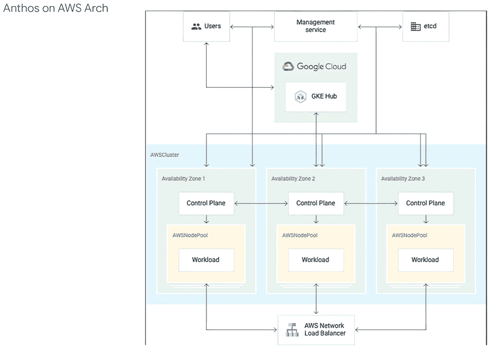

图 10.11 Anthos on AWS 架构

在专用 VPC 中创建 Anthos on AWS 集群时，需要以下 VPC 资源：

+   *VPC CIDR 范围*—anthos-gke 创建的 AWS VPC 的 IP 地址总 CIDR 范围，例如，10.0.0.0/16。

+   *可用区*—您想要在其中创建节点和控制平面的 AWS EC2 可用区。

+   *私有 CIDR 块*—您的私有子网的 CIDR 块。Anthos on AWS 组件（如管理服务）在私有子网中运行。此子网必须在 vpcCIDRBlock 中指定的 VPC 的 CIDR 范围内。您需要为每个可用区分配一个子网。

+   *公共 CIDR 块*—您的公共子网的 CIDR 块。您需要为每个可用区分配一个子网。公共子网将集群服务（如负载均衡器）暴露给 AWS 网络访问控制列表和安全组中指定的安全组和地址范围。

+   *SSH CIDR 块*—允许对您的堡垒主机进行 SSH 入站的 CIDR 块。例如，您可以使用 IP 范围，如 203.0.113.0/24。如果您想允许从任何 IP 地址进行 SSH，请使用 0.0.0.0/0。当您使用默认设置创建管理服务时，控制平面有一个私有 IP 地址。此 IP 地址无法从 AWS VPC 外部访问。您可以使用 *堡垒主机* 或使用其他连接到 AWS VPC 的方式（如 VPN 或 *AWS Direct Connect* ([`aws.amazon.com/directconnect/`](https://aws.amazon.com/directconnect/))) 访问管理服务。

在现有 VPC 中创建 Anthos on AWS 集群时，需要以下 VPC 资源：

+   至少一个公共子网。

+   至少一个私有子网。

+   一个具有指向公共子网路由的互联网网关。

+   一个具有指向私有子网路由的 NAT 网关。

+   启用 DNS 主机名。

+   在您的 DHCP 选项集中没有为域名指定自定义值。Anthos on AWS 不支持除默认 EC2 域名以外的值。

+   选择或创建一个 AWS 安全组，允许从您将管理 AWS 安装上的 Anthos 集群的安全组或 IP 范围（端口 22）进行 SSH 入站。

Anthos on AWS 集群 IP 分配

管理服务创建用户集群，并使用具有资源的集群操作员 AWSClusters 和 AWSNodePools 分别创建用户集群的控制平面和节点池。每个用户集群的 IP 地址在 AWSCluster 资源中定义。以下是一个 AWSCluster 资源的示例：

```
apiVersion: multicloud.cluster.gke.io/v1
kind: AWSCluster
metadata:
  name: CLUSTER_NAME
spec:
  region: AWS_REGION
  networking:                                                    ❶
    vpcID: VPC_ID
    podAddressCIDRBlocks: POD_ADDRESS_CIDR_BLOCKS
    serviceAddressCIDRBlocks: SERVICE_ADDRESS_CIDR_BLOCKS
    ServiceLoadBalancerSubnetIDs: SERVICE_LOAD_BALANCER_SUBNETS
  controlPlane:                                                  ❷
    version:  CLUSTER_VERSION
    instanceType: AWS_INSTANCE_TYPE
    keyName: SSH_KEY_NAME
    subnetIDs:
    - CONTROL_PLANE_SUBNET_IDS
    securityGroupIDs:
    - CONTROL_PLANE_SECURITY_GROUPS
    iamInstanceProfile: CONTROL_PLANE_IAM_ROLE
    rootVolume:
      sizeGiB: ROOT_VOLUME_SIZE
    etcd:
      mainVolume.sizeGIB: ETCD_VOLUME_SIZE
    databaseEncryption:
      kmsKeyARN: ARN_OF_KMS_KEY
    hub: # Optional
      membershipName: ANTHOS_CONNECT_NAME
    workloadIdentity: # Optional
      oidcDiscoveryGCSBucket: WORKLOAD_IDENTITY_BUCKET
```

❶ 定义了 Anthos on AWS 集群的网络值。

❷ 定义了 Anthos on AWS 集群的控制平面值。

您在网络部分定义所需的 IP 地址。

Anthos on AWS 集群需要以下 IP 地址：

+   *节点 IP*—节点 IP 在创建 EC2 实例时分配。每个 EC2 实例在其可用区中分配一个私有子网的单个 IP。这些地址在管理服务规范中定义。

+   *Pod IP CIDR*—集群 Pod 使用的 IPv4 地址的 CIDR 范围。该范围必须在您的 VPC CIDR 地址范围内，但不能是子网的一部分。

+   *服务 IP*—集群服务使用的 IPv4 地址范围。该范围必须在您的 VPC CIDR 地址范围内，但不能是子网的一部分。

出站流量和控制

从 Pod 到集群外部的所有出站流量都通过节点 IP 进行 NAT。您可以使用 NetworkPolicy 进一步控制集群内 Pod 之间的流量以及 Pod 的出站流量。这些策略由每个集群内运行的 Calico 强制执行。在服务层，您可以通过 ASM 使用 EgressPolicy 来控制离开集群的流量。在这种情况下，一个名为 istio-egressgateway 的 Envoy 代理存在于服务网格的边缘，所有出站流量都通过它流动。

此外，您可以在 AWSNodePools 安全组层控制流量。使用安全组，您可以进一步允许或拒绝进出流量的访问。

负载均衡器

当您创建一个类型为 Loadbalancer 的服务时，Anthos on AWS 控制器会在 AWS 上配置一个经典或网络 ELB。Anthos on AWS 需要在包含负载均衡器端点的子网上使用标签。Anthos on AWS 会自动为 AWSCluster 资源中 Networking.ServiceLoadBalancerSubnetIDs 字段指定的所有子网添加标签（[`mng.bz/X5mY`](http://mng.bz/X5mY)）。

要创建标签，获取负载均衡器子网的子网 ID。使用 aws 命令行工具在子网上创建标签，如下所示。对于多个子网，请确保子网 ID 之间用空格分隔：

```
aws ec2 create-tags \
--resources [SUBNET_IDs] \
--tags Key=kubernetes.io/cluster/$CLUSTER_ID,Value=shared
```

您需要在子网上为每个用户集群添加一个标签。

您可以创建内部和外部负载均衡器。内部负载均衡器在私有子网上创建，而外部负载均衡器在公共子网上创建。您可以使用经典或网络负载均衡器创建任何类型的负载均衡器。有关负载均衡器类型之间的差异的更多信息，请参阅 AWS 文档（[`mng.bz/ydpJ`](http://mng.bz/ydpJ)）。

使用注解创建不同类型的负载均衡器。考虑以下服务规范：

```
apiVersion: v1
kind: Service
metadata:
  name: my-lb-service
spec:
  type: LoadBalancer
  selector:
    app: products
    department: sales
  ports:
  - protocol: TCP
    port: 60000
    targetPort: 50001
```

此资源为服务创建一个经典公共负载均衡器。要创建公共网络负载均衡器，请将以下注解添加到前面的规范中：

```
...
metadata:
  name: my-lb-service
  annotations:
    service.beta.kubernetes.io/aws-load-balancer-type: nlb    ❶
...
```

❶ 该注解在 AWS 中创建一个经典公共负载均衡器，并暴露一个服务。

要创建一个私有经典负载均衡器，请将以下注解添加到服务规范中：

```
...
metadata:
  name: my-lb-service
  annotations:
    service.beta.kubernetes.io/aws-load-balancer-internal: "true"   ❶
...
```

❶ 该注解在 AWS 中创建一个内部负载均衡器，并暴露一个服务。

最后，要创建一个私有网络负载均衡器，请将这两个注解添加到服务规范中：

```
...
metadata:
  name: my-lb-service
  annotations:
    service.beta.kubernetes.io/aws-load-balancer-type: nlb                        ❶
    service.beta.kubernetes.io/aws-load-balancer-internal: "true"        ❶
...
```

❶ 这两个注解共同在 AWS 中创建了一个内部网络负载均衡器。

Ingress

您可以在 AWS 集群上的 Anthos 中以下两种方式使用 Ingress：

+   *应用程序负载均衡器*—应用程序负载均衡器 (ALB) ([`mng.bz/Mlr2`](http://mng.bz/Mlr2)) 是一个 AWS 管理的 L7 HTTP 负载均衡器。负载均衡器接收到请求后，将按优先级顺序评估监听器规则，以确定要应用哪个规则，然后从目标组中选择一个目标进行规则操作。此方法使用安装在 Anthos on AWS 集群中的 alb-ingress-controller，并具有适当的权限来为 Ingress 创建 ALB。

+   *ASM Ingress*—您可以在 Anthos on AWS 集群上安装 Anthos 服务网格并使用 ASM Ingress。ASM Ingress 是一个名为 istio-ingressgateway 的服务，它位于服务网格边缘的 L7 Envoy 代理中。istio-ingressgateway 服务本身使用 ELB 暴露，如前所述。所有 L7 负载均衡和路由都由 istio-ingressgateway 处理。

使用 Ingress 暴露服务

要使用 ALB 方法，请按照[`mng.bz/aMpJ`](http://mng.bz/aMpJ)中的说明操作，并将 alb-ingress-controller 部署到 Anthos on AWS 集群。alb-ingress-controller 是一个在 Anthos on AWS 集群上运行的 Deployment，具有适当的 AWS 凭证和 Kubernetes RBAC 权限，可以创建创建 ALB 所需的规则和资源。

您现在可以创建一个带有适当注解的 Ingress 资源，以创建 ALB 和您服务所需的相关资源。以下是一个服务规范的示例。请注意，服务类型必须是 NodePort：

```
apiVersion: v1
kind: Service
metadata:
  name: "service-2048"
  namespace: "2048-game"
spec:
  ports:
    - port: 80
      targetPort: 80
      protocol: TCP
  type: NodePort
  selector:
    app: "2048"
```

下一个展示了使用 ALB 暴露此服务的 Ingress 资源。注意配置面向互联网 ALB 的两个注解：

```
apiVersion: extensions/v1beta1
kind: Ingress
metadata:
  name: "2048-ingress"
  namespace: "2048-game"
  annotations:
    kubernetes.io/ingress.class: alb                    ❶
    alb.ingress.kubernetes.io/scheme: internet-facing   ❶
  labels:
    app: 2048-ingress
spec:
  rules:
    - http:
        paths:
          - path: /*
            backend:
              serviceName: "service-2048"
              servicePort: 80
```

❶ 这些注解在 AWS 中创建了一个面向互联网的应用程序负载均衡器。

您还可以使用 ASM Ingress 来暴露您的服务。要使用 ASM，请按照[`mng.bz/gJKR`](http://mng.bz/gJKR)中的步骤在您的 Anthos on AWS 集群上安装 ASM。一旦 ASM 安装完成，您应该在 istio-system 命名空间中看到 istio-ingressgateway 部署和服务。

服务规范的示例如下。请注意，服务类型是 ClusterIP，而不是在 ALB 方法中使用的 NodePort。原因是，在 ASM 的情况下，L7 代理在集群内部运行，而 ALB 是一个在集群外部运行的托管 HTTP 负载均衡器：

```
apiVersion: v1
kind: Service
metadata:
  labels:
    app: hello-app
  name: hello-app
spec:
  type: ClusterIP
  selector:
    app: hello-app
  ports:
  - protocol: TCP
    port: 8080
    targetPort: 8080
```

Ingress 资源如下所示。注意使用 ASM 的注解：

```
apiVersion: networking.k8s.io/v1beta1
kind: Ingress
metadata:
  annotations:
    kubernetes.io/ingress.class: istio    ❶
  labels:
    app: hello-app
  name: hello-app
spec:
  rules:
  - host:
    http:
      paths:
      - backend:
          serviceName: hello-app
          servicePort: 8080
```

❶ 该注解使用 Istio Ingress 控制器。

Anthos 附加集群

Anthos 集群的最后一种类型是附加集群。附加集群允许你在 Google Cloud 控制台中查看你的现有 Kubernetes 集群以及你的 Anthos 集群，并在它们上启用 Anthos 的一些功能子集，包括与 Anthos Config Management 的配置。你可以将任何符合标准的 Kubernetes 集群附加到 Anthos，并在 Cloud 控制台中与你的 Anthos 集群一起查看。

无论你的集群在哪里，你都需要使用 Connect 将你想要与 Anthos 一起使用的任何集群注册到你的项目舰队中。舰队提供了一种统一的方式来查看和管理多个集群及其工作负载，作为 Anthos 的一部分。我们之前讨论了与 GCP 上的 Anthos GKE 相关的舰队，但本地集群也可以加入舰队。任何 Anthos 集群都可以成为任何单一舰队的成员，尽管并非所有功能都可用，这取决于集群的位置。

网络要求

要成功注册你的集群，你需要确保以下域名可以从你的 Kubernetes 集群中访问：

+   cloudresourcemanager.googleapis.com—解决有关连接集群的 Google Cloud 项目的元数据

+   oauth2.googleapis.com—为了获取针对 gkeconnect.googleapis.com 的代理操作的短期 OAuth 令牌

+   gkeconnect.googleapis.com—用于接收来自 Google Cloud 的请求并发出响应的通道

+   gkehub.googleapis.com—用于创建与 Google Cloud 连接的集群相对应的 Google Cloud 端的枢纽成员资源

+   www.googleapis.com—用于验证来自传入 Google Cloud 服务请求的服务令牌

+   gcr.io—用于拉取 GKE Connect 代理镜像

如果你使用代理进行 Connect，你还必须更新代理的允许列表以包含这些域。如果你使用 gcloud 注册你的 Kubernetes 集群，这些域也必须在运行 gcloud 命令的舰队中可访问。

你只需要对这些域的 443 端口进行出站连接。注册附加集群不需要入站连接。你也可以使用 VPC 服务控制来提供额外的 TE 安全性。

使用 VPC 服务控制

如果你在应用程序中使用 *VPC 服务控制* ([`mng.bz/51z1`](http://mng.bz/51z1)) 以提供额外的数据安全，请确保以下服务位于你的服务边界内：

1.  资源管理器 API (cloudresourcemanager.googleapis.com)

1.  GKE Connect API (gkeconnect.googleapis.com)

1.  GKE Hub API (gkehub.googleapis.com)

你还需要设置私有连接以访问相关的 API。你可以在 [`mng.bz/610D`](http://mng.bz/610D) 上找到如何做到这一点的方法。

### 10.2.2 Anthos GKE IP 地址管理

除了 Anthos GKE on GCP 之外，所有其他 Anthos 集群都在岛模式配置下运行，其中 Pod 可以在集群内部直接相互通信，但不能从集群外部访问。这种配置在网络上形成一个“岛屿”，该岛屿不连接到外部网络。这允许您使用相同的 IP 寻址创建多个 Anthos 集群。

对于岛模式下的 Anthos 集群，IP 地址管理和 IP 耗尽不是问题。您可以采用标准化的 IP 方案，并为所有集群使用相同的方案。

GCP 建议在 GCP 集群上运行 Anthos GKE，以 VPC 原生模式运行。在 VPC 原生模式下，任何集群使用的 IP 地址都是真实的 VPC IP 地址。这意味着在 VPC 原生集群中，您不能使用重叠的 IP 地址，并且必须为每个集群使用唯一的子网。回想一下，每个 Anthos GKE on GCP 集群都需要以下三个 IP 范围：

+   *节点 IP*—分配给 GCE 实例或属于集群的节点。每个节点需要一个 IP 地址。这些 IP 地址使用主子网自动分配。

+   *Pod IP CIDR*—分配给集群内部运行的每个 Pod。集群分配一个大子网。集群控制平面将这个大子网划分为更小的子网，每个子网（大小相等）分配给每个节点。例如，您可以有一个 Pod IP CIDR 为 10.0.0.0/16，集群控制平面将大小为/24 的子网（从 Pod IP CIDR 块中）分配给每个节点，第一个节点为 10.0.0.0/24，第二个节点为 10.0.1.0/24，依此类推。

+   *服务 IP CIDR*—分配给集群内部运行的服务。每个类型为 ClusterIP 的服务都需要一个 IP 地址。

让我们逐一更详细地讨论这些问题。

节点 IP

要确定节点 IP 池的大小，您必须知道以下信息：

+   GCP 区域中的集群数量

+   每个集群的最大节点数

如果您有大小相等的集群，您可以直接将这两个数字相乘，以得到在该区域运行所需的最大节点总数：

```
total number of nodes = number of clusters x max number of nodes per cluster
```

您可以从表 10.3 中确定节点 IP 子网所需的主机位。

表 10.3 确定所需的主机位

| 节点所需数量 | 节点主机位 |
| --- | --- |
| 1-4 | 3 (或 /29) |
| 5-12 | 4 (或 /28) |
| 13-28 | 5 (或 /27) |
| 29-60 | 6 (或 /26) |
| 61-124 | 7 (或 /25) |
| 125-252 | 8 (或 /24) |
| 253-508 | 9 (或 /23) |
| 509-1020 | 10 (或 /22) |
| 1021-2044 | 11 (或 /21) |
| 2045-4092 | 12 (或 /20) |
| 4093-8188 | 13 (或 /19) |

您可以使用单个子网为多个 GKE 集群提供服务。

Pod IP CIDR

要确定 Pod IP CIDR，确定您在集群生命周期内需要的每个节点上的 Pod 的最大数量。如果您无法确定所需的最高数量，请使用每个节点 110 个 Pod 的配额限制作为最大值。使用表 10.4 确定所需 Pod 数量的主机位。

表 10.4 确定 Pod 所需的主机位

| 每节点 Pod 数量 | Pod 主机位 |
| --- | --- |
| 1-8 | 4 |
| 9-16 | 5 |
| 17-32 | 6 |
| 33-64 | 7 |
| 65-110 | 8 |

要计算 Pod IP CIDR 块，你需要节点和 Pod 的主机位，并使用以下公式：

```
Pod IP CIDR block netmask = 32 - (host bits for Nodes + host bits for Pods)
```

例如，假设你每个节点需要 110 个 Pod，该区域所有 GKE 集群中的节点总数为 5,000。首先，使用表 10.3 确定节点的位数；这将是一个 13。然后，使用表 10.4 确定 Pod 的位数；这将是一个 8。然后，使用公式，你的 Pod IP CIDR 块的子网掩码需要如下所示：

```
Pod IP CIDR block netmask = 32 - (13 + 8) = 11
```

你需要一个掩码为 /11 的子网。

服务 IP CIDR

要计算服务 IP CIDR，确定你在集群生命周期内需要的最大集群 IP 地址数量。每个服务需要一个集群 IP。你无法在集群之间共享服务 IP 子网。这意味着你需要为每个集群使用不同的服务 IP 子网。

一旦你知道集群中服务的最大数量，你就可以使用表 10.5 来获取所需的子网掩码。

表 10.5 确定所需的子网掩码

| 集群 IP 地址数量 | 子网掩码 |
| --- | --- |
| 1-32 | /27 |
| 33-64 | /26 |
| 65-128 | /25 |
| 129-256 | /24 |
| 257-512 | /23 |
| 513-1,024 | /22 |
| 1,025-2,048 | /21 |
| 2,049-4,096 | /20 |
| 4,097-8,192 | /19 |
| 8,193-16,384 | /18 |
| 16,385-32,768 | /17 |
| 32,769-65,536 | /16 |

配置 Anthos GKE 的私有使用公共 IP

从上一节中，你可以看到在非常大的 GKE 环境中，你可能会遇到 IP 耗尽的问题。在大型 GKE 环境中，IP 耗尽的最大来源是 Pod IP CIDR 块。GCP VPC 使用 RFC1918 地址空间作为网络资源。在大型环境中，RFC1918 空间可能不足以配置 Anthos。这对于向 Anthos 的许多租户提供托管服务的托管服务提供商来说尤其是一个问题。

缓解地址耗尽的一种方法是为 GKE Pod CIDR 块使用私有使用公共 IP（PUPI）地址。PUPI 是任何客户可以在 Google Cloud 上私用的、不属于 Google 的公共 IP 地址。客户不一定拥有这些地址。

图 10.12 展示了一家（生产者）向客户（消费者）提供托管服务公司的示例。

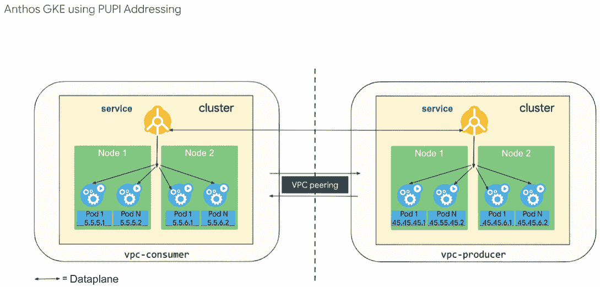

图 10.12 使用私有使用公共 IP（PUPI）寻址的 Anthos GKE

这种设置涉及以下考虑因素：

+   *主 CIDR 块*—用于节点和内部负载均衡（ILB）的非 PUPI CIDR 块，必须在 VPC 之间不重叠

+   *生产者次要 CIDR 块*—用于 Pod 的 PUPI CIDR 块（例如，45.45.0.0/16）

+   *消费者次要 CIDR 块*—客户侧的任何其他 PUPI CIDR 块（例如，5.5/16）

该公司的托管服务位于生产者 VPC（vpc-producer）中，并基于 Anthos GKE 部署构建。公司的 GKE 集群使用 PUPI 45.0.0.0/8 CIDR 块为 Pod 地址。客户的程序位于消费者 VPC（vpc-consumer）中。客户还拥有一个 Anthos GKE 安装。消费者 VPC 中的 GKE 集群使用 PUPI 5.0.0.0/8 CIDR 块为 Pod 地址。两个 VPC 相互对等连接。两个 VPC 都使用 RFC1918 地址空间作为节点、服务和负载均衡地址。

默认情况下，消费者 VPC（vpc-consumer）将所有 RFC1918 地址空间导出到生产者 VPC（vpc-producer）。与 RFC1918 私有地址和扩展私有地址（CGN，E 类）不同，PUPIs 默认情况下不会自动向 VPC 对等方广播。如果 vpc-consumer Pods 必须与 vpc-producer 中的资源通信，消费者必须启用 VPC 对等连接以导出 PUPI 地址。同样，生产者必须配置生产者 VPC 以通过 VPC 对等连接导入 PUPI 路由。

导入到 vpc-producer 的 vpc-consumer 地址空间不得与 vpc-producer 中使用的任何 RFC1918 或 PUPI 地址重叠。生产者必须通知消费者托管服务使用的 PUPI CIDR 块，并确保消费者没有使用这些块。生产者和消费者还必须同意并为 vpc-producer 中的 ILB 和节点地址分配非重叠地址空间。

PUPIs 不支持服务网络。在大多数情况下，vpc-consumer 中的资源通过生产者集群中的 ILB 地址与 vpc-producer 中的服务通信。如果生产者 Pods 需要直接与 vpc-consumer 中的资源通信，并且 PUPI 寻址不重叠，那么生产者必须配置生产者 VPC 以通过 VPC 对等连接导出 PUPI 路由。同样，消费者必须配置 VPC 对等连接以将路由导入 vpc-consumer。如果消费者 VPC 已经使用 PUPI 地址，那么生产者应改为配置 IP 伪装功能，并将 Pod IP 地址隐藏在生产者节点 IP 地址之后。

之前的示例显示了一个更复杂的生产者/消费者模型。您可以在单个项目模型中简单地使用它。这将释放可能用于 Pod IP CIDR 的 RFC1918 空间。

## 10.3 Anthos 多集群网络

本节讨论了连接跨多个集群运行的服务机制。每个混合和多云 Anthos 架构，按定义，都有多个集群。例如，您有在 GCP 上运行的 Anthos GKE 集群和在本地数据中心运行的 Anthos GKE 本地集群。在 Anthos 集群上运行的服务通常需要与其他 Anthos 集群中运行的服务进行网络连接。对于多集群服务网络，让我们看看以下场景：

+   *GCP 上的多集群网络*—在这个架构中，所有服务都在 GCP 上的多个 Anthos GKE 集群上运行。

+   *混合和多云环境中的多集群网络*——在这个架构中，服务在混合和多云环境中的多个 Anthos GKE 集群上运行。

### 10.3.1 GCP 上的多集群网络

云原生企业可以在 GCP 上运行 Anthos 平台。这可以是在单个区域的单个集群中。通常，Anthos 平台由多个区域中的多个集群组成，以提供弹性。

在 GCP 中，谷歌建议使用具有多个服务项目的共享 VPC 模型。其中这些服务项目之一属于 platform_admins 组，并包含构成 Anthos 平台的全部 Anthos GKE 集群。这些集群上的资源由多个租户共享。我们还建议使用 VPC 原生集群。VPC 原生集群使用 VPC IP 地址作为 Pod IP，这允许跨多个集群实现 Pod 到 Pod 的直接连接。典型的 GCP 上 Anthos 平台架构如图 10.13 所示。

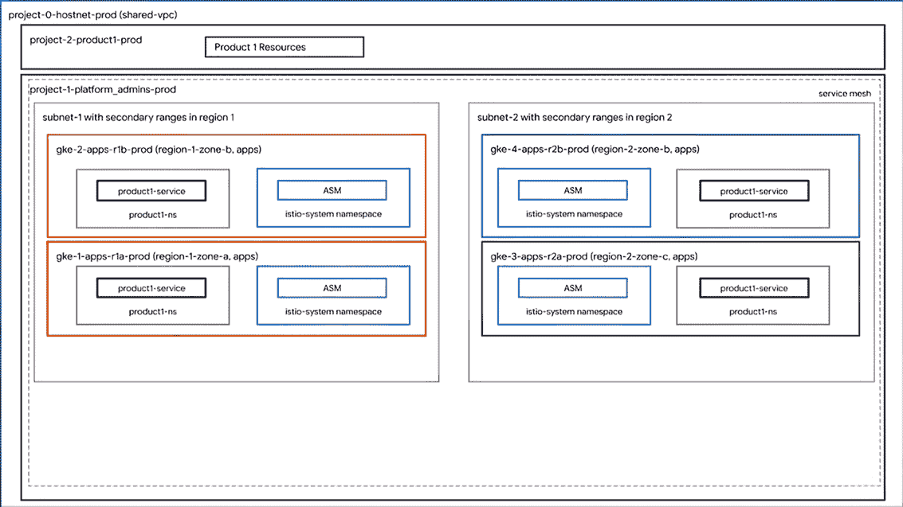

图 10.13 Anthos 架构：单一环境

此架构代表单一环境，例如，在这种情况下为生产环境。一个名为 project-0-nethost-prod 的单个网络主机项目管理共享 VPC。存在两个服务项目，一个是为平台管理员名为 project-1-platform_admins-prod 的项目，其中 Anthos 平台由平台管理员部署和管理，另一个是为产品名为 project-2-product1-prod 的项目，其中包含与 product1 相关的资源。在此示例中，Anthos 平台部署在两个 GCP 区域中，以提供区域冗余。您可以使用两个以上区域或甚至单个区域创建相同的架构。每个区域内部有一个单独的子网和次要范围。每个区域存在两个区域级别的 Anthos GKE 集群。每个区域多个集群提供集群和区域级别的弹性。您可以为每个区域超过两个集群使用相同的设计。所有集群都是 VPC 原生集群，允许集群之间的 Pod 到 Pod 连接。ASM 安装在每个集群上，形成一个多集群服务网格。ASM 控制平面发现所有集群中运行的服务和端点，并配置每个 Pod 内运行的 Envoy 边车代理的与网格内所有服务相关的路由信息。

每个租户或产品都会以 Kubernetes 命名空间（在网格内所有集群中）和一组策略的形式获得一个着陆区。租户只能在它们自己的命名空间内部署他们的服务。您可以在多个 Anthos GKE 集群中运行相同的服务以提供弹性。这些服务被称为*分布式服务*。分布式服务从所有其他实体的角度来看充当单个逻辑服务。如图 10.13 所示，product1-service 是一个具有四个端点的分布式服务，每个端点在不同的集群中运行。如图 10.14 所示，ASM 负责服务发现，VPC 原生集群允许 L3/L4 Pod 到 Pod 的连接。

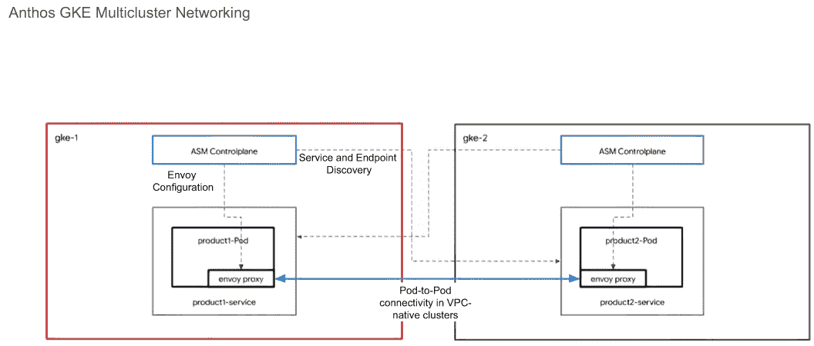

图 10.14 Anthos GKE 多集群网络

### 10.3.2 混合和多云环境中的多集群网络

除了在 GCP 上的 Anthos GKE 之外，所有其他 Anthos GKE 集群都以孤岛模式运行。这意味着集群内部 Pod 和服务使用的 IP 地址在集群外部是不可路由的。在这种情况下，您仍然可以在同一环境中（例如，在本地数据中心运行的多个 Anthos GKE 集群）或跨多个基础设施环境（例如，在 GCP 的 Anthos GKE 和在本地数据中心环境中运行的服务）连接运行在多个集群上的服务。

在混合或多云环境中连接多个 Anthos GKE 集群时，应考虑以下三个方面：

+   在多个集群上运行的 Pod 之间的网络连接

+   多集群间的服务发现

+   在混合和多云架构的情况下，基础设施环境之间的连接

网络连接

每个 Anthos GKE 集群都有一个负载均衡器。负载均衡器在安装期间捆绑提供，或者可以手动配置。这些负载均衡器允许服务通过 NodePort 暴露给集群外部的资源。每个服务都获得一个 VIP 地址（服务 VIP），该地址在网络上可路由且可访问。负载均衡器将流量路由到服务 NodePort 上的节点 IP，该 IP 被转发到所需端口的 Pod IP。

在一个集群中运行的服务（和 Pod）可以访问另一个集群中运行的服务 VIP，该服务通过负载均衡器路由到所需的 Pod，如图 10.15 所示。

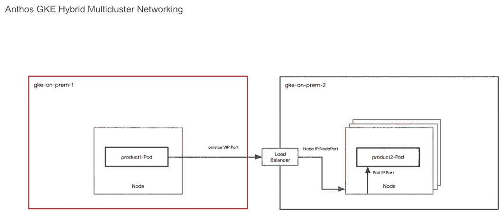

图 10.15 Anthos GKE 混合多集群网络

Anthos 集群还可以配置 Ingress 控制器。Ingress 控制器是位于集群内部的 L7/HTTP 负载均衡器。Ingress 控制器本身通过 L3/L4 负载均衡器暴露。这样，您可以使用一个 VIP（入口 VIP）为同一集群上运行的多个服务提供服务，如图 10.16 所示。Ingress 控制器根据入口规则操作，这些规则规定了如何在集群内部路由流量。

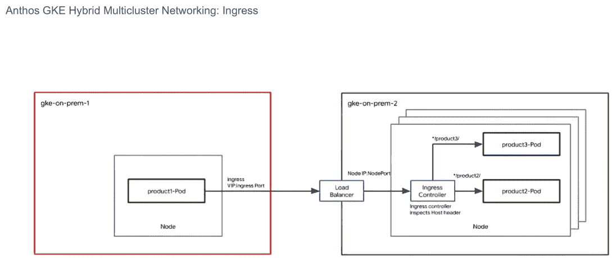

图 10.16 Anthos GKE 混合多集群网络：入口

多集群服务发现

Anthos Service Mesh 用于多集群服务发现，如图 10.17 所示。每个集群都安装了一个 ASM 控制平面。ASM 控制平面从所有集群发现服务和端点。这也被称为服务网格。ASM 控制平面必须能够访问服务网格内所有 Anthos 集群的 Kubernetes API 服务器。ASM 创建了自己的服务注册表，这是一个包含服务和它们相关联的端点（或 Pod）的列表。

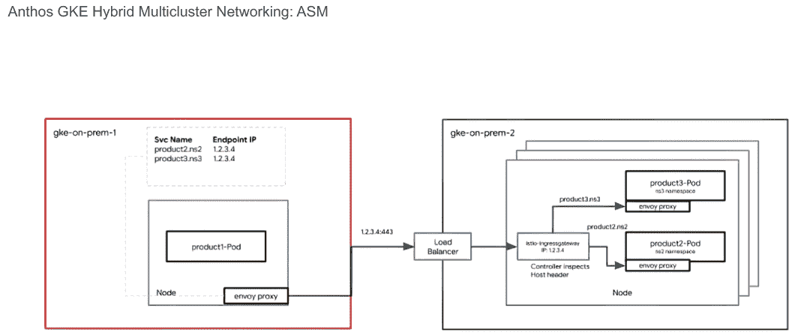

图 10.17 Anthos GKE 混合多集群网络：Anthos 服务网格

在 GCP 上的 Anthos GKE 中，如果使用 VPC 原生集群，端点是实际的 Pod IP 地址。流量通过 VPC 路由从 Pod 流向 Pod。在非 GCP Anthos 集群中，集群间的流量通过一个 L7 Envoy 代理流过。此代理在每个 Anthos 集群中以服务形式运行，称为 istio-ingressgateway。流向集群内所有服务的流量都通过 istio-ingressgateway，该服务配置为检查主机头并将流量路由到集群内的适当服务。

对于分布式服务，我们建议使用 ASM，它提供跨多个集群的服务发现和流量路由功能。

混合云和多云连接

只要你能访问目标 Anthos 集群的 Kubernetes API 服务器和外部公共负载均衡器，你就可以连接运行在多个 Anthos 集群中的多个基础设施环境中的服务。你可以以下三种方式连接基础设施环境：

+   *云互连*—通过高度可用、低延迟的连接将本地网络扩展到 Google 的网络。你可以使用专用互连直接连接到 Google，或者使用合作伙伴互连通过支持的服务提供商连接到 Google。专用互连在你的本地网络和 Google 的网络之间提供直接的物理连接。

+   *云 VPN*—通过 IPsec VPN 连接安全地将你的对等网络连接到你的 VPC 网络。两个网络之间的流量由一个 VPN 网关加密，然后由另一个 VPN 网关解密。

+   *公共互联网*—多个环境上的 Anthos 平台可以通过公共互联网连接，而无需使用云互连或 VPN。平台上的服务通过 TLS/mTLS 在公共互联网上连接。此类连接是在每个服务级别使用 ASM 完成的，而不是在网络级别。

这些连接模型在 10.1.2 节“多/混合云部署”中进行了详细解释。

## 10.4 服务和客户端连接

本节讨论 Anthos 平台中的服务和客户端连接，可以分为以下三个类别：

+   *客户端到服务连接*—这也被称为南北流量，表示流量起源于平台外部（北）并进入平台（南）。

+   *服务到服务连接*—这也被称为东西流量，表示流量在平台横向穿越（因此是东西）。所有流量都在 Anthos 平台内部发起和终止。

+   *服务到外部服务连接*—这是离开平台的流量。

### 10.4.1 客户端到服务连接

在此上下文中，客户端指的是位于 Anthos 平台外部的一个实体以及运行在 Anthos 平台内部的一个服务。您可以通过以下两种方式访问 Anthos 平台内部的服务：

+   *使用 ASM*—使用 ASM，您可以使用 ASM Ingress 来处理 HTTP(S)和 TCP 流量。ASM 提供了额外的 L7 功能，例如，在 Ingress 处执行身份验证和授权的能力。ASM 是 Anthos 平台上访问基于 Web 服务的推荐方式。ASM 也可以用于基于 TCP 的服务。

+   *不使用 ASM*—所有 Anthos 集群都支持配置负载均衡器的选项。负载均衡器在您部署 Anthos 集群时可能集成/捆绑，或者可以手动配置。任何基于 TCP 的服务都可以使用类型为 Loadbalancer*的服务来暴露，这会创建一个客户端可以访问的服务 VIP。此外，所有 Anthos 集群都可以配置 Ingress。Ingress 控制器通常在集群内部作为 L7 代理运行（除了在 GCP 上的 Anthos GKE 和 AWS 上的 Anthos 使用 ALB）。Ingress 控制器本身是通过 L3/L4 负载均衡器暴露的。Ingress 是暴露基于 Web 服务的推荐方式。Ingress 规则作为服务部署管道的一部分实现，Ingress 控制器强制执行这些规则，包括监听和路由流量到适当的服务。

### 10.4.2 Service 到 Service 连接性

集群内部运行的服务需要网络连接。这可以通过两种方式实现：

+   *使用 ASM*—我们推荐使用 ASM，尤其是在多集群的 Anthos 平台上。ASM 提供服务发现以及 Service 之间的路由逻辑。ASM 还可以处理 Service 之间的身份验证和授权。例如，您可以在服务网格级别启用 mTLS，加密所有 Service 到 Service 的流量。您还可以在单个 Service 层配置安全策略。除了服务发现和网络功能外，ASM 还提供其他功能，如遥测、配额、速率限制和断路器。有关 ASM 的功能和好处，请参阅第四章。

+   *不使用 ASM*—如果您选择不使用 ASM，您仍然可以配置 Service 到 Service 连接性。从网络角度来看，您可以使用负载均衡器或 Ingress 模式来访问集群内部运行的服务。您将不得不自行配置服务发现。您可以使用 DNS 来提供此功能。

在任何情况下，您也可以在集群内部使用 NetworkPolicy 来控制/限制 Pod 和 Service 之间的流量。

### 10.4.3 Service 到外部服务连接性

您可以通过以下两种方式控制任何 Anthos 集群的出口流量：

+   *使用 ASM*—ASM 提供入站和出站网关。我们之前讨论了 Ingress 如何与 ASM 协同工作。同样，您可以在服务网格外围配置第二个代理，称为 istio-egressgateway。然后，您可以为仅允许从集群内部访问的服务配置 ServiceEntries。您可以将 outboundTrafficPolicy 模式设置为 REGISTRY_ONLY。这将阻止所有不是目标为网格内服务的出站流量。然后，您可以创建单独的 ServiceEntries 以访问平台外运行的服务。一个 ServiceEntry 的示例可能如下所示：

    ```
    apiVersion: networking.istio.io/v1alpha3
    kind: ServiceEntry
    metadata:
      name: httpbin-ext
    spec:
      hosts:
      - httpbin.org
      ports:
      - number: 80
        name: http
        protocol: HTTP
      resolution: DNS
      location: MESH_EXTERNAL   ❶
    ```

    ❶ 位置 MESH_EXTERNAL 表示服务位于服务网格之外，并且手动将 DNS 条目添加到网格注册表中。

    此规则允许目标为端口 80 的*httpbin.org*的流量。注意服务位置为 MESH_EXTERNAL，表示此服务位于服务网格和 Anthos 平台之外。

+   *不使用 ASM*—您可以在集群内部使用 NetworkPolicies 根据标签选择器控制 Pod 的入站和出站流量。由于所有 Pod 出站流量都通过节点 IP 退出，您可以通过限制节点 IP 子网可以访问的目的地来进一步通过防火墙规则控制出站流量。

## 摘要

Anthos 网络可以分为以下四个层次：

+   *云网络和混合连接*—Anthos 网络的最低层。本层描述了如何在每个云环境中设置网络以及将多个云环境安全连接起来的选项。在 GCP 内部，您可以根据组织结构和功能需求设置单个网络（或 VPC）、共享 VPC 或多个 VPC。在非 GCP 环境中，所有 Anthos 集群都被视为孤立网络（或“岛屿模式”）。以下是一些混合连接选项：

    +   *专用互联*—在您的本地网络和谷歌网络之间提供直接的物理连接。专用互联使您能够在网络之间传输大量数据，这可能比在公共互联网上购买额外的带宽更经济高效。

    +   *云 VPN*—通过 IPsec VPN 隧道安全地将您的对等网络扩展到谷歌网络。流量被加密，并通过公共互联网在两个网络之间传输。云 VPN 适用于低流量数据连接。

    +   *公共互联网*—连接不同的网络不需要任何特殊的软件或硬件。相反，使用 TLS/mTLS 连接来保护服务到服务的连接。

+   *Anthos GKE 网络*—Kubernetes 网络层。Anthos GKE 集群可以部署到各种环境中，例如 GCP、在本地数据中心 VMware 上、在裸金属服务器上，以及 AWS 上。除了支持的 Anthos 集群外，您还可以将任何符合 Kubernetes 规范的集群注册到 Anthos 平台。例如，您可以将运行在 AWS 上的 EKS 集群和运行在 Azure 上的 AKS 集群注册到 Anthos 平台。目前有六种类型的 Anthos 集群可供使用：

    +   GCP 上的 Anthos 集群（GKE）

    +   VMware 上的 Anthos 集群（本地 GKE）

    +   基于裸金属的 Anthos 集群

    +   AWS 上的 Anthos 集群（AWS 上的 GKE）

    +   Azure 上的 Anthos 集群（Azure 上的 GKE）

    +   Anthos 附加集群（符合 Kubernetes 规范的集群）

+   *Anthos 多集群网络*—处理需要跨集群边界通信的多个集群的环境。本节可以分为以下两个子节：

    +   *在 GCP 上的 GKE 与 Anthos 多集群网络*—在 GKE on GCP 中，您可以选择平面网络架构（使用单个或共享 VPC）或多个网络（多个 VPC）模型。在平面网络架构中使用 VPC 原生 GKE 集群时，VPC 网络自动允许多个集群之间的 Pod 到 Pod 连接。集群可以位于任何区域。集群之间 Pod 到 Pod 连接不需要额外配置。在多个 VPC 架构中，您需要额外的配置来连接多个集群之间的 Pod 和服务。例如，您可以使用特殊的网关或入口模型在集群之间进行通信。

    +   *Anthos 多集群网络在非 GCP 环境中*—在所有非 GCP 集群中，集群及其地址范围与其他集群隔离。这意味着多个集群之间的 Pod 之间不存在直接连接。要连接多个集群，您必须使用特殊的网关或入口。Anthos Service Mesh 可以用来部署此类网关。通常称为“东西向网关”，这些网关被部署在参与多集群网络的各个集群中。此外，ASM 还提供多集群服务发现。

+   *服务层网络*—Anthos 网络的顶层是服务层网络。这一层解决服务如何发现和相互通信的问题。在上一节中，我们提到了 Anthos Service Mesh，它可以让您执行以下任务：

    +   ASM 允许您在运行在多云环境中的多个 Anthos 集群上创建服务网格。这一层抽象了底层网络的复杂性，让您可以专注于服务层。

    +   ASM 使用每个工作负载的边车和专用网关连接多个环境中的多个集群。

    +   通过使用 ASM，您可以专注于服务层功能——例如，身份验证、加密和授权——而不是在集群级别管理单个工作负载。这使得操作员和管理员能够在可能存在多个集群、多个环境、多个网络运行众多服务的情况下进行规模化操作。
