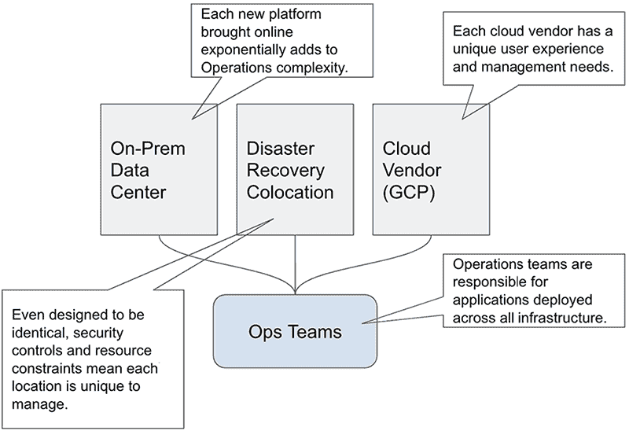
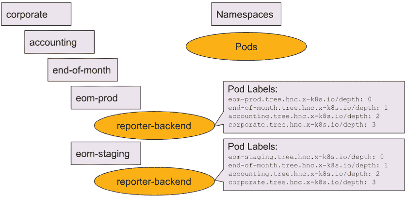

# 11 配置管理架构

迈克尔·麦迪逊

本章涵盖

+   为什么大规模配置是一个挑战

+   Anthos Config Management 概述

+   ACM 实施的示例和案例研究，展示了该解决方案的实用性和多功能性。

在应用程序开发的世界里，我们总是希望有更多的速度、更多的能力以及更多的应用程序来满足更多任务，自动化更多细节，运行得更快，并在更接近实际使用地点的地方运行。智能手机、平板电脑和物联网设备的普及，以及计算机在我们日常生活中的不断进步，推动了更多计算能力的需求。环境因素、高速互联网和其他公用事业的可获得性以及政府法规正在改变公司部署资源的方式。根据具体情况，这可能导致计算资源集中在几个数据中心，转向主要基于云的计算，碎片化为许多“微型”数据中心，或者这些解决方案的组合。

组织很少决定减少他们管理的总资源。尽管可能会出现短期内的减少、整合甚至消除应用程序的情况，但大多数公司明天管理的资源将比今天更多。过去 40 年或更长时间以来，应用程序开发一直遵循这条道路。

但是，随着 Kubernetes 的广泛应用，许多组织在处理将成千上万的虚拟机和应用程序迁移到 Kubernetes 环境中时，这个问题变得突出。尽管许多传统工具仍然可以使用，但以同样的方式使用它们将消除 Kubernetes 提供的许多优势。更不用说，传统工具集通常彼此脱节，迫使管理者在一个工具中更改防火墙设置，在另一个工具中授予虚拟机访问权限，在第三个工具中设置路由。这些挑战主要落在负责实施和维护所有这些基础设施的 IT 运维团队肩上。

随着越来越多的公司转向 Kubernetes 进行日常运营，安全专业人士和管理人员对其配置、管理和审计 Kubernetes 集群的能力充满信心，这对商业成功变得至关重要。IT 安全团队负责在 IT 基础设施的各个方面开发和实施安全控制，包括软件、硬件和物理限制、政策、程序和指导。许多公司采用分层权限模型，允许超级用户拥有更大的能力子集，而不成为完整管理员。由于 Kubernetes 中的许多工作都是由一个通用的定义语言驱动的，这种语言以 JSON 或 YAML 的形式表达，因此安全框架也应该为那些经常与 Kubernetes 一起工作的 IT 安全团队所熟悉。

为了帮助组织满足这一需求，谷歌创建了 Anthos Config Management (ACM)，以简化 Kubernetes 策略、资源和配置的开发、部署和维护。在下一节中，你将了解 ACM 帮助解决的全面挑战以及 ACM 为提高组织效率提供的机遇。

## 11.1 我们试图解决什么问题？

随着时间的推移，企业已经将流程转移到数字格式。即使没有互联网作为参与平台，公司也已经将内部运营转移到依赖数字应用程序和通信。当这加上与数字客户的巨大互动需求相结合时，公司对计算能力的需要比以往任何时候都更大，而且没有放缓的迹象。根据 Grandview Research 的预测，到 2030 年，边缘计算这一最新计算领域预计将成为一个超过 1550 亿美元的市场([`mng.bz/oJnr`](http://mng.bz/oJnr))。

此外，许多企业通过让这些系统相互通信来自动化他们的流程，从而提高了效率。例如，基于票务的自助服务软件如 ServiceNow、人员管理解决方案如 Workday 以及结合认证和授权服务如 Okta 的普及，鼓励公司扩大其现场和云端的业务能力。随着公司转向更多地依赖员工的发展能力来应对关键任务解决方案，随着他们将其生态系统中的每个新供应商引入，这些应用的部署复杂性也在增加。

任何公司在设计其独特的客户价值时，其需求都会与最接近的竞争对手有所不同，但大多数企业都在本地和云端都有数字存在。尽管一些公司已经使用多个数据中心或互惠设施来提供其冗余和可靠的基础设施，但许多公司已经转向云服务提供商。但云服务提供商的最佳实践和用户体验可能差异很大。运营团队上线每个云都极大地增加了他们的技术负担和运营开销，如图 11.1 所示。即使在设计为相同的数据中心的情况下，安全控制和物理分离仍然对其运营和维护构成障碍。



图 11.1 启用多个基础设施平台增加了相当大的运营开销。

公司的数字足迹大小也增加了其系统和操作的配置和运营复杂性。多个工作地点、更多的数据中心以及参与这些系统管理的人数相应增加，都带来了各自的挑战。随着组织的发展，引入和使用系统安全性和配置控制变得至关重要。ACM 通过以下核心能力来解决这些挑战：

+   管理复杂性

+   工作负载可观察性和检查

+   在问题发生时进行修复和预防

接下来，你将了解 ACM 如何管理现代基础设施的复杂性。

### 11.1.1 管理复杂性

你可以以无数种方式配置计算基础设施，但大多数解决方案都遵循一些通用模式。这些解决方案通常可以根据系统是横向扩展还是纵向扩展来分组。对于采用或使用基于 Kubernetes 的基础设施的公司，公司必须就所有 Kubernetes 集群的整体设计做出类似的决定。使用多个、较小集群（例如，每个团队一个或多个）用于不同目的的公司（例如）正在实施横向扩展解决方案。使用较少数量的大型集群（例如，每个用于开发、测试和生产）的公司正在将其 Kubernetes 基础设施构建到纵向可扩展性中。这两种方法没有一种是优于另一种的，但公司应确定哪种最适合其部署和软件设计方法。

地理限制、边缘处理需求以及电信运营也对集群的划分方式施加了限制。某些国家的政府法规禁止数据从这些地区流出，要求数据库和应用层位于国内。即使没有政府监管，某些类型的业务（如餐馆、零售店，甚至银行）可能也更倾向于使用本地处理系统，运行能够从更短的通信循环中受益或需要的应用程序子集。

此外，大型企业需要更多的人员来有效地组织和运营 IT 基础设施。为了减轻 IT 人员中的单点故障，开发可以扩展到多人的简单流程对于长期成功至关重要。

### 11.1.2 透明度和检查

Kubernetes 集群的工作负载可见性和整体健康状况超出了本章的讨论范围（它主要在第五章中介绍）。然而，Anthos Config Management 提供的所有集群的策略和配置的明文表示可以在前端做很多事情，以确保遵循适当的策略。

Anthos Config Management 的目标是保持集群处于由存储在 Git 仓库中的策略目录指定的状态。这个策略目录存在于被管理集群之外，并以文本格式存储。因此，策略目录本身可以用作有关集群配置的信息来源。通过使用 Git 仓库本身的特性，IT 运维团队能够确定集群何时不符合规范，并且可以轻松跟踪集群配置的变化。

ACM 通过 nomos 命令提供命令行工具，可以直接查询集群并确定其当前状态。运维团队可以使用 nomos 诊断更改的部署情况，并确定是否发生错误或延迟，这可能导致问题。nomos 提供的大部分信息在 Google Cloud 控制台中的 Anthos UI¹中可见，显示每个集群当前正在运行哪个配置版本，以及 ACM 安装的整体状态。此外，系统日志的 Kubernetes 操作员以与其他容器相同的方式记录事件和信息，因此可以在 Cloud Logging 中查看，并在 Cloud Monitoring 警报和指标中使用。

### 11.1.3 补救和预防问题

IT 运维团队的主要职责之一是维护系统可靠性和正常运行时间。知道更改导致了中断，并且能够快速隔离问题并迅速应用补救措施，是团队武器库中的关键工具。在这三个要点上，ACM 都带来了独特的功能，使团队能够应对发生的情况。

因为 ACM 是由 Git 仓库驱动的，你可以通过现有的拉取请求机制轻松添加护栏和政策执行，或者将一个或多个分支上的活动与监控套件绑定，并在政策变更后带来额外的警报。使用仓库作为事实来源，团队可以调查在什么时间应用了哪些更改，以缩小任何问题配置的范围。然后可以使用现有的 Git 工具来回滚或修复配置。由于 ACM 的设计，这些更改通常在将更改推送到策略仓库后一分钟或两分钟内生效。

除了修复已部署的问题外，你还可以使用现有的 CI/CD 工具和流程在配置生效之前验证配置。围绕 Git 的其他工具，如拉取和合并请求、分支等，也可以用来允许多个用户开发新的策略，同时允许组织在部署之前批准这些更改。

ACM 包括将配置应用于集群子集的能力。虽然我们在示例中使用它通过地区部署应用程序的不同版本到集群，但相同的功能也可以用来以受控的方式部署更改，或者为每个集群应用不同的角色。例如，每个商店运行一个集群的零售连锁店可以在将其推广到整个连锁店之前，将应用程序的新版本部署到特定的测试商店。使用不同集群进行开发、测试和生产环境的公司可以根据集群授予用户不同的权限，同时仍然可以利用单个策略仓库。

### 11.1.4 整合一切

这三个问题都可以通过 Anthos Config Management 得到很好的处理。通过提供 IT 专业人士熟悉的工具，以及在一个高度分布式的生态系统中茁壮成长的设计，ACM 可以帮助团队轻松地管理大型系统。在下一节中，我们将简要概述 ACM 的工作原理以及可以包含在安装中的组件。

## 11.2 ACM 概述

现在我们已经对使用 Anthos Config Management 尝试解决的问题有了很好的了解，让我们更深入地看看 ACM 的技术实现。ACM 通过在每个要管理的集群上部署一个 Kubernetes 操作员²来实现。一个包含集群规范名称、Git 配置和一组功能标志的配置文件也被应用到集群上。操作员使用 Git 配置连接到任何可访问的 Git 服务中托管的 Git 仓库，该仓库包含集群的完整配置信息。功能标志是开关，用于激活配置同步、策略控制器或层次结构控制器，这些将在本章后面介绍。ACM 使用集群名称以及 Git 仓库中的策略配置，为集群添加临时标签。然后，这些标签可以在策略仓库中使用，以修改部署到每个集群的资源。

ACM 的工作基于最小化占用心态：它不会试图接管整个 Kubernetes 集群。相反，操作员知道策略配置中定义了哪些对象，并致力于仅管理那些特定对象。这允许多个部署机制在单个 Kubernetes 集群上并行工作，而不会相互干扰。然而，使用多个工具确实增加了额外的负担，需要知道哪些工具部署了每个对象。ACM 在其管理的对象上包含一个特定的注解³，但可能不是所有工具看起来都一样。正如我们稍后将会看到的，ACM 仓库可以配置为非结构化模式，允许组织继续使用支持输出到 YAML 或 JSON 的现有工具，同时仍然使用 ACM 执行实际的部署和管理过程。

操作员每隔几分钟同步一次，这个频率可以在配置中调整，取决于组织的需要。ACM 可以使用公共和私有仓库，并使用适当的凭据作为策略仓库。此外，Git 配置可以指向仓库顶层以下的目录。如果 Git 仓库使用模板引擎或甚至应用程序代码，其中可以使用子目录来存储策略，这可能很有用。

您可以根据所使用的 Kubernetes 集群类型以三种主要方式部署 Anthos Config Management：在 GCP 上部署的 Google Kubernetes Engine (GKE) 集群、VMware 上的 GKE 集群，或 Kubernetes 的其他版本。对于 GCP 上的 GKE，启用 ACM 只需在集群配置页面上勾选一个复选框。对于 VMware 上的 GKE，ACM 默认启用且无法禁用。只有不符合上述任一类别的集群需要手动配置来安装操作符：获取由 Google 提供的操作符自定义资源定义文件的最新版本，并将其应用到集群中。

到此为止，所有版本的 Kubernetes 都已安装并运行操作符，但 ACM 仍需启用并指定从哪里拉取策略。这通过创建一个操作符配置对象并将其应用到集群中完成，同时附带所需的 Git 凭据。支持多种 Git 认证方法，包括无需认证的公共仓库、SSH 密钥对、个人访问令牌和 Google 服务帐户。其中一些方法需要将特定信息加载到 Kubernetes Secret 中，以便操作符正确加载。配置对象允许指定 Git 仓库的代理，如果需要的话。除了 Git 连接信息外，配置对象还可以包含设置以启用或禁用之前提到的单个组件，以及为 ACM 策略规则中的集群命名。请注意，在集群上创建的 ConfigManagement 对象和 gcloud 用于最初安装 ACM 所使用的配置 YAML 相似，但并不相同。随着 ACM 功能的扩展，将向此配置对象添加更多选项，但初始部署 YAML 的当前结构如下：

```
applySpecVersion: 1
spec:
 clusterName: <name of cluster>
  enableMultiRepo: <true/false, enables multiple repository mode>
  enableLegacyFields: <true/false, used with multi repo, see below>
  policyController:
    enabled: <true/false>
    templateLibraryInstalled: <true/false, installs the Google-provided template library for policy controller>
  sourceFormat: <hierarchy or unstructured. Sets the type of policy organization>
  preventDrift: <if set to true, rejects changes to the cluster that conflict with managed resources>
  git:
    syncRepo: <url of the git repository>
    syncBranch: <branch of the git repository to sync from>
    policyDir: <relative path in the git repository to the policy directory>
    syncWait: <number of seconds between sync attempts>
    syncRev: <git revision to sync from. Used if a specific commit or tag should be used instead of a branch>
    secretType: <ssh, cookiefile, token, gcenode, gcpserviceaccount or none. Specifies the type of authentication to perform>
    gcpServiceAccountEmail: <email of the service account to use for git access. Only used when secretType is gcpserviceaccount>
    proxy:
      httpProxy: <proxy information for http connection, styled similarly to the HTTP_PROXY environment variable>
      httpsProxy*: <proxy information for https connection, styled similarly to the HTTPS_PROXY environment variable>*
```

单个集群上的操作符是 ACM 用于更新每个集群上对象的机制。尽管 ACM 使用中央 Git 仓库，但由于单个集群会主动拉取配置，这大大简化了集群与仓库之间的连接性。仓库不会推送配置，因此我们不需要引入额外的复杂性或安全入口漏洞，中央仓库也不需要事先了解每个单个集群。

### 11.2.1 ACM 策略结构

ACM 策略目录必须采用两种支持的格式之一，要么是层次结构，要么是无结构，其中层次结构是默认格式。此设置也反映在前面提到的操作符配置对象中，在 spec.sourceFormat 键中。在两种情况下，策略目录定义 Kubernetes 对象，然后 ACM 操作符将检查并应用这些对象到连接到 Git 仓库的每个集群。ACM 本身使用其中一些对象内部来确定要应用到当前集群的资源。

除了存储库的整体格式外，您还可以使用多个存储库来配置集群。当使用 enableMultiRepo 功能时，单个存储库用作根存储库（可能是层次结构或非结构化），而所有其他存储库都用于在单个命名空间中配置对象。

层次结构

在层次结构存储库中，策略目录中的顶级目录根据目的和范围（系统、集群注册、集群和命名空间）来区分配置文件，如表 11.1 所示。

表 11.1 层次结构存储库中的顶级目录

| 目录 | 目的 |
| --- | --- |
| 系统 | 与策略存储库本身相关的配置，例如已部署配置的版本。 |
| 集群注册 | 存储集群和 ClusterSelector 对象，这些对象一起用于选择集群的子集，以限制特定对象的应用位置。集群定义通过名称给集群附加特定的标签；ClusterSelectors 可以使用这些标签来选择满足一定要求的集群集合。 |
| 集群 | 包含为整个集群定义的对象，但不包括命名空间。 |
| 命名空间 | 包含分配给一个或多个特定命名空间的对象，以及命名空间和 NamespaceSelector 定义。 |

在层次结构模式下，ACM 使用“抽象”命名空间的概念，即一个或多个实际命名空间的组合，这些命名空间应共享一组 Kubernetes 对象。例如，您可能在每个团队使用的命名空间中定义一个 Role 或 ConfigMap。当 ACM 分析存储库时，任何在抽象命名空间中定义的对象都会自动复制到其下所有的命名空间中。这些抽象命名空间也可以相互嵌套，以形成多个抽象层。例如，您可以将所有应用程序开发团队放置在 app-dev 抽象命名空间下，然后在 app-dev 内部为每个团队创建一个单独的抽象命名空间。

尽管 ACM 会将抽象命名空间中的对象复制到所有子命名空间中，但您可以使用 NamespaceSelector 来限制对象应用到的命名空间。以 app-dev 为例，我们希望将 ConfigMap 部署到多个团队跨多个命名空间中，但仅限于包含与财务相关应用程序的命名空间。通过给这些命名空间应用标签，我们就可以定义一个 NamespaceSelector 来选择这些命名空间，然后将 ConfigMap 配置对象链接到 NamespaceSelector。尽管这些选择器在层次结构存储库中确实有其用途，但它们的主要用途是在非结构化存储库中。此外，在层次结构存储库中，特定的命名空间必须是包含对象的文件夹的子文件夹，并且必须匹配选择器。一个包含配置对象定义的非结构化存储库的完整示例可以在本章末尾的 Evermore Industries 示例中找到。

一旦确定了要创建的特定命名空间名称，你也应该决定从哪个抽象命名空间继承。这可能意味着某些对象必须定义在比通常更高的级别，只是为了让它们被各个命名空间继承。一旦有了名称和抽象命名空间，你就在命名空间目录集的底部创建一个具有该名称的文件夹。在新建的目录内，你还必须创建具有相同名称的 Kubernetes 命名空间对象。在抽象命名空间中定义的所有对象也会在叶子命名空间内创建。让我们通过以下文件夹结构来举一个例子：

```
namespaces
├── staging
│   ├── qa-rbac.yaml
│   └── weather-app-staging
│       └── namespace.yaml
└── production
    ├── developer-rbac.yaml
    ├── app-service-account.yaml
    ├── weather-app-prod
    │   ├── namespace.yaml
    │   └── application.yaml
    ├── front-office-prod
    │   ├── namespace.yaml
    │   └── application.yaml
    └── marketing
        └── namespace.yaml
```

对于生产抽象命名空间，我们在 developer-rbac.yaml 中为开发者定义了一个角色和绑定，在 app-service-account.yaml 中为应用程序定义了一个 Kubernetes 服务账户。由于 weather-app-prod、front-office-prod 和 marketing 命名空间位于生产抽象命名空间下，因此角色、角色绑定和 Kubernetes 服务账户将在所有三个命名空间中创建。由于 ACM 分析策略存储库的方式，实际命名空间在其文件夹中不能有子目录，并且每个叶子目录都必须是一个实际命名空间，并在目录中有相应的命名空间声明。如果未能遵守此限制，当 ACM 部署时将导致配置错误。

除了抽象命名空间外，对象还可以使用 NamespaceSelectors（其声明方式类似于稍后在本章中介绍的 ClusterSelectors），以影响对象作用域内的子集命名空间。在之前的例子中，app-service-account 可以使用选择器仅部署到 weather-app-prod 和 front-office-prod 命名空间，而不是 marketing 命名空间。然而，在层次存储库中，NamespaceSelectors 仅在当前文件夹树中的命名空间上操作。例如，即使命名空间选择器在其标准中包括了 weather-app-staging，位于生产抽象命名空间下的 app-service-account 定义永远不会应用于 staging 命名空间，因为 weather-app-staging 目录不是包含 app-service-account 的目录的子目录。

优缺点

分层仓库简化了将对象部署到命名空间子集的过程，因为对象只能部署到仓库中配置文件所在级别或以下的命名空间。使用 NamespaceSelectors，组织可以进一步限制对象可以部署到的命名空间。如果有多种分组命名空间的方法，这可能特别有用。例如，一个开发团队可能会按命名空间分组，但他们可能还需要按功能（例如，前端、中间件）或业务单元分组。使用分层仓库，您必须选择一个“主要”的分组策略；如果对象需要部署到多个未分组的命名空间，则该对象将被放置在仓库的更高层级，并使用 NamespaceSelector 进行限制。这种组织方式使得确定对象部署到的命名空间变得非常简单，因为它们只能是定义文件中定义的或以下级别的那些。集群级别的资源和主要用于交付 ACM 的资源也有专门的文件夹，它们必须位于这些文件夹中，这使得找到特定对象变得更加容易。

然而，这种严格的结构在您组织实施 ACM 时可能会造成困难。许多组织已经至少对 Kubernetes 有基本的了解，并使用现有的工具集和流程来部署 Kubernetes 资源和应用程序。由于跨命名空间的对象必须在分层仓库的不同文件夹中进行配置，这可能会使 ACM 集成到现有的 CI/CD 管道中变得复杂。组织应权衡分层仓库提供的对象自动复制的好处与它施加的限制。

非结构化

与分层仓库不同，非结构化仓库没有特殊的目录结构。团队可以自由选择他们想要的任何组织风格，例如按应用程序或团队分组文件和对象。然而，使用非结构化仓库会阻止 ACM 使用抽象命名空间的概念来在多个命名空间中自动创建单个对象。为了弥补这一限制，对象必须声明一个命名空间或一个 NamespaceSelector。尽管 NamespaceSelectors 在分层仓库中的行为与在非分层仓库中相同，但它们不受仅在同一文件夹树中操作命名空间的限制，因此必须更加小心，以确保实际匹配的命名空间（或命名空间）确实是所需的。

优缺点

当一个组织已经使用模板引擎将对象部署到 Kubernetes 时，非结构化存储库变得更加有利。因为大多数模板引擎，包括 Helm，都包括将完成的 Kubernetes 对象导出到本地目录的能力，你可以使用这些命令的输出，并将生成的配置直接放置到 ACM 策略目录中。非结构化 ACM 存储库不关心配置在策略目录下的确切位置，因此在实施 ACM 时，这可以提供一条压力较小的升级路径。

然而，在命名空间分配方面，非结构化存储库存在一些问题。非结构化存储库中的配置无法推断它们应该分配到的命名空间，因此用户必须显式地分配所有对象。如果选择器定义或使用不当，这可能导致对象被部署到意外的命名空间。此外，由于配置文件的位置与部署命名空间之间没有隐含关系，查找资源变得更加复杂。

多存储库模式

将 ACM 配置为从多个存储库中提取，允许组织允许各个团队管理自己的命名空间，同时仍然可以利用 ACM 的许多好处。当集群配置对象设置为启用多个存储库模式（[`mng.bz/zmB6`](http://mng.bz/zmB6)），使用 enableMultiRepo 标志时，spec.git 字段集不支持。相反，你创建一个单独的 RootSync 对象来保存根存储库的配置细节。

当 enableMultiRepo 被设置时，组织可以定义每个单独命名空间要使用的存储库。与 RootSync 对象一样，这些单独的 RepoSync 对象包含从 Git 存储库提取配置以及该存储库中策略树顶部的目录的配置。即使在多存储库模式下使用，根存储库也可以定义在任何命名空间中管理的对象。在根存储库与单个命名空间存储库之间发生冲突的情况下，使用的是根存储库的版本。

多仓库设置的根仓库的功能与不在多仓库模式中的配置相同；只是获取仓库的配置方式发生了变化。因此，多仓库模式是一个理想的解决方案，允许操作和安全团队实施策略、RBAC 规则、Istio 规则，配置命名空间等，同时使应用团队能够管理和部署自己的应用程序到各自的命名空间中。管理根仓库的团队还需要添加适当的策略来定义各个仓库可以修改的对象。这是通过定义自定义角色或 ClusterRole，或使用内置角色之一，然后使用 RoleBinding 将命名空间的 worker 服务帐户附加到该角色来完成的。这允许操作团队将配置特定应用程序的大部分工作转移到团队，并在需要时为每个团队定义自定义权限，而不是要求中央团队验证或自行执行工作。 

### 11.2.2 ACM 特定的对象

虽然 ACM 可以管理任何有效的 Kubernetes 对象，但自定义对象可以调整系统的操作方式并应用新的配置。

ConfigManagement

ACM 使用此对象来确定如何以及在哪里获取用于集群的策略配置。将 ConfigManagement 对象部署到集群中激活了该集群的 ACM。此对象还定义了 ACM 内部使用的集群名称，并确定哪些插件（配置同步、策略控制器和层次控制器）对集群是激活的。

RootSync/RepoSync

当集群以多个仓库模式运行时，用于获取策略的配置，包括 Git URL 和 Secrets，不会存储在 ConfigManagement 对象中，而是在 RootSync 对象（对于核心仓库）或每个命名空间中的 RepoSync 对象中。

Cluster

在 ACM 策略仓库中创建集群配置，允许用户通过集群名称将标签附加到特定集群。然后，这些标签在 ClusterSelectors 中被用来选择特定类型的集群。在层次仓库中，集群定义必须在 clusterregistry 目录中。

ClusterSelector

此对象使用常见的 Kubernetes labelSelectors 模式⁴来选择集群的子集。ClusterSelector 然后可以被对象（如 Deployment、ConfigMap 或 Secret）使用，以仅在匹配选择器的集群中部署该对象。在层次仓库中，这些必须在 clusterregistry 目录中。

NamespaceSelector

与 ClusterSelector 类似，此选择器也使用 labelSelectors，但它用于选择命名空间。它主要用于非结构化仓库或作为在层次仓库中限制对象部署到哪些命名空间的附加方法。

HierarchyConfiguration

这些对象在单独的命名空间中声明，并指向其父对象。这设置了 Hierarchy Controller 所使用的层次命名空间关系。请注意，使用 Hierarchy Controller 与使用层次存储库不同；Hierarchy Controller 将在本章的后续部分进一步探讨。

### 11.2.3 其他组件

虽然 Config Connector、Policy Controller 和 Hierarchy Controller 并非 ACM 本身的一部分，但它们极大地增强了 ACM 和您的 Kubernetes 环境的功能。本节仅对每个组件进行了简要介绍，但所有三个组件都在本章末尾的示例中进行了演示。随着 Anthos 的发展，Google 也在集成额外的组件。请参阅[`mng.bz/Q8rw`](http://mng.bz/Q8rw)上的在线文档，获取有关可用附加组件的最新信息。

Config Connector

Config Connector ([`cloud.google.com/config-connector/docs`](https://cloud.google.com/config-connector/docs)) 是 Kubernetes 的一个附加组件，允许您使用 Kubernetes 对象配置 GCP 资源，例如 SQL 实例、存储桶和 Compute Engine 虚拟机。本章中提供了其中一个此类对象结构的完整示例。在适当的权限下，此附加组件允许熟悉 Kubernetes 的开发者创建多种类型的 GCP 资源，包括 SQL 数据库、网络、BigQuery 数据集和表、Compute 实例、Pub/Sub 主题和订阅以及存储桶。此外，这些配置可以相互引用，简化配置并允许单一事实来源。

用户还可以使用 Kubernetes Secrets 来存储敏感信息，例如密码，然后使用这些信息在 Config Connector 资源中。每个 Config Connector 对象还包括一个状态部分，描述了资源在 GCP 中创建或更新时的当前状态。

Policy Controller

虽然 Kubernetes 的基于角色的访问控制系统能够在命名空间和对象类型级别精细控制特定用户可以执行的操作，但它不强制执行任意策略或特定对象上的策略。例如，我们可能希望所有在特定命名空间中部署的 Pod 都为容器声明 CPU 限制，或者要求所有命名空间都包含一个自定义标签，以指示应向其收费的资源使用成本中心。我们可能还希望保护特定的部署并防止对该特定资源的修改，同时允许同一命名空间中的其他资源被修改。这正是 Policy Controller 发挥作用的地方。

由开源 OPA Gatekeeper 项目([`mng.bz/ydpG`](http://mng.bz/ydpG))构建的策略控制器([`mng.bz/X5mG`](http://mng.bz/X5mG))是一个准入控制器，它检查并验证任何对象的创建或更新是否符合已声明并加载到集群中的策略。每个策略由一个约束模板组成，该模板使用 Rego 编写以执行所需的测试，以及一个约束，它为特定策略提供模板的参数。当启用策略控制器时，默认提供一组现有的模板，称为模板库，但用户也可以创建定制的约束模板。然后，用户可以创建使用这些策略模板来对集群实施特定限制的约束。

由于我们正在使用 ACM，我们可以将策略约束与 ClusterSelectors 配对，以限制特定策略应用于哪些集群，锁定一些集群的同时，在另一些集群上允许更宽松的规则集。

层级控制器

层级控制器([`mng.bz/Mlr7`](http://mng.bz/Mlr7))是最新加入 ACM 体系下的附加组件，并在撰写本文时仍处于公开测试阶段。该控制器通过允许命名空间之间的继承，实质性地改变了 Kubernetes 中命名空间的工作方式，并由 Kubernetes 多租户工作组([`github.com/kubernetes-sigs/multi-tenancy`](https://github.com/kubernetes-sigs/multi-tenancy))推动。尽管与 ACM 仓库中抽象命名空间在层级结构中的工作方式相似，但该组件通过允许对象从父命名空间主动复制到子命名空间，进一步扩展了这一功能。这在使用 ACM 仓库且仓库中不包含机密信息（由于涉及的安全考虑）时特别有用。通过配置层级控制器从父命名空间复制机密到子或多个子命名空间，可以简化重工作量或手动干预的需求。

层级控制器的一个其他有用功能是控制器与云日志之间的协同作用。当在 ACM 配置文件上设置 enablePodTreeLabels 标志时，层级控制器会在所有 Pod 上设置标志，包括子命名空间中的 Pod。这也指示了 Pod 在层级树中的位置有多深。图 11.2 包含了一个示例。



图 11.2 当启用 enablePodTreeLabels 时，具有与层级相关的标签的命名空间和 Pod

如您在本例中可以看到，我们有 eom-prod 和 eom-staging 命名空间作为月末命名空间的孩子。月末命名空间是会计命名空间的孩子，而会计命名空间又是公司命名空间的孩子。如图 11.2 所示，应用后端 Pods 上的层级标签对应着命名空间层级。在 Kubernetes 中，您可以按标签的存在性以及标签值进行查询。因此，如果我们想查看会计及其子命名空间下的所有 Pods，我们可以运行 `kubectl --all-namespaces get pods -l accounting.tree .hnc.x-k8s.io/depth`，这将检索到报告后端的两个实例。这些标签也出现在云日志中，可以用来在多个命名空间中检索 Pods。

## 11.3 示例和案例研究

ACM 是建立在 Kubernetes 对象之上的，在集群生命周期内运行以高效管理集群的状态。到目前为止，我们已经看到了 ACM 的组件；在下一节中，我们将详细检查三个案例研究。这些虚构的公司中，每个要么目前正在使用 Kubernetes 并希望优化其部署，要么是第一次迁移到 Kubernetes；每个都将使用 ACM 来执行略微不同的功能。

我们的第一家公司 Evermore Industries 已经决定使用一个由许多节点组成的大型集群。他们所有的应用团队将在并行命名空间中运行他们的开发、测试和质量保证环境。Evermore 希望尽可能利用 GCP 资源，但他们的应用开发者对基础设施即代码（IaC）工具的经验不多。核心基础设施团队在 IaC 方面有经验，但缺乏足够的成员来提供应用团队所需的所有资源。管理层已经决定允许应用团队管理他们自己的云基础设施的一部分，但仍希望施加某些指南和政策轨道以防止无序支出。最后，由于公司中应用程序的多样性和涉及的权限级别不同，需要一个服务网格来隔离和控制流量。

村庄亚麻公司，LLC 大约二十年前成立，之前在其总部附近的两个数据中心本地运行所有基础设施。部分原因是其中一个数据中心的所有权发生变化，但也由于过去高流量购物日的糟糕结果，该公司决定使用云来实现快速可扩展性，同时保持其剩余的一个数据中心中的几个核心功能。然而，公司领导希望保留仅从本地数据中心运行整个应用程序堆栈的能力，并要求两个环境尽可能相似，并且故障转移应尽可能简单和快速。村庄亚麻还希望允许开发者自由管理自己的命名空间，而不会意外影响其他应用程序，也不会因批准每个变更而产生大量开销。

我们最后一家公司，模糊岩石盛宴，在美国和加拿大拥有数百家餐厅，并开始向欧洲和亚洲扩张。目前，他们的现场应用程序（包括库存控制、工资、前厅系统、调度和会计）通过每月补丁流程更新，将更改推送到各个门店。这需要专门的网络，有时可能会出现不稳定。该公司希望转向一种不需要他们的中央 IT 网络持续连接到各个门店的解决方案。他们过去在添加新应用程序到套件以及尝试将软件的目标版本部署到不同地区时，也遇到过修改他们的部署流程和技术的问题。

### 11.3.1 永恒工业

对于永恒工业来说，只需管理一个大集群的简单性是关键。然而，管理大量的命名空间、用户、权限和 GCP 资源对他们的 IT 运维来说证明是过于繁重。因此，他们转向 ACM、策略控制器和配置连接器来分担一些繁重的工作。

在迁移初期进行的一次简短的概念验证中，IT 运维团队意识到，一个非结构化的仓库可以让他们更容易地将特定策略附加到单个命名空间（例如，对生产命名空间应用一致的规则）的同时，也允许使用基于团队的规则，而无需大量重复。非结构化仓库还允许 IT 安全团队轻松限制哪些用户有权修改仓库中的特定文件夹。因此，格里芬团队的开发者不可能意外删除独角兽团队的东西，并且不允许任何应用程序团队成员修改全局策略。这减少了每个变更所需的配置审查量，但并未消除。

尽管 Evermore 已经使用 Kubernetes 几年了，但他们的 CI/CD 流程⁵使用模板引擎（Helm）直接部署到集群。这种设置在过去造成了一些问题，管理层已决定不再允许用户直接访问 prod 命名空间进行更改，包括 CI/CD 服务账户。由于非结构化存储库不强制要求目录中的配置元素属于任何特定组织，Evermore 已决定继续使用他们的模板引擎，但将配置直接写入 ACM 存储库，并在需要部署新版本时创建拉取请求。因为这些操作可以迅速由运营团队管理员验证，所以它们可以迅速部署到活动存储库。

此外，几个应用团队表示有兴趣使用 GCP 资源来卸载他们应用程序的一些工作负载。主要，这些团队对 Cloud SQL、Pub/Sub 和存储桶感兴趣。由于应用团队几乎没有人有使用 IaC 工具或 GCP 的经验，Evermore 将使用 Config Connector 允许团队在所有部署需求中保持 Kubernetes 空间，同时消除配置和培训用户访问 Kubernetes 和 GCP 本身的必要性。让我们看一下存储库概要，如下所示：

```
<Git Repo Parent>
├── bin
└── policies
    ├── namespace_selectors
    ├── global
    │   ├── rbac
    │   ├── namespaces
    │   └── policy_controller
    └── teams
        ├── griffins (accounting)
        │   ├── rbac
        │   ├── namespaces
        │   └── applications
        │       ├── reconciler
        │       ├── expense_reports
        │       └── accounts_pay_recv
        ├── unicorns (public-facing stores and APIs)
        │   ├── rbac
        │   ├── namespaces
        │   └── applications
        │       ├── storefront
        │       ├── order_cap_and_ful
        │       ├── payment_auth
        │       └── inventory
        ├── dragons (internal apps)
        │   ├── rbac
        │   ├── namespaces
        │   └── applications
        │       ├── timesheets
        │       └── shipping_manager
        └── sylphs (reporting and analysis)
            ├── rbac
            ├── namespaces
            └── applications
                ├── etl
                └── reporting
```

我们不会详细介绍在这个存储库中创建的每个对象和文件，但这个概要为我们提供了一个起点，以了解 Evermore 所选择的架构。

在非结构化存储库中，策略目录不允许位于 Git 存储库的顶层，因此公司选择将其放置在一级以下的策略目录中。在该目录内，对象可以放置在任何级别，因此 IT 运营团队在 namespace_selectors 目录中放置了一套常见的命名空间选择器。其中之一是生产选择器，如下所示：

```
kind: NamespaceSelector
apiVersion: configmanagement.gke.io/v1
metadata:
  name: production
spec:
  selector:
    matchLabels:
      env: production
```

为了简化应用团队的工作，IT 运营团队也定义了一个选择器，该选择器通常只引用一个命名空间，如下所示：

```
kind: NamespaceSelector
apiVersion: configmanagement.gke.io/v1
metadata:
  name: cc-project-ns
spec:
  selector:
    matchLabels:
      evermore.com/is-active-project: true
```

为了防止在创建新项目时发生大规模变更，所有由团队定义的 Config Connector 对象都使用命名空间选择器方法来选择适当的命名空间以部署其对象。例如：

```
apiVersion: storagebuckets.storage.cnrm.cloud.google.com/v1beta1
kind: StorageBucket
metadata:
  name: evermore-shipping-pk-list-archive
  annotations:
    configmanagement.gke.io/namespace-selector: cc-project-ns
spec:
  versioning:
    enabled: true
  storageClass: ARCHIVE
```

在全局目录中，IT 运营团队定义了适用于整个集群的 RBAC 和策略控制器策略。在 RBAC 目录中，Dev/QA 和生产环境的命名空间范围角色分别定义。这些角色使用 NamespaceSelectors 通过一个配置应用到多个命名空间。NamespaceSelectors 通过注解使用，非结构化存储库中的所有命名空间范围对象必须直接声明一个命名空间（通过 metadata.namespace）或使用 NamespaceSelector。以下是大多数开发者将收到的基本生产角色：

```
apiVersion: rbac.authorization.k8s.io/v1
kind: Role
metadata:
  name: prod-developer
  annotations:
    configmanagement.gke.io/namespace-selector: production
rules:
- apiGroups: [""]
  resources: ["pods", "configmaps"]
  verbs: ["get", "watch", "list"]
- apiGroups: ["apps", "extensions"]
  resources: ["deployments", "replicasets"]
  verbs: ["get", "watch", "list"]
- apiGroups: [""]
  resources: ["secrets"]
  verbs: ["list"]
```

policy_controller 目录是 Evermore 决定放置所有他们的 Policy Controller 约束的地方。除了需要定义容器限制和对 Istio⁶服务网格的限制之外，IT 运维团队还添加了以下约束，以强制团队为给定的命名空间定义环境和团队：

```
apiVersion: constraints.gatekeeper.sh/v1beta1
kind: K8sRequiredLabels
metadata:
  name: ns-must-have-env-and-team
spec:
  match:
    kinds:
    - apiGroups: [""]
      kinds: ["Namespace"]
  parameters:
    labels:
    - key: "env"
      expectedRegex: "^(production|development|qa)$"
    - key: "team"
      expectedRegex: "^(griffins|unicorns|dragons|sylphs)$"
```

除了要求在命名空间上设置标签之外，此约束还限制了有效值的范围。Policy Controller 基础设施允许创建自定义约束模板，但 Evermore 已经能够使用提供的库实现所有他们希望实施的政策。

全局文件夹中的命名空间目录包含由 IT 运维管理的配置，这些配置要么未被任何应用团队使用，要么被大多数或所有团队使用。例如，这包括 Istio 命名空间和 Config Connector 项目命名空间。此外，此文件夹下的子文件夹包含将在整个系统中使用的 Secrets、ConfigMaps 和 Deployments。IT 运维人员已将一些通用的 Istio 配置以及应复制到多个命名空间（包括可以通过每个应用程序的环境变量挂载的联系人信息 ConfigMap）的配置放置在此结构中。

对于每个团队的文件夹，rbac 和命名空间目录由各个应用程序团队处理，尽管更改仍必须通过 IT 运维人员成员的 pull request 进行批准。命名空间目录包含每个应用程序和环境的命名空间声明，而 rbac 目录包含每个用户的 RoleBindings 和 ClusterRoleBindings。

在每个应用程序文件夹（reconciler、storefront、etl 等）内部，每个环境都存在三个文件夹。这些文件夹与每个应用程序已存在的 CI/CD 流程相连接。CI/CD 管道已经配置为生成要加载到集群上的 Kubernetes 对象，因此团队将目标更改为输出到适当环境目录中的一组文件。此 CI/CD 流程还会触发一个自动的 pull request，然后可以快速由 IT 运维人员成员批准和处理。

Evermore 选择这种配置用于他们的仓库，因为它最适合他们当前的需求。然而，他们正在使用一个无结构的仓库，因此如果需要，更改目录结构是一个低成本的选择。其他公司可能会选择将所有 RBAC 相关的对象集中到一个目录中，或者完全消除“团队”的概念，并根据单个应用程序组织一切。无结构仓库允许您以对组织最有意义的方式组织策略，而不是被限制在以命名空间为中心的结构中。

### 11.3.2 Village Linen, LLC

Village Linen 决定采用分层仓库，但他们将使用 Hierarchy Controller 来帮助自动复制他们的一些 Secrets 和 ConfigMaps。他们正在 GCP 上运行 GKE，同时在现有的数据中心中运行 VMware 上的 GKE，希望两者在集群内部几乎可以完全相同地运行。

灾难恢复是企业管理的重大问题，但管理层明白在处理故障转移时数据复制有时可能成为问题。因此，架构师们开发了一个系统，允许用户同时使用云和本地应用程序层，但在云中使用单个数据库集群。数据库在本地进行复制（此处不包括或覆盖复制配置），配置更改将应用程序指向数据中心中位于的数据中心的备用数据库。仓库通常如下所示：

```
<Git Repo Parent>
├── bin
└── policy_directory
    ├── namespaces
    │   ├── rbac.yaml
    │   ├── central
    │   │   ├── namespace.yaml
    │   │   └── database_location_config.yaml
    │   ├── applications
    │   │   ├── service_account.yaml
    │   │   ├── website
    │   │   │   ├── namespace.yaml
    │   │   │   ├── hierarchy.yaml
    │   │   │   └── repo-sync.yaml
    │   │   └── inventory
    │   │       ├── namespace.yaml
    │   │       ├── hierarchy.yaml
    │   │       └── repo-sync.yaml
    │   └── village-linen-ac15e6
    │       ├── namespace.yaml
    │       ├── hierarchy.yaml
    │       └── repo-sync.yaml
    ├── cluster
    │   ├── rbac.yaml
    │   ├── hierarchy.yaml
    │   └── constraints.yaml
    ├── clusterregistry
    │   ├── data center.yaml
    │   ├── cloud.yaml
    │   └── selectors.yaml
    └── system
        └── repo.yaml
```

从底层开始，我们有一个包含当前版本策略的仓库定义。在 clusterregistry 目录中，我们定义了本地数据中心中的集群以及 GCP 中的集群。我们还为这些集群中的每一个定义了选择器，以便我们可以在 namespaces 目录中限制资源。例如，云集群声明和选择器如下：

```
kind: Cluster
apiVersion: clusterregistry.k8s.io/v1alpha1
metadata:
  name: vili-cloud
  labels:
    locality: cloud
---
kind: ClusterSelector
apiVersion: configmanagement.gke.io/v1
metadata:
  name: sel-clu-cloud
spec:
  selector:
    matchLabels:
      locality: cloud
```

在 cluster 目录中，我们有适用于整个集群的配置。这些包括 ClusterRoles 和 ClusterRoleBindings 以及 Policy Controller 约束。默认情况下，Hierarchy Controller 只从父命名空间传播 RBAC 角色和角色绑定到子命名空间。然而，Village Linen 想要使用 Hierarchy Controller 从 central 命名空间同步 Secrets 和 config maps 到应用程序和项目命名空间。这样，Secrets 可以直接应用于 central 命名空间，并自动复制，无需将其检查到 Git 仓库中。修改后的 HNCConfiguration 如下：

```
apiVersion: hnc.x-k8s.io/v1alpha1
kind: HNCConfiguration
metadata:
  name: config
spec:
  types:
    - apiVersion: v1
      kind: ConfigMap
      mode: propagate
    - apiVersion: v1
      kind: Secret
      mode: propagate
```

向上移动到 namespaces 目录，我们有一个顶层文件来定义在每个命名空间中要创建的一组 RBAC 角色。Village Linen 可以将这些角色绑定到应用程序抽象命名空间（这将将这些绑定应用于网站和库存命名空间），或者绑定到显式定义的命名空间，以控制谁可以访问这些角色。

此目录定义了总共四个命名空间：central、website、inventory 和 village-linen-ac15e6。最后一个命名空间与用于部署这些集群资源的项目 ID 匹配（也是云 GKE 集群部署的位置）。两个应用程序命名空间共享一个服务账户定义，尽管这将创建两个独立的服务账户，一个在每个命名空间中。在 central 命名空间中，我们声明了一个 ConfigMap，它告诉应用程序使用哪个数据库，无论是 Cloud SQL 还是本地集群。

在每个“子”命名空间（网站、库存和 village-linen-ac15e6）中，仓库都有一个 HierarchyConfiguration 对象，它使 Hierarchy Controller 能够从父级传播对象到子级：

```
apiVersion: hnc.x-k8s.io/v1alpha2
kind: HierarchyConfiguration
metadata:
  name: hierarchy
spec:
  parent: central
```

在这种情况下，所有“子”命名空间都继承自一个共同的父级，但可以将这些命名空间“堆叠”成链。例如，我们可以引入另一个命名空间——applications，它继承自中央，并将库存和网站修改为从 applications 继承。执行此类堆叠层次结构可以更精细地控制要复制的对象，如果启用，还可以为日志添加额外的标记。

当为特定集群启用 Hierarchy Controller 时，可以选择一个附加选项，该选项包括 Pods 上的树标签。这些标签表示 Pod 的层次关系，可以与命令行工具和 Cloud Logging 一起使用，以过滤来自给定命名空间的日志。

因为 Village Linen 使用分层仓库，所以对于 namespaces 目录中的对象，不需要显式定义 .namespace 字段。然而，需要显式定义命名空间本身；Village Linen 选择将这些定义放在 namespace.yaml 文件中，尽管这不是必需的。在网站和库存命名空间中定义的对象用于启用下一节中提到的多仓库功能。但是，Cloud SQL 集群是在 namespaces 目录的最后一个文件夹中定义的。cloud_sql.yaml 文件如下定义了 SQL 数据库、实例和用户：

```
---
apiVersion: sql.cnrm.cloud.google.com/v1beta1
kind: SQLInstance
metadata:
  name: village-linen
  annotations:
    configmanagement.gke.io/cluster-selector: sel-clu-cloud
spec:
  region: us-central1
  databaseVersion: POSTGRES_9_6
  settings:
    tier: db-custom-16-61440
---
apiVersion: sql.cnrm.cloud.google.com/v1beta1
kind: SQLDatabase
metadata:
  name: village-linen-primary
  annotations:
    configmanagement.gke.io/cluster-selector: sel-clu-cloud
spec:
  charset: UTF8
  collation: en_US.UTF8
  instanceRef:
    name: village-linen
---
apiVersion: sql.cnrm.cloud.google.com/v1beta1
kind: SQLUser
metadata:
  name: village-linen-dbuser
  annotations:
    configmanagement.gke.io/cluster-selector: sel-clu-cloud
spec:
  instanceRef:
    name: village-linen
  password:
    valueFrom:
      secretKeyRef:
        name: db-creds
        key: password
```

如您所见，Config Connector 允许引用其他 Config Connector 对象（前一个代码片段中的 instanceRef 声明）和 Secrets。Config Connector 还可以从 ConfigMaps 中提取信息。出于安全原因，db-creds Secret 没有存储在 ACM 仓库中。然而，由于 Hierarchy Controller 被配置为复制 Secrets 和 ConfigMaps，我们可以手动在中央命名空间中创建或更新 Secret，Hierarchy Controller 将处理复制到应用程序和项目命名空间。当 Config Connector 下次进行协调时，将使用新密码为用户。

所有 Config Connector 配置都包含一个带有集群选择器的注解。这引用了在 GKE 云安装中 clusterregistry 目录中定义的集群选择器。由于 Config Connector 旨在从 Kubernetes 对象创建 GCP 资源，因此它仅在 GCP 集群的 GKE 上处于活动状态。公司没有在本地集群中启用 Config Connector，因此尝试部署这些资源将会失败。即使 Config Connector 在本地集群中启用，部署这些资源在那里也不会有任何影响，可能会引起更多的故障排除问题，所以我们只将它们部署到云集群。

使用此配置，如果 Village Linen 需要从云数据库切换回本地数据库，只需对 database_location_config 进行简单更改。部署并推送更新后的配置后，单个应用程序需要重新启动。

在前面概述的目录结构中，每个应用程序命名空间都包含一个 repo-sync 文件。这些对象用于实现多个仓库模式：

```
apiVersion: configsync.gke.io/v1alpha1
kind: RepoSync
metadata:
  name: repo-sync
  namespace: website
spec:
  git:
   repo: https://source.developers.google.com/p/village-linen-ac15e6/r/website
   branch: master
   auth: gcenode
   secretRef:
     name: acm-website-repo
```

通过使用多个仓库模式，Village Linen 可以为每个命名空间创建单独的仓库，使得应用程序团队在修改 Kubernetes 对象（包括部署、服务和持久卷）时拥有更简单的体验。这种安排也限制了团队意外部署其命名空间之外的内容。操作团队仍然可以使用核心仓库向每个命名空间添加项目，这些项目与特定命名空间的对象并行存在。在发生冲突的情况下，核心仓库的版本将被使用，防止应用程序团队覆盖操作团队已经定义的策略、服务帐户、机密等。此外，由于操作团队已通过 RBAC 限制了命名空间工作员可以修改的对象，因此单个仓库被沙盒化，仅控制一组有限的对象，并且除非操作团队允许，否则不能授予自身权限。

对于 Village Linen，ACM 提供了一个方便的位置，以便所有核心配置可以集中管理和更新，同时释放应用程序团队控制他们自己的命名空间。它还在配置更改时提供了一个方便的审计跟踪。当本地数据中心集群或云集群因任何原因失败时，可以快速自动启动一个新的集群并将其连接到 ACM 仓库，部署完整的操作栈。

### 11.3.3 Ambiguous Rock Feasting

对于 Ambiguous Rock Feasting（A.R. Feasting），在过去几年中，管理他们不断扩大的餐厅群和部署的技术变得越来越困难。公司现在认为，技术组件的实施时间以及每个新位置给他们的 IT 运营团队带来的额外运营负担已经变得不可持续。因此，他们正在转向一个更具灵活性的模型，该模型可以更好地扩展。

这些餐厅已经在本地服务器上运行了 Kubernetes 集群，但更新部署的应用程序或解决问题导致每个位置都损失了大量的时间。因此，A.R. Feasting 已经转向使用 ACM 来管理单个集群。一般来说，仓库布局与 Village Linen 的布局相匹配，但 A.R. Feasting 没有使用层次控制器。

当部署 ACM 操作员时，每个位置的集群都被分配了一个专有的名称，例如 arf-043-01a。然后 IT 运维团队使用策略仓库中的集群定义对这些集群进行标记，如下所示：

```
kind: Cluster
apiVersion: clusterregistry.k8s.io/v1alpha1
metadata:
  name: arf-043-01a
  labels:
    sales-area: us-midwest
    country: us
    region: texas
    city: austin
    location-code: alpha
```

或者像这个 arf-101-01a 的例子：

```
kind: Cluster
apiVersion: clusterregistry.k8s.io/v1alpha1
metadata:
  name: arf-101-01a
  labels:
    sales-area: emea
    country: uk
    region: england
    city: london
    location-code: alpha
    is-rollout-tester: true
```

IT 运维团队随后根据这些标签定义选择器，其中一些如下所示：

```
---
kind: ClusterSelector
apiVersion: configmanagement.gke.io/v1
metadata:
  name: rollout-testers
spec:
  selector:
    matchLabels:
      is-rollout-tester: true
---
kind: ClusterSelector
apiVersion: configmanagement.gke.io/v1
metadata:
  name: non-testers
spec:
  selector:
    matchExpressions:
    - key: is-rollout-tester
      operator: DoesNotExist
---
kind: ClusterSelector
apiVersion: configmanagement.gke.io/v1
metadata:
  name: country-us
spec:
  selector:
    matchLabels:
      country: us
```

这些选择器随后用于控制应用程序新版本的部署，或者在某些地区仅部署某些应用程序。例如，只有美国的餐厅有快车道。因此，快车道管理应用程序只需要部署到 country-us 集群。公司还决定让某些选定的商店成为新软件的测试床，这可以通过它们集群上的 is-rollout-tester 标志来表示。这里包含了一个应用程序部署的示例。然而，模板的一些部分已被删除，因为它们在两个示例中是相同的：

```
---
apiVersion: apps/v1
kind: Deployment
metadata:
  name: foh-engine
  annotations:
    configmanagement.gke.io/cluster-selector: rollout-testers
spec:
  template:
    spec:
      containers:
      - name: engine
        image: gcr.io/ambiguous-rock/foh/engine:v2.1.0
        imagePullPolicy: IfNotPresent
---
apiVersion: apps/v1
kind: Deployment
metadata:
  name: foh-engine
  annotations:
    configmanagement.gke.io/cluster-selector: non-testers
spec:
  template:
    spec:
      containers:
      - name: engine
        image: gcr.io/ambiguous-rock/foh/engine:v2.0.3
        imagePullPolicy: IfNotPresent
```

这两种部署之间的区别在于所使用的集群选择器和引擎镜像的版本。回顾一下定义的集群选择器，rollout-testers 和 non-testers 没有重叠。如果我们没有定义 non-testers 组，并且在第二个部署中提前移除了注释，那么 rollout-testers 就会发生冲突，因为两个部署都是有效的。

由于 ACM 使用与 Kubernetes 相同的日志标准记录其更改，并且 A.R. Feasting 餐厅将它们的日志转发到云日志，IT 运维团队可以使用云监控设置监控，以确定各个集群上特定应用程序和版本的状态。使用此仪表板，他们可以快速诊断潜在问题可能发生的地方（例如商店的停电），并更有效地工作。

## 11.4 结论

组织在管理其 IT 环境时面临着日益增加的复杂性。使用 Anthos Config Management 与 Kubernetes 集群（无论是在本地、Google Cloud 还是其他云服务提供商），为管理员提供了一个熟悉且声明式的控制其集群基础的方法。本章提供了该服务的广泛概述，一些采用 ACM 策略的原因，以及几个示例来说明 Anthos Config Management 的强大功能。

然而，我们还没有完全探索 Anthos Config Management 的能力和可能性：这样做可能需要一本完全属于自己的书。最终，ACM 旨在使您的业务更高效，并减少管理集群的复杂性。本章应该为您提供了如何在您的组织中使用 ACM 的想法，以及一些如何推动采用的示例。

关于本章涉及的各种主题的更多信息示例，请参阅本书相应的章节：

+   策略控制器：第十三章

+   云日志：第五章

## 摘要

+   随着组织管理的集群数量增加，强制执行最佳实践或提供核心功能变得越来越困难。

+   现代开发实践和安全格局鼓励组织采用能够快速适应和部署更改的技术。

+   Anthos Config Management 是 Anthos 平台的核心组件，旨在提供基础设施、安全和运营团队所期望的安全性和透明度，同时给予开发团队以最小的额外障碍部署其应用程序的能力。

+   ACM 可以部署在以下两种模式中，两者都提供了独特的优势：

    +   分层模式允许轻松地将单个资源部署到多个命名空间，并需要一个逻辑的命名空间集合才能有效。

    +   无结构模式允许开发人员和管理员更容易地选择将组件部署到哪些命名空间，但缺点是需要明确指定使用哪些命名空间。此模式也与许多可能在分层模式中无法正常工作的模板框架兼容。

+   ACM 包含自定义资源，允许对应用配置元素到哪些命名空间和哪些集群有更大的控制。

+   ACM 还基于开源工具引入了以下附加组件：

    +   Config Connector 为 Kubernetes 集群提供基础设施作为数据的能力，允许通过声明 Kubernetes 资源来配置 Google Cloud 资源。

    +   Policy Controller 为管理员提供了一个方便的工具，可以在其集群中创建和执行策略。

    +   Hierarchy Controller 是一个旨在提供在集群中命名空间之间复制资源替代方法的倡议的结果。由于在 Git 仓库中存储 Secrets 是一种反模式，Hierarchy Controller 定义允许组织定义一个 Secret 或配置一次，并自动将其复制到子命名空间。

+   以下三个案例研究探讨了使用和实施 ACM 的不同原因：

    +   Evermore Industries 希望减少直接在生产环境中工作的用户数量，并允许开发团队直接配置某些 Google Cloud 资源。他们目前正在使用，并将继续使用模板引擎来生成他们的 Kubernetes 配置。

    +   Village Linen, LLC 正在使用 ACM 在本地和远程环境中，以及 Hierarchy Controller 来管理 ConfigMaps 和 Secrets 在这两组集群中的复制。

    +   Ambiguous Rock Feasting 在 Kubernetes 方面经验丰富，但正在特定地使用 ACM 的 ClusterSelector 功能来更精确地控制其应用程序的部署位置。

* * *

^ (1.)Anthos UI 主要在第一章中介绍。

^ (2.)有关 Kubernetes 操作符模式的更多信息，请参阅 [`mng.bz/nJog`](http://mng.bz/nJog)。

(3.)注解为 configmanagement.gke.io/managed: enabled。

(4.)这是部署和作业使用的相同模式，详细信息请参阅[`mng.bz/41Ga`](http://mng.bz/41Ga)。

(5.)有关 CI/CD 和 Anthos 的更多信息，请参阅第十二章。

(6.)第四章详细探讨了 Istio。
