# 12 与 CI/CD 的集成

Konrad Cłapa 和 Jarosław Gajewski

本章涵盖

+   理解 CI/CD 概念

+   自动化持续开发工作流程

+   为您的 Anthos 应用程序介绍持续集成

+   使用 Cloud Deploy 管理持续部署

+   理解现代 CI/CD 平台

在本章中，我们将指导您开发和部署 Anthos 应用程序。为了简化这项任务，我们将使用一个简单的 Hello World 应用程序。我们将通过图 12.1 中显示的整个工作流程，使用 Python 和 Go 中的示例进行说明。我们将从持续开发开始，我们将学习如何开始开发 Anthos 应用程序，并在将代码提交到 Git 仓库之前预览它。然后，我们将查看持续集成，最后，我们将讨论持续部署和交付。

以下三个角色与 CI/CD 管道进行交互：

+   *开发者*—开发应用程序代码

+   *运维人员*—使用 Kubernetes 清单配置应用程序部署

+   *安全*—配置策略以确保 Kubernetes 部署的安全性

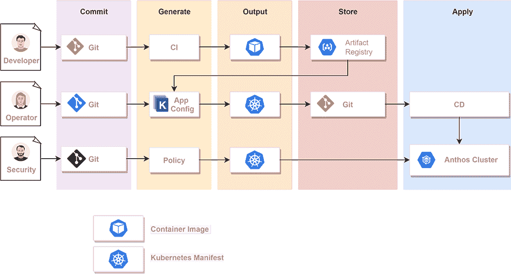

图 12.1 CI/CD 工作流程

在本章中，我们将专注于前两个角色。如果您想了解更多关于安全角色的信息，请参阅第十三章。

观察开发者的工作流程，我们看到他们开发应用程序代码，并希望立即看到应用程序的预览。然后，如果他们完成了他们的更改，他们会将代码提交到源代码仓库。这就是 CI 开始介入进行代码审查、测试和容器镜像构建的地方。

当我们考虑运维人员时，我们看到他们负责配置 Kubernetes 基础设施和部署应用程序。他们需要能够为多个环境配置应用程序，包括开发、测试和生产。一旦配置就绪，就可以使用 CD 工具部署应用程序。

现在我们已经了解了用例，让我们从 CI/CD 概念的简要介绍开始。

## 12.1 CI/CD 简介

现代软件开发流程复杂。以一致的速度和可持续的方式生产高质量的软件涉及多个流程和工具。实施 CI/CD 管道是达到这一目标的最佳实践之一。*持续集成 (CI)* 是软件开发的一种实践，其中开发者频繁地检查代码，定期（至少每天一次）集成，每次集成后都进行验证，这是一个自动化的过程，用于构建和测试集成更改 ([`mng.bz/aMpz`](http://mng.bz/aMpz))。这个过程使我们能够以恒定的速度和适当的水平实现可靠、可重复和可重用的构建，同时防止混乱并提高效率。

持续集成只是软件交付过程的一个方面。为了成功实现以管道驱动的开发，CI 必须由持续交付（CD）紧随其后。*持续交付（CD）* ([`continuousdelivery.com/`](https://continuousdelivery.com/)) 是以可持续的方式安全且快速地将所有类型的更改（包括新功能、配置更改、错误修复和实验）引入生产的能力。它适用于基础设施配置、应用程序部署、移动应用发布以及数据库和静态资源修改。CD 管道通过使此过程更加自动化，从而提高了从源到生产的软件交付，改善了管道的可靠性、可预测性和可见性，从而降低了风险。¹

让我们来看看一些表征现代 CI/CD 平台的特征。

### 12.1.1 可重复性

可重复性允许对创建的代码和工件周围的要求和流程进行自动化。构建过程应该是确定性的，这样开发者才能对产生的工件有信心。可重复的构建和测试允许开发者在其本地环境中运行相同的流程。部署和配置管理的自动化有助于在不同环境中提供一致性。

### 12.1.2 可靠性

可靠性提高了开发和运营团队对保证工具可用性和适宜性、集成、测试和操作要求的完整性和充分性的流程和系统的信心。通过定义的工作流程进行自动化测试是捕捉和跟踪组件最终成功和失败状态的关键，这增加了团队在开发和发布周期中的信心和知识。

### 12.1.3 可复用性

可复用性使团队能够扩展、简化并加速开发工作流程。CI/CD 管道应该以允许为类似应用程序重用管道组件的方式进行实施。这不仅降低了设置新管道的成本，而且当跨企业处理多个应用程序时，也提高了开发者的效率。

### 12.1.4 自动化测试

在高质量交付过程中，验证开发系统的架构和功能至关重要。这可以通过在 CD 管道中实施一个强大的自动化测试流程作为其组成部分来实现。现代交付管道应该尽可能多地包含自动化测试，包括单元、组件和系统功能测试，以及检查能力、可用性和安全合规性的非功能性测试。自动化测试几乎立即为开发者提供反馈，减少了生产部署中的错误数量和错误率。

### 12.1.5 基于主干开发

当开发者工作在“分裂大脑”环境中时，持续交付可能会显著减慢，在这种环境中，功能或错误修复代码分支的寿命非常长。结果，在大团队中，代码更改在集成长期存活分支时可能会引起冲突。这可能需要手动活动，使 CI 流程陷入停滞。

### 12.1.6 环境一致性

环境一致性是降低生产部署风险的关键方面之一。开发环境和生产环境的部署必须依赖于相同的流程、架构原则和配置策略。完全自动化的部署对于在 CD 管道中实现自动化测试和反馈至关重要。它允许根据存储在版本控制系统中的代码和数据轻松地复制整个环境的状态。

### 12.1.7 部署自动化

重要的是要承认，部署自动化可能是一个需要分步骤实现的旅程。你应该从易于自动化的组件开始，减少手动步骤的数量，并逐步自动化更复杂的组件。在考虑部署自动化和测试时，一个因素起着重要作用：架构。如果我们架构引入了重大的限制并且是一个紧密耦合的设计，那么用于 CD 的最佳流程和工具将无法帮助我们。

### 12.1.8 团队文化

运营和开发团队之间的全面合作对于自动化构建、测试、部署和基础设施至关重要。这确保了所有相关方都完全理解整个过程，并且不会引入不必要的复杂性。这不是一个容易的过程，通常需要花费大量时间一起重新设计现有流程的架构。

### 12.1.9 内置安全/DevSecOps

预防胜于治疗。这一点同样适用于软件交付和安全相关的挑战。在软件交付过程中缩短团队的反馈循环被称为“左移策略”。同样的方法用于在开发过程早期以及整个持续交付流程中引入安全流程。这种方法使团队能够构建基于预先批准、标准化的工具和政策（[`mng.bz/gJKl`](http://mng.bz/gJKl)）的开发栈。这些工具帮助团队将其常规的开发和交付活动中的安全需求作为一部分来处理。标准化使得额外的测试能力成为可能，其中自动化测试可以扩展以满足生产环境中的安全和监管要求。与自动化部署一样，安全措施的自动化可以分步骤实施，随着时间的推移减少对人工审查和测试的需求。因此，开发者不再需要关心这些。

### 12.1.10 版本控制

版本控制必须应用于我们交付和集成管道的每个工件，从应用程序代码、配置和系统配置开始，到用于自动化构建和配置环境的脚本结束。它通过“代码即配置”环境的可审计性或可伸缩性支持开发者在应用程序开发期间。它还响应对即时更改或由系统或环境中发现的漏洞或缺陷引起的生产中的灾难的需求，允许它们以可控的方式发布，并提供了自动回滚的简单方法。

维护一个小型版本控制系统相当简单，但当团队规模扩大时，代码的可维护性变得越来越具有挑战性。在这种情况下，允许所有团队成员轻松访问代码至关重要。因此，他们将重用现有代码而不是创建重复的副本，并扩展代码以实现新的功能或修复全局错误。版本控制通过团队之间轻松传递知识来促进快速软件交付。这导致代码质量更高，从而提高了可扩展性和可用性。

### 12.1.11 工件版本控制

构建工件需要是无条件重复和不可变的，这样团队才能信任构建系统的完整性。从相同源多次创建工件的系统可能会因为配置漂移而在每个步骤中生成略微不同的工件。管理构建工件及其版本对于防止在多个地方存储同一工件的多个版本非常重要。不可变的版本化工件可以在一个地方提供对历史和引用的全面可见性。这也帮助管理依赖关系并提高重用性。

### 12.1.12 监控

需要强调的最后一个能力是*监控*。理解和监控系统的健康状况对于在问题发生之前减轻潜在问题至关重要。基于阈值或变化率的主动故障通知构建了关于系统状态的运营知识。通过日志记录和监控扩展，将故障警报路由到团队或系统为及时对这些事件做出反应提供了机会，并防止了中断和停机。

*全栈监控*允许支持团队调试系统并测量其行为与定义的模式或变化。*历史监控数据*使我们能够快速引入持续改进，从而提高了 CI/CD 管道的效率。

## 12.2 持续交付与持续部署的比较

我们讨论了很多关于持续交付的内容，它通常与持续部署混合使用。尽管它们都隐藏在相同的 CD 缩写后面，但这两个概念之间存在细微的差别。持续部署通过添加自动部署交付的工件到用户环境，而不需要人工干预，从而扩展了持续交付。尽管持续交付适用于所有类型的软件，包括商业应用程序、移动应用程序和固件，但持续部署主要适用于代码变更可以立即应用到生产的情况。

在我们熟悉了 CI/CD 的概念和能力之后，我们现在可以进入实施选项、实践和工具的详细描述。

## 12.3 持续开发

开发云原生应用程序非常令人兴奋，但也带来了一些挑战。图 12.2 显示了开发者需要遵循的流程，以预览 Kubernetes 应用程序。

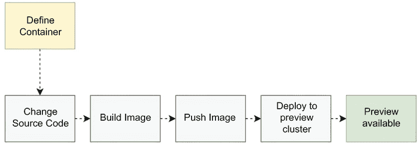

图 12.2 持续开发工作流程

正如我们所见，一旦代码开发完成，就需要按照预定义的步骤构建镜像并将其推送到容器注册库。接下来，应用程序需要部署到目标集群。这意味着对于开发者提交的每一个变更，都会触发相同的流程。想象一下，整整一天都在运行多个命令，只是为了预览你的应用程序！这正在成为开发者的噩梦。

在本节中，我们将探讨一些工具，这些工具将允许我们在不需要运行 Anthos 集群的情况下本地部署 Anthos 应用程序，并自动化我们确定的整个流程。

让我们从基于 minikube 设置我们的本地执行环境开始。接下来，我们将探讨如何自动化在代码变更后预览应用程序所需的重复性和繁重任务。最后，我们将讨论如何使用集成开发环境（IDE）提供完整的 Anthos 应用程序开发体验（DX）。

### 12.3.1 设置本地预览 minikube 集群

minikube ([`minikube.sigs.k8s.io/docs/start/`](https://minikube.sigs.k8s.io/docs/start/)) 是一款流行的软件应用程序，允许你在笔记本电脑上本地运行 Kubernetes 应用程序。它支持 Windows、Linux 和 macOS。你不必将应用程序部署到 Anthos 集群，而是可以本地部署并预览应用程序，然后再将代码推送到 Git 仓库。这将节省你的时间并降低开发环境成本。尽管 minikube 不是为托管生产工作负载而设计的，但它支持 Kubernetes 支持的大多数功能。

你可以使用 kubectl 命令行界面与之交互，就像与常规集群一样。Minikube 可以在满足以下最低要求的任何笔记本电脑上运行：

+   2 个 CPU

+   2 GB 的空闲内存

+   20 GB 的空闲磁盘空间

+   互联网连接

+   虚拟化软件，如 Virtual Box

图 12.3 显示了你可以用来与 minikube 交互的工具。我们将在本章的后续部分回顾 Skaffold 和 Cloud Code。它们为开发 Anthos 集群提供了一个很好的替代方案。

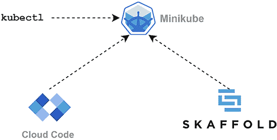

图 12.3 minikube 集成

安装过程相当简单，但取决于你使用的操作系统。这可能会随着新版本发布而改变，因此建议你参考[`minikube.sigs.k8s.io/docs/start/`](https://minikube.sigs.k8s.io/docs/start/)上的官方页面以获取安装步骤。让我们看看我们如何使用 minikube 部署我们的示例应用程序。

一旦 minikube 成功安装，你可以通过运行以下命令来启动它：

```
minikube start
```

现在，你可以创建一个简单的 hello-minikube Deployment，并使用 NodePort 服务将其公开。我们将使用一个现有的容器镜像，echoserver:1.4，但你也可以构建自己的镜像：

1.  通过运行以下命令创建 Deployment：

    ```
    kubectl create deployment hello-minikube --image=k8s.gcr.io/echoserver:1.4
    ```

1.  通过创建服务来公开 Deployment：

    ```
    kubectl expose deployment hello-minikube --type=NodePort --port=8080
    ```

1.  检查服务是否存在：

    ```
    kubectl get services hello-minikube
    ```

1.  你应该看到以下提示：

    ```
    NAME             TYPE       CLUSTER-IP     EXTERNAL-IP   PORT(S)          AGE
    hello-minikube   NodePort   10.102.94.116  <none>        8080:31029/TCP   8s
    ```

1.  为服务配置端口转发到你的本地机器端口：

    ```
    kubectl port-forward service/hello-minikube 8080:8080
    ```

    将出现以下提示，指示端口已转发：

    ```
    Forwarding from 127.0.0.1:8080 -> 8080
    Forwarding from [::1]:8080 -> 8080
    ```

1.  现在，我们可以打开浏览器并看到服务正在地址 http:/ /localhost:8080 上响应，如图 12.4 所示。

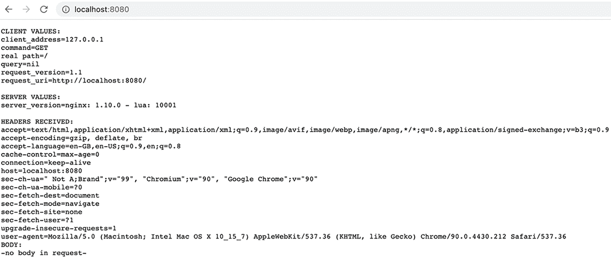

图 12.4 浏览器结果页面

我们已经看到了如何预览我们的应用程序。正如你可能已经注意到的，它仍然需要我们构建镜像并使用 kubectl 更新应用程序的预览，随后是代码的更改。这个过程并不高效，理想情况下，我们需要一个工具来自动化这些步骤。实现这一目标的常用工具是 Skaffold。

### 12.3.2 使用 Skaffold 进行持续开发

Skaffold([`skaffold.dev/`](https://skaffold.dev/))是一个由 Google 赞助的开源项目。它始于解决 Kubernetes 应用程序持续开发的需求。正如我们在上一节中学到的，为了部署应用程序，开发者必须编写创建容器镜像、将创建的镜像推送到仓库以及最终将其部署到集群的必要步骤。

Skaffold 通过自动处理所有这些步骤来实现这一点。它持续监视源文件，并触发之前提到的步骤，在本地 minikube 或远程 Anthos 集群上创建 Kubernetes 应用程序的预览。当开发者通过简单地按 Ctrl+C 停止 Skaffold 时，应用程序资源会自动清理。

在持续开发功能的基础上，Skaffold 还提供了 CI/CD 管道的构建块。它支持使用 kubectl、Helm([`helm.sh/`](https://helm.sh/))和 Kustomize([`kustomize.io/`](https://kustomize.io/))进行部署。让我们看看图 12.5，它可视化了一个使用 Skaffold 进行开发的流程。

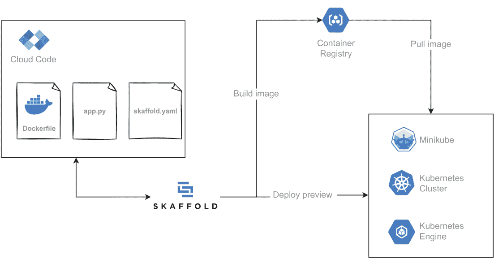

图 12.5 Skaffold 功能

在这个图中，你可以看到一个简单的管道可视化。Skaffold 正在监视指定文件夹中的源文件更改。当它检测到更改时，Skaffold 会自动构建镜像并将它们推送到注册表。一旦容器构建完成，Skaffold 会将容器镜像部署到预定义的 Kubernetes 端点。在接下来的部分中，我们将解释 Skaffold 如何与 Cloud Code ([`cloud.google.com/code`](https://cloud.google.com/code)) 集成，以提供更好的开发者体验。

使用 Skaffold

用户通过命令行界面（CLI）与 Skaffold 交互。Skaffold 的完整指南可以在这里找到：[`skaffold.dev/docs/references/cli/`](https://skaffold.dev/docs/references/cli/)。为了快速了解如何使用 Skaffold，让我们看看基本步骤。我们将看到如何部署用 Go 编写的 Hello World 应用程序。

安装 Skaffold

安装 Skaffold 的过程因底层操作系统而异。Skaffold 可以作为 gcloud 组件安装。它也可以作为容器镜像 gcr.io/k8s-skaffold/skaffold:latest 提供，可以直接在云原生 CI/CD 工具中使用。所有安装选项都在官方网站上解释 ([`skaffold.dev/docs/install/`](https://skaffold.dev/docs/install/))。对于本地预览，你可以使用 minikube，这将允许你在笔记本电脑上部署你的应用程序。

Skaffold 配置文件

Skaffold 使用单个配置 YAML 文件 skaffold.yaml 来定义 CD 管道中的步骤。它类似于 Kubernetes 资源清单。让我们在这里看看一个非常基本的示例配置文件：

```
apiVersion: skaffold/v2beta8
kind: Config
build:
  artifacts:
  - image: skaffold-example
deploy:
  kubectl:
    manifests:
      - k8s-*
```

在之前的管道中定义了两个阶段：构建和部署。在构建阶段，Skaffold 寻找 Dockerfile 定义，并使用它来构建名为 skaffold-example 的容器镜像。在部署阶段，Skaffold 使用 kubectl 部署所有以 k8s-前缀开始的 YAML 文件中定义的对象。配置文件结构的详细解释可以在 Skaffold 网站上找到 ([`skaffold.dev/docs/references/yaml/`](https://skaffold.dev/docs/references/yaml/))。

启动 Skaffold

你可以通过运行以下命令自动生成 skaffold.yaml 配置：

```
skaffold init 
```

这将检测当前文件夹中的源文件，并创建一个包含构建和部署部分的非常简单的配置文件。让我们创建以下三个文件，如下面的代码片段所示：

+   *Dockerfile*—容器镜像定义

+   *main.go*—简单的 Hello World Go 应用程序

+   *k8s-pod.yaml*—Kubernetes pod 定义

Dockerfile 内容：

```
FROM golang:1.12.9-alpine3.10 as builder
COPY main.go .
ARG SKAFFOLD_GO_GCFLAGS
RUN go build -x -gcflags="${SKAFFOLD_GO_GCFLAGS}" -o /app main.go
FROM alpine:3.10
runtime
ENV GOTRACEBACK=single
CMD ["./app"]
COPY --from=builder /app .
Main.go content: 
package main
import (
  "fmt"
  "time"
)

func main() {
  for {
    fmt.Println("Hello world!")
    time.Sleep(time.Second * 1)
  }
}
k8s-pod.yaml content:
apiVersion: v1
kind: Pod
metadata:
  name: getting-started
spec:
  containers:
  - name: getting-started
    image: skaffold-example 
```

这将生成一个 skaffold.yaml 文件，我们已经在上一节中看到了，包含两个阶段：

```
apiVersion: skaffold/v2beta3
kind: Config
metadata:
  name: getting-started
build:
  artifacts:
  - image: skaffold-example
deploy:
  kubectl:
    manifests:
    - k8s-pod.yaml
```

你可以从这里开始，根据你的需要扩展文件，使用 Skaffold 文档。

使用 Skaffold 进行开发

最终我们在文件夹中有四个文件，包括 Skaffold 配置文件。现在我们可以开始持续开发，其中 Skaffold 将监视源文件夹中的更改并执行 skaffold.yaml 文件中定义的所有步骤。要开始开发，请运行以下命令：

```
skaffold dev
```

Skaffold 将自动将部署容器的日志从控制台输出。现在如果您将源文件 main.go 中的内容改为从 Skaffold 打印 hello 而不是 hello world，Skaffold 将自动检测更改，重新构建镜像，将其推送到注册表，并部署它。由于日志输出到控制台，您应该看到来自 Skaffold 的消息 hello。

使用 Skaffold 单次运行

虽然 skaffold dev 一直在监视源文件，但您也可以通过运行 skaffold run 命令来执行单个工作流程。当您只想运行一次执行而不希望每次代码修改时都触发流程时，这很有用。

支持的功能

到现在为止，您应该已经基本了解了如何使用 Skaffold 开始开发，那么让我们看看其他有用的功能。

流程阶段

到目前为止，我们只看了 Skaffold 的基本功能。然而，这个工具还有更多能力可以解决高级流程阶段。例如，开发者可能不希望在每次代码更改后都重新构建镜像。在这种情况下，Skaffold 可以将文件同步到容器的主.go 源文件中。要实现这一点，您将使用文件同步功能。图 12.6 显示了工作流程中的所有步骤。

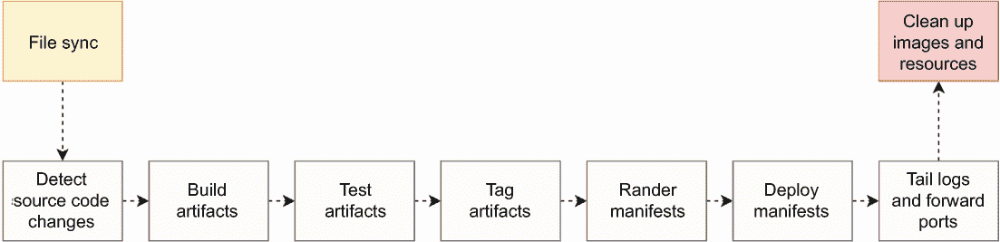

图 12.6 Skaffold 工作流程

以下列表显示了所有可以用来执行这些步骤的 Skaffold 流程阶段：

+   *初始化*—生成基本的 Skaffold 配置

+   *构建*—使用选择的构建器构建镜像

+   *测试*—使用结构测试测试镜像²

+   *标记*—根据不同的策略标记镜像

+   *部署*—使用 kubectl、Kustomize 或 Helm 部署应用程序

+   *文件同步*—将更改的文件直接同步到运行中的容器

+   *日志输出*—输出容器的日志

+   *端口转发*—将服务端口转发到本地主机

+   *清理*—清理清单和镜像

如您所见，我们有一个完整的流程，使我们能够部署和预览 Anthos 应用程序。

支持的环境

Skaffold 支持本地和远程 Kubernetes 集群。您可以使用本地开发集群，如 minikube 或在远程位置部署的 Anthos/Kubernetes 集群。

要连接到远程 Kubernetes 集群，您需要在 kubeconfig 文件中设置一个上下文，就像连接到任何 Kubernetes 集群一样。默认上下文可以通过运行以下命令来覆盖：

```
skaffold dev --kube-context <myrepo>
```

或者通过更新 skaffold.yaml 文件中的 deploy.kubeContext 属性：

```
deploy:
  kubeContext: minikube
```

支持的构建工具

如果您需要使用其他工具来构建容器镜像，可以在 skaffold.yaml 配置文件的构建部分配置自定义构建器。要使用自定义构建器，请在构建部分定义适当的选项以使用该构建器。有关客户构建器的详细信息，请参阅 [`mng.bz/pdvG`](http://mng.bz/pdvG)。以下工具目前受到支持：

+   Docker

+   Jib ([`mng.bz/Oprn`](http://mng.bz/Oprn))

+   Bazel ([`mng.bz/Y64N`](http://mng.bz/Y64N))

+   Buildpacks ([`mng.bz/GRAq`](http://mng.bz/GRAq))

您还可以使用与 Skaffold 定义的规范一致的定制脚本。

在 CI/CD 管道中使用 Skaffold

您还可以将 Skaffold 作为 CI/CD 管道中的工具使用。现有的社区维护的构建器 ([`mng.bz/zmOa`](http://mng.bz/zmOa)) 可以直接与 Cloud Build 一起使用，Cloud Build 是 Google Cloud 的原生 CI 工具（我们将在下一节中详细探讨它）。以下是一些在 CI/CD 工作流程中最有用的 Skaffold 命令：

+   skaffold build—构建和标记您的镜像（们）

+   skaffold deploy—部署给定的镜像（们）

+   skaffold delete—清理已部署的工件

+   skaffold render—构建和标记镜像，并输出模板化的 Kubernetes 清单

Skaffold 概述

在本节中，我们学习了如何安装 Skaffold 并将其用于持续开发工作流程。有关使用 Skaffold 与开发工作流程的更多信息，请参考 Skaffold 快速入门指南 [`skaffold.dev/docs/quickstart/`](https://skaffold.dev/docs/quickstart/)。

### 12.3.3 云代码：使用本地 IDE 进行开发

我们已经学习了如何预览 Anthos 应用程序，但现在让我们看看如何提升这一体验。迄今为止尚未解决的问题之一是维护开发环境的配置。开发者希望在他们的首选 IDE 中开发应用程序。Cloud Code 通过集成已知的工具集来提高开发者体验，提供应用程序的容器化和部署，包括以下内容：

+   kubectl

+   Skaffold

+   Google Cloud SDK (gcloud)

Cloud Code 是 Visual Studio Code ([`code.visualstudio.com/`](https://code.visualstudio.com/)) 和 IntelliJ ([`www.jetbrains.com/idea/`](https://www.jetbrains.com/idea/)) 等 IDE 的插件。它与 minikube 和 Kubernetes 集群（包括 Anthos 集群）集成。它包含 Google Cloud 平台 API 探索器和 Kubernetes 对象探索器。您可以直接从 IDE 中查看您的 Kubernetes 资源，而无需运行任何 kubectl 命令。

图 12.7 和 12.8 展示了可以运行和调试 Anthos 应用程序（包括 Kubernetes 和 Cloud Run）的预构建应用程序模板集合。第一个图允许您生成部署简单应用程序所需的所有文件。第二个图自动检测源文件的变化，构建容器镜像，并将应用程序部署到所选的 Kubernetes 端点。所有这些任务都是由 Skaffold 部署的。

图 12.7 还显示了 Anthos/Kubernetes 应用程序的流程，这与 Skaffold 流程非常相似。不同之处在于，开发者使用 IDE 来执行这些步骤。

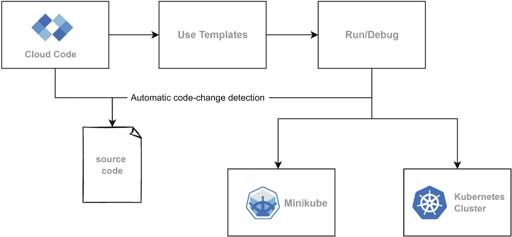

图 12.7 使用 Cloud Code 运行和调试 Kubernetes 应用程序

如图 12.8 所示，Cloud Code 通过基于 minikube 设置模拟器来帮助我们。它在本地上运行，并允许开发者运行和测试 Cloud Run 应用程序。还可以将应用程序部署到 GCP 管理的服务，如 Cloud Run 或 Cloud Run for Anthos。

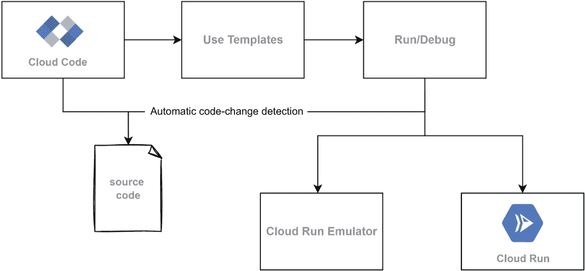

图 12.8 使用 Cloud Code 运行和调试 Cloud Run 应用程序

对于这两种选项，您可以通过在代码中设置断点来调试在本地和远程端点运行的代码。在下一节中，您将开始使用 Cloud Code 开发我们的 Hello World Anthos 应用程序。

使用 Cloud Code 开始开发

您可以使用为 Kubernetes 和 Knative (Cloud Run) 应用程序预构建的模板来启动您应用程序的开发。这包括简单单服务应用程序和多种语言的复杂多服务应用程序。

让我们看看如何使用 Cloud Code 开始开发。这次我们将使用以下步骤在 Visual Studio Code 中工作一个示例 Python Hello World 应用程序：

1.  首先从 Visual Studio Code 市场安装 Cloud Code。

1.  打开 Visual Studio Code。

1.  在主窗口底部蓝色栏中找到并点击</> Cloud Code，如图 12.9 所示。

    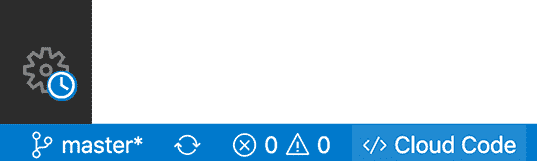

    图 12.9 Visual Studio Code：启动新应用程序

1.  从屏幕顶部的下拉列表中选择“新建应用程序”选项，如图 12.10*.* 注意：这也是以下其他操作的起点：

    +   在 Kubernetes 上运行应用程序

    +   在 Kubernetes 上调试应用程序

    +   在 Cloud Run 模拟器上运行应用程序

    +   在 Cloud Run 模拟器上调试应用程序

    +   将应用程序部署到 Cloud Run

    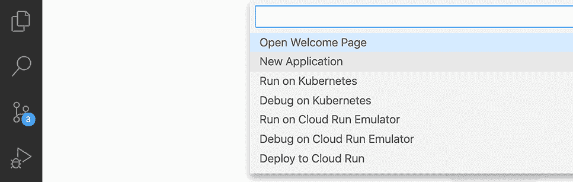

    图 12.10 Cloud Code 新应用程序

1.  现在选择 Kubernetes 应用程序，如图 12.11 所示。

    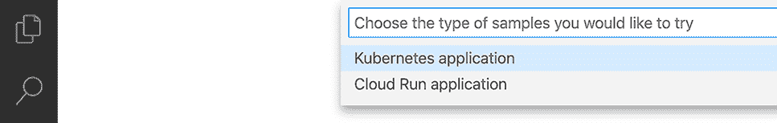

    图 12.11 Cloud Code Kubernetes 应用程序

1.  为了简单起见，我们将使用如图 12.12 所示的 Python (Flask) Hello World 应用程序。

    

    图 12.12 Cloud Code Python (Flask)：Hello World

1.  等待几秒钟，让 Cloud Code 拉取所有文件模板，包括 vscode 配置文件、Kubernetes 清单、源代码和 Skaffold 配置文件，如图 12.13 所示。

    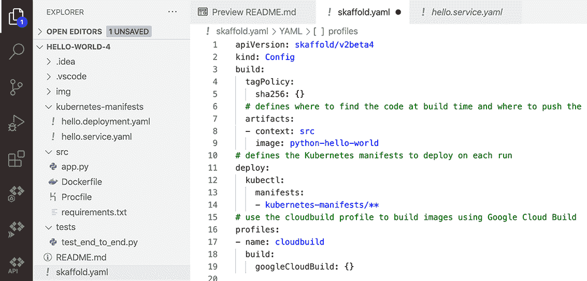

    图 12.13 Cloud Code skaffold.yaml

1.  当所有文件准备就绪后，您可以通过再次点击*Cloud Code*并从下拉菜单中选择*在 Kubernetes 上运行*来运行应用程序，如图 12.14 所示。

    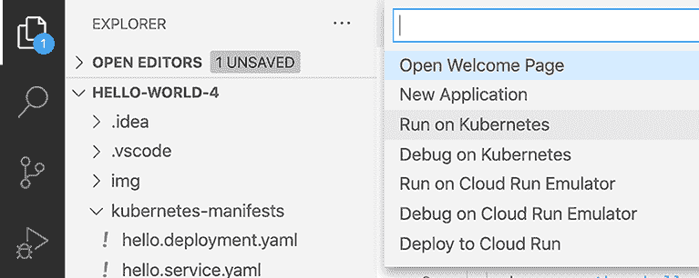

    图 12.14 Cloud Code 在 Kubernetes 上运行的选项

1.  Cloud Code 会询问您是否想使用默认上下文。在这种情况下，它指向 minikube。通过“是”确认或选择不同的上下文以部署到不同的集群，如图 12.15 所示。

    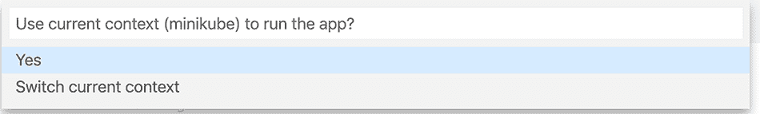

    图 12.15 云代码：将上下文设置为 minikube

1.  在控制台中，您应该看到图 12.16 所示的输出，包括访问应用程序的 URL。

    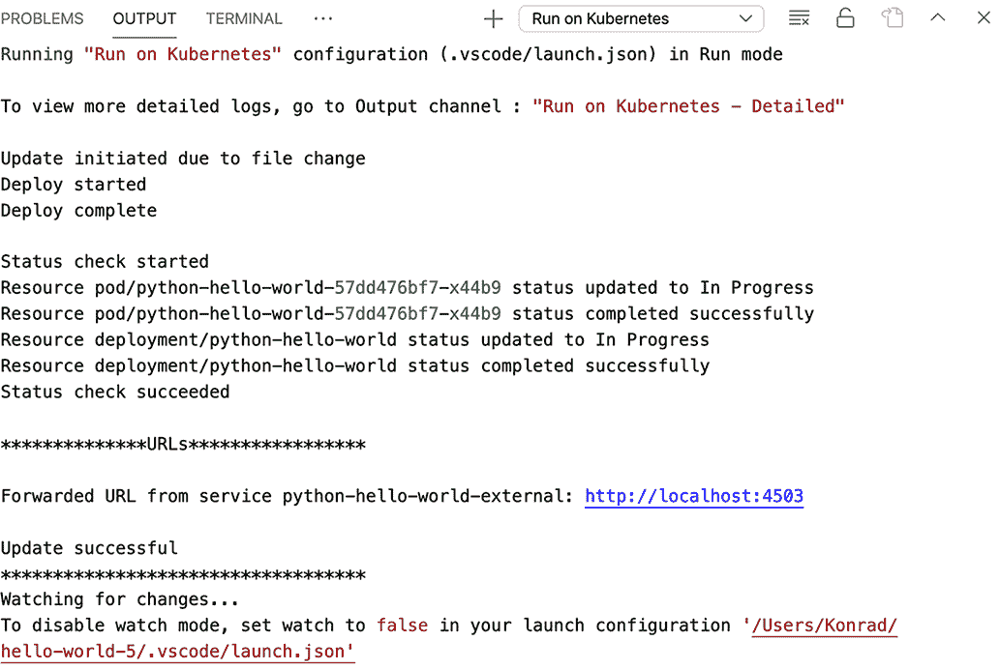

    图 12.16 云代码控制台输出

1.  如果您访问 URL，您将看到应用程序正在运行，如图 12.17 所示。

    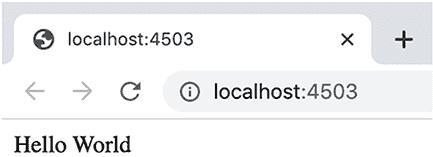

    图 12.17 Cloud Code 应用程序输出

1.  现在您可以对源代码进行一些小的修改。在 app.py 文件中，找到图 12.18 所示的“Hello World”消息。

    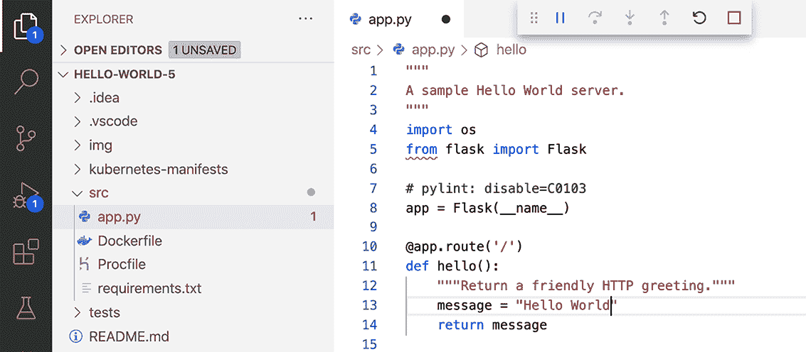

    图 12.18 云代码：浏览 app.yaml。

1.  将消息更改为“Hello Anthos”并保存文件，如图 12.19 所示。

    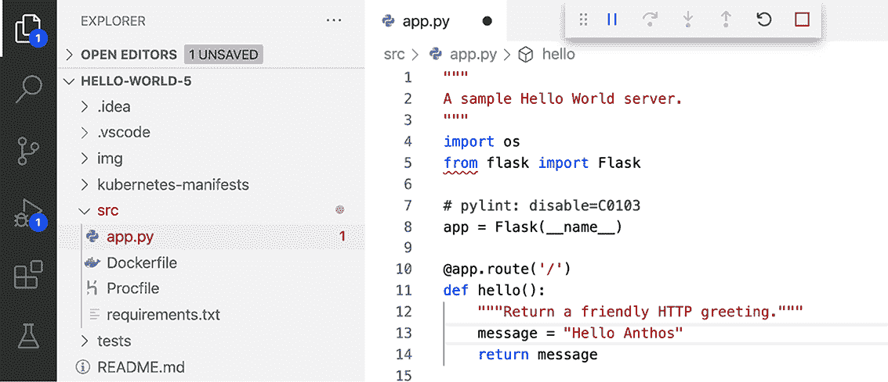

    图 12.19 云代码：将消息更改为“Hello Anthos。”

1.  您会注意到，如图 12.20 所示，Cloud Code 已检测到更改并将应用程序部署到 minikube。

    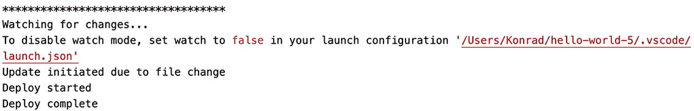

    图 12.20 Cloud Code：代码更改检测

1.  现在我们访问应用程序时，会看到一个新消息，如图 12.21 所示。

    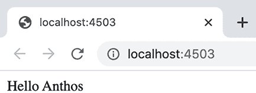

    图 12.21 云代码：应用程序输出

任何对源代码的更改都将自动检测。请注意，您可以使用屏幕顶部的控制栏暂停或停止应用程序，如图 12.22 所示。


图 12.22 Cloud Code：持续开发菜单

您已成功创建了 Kubernetes Hello World 应用程序的预览。现在您可以尝试更复杂的应用程序示例。

如您在步骤 4 中的下拉菜单中看到的，您还可以创建和部署应用程序到 Cloud Run。您还可以通过在源代码中设置断点来调试您的应用程序。遵循如何指南，查看如何一步步操作的详细教程，请访问[`mng.bz/0yex`](http://mng.bz/0yex)。

Cloud Code 总结

Cloud Code 是一个工具，它不仅无缝集成到 GCP，还使您的 Anthos 应用程序的开发、容器化和预览变得简单。它将之前讨论过的 Skaffold 功能捆绑到您的 IDE 中，以自动化持续开发工作流程。

预览 Kubernetes 应用程序需要执行多个步骤，例如每次您对代码进行更改时，都需要构建容器镜像并将其部署到预览环境。使用 Cloud Code，您可以专注于源代码，让 Cloud Code 集成处理所有这些步骤。在本节中，我们使用了现有的模板来展示设置的样子。您可以从那里开始开发自己的 Anthos 应用程序，Cloud Code 将确保预览为您更新。

### 12.3.4 Anthos 开发者沙盒：使用云原生 IDE 进行开发

Anthos 开发者沙盒是开发者免费工具，让您体验在 Anthos 上开发的感觉。它允许执行上一节中描述的相同任务，但使用 Google Cloud Shell 而不是本地。它由以下组件组成：

+   *云壳* —一个预装了 Google Cloud Platform 最佳工具的计算环境

+   *云代码*—我们之前见过的 IDE 插件

+   *Minikube*—一个单节点 Kubernetes 集群，我们之前已经讨论过

+   *云构建本地构建器*—在云壳中本地运行持续集成

您不需要进行任何前置配置即可使用 Anthos 开发者沙盒。您可以通过[`mng.bz/KlrK`](http://mng.bz/KlrK)访问它并开始开发您的第一个 Anthos 应用程序。最重要的是，它对任何拥有 Google 账户的人免费提供。使用 Anthos 开发者沙盒，您可以执行以下日常开发任务：

+   在模拟的 Anthos 集群或 Cloud Run 模拟器上本地运行应用程序

+   使用云构建进行本地测试

+   在开发过程中迭代您的应用程序，并自动进行实时更新

+   使用构建包创建您的镜像

如果您刚开始开发 Anthos 应用程序，使用沙盒可以帮助您启动开发之旅，因为它提供了可以直接从界面访问的教程。

从 Anthos 开发者沙盒开始

让我们快速查看该工具的下一步操作：

1.  通过在浏览器中打开我们之前提到的链接来访问工具。您将被告知 Anthos 开发者沙盒将被克隆，如图 12.23 所示。

    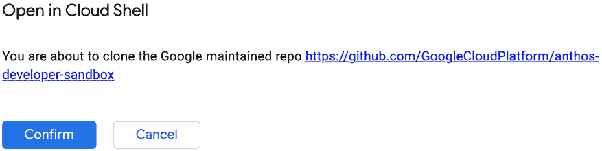

    图 12.23 Anthos 开发者沙盒：欢迎屏幕

1.  点击确认并等待环境设置完成。您可以看到为您配置的所有组件，如图 12.24 所示。

    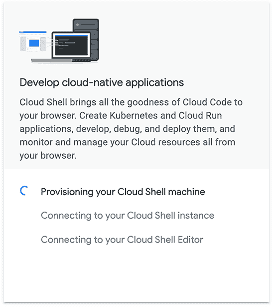

    图 12.24 Anthos 开发者沙盒：环境准备

1.  一旦完成，您应该会看到 IDE 已加载，工作区已准备好，并克隆了仓库，如图 12.25 所示。在右侧面板中，您可以查看教程。

    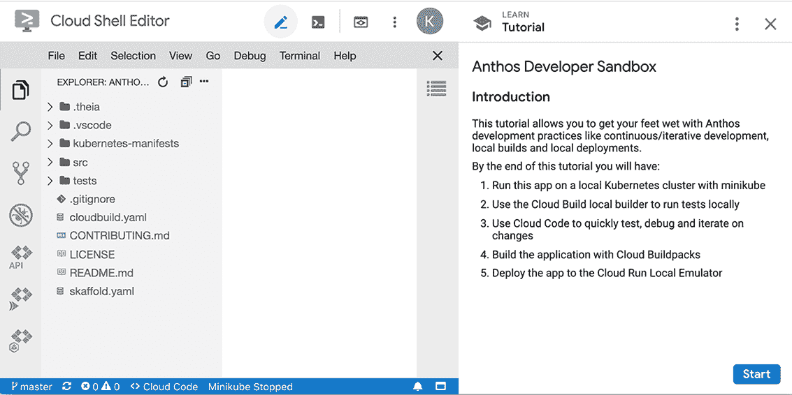

    图 12.25 Anthos 开发者沙盒：主屏幕

1.  点击“开始”以开始教程。它将引导您完成与 Cloud Code 相同的流程。

正如您所看到的，您只需点击几下即可在 Anthos 上开始持续开发，无需特殊配置。

## 12.4 持续集成

在本节中，我们将探讨持续集成。我们将首先介绍 GCP 原生工具，然后查看第三方替代方案。为了为您的 Anthos 应用程序引入持续集成，您需要以下组件：

+   Git 源代码仓库

+   容器注册库

+   CI 服务器

首先，让我们创建一个 Git 仓库，用于存储和版本控制 Anthos 应用程序代码。

### 12.4.1 Cloud Source Repositories

Cloud Source Repositories ([`cloud.google.com/source-repositories`](https://cloud.google.com/source-repositories)) 是功能齐全的私有 Git 仓库，托管在 Google Cloud 上。该服务帮助开发者私下托管、跟踪和管理 Google Cloud Platform 上大型代码库的更改。它旨在轻松集成 GCP 服务，如 Anthos、GKE、Cloud Run、App Engine 和 Cloud Functions，如图 12.26 所示。您可以配置无限数量的仓库，还可以镜像 Bitbucket 和 GitHub 仓库。Cloud Source Repositories 中的更改会受到监控，并可以触发事件通知到 Cloud Pub/Sub 或 Cloud Function。Code Source Repositories 的一个不同之处在于，您可以使用正则表达式在您的仓库中搜索短语 ([`mng.bz/91jl`](http://mng.bz/91jl))。Cloud Source Repository 的审计日志可在 Cloud Operations 中查看，因此您始终知道谁访问了您的仓库，以及何时访问。

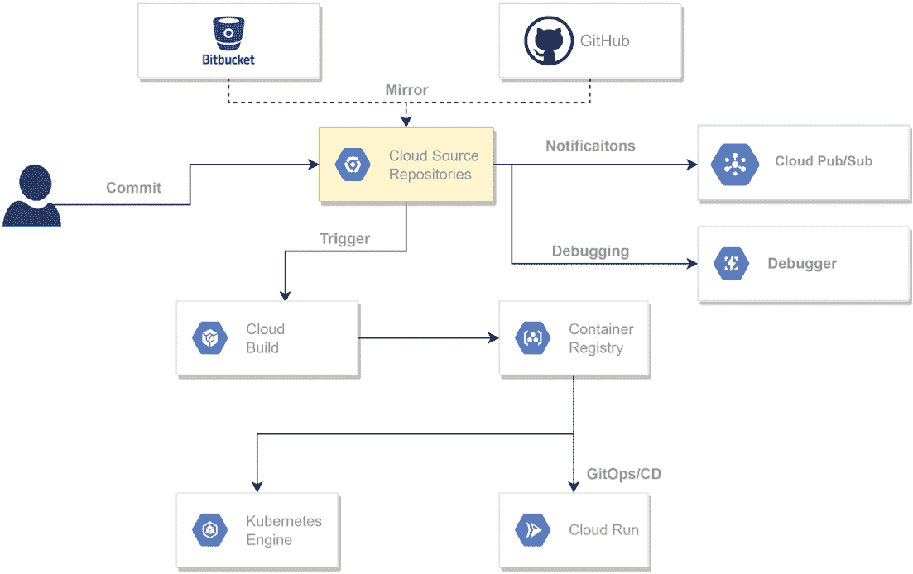

图 12.26 Cloud Source Repositories 集成

如您在图 12.26 中所见，Cloud Run 的集成特别有趣。您可以使用 Cloud Source Repositories 和 Cloud Build 的组合来创建 CD 流水线，以便在您的代码仓库中发生代码合并时自动触发应用程序的部署流水线。Cloud Run 通过在幕后处理您的流量整形（蓝绿、金丝雀、滚动更新）来使操作更加流畅。有关如何配置的详细信息，请参阅第九章。

创建仓库

要开始使用 Cloud Source Repositories，您首先需要通过运行以下命令来创建仓库：

```
gcloud init
```

下一个片段将初始化您的 gcloud 命令行工具：

```
gcloud source repos create [REPO_NAME]
```

这将创建一个名为 REPO_NAME 的仓库。

现在仓库已经准备好使用，您需要选择以下三种认证方法之一：

+   SSH

+   Cloud SDK

+   手动生成的凭证

有关如何操作的逐步指南，请参阅以下链接：[`mng.bz/jmWx`](http://mng.bz/jmWx)。

一旦设置好存储库并成功认证，您就可以使用 git clone、git pull 和 git push 等 Git 命令与之交互。

### 12.4.2 艺术品注册库

艺术品注册库是 Google 容器注册库服务的下一代迭代。除了能够存储容器镜像之外，艺术品注册库还可以存储其他包，如 Maven ([`maven.apache.org/`](https://maven.apache.org/))、npm ([`www.npmjs.com/`](https://www.npmjs.com/)) 和 Python，未来还将提供更多功能。这些服务完全集成在 Google Cloud Platform 生态系统之中，因此您可以使用 IAM 策略控制对您的艺术品的访问，访问 Cloud Source Repositories，使用 Cloud Build 触发自动构建，并将应用程序部署到 Google Kubernetes Engine、App Engine 和 Cloud Functions。您可以在离您的作业负载最近的地域创建艺术品存储库，以便利用高速的 Google 网络来拉取您的艺术品。

从安全角度来看，您可以扫描容器以查找漏洞，并可以使用二进制授权来批准可以推送到生产的镜像。您可以使用原生工具与艺术品注册库交互，因此它们很容易集成到 CI/CD 管道中。

使用 Docker 与艺术品注册库

让我们看看您如何使用以下程序与艺术品注册库交互以存储容器镜像：

1.  首先创建一个艺术品存储库：

    ```
    gcloud artifacts repositories create quickstart-docker-repo --repository-format=docker \
    --location=us-central1 [--description="Docker repository"]
    ```

1.  您可以通过运行以下命令列出您的存储库：

    ```
    gcloud artifacts repositories list
    ```

1.  在推送镜像之前，您应该对存储库进行认证：

    ```
    gcloud auth configure-docker us-central1-docker.pkg.dev
    ```

1.  现在，出于演示目的，只需从 Docker Hub 拉取官方的 alpine 镜像，而不是构建一个新的镜像：

    ```
    docker pull alpine
    ```

1.  使用存储库名称标记镜像：

    ```
    docker tag alpine us-central1-docker.pkg.dev/PROJECT/quickstart-docker-repo/quickstart-image:tag1
    ```

1.  您最终可以将镜像推送到艺术品注册库：

    ```
    docker push us-central1-docker.pkg.dev/PROJECT/quickstart-docker-repo/quickstart-image:tag1
    ```

现在，您已经准备好从注册库中拉取您的容器镜像。

艺术品注册库总结

在撰写本文时，艺术品注册库已普遍可用，尽管一些功能可能处于预览状态。作为容器注册库的后继者，它最终将成为 GCP 中唯一的容器注册库，因此您所有的新项目都应该已经使用艺术品注册库。有关如何将现有项目过渡到艺术品注册库的逐步教程，请在此处找到：[`mng.bz/WAn0`](http://mng.bz/WAn0)。

### 12.4.3 Cloud Build

我们已经看到如何对 Anthos 应用程序代码进行版本控制和构建容器镜像。现在让我们看看如何创建 CI 管道。

Cloud Build 是一个托管、GCP 原生的 CI/CD 平台，是 GitLab CI/CD、Jenkins 或 CircleCI 等工具的替代品。它允许您在包括 Anthos GKE 和 Cloud Run for Anthos 在内的所有 Google 计算服务上部署、测试和构建您的应用程序。Cloud Build 的管道步骤作为容器运行，如图 12.27 所示。

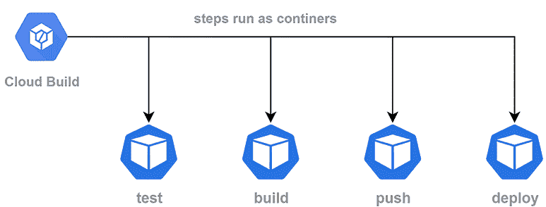

图 12.27 Cloud Build 步骤作为容器运行。

管道步骤在下面提供的简单易懂的 cloudbuild.yaml 文件中定义。这些步骤由 Cloud Build 读取并执行。每个步骤定义了一个作为任务运行的容器。管道中使用的容器是专门为 Cloud Build 构建的，被称为 *云构建器*。我们将在下一节中了解更多关于它们的信息。

```
# cloudbuild.yaml
steps:
# This step runs the unit tests on the app
- name: 'python:3.7-slim'
  id: Test
...
# This step builds the container image.
- name: 'gcr.io/cloud-builders/docker'
  id: Build
...
# This step pushes the image to a container registry
- name: 'gcr.io/cloud-builders/docker'
  id: Push
... 
# This step deploys the new version of our container image
- name: 'gcr.io/cloud-builders/kubectl'
  id: Deploy
```

Cloud Build 完全无服务器，可以根据负载进行扩展和缩减。您只需为执行时间付费。它不需要您安装任何插件，并且可以支持各种工具，包括自定义云构建器。因为它连接到 GCP 网络，可以通过直接访问存储库、注册库和工作负载来显著减少构建和部署时间。您还可以将 Cloud Build 与 Spinnaker ([`spinnaker.io/`](https://spinnaker.io/)) 等工具结合使用，以执行更复杂的管道，包括各种部署场景。Cloud Build 管道可以通过手动或通过代码存储库的拉取请求来触发。

现在我们已经了解了 Cloud Build 的工作基础，让我们来看看云构建器。

Cloud 构建器

正如我们已经学到的，Cloud Build 在容器中运行一系列在 cloudbuild.yaml 文件中定义的步骤，这些步骤在容器内执行。这些容器使用每个步骤名称属性中定义的容器镜像进行部署。这些容器镜像被称为云构建器，它们是特别打包的镜像，运行特定的工具，如 *Docker、Git 或 kubect*，并附带一系列用户定义的属性。以下列出了三种类型的构建器：

+   Google 支持的构建器

+   社区支持的构建器

+   自定义开发的构建器

让我们看看每种类型。

Google 支持的构建器

您可以在 GitHub 上找到完整的 Google 支持的构建器列表，网址为 [`mng.bz/819P`](http://mng.bz/819P)。所有镜像都可在 gcr.io/cloud-builders/ <构建器名称> 下的容器注册库中找到。以下是在 Anthos 上下文中一些最重要的构建器：

+   docker

+   git

+   gcloud

+   gke-deploy

+   kubectl

社区支持的构建器

如果没有官方构建器符合您的需求，您可以使用社区构建器之一，这些构建器与 Helm、Packer、Skaffold、Terraform 和 Vault 等工具一起提供。社区云构建器的完整列表可以在此找到：[`mng.bz/ElrJ`](http://mng.bz/ElrJ)。

自定义开发的构建器

您可以创建自己的自定义构建器以用于构建。自定义构建器是 Cloud Build 拉取并运行与您的源代码一起的容器镜像。您的自定义构建器可以在容器内执行任何脚本或二进制文件。因此，它可以做任何容器能做的事情。有关创建自定义构建器的说明，请参阅 [`mng.bz/NmrD`](http://mng.bz/NmrD)。

构建容器镜像

您可以使用 Cloud Build 通过配置文件或仅使用 Dockerfile 来构建容器。让我们看看每个选项。

使用配置文件构建容器镜像

构建容器的第一种方法需要您提供 cloudbuild.yaml 配置文件作为输入，如图 12.28 所示。

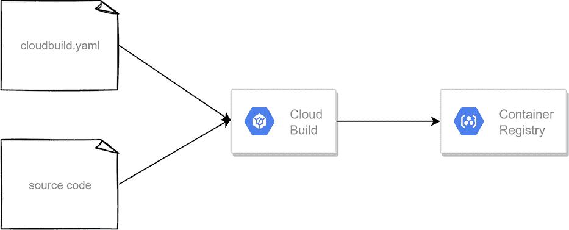

图 12.28 使用 Cloud Build 配置文件构建容器镜像

要从配置文件构建您的镜像，您需要使用以下方式在 cloudbuild.yaml 文件中指定构建步骤，使用 Docker cloud builder：

```
steps:
- name: ‘gcr.io/cloud-builders/docker’
  args: [ ‘build’, ‘-t’, ‘us-central1-docker.pkg.dev/$PROJECT_ID/${_REPOSITORY}/${_IMAGE}’, ‘.’ ]
images:
- ‘us-central1-docker.pkg.dev/$PROJECT_ID/${_REPOSITORY}/${_IMAGE}’
```

接下来，运行以下命令提交构建：

```
gcloud builds submit --config [CONFIG_FILE_PATH] [SOURCE_DIRECTORY]
```

这将构建镜像并将其存储在 Google Artifact Registry 中，如配置文件中所示。如果您没有指定[CONFIG_FILE_PATH]和[SOURCE_DIRECTORY]参数，将使用当前目录。

使用 Dockerfile 构建容器镜像

您可以不使用配置文件创建容器镜像，因为您的 Dockerfile 包含使用 Cloud Build 构建 Docker 镜像所需的所有信息，如图 12.29 所示。

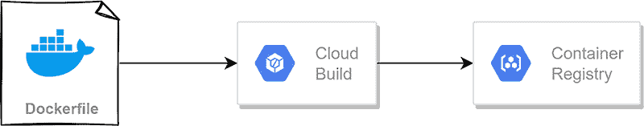

图 12.29 从 Dockerfile 构建镜像

使用您的 Dockerfile 运行构建请求，请从包含您的应用程序代码、Dockerfile 以及任何其他资源的目录中运行以下命令：

```
gcloud builds submit --tag us-central1-docker.pkg.dev//[PROJECT_ID]/[IMAGE_NAME]
```

这将构建镜像并将其存储在 Google Artifact Registry 中。

Cloud Build 通知

您有多种方式从 Cloud Build 获取通知。您可以收到有关构建状态任何变化的提醒，包括构建的开始、转换和完成。

Cloud Build 与 Pub/Sub 集成良好，并将消息发布到 Pub/Sub 主题。支持推送和拉取订阅模型。在 Pub/Sub 队列中有消息为您提供了将通知发送到下一步的无限选项。

除了 Pub/Sub 之外，您还可以通过以下通知通道之一从 Cloud Build 获取通知：

+   *Slack*—将通知发布到 Slack 频道

+   *SMTP* —通过 SMTP 协议发送通知

+   *HTTP* —以 JSON 格式向 HTTP 端点发送通知

所有三种类型的通知都使用作为 Cloud Run 服务运行的容器。如何创建此类通知的示例可以在[`mng.bz/DZrE`](http://mng.bz/DZrE)找到。

部署到 Anthos Google Kubernetes Engine

使用 kubectl 或 gke-deploy 构建器将部署到 Google Kubernetes Engine 可以完成。请注意，gke-deploy([`github.com/GoogleCloudPlatform/cloud-builders/tree/master/gke-deploy`](https://github.com/GoogleCloudPlatform/cloud-builders/tree/master/gke-deploy))基本上是 kubectl 的一个包装器，它结合了 Google 的最佳实践来部署 Kubernetes 资源。例如，它将标签 app.kubernetes.io/name 添加到部署的 Kubernetes 资源中。

接下来，您可以看到使用 gke-deploy 构建器部署到 GKE 集群的示例：

```
steps:
...
# deploy container image to GKE
- name: "gcr.io/cloud-builders/gke-deploy"
  args:
  - run
  - --filename=[kubernetes-config-file]
  - --location=[location]
  - --cluster=[cluster]
```

在未来，我们可以期待其他云构建器，如 AnthosCLI，这将使体验更加统一。

部署到 Cloud Run 和 Cloud Run for Anthos

Cloud Build 允许您构建 Cloud Run 容器镜像，然后将其部署到 Cloud Run 或 Cloud Run for Anthos。在两种情况下，您首先使用标准的 Docker 构建器构建和推送镜像：

```
steps:
# Build the container image
- name: ‘gcr.io/cloud-builders/docker’
  args: [‘build’, ‘-t’, ‘us-central1-docker.pkg.dev/$PROJECT_ID/${_IMAGE}’, ‘.’]
# Push the container image to a registry
- name: ‘gcr.io/cloud-builders/docker’
  args: [‘push’, ‘us-central1-docker.pkg.dev/$PROJECT_ID/${_IMAGE}’]
```

然后使用 cloud-sdk 构建器运行 gcloud run 命令。对于 Cloud Run，将 --platform 标志设置为 ‘managed’：

```
# Deploy container image to Cloud Run
- name: ‘gcr.io/google.com/cloudsdktool/cloud-sdk’
  entrypoint: gcloud
  args: [‘run’, ‘deploy’, ‘SERVICE-NAME’, ‘--image’, ‘us-central1-docker.pkg.dev/$PROJECT_ID/${_IMAGE}’, ‘--region’, ‘REGION’, ‘--platform’, ‘managed’]
images:
- ‘us-central1-docker.pkg.dev/$PROJECT_ID/${_IMAGE}’
```

对于 Cloud Run for Anthos，将 --platform 标志设置为 ‘gke’，并通过设置 --cluster 和 --cluster-location 标志来指定要部署到的集群：

```
# Deploy container image to Cloud Run on Anthos 
- name: ‘gcr.io/google.com/cloudsdktool/cloud-sdk’
  entrypoint: gcloud
  args: [‘run’, ‘deploy’, ‘SERVICE-NAME’, ‘--image’, ‘us-central1-docker.pkg.dev/$PROJECT_ID/${_IMAGE}’, ‘--cluster’, ‘CLUSTER’, ‘--cluster-location’, ‘CLUSTER_LOCATION’, ‘--platform’, ‘gke’]
images:
- ‘us-central1-docker.pkg.dev/$PROJECT_ID/${_IMAGE}’
```

使用 Cloud Build 和 Connect 网关将应用程序部署到 Anthos

如图 12.30 所示的 Connect 网关允许用户使用 Cloud Console 中的 Google Cloud 身份连接到 Google Cloud 外部的已注册集群。您不需要从 Cloud Build 直接连接到 Anthos 集群 API。Anthos Hub 作为在云构建器中运行的 kubectl 命令的代理。

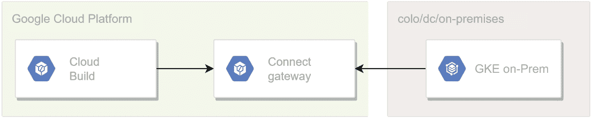

图 12.30 Connect 网关

要配置 Connect 网关并连接您的 Anthos 集群，请按照 Google 文档中描述的步骤操作，文档链接为 [`mng.bz/lJ5y`](http://mng.bz/lJ5y)。

一旦配置了 Connect 网关并将 Anthos 服务器注册，请运行以下命令以检查它们是否在集群中可见：

```
gcloud container fleet memberships list
```

在这种情况下，我们看到已注册了两个集群——一个是运行在 VMware 上的 GKE，另一个是 GCP GKE 集群：

```
NAME                EXTERNAL_ID
my-vmware-cluster   0192893d-ee0d-11e9-9c03-42010a8001c1
my-gke-cluster      f0e2ea35-ee0c-11e9-be79-42010a8400c2
```

让我们定义以下步骤以部署 myapp.yaml 清单中定义的应用程序：

```
steps:
- name: ‘gcr.io/cloud-builders/gcloud’
  entrypoint: /bin/sh
  id: Deploy to Anthos cluster on VMware
  args:
  - ‘-c’
  - |
    set -x && \
    export KUBECONFIG="$(pwd)/gateway-kubeconfig" && \
    gcloud beta container fleet memberships get-credentials my-vmware-cluster && \
    kubectl --kubeconfig gateway-kubeconfig apply -f myapp.yaml
```

如我们所见，在这种情况下，使用了网关 kubeconfig 而不是集群 kubeconfig 本身。请求将被发送到网关，然后网关将其转发到 my-vmware-cluster。这意味着在 GCP 之外部署您的 Anthos 集群不需要混合连接，如 Cloud VPN 或 Interconnect。

触发 Cloud Build

在上一节中，我们学习了如何将应用程序部署到任何 Anthos 集群。现在让我们看看如何通过使用 gcloud 命令（我们已经在上一节中查看过）或自动触发器来触发 Cloud Build 管道。使用 Cloud Build，您可以使用以下三种类型的存储库：

+   Cloud Source Repositories

+   GitHub

+   Bitbucket

要创建触发器，您可以使用 Google Cloud Console 和命令行。首先，将存储库添加到 Cloud Build：

```
    gcloud beta builds triggers create cloud-source-repositories \
    --repo=[REPO_NAME] \
    --branch-pattern=".*" \
    --build-config=[BUILD_CONFIG_FILE] \
```

然后，添加触发器：

```
    gcloud beta builds triggers create github \
    --repo-name=[REPO_NAME] \
    --repo-owner=[REPO_OWNER] \
    --branch-pattern=".*" \
    --build-config=[BUILD_CONFIG_FILE] \
```

使用 --branch-pattern，您可以指定哪个分支将触发构建。在这种情况下，将触发所有分支。

如果您想了解如何从其他存储库创建触发器，请参阅 [`mng.bz/BlrJ`](http://mng.bz/BlrJ) 的文档。

Cloud Build 概述

虽然 Cloud Build 使用简单，但它可以提供端到端 CI/CD 体验，以交付您的 Anthos 应用程序，如图 12.31 所示。如果您想获得更多关于端到端管道的实践经验，我们鼓励您按照自己的节奏遵循教程：[`mng.bz/dJGQ`](http://mng.bz/dJGQ)。在这个教程中，您将开发一个支持以下内容的管道：

+   提交代码的测试

+   构建容器镜像

+   将镜像推送到注册表

+   更新 Kubernetes 清单并将其推送到环境仓库

+   检测分支上的更改

+   将清单应用到 Anthos GKE 集群

+   将应用了 Kubernetes 清单的生产分支更新

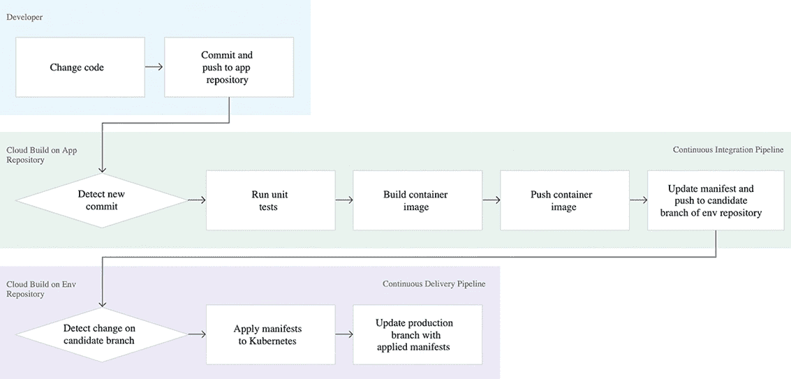

图 12.31 基于 Cloud Build 的 CI/CD 管道步骤

这个教程将给您一个如何使用 Cloud Build 执行高级任务的清晰思路。请注意，您可以使用 GitHub、GitLab 或 Bitbucket 等第三方工具获得相同的结果，但 Cloud Build 是一个本地的 GCP 工具，它与 Anthos 集成得很好。

### 12.4.4 使用 Kustomize 生成特定环境的配置

在现实场景中，您将应用程序部署到多个环境中。在 CI/CD 管道中，您需要一个工具来调整应用程序的配置，以便为每个环境进行配置，而无需更改实际的代码库。

Kustomize 是一个独立的工具，通过使用 kustomization.yaml 文件来自定义 Kubernetes 资源。好消息是，自从 Kubernetes 1.14 版本以来，Kustomize 已被合并到 kubectl 工具中，如图 12.32 所示。

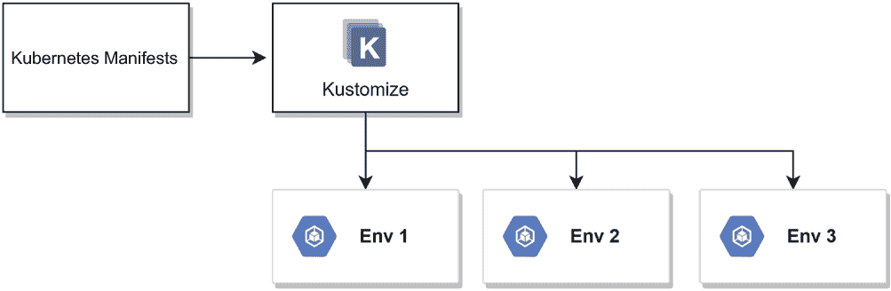

图 12.32 自定义 Kubernetes 清单

正如我们在图 12.32 中看到的那样，基本清单被修补并应用到每个环境中。

图 12.33，我们看到以下三个文件位于同一个文件夹中：

+   *部署定义*—deployment.yaml

+   *Kustomize 文件*—kustomization.yaml

+   *修补文件*—patch.yaml，它定义了在 Deployment 中应更改哪些属性

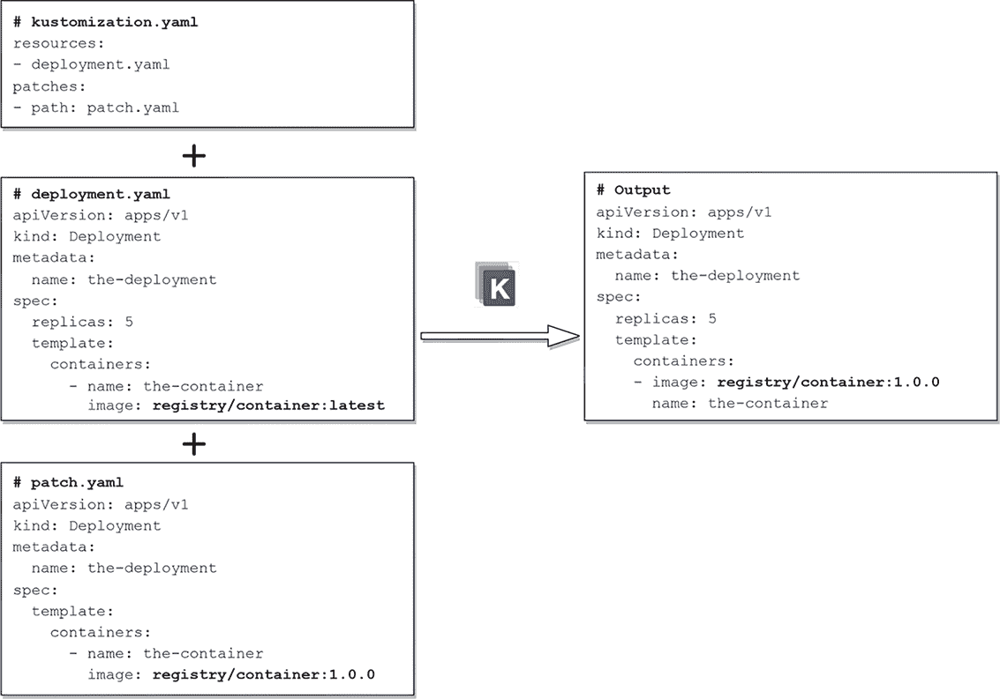

图 12.33 使用 Kustomize 修补部署镜像

要执行自定义，运行以下命令：

```
kubectl apply -k <kustomization_directory>
```

因此，输出已更新 spec.template.containers.image 属性。

Kustomize 功能列表

Kustomize 包含了自定义您的 Kubernetes 部署所需的所有功能，包括以下内容，如图 12.34 所示：

+   生成资源（ConfigMaps 和 Secrets）

+   设置跨切面字段

+   组合和自定义资源

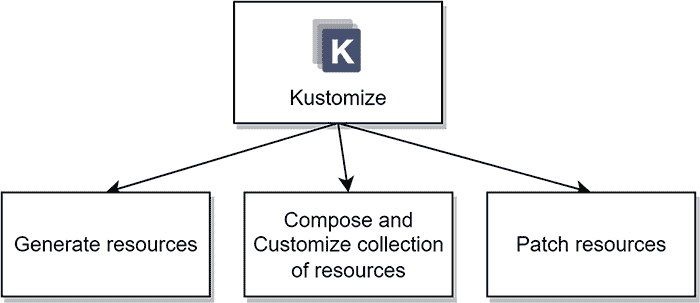

图 12.34 Kustomize 功能

让我们详细看看每一个。

组合

您可以使用 resources 属性来定义您想要自定义的资源定义。如果您在文件中不包含任何其他自定义功能，资源将简单地组合成一个定义。在以下示例中，我们将 deployment.yaml 和 service.yaml 定义组合在一起：

```
# kustomization.yaml

resources:
- deployment.yaml
- service.yaml
```

要运行自定义，执行以下命令：

```
kubectl kustomize ./
```

自定义

定制允许您使用以下方法使用特定值修补您的资源：

+   patchesStrategicMerge ([`mng.bz/rdQX`](http://mng.bz/rdQX))

+   patchesJson6902 ([`mng.bz/Vpo5`](http://mng.bz/Vpo5))

例如，您可以通过创建以下文件来修补 deployment.yaml 文件中定义的 my-deployment Deployment 的副本数：

```
# increase_replicas.yaml

apiVersion: apps/v1
kind: Deployment
metadata:
  name: my-deployment
spec:
  replicas: 3

# kustomization.yaml

resources:
- deployment.yaml
patchesStrategicMerge:
- increase_replicas.yaml
```

然后运行以下代码：

```
kubectl kustomize ./
```

除了这个定制功能之外，您还可以通过定义 image 属性来更改 Deployment 中的容器镜像。

设置交叉字段

使用交叉字段，您可以为您 Kubernetes 资源设置以下属性：

+   namespace

+   namePrefix

+   nameSuffix

+   commonLabels

+   commonAnnotation

在下一个示例中，我们将 namespace 设置为 my-namespace，用于 deployment.yaml 定义。注意：您可以使用 resources 属性来定义您想要受影响的资源。

```
# kustomization.yaml  

apiVersion: kustomize.config.k8s.io/v1beta1
kind: Kustomization
namespace: my-namespace
resources:
- deployment.yaml
```

生成资源

使用 Kustomize，您可以生成 ConfigMaps 和 Secrets 资源。正如我们已经学到的，它们用于向您的应用程序提供配置和凭证。您可以从文本或文件中生成对象。以下是一些支持的生成器：

+   configMapGenerator

+   secretGenerator

例如，要生成具有键值对的 ConfigMap，您可以使用以下文件：

```
# kustomization.yaml

configMapGenerator:
- name: example-configmap
  literals:
  - FOO=Bar
```

然后运行下一代码：

```
kubectl kustomize ./
```

使用变量

变量在您想要捕获一个资源的属性并将其传递给其他资源时非常有用。例如，您可能想使用服务名称将其传递给要执行的容器命令。请注意，目前这支持字符串类型。您可以在 [`mng.bz/xdEB`](http://mng.bz/xdEB) 看到这个用法的示例。

基础和覆盖

现在我们已经很好地理解了 Kustomize 提供的功能，我们可以看看如何使用它们来为 CI/CD 管道中的不同环境准备 Kubernetes。Kustomize 包含了 *bases* 和 *overlays* 的概念。基础是一个包含 Kubernetes 资源定义和主要 kustomization.yaml 文件的根目录。它执行第一层定制。请注意，您也可以在 Git 仓库中设置您的基。覆盖是一个存储用于定制基础层中已定制的资源的 kustomization.yaml 的目录。您可以根据图 12.35 所示创建多个覆盖，以表示每个环境。

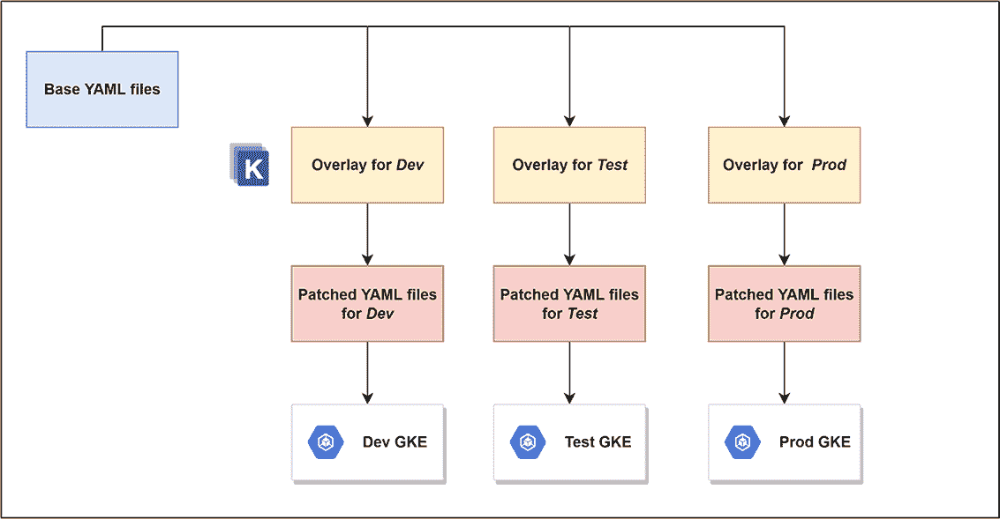

图 12.35 Kustomize 基础和覆盖

接下来，您可以看到一个示例文件结构，用于单个基础和三个覆盖，分别针对开发、测试和生产环境：

```
├── base
│   ├── deployment.yaml
│   ├── kustomization.yaml
│   └── service.yaml
└── overlays
    ├── dev
    │   ├── kustomization.yaml
    │   └── patch.yaml
    ├── test
    │   ├── kustomization.yaml
    │   └── patch.yaml
    └── prod
        ├── kustomization.yaml
        └── patch.yaml
```

您可以使用这种文件结构来设置每个环境的不同副本数。例如，对于开发环境，可能不需要像测试环境那样消耗那么多资源，在测试环境中，您可能想运行性能测试。

Kustomize 概述

正如我们所见，Kustomize 可以是 CI/CD 管道中的一种强大工具，用于为每个环境生成和修补 Kubernetes 资源。如果您想了解更多关于如何使用 Kustomize 的信息，请查看 [`mng.bz/AlKW`](http://mng.bz/AlKW) 上的 Kustomize 示例和 [`kubectl.docs.kubernetes.io/references/`](https://kubectl.docs.kubernetes.io/references/) 上的 API 参考。

## 12.5 使用 Cloud Deploy 进行持续部署

Cloud deploy 是一种完全托管的 CD 服务，允许您根据提升序列将应用程序交付到一系列定义的目标环境中。您应用程序的生命周期通过发布进行管理，并由交付管道控制。

### 12.5.1 Anthos CI/CD 中的 Cloud Deploy

Google Cloud Deploy 与我们已了解的 Google Cloud Platform 生态系统中的服务集成，如图 12.36 所示，以完成 GKE 和 Anthos 集群的端到端 CI/CD 解决方案。

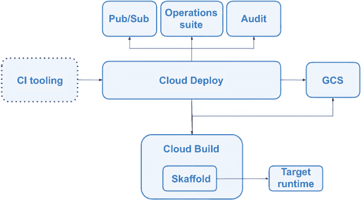

图 12.36 Cloud Deploy CI/CD 生态系统

图 12.36 显示了 Google Cloud Deploy 界面和以下服务：

+   *CI 工具*——调用 Google Cloud Deploy API 或 CLI 创建发布。因此，大多数 CI 工具都受支持，包括 Cloud Build。

+   *Cloud Build*——用于渲染清单并将其部署到目标运行时。

+   *Skaffold*——由 Cloud Build 用于渲染和部署清单。因此，应用程序被部署。

+   *Cloud Storage*——存储渲染源和渲染清单。

+   *Google Cloud 的操作套件*——收集并存储 Cloud Deploy 服务的审计日志。

+   *Pub/Sub*——允许将 Cloud Deploy 消息发布到 Pub/Sub 主题。这可以用于与外部系统集成。

+   *GKE 和 Anthos 集群*——Google Cloud Deploy 使用 Skaffold 部署应用程序的目标运行时，通过 Cloud Build 部署到您的目标运行时。

既然我们已经了解了 Cloud Deploy 如何与其他 Anthos CI/CD 工具交互，让我们看看如何配置它以进行 Anthos 应用程序的 CD。

### 12.5.2 Anthos 的 Google Cloud Deploy 交付管道

Cloud Deploy 使用交付管道清单来定义提升序列，以描述部署到目标的目标顺序。目标在管道的定义中或单独的文件中描述。Skaffold 配置文件用于渲染和部署 Kubernetes 资源清单。图 12.37 定义了 Cloud Deploy 使用的组件和流程。

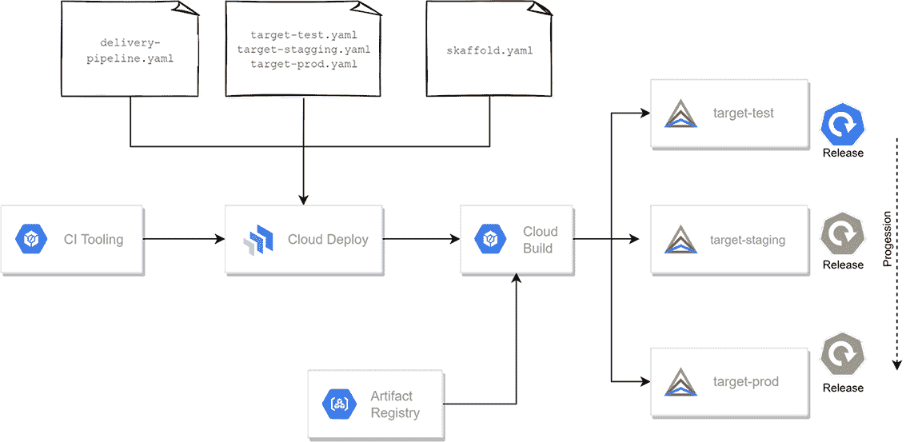

图 12.37 Cloud Deploy 工作流程

让我们看看配置与 Cloud Build 一起进行持续交付所需的操作序列，如下一组步骤所示。作为先决条件，我们应该已经为每个环境部署了三个 GKE/Anthos 集群，如图 12.38 所示：

1.  第一步是定义包含进展（提升顺序）和可选的运行时目标的交付管道。在此示例中，我们将创建单独的目标文件，因此可以定义以下管道：

    ```
    delivery-pipeline.yaml
    apiVersion: deploy.cloud.google.com/v1
    kind: DeliveryPipeline
    metadata:
      name: web-app
    description: web-app delivery pipeline
    serialPipeline:
     stages:
     - targetId: test
     - targetId: staging
     - targetId: prod
    ```

1.  目标可以定义为单独的文件。您可以针对每个目标定义一个单独的文件，最终将得到以下三个文件：

    +   target_test.yaml

    +   target_staging.yaml

    +   target_prod.yaml

    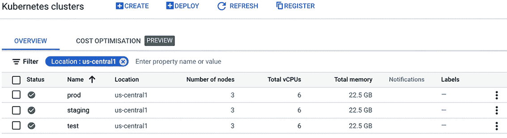

    图 12.38 目标 GKE/Anthos 集群

    在每个文件中，您定义目标名称和目标集群。这里您可以看到一个测试目标的示例：

    ```
    target-test.yaml
    apiVersion: deploy.cloud.google.com/v1
    kind: Target
    metadata:
      name: test
    description: test cluster
    gke:
      cluster: projects/${PROJECT_ID}/locations/${REGION}/clusters/test
    ```

1.  在下一步中，您定义用于渲染和部署应用程序清单所需的 Skaffold 配置文件。在此阶段，您应该已经有一个要部署的容器镜像和一个标识容器镜像的 Kubernetes 清单——这些应该在您的 CI 流程中生成。有关如何使用 Skaffold 与 Cloud Deploy 的更多信息，请参阅第 12.3.2 节，“使用 Skaffold 进行持续开发。”

    您的 Skaffold 配置可能如下所示：

    ```
    skaffold.yaml 
    apiVersion: skaffold/v2beta29
    kind: Config
    build:
      artifacts:
        - image: example-image
          context: example-app
      googleCloudBuild:
        projectId: ${PROJECT_ID}
    deploy:
      kubectl:
        manifests:
          - kubernetes/*
    portForward:
      - resourceType: deployment
        resourceName: example-app 
        port: 8080
        localPort: 9000
    ```

1.  接下来，通过运行以下命令注册管道和目标：

    ```
    gcloud deploy apply --file=delivery-pipeline.yaml --region=us-central1 && \
    gcloud deploy apply --file=target_test.yaml --region=us-central1 && \
    gcloud deploy apply --file=target_staging.yaml --region=us-central1 && \
    gcloud deploy apply --file=target_prod.yaml --region=us-central1
    ```

    现在 Cloud Deploy 已了解您的应用程序，并将根据您定义的提升顺序管理部署到目标。

1.  现在，您可以通过从命令行或从 CI 工具创建发布来启动交付管道。Google Cloud Deploy 创建一个部署资源，该资源将发布与第一个目标环境相关联。基于该部署，您的应用程序被部署到第一个目标。从包含您的 Skaffold 配置的目录运行以下命令：

    ```
    gcloud deploy releases create RELEASE_NAME --delivery-pipeline=PIPELINE_NAME
    ```

1.  如果您想使用 Cloud Build 作为 CI 工具，以下 YAML 文件显示了 Cloud Build 配置的示例，其中包含调用 Google Cloud Deploy 创建发布的功能，发布名称基于日期和用于构建的 Skaffold：

    ```
    - name: gcr.io/k8s-skaffold/skaffold
      args:
        - skaffold
        - build
        - ‘--interactive=false’
        - ‘--file-output=/workspace/artifacts.json’
    - name: gcr.io/google.com/cloudsdktool/cloud-sdk
      entrypoint: gcloud
      args:
        
          "deploy", "releases", "create", "rel-${SHORT_SHA}",
          "--delivery-pipeline", "PIPELINE_NAME",
          "--region", "us-central1",
          "--annotations", "commitId=${REVISION_ID}",
          "--build-artifacts", "/workspace/artifacts.json"
    ```

1.  一旦您准备好将应用程序部署到序列中的下一个目标，您就可以提升它。调用 Google Cloud Deploy 并创建一个新的部署：

    ```
    gcloud deploy releases promote --release=RELEASE_NAME --delivery-pipeline=PIPELINE_NAME
    ```

1.  您可以将提升继续到最后一个环境。在图 12.39 中显示的示例序列中，它是生产环境。

    

    图 12.40 手动批准

您可以在每个目标定义中定义批准，如下所示：

```
     apiVersion: deploy.cloud.google.com/v1
     kind: Target
     metadata:
      name:
      annotations:
      labels:
     description:
     requireApproval: true
     gke:
      cluster: projects/[project_name]/locations/[location]/clusters/[cluster_name]
```

参数 requireApproval: true 表示是否需要手动批准提升到该目标。其值可以是 true 或 false，且为可选值；默认为 false。

现在，您可以选择批准或拒绝部署。要批准部署，请运行以下命令：

```
gcloud deploy rollouts approve rollout-name --delivery-pipeline=pipeline-name
```

或者通过运行以下命令来拒绝审批：

```
gcloud deploy rollouts reject rollout-name --delivery-pipeline=pipeline-name
```

如您所见，这为您提供了对应用程序发布的完全控制。

云部署概述

在本节中，我们学习了如何使用云部署进行应用程序的持续交付。它包含许多重要功能，如审批、日志记录和与第三方工具的集成，使其成为企业级解决方案。它无缝集成到 Anthos 的端到端 CI/CD 管道中。要了解更多关于云部署的信息，请参阅[`cloud.google.com/deploy`](https://cloud.google.com/deploy)。

如果您想亲身体验云构建，我们鼓励您查看包含更多功能和集成的示例教程：[`mng.bz/ZoKZ`](http://mng.bz/ZoKZ)。

## 12.6 现代 CI/CD 平台

现代 CI/CD 平台必须允许可持续地开发和运营整个应用程序交付管道。实现这一目标没有单一的方法，它始终依赖于应用程序和组织的具体情况。所有这些平台在解决以下三个关键层时都应遵循相同的模式，如图 12.41 和图 12.42 所示：

+   *基础设施*—用于托管

+   *平台*—由开发者用于创建、维护和消费持续集成能力

+   *应用程序*—面向最终用户的消费层

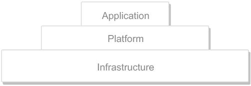

图 12.41 CI/CD 平台层

每一层至少由以下三种类型的角色负责：

+   *开发者*—主要关注应用程序开发、自动化测试和发布

+   *操作员*—专注于确保应用程序、底层平台和基础设施正常运行，以提供约定的性能和可用性指标

+   *安全官*—确保无论环境类型、结构或层，都应用了约定的政策和安全标准

根据组织不同，可能存在更多角色。每个角色不仅必须拥有不同的职责和角色，以及不同的约束和限制，而且它们还必须在整个团队中共享相同的方法，这导致了对交付的共同责任，如图 12.42 所示。

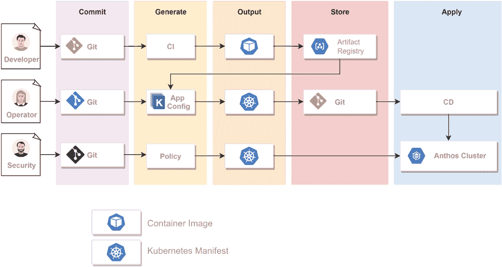

图 12.42 角色与代码仓库对比

Anthos 引入了集中管理和统一工具集的能力，同时保持将外部工具集成到管道中的灵活性。现代 CI/CD 平台的目标是支持企业级和安全的 GitOps 实现。这意味着每个组件都必须描述为一组配置文件和定义，这些文件和定义存储在版本控制系统内。每个集合由一个单独的团队管理和维护。已经提到，现代 CI/CD 平台依赖于共享责任。在这样的模型中，所有各方都通过公共接口（如代码仓库、镜像构建和 Kubernetes 清单定义阶段）进行接触。

现代应用交付依赖于 Kubernetes 调度程序和基于微服务的架构。在这种情况下，开发者和操作者游乐场之间必须有分离。实施取决于定义的需求。我们可以使用单个集群和多个命名空间来设置单站点或非生产环境。如果我们交付的服务必须具有高可用性或在全球范围内提供高延迟，或者我们必须限制基础设施生命周期活动的影响，请考虑使用多个 Anthos 集群。多集群设置允许我们在完全发布之前以小步骤向各个集群推出应用程序。

让我们定义一个示例应用程序：一个简单的基于微服务的投票系统，能够可视化投票结果，如图 12.43 所示。

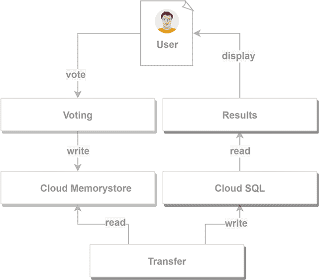

图 12.43 应用架构

基础设施底层使用 GCP 上的 Anthos GKE 集群。创建了三个命名空间，每个服务一个：

+   投票

+   转移

+   结果

它还使用了以下三个 Google 管理的服务：

+   云 Memorystore 作为托管的 Redis

+   Cloud SQL 作为所有作为托管 Postgres 提供的投票的中心数据库

+   Secret Manager 作为安全的密钥管理系统，用于存储 Memorystore 和 Cloud SQL 的凭证

开发者消费基础设施，并不关心它是如何交付的。它必须满足他们与命名空间和管理服务相关的需求。一个负责任的团队必须创建一个 CI/CD 管道，可用于应用程序托管目的，并具有完全的灵活性来测试任何更改。

为了实现这一目标，我们可以使用多种不同的工具。如果我们的团队熟悉 Terraform，我们可以利用已有的知识并将其集成到我们的 CI/CD 流程中。这种做法完全符合 DORA 的 DevOps 状态研究计划([`www.devops-research.com/research.xhtml`](https://www.devops-research.com/research.xhtml))。它定义了组织实施 DevOps 的关键成功因素之一：选择开发人员和运维人员使用的工具的自由。还有一个问题存在：我们能否以更简单的方式提供这样的基础设施？因为我们使用的是 GCP 管理的资源，而不是使用外部工具，我们可以利用 Anthos Config Connector 功能，将 Secret Manager、Cloud Memorystore 和 Cloud SQL 作为代码仓库中的声明性对象提供。

如果我们需要为其他来源提供服务，如 Anthos on-prem，那么从第一天开始以自动化的方式引入基础设施更改是很重要的，如图 12.44 所示。每个在 VMware 或裸金属上运行的 Anthos 都必须依赖于预定义的实践和安全策略，如果需要，可以不断重复使用。

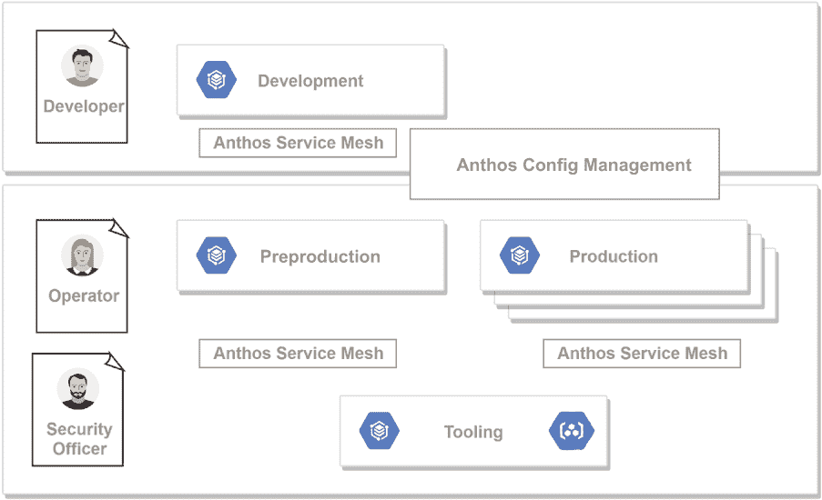

图 12.44 基础设施资源

深入了解我们的现代平台基础设施，它必须提供以下元素以实现应用程序交付的成功：

+   *高性能、高可用性和稳定的共享工具基础设施*——它被用作 CI/CD、容器镜像以及应用程序和基础设施代码和配置的中心存储库。它可以扩展以支持公司要求的额外业务支持工具。

+   *将预生产和多个生产环境通过一致的配置分开*——一致的安全策略、RBAC 或网络配置可以提高测试质量和效率，降低错误率，并提高生产软件交付。

+   *开发基础设施*——用于广泛的单元测试，并赋予我们的开发者在其自己的命名空间中工作的自由。

这将我们引入目标 CI/CD 平台。平台选择的多维度性和必须由以下因素驱动是很重要的：

+   *操作该平台的团队必须了解该平台。* 平台已经被使用并不必要，但必须提供适当的培训，并且团队必须有时间熟悉它。

+   *平台必须适应应用程序和基础设施交付模型所期望的状态。* 这包括在企业中实施的操作模型和业务逻辑。

+   *必须在所有层面上正确测量和监控应用程序的可用性和健康状况*。 这意味着从基础设施开始，通过工具平台，最后在应用程序本身级别结束。

+   *如介绍部分所述，平台必须为 DevOps 准备就绪*。

在选择代码仓库时，考虑对你来说哪些功能是必需的。对于小规模的简单代码版本管理，Google Cloud Source Repository 可能足够。当需要额外的功能时，你必须考虑其他 Git 提供商。GitLab、GitHub 或 Bitbucket 的常见模式可能是要求将代码保留在本地数据中心，或者通过实施代码所有者来对 Git 中的特定文件夹引入责任。对于集成和部署工具，也必须做出类似的选择。受额外需求驱动，我们可能已经在本地上实施了 GitLab CI/CD。对于复杂的应用交付，你可以使用 Spinnaker 作为 CD 工具。基于 Anthos 的平台在该领域具有灵活性。我们可以使用 Google Cloud Platform 工具或轻松集成到外部工具，同时仍然从开箱即用的 Anthos 自动化和功能中受益，如图 12.45 所示。

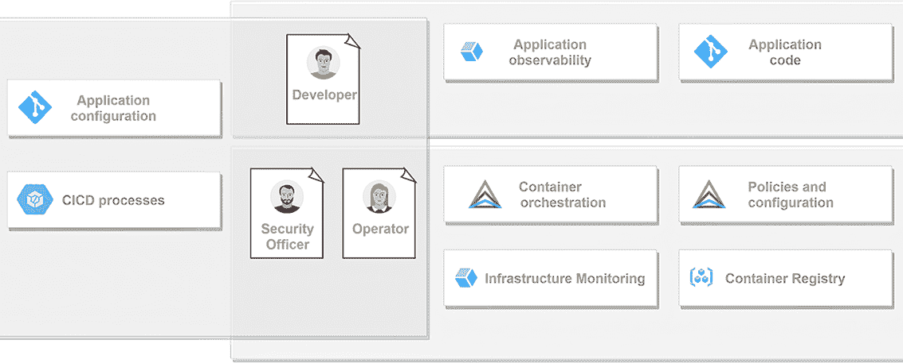

图 12.45 软件资源

一旦我们的基础设施和 CI/CD 平台准备就绪，我们就可以为开发活动启用它们。我们定义了角色以及他们使用哪些接口来相互协作。让我们看看图 12.46 中展示的这种协作的端到端工作流程。

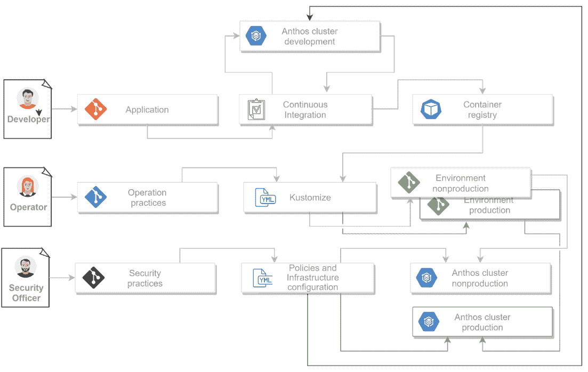

图 12.46 应用交付工作流程

一旦代码准备就绪，它必须被部署到类似生产环境，以确保新代码更新验证过程中的质量。如前所述，代码可以被推送到 Cloud Code 或任何其他 Git 仓库，在那里进行质量和健全性检查。当它通过时，你可以生成容器镜像并将它们推送到容器注册库。当镜像被操作员确认后，他们将这些最佳实践、应用程序和公司标准应用于它们，这些标准来自操作实践 Git 仓库。操作员使用 Kustomize 等工具定义管道，创建特定环境的仓库，这些仓库成为特定环境清单的真相来源。此外，因为所有环境都依赖于相同的应用程序和操作实践代码仓库，它们保证是一致的。因此，非生产环境尽可能接近生产环境。

我们已经提到了尽可能在开发生命周期中左移安全适应性的重要性。开发环境和生产环境之间的 Kubernetes 集群一致性在应用交付速度中起着重要作用。在第十三章中，我们将学习 Anthos Policy Controller 的工作原理，而在第十一章中，我们已经学习了 Anthos Config Management 如何帮助保持配置的一致性。我们可以将策略和基础设施控制器应用到我们的 CI/CD 管道最终版本中。类似于应用一致性，所有环境单一事实来源保证了安全措施的一致性，这使我们能够以现代声明式的方式合并基础设施和安全更改。

让我们回到我们的参考应用程序，看看之前的流程是如何应用到它上面的。在我们的案例中，我们可以有三个独立的开发生态。每个团队都生产一个单独的镜像，并将其交给负责端到端应用程序的操作员。Kubernetes 集群以专用命名空间的形式提供应用程序着陆区，如图 12.47 所示。这为我们提供了在资源、安全和连接级别上实现工作负载隔离的能力。


图 12.47 应用着陆区

## 摘要

+   现代应用交付 CI/CD 平台在现代企业应用交付过程中发挥着重要作用。

+   开发者可以专注于应用程序，这增加了开发团队的性能和效率。

+   同样适用于可以控制早期阶段应用程序交付的运营商，减轻日常任务，并最小化配置开销。

+   自动化管道统一了与应用程序和基础设施协同工作的方式。

+   安全团队成为集成和交付过程不可或缺的一部分。

+   现代 CI/CD 平台引入了统一工具。它们构建了所有相关方的知识、期望意识和工作方式。

+   统一的工具集提高了平台引入组织中的共享责任模型下的合作。

+   流程、运营模式、学习和沟通路径必须适应这一新模型。其好处包括减少变更的提前期、增加部署频率以及显著降低服务恢复时间。

* * *

^(1.)Jez Humble 和 David Farley，*持续交付：通过构建、测试和部署自动化实现可靠的软件发布*（Addison-Wesley Professional，2010）。

^(2.)结构测试是 Google 开发的一种容器测试机制；有关详细信息，请参阅 [`mng.bz/eJzz`](http://mng.bz/eJzz)。
