# 13 安全与策略

Scott Surovich

本章涵盖

+   Kubernetes 安全概述

+   Anthos 安全功能

+   理解根容器与特权容器

+   使用 ACM 保护集群

Google 已经使部署 Anthos 集群变得简单、自动化。由于过程是自动化的，管理员可能不会考虑初始简单集群创建之后的任务，如安全设置。当您在未考虑安装后任务（如安全）的情况下部署集群时，攻击者很可能只需付出很少的努力就能控制您的集群。

与许多产品的初始安装一样，一个新的 Kubernetes 集群可能包含很少或没有增强的安全设置。对于大多数企业系统，这种设置是设计如此。Kubernetes 设计者选择将安全作为一个集群安装后的过程，这个过程由组织设计和实施，而不是强迫组织采用一个可能不适合某些组织的严格安全模型。

在今天这个互联互通的世界里，似乎没有一天没有关于新的黑客攻击的新闻。勒索软件、僵尸网络、分布式拒绝服务攻击以及无数其他攻击正在成为组织与黑客之间每日的猫鼠游戏。无论您的集群位于本地还是远程，您都需要保护所有可能被利用的区域。对这些攻击缺乏充分的规划可能导致数据泄露、服务中断、罚款、品牌变更或收入损失。

在本章中，我们将讨论 Anthos 提供的用于保护您的 Kubernetes 集群的功能。例如，Anthos 配置管理（ACM）和 Anthos 服务网格（ASM）等工具提供了保护集群的功能，限制或阻止恶意行为者和诚实用户错误的影响。

例如，Kubernetes 的默认安装可能允许用户部署一个挂载主机卷、使用主机 PID 和主机网络、以 root 身份运行或以特权模式运行的容器。所有这些都可能引起不同的问题，但让我们看看其中最危险的一个：特权容器。特权容器允许用户将主机的根文件系统挂载到运行中的容器的挂载点上。一旦文件系统被挂载，用户就可以进入运行中的容器并浏览工作节点的整个文件系统。在挂载了主机文件系统的情况下，攻击者可以更进一步，重新挂载根文件系统，从而允许他们停止运行中的容器、启动新的恶意容器或破坏主机操作系统文件系统。

运行特权容器是一个常用的例子，说明了为什么您需要向集群添加额外的安全措施。尽管安全策略通常是集群创建的第一种策略类型，但您不能忘记其他可能影响集群和您服务的设置。为了保护集群，您需要了解攻击者可能采取的行动，这些行动不仅可能导致安全漏洞，还可能导致服务中断和数据丢失。

## 13.1 技术要求

本章的实践部分将要求您能够访问一个在 GCP 上运行的带有 ACM 和 Policy Controller 启用的 Google Kubernetes Engine 集群。

## 13.2 虚拟机管理程序与容器运行时对比

当一项新技术发布时，它通常在没有适当知识的情况下被部署，以安全地运行。这通常导致人们认为新技术不如更成熟的技术安全，例如容器与虚拟机相比。直到最近，人们普遍认为容器不如虚拟机安全，许多人指出，共享主机内核是主要的安全担忧。

这个共享内核为恶意行为者开辟了攻击途径，可能允许他们黑入一个不够安全的容器，并从那里突破到主机本身。如果攻击者从容器中突破出来，他们可能，潜在地，完全控制主机操作系统。这与在虚拟机管理程序上运行的虚拟机形成对比，在那里突破是不可能发生的。或者，可能吗？

在过去的几年里，不同的虚拟机管理程序都存在常见的漏洞和暴露（CVE），导致了不同程度的网络安全问题，包括特权提升，允许攻击者以管理员权限访问虚拟机管理程序。（有关 CVE 的更多信息，请参阅[`cve.mitre.org/`](https://cve.mitre.org/)。）一旦攻击者破坏了虚拟机管理程序，他们就会访问主机上的每个虚拟机，包括运行虚拟机的虚拟磁盘。

本节的目的不是引发关于容器安全与虚拟机安全之间的辩论。我们的目的是指出，没有系统是完全安全的，当像 Kubernetes 这样的系统在没有理解基本安全的情况下部署时，您和您的组织都会面临风险。

让我们来看看在集群被认为是“生产就绪”之前需要检查的一些常见的 Kubernetes 安全关注点。

## 13.3 Kubernetes 安全概述

一个基本的 Kubernetes 集群通常只启用有限的安全设置，如果没有的话，这使组织必须自行解决安全问题，如下所述：

+   配置任何基本 Kubernetes 安全功能

+   寻找附加产品来解决基本集群中未包含的任何缺失安全功能

+   对每个组件的安装和支持进行培训

+   扫描镜像以查找漏洞

+   启用网络安全以加密工作负载之间的流量

这些任务在某些组织中可能听起来并不是克服的大障碍。你可能已经了解了一些开源软件包，如 OPA（Open Policy Agent）或 Gatekeeper 这样的准入控制器，它们可以为集群增加安全性。一个组织可以决定使用开源项目发布版部署 Gatekeeper，但这样做将使他们需要内部处理支持或通过在 GitHub 仓库上提交 Gatekeeper 的问题来处理。准入控制器的问题可能会对集群产生有害影响，可能造成每个部署请求的障碍。在你成为准入控制器问题的接收者之前，你可能不会完全理解其影响，以及拥有一个支持联系人如何成为集群的救命稻草。

在整本书中，我们讨论了 Anthos 如何通过提供由完整 Google 支持的后备集群的附加组件，将 Kubernetes 集群提升到新的水平。正如你在第十一章所读到的，安全性是 Anthos 擅长的关键领域之一，其中你了解了一些 ACM 的功能，包括配置同步和 Config Connector。ACM 还可以用来配置 Kubernetes 安全的基础方面，包括角色和角色绑定，同时还通过包含 Gatekeeper 策略引擎提供额外的安全措施。

在深入探讨策略控制器及其可以实施的政策之前，让我们快速回顾一下作为基础 Kubernetes 安装的一部分提供的安全机制。

### 13.3.1 理解 Kubernetes 安全对象

作为集群管理员，你需要了解包含的安全选项以及它们如何解决或未解决你组织的网络安全策略。全面涵盖 Kubernetes 中包含的基础安全对象超出了本章的范围。它们在此处展示，以提供一个概述，你可以进一步使用提供的参考链接进行深入研究。以下是一些常用的安全对象：

+   *网络策略*—定义了控制服务入站和出站流量的条件 ([`mng.bz/61vy`](http://mng.bz/61vy))

+   *基于角色的访问控制 (RBAC)*—通过用户和组成员资格提供对 Kubernetes 对象的细粒度访问 ([`mng.bz/oJMM`](http://mng.bz/oJMM))

一种曾经常见的 Kubernetes 安全概念，Pod 安全策略（PSPs），在当前的 Kubernetes 版本中已被弃用。然而，策略控制器解决了 PSPs 之前提供的条件。

由于本章和本书旨在强调 Anthos 本身为您带来的 Kubernetes 体验优势，我们将不会涵盖 RBAC 策略或 NetworkPolicies，这些在之前提到的 kubernetes.io 页面上以及几本其他 Kubernetes 书籍中有更详细的解释。本章的目的不是提供关于保护 Kubernetes 集群和工作负载的详尽教程。相反，我们将专注于 Anthos 提供的额外工具，以简化、实施和监控针对常见安全问题的解决方案。我们将使用特定的漏洞来展示解决方案，但无论如何，这种覆盖都不是详尽的。

### 13.3.2 安全类型

保护任何数字服务必须包括几个攻击途径：物理的、内部的（无论是员工或承包商的恶意或意外）、外部的。此外，此类攻击的目的有多种形式。意图是窃取数据或代码、中断服务还是使系统成为人质？没有任何解决方案是 100%安全的——它需要可用的这一事实意味着它始终会以某种形式受到攻击。然而，作为一个行业，我们应该努力使我们的服务尽可能难以中断。

Kubernetes 背后的部分驱动力是降低部署功能性工作负载的障碍。这减少了运行集群本身的团队的支持开销，但代价是更多的人可以访问部署可能导致服务中断的工作负载和配置。因此，从集群安全的角度来看，我们需要实施具体政策以最大限度地减少漏洞被利用的可能性。尽管一些组织可以完全通过以人为本的政策来完成这项工作，但最佳的安全政策是那些执行机制是自动的，不依赖于人工干预的。

与任何计算抽象平台一样，Kubernetes 包含多个攻击途径，尤其是在默认配置下。其中一些始终以某种程度存在，以提供集群中工作负载的价值。例如，一个存储和检索数据库数据的中间件服务始终需要访问数据库服务器，从而在两个组件之间留下一个开口。

每个组织都应该减少其系统可能的攻击途径。然而，没有两个组织是完全相同的。因此，大多数 Kubernetes 版本都附带了一些故意不那么限制性的安全设置。Kubernetes 管理员的首要任务应该是应用一套更严格的安全政策，以符合其组织的指令和需求。我们无法为每个组织提供每个可能政策的详尽列表。¹ 然而，我们将介绍一些适用于大多数集群的基本政策。

特权容器和 root 用户

基于容器的编排系统的一个巨大优势是通过与底层容器共享系统内核（通常还包括文件系统的一部分）来减少资源使用；Kubernetes 也不例外。这些编排器，包括 Kubernetes，包括防止容器内进程直接访问主机机器资源的保护措施。然而，编排系统的某些组件可能需要以用户或 root 身份访问主机基础设施的特定部分。在容器内镜像构建器开发之前，这是在容器内干净环境中运行时构建镜像的常见方式。

在 Kubernetes 中，容器“突破”并向主机系统发出命令的能力是通过容器或 Pod 规范上的 privileged 标志来管理的。在主机系统上以单个用户身份运行命令在大多数情况下可能用途有限，除非容器以超级用户身份运行或假定了一个超级用户的身份。为了简单起见，许多公开可用的容器镜像内部以 root 用户身份运行，以避免容器内的权限问题。然而，如果 privileged 标志设置为 true，这将允许容器内的进程突破并作为超级用户影响主机系统。

为了防止容器以超级用户账户运行，必须采取两项安全措施：强制容器防止权限提升，并防止默认以 root 用户运行镜像。

以前，Kubernetes 包括 PodSecurityPolicy 对象类型来强制实施针对已部署 Pod 的具体策略。然而，从 Kubernetes 1.21 开始，PSPs 已被弃用，并在 1.25 版本中将以当前形式被移除。Kubernetes SIG 决定弃用 PSPs，原因有很多，包括以下这些：

+   由于策略的适用方式，故障排除策略存在困难。Pod 安全策略（PSPs）绑定到 Pod 的服务账户或提交请求的用户。

+   无法限制持久卷声明（PersistentVolumeClaims）的类型，这意味着用户可以使用 HostPath 创建持久卷声明。

+   关闭失败，这意味着如果未定义策略，操作将失败。由于这种行为，你无法在集群滚动推出时启用 PSPs——你需要在启用整个集群的 PSPs 之前创建所有策略。

即使在 PSPs 弃用之前，许多组织也由于上述限制而跳过了使用它们。相反，他们决定实施一个准入控制器，如 Gatekeeper（之前称为 OPA 或 Gatekeeper 1.0）。

为了确保集群的安全，你需要在降低风险之前考虑恶意行为者可能会尝试执行的操作。让我们讨论一些在新的集群上线前需要考虑的常见安全担忧。

## 13.4 常见安全担忧

Kubernetes API 和配置设计提供了大量的灵活性，以支持广泛的部署场景和应用。然而，大多数组织不需要，也不希望启用更安全的配置选项。默认允许的一些敏感字段包含在表 13.1 中。

表 13.1 可能导致安全事件的安全事件字段

| pod.spec fields |
| --- |
| Field | Description |
| hostPID | 允许容器共享宿主机的进程命名空间 |
| hostIPC | 允许容器共享宿主机的 IPC 命名空间 |
| hostNetwork | 允许容器共享宿主机的网络命名空间 |
| pod.spec.containers.securityContext fields |
| Field | Description |
| privileged | 允许容器访问宿主机的所有设备 |
| allowPrivilegeEscalation | 允许进程比其父进程有更多的访问权限 |

如果容器被设置为以 root 用户身份运行，并且 privileged 字段被设置为 true，则在 Kubernetes 中会出现一个漏洞。许多广泛分布的镜像使用 root 用户作为默认用户——开发人员和管理员可以，并且应该将其更改为使用非 root 用户。然而，仅仅以 root 用户身份运行并不给容器访问宿主系统的权限，因为容器守护进程将阻止访问。但是，如果用户可以将 privileged 字段设置为 true，那么以 root 用户身份运行的容器*将*能够访问宿主系统并做出或提取他们不应访问的更改或数据。为了防止这种情况发生，我们需要创建一个新的 Gatekeeper 策略实例。

这些字段仅代表可能被用来危害宿主机的一小部分项目。在本章的后面部分，我们将使用这些选项来演示攻击者如何使用它们来获得对集群中 Kubernetes 宿主机的完全访问权限。

攻击者并不总是想要接管宿主机系统。他们可能只是满足于破坏服务并造成一般混乱。不幸的是，这种类型的事件也可能由一个可能没有完全了解系统的无辜用户触发，导致系统故障或降级。您的安全标准需要考虑所有可能导致服务中断的行动，这些行动可能来自外部实体，例如允许但恶意用户或善意用户的潜在误配置。

以下列表概述了一些经常被忽视的设置，如果不加以解决，可能会导致收入损失、罚款、服务中断或负面公司品牌后果：

+   Ingress 控制器 URL 重复

    +   可能导致冲突的 Ingress 规则的服务中断

+   消耗一个节点所有资源的应用程序或命名空间

    +   导致宿主机资源问题，影响宿主机上的所有应用程序

+   未从已批准的注册表中拉取的恶意容器镜像

    +   可能导致恶意软件或勒索软件

+   一个使用“*”的 Istio 策略

    +   导致所有 Istio 服务的服务中断

+   集群中 Pod 之间的未加密流量

    +   可能导致数据泄露

这只是一个需要考虑以增加集群的安全性和可用性的常见问题列表。如果你必须考虑可能影响 Kubernetes 应用程序的每个场景，创建解决每个任务的策略可能需要数月时间，而且它们可能不会涵盖你没有想到的场景。过于频繁的是，你只有在事件发生后才会了解到你没有考虑到的动作。

Anthos 包括提供配置管理和增强安全性的产品，这些产品包括社区和 Google 开发的一系列策略。但在深入了解 Anthos 的安全性和策略功能之前，让我们回顾一下通用的容器安全性，以便我们能够理解 Anthos 提供的工具的需求。

### 13.4.1 理解策略控制器

ACM 策略控制器为集群提供了一个准入控制器。准入控制器是一个组件，它验证或修改发送到 Kubernetes API 服务器的请求，在允许或拒绝请求之前执行控制器的逻辑。

当你启用策略引擎时，会创建一个 ValidatingWebHook 配置，该配置将引擎注册为 API 服务器的准入控制器。一旦注册，API 服务器将发送对象请求到准入控制器进行评估，如图 13.1 所示。

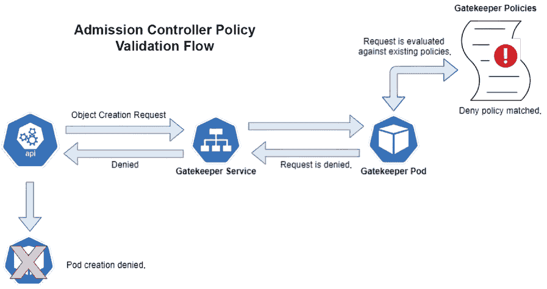

图 13.1 准入控制器策略验证流程

在图 13.1 所示的流程中，API 服务器收到了创建新 Pod 的请求。由于集群已安装 ACM 并启用了策略控制器，请求被发送到 Gatekeeper 服务。然后该服务将请求转发到 Gatekeeper Pod，该 Pod 检查配置的策略是否存在违规。

在这一点上，你可能想知道一旦部署了 Gatekeeper，集群可能会体验到什么样的延迟或性能影响。平均而言，策略评估大约需要一毫秒，即使评估较大的策略也是如此。像任何允许你创建自己的对象的系统一样，你可以创建一个会影响策略引擎性能的策略，从而导致整体系统延迟。创建策略超出了本章的范围。如果你想了解更多关于策略和性能的信息，你可以在 Open Policy Agent 网站上找到更多详细信息，网址为[`mng.bz/v1GM`](http://mng.bz/v1GM)。

在图 13.1 所示的示例中，发现了一个拒绝请求的策略，导致准入控制器将拒绝信息发送到 API 服务器。由于准入控制器返回了拒绝，API 服务器将不会创建对象，并将使用策略引擎提供的错误更新对象的状况。

策略引擎是一个简单的评估系统，它检查请求并决定是否允许该请求。策略引擎有一个简单的流程，但其中的真正力量在于策略本身，它为决策过程提供逻辑。在 ACM 中，我们使用约束模板和约束在我们的集群中实现安全策略。在下一节中，我们将解释约束模板是什么以及它们是如何通过创建约束在集群中实现的。

介绍门卫约束模板

将约束模板视为策略引擎用于做出决策的逻辑。当在集群上启用门卫时，它将创建一组默认策略，包含常见用例的规则。在撰写本文时，ACM 的策略控制器包括 32 个模板，包括以下这些：

+   允许的容器注册库

+   Istio 特定的策略

+   资源约束

+   提供类似于 PSPs 的安全性的替代方案

注意：您可以通过访问[`mng.bz/41oV`](http://mng.bz/41oV)找到每个模板的完整列表及其描述。

每个策略都是称为 ConstraintTemplate 的自定义资源类型。您可以通过执行 kubectl get constrainttemplates 来查看集群中的所有模板。简化的列表如图 13.2 所示。

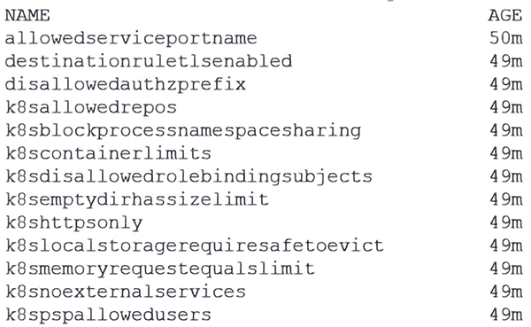

图 13.2 约束模板列表

约束模板本身仅是策略的定义——用于评估的逻辑。在下一节中，我们将解释如何使用约束模板创建约束，从而在集群上启用所选策略。

启用策略

要启用策略的执行，您需要创建一个 YAML 文件，该文件定义了一个约束，当创建新对象时将对其进行评估。这是一个需要记住的关键行为：因为策略引擎是一个准入控制器，它仅在对象创建或被集群接受时评估对象。它不会对任何现有对象执行策略，直到它们被重新创建，但它会显示集群中正在运行的策略违规。这一点常常被初学者忽视，当您在集群中实施新策略时，这是一个需要记住的关键点。

之前我们解释了如何使用以特权容器启动的容器来损害主机，最终损害集群。由于这种潜在风险，您可能希望拒绝创建特权 Pod。由于这是一个常见用例，ACM 包括一个拒绝特权容器的模板。以下示例清单创建了一个名为 deny-privileged 的对象，使用自定义资源类型 K8sPSPPrivilegedContainer：

```
apiVersion: constraints.gatekeeper.sh/v1beta1
kind: K8sPSPPrivilegedContainer
metadata:
  name: deny-privileged
spec:
  match:
    kinds:
      - apiGroups: [""]
        kinds: ["Pod"]
```

注意，在清单的 spec 部分中，我们定义了一个匹配参数。此参数定义了策略引擎将如何评估约束的对象。在示例中，策略将针对对象类型 pod 的所有 apiGroups 进行评估。这意味着每次收到 Pod 请求时，都会检查它是否试图以特权容器的形式启动。

你可能想知道为什么我们只匹配 Pod，而不是 Deployments 或 ReplicaSets。Pod 匹配将评估任何创建 Pod 的尝试，包括使用 Pod 类型的清单，或者当其他对象如 Deployment 试图创建 Pod 时。当 Deployment 被提交时，API 服务器将创建一个 Deployment 对象，它创建一个 ReplicaSet 对象，然后创建 Pod。无论 Pod 如何创建，它都将与策略进行核对。

默认情况下，一旦创建了一个约束，它将对匹配列表中定义的每个对象生效。这包括 Anthos 系统命名空间，如 kube-system、gke-system 和 gke-connect。如果你在先前的示例中添加了约束，像 kube-proxy 和 Calico 或 Cilium 这样的 CNI Pod 将无法启动。如果 CNI Pod 被拒绝启动，集群节点将没有任何网络连接，导致所有 Pod 失败。由于约束具有集群级影响，你需要仔细规划和理解策略将如何影响整个集群，包括现有对象。

可能看起来策略会影响每个命名空间，并且默认情况下，对于新策略来说确实是如此。幸运的是，ACM 允许你通过在 spec.match.excludedNamespaces 中添加包含命名空间的约束来排除命名空间，或者你可以根据此处记录的说明配置 Policy Controller 以具有 exemptableNamespaces：[`mng.bz/Q84j`](http://mng.bz/Q84j)。

由于策略可能产生意外的后果，Anthos 策略管理器有一个选项允许你在不实际强制执行约束的情况下审计约束的结果。在下一个小节中，我们将讨论如何审计约束。

约束的审计

在强制执行新的约束之前，你应该在集群上测试它以避免任何意外结果。如前一小节所述，当你创建一个新的约束时，它将默认生效。你可以通过将 enforcementAction: dryrun 选项添加到约束清单中，将此默认行为从强制执行更改为审计。使用 psp-privileged-container 示例，我们可以添加 dryrun 选项来将默认的强制执行行为更改为审计，如下所示：

```
apiVersion: constraints.gatekeeper.sh/v1beta1
kind: K8sPSPPrivilegedContainer
metadata:
  name: psp-privileged-container
spec:
* enforcementAction: dryrun*
  match:
    kinds:
      - apiGroups: [""]
        kinds: ["Pod"]
```

现在强制执行已更改为审计，任何违反约束的 Pod 都只会被记录为违规，但它仍然可以启动。此外，与默认强制执行行为不同，将约束设置为 dryrun 将评估不仅新请求，还包括所有正在运行的 Pod。这允许您验证约束对每个 Pod 的影响，而不仅仅是新请求，因此您将知道它将如何影响任何重新启动的 Pod。

一旦设置为 dryrun，您可以使用 kubectl get <约束类型> <约束名称> -o yaml 查看审计结果。以我们的示例，我们可以通过执行 kubectl get K8sPSPPrivilegedContainer psp-privileged-container -o yaml 来查看受影响的 Pod。根据违规的数量，您可能会收到一个受影响容器的长列表。以下是从默认集群中运行 Anthos 的简略列表：

```
  violations:
  - enforcementAction: dryrun
    kind: Pod
 *message: 'Privileged container is not allowed: cilium-agent, securityContext:*
 *{"capabilities": {"add": ["NET_ADMIN", "SYS_MODULE"]}, "privileged": true}'*
    name: anetd-4nldm
    namespace: kube-system
  - enforcementAction: dryrun
    kind: Pod
 *message: 'Privileged container is not allowed: kube-proxy, securityContext: {"privileged":*
 *true}'*
    name: kube-proxy-4z8qh
    namespace: kube-system
```

输出显示，如果我们强制执行此策略，kube-proxy 和 Cilium Pod 将被拒绝启动。这构成了一个两难境地：我们希望拒绝运行特权容器，但我们需要特权容器来允许系统容器运行。某些容器违反会拒绝容器启动的策略并不罕见。由于这是一个常见的场景，策略引擎允许您免除命名空间被评估，无论是所有策略还是仅某些策略。

创建命名空间免除

一旦创建约束，它将影响每个启动的容器，而不考虑正在启动的 Pod 的类型。许多常见的系统容器，如网络或日志代理，可能需要被集群策略拒绝的权限。由于策略保护集群，它们在集群级别强制执行，跨越所有命名空间。这可能适用于某些策略，但其他策略可能会阻止合法容器被调度。为了允许免除，准入控制器包括允许命名空间免除所有策略或仅某些策略的控制。

免除特定处理中的命名空间

要免除命名空间的所有门卫策略，您可以创建一个包含您想要免除的命名空间的配置对象。您可以通过添加一个或多个处理选项来免除每个命名空间的所有门卫功能或仅某些过程，如审计。表 13.2 显示了可以设置的四个处理选项。

表 13.2 命名空间免除选项

| 处理选项 | 免除结果 |
| --- | --- |
| 审计 | 命名空间将不会报告审计结果，但仍将是 webhook 和同步流程的一部分。 |
| Webhook | 命名空间将免于准入控制器，但仍将是审计和同步流程的一部分。 |
| 同步 | 命名空间资源将不会报告给门卫，但仍将是审计和 webhook 流程的一部分。 |
| * | 免除命名空间（s）从所有 Gatekeeper 进程。 |

例如，我们可能希望免除一些命名空间的所有 Gatekeeper 处理。要免除所有进程，我们可以在包含命名空间的配置中创建一个新的配置，在进程字段中使用*。下面显示的清单创建了一个配置，该配置免除 kube-system *和* gatekeeper-system 命名空间的所有 Gatekeeper 进程：

```
*apiVersion: config.gatekeeper.sh/v1alpha1*
kind: Config
metadata:
  name: config
  namespace: "gatekeeper-system"
spec:
  match:
    - excludedNamespaces: ["kube-system", "gatekeeper-system"]
      processes: ["*"]
```

您可以通过添加额外的匹配项为不同的命名空间添加不同的进程免除。例如，您可以创建一个仅免除命名空间从 webhook 进程的匹配项，而另一个命名空间可能仅免除 Gatekeeper 的审计进程。

免除所有策略的命名空间

在某些组织中，为所有 Gatekeeper 策略创建免除可能会违反安全标准。创建命名空间免除既快又简单，但它将免除该命名空间中所有部署的所有 Gatekeeper 策略，无一例外。

将命名空间排除在所有策略之外是一个两步过程。第一步是添加一个策略引擎将允许忽略策略的命名空间列表，第二步是将您想要免除的命名空间（s）标记为 admission.gatekeeper.sh/ignore=true。

如果您尝试跳过第一步，只标记一个命名空间来免除它，您将收到来自 API 服务器的以下错误，只有免除命名空间才能有 ignore 标签：

```
Error from server (Only exempt namespace can have the admission.gatekeeper.sh/ignore label): admission webhook "check-ignore-label.gatekeeper.sh" denied the request: Only exempt namespace can have the admission.gatekeeper.sh/ignore label
```

在标记任何命名空间之前，您必须首先通过编辑已安装的 configManagement 对象并在 exemptableNamespaces 字段中添加命名空间列表来添加命名空间。该列表是通过 GCP 控制台添加的。

要使用 Anthos 控制台将命名空间添加为免除项，您需要编辑集群的配置管理设置。在 GCP 控制台中，打开 Anthos > 配置管理以查看可用的集群列表。选择您想要配置的集群旁边的按钮，然后在 GCP 控制台页面顶部点击“配置”。如果您展开设置并滚动到页面底部，您将看到策略控制器部分。点击您集群的 ACM 设置以打开免除命名空间列表，如图 13.3 所示。

注意：在添加新命名空间时，您必须非常小心。控制台不会验证命名空间是否已存在或是否拼写错误。

在图 13.3 中，您可以看到我们已经创建了免除四个命名空间的能力。要添加另一个命名空间，您只需在“免除命名空间”框中点击，输入命名空间名称，然后点击“完成”。始终要检查您输入的命名空间拼写是否正确。系统不会将列表与集群进行验证，因此任何拼写错误都将导致无法将命名空间添加到免除列表中。一旦命名空间被添加到免除列表中，您必须使用 admission.gatekeeper.sh/ignore=true 标签标记该命名空间，使其免于所有 Gatekeeper 策略。

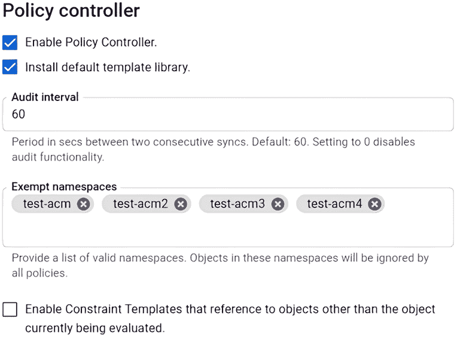

图 13.3 使用 GCP 控制台添加豁免

为命名空间标记以忽略 Gatekeeper 将导致准入控制器忽略该命名空间中创建的任何对象的 *所有* 策略。与其从每个策略中豁免命名空间，你可能会考虑从单个策略中豁免命名空间，这样你可以执行某些策略，同时仅豁免命名空间中对象创建所需的策略。

从约束模板中豁免命名空间

如果你发现自己处于需要从策略中豁免特定命名空间的情况，但你不能从 *所有* 策略中豁免该命名空间，你可以向约束本身添加豁免。例如，假设我们有一个要求所有命名空间都必须分配计费代码的策略。然而，我们希望豁免 kube-system 命名空间以及将要创建的新命名空间 web-frontend。我们可以通过向我们的约束中添加 excludedNamespaces 字段来实现这一点，如下所示：

```
apiVersion: constraints.gatekeeper.sh/v1beta1
kind: K8sRequiredLabels
metadata:
  name: ns-billing
spec:
  match:
    kinds:
    - apiGroups: [""]
      kinds: ["Namespace"]
    excludedNamespaces:
 - kube-system
 - web-frontend
  parameters:
    labels:
    - key: "billing"
```

如果我们尝试创建一个名为 test-fail 的新命名空间，但没有标签，Gatekeeper 将会拒绝请求并显示以下错误：

```
Error from server ([denied by ns-billing] you must provide labels: {"billing"}): admission webhook "validation.gatekeeper.sh" denied the request: [denied by ns-billing] you must provide labels: {"billing"}
```

然而，如果我们尝试创建没有标签的 web-frontend 命名空间，如以下所示，Gatekeeper 将允许这样做，因为它包含在约束的 excludedNamespaces 中：

```
[root@localhost gke-bm]# kubectl create ns web-frontend
namespace/web-frontend created
```

ACM 通过提供从所有策略或仅某些策略中豁免命名空间的能力，提供了细粒度的控制。你可以为不同的命名空间混合使用这两种类型，为某个命名空间豁免所有策略，而其他命名空间可能仅豁免某些策略。尽量避免从所有策略中豁免命名空间，除非你有充分的理由这样做。一旦豁免，完全豁免的命名空间将永远不会执行任何策略。

虽然 Anthos 包含几个约束模板，但可能存在一些场景，你需要创建自定义约束。在下一节中，我们将解释如何创建自定义约束模板，这样你可以扩展包含的策略集。

创建约束模板

ACM 内置的默认模板库从早期版本中的少量策略增长到当前版本中的超过 32 个。Google 和社区继续向默认库添加策略，但你可能对你的集群有独特的策略需求，而 Google 并不提供。

如果你发现自己需要创建策略，你可以通过使用名为 Rego 的语言创建自己的策略来创建自定义约束模板。深入介绍 Rego 超出了本书的范围，但你可以在 [`mng.bz/X5e6`](http://mng.bz/X5e6) 上了解更多关于 Rego 以及如何使用它来创建策略的信息。

要创建一个新的模板，你需要创建一个新的 ConstraintTemplate 对象，该对象将包含用于评估策略的 Rego 代码。Google 提供了文档来帮助你创建模板，请参阅[`mng.bz/ydKq`](http://mng.bz/ydKq)。

下一个示例创建了一个新的模板，当创建新容器时将检查图像摘要：

```
apiVersion: templates.gatekeeper.sh/v1
kind: ConstraintTemplate
metadata:
  name: k8simagedigests
  annotations:
    metadata.gatekeeper.sh/title: "Image Digests"
    description: >-
      Requires container images to contain a digest.

      https://kubernetes.io/docs/concepts/containers/images/
spec:
  crd:
    spec:
      names:
        kind: K8sImageDigests
      validation:
        openAPIV3Schema:
          type: object
          description: >-
            Requires container images to contain a digest.

            https://kubernetes.io/docs/concepts/containers/images/
          properties:
            exemptImages:
              description: >-
                Any container that uses an image that matches an entry in this list will be excluded
                from enforcement. Prefix-matching can be signified with '*'. For example: 'my-image-*'.

                It is recommended that users use the fully-qualified Docker image name (e.g. start with a domain name)
                in order to avoid unexpectedly exempting images from an untrusted repository.
              type: array
              items:
                type: string
  targets:
    - target: admission.k8s.gatekeeper.sh
      rego: |
        package k8simagedigests

        import data.lib.exempt_container.is_exempt

        violation[{"msg": msg}] {
          container := input.review.object.spec.containers[_]
          not is_exempt(container)
          satisfied := [re_match("@[a-z0-9]+([+._-][a-z0-9]+)*:[a-zA-Z0-9=_-]+", container.image)]
          not all(satisfied)
          msg := sprintf("container <%v> uses an image without a digest <%v>", [container.name, container.image])
        }

        violation[{"msg": msg}] {
          container := input.review.object.spec.initContainers[_]
          not is_exempt(container)
          satisfied := [re_match("@[a-z0-9]+([+._-][a-z0-9]+)*:[a-zA-Z0-9=_-]+", container.image)]
          not all(satisfied)
          msg := sprintf("initContainer <%v> uses an image without a digest <%v>", [container.name, container.image])
        }

        violation[{"msg": msg}] {
          container := input.review.object.spec.ephemeralContainers[_]
          not is_exempt(container)
          satisfied := [re_match("@[a-z0-9]+([+._-][a-z0-9]+)*:[a-zA-Z0-9=_-]+", container.image)]
          not all(satisfied)
          msg := sprintf("ephemeralContainer <%v> uses an image without a digest <%v>", [container.name, container.image])
        }
      libs:
        - |
          package lib.exempt_container

          is_exempt(container) {
              exempt_images := object.get(object.get(input, "parameters", {}), "exemptImages", [])
              img := container.image
              exemption := exempt_images[_]
              _matches_exemption(img, exemption)
          }

          _matches_exemption(img, exemption) {
              not endswith(exemption, "*")
              exemption == img
          }

          _matches_exemption(img, exemption) {
              endswith(exemption, "*")
              prefix := trim_suffix(exemption, "*")
              startswith(img, prefix)
          }
```

重要的是要注意，Rego 代码包含多个违规部分。乍一看，这些代码可能看起来是相同的，但仔细检查时，你会在 container :=行上注意到一个细微的差异。第一个违规块检查所有容器是否有摘要，而第二个违规块检查所有 initContainers 是否有摘要，第三个检查任何 ephemeralContainers。因为它们都是独特的对象，所以我们需要在我们的代码中包含每个对象，否则策略引擎将不会检查它们。

最后，为了激活约束，我们应用了一个使用之前模板创建的新自定义资源 manifest，即 K8sImageDigests：

```
apiVersion: constraints.gatekeeper.sh/v1beta1
kind: K8sImageDigests
metadata:
  name: container-image-must-have-digest
spec:
  match:
    kinds:
      - apiGroups: [""]
        kinds: ["Pod"]
```

一旦应用到集群中，任何没有提供摘要的新 Pod 请求都将被准入控制器拒绝。

### 13.4.2 使用二进制授权来保护供应链

自从 SolarWinds 安全漏洞以来，人们开始关注如何保护你的软件供应链。你应该始终考虑并实施这一点，但通常需要像 SolarWinds 漏洞这样的事件来吸引公众的注意。保护供应链是一个大话题，要给它应有的关注就需要一个专门的章节，但我们想提供一个概述，介绍 Google 提供的工具，以帮助你保护你的供应链。

你可能最近听说过“左移安全”这个短语。这个术语指的是在软件开发过程中更早地考虑安全性的做法。在左移时，你应该考虑多个主题；如果你想阅读由包括 Google、CloudBees、德勤等公司赞助的独立报告，请阅读 2019 年的《DevOps 状态》，它涵盖了多家公司的关键发现及其 DevOps 实践，请参阅[`cloud.google.com/devops/state-of-devops`](https://cloud.google.com/devops/state-of-devops)。

Anthos 包括一个强大的工具，它将 Anthos on GCP 和 Anthos on-prem 上的工作负载的软件供应链安全性集中化，称为二进制授权（BinAuth）。从高层次来看，BinAuth 通过要求部署的镜像上有受信任的权威签名来为你的集群增加安全性，这在容器部署时得到验证。如果部署的容器不包含与受信任的权威匹配的签名，它将被拒绝调度并失败部署。Google 的 BinAuth 为你提供了几个功能，包括以下内容：

+   策略创建

+   策略执行和验证

+   云安全命令中心集成

+   审计日志

+   云 KMS 支持

+   使用开源工具 Kritis 进行签名验证

+   支持模拟运行

+   紧急支持

+   支持第三方工具，包括 Twistlock、Terraform 和 CloudBees 的支持

除了提供的功能外，您可以将 BinAuth 与 Google 的 Cloud Build 和容器注册库扫描集成，允许您根据构建元数据和漏洞扫描结果来保护您的供应链。Google 在二进制授权页面提供了多个集成文档，该页面位于[`cloud.google.com/binary-authorization/`](https://cloud.google.com/binary-authorization/)，它将指导您如何将 BinAuth 与 CircleCI、Black Duck、Terraform 和 Cloud Build 等系统集成。

### 13.4.3 使用 Gatekeeper 替代 PSPs

随着 Kubernetes 弃用 PSPs，您可能希望开始逐步停止使用 PSPs 来保护您的集群。从 PSPs 作为主要安全机制中退出的一种方法是将使用 Gatekeeper 策略。Gatekeeper 项目有一个 GitHub 存储库，专门用于设计用于替代 PSPs 的策略，该存储库位于[`mng.bz/Ml6n`](http://mng.bz/Ml6n)。

在下一节中，我们将通过了解如何使用 Google 容器扫描来保护镜像来结束本章。

## 13.5 理解容器扫描

与任何标准操作系统或应用程序一样，容器可能包含已知漏洞的二进制文件。为了确保您的集群安全，您需要通过持续扫描每个容器来验证其完整性。

市场上许多解决方案，包括 Aqua Security、Twistlock、Harbor 和 Google 的容器注册库，都会扫描容器以查找漏洞。这些工具中的每一个都提供不同级别的扫描能力——在大多数情况下，需要额外付费。至少，您希望扫描您的镜像以查找来自常见漏洞和暴露（CVE）列表的任何漏洞。

CVE 列表（[`cve.mitre.org/cve`](http://cve.mitre.org/cve)）是公开披露的各种软件组件（包括操作系统和库）的安全漏洞列表。列表中的条目仅包含漏洞的简要概述——它们不包含任何详细信息，如后果、风险或如何修复问题。要获取 CVE 的详细信息，每个条目都有一个链接，该链接将带您访问国家漏洞数据库，该数据库将提供有关 CVE 的额外详细信息，包括描述、严重性、引用和变更历史。

虽然 Anthos 不包含漏洞扫描器，但如果您将镜像存储在 Google 容器注册库中，Google 会提供扫描服务。在本节中，我们将解释如何在您的存储库中启用扫描以及如何查看扫描结果。

### 13.5.1 启用容器扫描

在您的注册表中启用扫描的第一个要求是在您的 GCP 项目中启用两个 API：容器分析 API 和容器扫描 API。容器分析 API 允许在您的项目中存储元数据，并且是免费的，而容器扫描 API 将启用漏洞扫描，并且按扫描的图像计费。您可以在扫描 API 的定价详情中查看 *[`mng.bz/aMjB`](http://mng.bz/aMjB)*.*

要使用 gcloud CLI 启用所需的 API，请按照以下步骤操作：

1.  按照以下方式设置您的默认项目。我们的示例使用了一个名为 test1-236415 的项目：

    ```
    gcloud config set project test1-236415
    ```

1.  接下来，启用容器分析 API：

    ```
    gcloud services enable containeranalysis.googleapis.com
    ```

1.  最后，启用容器扫描 API：

    ```
    gcloud services enable containerscanning.googleapis.com
    ```

一旦在项目上启用了 API，您将需要创建一个存储图像的存储库。下一个示例在 us-east4 位置创建了一个名为 docker-registry 的 Docker 注册表，并带有注册表的描述：

```
gcloud artifacts repositories create docker-registry --repository-format=docker --location=us-east4 --description="Docker Registry"   
```

要将图像推送到您的存储库，您需要在您的客户端上配置 Docker 以使用您的 GCP 凭据。GCP 中存储库的认证是按区域配置的。在上一个步骤中，我们在 us-east4 区域创建了一个注册表，因此要配置认证，我们将在此处执行 gcloud 命令：

```
gcloud auth configure-docker us-east4-docker.pkg.dev
```

现在，您的注册表和 Docker 已配置完毕，您可以使用注册表来存储图像。在下一节中，我们将解释如何标记图像并将它们推送到您的新存储库。

### 13.5.2 将图像添加到您的存储库

要将图像添加到 GCP 注册表，您将遵循与任何其他 Docker 注册表相同的步骤，但标记可能与您习惯的不同：

1.  如果您没有本地图像，您必须使用 Docker 构建新的图像或从另一个注册表拉取图像。

1.  使用您的 GCP 注册表标记图像。

1.  将新图像推送到注册表。

例如，要将 CentOS 8 图像添加到注册表，请按照以下步骤操作：

1.  从 Docker Hub 下载 CentOS 8 图像：

    ```
    docker pull centos:8
    ```

1.  接下来，使用 Google 注册表信息标记新拉取的图像。当您标记一个将存储在 GCP 注册表中的图像时，您必须遵循特定的命名约定。图像标记将使用以下约定：LOCATIONdocker .pkg.dev/<project_ID>/<repository>/<image_name>。在下一个示例中，区域是 us-east4，项目是 test-236415，注册表名称为 docker-registry：

    ```
    docker tag centos:8 us-east4-docker.pkg.dev/test1-236415/docker-registry/centos:8
    ```

1.  最后，将新图像推送到注册表：

    ```
    docker push  us-east4-docker.pkg.dev/test1-236415/docker-registry/centos:8
    ```

在下一节中，我们将解释如何查看您的图像以及其中发现的任何漏洞。

### 13.5.3 审查图像漏洞

由于我们的项目已启用所需的 API，每次图像推送到注册表时都会进行扫描。要审查漏洞，请打开 GCP 控制台并点击“Artifact Registry”>“Repositories”，如图 13.4 所示。

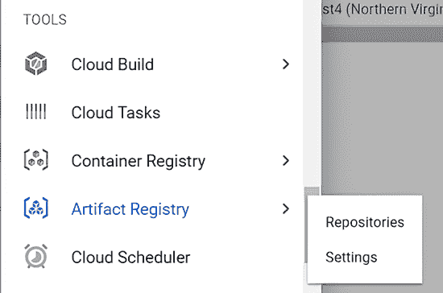

图 13.4 导航到您的注册表

这将显示您项目中的所有注册表。继续我们的示例，我们创建了一个名为 docker-registry 的注册表，如图 13.5 所示。

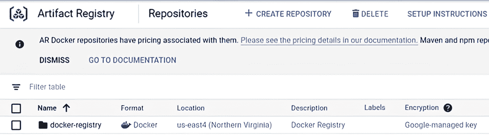

图 13.5 项目注册表

打开您推送图像到的存储库，并点击图像以查看它。之前，我们已经将 CentOS 图像推送到我们的注册表，如图 13.6 所示。

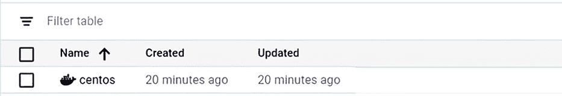

图 13.6 图像列表

点击图像将显示图像的摘要和图像包含的漏洞数量。我们的示例如图 13.7 所示。

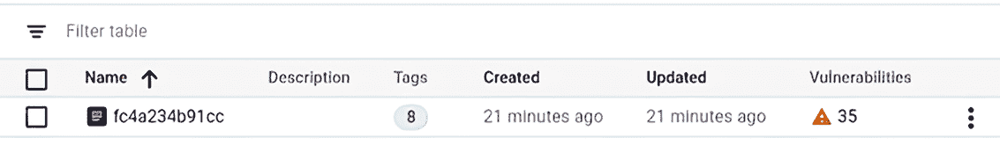

图 13.7 图像哈希列表

要查看每个漏洞，请点击漏洞列中的数字。将打开一个新窗口，列出图像的所有 CVE。根据图像和扫描结果，您可能看到不同的 CVE 链接或选项。以图 13.8 所示的 CentOS 图像示例，我们可以看到结果中有一个链接，可以查看每个 CVE 的修复方案。

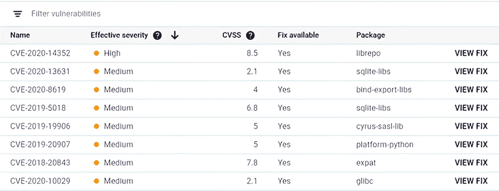

图 13.8 带修复的 CVE 示例列表

在另一个示例中，Ubuntu 图像的 CVE 中没有列出任何修复，因此结果屏幕将包含不同的选项，如图 13.9 所示。

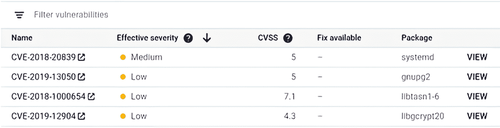

图 13.9 无修复的 CVE 示例

您可以通过点击名称列中的 CVE 来查看每个 CVE 的详细信息，或者您也可以点击右侧的“查看”。点击 CVE 名称将带您到供应商的网站，而点击“查看”将提供有关漏洞的更多详细信息。

在本节中，我们介绍了 Google 的容器注册表扫描，如何启用它以及如何查看扫描结果。这只是一个服务的介绍，但您可以通过与 Pub/Sub 集成、添加访问控制等功能来扩展其功能。要查看更多文档，您可以访问 Google 的如何操作指南，网址为[`mng.bz/gJ6E`](http://mng.bz/gJ6E)。

## 13.6 理解容器安全

在创建安全策略时，您应该考虑两个主要概念：容器将运行的用户以及容器是否可以以特权模式运行。这两个概念最终决定了潜在的容器突破对主机将有什么样的访问权限。

当容器启动时，它将以在图像创建时设置的用户的身份运行，这通常是 root 用户。然而，即使您以 root 用户运行容器，这并不意味着容器内的进程将在工作节点上具有 root 访问权限，因为 Docker 守护进程本身将根据有关特权容器的策略限制主机级别的访问。为了帮助解释这一点，表 13.3 显示了每个设置及其产生的权限。

表 13.3 根和特权容器权限

| 运行容器用户 | 特权值 | 主机权限 |
| --- | --- | --- |
| 以 root 用户运行 | False | None |
| 以 root 用户运行 | True | Root access |
| 以非 root 用户运行 | False | None |
| 以非 root 身份运行 | True | 受限；只有授予主机系统上同一用户的权限 |

两个值决定了运行容器在主机上将被授予的权限。仅仅以 root 身份运行镜像并不允许该容器在主机上以 root 身份运行。为了更详细地解释这种影响，我们将展示当你以 root 身份运行容器时会发生什么，以及允许用户部署特权容器如何使某人能够接管主机。

### 13.6.1 以 root 身份运行容器

多年来，容器安全已经获得了一些不良声誉。许多被用作支持这一点的证据的例子实际上并不是容器问题，而是集群上的配置问题。不久前，许多开发者创建了以 root 身份运行的新镜像，而不是创建一个新用户并以新用户身份运行，这限制了任何安全后果。这是一个提到如果你经常从第三方注册库下载镜像，你应该在使用它们在生产环境中之前始终在沙盒环境中运行它们的好时机。你不知道镜像是如何创建的，它以什么身份运行，或者它是否包含任何恶意代码。*在将镜像用于生产之前，始终检查镜像。*在本章的最后部分，我们将介绍 Google 容器扫描，它将扫描你的镜像以查找已知的安全问题。

你可以使用多个工具来限制恶意容器的部署，包括

+   *容器扫描*——包含在具有扫描功能的 Google 容器注册库中

+   *仅允许受信任的容器仓库*——无论是内部仓库还是受信任的合作伙伴注册库

+   *要求镜像签名*

最危险且常被忽视的安全问题之一是允许容器以 root 身份运行。为了解释为什么这是一个坏习惯，让我们用一个虚拟机示例来说明：你会允许应用程序以 root 或管理员身份运行吗？当然不会。如果你有一个以管理员身份运行其进程的 Web 服务器，任何应用程序突破都将授予运行该进程的用户权限。在这种情况下，那将是一个具有 root 或管理员权限的账户，这将提供对整个系统的完全访问权限。

为了减轻任何突破带来的问题，所有应用程序都应该使用它们所需的最小权限集运行。不幸的是，开发者以 root 身份运行容器的情况非常普遍。如果我们以 root 身份运行容器，任何容器突破都将使入侵者获得对主机上任何资源的访问权限。Docker Hub 和 GitHub 上许多镜像都是使用 root 作为默认用户分发的，包括常见的 busybox 镜像。

为了避免以 root 身份运行镜像，你需要在你的镜像中创建并设置一个用户账户，或者在你启动容器时提供一个用户账户。因为 busybox 通常是从 Docker Hub 拉取的，我们可以通过在部署中配置安全上下文来以非 root 账户运行它。

作为 Pod 定义的一部分，可以通过添加 securityContext 字段强制容器以用户身份运行，这允许您为用户、组和 fsGroup 设置上下文：

```
spec:
  securityContext:
    runAsUser: 1500
    runAsGroup: 1000
    fsGroup: 1200
```

使用带有 additional securityContext 的镜像部署将使容器以用户 1500 的身份执行。我们还设置了组为 1000，fsGroup 为 1200。我们可以使用 whoami 和 groups 命令确认所有这些值，如图 13.10 所示。

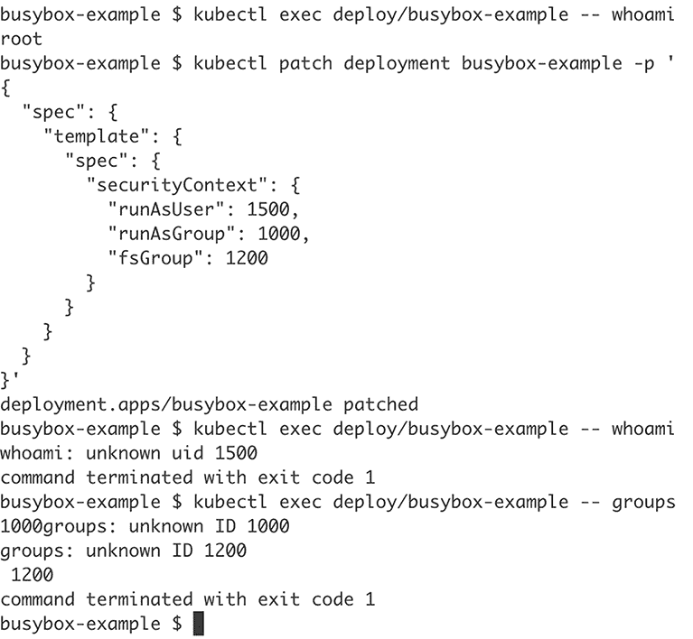

图 13.10 以 root 用户运行并使用 securityContext 更改定义的用户和用户组的 Pod

在镜像中使用的 UID 和组 ID 是未知的，因为它是从 Docker Hub 拉取的，并且它只包含在创建镜像时包含的用户和组。在您或您组织中的某人创建的镜像中，您会在 Docker 构建期间添加所需的组，并且不会收到未知 ID 警告。

在本节中，我们解释了如何在部署时设置安全上下文以以非 root 用户或组运行镜像。这仅涵盖了保护我们的主机免受恶意容器侵害的第一部分。下一节将解释特权容器如何影响我们的安全以及它们如何协同工作以提供对主机的访问。

### 13.6.2 运行特权容器

默认情况下，容器在没有主机权限的情况下执行。即使您以 root 用户启动容器，任何尝试编辑任何主机设置的尝试都将被拒绝，如图 13.11 所示。

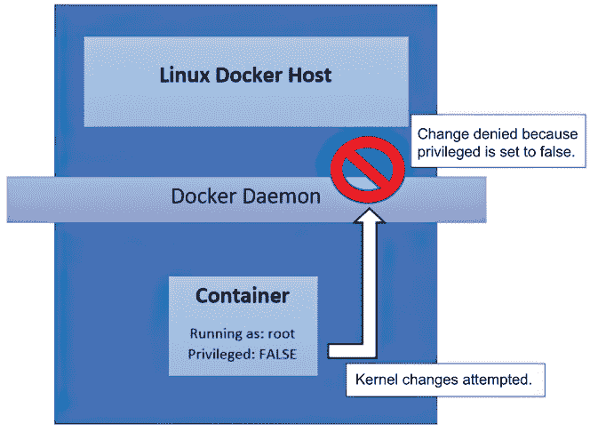

图 13.11 以 root 身份运行的非特权容器

例如，我们可以尝试从作为 root 用户运行但不是特权容器的容器中设置内核值，如图 13.12 所示。

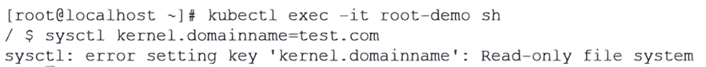

图 13.12 从没有权限的容器尝试的内核更改

内核更改被拒绝，因为运行中的镜像在主机系统上没有提升的权限。如果有一个原因需要从容器允许此操作，则可以以特权容器启动镜像。要运行特权容器，您需要在 Pod 的 securityContext 中允许它：

```
apiVersion: v1
kind: Pod
metadata:
  name: root-demo
spec:
  containers:
  - name: root-demo
    image: busybox
    command: [ "sh", "-c", "sleep 1h" ]
 securityContext:
 privileged: true
```

现在 Pod 已被允许以特权容器运行，并且正在以 root 身份运行，它将被允许更改内核参数，如图 13.13 所示。

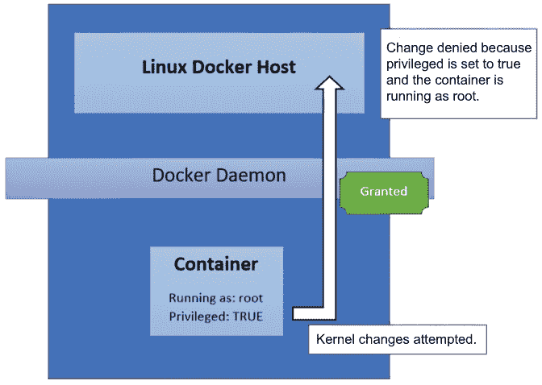

图 13.13 以 root 身份运行的特权容器

在图 13.14 中，请注意域名更改没有返回错误，这验证了容器可以修改主机级别的设置。

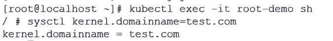

图 13.14 从运行中的容器允许的主机内核更改

这次，内核更改成功有两个原因：容器正在以*root*用户身份运行，并且容器被允许以*特权容器*启动。

对于最后一个场景，manifest 已被编辑为以用户 1000 运行，该用户没有 root 权限，并且以特权容器启动：

```
apiVersion: v1
kind: Pod
metadata:
  name: root-demo
spec:
  containers:
  - name: root-demo
    image: busybox
    command: [ "sh", "-c", "sleep 1h" ]
    securityContext:
 privileged: true
 runAsUser: 1000
```

尽管容器以特权容器的身份运行，但用户是标准用户，因此任何内核更改都将被拒绝，如图 13.15 所示。

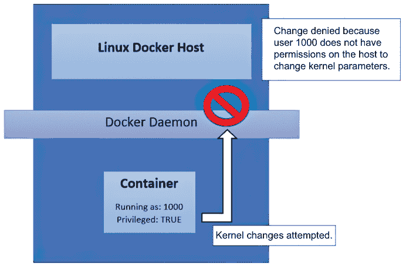

图 13.15 以非 root 身份运行的特权容器

总结来说，控制容器在主机上可以执行的操作是由容器中运行的用户以及容器是否被允许以特权容器身份运行来控制的。为了保护集群，您需要创建一个策略，该策略定义了每个这些值的控制措施。

目前，你知道为什么不应该允许容器以 root 身份运行，以及为什么你应该限制允许以特权容器身份运行的 Pods，但我们还没有解释如何在集群上阻止这些操作之一的发生。这是 Anthos 专长的一个领域！通过提供 Anthos Config Manager，Google 包含了您需要使用这些以及其他许多常见安全设置来保护您的集群的所有工具。

在下一节中，我们将解释如何使用包含的策略管理器 Gatekeeper 通过 ACM 来保护集群。

## 13.7 使用 ACM 保护您的服务网格

正如你在本书的整个过程中所看到的，Anthos 不仅仅提供基本的 Kubernetes 集群。它还提供了额外的组件，如 Anthos Service Mesh (ASM) 以提供服务网格，二进制授权，无服务器工作负载，以及 ACM 来处理基础设施即代码。

在第十一章中，你学习了如何设计和配置 ACM 以在 Anthos 集群上实施部署和对象。在本节中，我们将使用策略通过 ACM 保护集群中服务之间的通信。然后我们将继续介绍 ACM 包含的另一个组件，即策略控制器，它提供了一个基于开源项目 Gatekeeper 的准入控制器。

注意：当使用 ACM 策略启用 mTLS 时，请记住，该策略将应用于所有由外部存储库管理的集群，除非您使用 ClusterSelector 来限制将配置的集群。

### 13.7.1 使用 ACM 实施双向 TLS

在第四章中，你学习了 ASM 包括使用双向 TLS (mTLS) 加密服务之间流量的能力。双向 TLS 是在通过 Istio 的 sidecar 允许服务之间通信之前验证服务身份的过程。一旦身份得到验证，服务之间的通信将被加密。然而，默认情况下，Istio 被配置为使用宽容的 mTLS。宽容的 mTLS 允许没有 sidecar 运行的作业使用 HTTP（明文）与启用 sidecar 的服务进行通信。

对于服务网格新手来说，开发者或管理员通常使用宽容设置。虽然这对学习 Istio 有益，但允许 HTTP 流量进入运行 sidecar 的服务会使它不安全，从而抵消了 Istio 和 sidecar 的优势。一旦您对 Istio 感到舒适，您可能希望考虑将宽容策略更改为更安全的严格设置。

您可以通过创建一个名为 PeerAuthentication 的 Kubernetes 对象来强制整个网格或仅某些命名空间使用严格的 mTLS。对于每个组织和集群来说，决定 mTLS 的正确作用域都是不同的。您应该在将任何 mTLS 策略更改部署到生产环境之前，始终在开发环境中进行测试，以避免任何意外应用故障。

由于这是一个重要的策略，它是一个完美的例子，用以展示使用 ACM 作为配置管理工具的重要性。请记住，一旦对象被 ACM 管理，配置管理器将控制它。这意味着管理器将重新创建任何因任何原因编辑或删除的管理对象。对于 mTLS 用例，您应该看到使用 ACM 确保策略设置以及如果编辑，则修复到配置的严格值的重要性。

要启用全局严格的 mTLS 策略，您需要创建一个新的 PeerAuthentication 对象，并将 mTLS 模式设置为严格。下面是一个示例清单：

```
apiVersion: security.istio.io/v1beta1
kind: PeerAuthentication
metadata:
  name: default
  namespace: istio-system
spec:
  mtls:
    mode: STRICT
```

清单假设 Istio 已安装在 istio-system 命名空间中。因为命名空间选择器是 istio-system 命名空间，它将为集群中的所有命名空间强制执行严格的 mTLS 策略。

注意：为了强制执行集群中每个命名空间的严格 mTLS 策略，PeerAuthentication 对象必须创建在 Istio 安装的相同命名空间中。默认情况下，这是 istio-system 命名空间。

如果您决定实施按命名空间强制执行，清单需要单一修改，即命名空间值。例如，如果我们想在一个名为 webfront 的命名空间上启用 mTLS，我们会使用以下清单：

```
apiVersion: security.istio.io/v1beta1
kind: PeerAuthentication
metadata:
  name: default
  namespace: webfront
spec:
  mtls:
    mode: STRICT
```

要使用这些清单中的任何一个与 ACM 强制执行严格的 mTLS 网格策略，您只需将其存储在您的 ACM 存储库中。因为策略存储在 ACM 存储库中，它将由控制器管理，任何更改或删除都将导致使用严格设置重新创建对象。mTLS 策略只是我们如何使用 ACM 和 ASM 一起强制执行集群安全策略的一个示例。

## 13.8 结论

ACM 的策略引擎是所有 Anthos 集群中包含的一个强大附加组件。Gatekeeper 允许组织创建细粒度的策略，通过提供额外的安全性和稳定性来保护集群免受潜在攻击者的影响。Google 提供了一系列默认策略，这些策略解决了从社区和 Google 自身经验中收集的一些最常见的安全问题。如果包含的策略库没有解决你组织中的安全问题，你可以使用 Gatekeeper 的策略语言 Rego 创建自己的策略。

## 13.9 示例和案例研究

使用本章的知识，解决以下案例研究中的每个要求。

### 13.9.1 永恒工业

永恒工业要求你评估其 Anthos Kubernetes 集群的安全性。集群已按以下方式配置：

+   多个控制平面节点

+   多个工作节点

+   ASM 提供 Istio，配置为宽容的 mTLS

+   ACM 配置了启用了策略引擎，包括默认模板库

他们要求你记录任何当前的安全问题以及补救措施，以满足以下要求：

+   审计任何安全问题，并提供任何由策略覆盖的利用的证明。

+   所有容器只允许从批准的注册表列表中拉取，包括以下这些：

    +   gcr.io

    +   hub.evermore.local

+   除了批准的注册表策略之外，所有策略都必须在实施前进行测试，以评估其后果。

+   容器必须拒绝任何权限提升尝试，而不影响任何 Anthos 命名空间，包括以下这些：

    +   kube-system

    +   gke-system

    +   config-management-system

    +   gatekeeper-system

    +   gke-connect

+   容器不得能够在除了 kube-system 命名空间之外的任何命名空间中使用 hostPID、hostNetwork 或 hostIPC。

+   必须仅使用现有的 Anthos 工具来满足所有要求。

下一个部分包含了解决永恒工业要求的解决方案。你可以跟随解决方案进行操作，或者如果你感到舒适，配置你的集群以满足要求并使用解决方案来验证你的结果。

永恒工业解决方案：测试当前安全性

满足要求 1

第一个要求需要你记录当前集群中存在的任何安全问题。为了测试前三个安全要求，你可以部署一个尝试提升容器权限的清单。测试清单应从不在批准列表中的注册表中拉取镜像，并将字段设置为提升权限和不同的主机值。我们在此提供了一个示例清单：

```
apiVersion: v1
kind: Pod
metadata:
  labels:
    run: hack-example
  name: hack-example
spec:
  hostPID: true
  hostIPC: true
  hostNetwork: true
  volumes:
  - name: host-fs
    hostPath:
      path: /
  containers:
  - image: docker.io/busybox
    name: hack-example
    command: ["/bin/sh", "-c", "sleep infinity"]
    securityContext:
      privileged: true
      allowPrivilegeEscalation: true
    volumeMounts:
    - name: host-fs
      mountPath: /host
```

此清单将在单个部署中测试所有安全要求。正在拉取的镜像标签来自 docker.io，它不在批准的注册表列表中。它还将主机的根文件系统映射到容器的/mount/host 位置，并以特权容器的形式启动。

由于容器启动成功，我们可以记录集群可以从不在接受列表中的注册表中拉取镜像。成功的启动还表明 Pod 以特权容器启动，并且对 hostPath 的挂载也成功了。为了记录容器确实可以访问主机文件系统，我们可以访问镜像并列出/host 目录。图 13.16 显示我们可以成功列出主机的根文件系统。

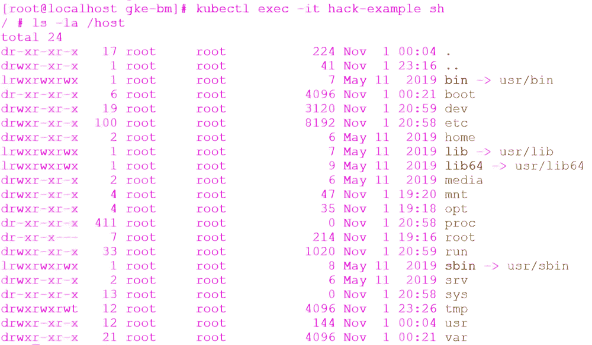

图 13.16 在容器中访问主机文件系统

在捕获输出并将其添加到文档后，您可以删除 Pod，因为我们将在下一个测试中启用策略来测试相同的部署。您可以通过执行 kubectl delete -f use-case1.yaml 来删除它。

Evermore Industries 解决方案：添加仓库约束

满足要求 2

Evermore 的第二项要求是容器只能从受信任的注册表中拉取。在需求中，只有从 gcr.io 和 hub.evermore.local 拉取的镜像被允许在集群中部署。

为了限制镜像只从两个注册表拉取，我们需要创建一个新的 ConstraintTemplate，该模板使用 k8sallowedrepos.constraints.gatekeeper.sh 对象。下面提供了一个 ConstraintTemplate 的示例：

```
apiVersion: constraints.gatekeeper.sh/v1beta1
kind: K8sAllowedRepos
metadata:
  name: allowed-registries
spec:
  match:
    kinds:
      - apiGroups: [""]
        kinds: ["Pod"]
  parameters:
    repos:
      - "gcr.io"
      - "hub.evermore.local"
```

一旦部署了此清单，任何尝试从除 gcr.io 和 hub.evermore.local 之外的注册表拉取镜像的尝试都将导致准入控制器拒绝 Pod 创建，并出现以下错误，即使用了无效的镜像仓库：

```
Error creating: admission webhook "validation.gatekeeper.sh" denied the request: [denied by allowed-registries] container <nginx2> has an invalid image repo <bitnami/nginx>, allowed repos are ["gcr.io", ""hub.evermore.local""]
```

现在我们已经解决了要求 2，我们可以继续解决要求 3 和 4。

Evermore Industries 解决方案：添加特权约束

满足要求 3 和 4

我们需要解决 Evermore 集群的安全需求。为了保护集群免受运行特权 Pod 的影响，但不影响任何 Anthos 系统命名空间中的 Pod，我们需要启用一个带有豁免的约束。然而，在启用约束之前，Evermore 要求所有约束都必须经过测试，并且受影响 Pod 的输出作为文档的一部分提供。

第一步是创建一个清单来创建约束。下面显示的清单仅创建一个名为 privileged-containers 的约束，处于审计模式。它还排除了 Evermore 在需求文档中提供的所有系统命名空间：

```
apiVersion: constraints.gatekeeper.sh/v1beta1
kind: K8sPSPPrivilegedContainer
metadata:
  name: privileged-containers
spec:
  enforcementAction: dryrun
  excludedNamespaces:
    - kube-system
    - gke-system
    - config-management-system
    - gatekeeper-system
    - gke-connect
  match:
    kinds:
      - apiGroups: [""]
        kinds: ["Pod"]
```

要将审计输出添加到文档中，您必须描述约束并将输出重定向到文件，通过执行以下 kubectl 命令：

```
kubectl get K8sPSPPrivilegedContainer psp-privileged-container -o yaml > privtest
```

这将在当前文件夹中创建一个名为 privtest 的文件，包含 psp-privileged-container 约束的审计结果。您应该检查该文件，以验证它是否包含在违规部分下的预期审计结果。以下是我们审计的简略输出：

```
  violations:
  - enforcementAction: dryrun
    kind: Pod
    message: 'Privileged container is not allowed: cilium-agent, securityContext:
      {"capabilities": {"add": ["NET_ADMIN", "SYS_MODULE"]}, "privileged": true}'
    name: anetd-4qbw5
    namespace: kube-system
  - enforcementAction: dryrun
    kind: Pod
    message: 'Privileged container is not allowed: clean-cilium-state, securityContext:
      {"capabilities": {"add": ["NET_ADMIN"]}, "privileged": true}'
    name: anetd-4qbw5
```

你可能已经注意到，审计输出包含被添加为排除项的命名空间中运行的 Pods。请记住，当你在一个约束中排除一个命名空间时，该命名空间仍然会被审计——排除项只会阻止策略被强制执行。

由于输出看起来正确，我们可以强制执行策略以满足安全要求，拒绝特权容器。要删除现有的约束，请使用清单文件执行 kubectl delete -f <清单文件>。

接下来，更新清单文件，从清单中删除 enforcementAction: dryrun 行，并重新部署约束。

Evermore Industries 解决方案：添加主机约束

满足要求 5

来自 Evermore 的第五个要求是在所有命名空间中拒绝 hostPID、hostNetwork 和 hostIPC，除了 kube-system。我们还需要在实施之前测试策略，如要求所述。

为了满足既定要求，我们需要实施两个新的策略。第一个是 k8spsphostnamespace，它将阻止对包括 hostPID 和 hostIPC 在内的主机命名空间的访问。最后，为了解决阻止 hostNetwork 的问题，我们需要实施 k8spsphostnetworkingports 策略。

要阻止从所有命名空间（除了 kube-system）访问主机命名空间，您需要创建一个新的约束，该约束豁免 kube-system。我们还需要在实施之前测试约束，因此需要将 enforcementAction 设置为 dryrun。以下是一个示例清单：

```
apiVersion: constraints.gatekeeper.sh/v1beta1
kind: K8sPSPHostNamespace
metadata:
  name: psp-host-namespace
spec:
  enforcementAction: dryrun
  excludedNamespaces:
    - kube-system
  match:
    kinds:
      - apiGroups: [""]
        kinds: ["Pod"]
```

在此清单部署之后，任何尝试使用主机命名空间（如 hostPID）的 Pod 都会被准入控制器拒绝启动。设置 dryrun 选项将仅审计策略，而不强制执行。一旦测试通过，您可以从清单中删除 enforcementAction: dryrun 并部署它以强制执行策略。

要阻止主机网络，我们需要创建另一个约束，该约束将使用 k8spsphostnetworkingports 策略：

```
apiVersion: constraints.gatekeeper.sh/v1beta1
kind: K8sPSPHostNetworkingPorts
metadata:
  name: psp-host-network-ports
spec:
  enforcementAction: dryrun
  excludedNamespaces:
    - kube-system

  match:
    kinds:
      - apiGroups: [""]
        kinds: ["Pod"]
  parameters:
    hostNetwork: false
```

就像之前的约束一样，我们包括了 dryrun 选项，在强制执行之前测试约束。一旦测试并通过部署，任何尝试将 hostNetwork 设置为 true 的 Pod 都会被准入控制器拒绝，并显示以下错误，指出只允许 hostNetwork=false：

```
Error creating: admission webhook "validation.gatekeeper.sh" denied the request: [denied by psp-host-network-ports] The specified hostNetwork and hostPort are not allowed, pod: privileged-test-7694b64776-qmp47\. Allowed values: {"hostNetwork": false}
```

恭喜！通过部署最后两个约束，我们已经满足了 Evermore 的所有要求。

## 摘要

+   根和特权容器可以被用来接管未受保护的主机。

+   Anthos 可以通过部署内置策略或使用 Anthos Configuration Management 部署的自定义策略来保护集群。

+   虚拟机比容器提供更好的安全性。两种模式都有独特的安全关注点，并且必须正确部署，从它们部署的开始就要考虑安全性。

+   我们概述了 Kubernetes 的安全性和 Anthos 包含的功能，以帮助解决集群中的安全担忧，包括 ACM 和 ASM。

+   以 root 或特权容器运行容器的安全问题可能被用来危害主机。

+   您可以使用 ACM 功能通过 Gatekeeper 以及由 Anthos 提供的包含约束模板库来保护集群。

+   谷歌的容器漏洞扫描引擎可以识别容器漏洞。

* * *

(1.) Kubernetes.io 提供了一组初始推荐：[`mng.bz/nJyK`](http://mng.bz/nJyK)。
