# 14 市场概览

安东尼奥·古利

本章节涵盖

+   公共 Google 市场

+   私有 Google 市场

+   部署市场解决方案

+   现实场景

Google Cloud Marketplace 是一个一站式解决方案，用于尝试、购买、配置、管理和部署软件产品。通常，多个供应商提供相同的包，为您的特定用例和行业提供了操作系统、虚拟机、容器、存储成本、执行环境和 SaaS 服务等方面的多种选择。Google Cloud 为新用户提供了一笔初始信用额度，这笔额度也可以在市场中使用。截至 2023 年 1 月，这笔信用额度为 300 美元，但未来可能会有所变化。在本章中，我们将讨论如何使用 Google Cloud Marketplace 在不同的 Kubernetes 环境中自动部署包，包括 Anthos、GKE 和本地 GKE。当涉及到简化开发者体验时，市场通过尽可能简化用户安装组件的过程，同时利用维护者/提供者的最佳实践配置来增加价值。

## 14.1 Google 市场

Google Cloud Platform (GCP) 市场网站 ([`cloud.google.com/marketplace`](http://cloud.google.com/marketplace)) 为 GCP 客户提供了一个单一的地方，用于查找免费和付费应用程序，这些应用程序由 Google 或第三方合作伙伴提供，扩展了平台提供的内容。部署可以使用默认配置，也可以针对特定需求进行定制，例如增加内存、存储或使用更大的 vCPU 提供更多的计算能力。每个包都有安装后获取帮助的具体说明。请注意，市场团队会持续更新每个镜像，以修复关键问题和错误。然而，更新您环境中已部署的解决方案是您的责任。

### 14.1.1 公共市场

目前，在 GCP 上有超过两千种解决方案可供使用，包括合适的应用程序包和数据集。您可以通过点击云控制台中的市场链接来访问 GCP 市场。要选择一个包，您可以搜索包名称或使用市场屏幕左侧的面板进行浏览，如图 14.1 所示。市场中的解决方案使得通过简单的“点击”操作部署新应用程序变得容易，这在多个环境中都是一样的，无论是在公共云还是在本地。

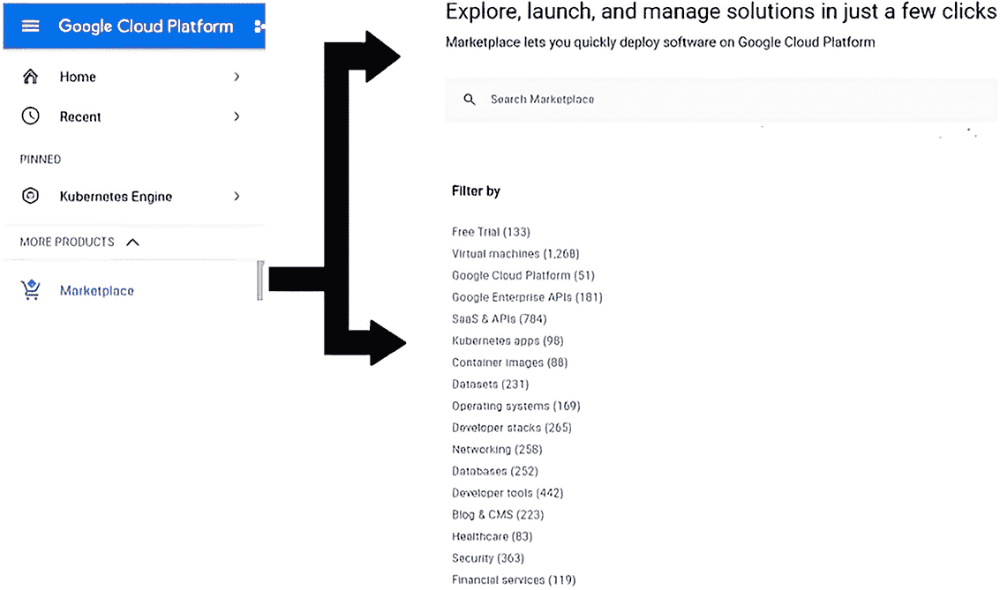

图 14.1 通过 GCP 控制台访问市场并列出包

对于本书的范围，我们关注在 Kubernetes 上运行的应用程序。从 Google Cloud Marketplace 网站，选择“探索市场”，您将到达市场提供的产品（[`mng.bz/41Nv`](http://mng.bz/41Nv)）。在左侧的类型面板中，选择 Kubernetes 应用。目前，大约有 100 种不同领域的解决方案可供 GKE 使用，包括网络、数据库、分析、机器学习、监控、存储等，如图 14.2 所示。

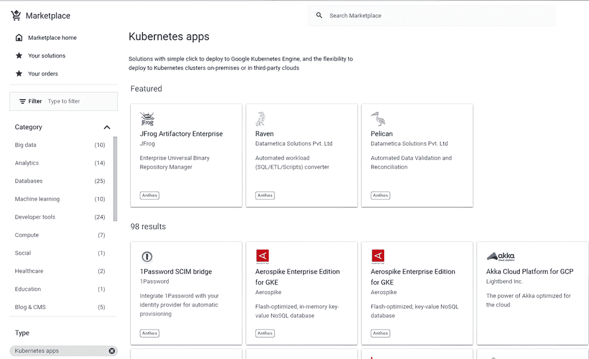

图 14.2 Anthos GKE 环境可用的解决方案

解决方案根据许可模式进行分类：开源、付费或“自带许可证”（BYOL）。BYOL 是一种许可模式，允许企业灵活地使用其许可证，无论是在本地还是在云端。

截至 2023 年 3 月，大约有 70 种解决方案已针对 GKE on-prem 环境进行了测试。我们可以通过向搜索选项添加适当的过滤器部署-env:gke-on-prem，如图 14.3 所示，来查看本地解决方案。截至 2023 年 3 月，已有 93 种解决方案针对 Anthos 环境进行了测试。

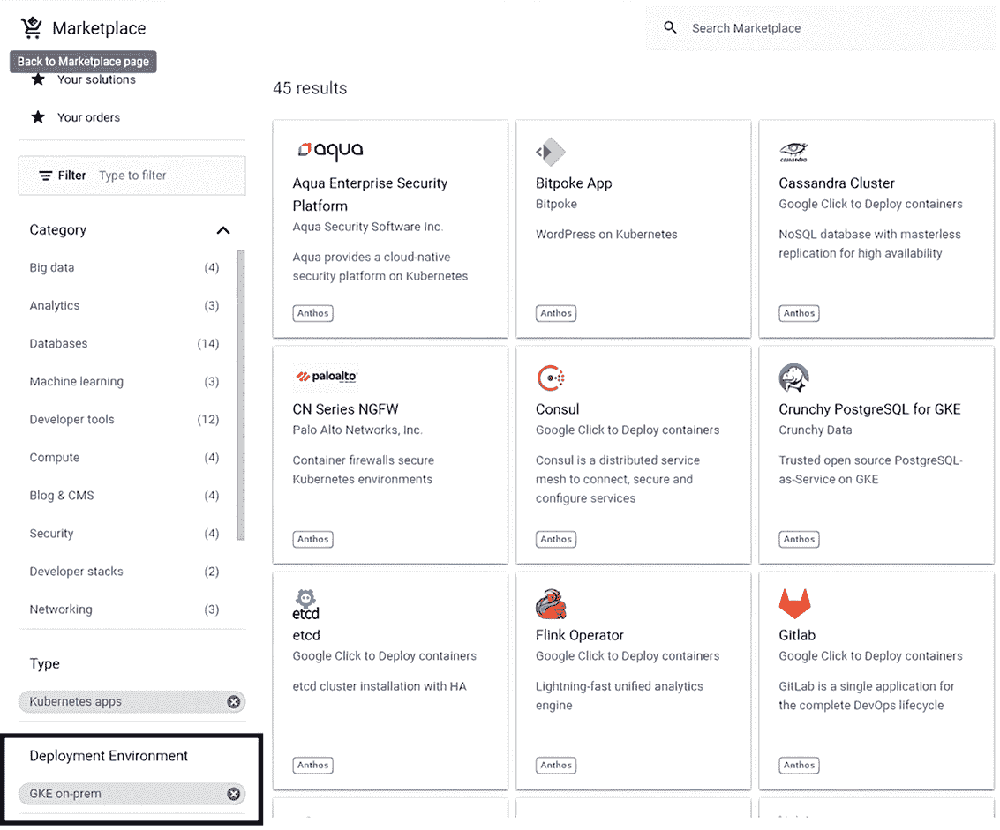

图 14.3 Anthos GKE-on-prem 环境可用的解决方案

在浏览市场中的解决方案时，您可以通过寻找列表中附带的“与 Anthos 兼容”标志来识别与 Anthos 兼容的第三方解决方案。在图 14.4 中，您可以看到带有小 Anthos 按钮的解决方案。此按钮展示了经过认证可与 Anthos 一起工作的解决方案。这些列表符合 Anthos Ready 计划的要求（[`cloud.google.com/anthos/docs/resources/anthos-ready-partners`](https://cloud.google.com/anthos/docs/resources/anthos-ready-partners)），该计划确定了遵守 Google Cloud 互操作性要求的合作伙伴解决方案，并经过验证可与 Anthos 平台一起工作，以满足企业客户的基础设施和应用开发需求。为了符合条件，合作伙伴提供的解决方案必须完成、通过并维护集成要求，以获得“与 Anthos 兼容”徽章。

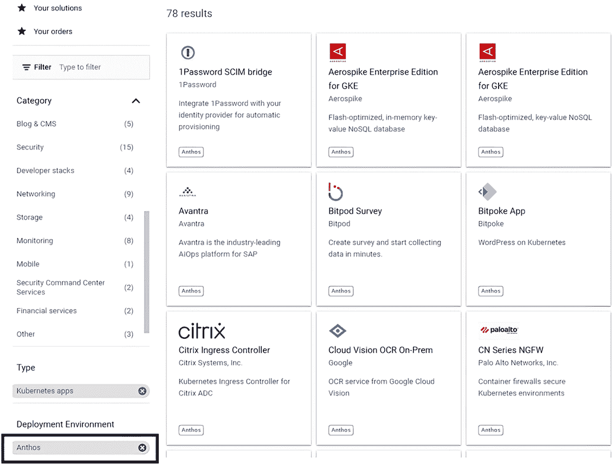

图 14.4 Anthos 环境可用的解决方案

如果你选择了一个经过 Anthos 认证的提供产品，你将在所选提供产品的详细信息屏幕中看到“与 Anthos 兼容”的标志，如图 14.5 所示。

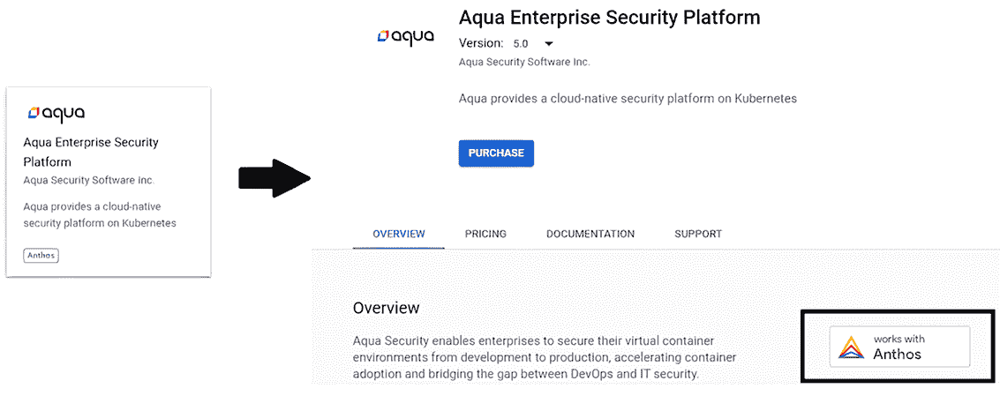

图 14.5 一个经过认证“与 Anthos 兼容”的示例解决方案

公共市场为各企业提供由 NetApp、Aqua、JFrog 和 Citrix 等不同供应商提供的多个应用程序的快速部署。但如果你想要为你的开发者添加自己的解决方案呢？当然，你可能不希望这个解决方案包含在公共市场中，而 Google 通过提供私有市场来满足这一需求，我们将在下一节中讨论。

### 14.1.2 服务目录

服务目录为私有企业提供市场功能，以便内部使用，而不将其内部暴露给世界上的其他人。管理员可以在组织、文件夹和项目级别管理应用程序的可见性和部署权限。部署经理可以根据企业政策定义预设配置，例如部署区域、用于部署的服务器类型、部署权限和其他参数。

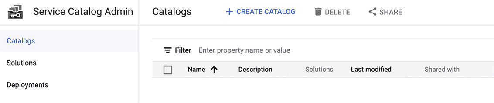

图 14.6 访问服务目录

您可以通过云控制台导航菜单下的工具访问服务目录（见图 14.6）。从那里，您可以创建新的私有市场、添加应用程序和配置访问权限。每个服务目录应由一个 GCP 项目托管，您可以在文件夹和项目级别添加目录 IAM 权限。与 GCP 组织、文件夹或项目共享目录允许客户与其最终用户共享他们的解决方案。步骤非常直观，感兴趣的读者可以在网上找到更多信息（[`cloud.google.com/service-catalog`](https://cloud.google.com/service-catalog)）。

### 14.1.3 在 GKE on-prem 集群上部署

如果您打算将市场中的解决方案部署到 Anthos GKE 本地集群，那么您需要在目标集群上定义一个或多个命名空间，并使用 Secret 注解它们，这将允许您部署所选的解决方案。以下步骤是必需的：

1.  如果您的集群运行 Istio，则默认情况下会阻止对第三方服务的任何外部连接，因此配置 Istio 出站流量以允许连接到外部操作系统软件仓库非常重要（参见第四章）。

1.  您需要通过创建允许访问 marketplace.gcr.io 的防火墙或代理规则来允许从 Google 容器注册库下载镜像。

1.  在您的 GKE on-prem 集群中，您可能需要创建一个 Google Cloud 服务账户。这可以通过类似以下方式的云壳完成：

    ```
    gcloud iam service-accounts create sa-name \
        --description="sa-description" \
        --display-name="sa-display-name"
    ```

1.  使用令牌或具有 Kubernetes 集群管理员角色的 Kubernetes 服务账户凭据登录到您的 Anthos GKE 本地集群。（角色在第三章中讨论过。）这将允许您对任何资源执行任何操作的超用户访问权限。

    从控制台，您可以通过运行以下命令生成一个新的公钥/私钥对并将其下载到您的机器上：

    ```
    gcloud iam service-accounts keys create ~/key.json \
      --iam-account sa-name@project-id.iam.gserviceaccount.com
    ```

1.  如果您是第一次从云市场部署，请通过运行以下命令在您的集群中创建一个应用-system 命名空间：

    ```
    kubectl create namespace application-system
    ```

1.  然后，创建包含应用-system 的 imagePullSecret 的 Kubernetes Secret：

    ```
    JSON_KEY_FILENAME=path_to/service_account_key.json
    IMAGEPULLSECRET_NAME=gcr-json-key
    kubectl create secret docker-registry $IMAGEPULLSECRET_NAME \
      --namespace="application-system" \
      --docker-server=gcr.io \
      --docker-username=_json_key \
      --docker-password="$(cat $JSON_KEY_FILENAME)"
    ```

1.  下一步是将 imagePullSecret 应用到应用-system 命名空间中的默认服务账户：

    ```
    kubectl patch sa default -n application-system -p '"imagePullSecrets": [{"name": "gcr-json-key" }]'
    ```

1.  最后，对于您想要在其中部署应用程序的每个命名空间，您必须创建一个新的 Secret，并使用以下命令将命名空间注解为该 Secret：

    ```
    JSON_KEY_FILENAME=path_to/service_account_key.json
    IMAGEPULLSECRET_NAME=gcr-json-key
    kubectl create secret docker-registry $IMAGEPULLSECRET_NAME \
      --namespace=$NAMESPACE_NAME \
      --docker-server=gcr.io \
      --docker-username=_json_key \
      --docker-password="$(cat ~/$JSON_KEY_FILENAME)"

    kubectl annotate namespace $NAMESPACE_NAME marketplace.cloud.google.com/imagePullSecret=$IMAGEPULLSECRET_NAME
    ```

1.  一旦按照上一步所述定义了 $NAMESPACE_NAME，此命名空间就可以用于在您的本地集群上安装。

换句话说，在 Anthos 上部署，无论是在 GCP 上还是在本地，只需在您的目标 Kubernetes 集群上定义适当的命名空间，并用用于拉取解决方案镜像的 Secret 密钥注解该命名空间即可。

在下一节中，我们将介绍如何安装属于不同类别的几个预定义解决方案，包括现代化工具、数据库、监控和日志、CI/CD、生产力和机器学习。

## 14.2 实际场景

在本节中，我们简要介绍了如何在 Anthos 上部署可用的 Marketplace 解决方案。我们的示例故意具有异质性，并属于不同的类别。请注意，在您从 Cloud Marketplace 启动部署后，您可以使用 Google Cloud 工具查看、修改和监控您的部署。例如，您可以使用 Cloud Deployment Manager 向部署添加资源或删除不再需要的软件部署。

### 14.2.1 示例 1：Elasticsearch

Elasticsearch 是一个开源解决方案，用于实时搜索和分析您的数据。此解决方案可以本地部署，但此示例展示了在 GKE 上的部署。解决方案（参见图 14.7）可在 [`mng.bz/Q8OQ`](http://mng.bz/Q8OQ) 获取。

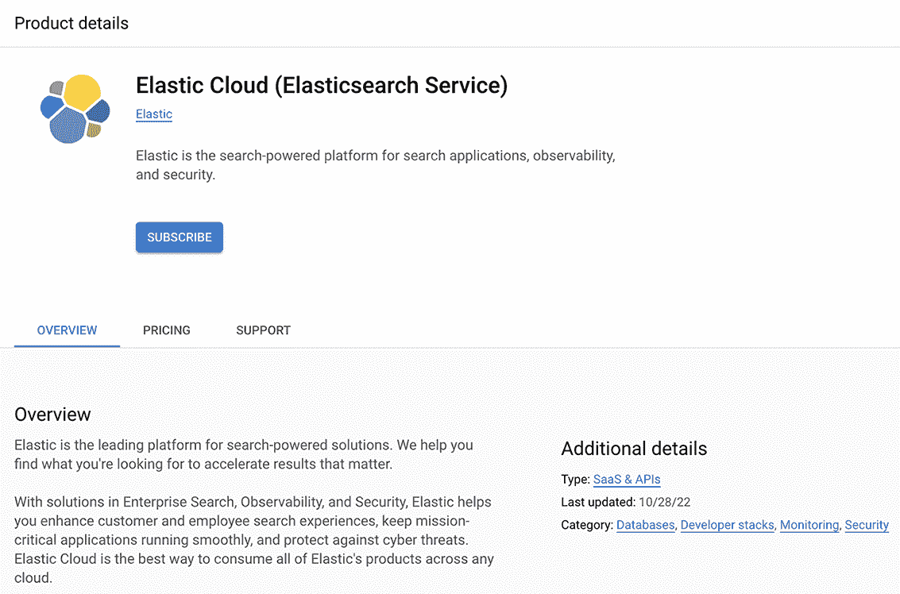

图 14.7 部署 Elasticsearch 解决方案

选择解决方案后，您可以选择部署的集群和命名空间（参见图 14.8）。在这种情况下，我们保留默认选择，它将在 us-central-1 区域的集群上安装，实例名称为 elasticsearch-1，并有两个副本。

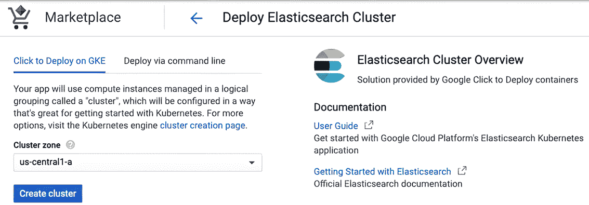

图 14.8 部署 Elasticsearch 解决方案

创建集群可能需要几分钟（参见图 14.9），这总是喝杯咖啡并让 Marketplace 做所有工作的好理由。

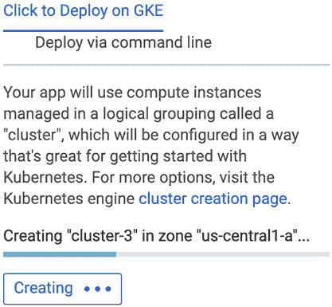

图 14.9 为新的 Elasticsearch 解决方案创建集群

一旦集群创建完成，Marketplace 将开始部署解决方案（参见图 14.10）。

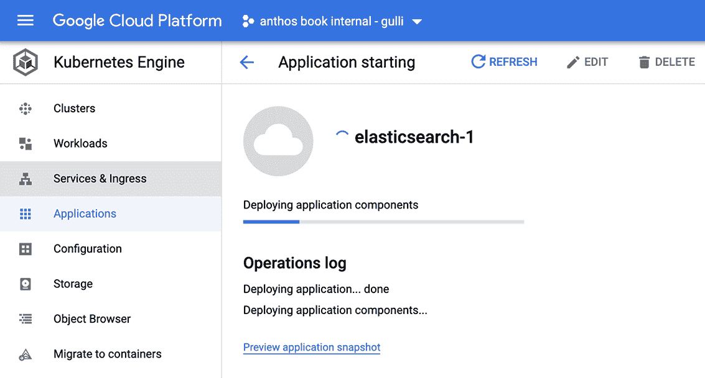

图 14.10 部署 Elasticsearch 解决方案的应用程序组件

当部署成功执行后，您可以在选择的集群中看到已部署的解决方案，如图 14.11 所示——确实很简单。Marketplace 节省了您大量时间，并加快了维护 Anthos 应用程序所需的行政任务。


图 14.11 已部署的 Elasticsearch 解决方案

一旦从 Marketplace 部署了 Elasticsearch，您可以使用 Anthos 来管理集群。在图 4.12 中，您将看到 CPU、内存和磁盘的详细信息。

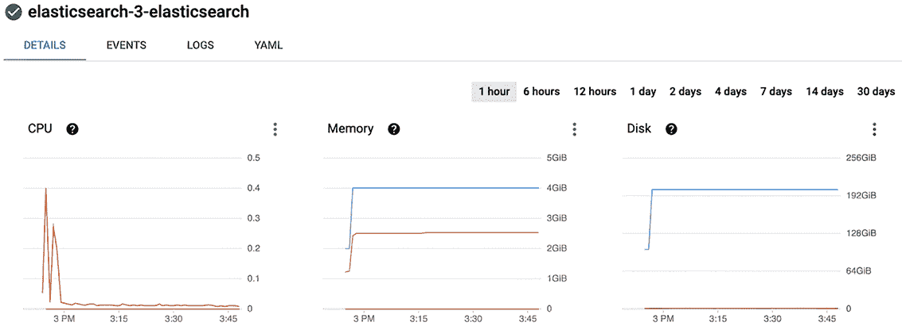

图 14.12 从 Marketplace 部署的 Elasticsearch 的 CPU、内存和磁盘监控

### 14.2.2 示例 2：MariaDB

现在，让我们关注如何部署 MariaDB，这是一个流行的开源数据库，它在 2009 年被 Oracle 收购后，从更受欢迎的 MySQL 关系型数据库管理系统分支出来。该解决方案（见图 14.13）可在 [`console.cloud.google.com/marketplace/details/google/mariadb`](https://console.cloud.google.com/marketplace/details/google/mariadb) 获取。

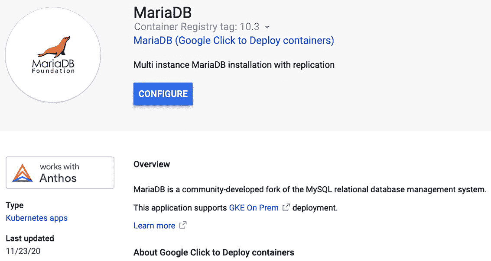

图 14.13 部署 MariaDB 解决方案

在这种情况下，我们决定更改默认参数，并需要更多的副本数——两个（见图 14.14）。

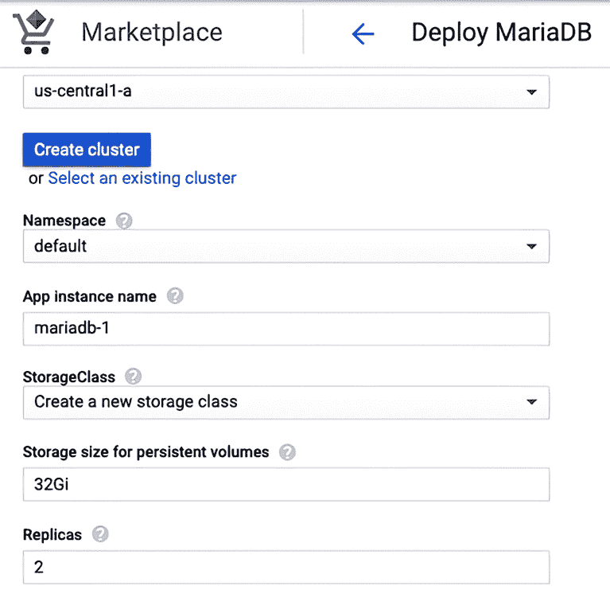

图 14.14 使用更多副本数部署 MariaDB 解决方案

我们部署的结果很简单（见图 14.15）。再次强调，Marketplace 允许我们在管理 Anthos 集群时节省时间。

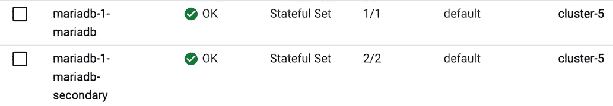

图 14.15 部署的 MariaDB 解决方案

一旦从 Marketplace 部署了 MariaDB，您就可以使用 Anthos 来管理集群。图 14.16 展示了检查集群和运行中的 Pods 的示例。

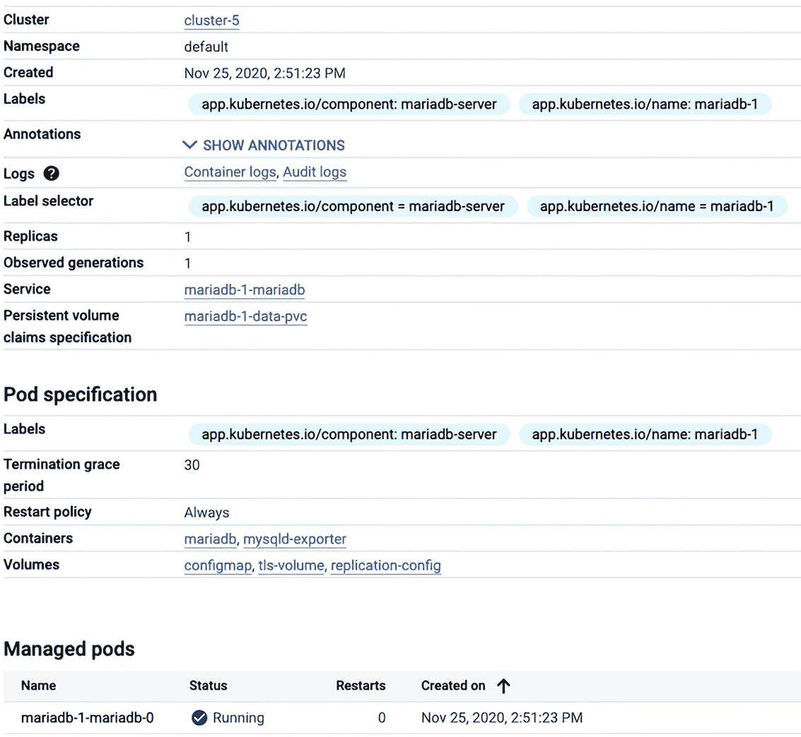

图 14.16 检查从 Marketplace 部署的 MariaDB 解决方案

### 14.2.3 我们到目前为止所做的工作

到目前为止，我们在 GKE 的 Anthos 集群上安装了两个应用程序。如果我们想检查它们的状态，我们可以通过应用程序访问我们的 GKE，如图 14.17 所示。

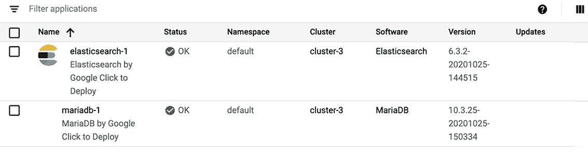

图 14.17 通过 Marketplace 部署的解决方案

### 14.2.4 示例 3：Cassandra

Cassandra 是一个 NoSQL、高度可扩展、高性能的分布式数据库，具有高可用性。部署 Cassandra 集群非常简单。您可以通过 [`console.cloud.google.com/marketplace/details/google/cassandra?q=anthos`](https://console.cloud.google.com/marketplace/details/google/cassandra?q=anthos) (图 14.18) 访问该解决方案。

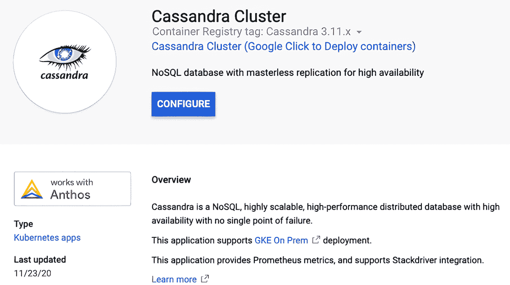

图 14.18 部署 Cassandra 解决方案

安装完成后，您可以访问和管理您的已部署解决方案。例如，您可能对监控特定时间段内的 CPU、内存和磁盘使用情况感兴趣，如图 14.19 所示。

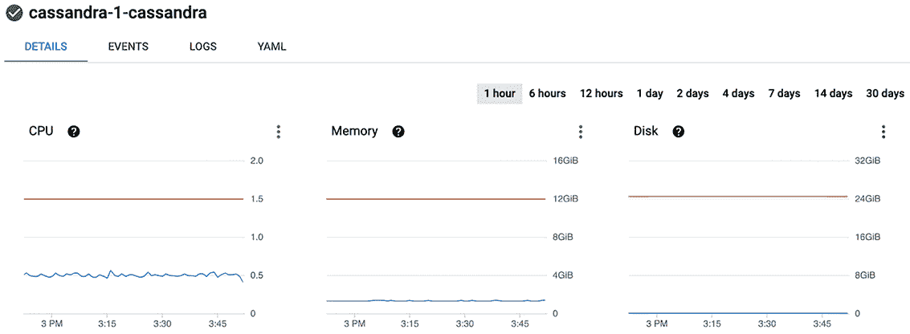

图 14.19 管理 Cassandra 解决方案

### 14.2.5 示例 4：Prometheus 和 Grafana

一旦您理解了机制，安装新的解决方案就是一个简化的过程。例如，假设我们想要安装一组更复杂的应用程序，这些应用程序可以协同工作。一个经典的例子是 Prometheus 和 Grafana。Prometheus 是一个开源的监控和警报平台，许多公司将其作为监控工具采用，而 Grafana 提供了几个仪表板，这些仪表板可以可视化 Prometheus 服务器收集的指标。该解决方案可通过 [`console.cloud.google.com/marketplace/details/google/prometheus?q=anthos`](https://console.cloud.google.com/marketplace/details/google/prometheus?q=anthos) 访问，如图 14.20 所示。

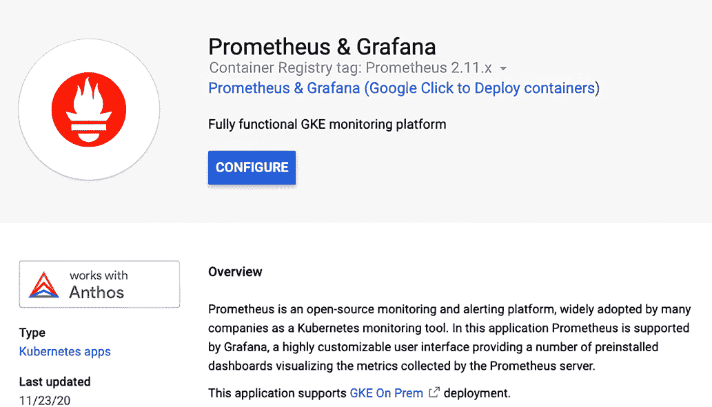

图 14.20 部署 Prometheus 和 Grafana 解决方案

让我们使用图 14.21 所示的默认参数来部署解决方案。

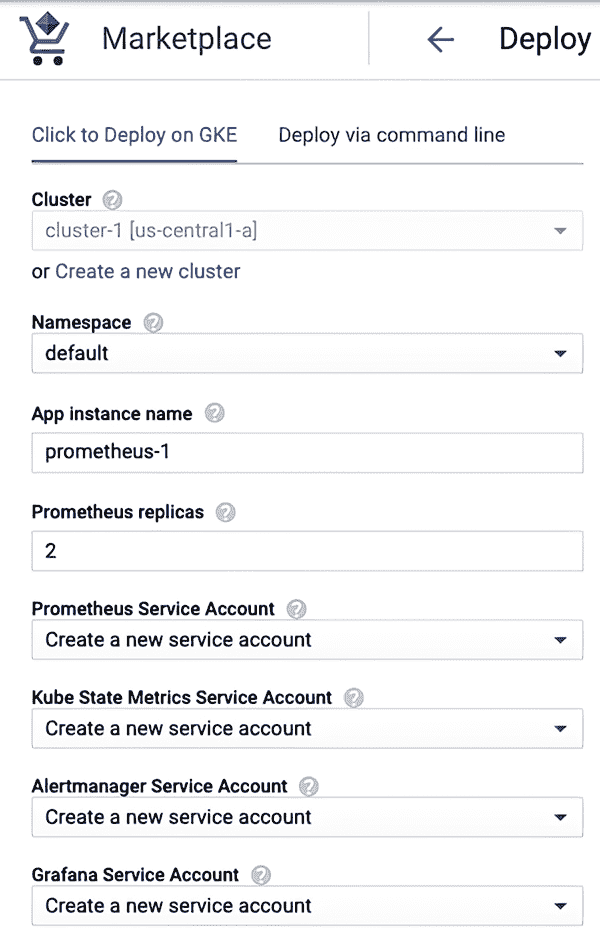

图 14.21 使用 Prometheus 和 Grafana 解决方案的默认参数

部署完成后，我们可以在应用程序详情中看到可用的解决方案，如图 14.22 所示。


图 14.22 Prometheus 和 Grafana 部署的解决方案

当然，你可以像图 14.23 所示的那样使用 Anthos 来管理已部署的解决方案。

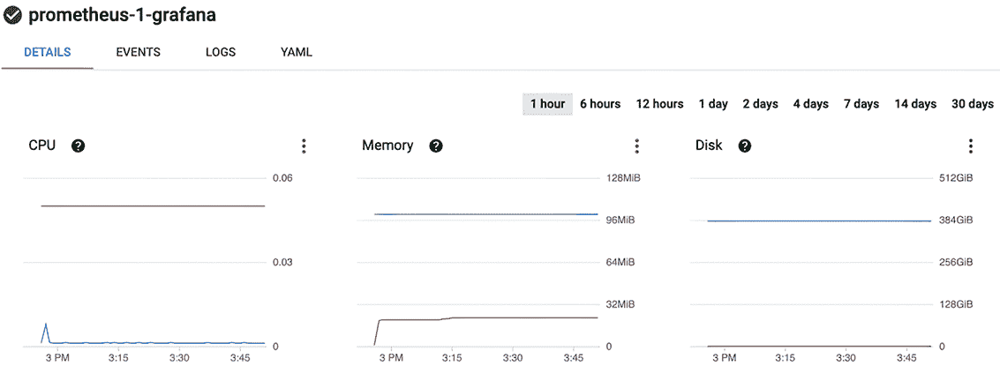

图 14.23 管理 Prometheus 和 Grafana 解决方案

一旦解决方案部署完成，你就可以在 Prometheus 时间序列数据库中开始记录实时指标。然后你可以使用 Grafana 创建仪表板并监控你的系统性能。

这个例子结束了本节。值得注意的是，Grafana 可以通过市场单独部署，并且支持在 Anthos 中使用，因此它可以与托管 Prometheus 兼容。

## 摘要

+   公共和私有市场都可以用来为开发者部署简单和复杂的工作负载。

+   公共 Google 市场是 Google 提供的一项服务，其中包含多个供应商解决方案，包括针对 Kubernetes 的解决方案，无论是在 GCP 还是本地。

+   私有 Google 市场允许公司为其内部开发者提供私有解决方案，使公司能够提供与 Google 在公共市场中提供的相同部署简便性。

+   在本地消费市场解决方案需要额外的设置步骤，而 GCP 集群则不需要。

+   我们部署了一些市场解决方案来展示在现实世界中部署工作负载是多么简单，使用的是提供的解决方案。
