# 15 迁移

安东尼奥·古利

本章涵盖

+   使用 Migrate for Anthos 的好处

+   推荐迁移的工作负载

+   Migrate for Anthos 架构

+   使用 Migrate for Anthos 迁移工作负载

+   Migrate for Anthos 的最佳实践

与虚拟机（VMs）相比，容器为开发者提供了多项优势，包括部署和配置工作负载时的速度加快、资源利用率更高、可移植性和成本效益，以及更高的效率。

然而，许多客户在过去的几年中在虚拟机基础设施上使用遗产框架编写了数千个应用程序。对于这些客户来说，重写他们的应用程序将耗费太多时间和金钱。因此，他们需要工具来现代化工作负载，并在不从头开始重写应用程序的情况下提供现代云原生环境的好处。整个价值主张是减少客户在转型项目中的上市时间，并通过现代云基础设施和服务增强和优化传统工作负载。

Google 认为，现代化不一定是全有或全无。微服务架构将应用程序结构化为一系列高度可维护和可测试的服务集合，通过 API 松散耦合，并可独立部署。然而，即使您最初没有使用微服务架构，您也可以将您的应用程序转换为容器，并仍然能够利用云原生应用程序通常获得的好处。这正是本章将要展示的内容。

Migrate for Anthos（简称 M4A）是一个工具，它帮助您从虚拟机中提取遗留工作负载，并将它们转换为容器，包括执行所需的所有内容——运行时、系统工具、库、代码、配置和设置。一旦您的应用程序迁移完成，您就可以在 Anthos 上运行它，无论是在 Google 的 Kubernetes Engine（GKE）上、本地还是在其他云中。这样，基础设施、硬件和操作系统/内核的管理就被“抽象化”并委托给您的云提供商（们）。

此外，M4A 生成使您能够切换到使用 CI/CD 管道的现代软件开发的艺术品，并从包管理转移到基于容器/镜像的管理。您可以将 M4A 视为现代化最终目标的加速器，这种加速可以在规模上发生，许多遗留应用程序可以一起大量迁移。M4A 可以通过现代化底层计算基础设施、网络、存储和管理，以规模的方式让您操作数千个遗留应用程序。

M4A 支持将 Linux 和 Windows 迁移到容器。源环境可以包括 GCP 计算引擎环境、VMware vSphere 环境、Microsoft Azure 虚拟机环境或 Amazon 弹性计算云（Amazon EC2）环境。所有工作负载都直接迁移，无需访问原始源代码、重写工作负载或手动容器化工作负载。

大部分迁移工作都是自动完成的，你可以修改生成的迁移计划以微调所需的现代化。在迁移过程执行期间，应用程序可以继续不间断地运行，你可以在几分钟内启动运行容器化应用程序。如果你想回到初始状态，你可以回滚而不会丢失数据。由 M4A 生成的迁移工作负载容器镜像会自动部署到 Google 容器注册库（GCR）或其他本地存储库，并且可以在任何环境中运行，无需你在目标工作负载集群上安装 M4A 组件。当然，整个 M4A 流程都可以通过 Google Cloud 控制台 UI 来执行和监控。

既然我们已经设置了上下文，让我们详细看看 M4A 的好处。

## 15.1 迁移至 Anthos 的好处

M4A 允许我们从虚拟机内部解包越来越多的基础设施，并用 Kubernetes 来管理它。这种现代化将应用程序管理与现代 IT 技能统一起来。确实，在本章详细描述的众多案例中，可以将遗留应用程序提升为云原生环境中的第一类对象，而无需更改或访问代码。规模化的解锁改进如下：

+   使用声明性 API、动态扩展、自我修复和程序化部署来定义基础设施。

+   利用数据中心提高的工作负载密度，从而实现更好的资源利用率。

+   维护基础设施指标、业务指标、网络策略和项目访问控制。

+   集成 CI/CD 管道和构建系统。

M4A 的好处在不同领域透明获得：密度、成本、安全性、基础设施、自动化、服务管理和第二天运营。让我们更详细地讨论每一类。

### 15.1.1 密度

虚拟机从底层物理硬件中抽象出来。而传统的裸金属服务器只能支持单个应用程序，虚拟化管理程序¹ 允许多个虚拟机的应用程序在单个裸金属服务器上运行，共享底层资源。裸金属的使用在此描述：

+   通常，裸金属利用率在 5%-15%，而虚拟机可以将利用率提高到 30%。

+   容器通过在同一个虚拟机或裸金属服务器上运行多个容器来提高工作负载密度。此外，由于操作系统/内核、网络和存储等抽象化，正如本章前面所讨论的，密度也增加了。

实际的利用率提升将取决于您环境中的一些特定因素。通常，许多组织在从物理服务器迁移到虚拟机，再到容器时，会报告显著的收益。例如，*《金融时报》*的内容平台团队报告说，通过采用容器，服务器成本降低了 80%（见[`mng.bz/mJ0P`](http://mng.bz/mJ0P)）。

### 15.1.2 成本

密度的增加会导致基础设施成本立即降低。如前所述，密度的增加是由两个事实造成的：多个容器可以打包在同一台物理机器上，许多软件层被抽象化，这导致了对可用资源的更好利用，需要更少的服务器，从而实现总体成本节约。成本是能够弹性扩展的副产品。如果需求低，则可以减少资源，从而节省运营成本。

此外，迁移后，遗留应用程序与云原生应用程序一起被提升为第一类公民。作为副作用，您不需要维护两个工作环境（既包括遗留的也包括现代的），因此，工作负载的统一管理允许在规模上进一步降低成本。

如果您想了解更多关于成本降低的信息，请查看 Google Cloud 定价计算器[`cloud.google.com/products/calculator`](https://cloud.google.com/products/calculator)，以估算您的月度费用，包括集群管理费和 GKE 的工作节点定价。

### 15.1.3 基础设施

将应用程序迁移到容器后，您可以以代码的形式看到整个基础设施，了解应用程序、进程和依赖项是如何协同工作的。任何基础设施的变化都可以存储在仓库（简称 repo）中，对基础设施的任何部分（包括配置文件）都可以应用操作，如提交、推送、拉取、合并和分支。传统上，维护基础设施是企业的一项重大成本。转向基础设施即代码允许团队实施 DevOps/SRE 方法，这由于提高了灵活性和可靠性，从而在规模上进一步节约成本。

### 15.1.4 自动化

由于需要手动或使用大量第三方工具修补和升级基础设施，因此管理虚拟机是一个昂贵、耗时且容易出错的过程，这可能会增加复杂度。Anthos 是现代化和促进将遗留工作负载迁移到容器的推动者，这对成本有间接影响。例如，在 Anthos 的 GKE 上，许多操作都是代表客户自动运行的，包括以下内容：

+   *节点自动修复*——保持您的 Kubernetes 集群中的节点处于健康、运行状态。

+   *节点自动升级*——当您的集群主版本更新时，保持您的 Kubernetes 集群中的节点与集群主版本保持最新。

+   *节点自动安全*——安全补丁可以以透明的方式自动部署。

+   *节点自动扩展*—根据瞬时负载的增加/减少动态扩展您的 Kubernetes 节点。

+   *节点自动配置*—代表用户自动管理一组 Kubernetes 节点池。

+   *渐进式发布/金丝雀/A/B 测试*—在 Kubernetes 集群上以编程方式部署应用程序，在出现问题时进行回滚。

按照惯例，增加您基础设施中的自动化程度将降低意外错误的风险，提高整个系统的可靠性，并降低成本。

### 15.1.5 安全

一旦迁移到容器，就可以简化多个安全操作。在 Anthos 上，这些操作包括以下内容：

+   *安全优化的节点内核和操作系统更新*—Anthos 为工作节点提供自动操作系统升级和内核补丁，让您摆脱维护操作系统的负担，如果您的服务器群很大，这会是一笔巨大的成本。虚拟机必须运行完整的客户操作系统，即使它们只托管单个应用程序。相反，容器减少了运营成本，因为不需要运行操作系统。

+   *二进制授权和容器分析*—Anthos 提供部署时的安全控制，确保只有受信任的容器镜像被部署到您的环境中。

+   *零信任安全模型*—在第四章中介绍的 Anthos Service Mesh（ASM）和 Kubernetes 的核心功能使我们能够在不更改应用程序代码的情况下提供网络隔离和 TLS 安全。

+   *基于身份的安全模型*—使用 ASM，您可以获得安全见解、安全策略和政策驱动的安全。这些案例在第四章中详细讨论。

透明地提高安全性将降低事件发生的风险及其相关的高昂成本。

### 15.1.6 服务管理

迁移到容器后，您可以使用 Anthos Service Mesh（见第四章）来确定您的服务连接在哪里，并在不更改代码的情况下获取应用程序的遥测和可见性。在 Anthos 上透明获得的以下好处：

+   *加密*—应用程序可以无需更改代码即可使用端到端加密进行通信。

+   *集成日志和监控*—您可以在应用程序中获得统一的指标和流量流日志。

+   *统一可观察性*—您可以从端到端观察服务依赖关系，了解关键客户旅程及其如何影响您的服务级别协议（SLA²）。您通过在应用程序上设置服务级别目标（SLO³）来完成此操作。

+   *操作敏捷性*—您可以在环境中动态迁移流量和执行断路器，⁴ 重试，金丝雀⁵，以及 A/B 测试。以金丝雀为例，您可以根据权重，将一定量的流量从一个服务移动到该服务的较新版本。

+   *桥接*—您可以使用服务网格在本地和多个云之间桥接流量。

通常情况下，采用服务网格将增强您对基础设施的理解，随着时间的推移，这可能变得相当复杂。

### 15.1.7 第二天运营

Anthos 减轻了第二天运营的负担。一旦您的应用程序迁移完成，您就可以享受许多 Google Cloud Platform (GCP)的能力，例如以下内容：

+   *云日志和云监控*—云日志允许您存储、搜索、分析、监控和警报来自 Google Cloud 的日志数据和事件，而云监控提供了对云应用程序性能、正常运行时间和整体健康状况的可见性。迁移后，这两个服务仅通过配置更改即可使用。

+   *统一策略和集成资源管理*—Anthos 通过 Anthos Config Management 提供声明式期望状态管理，这在第十一章中有详细说明。*声明式*意味着用户仅定义所需的最终状态，而 Anthos 负责定义实现更改的优化步骤。Anthos Config Management 允许您通过高级标记策略和选择策略，在所有环境中自动化和标准化安全策略和最佳实践。作为用户，您将有一个单一的 UI 来定义统一策略的创建和执行（第十三章）。

+   *使用 Cloud Build 实现第二天维护程序*—Cloud Build 提供了定义跨多个环境和多种语言的构建、测试和部署的定制工作流的控制。

+   *CI/CD 流水线*—Anthos 集成了 CI/CD 流水线，以增强您环境的敏捷性。这使得您能够进行更小的代码更改，更快地完成功能更改，缩短发布周期，并更快地进行故障隔离。

+   *GCP Marketplace*—Anthos 集成在 GCP Marketplace 中，包括服务目录，可以一键部署新应用程序。这将在第十四章中详细说明。

M4A 最重要的好处之一是，传统应用程序被提升为第一类对象，在第二天运营方面的好处与在云原生环境中通常期望的相同。

在本节中，我们讨论了使用 Migrate for Anthos 来现代化现有 VM 工作负载并自动容器化您的应用程序（无需重写）的好处。正如所讨论的，容器化应用程序由于比 VM 需要更少的管理时间，因此可以提高灵活性和效率。此外，它们提供了更高的基础设施密度和相关的成本降低。最后，容器化应用程序可以从服务网格中受益，包括可观察性、第二天运营流程简化以及跨环境的统一策略管理和执行。

在下一节中，我们将深入探讨哪些工作负载最适合迁移。

## 15.2 推荐的迁移工作负载

将应用程序现代化以适应云可能很困难。复杂的应用程序通常是多层的，并且通常具有多个依赖项。数据具有重力，迁移可能依赖于大量数据，无论是文件还是数据库。遗留应用程序可能是在过时的代码和遗留框架中编写的，并且在许多情况下，代码本身可能无法在现代环境中重新编译。在本节中，我们讨论以下类型的应用程序，这些应用程序特别适合自动迁移：

+   *无状态 Web 前端*—一个合适的类别包括无状态应用程序，如 Web 服务器和类似的应用程序，它们服务于客户流量。容器通常比虚拟机更轻量级，因此根据各种负载情况上下扩展它们更容易。

+   *多虚拟机、多层堆栈和业务逻辑中间件*—在这个类别中包括多层 Web 服务堆栈，如 LAMP（Linux、Apache、MySQL、PHP/Perl/Python）或 WordPress，因为它们可以被分解成多个独立的容器。此外，还包括 Java Tomcat 和其他 COTS（现成商业）应用程序。在 M4A 术语中，我们通常说，最佳应用类别包括多层 Web 企业应用程序。

+   *中等至大型数据库*—支持如 MySQL、Postgres 和 Redis 等数据库；数据层通常可以与计算层分离，因此容器可以帮助管理轻量级计算。

+   *低负载周期和突发工作负载*—在任何计算活动间歇性上升和下降的情况下，容器都是首选解决方案，因为它们比虚拟机更轻量级。因此，在需要快速设置 Dev/Test 环境、培训环境或实验室时，应考虑 M4A。

总体而言，我们可以这样说，*理想的迁移候选者*包括以下内容：

+   通过完整重写进行现代化改造要么不可能，要么成本过高的工作负载

+   具有未知依赖项的工作负载，如果被触及可能会破坏某些内容

+   虽然得到维护但不是积极开发的工作负载

+   已不再维护的工作负载

+   没有源代码访问的工作负载

有时可能很难实现自动迁移。如果存在对特定内核驱动程序或特定硬件的依赖，或者如果软件许可证需要绑定到某些硬件或虚拟机，则情况如此。另一个相关的情况是，基于虚拟机的工作负载需要整个 Kubernetes 节点容量，包括高性能和高内存数据库（如 SAP HANA）。除了这些特定情况外，所有其他工作负载都应考虑从虚拟机迁移到容器。

在本节中，我们快速回顾了适合迁移的相关工作负载。在接下来的几段中，我们将讨论迁移架构和一些迁移的实例。

## 15.3 M4A 架构

在本节中，我们将讨论一个典型的迁移工作流程以及虚拟机如何转换为几个不同的容器。迁移完成后，生成的工件可以在任何地方运行。在出现故障的情况下，工具会报告详细的调试和检查动机。

注意：您不再需要在目标集群上安装迁移组件。

### 15.3.1 迁移工作流程

迁移包括三个阶段：设置、实际迁移和优化（见图 15.1）。让我们更详细地看看每个步骤。

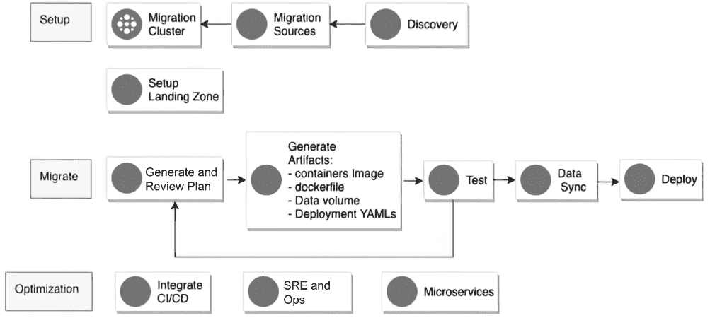

图 15.1 Anthos 的设置和迁移

在设置阶段，会创建一个处理集群，并定义迁移源。在支持的迁移源中，包括 VMware、AWS EC2、Azure VM、GCE VM、裸金属和本地 VMware。截至 Anthos Migrate 1.9 版本，支持的迁移操作系统有 RHEL、CentOS、SUSE、Ubuntu、Debian 和 Windows。列表始终在扩展，因此建议在线查看最新列表（见 [`mng.bz/51Gz`](http://mng.bz/51Gz)）。

在设置阶段，我们需要设置云着陆区，考虑到身份、网络配置、安全和计费。一些工具可以帮助使基础设施即代码任务更加自动化，包括 Cloud Foundation Toolkit ([`cloud.google.com/foundation-toolkit`](https://cloud.google.com/foundation-toolkit)) 和 Terraform ([`www.terraform.io/`](https://www.terraform.io/))。这些模板可以直接使用，以快速构建一个可重复、企业级的基础设施，具体取决于您的特定需求。此外，在设置过程中，您需要发现您想要迁移的工作负载。期望的工作负载可以通过手动方式或通过发现工具如 StratoZone ([`www.stratozone.com/`](https://www.stratozone.com/); 现已被 Google 收购)、modelizeIT ([`www.modelizeit.com/`](https://www.modelizeit.com/))、Cloudamize ([`www.cloudamize.com/en/home/`](https://www.cloudamize.com/en/home/)) 或 CloudPhysics ([`www.cloudphysics.com/`](https://www.cloudphysics.com/)) 来识别。自 M4A 1.5 版本以来，已包含原生发现工具，将在下一节中介绍。

在迁移阶段，运行 M4A 并自动生成新的容器镜像，包括 Dockerfile、数据卷和新的 YAML 部署文件。我们将在下一节中看到这些细节，其中我们将涵盖命令行界面（CLI）和图形用户界面（GUI）过程。一旦这些工件自动生成，您就可以在 GKE/Anthos 或其他云中进行测试，如果一切看起来都很好，您可以将它们部署到 GKE/Anthos。值得注意的是，数据作为迁移过程的一部分自动移动和同步。

Anthos 支持实时迁移，这意味着应用程序可以在没有任何中断的情况下迁移到现代环境。在幕后，M4A 为源虚拟机创建了一个快照，并且这个源虚拟机被留下运行和操作，无需停机。与此同时，所有存储操作都在该虚拟机快照上进行。所有工作负载都直接迁移，无需原始源代码。

在优化阶段，部署的艺术品可以根据您的特定偏好与 CI/CD 平台集成，例如 Cloud Build、GitHub、Jenkins ([`www.jenkins.io/`](https://www.jenkins.io/))、Spinnaker ([`spinnaker.io/`](https://spinnaker.io/))、GitLab CI/CD ([`docs.gitlab.com/ee/ci/`](https://docs.gitlab.com/ee/ci/)) 等（参见第十二章）。

### 15.3.2 从虚拟机到容器

一个典型的虚拟机由多个层组成（参见图 15.2 左侧）。在最上面是用户运行的应用程序，以及 cron 作业、配置文件和用户数据。紧接着是多个服务，包括在用户空间运行的服务和 SysV 或 Systemd⁶ 服务。然后，一个日志和监控层位于操作系统内核和操作系统驱动程序之上。在最底层是虚拟硬件，包括网络、具有各种文件系统上的逻辑卷的存储、CPU 和内存。

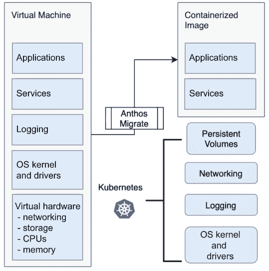

图 15.2 Anthos Migrate：从虚拟机到容器

对于每个应用程序，M4A 以 Docker 镜像、Dockerfile 和部署 YAML 文件的形式生成 CI/CD 艺术品，包括应用程序、用户服务和持久卷（参见图 15.2 右侧）。特别是，存储被重构为 Kubernetes 支持的持久卷。常见的功能，如网络、日志和监控，以及操作系统内核和驱动程序都被抽象化并委托给 Kubernetes 管理。持久卷是通过 Migrate for Anthos 容器存储接口（CSI）驱动程序挂载的（参见附录 D）。然后数据直接从源虚拟机文件系统流式传输。内部，Migrate 还负责生成命令行输入和客户资源定义（CRD⁷）。从逻辑上讲，迁移在容器化镜像中产生两层：第一层是捕获的用户模式系统，而第二层是迁移的运行环境，包括所有必要的 CRDs。然而，迁移后，您不需要维护第二层，生成的艺术品可以在任何符合 Kubernetes 的发行版上运行。⁸

Kubernetes 环境中对于应用程序非必要的 VM 相关文件和组件被明确排除。实际上，这种排除意味着好处。正如讨论的那样，与虚拟机相比，容器由于其轻量级特性，可以实现更高的密度和成本降低。应用程序生命周期保持在系统容器内。一旦迁移，应用程序可以在任何 Anthos 环境中运行（本地、GCP 等），或者独立于 M4A 部署在符合 Kubernetes 标准的任何发行版上。

### 15.3.3 查看 Windows 环境

Migrate for Anthos 的 1.4+ 版本支持将工作负载从 Windows 服务器迁移到 GKE/Windows。与 Linux 环境一样，目标是自动化工作负载的重构，并将其集成到一个更现代的云环境中。到 2021 年底，从 Windows Server 2008r2 到 Windows Server 2019 的所有 Windows 服务器平台都可作为目标。目前，仅支持 GCE 作为 Windows 应用程序现代化的源，计划在下一个版本中直接支持本地 VMware、AWS 和 Azure。然而，您可以使用 Migrate for Compute Engine（有时称为 Migrate to Virtual Machines⁹）将来自其他源的 Windows VM 迁移或克隆到 Compute Engine，然后将生成的 VM 迁移到容器中。好消息是迁移后的 Windows VM 不必配置为在 Compute Engine 上运行。

在幕后，迁移是通过提取 ASP.NET 应用程序和 IIS 配置，并将它们应用于官方 Windows 2019 服务器镜像上实现的。M4A for Windows 与使用 IIS 7+、ASP.NET 开发的应用程序兼容良好，尤其是与 Web 和业务逻辑中间件。迁移的理想对象是无状态的 Windows Web 应用程序层、应用服务器和 Web 前端。

### 15.3.4 现代化旅程的全面视图

现在我们已经讨论了 Linux 和 Windows 工作负载的现代化旅程，我们提供了一个全面的视图，这还包括大型机（见图 15.3）。

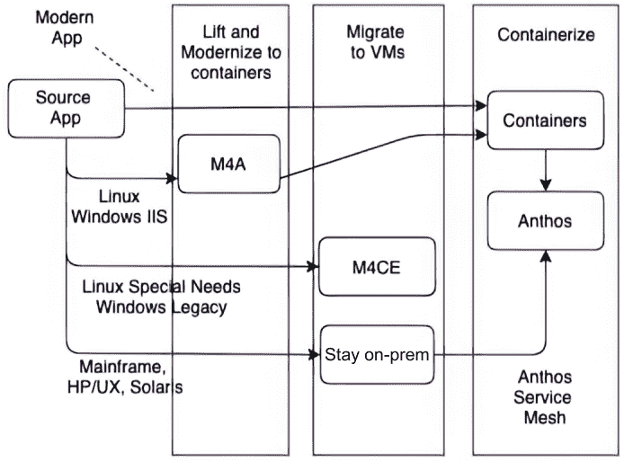

图 15.3 完整的现代化旅程

如果源应用程序是现代应用程序，则它会被容器化，集成 CI/CD，并可以在 Anthos 上运行，与整个生态系统的集成可以促进进一步重构为微服务环境。如果源应用程序是 Linux 或 Windows 上的传统单体应用程序，则我们可以使用 M4A 来容器化它。

如果源应用程序是具有特定需求的 Linux/Windows 应用程序，无论是特定驱动程序还是遗留支持，那么仍然可以直接将虚拟机迁移到 GCP，无论是在裸金属（BMS；[`cloud.google.com/bare-metal`](https://cloud.google.com/bare-metal)）还是在 GCVE（Google Cloud VMware Engine；[`cloud.google.com/vmware-engine`](https://cloud.google.com/vmware-engine)），之后手动将应用程序重构为微服务。

## 15.4 现实场景

在本节中，我们将回顾使用 M4A 的迁移实例。首先，我们将介绍迁移匹配评估工具([`mng.bz/v1VM`](http://mng.bz/v1VM))。然后，我们将提供关于如何迁移 Linux 和 Windows 的实战演练。

### 15.4.1 使用匹配评估工具

在本节中，我们介绍了一个自助匹配评估工具，用于确定工作负载迁移到容器的适用性。该工具包括一个名为 mfit 的实用程序，这是一个独立的 Linux CLI 工具，用于驱动评估过程，以及专用的 Linux 和 Windows 数据收集脚本，这些脚本可以由 mfit 自动调用或根据场景手动调用。

匹配评估工具生成一份报告，展示预虚拟机评估结果，包括虚拟机迁移到容器的适用性分数以及解决各种障碍的建议。表 15.1 提供了可能的匹配分数的摘要。

表 15.1 匹配评估工具生成的匹配分数

| 匹配分数 | 描述 |
| --- | --- |
| 分数 0 | 优秀匹配 |
| 分数 1 | 匹配良好，但有一些可能需要关注的发现 |
| 分数 2 | 迁移前需要最小努力 |
| 分数 3 | 迁移前需要适度努力 |
| 分数 4 | 迁移前需要大量努力 |
| 分数 5 | 不匹配 |
| 分数 6 | 收集的数据不足以评估虚拟机 |

匹配评估过程

匹配评估过程包括三个不同的阶段：发现、评估和报告。接下来将详细介绍每个阶段：

+   *发现*—收集有关虚拟机数据并将其存储在本地轻量级数据库中，用于下一阶段（默认位于~/.mfit 文件夹）。以下两种数据发现方法：

    +   （可选）*虚拟机/库存级别发现*—使用 mfit 工具通过 vSphere API 从一个或多个 vCenters 拉取虚拟机的库存和配置信息。fit 评估工具的后续版本将支持从公共云（如 GCP、AWS 和 Azure）拉取库存。此方法为可选，即使没有它，也可以执行匹配评估，尽管可能不够彻底。

    +   *虚拟机级别数据收集*—包括在要评估的虚拟机内部运行数据收集脚本。fit 评估工具为 Linux 虚拟机提供 Bash 脚本，为 Windows 虚拟机提供 PowerShell 脚本。每个脚本都会收集有关操作系统配置以及正在运行的服务、进程、已安装的软件包等信息，并生成一个单独的存档文件，该文件将被 mfit *工具导入数据库，并在后续的评估阶段使用。运行收集脚本和导入数据的过程可以是手动或自动的，以下场景中使用 mfit *工具：*

        +   *仅限 Linux*—运行收集脚本并通过 SSH 收集结果。

        +   *vSphere 上的 Linux 和 Windows*—运行收集脚本并使用 vSphere API 收集结果。

+   *评估*—使用 mfit 工具分析收集的数据，并为每个评估的虚拟机应用一套 fit 评估规则¹⁰。

+   *报告*—使用 mfit 工具生成报告，以 CSV、HTML 或 JSON 格式呈现评估结果。然后可以在 Google 的云控制台（[`mng.bz/ydVq`](http://mng.bz/ydVq)）中显示。

现在你已经知道了工具如何发现和报告工作负载，我们可以继续介绍如何使用该工具，以便你可以开始你的迁移之旅。

基本工具使用说明

下面是使用 fit 评估工具的基本概述。完整文档可在 [`mng.bz/41YV`](http://mng.bz/41YV) 查找。

注意，将 --help 添加到每个 mfit 命令将显示详细的命令使用说明，包括所有可能的标志和子命令。

安装

在撰写本文时，你可以使用以下命令在你的工作站上下载 mfit 工具（版本 1.9），该工作站用于驱动 fit 评估：

```
wget https://anthos-migrate-release.storage.googleapis.com/v1.9.0/linux/amd64/mfit
chmod +x mfit
```

库存发现

运行以下命令以在 vCenter 中发现所有虚拟机：

```
./mfit discover vsphere -u <vcenter username> --url <https://vcenter-host-name-or-ip>
```

注意：如果你的虚拟中心正在使用一个在运行 mfit 的机器上不受信任的证书，你可以添加 -i 选项来忽略 SSL 错误。

你将被提示输入 vCenter 密码，一旦执行，你将看到发现过程的摘要：

```
Running preflight checks...
[✓] DB Readable
[✓] DB Writable
[✓] Available Disk Space
[✓] Supported VC version

[+] Found 27 VMs
Collecting data...
27 / 27 [-------------------------------------------------------] 100.00% 13 p/s
```

你可能想知道实际上发生了什么，因为发现过程的输出有限，只告诉你预检查已通过，工具发现了 27 个虚拟机。这只是初始收集步骤，一旦收集完毕，你可以使用 mfit 工具评估和创建虚拟机的报告，我们将在手动收集过程解释之后介绍。

手动虚拟机级别数据收集

在撰写本文时，你可以使用以下命令在要评估迁移的虚拟机上下载 Linux 收集脚本：

```
wget https://anthos-migrate-release.storage.googleapis.com/v1.9.0/linux/amd64/mfit-linux-collect.sh
chmod +x mfit-linux-collect.sh
```

按照以下方式运行收集脚本：

```
sudo./mfit-linux-collect.sh
```

脚本将在当前目录下生成一个名为 m4a-collect-<MACHINE NAME>-<TIMESTAMP>.tar 的 TAR 文件。

对于 Windows 用户，在撰写本文时，您可以从以下 URL 下载要评估迁移的虚拟机上的 Windows 收集脚本：[`mng.bz/X5E6`](http://mng.bz/X5E6)。

按照以下方式运行收集脚本：

```
powershell -ExecutionPolicy ByPass -File .\mfit-windows-collect.ps1
```

脚本将在当前目录中生成一个名为 m4a-collect-<MACHINE NAME>-<TIMESTAMP>.tar/zip 的 TAR 或 ZIP 文件（取决于操作系统版本）。

导入收集的数据文件

在评估虚拟机上运行收集脚本后，通过任何方式将其下载到安装了 mfit 的工作站。然后，将其导入到 mfit 的本地数据库中：

```
./mfit discover import m4a-collect-<MACHINE NAME>-<TIMESTAMP>.tar/zip
```

自动客户端级别数据收集

mfit 包含嵌入的客户端收集脚本，可以在以下场景中自动运行它并检索结果。

VMware 工具

如果评估的虚拟机运行在 vSphere 上并且已安装 VMware 工具，mfit 可以使用 vSphere API 来自动执行收集脚本（适用于虚拟机操作系统类型的脚本）和检索结果。要通过 VMware 工具运行客户端级别收集，请运行以下命令：

```
./mfit discover vsphere guest -u <vcenter username> --url <https://vcenter-host-name-or-ip> --vm-user <vm username> <vm MoRef id or name>
```

您将被提示输入 vCenter 和 VM/OS 密码。

SSH

如果运行 mfit 的 Linux 机器可以访问评估的虚拟机 SSH，mfit 可以使用它来自动执行收集脚本和检索结果。要使用当前本地用户的 SSH 密钥（位于 ~/.ssh）通过 SSH 运行客户端级别收集，请运行以下命令：

```
./mfit discover ssh <vm-ip-or-hostname>
```

要使用附加的身份验证选项通过 SSH 运行客户端级别收集，请运行以下命令：

```
./mfit discover ssh -i </path/to/ssh_private_key> -u <remote-username> <vm-ip-or-hostname>
```

若要获取通过 SSH 运行客户端级别收集的附加选项，请参阅官方文档或运行 ./mfit discover ssh -help。

评估

要检查发现的虚拟机和收集的数据，请运行以下命令：

```
./mfit discover ls
```

要对此数据进行评估，请运行以下命令：

```
./mfit assess
```

这将创建一个评估结果并将其存储在 mfit 的本地数据库中，以便在生成报告时使用。

报告生成

一旦完成评估，我们就可以生成报告。要生成独立的 HTML 报告，请运行以下命令：

```
./mfit report --format html > REPORT_NAME.xhtml
```

要生成 JSON 报告，请运行以下命令：

```
./mfit report --format json >  REPORT_NAME.json
```

然后，可以在 Google 云控制台中显示报告：[`mng.bz/Q8zj`](http://mng.bz/Q8zj)。

在本节中，我们讨论了用于确定工作负载是否适合迁移到容器的 fit 评估工具。一旦完成评估并选择了适合迁移的工作负载，我们就可以开始迁移过程本身。这就是下一节的主题。

### 15.4.2 基本迁移示例

在这个基本示例中，我们将使用命令行界面（CLI）在 GCE 上设置一个 Compute Engine 虚拟机，然后使用 M4A 将其迁移到 GKE 集群。请注意，我们需要创建另一个用于驱动迁移过程的 Kubernetes“处理集群”。处理集群将负责从虚拟机中拉取应用程序并生成所有容器化的工件。让我们开始吧。

首先，我们创建一个源虚拟机。在这个基本示例中，虚拟机将托管 Apache 网络服务器。可以使用以下命令创建虚拟机：

```
gcloud compute instances create http-server-demo --machine-type=n1-standard-1 --subnet=default --scopes="cloud-platform" --tags=http-server,https-server --image=ubuntu-minimal-1604-xenial-v20200702  --image-project=ubuntu-os-cloud --boot-disk-size=10GB --boot-disk-type=pd-standard 
```

然后，让我们确保使用以下命令从互联网上可以访问虚拟机：

```
gcloud compute firewall-rules create default-allow-http --direction=INGRESS --priority=1000 --network=default --action=ALLOW --rules=tcp:80 --source-ranges=0.0.0.0/0 --target-tags=http-server
```

现在，我们可以使用 GUI（见图 15.4）登录到刚刚配置的虚拟机并安装 Apache：

```
sudo apt-get update && sudo apt-get install apache2 -y
```

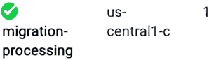

图 15.4 连接迁移集群

现在我们有一个运行 Apache 网络服务器的源虚拟机。下一步是创建 Kubernetes 处理集群：

```
gcloud container clusters create migration-processing --machine-type n1-standard-4   --image-type ubuntu --num-nodes 1 --enable-stackdriver-kubernetes
```

接下来，让我们确保我们给处理集群正确的处理权限。我们需要为 M4A 创建一个特定的服务帐户，添加具有存储管理员权限的策略绑定，创建一个 JSON 密钥以访问处理集群，并获取处理集群的凭证。我们可以使用以下四个命令来完成此操作。请注意，named-tome-295414 是我的项目名称，您应该将其更改为与您的匹配：

```
gcloud iam service-accounts create m4a-install 
gcloud projects add-iam-policy-binding named-tome-295414  --member="serviceAccount:m4a-install@named-tome-295414.iam.gserviceaccount.com"  --role="roles/storage.admin"
gcloud iam service-accounts keys create m4a-install.json   --iam-account=m4a-install@named-tome-295414.iam.gserviceaccount.com   --project=named-tome-295414
gcloud container clusters get-credentials migration-processing
```

一旦我们有了凭证，我们就可以登录到处理集群并安装 M4A。让我们使用以下命令来完成此操作。请注意，m4a-install.json 是我们刚刚创建的 JSON 密钥：

```
migctl setup install --json-key=m4a-install.json
```

我们可以使用 migctl 检查部署是否成功：

```
migctl doctor
[✓] Deployment
```

之后，我们可以设置迁移源，包括特定的服务帐户 m4a-ce-src，迁移过程中所需的 compute.viewer 和 compute.storageAdmin 策略绑定，以及创建 JSON 密钥 m4a-ce-src.json：

```
gcloud iam service-accounts create m4a-ce-src
gcloud projects add-iam-policy-binding named-tome-295414    --member="serviceAccount:m4a-ce-src@named-tome-295414.iam.gserviceaccount.com"   --role="roles/compute.viewer"
gcloud projects add-iam-policy-binding named-tome-295414    --member="serviceAccount:m4a-ce-src@named-tome-295414.iam.gserviceaccount.com"   --role="roles/compute.storageAdmin"
gcloud iam service-accounts keys create m4a-ce-src.json   --iam-account=m4a-ce-src@named-tome-295414.iam.gserviceaccount.com   --project=named-tome-295414
```

一旦我们为源创建了凭证，我们可以使用以下命令来设置源。请注意，ce 代表 Google Compute Engine (GCE)：

```
migctl source create ce http-source --project named-tome-295414 --json-key=m4a-ce-src.json
```

在创建迁移源之后，我们现在可以创建一个迁移计划来容器化我们的虚拟机：

```
migctl migration create my-migration --source http-source   --vm-id http-server-demo --intent Image
```

如果您想查看迁移计划（例如，修改它），可以使用以下命令：

```
migctl migration get my-migration
```

然后，您就可以开始实际的迁移了：

```
migctl migration generate-artifacts my-migration
```

结果，您应该看到如下内容：

```
running validation checks on the Migration...
migration.anthos-migrate.cloud.google.com/my-migration created
```

一旦迁移开始，您可以使用以下命令检查进度。请注意，标志 -v 会提供详细的输出状态，这在出现问题时很有用：

```
migctl migration status my-migration
```

迁移完成后，您将看到类似于此处所示输出的内容：

```
NAME           CURRENT-OPERATION       PROGRESS   STEP         STATUS      AGE
my-migration   GenerateMigrationPlan   [2/2]      CreatePvcs   Completed   11m23s
```

下一步是获取生成的工件：

```
migctl migration get-artifacts my-migration
```

一旦生成完成，您应该看到如下内容：

```
Downloaded artifacts for Migration my-migration. The artifacts are located in /home/a_gulli.
```

要访问迁移的工作负载，我们需要使用服务暴露 Pods。修改生成的 deployment_spec.yaml 以添加一个类型为 LoadBalancer 的服务将使我们能够通过端口 80 访问工作负载：

```
apiVersion: v1
kind: Service
metadata:
 name: hello-service
spec:
 selector:
   app: http-server-demo
 ports:
   - protocol: TCP
     port: 80
     targetPort: 80
 type: LoadBalancer
```

我们现在可以像这样在我们的 Kubernetes 集群上部署工件：

```
kubectl apply -f deployment_spec.yaml

deployment.apps/app-source-vm created
service/app-source-vm created
service/my-service created
```

检查一切是否顺利可能是有用的：

```
kubectl get service
```

结果，您应该看到如下内容：

```
NAME            TYPE           CLUSTER-IP      EXTERNAL-IP    PORT(S)        AGE
app-source-vm   ClusterIP      None            <none>         <none>         44s
kubernetes      ClusterIP      10.63.240.1     <none>         443/TCP        41m
my-service      LoadBalancer   10.63.243.209   35.232.24.49   80:32417/TCP   43s
```

在这种情况下，外部 IP 地址是 35.232.24.49。现在我们可以打开浏览器并检查一切是否正常（见图 15.5）。

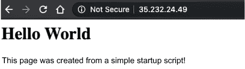

图 15.5 访问从虚拟机迁移到容器的网络服务器

恭喜！您已成功使用 CLI 将运行在 GCE 上的虚拟机迁移到运行在 GKE 上的容器。如果您想看到另一个基本迁移的示例，我们建议您考虑在[`mng.bz/X5jp`](http://mng.bz/X5jp)提供的“迁移到容器：快速入门”动手实验室。

现在您已经知道如何使用 CLI 执行迁移，我们将进入下一节，我们将使用 Cloud console UI 来执行迁移。

### 15.4.3 Google Cloud 控制台 UI 迁移示例

在本节中，我们使用 M4A 将运行在 Google Compute Engine 上的虚拟机中的应用程序迁移到 GKE。当使用控制台 UI 时，Google Cloud 集群是唯一支持的环境，不是 AWS 或 VMware 上的 Anthos。GKE 处理集群可以在云中或本地。迁移将通过 Google Cloud 控制台的可用图形用户界面（GUI）运行。请注意，迁移过程在 CLI 和 GUI 之间是一致的。

将使用 GKE 集群作为“处理集群”来控制迁移。在迁移过程中生成的工件将存储在 Google Cloud Storage（GCS）上，最终的容器镜像将推送到 Google Container Registry。在底层，这与 CLI 驱动的迁移相同。

第一步是访问控制台中的 Anthos 迁移（见图 15.6），网址为[`mng.bz/Mlpn`](http://mng.bz/Mlpn)。

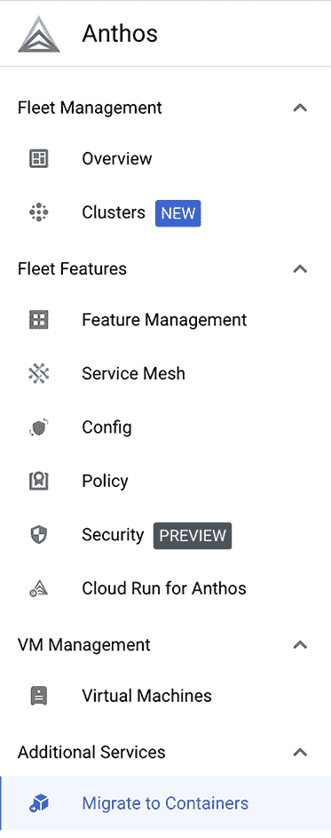

图 15.6 访问 Anthos 迁移到容器

为了简化，我们将从 Marketplace 部署一个预装 Tomcat 服务器的 VM。然后，我们将从 VM 迁移 Tomcat 到容器。

让我们从访问带有 Tomcat 的 Google Click to Deploy 仓库开始（见图 15.7）。URL 是[`console.cloud.google.com/marketplace/details/click-to-deploy-images/tomcat`](https://console.cloud.google.com/marketplace/details/click-to-deploy-images/tomcat)。

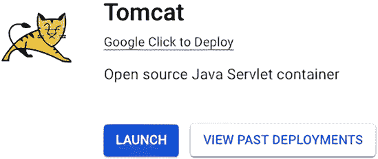

图 15.7 将 Tomcat 应用程序部署到虚拟机

然后，让我们选择我们想要部署的区域（见图 15.8）。

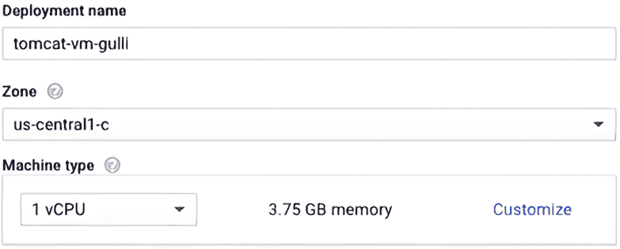

图 15.8 部署的 Tomcat 应用程序

一旦部署了带有 Tomcat 服务器的 VM，您可以从外部 IP 访问网站，如图 15.9 所示。

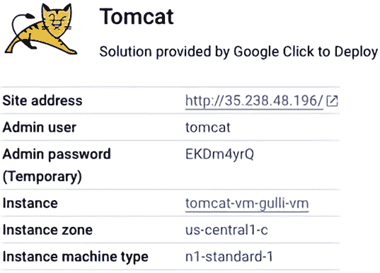

图 15.9 使用 Google Click to Deploy 部署的 Tomcat 解决方案

在此部署中，IP 地址是 http://35.238.48.196/，因此如果您访问网站，您应该看到图 15.10 中显示的输出。


图 15.10 使用网络浏览器访问 Tomcat

下一步是启动适当的迁移过程。首先，创建一个“处理集群”，这是一个将用于控制我们源虚拟机迁移的集群。您可以通过访问 Anthos 上的“迁移到容器”菜单并选择添加处理集群选项来完成此任务（见图 15.11）。


图 15.11 开始迁移过程

按照 GUI 提供的建议创建一个专门用于处理的新集群是很方便的（见图 15.12）。

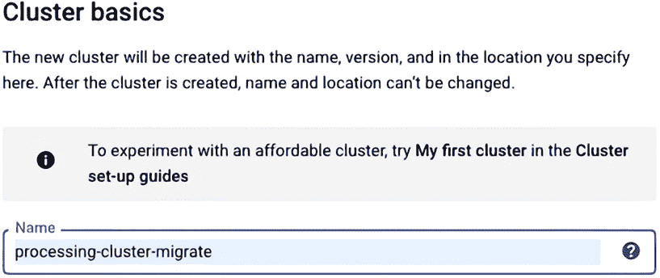

图 15.12 为处理集群选择名称

一旦集群准备就绪，你应该能够在 GKE 部分中的 Google Cloud 控制台中看到它（见图 15.13）。

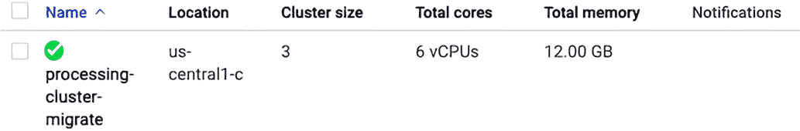

图 15.13 处理集群已准备好使用。

然后，你可以选择集群（见图 15.14）并选择目标是否为 Linux 或 Windows。

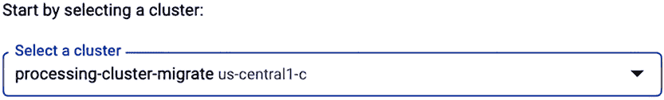

图 15.14 选择处理集群

在这一点上，我们需要确保处理集群具有适当的处理权限。为此，GUI 建议在云壳中运行一系列命令。你只需像图 15.15 所示点击运行云壳即可。


图 15.15 使用 UI 运行 M4A 所需的设置

让我们详细看看所需的步骤。首先，我们需要启用 Google Cloud API。然后，我们需要在容器注册库和云存储中创建一个服务帐户来存储迁移工件。然后，我们需要添加访问容器注册库和云存储的权限。最后，我们需要创建并导出一个新密钥到 M4A 使用服务帐户所需的文件。

完成这些步骤后，我们可以迁移到容器。同样，GUI 使这一步骤非常直观。最后一步是使用 migctl doctor 检查部署状态是否正确（见图 15.16）。

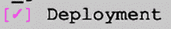

图 15.16 M4A 的正确部署

一旦配置了处理集群，请选择一个迁移源，从该源拉取虚拟机（见图 15.17）。


图 15.17 添加迁移源

目前，你可以从 GCE 拉取（见图 15.18）。（你还可以使用 Migrate for Compute Engine [[`mng.bz/eJav`](http://mng.bz/eJav)]将本地 vSphere 环境、AWS 和 Azure 导入 GCE。）

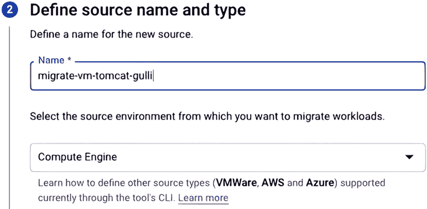

图 15.18 添加迁移源

一旦你选择了名称，你可以选择放置源虚拟机的项目（见图 15.19）。

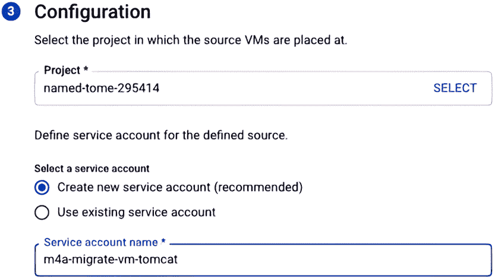

图 15.19 选择放置源虚拟机的项目

现在处理集群和迁移源已经创建，我们可以开始迁移（见图 15.20）。


图 15.20 开始迁移过程

迁移需要一个名称、一个源、一个虚拟机操作系统类型、虚拟机 ID 和迁移意图。让我们通过 GUI 指定这些，如图 15.21 所示。

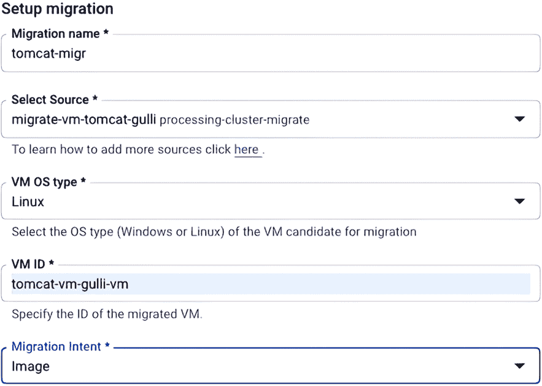

图 15.21 指定迁移名称、迁移源、虚拟机操作系统类型、虚拟机 ID 和迁移意图。

然后，M4A 将开始生成迁移计划（见图 15.22）。

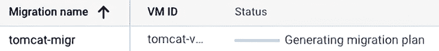

图 15.22 生成迁移计划

在迁移过程中，我们可以使用以下命令检查进度，该命令将生成详细的调试日志：

```
migctl migration status my-migration -v
```

一旦生成迁移计划（见图 15.23），您可以使用 GUI 检查结果。

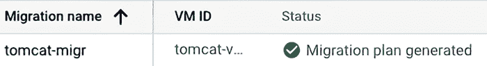

图 15.23 M4A 生成的迁移计划概述

尤其是选项菜单允许您编辑生成的迁移计划，如图 15.24 所示。

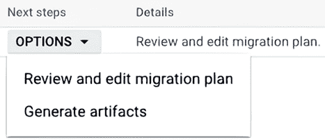

图 15.24 审查和编辑生成的迁移计划

让我们看看通过编辑迁移计划生成的结果，如图 15.25 所示。

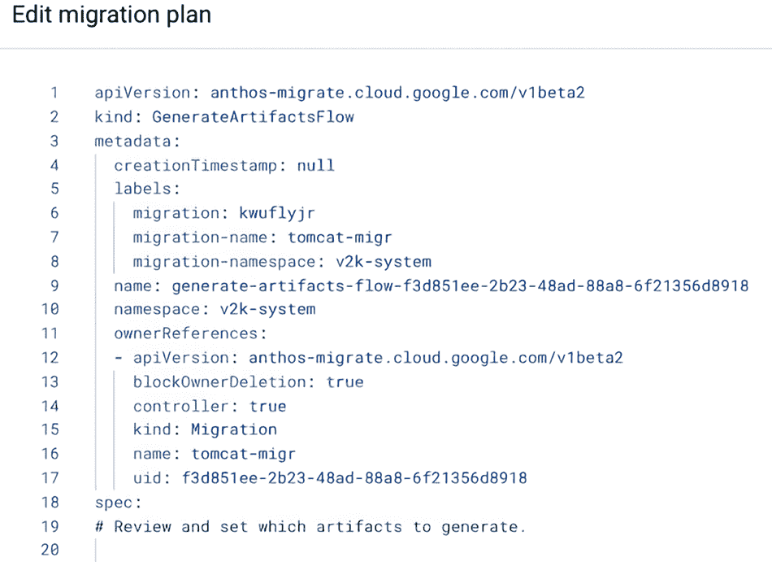

图 15.25 编辑生成的迁移计划

通常，您不需要更改迁移计划。然而，如果您需要移除不必要的 VM 组件或需要添加一些额外的配置，那么能够这样做是有用的。在检查并必要时编辑迁移计划后，您可以开始生成工件（见图 15.26）。


图 15.26 使用编辑后的迁移计划生成工件

一旦生成迁移计划，您可以通过访问 Google Cloud 控制台中的工件选项卡来检查它们。这包括 Dockerfile、部署容器镜像（可以直接部署）、容器镜像基础层（不可运行的镜像层）、部署规范 YAML、迁移计划 YAML 以及工件链接 YAML（见图 15.27）。

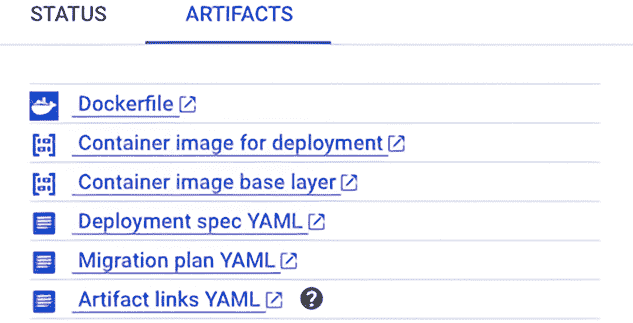

图 15.27 生成的迁移工件

生成的工件存储在 GCS 中，基础层和镜像层分别使用不同的存储桶（见图 15.28）。

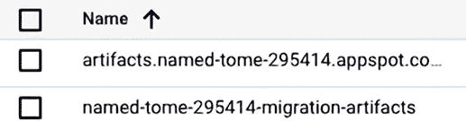

图 15.28 存储在 GCS 中的工件

现在我们来看带有 Dockerfile、部署规范、清单和迁移 YAML 的系统镜像（见图 15.29）。


图 15.29 Dockerfile、部署规范、清单和迁移文件

此外，为迁移生成的镜像会自动推送到 Google Container Registry，您可以通过控制台浏览它们，如图 15.30 所示。

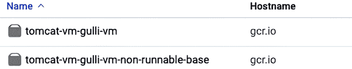

图 15.30 用于迁移并推送到 GCR 的镜像

所有生成的工件都可以通过以下命令从 CLI 下载：

```
migctl migration get-artifacts my-migration
```

这些工件包括以下内容：

+   *deployment_spec.yaml*—配置您的负载

+   *Dockerfile*—用于构建迁移 VM 的镜像

+   *migration.yaml*—迁移计划的副本

Dockerfile 概述

在本节中，我们将深入探讨 M4A 生成的 Dockerfile。您可以编辑文件来自定义镜像，例如，用于安装新包或安装 M4A 运行时的升级版本。该文件包含运行时的原始容器仓库、包含从源虚拟机捕获的数据的镜像以及初始入口点。一个典型的 M4A Dockerfile 如下：

```
# Please refer to the documentation:
# https://cloud.google.com/migrate/anthos/docs/dockerfile-reference

FROM anthos-migrate.gcr.io/v2k-run-embedded:v1.5.0 as migrate-for-anthos-runtime

# Image containing data captured from the source VM
FROM gcr.io/named-tome-295414/tomcat-vm-gulli-vm-non-runnable-base:11-13-2020--15-0-39 as source-content

# If you want to update parts of the image, add your commands here.
# For example:
# RUN apt-get update
# RUN apt-get install -y \
#    package1=version \
#    package2=version \
#    package3=version
# RUN yum update
# RUN wget http://github.com

COPY --from=migrate-for-anthos-runtime //

# Migrate for Anthos image includes entrypoint
ENTRYPOINT [ "/.v2k.go" ]
```

在本章讨论迁移后与 CI/CD 管道集成时，我们将在本章后面看到 M4A 生成的 Dockerfile 的更多细节。在下一节中，我们将讨论 deployment_spec.yaml 文件的详细信息。

deployment_spec.yaml 概述

在本节中，我们将讨论 M4A 生成的 deployment_spec.yaml。首先，让我们定义一些我们稍后将要使用的术语：

+   *无状态*—当服务器不存储有关客户端会话的任何状态时，应用是无状态的。换句话说，没有对过去事务的存储知识或引用。

+   *有状态*—当服务器存储有关客户端会话的数据时，应用是有状态的。换句话说，当前事务可能会受到之前事务发生的影响。因此，有状态的应用需要在每次处理用户请求时使用相同的服务器。

在这个背景下，让我们考虑 deployment_spec.yaml。这个文件将根据 UI 中选择的意图标志而有所不同，如下所述：

+   *意图：镜像*—YAML 定义了一个无状态应用，具有相同的 Pods 作为服务管理。¹¹ YAML 的不同部分如下：

    +   *部署*—从您迁移的虚拟机生成的镜像中部署的一组相同的 Pods。它们存储在 GCR 中。

    +   *服务*—将您的部署中的 Pods 组合成一个单一的资源，可以从稳定的 IP 地址访问。默认情况下，单个集群内部 IP 只能在集群内部访问，没有负载均衡。Kubernetes 端点控制器将修改 DNS 配置以返回指向 Pods 的记录（地址），这些 Pods 被标记为"<app>": "<app-name>"，其中应用名称是从 migctl 迁移创建 my-migration 命令中推断出来的。请注意，默认情况下，Pods 只能在集群内部可见，因此，可能需要将 Pods 暴露在集群之外。我们将在本章后面看到一个示例。

    +   *日志配置*—通过列出许多最常见的日志文件来配置将日志记录到云日志。

+   *意图：镜像和数据*—YAML 定义了一个具有与持久卷相关联的不同 Pods 的有状态应用。YAML 的不同部分如下：

    +   *StatefulSet*—从您迁移的虚拟机生成的镜像中部署的一组 Pods。它们存储在 GCR 中。

    +   *服务*—类似于在镜像部分定义的服务。

    +   *持久卷*—用于管理持久存储。

    +   *持久卷声明*—表示对持久卷资源（如特定大小和访问模式）的请求和声明。

    +   *日志配置*—类似于为无状态定义的内容。

+   *意图：数据*—YAML 的不同部分如下：

    +   *持久卷*—类似于为有状态定义的内容。

    +   *持久卷声明*—类似于为有状态定义的内容。

下一个列表显示了典型的 M4A deployment_spec.yaml。

列表 15.1 M4A 生成的 deployment_spec.yaml

```
# Stateless application specification
# The Deployment creates a single replicated Pod, indicated by the 'replicas' field
apiVersion: apps/v1
kind: Deployment
metadata:
  creationTimestamp: null
  labels:
    app: tomcat-vm-gulli-vm
    migrate-for-anthos-optimization: "true"
    migrate-for-anthos-version: v1.5.0
  name: tomcat-vm-gulli-vm
spec:
  replicas: 1
  selector:
    matchLabels:
      app: tomcat-vm-gulli-vm
      migrate-for-anthos-optimization: "true"
      migrate-for-anthos-version: v1.5.0
  strategy: {}
  template:
    metadata:
      creationTimestamp: null
      labels:
        app: tomcat-vm-gulli-vm
        migrate-for-anthos-optimization: "true"
        migrate-for-anthos-version: v1.5.0
    spec:
      containers:
      - image: gcr.io/named-tome-295414/tomcat-vm-gulli-vm:11-13-2020--15-0-39
        name: tomcat-vm-gulli-vm
        readinessProbe:
          exec:
            command:
            - /code/ready.sh
        resources: {}
        securityContext:
          privileged: true
        volumeMounts:
        - mountPath: /sys/fs/cgroup
          name: cgroups
      volumes:
      - hostPath:
          path: /sys/fs/cgroup
          type: Directory
        name: cgroups
status: {}

---
# Headless Service specification -
# No load-balancing, and a single cluster internal IP, only reachable from within the cluster
# The Kubernetes endpoints controller will modify the DNS configuration to return records (addresses) that point to the Pods, which are labeled with "app": "tomcat-vm-gulli-vm"
apiVersion: v1
kind: Service
metadata:
  creationTimestamp: null
  name: tomcat-vm-gulli-vm
spec:
  clusterIP: None
  selector:
    app: tomcat-vm-gulli-vm
  type: ClusterIP
status:
  loadBalancer: {}

---
```

部署由 M4A 生成的容器

在本节中，讨论了部署由 M4A 生成的容器的步骤。部署 deployment_spec.yaml 非常简单：

```
migctl setup install --runtime
kubectl apply -f deployment_spec.yaml
```

因此，你应该看到类似这样的内容：

```
deployment.apps/tomcat-vm-gulli-vm created
service/tomcat-vm-gulli-vm created
```

如果你想，你可以检查已部署 Pods 的状态：

```
kubectl get pods
```

你应该看到类似这样的内容：

```
NAME                                 READY   STATUS    RESTARTS   AGE
tomcat-vm-gulli-vm-66b44696f-ttgq6   1/1     Running   0          21s
```

默认情况下，容器以无负载均衡和单个集群内部 IP 的方式部署，只能从集群内部访问。Kubernetes 端点控制器将修改 DNS 配置，以返回指向标记为"app": "tomcat-vm-gulli-vm"的 Pods 的地址。当然，你可以更改部署并添加一个类型为 LoadBalancer 的服务。让我们通过在部署规范中添加以下内容来实现这一点：

```
apiVersion: v1
kind: Service
metadata:
  name: hello-service
spec:
  selector:
    app: tomcat-vm-gulli-vm
  ports:
    - protocol: TCP
      port: 80
      targetPort: 80
  type: LoadBalancer
```

然后，让我们检查服务是否确实可访问：

```
kubectl get service hello-service
NAME            TYPE           CLUSTER-IP     EXTERNAL-IP     PORT(S)        AGE
hello-service   LoadBalancer   10.88.10.207   34.67.239.170   80:32033/TCP   76s
```

图 15.31 显示了当我们尝试从互联网访问服务时发生的情况。

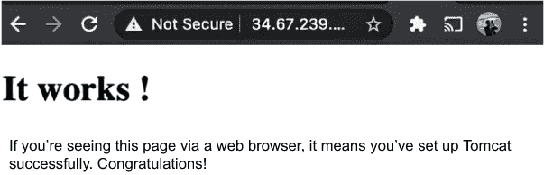

图 15.31 使用 M4A 迁移后访问 Tomcat 容器

恭喜！你现在拥有一个可路由的容器，它包含了之前在虚拟机中可用的完整 Tomcat 安装！迁移是自动发生的，无需重新编译或访问原始源代码。

在结论之前，这里有一个关于 GUI 的提示：如果你需要编辑多个文件，使用基于 Eclipse 的内置编辑器可能很方便。编辑器是快速轻松地审查和更改 M4A 生成的所有文件的一种方式（见图 15.32）。

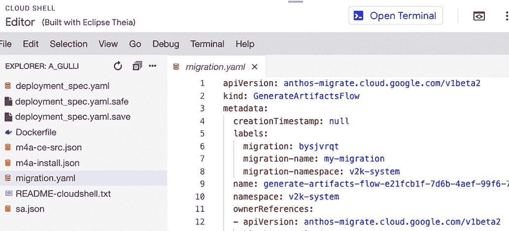

图 15.32 用于操作迁移配置的内置编辑器

在结论之前的一个注意事项：除了 Google Container Registry 和 Google Cloud Storage 用于数据存储库之外，M4A 1.6 及以上版本支持包括 ECR、S3 和 Docker 注册表在内的其他存储库。在下一节中，我们将讨论 Windows 迁移。

### 15.4.4 Windows 迁移

在本节中，我们讨论如何将 Windows 虚拟机迁移到 GKE。请注意，Windows 迁移支持将计算引擎作为源。然而，如前所述，您可以使用计算引擎迁移（有时称为迁移到虚拟机；见[`mng.bz/pdj8`](http://mng.bz/pdj8)）将来自其他源的 Windows 虚拟机迁移到计算引擎。然后，可以将生成的虚拟机迁移到 GKE。不出所料，Windows 迁移与 Linux 迁移类似。实际上，在幕后，M4A 使用一个名为 migctl 的统一 M4A CLI 工具。让我们通过 CLI 接口快速看一下示例。

首先，与 Linux 类似，您可以使用以下语句使用 migctl 添加迁移源：

```
migctl source create ce my-ce-src --project my-project --json-key=m4a-ce-src.json
```

请记住，my-ce-src 是源名称，my-project 是项目名称，m4a-ce-src.json 是创建用于作为迁移源使用计算引擎的服务账户后获得的 JSON 键文件名称。然后，您可以使用以下命令创建迁移

```
migctl migration create my-migration --source my-ce-src --vm-id my-id --intent Image -workload-type=WindowsIIS
```

其中 my-migration 是迁移的名称，vm-id 是计算引擎实例的名称，如 Google Cloud Console 中所示。可以使用以下命令检索刚刚创建的迁移计划：

```
migctl migration get my-migration
```

如果需要，您可以通过编辑文件 my-migration.yaml 来自定义迁移计划。编辑完成后，您可以使用以下命令上传编辑后的迁移计划：

```
migctl migration update my-migration
```

下一步是执行迁移并生成工件：

```
migctl migration generate-artifacts my-migration
```

在迁移过程中，您可以监控状态：

```
migctl migration list
```

迁移完成后，您可以访问工件：

```
migctl migration get-artifacts my-migration
```

结果，您应该看到类似以下内容：

```
Artifacts are accessible through 'gsutil cp gs://PATH/artifacts.zip ./'
```

因此，您可以使用以下命令获取工件：

```
gsutil cp gs://PATH/artifacts.zip ./
```

下一步是使用工件构建 Docker 镜像。我们可以使用 Windows PowerShell 展开 artifacts.zip：

```
Expand-Archive .\artifacts.zip
```

然后登录到容器注册表：

```
docker login gcr.io
```

下一步是使用以下代码片段构建容器：

```
docker build -t gcr.io/myproject/myimagename:v1.0.0 .\artifacts\
docker push gcr.io/myproject/myimagename:v1.0.0
```

当您为 Windows 工作负载生成工件时，工件将被复制到云存储桶中作为中间位置，您可以从中下载。此文件包含 Dockerfile、deployment_spec.yaml 文件以及来自源的一些目录，您可以使用这些目录构建 Windows 容器。构建完成后，容器镜像将被放置在容器注册表中，并且可以部署到 GKE 集群。请注意，自 M4A v1.5 版本起，Google Cloud Console for Anthos 已包含对 Windows 工作负载的支持。体验与之前讨论的 Linux 相同。如果您想看另一个 Windows 迁移的示例，请考虑在[`mng.bz/yd7y`](http://mng.bz/yd7y)可用的“Migrate for Anthos: Windows”动手实验室。

### 15.4.5 从其他云迁移

截至 2021 年 11 月，从其他云迁移基于两步方法。首先，虚拟机被迁移（技术上，它们被转换为 GCE 实例）。然后，迁移的虚拟机被容器化。

M4A 使用 Migrate for Compute Engine (M4CE)（有时称为迁移到虚拟机；[`cloud.google.com/migrate/compute-engine`](https://cloud.google.com/migrate/compute-engine)）产品，将位于其他云或本地云上的虚拟机流式传输到 GCE 实例。Migrate for Compute Engine 可以通过市场([`mng.bz/Mlao`](http://mng.bz/Mlao))安装，并允许从源平台（如 VMware、Microsoft Azure 和 Amazon EC2）迁移数千个应用程序到多个数据中心和云。

要使用 M4CE，您需要设置站点到站点的 VPN 连接和防火墙规则，以启用位于管理器所在 VPC 和位于另一云的源虚拟机 VPC 之间的通信。感兴趣的读者可能会发现[`cloud.google.com/vpc/docs/firewalls`](https://cloud.google.com/vpc/docs/firewalls)上的在线防火墙文档很有用。可以通过 GCP Cloud Router ([`mng.bz/0ygN`](http://mng.bz/0ygN)) 在 Cloud VPN ([`mng.bz/aMro`](http://mng.bz/aMro)) 或专用高速 Cloud Interconnect ([`mng.bz/Klgj`](http://mng.bz/Klgj)) 上设置基于 BGP 协议的动态路由([`mng.bz/zmVB`](http://mng.bz/zmVB))。Cloud Interconnect 通过一个高可用、低延迟的连接将您的本地网络扩展到 Google 的网络。

此外，可以根据它们的逻辑角色将成千上万的虚拟机分批迁移，通过波次聚合它们。M4CE 允许我们定义运行手册来决定哪些虚拟机应该迁移以及迁移的顺序。在有效迁移之前可以计划一个模拟测试阶段。M4CE 的主要组件如下：

+   *迁移管理器*—用于编排迁移。管理器在单独的 Google Compute Engine 虚拟机上运行，并提供一个迁移控制台来管理和监控所有系统组件。请注意，管理器可能需要特定的权限来处理特定的操作，例如开启和关闭虚拟机。这些权限可以通过策略来定义。

+   *云扩展*—用于处理从源平台迁移的存储。扩展是迁移源和目标之间虚拟机存储的通道。这些扩展在单独的 Compute Engine 虚拟机上运行，并在迁移过程中本身为迁移的工作负载提供服务。请注意，扩展使用双节点主动/被动配置进行高可用性；每个节点提供服务，同时为另一个节点提供备份。

然后根据以下描述，在源平台上部署不同的组件：

+   *在 vSphere 上*—后端组件从 VMware 向 Google Cloud 的扩展提供运行时数据。然后，数据由 Compute Engine 上的虚拟机使用。此外，vCenter 插件将 vSphere 连接到迁移管理器，并在 vCenter 上编排迁移。

+   *在 Amazon EC2 和 Azure 上*—在运行时部署导入器，并将源数据从 Google Cloud 上的扩展服务中提供。然后，数据由 Compute Engine 上的虚拟机使用。

自 Migrate 1.9 以来，您还可以将容器部署到 GKE Autopilot 集群和 Cloud Run，但这个主题超出了本书的主题范围。

在本节中，我们简要介绍了 M4CE，这是 M4A 用来在云和本地之间移动虚拟机的方法。迁移可以在几分钟内完成，而数据则在后台透明迁移。感兴趣的读者可以在[`mng.bz/GRXv`](http://mng.bz/GRXv)上了解更多信息。此外，有关如何将 EC2 实例从 AWS 迁移到 Google Cloud 上的 Compute Engine 的更多有用信息可在[`mng.bz/gJ2x`](http://mng.bz/gJ2x)找到。下一节将介绍为 M4A 采用的一些 Google 最佳实践。

## 15.5 高级主题：M4A 最佳实践

在本节中，我们讨论了 M4A 的一些最佳实践。目的是为顾客经常遇到的实时场景提供指导。本节相当高级，并假设您非常熟悉 Kubernetes 环境。详细讨论了 Kubernetes 的不同细节。让我们从以下内容开始：

+   *虚拟机主机名*—一个方便的模式是将虚拟机主机名转换为 Kubernetes 服务名称（见[`mng.bz/WAQa`](http://mng.bz/WAQa)）。请注意，服务名称是一组 Pod 端点，它们被组合成一个单一的资源。因此，保留这种命名约定有助于保持一致性。

+   *每个虚拟机多个应用/服务*—如果每个虚拟机存在多个应用程序或服务，为它们中的每一个定义一个 Kubernetes 服务可能很方便。同样，这种命名约定有助于保持一致性。

+   *主机文件自定义*—如果您的虚拟机在主机文件上使用特定的自定义以进行 DNS 解析，那么建议使用 Kubernetes Pod 规范中的 hostAliases（[`mng.bz/81qz`](http://mng.bz/81qz)）。向 Pod 的/etc/hosts 文件中添加条目提供了对主机名解析的 Pod 级别覆盖。此外，它有助于复制多个应用程序环境，如生产、预发布和测试。

+   *多虚拟机堆栈*—如果您有一个多虚拟机堆栈环境，那么将相互依赖的 Pod 放置在同一个 Kubernetes 命名空间中并使用简短 DNS 名称可能很方便。此外，您应该使用 Kubernetes 的 NetworkPolicy 来限制前端 Pod 和后端 Pod 之间的访问。这种组织有助于保持您的环境有序、更安全、更有效。

+   *引用外部服务*—如果您的应用程序使用外部服务，考虑使用 Kubernetes ExternalName Service 而不使用选择器（[`mng.bz/Elqd`](http://mng.bz/Elqd)）是一个 Kubernetes 的最佳实践，用于抽象外部后端。

+   *NFS 文件共享*—目前，M4A 不会自动迁移 NFS 挂载。因此，您需要手动定义 NFS 持久卷指令并将它们添加到生成的 Pod YAML 中。感兴趣的读者可以在网上找到有关挂载外部卷的更多信息([`mng.bz/Nmqn`](http://mng.bz/Nmqn))。

+   *不必要的服务*—迁移是一个整合时刻。因此，检查您虚拟机上运行的所有服务并禁用不需要在容器上运行的服务是合适的。Migrate for Anthos 将自动禁用不必要的硬件或特定于环境的服务和在 VM 上运行的一组预定义的附加服务。有关自动禁用的不同服务的详细列表，请参阅[`mng.bz/DZqR`](http://mng.bz/DZqR)。

+   *环境变量*—如果您的应用程序需要环境变量，将定义移动到 Kubernetes Pod YAML 中是一个好习惯，以确保您遵循将所有基础设施作为代码的最佳实践。

+   *使用 Cloud 实例元数据的脚本*—如果您的脚本查找元数据，将此查找替换为 Kubernetes ConfigMap ([`mng.bz/lJl2`](http://mng.bz/lJl2))或再次使用在您的 Kubernetes Pod YAML 定义中定义的 env 变量是值得的。

+   *应用程序日志*—您可以使用 M4A 将工作负载容器生成的日志迁移并写入 Cloud Logging。默认情况下，M4A 会将写入 init（所有 Linux 进程的父进程）的 stdout 的条目以及来自/var/log/syslog 的内容视为条目。采用此策略将提高您环境中自动化的程度和应用程序的可观察性。

+   *GKE 入口控制器*—如果您迁移到 GKE，使用 GKE 网络入口控制器来控制访问工作负载的网络流量可能很方便。这样做将消除更改应用程序以添加额外路由规则、VPN、过滤器或 VLAN 的需求。例如，如果您迁移一个三层应用程序，您可能希望将其拆分为多个容器。前端服务通过 GKE Google 负载均衡器([`mng.bz/Blq1`](http://mng.bz/Blq1))进行访问，以实现负载可伸缩性。此外，您可能还想定义网络策略，以确保只有前端 Pod 可以访问应用程序服务，而外部世界不能访问。同样，您可能还想定义策略，以确保应用程序层只能访问数据库层。这些选择将提高您环境中安全性。

+   *Linux 特定的运行级别 3*—在 Linux 环境中，某些服务被配置为默认只在运行级别 5 时启动。目前，M4A 只能达到运行级别 3。使用 M4A 迁移到 GKE 的 VM 将在 Linux 运行级别 3 下启动。因此，某些服务应该被配置为在运行级别 3 时自动启动。这些可能包括 X11、XDM 和用于 VNC 的 GUI。

在本高级章节中，我们讨论了您可以采用的一些最佳实践，以微调使用 M4A 迁移的环境。在下一节中，我们将讨论迁移后如何升级镜像。

## 15.6 迁移后与 CI/CD 管道的集成

使用 M4A 生成的工件可用于第二天的操作，例如软件更新、配置更改、安全补丁以及与文件的附加操作。您可以将这些工件轻松集成到典型的 CI/CD 管道中，该管道包括源代码、构建、测试和部署（见图 15.33）。

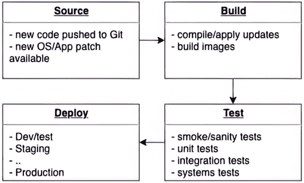

图 15.33 典型的 CI/CD 开发阶段

通过多阶段构建生成的工件可以逐步维护，而不会增加生成容器镜像的风险。图 15.34 展示了 M4A 与 CI/CD 管道的集成示例。

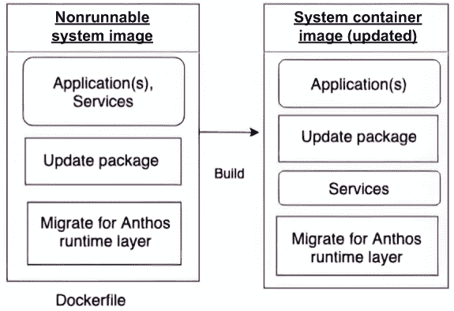

图 15.34 M4A 与 CI/CD 管道的集成

典型的 Docker 工件由两部分组成（见图 15.35）。第一部分是 M4A 运行时，第二部分是不可运行的基镜像，代表从迁移的虚拟机中捕获的系统镜像层。

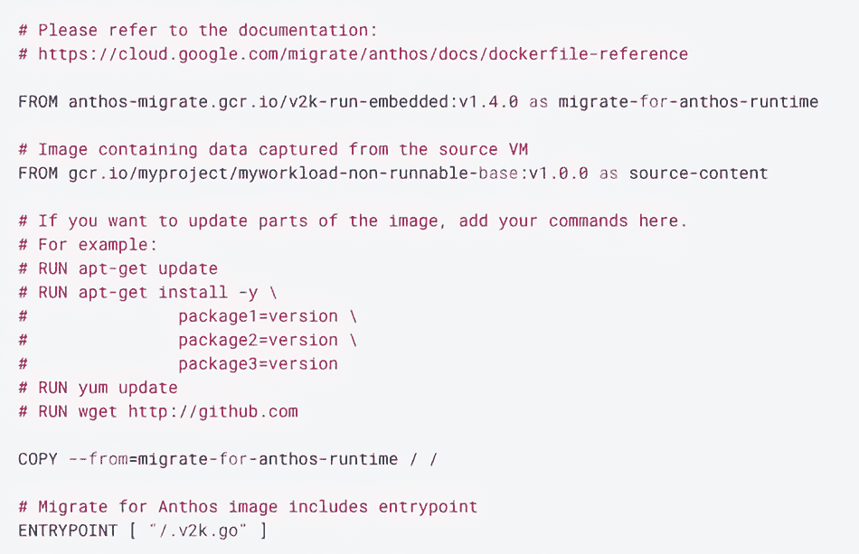

图 15.35 M4A 生成的典型 Dockerfile，适用于 CI/CD 管道

如果您需要更新 M4A 运行时，您可以直接从 Dockerfile 中替换第一个 FROM 指令。例如，假设您需要支持 M4A 1.8.1。您可以使用以下新指令来实现，这将替换当前的指令：

```
FROM anthos-migrate.gcr.io/v2k-run-embedded:v1.8.1 as migrate-for-anthos-runtime
```

如果您需要更新您的应用程序，您可以更改第二个 Docker FROM 指令。具体来说，您通常从容器注册库（如 GCS）下载生成的 Dockerfile，编辑 Dockerfile 以应用您希望进行的更改，构建一个新的分层镜像，并通过滚动更新来更新现有的部署。如前所述，这种基于镜像层的方法非常适合基于 CI/CD（见第十二章）的部署环境，其中 DevOps 和站点可靠性工程（SRE）方法是关键。

在本节中，我们讨论了如何集成 CI/CD 管道以增加您的组织敏捷性。在下一节中，我们将讨论如何与服务网格集成。

## 15.7 迁移后与 ASM 的集成

在本章前面，我们讨论了使用服务网格的好处——在通信、策略管理、可观察性和敏捷性方面的透明收益。关键观察结果是采用 Anthos Service Mesh（见第四章）是采用 SRE 和 DevOps 方法论的另一步。

例如，ASM 使得我们可以检查应用程序的关键指标（如错误、延迟和请求速率）的服务状态；可视化拓扑；检查估计成本；并定义服务级别指标（见图 15.36）。

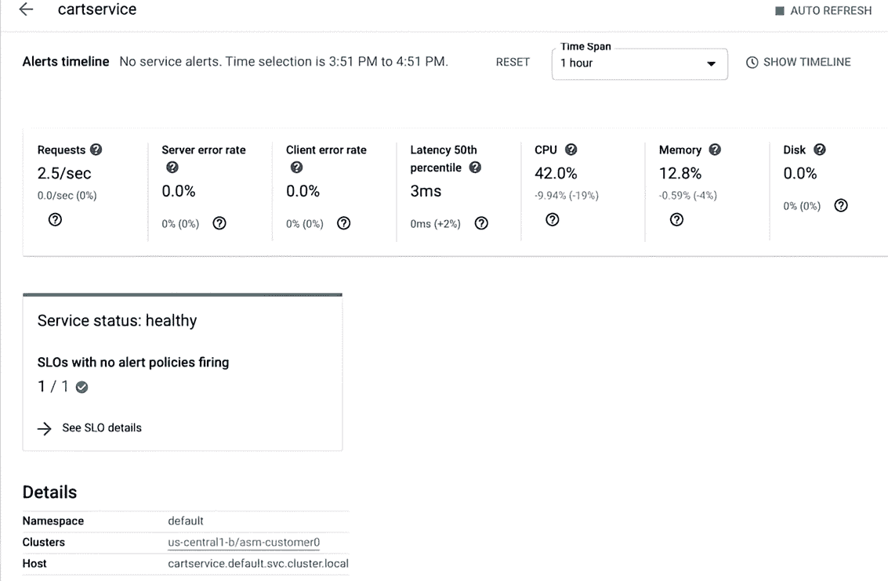

图 15.36 使用 ASM 检查迁移后的应用程序

再次强调，这些收益是免费的，无需更改迁移应用程序中的任何代码。一旦容器化，您的应用程序就变成了第一类云原生应用程序，可以使用现代云原生方法进行管理，并实现显著的成本节约。您可以通过使用 WorkloadEntry 将您的遗留虚拟机添加到网格中。关键是您获得了在 Kubernetes 上（可移植性、可扩展性等）的所有好处，以及封装集群内所有服务的服务网格，而无需扩展到集群边界之外。

## 摘要

+   迁移到基于云的应用程序提供了使用比传统虚拟机更有效的方式使用基础设施的现代基于容器的环境的优势。收益包括降低成本、提高可移植性、可扩展性、弹性、简化开发者体验以及缩短上市时间。

+   您可以使用 Migrate for Anthos 进行完全自动化的转换，无需原始源代码。

+   最佳迁移工作负载候选者包括无状态 Web 前端、多虚拟机、多层堆栈、业务逻辑中间件、中到大型数据库以及低负载周期和突发工作负载。我们已经一起审查了构成 Migrate for Anthos 架构的组件以及实际的迁移场景。

+   我们已经学习了使用 Migrate for Anthos 进行迁移的一些常见最佳实践，包括与 CI/CD 管道以及与 Anthos Service Mesh 的迁移后集成。

* * *

(1.) 虚拟机管理程序是创建和运行虚拟机的软件、固件或硬件。

(2.) SLA 是指定应提供什么服务、如何支持、时间、地点、成本、性能以及相关方责任的协议。

(3.) SLO 是 SLA 的具体可衡量指标，例如可用性、吞吐量、频率、响应时间或质量。

(4.) 断路器是一种在现代软件开发中用于检测故障并防止故障在维护期间、外部故障或意外问题中不断出现的模式。

(5.) 金丝雀部署是一种将发布部署到用户或服务器子集的模式。想法是首先将更改部署到一小部分服务器/用户，测试它，然后将其部署到剩余的服务器/用户。

(6.) 两个常见的 Unix 服务层；请参阅 [`fossbytes.com/systemd-vs-sys-v-vs-upstart/`](https://fossbytes.com/systemd-vs-sys-v-vs-upstart/)。

(7.) CRD 是 Kubernetes API 的扩展，这并不一定在默认的 Kubernetes 安装中可用。CRD 是一种标准机制，以模块化方式自定义 Kubernetes。请参阅 [`mng.bz/61zy`](http://mng.bz/61zy)。

(8.)截至 2023 年，共有 90 个经过认证的 Kubernetes 兼容发行版。参见 [`mng.bz/oJ9M`](http://mng.bz/oJ9M)。

(9.)参见 [`cloud.google.com/migrate/compute-engine`](https://cloud.google.com/migrate/compute-engine)。

(10.)有关拟合评估规则的列表，请参阅 [`mng.bz/v1VM`](http://mng.bz/v1VM)。

(11.)Pod 封装了一个或多个应用程序，是 Kubernetes 中最小的执行单元。
