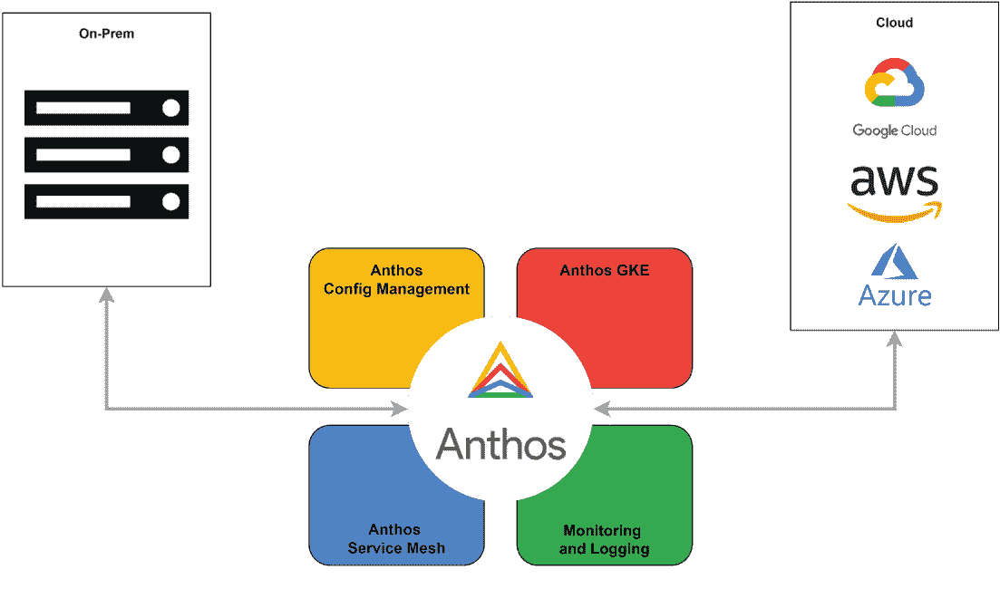
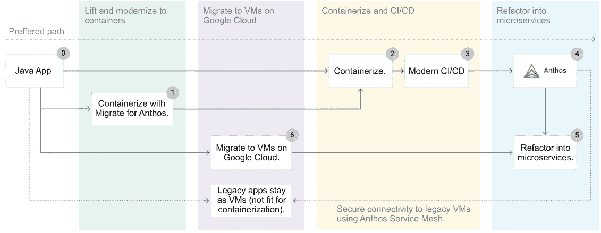
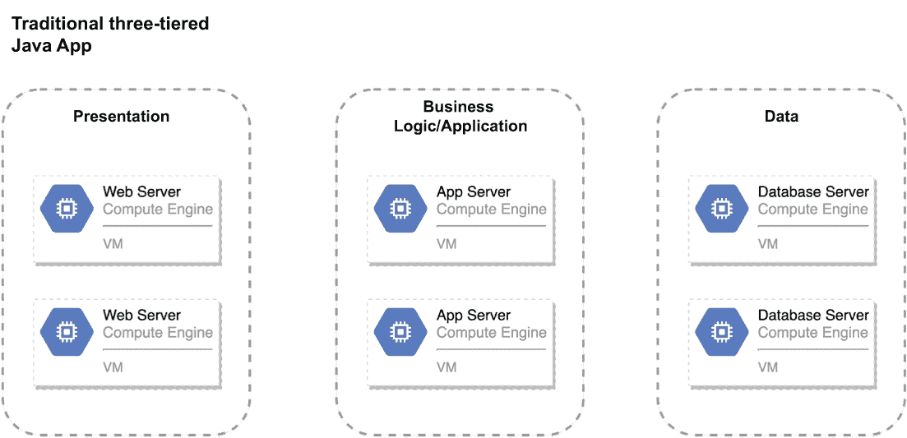
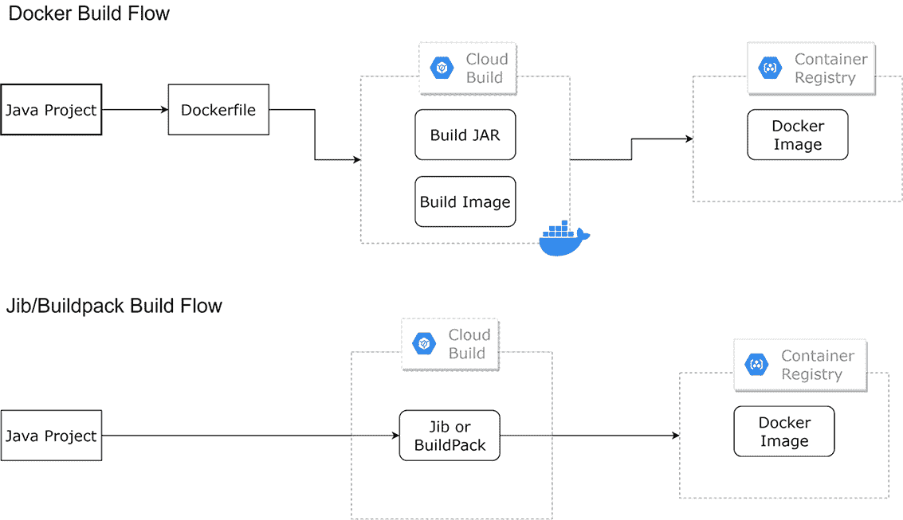
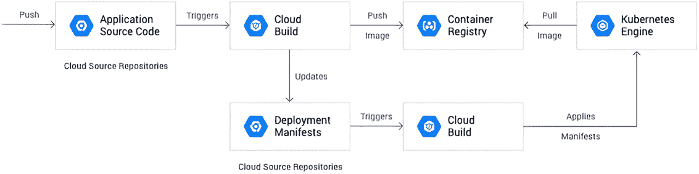
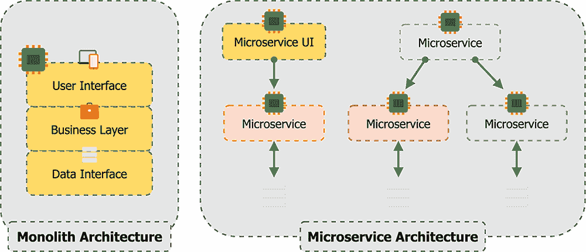
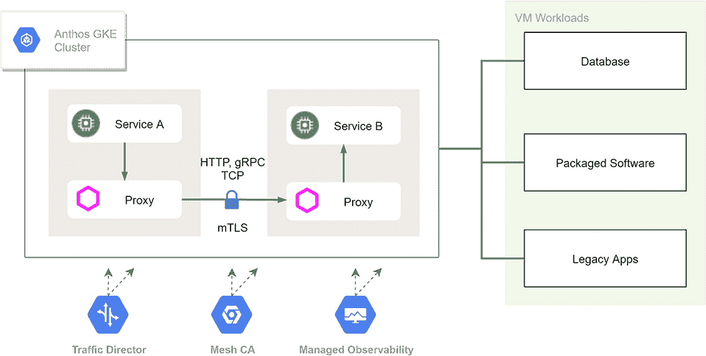

# 16 打破单体

菲尔·泰勒

本章涵盖

+   现代化遗留应用程序

+   使用 Anthos 进行现代化

+   Anthos 对微服务的优势

+   现实世界的例子

+   避免的反模式

在当今市场上开发和支持大规模应用程序比以往任何时候都更难。随着商业市场的快速加速，应用程序迅速从早期原型发展到大规模应用程序。使用传统的部署方法和流程，我们可以随着应用程序的扩展而演进我们的架构，并有机地发现和修复问题。由于团队需要以多快的速度移动才能跟上业务需求，我们的架构和部署流程需要从第一天起就具有敏捷性和可扩展性。幸运的是，容器和容器平台（如 Anthos）的最新创新，以及现代开发模式，如微服务架构，帮助我们轻松构建和部署应用程序，而不会牺牲效率、性能或质量。

## 16.1 现代化遗留应用程序

虽然这些新的模式和工具非常适合绿地开发项目，但支持我们的遗留应用程序可能会令人沮丧，有时甚至令人不知所措。许多团队面临着在飞行中重建飞机的挑战。可能会很有诱惑力将所有的鸡蛋都放在一个篮子里，只专注于使用现代、软件架构模式和容器来重建你的应用程序。我们已经看到几个团队采取了这种方法并失败了。最成功的团队将这个过程视为对原始设计的一系列渐进式改进。

当考虑如何从单体遗留设计迁移到现代架构设计时，我们推荐以下方法：

+   现代化遗留应用程序的开发和部署流程。

+   考虑语言和/或框架升级或替换，这可能会改善开发和部署生命周期。例如，如果我们有一个 Java WebSphere 应用程序，如果我们认为应用程序并没有与 WebSphere 的功能紧密绑定，我们可能会考虑将其迁移到 Apache Tomcat web 服务器框架。

+   在容器中现代化，你可以使用 Migrate for Anthos 快速将你的应用程序的运行环境从虚拟机迁移到容器。这将有助于对应用程序的操作进行渐进式改进，这应该会给你的团队时间来专注于现代化工作。

+   添加一个持续集成管道，用于构建和单元测试你的应用程序，可以帮助团队更快地识别和修复问题。反过来，这将为他们提供一个快速反馈循环，这将给他们提供开始现代化应用程序所需的信心。

+   添加一个持续部署管道，将你的应用程序部署到较低的环境，并执行自动集成或用户验收测试，这将进一步提高团队的生产力。

+   在这个阶段，添加端到端的可观察性和仪表化至关重要。我们不能再依赖于登录到专用的虚拟机来查看日志或调试我们的应用程序。我们需要能够监控和调查可能在我们操作环境的大量节点上发生的故障。

+   使用像 GKE 或 Anthos 这样的托管容器操作环境，将使您的团队能够专注于软件和部署创新，而不是运营容器环境。

接下来，您将希望使旧应用程序本身现代化，而不仅仅是开发和部署过程。这将为开发团队和基础设施创造敏捷性、速度和效率。将应用程序分解成更小的领域，并将其实体化到具有已知契约的独立服务中，将创造额外的效率。例如，您将能够独立构建和测试单个业务领域服务，从而允许快速迭代功能。服务之间的标准契约将创建一个明确的边界，以确定何时引入可能影响其他依赖服务的破坏性更改。您将有两个选择：逐步提取和重写功能或重写整个应用程序。大多数情况下，这个选择将取决于企业的目标和投资意愿。我们将简要介绍第一种选择，因为它是我们看到客户采用的最常见方法。

您有方法在边缘剥离功能并重写它们以成为云原生。我们想说的是，在现实生活中这总是那么容易。许多团队从常见的服务开始，如身份验证和授权或日志记录。这种方法将使您的团队能够逐步采取较小的步骤，开始将您的应用程序架构迁移到现代微服务设计。

到这个时候，你可能自己会问，为什么不直接使用适用于旧应用的 Anthos 迁移，然后就此结束呢？答案取决于您的特定用例和应用程序的生命周期。这种方法可能非常适合计划停用或被替换的应用程序。对于将长期存在的应用程序，您最终将希望重新编写它们，以利用现代架构模式，如微服务和无服务器架构。以下列出了上述架构的许多优势：

+   发展优势

    +   小型团队专注于单一的业务问题领域。

    +   代码的开发和测试的现代技术支持服务的 100%自主构建、测试和部署。尽管使用旧应用程序可以实现 100%的测试覆盖率和自动化部署，但所需的努力比从一开始就支持它的设计要大得多。

    +   解耦的服务允许我们选择最适合团队构建的业务能力的技术堆栈。

    +   不同的团队可以管理不同的微服务。这种做法通常用于为每个团队创建一个服务，其中团队只需要理解适用于他们正在开发的服务的企业领域。考虑一个包含支付和税务逻辑的服务。在这种情况下，开发者需要理解支付交易和网关、PCI 合规性以及联邦或地方税务规则等概念。通过在支付和税务之间分割服务领域边界，我们可以减少支持每个服务的开发者所需的领域知识。采用微服务方法，支付团队不再需要理解联邦或地方税务规则的复杂性；他们只需要理解添加适当税费到特定交易的 API 接口。

+   运营优势

    +   *提高可靠性和高可用性*——每个应用程序服务都是单独设计编译和部署的。这减少了服务中断的影响范围，仅限于单个微服务。

    +   *可移植性*——容器创造了移动性，允许我们在合理的地方运行服务，无论是在本地还是在云服务提供商处。尽管这也可以通过虚拟机实现，但容器平台使得在其他环境中部署和调度工作负载或自动将工作负载移动到更好的操作节点（零停机时间）变得更加容易。

    +   *降低运营成本*——容器比虚拟机具有更高的密度，与虚拟机或物理环境相比，可以节省更多成本。

    +   *单个服务的需求弹性*——采用微服务设计，我们可以自动扩展服务以满足需求，并在空闲时间缩小规模以实现成本效益。这也适用于基于虚拟机的架构，但团队传统上由于缺乏理解如何在虚拟机内部扩展单个服务，因此会扩展整个虚拟机。

    +   *自动化部署管道*——使用基于容器的解决方案，我们可以更轻松地自动化端到端操作。

    +   *自我修复*——通过将需要高可用性的服务迁移到容器平台，我们可以更轻松地设置自动化来处理常见的故障和恢复任务。Kubernetes 提供了原生的存活性和就绪性检查以及重新调度功能，这在大多数情况下是一个简单任务。

## 16.2 使用 Anthos 进行现代化

Anthos 提供了一个完整的解决方案来运行我们的容器化应用程序或我们希望迁移到容器的传统应用程序。Anthos 可以帮助我们在原地现代化，将我们的工作负载迁移到云端，并利用保持云和本地环境之间集群一致性以及高级服务网格网络的能力，更轻松地实现混合应用程序策略。请参阅图 16.1，了解此处描述的 Anthos 组件概述：

+   Anthos 配置管理提供了一种简单的方法来集中管理配置代码。

+   Anthos 服务网格为我们提供了一种指定松散耦合的服务依赖关系、在服务之间建立安全通信通道以及配置集中可观察性系统的方法。

+   Anthos GKE 为我们的基于 Kubernetes 的工作负载在本地或公共云环境中提供了一个可靠和一致的计算环境。

+   Cloud Logging 和 Cloud Monitoring 提供了集中式工具，用于监控、审计和故障排除集群和工作负载。

图 16.1 Anthos 组件概述

### 16.2.1 现代化方法

正如我们在引言中讨论的那样，存在几种方法可以使您的应用程序现代化，您选择的路径可能因具体的应用程序和业务需求而异。您的应用程序中的一些应用程序或组件可能不适合容器化。以下是一些可能影响您决定将应用程序或应用程序组件容器化的因素：

+   *使用 GCE*——如果应用程序是业务关键型且风险过高，您在容器化之前可能需要考虑将此应用程序迁移到 Google Compute Engine（GCE）虚拟机。通过首先将应用程序迁移到 GCE，您可以降低学习新操作模式以支持应用程序的风险。这可以给您的团队时间来首先学习 Kubernetes 和 Anthos 在不太关键的工作负载中的应用。

+   *许可限制*——例如，您的应用程序可能依赖于一个不允许容器化的软件应用程序。

+   *运营支持*——支持您的应用程序的团队尚未准备好承担支持容器化应用程序所需的新工具链。

+   *其他因素*——这包括法规遵从性要求、与其他应用程序交互时的性能以及现有的硬件投资。

考虑图 16.2，它可视化了一个 Java 应用程序现代化的高级流程。

图 16.2 现代化 Java 应用程序

无论您最初使用哪种技术堆栈来构建应用程序，方法都是相同的。同时，请记住，这是一个简单的示例——您的应用程序可能由多个应用程序组件或服务组成，它们都需要交互以创建端到端的应用程序用户体验。根据前面列出的标准，您需要决定哪些应用程序组件将重新部署到容器中，哪些将保留为虚拟机。然后，您可以按照图示的工作流程进行现代化计划。以下大纲为每个步骤添加了更多的清晰度：

+   *步骤 0*——确定要现代化的目标应用程序或组件。

+   *步骤 1*——如果应用程序适合，我们将使用 Anthos Migrate（第十五章）来容器化目标应用程序。

+   *步骤 2*—如果应用过于复杂，我们将手动容器化应用。我们将在下一节中详细介绍这种方法。

+   *步骤 3*—更新现有的 CI/CD 管道，或构建一个新的管道，用于构建、测试和部署应用到 Anthos。

+   *步骤 4*—使用 Anthos 来管理配置、安全性和与遗留应用的连接来运行你的应用。

+   *步骤 5*—将你的应用重构为微服务架构。

+   *步骤 6*—将目前不适合容器化的遗留应用迁移到 Compute Engine，然后通过将每个应用重构为微服务，使用为云原生应用设计的现代开源框架来现代化它们。

+   不在现代化计划范围内的遗留应用将保持其当前形式，并可能继续留在遗留数据中心。我们将使用 Anthos Service Mesh 来保护对这些工作负载的连接，例如 ERP 系统和核心主机应用。

图 16.3 展示了三层 Java 应用，也称为单体应用。在某些情况下，遗留应用将使用商业 Java 应用服务器（例如，WebSphere、WebLogic）。如果你已经分析了应用源代码，并且它没有利用商业应用服务器的专有功能，那么现在是迁移到开源应用服务器（Apache Tomcat、JBOSS）并消除不必要的许可成本的好时机。毕竟，你将重新构建应用部署，并且公共容器镜像可以作为上述开源应用服务器的起点。如果你的团队正在考虑重新设计或重写，你还可以考虑将应用中的现代 Java 框架迁移到 Spring Boot ([`spring.io/projects/spring-boot`](https://spring.io/projects/spring-boot))。如果你选择这条路径，你还可以考虑使用 Spring Cloud GCP ([`spring.io/projects/spring-cloud-gcp`](https://spring.io/projects/spring-cloud-gcp))项目，这将加速你的迁移并提供与常见 GCP 服务（如 Pub/Sub、Cloud Spanner 和 Cloud Storage）交互的库。如果你希望避免锁定到特定供应商，你还可以通过使用接口设计来抽象上述服务，从而抽象出云提供商特定的实现。

图 16.3 传统三层 Java 应用

一旦你确定了哪些应用或应用组件最适合容器化，你就可以遵循下一步。

容器化你的应用

旅程的第一步是在容器内运行你的应用程序。如果你正在容器化 ASP.NET 应用程序，你将有两个选择考虑：迁移到 .NET Core 或使用 Windows 经典 Kubernetes 节点。你选择的方法将取决于你将 ASP.NET 应用程序迁移到 .NET Core 的难易程度以及应用程序将得到多长时间的支持。一般来说，我们建议将应用程序迁移到 .NET Core，这样它将在 Linux 上运行，从而简化你的 Anthos 集群。此外，与 Java 应用程序一样，它可能需要彻底的重写。

在本章中，我们将重点关注将典型的企业级 Java 应用程序重新部署到在 Anthos 上运行的容器所需的步骤。Java 开发者有一些工具可以使用，使构建应用程序容器镜像的过程更加容易，这些工具可以集成到现有的构建工作流程中（见图 16.4）。如果你的团队不习惯编写容器镜像描述符，你可以考虑使用以下工具：

+   *Jib* ([`github.com/GoogleContainerTools/jib`](https://github.com/GoogleContainerTools/jib))—与 Maven 集成，在构建机器上不需要 Docker 守护进程。开发者遵循典型的构建过程，Jib 为你的应用程序构建并输出一个优化的容器镜像。优化的容器镜像将依赖项从类中分离出来，使其在未来的构建中快速高效。只有发生变化的层才会被重新构建。

+   *Google Cloud buildpacks* ([`mng.bz/dJKo`](http://mng.bz/dJKo))—Buildpacks 被设计用来抽象容器镜像构建过程，这样开发者可以遵循正常的构建过程。基于 CNCF v3 规范，这些 buildpacks 会输出遵循最佳实践的容器镜像，以便在 GCP 容器服务上运行：Anthos、Cloud Run 或 GKE。

图 16.4 Docker 构建 vs. Jib/buildpack 流程

一旦你选择了你的路径并容器化了你的应用程序，就是时候将其连接到 CI/CD 构建管道以实现更快的部署迭代了。在这个时候，你已经容器化了单体应用程序。在本章的后面部分，我们将讨论如何将其重构为微服务。

使用现代 CI/CD 构建和部署你的应用程序

接下来，我们想要构建一个 CI/CD 管道来管理我们的新构建过程并部署我们的应用程序。这将通过消除手动任务以自动化任务来提高我们的开发过程的效率，从而允许我们更快地构建、验证和发布代码。随着我们重构到微服务，我们将应用程序服务解耦成独立部署的组件，这增加了部署和管理我们现代应用程序的整体复杂性。如果没有定义良好且完整的 CI/CD 管道以及用于解决质量控制和支持部署的自动化方法，我们看到的团队速度减慢而不是加快。

图 16.5 展示了构建 CI/CD 管道的必要阶段和流程，以构建和部署 Kubernetes 应用程序。

图 16.5 Kubernetes 应用程序的示例 CI/CD 管道

在 Anthos 上运行您的应用程序

在这一点上，您可以使用 Anthos 作为一致的 Kubernetes 操作环境，以减少您的运营开销，同时提高开发周期速度。有关运行应用程序的更多信息，请参阅第五章。将您的应用程序迁移到容器中并添加 CI/CD 管道，应该会给您的操作员和开发者更多的时间来关注现代化其他应用程序，或者继续对已经在 Anthos 上运行的现有应用程序进行更深入的现代化（重构为微服务）。

将您的应用程序重构为微服务

自从公共云平台发明以来，我们所学到的是，对于云原生应用程序而言，有一种架构优于所有其他架构：微服务。微服务架构由像谷歌这样的公司开创，此后已被主流公司采用，这些公司在精英 DevOps 领域表现突出（见[`mng.bz/rd4J`](http://mng.bz/rd4J)）。本章的目的不是成为构建微服务应用程序的圣杯——关于这个主题有很多好书。尽管如此，我们将花时间突出这种架构和这种方法的关键优势。如图 16.6 所示，在单体架构中，我们将所有服务代码耦合到一个单一的编译应用程序中，这会在技术组件和构建它们的团队之间创建硬耦合。这也意味着当该应用程序在单个进程中运行时，存在已知副作用：一个组件的应用程序崩溃可能会使整个应用程序崩溃，并且扩展应用程序意味着扩展所有组件，这会导致我们计算环境中的浪费。

图 16.6 单体架构与微服务架构对比

大多数团队在设计创建微服务时使用领域驱动设计（见[`mng.bz/Vp4y`](http://mng.bz/Vp4y)）。在微服务架构中，我们将负责不同业务领域的服务解耦到它们自己的独立服务中。这使得我们可以将负责开发每个服务的团队解耦，减少所需的领域专业知识。我们通过使用行业最佳实践来标准化服务之间的交互，包括协议和数据负载，这为基于微服务的架构提供了以下技术和开发效益：

+   我们将应用程序分解为一系列更易于理解的小服务。

+   由于我们限制了所需的领域知识范围，它们开发更快，维护也更简单。

+   这些服务可以由专注于该服务的团队独立开发，从而提高整体产品开发速度。

+   它们可以独立部署和扩展；我们正在扩展服务，而不是服务器。

+   它使得在复杂应用程序上启用持续部署变得容易，因为我们可以在服务开发迭代期间将测试边界限制为单个服务。

商业效益如下：

+   我们增加了部署频率，从而减少了新特性和补丁的上市时间。我们可以迭代开发，并向单个服务添加新功能，而对其他应用程序服务的影响很小或没有。

+   我们获得了更好的基础设施利用率，因为我们扩展的是服务，而不是服务器。因为我们有更清晰定义的应用程序服务边界，我们可以单独部署服务，并仅扩展需要扩展的服务。在过去，运维团队通常会扩展整个服务器或虚拟机，因为单个服务的扩展是一个复杂任务，而且他们并不足够了解应用程序来将其拆分。

+   我们实现了安全补丁的更快的平均恢复时间。因为微服务主要是使用容器部署的，我们只需修补代码，然后使用 Kubernetes 滚动更新重新部署应用程序，实现零停机时间。在过去，我们可能会尝试修补虚拟机并就地升级应用程序。大多数运维团队都会同意这比通常计划的时间导致更多的停机时间。

+   我们经历了部署失败或回滚的减少。因为我们已经隔离了服务边界，我们的部署范围也相应减少。结合应用程序的自动化测试和部署，我们的成功率显著提高。

当选择将应用程序重构为微服务架构时，你可以采取两种方法：首先，组建一个专注于使用绿色田野方法重写整个应用程序的团队。这种方法对生产应用程序的干扰较小，但会增加整体项目的风险，因为在你能够实现效益之前，你需要重写整个应用程序。第二种方法是应用绞杀榕模式([`mng.bz/xdgd`](http://mng.bz/xdgd))，逐步迭代掉遗留应用程序的设计，并将其重构为微服务。

我们建议使用绞杀榕模式，因为它降低了采用新设计模式和将应用程序整体重构为微服务架构的风险。这种方法可能会给整体项目增加一点工作量，因为我们需要提取逻辑并将其重新整合到现有应用程序中。它允许我们逐步改进应用程序架构，每次创建新的生产版本时都提供更多价值，从而减少风险并更快地向业务提供价值。

许多团队在简单的问题上挣扎，即我们从哪里开始？答案将因每个应用而异。然而，模式通常是相同的：寻找支持应用且易于解耦的功能。例如，集中式身份验证和授权服务通常是一个不错的选择。

考虑使用谷歌推荐的框架([`mng.bz/Alqo`](http://mng.bz/Alqo))来评估哪个功能应该首先移动。以下是对该框架的总结：

+   业务流程

+   设计和开发

+   运维

+   人员和团队

业务流程

您应该评估和考虑移动功能对商业用户可能产生的影响。开发者和运维团队需要学习许多新概念才能成功实现应用的现代化。在您的现代化过程中早期，应避免移动业务关键系统或功能。

设计和开发

接下来，您应该评估功能的复杂性、其依赖关系以及移动它所需的重构量。考虑以下因素：

+   数据使用、模式数量（隔离或共享）和大小

+   对其他功能的依赖

+   依赖于此功能的其他功能

+   连接性需求

+   在重构中可能增加复杂性或没有明确解决方案的设计元素

运维

在评估哪些功能应首先移动时，您应考虑以下因素：

+   与商业的 SLA 服务

+   维护窗口和停机容忍度

考虑专注于对停机时间更宽容且没有要求高可用性的关键业务 SLA 的功能。

人员和团队

在早期阶段，最好专注于支持现代化且拥有明确流程的团队。如果可能，避免那些抵制或流程仅通过部落知识可用的团队。

使用 Anthos Service Mesh 优化您的本地遗留应用

大多数采用这种方法来现代化其应用的人最终会有些组件或依赖仍然运行在虚拟机上。我们可以使用 Anthos Service Mesh (ASM)来为这些工作负载添加可观察性和安全功能，与我们的 Kubernetes 工作负载保持一致。ASM 为虚拟机提供的优势列在这里（并参见图 16.7）：

+   使用与在 Anthos 上运行的容器相同的声明式策略和安全管理系统框架。

+   无需代码更改；一旦虚拟机注册到 Anthos，它就像在 GKE 中运行的服务一样被处理。

+   利用您从容器工作负载中在单个仪表板中获得的相同可观察性；指标就像在 GKE 中运行的服务一样出现。

图 16.7 将虚拟机与 Anthos Service Mesh 集成

## 16.3 Anthos 为微服务带来的好处

微服务架构的目标是将业务服务逻辑解耦成独立的、自包含的服务，以提供开发加速和性能优化。缺点是您正在创建应用程序配置、部署和维护操作中的复杂性。由于通用软件的更新，您需要重新安装的软件包每次您必须重新做和更新大量不同环境时都会带来不便。Anthos 解决了与支持这些类型的应用程序相关的最常见问题：

+   *一致性*—在多个公共云和本地数据中心之间提供一致的运行时环境。

+   *自动化*—在微服务中取得成功的关键是您自动化整个应用程序部署的能力。Anthos 提供配置为代码的功能来实现这一能力。您可以应用配置和安全策略，甚至使用 ACM 部署应用程序组件。

+   *依赖管理和安全*—在解耦服务中，使用服务网格可以更轻松地管理增加的复杂性。我们不是在应用程序中嵌入物理服务间的依赖关系，而是采用在基于微服务解决方案中流行的模式，嵌入由服务网格解析的逻辑引用。ASM 提供了这一功能，以及注入安全策略、强制执行双向 TLS 和将传统虚拟机桥接到您的应用程序，就像它们是其他基于 Kubernetes 的服务一样。

+   *可观察性*—一旦将应用程序分解成微服务，理解应用程序的性能就会变得更加困难。您将需要监控大量服务以了解性能，并了解何时某个服务性能下降或损坏。Anthos 服务网格提供了可视化和检查应用程序性能的能力，以及设置服务级别目标（SLOs），这样您就可以收到警报或自动处理服务性能。

## 16.4 现实世界示例

存在许多现实世界的例子，其中我们需要在用户附近（即边缘）运行计算工作负载。这些是 Anthos 的绝佳用例，它提供了将配置和安全策略作为代码应用的能力。两个易于识别的用例是零售和制造。

想象一下，你是一家大型邮轮公司。你们团队利用本书中描述的许多概念开发了一种新的用户体验。你们团队构建了一个基于微服务的架构，其中包括网页和移动应用程序的用户体验。这种新的数字体验被用来向客户提供大量的船载功能，如活动规划、餐点订购、活动、公告和礼宾服务。你一直面临的问题是船队缺乏一致性。你难以在每艘船上更新硬件和软件，导致用户体验不一致、断电以及更多问题。更新工作需要消耗大量的人力，包括应用补丁和升级软件。因此，尽管你们开发团队采取了现代化的方法，但你们在运营这个复杂解决方案时仍然感到吃力。你需要 Anthos。尽管它不能消除更新硬件或核心网络更改的过程，但它将处理其他所有事情，缩小手动和自动化流程之间的差距，并降低你运营解决方案的额外开销。Anthos 将为你提供以下功能，以掌握你的环境并避免配置和部署问题：

+   *Anthos GKE*——提供托管 Kubernetes 分发版，确保你在每个环境中运行相同的运行时平台。

+   *Anthos Service Mesh*——提供安全和可观察性功能，确保你的容器环境和工作负载是安全的，并且你的开发者可以通过使用 SLOs 轻松地找到问题。

+   *Anthos Configuration Management*——提供集中式的策略即代码方法，用于核心集群配置、安全策略和应用程序部署一致性。

现在想象一下，如果你的团队已经将 Anthos 作为运营的核心构建了解决方案。你们团队已经设计了每个集群，并使用 Anthos Config Management 将核心集群配置和安全策略作为代码进行文档化。要将新的船载数据中心上线，只需简单地将设备上架、将硬件接入网络、安装 Anthos，然后使用控制平面和 ACM 注册集群。然后 ACM 将使用正确的配置和安全策略引导集群。

## 16.5 需要避免的反模式

几年来，在帮助团队将应用程序现代化并转型为微服务架构的过程中，我们发现了几个反模式：

+   *诱惑性的大爆炸方法*—许多团队决定放弃他们已有的东西，从头开始，一次性将整个应用程序重写为微服务架构。根据我们的经验，这往往会导致瀑布式方法，在业务能够实现效益之前，需要付出更长的时间和超出预算的努力。一个更好的方法是像我们之前在章节中提到的，一层层地剥洋葱，这样更适合精益或敏捷方法来现代化应用程序，并且可以更快地开始提供效益。

+   *忽视微服务架构设计原则* ([`mng.bz/ZoMR`](http://mng.bz/ZoMR))—为了正确创建微服务，我们将所有功能隔离在新的服务中。这通常意味着移动接口逻辑、业务逻辑以及状态服务所需的数据模式。许多团队在这里会遇到困难，并留下数据模式在共享数据存储中。当团队不很好地理解服务边界或不知道如何解决下游能力，如分析或报告时，这可能会很有吸引力。在一个成熟的基于微服务的解决方案中，所有组件都必须是隔离的，并且可以独立版本化和部署。

+   *数据驱动迁移* ([`mng.bz/Rl6Z`](http://mng.bz/Rl6Z))—鉴于我们之前讨论的第一个反模式，人们可能会倾向于过分关注数据，并试图使用数据边界作为服务边界。这在遗留系统中通常是一个错误，通常会导致迁移震荡（许多迁移迭代才能正确）。相反，考虑一个中间步骤，首先关注逻辑，其次关注数据。这将使你能够正确地确定业务服务边界，并更好地理解如何分割数据。

+   *解耦功能而非代码* ([`mng.bz/2adg`](http://mng.bz/2adg))—开发人员和技术经理负责编写代码，这就是为什么他们在重构单体代码库到微服务时，会倾向于提取和重用现有代码，但实际上，这种方法会产生高成本和低价值。大多数组织和团队将从代码的重写中受益。这允许他们重新审视业务流程，可能优化遗留流程，并在过程中改进代码库（添加单元测试，采用新语言等）。在某些情况下，重用现有代码是有意义的——一个很好的例子是提取一个复杂但理解或文档不佳的算法。在这种情况下，提取和重用代码，然后在团队理解了他们在做什么并且可以安全地重写之后，再进行现代化是更安全的。

## 摘要

+   现代化遗留应用程序不一定要从完全重写或重构开始。将应用程序迁移到容器中可以帮助减少运营负担，并给你的团队时间来创新下一个版本的软件。

+   在现代化应用程序的过程中，寻找机会减少技术债务，例如迁移您的网络服务器框架或更新核心库。

+   减少技术债务的其他方法包括移除用于引导 TLS 安全性的代码或观察并依赖 Anthos 在平台级别提供这些功能。

+   如果您将重写或重构应用程序，请考虑使用微服务这样的新设计模式。

+   避免采取大爆炸式的方法——优先考虑对应用程序进行渐进式改进。

+   使用 Anthos 提供一致的运行时、自动化、依赖管理、安全性和可观察性，以确保开发团队在其操作环境中有一套一致的能力可以依赖。
