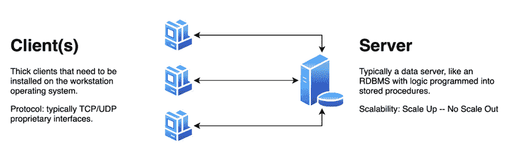
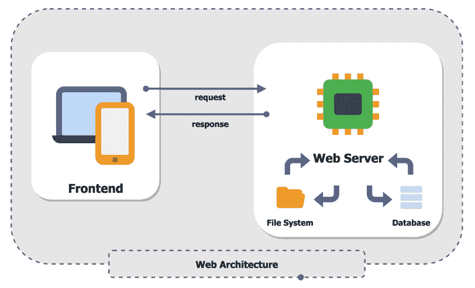
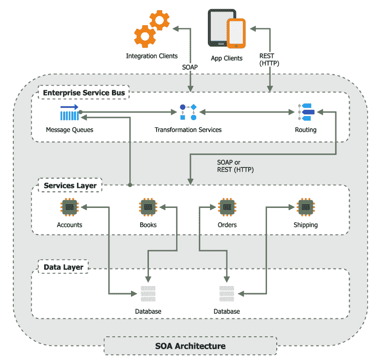
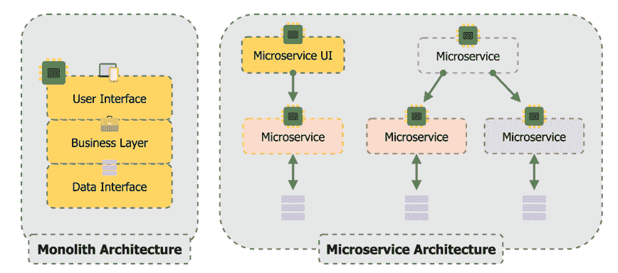
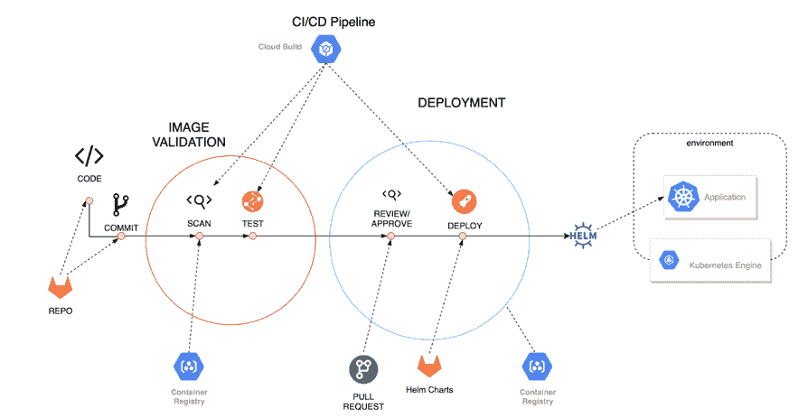

# 附录 A. 云是一个新的计算堆栈

菲尔·泰勒

本章将涵盖以下主题：

+   数字速度和企业的困境

+   传统的应用程序开发和交付模型

+   打破应用程序交付格局和云的诞生

+   微服务和容器

+   软件定义一切和 DevOps

+   云是现代计算堆栈

## A.1 简介

许多技术高管和工程师将云视为一个新的目的地。实际上，它是一种新的思维方式。云最好被定义为一套现代模式和最佳实践，它抽象化了底层基础设施。在新的技术堆栈之上，是分布式系统新架构的演变，这允许在不要求开发者管理底层基础设施及其设计的情况下进行扩展。这大大降低了构建高度可扩展、安全和分布式应用的门槛。

大多数小型公司或初创公司已经在云上运行并实现了这些优势。然而，与云相比，企业计算平台和应用程序通常更为复杂。这意味着企业需要在未来许多年里支持他们的数据中心和分支机构。他们的云迁移必须更加有目的和深思熟虑。

在过去，开发新应用程序的前期劳动力和成本代表了公司投资的大部分。有三个主要因素影响了这些成本：

1.  购买硬件和为您的新产品构建软件所需的资本。

1.  获取基础设施并正确部署到数据中心所需的时间。

1.  快速扩展基础设施以应对预期和非预期使用高峰。

早期的云计算能力通过允许消费者以基础设施即服务（IaaS）模式租用硬件来解决这些问题。在这种模式下，一个新的产品团队可以在几分钟或几小时内部署所需的基础设施，并几乎立即开始开发他们的应用程序。云基础设施的按分钟计费模式也有助于控制前期成本。

在任何成功产品的生命周期中，都有多次扩展事件和更高的可靠性需求，这要求您扩展基础设施以满足新的需求。公共云提供商使您能够轻松扩展或缩减您的网络、计算和存储基础设施，以适应这些事件。

尽管企业公司跟上变化步伐的难度比以往任何时候都要大，但启动一家初创公司并在此领域竞争却比以往任何时候都要容易。这为企业应用程序设计、计算模型和交付生命周期创造了巨大的创新需求。

在 2011 年，马克·安德森在《华尔街日报》上发表了一篇题为“软件正在吞噬世界”的社论（由他的风险投资公司在此处[`a16z.com/2011/08/20/why-software-is-eating-the-world/`](https://a16z.com/2011/08/20/why-software-is-eating-the-world/))。他的大部分同行投资者和世界各地的商业高管可能都认为马克疯了。毕竟，自上次.com 泡沫破裂以来已经过去了 10 年，他们都认为它将再次发生。变化的步伐并不像今天这样快，技术愿景家马克又一次对了。他发明了现代网络浏览器和公司网景，之前他已经见过这种变化了。

马克所谈论的变化现在才被大型企业公司大规模应用，这得益于新的能力，如谷歌云平台（GCP）和 Anthos。变化的步伐比以往任何时候都要快。这个术语已经成为数字速度的代名词。

## A.2 数字速度与企业困境

在 20 世纪初，商业增长缓慢，平均需要 90 年才能达到 10 亿美元（美元）的年营收（见[`www.inc.com/laura-montini/infographic/how-long-it-takes-to-get-to-a-1-billion-valuation.xhtml`](https://www.inc.com/laura-montini/infographic/how-long-it-takes-to-get-to-a-1-billion-valuation.xhtml)）。这使得那些首先或早期进入市场的公司能够有效地垄断其行业。二战后的制造业创新将这个平均时间缩短到大约 25 年。快进到 20 世纪 90 年代末，随着公司利用技术加速其商业模式，事情开始变得热烈。大多数加速发生在没有实体存在的公司（真正的网络公司）中，在这个时代，除了少数闪耀的明星如谷歌、亚马逊和 Netflix 之外，大多数全栈公司都失败了。今天，软件开发和基础设施运营的创新导致了惊人的加速。这些数字速度的进步在相对较短的时间内颠覆了整个市场。想想 Netflix 对流媒体、亚马逊对零售、AirBnB 对短期租赁和 Uber 对出租车所做的事情。

在 2021 年及以后，由于新的软件开发模式和更高效的资源，没有哪个市场能够免受数字速度进步带来的颠覆。每个公司都在发现他们正在迅速成为软件公司。在下一节中，你将开始分析这些软件开发模式。

## A.3 应用程序开发和交付的传统模式

从历史上看，企业应用程序最常使用单体软件开发模式。为了帮助处理规模化的单体，许多开发者从 COBOL 等语言中的函数式编程转向现代语言如 C++或 Java 中的面向对象编程（OOP），并利用模块化设计模式。这使得开发者可以将代码库分解成库，这些库可以在整个应用程序组合中共享和重用。例如，其他提高效率的尝试包括在关系数据库中使用存储过程来更快地处理数据。这些创新有助于减少劳动强度，但它们很少允许企业将创新思想扩展到超过几个团队。相反，企业更常陷入处理由这些新开发范式引入的遗留问题。

当 IT 行业开始时，代码会被编写并保持相对静态数月甚至数年。大多数企业没有投资于重写或重新平台化代码。随着这些基于面向对象编程（OOP）的新应用程序有机增长，支持它们变得越来越复杂。如今，这些混乱的解决方案区域或“漏洞”如它们通常被称为，正式被称为技术债务。技术债务被视为一个一等因素，可以用来衡量组织或特定项目的数字速度。过多的技术债务会导致随着时间的推移速度降低，而不足则意味着在大多数情况下，你移动的速度不够快，无法跟上业务需求。

企业应用程序使用三种流行的设计模式构建（1）[客户端-服务器](https://en.wikipedia.org/wiki/Client%E2%80%93server_model)，（2）[n 层 Web 架构](https://en.wikipedia.org/wiki/Multitier_architecture)和（3）[面向服务的架构](https://en.wikipedia.org/wiki/Service-oriented_architecture)。

### A.3.1 客户/服务器架构的优点和缺点

客户/服务器架构（见下文图 A.1）简单且易于构建。几种流行的编程语言和运行时环境有助于更快地构建客户/服务器应用程序。这些快速应用程序开发（RAD）平台，如 Visual Basic 或 Delphi，易于使用，许多开发者能够快速得到结果。

这种应用架构的缺点包括逻辑重复（业务逻辑在客户端和服务器代码库中重复），需要在最终用户机器上安装应用程序，在这些机器上更新应用程序，并保持服务器及其客户端同步。所有上述问题都导致了用户可用性问题、更高的可持续性成本以及将新功能推向市场所需的时间更长。

图 A.1 客户/服务器架构

### A.3.2 Web 架构的优点和缺点

随着现代网络浏览器的发明，一种更复杂的架构开始演变。这种架构类似于旧[哑终端](https://en.wikipedia.org/wiki/Talk%3ADumb_terminal)时代，当时应用程序是集中部署和管理的。这种新的多层架构（见图 A.2）基于我们应该将我们的应用程序一般性地分为三个层次：表示层、应用程序或业务逻辑层和数据层。

图 A.2 N-Tier（Web）应用程序架构

尽管这种架构和部署模型解决了客户端-服务器的一些陷阱（在客户端安装和更新应用程序），但在规模上仍然存在类似的问题。这些应用程序中的大多数仍然存在重复的逻辑（数据验证、业务逻辑），这导致可用性问题、更高的可持续性成本以及将新功能推向市场所需的时间更长。

### A.3.3 面向服务的架构

客户端-服务器和多层架构都存在另一个共同陷阱：服务器上的应用程序崩溃会影响每个模块或服务，甚至可能影响大多数用户。[面向服务的架构（SOA）](https://en.wikipedia.org/wiki/Service-oriented_architecture)，如图 A.3 所示，有助于解决单体架构和运行时支持的一些挑战。SOA 模型将应用程序业务逻辑分解为众所周知[领域](https://en.wikipedia.org/wiki/Domain-driven_design)，并在其他层之间通信和安全性方面采用标准协议。这种模式提供了许多操作和开发优势，包括更好的可扩展性和弹性。尽管 API 革命仍然有效，但在采用 SOA 时仍存在一些陷阱，包括商业产品所需的底层框架的成本和复杂性，这些框架难以安装和维护，导致更高的总拥有成本（TCO）。然而，其最大的陷阱是采用复杂模式和协议的学习曲线。这些限制和高成本导致近年来其受欢迎程度下降，[微服务](https://en.wikipedia.org/wiki/Microservices)模式兴起。我们在第??章，应用程序现代化中更详细地介绍了微服务。

图 A.3 SOA 架构

在这个演变过程中，数据中心也在经历变革和颠覆。

## A.4 打破应用程序交付并诞生云

随着应用开发方法的演变，团队仍然难以成功构建他们的源代码并将其部署到现有的基础设施中。流程是手工的且容易出错。开发人员、运维团队和管理人员深夜进行电话会议以部署和调试应用程序的情况并不少见。为了帮助解决这个问题，开发了 [持续集成 (CI) 和持续交付 (CD)](https://en.wikipedia.org/wiki/CI/CD)。持续集成是在一天中一次或多次合并所有开发人员更改的过程，以验证构建完整性。持续交付是在任何时间点验证和打包部署工件以发布的过程。CI/CD 的目标是创建一个可靠的构建和打包过程，以实现可重复的成功。即使有像 CI/CD 这样强大的框架，实现其效率也很有挑战，因为用于开发软件的框架是为设计数月或数年的应用程序设计的，并且在长时间内基本没有变化。其中最受欢迎的项目管理流程之一被称为水瀑布。

### A.4.1 打破软件制作方式

水瀑布是一种项目管理流程，旨在根据里程碑、时间表和资源来管理项目。在水瀑布项目中，团队会进行大量的前期工作，以思考所有需求并设计解决方案。这通常会导致在产品周期后期出现问题，因为业务需求已经改变，而设计没有反映新的业务需求。这不可避免地导致错过截止日期和最终产品的质量问题。

从 2001 年发布《敏捷宣言》([`agilemanifesto.org/`](https://agilemanifesto.org/)) 开始，开发团队开始评估他们的项目管理流程。一个提供更高效软件开发的主要流程是敏捷团队通过思考主要需求和草拟高层次设计来开始一个项目，而不是进行完整详细的设计。

随后，团队通过迭代工作来交付具有更现实设计的可工作软件，每次迭代都会有所改进。Scrum 是一个广为人知的框架，用于使用敏捷思维开发和交付复杂产品。许多团队更喜欢使用 [Scrum](https://en.wikipedia.org/wiki/Scrum_(software_development)) 方法来运行他们的敏捷项目，以及被称为冲刺的两周迭代。一旦团队转向敏捷，他们就必须实施 CI/CD，因为他们现在需要在每个迭代的结束时构建、测试和发布系统。

### A.4.2 谷歌的开发创新

在谷歌，我们利用多种模式来创建加速，如[单一代码库](https://en.wikipedia.org/wiki/Monorepo)和[主干开发](https://cloud.google.com/solutions/devops/devops-tech-trunk-based-development)，这些模式在流行的书籍[谷歌软件工程，O'Reilly](https://www.oreilly.com/library/view/software-engineering-at/9781492082781)中都有描述。谷歌用于创建加速的许多模式已被整个行业采用。

### A.4.3 行业中的应用程序开发

2017 年，根据 InfoQ 发布的[文章](https://www.infoq.com/news/2017/09/facebook-release-scale/)，Facebook 团队每天仅为其 Android 应用程序进行 50,000 次构建。我们刚才提到的统计数据仅指他们的持续集成过程，该过程负责构建源代码并运行本地测试以验证构建。它不包括持续交付工作流程，这些工作流程需要大量基础设施来部署 50,000 个应用程序版本到物理或虚拟设备，并运行额外的测试。

这些基础设施挑战并不仅限于 Facebook。多年前，谷歌和亚马逊在构建和运营其核心基础设施和应用程序时遇到了类似的挑战。这些挑战直接导致了我们今天所知道的云。云平台的出现很大程度上是由内部 IT 团队无法在可接受的时程内响应业务需求所驱动的。影子 IT，如通常所知，是利用第三方 IT 提供商来满足业务需求，而无需内部 IT 团队。许多早期的云客户在完全采用新的云平台作为基础设施和应用程序交付的标准之前，都是从影子 IT 模式开始的。2006 年，当亚马逊推出 Amazon Elastic Compute Cloud (EC2)时，Heroku（2007 年）、GCP（2008 年）、Azure（2010 年）和 Cloud Foundry（2011 年）迅速跟进 EC2。Heroku 和 Cloud Foundry 都是基于云的平台即服务（PaaS）解决方案，专注于构建[12 因子应用程序](https://en.wikipedia.org/wiki/Twelve-Factor_App_methodology)的理念。尽管所有这些基于云的平台在创造渐进式改进方面都很出色，但企业客户在创造全面转型方面却遇到了困难。公共云需要更多的成熟度，而早期的 PaaS 平台如[Google App Engine](https://en.wikipedia.org/wiki/Google_App_Engine)范围较窄，对语言和高级语言功能的支持有限。

虽然上述平台都有其局限性，但这标志着数据中心和许多商业市场的颠覆时代的开始。这是历史上第一次，你不需要构建软件、购买硬件和建立数据中心来启动你的新创业公司。你只需从云或 PaaS 提供商那里租赁基础设施，构建和部署你的应用程序！

这一代初创公司通常被称为“数字原生者”；在云中诞生的公司。他们的创新继续推动应用程序的创建方式。

### A.4.4 首先制定合同的开发、SOA 以及向微服务的演变

大约在 2005 年，架构师和开发者开始讨论测试驱动开发（TDD）的想法。[测试驱动开发（TDD）](https://en.wikipedia.org/wiki/Test-driven_development)的原则表明，遵循这些原则可以使代码更易于测试，最终更可靠。TDD 的概念是在编写代码之前，先思考编码问题，编写测试计划和实际测试。许多开发者在这个实践中取得了成功，它演变成了[设计由合同](https://en.wikipedia.org/wiki/Design_by_contract)的概念。如果你正在编写一个公开 API 的 Web 服务，那么你应该首先定义合同和数据模型。这迫使开发者思考输入/输出边界，并构建一个封装良好的服务。它还给你的 API 消费者团队提供了一个合同，以便在他们的开发过程中开始使用。设计由合同利用了 SOA 的几个概念。在 SOA 中，开发者使用 Web 服务模式构建所有子系统，并在服务之间使用消息协议。随着新想法的应用，新的技术开始出现。

## A.5 微服务和容器

当企业采用 SOA 来构建复杂的后端子系统时，科技初创公司继续进行创新。在许多方面，微服务是 SOA 的一种演变。它们共享相同的核心理念，即构建所有子系统作为相互通信的 Web 服务，如图 A.4 所示。

图 A.4 微服务架构

微服务与传统的企业服务总线（ESB）和简单对象访问协议（SOAP）协议不同，它们更倾向于智能端点和简单的协议。ESB 的功能是集中化服务通信、消息转换和路由。而微服务则利用发布/订阅（Pub/Sub）消息总线，并倾向于服务之间的去中心化通信。

相反，团队使用 HTTP + JSON 作为传输和有效载荷协议来构建[REST](https://en.wikipedia.org/wiki/Representational_state_transfer) Web 服务。以下是一些其他关键区别：

+   微服务的设计围绕业务能力（领域驱动设计）进行组织。这使得我们能够编写具有清晰边界的软件，专注于解决单个业务问题或一个微服务内的一组相关问题。

+   团队选择编程语言、数据库或其他技术堆栈架构以满足需求。这允许团队选择适合解决微服务负责提供的领域问题的技术。

+   “无共享”方法，每个服务都有一个隔离的数据存储。这种方法允许团队在 API 层面上进行集成，将所有功能封装在其服务中，并对任何依赖服务有清晰的边界。

+   所有通信都通过单个合同进行，通常通过 RESTful API 公开。服务之间的所有通信（内部消费者或外部消费者）都访问相同的 API 接口。

+   智能端点，哑管道 - 利用简单的协议，服务知道如何处理输入和发送输出。

+   消息队列被用于大规模的异步处理和节流。这是服务的责任，实现一个消息栈来支持这一功能。并非所有服务都需要它。

+   使用这些云原生设计模式进行自动化测试要容易得多，我们能够创建专用于测试特定组件或功能的不持久环境，在将软件发布到集成环境进行端到端测试之前。在过去，大多数团队都难以编写能够准确验证其软件且在部署之间不需要大量更改的自动化测试。[测试金字塔](https://martinfowler.com/articles/practical-test-pyramid.xhtml#TheTestPyramid) 是一个隐喻，告诉我们将测试分组到不同粒度的桶中（UI 测试、服务测试、单元测试）。大多数单体应用开发团队专注于构建 UI 测试来验证应用程序。由于 UI 组通常需要更多的集成，这意味着这些测试通常需要定期更新。这使他们无法实现像 [金丝雀](https://martinfowler.com/bliki/CanaryRelease.xhtml) 或 [蓝/绿](https://martinfowler.com/bliki/BlueGreenDeployment.xhtml) 部署这样的高级模式。金丝雀是指我们会缓慢地将测试过的软件推出给一小部分用户，收集实时反馈，然后再推出给所有用户。而蓝/绿则允许我们维护两个副本；一个绿色或生产环境和一个蓝色或预发布环境，这样如果出现问题，我们可以快速回滚到之前的状态。由于这些应用大多数是从零开始构建的，因此团队能够正确应用测试金字塔，以及像金丝雀或蓝/绿部署这样的高级端到端部署模式。这导致了完全自主的部署和无可匹敌的开发速度。单体团队面临的另一个重大挑战是数据恢复；向软件平台注入自动化测试所需数据的可能性。数据恢复的挑战不再是问题，因为这些团队通常将所需的数据集作为其自动化测试代码库的一部分构建起来。这使得他们能够满足测试计划中每个用例的独特需求，并避免将实时数据复制到测试系统所造成的合规性问题。

微服务架构可以快速、高效且强大。但要得到广泛的应用，它们也需要基础设施的创新。这种创新发生在 Linux 容器进入市场的时候。

### A.5.1 容器化使微服务成为可能

容器化自 Solaris Unix 时代以来就有一些形式。历史上容器的问题在于它们很难构建，构建一个容器需要一系列命令行界面（CLI）调用。2010 年，Docker 通过发布他们自己的开源容器引擎，彻底改变了这一过程。

这个新引擎允许我们在源文件中记录容器需求，并大大减少了我们成功构建容器所需的 CLI 调用次数。新的 Dockerfiles，Docker 的另一个创新，为开发者提供了一种使用基础设施即代码（IaC）方法来记录容器需求的方式，而不是记录 CLI 调用。通过将应用程序或微服务打包到容器中，开发者可以快速构建、测试并将他们的应用程序部署到目标环境中。这允许开发者构建软件、构建目标环境，然后将整个应用程序堆栈作为一个单一的工作单元进行部署和测试。

单个容器是一个第一步，但完整的应用程序需要编排多个容器并在底层基础设施上实例化它们，这使得事情变得更加复杂。

Kubernetes 解决了大多数基础设施和部署问题（配置、服务发现、密钥、调度等），并为应用程序基础设施提供了一个通用的编排接口。随着团队扩大其解决方案，他们通常需要超出 Kubernetes 提供的基本功能的更多能力。运行大型解决方案的团队通常需要更高级的功能，并利用其他生态系统服务，如 Istio 进行服务网格或 Apigee 进行 API 网关流量。

### A.5.2 软件定义一切和 DevOps

正如你可能开始意识到的，速度的关键是通过软件开发和独立部署，这允许团队在有限的协调下并行工作。仅仅用软件构建你的应用程序是不够的。云已经向我们展示了，当整个解决方案可以定义为代码时，真正的速度才会发生。这个概念被行业定义为 DevOps，它涵盖了不仅仅是技术组件。我们不会在这个书中展开所有 DevOps 概念，而只会关注技术方面。如果你想了解更多关于 DevOps 的信息，我们建议你阅读[《DevOps 手册》](https://www.amazon.com/s?k=the+devops+handbook)。

要完全自动化应用程序的构建、测试和部署，团队需要成为 CI/CD 概念的专家，并掌握[基础设施即代码 (IaC)](https://en.wikipedia.org/wiki/Infrastructure_as_code)。下面的示例，图 A.5 展示了支持 Kubernetes 应用程序部署的 CI/CD 管道的可视化。

图 A.5 Kubernetes 应用程序的 CI/CD 管道

在早期尝试部署容器的团队中，结果参差不齐，因为他们需要解决大量核心平台问题，这些问题对于以规模服务于这些应用程序至关重要。为了成功构建、测试和部署应用程序，还有很多工作要做。这就是为什么 Google 创建了 Kubernetes，随后又推出了 Anthos。Anthos 大大简化了创建和管理 Kubernetes 集群以及支持多个集群和混合集群架构所需的辅助组件和流程。Anthos 将帮助您的团队部署核心 Kubernetes 发行版，统一将安全策略应用于集群，提供增强服务网格的能力以处理混合云或混合集群路由，以及更容易地应用升级或其他操作任务。有了 Anthos，开发者可以实现“一次编写，到处运行”，包括跨多个云、边缘和本地环境。

### A.5.3 云是现代计算堆栈

在本章中，你了解了现代企业崛起的速度以及技术和软件模式是如何改变以实现这种加速的。十年前，一家新企业进入出租车市场并在短短几年内颠覆整个行业是不可想象的。今天，由于新企业的快速增长，这已成为一种常态，这得益于数字速度软件架构和互联网带来的普遍访问。

使这一切成为可能的概念可以归结为分布式高度可扩展的架构，如微服务，以及使用 DevOps 模式如 SRE 来自主交付这些解决方案，从而实现快速迭代变化。这种创新步伐的快速开始于云原生初创公司开发新技术。在短短几年内，它们现在也成功地应用于企业工作负载和现有应用程序。

## A.6 摘要

+   企业正在利用公共云来满足其业务需求和敏捷性。

+   微服务在软件设计中变得越来越受欢迎，允许并行开发以满足软件需求，而不需要单体架构的典型缺点。

+   能够实现自主部署的良好的 CI/CD，能够利用 IaC 和自动化测试，对于成功至关重要。

+   团队正在利用容器和 Kubernetes 对这些应用程序进行打包和操作。

+   Google Anthos 正在填补空白，使 Kubernetes 成为企业的可靠可扩展平台。
