# 附录 C. 在 VMware 上运行的计算环境

Jarosław Gajewski

本章涵盖：

+   理解 VMware 和 Anthos 架构

+   管理平面的部署

+   用户集群的部署

+   Anthos 网络负载均衡器选项

如您所知，谷歌提供了一种名为 Google Kubernetes Engine (GKE) 的托管 Kubernetes 服务，该服务托管在其基础设施上。这种托管解决方案已为 Kubernetes 消费者解决了多个问题，包括生命周期管理、安全和物理资源交付。虽然每年在云中部署应用程序都在增长，但许多企业在其自己的数据中心中仍然拥有大量的资源。

谷歌认识到，组织可能出于各种原因而希望将某些工作负载保留在本地，包括延迟担忧、数据担忧以及可能限制云使用的其他监管要求。为了帮助公司解决必须保留在本地但仍然希望利用 Kubernetes 等云原生技术的工作负载，本地 GKE 应运而生——现在被称为 Anthos。

本地实施引入了一些要求，公司必须提供以允许配置 Anthos 基础设施组件。我们不会深入探讨与特定版本的 Anthos 相关的约束条件，或 VMware 要求，因为它们始终在演变。一般来说，需要提供 VMware vSphere 资源[^([1])](#ftn1)，这些资源可用于托管管理控制平面、Kubernetes 基础设施和应用工作负载。

在 VMware 上部署的 Anthos 使用 Kubernetes 构建的管理控制平面，通过配置 vSphere 虚拟机（VMs）。每个新的用户集群都配置为包含具有 Kubernetes 控制平面和用户节点的专用 VM 集合，由管理集群完全管理。负载均衡可以由 Anthos 在 VMware 实例上管理的 VM 或外部负载均衡器提供，具体取决于用例和实施架构。

在本章中，我们将解释在本地数据中心安装 Anthos 的各种部署场景和需求，从您可能为什么想要在本地部署 Anthos 开始。

## C.1 为什么我应该使用 VMware 上的 Anthos？

让我们来解决第一个问题——为什么谷歌选择在 Anthos 的初始版本中支持 VMware？大多数企业已经拥有现有的 VMware 足迹，利用一个虚拟平台提供一致的环境和 API，用于自动化、全栈配置。通过支持 VMware，谷歌为组织提供了利用现有投资、基础设施以及扩展和节点管理能力来创建 Kubernetes 集群的能力。

通常，有多种驱动因素和约束条件要求企业将某些数据和工作负载保留在专用数据中心（DCs）中运行。最常见的要求是靠近数据或用户、监管要求，或利用现有本地投资的必要性。

公司必须提高应用程序的可用性和可扩展性以保持竞争力。在容器中开发应用程序将提供效率、敏捷性和可移植性——这为开发者提供了增加部署敏捷性和速度的能力。已经拥有数据中心（DC）的组织可能能够以比迁移到云服务提供商（CSP）更低的成本为开发者提供类似云的服务。利用本地容量，您可以创建类似云的体验，感觉类似于在 GCP 上使用 Kubernetes，为您的开发者提供在本地或异地运行的集群的统一体验。它还提供了在多个环境中运行多集群架构的能力，提供更好的可靠性，并允许工作负载在云中爆发，使用更多按需资源来满足负载的短期峰值，然后在本地工作者上缩回。

Kubernetes 的管理、维护、集成和生命周期管理需要大量的时间和技能。在生产规模上运行集群增加了日常挑战，将业务注意力从应用程序转向基础设施管理。这正是 VMware 上的 Anthos 发挥作用的地方，它包括符合标准的、经过安全测试的 Kubernetes 版本，捆绑了各种网络服务的集成，最重要的是，为 Kubernetes 和所有 Anthos 组件提供企业级支持。最后但同样重要的是，所有集群都是统一的，从 GKE 控制台提供全面管理。

对于企业级架构，通常需要将新创建的平台和服务集成到现有的企业身份解决方案中。根据公司需求，可以通过以下方式在本地提供对 GKE 集群的授权：

+   基于 Active Directory 联邦服务 OpenID Connect[^([2])](#ftn2)的提供者集成，例如

    +   基于 Google，

    +   基于 Active Directory 联邦服务（ADFS）的公司

+   轻量级目录访问协议（LDAP）

VMware 上的 Anthos 包含一系列插件，帮助管理员和安全官员启用管理、转向基于 git 的管理以及渐进式部署，以实现企业中的部署速度和敏捷性。Anthos 配置管理（ACM）允许全面实现基础设施即代码（IaaC）的 GitOps 方法。它包括基于 Open Policy Agent 的准入控制器，为云原生基础设施提供安全约束和企业标准。策略控制器包括多个预定义的约束，并且可以扩展到来自业务或安全的任何自定义策略。这两个工具在单独的章节中有详细描述，但重要的是要强调，它们是 Anthos on VMware 实现上现成的扩展。

在下一节中，我们将探讨成功在 VMware 集群上部署 Anthos 所需的架构要求。

## C.2 VMware 上的 Anthos 架构

Anthos on VMware 作为一组在 VMware vSphere 集群上部署的虚拟机实现。在那一章中，我们将讨论 Anthos on-prem 实现的技術要求。

从一般要求开始，Anthos on VMware 必须安装在由标准或分布式虚拟交换机或 VMware NSX-T 软件定义网络支持的 vSphere 集群上。由于 Google 经常更新 Anthos，有关最新版本的详细要求可在 GCP Anthos on VMware 文档页面[^([3])](#ftn3)中找到。

就像 OSS Kubernetes 发布一样，Anthos 有一个敏捷的发布周期[^([4])](#ftn4)，与整个 Anthos 发布保持一致，它遵循每月补丁发布周期和季度版本升级周期。建议部署版本更新，我们可以直接升级到同一次要版本的任何版本或下一个次要版本，例如，我们可以从版本 1.9.0 升级到 1.9.4 或直接升级到 1.10.1，但要从 1.9.X 升级到 1.11.X，您需要首先升级到 1.10.X。

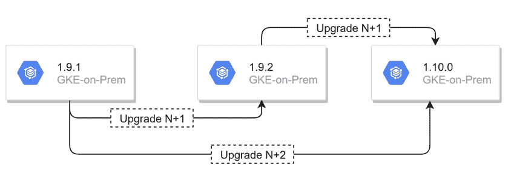

图 C.1 升级选项

为了简化更新过程并允许测试新版本，从 Anthos 版本 1.7.0 开始，可以在管理员集群升级之前更新用户集群。因此，您可以启动一个具有较新 Anthos 版本的新的集群，对其进行测试，并根据结果，启动生命周期过程以将整个环境升级到新版本。一旦用户集群升级，管理员集群就可以在合适的时间窗口内进行更新，而无需急于进行。

现在您已经了解了 Anthos on VMware 的高级视图，我们可以继续到安装新集群的细节。

本地部署包括一个管理员工作站，配备部署管理员集群和用户集群（s）所需的所有工具。安装需要三个配置文件，这些文件必须配置为环境：

+   管理员工作站配置文件

+   管理员集群配置文件

+   用户集群配置文件

每个文件都是 YAML 格式，包含必选和可选部分。默认情况下，每个可选部分都是注释掉的，每个配置元素后面都跟着简短的描述和用法，提供了一个易于遵循、自我文档化的配置文件。

配置文件中的一些选项包括：

+   配置安装以使用本地注册表存储 Anthos 组件镜像

+   Google 服务帐户用于 GCP 集成，包括用于 Anthos 连接和云日志的帐户。

+   OIDC 配置

+   vSphere 配置

+   负载均衡器配置

配置包含基本集群配置的选项，只有一个例外是启用 Cloud Run。像 Anthos Config Management、Anthos Policy Controller 或 Service Mesh 这样的附加元素可以在集群生命周期中的任何时候安装或删除。

整体部署流程在图 3 - Anthos on VMware 部署流程中展示。所有选项和可选步骤都用虚线标记。

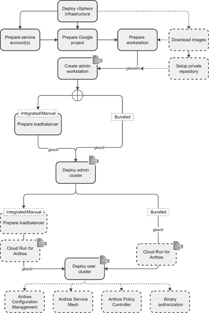

图 C.2 Anthos on VMware 部署流程

在下一节中，我们将解释如何部署管理平面，这是新本地部署的第一步。

部署管理平面

管理平面的创建始于管理工作站的部署，提供创建和管理管理员和用户集群的工具。此虚拟机拥有创建 VMware 上 Anthos 集群所需的所有软件。使用管理工作站，Google 可以保证一致性，并从管理员那里移除创建和维护工具的责任。

管理工作站准备

部署管理工作站需要准备，下面的图形显示了创建管理工作站的步骤。

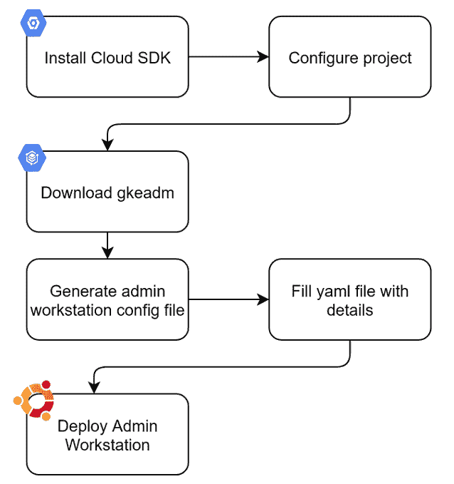

图 C.3 管理工作站部署

第一步是在您的本地机器上安装 Google Cloud SDK。这可以是任何 Linux、Windows（工作站或服务器）或 MAC OS 机器。

安装 SDK 后，您需要下载 gkeadm 工具。使用 gsutil 工具，使用以下命令下载文件。

```
gsutil cp gs://gke-on-prem-release/gkeadm/{Anthos on VMware version number}/linux/gkeadm ./
```

如果您使用的是 Linux，您需要使用 chmod 命令使二进制文件可执行。

```
chmod +x gkeadm
```

现在您已经下载了 gkeadm，您可以部署管理工作站。

## C.3 部署管理工作站

管理工作站的部署基于一个单一的 YAML 配置文件，它有四个主要部分：

+   gcp

+   vCenter

+   proxyUrl

+   adminWorkstation

GCP 部分专门用于 GCP 集成配置元素。在撰写本书时，只需要一个元素，即 componentAccessServiceAccountKeyPath，它定义了一个组件服务账户的路径。此服务账户有权访问 VMware 上的 Anthos 二进制文件并使用相关的 API。如果使用不同的项目进行监控、日志记录等，则该账户必须在每个或那些项目中具有 serviceusage.serviceUsageViewer 和 iam.roleViewer 权限。

```
gcp: 
  componentAccessServiceAccountKeyPath: "whitelisted-key.json"
```

配置文件的第二部分描述了与 vCenter 服务器的集成。它涵盖了凭证子部分，包括 vCenter 的定义，以及包含用于 vSphere 访问的用户名和密码的凭证文件。以下是一个名为 credential.yaml 的凭证文件示例。

```
apiVersion: v1
kind: CredentialFile
items:
- name: vCenter
  username: "myaccount@mydomain.local"
  password: "Th4t1$4Nth05"
```

所需的 vCenter 信息包括数据中心名称、数据存储名称、集群名称、网络和 vCenter 根证书。可选地，可以指定资源池名称和文件夹，以便将虚拟机放置在其中。

```
vCenter:
  credentials:
    address: "10.10.10.10"
    fileRef:
      path: credential.yaml
      entry: vCenter
  datacenter: "MY-DATACENTER"
  datastore: "MY-DATASTORE"
  cluster: "MY-CLUSTER"
  network: "MY-VM-NETWORK"
  folder: “MY-FOLDER”
  resourcePool: "MY-POOL"
  caCertPath: "vcenter-root.cert"
```

如果您为您的 vCenter 服务器有一个自签名的证书，需要添加到 caCertPath 值中，您可以使用 curl 获取它，如下面的命令所示。

```
curl -k "https://{SERVER_ADDRESS}/certs/download.zip" > download.zip
```

下载完成后，解压缩文件，它将在 certs/lin 文件夹中提取证书。

如果您的环境需要代理服务器来访问互联网，您可以配置 proxyUrl 部分。此配置参数仅在 VM 部署期间由 gkeadm 命令使用。

```
proxyUrl: "https://my-proxy.example.local:3128"
```

当配置代理时，您还需要将适当的地址添加到操作系统或系统 no_proxy 变量中。此配置针对每个公司和部署都是特定的 - 代理服务器如何工作的完整解释超出了本书的范围。作为一个起点，您可能需要添加您的 vCenter 服务器、本地注册表（如果已配置）以及 ESX 主机的 CIDR 范围。

最后一个部分是配置文件生成过程中部分预填充的唯一部分：

+   dataDiskName

+   dataDiskMB

+   虚拟机的名称

+   CPU 数量

+   内存大小（以 MB 为单位）

+   基础磁盘大小（以 GB 为单位）

注意：新磁盘创建的 dataDisk 文件夹必须存在。因此，您必须事先手动创建它。

管理工作站可以使用静态 IP 分配或通过 DHCP 服务器分配 IP 地址。您的实现选择在配置文件的网络子节中使用 ipAllocationMode 属性定义。

对于 DHCP 用例，ipAllocationMode 必须定义为 DHCP，并且所有其他子网络配置元素保持未定义。

当使用静态 IP 分配时，ipAllocationMode 属性必须设置为“static”，然后是 IP、网关、子网掩码和 DNS 配置。DNS 值可以定义为具有多个值的属性数组。

最后，设置管理工作站使用的 NTP 服务器。必须使用与 vSphere 基础设施同步的 NTP，否则时间差异将导致部署失败。

下面显示了两个示例配置文件，第一个已配置为使用静态 IP，第二个已配置为使用 DHCP。

```
adminWorkstation:
  name: "gke-admin-ws-200617-113711"
  cpus: 4
  memoryMB: 8192
  diskGB: 50
  dataDiskName: "gke-on-prem-admin-workstation-data-disk/gke-admin-ws-data-disk.vmdk"
  dataDiskMB: 512
  network:
    ipAllocationMode: "static"
    hostConfig:
      ip: "10.20.20.10"
      gateway: "10.20.20.1"
      netmask: "255.255.255.0"
      dns:
      - "172.16.255.1"
      - "172.16.255.2”
  proxyUrl: "https://my-proxy.example.local:3128"
  ntpServer: "myntp.server.local"

adminWorkstation:
  name: "gke-admin-ws-200617-113711"
  cpus: 4
  memoryMB: 8192
  diskGB: 50
 dataDiskName: "gke-on-prem-admin-workstation-data-disk/gke-admin-ws-data-disk.vmdk"
  dataDiskMB: 512
  network:
    ipAllocationMode: "dhcp"
    hostConfig:
      ip: ""
      gateway: ""
      netmask: ""
      dns:
  proxyUrl: "https://my-proxy.example.local:3128"
  ntpServer: "myntp.server.local"
```

现在，我们可以使用 gkeadm 实用程序在我们的 vSphere 基础设施上创建管理工作站。

```
./gkeadm create admin-workstation --auto-create-service-accounts
```

添加 auto-create-service-accounts 标志允许您在项目中自动创建相关的服务帐户。

一旦创建管理工作站，您就可以部署管理集群了。在下一节中，我们将介绍创建管理集群的步骤。

创建管理集群

管理集群是 Anthos 控制平面的关键组件。它负责监督在 VMware 上的 Anthos 实现，以及用户集群的配置和管理。它作为一个使用单个控制平面节点和两个工作节点的 Kubernetes 集群部署[图 8]。

控制平面节点将为管理控制平面提供 Kubernetes API 服务器、管理集群调度器、etcd 数据库、审计代理以及任何集成的负载均衡器 Pod。

工作节点为 Kubernetes 插件如 kube-dns、云监控（前身为 stackdriver）或 vSphere pods 提供资源。

除了管理控制平面和插件外，管理集群还托管用户控制平面。因此，用户集群的 API 服务器、调度器、etcd、etcd 维护和监控 Pod 都托管在管理集群上。

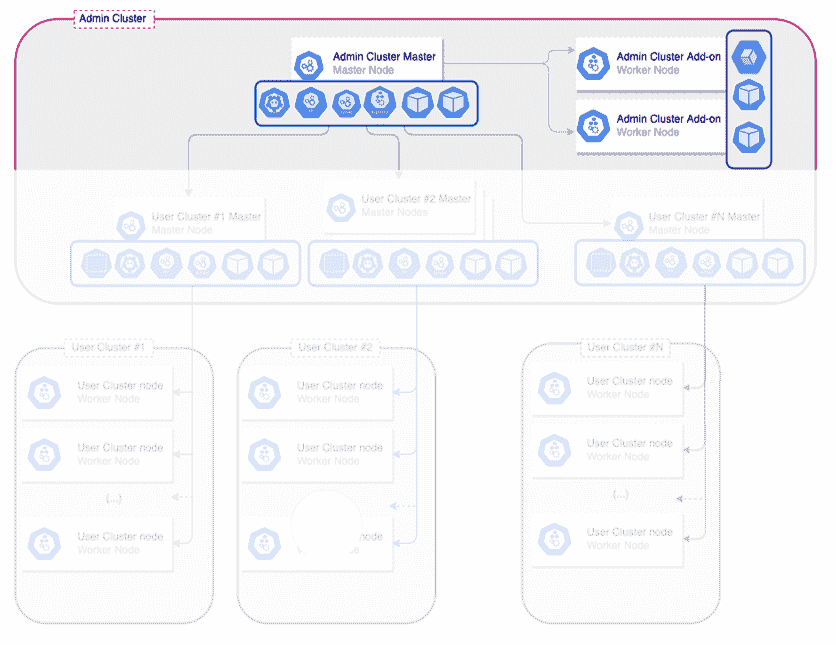

图 C.4 Anthos on VMware 管理集群架构

要创建管理集群，您需要 SSH 进入上一节中创建的管理工作站。使用在部署管理工作站时创建的密钥连接到管理工作站，该密钥位于 .ssh/gke-admin-workstation 目录下。

```
ssh -i /usr/local/google/home/me/.ssh/gke-admin-workstation ubuntu@{admin-workstation-IP}
```

与管理工作站创建过程类似，管理集群使用一个分为几个部分的 YAML 文件。vCenter、gkeconnect、stackdriver 和 gcrkeypath 部分预先填充了从管理工作站 YAML[^([5])](#ftn5) 文件中收集的值，而所有其他部分必须在创建集群之前填写。

您可以使用包含的管理集群配置文件，或者您可以使用已安装在管理工作站上的 gkectl 工具生成一个新的管理集群配置文件。与预先创建的模板文件不同，使用 gkectl 手动生成的任何模板都不会包含任何预先填充的值。要创建新文件，请使用 gkectl create-config admin 选项。

```
gkectl create-config admin --config={{ OUTPUT_FILENAME }}
```

两种创建方法将包含相同的部分，配置文件的前两个部分必须保持不变，定义 API 版本和集群类型。

```
apiVersion: v1
kind: AdminCluster
```

下一个部分是 vSphere 配置，包含对虚拟机和磁盘放置的要求。

TIP: 良好的做法是始终使用完全限定的域名 (FQDN) 用于 vCenter，并在生产环境中避免使用 IP 地址。

```
vCenter:
  address: "FullyQualifiedDomainName or IP address of vCenter server"
  datacenter: "vCenter Datacenter Name"
  cluster: "vCenter Cluster name"
  resourcePool: "vCenter Resource Pool name"
  datastore: "vCenter Datastore Name for GKE VM placement "
  folder: “Optional: vCenter VM Folder”
  caCertPath: "vCenter public certificate file"
  credentials:
    fileRef: 
      path: “path to credentials file”
     Entry: “Name of entry in credentials file referring to username and password of vCenter user account“
  # Provide the name for the persistent disk to be used by the deployment (ending
  # in .vmdk). Any directory in the supplied path must be created before deployment
  dataDisk: "Path to GKE data disk"
```

TIP: 良好的做法是将数据磁盘放入一个文件夹中。dataDisk 属性必须指向存在的文件夹。Anthos on VMware 创建一个虚拟机磁盘 (VMDK) 来存储管理集群的 Kubernetes 对象数据，这是安装程序为您创建的，因此请确保名称是唯一的。

TIP: 如果您希望不使用资源池并将管理集群资源直接放置在集群级别，请在资源池配置中提供“<clusterName>/Resources”。

在下一个部分中，我们定义管理集群节点、服务和 Pod 的 IP 设置。这些设置也将用于用户集群主节点的部署。

首先，我们必须定义 Anthos on VMware 管理集群节点和用户集群主节点将使用 DHCP 还是静态 IP 分配。如果使用静态选项，必须定义一个额外的 YAML 文件来指定 IP 地址分配；此文件在 ipBlockFilePath 属性中指定。

下面的两个属性专门用于 Kubernetes 服务和 pod CIDR 范围，这些范围在下面的表 1 中详细说明。它们由 Kubernetes pods 和服务使用，并在基于 Kubernetes 构建的计算环境章节中详细描述。分配的网络范围之间不得相互重叠，也不得与由管理平面使用的任何外部服务重叠，例如用于与 GCP 通信的任何互联网代理。

TIP：由于 Anthos on VMware 在孤岛模式下运行，Pod 和 Service 使用的 IP 地址无法路由到数据中心网络。这意味着您可以为每个新的集群使用相同的 IP 地址。

最后，最后一节定义了 Kubernetes 节点一旦配置后将要使用的目标 vSphere 网络名称。

表 C.1 管理集群属性

| Kubernetes 资源 | 描述 |
| --- | --- |
| network |
| ipMode | type 和 ipBlockFilePath 的父键 |
| type | 要使用的 IP 模式（"dhcp"或"static"） |
| ipBlockFilePath | 用于静态 IP 分配的 yaml 配置文件的路径。必须与 type: static 键值对一起使用 |
| serviceCIDR | 用于控制平面部署服务的 Kubernetes 服务 CIDR。最小地址数 128 个 |
| podCIDR | 用于控制平面部署服务的 Kubernetes pods CIDR。最小地址数 2048 个 |
| vCenter | networkName 的父键 |
| networkName | 管理集群节点和用户集群主节点分配到的 vSphere 端口组名称。 |

下面显示了示例配置。

```
network:
  ipMode:
    type: dhcp
  serviceCIDR: 10.96.232.0/24
  podCIDR: 192.168.0.0/16
  vCenter:
    networkName: "My Anthos on VMware admin network"
```

正如我们提到的，节点 IP 分配可以通过静态配置文件进行配置。此类文件的路径必须在 ipBlockFilePath 键下指定，该键必须取消注释，并且仅在 ipMode.type 键设置为 static 时才考虑。此外，必须指定 DNS 和 NTP 服务器，并定义搜索域，如下面的示例所示。

```
network:
  ipMode:
    type: “static”
    ipBlockFilePath: "myAdminNodeHostConfFile.yaml" 
  hostConfig:
    dnsServers:
    - "8.8.8.8"
    ntpServers:
    - "myNTPServer"
    searchDomainsForDNS:
    - "myDomain.local"
```

静态主机配置文件使用两个主要配置键构建：hostconfig 和 blocks。Hostconfig 定义了 DNS 服务器、NTP 服务器和搜索域的信息。blocks 定义了 Kubernetes 节点的子网掩码和网关，随后是一个主机名数组及其对应的 IP 地址。

| 属性键 | 属性描述 |
| --- | --- |
| blocks |
| netmask | 网络子网掩码 |
| gateway | 网络网关 |
| ips | 与对应值相对应的 IP 和主机名键的数组。 |

```
blocks:
  - netmask: 255.255.255.128
    gateway: 10.20.0.1
    ips:
    - ip: 10.20.0.11
      hostname: admin-host1
    - ip: 10.20.0.12
      hostname: admin-host2
    - ip: 10.20.0.13
      hostname: admin-host3
    - ip: 10.20.0.14
      hostname: admin-host4
    - ip: 10.20.0.15
      hostname: admin-host5
```

TIP：分配给节点的 IP 地址不是按照文件中定义的顺序分配的。它们在调整大小和升级操作期间从可用的 IP 池中随机选择。

配置的下一部分是集群负载均衡。Anthos on VMware 需要一个负载均衡器为 Kubernetes API 服务器提供虚拟 IP（VIP）。对于您的集群，您可以选择使用基于 MetalLB 的集成负载均衡器、F5 或其他任何使用手动配置的负载均衡器。MetalLB 正在成为包括 VMware[^([6])](#ftn6)在内的裸金属实现中的一种流行解决方案，这些解决方案不包括 HyperCaller 构建的解决方案。在管理集群上启用 MetalLB 仅限于在管理集群配置文件中定义 kind: MetalLB，如下所示。

```
loadBalancer:
   vips:
      controlPlaneVIP: “133.23.22.100”
   kind: MetalLB
```

我们将在本章的负载均衡器部分更详细地解释这些选项。

为了确保 Kubernetes 控制平面节点将分布在不同 ESXi 主机上，Anthos 支持 vSphere 反亲和性组。这种实现保证了物理 ESXi 主机故障只会影响单个 Kubernetes 节点或提供生产级配置控制平面的附加节点。此值应设置为 true 以利用反亲和性规则，或设置为 false 以禁用任何反亲和性规则的使用。

```
antiAffinityGroups:
   enabled: true/false
```

您可以通过在配置文件的 stackdriver 部分设置适当的值，使用 Google Cloud Logging 来监控集群。

日志和指标可以发送到专门的 GCP 项目，或者创建集群所在的同一项目。您需要提供用于日志的项目 ID、集群位置、VPC 选项、具有适当项目权限的服务账户密钥文件，以及您启用或禁用 vSphere 指标的决定。

```
stackdriver:
    projectID: "my-logs-project"
    clusterLocation: "us-central1"
    enableVPC: false
    serviceAccountKeyPath: "my-key-folder/log-mon-key.json"
    disableVsphereResourceMetrics: true
```

此外，您还可以将集群 API 服务器的审计日志与云审计日志集成。您必须指定集成应针对的项目（可以是用于云操作集成的同一项目）、集群位置以及具有适当权限的服务账户密钥。

```
cloudAuditLogging:
    projectID: "my-audit-project"
    clusterLocation: "us-central1"
    serviceAccountKeyPath: "my-key-folder/audit-log-key.json"
```

确保 Kubernetes 节点上的问题能够快速检测和修复非常重要，类似于 GKE 集群，Anthos on VMware 使用节点问题检测器。检测器会监视可能出现的节点问题，并将它们作为事件和条件报告。当任何 Kubelet 变得不健康或由 kubelet 或 docker systemd 服务报告 ContainerRuntimeUnhealthy 条件时，自动修复功能将尝试自动重启它们。

Anthos on VMware 集群的自动修复功能允许在它们被错误删除或无法响应的虚拟机被重新创建时自动创建 Kubernetes 节点虚拟机。它可以在集群部署配置文件中通过将 autoRepair enabled 选项设置为 true 或 false 来启用或禁用。

```
autoRepair:
   enabled: true/false
```

当启用时，集群健康控制器部署将在 kube-system 命名空间中对应的集群上创建。如果节点被标记为不健康，它将被移除并重新创建，如图 C.5 所示。

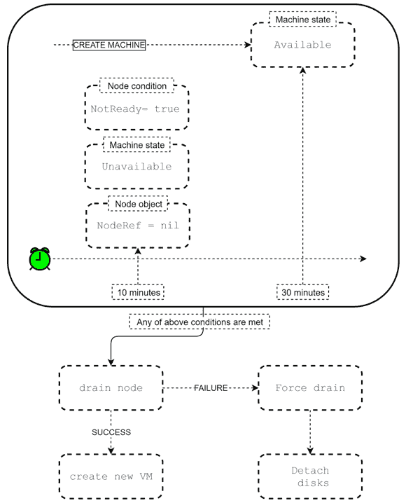

图 C.5 节点自动修复过程

注意：要在管理集群上禁用自动修复功能，必须从管理集群中删除 cluster-health-controller 部署。

可以从私有 docker 注册库而不是 gcr.io 部署 Anthos。要配置您的部署以使用私有注册库，您需要在配置文件的 privateRegistry 部分设置值。您需要提供注册库地址、注册库的 CA 以及用于凭证文件的凭证引用。

```
privateRegistry:
  address: "{{Private_Resistry_IP_address}}"
  credentials:
    fileRef:
      path: "{{my-config-folder}}/admin-creds.yaml"
      entry: "private-registry-creds"
     caCertPath: "my-cert-folder/registry-ca.crt"
```

这就完成了管理集群配置文件的配置，现在让我们转向用户集群配置。

对于基于 Anthos 的 Kubernetes 实现，安全性非常重要。Anthos on VMware 引入了密钥加密功能，以确保它们在静态存储时加密，无需外部密钥管理服务。因此，在密钥存储在 etcd 数据库之前，它会被加密。要启用或禁用该功能，请编辑配置文件的 secretsEncryption 部分。

```
secretsEncryption:
  mode: GeneratedKey
  generatedKey:
    keyVersion: 1
```

提示：每当密钥版本更新时，都会生成一个新的密钥，并使用该新密钥重新加密密钥。您可以使用 gkectl update 命令强制执行密钥轮换，结果所有现有和新密钥都将使用新密钥加密，旧密钥将被安全删除。

用户集群创建

每个新的用户集群都需要连接到一个管理集群，实际上，没有管理集群就无法创建工作负载集群。一个管理集群可以管理多个用户集群，但单个用户集群只能由一个管理集群监督。

每个已配置的用户集群都可以部署在两种配置中，带有或没有高可用性（HA）的生产级管理平面。如图所示，启用 HA 的集群使用 3 个管理节点构建（图中的用户集群#2），而没有 HA 的则使用单个节点（图中的用户集群#1）。单节点管理平面消耗较少的计算资源，但在节点或物理主机故障的情况下，管理集群的能力会丢失。在 HA 模式下，单个主节点故障不会影响 Kubernetes 集群配置管理能力。

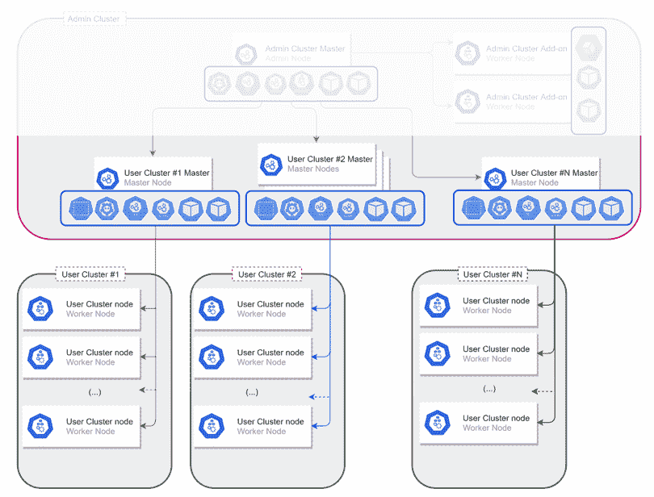

图 C.6 Anthos on VMware 用户集群架构

重要：部署后，不能在不重新创建整个集群的情况下更改管理节点的数量。

每个新的用户集群都会放置在管理集群中的一个专用命名空间中。它用于托管和交付服务、部署、Pod 和 ReplicaSets 以进行管理目的。

命名空间名称与集群名称一致，允许您通过 kubectl get all -n {{ clusterName }} 轻松获取所有详细信息。任何用户集群命名空间都将托管在添加到管理员集群中以创建用户集群的专用节点上。这些节点将标记为集群名称，当创建集群管理器 pods 时，它们将使用节点选择器来强制将它们放置在专用用户集群节点上。

其他非系统命名空间是在工作负载集群节点之上创建的，如下图中所示

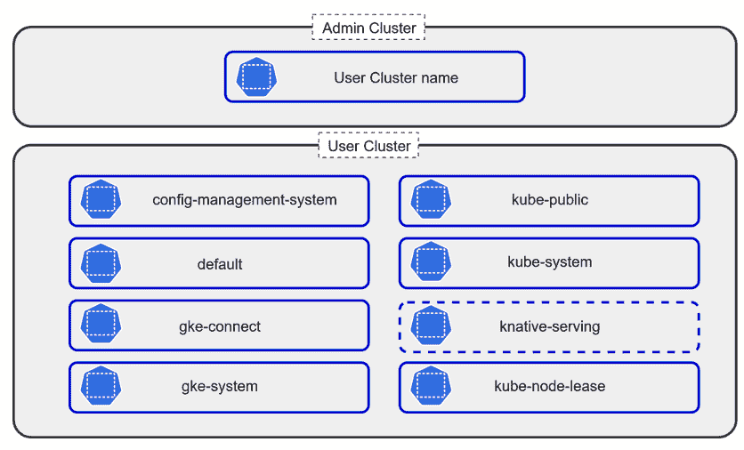

图 C.7 Anthos 在 VMware 用户集群命名空间

与管理员集群类似，用户集群部署基于 YAML 配置文件。配置文件的前两部分必须保持不变，定义 API 和集群类型。

```
apiVersion: v1
kind: UserCluster
```

提示：您可以使用以下命令将旧版本的配置文件转换为配置文件：gkectl create-config cluster --config $MyAwsomeClusterConfigFile.yaml --from MyOldConfigFile.yaml --version v1

下一个部分是您提供新集群名称和 Anthos on VMware 版本的地方。集群名称必须在 GCP 项目内是唯一的，版本必须与管理员集群版本一致。

```
name: “MyAwesomeOnPremCluster”
gkeOnPremVersion: 1.10.0-gke.194
```

下一个部分是可选的。它用于管理 vSphere 集成和工作节点放置。强烈建议在 vSphere 层面上分离管理员和工作负载计算资源，以确保 Kubernetes 管理平面的可用性。这保证了在资源饱和或对 vSphere 访问有限的情况下，每个 Anthos on VMware 集群都有资源。按照此做法，您的用户集群工作节点将被放置在 vCenter 部分下定义的资源池和数据存储[^([8])](#ftn8)。此外，如果需要，用户集群还可以部署到单独的 VMware 数据中心。为了确保 vSphere 资源正确应用了权限分离，建议为用户集群 vCenter 通信使用专用账户。

```
vCenter: “MyAwsomeOnPremCluster”
  datacenter: “MyWorkloadDatacenter”
  resourcePool: "GKE-on-prem-User-workers"
  datastore: “DatastoreName”
  credentials:
    fileRef: 
      path: “path to credentials file”
      Entry: “Name of entry in credentials file referring to username and password of vCenter user account“
```

提示：您可以选择只使用单个属性，例如 vCenter.resourcePool。在这种情况下，注释其他行，在行首添加 #，注释属性的配置将继承自管理员集群配置。

网络部分的结构与管理员集群部分中描述的管理节点相同，并扩展了定义可用于 Kubernetes 有效负载的附加网络接口的能力。

```
network:
  ipMode:
    type: dhcp
  serviceCIDR: 10.96.232.0/24
  podCIDR: 192.168.0.0/16
  vCenter:
    networkName: "My Anthos on VMware user network"
  additionalNodeInterfaces:
  - networkName: "My additional network"
    type: dhcp
```

或者，在静态 IP 分配的情况下：

```
network:
  ipMode:
    type: “static”
    ipBlockFilePath: "myNodeHostConfFile.yaml"
  additionalNodeInterfaces:
  - networkName: "My additional network"
    type: “static”
    ipBlockFilePath: "mySecondNodeHostConfFile.yaml"
```

在该章节的开头，我们提到管理平面可以是高可用性保护的，也可以不是。这样的决定是通过集群配置文件中的 masterNode.replicas 部分配置的，定义为 3 或 1 个副本。

如果需要，您可以在本节中扩展主节点 cpu 和内存，或者设置自动调整大小功能。

```
masterNode:
  cpus: 4
  memoryMB: 8192
  replicas: 3

masterNode:
  autoResize:
  enabled: true
```

小贴士：配置文件是键值对形式的。所有在引号“”下定义的值都被解释为字符串，而没有引号则解释为整数。所有基于数字的配置元素，如副本数量、CPU 或内存，都必须指定为整数。

用户集群工作节点被定义为节点池。这允许您在同一个 Kubernetes 集群中拥有不同大小的节点，并为节点对象应用标签和污点。最后，每个定义的节点池的最后配置元素是节点操作系统，提供 Google 的强化 Ubuntu 镜像或 Google 的不变容器优化操作系统（COS）。如果使用捆绑的负载均衡器类型-MetalLB-，至少有一个池必须将 enableLoadBalancer 配置设置为 true。

```
nodePools:
- name: “My-1st-node-pool”
  cpus: 4
  memoryMB: 8192
  replicas: 3 
  bootDiskSizeGB: 40
  labels:
    environment: "production"
    tier: "cache"
  taints:
  - key: "staging"
    value: "true"
    effect: "NoSchedule"
  vsphere:
    datastore: "my-datastore"
    tags:
    - category: "purpose"
      name: "testing"
  osImageType: "cos"
  enableLoadBalancer: false
```

注意：工作节点虚拟机将被命名为与定义的节点池名称一致，后跟随机数字和字母，例如 My-1st-node-pool-sxA7hs7。

在集群创建过程中，vSphere 上会创建反亲和性组，并将工作节点放置在其中。这个 vSphere 功能允许我们在集群的不同 vSphere 主机之间分配工作节点虚拟机，避免在同一个物理主机上放置过多的节点。因此，在 VMware ESXi 主机故障的情况下，只有有限数量的 Kubernetes 节点受到影响，从而降低对托管服务的影响。

要启用反亲和性组，vSphere 集群中至少需要 3 个 ESXi 主机。您可以通过在配置文件中更改 antiAffinityGroups.enabled 部分的默认值来启用或禁用此功能，将其设置为 true 或 false。

```
antiAffinityGroups:
   enabled: true
```

默认情况下，所有工作负载集群都可以通过自动生成的 kubeconfig 文件访问。在这种情况下，不需要额外的配置，但访问范围不受限制，并且管理起来非常困难。为了解决这个问题，Anthos on VMware 集群有一个选项可以通过 OpenID Connect (OIDC)集成到外部身份提供者，并使用 Kubernetes 授权（图 12）授予对命名空间或集群的访问权限。


图 C.8 基于 Kubernetes 集群和命名空间的访问

您可以将集群集成到现有的 Active Directory Federation Services (ADFS)、Google、Okta 或任何其他认证的 OpenID 提供者[^([9])](#ftn9)。要配置这些设置，我们必须提供所有提供者特定的信息以利用 Anthos Identity Service，并在集群创建后编辑 ClientConfig 文件[^([10])](#ftn10)。

小贴士：要恢复用户集群 kubeconfig，可以触发：kubectl --kubeconfig $ADMIN_CLUSTER_KUBECONFIG get secrets -n $USER_CLUSTER_NAME admin -o jsonpath='{.data.admin\.conf}' | base64 -d > $USER_CLUSTER_NAME-kubeconfig

下一个选项，类似于管理员集群，是在配置文件级别启用或禁用自动修复功能。

```
autoRepair:
   enabled: true/false
```

与管理员集群配置的关键区别在于，它可以通过将更改应用到 YAML 配置文件并触发 gkectl update 命令来轻松更改。

在我们继续讨论网络之前，需要覆盖的最后一部分是存储。默认情况下，VMware 上的 Anthos 包括 vSphere Kubernetes 卷插件，该插件允许在连接到 vCenter 集群的数据存储上动态配置 vSphere VMDK 磁盘[^([11])](#ftn11)。在创建新的用户集群后，它配置了一个默认的存储类，该类指向 vSphere 数据存储。除了卷连接器外，新部署的集群自动获得 vSphere 容器存储接口（CSI）。CSI 是一个标准 API，它允许您直接连接到兼容的存储，绕过 vSphere 存储。值得一提的是，VMware 上的 Anthos 集群仍然支持使用树内 vSphere 云提供商卷插件，该插件允许直接连接到存储，绕过 vSphere 存储。然而，由于已知的限制，如缺乏动态配置支持，不建议使用树内插件 - 您应使用 CSI 驱动程序。

我们已经定义了用于 VMware 上 Anthos 部署的计算和存储组件。让我们总结一下。我们的构建基于管理员工作站、管理员集群和部署在 vSphere 环境中的用户集群。下面的图片展示了基于为每个用户集群专用的资源池以及与用户主节点结合的管理集群资源的资源分离。

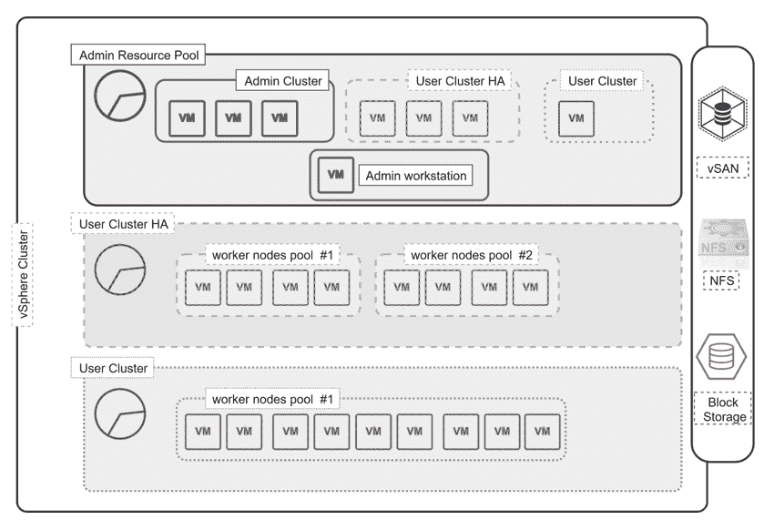

图 C.9 VMware 上 Anthos 的资源分布

您已经了解了关于 VMware 上 Anthos 实现计算部分的很多内容。在下一节中，我们将详细介绍根据网络实施选择进行的通信能力、要求和限制。

### C.3.1 Anthos 网络

要理解网络在 Anthos 集群中的作用，我们需要了解 Anthos 集群由两种不同的网络模型组成。第一个是放置整个基础设施的 vSphere 网络，另一个是 Kubernetes 网络。

在本章开头，我们提到 VMware 上的 Anthos 不需要在 vSphere 基础设施上应用任何软件定义网络，并且可以完全基于 VLAN。

IP 管理

既然我们已经熟悉了部署流程，让我们更深入地探讨配置和架构元素。

除了前几章中提到的配置文件外，根据部署场景还可能有额外的需求。当使用 DHCP 时，所有节点都从它那里分配了 IP 地址，如图 C.10 所示。

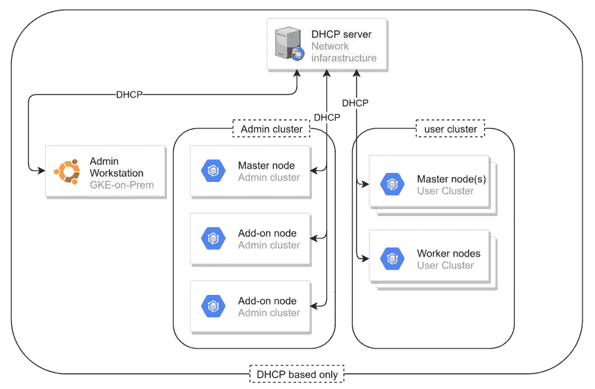

图 C.10 基于 DHCP 的部署

如果部署没有利用 DHCP 服务进行节点 IP 分配，则必须为管理员集群和每个用户集群创建额外的主机配置文件（图 C.11）。一些组织认为静态分配的地址是最稳定的实现，因为它消除了任何 DHCP 问题或节点租约到期，不会对节点通信造成任何干扰。然而，虽然它可能消除任何 DHCP 问题，但它引入了主机配置文件准备的管理开销和创建集群的可扩展性限制。最佳实现是您必须为您的集群和组织决定的事情。

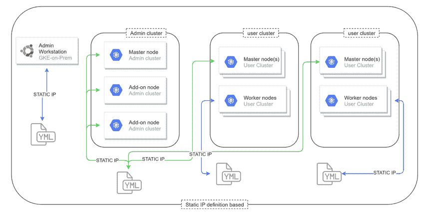

图 C.11 静态 IP 分配场景

可以遵循混合部署场景，其中既部署了基于 DHCP 的集群，也部署了非 DHCP 基于的集群，如下面的图片所示。


图 C.12 混合 DHCP 和静态 IP 分配场景

使用此配置，我们可以有一个使用静态 IP 地址进行其管理平面和用户 Kubernetes 主节点管理的管理员集群，为第一个用户集群使用 DHCP，为第二个用户集群的 Kubernetes 工作节点使用静态 IP 地址，或者完全相反。由于 Kubernetes 节点 IP 地址的变化会对存储访问造成重大问题，因此建议为管理员集群节点使用静态 IP 分配，而 DHCP 可以用于短期用户集群。

与混合部署相关有一些限制：

+   IP 分配必须在整个管理员集群和用户集群主节点中相同，因为它们共享相同的 IP 地址池

+   所有用户集群工作节点池必须使用整个集群相同的 IP 分配方法

+   即使由同一个管理员集群管理，不同的用户集群也可以使用不同的 IP 分配方法

到目前为止，我们已经讨论了 IP 分配选项以及每种实现的优缺点。现在让我们谈谈详细的网络实施配置、管理和平摊工作负载的良好实践和建议。

管理平面

深入到管理平面网络配置，我们需要根据要执行的活动与两个元素进行通信。我们必须为 VMware 上的 Anthos 部署的第一个元素是管理员工作站，该工作站由 Google 完全预配置并加固。

第二个通信点是整个管理员集群，托管所有管理员节点和用户集群主节点。两者都要求与 VMware 基础设施通信以自动部署虚拟机。没有技术要求将管理员工作站、节点和 vSphere 基础设施分开，但从安全角度来看，强烈建议在图下所示的第二层上隔离这些网络。

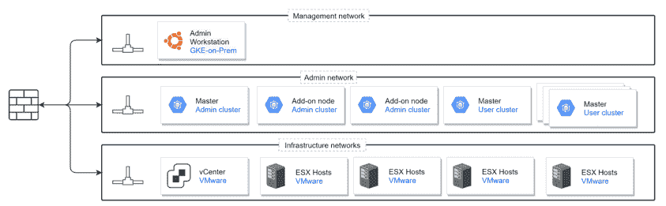

图 C.13 Anthos 在 VMware vSphere 网络上的 Anthos

由于 Anthos on VMware 集群集成到 GCP 控制台，它们需要与外部世界进行通信。这种连接可以通过直接互联网连接或通过互联网代理来实现。

新的 Anthos 集群的默认网络模型被称为孤岛模式。这意味着 Pod 可以相互通信，但默认情况下被阻止从外部网络访问。另一个重要的注意事项是，Pod 到位于外部的服务的出站流量通过节点 IP 地址进行 NAT。

同样的规则适用于服务。它们可以在集群之间重叠，但不能与 Pod 子网重叠（图 C.14）。此外，Pod 和服务的子网也不能与集群消耗的外部服务重叠，例如互联网代理或 NTP[^([12])](#ftn12)，否则流量将无法路由到创建的集群外部。

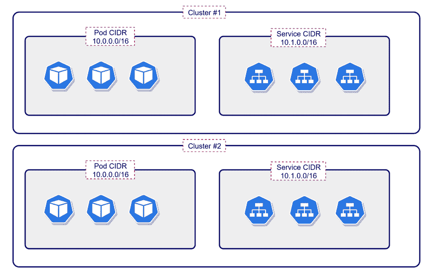

图 C.14 Pods 和 services

服务 CIDR 和 Pod CIDR 都在管理集群配置 YAML 文件中定义，内置的预检检查确保两者的 IP 地址不重叠。

```
network:
  serviceCIDR: 10.96.0.0/16
  podCIDR: 10.97.0.0/16
```

负载均衡器

要管理 Kubernetes 集群，您必须访问其 Kubernetes API 服务器。管理集群通过 LoadBalancer IP 公开它，可以根据类型配置 3 种风味。在撰写本章时，Anthos on VMware 支持以下类型：MetalLB、F5BigIp 和 ManualLB，它们取代了 SeeSaw。

内置 - MetalLB

MetalLB 是 Google 开发的针对 Kubernetes 集群的开源[^([13])](#ftn13) Cloud Native Computing Foundation 沙盒项目网络负载均衡器实现。它运行在裸机实现上，允许在任何集群中使用 LoadBalancer 服务。

MetalLB 解决了超大规模 Kubernetes 实现中的一部分需求，但在本地环境中却缺乏，即外部公告和地址分配。地址分配提供了自动将 IP 地址分配给创建的 LoadBalancer 服务的功能，无需手动指定。此外，您可以根据需要创建多个 IP 地址池，可以并行使用，例如用于内部服务暴露的私有 IP 地址池和提供外部访问的 IP 地址池。一旦分配了 IP 地址，它必须在网络上进行公告，这时其外部公告功能就派上用场。MetalLB 可以以两种模式部署：二层模式和 BGP 模式。

当前 VMware 上的 Anthos 的实现仅使用层 2 模式。在层 2 实现中，外部通告通过使用标准地址发现协议进行管理：IPv4 使用 ARP，IPv6 使用 NDP。每个 Kubernetes 服务都作为专用的 MetalLB 负载均衡器呈现，因此当创建多个服务时，流量会在负载均衡器节点之间分配。这种实现具有优点和限制。关键限制与这样一个事实相关，即服务 IP 的所有流量都将始终流向一个节点，在那里 kube-proxy 将其传播到所有服务 Pod。因此，服务带宽始终限制在单个节点的网络带宽。在节点故障的情况下，服务将自动故障转移。这个过程不应超过 10 秒。当考虑 MetalLB 层 2 实现的优点时，我们当然必须提到这样一个事实，即它是完全集群内的实现，没有任何对物理网络（如硬件等）的特殊要求。层 2 实现不会对每个网络创建的负载均衡器数量引入任何限制，只要可用 IP 地址可以分配。这是使用 memberlist Go 库维护集群成员列表和成员故障检测使用基于 Gossip 协议而不是例如虚拟路由器冗余协议[^([14])](#ftn14)的结果。

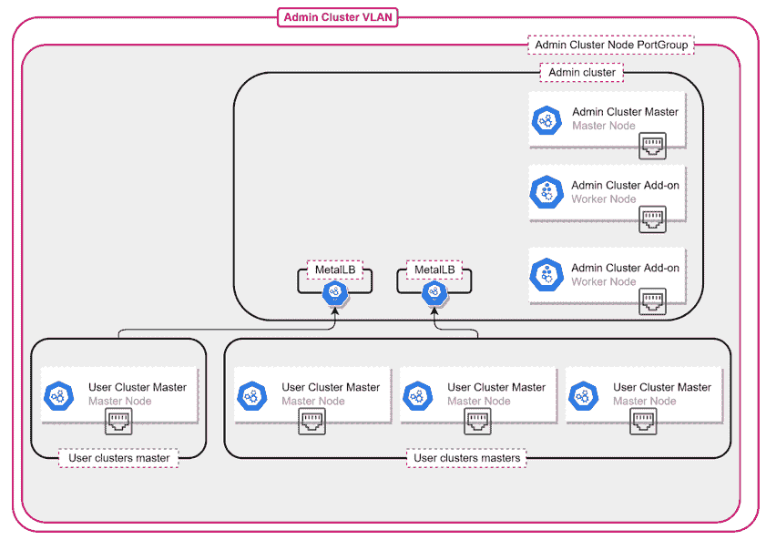

图 C.15 使用 metalLB 的管理员集群网络

INFO：管理员集群 Kubernetes VIP 没有利用 MetalLB，因为管理员集群没有实现高可用性。所有用户集群都使用 MetalLB 部署来暴露其 Kubernetes VIP。

MetalLB 是 Anthos on VMware 的一部分，在 Anthos 许可下得到覆盖，并且与所选支持模型一起提供标准支持，包括每个版本的生命周期管理活动。

集成 - F5

引入负载均衡器功能的第二种选择是与 F5 BIG-IP 负载均衡器集成——称为集成负载均衡器模式。与 MetalLB 相比，F5 基础设施必须提前准备，并且不是由 Google 自动部署。对于 VMware 上的 Anthos，BIG-IP 提供外部访问和 L3/4 负载均衡服务。当定义集成负载均衡器模式时，VMware 上的 Anthos 会自动执行预检查并安装单个支持的 F5 BIG-IP 容器入口服务（CIS）控制器。

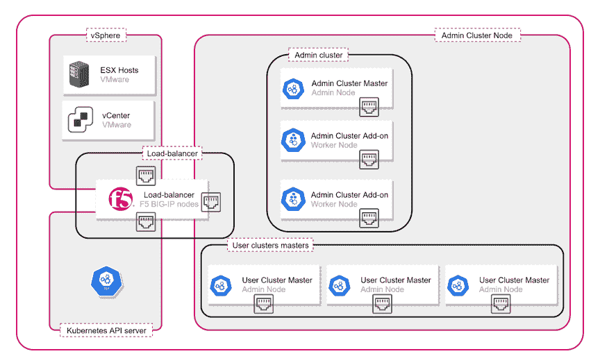

图 C.16 使用 F5 BIG-IP 的管理员集群网络

生产许可证为在 VMware 负载均衡器上的 Anthos 提供高达 40 Gbps 的吞吐量。

BIG-IP 集成在 Google 的支持兼容性矩阵内得到完全支持，但根据 F5 许可单独授权。

手动负载均衡器

为了允许灵活性和使用现有负载均衡基础设施的能力，Anthos on VMware 可以通过手动模式配置负载均衡器进行部署。在这种实现中，在集群部署开始之前需要设置一个带有 Kubernetes API VIP 的负载均衡器。配置步骤取决于你使用的负载均衡器。Google 提供了详细的文档，描述了 BIG-IP 和 Citrix 的配置步骤。在手动模式下，你不能将类型为 LoadBalancer 的服务暴露给外部客户端。

由于缺乏与手动负载均衡模式的自动化集成，Google 不提供支持，并且任何与负载均衡器相关的问题都必须由负载均衡器的供应商管理。

我们已经了解了所有三种模式类型。让我们看看配置文件。配置在 admin 配置 yaml 文件的专用 loadBalancer 部分中，将根据所选选项而有所不同。

对于 admin 集群中的 MetalLB 配置，我们必须定义负载均衡器 kind 为 MetalLB 并提供 Kubernetes API 服务 VIP。

```
loadBalancer:
   vips:
    controlPlaneVIP: "203.0.113.3"
  kind: MetalLB
```

当选择 F5 BIG-IP 集成模式时，负载均衡器部分必须更改为 kind: F5BigIP。整个 MetalLB 部分（默认情况下在新生成的配置文件中启用）必须注释掉，并且必须使用凭据文件和分区详细信息定义 f5BigIp 部分。

```
loadBalancer:
   vips:
    controlPlaneVIP: "203.0.113.2"
  kind: F5BigIP
  f5BigIP: 
    address: "loadbalancer-ip-or-fqdn"
    credentials:
      fileRef: 
        path: “name-of-credential-file.yaml”
        entry: “name of entry section in above defined file”
    partition: “partition name”
    snatPoolName: “pool-name-if-SNAT-is-used”
```

最后一个用例是涵盖手动负载均衡。在这种情况下，我们必须定义 kind: ManualLB 并注释掉 seesaw 部分。接下来，我们必须手动定义 NodePort 配置选项。

```
loadBalancer:
   vips:
    controlPlaneVIP: "203.0.113.2"
  kind: ManualLB
  manualLB: 
    controlPlaneNodePort: “9000”
    addonsNodePort: “9001”
```

用户集群

用户集群的网络基于与 admin 集群相同的原理，但为了工作负载部署能力而外部化。每个集群都以孤岛模式部署，其中服务和 Pods CIDR 在用户集群配置文件中不得重叠。

```
network:
  serviceCIDR: 10.96.0.0/16
  podCIDR: 10.97.0.0/16
```

我们再次有三种负载均衡器部署和集成模式：捆绑式、集成式和手动式。

捆绑式部署同样使用 MetalLB 实现。你已经了解到用户集群的主节点被部署到 admin 集群节点网络中，并且 IP 地址是从预定义的静态池或 DHCP 服务器分配的。Kubernetes API 服务也自动在同一个网络中暴露，但其 IP 地址必须在用户集群配置文件中手动定义。

用户集群的工作节点可以部署在与 admin 节点相同的网络中，或者部署到单独的专用网络中。第二种选择更受欢迎，因为它允许将管理平面的流量分离。每个新的用户集群都附带一个新的专用 MetalLB 负载均衡器用于数据平面。Kubernetes API 的控制平面 VIP 始终与 admin 集群负载均衡器实例共同托管。用户集群的 ingress VIP 自动部署到集群工作节点池网络中。因此，你可以将 MetalLB 限制在专用节点池上托管，而不是在用户集群的所有节点上。

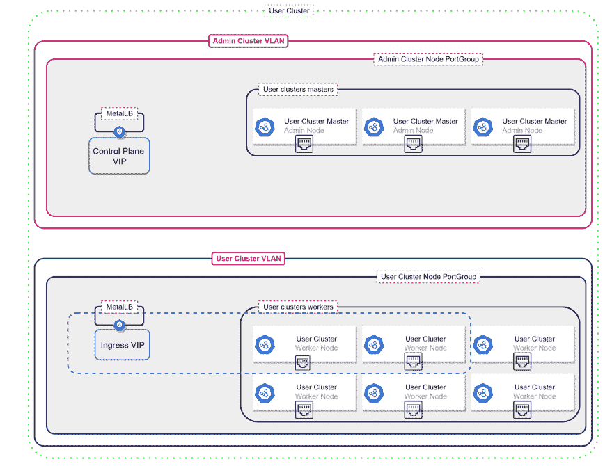

图 C.17 使用 MetalLB 的用户集群网络

在多集群部署中，用户集群可以共享单个网络或使用专用网络。当使用单个网络时，请确保配置文件中的节点 IP 地址不重叠。

正如我们已经提到的，MetalLB 是一个完全捆绑的负载均衡器。这意味着每次创建服务类型 LoadBalancer 时，VIP 都会在负载均衡器上自动创建，发送到 VIP 的流量将被转发到服务。由于 MetalLB 具有 IP 地址管理（IPAM），因此每个服务的 IP 地址都会自动分配。IP 池和托管 MetalLB VIPs 的节点的定义在用户集群负载均衡器配置文件部分中，如下所示。

```
loadBalancer:
   vips:
    controlPlaneVIP: "Kubernetes API service VIP"
  kind: MetalLB
  metalLB:
    addressPools:
    - name: "name of address pool"
      addresses:
      - "address in form of X.X.X.X/subnet or range X.X.X.X-X.X.Y.Y”
# (Optional) Avoid using IPs ending in .0 or .255.
      avoidBuggyIPs: false
# (Optional) Prevent IP addresses to be automatically assigned from this pool (default: false)
      manualAssign: false
```

此外，我们必须在已详细描述的 worker pools 部分允许 MetalLB 服务在一个（或多个）虚拟机池上，通过定义配置为“enableLoadBalancer: true”的形式。

集成负载均衡允许集成到 F5 BIG-IP，并自动提供 LoadBalancer 服务类型，类似于我们描述的 admin 集群集成。在这种情况下，集成点可以是 admin 和用户集群相同的，不需要使用 F5 的单独实例。重要的是要记住，每个新的集群在部署之前必须在负载均衡器侧预先配置并适当准备。

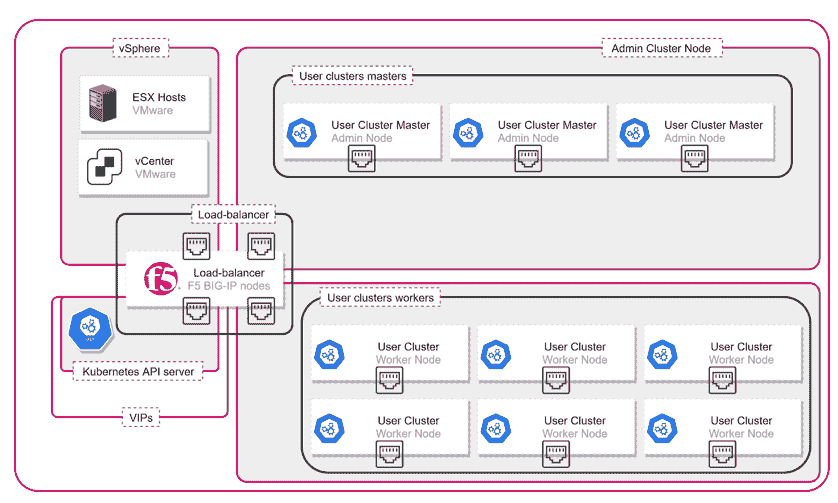

图 C.18 使用 F5 BIG-IP 的用户集群网络

用户集群负载均衡器的手动模式实现遵循相同的规则，引入相同的约束和限制，如 admin 集群。每个服务暴露都需要与外部团队联系，并执行官方文档中描述的手动活动[^([15])](#ftn15)。

在本节中，我们探讨了 Anthos on VMware 中管理集群和工作负载集群的不同网络配置选项。重要的是要记住，与 IP 分配类似，我们可以选择使用单个负载均衡器集成模式，或者为不同的集群选择不同的模式。因此，我们可以拥有基于 MetalLB 的管理集群、一个 MetalLB 用户集群、第二个集成 F5 BIG-IP 的用户集群以及第三个手动集成的 Citrix Netscaler 负载均衡器。

```
loadBalancer:
   vips:
    controlPlaneVIP: "Kubernetes API service VIP"
    ingressVIP: “Ingress service VIP (must be in use node network range)
  kind: MetalLB
  MetalLB:
    addressPools:
    - name: "my-address-pool-1"
      addresses:
      - "192.0.2.0/26"
      - "192.0.2.64-192.0.2.72"
      avoidBuggyIPs: true

loadBalancer:
   vips:
    controlPlaneVIP: "Kubernetes API service VIP"
  kind: F5BigIP
  f5BigIP: 
    address: "loadbalancer-ip-or-fqdn"
    credentials:
      fileRef: 
        path: “name-of-credential-file.yaml”
        entry: “name of entry section in above defined file”
    partition: “partition name”
    snatPoolName: “pool-name-if-SNAT-is-used”

loadBalancer:
   vips:
    controlPlaneVIP: "Kubernetes API service VIP"
  kind: ManualLB
  manualLB: 
    ingressHTTPNodePort: Ingress-port-number-for-http
    ingressHTTPSNodePort: Ingress-port-number-for-https
    controlPlaneNodePort: “NodePort-number-for-control-plane-service”
```

### C.3.2 GCP 集成功能

在前面的章节中，我们讨论了 Anthos on VMware 的计算和网络架构。在本节中，我们将介绍 GCP 服务的不同集成功能，以便利用单个控制面板来管理所有 Anthos 集群，无论它们是在本地部署还是在其他云上。

正如您在部署新的管理员和用户集群时已经注意到的，定义一个将被集成到其中的 GCP 项目是强制性的。这使连接代理能够正确注册并与中心建立通信，如操作管理章节中详细描述的那样。一般来说，GKE Connect 执行两个活动，启用连接和身份验证以注册新集群。

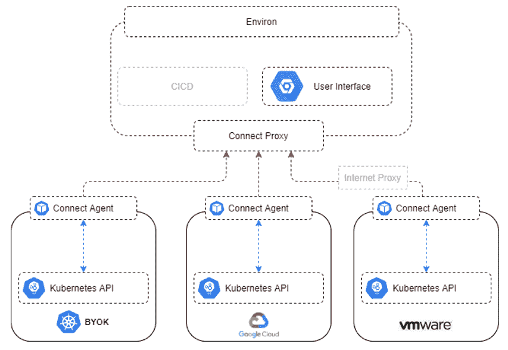

图 C.19 舰队与连接代理的关系

为此目的，使用了两个专用的服务帐户。该部分是强制性的，并且必须为用户集群正确定义。请注意，由于代理服务帐户使用工作负载身份功能，因此它不需要密钥文件。

```
gkeConnect:
  projectID: “My-awsome-project”
  registerServiceAccountKeyPath: register-key.json
```

注意：GKE connect 在本地到 GCP 集成中发挥着重要作用。这使我们能够直接从 GCP 控制台云市场、云运行选项中利用它，通过 Anthos 授权与 CICD 工具链集成，而无需公开 Kubernetes API。

Anthos on VMware 具有将基础设施日志和指标发送到 GCP 云监控的能力。这适用于管理员和用户集群。我们可以选择仅发送与 Kubernetes 相关的指标，也可以包括 vSphere 指标。每个集群的指标可以发送到不同的项目。

```
stackdriver:
  projectID: “My-awsome-project”
  clusterLocation: gcp-region-name
  enableVPC: false/true
  serviceAccountKeyPath: monitoring-key.json
  disableVsphereResourceMetrics: true/false
```

另一个适用于管理员和用户集群的集成功能是能够发送 Kubernetes API 服务器审计日志。如前所述，我们可以选择存储日志的项目和位置区域以及用于该集成服务帐户。

```
cloudAuditLogging:
  projectID: “My-awsome-project”
  clusterLocation: gcp-region-name
  serviceAccountKeyPath: audit-key.json
```

最后两个集成功能仅适用于用户集群。第一个是选择从 Google Cloud Platform 控制台云运行 Anthos（在“Anthos，无服务器计算引擎（Knative）”章节中详细描述）中消费，并将服务直接部署到 VMware 集群上的 Anthos。在这里没有太多配置，因为服务本身正在利用连接功能，并在用户集群的专用命名空间中部署 Knative。这意味着它必须在与 VMware 集群注册的 Anthos 相同的项目中启用。您将在“Anthos Cloud Run”章节和相关的文档中了解更多关于云运行 Anthos 和 Knative 的信息[^([16])](#ftn16)。

功能列表描述以计量结束。启用计量功能后，用户集群将资源使用和消耗数据发送到 Google Bigquery。这使我们能够分析它，并根据实际需求调整集群大小，或者将其公开并作为报告等展示。

```
usageMetering:
  bigQueryProjectID: “My-awsome-project”
  bigQueryDatasetID: dataset-name
  bigQueryServiceAccountKeyPath: metering-key.json
  enableConsumptionMetering: false/true
```

## C.4 摘要

+   在现有的 vSphere 基础设施之上消费云原生功能的 Anthos on VMware 是一个很好的选择

+   架构由两个元素组成：

    +   负责托管应用程序资源交付的用户集群

    +   负责管理和控制已部署用户集群的管理员控制平面

+   它可以用作与托管虚拟机共存的附加组件，以及为混合云实施和云原生之旅准备的本地 Kubernetes 实现。

+   我们可以利用现有的 VMware 技能进行基础设施管理，保持对云操作的全面可见性，并在需要时从自己的数据中心消费 GCP 服务。

+   设置可以是独立的和自包含的，使用捆绑功能如 MetalLB，或者集成到现有基础设施中，以及它带来的自动化能力和约束。

+   集群配置可能因目的、规模和可用性要求而异。

* * *

[^([1])](#ftnref1) [`cloud.google.com/anthos/gke/docs/on-prem/how-to/vsphere-requirements-basic#resource_requirements_for_admin_workstation_admin_cluster_and_user_clusters`](https://cloud.google.com/anthos/gke/docs/on-prem/how-to/vsphere-requirements-basic#resource_requirements_for_admin_workstation_admin_cluster_and_user_clusters)

[^([2])](#ftnref2) [`developers.google.com/identity/protocols/oauth2/openid-connect`](https://developers.google.com/identity/protocols/oauth2/openid-connect)

[^([3])](#ftnref3) [`cloud.google.com/anthos/gke/docs/on-prem/how-to/vsphere-requirements-basic`](https://cloud.google.com/anthos/gke/docs/on-prem/how-to/vsphere-requirements-basic)

[^([4])](#ftnref4) [`cloud.google.com/anthos/clusters/docs/on-prem/version-history`](https://cloud.google.com/anthos/clusters/docs/on-prem/version-history)

[^([5])](#ftnref5) 如果使用 --auto--create-service-accounts 标志，则会填充部分。

[^([6])](#ftnref6) [`metallb.universe.tf/installation/clouds/`](https://metallb.universe.tf/installation/clouds/)

[^([7])](#ftnref7) vSphere 高可用性功能可以减轻这种行为，并将 Kubernetes API 的停机时间减少到分钟，直到虚拟机在新主机上重新启动。vSphere HA 不会保护虚拟机免受损坏。

[^([8])](#ftnref8) 对于基于 vSAN 的部署，所有节点都必须放置在同一个数据存储上。

[^([9])](#ftnref9) Anthos on VMware 支持所有认证的 OpenID 提供商。完整列表可以在 [`openid.net/certification/`](https://openid.net/certification/) 下找到。

[^([10])](#ftnref10) [`cloud.google.com/anthos/identity/setup/per-cluster`](https://cloud.google.com/anthos/identity/setup/per-cluster)

[^([11])](#ftnref11) vSphere 数据存储可以由任何块设备、vSAN 或 NFS 存储支持。

[^([12])](#ftnref12) 网络时间协议

[^([13])](#ftnref13) [`github.com/metallb/metallb`](https://github.com/metallb/metallb)

[^([14])](#ftnref14) [`tools.ietf.org/html/rfc3768`](https://tools.ietf.org/html/rfc3768)

[^([15])](#ftnref15) [`cloud.google.com/anthos/clusters/docs/on-prem/how-to/manual-load-balance`](https://cloud.google.com/anthos/clusters/docs/on-prem/how-to/manual-load-balance)
