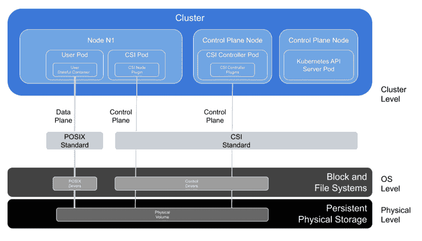
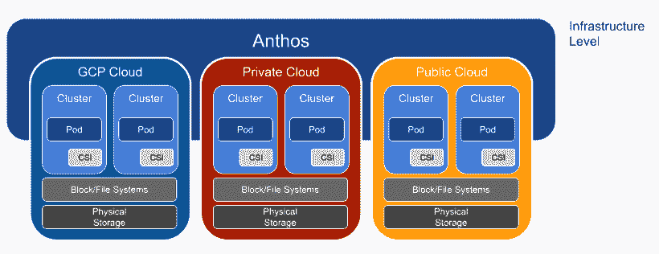
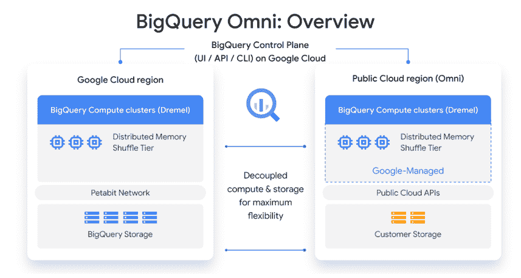
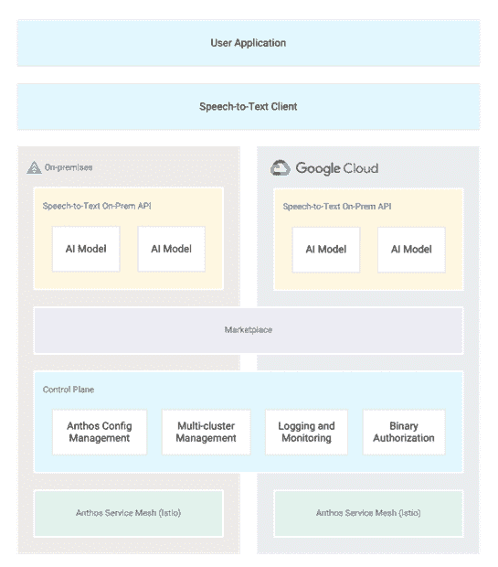

# 附录 D. 数据和分析

Patricia Florissi

本章涵盖：

+   理解可移植性与移动性

+   Kubernetes 和存储

+   Anthos 和存储

+   BigQuery Omni

+   Anthos Hybrid AI

直到最近，Anthos 通常在计算和网络的环境中提到，很少在存储或数据的环境中提到。尽管如此，Anthos 有潜力将它在可观察性、安全、配置和控制方面引入的许多基本原理带给有状态的工作负载。此外，Anthos 有潜力像它已经颠覆计算的可移植性和移动性一样，颠覆数据的可达性和可访问性。通过 Anthos，容器可以无缝地跨混合和多云环境访问存储设备，在配置、配置、分配和访问这些资源方面保持一致性。

一旦 Anthos 集群能够使有状态的容器在混合和多云环境中部署，它就为这些容器提供了以安全和一致的方式访问数据的途径，这样分析数据的执行方式就为重新设计做好了准备。在传统的环境中，从众多数据源收集的数据被存储在中央位置，以数据仓库或数据湖的形式存在，这就是分析执行的地方。因此，包括使用人工智能（AI）和机器学习（ML）的分析解决方案，长期以来都是基于假设所有所需数据都可以集中访问而设计和优化的。

然而，最近的事件一直在挑战在分析之前集中所有数据的能力。组织通常会将数据分散在组织边界或地理位置之间，无论是在本地托管还是在公共云中。通常，法规遵从性、安全或数据隐私会强制实施某种形式的数据居住地，数据必须存储在物理或逻辑围栏内，不能移出该围栏。此外，即使数据可以跨越这些边界，带宽限制，如容量、速度和成本，可能会对可以传输到中央目的地的数据量施加限制。Anthos 使得将数据分析带到数据所在之处变得更加容易，无论是在本地还是在公共云中，数据发生或需要发生的地方。

Anthos、数据和分析的交集只是一个新兴话题，在 Anthos 向现代应用程序提供支持的道路上，它是最初级的。随着你阅读本章，大量与如何使 Anthos 能够支持下一代许多数据服务以及如何使分析在混合和多云环境中无缝工作相关的工作正在许多领域继续进行，包括：

+   数据备份和灾难恢复，从本地到云以及云之间的；

+   数据库，其中计算引擎可以是容器原生，存储可以是软件定义的；

+   联邦学习，其中 AI 模型的训练在多个地点进行协调，处理数据所在地的数据，并仅集中聚合此类计算的中间结果；

+   AI 和 ML 管道允许在生产环境中实现模型的工业化，从而结束实验阶段。

如您从引言中可以看到，Anthos 上的数据开放了多种需要数据的额外工作负载，这些工作负载跨越各种多云和混合云解决方案——容器不再仅限于无状态工作负载。但是，在更深入地探讨在 Kubernetes 和 Anthos 上使用数据之前，我们需要了解可移植性和移动性之间的区别，这将在下一节中讨论。

## D.1 可移植性与移动性

当涉及到 Anthos 和数据时，区分可移植性和移动性的细微差别对于理解处理混合和多云环境中分散数据背后的挑战至关重要。应用程序的可移植性使 Anthos 能够实现“一次编写，到处运行”的前提，而应用程序的移动性则使这一概念扩展到“一次编写，到处运行，随意移动”。可移植性在软件设计阶段对软件开发者很重要，在操作阶段对管理员很重要，因为它减少了可能需要配置的环境类型。移动性在运行时对操作者来说最为重要，因为它使他们能够动态地重新分配工作负载，实时调整以满足需求。在许多方面，移动性旨在避免将工作负载锁定在特定配置的具体细节中，并根植于开放标准的采用。可移植性和移动性共同使得工业规模的操作更加可行和可扩展。然而，与可移植性和计算移动性相关的挑战可能比与计算移动性相关的挑战要复杂得多。

虽然增加了可移植性，扩大了有状态容器可以部署的硬件表面，但这并不一定直接等同于有状态工作负载从一个位置移动到另一个位置。在某些情况下，运行在位置 L1 并访问持久存储 PS 的有状态工作负载 SW 可能无法移动到位置 L2。例如，SW 可能在 L2 上运行时无法访问 PS，而且数据本身可能没有可移植性，无法转移到 L2 位置可访问的物理存储。数据往往表现出一种重力元素，由于数据本身的巨大规模、移动数据的财务和运营成本、带宽限制、安全要求、法规遵从性和隐私限制等多种因素，这给移动带来了挑战。此外，在许多情况下，数据是持续创建的，应用程序需要在时间敏感的窗口内摄取和处理不断增长的数据集。在这些场景中，一次性复制或一系列离散的数据副本可能无法满足应用程序的要求。

关于可移植性

可移植性指的是在多个位置执行的能力。在许多方面，可移植性在涉及工作负载放置的移动性担忧之前就已经存在。在工作负载能够在某个位置运行之前，工作负载应该与底层架构兼容，并且应该有足够的资源来运行工作负载。为了提高可移植性，开发环境寻求最小化对特定基础设施配置和库的依赖。

然而，可移植性可以被视为有效移动性的一个要求。在某个位置运行的计算工作负载应该只移动到它可以在那里继续执行的其他位置。本质上，一个应用程序可以被制作成可移植到更多位置，它就可以移动到更多位置。执行性能在这些位置之间可能会有所不同，因为每个位置可能具有不同的计算、内存、网络和存储配置，但无论如何，应用程序实际上是可以执行的。

容器通过将应用程序代码及其所有库依赖项打包在一起，减少了在特定库配置方面的需求，这些配置需要在运行之前在某个位置可用。对于有状态的容器，可移植性要求容器与一个位置上的存储设备交互的方式与容器与另一个位置上的存储设备交互的方式兼容。

关于移动性

在计算机科学领域，移动性指的是将资源的位置从一个物理位置转移到另一个位置的能力。对于计算工作负载，它指的是将工作负载的执行从一组物理计算资源（如服务器节点）转移到另一个资源。对于数据，它指的是将数据内容从物理存储设备移动到另一个设备。

虚拟机（VM）使跨物理边界移动计算成为可行的方法，通常在实时进行，并且服务中断最小，如果没有中断。当涉及到这些虚拟机访问的数据时，并没有赋予相同的移动性。在网络上移动数据可能会受到延迟、带宽限制以及从其位置读取和将数据写入新位置的成本的影响，还可能受到在飞行中更改数据地址的挑战。应用程序通常在执行开始时将地址绑定到物理位置，并且这些绑定不容易更改。此外，根据需要移动的数据大小，带宽和读写吞吐量限制不容忽视。随着大小的增加，数据获得更多的重力并失去移动性。

因此，需要访问驻留在持久存储中的数据的虚拟机（VM）只能绑定到移动到其他物理计算资源，这些资源仍然可以访问最初存储数据的位置。本质上，计算工作负载移动了，但数据没有。

当通过简单地在新目标位置启动新的容器并终止旧的容器来移动工作负载变得可行且更容易时，容器增加了移动性的灵活性。与实际移动正在运行的工作负载相比，这种方法更加有效。然而，对访问持久存储的容器（称为有状态容器）也适用类似的约束。只要有状态容器的新的位置可以访问与旧容器在其先前位置使用的相同持久存储，移动性就更容易。然而，容器有一个有趣的特点。由于容器是从零开始重新启动的，因此可以在容器和物理存储之间建立新的绑定。因此，只要副本是彼此的精确镜像，容器也可以移动到存在数据副本的位置。

### D.1.1 章节组织

本章简要介绍了 Anthos、数据和数据分析的主题，其组织结构如下：

+   第 Kubernetes 和存储 节回顾了 Kubernetes 如何与存储层交互的一些重要概念，为下一节奠定了基础；

+   第 Anthos 和存储 节讨论了 Anthos 如何在 Kubernetes 的基础上增加价值，以增强访问持久存储的工作负载的可移植性；

+   由 Anthos 驱动的 BigQuery 部分解释了 Anthos 如何使 Google Cloud 数据仓库分析引擎 BigQuery 能够在存储在其他公共云平台上的数据上执行查询；

+   Anthos 混合人工智能 部分解释了 Anthos 如何使 Google Cloud 分析解决方案在本地运行，允许云原生分析在无需将数据移动到云的情况下部署和执行；

+   摘要 部分概述了本章涵盖的主要主题。

## D.2 Kubernetes 和存储

关于基于容器和云原生应用 (CNAs) 的一个基本问题是它们如何支持持久数据。这些问题范围从它们如何在集群内支持像块或文件操作这样简单的事情，到它们如何与交易数据库和 PB 级规模的对象存储交互。由于 Anthos 是 Kubernetes 之上的管理平面，因此首先了解 Kubernetes 如何公开块和文件存储的配置和管理至关重要，然后了解 Anthos 不仅在今天在 Kubernetes 存储之上添加了什么，而且了解 Anthos 未来可以添加什么。

在 Kubernetes 中，卷代表存储分配的单位，与存储系统直接交互的容器被称为有状态容器。图 D.1 数据和控制平面 展示了使有状态容器能够与存储系统交互的技术堆栈。数据位于持久物理存储层，这是堆栈中的最低层，包括例如 [互联网小型计算机系统接口 (iSCSI)](https://tools.ietf.org/html/rfc3720) [逻辑单元号 (LUN)](https://en.wikipedia.org/wiki/LUN)、[网络文件系统 (NFS)](https://en.wikipedia.org/wiki/Network_File_System) 共享以及对象、块和文件的云服务。在物理层之上，在操作系统 (OS) 层，有块和文件系统，这些系统可以是本地的或网络化的。这些系统实现了驱动程序，通常在操作系统内核级别运行，允许上层通过块级或文件级抽象与物理存储交互。在最基本的形式中，容器通过两个平面与存储系统交互：

+   数据平面：由有状态容器用于执行读取和写入操作。在很大程度上，数据平面已经标准化。例如，[可移植操作系统接口 (POSIX)](https://www.gnu.org/software/libc/manual/html_node/POSIX.xhtml) 是将数据读入和写入文件和块存储的事实上标准协议接口。

+   控制平面：由 Kubernetes 存储插件用于在物理存储中分配、释放和管理空间。

与数据平面不同，控制平面接口直到最近才实现标准化。2017 年，涉及 Kubernetes、Mesos、Docker、Cloud Foundry 和其他几个容器的容器编排器之间的努力，导致了[容器存储接口（CSI）](https://github.com/container-storage-interface/spec/blob/master/spec.md)规范的制定。存储供应商通过使用其特定的 API 和存储协议将 CSI 规范实现为驱动程序。然后，供应商的 CSI 驱动程序被打包并部署在 Kubernetes 集群中作为 Pods，通常分为控制器部署和每个节点的部署。当编排容器工作负载的卷时，Kubernetes 会调用这些驱动程序实现的适当 CSI API。CSI 将在接下来的会话中进一步解释。

图 D.1 数据平面和控制平面

在本章的上下文中，数据专指持续应用程序执行的数据。因此，数据不仅需要持久存储，而且在创建或更改它的应用程序终止后，无论是正常还是异常终止，都需要对其进行寻址和访问。这些应用程序的范围可以从非常短暂的，例如在手机中记录视频流的相机应用程序，到更具有弹性的数据库应用程序，例如可以成为数字银行服务后端的数据库应用程序。

### D.2.1 标准化的出现

Kubernetes 卷插件为供应商提供了一个抽象层，以便在 Kubernetes 中添加对他们的块和文件存储系统的支持，从而自动化容器的存储配置、附加和挂载。此外，Kubernetes 对[持久卷（PVs）](https://kubernetes.io/docs/concepts/storage/persistent-volumes/)、[持久卷声明（PVCs）](https://kubernetes.io/docs/tasks/configure-pod-container/configure-persistent-volume-storage/)和[存储类（StorageClass）](https://kubernetes.io/docs/concepts/storage/storage-classes/)对象的抽象使得存储和有状态容器的可移植性成为可能。但其他挑战仍然存在。

在 2017 年初，Kubernetes 还不是最广泛采用的容器编排平台。Mesos、Docker Swarm 和其他平台拥有相当大的市场份额。每个编排系统都有不同的方式将卷暴露给它们自己的容器。为了解决容器市场，存储供应商需要为每个容器编排系统开发多个存储插件，许多供应商决定在创建标准或市场领导者出现之前推迟开发。

同时，Kubernetes 卷插件机制也面临着几个挑战。卷插件必须作为树内卷插件在核心 Kubernetes 中实现。存储供应商必须使用 Go 编程语言实现插件，向 Kubernetes 代码仓库贡献源代码，并将代码作为 Kubernetes 主发布的一部分进行发布和维护。

树内卷插件为不同的社区带来了不同的挑战，如下所述：

+   对于 Kubernetes 开发社区：卷插件直接嵌入到仓库中，作为 Kubernetes 代码库的一部分，在 Kubernetes 二进制代码中进行编译和实现，这变得令人畏惧。引入的紧密耦合带来了挑战，包括：

    +   安全性：卷插件拥有完全权限访问所有 Kubernetes 组件，整个源树都暴露于安全漏洞的利用；

    +   稳定性：卷插件中的错误可能会影响关键 Kubernetes 组件，导致组件故障或整个 Kubernetes 系统故障；

    +   质量和测试：外部代码的测试和维护与 CI/CD 管道交织在一起，因此在每次发布之前测试 Kubernetes 代码以针对所有支持的存储配置变得越来越具有挑战性。Kubernetes 开发者通常无法访问包含所有存储版本及其相关专业知识的研究室。对于某些插件，Kubernetes 依赖于用户在问题得到解决之前找到并报告问题。

+   对于存储供应商：树内卷插件（in-tree volume plugins）的运行速度减慢，甚至阻碍了驱动程序的开发和支持，这归因于插件生命周期多个阶段的挑战，包括：

    +   在开发期间：存储供应商需要有效地扩展 Kubernetes 代码，并将代码提交到 Kubernetes 核心仓库，这要求存储供应商掌握 Go 编程语言和 Kubernetes 的专业知识。强制使用单一编程语言 Go 进一步限制了智力资本池，因为 Go 是一种新兴语言，市场上可用的开发者比 Java 或 C 等其他语言要少；

    +   在发布期间：存储供应商需要与 Kubernetes 发布周期保持一致，这限制了他们只能在 Kubernetes 发布代码时发布新代码和更新，每年仅四次。这种紧密耦合的发布周期严重影响了部署速度；

    +   在商业化期间：卷插件的代码被迫开源；

+   对于用户：这些动态影响了有状态容器的整体 Kubernetes 体验，并阻止了大规模采用，因为：

    +   生态系统薄弱：随着存储供应商努力开发插件，存储选择数量有限；

    +   速度慢：发布周期长且测试质量差，用户必须等待很长时间才能解决问题得到解决。

在 Google 强有力的领导下，Kubernetes 社区决定放弃树内插件模型，并为供应商开发卷插件创建一个独立的方法。Kubernetes 并非孤军奋战。所有容器编排系统都面临着类似的挑战——它们需要尽可能多地暴露容器给不同的存储供应商产品，尽可能少的工作，以最安全的方式。同时，存储供应商也希望尽可能多地将其产品暴露给尽可能多的用户，无论他们使用的是哪种容器编排系统，利用尽可能多的系统中的插件，对代码进行很少或没有修改。因此，Kubernetes 社区与其他容器编排社区结成联盟，开始制定一个规范以创建一个可扩展的卷层。最初的设计完全集中在用户体验和跨供应商的标准存储平台功能上。

除了创建标准之外，Kubernetes 还拥有一个独特的需求，即通过动态存储分配按需提供存储。在运行时，应用程序应能够随时请求存储，Kubernetes 应能够联系后端系统以获取所需的存储并将其提供给应用程序。不应需要管理员介入，不应发生对应用程序执行的中断，也不应需要为每个应用程序进行专有的存储预分配。一旦应用程序不再需要存储，它应被释放回池中以供重新分配。

### D.2.2 容器存储接口

容器存储接口（CSI）是一个开源标准，用于将任意块和文件存储系统暴露给由容器编排系统（如 Kubernetes）管理的容器化工作负载。CSI 规范就是这样一个规范。规范没有定义插件应该如何打包，它不要求任何部署机制，也不强加或包含任何关于如何监控的信息。

CSI 的核心功能是提供一个接口以执行以下操作：

+   创建/删除卷

+   将卷附加/从节点分离

+   在节点上为工作负载挂载/卸载卷

+   对卷进行快照并从快照创建新的卷

+   克隆卷

+   调整卷大小

CSI 中的接口实现为以下三组 API，如下所示，并且所有 API 都是幂等的，这意味着它们可以被同一客户端多次调用，并且会产生相同的结果。这些 API 都需要一个卷标识符，这允许调用接收者知道之前已经进行了调用。API 的幂等性带来了可预测性和鲁棒性，使得系统能够处理从失败中恢复，尤其是在组件之间的通信中。

+   身份服务：提供有关插件的基本信息操作，例如其名称、基本功能和当前状态。

+   节点服务：需要在将使用卷的节点上运行的卷操作，例如挂载和卸载。

+   控制器服务：可以在任何节点上执行的卷操作，例如卷挂载和卸载，以及卷创建和卷删除。

[gRPC 远程过程调用（gRPC）](https://grpc.io/)被选为线协议，因为它与语言无关，拥有庞大的用户社区，并有一套广泛的工具来帮助实现。API 是同步的，这意味着调用者在调用后将被阻塞，等待结果返回。规范没有强加任何打包和部署要求。唯一的要求是提供通过 Unix 套接字的 gRPC 端点。

### D.2.3 CSI 背后的差异化

CSI 标准是在努力实现几个目标的过程中出现的，并真正成为创建一个非常可扩展的卷层的基础。CSI 为 Kubernetes 创建了一个存储生态系统，其中不仅所有主要存储供应商都支持它，而且最终用户还可以为他们的应用程序编写自己的自定义 CSI 驱动程序。本质上，CSI：

+   标准化存储控制平面：促进存储供应商和容器编排器之间的互操作性。存储供应商构建一个单一驱动程序，任何编排器都可以使用，容器编排器可以与任何驱动程序接口；

+   支持动态存储分配：消除预配置的需求；

+   加速存储供应商生态系统的扩展：增加 Kubernetes 支持的选择数量；

+   提供了源代码树外的设计：降低开发人员实现卷驱动程序的门槛，消除源代码贡献的风险，并使 Kubernetes 发布周期与存储供应商的开发周期解耦。

下一节将讨论 Anthos 如何通过 Anthos Ready Storage 和遵循 CSI 来使有状态容器更具可移植性。

## D.3 Anthos 和存储

将存储抽象为一系列不同大小的持久卷，这些卷在需求时动态分配和释放，构成了 Kubernetes 提供给最终用户的核心价值。CSI 为供应商的存储系统提供了一个可扩展的南向接口，屏蔽了存储设备谱系的异构性，为 Kubernetes 以及其他所有容器编排引擎提供了一个一致和统一的接口。同时，Kubernetes 为 Kubernetes 用户提供了一个标准的北向接口，以便以更高层次的抽象（即 PV 和 PVC）与存储进行交互，而 CSI 还允许开发者根据磁盘加密、快照和调整大小来对磁盘进行建模。

到目前为止，所有涵盖的 CSI 主题都与 Kubernetes 有关，而不是 Anthos。这引发了一个有趣的问题。除了 Kubernetes 所做的工作之外，Anthos 在存储领域增加了什么价值（如果有）？一个简单、甚至可能是微不足道的答案是，Anthos 通过简化 Kubernetes 环境的部署和管理来帮助存储空间。通过支持 CSI，Kubernetes 实际上扩大了 Anthos 可以部署和管理支持有状态容器的 Kubernetes 集群的环境范围。

然而，实际上，Anthos 今天提供了很多价值，并且在未来有潜力提供更多价值，以支持混合和多云环境中的存储使用，并扩展有状态容器的可移植性和管理。

在 Anthos 中，就像在 Kubernetes 中一样，任何需要持久存储的 pod 都构成一个有状态 pod。持久存储存储的数据超出了 pod 及其可能存放的任何封装物的生命周期，例如其 VM、集群中的节点或集群本身。在 Anthos 中，只有当具有执行此操作所需身份和访问管理（IAM）权限的实体删除数据时，数据才会停止存在。

Anthos 允许在有状态 pod 在混合和多云环境中部署，并且 pod 可以与可能运行在基础设施范围内的任何地方的数据服务进行通信。如图 D.2 Anthos 中的有状态 pod 所示，虚线矩形界定了从左到右的不同环境：GCP 云（蓝色）、本地私有云（红色）以及除 GCP 以外的任何公共云（棕色）。在每个云环境中，都有运行的有状态 Anthos pod，它们访问自己的本地物理存储进行读写数据。

图 D.2 Anthos 中的有状态 pod

如以下各节所述，Anthos 提供了两种方法来扩展可以利用的基础设施存储范围：

+   Anthos 托管存储驱动器

+   Anthos Ready Storage Partner Program

### D.3.1 Anthos 托管存储驱动器

Anthos 在每个平台上安装、支持和维护大量存储驱动器。这些是 Anthos 托管存储驱动器的差异化优势：

+   驱动器选择的自动化：Anthos 选择应在集群中的每个节点上支持和管理特定版本的驱动器。例如，Anthos 在 GCP 上部署 GCE 持久磁盘和文件存储驱动器，在 AWS 上部署 AWS EBS 和 EFS 驱动器，在 Azure 上部署 Azure 磁盘和 Azure 文件驱动器，在 vSphere 上部署 vSphere 驱动器。在裸金属上的 Anthos 集群还捆绑了[sig-storage-local-static-provisioner.](https://cloud.google.com/anthos/clusters/docs/bare-metal/latest/installing/storage#container_storage_interface_csi_drivers)。Anthos 有效地扩大了可以自动部署和管理 Kubernetes 集群的环境范围；

+   驱动程序管理：随着驱动程序数量的增加，Anthos 帮助将这些驱动程序集成和部署到客户的 Kubernetes 环境中。随着新节点的创建，Anthos 确保存储对新的节点动态可用且可访问，无需用户干预。Anthos 自动化了在特定场景中决定使用哪个驱动程序版本的决策。Anthos 还具有管理整个驱动程序生命周期并提供支持的能力。

Google Cloud [Marketplace](https://cloud.google.com/marketplace) 包含一系列 Anthos 客户可以使用的[有状态引擎](https://screenshot.googleplex.com/mdDNpAs6jTh33Ma.png)，例如 Redis Enterprise。

### D.3.2 Anthos Ready Storage 合作伙伴计划

除了 Anthos 管理的存储驱动程序之外，用户还可以引入他们选择的其它存储供应商。Anthos 创建了 Anthos Ready Storage 计划，与选定的第三方存储合作伙伴合作，开发、测试和验证他们的 CSI 驱动程序与 Anthos 兼容。此计划确保这些资格认证的存储供应商合作伙伴提供的 CSI 驱动程序的实现，在 Anthos 中提供无缝体验。合格驱动程序的最新列表可以在[Anthos Ready Storage 合作伙伴](https://cloud.google.com/anthos/docs/resources/partner-storage)网站上找到。

为了使存储系统被验证为 Anthos Ready Storage，它必须通过 CSI 驱动程序的 Anthos 资格认证流程。Anthos 提供了一项质量保证流程来测试驱动程序并检查 Kubernetes、驱动程序和底层存储之间的互操作性。此流程确保第三方 CSI 驱动程序符合 Anthos 标准。通过引入标准化，CSI 扩展了编写插件的存储供应商生态系统，并降低了开发它们的门槛。因此，市场上开始涌现大量新的插件和更新，需要测试和质量保证。存储供应商的驱动程序必须满足以下要求：

+   客户所需的卷和其他 Kubernetes 原生存储 API 函数的动态存储分配；

+   使用 Kubernetes 部署存储 CSI 驱动程序及其依赖项；

+   管理 Kubernetes 的扩展和缩减场景中的存储；

+   使用持久存储的有状态工作负载的可移植性。

### D.3.3 Anthos 备份服务

在 Anthos 中管理的 Kubernetes 集群中，具有良好开发、稳定的 CSI 功能，用户可以可靠地部署和运行他们的有状态工作负载，如关系型数据库。有状态工作负载通常比无状态工作负载有额外的需求，包括备份和存储管理。

Anthos 提供了一个简单易用的云原生服务，即[Backup for GKE](https://cloud.google.com/blog/products/storage-data-transfer/google-cloud-launches-backups-for-gke)，供用户保护、管理和恢复在 Google Cloud GKE 集群中运行的容器化应用程序和数据。

备份中捕获两种形式的数据：

+   集群状态备份或配置备份：它由从正在备份的集群的 API 服务器中提取的一组 Kubernetes 资源描述组成；并且

+   卷备份：它由一组与配置备份中找到的 PersistentVolumeClaim 资源相对应的 GCE 持久磁盘（PD）卷快照组成。

Backup for GKE 中的备份和恢复操作是可选的。在执行备份时，用户可以选择要备份的工作负载，包括选择“所有工作负载”的选项。同样，在执行恢复时，用户可以选择要恢复的工作负载，包括选择“在此备份中捕获的所有工作负载”。您可以从一个集群备份工作负载并将它们恢复到另一个集群。

恢复操作涉及在目标集群中精心编排的 Kubernetes 资源的重新创建。一旦资源创建完成，工作负载功能的实际恢复将受正常集群协调过程的约束。例如，Pods 被调度到 Nodes，然后在那些 Nodes 上启动。在恢复过程中，用户还可以选择性地应用一组转换/替换规则，在创建目标集群中的资源之前更改特定资源中的特定参数。

这种选择性的备份和恢复与转换的组合旨在启用并支持多种不同的备份和恢复场景，包括但不限于：

+   备份集群中的所有工作负载并将它们恢复到单独准备的灾难恢复（DR）集群；

+   备份所有工作负载，但选择性地恢复，即回滚源集群中的单个工作负载；

+   在一个命名空间中备份资源并将它们克隆到另一个命名空间中；

+   将工作负载从一个集群迁移或克隆到另一个集群；并且

+   更改特定工作负载的存储参数。例如，将工作负载从区域持久磁盘（PD）移动到区域 PD 或将存储提供程序从树内 PD 驱动程序更改为 CSI 驱动程序。

在这一点上值得注意，GKE 的备份不包括备份 GKE 集群配置信息，例如节点配置、节点池、初始集群大小和启用的功能。GKE 的恢复操作也不涉及创建集群。如果目标集群不存在，用户需要创建一个目标集群，并在任何恢复操作开始之前将 Backup for GKE 代理安装到该集群中。

### D.3.4  展望未来

展望未来，Anthos 有可能使在混合和多云环境中管理和使用 Kubernetes 存储变得更加简单和自动化。以下是一些例子：

+   简化驱动器的部署：通过创建蓝图和更高层次的抽象，以方便存储供应商指定其 CSI 驱动器的部署；

+   引入一个驱动器市场：通过在谷歌云中提供一键部署，而不是要求用户跳出上下文到达存储供应商网站以检索 YAML 文件来部署驱动器。

## D.4 由 Anthos 驱动的 BigQuery Omni

[BigQuery](https://cloud.google.com/bigquery)，一个 PB 级规模的数据仓库，已成为用户访问谷歌不断增长的分析产品组合的平台，例如 Auto-ML 和 Tables。谷歌的 BigQuery 团队希望将这些相同的分析能力扩展到其他公有云上的数据，而无需要求客户将数据迁移或复制到谷歌云。无需移动数据即可分析其他云中驻留的数据，这定义了一个新的领域，被称为多云分析。

BigQuery Omni 扩展了 BigQuery 的能力，以分析驻留在多个云中的数据，无论是使用标准 SQL 还是使用 BigQuery 的所有交互式用户体验来对数据进行即席查询。从高层次来看，BigQuery 由两个完全解耦的[组件](https://research.google/pubs/pub36632/)组成：计算和存储。计算组件由一个非常健壮且无状态的查询引擎组成，在谷歌内部被称为[Dremel](https://cloud.google.com/files/BigQueryTechnicalWP.pdf)，能够以非常高效的方式执行标准 SQL 查询。存储组件由一个高度可扩展、最优分区、密集压缩的基于列的数据存储引擎组成。这两个组件通过一组定义良好的 API 进行交互。这种解耦允许两个组件独立扩展。对于需要比分析更多数据的用例，存储扩展以适应数据大小。对于计算密集型的用例，计算相应扩展，而无需分配更多存储。

BigQuery Omni 工程团队面临着在谷歌内部“borg”基础设施之外运行这些组件的挑战。他们利用 Kubernetes 和“borg”的相似性，以及 Anthos 的多云支持来克服这些挑战。

BigQuery Omni 使用 Anthos GKE 作为管理软件，在公共云中与数据驻留的同一区域运行 Dremel 查询引擎。Dremel 在公共云中存储数据的 Google 管理账户上的 Anthos GKE 中部署、运行和操作。通过 Anthos，Google Cloud 能够推出 BigQuery Omni，这使得 Google Cloud 能够将其分析能力扩展到其他云中的数据，例如 AWS 和 Microsoft Azure。请参阅 [此链接](https://www.youtube.com/watch?v=hNRd6GsXxVE) 以查看 BigQuery Omni 的演示。

需要注意的是，尽管 BigQuery Omni 利用 Anthos GKE 的强大功能，但用户并不必须成为 Anthos 的客户。在这种情况下，BigQuery Omni 工程团队是 Anthos 的客户，BigQuery Omni 用户不会直接与 Anthos GKE 交互。

如 图 D.3 BigQuery Omni 技术栈 所示，BigQuery Omni 引入了在 GCP 和其他公共云（如 AWS 和 Microsoft Azure）上运行 BigQuery 查询引擎 Dremel 的能力。架构组件分布如下。在 GCP 中，BigQuery 技术栈保持不变。从下到上，它包括通过 Petabit 网络连接到运行 Dremel 的 BigQuery 计算集群的 BigQuery 存储。为了临时存储和缓存中间查询结果，这些结果对于某些复杂分析可能达到千兆字节级别，Dremel 实现了一个分布式内存洗牌层。当在除 GCP 之外的公共云（例如 AWS）上运行时，而不是将数据从该云迁移到 Google 管理的 BigQuery 存储中，BigQuery Omni 在云的本地存储系统中执行分析。

在 BigQuery Omni 中，当用户执行查询以访问多云数据时，BigQuery 路由器会使用安全连接将查询直接路由到数据驻留处的 Dremel 引擎。必须授予 Dremel 工作负载访问公共云中驻留的数据的权限。查询结果可以直接导回到数据存储，无需跨云移动查询结果或用于查询的数据。BigQuery Omni 还支持将文件加载到“常规”BigQuery 中，以满足需要将驻留在 BigQuery 中的数据合并或使用 VertexAI 训练 ML 模型的用户。

图 D.3 BigQuery Omni 技术栈

### D.4.1 授予 BigQuery 访问 AWS 中的数据

为了使 BigQuery Omni 能够在 AWS 上对驻留的数据进行查询，用户需要拥有 AWS 账户，并有权修改 S3 数据的标识符和访问管理（IAM）策略，以授予 BigQuery 访问权限。以下各节概述了与此过程相关的几个步骤。

创建 AWS IAM 角色和读取策略

用户必须首先创建一个 AWS IAM 角色和读取策略，以便为用户想要授予 BigQuery 访问权限的 S3 创建，然后将角色和政策一起附加。请参阅 Google Cloud BigQuery Omni [文档](https://cloud.google.com/bigquery-omni/docs/aws/create-connection)或 AWS 文档，获取执行这些任务的最新说明。

定义外部表

创建连接后，用户需要为存储在 S3 中的数据创建一个外部表定义。请参阅 Google Cloud BigQuery Omni [文档](https://cloud.google.com/bigquery-omni/docs/aws/create-external-table)或 AWS 文档，获取执行这些任务的最新说明。

### D.4.2 利用 BigQuery 存储设计优化

BigQuery 的可扩展性和高性能源于一系列相互增强的设计选择。例如，为了优化查询分析，BigQuery 存储引擎以 [列式格式](https://cloud.google.com/blog/products/gcp/inside-capacitor-bigquerys-next-generation-columnar-storage-format)存储数据，并对数据进行分区和聚类以减少查询的搜索空间。如果远程数据没有以相同的方式存储和组织，这可能会导致相对于在 Google Cloud 上运行 BigQuery 的性能有所下降。然而，能够使用 BigQuery 分析来解锁数据的价值，无论其现有格式和位置如何，且无需进行任何迁移工作，这可能是一个可接受的权衡。

用户始终可以选择通过模拟 BigQuery 执行的一些技术方法来优化 BigQuery Omni 分析的数据，包括：

+   将数据转换为列式格式：使数据能够按列检索。在大多数用例中，分析查看列中的所有值，而不是对表中的行进行范围扫描。因此，如 [Apache Parquet](https://parquet.apache.org/) 这样的列式格式优化了列的检索，减少了分析过程中访问的数据量，从而提高了性能并降低了成本。

+   数据压缩：使从存储中检索的字节数更少。对于存储在列式格式中的数据，压缩可以利用列式条目非常重复或遵循模式的事实，例如连续数字的模式。Apache Parquet 使用 [Google Snappy](https://github.com/google/snappy) 来压缩列式数据。

+   数据分区：在搜索特定数据值时，使数据扫描更加高效。BigQuery 使用 [Hive 分区](https://www.tutorialspoint.com/hive/hive_partitioning.htm)。

### D.4.3 BigQuery Omni 的差异化

BigQuery Omni 与其他分布式查询引擎（如 [Presto](https://prestodb.io/)）不同，它能够随着时间的推移，利用 Anthos 作为管理平台，不仅部署，还能监控、操作、更新和管理查询的整个生命周期。本质上，BigQuery 希望为用户提供一个多云故事。BigQuery 需要一个类似于 Google “borg” 的多云解决方案，以便 Dremel 能够在 AWS 和 Microsoft Azure 上几乎与在 Google Cloud 上一样工作。

BigQuery 查询引擎也运行在 GKE 环境中，充分利用了云原生部署的所有现代功能。

需要注意的是，也许历史上第一次，一个云服务提供商，在这个案例中是 Google，在云竞争对手的边界内部署了真正专有的和差异化的代码，即 Dremel。可以争论说，Google 已经在 AWS 和 MS Azure 上运行 GKE，这同样是专有代码。但在此案例中的关键区别在于，GKE 是一个管理容器的平台，这是一个今天所有云提供商都拥有的能力，而 Dremel 则掌握着大规模分析的关键，为 Google 用户带来了显著的价值。

最终，BigQuery Omni 为多云世界带来了一致的用户体验，通过一个统一的界面，对驻留在多个云中的数据进行数据分析，打破了之前围绕云边界的壁垒。通过 Anthos，BigQuery Omni 利用它作为安全的多云基础设施平台，为基础提供对驻留在其他云中的数据的分析。BigQuery 做所有这些事情，而不进行任何跨云数据移动，也不创建任何数据的副本。

### D.4.4 Anthos 混合 AI

Google 是 AI 革命的先锋，并将其最前沿的 AI 技术融入了许多产品中，为用户提供了诸如在输入任何 Google 产品时自动完成等功能。Google Cloud AI 向用户提供了许多这些由 Google Cloud、Google 以及更广泛的 Alphabet 公司家族公司构思、孵化、实施并持续改进的行业领先 AI 技术。Google 继续吸引和培养顶尖的 AI 人才。最近，图灵奖，被认为是计算机领域的诺贝尔奖，授予了两位 Google 员工，以表彰他们在该领域的贡献。2017 年，David Patterson 因帮助开发了一种更快、功耗更低的微处理器方法而获得奖项，现在这种方法被用于 99% 的智能手机、平板电脑和许多物联网 (IoT) 设备中的微处理器。2018 年，Geoffrey Hinton 因奠定了深度神经网络的基础而获得奖项，这些神经网络推动了计算机视觉、语音识别和自然语言理解的重大进步。

然而，到目前为止，客户只能通过将数据移动到谷歌云来从这些技术进步中受益，由于包括安全、隐私和合规性在内的多个限制，许多企业无法满足这一要求。此外，即使部分数据可以移动到云端，由于本地没有相同的工具和 API，软件开发方面的任何学习都无法带回剩余的本地数据。

通过 Anthos，谷歌云推出了一项策略，让用户能够从谷歌在人工智能方面的进步中受益，而无需将数据移动到谷歌云。类似于 Anthos 在 BigQuery Omni 中使谷歌的 BigQuery 查询引擎 Dremel 在其他公有云上部署的情况，谷歌云混合人工智能利用 Anthos 在本地部署和运行谷歌的人工智能服务，靠近数据所在的位置。

### D.4.5 混合人工智能架构

如图 D.4 混合人工智能技术栈所示，混合人工智能使得经过谷歌训练的相同人工智能模型能够在本地部署和运行，使得在云端使用的同一套人工智能 API 也能在本地使用，从而能够访问本地的数据集。

图 D.4 混合人工智能技术栈

混合人工智能的起点是用户已经在 GCP 上注册了一个或多个 Anthos 本地集群。通过 [GCP 市场 place](https://cloud.google.com/marketplace)，用户可以搜索和发现谷歌云人工智能解决方案，例如下文将要解释的将语音转换为文本的解决方案。用户可以选择一个解决方案，并在本地 Anthos 集群上点击部署。这些人工智能解决方案被打包成 Anthos 应用，可以在任何 Anthos 集群上部署，包括在本地运行的集群。这些解决方案由 Anthos 完全管理，并享有所有 Anthos 功能，包括自动扩展，这保证了本地计算资源仅在需要时分配，并且只分配所需的资源。Anthos 对这些人工智能解决方案进行计量，并基于使用情况向客户收费。Anthos 混合人工智能允许人工智能应用程序动态地部署、运行和卸载。

### D.4.6 混合人工智能解决方案

Anthos 混合人工智能的第一个版本在本地提供了以下谷歌云人工智能服务：

+   光学字符识别 (OCR)：将文档转换为数字格式的文本；以及

+   语音转文本：将语音转换为文本，支持包括英语、法语、西班牙语、粤语和日语。[谷歌云版本](https://cloud.google.com/speech-to-text/docs/languages)已经支持一百多种不同的语言和变体，使得轻松将额外的语言包含到本地版本中，由需求驱动。

下文将更详细地讨论这些用例。

光学字符识别

企业持有大量数据被囚禁在非数字化媒体中，如纸质文件，或者隐藏在不允许它们被轻松数字化分析的数据格式中。例如，发票或政府颁发的标题的扫描数字图像可能分别作为交易记录和所有权证明，但仍然非常具有挑战性，难以提取可以单独分析的单个信息片段。交易中涉及的实体的名称、日期、地点、价值以及交换物品的详细信息可能仍然隐藏在数字图像中。以前手动数字化这些信息并让人类输入数据的努力已被证明是易出错的、耗时的、成本高昂且难以扩展。 

从这些文档中提取信息是全面分析数据的先决条件。一旦合同、专利、表格、发票、收据、PDF、图像以及许多其他形式的文档中持有的数据可以被分解成单个数字组件，它们就可以在规模上自动分析，并可能解锁前所未有的洞察。这些数据可能使企业能够更好地了解他们的客户、产品和服务、财务运营、内部流程、员工绩效以及他们业务的许多其他方面。用例涉及许多行业，包括：

+   药品行业：用于分析从实验室实验到临床试验的药物开发数据，数据来自多样化的数据源；

+   法律：用于信息发现；

+   保险：用于处理索赔，这可能包括分析图像和处理手写表格；

+   资产管理：用于分析保修和维护数据。

光学字符识别（OCR）包括从文档中提取单个信息片段并以自动化的方式将它们转换为数字格式。近年来，人工智能在自动化这一过程中取得了显著进步，严重依赖于卷积神经网络（CNN）模型，这些模型现在可以在大量数据上进行训练，并将巨大的准确性带给这一过程。待定：找到一些具体的例子和数据大小，以及准确度提高的情况添加在此。

虽然公共云在 OCR 技术方面取得了大多数进展，并以托管服务的形式提供，但这些文档的内容必须扫描并移动到云端进行处理。在许多情况下，这些文档中驻留的信息非常敏感，并且通常包含个人可识别信息（PII）。因此，企业不愿意承担将任何此类数据转移到云中的风险。混合人工智能使所有规模的组织都能够释放其本地数据的价值。混合人工智能不需要将数据移动到云端，而是将尖端分析移动到数据所在的位置。本质上，利用云人工智能技术，而无需被迫将数据和托管在云端。

语音转文本

无论是以纯音频记录的形式还是作为视频或实时对话中的音频流，语音都构成了另一种格式，其中有价值的信息仍然被困其中。语音识别的常见方法首先是将语音转换为文本，然后使用自然语言处理（NLP）来深入了解语音的语义。如今，企业拥有捕捉人与人之间以及人与机器之间交互的语音数据。例如，客户向客服中心的电话可能包括一个完全由机器辅助的初始部分，目的是收集关于问题的数据并更有效地将电话路由到可用的真人代理，以及一个客户与真人代理沟通以解决问题的第二部分。

与 OCR 类似，需要从语音转换为文本的数据可能需要保留在本地。这些录音不仅可能包含 PII 和敏感信息，而且可能在许多业务方面持有知识产权（IP），例如战略方向、产品发布、技术创新以及与人力资源相关的决策。

语音转文本的另一个挑战是与通信中使用的词汇。企业往往在谈话的上下文中存在差异，这些上下文往往特定于其行业、产品线以及内部使用的代号。因此，通用模型需要定制以更具上下文性和相关性，针对每个业务进行优化。

### D.4.7 混合人工智能背后的差异化

混合 AI 引入了一种独特的方法来利用 Google Cloud AI 解决方案的最佳解决方案和技术进步，数据驻留得到保留，之前设计、开发、训练和测试的 AI 代码在数据所在的地方，即在本地，而不是强迫数据移动到云端。通过使用 Google 开发的 AI 模型，企业可以受益于经过优化的模型，这些模型运行所需的计算资源更少，设计并训练以提供更准确的结果，并且被设计成更小，消耗更少的资源。

通过使用 Anthos，混合 AI 为这些 AI 工作负载在本地运行带来了众多优势，减少了它们的生产时间，并使现代实践得以用于管理其整个生命周期。这些 AI 工作负载在本地 GKE 集群上运行，由 Anthos 管理，因此，它们可以享受所有 Anthos 功能，包括：

+   一键部署：AI 应用可以通过一键操作启动或终止，所有底层资源都会相应地动态分配或释放。在 AI 工作负载的情况下，这可能包括使用加速器，如 GPU，使组织能够利用任何现有的基础设施，并提高其利用率；

+   自动扩展：随着模型的训练、定制或用于推理，运行 AI 应用的集群会自动扩展和缩小，这极大地减少了与 AI 工作负载相关的运营工作量；

+   A/B 测试：可以轻松比较和对比新 AI 模型的表现；

+   金丝雀部署：新模型的分阶段部署可以大大减少在模型定制或再训练中引入的任何错误；

+   政策管理：AI 工程师可以通过声明性策略来管理这些模型的部署和运行；

+   生命周期管理：AI 模型可以受益于版本控制和一键升级模型部署；

+   指标日志记录和监控：AI 模型获得所有方面的可观察性，所有日志都发送到集中位置。状态可以自动监控，AI 模型可以使用与其他应用程序相同的框架和应用性能工具进行管理；

+   基于使用量的计费：AI 模型仅根据其使用量计费。

+   服务网格：可以利用预构建的 Istio 对象扩展到数千个连接；

+   [市场](https://cloud.google.com/marketplace)：在这里可以轻松搜索和发现 AI 模型；

+   一致的持续集成/持续开发（CI/CD）流程：在本地和云端可以使用相同的流程；以及

+   单一视角：无论用户的 AI 工作负载运行在何处，用户都能获得相同的体验。

混合 AI 还为云和本地运行的所有 AI 工作负载提供一致和连贯的用户体验，使用户能够学习一套工具来管理 AI 应用程序的生命周期。此外，在 GKE 环境中运行 AI 工作负载，允许这些工作负载自动利用云原生部署的所有现代功能。

混合 AI 只是开始，所有规模的组织都可以将 AI 工具应用于本地数据，不仅定制和部署模型，还可以使用笔记本开发新模型，使用工具管理 AI 应用程序的生命周期，以及使用管道管理数据摄取、转换和存储。Anthos 还可以用于启用多种边缘处理类型，例如使用视觉识别进行图像或对象分类。未来，Anthos 还将支持在本地以相同方式部署第三方 AI 模型。在这种情况下，Anthos 可能还会执行第三方软件的二进制授权和漏洞扫描。

## D.5 摘要

+   Anthos 和 GCP 为开发者提供可移植性和移动性，为超出无状态应用程序的工作负载提供持久存储，并为分析提供选项。

+   Anthos 致力于为数据工作负载提供严谨性，成为组件之间控制、安全、可观察性和通信的单层。

+   Anthos 在每个平台上管理第一方 CSI 驱动程序，并且 Anthos Ready Storage 计划认证来自行业领先存储合作伙伴的第三方驱动程序。

+   Anthos 将有状态应用程序从底层硬件的异构性中隔离出来，使有状态容器更具可移植性。

+   Anthos 支持广泛的存储系统，包括第一方和第三方，满足用户的需求，并允许他们利用现有的存储系统。

+   理解可移植性与移动性的区别 - 可移植性指的是在多个位置执行的能力，而移动性指的是将资源的地理位置从一地转移到另一地的能力。

+   Kubernetes 支持使用容器存储接口 (CSI) 进行存储，而 Anthos 则支持这一功能。

+   BigQuery Omni 可以在 GCP、AWS 上的 GKE 或 Microsoft Azure 上执行。这允许 BigQuery 查询引擎访问位于其他公共云上的客户数据，而无需移动任何数据。

+   Anthos 混合 AI 允许在本地部署和执行 Google 训练的模型，以满足数据驻留要求。

+   光学字符识别 (OCR) 将文档分解为数字格式，其中可以分析各个组件。

+   语音转文本将音频记录转换为文本，其中自然语言处理 (NLP) 可用于理解语音的语义。
