# 附录 E.机器学习应用的端到端示例

Amita Kapoor

本章涵盖

+   为什么要在云中做机器学习？

+   何时在云中做机器学习？

+   如何在 Anthos 上使用 Kubeflow 构建机器学习管道？

+   理解 TensorFlow Extended

+   学习 Vertex AI 的功能

在前面的章节中，你已了解到 Anthos 以及如何将现有应用程序迁移到 Anthos 平台。本章将演示如何在多个云提供商和本地环境中运行端到端的机器学习工作负载。将深入讨论一个完全工作且生产就绪的项目。我们将使用 Anthos 平台上的 Kubeflow。

具体来说，本章将介绍机器学习管道中自动化的必要性、MLOps 的概念、TensorFlow 扩展和 Kubeflow。我们将学习如何在本地和云上使用 Kubeflow 来自动化机器学习管道，并以手写数字识别为例。最后，我们将探索 Vertex AI——一个完整的 MLOps 一站式商店。

## E.1 MLOps 的必要性

云计算已经使机器学习世界民主化。计算资源如 GPU/TPUs 不再仅限于大型机构或组织；云使得它们对大众可及。你手机上的谷歌地图或你路上使用的谷歌翻译；两者都使用了在云上运行的机器学习算法。无论你是大型科技公司还是小型企业，将你的机器学习任务转移到云上可以让你利用云提供的弹性和可扩展性。你的系统资源不再限制你；此外，你还能从云服务提供商提供的专有工具中受益。

作为一名 AI/ML 科学家/工程师，我能听到你说云等是好的，但转移到云上很麻烦。你的观点也不是片面的；我们中许多人都在努力将我们的 AI/ML 模型部署到网络上。从 AI 研究到生产的旅程漫长且冗长，充满了许多障碍。从模型构建到模型部署再到分配网络资源，整个 AI/ML 工作负载都很繁琐——因为任何一步的改变都会导致其他步骤的改变。如图 E.1 所示，只有一小部分现实世界的机器学习系统与学习和预测相关；然而，它需要一个庞大而复杂的支持基础设施。问题因“改变任何东西都会改变一切”（CACE）而加剧，对超参数的微小调整、改变学习设置、修改数据选择方法——整个系统都需要改变。

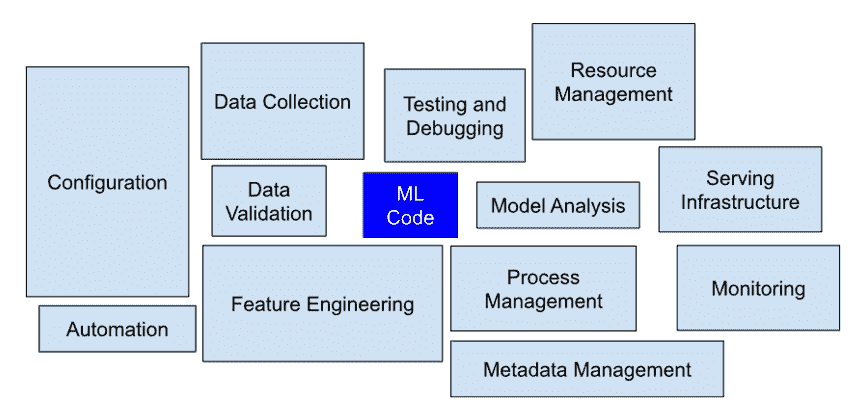

图 E.1 机器学习系统的不同组件[[1]](#ftn1)

在 IT 行业，速度、可靠性和信息获取是成功的关键组成部分。无论你的公司从事哪个行业，都需要 IT 灵活性。当我们谈论基于 AI/ML 的解决方案和产品时，这一点变得更加重要。今天，大多数行业都是手动执行 ML 任务，导致在构建 ML 模型和其部署之间出现巨大的时间差距（图 E.2）。收集的数据被准备和处理（归一化、特征工程等），以便可以输入到模型中。模型被训练，然后根据各种指标和技术进行评估；一旦模型满足要求，它就会被发送到模型注册表，在那里它被容器化以供服务。

从数据分析到模型服务的每一步都是手动执行的，从一个步骤到另一个步骤的过渡也是手动的。数据科学家与运维团队分开工作；他们将训练好的模型交给开发团队，然后开发团队将其部署到他们的 API 基础设施中。这可能导致训练-服务偏差[^([2])](#ftn2)——即模型在训练期间和部署期间的性能差异。

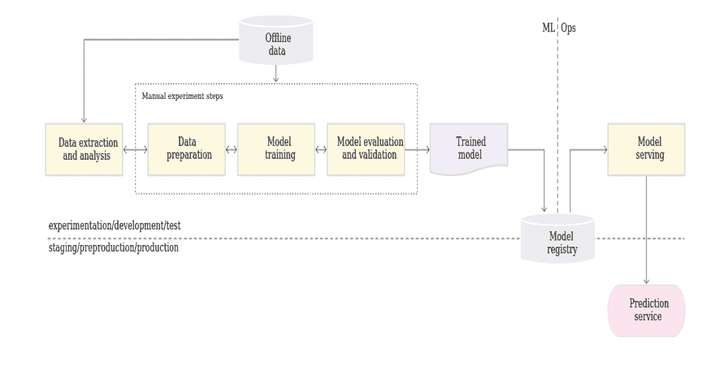

图 E.2 机器学习工作流程[[3]](#ftn3)

此外，由于模型开发与其最终部署是分开的，因此发布迭代频率较低。此外，最大的障碍是缺乏主动性能监控。预测服务不跟踪或维护模型预测的日志，这些预测对于检测模型性能下降或行为漂移是必要的。理论上，如果模型很少改变或训练，这个手动过程可能是足够的。然而，在实践中，模型在现实世界部署时往往失败[^([4])](#ftn4)。

失败的原因是多方面的：

+   模型过时：随着时间的推移，模型的准确性下降，在经典的机器学习流程中，没有持续监控来检测模型性能的下降并纠正它。然而，最终用户却承受着痛苦。想象一下，你正在为一个时尚屋提供服务，根据客户的过去购买和时尚趋势建议新的服装设计。时尚随着时间的推移而急剧变化；在秋季流行的颜色在冬天就不再适用了。如果你的模型没有摄取最新的时尚数据并据此向客户提供推荐，客户会抱怨——访问网站的用户会减少，经过一段时间延迟后，业务团队会注意到，然后在确定问题后，你会被要求更新模型到最新数据。如果有一种持续监控模型性能的选项，并且有系统来对新获得的数据实施持续训练（图 3），这种情况是可以避免的。

    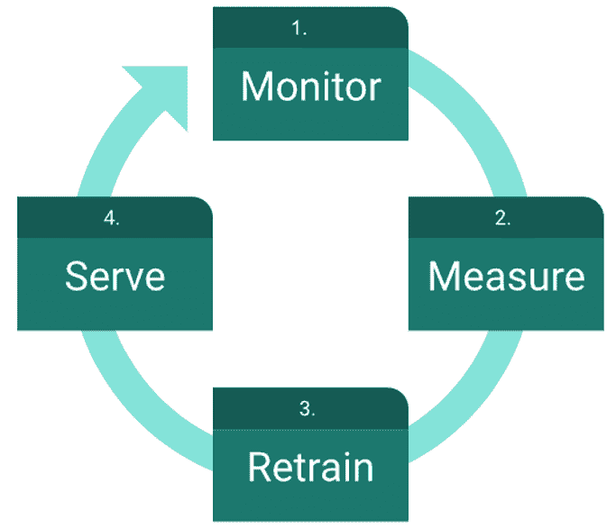

    图 E.3 持续训练

+   数据漂移：训练数据集和测试数据集中输入特征与输出的联合分布之间的差异可能导致数据集漂移[2]。当模型部署时，现实世界的数据分布与训练数据集相同，但随着时间的推移，分布发生了变化。假设你基于当时可用的数据构建了一个用于检测网络入侵的模型。六个月过去了，你认为它还会像部署时那样高效吗？可能会，但可能性不大，因为随着时间的推移，模型可能会迅速偏离，在互联网世界中——六个月几乎相当于六代！如果有机会获取最近数据的指标切片，这个问题是可以解决的。

+   反馈循环：可能存在无意识的反馈，其中模型的预测最终影响了其自身的训练数据。例如，假设你为一家音乐流媒体公司工作，该公司使用一个基于用户过去收听历史和资料推荐新音乐专辑的系统。系统以超过 70%的置信度推荐专辑。公司决定为用户提供喜欢或不喜欢音乐专辑的功能。最初，你会感到非常高兴，因为推荐的专辑越来越受欢迎，但随着时间的推移，查看历史将影响那个模型预测，并且不知不觉中，系统会越来越多地推荐用户之前听过的类似音乐，而忽略了用户可能喜欢的新音乐。为了减轻这个问题，持续监控系统指标将是有帮助的。

+   要了解更多关于机器学习模型产生的技术债务，我建议读者阅读 Sculley 等人撰写的论文《机器学习：技术债务的高息信用卡》。在论文中，他们详细讨论了机器学习中的技术债务，以及使用 AI/ML 解决方案的系统相关的维护成本。

    虽然消除技术债务是不可能的，甚至是不必要的，但整体方法可以减少债务。所需的是一个允许将标准 DevOps 管道与我们的机器学习工作流程集成的系统——即 ML 管道自动化：“MLOps”。让我们看看 Anthos 如何促进 MLOps。

+   在混合和多云环境中运行 AI/ML 应用程序：Anthos，一个托管的应用程序平台，允许您通过管理本地和云端的架构以及数据和安全模型来方便且高效地管理整个 AI/ML 产品生命周期。传统上，AI 工程师在不同的环境中开发机器学习代码，这些环境有不同的集群、依赖关系，甚至基础设施需求（例如，训练是计算密集型的，通常需要 GPU）。一旦模型完全训练完成，开发团队将其带入下一个阶段——部署和生产阶段的基础设施非常不同（部署可以在 CPU 上进行）。Anthos 提供的基础设施抽象提供了急需的可移植性；它允许用户高效且安全地构建和运行 AI/ML 应用程序。Anthos 的真正混合云架构让您可以在任何地方构建和部署代码，而无需进行任何更改。使用 Anthos 混合架构，您可以在本地和云端开发并运行一些代码块。Anthos 让您能够在混合和多云环境中构建、测试和运行您的 AI/ML 应用程序。

+   使用 Anthos GKE 管理 CPU/GPU 集群：使用 Anthos 进行您的 AI/ML 工作流程的另一个优点是 Anthos 提供的 GPU 支持。与全球最大的 GPU 制造商 NVIDIA 合作，Google 的 Anthos 使用 NVIDIA GPU 运营商来部署启用 Kubernetes 上 GPU 所需的 GPU 驱动程序。这为用户提供了一个广泛的 GPU 选择，如 V100、T4 和 P4 GPU。使用 Anthos，您因此可以轻松管理本地现有的 GPU，甚至支持您未来做出的任何 GPU 投资。如果您需要更多的计算资源，还可以将工作负载转移到集群中。因此，使用 Anthos GKE，您可以轻松管理本地和云端内的 GPU/CPU 集群。

+   使用 ASM 保护数据和模型：数据和模型的安全性至关重要。Anthos ASM 允许您配置整个工作环境的安全访问权限。关于 Anthos 服务网格的章节详细介绍了如何使用它来提供弹性、可扩展、安全和可管理的服务。

+   使用 Cloud Run 在云端部署 AI/ML：最后，可以直接在云运行上部署训练好的容器化模型，这是 Google 的无服务器容器即服务平台。

在接下来的章节中，我们将看到如何利用 Anthos 和 GCP 工具（如 CloudRun、TensorFlow Extend）以及操作编排工具（如 Kubeflow 和 Vertex AI），我们可以解决核心 MLOps 问题，如可移植性、可重复性、可组合性、敏捷性、版本控制和构建生产就绪的 AI/ML 解决方案。让我们首先从理解我们所说的完整机器学习管道自动化究竟是什么开始。

## E.2 机器学习管道自动化

在上一节（图 E.2）中，我们详细介绍了从构思到生产交付机器学习（ML）项目的各个步骤。这些步骤中的每一个都可以手动完成或通过自动管道完成。在本节中，我们将探讨如何自动化这些步骤。这些步骤的自动化程度决定了训练新模型与部署之间的时间间隔，并有助于解决上一节中讨论的挑战。自动化的机器学习（ML）管道应该能够：

+   允许参与产品开发的各个团队独立工作。理想情况下，许多团队参与人工智能/机器学习（AI/ML）工作流程，从数据收集、数据摄入、模型开发到模型部署。如引言部分所述，任何一个团队的任何变化都会影响其他所有团队（CACE）。理想的机器学习（ML）管道自动化应该允许团队在各个组件上独立工作，而不受其他团队的干扰。

+   主动监控生产中的模型。构建模型并不是真正的挑战。真正的挑战在于保持模型在生产中的准确性。如果生产中的模型得到积极监控——维护日志并在模型性能低于阈值时生成触发器，这是可能的。这将允许你检测到性能的任何下降。这可以通过执行在线模型验证步骤来完成。

+   适应数据漂移，它应该随着新数据的到来而演进新的数据模式。这可以通过在生产管道中添加自动数据验证步骤来实现。任何数据模式（缺失特征或特征的不期望值）的偏差都应触发数据科学团队进行调查，而任何数据统计特性的重大变化都应触发重新训练模型的触发器。

+   在人工智能/机器学习领域，每周都会有新的模型架构出现，你可能对尝试最新的模型或调整超参数感兴趣。自动化的管道应该允许进行持续训练（CT）。当生产模型低于其性能阈值或观察到数据漂移时，CT 也变得必要。

+   此外，可重复性是人工智能领域的一个大问题，以至于顶级人工智能会议 NeurIPS 已经设立了可重复性主席[^([6])](#ftn6)。目标是研究人员提交可重复性清单，以便其他人能够重现结果。使用模块化组件不仅允许团队独立工作，而且在不影响其他团队的情况下进行更改。它允许团队将问题缩小到特定的组件，从而有助于可重复性。

+   最后，为了在生产级别实现快速且可靠的更新，应该有一个强大的持续集成/持续部署（CI/CD）系统。快速、可靠和安全地交付人工智能/机器学习（AI/ML）解决方案可以帮助提升您组织的性能。

+   在你将模型服务于实时流量之前，你可能还想进行 A/B 测试；你可以通过配置新模型服务于 10-20%的实时流量来实现。如果新模型的表现优于旧模型，你可以将所有流量都导向它；否则，回滚到旧模型。

从本质上讲，我们需要 MLOps - 将机器学习（ML）与 DevOps（Ops）相结合 - 一种统一的工程解决方案，它将机器学习系统开发和机器学习系统操作统一起来。这将允许数据科学家探索各种模型架构，实验特征工程技术和超参数，并将更改自动推送到部署阶段。下面的图 E.4 展示了机器学习 CI/CD 自动化管道的不同阶段。我们可以看到完整的自动化管道包含六个阶段：

1.  开发/实验：在这个阶段，数据科学家迭代地尝试各种机器学习算法和架构。一旦满意，他们就会将模型的源代码推送到源代码仓库。

1.  管道持续集成：这个阶段涉及构建源代码，识别并输出需要在后续阶段部署的包、可执行文件和工件。

1.  管道持续交付：阶段 2 产生的工件被部署到目标环境。

1.  持续训练：根据设置的触发器，训练好的模型在这个阶段被推送到模型注册库。

1.  模型持续交付：在这个阶段，我们得到了一个已部署的模型预测服务。

1.  监控：在这个阶段，收集模型性能统计数据并用于设置触发器以执行管道或执行新的实验周期。

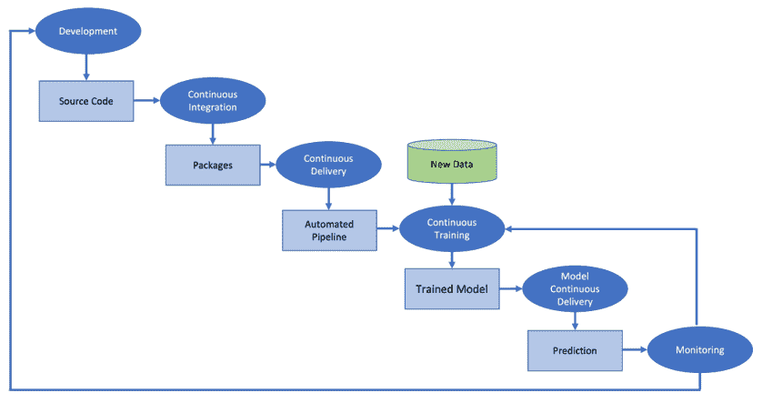

图 E.4 自动化机器学习管道的阶段

在接下来的章节中，我们将介绍一些可以用于实现 MLOps 的 GCP 工具。我们将讨论 Cloud Run、TensorFlow Extend 和 Kubeflow。本章的重点将是 Kubeflow 和 Vertex AI。

在我们深入本章之前，我们应该参考一些重要概念：

+   Cloud Run，已在另一章节中介绍。如您所知，Cloud Run 是 Google 的无服务器容器即服务平台。Cloud Run 允许您在容器中运行整个应用程序。Cloud Run 可以用来部署任何无状态的 HTTP 容器。您只需指定一个包含所有依赖项以及您想要运行的机器学习预测代码的 Docker 文件，将它们打包成容器，然后，服务就部署在云端了。最近[^([7])](#ftn7)，Google 扩展了 Cloud Run 的功能，包括端到端 HTTP/2 连接、WebSocket 兼容性和双向 gRPC 流。因此，现在您可以使用 Cloud Run 部署和运行各种网络服务。虽然 Cloud Run 可扩展、弹性好，并且提供简单的 AI/ML 应用部署，但它也有一些限制。例如，可以请求的最大 vCPU 数量[^([8])](#ftn8)限制为 4（在撰写本书时，可以选择预览增加到 8vCPU 的选项）。

+   将 Cloud Run 与 Cloud Build 集成，您可以自动化整个流程，并快速为您的 AI/ML 工作流程实现 CI/CD。与 Cloud Build 相关的概念——GCP 原生的 CI/CD 平台——将在另一章节中介绍。Cloud Build 基于容器技术。有关容器注册和构建容器镜像的详细信息将在另一章节中介绍。

## E.3 TensorFlow 扩展

TensorFlow 扩展 (TFX) 是一个可扩展的端到端平台，用于在 TensorFlow 中开发和部署 AI/ML 工作流程。TFX 包括用于数据验证、数据预处理、特征工程、构建和训练 AI/ML 模型、评估模型性能以及最终作为 REST 和 gRPC API 提供模型的库。您可以通过了解许多 Google 产品[^([9])](#ftn9)，如 Chrome、Google 搜索、邮件等，都是通过 TFX 驱动的来判断 TFX 的价值。Google 广泛使用 TFX，Airbnb、PayPal 和 Twitter 也同样如此。作为平台，TFX 使用各种库来实现端到端 ML 工作流程。让我们看看这些库以及它们能做什么：

+   TensorFlow 数据验证 (TFDV)：这个库包含模块，允许您探索和验证您的数据。它允许您可视化模型训练和/或测试所使用的数据。它提供的统计摘要可以用来检测数据中存在的任何异常。它具有自动模式生成功能，允许您获取数据预期范围的描述。此外，当比较不同的实验和运行时，您还可以用它来识别数据漂移。

+   TensorFlow Transform (TFT)：借助 TFT，您可以在规模上预处理您的数据。TFT 库提供的函数可用于分析数据、转换数据并执行高级特征工程任务。使用 TFT 的优势在于预处理步骤是模块化的。Apache Beam 和 Tensorflow 的混合体允许您处理整个数据集，例如获取最大值和最小值或所有可能的类别，并将数据批量作为张量进行操作。它使用 Google DataFlow 云服务。

+   TensorFlow Estimator 和 Keras：这是您可以使用来构建和训练模型的标准 TensorFlow 框架。它还为您提供了访问一系列预训练模型的机会。

+   TensorFlow 模型分析 (TFMA)：它允许您在分布式方式下，使用您在训练时定义的相同模型评估指标，在大量数据上评估您的训练模型。它有助于分析和理解训练模型。

+   TensorFlow Serving (TFServing)：最后，如果您对您的训练模型感到满意，您可以将模型作为 REST 和 gRPC API 在线提供服务。

下面的图示显示了不同的库如何集成形成一个基于 TFX 的 AI/ML 流程。

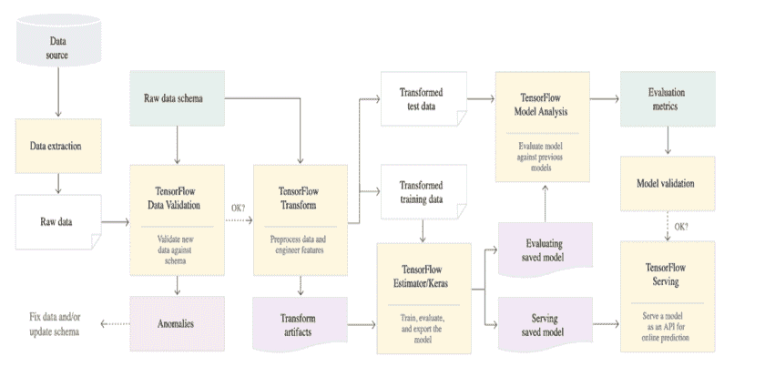

图 E.5 基于 TFX 的 AI/ML 流程[[10]](#ftn10)

虽然可以手动运行上述每个步骤，但正如我们在上一节中讨论的，对于 MLOps，我们希望这些步骤能够自动运行。为此，我们需要一个编排工具，一个将 ML 工作流程的这些不同块（组件）连接在一起的工具——这就是 KubeFlow 发挥作用的地方，它将是下一节的主题。

## E.4 Kubeflow：简介

Kubeflow 允许您管理整个 AI/ML 生命周期。它是一个 Kubernetes 原生的 OSS（运营支持系统）平台，用于在混合和多云环境中开发、部署和管理可扩展的端到端机器学习工作负载。Kubeflow 流程，作为 Kubeflow 服务的一部分，帮助您自动化整个 AI/ML 生命周期——换句话说，让您能够组合、编排和自动化您的 AI/ML 工作负载。

这是一个开源项目，正如您从下面的提交图像中可以看到——它是一个活跃且不断发展的项目。Kubeflow 的主要目标之一，即构建 Kubeflow，是使每个人都能轻松地开发、部署和管理可移植、可扩展的机器学习。

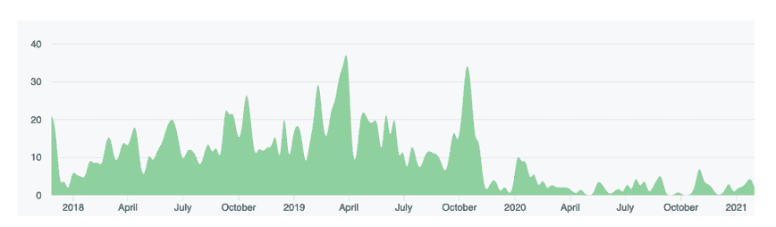

图 E.6 如其在 Github ([`github.com/kubeflow/kubeflow/graphs/contributors`](https://github.com/kubeflow/kubeflow/graphs/contributors)) 仓库中所示，2021 年 2 月 4 日对 Kubeflow 项目的提交[[10]](#ftn10)。

最好的部分是，即使您对 Kubernetes 不太了解，也可以使用 Kubeflow API 构建您的 AI/ML 工作流程。您可以在本地机器上使用 Kubeflow，在任何云（GCP、Azure AWS）上，您可以选择单个节点或集群，它被构建成能够在各种环境中一致运行。2020 年 11 月，Google 发布了 Kubeflow 1.2 版本，允许组织在 Anthos 跨环境中运行他们的机器学习工作流程。Kubeflow 围绕以下三个关键原则构建：

+   可组合性：Kubeflow 扩展了 Kubernetes 的能力，使用机器学习特定框架（如 TensorFlow、PyTorch 等）和库（Scikit-Learn、Pandas 等）运行独立和可配置的步骤。这使得您可以为 AI/ML 工作流程中涉及的不同任务使用各种库，例如，在进行数据处理步骤时，您可能需要 TensorFlow 的不同版本，而在训练期间，您可能使用的是不同版本。因此，AI/ML 工作流程中的每个任务都可以独立容器化并处理。

+   可移植性：您可以在任何您想要的地方运行 AI/ML 工作流程的所有部分——在云上、在本地，或者在度假时在您的笔记本电脑上——唯一条件是它们都在运行 Kubeflow。Kubeflow 在您的 AI/ML 项目和系统之间创建了一个抽象层，从而使得在 Kubeflow 安装的地方运行 ML 项目成为可能。

+   可伸缩性：当您需要更多资源时，可以拥有它们，当不需要时，可以释放它们。Kubeflow 扩展了 Kubernetes 的能力，以最大化可用资源，并以尽可能少的手动努力进行扩展。

在本节中，我们将学习如何在 Anthos 提供的云原生生态系统中使用 Kubeflow，该系统在 Kubernetes 上运行。使用 Kubeflow 的一些优势：

+   标准化通用基础设施

+   利用开源云原生生态系统实现整个 AI/ML 生命周期的开发、编排、部署和运行可伸缩和可移植的 AI/ML 工作负载。

+   在混合和多云环境中运行 AI/ML 工作流程。

+   此外，当在 GKE 上运行时，您可以利用 GKE 的企业级安全、日志记录、自动扩展和标识功能。

Kubeflow 向集群中添加了 CRDs（自定义资源定义）。Kubeflow 利用容器和 Kubernetes，因此可以在 Kubernetes 已经运行的地方使用，尤其是在使用 Anthos 和 GKE 的本地环境中。以下列出了一些 Kubeflow 应用程序和组件，可用于在 Kubernetes 之上安排您的机器学习工作流程：

+   Jupyter Notebook：对于人工智能/机器学习从业者来说，Jupyter 笔记本[^([11])](#ftn11)是快速数据分析的事实上工具。大多数数据科学项目都是从 Jupyter 笔记本开始的。它是现代云原生机器学习管道的起点。Kubeflow 笔记本允许您在本地运行实验，或者如果您想的话，可以取用数据、训练模型，甚至通过笔记本部署它。笔记本与基础设施的其他部分集成良好，例如使用集群 IP 地址访问 Kubeflow 集群中的其他服务。它还与访问控制和身份验证集成。Kubeflow 允许用户设置多个笔记本服务器，每个服务器可以运行多个笔记本。每个笔记本服务器属于一个单独的命名空间，具体取决于该服务器的项目或团队。Kubeflow 通过命名空间提供多用户支持，这使得协作和管理访问权限变得更容易。在 Kubeflow 上使用笔记本允许您动态扩展资源。最好的部分是，它包含了您在 Jupyter 中训练模型可能需要的所有插件/依赖项，包括 TensorBoard 可视化以及您可能需要的自定义计算资源。Kubeflow 笔记本在本地提供与 Jupyter Notebook 相同的体验，并增加了可扩展性、访问控制、协作以及直接提交作业到 Kubernetes 集群的额外好处。

+   Kubeflow UI：一个用于运行管道、创建和启动实验、探索图、配置和管道输出的用户界面，甚至可以安排运行。

+   Katib：超参数调优是人工智能/机器学习工作流程中的关键步骤。找到合适的超参数空间可能需要大量努力。Katib 支持超参数调优、早期停止和神经网络架构搜索。它帮助用户在选择的指标周围找到最佳的生产配置。

+   KubeFlow Pipelines：Kubeflow 管道允许您构建一系列步骤，从收集数据到部署训练好的模型。它是基于容器的，因此每个步骤都是可移植和可扩展的。您可以使用 Kubeflow 管道编排端到端的机器学习工作流程。

+   元数据：它有助于跟踪和管理人工智能/机器学习工作流程产生的元数据。这种元数据记录可用于实时评估模型。它可以帮助识别数据漂移或训练-服务偏差。它还可以用于审计和合规性——您可以了解哪些模型在生产中以及它们的运行情况。元数据组件默认安装于 Kubeflow 中。许多 Kubeflow 组件会写入元数据服务器，此外，您还可以使用代码向元数据服务器写入。您可以使用 Kubeflow UI 通过工件存储查看元数据。

+   KFserving：它允许在任意框架上提供 AI/ML 模型。它包括自动缩放、网络和金丝雀发布等功能。它提供了一个易于使用的界面来在生产中提供模型。使用 YAML 文件，您可以配置用于提供和计算的资源。金丝雀发布允许您在不影响用户体验的情况下测试和更新您的模型。

+   Fairing：一个 Python 包，允许您在混合云环境中构建、训练和部署您的 AI/ML 模型。

总结来说，Kubeflow 提供了一套经过精心挑选的兼容工具和工件，这些工具和工件是运行生产级 AI/ML 应用的核心。它允许企业在整个机器学习生命周期中采用通用的建模基础设施。让我们深入了解 Kubeflow 包含的核心应用和组件集。

### E.4.1 Kubeflow 深入探讨

到现在为止，您已经知道如何使用集群、应用程序、Anthos Service Mesh 和 Anthos Config Management 部署您的 Anthos 环境。您已经选择了项目并启用了服务管理 API。此外，请确保启用了 Istio ingress 网关服务以处理流量。这将用于 Anthos 服务网格向其入站流量添加更复杂的路由。要继续深入探讨，您需要安装 Kubeflow[^([12])](#ftn12)。由于 Kubeflow 使用 Kustomize[^([13])](#ftn13)来管理不同环境中的部署。因此，要在您的集群中使用 Kubeflow，首先要安装 Kustomize[^([14])](#ftn14)。

您可以使用 kubectl get all 命令验证集群上部署的所有 Kubeflow 资源，下面您可以查看 get all 命令的输出摘要：

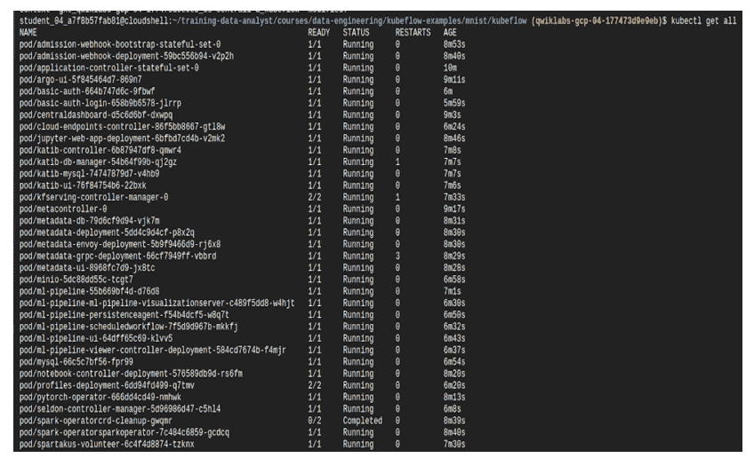

图 E.7 kubectl get all 命令的输出

现在，让我们深入探讨 Kubeflow 的不同组件和功能。您还可以使用 Anthos Config Management 来安装和管理 Kubeflow[^([15])](#ftn15)。

最简单的方法是尝试来自 GCP Marketplace 的解决方案，如 MiniKF 或 Kubeflow pipelines。GCP 上的 AI 平台提供了一个简单的图形界面，用于创建集群并为您的 ML/AI 工作流程安装 kubeflow pipelines。只需点击三次，您就可以拥有一个可供使用的 kubeflow 集群。

### E.4.2 Kubeflow 中央仪表板

就像所有其他 GCP 服务一样，Kubeflow 有一个中央仪表板，它提供了对您集群中安装的组件的快速概述。仪表板提供了一个酷炫的图形用户界面，您可以使用它来运行管道、创建和启动实验、探索图、配置以及管道的输出，甚至安排运行。

Kubeflow 中央仪表板可以通过以下模式的 URL 访问：

```
https://<KF_NAME>.endpoints.<project-id>.cloud.goog/
```

您还可以使用 Kubeflow 命令行 kubectl 访问 UI。您首先需要使用以下命令设置到 Istio 网关的端口转发[^([16])](#ftn16)：

```
kubectl port-forward -n <name_space> svc/istio-ingressgateway 8080:80 
```

然后使用以下命令访问中央仪表板：

```
http://localhost:8080/
```

记住，你应该有一个受 IAP 保护的 web 应用程序用户角色才能访问 Kubeflow UI。此外，你应该已配置 Istio Ingress 以接受 HTTPS 流量。中心仪表板包括以下内容：

+   主页：用于在各个 Kubeflow 组件之间导航的中心仪表板。

+   管道

+   笔记本服务器

+   Katib

+   艺术品存储库

+   管理贡献者

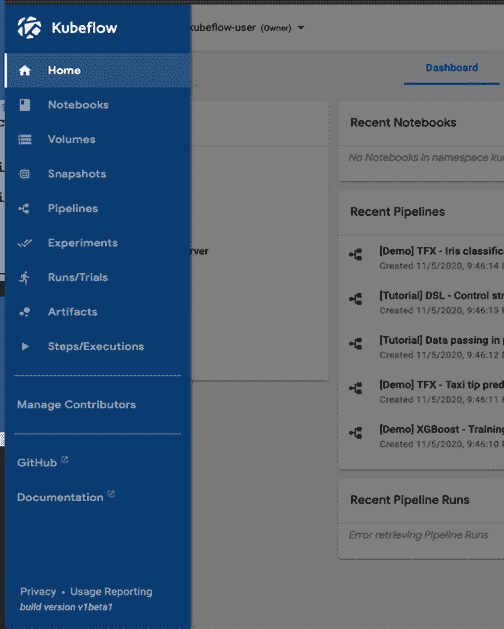

图 E.8 使用 MiniKF 部署的 Kubeflow 中心仪表板

我们将在下一节中探讨这些组件。

### E.4.3 Kubeflow 管道

Kubeflow 管道，Kubeflow 的一项服务，允许你编排你的 AI/ML 工作负载。它可以与 Kubeflow 一起安装或作为独立服务安装。GCP 市场提供了一个单点点击即可轻松安装 Kubeflow 管道的选项。正如我们前面所讨论的，构建 AI/ML 解决方案是一个迭代过程，因此以有序、组织的方式跟踪更改非常重要——跟踪更改、监控和版本控制可能具有挑战性。Kubeflow 管道通过为你提供易于组合、共享和可重复的 AI/ML 工作流程来简化此过程。Kubeflow 管道允许完全自动化模型的训练和调整过程。为此，Kubeflow 管道利用机器学习过程可以被分解成一系列标准步骤的事实，这些步骤可以以有向图的形式排列（图 E.8）。虽然过程看起来很简单，但使问题复杂化的是，它是一个迭代过程，AI 科学家需要尝试多种预处理、特征提取、模型类型等。每次这样的实验都会产生一个不同的训练模型，这些不同的训练模型在所选指标上的性能进行比较。然后，最佳模型被保存并部署到生产环境中。为了能够持续执行此操作，DevOps 需要基础设施足够灵活，以便多个实验可以在同一环境中共存。Kubeflow 通过 Kubeflow 管道实现了这一点。图 E.9 中的每个框都是一个作为 Docker 容器概念化的自包含代码。由于容器是可移植的，因此每个任务都继承了相同的可移植性。

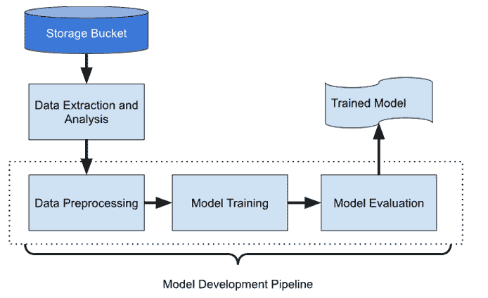

图 E.9 将机器学习过程作为有向图

任务容器化提供了可移植性、可重复性和封装性。每个容器化任务都可以调用其他 GCP 服务，如 Dataflow、Dataproc 等。Kubeflow 管道中的每个任务都是一个自包含的代码，打包成 Docker 镜像，包含其输入（参数）和输出。这种任务的容器化——允许可移植性——因为它们是自包含的代码——你可以在任何地方运行它们。此外，你可以在另一个 AI/ML 管道中使用相同的任务——任务可以被重用。

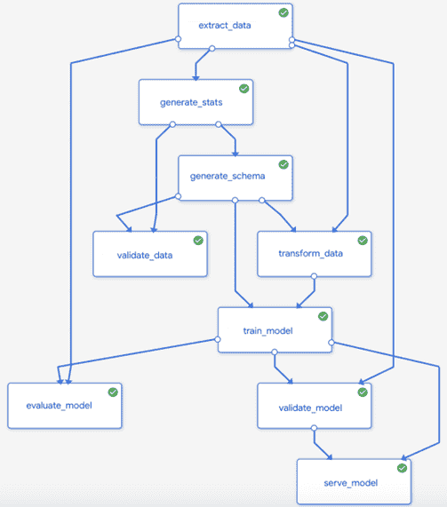

图 E.10 Kubeflow 管道的示例图

Kubeflow 管道平台由五个主要元素组成：

+   一个用于创建、管理和跟踪实验、作业和运行的用户界面。

+   它在后台使用 Kubernetes 资源，并利用 Argo[^([18])](#ftn18)，在 Kubernetes 上编排可移植和可扩展的 ML 作业。

+   它提供了一个 Python SDK，用于定义和操作管道和组件。

+   Jupyter Notebooks，您可以使用 Python SDK 与系统交互。

+   以及 ML 元数据，它存储有关不同执行、模型、数据集使用和其他工件的信息，本质上是一种元数据日志。这种元数据日志允许您可视化度量输出并比较不同运行的结果。

Python SDK 允许用户通过代码描述管道，也可以使用 Kubeflow UI 可视化管道并查看不同的任务。将 ML 管道配置为容器化任务，以有向无环图（DAG）的形式排列，可以并行运行多个实验。此外，Kubeflow 允许用户重用预构建的代码，这节省了大量时间，因为无需重新发明轮子。GCP 还提供了 AI Hub，其中包含各种即插即用的可重用管道组件。图 E.9 展示了 Kubeflow 管道的示例图。

Kubeflow 使用领域特定语言（DSL）来描述您的管道和组件（图 E.10）。可以使用 kfp.dsl.pipeline 装饰器指定 Kubeflow 组件。它包含元数据字段，您可以在此处指定其名称和用途。组件的参数描述了该组件将接受哪些输入。函数的主体描述了组件中实际要执行的 Kubeflow 操作。这些操作是在任务运行时执行的 Docker 容器。

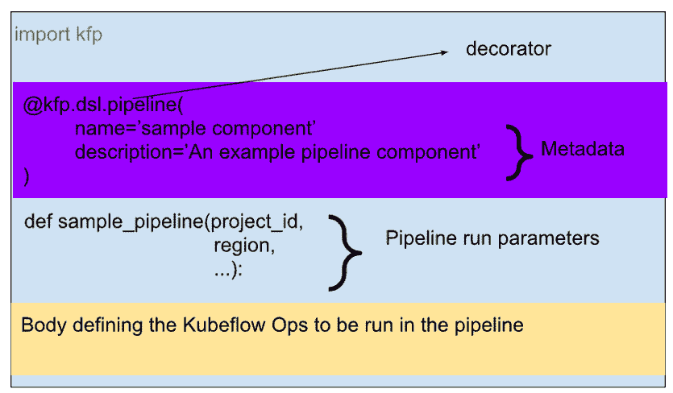

图 E.11 Kubeflow 组件的基本结构

Kubeflow 管道支持三种类型的组件：

+   预构建组件：这些是在 GitHub 仓库中可用的预构建组件：[`github.com/kubeflow/pipelines/tree/master/components`](https://github.com/kubeflow/pipelines/tree/master/components)。这里提供了广泛的可用于不同平台的组件，从预处理、训练到部署机器学习模型。要使用它们，您只需要组件.yaml 的 URI，这是组件的描述。它包含容器镜像的 URI 和组件运行参数。这些参数传递给管道代码中的相应 Kubeflow 操作。其中一个预构建组件可以代表所有操作，如训练、调优和部署模型。

+   轻量级 Python 组件：如果你有小的 Python 函数，为每个函数编写完整的 Dockerfile 是没有意义的，Kubeflow SDK 允许你使用 func_to_container_op 辅助函数（在 kfp.components 中定义）将这些轻量级函数包装成 Kubeflow 组件。我们将函数作为输入传递给 func_to_container_op 和一个基础镜像。

+   自定义组件：如果我们用其他语言（例如 Go）编写了函数，可以使用自定义构建组件。在这种情况下，你需要编写描述组件行为的代码，创建容器的代码，以及代码的所有依赖项。

让我们通过一个简单的例子来演示如何创建 Kubeflow 组件。作为第一步，你需要将你的组件代码定义为独立的 Python 函数，例如，我们定义一个函数来乘以两个数字：

```
def mul_num(a: float, b: float) -> float:
return a*b
```

接下来，使用 kfp.components.create_from_func 生成组件规范 YAML。

```
mul_op = kfp.components.create_from_func(mul_num, output_component_file= ’mul.yaml’ )
```

YAML 文件是可重用的，也就是说，你可以与他人共享它，或者在其他 AI/ML 管道中重用它。现在你可以创建你的管道：

```
@kfp.dsl.pipeline(
name = ’multiply numbers’, description = ‘An example to show how to build Kubeflow pipeline’)
def mul_pipeline( a = 0.4, b = 0.2):
first_task = mul_op(a, 2)
second_task = mul_op(first_task,b)
```

最后，你可以使用 create_run_from_pipeline_func()创建一个管道运行。

### E.4.4 使用 Katib 进行超参数调整

在 AI/ML 工作流程中找到合适的超参数非常重要。AI 科学家花费数小时甚至数天来寻找合适的超参数。这项工作涉及频繁的实验。这通常具有挑战性和耗时。我们可以使用前一个章节中描述的预构建组件之一来自动化超参数调整的过程，或者我们可以使用 Kubeflow 上的 Katib 来完成同样的工作。

Katib 是一个可扩展的 Kubernetes 原生 AutoML 平台，它允许进行超参数调整和神经网络架构搜索。图 E.12 显示了 Katib 的设计。要了解更多关于它的工作原理，读者应参考论文《Katib：基于 Kubernetes 的分布式通用 AutoML 平台》。

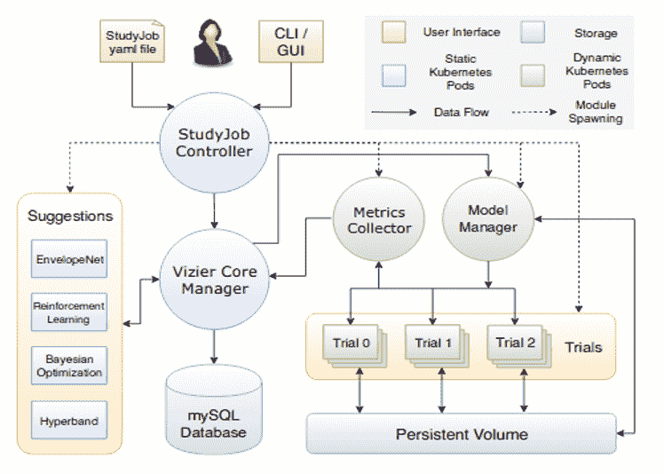

图 E.12 Katib 作为通用 AutoML 系统的设计[[19]](#ftn19)

Katib 允许你通过命令行（通过 YAML 文件规范）或使用 Jupyter Notebook 和 Python SDK 来定义超参数调整。它还提供了一个图形用户界面，你可以使用它来指定要调整的超参数并可视化结果。

图 E.13 显示了 Katib 的图形界面。


图 E.13 Katib 图形界面

Katib 允许你选择指标以及你是否想要最小化它或最大化它。你可以指定你想要调整的超参数。它允许你可视化整个实验的结果以及单个运行的结果。图 E.14 显示了以验证准确率作为指标，学习率、层数和优化器作为要调整的超参数的 Katib 运行结果。

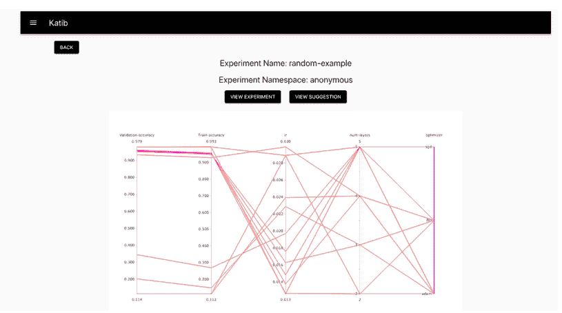

图 E.14 Katib 生成的超参数调整结果

## E.5 在 Kubeflow 上进行端到端机器学习

现在我们已经了解了 Kubeflow，是时候将其付诸实践了。我们将构建一个完整的管道，从数据摄取到使用 Kubeflow 的服务。由于本章的目的是讨论 Kubeflow，而不是 AI/ML 模型，我们将使用 MNIST 示例，并训练一个基本的模型来分类 MNIST 的手写数字，训练好的模型将部署在 Web 界面上。完整的代码可在仓库中找到：[`github.com/EnggSols/KubeFlow`](https://github.com/EnggSols/KubeFlow)。为了保持简单和成本效益，我们将使用仅 CPU 的训练，我们将使用命令行 Kubeflow。

确保所有环境变量都已正确设置，并且已启用 GKE API。训练好的模型将存储在存储桶中。如果您还没有，可以使用 gsutil 创建一个：

```
gsutil mb gs://${BUCKET_NAME}/
```

这里 BUCKET_NAME 是整个 GCS 中的唯一名称。我们使用 model.py 文件进行训练；这是一段相当简单的代码。对于 Kubeflow 平台，程序在训练后将训练好的模型上传到指定的路径，几乎没有变化。

现在要在 Kubeflow 上执行训练，我们首先需要构建一个容器镜像，以下是我们将从 GitHub 仓库中使用的 Dockerfile：

```
FROM tensorflow/tensorflow:1.15.2-py3
ADD model.py /opt/model.py
RUN chmod +x /opt/model.py

ENTRYPOINT ["/usr/local/bin/python"]  
CMD ["/opt/model.py"]
```

我们使用 docker build 命令来构建容器镜像。一旦构建完成，就将镜像推送到 Google 容器注册库，以便您可以在集群上运行它。在实际上传镜像之前，您可以使用 docker run 命令在本地检查模型是否确实正在运行：

```
docker run -it $IMAGE_PATH
```

您应该看到如图 14 所示的训练日志，这表明训练正在工作。

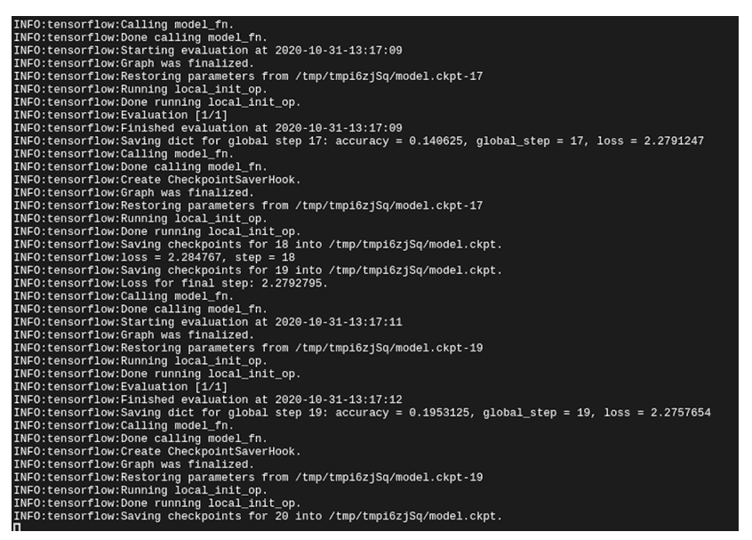

图 E.15 训练日志

如果您看到这个日志，这意味着您可以安全地将镜像推送到 GCS 注册库。现在镜像已推送，我们通过设置所需的训练参数来构建一个 Kustomize YAML 文件。

```
kustomize build .
```

图 E.16 显示了 Kustomize 构建命令的输出截图。

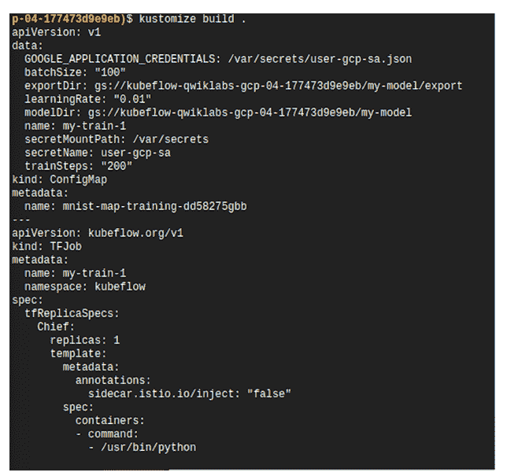

图 E.16 Kustomize 构建输出

最后，我们将这个 YAML 清单通过 kubectl 管道传递，这将在集群中部署训练作业。

```
kustomize build . | kubectl apply -f -
```

训练可能需要几分钟，在训练进行时，您可以检查存储桶以验证训练好的模型是否已上传。

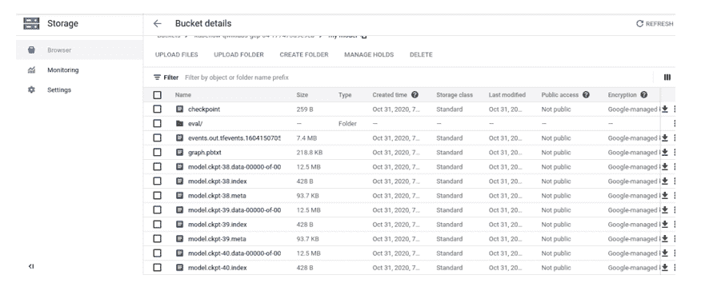

图 E.17 云存储桶，您可以看到保存的模型在此列出

与之前一样，创建用于服务的 Kustomize 清单 YAML，并将模型部署到服务器。现在剩下的唯一步骤是运行 Web UI，您可以通过使用 Web 前端清单来完成此操作。建立端口转发，以便您可以直接访问集群并查看 Web UI：

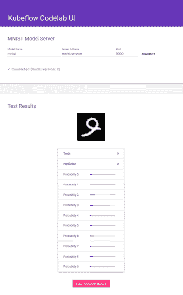

图 E.18 已部署模型

您可以使用随机图像进行测试，端到端 MNIST 分类器已部署。

## E.6 Vertex AI

Kubeflow 允许您编排 MLOps 工作流程，但仍然需要管理 Kubernetes 集群。更好的解决方案将是如果我们根本不需要担心集群的管理：介绍 Vertex AI Pipelines。Vertex AI 为机器学习工作流程的每一步提供工具：从管理数据集到不同方式的模型训练、评估、部署和预测。简而言之，Vertex AI 是 AI 需求的一站式商店。您可以在 Vertex AI 中使用 Kubeflow 管道或 TensorFlow 扩展管道。无论您是初学者，没有代码经验但有很好的想法使用 AI，还是经验丰富的 AI 工程师，Vertex AI 都有一些东西可以为您提供。作为一名初学者，您可以使用 Vertex AI 提供的 AutoML 功能，只需加载您的数据，使用 Vertex AI 提供的数据探索工具，然后使用 AutoML 训练模型。经验丰富的 AI 工程师可以构建自己的训练循环，在云上训练模型并使用端点进行部署。此外，您可以在本地训练模型，仅使用 Vertex AI 进行部署和监控。本质上，Vertex AI 为整个 AI/ML 工作流程提供了一个统一的接口（图 E.19）。

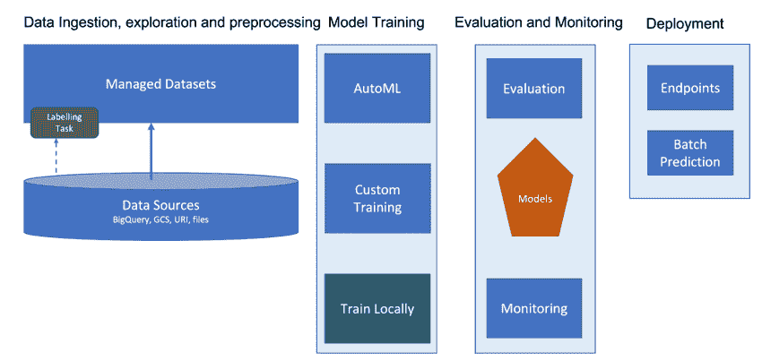

图 E.19 Vertex AI，完整的 AI/ML 工作流程统一接口

图 E.20 展示了 vertex AI 仪表板，在以下小节中，我们将探讨仪表板中的一些重要元素。

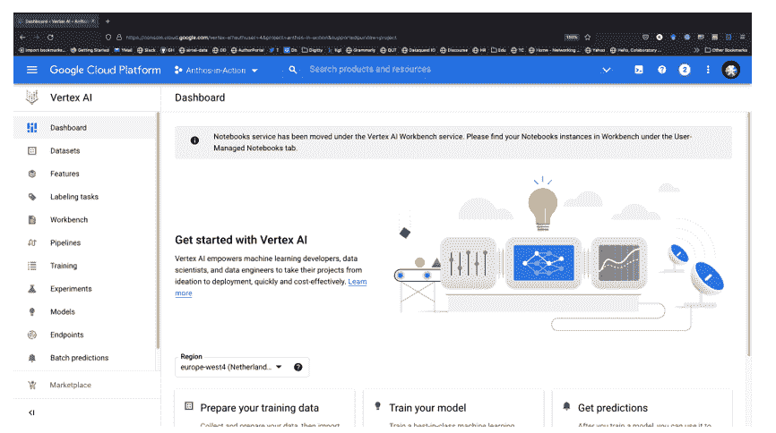

图 E.20 Vertex AI 仪表板

### E.6.1 数据集

Vertex AI 支持四种类型的管理数据类型：图像、视频、文本和表格数据。下表列出了 vertex-managed 数据集支持的 AI/ML 任务。

| 数据类型 | 支持的任务 |
| --- | --- |
| 图像 | 图像分类（单标签）图像分类（多标签）图像目标检测图像分割 |
| 视频 | 视频动作识别视频分类视频目标跟踪 |
| 文本 | 文本分类（单标签）文本分类（多标签）文本实体提取文本情感分析 |
| 表格 | 回归分类预测 |

对于图像、视频和文本数据集，如果您没有标签，您可以直接从您的计算机上传文件。如果有包含图像 URI 及其标签的文件，您可以从您的计算机导入文件。此外，您还可以从 Google 云存储导入数据。请记住，上传的数据将使用 Google Cloud Storage 存储您从计算机上传的文件。对于表格数据，Vertex AI 仅支持 csv 文件；您可以从您的计算机、云存储上传 csv 文件，或从 BigQuery 导入表或视图。

一旦指定了数据，Vertex AI 允许您浏览和分析数据。如果数据未标记，您可以在浏览器本身上浏览数据并分配标签。此外，Vertex AI 允许您手动或自动进行测试-训练验证分割。图 E.21 显示了使用 vertex AI 管理数据集服务对泰坦尼克号生存数据集进行分析。

Vertex AI 还为您提供了一个功能存储选项，您可以使用它来分析数据的特征，它可以帮助缓解训练/服务偏差 - 确保训练和服务的特征数据分布相同。功能存储还可以帮助检测模型/数据漂移。如果需要数据标注服务 - 这也通过 Vertex AI 提供。

### E.6.2 训练和实验

训练选项卡列出了您在 Vertex AI 平台上正在进行的和已经完成的全部训练作业。您还可以使用它来启动一个新的训练流程。整个过程非常直接；只需点击创建并遵循屏幕上的说明。如果您选择 AutoML，那么您可以选择用于训练的特征以及要忽略的特征；您还可以在表格数据选项卡上提及转换。还有一个选项可以选择目标函数。在做出所有选择后，只需决定您想要分配给训练的最大预算（最小为 1 小时）并开始训练。始终使用早期停止选项会更好，这样如果模型性能没有改进，训练就会停止（图 E.22）。

实验（Experiment）让您跟踪、可视化和比较机器学习实验，并与他人分享。

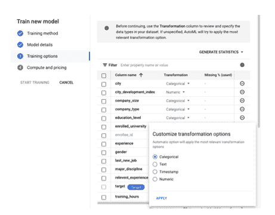

图 E.21 选择训练参数和转换

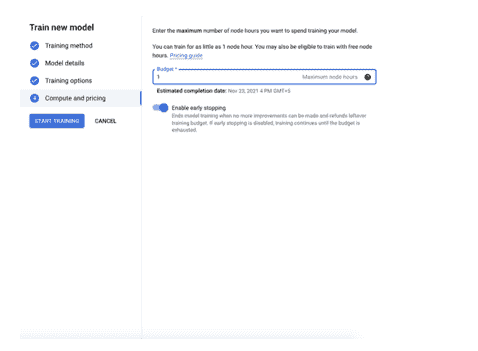

图 E.22 选择预算和早期停止

为了演示目的，我们使用了 HR 分析数据[^([20])](#ftn20) 来预测数据科学家是否会进行工作变动。我们使用除了注册 ID 以外的所有数据进行模型训练。数据文件包含一个目标列，说明数据科学家是否在寻找工作。

### E.6.3 模型和端点

所有训练模型的详细信息都提供在“模型”选项卡中。这些模型包括在测试数据集上对模型的评估（当使用托管数据集进行训练时）。不仅如此，在表格数据的情况下，还可以看到所有输入特征的特征重要性。这些信息以视觉和文本形式直接在仪表板上提供。

我们为模型训练设置了 1 个节点小时的预算。训练完成大约需要 1 小时 35 分钟。图 E.23 显示了 AutoML 在测试数据集上训练的模型评估，图 E.24 显示了相关的混淆矩阵。

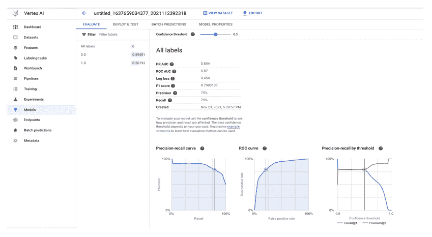

图 E.23 在测试数据集上对模型的评估

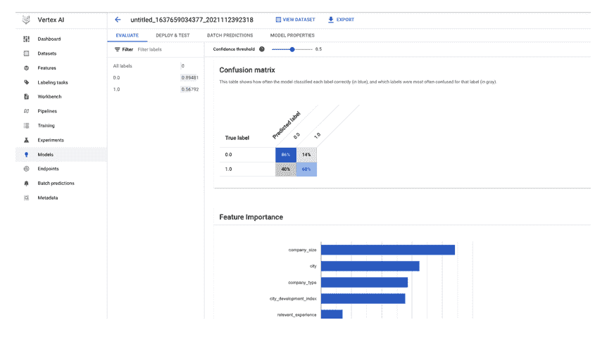

图 E.24 混淆矩阵和特征重要性

可以直接从仪表板检查模型的预测。要测试模型，需要将模型部署到端点。Vertex AI 还提供了将模型（TensorFlow SavedModel 格式）保存到容器中的选项，您可以使用它来在其他本地或云服务中启动模型。让我们选择部署模型，点击“部署到端点”按钮。部署时，您需要选择以下选项：

+   为端点命名。

+   选择流量分配，对于单个模型是 100%，但如果您有多个模型，则可以分割流量。

+   选择最小计算节点数。

+   选择机器类型。

+   选择是否需要模型可解释性选项，对于表格数据，Vertex AI 提供了样本 Shapley 可解释性方法。

+   选择是否要监控模型的特征漂移、训练-服务偏差，并设置警报阈值。

部署完成后需要几分钟时间。现在我们已准备好测试预测（批量预测也受支持）。在图 E.25 中，您可以看到对于所选输入，数据科学家不寻求置信度为 0.67 的职位。可以使用 REST API 或通过 Python 客户端向模型发出样本请求。Vertex AI 端点包括用于样本请求的必要代码。

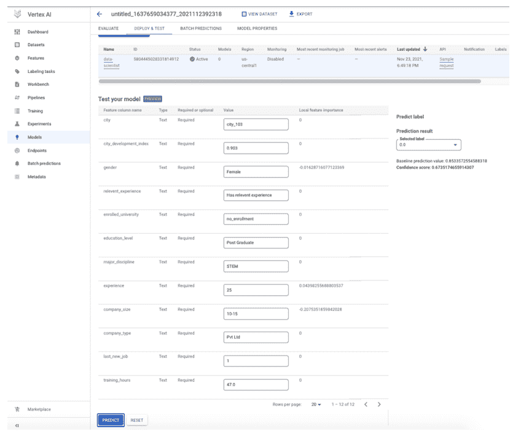

图 E.25 模型预测

您项目中的所有模型和端点分别列在“模型”和“端点”选项卡的仪表板中。

### E.6.4 工作台

Vertex AI 通过工作台提供 JupyterLab 和笔记本支持。用户可以选择托管笔记本或自定义笔记本。托管笔记本包含所有流行的深度学习框架和模块，您还可以使用 Docker 镜像添加自己的 Jupyter Kernels。用户管理的笔记本提供广泛的基环境。用户在设置笔记本时可以选择 vCPUs 和 GPU。如果您想开始使用 Vertex AI，托管笔记本是个不错的选择；如果您想更好地控制环境，用户管理的笔记本是个好选择。一旦创建笔记本，点击“打开 JupyterLab”链接即可访问您的 Jupyter Lab 环境。

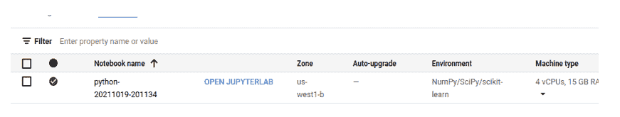

图 E.26 Google Cloud Console 中的托管笔记本

Vertex AI 工作台可用于进一步探索数据、构建和训练模型，以及作为 TFx 或 Kubeflow 管道的一部分运行代码。

### E.6.5 Vertex AI- 最后的话

Vertex AI 提供了一个包含 AI/ML 工作流程所有组件的单个接口。您可以设置管道来训练模型并运行多个实验。该接口提供了一个简单的界面用于超参数调整。用户可以选择自定义训练，用户可以从容器中选择并直接在所选机器上加载他们的训练代码。为了加速机器学习工作流程，VertexAI 还集成了 AutoML。对于托管数据集，您可以使用 AutoML 功能获得一个高效的机器学习模型，而无需具备最低的机器学习专业知识。Vertex AI 还提供了使用特征归因对模型的可解释性。最后，当您的模型可用时，您可以设置批处理或单次预测的端点并部署您的模型。我在部署时发现的最重要功能是，您甚至可以在边缘设备上部署——将您的模型带到数据所在的地方。

## E.7 摘要

+   现今的 AI/ML 工作流程引入了技术债务，这使得采用 MLOps 工具变得必要。

+   GCP 提供了各种 MLOps 解决方案，包括：Cloud Run、TensorFlow Extend 和 Kubeflow。本章深入探讨了 Kubeflow，这是在 Kubernetes 上编排您的机器学习工作流程的云原生解决方案。

+   Kubeflow 提供了一套经过精心挑选的兼容工具和工件，这些工具和工件是运行生产级 AI/ML 应用程序的核心。它允许企业在整个机器学习生命周期中标准化通用的建模基础设施。

+   Vertex AI 为整个 AI/ML 工作流程提供了一体化解决方案。Vertex AI 的功能通过在 HR 分析数据集上使用 AutoML 训练模型来展示。

### E.7.1 参考文献

1.  Sculley, David, Gary Holt, Daniel Golovin, Eugene Davydov, Todd Phillips, Dietmar Ebner, Vinay Chaudhary, Michael Young, Jean-Francois Crespo, 和 Dan Dennison. "机器学习系统中的隐藏技术债务。" 收录于《神经信息处理系统进展》，第 2503-2511 页。2015。

1.  Quionero-Candela, Joaquin, Masashi Sugiyama, Anton Schwaighofer, 和 Neil D. Lawrence. 《机器学习中的数据集偏移》。麻省理工学院出版社，2009。

1.  Sculley, David, Gary Holt, Daniel Golovin, Eugene Davydov, Todd Phillips, Dietmar Ebner, Vinay Chaudhary, 和 Michael Young. "机器学习：技术债务的高利率信用卡。" (2014).

1.  周金南，等人。 "Katib：基于 Kubernetes 的分布式通用 AutoML 平台。" 2019 {USENIX} 操作机器学习会议 (OpML 19)。2019。

* * *

[^([1])](#ftnref1) 改编自 [1]

[^([2])](#ftnref2) [`developers.google.com/machine-learning/guides/rules-of-ml/#training-serving_skew`](https://developers.google.com/machine-learning/guides/rules-of-ml/#training-serving_skew)

[^([3])](#ftnref3) 图片来源：[`cloud.google.com/solutions/machine-learning/mlops-continuous-delivery-and-automation-pipelines-in-machine-learning`](https://cloud.google.com/solutions/machine-learning/mlops-continuous-delivery-and-automation-pipelines-in-machine-learning)

[^([4])](#ftnref4) [`www.forbes.com/sites/forbestechcouncil/2019/04/03/why-machine-learning-models-crash-and-burn-in-production/#64ca83e92f43`](https://www.forbes.com/sites/forbestechcouncil/2019/04/03/why-machine-learning-models-crash-and-burn-in-production/#64ca83e92f43)

[^([5])](#ftnref5) [`thepoweroftwo.solutions/overview/`](https://thepoweroftwo.solutions/overview/)

[^([6])](#ftnref6) [`www.wired.com/story/artificial-intelligence-confronts-reproducibility-crisis/`](https://www.wired.com/story/artificial-intelligence-confronts-reproducibility-crisis/)

[^([7])](#ftnref7) [`cloud.google.com/blog/products/serverless/cloud-run-gets-websockets-http-2-and-grpc-bidirectional-streams`](https://cloud.google.com/blog/products/serverless/cloud-run-gets-websockets-http-2-and-grpc-bidirectional-streams)

[^([8])](#ftnref8) [`cloud.google.com/run/quotas`](https://cloud.google.com/run/quotas) (在撰写本书时，增加至 8vCPUs 的选项作为预览版可用

[^([9])](#ftnref9) TF Dev Summit 2019: TensorFlow Extended Overview and Pre-Training Workflow

[^([10])](#ftnref10) 图片来源：[`cloud.google.com/solutions/machine-learning/architecture-for-mlops-using-tfx-kubeflow-pipelines-and-cloud-build`](https://cloud.google.com/solutions/machine-learning/architecture-for-mlops-using-tfx-kubeflow-pipelines-and-cloud-build)

[^([11])](#ftnref11) [`www.altexsoft.com/blog/datascience/the-best-machine-learning-tools-experts-top-picks/`](https://www.altexsoft.com/blog/datascience/the-best-machine-learning-tools-experts-top-picks/)

[^([12])](#ftnref12) 请参考 Kubeflow 文档以获取最新的安装说明：[`www.kubeflow.org/docs/started/installing-kubeflow/`](https://www.kubeflow.org/docs/started/installing-kubeflow/)

[^([13])](#ftnref13) [`github.com/kubernetes-sigs/kustomize`](https://github.com/kubernetes-sigs/kustomize)

[^([14])](#ftnref14) 请注意 Kustomize 的版本，Kubeflow 与 Kustomize 的后续版本不兼容，要了解最新状态，请参阅此 GitHub 问题：[`github.com/kubeflow/manifests/issues/538`](https://github.com/kubeflow/manifests/issues/538)

[^([15])](#ftnref15) [`github.com/kubeflow/gcp-blueprints/blob/master/kubeflow/README.md#gitopswork-in-progress-using-anthos-config-managment-to-install-and-manage-kubeflow`](https://github.com/kubeflow/gcp-blueprints/blob/master/kubeflow/README.md#gitopswork-in-progress-using-anthos-config-managment-to-install-and-manage-kubeflow)

[^([16])](#ftnref16) 请记住，并非所有 UI 都支持通过反向代理进行端口转发，这取决于您如何配置 Kubeflow。

[^([17])](#ftnref17) 这将授予访问应用程序和其他使用 IAP 的 HTTPS 资源的权限。

[^([18])](#ftnref18)[`argoproj.github.io`](https://argoproj.github.io/projects/argo/)

[^([19])](#ftnref19) 来自论文周金南等人撰写的 "Katib: A distributed general automl platform on kubernetes." *2019 {USENIX} Conference on Operational Machine Learning (OpML 19).* 2019.

[^([20])](#ftnref20) [`www.kaggle.com/arashnic/hr-analytics-job-change-of-data-scientists?select=aug_train.csv`](https://www.kaggle.com/arashnic/hr-analytics-job-change-of-data-scientists?select=aug_train.csv)
