# 附录 F. 运行在 Windows 上的计算环境

Kaslin Fields

本章包括：

+   Windows 容器是什么以及它们与 Linux 容器有何不同

+   如何在 Anthos 和 GKE 集群上运行 Windows 容器。

+   在 Anthos 和 GKE Windows 环境中存储和网络独特的考虑因素。

## F.1 Windows 容器

要理解 Windows 容器，首先需要建立对容器技术的理解。容器是运行应用程序的轻量级打包和隔离机制。与虚拟机方法虚拟化硬件堆栈不同，容器在操作系统级别进行虚拟化，多个容器直接在操作系统（OS）内核上运行。

从本质上讲，“容器”通常只是在其宿主操作系统上运行的一个进程或一组进程，其中包含一些关键工具来隔离该进程及其依赖项，使其与其他环境隔离开来。目标是使该运行进程安全隔离，同时从系统中占用最少的资源来执行隔离。

这引发了一个问题：如果容器基于操作系统内核级的能力，那么对于在具有完全不同内核的系统上运行的容器意味着什么？与 Windows 相比，Linux 中用于隔离进程以创建容器的工具通常归结为 cgroups 和 namespaces（以及其他一些工具），这些工具本身是集成到 Linux 内核中的。Linux cgroups 或“控制组”用于管理内存和 CPU 等资源，而 namespaces 通过将进程分组提供一定程度的隔离。对于 Windows 容器，微软实现了 Windows 内核的本地功能，以创建本地的“Windows Server 容器”。（微软还有一个名为“Hyper-V 容器”的概念，我们将在接下来的几段中更详细地探讨。）

容器的优势，无论是 Linux 还是 Windows 版本，包括：

+   提高可移植性和敏捷性

+   更快的部署和增强的开发者生产力

+   改进的扩展性和可靠性

+   容器将操作系统与应用程序代码中的依赖项解耦。由于应用程序代码和相关库被打包成一个单元，版本不一致性更少，你也不会遇到“在我的机器上它工作过”的问题。

Windows 容器的独特优势之一是它们可能有助于用户节省许可费用。作为一个专有操作系统，Windows 有许可费用，在运行操作系统副本时必须考虑。通过使用容器，应用程序可以隔离，而无需运行操作系统的完整副本。通过共享单个底层操作系统，Windows 容器用户可以在打包和隔离其应用程序的同时节省许可费用。图 F.1 比较了 VM 隔离应用程序的架构与容器隔离应用程序的架构。

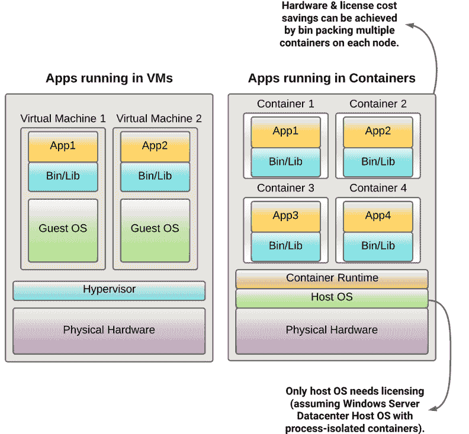

图 F.1 说明了在节点上对多个容器进行装箱可能带来的潜在成本节约。

### F.1.1 Windows 容器的两种运行时隔离模式

从 Windows Server 2016 开始，微软开始为 Windows 容器提供两种运行时隔离模式。进程隔离模式与 Linux 容器最相似，而 Hyper-V 隔离模式本质上是在一个非常轻量级的虚拟机上运行容器。Hyper-V 隔离容器旨在以类似于进程隔离容器的方式使用，但每个容器通过 Hyper-V 虚拟机而不是进程隔离来获取其内核，这与标准 Linux 容器不同。

进程隔离容器是在主机上运行的容器，它们与主机共享相同的内核，并通过资源控制、命名空间和其他进程隔离技术相互隔离。在这两种模式中，这是与原生 Linux 容器更相似的实施方式。Windows Server 容器提供了一个进程和资源隔离边界，因此可用于企业多租户。然而，由于微软表示他们不打算服务 Windows 容器逃逸漏洞，因此在敌对的多租户场景或需要不同风险水平的情况下不建议使用进程隔离容器。Kubernetes 在 2019 年春季发布的 1.14 版本中增加了对在 Windows Server 2019 节点上运行的 Windows Server 容器的支持。

Hyper-V 隔离容器在内核级别进行隔离 - 每个容器都拥有自己的内核并在虚拟机（VM）内部运行。这提供了更好的安全/隔离和主机与容器操作系统版本之间的兼容性。由于虚拟机/内核级别隔离的资源成本，它们通常占用更多资源，如 CPU 和内存，比进程隔离容器（Windows Server 容器）的占用更多。Hyper-V 容器的较高资源利用率和内核级别隔离使它们与原生 Linux 容器最不相似。截至撰写本文时，这些容器尚未由 Kubernetes 官方支持，因此 GKE 或 Anthos 也不支持。

由于 Kubernetes 目前不支持 Hyper-V 容器，因此从现在起所有关于 Windows 容器的讨论都将指代进程隔离的 Windows Server 容器。在本文本中，我们交替使用“Windows 容器”和“Windows Server 容器”这两个术语。

## F.2 使用 Windows 容器

本节概述了使用 Windows 容器的用例和核心概念，包括适合 Windows 容器的良好工作负载、.NET 与 .NET Core 应用程序的探讨，以及 Windows 容器许可的详细信息。

### F.2.1 适合 Windows 工作负载的良好候选者

适合 Windows 容器的应用程序包括：

1.  基于 .NET Framework 3.5+ 的现有应用程序——N-Tier 应用程序、WCF 服务、Windows 服务等。

1.  所有 [ASP.NET](http://asp.net) 应用程序，包括 Web Forms、[ASP.NET](http://asp.net) MVC、[ASP.NET](http://asp.net) Web Pages、[ASP.NET](http://asp.net) Web API 等。

1.  IIS 7+ 应用程序，包括 ISAPI 过滤器和其他管道技术。

1.  经典 ASP 应用程序。

1.  任何没有 WinUI 依赖的控制台/批处理应用程序。

1.  应用程序重构为基于云原生和微服务架构。

1.  基于 .NET Core、.NET 5.0+ 或 ASP.NET Core 的新应用程序*。

    基于 .NET Core、.NET 5.0+ 或 ASP.NET Core 的新应用程序具有跨平台兼容性，可以部署为 Linux 或 Windows 容器。

不适合 Windows 容器的应用程序：

1.  带有可视化用户界面的 UI 应用程序。

1.  使用 Microsoft 分布式事务协调器 (MSDTC) 的应用程序。

1.  Windows 基础设施角色（DNS、DHCP、DC、NTP、PRINT、文件服务器、IAM 等）以及 Microsoft Office 不受支持。

要查看最新的限制集，请参阅 ([`docs.microsoft.com/en-us/virtualization/windowscontainers/quick-start/lift-shift-to-containers#applications-not-supported-by-containers`](https://docs.microsoft.com/en-us/virtualization/windowscontainers/quick-start/lift-shift-to-containers#applications-not-supported-by-containers))。

注意，现有的应用程序（包括单体和 N-Tier）不需要重新架构或重写，以利用容器化和现代化的好处。根据用例、业务需求和应用程序类型，有多种选项可供选择，其中一些选项不需要昂贵的重写或重新架构。以下部分将更详细地解释这一点。

### F.2.2 .NET Core 与 .NET Framework 应用程序

现代化现有的 .NET Framework 应用程序有两种流行的选择——应用程序可以容器化到 Windows Server 容器中并在 Windows 节点上运行，或者应用程序可以移植到 .NET Core/.NET 5+ 并在 Linux 节点上作为 Linux 容器运行。这两种容器化 Windows 应用程序的过程在图 F.2 中进行了说明。

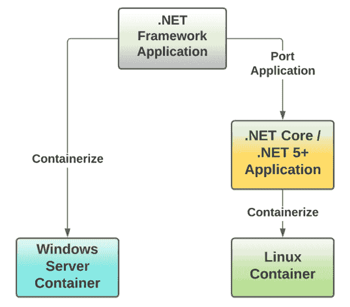

图 F.2 显示了将.NET 应用程序容器化的可能分支过程。可以直接在 Windows Server 操作系统上运行的 Windows Server 容器，或者应用程序可以被移植到.NET Core，以便在 Linux 操作系统上的容器中运行。

第一个选项（在 Windows 上运行 Windows Server 容器）允许用户通过一些部署更改获得显著的现代化好处。它不需要更改应用程序的代码或架构，因此是一个更简单的选项。用户可以使用 Docker 工具（例如，Image2Docker）、Visual Studio Docker 扩展或手动创建 docker 文件，然后使用 CLI 生成镜像。他们还可以使用 Migrate for Anthos 选项创建容器镜像，而无需接触应用程序代码。凭借 Windows 容器带来的 bin 打包和更好的资源利用，用户除了获得容器化带来的众多好处外，还可以节省许可和基础设施成本。

第二个选项（将应用程序移植到.NET Core/.NET 5+并使用 Linux 容器）需要前期投资，并且应用程序需要移植或重新架构/重写。然而，在初始的辛勤工作之后，应用程序运行时无需依赖 Windows Server 许可，从而在许可成本上节省了 100%。此外，与 Windows 容器相比，Linux 容器轻量且性能更佳。

两种选项的选择取决于用户及其业务目标和限制。假设用户需要运行相对较少的应用程序的大量副本（高可扩展性要求），在这种情况下，建议他们花费额外精力将他们的 Windows 应用程序完全重写以在 Linux 上运行，或者将它们移植到.NET Core/.NET 5+。前期的大量工作是为了更好的性能，并且消除了对 MS 许可的依赖。

相反，如果用户有几个遗留应用程序，将应用程序移植到.NET Core 或重写以在 Linux 上运行可能会很繁琐且痛苦。移植涉及非平凡的劳动和开发投资，并且由于依赖关系，可能无法转换某些应用程序。在这种情况下，在 Windows 主机上运行 Windows Server 容器是一个更受欢迎且更易于访问的选项——它通过一些轻量级的部署更改提供了显著的好处。

### F.2.3 容器许可

目前，Kubernetes 支持两种 Windows 操作系统：Windows Server Standard 和 Windows Server Datacenter。这些操作系统对您可能运行的进程隔离 Windows 容器没有限制。Windows Server Standard 限制了您只能运行两个 Hyper-V 隔离容器，而 Windows Server Datacenter 则允许无限数量的 Hyper-V 隔离容器。

在撰写本文时，开源 Kubernetes 以及因此 GKE 仅支持进程隔离的 Windows 容器。因此，Kubernetes 集群可以包括运行任何支持进程隔离容器的 Windows Server Standard 或 Datacenter 版本的节点：Windows Server 2016、Windows Server 2019 或不久的将来，Windows Server 2022。

GKE 支持的 Windows Server 版本在“支持哪些 Windows 版本/类型”部分有更详细的说明。

一定要检查微软的资源，以获取最新的容器许可模式信息。([`docs.microsoft.com/en-us/virtualization/windowscontainers/about/faq#how-are-containers-licensed--is-there-a-limit-to-the-number-of-containers-i-can-run`](https://docs.microsoft.com/en-us/virtualization/windowscontainers/about/faq#how-are-containers-licensed--is-there-a-limit-to-the-number-of-containers-i-can-run))

### F.2.4 Windows 容器基础镜像

当考虑如何在容器中运行你的.NET 应用程序时，你的第一步将是选择一个基础镜像来构建你的容器，这个镜像需要与你要运行的应用程序兼容。微软为用户提供了四个基础镜像，用于构建 Windows 容器：Windows Server Core、Windows Nano Server、Windows 和 Windows Server。大多数用例只需其中两个即可满足，即 Windows Server Core 和 Windows Nano Server。此外，你还可以在 Linux 容器中运行.NET Core 应用程序。图 F.3 展示了如何选择最适合.NET 应用程序需求的容器基础镜像。

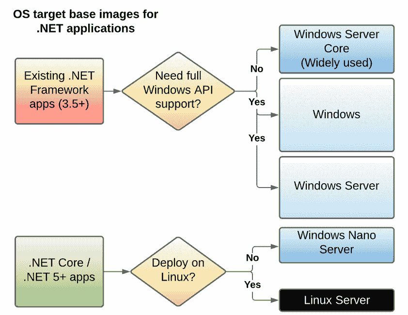

图 F.3 展示了确定运行.NET 应用程序时应使用哪种类型的容器基础镜像的决策树。

Windows Nano Server 基础镜像 - 在 Windows 上运行的现代化或新开发的.NET 应用程序可能能够利用 Windows Nano Server 容器镜像。Windows Nano Server 镜像旨在轻量级和资源高效，提供与 Linux 容器基础镜像最相似的资源利用率。该环境具有比全功能的 Windows Server 操作系统更少的特性，但足以运行许多应用程序。这个镜像在四个原生 Windows 容器基础镜像中占用的空间最小。

Windows Server Core 基础镜像 - 对于可能之前在 Windows Server VM 上运行的遗留.NET 应用程序，Windows Server Core 基础镜像提供了一个更全面功能的类似 Windows Server 的环境。这是两个最常用基础镜像中较大的一个。与所有四个基础镜像相比，它是第二小的。

Windows 基础镜像 - 这是微软目前提供的容器基础镜像中最大的一个。它提供了完整的 Windows API，使您能够运行各种工作负载。然而，与使用其他基础镜像构建的运行相同应用程序的容器相比，您的容器将具有最大的资源利用率。该镜像适用于 Windows Server 2019 LTSC 和 SAC 版本。

Windows Server 基础镜像 - 这个基础镜像与之前提到的“Windows 基础”镜像类似，但没有设计上的限制，因为它被视为“Windows Server”类型的许可。这个基础镜像从 Windows Server 2022 开始可用。

Linux 容器中的 .NET 应用 - 另一个需要考虑的因素是在 Linux 上使用 .NET Core/.NET 5+ 运行 .NET 应用程序。这可以使您完全避免 Windows 许可费用，但要求应用程序被编写或重写以使用 .NET Core/.NET 5+。在这种情况下，应用程序将能够使用 Linux 容器运行，因此可以使用许多可用的 Linux 容器基础镜像之一进行构建。

## F.3 Windows 容器与 Linux 容器的不同之处

Windows 容器和 Linux 容器都是打包和隔离机制，在 Windows Server 容器的情况下，它们在共享底层内核的同时运行应用程序。由于这些概念的实施是针对 Windows 和 Linux 内核的独特，因此它们之间会有许多差异是有道理的。当您探索容器资源时，您可能会发现世界上大多数“容器”信息都是针对 Linux 容器的，并且通常没有明确指出这个假设。本节突出了 Linux 和 Windows 容器之间的重要差异，这应该有助于您识别对 Windows 用例有用的容器资源和产品。在您探索使用容器进行进程打包和隔离的世界时，请记住这些差异。

Windows 容器通常需要更多的资源。在原生 Windows 和 Linux 容器之间最常见的差异之一是，Windows 容器通常比它们的 Linux 对应物占用更多的资源。容器技术的一个常见好处是，容器提供“轻量级”、资源高效的隔离。这是一个相对判断，很大程度上取决于容器技术的实现以及您试图运行的应用程序。虽然正在运行的应用程序的大小是一个因素，但与 Linux 容器相比，Windows 容器平均资源利用率更高的另一个关键因素可以很大程度上归因于前一部分中讨论的两个可用的 Windows 容器基础镜像的设计，即 Windows Server Core 和 Windows Nano Server。

Windows 容器可用的基础镜像较少。作为一种专有技术，Windows Server 容器可用的基础镜像仅限于微软提供的“风味”，并基于其 Windows Server 操作系统。这与 Linux 容器从开源和专有来源可用的丰富基础镜像形成对比。

Windows 容器镜像的拉取时间通常较慢。Windows 容器的基础镜像通常比 Linux 容器的基础镜像大得多。因此，从存储库拉取 Windows 镜像通常需要更长的时间，因为镜像大小较大。

Linux 安全功能与 Windows 安全功能。以进程隔离模式运行的 Windows Server 容器在隔离级别上与 Linux 容器相似。尽管如此，一些特定于 Linux 系统和容器的安全功能，如 Seccomp 和 SELinux，在 Windows 中没有对应的功能。Windows 的 HostProcess 容器相当于 Linux 的特权容器，并提供对主机的特权访问——在基线策略中已禁用。请注意，截至编写时，HostProcess 容器通常不可用（Kubernetes v1.23 时的 beta 功能）。

RunAsUserName 等同于 Linux 的 RunAsUser，可以用来使用非默认用户运行容器。它可以取值如 ContainerAdministrator 和 ContainerUser。ContainerAdministrator 具有提升的权限，用于执行管理任务、安装服务和工具以及进行配置更改。遵循最小权限原则，除非需要管理员访问权限，否则建议以 ContainerUser 运行容器。

如果用例需要运行敌对的多租户工作负载，即至少有一个工作负载是不可信的，则不建议在同一集群中运行具有进程隔离的 Windows Server 容器。

此外，Linux 在处理文件路径、文件权限、信号、身份等方面与 Windows 处理这些方面的方式存在一些差异。例如，Windows 在文件路径中使用反斜杠而不是正斜杠。了解这些差异是有好处的。更多信息请参阅([`kubernetes.io/docs/setup/production-environment/windows/_print/#compatibility-linux-similarities`](https://kubernetes.io/docs/setup/production-environment/windows/_print/#compatibility-linux-similarities))。

## F.4 Anthos 和 Google Kubernetes Engine (GKE) 集群上的 Windows 容器

本节探讨了运行 Windows 工作负载的 Anthos 和 GKE 集群的架构和考虑因素。这两种类型的集群在架构方面有相当大的重叠，因此它们是相互关联地解释的。具有一些独特考虑因素的 On-Prem Anthos 集群将在本节稍后单独说明。通常，最好的学习方式是亲自尝试，因此在本节中，您将找到一个动手教程，指导您创建 Windows 容器并将其部署到 Kubernetes 上，通过 GKE 集群。对于在非 GCP 环境中运行的 Anthos 集群，过程将类似，尽管工具略有不同。

### F.4.1 带有 Windows 节点池的 Anthos 和 Google Kubernetes Engine (GKE)集群的架构

在大规模运行容器时，需要一个容器编排工具。迄今为止，最受欢迎的容器编排工具是 Kubernetes。Anthos 管理的 Kubernetes 集群可以在各种环境中运行，无论它们在哪里运行，它们主要基于 GKE 集群的架构。务必查看本书中关于基于 Kubernetes 的计算环境的章节，以获得对 Google Kubernetes Engine 及其与 Anthos 之间关系的更全面概述。

本节提供了通过 GKE 或 Anthos 集群使用 Windows 节点池运行基于 Windows 容器的参考架构。

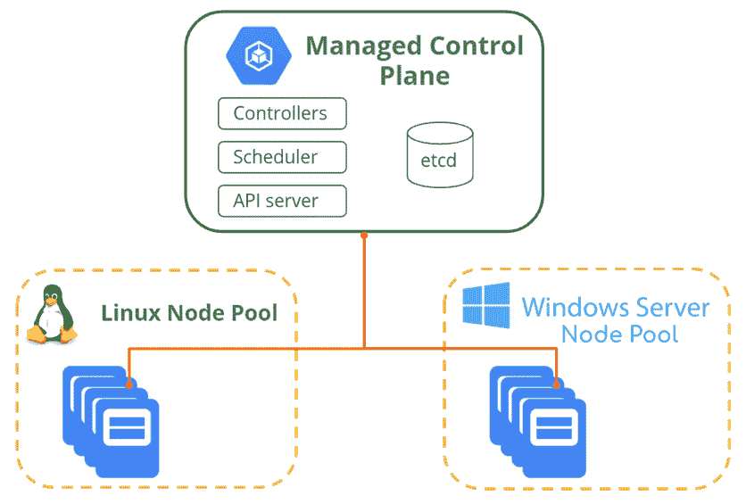

图 F.4 在同一集群中并排运行 Windows Server 和 Linux 容器的说明

图 F.4 说明了带有 Windows 节点池的 Anthos 或 GKE 集群的高级架构。绿色块代表继续使用 Linux 运行的托管主节点或控制平面，而黄色块代表工作节点池。Windows Server 节点池可以连接到现有的或新的 GKE 或 Anthos 集群，就像您添加 Linux 节点池一样。Linux 和 Windows 共享的控制平面是提供一致体验的关键因素。

单个集群可以使用不同的 Windows Server 版本拥有多个 Windows Server 节点池，但每个节点池只能使用一个 Windows Server 版本。标签用于将 Windows pod 引导到 Windows 节点。可以使用污点（Taints）和容忍度（Tolerations）来防止或排斥 Linux pod 在 Windows 节点上运行。Kubelet 和 Kube-proxy 在 Windows 节点上本地运行。整体架构允许您在同一个集群中无缝运行混合的 Windows 和 Linux 容器工作负载。

使用 Anthos 运行 Windows 工作负载的优点

现代化优势：使用 Kubernetes 容器化和运行 Windows 工作负载允许用户利用许多以前仅限于基于 Linux 应用程序的现代化优势。有众多优势，从更好的可伸缩性和可移植性到简化的管理和部署速度。

运营一致性：通过以一致的方式在 Windows 和 Linux 工作负载中并行运行，用户可以获得运营效率。您不再需要多个团队专门针对不同的工具或平台来管理不同类型的应用程序——您可以在 Windows 和 Linux 应用程序之间实现一致的运营。

成本节省：GKE/Anthos Windows 提供更好的二进制打包——通过在工作节点上以容器形式运行多个应用程序，用户可以获得更好的资源利用率，从而节省基础设施成本，更重要的是，您还可以从 Windows Server 许可证节省中获得好处。

支持的 Windows 版本/类型

在撰写本文时，GKE 和 Anthos 集群中的 Windows Node Pools 支持将 Windows Server 2019 LTSC（长期服务渠道）版本作为节点操作系统镜像。Windows Server 2022 的支持正在计划中。尽管 Windows Server 2016 中添加了对 Windows 容器的支持，但 Kubernetes 在 2019 年 3 月的 1.14 版本中提供了 [Windows Server 容器的 GA 支持](https://kubernetes.io/blog/2019/03/25/kubernetes-1-14-release-announcement/)，使用的是 Windows Server 2019。因此，Windows Server 2016 不再受支持。

注意，GKE 之前也支持 Windows Server 的半年度渠道（SAC）版本；然而，从 Windows Server 2022 开始，Microsoft [弃用了](https://docs.microsoft.com/en-us/windows-server/get-started/removed-deprecated-features-windows-server-2022) 对 SAC 渠道的支持。

容器运行时有两个选项——Docker 和 containerd。容器运行时由 Kubernetes 节点用于启动和管理构成 Kubernetes Pod 的容器。containerd 支持在 2018 年由 Kubernetes [发布到开源社区](https://kubernetes.io/blog/2018/05/24/kubernetes-containerd-integration-goes-ga/)，并显示出降低资源使用和提高启动延迟的效果。对于 2022 年及以后创建的 GKE 和 Anthos 集群，如果可用，强烈建议您使用 containerd 运行时（这是默认设置）。

容器基础操作系统版本与主机操作系统之间的兼容性

对于以进程隔离模式部署的 Windows Server 容器，容器的基础镜像的操作系统版本必须 [匹配](https://docs.microsoft.com/en-us/virtualization/windowscontainers/deploy-containers/version-compatibility?tabs=windows-server-2022%2Cwindows-10-21H1#matching-container-host-version-with-container-image-versions) 主机的版本（如图 F.5 所示）。在四部分版本元组 - 主版本.minor.build.patch 中，前三个部分（即主版本、次要版本和构建版本）需要匹配。修补版本不需要匹配。

此限制不适用于在 Hyper-V 隔离模式下运行的 Windows Server 容器，版本可以不同。

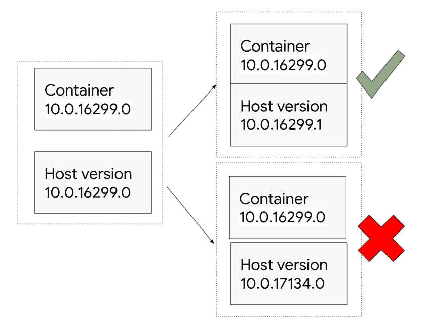

图 F.5 Windows 容器版本必须共享容器元组的第三个值。例如，运行 Windows Server 版本 10.0.16299.1 的主机与运行版本 10.0.16299.0 的容器兼容，但相同的容器与运行版本 10.0.17134.0 的主机不兼容。

先决条件

1.  即使是专门的 Windows 集群，GKE/Anthos 集群中也至少需要一个 Linux 节点，因为一些系统 Pod 只能在 Linux 节点上运行。

1.  建议使用更大的机器类型来运行 Windows Server 容器：在 GCP 上，n1-standard-2 是最低推荐的机器类型，因为 Windows Server 节点需要额外的资源。不支持较小的机器类型 f1-micro 和 g1-small。

1.  许可证：

    1.  在 GCP 云环境中，许可证已嵌入到虚拟机中。当用户将 Windows 虚拟机添加到他们的 GKE 或 Anthos 集群时，相应的许可证也会添加。这与客户在 GCE 中配置 Windows 虚拟机的方式相同。请查阅 Google Cloud 的[计算磁盘镜像定价](https://cloud.google.com/compute/disks-image-pricing)文档以获取最新信息和详细信息。

    1.  在 Anthos On-Premises 环境中，用户需要自行采购 Windows Server 许可证（BYOL - 带自己的许可证模式）。因此，用户需要从 Microsoft 下载 Windows Server ISO，或者根据 Microsoft 的许可条款使用公司定制的操作系统镜像。建议使用 Microsoft 的纯操作系统镜像。用户需要从 Windows Server ISO 创建一个基本的 Windows 虚拟机模板，该模板在向用户集群添加节点池时使用。

在 Google Cloud 和 GKE 上运行 Windows 容器（教程）

本节提供了一个动手教程，用于创建 Windows 容器并在 GKE 上运行它。它改编自以下“在 Google Cloud 上运行 Windows 容器”codelabs：

第一部分: [`codelabs.developers.google.com/codelabs/cloud-windows-containers-computeengine`](https://codelabs.developers.google.com/codelabs/cloud-windows-containers-computeengine)

第二部分: [`codelabs.developers.google.com/codelabs/cloud-windows-containers-kubernetesengine`](https://codelabs.developers.google.com/codelabs/cloud-windows-containers-kubernetesengine)

设置和需求

本教程假设您有一个 Google Cloud Platform 项目用于工作。您可以使用现有的项目，或者创建一个新的项目。

第一部分：创建 Windows 容器

创建 Windows 虚拟机

为了创建一个 Windows 容器，您需要访问支持它们的 Windows 操作系统。首先，在 Google Cloud 上创建一个 Windows Server 实例，您将在该实例上创建您的 Windows 容器。您可以使用 gcloud cli 或控制台来完成此操作。在本节中，我们提供了在 Google Cloud 控制台上执行此操作的说明。

在 Google Cloud Platform 控制台中，转到计算引擎部分并创建一个实例。对于这个练习，选择如图 F.6 所示的 Windows Server 2019 Datacenter for Containers 作为引导磁盘的版本。

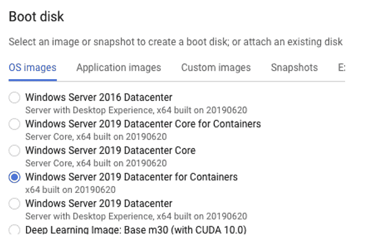

图 F.6 在 Google Cloud Platform (GCP) 上虚拟机创建工作流程的“引导磁盘”部分有一个“操作系统镜像”标签，您可以在其中选择您虚拟机的所需操作系统镜像。对于本教程，我们将使用“Windows Server 2019 Datacenter for Containers。”

确保此虚拟机的 HTTP 和 HTTPS 流量已启用，如图中所示。

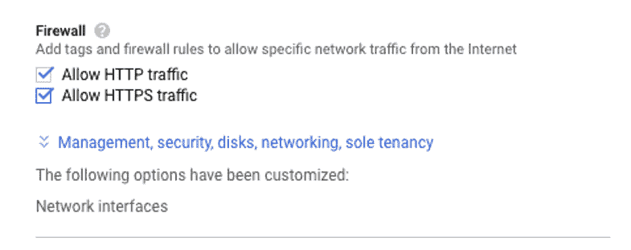

图 F.7 在虚拟机创建工作流程的“防火墙”部分提供了两个必须勾选的复选框，以便进行本教程： “允许 HTTP 流量”和“允许 HTTPS 流量。”

选择如图 F.8 所示的“允许访问所有云 API 的完全访问权限。”

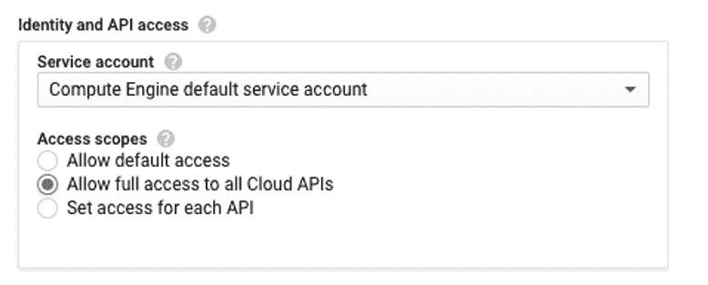

图 F.8 在虚拟机创建工作流程的“身份和 API 访问”部分的“访问范围”子部分中，选择“允许访问所有云 API 的完全访问权限。”

点击“创建”后，虚拟机启动需要几分钟。一旦虚拟机启动，您应该在控制台中看到您的虚拟机正在运行，如图 F.9 所示。


图 F.9 在 Google Cloud 中运行的虚拟机实例将显示虚拟机名称，名称右侧的行将显示附加信息，如区域和 IP。

通过远程桌面 (RDP) 登录到 Windows 虚拟机

要访问您创建的虚拟机，您需要配置一个密码。有两种方法可以做到这一点。您可以使用如图 F.10 所示的 RDP 按钮设置新的 Windows 密码：


图 F.10 点击如图中上一张图片所示的虚拟机信息中的“RDP”下拉菜单将提供设置 Windows 密码的选项。

或者，您可以点击“查看 gcloud 命令以重置密码”并运行显示的命令以设置密码。

几秒钟后，您应该在控制台或 Cloud Shell 中看到 Windows 密码。请确保您安全地记录下来。您将需要它来访问 Windows 虚拟机。

要登录到 Windows 虚拟机，您可以点击虚拟机的 RDP 按钮，如图中最后两张图片所示，这次点击“RDP”而不是下拉符号。

如果您愿意，您也可以使用自己的 RDP 客户端登录到虚拟机。

一旦进入虚拟机，以管理员模式打开一个命令提示符。默认安装了 Docker 和 Windows Server Core 基础镜像，您可以通过运行如图 F.11 所示的“docker images”来确认。

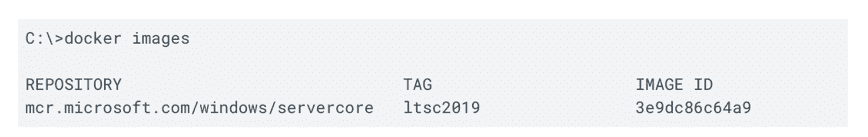

图 F.11 在创建的 Windows 虚拟机的命令提示符中运行“docker images”将提供输出，显示 Windows Server Core 基础镜像已经安装。

创建一个用于容器化的应用程序

对于 Windows 容器内的应用程序，我们将使用 IIS Web 服务器。IIS 为 Windows Server 2019 提供了一个镜像。直接使用这个镜像将允许我们提供默认的 IIS 页面。让我们配置 IIS 以提供自定义页面。

创建一个名为 my-windows app 的文件夹，其文件夹和文件结构如下：

```
C:\my-windows-app>dir /s /b
C:\my-windows-app\content
C:\my-windows-app\Dockerfile
C:\my-windows-app\content\index.xhtml
```

将 index.xhtml 替换为以下内容：

```
<html>
  <head>
    <title>Windows containers</title>
  </head>
  <body>
    <p>Windows containers are cool!</p>
  </body>
</html>
```

这是 IIS 将提供的页面。

使用 Docker 构建容器镜像

要使用 Docker 容器化此 IIS Web 服务器应用程序，你需要创建一个名为 Dockerfile 的文件。Dockerfile 包含几个关键命令，这些命令本质上指导 Docker 如何创建一个容器镜像来运行你的应用程序。

创建一个名为“Dockerfile”的文件，没有文件扩展名，包含以下行：

```
FROM mcr.microsoft.com/windows/servercore/iis:windowsservercore-ltsc2019

RUN powershell -NoProfile -Command Remove-Item -Recurse C:\inetpub\wwwroot\*

WORKDIR /inetpub/wwwroot

COPY content/ .
```

构建 Docker 镜像，并使用 Google 容器注册库（GCR）和你的项目 ID 进行标记。这将在我们稍后推送镜像到 GCR 时很有用。运行以下命令，将[project id]替换为你的项目 ID。

```
docker build -t gcr.io/[project id]/iis-site-windows .
```

一旦 docker 镜像构建完成，你可以通过运行“docker images”看到它及其 IIS 依赖项。

运行 Windows 容器

在运行容器之前，你可能需要从虚拟机实例中打开端口 80。在 Windows 虚拟机内的命令提示符中运行以下命令：

```
C:\>netsh advfirewall firewall add rule name="TCP Port 80" dir=in action=allow protocol=TCP localport=80
C:\>netsh advfirewall firewall add rule name="TCP Port 80" dir=out action=allow protocol=TCP localport=80
```

你现在应该准备好运行 Windows 容器了。要运行容器并在端口 80 上公开它，请执行以下命令，将[project id]替换为你的项目 ID。

```
docker run -d -p 80:80 gcr.io/[project id]/iis-site-windows
```

通过运行命令 docker ps 确认容器现在正在运行。

要查看网页，请转到计算引擎实例的外部 IP 列，并在浏览器中简单地使用 HTTP 打开它。它应该类似于图 F.12。

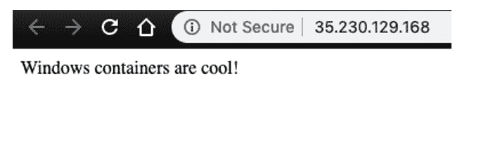

图 F.12 将你的工作负载的外部 IP 输入到浏览器中应该会打开一个宣称“Windows 容器很酷！”的网站

你现在已经在 Windows 容器内运行了一个 IIS 网站！

注意，这个设置对于生产环境来说并不理想。它不能在服务器重启或崩溃时存活。在一个生产系统中，你希望为你的虚拟机获取一个静态 IP，并有一个启动脚本来启动容器。这将处理服务器重启，但对于服务器崩溃帮助不大。

要使应用程序能够抵御服务器崩溃，你可以在由 Kubernetes 管理的 pod 内运行容器。这就是第二部分你要做的事情。

第二部分：在 GKE 上运行 Windows 容器

将容器镜像推送到 Google 容器注册库（GCR）

要使第一部分中创建的容器镜像在 GKE 中可用，你需要将其托管在镜像仓库中。我们将为此目的使用 Google 容器注册库。

要将容器镜像从 Windows 虚拟机推送到 GCR，你需要：

1.  确保你的项目中启用了容器注册库 API。

1.  配置 Docker 以指向 GCR。

首先，确保通过在具有管理员权限的 Windows VM 命令提示符中运行以下 gcloud 命令来启用 Container Registry API：

```
gcloud services enable containerregistry.googleapis.com
```

通过运行以下命令配置 Docker 以指向 GCR：

```
gcloud auth configure-docker
```

当你被询问是否继续时，输入“Y”。

要将镜像推送到 GCR，请运行以下 docker 命令，将 [项目 ID] 替换为你的项目 ID：

```
docker push gcr.io/[project id]/iis-site-windows
```

如果你转到云控制台的 GCR 部分，你应该能看到镜像，如图 F.13 所示。

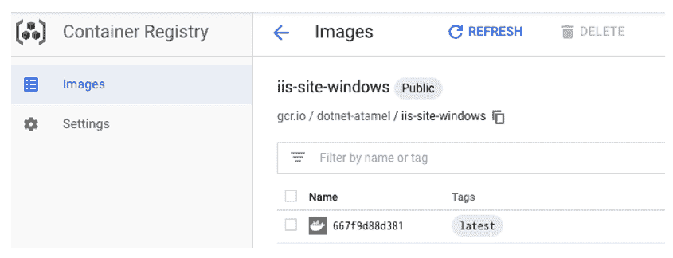

图 F.13 在 Google Cloud 中导航到容器注册表的镜像部分应显示有关 iis-site-windows 的信息。

创建具有 Windows 节点的 Kubernetes 集群

对于这个练习，你将创建一个区域 GKE 集群。这个集群将只包含单个区域内的节点，与具有多个控制平面和多个区域节点的区域 GKE 集群不同。

在创建 GKE 集群之前，请确保项目 ID 设置为你的项目，并设置 compute/zone 为你想要的区域（将 [项目 ID] 和 [首选区域] 替换为你首选的区域）：

```
gcloud config set project [project id]
export ZONE=[preferred zone]
gcloud config set compute/zone ${ZONE}
```

在 GKE 中使用 Windows 节点创建 Kubernetes 集群分为 2 步：

1.  创建具有 IP 别名和 1 个 Linux 节点的 GKE 集群。在将 Windows 节点添加到集群之前，至少需要 1 个 Linux 节点。

1.  向 GKE 集群添加 Windows 节点池。

使用以下命令创建 GKE 集群。将 [集群名称] 替换为你想要的集群名称。

```
export CLUSTER_NAME=[cluster name]
gcloud container clusters create ${CLUSTER_NAME} \
  --enable-ip-alias \
  --num-nodes=2
```

一旦你的 GKE 集群启动，你可以向其中添加一个包含 Windows 节点的节点池：

```
gcloud container node-pools create windows-node-pool \
  --cluster=${CLUSTER_NAME} \
  --image-type=WINDOWS_LTSC \
  --no-enable-autoupgrade \
  --machine-type=n1-standard-2
```

注意，我们正在禁用自动节点升级。Windows 容器版本需要与节点操作系统版本兼容。为了避免意外的工作负载中断，建议用户禁用 Windows 节点池的节点自动升级。

对于 GKE 中的 Windows Server 容器，你已为底层的 Windows 主机 VM 获得了许可 - 容器不需要额外的许可。

为你的 GKE 集群配置 kubectl

你将使用 Kubernetes 命令行工具 kubectl 与你的集群交互。要配置 kubectl，请运行以下命令：

```
gcloud container clusters get-credentials ${CLUSTER_NAME}
```

在使用集群之前，等待几秒钟，直到 windows.config.common-webhooks.networking.gke.io 创建。此 webhook 为使用 kubernetes.io/os: windows（或 beta.kubernetes.io/os: windows）节点选择器创建的 Pods 添加调度容忍度，以确保它们可以在 Windows Server 节点上运行。它还验证 Pod，以确保它只使用在 Windows 上受支持的功能。

你可以通过使用以下命令输出 webhook 配置信息来确认已创建 webhook：

```
kubectl get mutatingwebhookconfigurations
```

在 GKE 中以 pod 的形式运行你的 Windows 容器

Kubernetes 对运行容器采用声明式方法。用户使用 yaml 文件定义他们希望的状态，Kubernetes 使用这些文件来创建和维护对象，以匹配期望状态。

要将您的 IIS 容器作为 Kubernetes 中的 pod 运行，您需要创建一个名为 iis-site-windows.yaml 的文件，包含以下行。请确保将[项目 ID]替换为您的项目 ID。

iis-site-windows.yaml

```
apiVersion: apps/v1
kind: Deployment
metadata:
  name: iis-site-windows
  labels:
    app: iis-site-windows
spec:
  replicas: 2
  selector:
    matchLabels:
      app: iis-site-windows
  template:
    metadata:
      labels:
        app: iis-site-windows
    spec:
      nodeSelector:
        kubernetes.io/os: windows
      containers:
      - name: iis-site-windows
        image: gcr.io/${PROJECT_ID}/iis-site-windows
        ports:
        - containerPort: 80
```

注意，此 yaml 将创建两个运行您之前发布到 GCR 的镜像的副本 pod。此 yaml 还确保您的 pod 将在带有 nodeSelector 标签的 Windows 节点上运行。

要创建 iis-site-windows.yaml 文件中定义的部署，请运行：

```
kubectl apply -f iis-site-windows.yaml
```

几分钟后，您应该看到创建的部署和正在运行的 pod。运行以下命令以确认：

```
kubectl get deployment,pods
```

您应该看到类似于图 F.14 的输出。

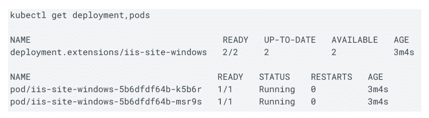

图 F.14 “kubectl get”命令用于显示 Kubernetes 对象的高级信息。在本例中，默认命名空间中的部署和 pod 被显示。

创建 Kubernetes 服务

您的应用程序现在正在 Kubernetes 中运行。为了确认 IIS 网站已启动，您需要创建一个 Kubernetes 服务，以便外部世界可以访问创建的 pod。

运行以下 kubectl 命令以创建一个类型为 LoadBalancer 的服务，可以用来访问您的 IIS Web 服务器。

```
kubectl expose deployment iis-site-windows --type="LoadBalancer"
```

您可以通过运行以下命令来确认服务是否启动：

```
kubectl get service
```

注意，服务启动并运行可能需要几分钟。一旦“kubectl get service”命令输出的“EXTERNAL-IP”部分被填充，您就可以访问该 IP 来查看 IIS 提供的页面。尽管是通过不同的 IP 访问，但网站应该与之前相同，如图 F.15 所示。

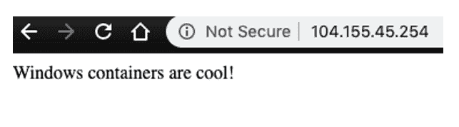

图 F.15 当您输入负载均衡器类型 Kubernetes 服务的外部 IP 时，应该显示一个宣称“Windows 容器很酷！”的网页。

当您进入负载均衡器类型 Kubernetes 服务的外部 IP 时，应该显示与第一部分中看到的相同的网页。现在最大的不同之处在于 Kubernetes 正在管理应用程序。如果运行应用程序的 pod 或 pod 所在的节点出现错误，Kubernetes 将为我们重新创建和重新调度 pod。这对于弹性来说非常好。

清理

一旦您完成了对在 GKE 上运行的容器化应用的探索，删除集群是一个好主意，以避免因闲置资源而产生额外费用。如果您完成了本教程中使用的资源，请按照以下步骤删除它们。

要清理您的环境，首先删除服务和部署。这将自动删除为该服务创建的外部负载均衡器：

```
kubectl delete service,deployment iis-site-windows
```

然后，删除您的 GKE 集群：

```
gcloud container clusters delete windows-cluster
```

您还应该删除用于创建 Windows 容器的虚拟机。

这可以在控制台或通过命令行完成。要通过 Google Cloud Console 删除虚拟机，请转到计算引擎虚拟机实例页面，并选择您要删除的虚拟机的“删除”菜单，如图 F.16 所示：

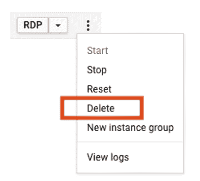

图 F.16 点击 VM 信息行最右侧的点，应该会提供通过 Google Cloud 控制台删除该 VM 的选项。

在 Anthos On-Premises 上运行 Windows 容器

在 Anthos 或 GKE 上运行 Windows 容器的用户体验在这两个平台上相当一致。然而，一些额外的设置和安装要求是针对本地环境中 Anthos 集群特定的，本节将突出这些要求。本地环境中的一般 Anthos 架构如图 F.17 所示。

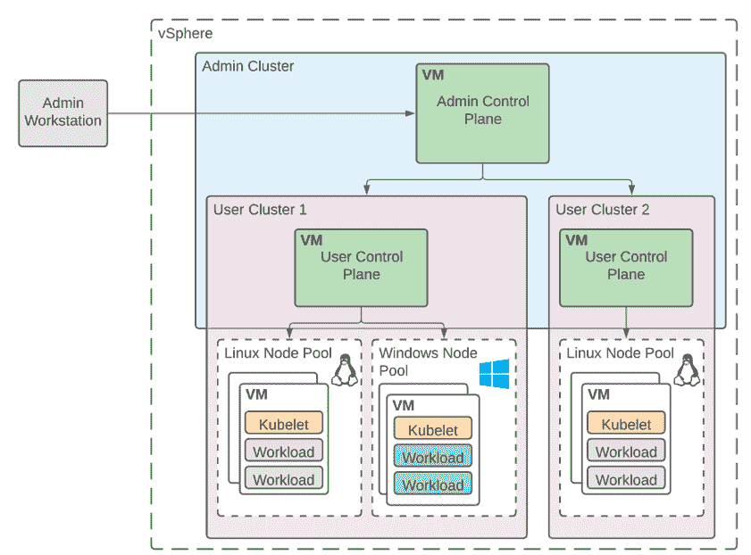

图 F.17 Windows Server 和 Linux 容器在同一 Anthos 本地 VMware 集群中并行运行的示意图

在本地环境中，差异主要源于两个原因。首先，Anthos 用户必须在本地环境中获取他们的许可证（BYOL）。在 BYOL 模型中，Google 无法将 Windows Server 操作系统镜像与 Anthos 组件一起发货。因此，用户需要额外步骤从 Microsoft 下载 OS ISO 镜像，并为节点池创建创建 VM 模板。此外，当 Microsoft 为操作系统镜像发布安全补丁时，Google 将测试和验证最新的安全补丁版本，并发布结果。用户需要使用带有安全补丁的新 VM 模板，并在他们的 Windows 节点池上执行滚动更新。

第二，在 Anthos On VMware 环境中，管理员集群和底层 VMware 结构发挥作用，因此确保满足这些先决条件至关重要。Windows 节点仅支持作为用户集群工作节点运行，控制平面节点和管理集群节点继续基于 Linux。

具体来说，除了上述先决条件外，用户还需要确保以下事项：

1.  在您创建 Windows 节点池之前，必须有一个管理员集群，因为 Windows 节点池仅支持在用户集群中。

1.  vSphere 环境是 vSphere 6.7，更新 3 或更高版本。

1.  具有 Windows 节点池的用户集群必须在用户集群配置文件中将 enabledataplanev2 字段设置为 true。这将在该集群的 Linux 节点上启用 Dataplane V2。另外，如果您希望 Windows 节点池中的 Windows Dataplane V2 被启用，用户集群配置文件中必须将 enableWindowsDataplaneV2 字段设置为 true。

将 Windows 节点池添加到 Anthos On-Prem 集群的高级步骤包括：

1.  在 VMware 上为 Anthos 集群创建 Windows VM 模板。

1.  如果使用私有注册表，将 Windows 容器镜像上传到私有注册表。

1.  如果您的集群位于代理服务器后面，允许代理服务器 URL 列表。

1.  将 Windows 节点池添加到用户集群配置文件中。

1.  最后，创建 Windows 节点池。

一旦完成这些，您就可以像部署到 GKE 一样部署您的 Windows 容器。有关详细信息，请参阅 Google Cloud 文档页面“Windows Server OS 节点池用户指南”中的分步说明。

### F.4.2 Anthos 和 Google Kubernetes Engine (GKE) Windows 环境的独特存储、网络和身份考虑因素

存储和网络对于在分布式计算环境中运行工作负载（如 Kubernetes 集群）至关重要。Kubernetes 以其在无状态工作负载领域的功能而闻名，但它也可以成为有状态工作负载的绝佳家园。Kubernetes 通过将容器连接在一起，无论是在单个机器内部还是在机器集群之间，涉及从硬件到各种软件级别的抽象层。本节探讨了 Anthos 和 GKE Windows 环境共有的存储和网络独特考虑因素。

### F.4.3 存储

简而言之，Kubernetes 在 Windows 中管理存储的方式与 Linux 类似。包括树内和 CSI（在附录 Anthos、数据和 Analytics 中提及）的卷插件为存储供应商提供了一个抽象层，以支持为容器提供、附加和挂载存储。最终用户以与 Linux 相同的方式与持久卷（PV）、持久卷声明（PVC）和 StorageClass 对象交互。

Windows 存储限制

然而，与 Linux 相比，Windows 存储支持在撰写本文时有一些限制。以下列出了一些。（有关更多详细信息，请参阅[文档](https://kubernetes.io/docs/setup/production-environment/windows/intro-windows-in-kubernetes/#compatibility-storage)）

+   Docker 运行时只能支持针对目录的卷挂载，而不是文件。然而，containerd 运行时不再有此限制，并且强烈建议使用 containerd 运行时而不是 Docker 运行时。

+   Windows 存储目前不支持以下功能

    +   内存作为临时存储的存储介质。因此，如果您定义了一个 emptyDir 卷，您不能将其 emptyDir.medium 设置为内存

    +   原始块卷（Windows 无法将原始块设备附加到 pods。）

    +   支持双向传播的卷挂载

+   对于 Windows，支持只读卷，但不支持只读文件系统。

+   对于卷，不支持用户掩码和权限。权限而是在容器中解析。

Windows CSI 支持

在过去，存储供应商必须创建插件才能通过 Kubernetes 启用他们的存储。然而，存储插件被视为“树内”组件，这意味着它们必须成为核心 Kubernetes 代码的一部分才能使用。这种模式存在问题，因为它使 Kubernetes 的核心代码变得臃肿，并使存储供应商创建和维护插件的过程变得具有挑战性。

由于其缺陷和限制，插件系统在 Kubernetes 版本 1.13 时被替换，当时容器存储接口（CSI）成为通用可用（GA）。从那时起，存储提供商创建了与 CSI 兼容的插件，允许他们的用户通过 Kubernetes 消费存储。

Kubernetes 中的 Windows 支持是在 Kubernetes 版本 1.19 中引入的。然而，最初的版本不支持 HostProcess 容器（Linux 中特权容器的等效物），这是 CSI 卷插件部署为容器所必需的。截至 Kubernetes 1.22，HostProcess 容器支持目前处于 Alpha 阶段，Beta 版本计划与 Kubernetes 1.23 一起发布。

一个临时的解决方案是使用开源软件（OSS）项目 CSI-Proxy。CSI-proxy 提供了一种将节点插件作为非特权 pod 部署的机制，并使用代理在节点上执行特权存储操作。CSI Proxy API 包括磁盘、文件系统、SMB 和卷 API 组，这些在 2021 年毕业到 v1。它还包括 iSCSI 和系统 API，这些在撰写本文时仍处于 Alpha 阶段。

Anthos 旨在在各种环境中提供一致的经验。然而，并非所有环境都以相同的速度前进。请务必检查 Anthos 文档（[`cloud.google.com/anthos/docs/concepts/overview`](https://cloud.google.com/anthos/docs/concepts/overview)），以了解每个环境中可用的存储驱动程序类型。

Windows Google Cloud 存储驱动程序的实际应用

以下示例展示了在 Google Cloud 的 Anthos 中使用 StorageClass、PV/PVC 和 pod 访问持久存储的示例。

```
apiVersion: storage.k8s.io/v1
kind: StorageClass
metadata:
  name: csi-gce-pd-windows
parameters:
  type: pd-balanced
provisioner: pd.csi.storage.gke.io
reclaimPolicy: Delete
volumeBindingMode: WaitForFirstConsumer

---
kind: PersistentVolumeClaim
apiVersion: v1
metadata:
  name: podpvc-csi
spec:
  accessModes:
    - ReadWriteOnce
  storageClassName: csi-gce-pd-windows
  resources:
    requests:
      storage: 20Gi

---
apiVersion: v1
kind: Pod
metadata:
  name: web-server
spec:
  tolerations:
  - operator: Exists
  nodeSelector:
    kubernetes.io/os: windows
  containers:
  - name: web-server
    imagePullPolicy: Always
    image: k8s.gcr.io/e2e-test-images/agnhost:2.32
    volumeMounts:
    - mountPath: /www/html
      name: mypvc
  volumes:
  - name: mypvc
    persistentVolumeClaim:
      claimName: podpvc-csi
      readOnly: false
```

使用 SMB 在 Linux 和 Windows 之间共享数据

在 Linux 节点上运行的 pod 和在 Windows 节点上运行的 pod 之间需要共享数据的场景有几个。以下示例说明了可能需要数据共享的场景：

+   假设一个应用程序正在从 Windows 上的 .NET 框架迁移到 Linux 上的 .NET core，一些部分已经迁移，而应用程序的其他部分仍在使用 Windows 容器。

+   需要捕获由 Windows pod 编写的日志并将其发送到公共搜索和分析引擎，并且日志传输程序是用 Linux 编写的。

+   假设一个使用 Windows Server 容器运行的遗留 .NET 应用正在获得新功能，这些新功能作为在 Linux 上使用 .NET Core 运行的独立、新的微服务进行开发。让我们假设应用程序的旧部分和新部分针对同一个数据库进行操作。

在这种场景下，您可以使用服务器消息块（SMB）协议。SMB 是 Windows 用户最受欢迎的网络文件共享协议之一。CSI Windows 社区已启动一个开源 SMB CSI 驱动程序，并支持 Linux 和 Windows 集群。我们建议使用此驱动程序访问 SMB 卷，无论是自管理的 samba 服务器还是云卷服务（CVS）在 GKE 上。您可以检查 Google Cloud 文档，其中包含如何使用开源 SMB CSI 驱动程序访问 Google Kubernetes Engine（GKE）集群上 Windows 服务器节点的 NetApp Cloud Volumes Service SMB 卷的示例。

### F.4.4 网络

与 Linux 网络一样，Windows 网络依赖于容器网络接口（CNI）将 Kubernetes pods 连接到集群网络。对于 GKE 和 Anthos，Windows 网络实现有两种模式：

1.  基于 win-bridge（L2bridge 网络模式）的传统 Windows Dataplane

1.  更新的基于 Open vSwitch（OVS）和 Antrea 的 Windows Dataplane V2

传统 Windows Dataplane

在 GKE 和 Anthos on-prem（在 VMware 上），使用 win-bridge 网络模式将 pods 连接到底层网络 - 它利用 Hyper-V 虚拟交换机（vSwitch）。GKE 和 Anthos on-prem（VMware）在跨节点连接性方面存在细微差异。

+   在 GKE 的 VPC 原生集群中，pods 使用辅助 IP 地址范围内的真实 VPC IP 地址，因此 pod IP 在 VPC 内是原生可路由的。跨不同节点的 pods 是原生支持的。

+   在 Anthos on-prem（在 VMware 上），没有 VPC 支持。Flannel 用于在 Windows 节点之间交换路由。Linux 节点上的 Dataplane v2 用于在 Linux 和 Windows 节点之间交换路由。

GKE/Anthos Windows Dataplane V2

更新的 Dataplane V2 是一个更可编程的 Dataplane，针对 Kubernetes 网络进行了优化，可以在不牺牲性能的情况下执行 Kubernetes 意识的包操作。虽然 Linux 的 Dataplane V2 基于 eBPF（扩展伯克利包过滤器）和 Cilium，但 Windows 解决方案基于 Open vSwitch 和 Antrea（一个实现 CNI 的开源项目）。

Dataplane V2 有助于克服传统实现的一些限制，并启用网络策略等特性。它向集群添加了新组件 - antrea-agent 和 antrea-controller。虽然 Antrea-agent 在每个节点上运行并编程 Open vSwitch 数据路径，但 Antrea-controller 在每个集群上运行一个实例。Antrea-controller 监视 Kubernetes API 服务器以获取更新，并为 antrea-agent 提供查询每个节点策略规则的 API。

GKE Dataplane V2 为所有 Anthos 和 GKE 环境提供一致的联网用户体验，提供网络活动的实时可见性，并具有更简单的架构，使得故障排除更加容易。此外，大多数新功能将仅支持 Dataplane V2。因此，强烈建议使用 Dataplane V2 进行容器联网。有关联网的更多详细信息，请参阅联网环境章节。

要使用 GKE Dataplane V2 创建新的集群，请使用以下命令：

```
gcloud container clusters create CLUSTER_NAME \
    --enable-dataplane-v2 \
    --enable-ip-alias \
    --release-channel CHANNEL_NAME \
    --region COMPUTE_REGION
```

### F.4.5 活动目录集成

活动目录（AD）集成是 Windows 网络中最常用的身份验证和授权机制。活动目录在数据存储中跟踪网络中的对象，并使授权用户能够轻松发现和访问资源。Windows 容器不能直接加入域。尽管如此，您可以为在 Windows 容器中运行的应用程序配置和使用组托管服务帐户（gMSA）来利用 AD 功能。Anthos 和 GKE 支持组托管服务帐户——您可以在集群中配置 gMSA 凭证规范作为自定义资源。然后，Windows Pod 可以配置为使用 gMSA 来访问和交互其他资源和服务。有关更多详细信息，请参阅文档（[`cloud.google.com/kubernetes-engine/docs/how-to/creating-a-cluster-windows#using_gmsa`](https://cloud.google.com/kubernetes-engine/docs/how-to/creating-a-cluster-windows#using_gmsa)）和[教程](https://cloud.google.com/kubernetes-engine/docs/how-to/deploying-aspnet-with-windows-authentication-in-gke-windows-containers)。

## F.5 摘要

+   与 Linux 容器一样，Windows 容器具有多项好处——更好的灵活性、改进的可伸缩性和可靠性，通过装箱节省成本等。

+   Windows 容器有两种运行时隔离模式——进程隔离和 Hyper-V 隔离。进程隔离模式更类似于原生 Linux 容器，而 Hyper-V 隔离提供了更多的安全性和隔离性，更适合敌对的多租户场景。

+   现代化现有.NET Framework 应用程序有两种流行的选择——应用程序可以被容器化到 Windows Server 容器中并在 Windows 节点上运行，或者应用程序可以被移植到.NET Core/.NET 5+并在 Linux 节点上作为 Linux 容器运行。

+   Anthos/GKE 允许您在同一集群中并行运行 Linux 和 Windows 容器，从而实现一致的用户体验和操作效率，以及其他多项好处。

+   对于以进程隔离模式部署的 Windows Server 容器，容器的基础镜像操作系统版本必须与主机版本匹配。

+   在不同的 Anthos 环境中运行 Windows 容器的体验相当一致。然而，也有一些需要考虑的差异，例如 Windows 节点的操作系统许可模式。

+   Kubernetes 在 Windows 中管理存储和网络的方式与 Linux 类似。卷插件（树内和 CSI）提供了一个抽象层，最终用户以与 Linux 相同的方式与持久卷（PVs）、持久卷声明（PVCs）和 StorageClass 对象交互。Windows 的传统数据平面基于 win-bridge，而较新的 Windows 数据平面 V2 基于 Open vSwitch (OVS) 和 Antrea。

+   Active Directory (AD) 集成是 Windows 基础网络中最常见的身份验证和授权方法。Anthos 和 GKE 支持基于 AD 的 gMSA。
