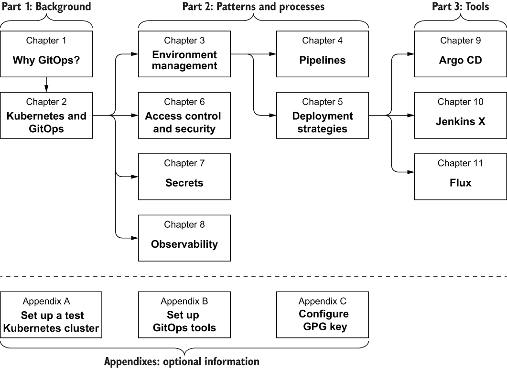

# 前置内容

## 前言

当 Intuit 开始从本地化到云原生转型的旅程时，这个过程本身为我们重新发明构建和部署流程提供了机会。与许多大型企业类似，我们旧的部署流程以数据中心为中心，有独立的 QA、运维和基础设施团队。代码可能需要几周时间才能部署，当出现生产问题时，开发者无法访问基础设施。基础设施问题可能需要很长时间才能解决，需要许多团队的协作。

当马里安娜·特塞尔（Intuit CTO）和杰夫·布鲁尔（Intuit SBSEG 首席架构师）决定对 Kubernetes 和 Docker 进行大赌注时，我们很幸运地成为第一个完全使用 Kubernetes 和 Docker 迁移我们生产应用程序的团队。在这个过程中，我们得以重新发明我们的 CI/CD 管道并采用 GitOps 流程。杰西和亚历克斯创建了 Argo CD（CNCF 孵化器项目）以满足企业对 GitOps 的需求。托德和他的团队创建了世界级的集群管理工具，使我们能够轻松扩展到数百个集群。

拥有像 Kubernetes 和 Docker 这样的标准，使得所有工程师都能在基础设施和部署方面使用一种共同的语言。工程师可以轻松地为其他项目做出贡献，并在开发过程完成后立即部署。GitOps 还允许我们确切地知道在我们的环境中是谁和什么发生了变化，这对于您需要遵守合规要求的情况尤为重要。我们无法想象回到我们以前进行部署的方式，我们希望这本书能帮助加速您拥抱 GitOps 的旅程！

## 致谢

这本书最终成为了一段历时 18 个月的旅程，需要大量的工作和额外的研究来讲述完整的故事。我们相信我们已经完成了我们设定的目标，这是一本任何想要采用 GitOps 和 Kubernetes 的人都会喜欢的书。

有很多人我们想要感谢他们在旅途中给予的帮助。在 Manning，我们想要感谢我们的开发编辑达斯汀·阿奇博尔德（Dustin Archibald）、项目编辑迪尔德丽·希姆（Deirdre Hiam）、校对员凯蒂·滕南特（Katie Tennant）和审阅编辑亚历克斯·德拉戈萨夫列维奇（Aleks Dragosavljevic）。

我们要感谢马里安娜·特塞尔（Marianna Tessel）和杰夫·布鲁尔（Jeff Brewer），他们为我们提供了转换和实验 GitOps 和 Kubernetes 的机会和自由。我们还要感谢普拉蒂克·瓦德赫（Pratik Wadher）、萨拉达希·斯里吉里亚朱（Saradhi Sreegiriaju）、穆库莉卡·库帕斯（Mukulika Kupas）和爱德华·李（Edward Lee）在整个过程中的指导。我们还要特别指出维克托·法尔西奇（Viktor Farcic）和奥斯卡·梅迪纳（Oscar Medina）对 Jenkins X 章节的深刻贡献。

向所有审阅者：安德烈斯·达米安·萨科（Andres Damian Sacco）、安杰洛·西蒙内·斯科托（Angelo Simone Scotto）、比约恩·纽豪斯（Björn Neuhaus）、克里斯·维纳（Chris Viner）、克利福德·瑟伯（Clifford Thurber）、科诺尔·雷德蒙德（Conor Redmond）、迪戈·凯拉（Diego Casella）、刘家辉（James Liu）、豪梅·洛佩斯（Jaume López）、杰里米·布赖恩（Jeremy Bryan）、杰罗姆·梅耶（Jerome Meyer）、约翰·古德里奇（John Guthrie）、马可·马森齐奥（Marco Massenzio）、马蒂厄·埃文（Matthieu Evrin）、迈克·恩索尔（Mike Ensor）、迈克·詹森（Mike Jensen）、罗曼·祖扎（Roman Zhuzha）、塞缪尔·布朗（Samuel Brown）、萨特杰·库马尔·萨胡（Satej Kumar Sahu）、肖恩·T·博克（Sean T. Booker）、温德尔·贝克威斯（Wendell Beckwith）和佐罗德扎伊·穆库亚（Zorodzayi Mukuya），我们说谢谢。你们的建议帮助使这本书变得更好。

致 Jeff Brewer，他激励我们所有人踏上这段精彩的转型之旅！

## 关于本书

### 本书面向的对象

本书旨在为 Kubernetes 基础设施和运维工程师以及希望通过 GitOps 流程使用声明式模型部署应用程序的软件开发人员提供帮助。它将有助于任何希望提高其 Kubernetes 集群的稳定性、可靠性、安全性和可审计性，同时通过自动化的持续软件部署来降低运营成本的人。

预期读者具备 Kubernetes（例如 Deployment、Pod、Service 和 Ingress 资源）的实际操作知识，以及包括持续集成/持续交付 (CI/CD)、版本控制系统（如 Git）和部署/基础设施自动化在内的现代软件开发实践的理解。

### 本书不面向的对象

成功实施成熟 GitOps 系统的高级用户可能更适合阅读关于他们选择工具的更高级书籍。

本书并不旨在深入探讨 Kubernetes 的所有方面。虽然我们涵盖了与 GitOps 相关的许多 Kubernetes 概念，但寻求 Kubernetes 综合指南的读者应参考其他关于该主题的杰出书籍和在线资源。

### 本书组织方式：路线图

本书描述了 GitOps 在 Kubernetes 上的好处，包括灵活的配置管理、监控、健壮性、多环境支持和安全性。您将学习实现这些好处最佳实践、技术和工具，这些工具使企业能够使用 Kubernetes 加速应用程序开发，同时不牺牲稳定性、可靠性或安全性。

您还将深入了解以下主题：

+   多环境管理，包括分支、命名空间和配置

+   使用 Git、Kubernetes 和管道进行访问控制

+   CI/CD、晋升、推送/拉取和发布/回滚的管道考虑事项

+   可观察性和漂移检测

+   管理机密

+   在滚动更新、蓝/绿、金丝雀和渐进式交付之间选择部署策略

本书采用动手实践的方法，通过教程和练习来培养您使用 Kubernetes 采用 GitOps 所需的技能。阅读本书后，您将了解如何为在 Kubernetes 上运行的应用程序实现声明式连续交付系统。本书包含以下动手教程：

+   开始管理 Kubernetes 应用程序部署

+   使用 Kustomize 进行配置和环境管理

+   编写自己的基本 Kubernetes 连续交付 (CD) 操作符

+   使用 Argo CD、1 Jenkins X、2 和 Flux3 实现持续集成/持续交付 (CI/CD)

命令式与声明式：部署 Kubernetes 有两种基本方式：命令式地使用多个`kubectl`命令或通过编写清单并使用`kubectl apply`进行声明式部署。前者适用于学习和交互式实验。后者最适合可重复部署和跟踪变更。

本书旨在让您跟随，运行教程的动手部分，使用您自己的测试 Kubernetes 集群。附录 A 描述了创建测试集群的几种选项。

书中包含许多代码示例。所有代码示例和附加支持材料都可以在本书的公开 GitHub 仓库中找到：

[`github.com/gitopsbook/resources`](https://github.com/gitopsbook/resources)

我们鼓励您克隆或分叉此仓库，并在完成书中的教程和练习时使用它。

以下工具和实用程序应在您的工作站上安装：

+   Kubectl (v1.16 或更高版本)

+   Minikube (v1.4 或更高版本)

+   Bash 或 Windows Subsystem for Linux (WSL)

大多数教程和练习都可以使用在您的工作站上运行的 minikube 完成。如果不是，我们将提及是否需要运行在云服务提供商上的集群，您可以通过附录 A 获取创建集群的详细信息。

注意：在云服务提供商上运行测试 Kubernetes 集群可能会产生额外费用。虽然我们已经尽可能降低了推荐测试配置的成本，但请记住，您对这些费用负责。我们建议您在完成每个教程或练习后删除您的测试集群。

本书分为 3 部分，共 11 章。第一部分涵盖了背景知识，并介绍了 GitOps 和 Kubernetes：

+   第一章带您回顾软件部署的演变历程，以及 GitOps 如何成为最新的实践。它还涵盖了 GitOps 的许多关键概念和优势。

+   第二章提供了 Kubernetes 的关键概念以及为什么其声明式特性非常适合 GitOps。它还涵盖了核心操作员概念以及如何实现一个简单的 GitOps 操作员。

第二部分介绍了采用 GitOps 流程的模式和过程：

+   第三章讨论了环境的定义以及 Kubernetes Namespaces 如何很好地映射为环境。它还涵盖了分支策略和配置管理到环境实现。

+   第四章深入探讨了 GitOps CI/CD 管道，全面描述了完整管道所需的所有阶段。它还涵盖了代码、镜像和环境升级，以及回滚机制。

+   第五章描述了各种部署策略，包括滚动更新、蓝绿部署、金丝雀发布和渐进式交付。它还涵盖了如何通过使用原生 Kubernetes 资源和其它开源工具来实现每种策略。

+   第六章讨论了 GitOps 驱动的部署的攻击面以及如何减轻每个区域。它还回顾了 Jsonnet、Kustomize 和 Helm，以及如何为您的用例选择合适的配置管理模式。

+   第七章讨论了管理 GitOps 秘密的各种策略。它还涵盖了几个秘密管理工具以及原生的 Kubernetes 秘密。

+   第八章解释了可观测性的核心概念以及为什么它对 GitOps 很重要。它还描述了使用 GitOps 和 Kubernetes 实现可观测性的各种方法。

第三部分介绍了几个企业级 GitOps 工具：

+   第九章讨论了 Argo CD 的意图和架构。它还涵盖了使用 Argo CD 配置应用程序部署以及如何在生产中保护 Argo CD。

+   第十章讨论了 Jenkins X 的意图和架构。它还涵盖了配置应用程序部署和升级到各种环境。

+   第十一章讨论了 Flux 的意图和动机。它还涵盖了使用 Flux 和多云租户配置应用程序部署。

本书组织结构是为了按顺序阅读所有章节。然而，如果您想直接跳到某个特定领域，我们建议您先阅读先决章节。例如，如果您想直接学习使用 Argo CD，我们建议您在阅读第九章之前先阅读第 1、2、3 和 5 章。

### 关于代码

本书包含许多源代码示例，既有编号列表，也有与普通文本内联。在这两种情况下，源代码都使用`固定宽度字体`格式化，以将其与普通文本区分开来。有时，代码也会加粗，以突出显示与章节中先前步骤相比已更改的代码，例如当新功能添加到现有代码行时。

在许多情况下，原始源代码已被重新格式化；我们已添加换行和重新整理缩进来适应书中的可用页面空间。此外，当代码在文本中描述时，源代码中的注释通常已从列表中删除。代码注释伴随许多列表，突出显示重要概念。本书中的示例源代码可以从[`github.com/gitopsbook /resources`](https://github.com/gitopsbook/resources)下载。

### liveBook 讨论论坛

购买 *GitOps 和 Kubernetes* 包括免费访问由 Manning Publications 运行的私有网络论坛，您可以在论坛中就本书发表评论、提出技术问题，并从作者和其他用户那里获得帮助。要访问论坛，请访问[`livebook.manning.com/book/GitOps-and-Kubernetes/discussion`](https://livebook.manning.com/book/GitOps-and-Kubernetes/discussion)。您还可以在[` livebook.manning.com/#!/discussion`](https://livebook.manning.com/#!/discussion)了解更多关于 Manning 论坛和行为准则的信息。

曼宁对读者的承诺是提供一个场所，让读者之间以及读者与作者之间可以进行有意义的对话。这并不是对作者参与特定数量承诺的承诺，作者对论坛的贡献仍然是自愿的（且未付费）。我们建议您尝试向他们提出一些挑战性的问题，以免他们的兴趣偏离！只要这本书有售，论坛和先前讨论的存档将可通过出版社的网站访问。

## 关于作者

比利·袁（Billy Yuen）是 Intuit 平台团队的首席工程师，专注于 AWS 和 Kubernetes 的采用、系统弹性和监控。此前，比利曾在 Netflix 的边缘服务团队工作，构建下一代边缘服务基础设施，以支持数百万客户（每天超过 30 亿次请求），具有高可扩展性、故障恢复能力和快速创新。比利曾在 2016 年的 Java One 和 Velocity NY 2016 上发表演讲，主题是“使用 Netflix Hystrix 实现操作卓越”、“KubeCon 2018 的 CI/CD at Lightspeed”以及 2019 年 Container World 的“Automated Canary Release”。

亚历山大·马图申采夫（Alexander Matyushentsev）是 Intuit 平台团队的首席工程师，专注于构建使使用 Kubernetes 更简单的工具。亚历山大热衷于开源、云原生基础设施以及提高开发者生产力的工具。他是 Argo Workflows 和 Argo CD 项目的核心贡献者之一。亚历山大曾在 2019 年的 KubeCon 上发表演讲，主题是“Intuit 如何使用 K8s 控制器进行金丝雀和蓝绿部署”。

托德·伊肯斯塔姆（Todd Ekenstam）是 Intuit 公司的一名首席工程师，负责构建一个支持 Intuit 约 5000 万客户的应用程序的、安全的多租户 Kubernetes 基础设施平台。在超过 25 年的职业生涯中，他参与了许多大型分布式系统项目，包括分层存储管理、对等数据库复制、企业存储虚拟化和双因素认证 SaaS。托德曾在学术、政府和行业会议上发表演讲，最近在 2018 年的 KubeCon 上作为嘉宾演讲者，主题是“Open Policy Agent 简介”。

詹斯·苏恩（Jesse Suen）是 Intuit 平台团队的首席工程师，负责开发基于微服务的、适用于 Kubernetes 的分布式应用程序。他曾是 Applatix（被 Intuit 收购）的早期工程师，构建了一个平台，帮助用户在公共云中运行容器化工作负载。在此之前，他曾是 Tintri 和 Data Domain 的工程团队的一员，从事虚拟化基础设施、存储、工具和自动化工作。詹斯是开源项目 Argo Workflows 和 Argo CD 的核心贡献者之一。

## 关于封面插图

《GitOps 和 Kubernetes》封面上的插图标题为“Habitant de Styrie”，或斯泰里亚居民。这幅插图取自雅克·格拉塞·德·圣索沃尔（1757-1810）的作品集，名为《不同国家的服饰》，于 1797 年在法国出版。每一幅插图都是手工精心绘制和着色的。格拉塞·德·圣索沃尔收藏中的丰富多样性生动地提醒我们，200 年前世界的城镇和地区在文化上有多么不同。人们相互隔离，说着不同的方言和语言。在街道或乡村，仅凭他们的服饰就能轻易识别他们居住的地方以及他们的职业或社会地位。

自那以后，我们的着装方式已经改变，当时地区间的多样性已经消失。现在很难区分不同大陆、城镇、地区或国家的人们。也许我们用文化多样性换取了更加丰富多彩的个人生活——当然，是为了更加多样化和快节奏的技术生活。

在难以区分一本计算机书和另一本计算机书的今天，Manning 通过基于两百年前区域生活丰富多样性的封面，庆祝计算机行业的创新精神和主动性，这些封面被格拉塞·德·圣索沃尔的图画重新赋予了生命。

* * *

1.[`argoproj.github.io/argo-cd`](https://argoproj.github.io/argo-cd/).

2.[`jenkins-x.io`](https://jenkins-x.io).

3.[`github.com/fluxcd/flux`](https://github.com/fluxcd/flux).
