# 1 为什么选择 GitOps？

本章涵盖

+   什么是 GitOps？

+   为什么 GitOps 很重要

+   GitOps 与其他方法的比较

+   GitOps 的优势

*Kubernetes* 是一个非常流行的开源平台，它编排和自动化操作。尽管它提高了基础设施和应用程序的管理和扩展，但 Kubernetes 经常面临管理应用程序复杂性的挑战。

*Git* 是目前软件行业中应用最广泛的版本控制系统。*GitOps* 是一套使用 Git 的力量在 Kubernetes 平台上提供修订和变更控制的一系列流程。GitOps 策略在团队快速且轻松地管理其服务的环境创建、升级和运营方面可以发挥重要作用。

使用 GitOps 与 Kubernetes 是一种自然匹配，声明式 Kubernetes 清单文件的部署由常见的 Git 操作控制。GitOps 以直观、易于访问的方式，将基础设施即代码和不可变基础设施的核心优势带给 Kubernetes 应用的部署、监控和生命周期管理。

## 1.1 向 GitOps 的演变

管理和运营计算机系统的两个日常任务是基础设施配置和软件部署。*基础设施配置* 准备计算资源（如服务器、存储和负载均衡器），使软件应用能够正确运行。*软件部署* 是将特定版本的软件应用部署到计算基础设施上的过程。管理这两个过程是 GitOps 的核心。然而，在我们深入探讨 GitOps 中如何进行这种管理之前，了解导致行业走向 DevOps 和 GitOps 的不可变、声明式基础设施的挑战是有用的。

### 1.1.1 传统运维

在传统的信息技术运维模型中，开发团队负责定期向质量保证（QA）团队交付新的软件应用版本，该团队测试新版本并将其交付给运维团队进行部署。软件的新版本可能每年发布一次，每季度发布一次，或者更短的时间间隔。对于传统的运维模型来说，支持越来越压缩的发布周期变得越来越困难。

运维团队负责新软件应用版本的配置和部署到该基础设施。运维团队的主要关注点是确保运行软件的系统的可靠性、弹性和安全性。没有复杂的管理框架，基础设施管理可能是一项困难的任务，需要大量的专业知识。

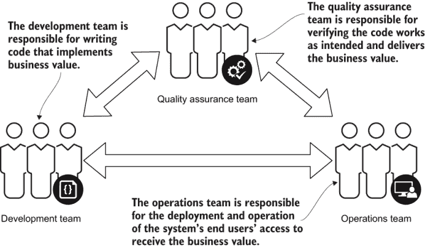

图 1.1 传统 IT 团队通常由独立的开发、质量保证（QA）和运维团队组成。每个团队专注于应用开发过程中的不同方面。

IT 运维*IT operations*是指由 IT 人员为内部或外部客户提供并由他们使用以提供企业技术需求的所有流程和服务。运维工作可以包括响应为维护工作或客户问题生成的票证。1

由于涉及三个团队，通常具有不同的管理-报告结构，因此需要一个详细的手递过程和对应用程序更改的彻底文档记录，以确保应用程序得到充分的测试，对基础设施进行适当的更改，并且应用程序被正确安装。然而，这些要求会导致部署时间延长，并减少可以进行的部署频率。此外，在每个团队之间的过渡中，关键细节可能无法得到有效沟通的可能性增加，可能导致测试中的差距或部署错误。

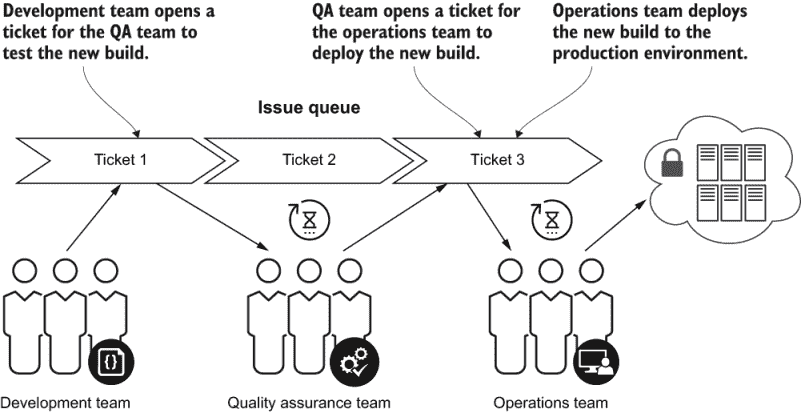

图 1.2 在传统的部署流程中，开发团队为 QA 团队打开一个工单以测试新产品版本。当测试成功时，QA 团队为运维团队打开一个工单以将最新版本部署到生产环境。

幸运的是，大多数开发团队通过使用自动化构建系统和称为*持续集成（CI）*的过程来编译、测试和生成可部署的工件。但新代码的部署通常是由运维团队手动执行的，涉及漫长的手动程序或通过部署脚本的局部自动化。在最坏的情况下，运维工程师手动将可执行二进制文件复制到多个服务器上所需的位置，并手动重新启动应用程序以使新二进制版本生效。这个过程容易出错，并且很少提供如审查、批准、可审计性和回滚等控制选项。

持续集成（CI）*CI*涉及软件应用程序的自动化构建、测试和打包。在典型的发展工作流程中，软件工程师将代码更改提交到中央代码仓库。这些更改必须经过测试并与旨在部署到生产的主体代码分支集成。CI 系统简化了代码的审查、构建和测试，以确保在合并到主分支之前其质量。

随着云计算基础设施的兴起，管理和控制计算和网络资源的接口越来越多地基于应用程序编程接口（APIs），这使得自动化程度更高，但同时也需要更多的编程技能来实现。这一事实，加上许多组织寻求优化运营、缩短部署时间、增加部署频率以及提高其计算系统的可靠性、稳定性和性能的方法，导致了新的行业趋势：DevOps。

### 1.1.2 DevOps

*DevOps* 既是组织结构，也是一种注重自动化的思维模式变革。运维团队不再负责部署和运营；应用的开发团队承担这些责任。

devops *DevOps* 是一套软件开发实践，它将软件开发（Dev）和 IT 运营（Ops）相结合，以缩短系统开发周期，同时频繁地、与业务目标紧密一致地交付功能、修复和更新.^(2)

图 1.3 展示了在传统的运维模型中，组织是如何通过功能边界进行划分的，有不同团队负责开发、质量和运维。在 DevOps 模型中，团队是根据产品或组件进行划分的，并且是跨学科的，包含具有所有功能技能集的团队成员。尽管图 1.3 指出了具有特定角色的团队成员，但在实践 DevOps 的高效能团队中，所有成员都跨功能贡献；每个成员都能够编码、测试、部署和运营他们的产品或组件。

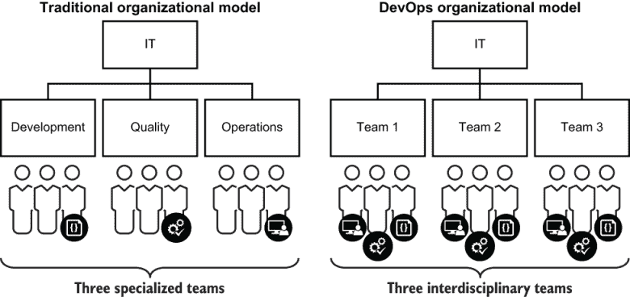

图 1.3 传统的组织模型有独立的团队负责开发、质量和运维。DevOps 组织模型允许以特定产品或组件为中心的跨学科团队。每个 DevOps 团队都是自给自足的，包含具有开发、测试和部署其应用程序技能的成员。

DevOps 的好处包括

+   开发和运维之间更好的协作

+   提高产品质量

+   更频繁的发布

+   新功能上市时间的缩短

+   设计、开发和运维成本的降低

案例研究：Netflix

Netflix 是 DevOps 流程的早期采用者之一，每位工程师都负责其功能的编码、测试、部署和支持。Netflix 的文化推崇“自由与责任”，这意味着每位工程师都可以独立发布，但必须确保该发布的正确运行。所有部署流程都是完全自动化的，因此工程师可以一键部署和回滚。所有新功能在功能完成时立即交付给最终用户。

### 1.1.3 GitOps

术语 *GitOps* 于 2017 年 8 月由 Weaveworks 的联合创始人兼首席执行官 Alexis Richardson 在一系列博客文章中提出.^(3) 从那时起，该术语在云原生社区以及 Kubernetes 社区中获得了显著的认知。GitOps 是一种以 Git 为特色的 DevOps 流程，其特点为

+   部署、管理和监控容器化应用程序的最佳实践

+   以开发者为中心的应用管理体验，使用 Git 进行开发和运维的完全自动化管道/工作流程

+   使用 Git 版本控制系统跟踪和批准对应用程序的基础设施和运行时环境的更改

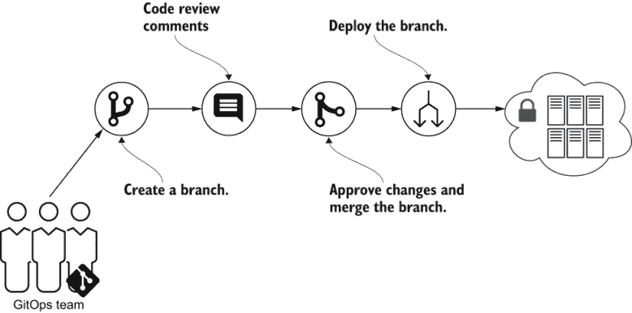

图 1.4 GitOps 发布工作流程从创建包含系统期望状态定义更改的仓库分支开始。

GitHub（以及 GitLab、Bitbucket 等）是现代软件开发生命周期中的核心，因此它也被用于系统操作和管理似乎是自然而然的。

在 GitOps 模型中，系统的期望配置存储在版本控制系统（如 Git）中。工程师不是直接通过 UI 或 CLI 对系统进行更改，而是更改表示期望状态的配置文件。Git 中存储的期望状态与系统实际状态之间的差异表明并非所有更改都已部署。这些更改可以通过标准版本控制流程（如拉取请求、代码审查和合并到主分支）进行审查和批准。当更改被批准并合并到主分支后，操作软件进程负责根据 Git 中存储的配置将系统的当前状态更改为期望状态。

在 GitOps 的理想实现中，不允许手动更改系统，所有对配置的更改都必须是对存储在 Git 中的文件的更改。在极端情况下，更改系统的权限仅授予操作软件进程。在 GitOps 模型中，基础设施和运维工程师的角色从执行基础设施更改和应用部署转变为开发和维护 GitOps 自动化，并帮助团队使用 Git 审查和批准更改。

Git 具有许多功能和技术能力，使其成为 GitOps 的理想选择：

+   Git 存储每个提交。通过适当的访问控制和安全配置（在第六章中介绍），所有更改都是可审计的和防篡改的。

+   Git 中的每个提交都代表了一个系统在该时间点的完整配置。

+   Git 中的每个提交对象都与它的父提交相关联，这样在创建和合并分支时，提交历史在需要时是可用的。

注意 GitOps 的重要性，因为它使对环境所做的更改具有可追溯性，并使使用大多数开发者已经熟悉的 Git 工具轻松回滚、恢复和自我修复变得容易。

Git 为验证和审计部署提供了基础。尽管可能可以使用除 Git 之外的版本控制系统实现 GitOps，但 Git 的分布式特性、分支和合并策略以及广泛的应用使其成为理想选择。

GitOps 不需要特定的工具集，但工具必须提供以下标准功能：

+   在 Git 中操作存储的系统期望状态

+   检测期望状态与实际状态之间的差异

+   对基础设施执行必要的操作，以同步实际状态与期望状态

尽管这本书主要关注 Kubernetes 中的 GitOps，但 GitOps 的许多原则可以独立于 Kubernetes 实现。

## 1.2 GitOps 的开发者好处

GitOps 为开发者提供了许多好处，因为它允许他们以与他们的软件开发过程管理方式相同的方式处理基础设施配置和代码部署，并且使用一个熟悉的工具：Git。

### 1.2.1 基础设施即代码

*基础设施* *即代码* (IaC) 是 GitOps 的基础范式。运行您应用程序的基础设施配置是通过执行自动化流程而不是手动步骤来完成的。4 在实践中，IaC 意味着基础设施更改被编码化，并且基础设施的源代码存储在版本控制系统之中。让我们来看看最显著的好处：

+   *可重复性*——所有有手动配置基础设施经验的都知道这个过程既耗时又容易出错。不要忘记，同样的过程通常需要重复多次，因为应用程序通常部署到多个环境中。如果发现问题，使用可重复的过程回滚到早期的工作配置会更简单，从而允许更快的恢复。

+   *可靠性*——自动化流程显著减少了不可避免的人类错误的可能性，从而降低了故障的可能性。当过程被编码化时，基础设施质量不再依赖于执行部署的特定工程师的知识和技能。基础设施配置的自动化可以稳步改进。

+   *效率*——IaC 提高了团队的生产力。使用 IaC，工程师更有效率，因为他们使用熟悉的工具，如 API、软件开发工具包 (SDK)、版本控制系统和文本编辑器。工程师可以使用熟悉的过程并利用代码审查和自动化测试。

+   *节省*——IaC 的初始实施需要大量的努力和时间投资。然而，尽管初始成本较高，但从长远来看，它更经济。为下一个环境提供基础设施不需要浪费宝贵的工程师时间进行手动配置。因为提供是快速且便宜的，所以没有必要保持未使用的环境运行。相反，每个环境可能根据需要创建，并在不再需要时销毁。 

+   *可见性*——当你定义 IaC 时，代码本身记录了基础设施应该如何看起来。

IaC 使开发者能够在节省时间和金钱的同时生产出高质量的软件。对于单一环境来说，手动配置基础设施可能更容易，但随着需要维护的应用程序环境数量不断增加，这将变得越来越具有挑战性。使用自动化的基础设施配置和遵循 IaC 原则可以实现可重复部署，并防止由配置漂移或缺失依赖项引起的运行时问题。

### 1.2.2 自助服务

如前所述，在传统的运维模型中，基础设施管理由专门的团队或公司内的独立组织执行。

然而，这种方法存在一个问题：它无法扩展。无论团队有多少成员，专用团队都会很快成为瓶颈。应用程序开发者不能自己进行基础设施更改，他们必须提交工单、发送电子邮件、安排会议并等待。无论过程如何，都会存在一个障碍，导致许多延迟并阻碍团队主动提出基础设施更改。GitOps 旨在通过自动化流程和实现自助服务来打破这个障碍。

在使用 GitOps 模型时，开发者独立工作，并在存储库中对基础设施的声明性配置提交更改，而不是发送工单。基础设施的更改不再需要跨团队沟通，这使得应用程序开发团队能够更快地前进，并拥有更多的自由进行实验。快速独立地做出基础设施更改的能力鼓励开发者承担其应用程序基础设施的责任。开发者不必向中央运维团队寻求解决方案，他们可以进行实验并开发出能够高效解决业务需求的设计。

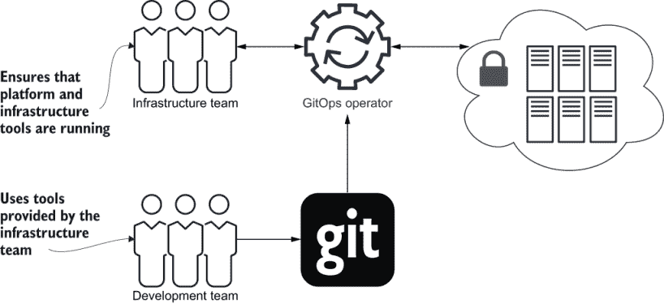

图 1.5 开发团队可以通过更新存储在 Git 存储库中的文件来更改系统的期望状态。这些更改将由其他团队成员进行代码审查，并在批准后合并到主分支。主分支由 GitOps 操作员处理，以部署集群的期望配置。

开发者不能完全控制所欲为，这可能会影响安全性或可靠性。每个更改都需要创建一个可以由应用程序开发团队的其他成员审查的拉取请求，如下文所述。

GitOps 的优势在于它允许自助服务基础设施更改，并在控制与开发速度之间提供了正确的平衡。

### 1.2.3 代码审查

*代码审查* 是一种软件开发实践，其中代码更改由第二双眼睛主动检查错误或遗漏，从而导致可预防的中断更少。执行代码审查是软件开发生命周期中的一个自然过程，DevOps/GitOps 的软件工程师应该熟悉。当 DevOps 工程师可以将基础设施视为代码时，逻辑上的下一步就是在部署之前对基础设施更改进行代码审查。当与 Kubernetes 一起使用 GitOps 时，“代码”审查可能主要是 Kubernetes YAML 清单或其他声明性配置文件，而不是用编程语言编写的传统代码。

除了错误预防外，代码审查还提供以下好处：

+   *教学和知识分享*—在审查更改时，审查者不仅有机会提供反馈，还可以学习到一些东西。

+   *设计和实现的一致性*—在审查过程中，团队可以确保更改与整体代码结构保持一致，并遵循公司的代码风格指南。

+   *团队凝聚力*—代码审查不仅用于批评和请求更改。这个过程也是团队成员互相表扬、增进关系并确保每个人都充分参与的一个绝佳方式。

在适当的代码审查过程中，只有经过验证和批准的基础设施更改才会提交到主分支，从而防止错误和操作环境的错误修改。代码审查不一定完全由人类完成。代码审查过程还可以运行自动化工具，如代码检查器、^(5) 静态代码分析和安全工具。

注意：其他用于代码和漏洞分析的自动化工具在第四章中介绍。

代码审查长期以来一直被视为软件开发最佳实践的 critical 部分。GitOps 的关键前提是，应用于应用程序代码的代码审查的严谨性应该应用于应用程序操作环境中的更改。

### 1.2.4 Git 拉取请求

Git 版本控制系统提供了一种机制，可以将提议的更改提交到分支或分叉，然后通过拉取请求与主分支合并。2005 年，Git 引入了 `request-pull` 命令。此命令生成所有更改的易读摘要，可以手动邮寄给项目维护者。拉取请求收集存储库文件的所有更改，并展示代码审查和批准的差异。

可以使用拉取请求来强制执行预合并代码审查。可以实施控制措施，要求在拉取请求合并到主分支之前进行特定的测试或批准。与代码审查一样，拉取请求是软件开发生命周期中的一个熟悉的过程，软件工程师可能已经使用。

图 1.6 展示了典型的拉取请求生命周期：

1.  开发者创建一个新的分支并开始对更改进行工作。

1.  当更改准备就绪时，开发者会发送一个代码审查的拉取请求。

1.  团队成员审查拉取请求，并根据需要要求更多更改。

1.  开发者在分支中持续进行更改，直到拉取请求获得批准。

1.  项目维护者将拉取请求合并到主分支。

1.  合并后，用于拉取请求的分支可以被删除。

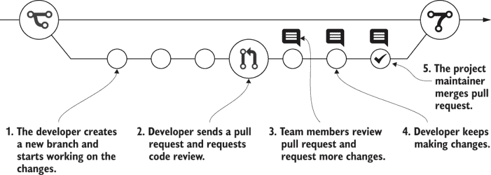

图 1.6 拉取请求生命周期允许进行多轮代码审查和修订，直到更改获得批准。然后，更改可以合并到主分支，并删除拉取请求分支。

当应用于基础设施更改审查时，审查步骤尤其有趣。在创建拉取请求后，项目维护者会收到通知并审查提议的更改。因此，审查者会提出问题，接收答案，并可能要求更多更改。这些信息通常会被存储并可供将来参考，因此现在拉取请求是基础设施更改的实时文档。在发生事件的情况下，可以轻松地找出谁进行了更改以及为什么应用了该更改。

## 1.3 GitOps 的操作优势

将 GitOps 方法与 Kubernetes 的声明式配置和主动协调模型相结合，提供了许多操作优势，这些优势提供了更可预测和可靠的系统。

### 1.3.1 声明式

从 DevOps 运动中涌现出的最突出的范例之一是*声明式系统和配置*模型。简单来说，使用声明式模型，你描述的是*想要实现什么*，而不是如何实现。相比之下，在命令式模型中，你描述的是一系列指令，用于操纵系统以达到你希望的状态。

为了说明这种差异，想象两种电视遥控器的样式：一种*命令式*样式和一种*声明式*样式。两种遥控器都可以控制电视的电源、音量和频道。为了讨论方便，假设电视只有三个音量设置（响亮、柔和、静音）和三个频道（1、2、3）。

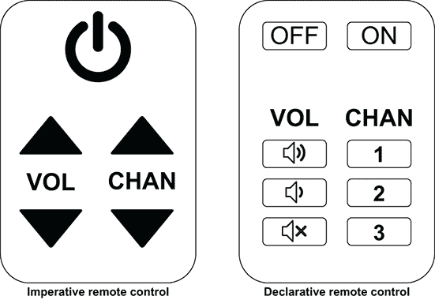

图 1.7 此图说明了命令式和声明式远程控制之间的差异。命令式远程控制允许你执行“增加频道 1”和“切换电源状态”等操作。相比之下，声明式远程控制允许你执行“调谐到频道 2”或“将电源状态设置为关闭”等操作。

命令式远程示例

假设你有一个简单的任务，即使用两个远程端同时切换到频道 3。要使用命令式远程端完成这个任务，你会使用频道上调按钮，该按钮向电视发送信号，使其当前频道增加 1。要达到频道 3，你需要连续按几次频道上调按钮，直到电视达到所需的频道。

声明式远程示例

相比之下，声明式遥控器提供了可以直接跳转到特定数字频道的独立按钮。在这种情况下，要切换到频道 3，你只需按一次频道-3 按钮，电视就会调到正确的频道。你是在声明你想要达到的最终状态（我想电视调到频道 3）。而在命令式遥控器上，你描述了需要执行的动作以达到你想要的状态（一直按频道上调按钮，直到电视调到频道 3）。

你可能已经注意到，在命令式更改频道的方法中，用户必须考虑是否继续按频道上调按钮，这取决于电视当前调谐的频道。然而，在声明式方法中，你可以毫不犹豫地按下频道-3 按钮，因为声明式遥控器上的这个按钮被认为是幂等的（而命令式遥控器上的频道上调按钮则不是）。

**幂等性**（Idempotency）是操作的一个属性，即操作可以执行任意多次并产生相同的结果。换句话说，如果一个操作可以任意多次执行，并且系统状态与只执行一次操作时的状态相同，那么这个操作就是幂等的。幂等性是区分声明式系统和命令式系统属性之一。声明式系统是幂等的；命令式系统则不是。

### 1.3.2 可观察性

**可观察性**是检查和描述系统当前运行状态的能力，并在出现意外条件时发出警报。部署的环境预期应该是可观察的。换句话说，你应该始终能够检查环境，以查看当前正在运行的内容以及配置情况。为此，服务和云提供商提供了一系列方法来促进可观察性（包括 CLIs、APIs、GUIs、仪表板、警报和通知），使用户尽可能方便地了解环境的当前状态。

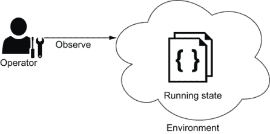

图 1.8 可观察性是操作员（可能是人或自动化）确定环境运行状态的能力。如果已知环境的当前运行状态，操作员可以仅一次就做出关于需要改变环境哪些方面的明智决策。适当控制环境需要对该环境进行可观察性。

虽然这些可观察性机制可以帮助回答“我的环境中当前正在运行什么？”的问题，但它们不能回答“对于我环境中当前配置和运行的资源，它们*应该*以这种方式配置和运行吗？”的问题。如果您曾经担任过系统管理员或操作员的职责，您可能非常熟悉这个问题。在某个时候——通常是当调试环境时——您会遇到一个可疑的配置设置，并认为它似乎不正确。有人（可能是您自己）意外或错误地更改了这个设置，还是这个设置是有意的？

很可能，您已经在实践中遵循了 GitOps 的一个基本原则：将应用程序配置的副本存储在源代码控制中，并使用它作为应用程序期望状态的真相来源。您可能并不是为了驱动持续部署而将此配置存储在 Git 中——只是为了确保环境可以被复制，例如在灾难恢复场景中。这个副本可以被视为期望的应用程序状态，除了灾难恢复用例之外，它还服务于另一个有用的目的：它使操作员能够在任何时间点将实际运行状态与源代码控制中保存的期望状态进行比较，以验证状态是否匹配。

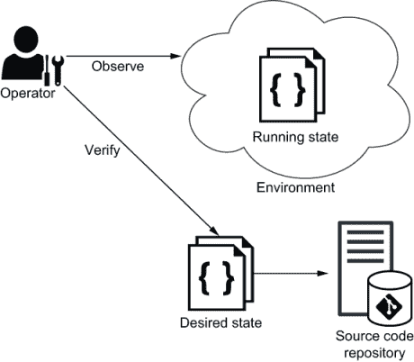

图 1.9 如果可以观察到环境的运行状态，并且环境的期望状态在 Git 中定义，则可以通过比较这两个状态来验证环境。

验证您环境的能力是 GitOps 的一个核心原则，它已被正式化为一种实践。通过将期望状态存储在一个系统中（例如 Git），并定期将该期望状态与运行状态进行比较，您解锁了新的可观察性维度。您不仅拥有提供商提供的标准可观察性机制，而且还能检测到与期望状态的偏差。

与期望状态的偏差，也称为*配置漂移*，可能由任何数量的原因引起。常见的例子包括操作员犯的错误、由于自动化而产生的意外副作用以及错误场景。配置漂移甚至可能是预期的，例如由过渡期（例如维护模式）引起的临时状态。

但是，配置差异的最重要原因可能是恶意的。在最坏的情况下，一个恶意行为者可能已经破坏了环境并重新配置了系统以运行恶意镜像。因此，可观察性和验证对于系统的安全性至关重要。除非您已经建立了期望状态的真相来源，并且没有验证收敛到该真相来源的机制，否则您无法知道您的环境是否真正安全。

### 1.3.3 审计性和合规性

对于在受法律和法规影响信息管理和合规性评估框架的国家（在这个时代的大多数国家）开展业务的组织来说，确保合规性和可审计性是必不可少的。一些行业比其他行业监管更严格，但几乎所有公司都需要遵守基本的隐私和数据安全法律。许多组织必须大量投资于其流程和系统，以确保合规性和可审计性。使用 GitOps 和 Kubernetes，大多数合规性和可审计性要求都可以以最小的努力得到满足。

*合规性*是指验证组织的信息系统是否符合特定的行业标准，通常侧重于客户数据安全和遵守组织关于访问该客户数据的个人和系统的记录政策。第六章深入探讨了访问控制，第四章涵盖了管道来定义和执行您的合规性部署流程。

*可审计性*是指系统被验证为符合一系列标准的能力。如果一个系统无法向内部或外部审计员展示其符合性，则不能对该系统的符合性做出任何声明。第八章涵盖了可观察性，包括使用 Git 提交历史和 Kubernetes 事件来实现可审计性。

案例研究：Facebook 和剑桥分析公司

剑桥分析公司，一家受特朗普 2016 年竞选活动总统聘请的政治数据公司，未经许可获取了超过 5000 万 Facebook 用户的私人信息。这些数据被用来为每个用户生成一个性格评分，并将其与美国的选民记录相匹配。剑桥分析公司利用这些信息为其选民画像和定向广告服务。Facebook 被发现没有实施必要的控制措施来执行数据隐私，最终因违规行为被联邦贸易委员会罚款 50 亿美元。^a

^a [`www.ftc.gov/news-events/press-releases/2019/07/ftc-imposes-5-billion-penalty-sweeping-new-privacy-restrictions`](https://www.ftc.gov/news-events/press-releases/2019/07/ftc-imposes-5-billion-penalty-sweeping-new-privacy-restrictions)

可审计性也指审计员能够全面审查组织内部控制的程度。在典型的审计中，审计员会要求提供证据以确保规则和政策得到相应执行。证据可能包括限制用户数据访问的过程、处理个人可识别信息（PII）的方式以及软件发布流程的完整性。

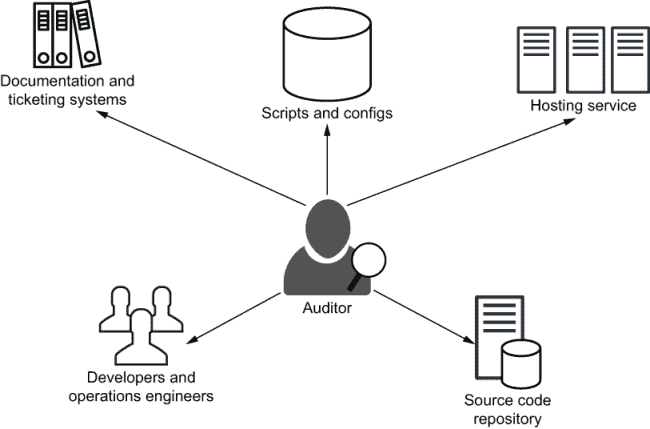

图 1.10 在传统的审计过程中，往往很难确定系统的期望状态。审计员可能需要查看各种信息来源，包括文档、变更请求和部署脚本。

案例研究：支付卡行业数据安全标准

信用卡行业数据安全标准（PCI DSS）是为处理主要信用卡网络品牌信用卡的组织制定的信息安全标准。违反 PCI DSS 可能会导致高额罚款，在最坏的情况下，甚至可能被暂停信用卡处理。PCI DSS 规定，“访问控制系统配置为根据工作分类和职能分配给个人的权限进行权限管理。”在审计期间，组织需要提供证据证明已实施访问控制系统以符合 PCI 标准.^a

^a [`en.wikipedia.org/wiki/Payment_Card_Industry_Data_Security_Standard`](https://en.wikipedia.org/wiki/Payment_Card_Industry_Data_Security_Standard)

所有这些与 GitOps 有什么关系？

Git 是一种版本控制软件，帮助组织管理代码的更改和访问控制。Git 通过一种特殊类型的数据库跟踪代码的每一次修改，该数据库旨在保护受管理源代码的完整性。Git 仓库中文件的 内容以及文件和目录之间、版本、标签和提交之间的真实关系都通过安全哈希算法（SHA）校验和散列算法得到保护。此算法保护代码和更改历史，防止意外和恶意更改，并确保历史记录可完全追溯。

Git 的历史跟踪还包括每个更改的作者、日期和关于更改目的的书面注释。通过良好的提交注释，你可以知道特定提交的 *原因*。Git 还可以与项目管理软件和缺陷跟踪软件集成，允许对所有更改进行完全追溯，并实现根本原因分析和其他法医分析。

如前所述，Git 支持拉取请求机制，这防止任何单一个人在没有第二个人批准的情况下更改系统。当拉取请求被批准时，更改会被记录在安全的 Git 更改历史中。Git 在变更控制、可追溯性和变更历史真实性方面的优势，加上 Kubernetes 的声明式配置，自然满足了审计性和合规性所需的 安全、可用性和处理完整性原则。

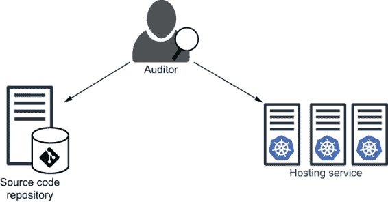

图 1.11 在 GitOps 中，审计过程可以简化，因为审计员可以通过检查源代码仓库来确定系统的期望状态。系统的当前状态可以通过审查托管服务和 Kubernetes 对象来确定。

### 1.3.4 灾难恢复

灾难可能由许多原因和多种形式引起。灾难可能是自然发生的（地震袭击数据中心），由设备故障引起（存储阵列中硬盘驱动器的丢失），意外发生（软件错误损坏关键数据库表），甚至可能是恶意的（网络攻击导致数据丢失）。

GitOps 通过将环境的声明性规范存储在源控制中作为真相来源，有助于恢复基础设施环境。拥有环境应具备的完整定义，便于在灾难发生时重新创建环境。灾难恢复变成了一种简单的练习，即（重新）应用存储在 Git 仓库中的所有配置。您可能会观察到，在灾难期间遵循的程序与日常升级和部署中使用的程序之间没有太大的区别。使用 GitOps，您实际上是在定期练习灾难恢复程序，这使得您在真正发生灾难时做好了充分的准备。

数据备份的重要性 虽然 GitOps 有助于简化计算和网络基础设施的灾难恢复，但持久性和有状态应用程序的恢复需要不同的处理方式。对于与存储相关的基础设施，没有传统的灾难恢复解决方案可以替代：备份、快照和复制。

## 摘要

+   GitOps 是一种使用 Git 作为记录系统的 DevOps 部署流程，用于管理复杂系统中的部署。

+   传统运维需要单独的团队进行部署，新版本可能需要几天（如果不是几周）才能部署完成。

+   DevOps 使工程师能够在代码完成后立即部署新版本，而无需等待集中的运维团队。

+   GitOps 提供完整的可追溯性和发布控制。

+   声明性模型描述了您想要实现的目标，而不是实现它的必要步骤。

+   一致性是操作的一个属性，即操作可以执行任意次数并产生相同的结果。

+   GitOps 的其他好处包括

    +   代码质量和发布控制的拉取请求

    +   可观察的运行状态和期望状态

    +   简化的合规性和可审计性流程，具有历史真实性和可追溯性

    +   简单的灾难恢复和回滚程序，与熟悉的部署体验保持一致

* * *

1.[`en.wikipedia.org/wiki/Data_center_management#Operations`](https://en.wikipedia.org/wiki/Data_center_management#Operations).

2.[`en.wikipedia.org/wiki/DevOps`](https://en.wikipedia.org/wiki/DevOps).

3.[`www.weave.works/blog/gitops-operations-by-pull-request`](https://www.weave.works/blog/gitops-operations-by-pull-request).

4.[`www.hashicorp.com/resources/what-is-infrastructure-as-code`](https://www.hashicorp.com/resources/what-is-infrastructure-as-code).

5.[`en.wikipedia.org/wiki/Lint_(software)`](https://en.wikipedia.org/wiki/Lint_(software)).
