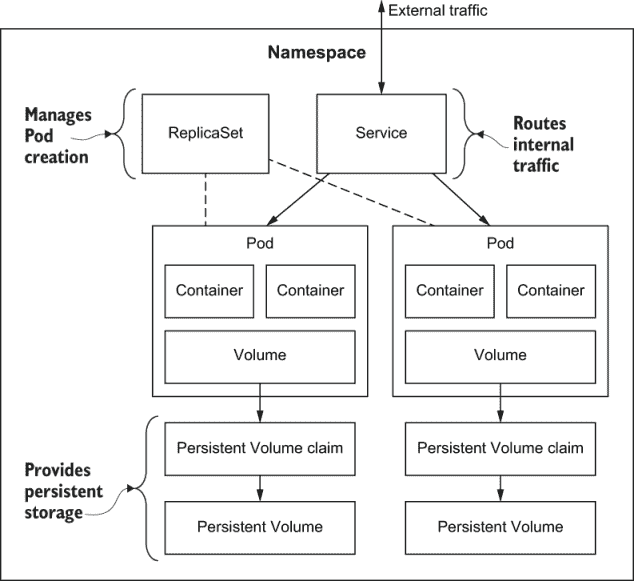
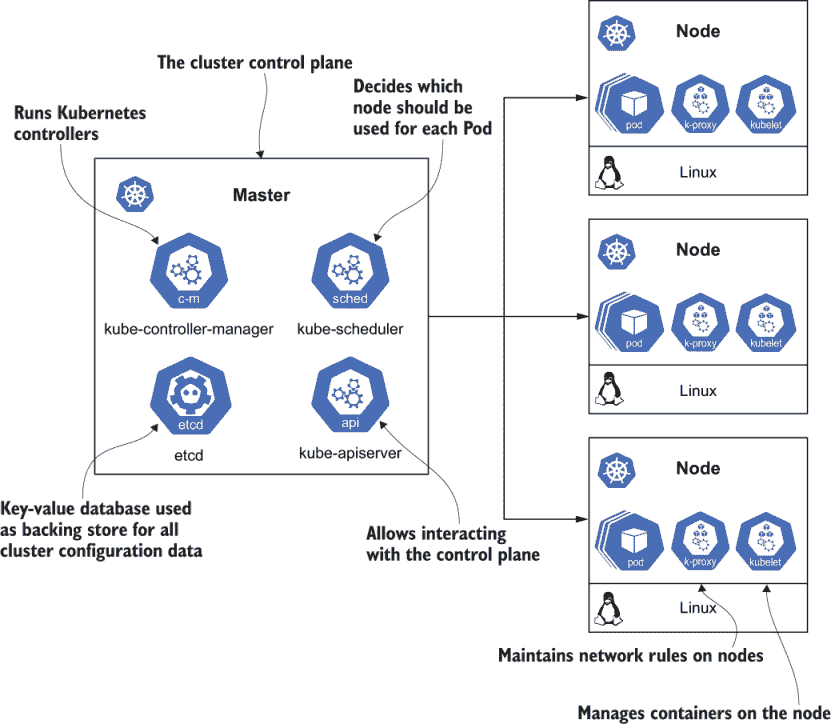
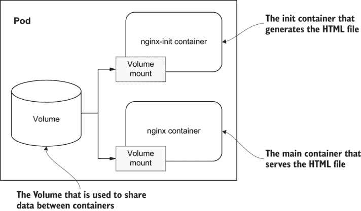
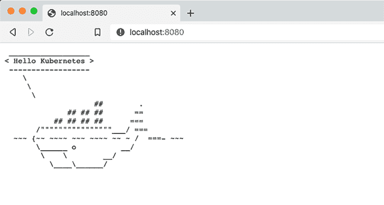
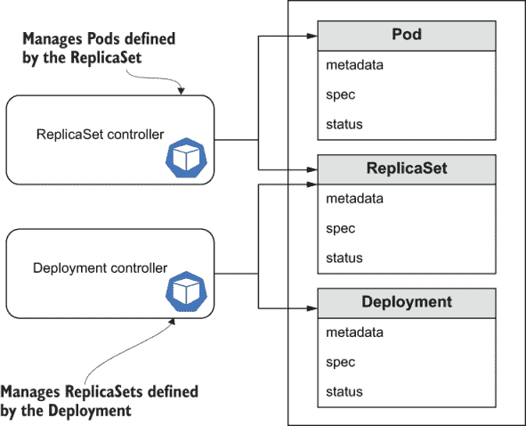
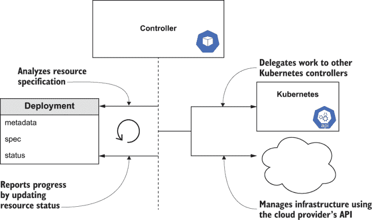
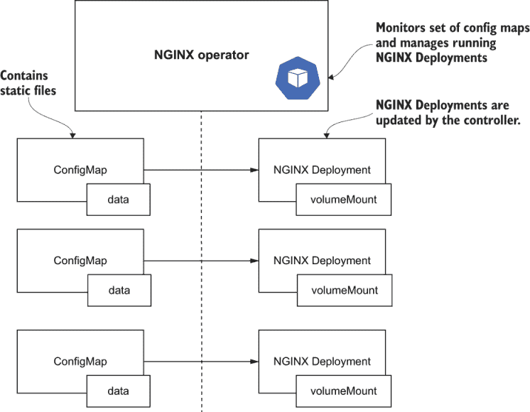
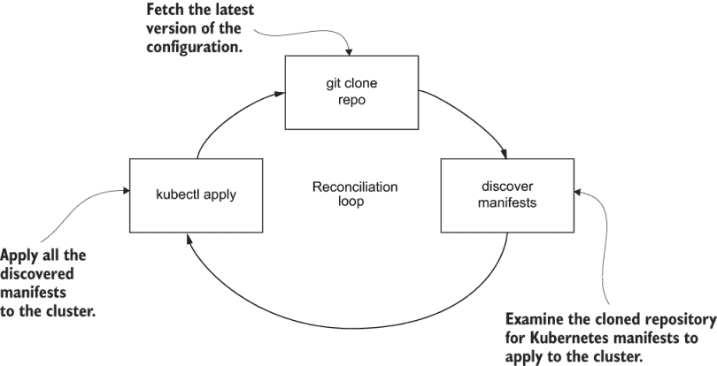
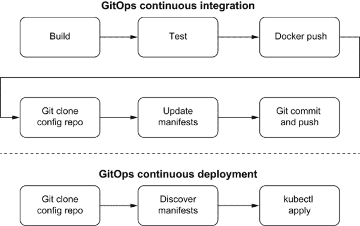

# 2 Kubernetes 和 GitOps

本章涵盖了

+   使用 Kubernetes 解决问题

+   在本地运行和管理 Kubernetes

+   理解 GitOps 的基础知识

+   实现一个简单的 Kubernetes GitOps 操作员

在第一章中，你学习了 Kubernetes 以及为什么它的声明式模型使其非常适合使用 GitOps 进行管理。本章将简要介绍 Kubernetes 架构和对象，以及声明式和命令式对象管理的区别。在本章结束时，你将实现一个基本的 GitOps Kubernetes 部署操作员。

## 2.1 Kubernetes 简介

在深入探讨为什么 Kubernetes 和 GitOps 能够如此良好地协同工作之前，让我们先谈谈 Kubernetes 本身。本节提供了 Kubernetes 的高级概述，包括它与其他容器编排系统的比较以及其架构。我们还将有一个练习，演示如何在本地运行 Kubernetes，这将被用于本书中的其他练习。本节仅是对 Kubernetes 的简要介绍和复习。如果你想有趣且信息丰富地了解 Kubernetes，可以查看云原生计算基金会出版的“儿童插图 Kubernetes 指南”和“Phippy 去动物园”^1。如果你对 Kubernetes 完全陌生，我们建议阅读 Marko Lukša（Manning，2020 年）的《Kubernetes 动作，第二版》，然后返回本书。如果你已经熟悉 Kubernetes 并运行 minikube，你可以跳到 2.1 节末的练习。

### 2.1.1 什么是 Kubernetes？

Kubernetes 是一个于 2014 年发布的开源容器编排系统。好的，但什么是容器，为什么你需要对它们进行编排？

容器提供了一种标准方式来打包你的应用程序代码、配置和依赖项到一个单一的资源中。这使得开发者可以确保应用程序无论在任何其他机器上都能正常运行，无论该机器可能有什么定制设置，这些设置可能与编写和测试代码所使用的机器不同。Docker 简化和普及了容器化，现在它被认为是一种用于构建分布式系统的基本技术。

chroot 是 UNIX 操作系统中可用的一种操作，它更改当前运行进程及其子进程的可见根目录。Chroot 提供了一种将进程及其子进程从系统其余部分隔离的方法。它是容器化的前身，也是 Docker 的基础。2

虽然 Docker 解决了单个应用程序的打包和隔离问题，但关于如何编排多个应用程序的操作以形成一个工作分布式系统的问题仍然很多：

+   容器是如何进行通信的？

+   容器之间的流量是如何路由的？

+   容器是如何进行扩展以处理额外的应用负载的？

+   集群的底层基础设施是如何进行扩展以运行所需的容器的？

所有这些操作都是容器编排系统的责任，并由 Kubernetes 提供。Kubernetes 帮助自动化使用容器部署、扩展和管理应用程序。

注意：Borg 是 Google 的内部容器集群管理系统，用于支持 Google 搜索、Gmail 和 YouTube 等在线服务。Kubernetes 利用 Borg 的创新和经验教训，解释了为什么它比竞争对手更稳定，发展得更快。3

Kubernetes 是基于 Google 使用其专有集群管理系统 Borg 进行容器编排的十年经验而开发和开源的。因此，对于如此复杂的系统来说，Kubernetes 相对稳定且成熟。由于其开放的 API 和可扩展的架构，Kubernetes 周围已经发展出一个庞大的社区，这进一步推动了其成功。它是 GitHub 上评分最高的项目之一（按星级衡量），提供了优秀的文档，并拥有庞大的 Slack 和 Stack Overflow 社区。社区成员的无尽博客和演示文稿分享了他们使用 Kubernetes 的知识。尽管 Kubernetes 是由 Google 启动的，但它不受单一供应商的影响。这使得社区开放、协作且具有创新性。

### 2.1.2 其他容器编排器

自 2016 年末以来，Kubernetes 已经成为业界公认的、事实上的行业标准容器编排系统，与 Docker 成为容器标准的方式相似。然而，有几个 Kubernetes 的替代方案解决了与 Kubernetes 相同的容器编排问题。Docker Swarm 是 Docker 在 2015 年发布的原生容器编排引擎，它与 Docker API 紧密集成，并使用基于 YAML 的部署模型 Docker Compose。Apache Mesos 于 2016 年正式发布（尽管在此之前已有很长时间的历史），支持大型集群，可扩展到数千个节点。

尽管将 GitOps 方法应用于使用其他容器编排系统部署应用程序可能是可行的，但本书的重点是 Kubernetes。

### 2.1.3 Kubernetes 架构

在本章结束时，你将完成一个练习，实现一个基本的 GitOps 持续部署操作符用于 Kubernetes。但要理解 GitOps 操作符是如何工作的，首先理解一些 Kubernetes 核心概念以及它在高层次上的组织方式是至关重要的。

Kubernetes 是一个庞大且健壮的系统，具有许多不同类型的资源和可以在这些资源上执行的操作。Kubernetes 在基础设施之上提供了一层抽象，并引入了以下一组基本对象，它们代表了所需的集群状态：

+   *Pod*—在同一主机上一起部署的一组容器。Pod 是节点上可部署的最小单元，提供挂载存储、设置环境变量和提供其他容器配置信息的方式。当一个 Pod 的所有容器退出时，该 Pod 也会死亡。

+   *Service*—定义了一组逻辑 Pod 及其访问策略的抽象。

+   *Volume*—Pod 中运行的容器可访问的目录。

Kubernetes 架构使用主要资源作为一组更高层次资源的基础层。更高层次资源实现了针对实际生产用例所需的功能，这些用例利用/扩展了主要资源的功能。在图 2.1 中，您可以看到 ReplicaSet 资源控制一个或多个 Pod 资源的创建。其他一些高级资源的例子包括



图 2.1 该图展示了在命名空间中部署的典型 Kubernetes 环境。ReplicaSet 是管理 Pod 生命周期的更高层次资源的一个例子，Pod 是更低层次、主要资源。

+   R*eplicaSe*t—定义了所需数量的配置相同的 Pod 正在运行。如果 ReplicaSet 中的 Pod 终止，将启动一个新的 Pod，以将运行 Pod 的数量恢复到所需数量。

+   *Deployment*—为 Pods 和 ReplicaSets 启用声明式更新。

+   *Job*—创建一个或多个运行至完成的 Pod。

+   *CronJob*—基于时间表创建作业。

另一个重要的 Kubernetes 资源是命名空间。大多数类型的 Kubernetes 资源属于一个（且仅一个）命名空间。命名空间定义了一个命名范围，其中特定命名空间内的资源必须具有唯一名称。命名空间还提供了一种通过基于角色的访问控制（RBAC）、网络策略和资源配额来隔离用户和应用程序的方法。这些控制允许创建一个多租户 Kubernetes 集群，其中多个用户共享同一个集群，避免相互影响（例如，“嘈杂邻居”问题）。正如我们在第三章中将要看到的，命名空间在 GitOps 中对于定义应用程序环境也是必不可少的。

Kubernetes 对象存储在控制平面中，^(4) 它监控集群状态，进行更改，调度工作，并对事件做出响应。为了执行这些任务，每个 Kubernetes 控制平面运行以下三个进程：

+   `kube-apiserver`—集群的入口点，提供 REST API 以评估和更新所需的集群状态

+   `kube-controller-manager`—守护进程通过 API 服务器持续监控集群的共享状态，尝试将当前状态移动到所需状态以进行更改

+   `kube-scheduler`—一个负责在集群中可用的节点间调度工作负载的组件

+   `etcd`—一个高度可用的键值数据库，通常用作 Kubernetes 所有集群配置数据的后端存储



图 2.2 Kubernetes 集群由运行在控制平面主节点上的多个服务以及运行在集群工作节点上的多个其他服务组成。这些服务共同提供了构成 Kubernetes 集群的必要服务。

实际的集群工作负载使用 Kubernetes 节点的计算资源运行。节点是一个工作机器（无论是虚拟机还是物理机），它运行必要的软件以允许它被集群管理。类似于主节点，每个节点运行一组预定义的进程：

+   `kubelet`——管理节点上实际容器的“节点代理”

+   `kube-proxy`——一个网络代理，在每个节点上反映 Kubernetes API 中定义的服务，并且可以进行简单的 TCP、UDP 和 SCTP 流转发

### 2.1.4 部署到 Kubernetes

在这个练习中，你将使用 *NG*I*NX* 在 Kubernetes 上部署一个网站。你将回顾一些基本的 Kubernetes 操作，并熟悉 minikube，这是你将在本书的大部分练习中使用的单节点 Kubernetes 环境。

Kubernetes 测试环境：minikube 请参考附录 A，使用 minikube 设置 Kubernetes 测试环境以完成此练习。

创建一个 Pod

正如本章前面提到的，Pod 是 Kubernetes 中最小的对象，代表特定的应用程序工作负载。Pod 代表在相同主机上运行并具有相同操作要求的容器组。单个 Pod 的所有容器共享相同的网络地址、端口空间和（可选）文件系统，这是通过 Kubernetes 卷实现的。

NGINX NGINX 是一个开源软件 Web 服务器，许多组织和企业使用它来托管他们的网站，因为它具有高性能和稳定性。

在这个练习中，你将创建一个 Pod，使用 NGINX 托管网站。在 Kubernetes 中，可以通过 YAML 文本文件“清单”定义对象，该文件提供了 Kubernetes 创建和管理对象所需的所有信息。以下是我们的 NGINX Pod 清单的列表。

列表 2.1 NGINX Pod 清单 [(http://mng.bz/e5JJ)](https://shortener.manning.com/e5JJ)

```
kind: Pod                              ❶
apiVersion: v1
metadata:                              ❷
  name: nginx
spec:                                  ❸
  restartPolicy: Always
  volumes:                             ❹
    - name: data
      emptyDir: {}
  initContainers:
  - name: nginx-init                   ❺
    image: docker/whalesay
    command: [sh, -c]
    args: [echo "<pre>$(cowsay -b 'Hello Kubernetes')</pre>" > /data/index.html]
    volumeMounts:                        
    - name: data
      mountPath: /data
  containers:
  - name: nginx                        ❻
    image: nginx:1.11
    volumeMounts:
    - name: data
      mountPath: /usr/share/nginx/html
```

❶ 字段 kind 和 apiVersion 存在于每个 Kubernetes 资源中，并确定应该创建什么类型的对象以及如何处理它。

❷ 在这个例子中，元数据有一个名称字段，有助于识别每个 Kubernetes 资源。元数据还可能包含 UID、标签和其他将在以后介绍的字段。

❸ 规范部分包含特定于特定对象的配置。在 Pod 示例中，规范包括容器列表、容器之间共享的卷以及 Pod 的重启策略。

❹ 用于在容器之间共享数据的卷

❺ 初始化部分包含使用 cowsay^(5) 命令生成的 HTML。

❻ 主要容器，用于通过 NGINX 服务器提供生成的 HTML 文件

你可以输入此列表并将其保存为 nginx-Pod.yaml 文件名。然而，由于本书的目标不是提高你的打字技巧，我们建议克隆第一章中提到的公共 Git 仓库，该仓库包含本书中的所有列表，并直接使用这些文件：

[`github.com/gitopsbook/resources`](https://github.com/gitopsbook/resources)

让我们继续启动 minikube 集群并使用以下命令创建 NGINX Pod：

```
$ minikube start
(minikube/default)
😁  minikube v1.1.1 on darwin (amd64)
🔥  Creating virtualbox VM (CPUs=2, Memory=2048MB, Disk=20000MB) ...
🐳  Configuring environment for Kubernetes v1.14.3 on Docker 18.09.6
🚜  Pulling images ...
🚀  Launching Kubernetes ...
⏳   Verifying: apiserver proxy etcd scheduler controller dns
🏄  Done! kubectl is now configured to use "minikube"
$ kubectl create -f nginx-Pod.yaml
Pod/nginx created
```

图 2.3 显示了 Pod 在 minikube 内部运行的外观。



图 2.3 nginx-init 容器将所需的 index.html 文件写入挂载的卷。主要的 NGINX 容器也挂载了卷，并在接收到 HTTP 请求时显示生成的 index.html。

获取 Pod 状态

一旦 Pod 创建完成，Kubernetes 会检查`spec`字段，并尝试在集群中适当节点上运行配置的容器集。关于进度的信息可以在 Pod 的`status`字段中找到。kubectl 实用工具提供了多个命令来访问它。让我们尝试使用`kubectl get Pods`命令来获取 Pod 状态：

```
$ kubectl get Pods
NAME    READY   STATUS    RESTARTS   AGE
nginx   1/1     Running   0          36s
```

`get Pods`命令提供了特定命名空间中所有 Pod 的列表。在这种情况下，我们没有指定命名空间，因此它给出了在默认命名空间中运行的 Pod 列表。假设一切顺利，*NGINX* Pod 应该处于`Running`状态。

要了解 Pod 状态更多或调试 Pod 为何不在`Running`状态的原因，可以使用`kubectl describe Pod`命令输出详细信息，包括相关的 Kubernetes 事件：

```
$ kubectl describe Pod nginx
Name:         nginx
Namespace:    default
Priority:     0
Node:         minikube/192.168.99.101
Start Time:   Sat, 26 Oct 2019 21:58:43 -0700
Labels:       <none>
Annotations:  kubectl.kubernetes.io/last-applied-configuration:

{"apiVersion":"v1","kind":"Pod","metadata":{"annotations":{},"name":"nginx","Namespace":"default"},"spec":{"containers":[{"image":"nginx:1...
Status:       Running
IP:           172.17.0.4
Init Containers:
  nginx-init:
    Container ID:  docker://128c98e40bd6b840313f05435c7590df0eacfc6ce989ec15cb7b484dc60d9bca
    Image:         docker/whalesay
    Image ID:      docker-pullable://docker/whalesay@sha256:178598e51a26abbc958b8a2e48825c90bc22e641de3d31e18aaf55f3258ba93b
    Port:          <none>
    Host Port:     <none>
    Command:
      sh
      -c
    Args:
      echo "<pre>$(cowsay -b 'Hello Kubernetes')</pre>" > /data/index.html
    State:          Terminated
      Reason:       Completed
      Exit Code:    0
      Started:      Sat, 26 Oct 2019 21:58:45 -0700
      Finished:     Sat, 26 Oct 2019 21:58:45 -0700
    Ready:          True
    Restart Count:  0
    Environment:    <none>
    Mounts:
      /data from data (rw)
      /var/run/secrets/kubernetes.io/serviceaccount from default-token-vbhsd (ro)
Containers:
  nginx:
    Container ID:   docker://071dd946709580003b728cef12a5d185660d929ebfeb84816dd060167853e245
    Image:          nginx:1.11
    Image ID:       docker-pullable://nginx@sha256:e6693c20186f837fc393390135d8a598a96a833917917789d63766cab6c59582
    Port:           <none>
    Host Port:      <none>
    State:          Running
      Started:      Sat, 26 Oct 2019 21:58:46 -0700
    Ready:          True
    Restart Count:  0
    Environment:    <none>
    Mounts:
      /usr/share/nginx/html from data (rw)
      /var/run/secrets/kubernetes.io/serviceaccount from default-token-vbhsd (ro)
Conditions:
  Type              Status
  Initialized       True
  Ready             True
  ContainersReady   True
  PodScheduled      True
Volumes:
  data:
    Type:       EmptyDir (a temporary directory that shares a Pod's lifetime)
    Medium:
    SizeLimit:  <unset>
  default-token-vbhsd:
    Type:        Secret (a volume populated by a Secret)
    SecretName:  default-token-vbhsd
    Optional:    false
QoS Class:       BestEffort
Node-Selectors:  <none>
Tolerations:     node.kubernetes.io/not-ready:NoExecute for 300s
                 node.kubernetes.io/unreachable:NoExecute for 300s
Events:
  Type    Reason     Age   From               Message
  ----    ------     ----  ----               -------
  Normal  Scheduled  37m   default-scheduler  Successfully assigned default/nginx to minikube
  Normal  Pulling    37m   kubelet, minikube  Pulling image "docker/whalesay"
  Normal  Pulled     37m   kubelet, minikube  Successfully pulled image "docker/whalesay"
  Normal  Created    37m   kubelet, minikube  Created container nginx-init
  Normal  Started    37m   kubelet, minikube  Started container nginx-init
  Normal  Pulled     37m   kubelet, minikube  Container image "nginx:1.11" already present on machine
  Normal  Created    37m   kubelet, minikube  Created container nginx
  Normal  Started    37m   kubelet, minikube  Started container nginx
```

通常，事件部分将包含有关 Pod 为何不在`Running`状态的原因的线索。

最全面的信息可以通过`kubectl get Pod nginx -o=yaml`获取，它以 YAML 格式输出对象的完整内部表示。原始的 YAML 输出难以阅读，通常是为了程序化访问资源控制器。Kubernetes 资源控制器将在本章后面更详细地介绍。

访问 Pod

当 Pod 处于`Running`状态时，意味着所有容器都已成功启动，NGINX Pod 已准备好处理请求。如果我们的集群中的 NGINX Pod 正在运行，我们可以尝试访问它并证明它正在工作。

默认情况下，Pod 无法从集群外部访问。有多种配置外部访问的方式，包括 Kubernetes 服务、Ingress 等。为了简化，我们将使用`kubectl port-forward`命令，该命令将本地端口上的连接转发到 Pod 上的端口：

```
$ kubectl port-forward nginx 8080:80
Forwarding from 127.0.0.1:8080 -> 80
Forwarding from [::1]:8080 -> 80
```

保持`kubectl port-forward`命令运行，并在浏览器中尝试打开 http://localhost:8080/。你应该会看到生成的 HTML 文件！



图 2.4 从 docker/whalesay 镜像生成的 HTML 文件内容是一个可爱的鲸鱼 ASCII 渲染，其问候语通过命令参数传递。`port-forward`命令允许 Pod（HTML）的 80 端口在本地主机的 8080 端口上访问。

练习 2.1

现在您的 NGINX Pod 正在运行，请使用`kubectl` `exec`命令在运行中的容器上获取一个 shell。

提示：命令可能类似于`kubectl` `exec` `-it <POD_NAME> -- /bin/bash`。在 shell 中四处探索。运行`ls`、`df`和`ps` `-ef`以及其他 Linux 命令。如果你终止 NGINX 进程会发生什么？

在这个练习的最终步骤中，让我们删除 Pod 以释放集群资源。可以使用以下命令删除 Pod：

```
$ kubectl delete Pod nginx
Pod "nginx" deleted
```

## 2.2 声明式与 imperative 对象管理

Kubernetes 的`kubectl`命令行工具用于创建、更新和管理 Kubernetes 对象，并支持 imperative 命令、imperative 对象配置和声明式对象配置。6 让我们通过一个真实世界的示例来了解 Kubernetes 中 imperative/procedural 配置与声明式配置之间的区别。首先，让我们看看 kubectl 如何被 imperatively 使用。

声明式与 imperative 请参阅第 1.3.1 节，以详细了解声明式与 imperative 的区别。

在以下示例中，让我们创建一个脚本，该脚本将部署一个具有三个副本和一些注释的 NGINX 服务。

列表 2.2 Imperative kubectl 命令 [(imperative-deployment.sh)](https://github.com/gitopsbook/resources/blob/master/chapter-02/imperative-deployment.sh)

```
#!/bin/sh
kubectl create deployment nginx-imperative --image=nginx:latest     ❶
kubectl scale deployment/nginx-imperative --replicas 3              ❷
kubectl annotate deployment/nginx-imperative environment=prod       ❸
kubectl annotate deployment/nginx-imperative organization=sales     ❹
```

❶ 创建一个名为 nginx-imperative 的新部署对象

❷ 将 nginx-imperative 部署扩展到具有三个 Pod 副本

❸ 在 nginx-imperative 部署中添加了一个带有键环境值 prod 的注释

❹ 在 nginx-imperative 部署中添加了一个带有关键组织和销售价值的注释

尝试在您的 minikube 集群上运行脚本，并检查部署是否成功创建：

```
$ imperative-deployment.sh
deployment.apps/nginx-imperative created
deployment.apps/nginx-imperative scaled
deployment.apps/nginx-imperative annotated
deployment.apps/nginx-imperative annotated
$ kubectl get deployments
NAME               READY   UP-TO-DATE   AVAILABLE   AGE
nginx-imperative   3/3     3            3           27s
```

太好了！部署已按预期创建。但现在让我们编辑我们的`deployment.sh`脚本，将`organization`注释的值从`sales`更改为`marketing`，然后重新运行脚本：

```
$ imperative-deployment-new.sh
Error from server (AlreadyExists): deployments.apps "nginx-imperative" already exists
deployment.apps/nginx-imperative scaled
error: --overwrite is false but found the following declared annotation(s): 'environment' already has a value (prod)
error: --overwrite is false but found the following declared annotation(s): 'organization' already has a value (sales)
```

如您所见，新脚本失败了，因为部署和注释已经存在。为了使其工作，我们需要增强我们的脚本，添加额外的命令和逻辑来处理更新情况，而不仅仅是创建情况。当然，这可以做到，但结果是我们不必做所有这些工作，因为 kubectl 本身可以检查系统的当前状态，并使用声明式对象配置做正确的事情。

以下清单定义了一个与我们的脚本创建的部署相同的部署（除了部署的名称是`nginx-declarative`）。

列表 2.3 声明式 [(http://mng.bz/OEpP)](https://shortener.manning.com/OEpP)

```
apiVersion: apps/v1
kind: Deployment
metadata:
  name: nginx-declarative
  annotations:
    environment: prod
    organization: sales
spec:
  replicas: 3
  selector:
    matchLabels:
      app: nginx
  template:
    metadata:
      labels:
        app: nginx
    spec:
      containers:
      - name: nginx
        image: nginx:latest
```

我们可以使用半魔法般的 `kubectl` `apply` 命令来创建 `nginx-declarative` 部署：

```
$ kubectl apply -f declarative-deployment.yaml
deployment.apps/nginx-declarative created
$ kubectl get deployments
NAME                READY   UP-TO-DATE   AVAILABLE   AGE
nginx-declarative   3/3     3            3           5m29s
nginx-imperative    3/3     3            3           24m
```

运行 `apply` 后，我们看到创建了 `nginx-declarative` 部署资源。但当我们再次运行 `kubectl` `apply` 时会发生什么呢？

```
$ kubectl apply -f declarative-deployment.yaml
deployment.apps/nginx-declarative unchanged
```

注意输出消息的变化。第二次运行 `kubectl` `apply` 时，程序检测到不需要进行任何更改，并随后报告部署未更改。这是 `kubectl` `create` 与 `kubectl` `apply` 之间的一个微妙但关键的区别。如果资源已存在，`kubectl` `create` 将会失败。`kubectl` `apply` 命令首先检测资源是否存在，如果对象不存在，则执行创建操作；如果对象已存在，则执行更新操作。

与强制性的示例一样，如果我们想将组织注释的值从销售更改为营销怎么办？让我们编辑 `declarative-deployment.yaml` 文件，并将 `metadata.annotations.organization` 字段从 `sales` 更改为 `marketing`。但在我们再次运行 `kubectl` `apply` 之前，让我们先运行 `kubectl` `diff`：

```
$ kubectl diff -f declarative-deployment.yaml
:
-    organization: sales                       ❶
+    organization: marketing
   creationTimestamp: "2019-10-15T00:57:44Z"
-  generation: 1                               ❷
+  generation: 2
   name: nginx-declarative
   Namespace: default
   resourceVersion: "347771"

$ kubectl apply -f declarative-deployment.yaml
deployment.apps/nginx-declarative configured
```

❶ 组织标签的值已从销售更改为营销。

❷ 在执行 kubectl apply 时，系统已更改了此资源的生成方式。

正如你所见，`kubectl` `diff` 正确识别出组织已从 `sales` 更改为 `marketing`。我们还可以看到 `kubectl` `apply` 成功应用了新的更改。

在这个练习中，强制性和声明性示例都导致以完全相同的方式配置了部署资源。乍一看，强制性的方法可能看起来要简单得多。与声明性部署规范的冗长性相比，它只包含几行代码，而声明性部署规范的冗长性是脚本大小的五倍。然而，它包含了一些问题，使得它在实践中使用时不是一个好的选择：

+   代码不具有幂等性，如果多次执行可能会得到不同的结果。如果再次运行，将会抛出一个错误，抱怨部署 NGINX 已经存在。相比之下，部署规范是幂等的，这意味着可以根据需要多次应用，处理部署已存在的情况。

+   随着时间的推移管理资源更改变得更加困难，尤其是在差异是减法的情况下。假设你不再希望组织被注释在部署上。简单地从脚本代码中移除 `kubectl` `annotate` 命令并不能解决问题，因为它对删除现有部署的注释没有任何帮助。需要单独的操作来删除它。另一方面，使用声明性方法，你只需从规范中移除注释行，Kubernetes 就会负责删除注释以反映你希望的状态。

+   理解变化更为困难。如果一个团队成员发送了一个修改脚本的拉取请求，以执行不同的操作，那么这就像任何其他源代码审查一样。审查者需要心理上遍历脚本的逻辑来验证算法是否实现了预期的结果。脚本中甚至可能存在错误。另一方面，修改声明式部署规范的拉取请求清楚地显示了系统期望状态的变化。审查起来更简单，因为没有逻辑需要检查，只有配置更改。

+   代码不是原子的，这意味着如果脚本中的四个命令之一失败，系统状态将部分更改，既不会回到原始状态，也不会达到期望状态。使用声明式方法，整个规范作为一个单一请求接收，系统尝试作为一个整体实现所有期望状态方面。

如你所想，最初只是一个简单的 shell 脚本，为了实现幂等性，需要变得越来越复杂。Kubernetes 部署规范中有数十个选项可用。使用脚本方法，需要在脚本中散布 if/else 检查，以了解现有状态并条件性地修改部署。

### 2.2.1 声明式配置的工作原理

正如我们在之前的练习中看到的，声明式配置管理是由 `kubectl` `apply` 命令驱动的。与 `scale` 和 `annotate` 这样的命令式 `kubectl` 命令相比，`kubectl` `apply` 命令有一个参数，即包含资源清单的文件的路径：

```
kubectl apply -f ./resource.yaml
```

该命令负责确定应该应用到 Kubernetes 集群中匹配资源上的哪些更改，并使用 Kubernetes API 更新资源。这是一个关键特性，使得 Kubernetes 成为 GitOps 的完美选择。让我们更深入地了解 `kubectl` `apply` 背后的逻辑，并了解它能做什么以及不能做什么。为了理解 `kubectl` `apply` 解决了哪些问题，让我们通过使用我们之前创建的 Deployment 资源来探讨不同的场景。

最简单的情况是当匹配的资源不存在于 Kubernetes 集群中。在这种情况下，kubectl 会使用存储在指定文件中的清单创建一个新的资源。

如果匹配的资源存在，为什么 kubectl 不替换它？如果你使用 `kubectl` `get` 命令查看完整的清单资源，答案就显而易见了。以下是示例中创建的 Deployment 资源的部分列表。为了清晰起见，清单的一些部分已被省略（用省略号表示）：

```
$ kubectl get deployment nginx-declarative -o=yaml
apiVersion: apps/v1
kind: Deployment
metadata:
  annotations:
    deployment.kubernetes.io/revision: "1"
    environment: prod
    kubectl.kubernetes.io/last-applied-configuration: |
      { ... }
    organization: marketing
  creationTimestamp: "2019-10-15T00:57:44Z"
  generation: 2
  name: nginx-declarative
  Namespace: default
  resourceVersion: "349411"
  selfLink: /apis/apps/v1/Namespaces/default/deployments/nginx-declarative
  uid: d41cf3dc-a3e8-40dd-bc81-76afd4a032b1
spec:
  progressDeadlineSeconds: 600
  replicas: 3
  revisionHistoryLimit: 10
  selector:
    matchLabels:
      app: nginx-declarative
  strategy:
    rollingUpdate:
      maxSurge: 25%
      maxUnavailable: 25%
    type: RollingUpdate
  template:
    ...
status:
  ...
```

如您可能已经注意到的，实时资源清单包括文件中指定的所有字段以及数十个新字段，如额外的元数据、`status`字段和资源规范中的其他字段。所有这些附加字段都是由 Deployment 控制器填充的，并包含有关资源运行状态的重要信息。控制器在`status`字段中填充有关资源状态的信息，并为所有未指定的可选字段应用默认值，例如`revisionHistoryLimit`和`strategy`。为了保留这些信息，`kubectl apply`合并了指定文件和实时资源清单。因此，该命令只更新文件中指定的字段，保持其他一切不变。所以如果我们决定缩小部署并将`replicas`字段更改为`1`，那么 kubectl 只更改实时资源中的该字段，并使用更新 API 将其保存回 Kubernetes。

在现实生活中，我们不想以声明性方式控制所有可能影响资源行为的字段。留出一些空间用于强制性，并跳过那些应该动态更改的字段是有意义的。Deployment 资源的`replicas`字段是一个完美的例子。您可以使用水平 Pod 自动伸缩器动态地根据负载扩展或缩小应用程序，而不是硬编码您想要使用的副本数量。

水平 Pod 自动伸缩器水平 Pod 自动伸缩器根据观察到的 CPU 利用率（或，在自定义度量支持的情况下，根据某些其他应用程序提供的度量）自动调整副本控制器、部署或副本集中的 Pod 数量。

让我们继续，从 Deployment 清单中移除`replicas`字段。应用这个更改后，`replicas`字段将重置为默认值一个副本。但是等等！`kubectl apply`命令只更新文件中指定的字段，并忽略其他字段。它是如何知道`replicas`字段已被删除的呢？允许 kubectl 处理删除用例的附加信息隐藏在实时资源的注解中。每次`kubectl apply`命令更新资源时，它都会将输入清单保存到`kubectl.kubernetes.io/last-applied-configuration`注解中。因此，当命令下次执行时，它会从注解中检索最近应用的清单，这代表了新期望清单和实时资源清单的共同祖先。这允许 kubectl 执行三次合并/合并，并正确处理从资源清单中删除某些字段的情况。

三向合并三向合并是一种合并算法，它自动分析两个文件之间的差异，同时考虑两个文件的起源或共同祖先。

最后，让我们讨论一下`kubectl apply`可能无法按预期工作的情况，以及应该谨慎使用它的情况。

首先，通常你不应该将命令式命令，如`kubectl edit`或`kubectl scale`，与声明式资源管理混合使用。这会导致当前状态与`last-applied-configuration`注解不匹配，并会破坏 kubectl 用来确定已删除字段的合并算法。典型的场景是当你使用`kubectl edit`对资源进行实验，并希望通过应用存储在文件中的原始清单来回滚更改。不幸的是，这可能不起作用，因为`kubectl edit`命令所做的更改并未存储在任何地方。例如，如果你临时将`resource` `limits`字段添加到部署中，`kubectl apply`不会移除它，因为`limits`字段在`last-applied-configuration`注解或文件中的清单中都没有提到。同样，`kubectl replace`命令也会忽略`last-applied-configuration`注解，并在应用更改后完全删除该注解。因此，如果你以命令式方式做出任何更改，你应该准备好在继续声明式配置之前使用命令式命令来撤销更改。

当你想要停止声明式管理字段时，也应该小心。这个问题的一个典型例子是将水平 Pod 自动伸缩器添加到管理现有部署副本数量的缩放。通常，在引入水平 Pod 自动伸缩器之前，部署副本的数量是声明式管理的。要将`replicas`字段的控制权交给水平 Pod 自动伸缩器，必须首先从包含部署清单的文件中删除`replicas`字段。这样做是为了确保下一次`kubectl apply`不会覆盖水平 Pod 自动伸缩器设置的`replicas`值。然而，不要忘记`replicas`字段可能也存储在`last-applied-configuration`注解中。如果是这样，清单文件中缺失的`replicas`字段将被视为字段删除，因此每次运行`kubectl apply`时，水平 Pod 自动伸缩器以命令式方式设置的`replicas`值将被从实时部署中移除。部署将缩放到默认的单个副本。

在本节中，我们介绍了管理 Kubernetes 对象的不同机制：命令式和声明式。你还了解了一些关于 kubectl 内部结构和它如何识别应用于实时对象的变化。但在此阶段，你可能想知道所有这些与 GitOps 有什么关系。答案是简单的：一切！理解 kubectl 和 Kubernetes 如何管理实时对象的变化对于理解后续章节中讨论的 GitOps 工具如何识别包含 Kubernetes 配置的 Git 仓库是否与实时状态同步，以及它如何跟踪和应用更改至关重要。

## 2.3 控制器架构

到目前为止，我们已经了解了 Kubernetes 的声明式特性和它提供的优势。让我们来谈谈每个 Kubernetes 资源背后的内容：控制器架构。了解控制器的工作原理将帮助我们更有效地使用 Kubernetes，并理解它如何扩展。

控制器是理解特定类型资源清单含义的大脑，并执行必要的任务以使系统的实际状态与清单中描述的期望状态相匹配。每个控制器通常只负责一种资源类型。通过监听与被管理资源类型相关的 API 服务器事件，控制器持续监视资源配置的变化，并执行必要的任务以将当前状态移动到期望状态。Kubernetes 控制器的一个基本特性是能够将工作委派给其他控制器。这种分层架构非常强大，并允许你有效地重用不同资源类型提供的功能。让我们通过一个具体的例子来更好地理解委派的概念。

### 2.3.1 控制器委派

Deployment、ReplicaSet 和 Pod 资源完美地展示了委派如何赋予 Kubernetes 能力。Pod 提供了在集群中的节点上运行一个或多个请求资源的容器的功能。这使得 Pod 控制器可以专注于简单地运行一个应用程序实例，并抽象出与基础设施配置、扩展和缩减、网络以及其他复杂细节相关的逻辑，将这些留给其他控制器。尽管 Pod 资源提供了许多功能，但它仍然不足以在生产环境中运行应用程序。我们需要运行同一应用程序的多个实例（为了弹性和性能），这意味着我们需要多个 Pod。ReplicaSet 控制器解决了这个问题。它不是直接管理多个容器，而是编排多个 Pod，并将容器编排委派给 Pod 资源。同样，Deployment 控制器利用 ReplicaSet 提供的功能来实现各种部署策略，如滚动更新。



图 2.5 Kubernetes 允许资源分层。提供额外功能的高级资源，如 ReplicaSets 和 Deployments，可以管理其他高级资源或基本资源，如 Pods。这是通过一系列控制器实现的，每个控制器管理与其控制的资源相关的事件。

控制器委托的好处 通过控制器委托，Kubernetes 功能可以轻松扩展以支持新功能。例如，不向后兼容的服务只能使用蓝/绿策略（不是滚动更新）进行部署。控制器委托允许重新编写新的控制器以支持蓝/绿部署，并通过委托仍然可以利用 Deployment 控制器的功能，而无需重新实现 Deployment 控制器的核心功能。

所以，正如您可以从这个例子中看到的那样，控制器委托允许 Kubernetes 从简单的资源逐步构建更复杂的资源。

### 2.3.2 控制器模式

尽管所有控制器都有不同的职责，但每个控制器的实现都遵循相同的简单模式。每个控制器运行一个无限循环，并且每次迭代都会协调其负责的集群资源的所需状态和实际状态。在协调过程中，控制器正在寻找实际状态和所需状态之间的差异，并做出必要的更改，以将当前状态移动到所需状态。

所需状态由资源清单的 `spec` 字段表示。问题是，控制器如何知道实际状态？这个信息在 `status` 字段中可用。每次成功协调后，控制器都会更新 `status` 字段。`status` 字段为最终用户提供有关集群状态的信息，并使高级控制器的操作成为可能。图 2.6 展示了协调循环。



图 2.6 一个控制器在一个连续的协调循环中运行，它试图将 `spec` 中定义的所需状态与当前状态收敛。通过更新资源状态来报告资源的更改和更新。控制器可能将工作委托给其他 Kubernetes 控制器或执行其他操作，例如使用云提供商的 API 管理外部资源。

控制器与 operators 的比较

经常被混淆的两个术语是 *operator* 和 *controller*。在这本书中，术语 *GitOps operator* 用于描述持续交付工具，而不是 *GitOps controller*。这样做的原因是我们代表了一种特定的控制器，这种控制器是针对应用程序和特定领域的。

Kubernetes operators 一个 *Kubernetes operator* 是一个特定于应用程序的控制器，它扩展了 Kubernetes API，代表 Kubernetes 用户创建、配置和管理复杂有状态应用程序的实例。它建立在主要的 Kubernetes 资源和控制概念之上，并包括特定于领域或应用程序的知识，以自动化日常任务。

术语*操作符*和*控制器*经常被混淆，因为它们有时可以互换使用，两者之间的界限通常模糊不清。然而，另一种思考方式是，术语*操作符*用于描述特定应用的控制器。所有操作符都使用控制器模式，但并非所有控制器都是操作符。一般来说，控制器倾向于管理较低级别的、可重用的构建块资源，而操作符在更高层次上运行，且针对特定应用。控制器的一些例子包括所有管理 Kubernetes 原生类型（如部署、作业、入口等）的内置控制器，以及第三方控制器，如 cert-manager（提供和管理 TLS 证书）和 Argo 工作流控制器，后者在集群中引入了一种新的类似作业的工作流资源。操作符的一个例子是 Prometheus，它管理 Prometheus 数据库安装。

### 2.3.3 NGINX 操作符

在了解了控制器基础知识和控制器与操作符之间的区别之后，我们准备实现一个操作符！这个示例操作符将解决一个现实生活中的任务：管理一组预配置静态内容的 NGINX 服务器。操作符将允许用户指定一组 NGINX 服务器并配置每个服务器上挂载的静态文件。这项任务并不简单，展示了 Kubernetes 的灵活性和强大功能。

设计

如本章前面所述，Kubernetes 的架构允许您通过委派利用现有控制器的功能。我们的 NGINX 控制器将利用 Deployment 资源来委派 NGINX 部署任务。

接下来的问题是应该使用哪种资源来配置服务器列表和自定义静态内容。最合适的现有资源是 ConfigMap。根据官方 Kubernetes 文档，ConfigMap 是“一个用于以键值对形式存储非机密数据的 API 对象。”^(7) ConfigMap 可以作为环境变量、命令行参数或卷中的配置文件来使用。控制器将为每个 ConfigMap 创建一个 Deployment，并将 ConfigMap 数据挂载到默认的 NGINX 静态网站目录中。

实现

一旦我们决定了主要构建块的设计，就是时候编写一些代码了。大多数与 Kubernetes 相关的项目，包括 Kubernetes 本身，都是使用 Go 语言实现的。然而，Kubernetes 控制器可以使用任何语言实现，包括 Java、C++，甚至是 JavaScript。为了简化，我们将使用您可能最熟悉的语言：Bash 脚本语言。

在 2.3.2 节中，我们提到每个控制器都维护一个无限循环，并持续地协调期望状态和实际状态。在我们的示例中，期望状态由 ConfigMap 的列表表示。遍历每个 ConfigMap 变化的最高效方式是使用 Kubernetes 的 `watch` API。`watch` 功能由 Kubernetes API 为大多数资源类型提供，允许调用者在资源被创建、修改或删除时收到通知。kubectl 工具允许使用带有 `--watch` 标志的 `get` 命令来监视资源变化。`--output-watch-events` 命令指示 kubectl 输出更改类型，它可以是以下值之一：`ADDED`、`MODIFIED` 或 `DELETED`。



图 2.7 在 NGINX 操作符设计中，创建了一个包含 NGINX 将要提供的数据的 ConfigMap。NGINX 操作符为每个 ConfigMap 创建一个 Deployment。只需创建一个包含网页数据的 ConfigMap，就可以简单地创建额外的 NGINX 部署。

Kubectl 版本 确保您在本教程中使用 kubectl 的最新版本（版本 1.16 或更高版本）。`--output-watch-events` 选项是相对较新添加的。

列表 2.4 示例 ConfigMap ([`mng.bz/GxRN`](http://mng.bz/GxRN))

```
apiVersion: v1
kind: ConfigMap
metadata:
  name: sample
data:
  index.html: hello world
```

在一个窗口中，运行以下命令：

```
$ kubectl get --watch --output-watch-events configmap
```

在另一个终端窗口中，运行 `kubectl apply -f sample.yaml` 以创建示例 ConfigMap。注意运行 `kubectl --watch` 命令的窗口中的新输出。现在运行 `kubectl delete -f sample.yaml`。现在您应该看到一个 `DELETED` 事件出现：

```
$ kubectl get --watch --output-watch-events configmap
EVENT      NAME     DATA   AGE
ADDED      sample   1      3m30s
DELETED    sample   1      3m40s

```

手动运行此实验后，您应该能够看到我们如何将 NGINX 操作符编写为 Bash 脚本。

`kubectl get --watch` 命令在创建、更改或删除 ConfigMap 资源时输出新行。脚本将消耗 `kubectl get --watch` 的输出，并根据输出 ConfigMap 事件类型创建或删除新的 Deployment。现在，不拖延，完整的操作符实现如下代码所示。

列表 2.5 NGINX 控制器 [(http://mng.bz/zxmZ)](https://shortener.manning.com/zxmZ)

```
#!/usr/bin/env bash

kubectl get --watch --output-watch-events configmap \      ❶
-o=custom-columns=type:type,name:object.metadata.name \
--no-headers | \
while read next; do                                        ❷

    NAME=$(echo $next | cut -d' ' -f2)                     ❸
    EVENT=$(echo $next | cut -d' ' -f1)

    case $EVENT in
        ADDED|MODIFIED)                                    ❹
            kubectl apply -f - << EOF
apiVersion: apps/v1
kind: Deployment
metadata: { name: $NAME }
spec:
  selector:
    matchLabels: { app: $NAME }
  template:
    metadata:
      labels: { app: $NAME }
      annotations: { kubectl.kubernetes.io/restartedAt: $(date) }
    spec:
      containers:
      - image: nginx:1.7.9
        name: $NAME
        ports:
        - containerPort: 80
        volumeMounts:
        - { name: data, mountPath: /usr/share/nginx/html }
      volumes:
      - name: data
        configMap:
          name: $NAME
EOF
            ;;
        DELETED)                                         ❺
            kubectl delete deploy $NAME
            ;;
    esac
done
```

❶ 此 kubectl 命令输出 configmap 对象发生的所有事件。

❷ kubectl 的输出由这个无限循环处理。

❸ 从 kubectl 输出中解析出 configmap 的名称和事件类型。

❹ 如果 configmap 已被添加或修改，则应用该 configmap 的 NGINX 部署清单（两个 EOF 标签之间的所有内容）。

❺ 如果 configmap 已被删除，则删除该 configmap 的 NGINX 部署。

测试

现在实施完成，我们准备测试我们的控制器。在现实生活中，控制器被打包成一个 Docker 镜像，并在集群内部运行。对于测试目的，在集群外部运行控制器是可以接受的，这正是我们即将要做的事情。使用附录 A 中的说明，启动一个 minikube 集群，将控制器代码保存到名为 controller.sh 的文件中，并使用以下 Bash 命令启动它：

```
$ bash controller.sh
```

注意：此示例需要 kubectl 版本 1.16 或更高版本。

控制器正在运行并等待 ConfigMap。让我们创建一个。请参阅 2.4 节中的 ConfigMap 的清单。

我们使用`kubectl apply`命令创建 ConfigMap：

```
$ kubectl apply -f sample.yaml
configmap/sample created
```

控制器注意到变化，并使用`kubectl apply`命令创建一个 Deployment 实例：

```
$ bash controller.sh
deployment.apps/sample created
```

练习 2.2

尝试通过在本地转发端口 80 来访问 NGINX 控制器，以确保控制器按预期工作。尝试删除或修改 ConfigMap，看看控制器如何相应地做出反应。

练习 2.3

创建额外的 ConfigMap，为您的家庭成员中的每个人启动一个显示`Hello` `<name>!`的 NGINX 服务器。同时，别忘了在现实生活中给他们打电话/发短信/Snapchat。

练习 2.4

编写一个 Dockerfile 来打包 NGINX 控制器。将其部署到您的测试 Kubernetes 集群中。提示：您需要为操作员创建 RBAC 资源。

## 2.4 Kubernetes + GitOps

GitOps 假设每个基础设施组件都表示为一个存储在版本控制系统中的文件，并且存在一个自动化的过程，可以无缝地将更改应用到应用程序的运行时环境中。如果没有像 Kubernetes 这样的系统，这很遗憾，说起来容易做起来难。有太多的事情需要担心，还有很多不同的技术不能很好地协同工作。这两个假设通常成为无法解决的障碍，阻碍了高效基础设施即代码过程的实施。

Kubernetes 显著改善了这种情况。随着 Kubernetes 被越来越广泛地采用，基础设施即代码（IaC）的概念也随之发展，这导致了新的工具的创建，这些工具实现了 GitOps。那么 Kubernetes 有什么特别之处，它是如何以及为什么导致了 GitOps 的兴起？

Kubernetes 通过完全采用声明式 API 作为其主要操作模式，并提供实现这些 API 所需的控制器模式和后端框架，从而实现了 GitOps。该系统从一开始就按照声明性规范和最终一致性以及收敛的原则进行设计。

最终一致性*最终一致性*是分布式计算中用于实现高可用性的一个一致性模型，非正式地保证，如果没有对给定数据项进行新的更新，最终所有对该项的访问都将返回最后更新的值。

这个决策导致了 GitOps 在 Kubernetes 中的突出地位。与传统的系统不同，在 Kubernetes 中几乎没有只能修改某些现有资源子集的 API。例如，没有（也永远不会）只更改 Pod 容器镜像的 API。相反，Kubernetes API 服务器期望所有 API 请求向 API 服务器提供资源的完整清单。这是一个有意向用户不提供任何便利 API 的决策。因此，Kubernetes 用户实际上被迫进入声明性操作模式，这导致这些用户需要将这些声明性规范存储在某个地方。Git 成为了存储这些规范的自然介质，GitOps 然后成为了从 Git 部署这些清单的自然交付工具。

## 2.5 开始使用 CI/CD

既然你已经学习了 Kubernetes 控制器的基本架构和原则，以及 Kubernetes 如何适合 GitOps，现在是时候实现自己的 GitOps 操作符了。在本教程中，我们将首先创建一个基本的 GitOps 操作符来驱动持续交付。之后，我们将举例说明如何将持续集成（CI）与基于 GitOps 的持续交付（CD）解决方案集成。

### 2.5.1 基本 GitOps 操作符

要实现自己的 GitOps 操作符，需要实现一个持续运行的控制循环，该循环执行图 2.8 中展示的三个步骤。



图 2.8 GitOps 协调循环首先通过克隆仓库来获取配置仓库的最新版本到本地存储。接下来，清单发现步骤遍历克隆仓库的文件系统，寻找任何要应用到集群中的 Kubernetes 清单。最后，`kubectl apply` 步骤通过将所有发现的清单应用到集群来执行实际的部署。

虽然这个控制循环可以用多种方式实现，但最简单的方式是将其实现为一个 Kubernetes CronJob。

列表 2.6 CronJob GitOps 操作符 [(http://mng.bz/0myz)](https://shortener.manning.com/0myz)

```
apiVersion: batch/v1beta1
kind: CronJob
metadata:
  name: gitops-cron
  Namespace: gitops
spec:
  schedule: "*/5 * * * *"                                 ❶
  concurrencyPolicy: Forbid                               ❷
  jobTemplate:
    spec:
      backoffLimit: 0                                     ❸
      template:
        spec:
          restartPolicy: Never                            ❹
          serviceAccountName: gitops-serviceaccount       ❺
          containers:
          - name: gitops-operator
            image: gitopsbook/example-operator:v1.0       ❻
            command: [sh, -e, -c]                         ❼
            args:
            - git clone https://github.com/gitopsbook/sample-app-deployment.git /tmp/example &&
              find /tmp/example -name '*.yaml' -exec kubectl apply -f {} \;
```

❶ 每 5 分钟执行一次 GitOps 协调循环

❷ 防止作业并发执行

❸ 由于这是一个重复的 CronJob，不会重试失败的作业；重试会自然发生

❹ 容器完成时不会重新启动

❺ 一个具有足够权限在集群中创建和修改对象的 Kubernetes 服务账户

❻ 包含预装了 git、find 和 kubectl 二进制文件的 Docker 镜像

❼ 命令和参数字段包含 GitOps 协调循环的实际逻辑。

作业模板规范包含了操作逻辑的核心。CronJob `gitops-cron`包含了控制循环逻辑，定期从 Git 部署清单到集群。`schedule`字段是一个`cron`表达式，在这个例子中，它将导致作业每五分钟执行一次。将`concurrencyPolicy`设置为`Forbid`可以防止作业的并发执行，允许当前执行完成后再尝试启动第二个。请注意，这只会发生在单个执行时间超过五分钟的情况下。

`jobTemplate`是一个 Kubernetes 作业模板规范。作业模板规范包含一个 Pod 模板规范（jobTemplate.spec.template.spec），这是您可能从为部署、Pod、作业等编写 Kubernetes 清单时熟悉的规范。`backoffLimit`指定了在将作业视为失败之前重试的次数。零值表示不会重试。由于这是一个周期性的 CronJob，重试会自然发生，因此不需要立即重试。需要`restartPolicy`为`Never`以防止作业在完成时重新启动容器，这是容器的正常行为。`serviceAccountName`字段引用了一个具有足够权限在集群中创建和修改对象的 Kubernetes Service account。由于此操作员可能部署任何类型的资源，gitops-operator Service account 应该绑定到具有管理员级别的 ClusterRole。

`command`和`args`字段包含了 GitOps 协调循环的实际逻辑。它只包含两个命令：

+   `git clone`—将最新仓库克隆到本地存储

+   `find`—在仓库中查找 YAML 文件，并为每个找到的 YAML 文件执行`kubectl apply`命令

要使用此功能，只需将 CronJob 应用到集群中。请注意，您首先需要应用以下支持资源。

列表 2.7 CronJob GitOps 资源 [(http://mng.bz/KMln)](https://shortener.manning.com/KMln)

```
apiVersion: v1                               ❶
kind: Namespace
metadata:
  name: gitops

---
apiVersion: v1                               ❷
kind: ServiceAccount
metadata:
  name: gitops-serviceaccount
  Namespace: gitops

---
apiVersion: rbac.authorization.k8s.io/v1     ❸
kind: ClusterRoleBinding
metadata:
  name: gitops-operator
roleRef:
  apiGroup: rbac.authorization.k8s.io
  kind: ClusterRole
  name: admin
subjects:
- kind: ServiceAccount
  name: gitops-serviceaccount
  Namespace: gitops
```

❶ `gitops`命名空间是 CronJob 和 ServiceAccount 将驻留的地方。

❷ `ServiceAccount gitops-serviceaccount`是具有将权限部署到集群的 Kubernetes Service account。

❸ `ClusterRoleBinding gitops-operator`将集群管理员级别的权限绑定/授予 ServiceAccount，gitops-serviceaccount。

多资源 YAML 文件管理可以通过将多个资源分组到同一个文件中（在 YAML 中以`---`分隔）来简化。列表 2.7 是一个示例，展示了单个 YAML 文件定义了多个相关资源。

此示例是原始的，旨在说明 GitOps 持续交付操作员的基本概念。它不适用于任何实际的生产使用，因为它缺少在现实世界生产环境中所需的功能。例如，它不能修剪在 Git 中未定义的资源。另一个限制是它不处理连接到 Git 仓库所需的任何凭证。

练习 2.5

修改 CronJob 以指向你自己的 GitHub 仓库。应用新的 CronJob，并将 YAML 文件添加到你的仓库中。验证相应的 Kubernetes 资源是否已创建。

### 2.5.2 持续集成流水线

在上一节中，我们实现了一个基本的 GitOps CD 机制，该机制将 Git 仓库中的清单持续交付到集群。下一步是将此过程与 CI 流水线集成，该流水线发布新的容器镜像，并使用新镜像更新 Kubernetes 清单。GitOps 与任何 CI 系统都集成得很好，因为过程或多或少与典型的构建流水线相同。主要区别是，CI 流水线不是直接与 Kubernetes API 服务器通信，而是将期望的更改提交到 Git，并相信在某个时候，GitOps 操作员会检测到新更改并将其应用。



图 2.9 GitOps CI 流水线类似于典型的 CI 流水线。代码被构建和测试，然后工件（标记过的 Docker 镜像）被推送到镜像仓库。额外的步骤是 GitOps CI 流水线还会更新配置仓库中的清单，以包含最新的镜像标签。此更新可能会触发 GitOps CD 作业，将更新的清单应用到集群中。

GitOps CI 流水线的目标是

+   构建你的应用程序并根据需要运行单元测试

+   将新的容器镜像发布到容器仓库

+   更新 Git 中的 Kubernetes 清单以反映新镜像

以下示例是在 CI 流水线中执行的一系列典型命令，以实现此目的。

列表 2.8 示例 GitOps CI ([`mng.bz/9M18`](http://mng.bz/9M18))

```
export VERSION=$(git rev-parse HEAD | cut -c1-7)                         ❶
make build                                                               ❷
make test

export NEW_IMAGE="gitopsbook/sample-app:${VERSION}"                      ❸
docker build -t ${NEW_IMAGE} .
docker push ${NEW_IMAGE}

git clone http://github.com/gitopsbook/sample-app-deployment.git         ❹
cd sample-app-deployment
                                                                         ❺
kubectl patch \
  --local \
  -o yaml \
  -f deployment.yaml \
  -p "spec:
        template:
          spec:
            containers:
            - name: sample-app
              image: ${NEW_IMAGE}" \
  > /tmp/newdeployment.yaml
mv /tmp/newdeployment.yaml deployment.yaml

git commit deployment.yaml -m "Update sample-app image to ${NEW_IMAGE}"  ❻
git push
```

❶ 使用当前提交-SHA 的前七个字符作为版本，以唯一标识此构建的工件

❷ 按照通常的方式构建和测试你的应用程序的二进制文件

❸ 构建容器镜像，将其推送到容器仓库，并将唯一版本作为容器镜像标签的一部分

❹ 克隆包含 Kubernetes 清单的 Git 部署仓库

❺ 使用新镜像更新清单

❻ 将清单更改提交并推送到部署配置仓库

此示例流水线是 GitOps CI 流水线可能看起来的一种方式。有一些重要的要点需要强调，这些不同的选择可能会更好地满足你的需求。

镜像标签和最新标签的陷阱

注意在示例管道的前两步中，当前应用程序 Git 仓库的 Git 提交 SHA 被用作版本变量，然后作为容器镜像标签的一部分被整合。示例管道中的结果容器镜像可能看起来像 `gitopsbook/sample-app:cc52a36`，其中 `cc52a36` 是构建时的提交 SHA。

使用独特的版本字符串（如提交 SHA）非常重要，因为版本被整合为容器镜像标签的一部分。人们常犯的一个常见错误是将 `latest` 作为他们的镜像标签（例如 `gitopsbook/sample-app:latest`）或从构建到构建重用相同的镜像标签。一个简单的管道可能会犯以下错误：

```
make build
docker build -t gitopsbook/sample-app:latest .
docker push gitopsbook/sample-app:latest
```

从构建到构建重用镜像标签是一种非常糟糕的做法，原因有几个。

容器标签不应重用的第一个原因是，当重用容器镜像标签时，Kubernetes 不会将新版本部署到集群中。这是因为第二次尝试应用清单时，Kubernetes 不会检测到清单中的任何变化，第二次 `kubectl apply` 将没有任何效果。例如，假设构建 #1 发布了镜像 `gitopsbook/sample-app :latest` 并将其部署到集群中。这个 Deployment 清单可能看起来像这样。

列表 2.9 示例应用程序部署 [(http://mng.bz/j4m9)](https://shortener.manning.com/j4m9)

```
apiVersion: apps/v1
kind: Deployment
metadata:
  name: sample-app
spec:
  replicas: 1
  revisionHistoryLimit: 3
  selector:
    matchLabels:
      app: sample-app
  template:
    metadata:
      labels:
        app: sample-app
    spec:
      containers:
      - image: gitopsbook/sample-app:latest
        name: sample-app
        command:
          - /app/sample-app
        ports:
        - containerPort: 8080
```

当运行构建 #2 时，尽管已经将新的容器镜像 `gitopsbook/sample-app:latest` 推送到容器注册库，但应用程序的 Kubernetes Deployment YAML 与构建 #1 中的相同。从 Kubernetes 的角度来看，部署规范是相同的；构建 #1 和构建 #2 中应用的内容没有区别。Kubernetes 将第二次应用视为无操作（no-op）并且不执行任何操作。为了使 Kubernetes 重新部署，部署规范中必须从第一次构建到第二次构建有所不同。使用唯一的容器镜像标签确保存在差异。

将独特版本纳入镜像标签的另一个原因是它实现了可追溯性。通过将类似应用程序的 Git 提交 SHA 这样的内容纳入标签，集群中当前运行的软件版本永远不会产生疑问。例如，您可以运行以下 kubectl 命令，该命令输出命名空间中所有部署的镜像：

```
$ kubectl get deploy -o wide | awk '{print $1,$7}' | column -t
NAME        IMAGES
sample-app  gitopsbook/sample-app:508d3df
```

通过将容器镜像标签与应用程序仓库的 Git 提交 SHA 相关联的约定，您可以追踪当前运行的 `sample-app` 版本到提交 `508d3df`。从那里，您将完全了解集群中运行的应用程序的确切版本。

不重用像`latest`这样的图像标签的第三个，可能是最重要的原因，是回滚到旧版本变得不可能。当你重用图像标签时，你正在覆盖或重写被覆盖图像的含义。想象以下事件序列：

1.  构建号 1 发布了容器镜像`gitopsbook/sample-app:latest`并将其部署到集群中。

1.  构建号 2 重新发布了容器镜像`gitopsbook/sample-app:latest`，覆盖了构建号 1 中部署的图像标签。它将此镜像重新部署到集群中。

1.  在部署构建号 2 之后，发现代码的最新版本存在一个严重的 bug，并且需要立即回滚到构建号 1 创建的版本。

由于没有代表该软件版本的图像标签，因此没有简单的方法可以重新部署构建号 1 期间创建的`sample-app`版本。第二次构建覆盖了`latest`图像标签，实际上使原始图像不可访问（至少不是没有极端措施）。

由于这些原因，不建议在生产环境中重用图像标签，如`latest`。话虽如此，在开发和测试环境中，持续创建新的唯一图像标签（这些标签可能永远不会被清理）可能会导致你的容器注册库的磁盘使用量过多，或者仅仅是因为图像标签的数量庞大而变得难以管理。在这些情况下，重用图像标签可能是合适的，理解 Kubernetes 在应用相同的规范两次时不会采取任何行动的行为。

Kubectl rollout restart Kubectl 有一个方便的命令，`kubectl rollout restart`，它会导致部署的所有 Pod 重启（即使图像标签相同）。这在图像标签被覆盖并希望重新部署的开发和测试场景中很有用。它通过在 Pod 模板元数据注解中注入任意时间戳来实现。这导致 Pod 规范与之前不同，从而引起 Pod 的常规滚动更新。

需要注意的一件事是，我们的 CI 示例使用 Git 提交-SHA 作为唯一的图像标签。但除了 Git 提交-SHA 之外，图像标签可以包含任何其他唯一标识符，例如语义版本、构建号、日期/时间字符串，甚至这些信息的组合。

语义版本 A *语义版本* 是一种使用三位数约定（MAJOR.MINOR.PATCH）来传达版本含义（如 v2.0.1）的版本控制方法。当存在不兼容的 API 更改时，MAJOR 会增加。当以向后兼容的方式添加功能时，MINOR 会增加。当有向后兼容的 bug 修复时，PATCH 会增加。

## 摘要

+   Kubernetes 是一个用于部署、扩展和管理容器的容器编排系统。

+   基本 Kubernetes 对象是 Pod、Service 和 Volume。

+   Kubernetes 控制平面由`kube-apiserver`、`kube-controller-manager`和`kube-scheduler`组成。

+   每个 Kubernetes 工作节点都运行`kubelet`和`kube-proxy`。

+   在 Pod 中运行的`Running`服务可以通过`kubectl port-forward`从您的计算机访问。

+   Pod 可以通过使用命令式或声明式语法进行部署。命令式部署不是幂等的，而声明式部署是幂等的。对于 GitOps，声明式是首选方法。

+   控制器是 Kubernetes 的大脑，用于将`Running`状态转换为所需状态。

+   Kubernetes 操作符可以通过监控 ConfigMap 的更改并更新部署简单地实现为 shell 脚本。

+   Kubernetes 配置是声明式的。

+   由于其声明式特性，GitOps 补充了 Kubernetes。

+   GitOps 操作符根据存储在 Git 中受版本控制的配置文件的变化触发对 Kubernetes 集群的部署。

+   一个简单的 GitOps 操作符可以通过定期检查清单 Git 仓库的更改实现为脚本。

+   *C*I 管道可以通过一个脚本实现，该脚本包含构建 Docker 镜像和更新清单以包含新镜像标签的步骤。

* * *

1.[`www.cncf.io/phippy`](https://www.cncf.io/phippy/).

2.[`en.wikipedia.org/wiki/Chroot`](https://en.wikipedia.org/wiki/Chroot).

3.[`kubernetes.io/blog/2015/04/borg-predecessor-to-kubernetes`](https://kubernetes.io/blog/2015/04/borg-predecessor-to-kubernetes/).

4.[`kubernetes.io/docs/concepts/overview/components/#control-plane-components`](https://kubernetes.io/docs/concepts/overview/components/#control-plane-components).

5.https://en.wikipedia.org/wiki/Cowsay.

6.[`mng.bz/pVdP`](http://mng.bz/pVdP).

7.[`mng.bz/Yq67`](http://mng.bz/Yq67).
