# 3 环境管理

本章涵盖

+   理解环境

+   使用命名空间设计正确环境

+   组织你的 Git 仓库/分支策略以支持你的环境

+   为你的环境实现配置管理

在第二章中，你学习了 GitOps 如何将应用程序部署到运行时环境。本章将让我们更深入地了解这些不同的运行时环境以及 Kubernetes 命名空间如何定义环境边界。我们还将了解几个配置管理工具（Helm、Kustomize 和 Jsonnet），以及它们如何帮助在多个环境中一致地管理应用程序的配置。

我们建议你在阅读本章之前先阅读第一章和第二章。

## 3.1 环境管理简介

在软件部署中，*环境*是代码部署和执行的地方。不同的环境在软件开发的生命周期中扮演不同的角色。例如，本地开发环境（也称为笔记本电脑）是工程师可以创建、测试和调试新代码版本的地方。工程师完成代码开发后，下一步是将更改提交到 Git，并启动部署到不同的环境进行集成测试和最终的生产发布。这个过程被称为*持续集成/持续部署*（CI/CD），通常包括以下环境：*QA、E2E、Stage 和 Prod*。

QA 环境是新代码将针对硬件、数据和类似生产依赖项进行测试的地方，以确保你的服务的正确性。如果 QA 环境中的所有测试都通过，新代码将被提升到 E2E 环境，作为其他预发布服务的稳定环境进行测试/集成。QA 和 E2E 环境也被称为预生产（preprod）环境，因为它们不托管生产流量或使用生产数据。

当代码的新版本准备进行生产发布时，代码通常会首先部署到 Stage 环境（该环境可以访问实际的生产依赖项），以确保在代码在 Prod 环境中上线之前，所有生产依赖项都已就绪。例如，新代码可能需要新的数据库模式更新，而 Stage 环境可以用来验证新的模式是否到位。配置仅将测试流量直接导向 Stage 环境，以确保新代码引入的问题不会影响实际客户。然而，Stage 环境通常配置为使用“真实”的生产数据库操作。在 Stage 环境中进行的测试必须仔细审查，以确保它们可以在生产环境中安全执行。一旦 Stage 环境中的所有测试都通过，新代码最终将在 Prod 环境中部署，以处理实时生产流量。由于 Stage 和 Prod 都可以访问生产数据，它们都被视为生产环境。

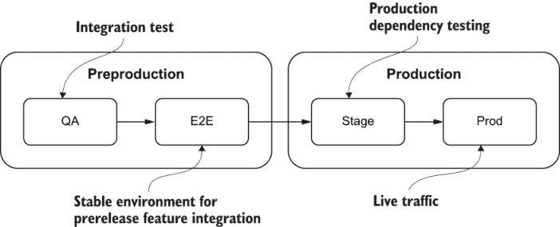

图 3.1 预生产环境有集成测试的 QA 环境，以及用于预发布功能集成的端到端 E2E 环境。生产环境可能有一个用于生产依赖测试的 Staging 环境，以及用于实时流量的实际生产环境。

### 3.1.1 环境的组成部分

环境由三个同等重要的组件组成：

+   代码

+   运行时先决条件

+   配置

代码是应用程序执行特定任务的机器指令。为了执行代码，可能还需要运行时依赖。例如，Node.js 代码需要 Node.js 二进制文件和其他 npm 包才能成功执行。在 Kubernetes 的情况下，所有运行时依赖和代码都被打包成一个可部署单元（即 Docker 镜像），并通过 Docker 守护进程进行编排。应用程序的 Docker 镜像可以在任何环境中运行，从开发者的笔记本电脑到在云中运行的运行生产集群，因为镜像封装了代码和所有依赖，消除了环境之间的潜在不兼容性。

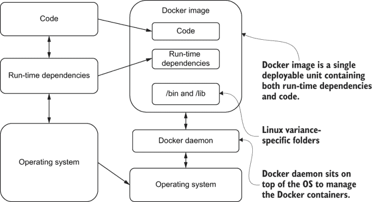

图 3.2 左侧表示基于非容器的部署，在代码可以部署之前需要操作系统和运行时依赖。右侧表示基于容器的部署，包含代码和运行时依赖。

环境特定应用程序属性的配置通常与代码和运行时依赖一起部署，以便应用程序实例可以针对每个环境的行为和连接到正确的依赖项。每个环境都可能包含用于隔离的 DB 存储、分布式缓存或消息传递（如数据）。环境还有自己的网络策略，用于隔离流量和自定义访问控制。例如，可以配置入口和出口以阻止预生产和生产环境之间的流量，以增强安全性。可以配置访问控制以仅允许一小部分工程师访问生产环境，而预生产环境则对整个开发团队开放。

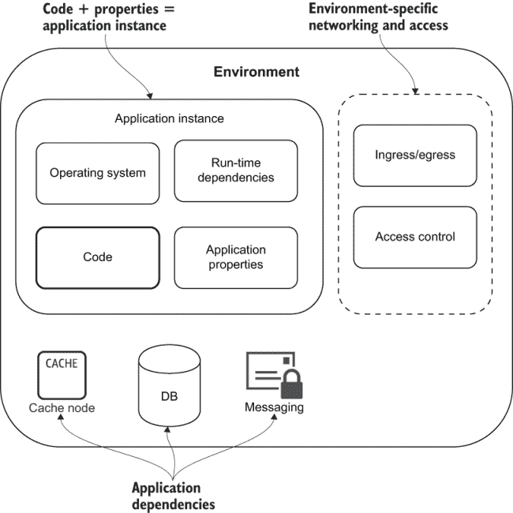

图 3.3 环境由应用程序实例、网络入口/出口和用于保护其资源的访问控制组成。环境还包括应用程序依赖项，如缓存、DB 或消息传递。

选择合适的粒度

最终目标是所有新代码都能部署到生产环境中，以便客户和最终用户可以在代码通过质量测试后立即开始使用它。将代码部署到生产环境的延迟会导致开发团队产生的新代码的商业价值实现推迟。选择合适的环境粒度对于代码无延迟部署至关重要。需要考虑的因素包括

+   *发布独立性*——如果代码需要与其他团队的代码捆绑在一起进行部署，则一个团队的部署周期将受制于其他团队生成的代码的可用性。正确的粒度应使您的代码能够独立于其他团队/代码进行部署。

+   *测试边界*——类似于发布独立性，新代码的测试应该独立于其他代码发布。如果新代码测试依赖于其他团队/代码，则发布周期将受制于其他团队的准备情况。

+   *访问控制*——除了预生产和生产环境的单独访问控制之外，每个环境还可以限制访问控制，仅限于积极在代码库上工作的团队。

+   *隔离*——每个环境是一个逻辑工作单元，应该与其他环境隔离，以避免“嘈杂邻居”问题并限制出于安全原因来自不同环境的访问。

### 3.1.2 命名空间管理

命名空间是 Kubernetes 支持环境的自然结构。它们允许将集群资源分配给多个团队或项目。命名空间提供了独特资源命名、资源配额、RBAC、硬件隔离和网络配置的范围：

*Kubernetes 命名空间 ~= 环境*

在每个命名空间中，应用程序实例（即 Pod）是一个或多个在部署期间注入了特定环境应用程序属性的 Docker 容器。这些应用程序属性定义了环境应该如何运行（例如功能标志）以及应该使用哪些外部依赖项（例如数据库连接字符串）。

除了应用程序 Pod 之外，命名空间还可能包含其他提供环境所需额外功能的 Pod。

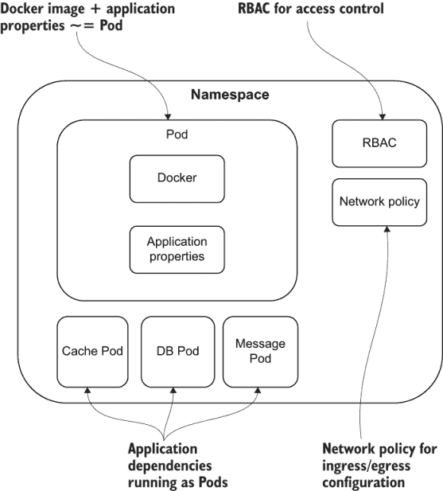

图 3.4 在 Kubernetes 中，命名空间相当于环境。命名空间可能包括 Pod（应用程序实例）、网络策略（入口/出口）和 RBAC（访问控制），以及运行在单独 Pod 中的应用程序依赖项。

RBAC 是一种基于企业内部个人用户角色的计算机或网络资源访问控制方法。在 Kubernetes 中，一个角色包含代表一组权限的规则。权限是纯粹累加的（没有拒绝规则）。一个角色可以在命名空间内定义，具有角色或集群范围定义的 ClusterRole。

命名空间还可以拥有专用硬件和网络策略，以根据应用程序需求优化其配置。例如，一个计算密集型应用程序可以在具有专用多核硬件的命名空间中部署。另一个需要大量磁盘 I/O 的服务可以部署在具有高速 SSD 的单独命名空间中。每个命名空间还可以定义其网络策略（入口/出口），以限制跨命名空间流量或使用未经验证的 DNS 名称访问集群内的其他命名空间。

在两个不同的环境中部署应用程序

在本节中，您将学习如何使用命名空间在两个不同的环境中部署相同的应用程序（一个名为 guestbook-qa 的测试环境和一个名为 guestbook-e2e 的预生产端到端环境），并使用不同的配置。我们将使用 Guestbook Kubernetes 示例应用程序进行此练习。1

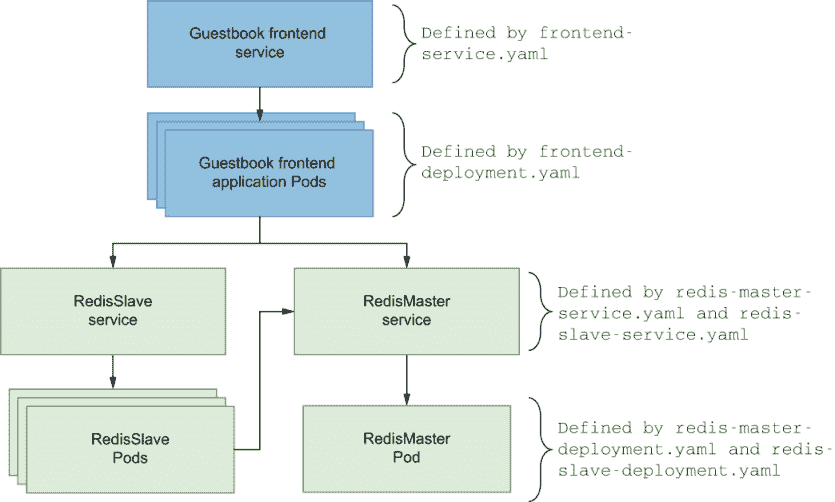

图 3.5 Guestbook 前端架构将有一个服务来将 guestbook 网页前端暴露给实时流量。后端架构由 Redis 主节点和 Redis 从节点组成，用于数据。

练习概述

1.  创建环境命名空间（guestbook-qa 和 guestbook-e2e）。

1.  将 guestbook 应用程序部署到 guestbook-qa 环境。

1.  测试 guestbook-qa 环境。

1.  将 guestbook 应用程序提升到 guestbook-e2e 环境。

1.  测试 guestbook-e2e 环境。

验证 Kubernetes 集群连接 在您开始之前，请确保您已正确配置 `KUBECONFIG` 环境变量以指向所需的 Kubernetes 集群。有关更多信息，请参阅附录 A。

首先，为您的每个 guestbook 环境创建 guestbook-qa 和 guestbook-e2e 命名空间：

```
$ kubectl create namespace guestbook-qa
namespace/guestbook-qa created
$ kubectl create namespace guestbook-e2e
namespace/guestbook-e2e created
$ kubectl get namespaces
NAME              STATUS   AGE
default           Active   2m27s
guestbook-e2e     Active   9s
guestbook-qa      Active   19s
kube-node-lease   Active   2m30s
kube-public       Active   2m30s
kube-system       Active   2m30s
```

现在，您可以使用以下命令将 guestbook 应用程序部署到 guestbook-qa 环境：

```
$ export K8S_GUESTBOOK_URL=https://k8s.io/examples/application/guestbook
$ kubectl apply -n guestbook-qa -f ${K8S_GUESTBOOK_URL}/redis-master-deployment.yaml
deployment.apps/redis-master created
$ kubectl apply -n guestbook-qa -f ${K8S_GUESTBOOK_URL}/redis-master-service.yaml
service/redis-master created
$ kubectl apply -n guestbook-qa -f ${K8S_GUESTBOOK_URL}/redis-slave-deployment.yaml
deployment.apps/redis-slave created
$ kubectl apply -n guestbook-qa -f ${K8S_GUESTBOOK_URL}/redis-slave-service.yaml
service/redis-slave created
$ kubectl apply -n guestbook-qa -f ${K8S_GUESTBOOK_URL}/frontend-deployment.yaml
deployment.apps/frontend created
$ kubectl apply -n guestbook-qa -f ${K8S_GUESTBOOK_URL}/frontend-service.yaml
service/frontend created
```

在我们继续之前，让我们测试一下 guestbook-qa 环境是否按预期工作。使用以下 minikube 命令查找 guestbook-qa 服务的 URL，然后在您的网页浏览器中打开该 URL：

```
$ minikube -n guestbook-qa service frontend --url
http://192.168.99.100:31671
$ open http://192.168.99.100:31671

```

在 guestbook 应用程序的 Messages 文本编辑中，输入类似 `This` `is the` `guestbook-qa` `environment` 的内容，然后按提交按钮。您的屏幕应该看起来像图 3.6 所示。

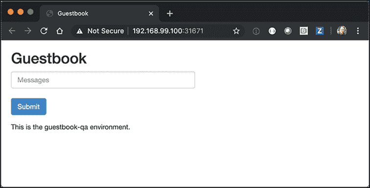

图 3.6 当您的 guestbook 应用程序已部署到 QA 时，您可以在浏览器中提交测试消息以验证您的部署。

现在，我们已经将 Guestbook 应用程序运行在 guestbook-qa 环境中，并已测试其工作正常，让我们将 guestbook-qa 提升到 guestbook-e2e 环境。在这种情况下，我们将使用与 guestbook-qa 环境中使用的完全相同的 YAML 文件。这类似于您的自动化 CD 管道的工作方式：

```
$ export K8S_GUESTBOOK_URL=https://k8s.io/examples/application/guestbook
$ kubectl apply -n guestbook-e2e -f ${K8S_GUESTBOOK_URL}/redis-master-deployment.yaml
deployment.apps/redis-master created
$ kubectl apply -n guestbook-e2e -f ${K8S_GUESTBOOK_URL}/redis-master-service.yaml
service/redis-master created
$ kubectl apply -n guestbook-e2e -f ${K8S_GUESTBOOK_URL}/redis-slave-deployment.yaml
deployment.apps/redis-slave created
$ kubectl apply -n guestbook-e2e -f ${K8S_GUESTBOOK_URL}/redis-slave-service.yaml
service/redis-slave created
$ kubectl apply -n guestbook-e2e -f ${K8S_GUESTBOOK_URL}/frontend-deployment.yaml
deployment.apps/frontend created
$ kubectl apply -n guestbook-e2e -f ${K8S_GUESTBOOK_URL}/frontend-service.yaml
service/frontend created
```

太好了！Guestbook 应用程序现在已部署到 guestbook-e2e 环境。现在让我们测试一下 guestbook-e2e 环境是否工作正常：

```
$ minikube -n guestbook-e2e service frontend --url
http://192.168.99.100:31090
$ open http://192.168.99.100:31090

```

与您在 guestbook-qa 环境中所做的一样，在 Messages 文本编辑中输入类似 `This is` `the` `guestbook-e2e` `environment,` `NOT` `the` `guestbook-qa` `environment!` 的内容，然后按提交按钮。您的屏幕应该看起来像图 3.7 所示。

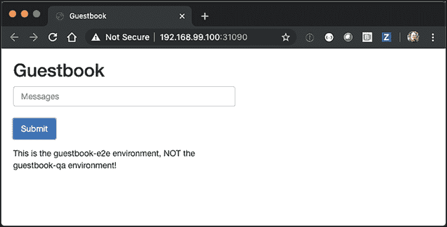

图 3.7 当您的 guestbook 应用程序已部署到 QA 时，您可以在浏览器中提交测试消息以验证您的部署。

这里重要的是要意识到你在两个不同的环境中运行着相同的应用程序，这些环境由 Kubernetes 命名空间定义。请注意，每个应用程序都在维护其数据的独立副本。如果你在 QA Guestbook 中输入一条消息，它不会出现在 E2E Guestbook 中。这些是两个不同的环境。

练习 3.1

现在你已经创建了两个预生产环境，guestbook-qa 和 guestbook-e2e，在新的生产集群中创建另外两个生产环境，guestbook-stage 和 guestbook-prod。

提示：你可以使用命令`minikube start` `-p` `production`创建一个新的 minikube 集群，并使用`kubectl config use-context <name>`在它们之间切换。

案例研究：Intuit 环境管理

在 Intuit，我们根据服务和环境在每个 AWS 区域中组织命名空间，并在预生产集群和 prod 集群之间进行分离。一个典型的服务将拥有六个命名空间：QA、E2E、Stage/Prod West 和 Stage/Prod East。QA 和 E2E 命名空间将在预生产集群中，对相应团队开放访问。Stage/Prod West 和 Stage/Prod East 将位于生产集群中，访问受限.^a

^a [`www.cncf.io/case-study/intuit.`](https://www.cncf.io/case-study/intuit/)

### 3.1.3 网络隔离

定义部署应用程序的环境的一个关键方面是确保只有预期的客户端可以访问特定的环境。默认情况下，所有命名空间都可以连接到所有其他命名空间中运行的服务。但在 QA 和 Prod 这样的两个不同环境的情况下，你不想这些环境之间有交叉通信。幸运的是，可以应用命名空间网络策略来限制命名空间之间的网络通信。让我们看看我们如何将应用程序部署到两个不同的命名空间，并使用网络策略来控制访问。

我们将介绍在两个不同的命名空间中部署服务的步骤。你还将修改网络策略并观察其效果。

概述

1.  创建环境命名空间（qa 和 prod）。

1.  将 curl 部署到 qa 和 prod 命名空间。

1.  将 NGINX 部署到 prod 命名空间。

1.  从 qa 和 prod 命名空间（都可行）使用 curl 访问 NGINX。

1.  从 qa 命名空间阻止对 prod 命名空间的入站流量。

1.  从 qa 命名空间（被阻止）使用 curl 访问 NGINX。

出站*Egress*流量是开始于网络内部并通过其路由器流向网络外部的网络流量。

入站*Ingress*流量由所有来自外部网络的数据通信和网络流量组成。

在开始之前，请验证你是否已正确配置了`KUBECONFIG`环境变量以指向所需的 Kubernetes 集群。请参阅附录 A 获取更多信息。

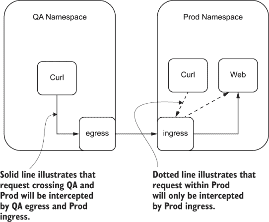

图 3.8 对于 QA 中的 Curl Pod 要到达生产环境中的 Web Pod，Curl Pod 需要通过 QA 出口到达生产入口。然后生产入口将流量路由到生产环境中的 Web Pod。

首先，为您的每个环境创建命名空间：

```
$ kubectl create namespace qa
namespace/qa created
$ kubectl create namespace prod
namespace/prod created
$ kubectl get namespaces
NAME              STATUS   AGE
qa           Active   2m27s
prod         Active   9s
```

现在，我们将同时在两个命名空间中创建一个 Pod，从该 Pod 我们可以运行 Linux 命令`curl`：

```
$ kubectl -n qa apply -f curlpod.yaml
$ kubectl -n prod apply -f curlpod.yaml
```

列表 3.1 curlpod.yaml

```
apiVersion: v1
kind: Pod
metadata:
  name: curl-pod
spec:
  containers:
  - name: curlpod
    image: radial/busyboxplus:curl
    command:
    - sh
    - -c
    - while true; do sleep 1; done     
```

在生产命名空间中，我们将运行一个 NGINX 服务器，该服务器将接收`curl` HTTP 请求：

```
$ kubectl -n prod apply -f web.yaml
```

列表 3.2 web.yaml

```
apiVersion: v1
kind: Pod
metadata:
  name: web
spec:
  containers:
  - image: nginx
    imagePullPolicy: Always
    name: nginx
    ports:
    - containerPort: 80
      protocol: TCP
```

默认情况下，在命名空间中运行的 Pod 可以向运行在不同命名空间中的其他 Pod 发送网络流量。让我们通过从 qa 命名空间中的 Pod 执行`curl`命令到生产命名空间中的 NGINX Pod 来证明这一点：

```
$ kubectl describe pod web -n prod | grep IP                        ❶
$ kubectl -n qa  exec curl-pod -- curl -I http://<web pod ip>       ❷
$ kubectl -n prod  exec curl-pod -- curl -I http://<web pod ip>     ❸
```

❶ 获取 Web Pod 的 IP 地址

❷ 返回 HTTP 200

❸ 返回 HTTP 200

通常，您不希望 qa 和生产环境之间存在依赖关系。可能的情况是，如果应用程序的两个实例都正确配置，qa 和生产之间可能没有依赖关系，但如果有 qa 配置中的错误，意外地向生产发送流量怎么办？您可能会损坏生产数据。或者，即使在生产环境中，如果一个环境托管您的营销网站，另一个环境托管一个包含敏感数据的 HR 应用程序，这种情况可能也是合适的。在这些情况下，可能有必要在命名空间之间阻止网络流量，或者仅允许特定命名空间之间的网络流量。这可以通过向命名空间添加一个`NetworkPolicy`来实现。

让我们在每个命名空间中的 Pod 上添加一个`NetworkPolicy`：

```
$ kubectl apply -f block-other-namespace.yaml
```

容器网络接口 Network policy 仅在配置了容器网络接口（CNI）^(2）的情况下受支持（minikube 和 Docker desktop 均不支持）。请参阅附录 A 以获取有关测试网络策略配置的更多信息。

列表 3.3 网络策略 [(http://mng.bz/WdAX)](https://shortener.manning.com/WdAX)

```
apiVersion: networking.k8s.io/v1
kind: NetworkPolicy
metadata:
  namespace: prod               ❶
  name: block-other-namespace
spec:
  podSelector: {}               ❷
  ingress:
  - from:
    - podSelector: {}           ❸
```

❶ 适用于生产命名空间

❷ 选择生产命名空间中的所有 Pod

❸ 仅允许来自生产命名空间的请求入站。来自其他命名空间的请求将被阻止。

此`NetworkPolicy`应用于生产命名空间，并且只允许来自生产命名空间的入站（入网流量）。正确使用`NetworkPolicy`约束是定义环境边界的关键方面。

应用了`NetworkPolicy`后，我们可以重新运行我们的`curl`命令来验证每个命名空间现在是否已与其他命名空间隔离：

```
$ kubectl -n qa exec curl-pod -- curl -I http://<web pod ip>    ❶
$ kubectl -n prod exec curl-pod -- curl -I http://<web pod ip>  ❷
```

❶ 从 qa 命名空间发起的 Curl 请求被阻止！

❷ 返回 Http 200

### 3.1.4 预生产和生产集群

现在你已经知道了如何使用命名空间创建多个环境，可能觉得在一个集群上创建所有所需的环境是一件微不足道的事情。例如，你可能需要为你的应用程序提供 QA、E2E、阶段和 Prod 环境。然而，根据你的具体用例，这可能不是最佳方法。我们的建议是拥有两个集群来托管你的环境，一个用于预生产环境的预生产集群，一个用于生产环境的生产集群。

拥有两个独立的集群来托管你的环境的主要原因是保护你的生产环境免受预生产环境工作中意外中断或其他影响。

亚马逊网络服务（AWS）中的集群隔离。在 AWS 中，可以创建一个单独的 VPC 来作为逻辑边界，用于隔离预生产和生产环境的流量和数据。为了获得更强的隔离和更多对生产凭据和访问的控制，应将单独的生产虚拟私有云托管在不同的生产 AWS 账户中。

有人可能会问为什么我们应该有这么多环境，以及预生产和生产集群的分离。简单的答案是，需要一个预生产集群来在发布到生产集群之前测试代码。在 Intuit，我们使用我们的 QA 环境进行集成测试，将 E2E 环境作为其他服务测试预发布功能的稳定环境。如果你正在进行多分支并发开发，你也可以为每个分支配置额外的预生产测试环境。

使用 Kubernetes 进行配置管理的关键优势在于，由于它使用不可变的可移植镜像 Docker 容器，因此不同环境之间的部署差异仅限于命名空间配置、特定环境的属性以及如缓存或数据库之类的应用程序依赖。预生产测试可以验证你的服务代码的正确性，而生产集群中的阶段环境可以用来验证你的应用程序依赖的正确性。

预生产和生产集群应遵循相同的最佳安全实践和操作严谨性。安全问题可以在开发周期的早期被发现，如果预生产集群以与生产相同的标准运行，则不会打断开发者的生产力。

## 3.2 Git 策略

使用单独的 Git 仓库来存储你的 Kubernetes 清单（即配置），将配置与应用程序源代码分离，出于以下原因强烈推荐：

+   它提供了应用代码和应用配置的清晰分离。有时你可能希望修改清单而不触发整个 CI 构建。例如，如果你只是想增加 Deployment 规范中副本的数量，你可能不想触发构建。

    应用程序配置与机密信息 在 GitOps 中，应用程序配置通常不包括机密信息，因为使用 Git 存储机密是一种不良做法。在第七章中详细讨论了处理敏感信息（密码、证书等）的几种方法。

+   审计日志更清晰。出于审计目的，仅持有配置的仓库将有一个更干净的 Git 历史记录，记录了所做的更改，而没有来自常规开发活动的检查入的噪音。

+   您的应用程序可能由多个 Git 仓库构建的服务组成，但作为单个单元部署。通常，微服务应用程序由具有不同版本控制和发布周期的服务组成（例如 ELK、Kafka 和 Zookeeper）。将清单存储在单个组件的源代码仓库中可能没有意义。

+   访问是分开的。正在开发应用程序的开发人员可能不是可以/应该推送到生产环境的人，无论是故意还是无意。拥有单独的仓库允许将提交访问权限给予源代码仓库，而不是应用程序配置仓库，后者可以保留给更精选的团队成员组。

+   如果您正在自动化您的 CI 管道，将清单更改推送到同一个 Git 仓库可能会触发构建作业和 Git 提交触发的无限循环。有一个单独的仓库来推送配置更改可以防止这种情况发生。

对于您的代码仓库，您可以使用您喜欢的任何分支策略（例如 GitFlow），因为这只是用于您的 CI。对于您的配置仓库（将用于您的 CD），您需要根据您的组织规模和工具考虑以下策略。

### 3.2.1 单分支（多个目录）

使用单分支策略时，主分支将始终包含每个环境中使用的确切配置。所有环境将有一个默认配置，并在单独的环境特定目录中定义环境特定覆盖。单分支策略可以很容易地通过 Kustomize 等工具（第 3.3 节）得到支持。

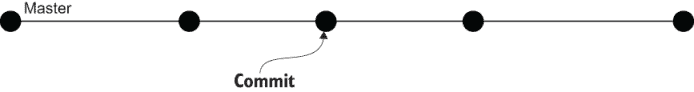

图 3.9 单分支策略将有一个主分支和每个环境的子目录。每个子目录将包含环境特定的覆盖。

在我们的 CI/CD 示例中，我们将为 qa、e2e、stage 和 prod 环境设置特定的覆盖目录。每个目录将包含特定环境的设置，例如副本数量、CPU 和内存请求/限制。

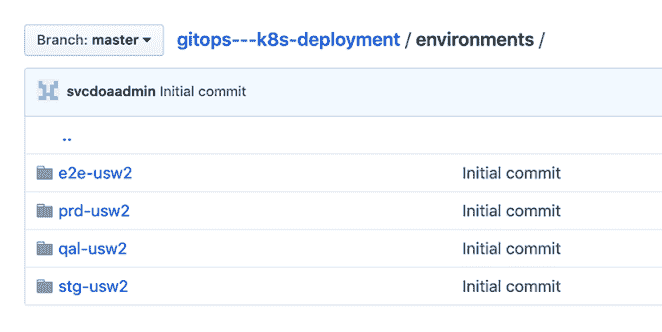

图 3.10 使用 qal、e2e、stage 和生产子目录的示例。每个子目录将包含副本数量、CPU 和内存请求/限制等覆盖。

### 3.2.2 多分支

在多分支策略中，每个分支都相当于一个环境。这里的优势是每个分支都将拥有该环境的精确清单，而无需使用任何工具，如 Kustomize。每个分支还将拥有独立的提交历史，以便进行审计跟踪和需要时回滚。缺点是，由于工具如 Kustomize 不与 Git 分支一起工作，因此环境之间将无法共享通用配置。

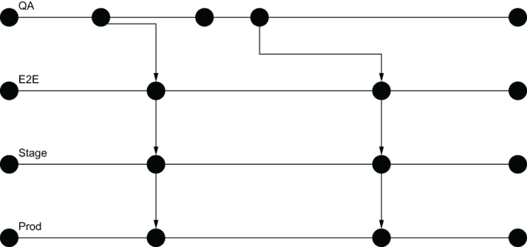

图 3.11 在多分支策略中，每个分支都相当于一个环境。每个分支将包含确切的清单，而不是覆盖。

可能可以在多个分支之间合并常见的基础设施更改。假设需要将新资源添加到所有环境中。在这种情况下，该资源可以首先添加到 QA 分支并测试，然后在适当的测试完成后合并（ cherry-picked）到每个后续分支。

### 3.2.3 多仓库与单仓库对比

如果你在一个只有一个敏捷团队的初创环境中，你可能不希望（或需要）多个仓库的复杂性。所有代码都可以在一个代码仓库中，所有部署配置在一个部署仓库中。

然而，如果你在一个拥有数十（或数百）开发者的企业环境中，你可能会希望拥有多个仓库，以便团队可以相互解耦，并且各自以自己的速度运行。例如，组织内部的不同团队将会有不同的代码节奏和发布流程。如果使用单一配置仓库，某些功能可能需要几周时间才能完成，但需要等待计划中的发布。这可能会导致将功能交付给最终用户的时间延迟，并发现潜在的代码问题。回滚也存在问题，因为一个代码缺陷将需要回滚每个团队的所有更改。

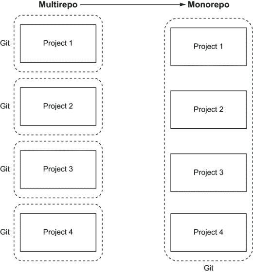

图 3.12 单仓库是一个包含多个项目的单一 Git 仓库。在多仓库中，每个项目都将有一个专门的 Git 仓库。

使用多个仓库的另一个考虑因素是根据功能组织应用程序。如果仓库专注于离散的可部署功能，那么在团队之间（如重组后）移动这些功能的责任将更容易。

## 3.3 配置管理

正如我们在 3.1 节中的教程和练习中看到的，环境配置管理可以像为每个环境创建一个目录那样简单，该目录包含应部署的所有资源的 YAML 清单。这些 YAML 清单中的所有值都可以硬编码为特定环境的特定值。要部署，你运行`kubectl apply -f <directory>`。

然而，现实情况是，以那种方式管理多个配置很快就会变得难以控制且容易出错。如果你需要添加一个新资源呢？你需要确保将那个资源添加到每个环境中的 YAML 文件中。如果那个资源需要特定属性（如副本）在不同环境中具有不同的值呢？你需要仔细地在所有正确的文件中做出所有正确的自定义设置。

已经开发出一些工具来满足配置管理的需求。我们将在本节稍后回顾每个更受欢迎的配置管理工具。但首先，让我们讨论一下在选择特定工具时应考虑的因素。

良好的 Kubernetes 配置工具具有以下特性：

+   *声明式*—配置是明确的、确定的，并且不依赖于系统。

+   *可读性*—配置是以易于理解的方式编写的。

+   *灵活*—该工具有助于促进并不会妨碍你完成想要做的事情。

+   *可维护性*—工具应促进重用和可组合性。

Kubernetes 配置管理之所以如此具有挑战性，有几个原因：看似简单的部署应用程序的行为可能会有截然不同，甚至相反的要求，而单个工具很难满足所有这些要求。想象以下用例：

+   集群管理员将第三方现成应用程序（如 WordPress）部署到他们的集群中，对这些应用程序几乎没有或没有进行定制。对于这个用例，最重要的标准是能够轻松地从上游源接收更新，并以尽可能快速和无缝的方式升级他们的应用程序（新版本、安全补丁等）。

+   一个软件即服务（SaaS）应用开发者将他们定制的应用程序部署到一个或多个环境中（开发、测试、Prod-West、Prod-East）。这些环境可能分布在不同的账户、集群和命名空间中，它们之间有细微的差别，因此配置重用至关重要。对于这个用例，从代码库中的 Git 提交到完全自动地将应用程序部署到每个环境，并以简单和可维护的方式管理环境，这一点非常重要。这些开发者对他们的发布版本没有语义版本化的兴趣，因为他们可能每天部署多次。主要版本、次要版本和补丁版本的概念最终对他们应用程序没有意义。

如您所见，这些是完全不同的用例，而且往往一个在某个方面表现优异的工具在其他方面处理得并不好。

### 3.3.1 Helm

无论你喜欢它还是讨厌它，Helm 作为第一个配置工具，是 Kubernetes 生态系统的一个基本组成部分，你很可能在某个时候通过运行`helm install`安装了某些东西。

关于 Helm，需要注意的是，它是一个自称为 Kubernetes 的包管理器，并不声称自己是配置管理工具。然而，由于许多人使用 Helm 模板正是为了这个目的，它属于这次讨论的范围。这些用户不可避免地会维护几个 values.yaml 文件，每个环境一个（例如 values-base.yaml、values-prod.yaml 和 values-dev.yaml），然后以这种方式参数化他们的图表，以便可以在图表中使用特定环境的值。这种方法或多或少是可行的，但它使得模板难以管理，因为 Go 模板是扁平的，需要支持每个环境的每个可能的参数，这最终会在整个模板中充斥着`{{-if` `/` `else}}`开关。

优点：

+   *有图表就能解决*。毫无疑问，Helm 最大的优势是其出色的图表仓库。最近，我们需要运行一个高可用的 Redis，不使用持久卷，用作临时缓存。能够将`redis-ha`图表直接放入你的命名空间，设置`persistentVolume.enabled:`为`false`，并将你的服务指向它，这已经有人完成了在 Kubernetes 集群上可靠运行 Redis 的艰苦工作。

缺点：

+   *Go 模板*—“看看那个美丽而优雅的 Helm 模板！”没有人这么说。众所周知，Helm 模板存在可读性问题。我们相信 Helm 3 对 Lua 的支持将解决这个问题，但在此之前，嗯，我们希望你喜欢花括号。

+   *复杂的 SaaS CD 管道*—对于 SaaS CI/CD 管道，假设你正按照预期的方式使用 Helm（即通过运行`helm install/upgrade`），你的管道中的自动化部署可能会有几种不同的方式。在最佳情况下，从你的管道中部署将像这样简单

    ```
    $ docker push mycompany/guestbook:v2
    $ helm upgrade guestbook --set guestbook.image.tag=v2
    ```

    但在最坏的情况下，如果现有的图表参数无法支持你想要的清单更改，你将不得不经历一系列的步骤：打包一个新的 Helm 图表，增加其语义版本，将其发布到图表仓库，然后使用 Helm 升级重新部署。在 Linux 世界中，这类似于构建一个新的 RPM，将其发布到 Yum 仓库，然后运行`yum install`，所有这些只是为了让你可以将闪亮的新 CLI 放入`/usr/bin`。虽然这种模型对于打包和分发来说效果很好，但对于定制 SaaS 应用程序的部署来说，这是一个不必要的复杂且迂回的方式。因此，许多人选择运行`helm template`并将输出管道传输到`kubectl apply`，但到那时，你最好使用一些专门为此目的设计的其他工具。

+   *默认非声明性*—如果你曾经在任何 Helm 部署中添加了 `--set` `param=value`，很抱歉地告诉你，你的部署过程不是声明性的。这些值只记录在 Helm ConfigMap 的另一个世界（以及可能你的 Bash 历史记录）中，所以希望你在某处记录了这些值。如果你需要从头开始重新创建你的集群，这远远不是理想的。一个稍微好一点的方法是将所有参数记录在一个新的自定义 values.yaml 文件中，你可以将其存储在 Git 中并使用 `-f` `my-values.yaml` 进行部署。然而，当你从 Helm 稳定版部署 OTS 图表时，这会变得很烦人，你没有明显的地方来存储与相关图表并排的 values.yaml。我想出的最佳解决方案是将上游图表作为依赖项创建一个新的虚拟图表。尽管如此，我们还没有找到一种标准的方法来在管道中使用单行命令更新 values.yaml 中的参数，除非运行 `sed`。

使用 Helm 配置预生产和生产 manifest

在这个练习中，我们将使用 Helm 管理我们在本章早期部署的 guestbook 应用程序在不同环境中的配置。

Helm 使用以下目录结构来组织其图表。

列表 3.4 Helm 图表目录结构

```
├──  Chart.yaml            ❶
├──  templates             ❷
│   └──    guestbook.yaml
├──  values-prod.yaml      ❸
└──  values-qa.yaml        ❸
```

❶ Chart.yaml 是 Helm 对图表的描述。

❷ 一个模板目录，当与值结合时，将生成有效的 Kubernetes manifest 文件

❸ 图表的各个配置值，可用于特定环境的配置

Helm 模板文件使用文本模板语言来生成 Kubernetes YAML。Helm 模板文件看起来像 Kubernetes YAML，但文件中散布着模板变量。因此，即使是基本的 Helm 模板文件最终也会看起来像这样。

列表 3.5 示例 Helm 模板

```
apiVersion: apps/v1
kind: Deployment
metadata:
  name: {{ include "sample-app.fullname" . }}
  labels:
    {{- include "sample-app.labels" . | nindent 4 }}
spec:
  selector:
    matchLabels:
      {{- include "sample-app.selectorLabels" . | nindent 6 }}
  template:
    metadata:
    {{- with .Values.podAnnotations }}
      annotations:
        {{- toYaml . | nindent 8 }}
    {{- end }}
      labels:
        {{- include "sample-app.selectorLabels" . | nindent 8 }}
    spec:
      containers:
        - name: {{ .Chart.Name }}
          image: "{{ .Values.image.repository }}:{{ .Values.image.tag | default .Chart.AppVersion }}"
        {{- with .Values.environmentVars }}
          env:
            {{- toYaml . | nindent 12 }}
        {{- end }}
```

如你所见，Helm 模板的可读性不是很好。但它们非常灵活，因为最终生成的 YAML 可以根据用户的意愿进行任何方式的定制。

最后，当使用 Helm 图表自定义特定环境时，会创建一个包含用于该环境的值的特定环境值文件。例如，对于此应用程序的生产版本，值文件可能看起来像这样。

列表 3.6 示例 Helm 值

```
# Default values for sample-app.
# This is a YAML-formatted file.
# Declare variables to be passed into your templates.

image:
  repository: gitopsbook/sample-app
  tag: "v0.2"                        ❶

nameOverride: "sample-app"
fullnameOverride: "sample-app"

podAnnotations: {}

environmentVars: [                   ❷
  {
    name: "DEBUG",
    value: "true"
  }
]
```

❶ 覆盖默认的图表 appVersion 的镜像标签

❷ 将 DEBUG 环境变量设置为 true

最终的 qa manifest 可以使用以下命令安装到 qa-heml 命名空间下的 minikube：

```
$ kubectl create namespace qa-helm
$ helm template . --values values.yaml | kubectl apply -n qa-helm -f -
deployment.apps/sample-app created
$ kubectl get all -n qa-helm
NAME                               READY   STATUS       RESTARTS    AGE
pod/sample-app-7595985689-46fbj    1/1     Running      0           11s

NAME                               READY   UP-TO-DATE   AVAILABLE   AGE
deployment.apps/sample-app         1/1     1            1           11s

NAME                                    DESIRED   CURRENT   READY   AGE
replicaset.apps/sample-app-7595985689   1         1         1       11s
```

练习 3.2

在前面的教程中，我们使用 Helm 对 QA 和生产环境中的 guestbook 镜像标签进行了参数化。为每个 guestbook 部署所需的副本数量添加额外的参数化。将 QA 的副本数设置为 1，将生产环境的副本数设置为 3。

### 3.3.2 Kustomize

Kustomize 是围绕 Brian Grant 优秀的关于声明式应用程序管理的论文中描述的设计原则创建的。^(3) Kustomize 的受欢迎程度急剧上升，自从它开始以来，已经合并到 kubectl 中。无论你是否同意它的合并方式，不言而喻的是，Kustomize 应用程序现在将成为 Kubernetes 生态系统中的永久性主流，并将成为用户在配置管理中倾向于选择的默认选项。是的，成为 kubectl 的一部分有帮助！

好处：

+   *无参数和模板*——Kustomize 应用程序非常易于推理，实际上，看起来非常愉快。它几乎可以接近 Kubernetes YAML，因为您用来执行定制的覆盖只是 Kubernetes YAML 的子集。

坏处：

+   *无参数和模板*——使 Kustomize 应用程序如此易于阅读的同一特性也可能使其受限。例如，我最近试图让 Kustomize CLI 为自定义资源设置一个镜像标签而不是 Deployment，但未能成功。Kustomize 确实有一个名为 vars 的概念，它看起来很像参数，但不知何故并不是，并且只能在 Kustomize 的授权白名单字段路径中使用。我们觉得这是那些解决方案，尽管让困难的事情变得容易，但最终让容易的事情变得困难的时候之一。

使用 Kustomize 配置预生产和生产环境

在这个练习中，我们将使用一个示例应用程序，我们将在第三部分中使用它，并使用 Kustomize 来部署它。

我们将把我们的配置文件组织成以下目录结构。

列表 3.7 Kustomize 目录结构

```
├──  base                          ❶
│   ├── deployment.yaml
│   └── kustomization.yaml
└──  envs
 ├── prod                       ❷
 │   └── kustomization.yaml
 └── qa                         ❸
 ├── debug.yaml
 └── kustomization.yaml
```

❶ 基础目录包含将在不同环境中共享的通用配置。

❷ envs/prod 目录包含生产环境的配置。

❸ envs/qa 目录包含 QA 环境的配置。

基础目录中的清单包含所有环境共有的资源。在这个简单的示例中，我们有一个单一的 Deployment 资源。

列表 3.8 基础部署

```
apiVersion: apps/v1
kind: Deployment
metadata:
  name: sample-app
spec:
  replicas: 1
  revisionHistoryLimit: 3
  selector:
    matchLabels:
      app: sample-app
  template:
    metadata:
      labels:
        app: sample-app
    spec:
      containers:
      - command:
        - /app/sample-app
        image: gitopsbook/sample-app:REPLACEME     ❶
        name: sample-app
        ports:
        - containerPort: 8080
```

❶ 基础配置中定义的镜像是不相关的。由于本例中的子覆盖环境将覆盖此值，因此此版本的镜像永远不会被部署。

要将基础目录作为其他环境的基础，目录中必须存在 kustomization.yaml 文件。以下是最简单的 kustomization.yaml 文件。它仅将 guestbook.yaml 列为构成应用程序的单个资源。

列表 3.9 基础 Kustomization

```
apiVersion: kustomize.config.k8s.io/v1beta1
kind: Kustomization

resources:
- deployment.yaml
```

现在我们已经建立了 kustomize 基础目录，我们可以开始定制我们的环境。为了定制和修改特定环境的资源，我们定义了一个包含所有要应用于基础资源的补丁和定制的 overlay 目录。我们的第一个 overlay 是 envs/qa 目录。在这个目录中还有一个 kustomization.yaml，它指定了应该应用于基础的补丁。以下两个列表提供了一个示例，说明了一个`qa` overlay

+   设置一个不同的 guestbook 镜像以部署到新的标签（v0.2）

+   向 guestbook 容器添加环境变量`DEBUG=true`。

列表 3.10 QA 环境 Kustomization

```
apiVersion: kustomize.config.k8s.io/v1beta1
kind: Kustomization

bases:                        ❶
- ../../base

patchesStrategicMerge:
- debug.yaml                  ❷

images:                       ❸
- name: gitopsbook/sample-app
  newTag: v0.2
```

❶ bases 引用包含共享配置的“base”目录。

❷ debug.yaml 是对一个 Kustomize 补丁的引用，该补丁将修改 sample-app Deployment 对象并设置 DEBUG 环境变量。

❸ 如果在基础镜像中定义了具有不同标签或镜像仓库的容器镜像，则❸ images 将覆盖这些镜像。此示例使用 v0.2 覆盖了 REPLACEME 镜像标签。

注意，Kustomize 补丁看起来非常类似于实际的 Kubernetes 资源。这是因为它们实际上是它们的完整版本。

列表 3.11 QA 环境 debug 补丁

```
apiVersion: apps/v1          ❶
kind: Deployment
metadata:
  name: sample-app
spec:
  template:
    spec:
      containers:
      - name: sample-app     ❷
        env:                 ❸
        - name: DEBUG
          value: "true"
```

❶ apiVersion group（apps）、kind（Deployment）和 name（sample-app）是关键信息，它们告知 Kustomize 此补丁应该应用于基础资源中的哪个资源。

❷ 使用名称字段来识别哪个容器将具有新的环境变量。

❸ 最后，我们在 QA 环境中定义了我们想要的新的 DEBUG 环境变量。

在所有这些完成后，我们运行`kustomize` `build` `envs/qa`。这生成了 QA 环境的最终、渲染的清单。

列表 3.12 Kustomize 构建 envs/qa

```
$ kustomize build envs/qa
apiVersion: apps/v1
kind: Deployment
metadata:
  name: sample-app
spec:
  replicas: 1
  revisionHistoryLimit: 3
  selector:
    matchLabels:
      app: sample-app
  template:
    metadata:
      labels:
        app: sample-app
    spec:
      containers:
      - command:
        - /app/sample-app
        env:
        - name: DEBUG                       ❶
          value: "true"
        image: gitopsbook/sample-app:v0.2   ❷
        name: sample-app
        ports:
        - containerPort: 8080
```

❶ 添加了 DEBUG 环境变量。

❷ 将镜像标签设置为 v0.2。

最终的 qa 清单可以使用以下命令安装到 qa 命名空间中的 minikube：

```
$ kubectl create namespace qa
$ kustomize build envs/qa | kubectl apply -n qa -f -
# kubectl get all -n qa
NAME                              READY   STATUS    RESTARTS   AGE
pod/sample-app-7595985689-46fbj   1/1     Running   0          11s

NAME                         READY   UP-TO-DATE   AVAILABLE   AGE
deployment.apps/sample-app   1/1     1            1           11s

NAME                                    DESIRED   CURRENT   READY   AGE
replicaset.apps/sample-app-7595985689   1         1         1       11s
```

练习 3.3

在之前的教程中，我们使用 Kustomize 对 QA 和 Prod 环境的 guestbook 镜像标签进行了参数化。

提示：创建一个 replica_count.yaml 补丁文件。

为每个 sample-app 部署所需的副本数量添加额外的参数化。将副本数设置为 QA 的 1 个和 Prod 的 3 个。将 QA 环境部署到 qa 命名空间，将 Prod 环境部署到 prod 命名空间。

练习 3.4

目前，Prod 环境运行的是 sample app 的 v0.1 版本，而 QA 运行的是 v0.2 版本。假设我们已经完成了 QA 的测试。更新 customization.yaml 文件，将版本 v0.2 提升到 Prod 环境中运行。更新 prod 命名空间中的 Prod 环境。

### 3.3.3 Jsonnet

Jsonnet 是一种语言，而不是真正的工具。此外，它的使用并不特定于 Kubernetes（尽管它是由 Kubernetes 推广的）。最好的方式是将 Jsonnet 视为一个超级 JSON，结合了一种合理的模板化方法。Jsonnet 结合了你希望用 JSON 做的所有事情（注释、文本块、参数、变量、条件、文件导入），而没有你讨厌的 go/Jinja2 模板化中的任何东西，并添加了你甚至不知道需要或想要的功能（函数、面向对象、混入）。它以声明性和密封（代码即数据）的方式完成所有这些。

当我们查看一个基本的 Jsonnet 文件时，它看起来非常类似于 JSON，这是有道理的，因为 Jsonnet 是 JSON 的超集。所有有效的 JSON 都是有效的 Jsonnet。但请注意，在我们的示例中，我们还可以在文档中有注释。如果你在 JSON 中管理配置的时间足够长，你将立即理解这有多么有用！

列表 3.13 基本 Jsonnet

```
{
   // Look! It's JSON with comments!
   "apiVersion": "apps/v1",
   "kind": "Deployment",
   "metadata": {
      "name": "nginx"
   },
   "spec": {
      "selector": {
         "matchLabels": {
            "app": "nginx"
         }
      },
      "replicas": 2,
      "template": {
         "metadata": {
            "labels": {
               "app": "nginx"
            }
         },
         "spec": {
            "containers": [
               {
                  "name": "nginx",
                  "image": "nginx:1.14.2",
                  "ports": [
                     {
                        "containerPort": 80
                     }
                  ]
               }
            ]
         }
      }
   }
}
```

继续我们的示例，让我们看看我们如何开始利用简单的 Jsonnet 特性。减少重复并更好地组织代码/配置的最简单方法之一是使用变量。在我们的下一个示例中，我们在 Jsonnet 文件顶部声明了一些变量（名称、版本和副本）并在整个文档中引用这些变量。这允许我们在一个单一、可见的地方进行更改，而无需扫描整个文档以查找所有需要相同更改的其他区域，这在大型文档中尤其容易出错。

列表 3.14 变量

```
local name = "nginx";
local version = "1.14.2";
local replicas = 2;
{
   "apiVersion": "apps/v1",
   "kind": "Deployment",
   "metadata": {
      "name": name
   },
   "spec": {
      "selector": {
         "matchLabels": {
            "app": name
         }
      },
      "replicas": replicas,
      "template": {
         "metadata": {
            "labels": {
               "app": name
            }
         },
         "spec": {
            "containers": [
               {
                  "name": name,
                  "image": "nginx:" + version,
                  "ports": [
                     {
                        "containerPort": 80
                     }
                  ]
               }
            ]
         }
      }
   }
}
```

最后，在我们的高级示例中，我们开始利用 Jsonnet 一些独特且强大的特性：函数、参数、引用和条件。下一个示例将开始展示 Jsonnet 的强大之处。

列表 3.15 高级 Jsonnet

```
function(prod=false) {                      ❶
   "apiVersion": "apps/v1",
   "kind": "Deployment",

   "metadata": {
      "name": "nginx"
   },
   "spec": {
      "selector": {
         "matchLabels": {
            "app": $.metadata.name          ❷
         }
      },
      "replicas": if prod then 10 else 1,   ❸
      "template": {
         "metadata": {
            "labels": {
               "app": $.metadata.name
            }
         },
         "spec": {
            "containers": [
               {
                  "name": $.metadata.name,
                  "image": "nginx:1.14.2",
                  "ports": [
                     {
                        "containerPort": 80
                     }
                  ]
               }
            ]
         }
      }
   }
}
```

与之前的示例不同，配置被定义为 Jsonnet 函数而不是一个普通的 Jsonnet 对象。这允许配置声明输入并接受来自命令行的参数。prod 是函数的一个布尔参数，默认值为 false。

我们可以在不使用变量的情况下自我引用文档的其他部分。

❸ 副本的数量是基于条件设置的。

练习 3.5

在列表 3.15 中，尝试运行以下两个命令并比较输出：

```
$ jsonnet advanced.jsonnet

$ jsonnet --tla-code prod=true advanced.jsonnet
```

Jsonnet 中有更多语言特性，我们甚至还没有触及到其能力的一角。Jsonnet 在 Kubernetes 社区中并没有得到广泛的应用，这很遗憾，因为在这里描述的所有工具中，Jsonnet 无疑是最强大的配置工具，也是为什么有多个衍生工具建立在它之上的原因。解释 Jsonnet 可以做什么本身就是一本书的内容，这就是为什么我们鼓励你阅读 Databricks 如何使用 Jsonnet 与 Kubernetes 结合，以及 Jsonnet 的优秀教程。4

好的：

+   *极其强大*——很少会遇到无法用一些简洁优雅的 Jsonnet 片段表达的情况。使用 Jsonnet，你不断地发现新的方法来最大化重用并避免重复。

坏处：

+   *不是 YAML*——这可能是由于不熟悉而引起的问题，但大多数人面对非平凡的 Jsonnet 文件时都会经历一定程度的认知负荷。同样地，你需要运行 Helm 模板来验证你的 Helm 图表是否产生了你期望的结果，你也需要类似地运行 `jsonnet` `--yaml-stream` `guestbook.jsonnet` 来验证你的 Jsonnet 是否正确。好消息是，与 Go 模板不同，Go 模板可能会因为一些错误的空白而产生语法上不正确的 YAML，这些错误类型在 Jsonnet 构建过程中会被捕获，并且产生的输出保证是有效的 JSON/YAML。

ksonnet 不要与 Jsonnet 混淆，*ksonne*t 是一个已废弃的工具，用于创建可以部署到 Kubernetes 集群的应用程序清单。然而，ksonnet 已不再维护，应考虑其他工具。

### 3.3.4 配置管理总结

与所有事物一样，使用每个工具都有其权衡。表 3.1 展示了这些特定工具在配置管理中我们重视的四个品质方面的比较总结。

表 3.1 功能比较

|  | Helm | Kustomize | Jsonnet |
| --- | --- | --- | --- |
| 声明式 | 公平 | 优秀 | 优秀 |
| 可读性 | 差 | 优秀 | 一般 |
| 灵活性 | 优秀 | 差 | 优秀 |
| 可维护性 | 一般 | 优秀 | 优秀 |

注意，本章讨论的工具只是当时在 Kubernetes 社区中最受欢迎的工具。这是一个不断发展的领域，还有许多其他配置管理工具可以考虑。

## 3.4 持久环境与短暂环境对比

*持久*环境是指始终可用的环境。例如，生产环境始终需要可用，以便服务不会中断。在持久环境中，资源（内存、CPU、存储）将永久承诺以实现始终在线的可用性。通常，E2E 是内部集成的持久环境，而 Prod 是生产流量的持久环境。

*短暂的*环境是临时环境，其他服务不依赖于这些环境。短暂的环境也不需要永久性地分配资源。例如，预发布环境用于测试新代码的生产就绪性，测试完成后不需要保留。另一个用例是预览拉取请求的正确性，以确保只有好的代码被合并到主分支。在这种情况下，将创建一个临时环境，包含拉取请求的更改，以便进行测试。一旦所有测试完成，PR 环境将被删除，并且只有当所有测试通过时，PR 更改才允许合并回主分支。

由于持久环境将被其他人使用，持久环境中的缺陷可能会中断其他人，可能需要回滚以恢复正确的功能。使用 GitOps 和 Kubernetes，回滚只是通过 Git 重新应用之前的配置。Kubernetes 将检测清单中的更改，并将环境恢复到之前的状态。

Kubernetes 使得环境回滚变得一致且简单，但对于其他资源如数据库呢？由于用户数据存储在数据库中，我们不能简单地回滚数据库到之前的快照，这会导致用户数据的丢失。与 Kubernetes 中的滚动更新部署类似，新旧版本的代码需要与滚动更新兼容。在数据库的情况下，数据库模式需要向后兼容，以避免回滚期间的中断和用户数据的丢失。在实践中，这意味着只能添加（不能删除）列，并且列定义不能更改。模式更改应与其他变更管理框架（如 Flyway，^(5)) 控制在一起，以便数据库更改也可以遵循 GitOps 流程。

## 摘要

+   环境是代码部署和执行特定目的的地方。

+   每个环境都将拥有自己的访问控制、网络、配置和依赖。

+   选择环境粒度的因素包括发布独立性、测试边界、访问控制和隔离。

+   Kubernetes 命名空间是实现环境的一种自然结构。

+   由于命名空间等同于环境，部署到特定环境只是指定了目标命名空间。

+   可以通过网络策略控制环境间的流量。

+   预生产和生产应遵循相同的最佳安全实践和操作强度。

+   高度推荐将 Kubernetes 清单的 Git 仓库与代码的 Git 仓库分开，以便环境更改独立于代码更改。

+   单个分支与像 Kustomize 这样的工具配合使用进行覆盖时效果很好。

+   单一仓库对于初创公司来说配置工作效果很好；多仓库对于大型企业来说效果很好。

+   Helm 是一个包管理器。

+   Kustomize 是一个内置的配置管理工具，是 kubectl 的一部分。

+   Jsonnet 是一种用于 JSON 模板的语言。

+   选择合适的配置管理工具应基于以下标准：声明式、可读性、灵活性和可维护性。

+   可持久环境总是可供他人使用，而短暂环境则用于短期测试和预览。

* * *

1.[`kubernetes.io/docs/tutorials/stateless-application/guestbook`](https://kubernetes.io/docs/tutorials/stateless-application/guestbook/).

2.[`mng.bz/8N1g`](http://mng.bz/8N1g).

3.[`github.com/kubernetes/community/blob/master/contributors/design-proposals/architecture/declarative-application-management.md`](https://github.com/kubernetes/community/blob/master/contributors/design-proposals/architecture/declarative-application-management.md).

4.[`mng.bz/NYmX`](https://shortener.manning.com/NYmX).

5.[`flywaydb.org/`](https://flywaydb.org/).
