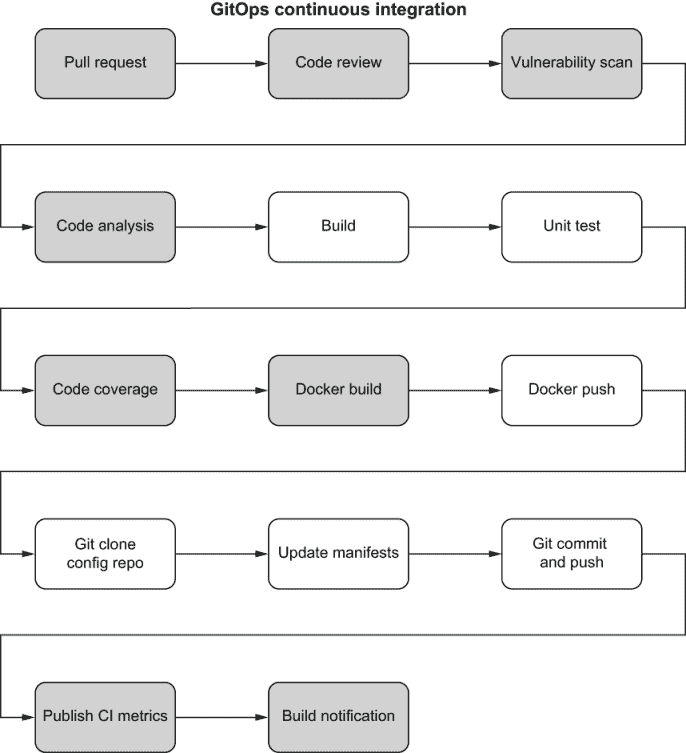
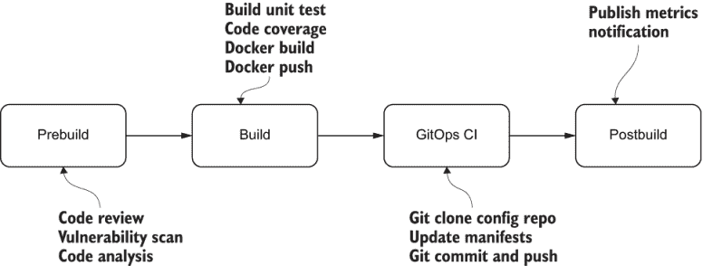
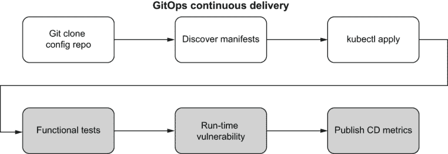
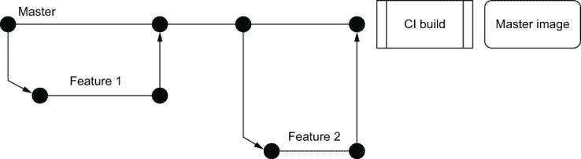
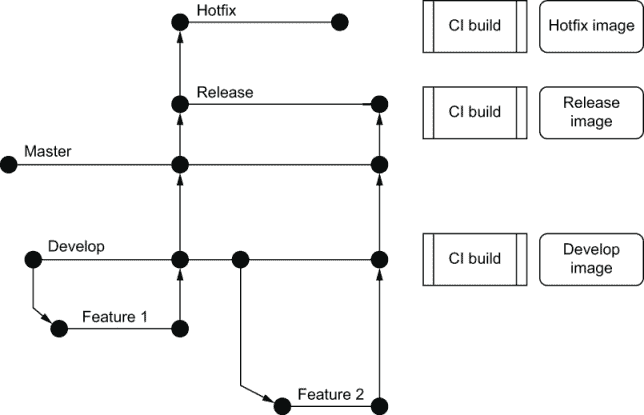
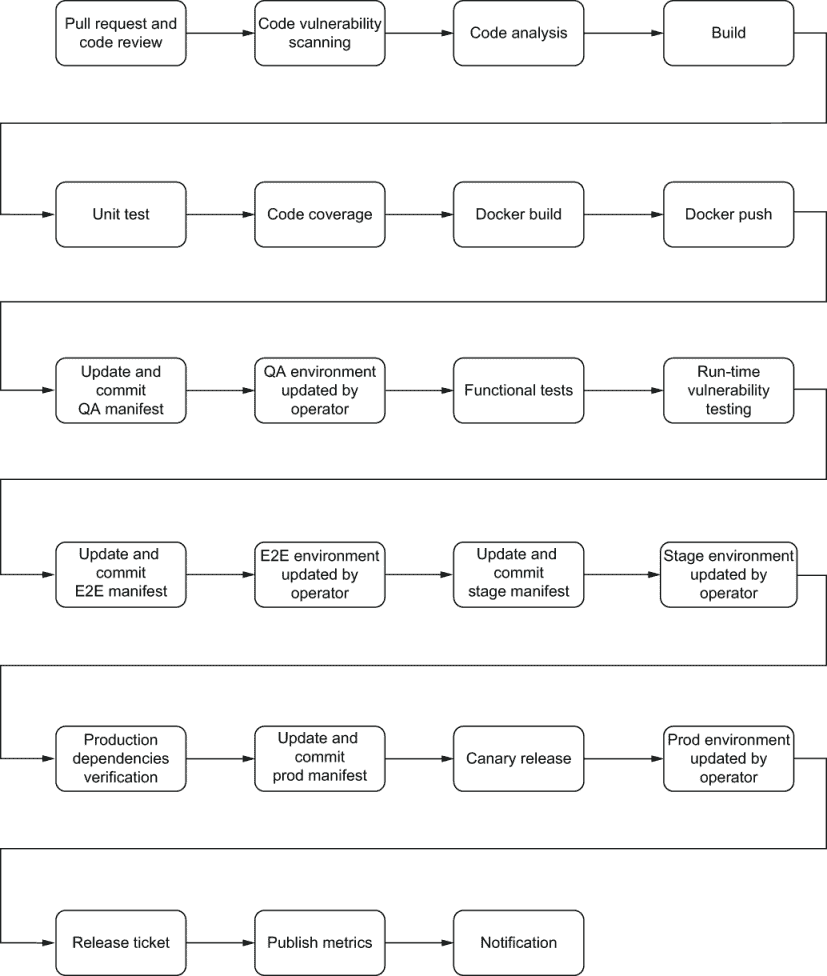
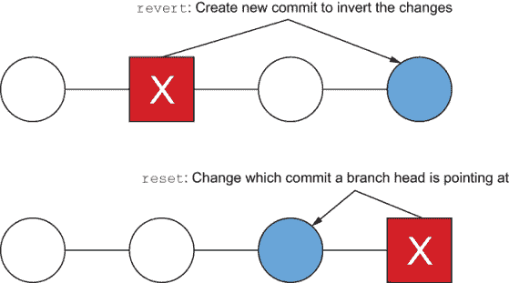
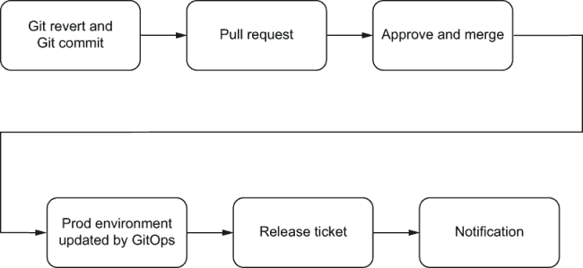
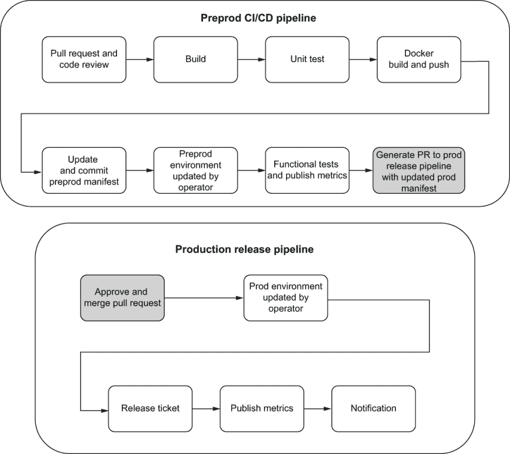

# 4 管道

本章涵盖了

+   GitOps CI/CD 管道中的阶段

+   推送代码、镜像和环境

+   回滚

+   合规性管道

本章基于第三章学到的概念，讨论了如何创建管道来构建和测试应用程序代码，然后将其部署到不同的环境。您还将了解不同的推广策略以及如何撤销、重置或回滚应用程序更改。

我们建议您在阅读本章之前阅读第一章、第二章和第三章。

## 4.1 CI/CD 管道中的阶段

*持续集成*（CI）是一种软件开发实践，其中所有开发者将代码更改合并到中央仓库（Git）中。使用 CI，每次代码更改（提交）都会触发针对给定仓库的自动构建和测试阶段，并向进行了更改的开发者提供反馈。与传统的 CI 相比，GitOps 的主要区别在于，在构建和测试阶段成功完成后，GitOps 的 CI 管道还会更新应用程序清单以包含新的镜像版本。

*持续交付*（CD）是自动整个软件发布过程的实践。CD 包括基础设施提供和部署。使 GitOps CD 与传统 CD 不同的地方是使用 GitOps 操作员来监控清单更改并编排部署。只要 CI 构建完成且清单已更新，GitOps 操作员就会负责最终的部署。

注意：请参阅第 2.5 节以了解 GitOps CI/CD 和操作员基础知识。

本章深入探讨了全面的 CI/CD 管道及其在软件开发中的重要性。CI/CD 管道是一系列阶段的集合，每个阶段执行特定任务以实现以下目标：

+   *生产力*—在开发周期的早期阶段，就设计、编码风格和质量提供有价值的反馈，而不需要切换上下文。代码审查、单元测试、代码覆盖率、代码分析、集成测试和运行时漏洞检测是设计、质量和安全反馈给开发者的关键阶段。

+   *安全性*—检测代码和组件漏洞，这些漏洞是潜在利用的攻击面。漏洞扫描可以检测第三方库中的安全问题。运行时漏洞扫描可以检测代码的运行时安全问题。

+   *缺陷逃逸*—减少客户交互失败和昂贵的回滚。新版本通常提供新功能或增强现有功能。如果功能不能提供正确的功能，后果将是客户不满和潜在的收入损失。单元测试在模块级别验证正确性，而功能测试在两个或更多模块之间验证正确性。

+   *可扩展性*—在生产发布之前发现可扩展性问题。单元测试和功能测试可以验证功能的正确性，但这些阶段无法检测内存泄漏、线程泄漏或资源竞争等问题。金丝雀发布是一种通过生产流量和依赖关系部署新版本以检测可扩展性问题的方法。

+   *上市时间*—更快地将功能交付给客户。使用完全自动化的 CI/CD 管道，无需耗时的人工工作来部署软件。代码可以在通过管道中所有阶段后立即发布。

+   *报告*—持续改进的洞察和可审计性的指标。CI/CD 管道执行时间以分钟与小时相比，可能会影响开发者的行为和生产力。持续监控和改进管道执行时间可以显著提高团队生产力。收集和存储构建指标也是许多监管审计的必要条件。请参阅 CI 和 CD 指标发布阶段以获取详细信息。

### 4.1.1 GitOps 持续集成

图 4.1 展示了基于第二章中 GitOps CI/CD（图 2.9）的全面 CI 管道构建。灰色框是完整 CI 解决方案的新阶段。本节将帮助您根据您的复杂性、成熟度和合规性要求规划并设计相关的阶段。



图 4.1 这些是 GitOps CI 管道中的阶段。白色框来自图 2.9 中的 GitOps CI 管道，灰色框是构建完整 CI 管道的附加阶段。

预构建阶段

以下阶段也称为 *静态分析* 阶段。它们是在代码构建和打包成 Docker 镜像之前对代码进行手动和自动扫描的组合。

拉取请求/代码审查

所有 CI/CD 管道都应该始终从拉取请求开始，这允许代码审查以确保设计和实现之间的一致性，并捕捉其他潜在错误。如第一章所述，代码审查还有助于分享最佳实践、编码标准和团队凝聚力。

漏洞扫描

开源库可以在不进行定制开发的情况下提供许多功能，但这些库也可能包含漏洞、缺陷和许可问题。集成开源库扫描工具，如 Nexus 漏洞扫描器，可以在开发周期的早期检测已知漏洞和许可问题，并通过升级库或使用替代库来修复问题。

注意：在快速变化的软件行业中，老话“如果没问题，就别修”已经不再适用。每天都会发现开源库中的漏洞，因此尽快升级是谨慎的做法，以避免被利用。在 Intuit，我们大量使用开源软件来加速我们的开发。我们不再进行年度安全审计，而是在 CI 流程中添加了一个漏洞扫描步骤，以便在开发周期中定期检测和解决安全问题。

代码分析

虽然手动代码审查对于设计和实现的一致性非常好，但对于编码标准、重复代码和代码复杂度问题（即代码异味）来说，更适合使用自动化的代码检查或代码分析工具，如 SonarQube。这些工具不是代码审查的替代品，但它们可以更有效地捕捉到一些日常问题。

注意：期望在部署新代码之前解决每一个小问题是不现实的。使用 SonarQube 等工具时，趋势数据也会被报告，这样团队可以看到他们的代码质量是如何随时间变好或变差的，以便在问题恶化之前解决这些问题。

练习 4.1

为了防止你的开源库中已知的安全问题，你需要在 CI/CD 流程中计划哪些阶段？

为了确保实现与设计相匹配，你需要在 CI/CD 流程中计划哪些阶段？

构建阶段

在静态分析之后，是构建代码的时候了。除了构建和创建可部署的工件（即 Docker 镜像）之外，单元测试（模块测试）及其有效性（代码覆盖率）是构建过程中的重要部分。

构建

构建阶段通常在项目源代码的实际编译之前开始下载依赖库。（例如 Python 和 Node.js 这样的脚本语言不需要编译。）对于像 Java、Ruby 和 Go 这样的编译语言，代码会被编译成字节码/机器二进制代码，使用相应的编译器。此外，生成的二进制代码及其依赖库需要被打包成一个可部署单元（例如 Java 中的 jar 或 war 文件）以便部署。

注意：根据我们的经验，构建过程中最耗时的部分是下载依赖项。强烈建议你在构建系统中缓存依赖项以减少构建时间。

单元测试

单元测试是为了验证一小段代码是否按照预期执行。单元测试不应依赖于单元测试之外的代码。单元测试主要关注测试单个单元的功能，并不揭示不同模块交互时出现的问题。在单元测试期间，外部调用通常会被“模拟”以消除依赖性问题并减少测试执行时间。

注意：在单元测试中，模拟对象可以模拟复杂、真实对象的行为，因此当真实对象不切实际或不可能纳入单元测试时非常有用。2 根据我们的经验，模拟是一个必要的投资，并将为团队节省时间（更快的测试执行）和精力（调试不可靠的测试）。 

代码覆盖率

代码覆盖率衡量的是自动化单元测试覆盖的代码百分比。代码覆盖率测量简单地确定在测试运行中哪些代码语句被执行，哪些代码语句未被执行。通常，代码覆盖率系统会对源代码进行仪器化，并收集运行时信息以生成关于测试套件代码覆盖率的报告。

代码覆盖率是开发过程中反馈循环的关键部分。随着测试的开发，代码覆盖率突出了代码中可能未得到充分测试的方面，并需要额外的测试。这个循环会一直持续到覆盖率达到某个指定的目标。覆盖率应遵循 80-20 规则，因为提高覆盖率值变得困难，而回报减少。覆盖率测量不能替代彻底的代码审查和编程最佳实践。

注意：仅提高代码覆盖率百分比可能会导致错误的行为，实际上可能会降低质量。代码覆盖率衡量的是正在执行的代码行百分比，但不衡量代码的正确性。带有部分断言的 100%代码覆盖率不会实现单元测试的质量目标。我们的建议是，随着时间的推移，专注于增加单元测试和代码覆盖率，而不是专注于绝对代码覆盖率数字。

Docker 构建

Docker 镜像是 Kubernetes 的部署单元。一旦代码构建完成，你可以通过创建 Dockerfile 并执行`docker build`命令来创建具有唯一镜像 ID 的 Docker 镜像，用于你的构建工件。Docker 镜像应遵循其独特的命名约定，并且每个版本都应该用唯一的版本号进行标记。此外，你还可以在此阶段运行 Docker 镜像扫描工具，以检测基础镜像和依赖项中潜在的安全漏洞问题。

Docker 标签和 Git 哈希 由于 Git 为每个提交创建一个唯一的哈希值，因此建议使用 Git 哈希来标记 Docker 镜像，而不是创建一个任意的版本号。除了唯一性之外，每个 Docker 镜像都可以通过 Git 哈希轻松回溯到 Git 仓库的历史记录，以确定 Docker 镜像中的确切代码。请参阅第 2.5.2 节以获取更多信息。

Docker 推送

新构建的 Docker 镜像需要发布到 Docker 注册表^(3)，以便 Kubernetes 可以编排最终的部署。Docker 注册表是一个无状态的、高度可扩展的服务端应用程序，用于存储和分发 Docker 镜像。对于内部开发，最佳实践是托管一个私有注册表，以便对镜像的存储位置有更紧密的控制。请参阅第六章了解如何最佳地托管安全的私有 Docker 注册表。

练习 4.2

规划所需的构建阶段（s），以便可以测量代码覆盖率指标。

如果镜像带有最新的标签，你能告诉我 Docker 镜像中包含了什么吗？

GitOps CI 阶段

在传统的 CI 中，管道将在构建阶段结束后结束。在 GitOps 中，需要额外的 GitOps 特定阶段来更新清单以实现最终的部署。请参阅图 4.1。

Git 克隆配置仓库

假设你的 Kubernetes 配置存储在一个单独的仓库中，此阶段执行 Git 克隆操作，将 Kubernetes 配置克隆到构建环境，以便后续阶段更新你的清单。

更新清单

一旦你在构建环境中有了清单，你可以使用配置管理工具（如 Kustomize）使用新创建的镜像 ID 更新清单。根据你的部署策略，一个或多个环境特定的清单会更新为新镜像 ID。有关 Kustomize 的更多信息，请参阅第三章。

Git 提交和推送

一旦清单使用新的镜像 ID 更新，最后一步是将清单提交回 Git 仓库。此时 CI 管道完成。你的 GitOps 操作员会检测到清单中的变化，并将更改部署到 Kubernetes 集群。以下是一个使用 Git 命令实现三个阶段的示例。

构建后阶段

在 GitOps CI 的所有工作完成后，还需要额外的阶段来收集指标以实现持续改进和审计报告，并通知团队构建状态。

发布 CI 指标

CI 指标应存储在单独的数据存储中

+   *构建问题*——开发团队需要相关数据来对构建失败或单元测试失败的问题进行分类。

+   *CI*——长的构建时间可能会影响工程团队的行为和生产力。代码覆盖率的减少可能会导致生产缺陷增加。拥有历史构建时间和代码覆盖率指标使团队能够监控趋势，减少构建时间，并增加代码覆盖率。

+   *合规性要求*——对于 SOC2 或 PCI 要求，需要维护诸如测试结果、谁进行了发布以及发布了什么等信息，这些信息需要从 14 个月到 7 年不等的时间。

注意：对于大多数构建系统来说，维护超过一年的构建历史记录是昂贵的。一个替代方案是将构建指标导出到外部存储，如 S3，以满足合规性和报告要求。

构建通知

对于 CI/CD 部署，大多数团队更喜欢“无消息即好消息”模型，这意味着如果所有阶段都成功，他们不需要担心构建状态。在构建出现问题时，团队应立即得到通知，以便他们可以获取反馈并纠正问题。此阶段通常通过团队消息或电子邮件系统实现，以便在 CI/CD 管道完成后立即通知团队。

练习 4.3

如果没有构建通知，开发团队应采取哪些步骤来确定构建状态？

80%的代码覆盖率是好是坏？

提示趋势。

如果 CI/CD 管道通常需要一小时来运行，那么开发者在这段时间内可以做哪些其他任务？如果 CI/CD 管道只需要 10 分钟呢？



图 4.2 预构建将涉及代码审查和静态分析。构建完成后，GitOps CI 将更新清单（随后由 GitOps 操作员部署）。

练习 4.4

GitOps 阶段有两个挑战，这个练习将提供解决这些问题的步骤。

1.  您应该使用哪个 Git 用户来跟踪清单更新和提交？

1.  你如何处理可能同时更新仓库的并发 CI 构建？

在您开始之前，请将仓库[`github.com/gitopsbook/resources.git`](https://github.com/gitopsbook/resources.git)进行分叉。这个练习将假设您的本地计算机是构建系统。

1.  从 Git 克隆仓库。我们将假设文件夹 chapter-04/exercise4.4 中的 guestbook.yaml 是您的应用程序清单：

    ```
    $ git clone https://github.com/<your repo>/resources.git
    ```

1.  使用`git config`指定提交者的用户电子邮件和姓名。根据您的需求，您可以使用服务账户或实际的提交者账户：

    ```
    $ git config --global user.email <committerEmail>
    $ git config --global user.name <commmitterName>
    ```

    注意请参考第 4.2.1 节以创建强大的身份保证。指定的用户也需要存在于您的远程 Git 仓库中。

1.  假设新的 Docker 镜像具有 Git 标签`zzzzzz`。我们将使用标签`zzzzzz`更新清单：

    ```
    $ sed -i .bak 's+acme.co.3m/guestbook:.*$*+acme.com/guestbook:zzzzzz+' chapter-04/exercise4.4/guestbook.yaml
    ```

    注意为了简化，在这个练习中我们将使用 cd 来更新清单。通常，您应该使用像 Kustomize 这样的配置工具来更新镜像 ID。

1.  接下来，我们将将更改提交到清单：

    ```
    $ git commit -am "update container for QAL during build zzzzzz"
    ```

1.  由于仓库可能被其他人更新，我们将运行 Git `rebase`以拉取任何新的提交到我们的本地分支：

    ```
    $ git pull --rebase https://<GIT_USERNAME>:<GIT_PASSWORD>@<your repo> master
    ```

1.  现在我们准备将更新的清单推回仓库，并让 GitOps 操作员执行其部署魔法：

    ```
    $ git push https://<GIT_USERNAME>:<GIT_PASSWORD>@<your repo> master
    Enumerating objects: 9, done.
    Counting objects: 100% (9/9), done.
    Delta compression using up to 16 threads
    Compressing objects: 100% (7/7), done.
    Writing objects: 100% (7/7), 796 bytes | 796.00 KiB/s, done.
    Total 7 (delta 4), reused 0 (delta 0)
    remote: Resolving deltas: 100% (4/4), completed with 2 local objects.
    remote: This repository moved. Please use the new location:
    remote:   https://github.com/gitopsbook/resources.git
    To https://github.com/gitops-k8s/resources
       eb1a692..70c141c  master -> master
    ```

### 4.1.2 GitOps 持续交付

图 4.3 展示了基于 GitOps CI/CD（第二章）的综合 CD 管道构建。灰色框是完整 CD 解决方案的新阶段。根据您的复杂性、成熟度和合规性要求，您可以挑选和选择适合您业务的相关阶段。



图 4.3 这是 GitOps CD 管道中的阶段。白色框来自图 2.9 中的 GitOps CI 管道，灰色框是构建完整 CI 管道的附加阶段。

注意图中的阶段表示逻辑顺序。在实践中，GitOps 阶段由 Git 仓库中的清单更改触发，并独立于其他阶段执行。

GitOps CD 阶段

这些是 GitOps 操作员根据清单更改执行的逻辑阶段，以进行部署。

Git clone 配置仓库

GitOps 操作员检测仓库中的更改，并执行 Git clone 以获取 Git 仓库的最新清单。

发现清单

GitOps 操作员还会确定 Kubernetes 中的清单与 Git 仓库的最新清单之间的任何差异。如果没有差异，GitOps 操作员将在此处停止。

Kubectl apply

如果 GitOps 操作员确定 Kubernetes 清单与 Git 仓库清单之间的差异，则 GitOps 操作员将使用`kubectl apply`命令将新清单应用到 Kubernetes 上。

注意请参阅第二章以获取详细信息。

部署后阶段

部署镜像后，我们可以测试新代码与依赖项和运行时漏洞的端到端。

集成测试

集成测试是一种测试类型，用于检查不同的模块是否正确协同工作。一旦镜像在 QA 环境中部署，集成测试就可以跨多个模块和其他外部系统（如数据库和服务）进行测试。集成测试旨在发现当不同模块交互以执行无法通过单元测试覆盖的高级功能时出现的问题。

注意由于 GitOps 操作员在管道之外处理部署，部署可能在实际测试执行之前未完成。练习 4.6 讨论了使集成测试与 GitOps CD 一起工作的步骤。

运行时漏洞

运行时漏洞传统上通过渗透测试来检测。*渗透测试*，也称为 pen testing 或道德黑客，是测试计算机系统、网络或 Web 应用程序以寻找攻击者可能利用的安全漏洞的实践。典型的运行时漏洞包括 SQL 注入、命令注入或发布不安全的 cookie。而不是在生产系统中进行渗透测试（这既昂贵又事后的），在执行集成测试时可以使用像 Contrast^(4)这样的代理工具对 QA 环境进行配置，以在开发周期早期检测任何运行时漏洞。

发布 CD 指标

CD 指标应存储在单独的数据存储中，

+   *运行时问题*——开发团队需要相关数据来对部署、集成测试失败或运行时漏洞进行分类。

+   *合规性要求*——对于 SOC2 或 PCI 要求，需要维护有关测试结果、谁进行了发布以及发布了什么等信息，这些信息可能需要从 14 个月到 7 年不等。

练习 4.5

设计一个可以检测 SQL 注入漏洞的 CD 管道。

提示 SQL 注入是一种运行时漏洞。

练习 4.6

本练习涵盖如何确保更改应用到 Kubernetes 并成功完成部署。我们将使用 frontend-deployment.yaml 作为我们的清单文件。

列表 4.1 frontend-deployment.yaml

```
apiVersion: apps/v1 # for versions before 1.9.0 use apps/v1beta2
kind: Deployment
metadata:
  name: frontend
  labels:
    app: guestbook
spec:
  selector:
    matchLabels:
      app: guestbook
      tier: frontend
  replicas: 3
  template:
    metadata:
      labels:
        app: guestbook
        tier: frontend
    spec:
      containers:
      - name: php-redis
        image: gcr.io/google-samples/gb-frontend:v4
        resources:
          requests:
            cpu: 100m
            memory: 100Mi
        env:
        - name: GET_HOSTS_FROM
          value: dns
          # Using `GET_HOSTS_FROM=dns` requires your cluster to
          # provide a dns service. As of Kubernetes 1.3, DNS is a built-in
          # service launched automatically. However, if the cluster you are
            using
          # does not have a built-in DNS service, you can instead
          # access an environment variable to find the master
          # service's host. To do so, comment out the 'value: dns' line
            above, and
          # uncomment the line below:
          # value: env
        ports:
        - containerPort: 80
© 2020 GitHub, Inc.
```

1.  运行 `kubectl` `diff` 以确定 frontend-deployment.yaml 清单是否已应用到 Kubernetes。`exit` `status` `1` 表示清单不在 Kubernetes 中：

    ```
    $ kubectl diff -f frontend-deployment.yaml
    diff -u -N /var/folders/s5/v3vpb73d6zv01dhxknw4yyxw0000gp/T/LIVE-057767296/apps.v1.Deployment.gitops.frontend /var/folders/s5/v3vpb73d6zv01dhxknw4yyxw0000gp/T/MERGED-602990303/apps.v1.Deployment.gitops.frontend
    --- /var/folders/s5/v3vpb73d6zv01dhxknw4yyxw0000gp/T/LIVE-057767296/apps.v1.Deployment.gitops.frontend  2020-01-06 14:23:40.000000000 -0800
    +++ /var/folders/s5/v3vpb73d6zv01dhxknw4yyxw0000gp/T/MERGED-602990303/apps.v1.Deployment.gitops.frontend        2020-01-06 14:23:40.000000000 -0800
    @@ -0,0 +1,53 @@
    +apiVersion: apps/v1
    +kind: Deployment
    ...
    +status: {}
    exit status 1
    ```

1.  将清单应用到 Kubernetes：

    ```
    $ kubectl apply -f frontend-deployment.yaml
    ```

1.  重新运行 `kubectl` `diff`，你应该看到清单已应用且退出状态为 0。Kubernetes 将在清单更新后开始部署：

    ```
    $ kubectl diff -f frontend-deployment.yaml
    ```

1.  重复运行 `kubectl` `rollout` `status`，直到部署完全完成：

    ```
    $ kubectl rollout status deployment.v1.apps/frontend
    Waiting for deployment "frontend" rollout to finish: 0 of 3 updated replicas are available...
    ```

在生产中，您将使用一个带有循环和 `kubectl` `rollout` `status` 命令的休眠的脚本来自动化这项工作。

列表 4.2 DeploymentWait.sh

```
#!/bin/bash
RETRY=0                                                       ❶
STATUS="kubectl rollout status deployment.v1.apps/frontend"   ❷

until $STATUS || [ $RETRY -eq 120 ]; do                       ❸
  $STATUS                                                     ❹
  RETRY=$((RETRY + 1))                                        ❺
  sleep 10                                                    ❻
done
```

❶ 将 RETRY 变量初始化为 0

❷ 定义 kubectl rollout status 命令

❸ 当 kubectl rollout status 为真或 RETRY 变量等于 120 时退出循环。此示例等待最多 20 分钟（120 x 10 秒）。

❹ 执行 kubectl rollout status 命令

❺ 将 RETRY 变量增加 1

❻ 等待 10 秒

## 4.2 驱动推广

现在我们已经涵盖了 CI/CD 管道中的所有阶段，我们可以看看 CI/CD 管道如何自动化代码、镜像和环境的推广。自动化环境推广的主要好处是使您的团队能够更快、更可靠地将新代码部署到生产环境中。

### 4.2.1 代码 vs. 清单 vs. 应用配置

在第三章，我们开始讨论与 GitOps 一起工作时对 Git 策略的考虑。我们讨论了将代码和 Kubernetes 清单保存在单独的仓库中以实现更灵活的部署选择、更好的访问控制和可审计性的好处。我们应该在哪里维护针对特定环境依赖的应用配置，例如数据库连接或分布式缓存？维护环境配置有几种选择：

+   *Docker 镜像*—所有环境特定的应用配置文件都可以打包在 Docker 镜像中。这种策略最适合快速打包带有所有环境应用配置的遗留应用程序（打包到 Kubernetes 中）。缺点是创建新环境需要完整的构建，并且不能重用现有镜像。

+   C*onfigMaps*—ConfigMaps 是 Kubernetes 的原生资源，存储在 Kubernetes 的 `etcd` 数据库中。缺点是如果更新 ConfigMap，Pod 需要重新启动。

+   *Config repo*—将应用程序配置存储在单独的仓库中可以达到与 ConfigMap 相同的效果。额外的优点是 Pod 可以动态地获取应用程序配置中的更改（例如，在 Java 中使用 Spring Cloud Config）。

注意：给定由代码、清单和应用程序配置组成的 环境，任何仓库更改中的错误都可能导致生产中断。对代码、清单或应用程序配置仓库的任何更改都应遵循严格的拉取请求/代码审查，以确保正确性。

练习 4.7

假设代码、清单和应用程序配置保存在单个仓库中。您需要更新环境中副本的清单，从 X 更新到 Y。您如何仅对 GitOps 部署进行更改提交，而不需要构建另一个镜像？

### 4.2.2 代码和图像推广

推广被定义为“提升地位或等级的行为或事实。”代码推广意味着代码更改被提交到特性分支，并通过拉取请求与主分支合并（推广）。一旦 CI 构建并发布了一个新镜像，它随后将由 GitOps CD 操作员（第 4.1 节）部署（推广）。

注意 想象你正在构建一个包含加法和减法功能的数学库。你首先会克隆主分支以创建一个名为 addition 的新分支。一旦你完成了加法功能的实现，你将代码提交到 addition 分支，并生成一个拉取请求以合并到主分支。GitOps CI 将创建一个新镜像并更新清单。GitOps 操作员最终将部署新镜像。然后你可以重复此过程以实现减法功能。

代码仓库分支策略对图像推广过程有直接影响。接下来，我们将讨论单分支与多分支策略在图像推广过程中的优缺点。

单分支策略

*单分支* *策略* 也被称为特性分支工作流程.^(5) 在此策略中，主分支是官方项目历史。开发者创建短生命周期的特性分支进行开发。一旦开发者完成特性，通过 PR 流程将更改合并回主分支。当 PR 被批准时，CI 构建将被触发，将新代码打包成新的 Docker 镜像。

使用单分支开发，CI 构建的每个镜像都可以推广到任何环境并用于生产发布。如果您需要回滚，可以使用 Docker 注册表中任何较旧的镜像重新部署。这种策略非常出色，如果您的服务可以独立部署（即微服务）并允许您的团队进行频繁的生产发布，则效果最佳。



图 4.4 在单分支策略中，只有主分支是长期存在的，所有特性分支都是短期存在的。主分支只有一个 CI 构建。

多分支策略

*多分支策略*通常用于需要紧密协调外部依赖和发布计划的大型项目。多分支策略有很多变体。在本讨论中，我们使用 Gitflow 工作流程^(6)作为示例。在 Gitflow 中，develop 分支包含官方项目历史，master 分支包含最后的发布历史。CI 构建为 develop 分支配置 C。对于功能开发，开发者在功能完成时创建短期功能分支并将更改合并到 develop 分支。

当计划发布时，会从最新开发分支创建一个短期发布的分支，并在该分支中进行测试和错误修复，直到代码准备好进行生产部署。因此，需要配置一个单独的 CI 构建来从发布分支构建新的 Docker 镜像。一旦发布完成，所有更改都将合并到开发和主分支。

与单分支策略不同，只有发布 CI 构建的镜像可以部署到生产环境。所有来自 develop 分支的镜像只能用于预生产测试和集成。如果需要回滚，只能使用从发布分支构建的镜像。如果需要向前推进（或热修复）生产问题，必须从 master 分支创建 hotfix 分支，并为 hotfix 镜像创建单独的 CI 构建。



图 4.5 在多分支策略中，将有多个长期分支，每个长期分支都将有自己的 CI 管道。在这个例子中，长期分支是 develop、master 和 hotfix。

练习 4.8

您的服务需要在特定日期发布一个功能。使用多分支策略，设计一个成功的发布。

使用单分支策略，为特定日期设计一个成功的发布。

提示：功能标志。

### 4.2.3 环境推广

在本节中，我们将讨论如何将镜像从预生产环境推广到我们的生产环境。拥有多个环境和推广更改的原因是将尽可能多的测试转移到较低的环境（左移），这样我们可以在开发周期的早期检测和纠正错误。

环境推广有两个方面。第一个方面是环境基础设施。正如我们在第三章中讨论的，Kustomize 是推广新镜像到每个环境的首选配置管理工具，GitOps 操作员将完成剩余的工作！

第二个方面是应用程序本身。由于 Docker 镜像是不变的二进制文件，注入特定环境的应用程序配置将配置应用程序以适应特定环境。

在第三章中，我们介绍了质量保证（QA）、端到端（E2E）、阶段和产品（Prod）环境，并讨论了每个环境在开发周期中的独特目的。让我们回顾一下对每个环境都重要的阶段。

质量保证（QA）

QA 环境是第一个运行新镜像以验证代码在执行过程中与外部依赖项正确性的环境。以下阶段对于 QA 环境至关重要：

+   功能测试

+   运行时漏洞

+   发布指标

E2E

E2E 环境主要用于其他应用程序测试现有或预发布功能。E2E 环境应像 Prod 环境一样进行监控和操作，因为 E2E 中断可能会潜在地阻塞其他服务的 CI/CD 管道。对于 E2E 环境，可选的验证阶段（使用功能测试子集进行健全性测试）适用于确保其正确性。

阶段

阶段环境通常将连接到生产依赖项，以确保在生产发布之前所有生产依赖项都已就绪。例如，新版本可能依赖于数据库模式更新或消息队列配置，然后才能部署。使用预发布环境进行测试可以保证所有生产依赖项都是正确的，并避免生产问题。

PROD

金丝雀发布

金丝雀发布^(7)是一种技术，通过在将更改缓慢推出到整个基础设施并使其对所有用户可用之前，先将其推出到一小部分用户，以降低在生产中引入新软件版本的风险。我们将在第五章深入讨论金丝雀发布及其如何在 Kubernetes 中实现。

发布票据

考虑到应用服务的复杂性和分布式特性，发布票据在生产事故发生时对您的生产支持团队至关重要。发布票据将帮助生产事故团队了解是谁部署/更改了什么，以及如果需要的话，应该回滚到什么状态。此外，发布跟踪对于合规性要求是必须的。

### 4.2.4 将所有内容整合在一起

本章从定义 GitOps CI/CD 管道开始，用于构建 Docker 镜像，验证镜像并将其部署到环境中。然后我们讨论了环境升级，其中每个环境都重要的阶段。图 4.6 展示了完整的 Gitops CI/CD 管道在环境升级方面的示例。

串行或并行 尽管该图将每个阶段描述为串行，但许多现代管道可以支持并行运行阶段。例如，通知和指标发布是互斥的，可以并行执行以减少管道执行时间。

## 4.3 其他管道

CI/CD 管道主要用于你的“快乐路径”部署，其中你的更改按预期工作，生活很美好，但我们都知道那不是现实。时不时地，生产环境中会出现意外问题，我们需要回滚环境或发布热补丁来减轻问题。在软件即服务（SaaS）中，最高优先级是尽快从生产问题中恢复；在大多数情况下，需要回滚到之前已知良好的状态以实现及时恢复。

对于特定的合规标准，如支付卡行业（PCI），^(8) 生产版本需要第二个人的批准，以确保没有一个人可以发布到生产环境的更改。PCI 还要求进行年度审计，强制报告批准记录。鉴于我们的原始 CI/CD 管道将根据单个 PR 将更改部署到生产环境，我们需要增强我们的管道以支持合规性和可审计性。



图 4.6 一个 CI/CD 管道完成单分支开发的环环相扣。对于多分支开发，在环境提升之前需要额外的阶段来提升分支。

### 4.3.1 回滚

即使你在 CI/CD 管道中规划了所有审查、分析和测试阶段，消除所有生产问题仍然是不可能的。根据问题的严重程度，你可以选择继续应用修复或回滚到之前已知良好的状态。由于我们的生产环境由清单（包含 Docker 镜像 ID）和环境的配置文件组成，回滚过程可能会回滚应用配置、清单或两个仓库。使用 GitOps，我们的回滚过程再次由 Git 变更控制，GitOps 运营商将负责最终的部署。（如果应用配置仓库也需要回滚，你只需先回滚应用配置中的更改，然后再回滚清单，因为只有清单更改可以触发部署，而不是应用配置更改。）Git Revert 和 Git Reset^(9) 是在 Git 中回滚更改的两种方式。

Git Revert `git revert` 命令可以被视为一个撤销命令。它不是从项目历史中删除提交，而是找出如何反转由提交引入的更改，并附加一个包含结果逆内容的新的提交。这防止 Git 丢失历史记录，这对于你修订历史的完整性（合规性和可审计性）以及可靠的协作至关重要。请参考图 4.7 顶部的图形说明。

Git 重置 `git reset` 命令根据其调用方式执行一些操作。它修改索引（所谓的暂存区），或者更改当前分支头指向的提交。此命令可能会更改现有历史记录（通过更改分支引用的提交）。请参考图 4.7 底部的图形说明。由于此命令可以更改历史记录，我们不推荐在合规性和可审计性很重要的情况下使用 `git` `reset`。



图 4.7 `git` `revert` 的工作方式类似于具有历史保留的撤销命令。另一方面，`git` `reset` 修改历史记录以重置更改。

图 4.8 是一个回滚管道的示例。该管道将从 `git` `revert` 和 `git` `commit` 开始，将清单回滚到之前已知的好状态。从`revert`提交生成拉取请求后，审批者可以批准并合并 PR 到清单主分支。再次，GitOps 操作员将执行其魔法并根据更新的清单回滚应用程序。



图 4.8 回滚管道涉及将清单回滚到之前的提交，生成一个新的拉取请求，并最终批准该 PR。

练习 4.9

本练习将介绍将镜像 ID 从“zzzzzz”回滚到“yyyyyy”所需的步骤。本练习将使用 `git` `revert` 以保留提交历史。在开始之前，请将仓库 [`github.com/gitopsbook/resources.git`](https://github.com/gitopsbook/resources.git) 分支。本练习将假设您的本地计算机是构建系统：

1.  从 Git 克隆仓库。我们将假设文件夹 chapter-04/exercise4.9 中的 guestbook.yaml 是您的应用程序清单：

    ```
    $ git clone https://github.com/<your repo>/resources.git
    ```

1.  使用 `git config` 指定提交者用户电子邮件和姓名。根据您的需求，您可以使用服务帐户或实际的提交者帐户：

    ```
    $ git config --global user.email <committerEmail>
    $ git config --global user.name <commmitterName>
    ```

    注意 请参考第六章以创建强大的身份保证。指定的用户还需要存在于您的远程 Git 仓库中。

1.  让我们回顾 Git 历史：

    ```
    $ git log --pretty=oneline
    eb1a692029a9f4e4ae65de8c11135c56ff235722 (HEAD -> master) guestbook with image hash zzzzzz
    95384207cbba2ce46ee2913c7ea51d0f4e958890 guestbook with image hash yyyyyy
    4dcb452a809d99f9a1b5a24bde14116fad9a4ded (upstream/master, upstream/HEAD, origin/master) exercise 4.6 and 4.10
    e62161043d5a3360b89518fa755741c6be7fd2b3 exercise 4.6 and 4.10
    74b172c7703b3b695c79f270d353dc625c4038ba guestbook for exercise 4.4
    ...
    ```

1.  从历史记录中，您将看到用于镜像哈希 zzzzzz 的“`eb1a692029a9f4e4ae65de8c11135c56ff23 5722`”。如果我们回滚此提交，清单将具有镜像哈希 yyyyyy：

    ```
    $ git revert eb1a692029a9f4e4ae65de8c11135c56ff235722
    ```

1.  现在我们准备通过推送到仓库并让 GitOps 操作员执行其部署魔法来推送清单的回滚：

    ```
    $ git push https://<GIT_USERNAME>:<GIT_PASSWORD>@<your repo> master
    ```

### 4.3.2 合规性管道

合规性管道本质上需要确保对生产发布的第二人称批准，并记录谁、何时以及发布了什么。在我们的案例中，我们为预生产开发和生产发布创建了单独的 CI/CD 管道。预生产 CI/CD 管道的最后阶段将生成一个 PR 来更新生产清单的最新镜像 ID。当审批者想要将特定镜像发布到生产时，他/她只需简单地批准相应的 PR，GitOps 操作员将更新 Prod 环境。图 4.9 说明了合规性 CI/CD 和生产发布管道的阶段。

练习 4.10

此练习将创建一个包含您的生产清单更新的新分支，并创建一个 pull request 回推到远程仓库以供批准。在您开始之前，请分叉仓库[`github.com/gitops-k8s/resources.git`](https://github.com/gitops-k8s/resources.git)。此练习将假设您的本地计算机是构建系统：

1.  安装用于创建 pull request 的`hub`10 CLI。hub CLI 工具与 GitHub 协作，分叉分支并创建 pull request：

    ```
    $ brew install hub
    ```

1.  从 Git 克隆仓库。我们将假设文件夹 chapter-04 中的 guestbook.yaml 是您的应用程序清单：

    ```
    $ git clone https://github.com/<your repo>/resources.git
    ```

1.  使用`git` `config`指定提交者的用户电子邮件和姓名。根据您的需求，您可以使用服务账户或实际的提交者账户：

    ```
    $ git config --global user.email <committerEmail>
    $ git config --global user.name <commmitterName>

    ```

    

    图 4.9 在合规性管道中，有一个从预生产 CI/CD 管道分离的生产管道。在 CI/CD 管道的末尾，有一个阶段用于生成一个包含新镜像 ID 的新 PR 到生产清单仓库。任何获得批准的 PR 都将部署到生产环境中。

    注意：请参阅第六章第 6.2 节，以创建强大的身份保证。用户指定的内容也需要存在于您的远程 Git 仓库中。

1.  创建一个新的发布分支：

    ```
    $ git checkout -b release
    ```

1.  假设新的 Docker 镜像具有 Git 标签 zzzzzz。我们将更新清单以包含标签 zzzzzz：

    ```
    $ sed -i .bak 's+acme.com/guestbook:.*$*+acme.com/guestbook:zzzzzz+' chapter-04/exercise4.10/guestbook.yaml
    ```

1.  接下来，我们将将更改提交到清单：

    ```
    $ git commit -am "update container for production during build zzzzzz"
    ```

1.  由于仓库可能被其他人更新，我们将运行`git rebase`以拉取任何新的提交到我们的本地分支：

    ```
    $ git pull --rebase https://<GIT_USERNAME>:<GIT_PASSWORD>@<your repo> master
    ```

1.  分叉仓库：

    ```
    $ hub fork --remote-name=origin
    ```

1.  将更改推送到您的新远程仓库：

    ```
    $ git push https://<GIT_USERNAME>:<GIT_PASSWORD>@<your repo> release
    ```

1.  为您刚刚推送的主题分支打开一个 pull request。这也会为您打开一个编辑器来编辑 pull request 描述。一旦保存描述，此命令将创建 pull request：

    ```
    $ hub pull-request -p 
    Branch 'release' set up to track remote branch 'release' from 'upstream'.
    Everything up-to-date
    ```

1.  现在，您可以回到您的远程仓库，并在浏览器中审查和批准 pull request。

## 摘要

+   `git` `rebase`可以减轻由于并发管道执行而引起的冲突。

+   持续运行`kubectl` `rollout` `status`可以确保部署完成并准备好在 GitOps CD 中进行功能测试。

+   将代码、清单和应用程序配置保存在单独的仓库中将为您提供最佳灵活性，因为基础设施和代码可以独立发展。

+   单分支策略非常适合小型项目，因为每个 CI 镜像都可以直接升级到生产环境，无需进行分支管理。

+   多分支策略非常适合具有外部依赖和发布计划的大型项目。缺点是必须维护多个长期分支，并且只能将发布镜像部署到生产环境。

+   一个完整的 CI/CD 管道将包括环境升级、静态分析、构建、单元/集成测试以及发布构建指标/通知的阶段。

+   使用 GitOps 回滚生产环境只是将清单回滚到之前的提交（镜像 ID）。

+   GitOps 管道自然支持合规性和可审计性，因为所有更改都以带有批准和历史的拉取请求的形式生成。

* * *

1. [`en.wikipedia.org/wiki/Code_smell`](https://en.wikipedia.org/wiki/Code_smell).

2.[`en.wikipedia.org/wiki/Mock_object`](https://en.wikipedia.org/wiki/Mock_object).

3.[`docs.docker.com/registry/`](https://docs.docker.com/registry/).

4.[`www.contrastsecurity.com/`](https://www.contrastsecurity.com/).

5.[`www.atlassian.com/git/tutorials/comparing-workflows/feature-branch-workflow`](https://www.atlassian.com/git/tutorials/comparing-workflows/feature-branch-workflow).

6.[`www.atlassian.com/git/tutorials/comparing-workflows/gitflow-workflow`](https://www.atlassian.com/git/tutorials/comparing-workflows/gitflow-workflow).

7.[`martinfowler.com/bliki/CanaryRelease.html`](https://martinfowler.com/bliki/CanaryRelease.html).

8.[`en.wikipedia.org/wiki/Payment_card_industry`](https://en.wikipedia.org/wiki/Payment_card_industry).

9.[`www.atlassian.com/git/tutorials/undoing-changes/git-reset`](https://www.atlassian.com/git/tutorials/undoing-changes/git-reset).

10.[`github.com/github/hub`](https://github.com/github/hub).
