# 5 部署策略

本章涵盖

+   理解为什么 ReplicaSet 不适合 GitOps

+   理解为什么 Deployment 是声明式的，并且适合 GitOps

+   使用原生 Kubernetes 资源和 Argo Rollouts 实现蓝绿部署

+   使用原生 Kubernetes 资源和 Argo Rollouts 实现金丝雀部署

+   使用 Argo Rollouts 实现渐进式交付

在前几章中，我们专注于 Kubernetes 资源的初始部署。启动一个新应用可能就像部署一个具有所需 Pod 副本数的 ReplicaSet，并创建一个 Service 将传入流量路由到所需的 Pod。但现在想象一下，你有数百（或数千）客户每秒向你的应用发送数千个请求。你如何安全地部署应用的新版本？如果应用最新版本包含一个关键错误，你如何限制损害？在本章中，你将了解可以使用 Kubernetes 实现的机制和技术，这些机制和技术对于在企业或互联网规模上运行应用至关重要。

我们建议你在阅读本章之前阅读第 1、2 和 3 章。

## 5.1 部署基础

在 Kubernetes 中，你可以使用仅包含 PodSpec 的清单来部署单个 Pod。假设你想部署一组具有保证可用性的相同 Pod。在这种情况下，你可以定义一个包含 ReplicaSet^(1) 的清单来维护在任何给定时间运行的稳定副本 Pod 集合。ReplicaSet 使用选择器定义，该选择器指定如何识别 Pod、要维护的副本数和 PodSpec。ReplicaSet 通过根据需要创建和删除 Pod 来维护所需的副本数（图 5.1）。

ReplicaSet 不是声明式的 ReplicaSet 不是声明式的，因此不适合 GitOps。第 5.1.1 节将详细解释 ReplicaSet 的工作原理以及为什么它不是声明式的。尽管 ReplicaSet 不是声明式的，但它仍然是一个重要的概念，因为 Deployment 资源使用 ReplicaSet 对象来管理 Pod。

Deployment^(2) 是一个更高级的概念，它利用多个 ReplicaSet（图 5.1）为 Pod 提供声明式更新，以及许多其他有用的功能（第 5.1.2 节）。一旦你在 Deployment 清单中定义了所需状态，Deployment 控制器将持续观察实际状态，并在它们不同的情况下将现有状态更新到所需状态。

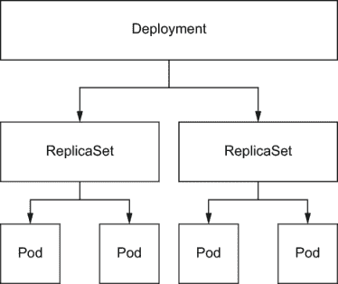

图 5.1 部署利用一个或多个 ReplicaSet 为应用提供声明式更新。每个 ReplicaSet 根据 PodSpec 和副本数管理实际的 Pod 数量。

### 5.1.1 为什么 ReplicaSet 不适合 GitOps

ReplicaSet 清单包括一个选择器，指定如何识别它管理的 Pod，要维护的 Pod 副本数，以及一个 Pod 模板，定义如何创建新的 Pod 以满足所需的副本数。然后 ReplicaSet 控制器将根据清单中指定的所需数量创建和删除 Pod。正如我们之前提到的，ReplicaSet 不是声明式的，我们将通过教程深入理解 ReplicaSet 是如何工作的以及为什么它不是声明式的：

1.  部署具有两个 Pod 的 ReplicaSet。

1.  在清单中更新镜像 ID。

1.  应用更新的清单并观察 ReplicaSet。

1.  在清单中更新`replicas`为 3。

1.  应用更新的清单并观察 ReplicaSet。

如果 ReplicaSet 是声明式的，你应该看到三个具有更新后的镜像 ID 的 Pod。

首先，我们将应用 ReplicaSet.yaml，这将创建两个具有镜像 ID `argoproj/rollouts-demo:blue`的 Pod 和一个服务：

```
$ kubectl apply -f ReplicaSet.yaml
replicaset.apps/demo created
service/demo created

```

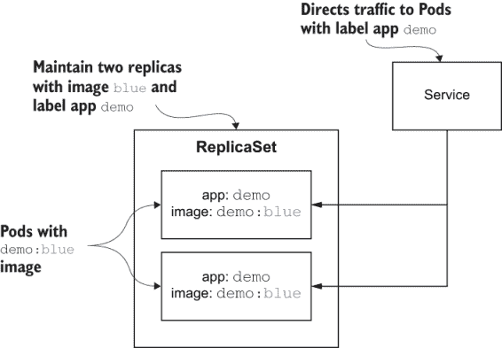

图 5.2 应用 ReplicaSet.yaml 将创建两个具有镜像`argoproj/rollouts-demo:blue`的 Pod。它还将创建一个`demo`服务，将流量导向 Pod。

列表 5.1  ReplicaSet.yaml

```
apiVersion: apps/v1
kind: ReplicaSet
metadata:
  name: demo
  labels:
    app: demo
spec:
  replicas: 2                                ❶
  selector:
    matchLabels:
      app: demo
  template:
    metadata:
      labels:
        app: demo
    spec:
      containers:
      - name: demo
        image: argoproj/rollouts-demo:blue   ❷
        imagePullPolicy: Always
        ports:
        - containerPort: 8080
---
apiVersion: v1
kind: Service
metadata:
  name: demo
  labels:
    app: demo
spec:
  ports:
  - protocol: TCP
    port: 80
    targetPort: 8080
  selector:
    app: demo
```

❶ 将副本数量从 2 更新到 3

❷ 将镜像标签从 blue 更新到 green

部署完成后，我们将更新镜像 ID 从`blue`更新到`green`并应用更改：

```
$ sed -i .bak 's/blue/green/g' ReplicaSet.yaml
$ kubectl apply -f ReplicaSet.yaml
replicaset.apps/demo configured
service/demo unchanged
```

接下来，我们可以使用`kubectl` `diff`命令来验证清单已在 Kubernetes 中更新。然后我们可以运行`kubectl` `get` `Pods`并期望看到镜像标签`green`而不是`blue`：

```
$ kubectl diff -f ReplicaSet.yaml
$ kubectl get pods -o jsonpath="{.items[*].spec.containers[*].image}"
argoproj/rollouts-demo:blue argoproj/rollouts-demo:blue
```

尽管已应用更新的清单，但现有的 Pod 并没有更新到`green`。让我们将`replicas`数量从 2 更新到 3 并应用清单：

```
$ sed -i .bak 's/replicas: 2/replicas: 3/g' ReplicaSet.yaml
$ kubectl apply -f ReplicaSet.yaml
replicaset.apps/demo configured
service/demo unchanged
$ kubectl get pods -o jsonpath="{.items[*].spec.containers[*].image}"
argoproj/rollouts-demo:blue argoproj/rollouts-demo:green 
argoproj/rollouts-demo:blue
$ kubectl describe rs demo
Name:         demo
Namespace:    default
Selector:     app=demo
Labels:       app=demo
Annotations:  kubectl.kubernetes.io/last-applied-configuration:
                {"apiVersion":"apps/v1","kind":"ReplicaSet","metadata":{"annotations":{},
                 "labels":{"app":"demo"},"name":"demo","namespace":"default"},"spe...
Replicas:     3 current / 3 desired
Pods Status:  3 Running / 0 Waiting / 0 Succeeded / 0 Failed
Pod Template:
  Labels:  app=demo
  Containers:
   demo:
    Image:        argoproj/rollouts-demo:green
    Port:         8080/TCP
    Host Port:    0/TCP
    Environment:  <none>
    Mounts:       <none>
  Volumes:        <none>
Events:
  Type   Reason           Age  From                   Message
  ----   ------           ---- ----                   -------
  Normal SuccessfulCreate 13m  replicaset-controller  Created pod: demo-gfd8g
  Normal SuccessfulCreate 13m  replicaset-controller  Created pod: demo-gxl6j
  Normal SuccessfulCreate 10m  replicaset-controller  Created pod: demo-vbx9q
```

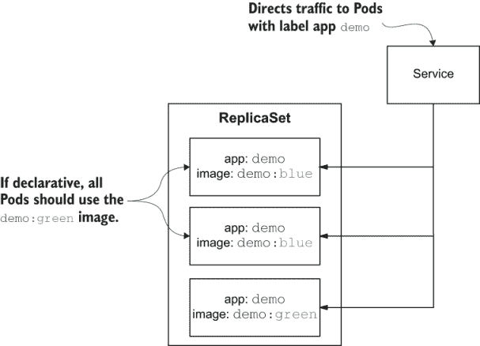

图 5.3 应用更改后，你会看到只有两个 Pod 正在运行蓝色镜像。如果 ReplicaSet 是声明式的，所有三个 Pod 都应该是绿色的。

意想不到的是，第三个 Pod 的镜像标签是绿色，但前两个 Pod 仍然是蓝色，因为 ReplicaSet 控制器的工作只是确保运行 Pod 的数量。如果 ReplicaSet 确实是声明式的，那么 ReplicaSet 控制器应该检测到镜像标签/副本数的变化，并将所有三个 Pod 更新为绿色。在下一节中，你将看到 Deployment 是如何工作的以及为什么它是声明式的。

### 5.1.2 Deployment 与 ReplicaSet 的工作方式

Deployment 是完全声明式的，并且完美地补充了 GitOps。Deployment 通过滚动更新以零停机时间部署服务。让我们通过一个教程来检查 Deployment 是如何使用多个 ReplicaSet 实现滚动更新的。

滚动更新 滚动更新允许 Deployments 通过增量更新 Pod 实例来无停机地更新。如果您的服务是无状态的且向后兼容，滚动更新效果很好。否则，您将不得不考虑其他部署策略，如蓝绿部署，这将在 5.1.3 节中介绍。

让我们想象一个现实生活中的场景，看看这将如何适用。假设你为小企业运行一个支付服务来处理信用卡。该服务需要 24/7 可用，你一直在运行两个 Pod（蓝色）来处理当前流量。你注意到这两个 Pod 正在达到最大容量，因此你决定将容量扩展到三个 Pod（蓝色）以支持增加的流量。接下来，你的产品经理想要添加借记卡支持，因此你需要部署一个包含三个 Pod（绿色）的版本，且无需停机：

1.  使用 Deployment 部署两个信用卡（蓝色）Pod。

1.  查看 Deployment 和 ReplicaSet。

1.  将 `replicas` 从 2 更改为 3 并应用清单。

1.  查看 Deployment 和 ReplicaSet。

1.  更新清单以包含三个信用和借记卡（绿色）Pod。

1.  在三个 Pod 变为绿色时，查看 Deployment 和 ReplicaSet。

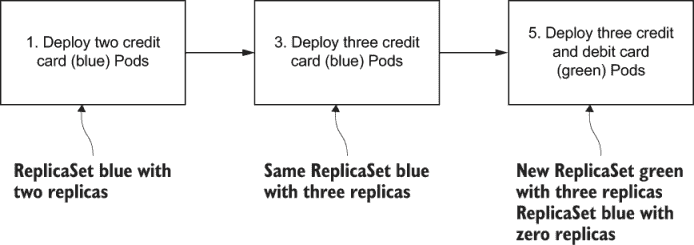

图 5.4 在本教程中，你将最初部署两个蓝色 Pod。然后你将更新/应用清单以包含三个副本。最后，你将更新/应用清单以包含三个绿色 Pod。

让我们从创建初始 Deployment 开始。正如你从列表 5.2 中可以看到，YAML 实际上与列表 5.1 几乎相同，只是第 2 行将 ReplicaSet 更改为 Deployment：

```
$ kubectl apply -f deployment.yaml
deployment.apps/demo created
service/demo created
```

列表 5.2  deployment.yaml

```
apiVersion: apps/v1
kind: Deployment
metadata:
  name: demo
  labels:
    app: demo
spec:
  replicas: 2                               ❶
  selector:
    matchLabels:
      app: demo
  template:
    metadata:
      labels:
        app: demo
    spec:
      containers:
      - name: demo
        image: argoproj/rollouts-demo:blue   ❷
        imagePullPolicy: Always
        ports:
        - containerPort: 8080
---
apiVersion: v1
kind: Service
metadata:
  name: demo
  labels:
    app: demo
spec:
  ports:
  - protocol: TCP
    port: 80
    targetPort: 8080
  Selector:                                 
    app: demo                                ❸
```

❶ 初始副本数设置为 2

❷ 初始镜像标签设置为 blue

❸ 服务 demo 初始设置为仅将流量发送到带有标签 app:demo 的 Pod

让我们回顾一下应用 Deployment 清单后创建的内容：

```
$ kubectl get pods                                                  ❶
NAME                    READY   STATUS              RESTARTS   AGE
demo-8656dbfdc5-97slx   0/1     ContainerCreating   0          7s
demo-8656dbfdc5-sbl6p   1/1     Running             0          7s

$ kubectl get Deployment                                            ❷
NAME   READY   UP-TO-DATE   AVAILABLE   AGE
demo   2/2     2            2           61s

$ kubectl get rs                                                    ❸
NAME              DESIRED   CURRENT   READY   AGE
demo-8656dbfdc5   2         2         2       44s

$ kubectl describe rs demo-8656dbfdc5 |grep Controlled              ❹
Controlled By:  Deployment/demo

$ kubectl describe rs demo-8656dbfdc5 |grep Replicas                ❺
Replicas:       2 current / 2 desired

$ kubectl describe rs demo-8656dbfdc5 |grep Image    #F
    Image:        argoproj/rollouts-demo:blue
```

❶ 两个正在运行的 Pod

❷ 一个名为 demo 的 demo Deployment

❸ 一个名为 demo-8656dbfdc5 的 ReplicaSet

❹ demo Deployment 创建了名为 demo-8656dbfdc5 的 ReplicaSet。

❺ ReplicaSet demo-8656dbfdc5 使用镜像 id argoproj/rollouts-demo:blue。

如预期，我们创建并控制了一个名为 `demo` 的部署和一个名为 demo-8656dbfdc5 的 ReplicaSet。ReplicaSet demo-8656dbfdc5 管理着两个带有 `blue` 图像的 Pod 副本。接下来，我们将更新清单以包含三个副本并查看更改：

```
$ sed -i .bak 's/replicas: 2/replicas: 3/g' deployment.yaml

$ kubectl apply -f deployment.yaml 
deployment.apps/demo configured
service/demo unchanged

$ kubectl get pods
NAME                    READY   STATUS              RESTARTS   AGE
demo-8656dbfdc5-97slx   1/1     Running   0          98s
demo-8656dbfdc5-sbl6p   1/1     Running   0          98s
demo-8656dbfdc5-vh76b   1/1     Running   0          4s

$ kubectl get Deployment
NAME   READY   UP-TO-DATE   AVAILABLE   AGE
demo   3/3     3            3           109s

$ kubectl get rs
NAME              DESIRED   CURRENT   READY   AGE
demo-8656dbfdc5   3         3         3       109s

$ kubectl describe rs demo-5c5575fb88 |grep Replicas
Replicas:       3 current / 3 desired

$ kubectl describe rs demo-8656dbfdc5 |grep Image
    Image:        argoproj/rollouts-demo:blue
```

更新后，我们应该看到相同的 Deployment 和 ReplicaSet，现在管理着三个蓝色 Pod。此时，Deployment 的外观与图 5.5 中描述的完全一致。接下来，我们将更新清单以使用绿色镜像并应用更改。由于镜像 id 已更改，Deployment 将创建第二个 ReplicaSet 来部署绿色镜像。

Deployment 和 ReplicaSets Deployment 会为每个镜像 id 创建一个 ReplicaSet，并将副本数设置为 ReplicaSet 中匹配的镜像 id 的期望值。对于所有其他 ReplicaSet，Deployment 将将这些 ReplicaSet 的副本数设置为 0 以终止所有不匹配的镜像 id 的 Pod。

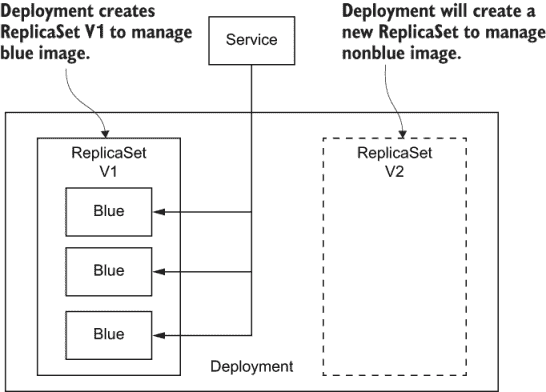

图 5.5 Deployment 使用 ReplicaSet V1 来维护蓝色部署。如果非蓝色镜像发生更改，Deployment 将为新的部署创建 ReplicaSet V2。

在应用更改之前，您可以使用以下命令打开一个新的终端来监控 ReplicaSet 的状态。您应该看到一个包含三个 Pod 的 ReplicaSet（蓝色）：

```
$ kubectl get rs --watch
NAME              DESIRED   CURRENT   READY   AGE
demo-8656dbfdc5   3         3         3       60s
```

返回原始终端，更新部署并应用更改：

```
$ sed -i .bak 's/blue/green/g' deployment.yaml
$ kubectl apply -f deployment.yaml 
deployment.apps/demo configured
service/demo unchanged
```

现在切换到终端，您应该看到 ReplicaSet demo-8656dbfdc5（蓝色）缩小到 0，一个新的 ReplicaSet demo-6b574cb9dd（绿色）扩大到 3：

```
$ kubectl get rs --watch
NAME              DESIRED   CURRENT   READY   AGE
demo-8656dbfdc5   3         3         3       60s       ❶
demo-6b574cb9dd   1         0         0       0s        ❷
demo-6b574cb9dd   1         0         0       0s
demo-6b574cb9dd   1         1         0       0s
demo-6b574cb9dd   1         1         1       3s
demo-8656dbfdc5   2         3         3       102s
demo-6b574cb9dd   2         1         1       3s
demo-8656dbfdc5   2         3         3       102s
demo-6b574cb9dd   2         1         1       3s
demo-8656dbfdc5   2         2         2       102s
demo-6b574cb9dd   2         2         1       3s
demo-6b574cb9dd   2         2         2       6s
demo-8656dbfdc5   1         2         2       105s
demo-8656dbfdc5   1         2         2       105s
demo-6b574cb9dd   3         2         2       6s
demo-6b574cb9dd   3         2         2       6s
demo-8656dbfdc5   1         1         1       105s
demo-6b574cb9dd   3         3         2       6s
demo-6b574cb9dd   3         3         3       9s        ❸
demo-8656dbfdc5   0         1         1       108s
demo-8656dbfdc5   0         1         1       108s
demo-8656dbfdc5   0         0         0       108s      ❹
```

❶ 蓝色 ReplicaSet 开始时包含三个 Pod

❷ 绿色 ReplicaSet 增加一个 Pod

❸ 绿色 ReplicaSet 完成，包含三个 Pod

❹ 蓝色 ReplicaSet 完成，没有 Pod。

让我们回顾一下这里发生了什么。Deployment 使用第二个 ReplicaSet，demo-6b574cb9dd，来启动一个绿色的 Pod，并使用第一个 ReplicaSet，demo-8656dbfdc5，来终止一个蓝色的 Pod，如图 5.6 所示。这个过程将重复进行，直到创建所有三个绿色的 Pod，同时终止所有蓝色的 Pod。

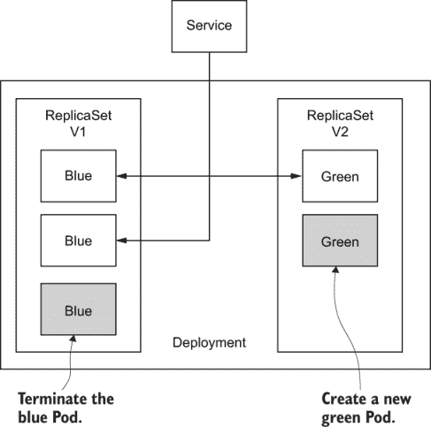

图 5.6 部署缩小 ReplicaSet V1 并扩大 ReplicaSet V2。当过程完成后，ReplicaSet V1 将没有 Pod，而 ReplicaSet V2 将包含三个绿色的 Pod。

当我们在讨论 Deployment 时，我们还应该介绍 Deployment 中滚动更新策略的两个重要配置参数：`max unavailable`和`max surge`。让我们回顾默认设置以及根据 Kubernetes 文档它们的意义：

```
$ kubectl describe Deployment demo |grep RollingUpdateStrategy
RollingUpdateStrategy:  25% max unavailable, 25% max surge
```

Deployment 确保在更新期间只有一定数量的 Pod 处于关闭状态。默认情况下，它确保至少 75%的期望 Pod 数量处于运行状态（最大不可用 25%）。

Deployment 还确保创建的 Pod 数量不超过期望的数量。默认情况下，它确保最多有 125%的期望 Pod 数量处于运行状态（最大激增 25%）。

让我们看看它是如何实际工作的。我们将将镜像 ID 改回蓝色，并将`max unavailable`配置为 3，`max surge`也配置为 3：

```
$ kubectl apply -f deployment2.yaml
deployment.apps/demo configured
service/demo unchanged
```

现在您可以切换回带有 ReplicaSet 监控的终端：

```
$ kubectl get rs --watch
NAME              DESIRED   CURRENT   READY   AGE
demo-8656dbfdc5   3         3         3       60s
demo-6b574cb9dd   1         0         0       0s
demo-6b574cb9dd   1         0         0       0s
demo-6b574cb9dd   1         1         0       0s
demo-6b574cb9dd   1         1         1       3s
demo-8656dbfdc5   2         3         3       102s
demo-6b574cb9dd   2         1         1       3s
demo-8656dbfdc5   2         3         3       102s
demo-6b574cb9dd   2         1         1       3s
demo-8656dbfdc5   2         2         2       102s
demo-6b574cb9dd   2         2         1       3s
demo-6b574cb9dd   2         2         2       6s
demo-8656dbfdc5   1         2         2       105s
demo-8656dbfdc5   1         2         2       105s
demo-6b574cb9dd   3         2         2       6s
demo-6b574cb9dd   3         2         2       6s
demo-8656dbfdc5   1         1         1       105s
demo-6b574cb9dd   3         3         2       6s
demo-6b574cb9dd   3         3         3       9s
demo-8656dbfdc5   0         1         1       108s
demo-8656dbfdc5   0         1         1       108s
demo-8656dbfdc5   0         0         0       108s
demo-8656dbfdc5   0         0         0       14m
demo-8656dbfdc5   3         0         0       14m
demo-6b574cb9dd   0         3         3       13m
demo-6b574cb9dd   0         3         3       13m
demo-8656dbfdc5   3         0         0       14m
demo-6b574cb9dd   0         0         0       13m   ❶
demo-8656dbfdc5   3         3         0       14m   ❷
demo-8656dbfdc5   3         3         1       14m
demo-8656dbfdc5   3         3         2       14m
demo-8656dbfdc5   3         3         3       14m
```

❶ 绿色 ReplicaSet 立即变为零 Pod。

❷ 蓝色 ReplicaSet 一次扩大三个 Pod。

如您从 ReplicaSet 更改状态中看到的，ReplicaSet demo-8656dbfdc5（绿色）立即变为零 Pod，而 ReplicaSet demo-6b574cb9dd（蓝色）立即变为三个，而不是一个一个地。

列表 5.3 deployment2.yaml

```
apiVersion: apps/v1
kind: Deployment
metadata:
  name: demo
  labels:
    app: demo
spec:
  replicas: 3
  selector:
    matchLabels:
      app: demo
  strategy:
    type: RollingUpdate
    rollingUpdate:
      maxSurge: 3           ❶
      maxUnavailable: 3     ❷
  template:
    metadata:
      labels:
        app: demo
    spec:
      containers:
      - name: demo
        image: argoproj/rollouts-demo:blue
        imagePullPolicy: Always
        ports:
        - containerPort: 8080
---
apiVersion: v1
kind: Service
metadata:
  name: demo
  labels:
    app: demo
spec:
  ports:
  - protocol: TCP
    port: 80
    targetPort: 8080
  selector:
    app: demo               ❸
```

❶ 一次创建最多三个 Pod

❷ 一次终止最多三个 Pod。

❸ 服务 demo 将流量发送到所有带有标签 app:demo 的 Pod。

到目前为止，您可以看到 Deployment 通过利用一个 ReplicaSet 用于蓝色，另一个 ReplicaSet 用于绿色，实现了零停机时间部署。当您在本章的其余部分了解其他部署策略时，您会发现它们都是通过使用两个不同的 ReplicaSet 以类似的方式实现的，以达到预期的目标。

### 5.1.3 流量路由

在 Kubernetes 中，服务是一个抽象，它定义了一组 Pods 和访问它们的策略。服务针对的 Pods 集合由服务清单中的一个选择器字段确定。然后，服务将流量转发到与选择器指定的标签匹配的 Pods（也参见列表 5.2 和 5.3）。服务执行轮询负载均衡，如果底层 Pods 无状态且向后兼容，则效果很好。如果您需要为您的部署自定义负载均衡，您将需要探索其他路由替代方案。

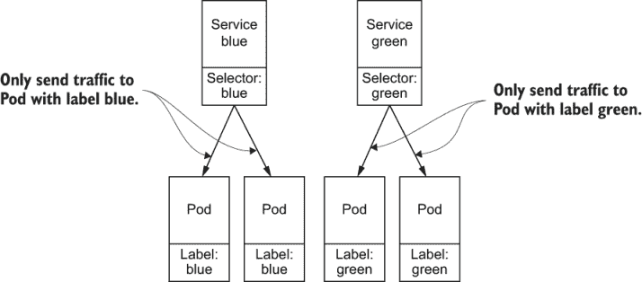

图 5.7 服务只会将流量路由到具有匹配标签的 Pods。在这个例子中，服务蓝只会将流量路由到带有标签 blue 的 Pods。服务绿只会将流量路由到带有标签 green 的 Pods。

NGINX 入口控制器^(3) 可以用于许多用例，并支持各种平衡和路由规则。入口控制器可以被配置为前端负载均衡器，执行自定义路由，例如 TLS 终止、URL 重写或通过定义自定义规则将流量路由到任意数量的服务。图 5.8 展示了配置了规则的 NGINX 控制器，将 40% 的入站流量发送到服务蓝，60% 的入站流量发送到服务绿。

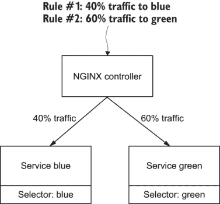

图 5.8 NGINX 入口控制器可以提供高级流量控制。在这个例子中，NGINX 入口控制器配置了一条规则，将 40% 的流量发送到服务蓝，以及另一条规则将 60% 的流量发送到服务绿。

Istio 网关^(4) 是在 Kubernetes 集群边缘运行的负载均衡器，接收传入或传出的 HTTP/TCP 连接。规范描述了一组应公开的端口、要使用的协议类型以及自定义路由配置。根据自定义配置（图 5.9），Istio 网关将传入流量定向到后端服务（40% 到服务蓝，60% 到服务绿）。

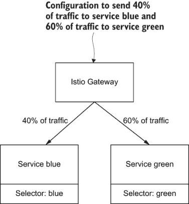

图 5.9 Istio 网关是另一个支持丰富流量路由配置的负载均衡器。在这个例子中，定义了一个自定义配置，将 40% 的流量发送到蓝服务，60% 的流量发送到绿服务。

注意：NGINX 入口控制器和 Istio 网关都是高级主题，超出了本书的范围。请参阅脚注中的链接以获取更多信息。

### 5.1.4 为其他策略配置 minikube

在本教程的剩余部分，您需要在您的 Kubernetes 集群中启用 NGINX 入口和 Argo Rollouts^(5) 支持。

Argo Rollouts Argo Rollouts 控制器使用 Rollout 自定义资源来为 Kubernetes 提供额外的部署策略，例如蓝绿和金丝雀部署。Rollout 自定义资源提供了与部署资源相同的功能，但增加了额外的部署策略。

使用 minikube，^(6) 你可以通过运行以下命令来启用 NGINX 入口支持：

```
$ minikube addons enable ingress
?? The 'ingress' addon is enabled
```

要在您的集群中安装 Argo Rollouts，您需要创建一个 `argo-rollouts` 命名空间并运行 install.yaml。对于其他环境，请参阅 Argo Rollouts 入门指南:^(7)

```
$ kubectl create ns argo-rollouts
namespace/argo-rollouts created
$ kubectl apply -n argo-rollouts -f https://raw.githubusercontent.com/argoproj/argo-rollouts/stable/manifests/install.yaml
customresourcedefinition.apiextensions.k8s.io/analysisruns.argoproj.io created
customresourcedefinition.apiextensions.k8s.io/analysistemplates.argoproj.io created
customresourcedefinition.apiextensions.k8s.io/experiments.argoproj.io created
customresourcedefinition.apiextensions.k8s.io/rollouts.argoproj.io created
serviceaccount/argo-rollouts created
role.rbac.authorization.k8s.io/argo-rollouts-role created
clusterrole.rbac.authorization.k8s.io/argo-rollouts-aggregate-to-admin created
clusterrole.rbac.authorization.k8s.io/argo-rollouts-aggregate-to-edit created
clusterrole.rbac.authorization.k8s.io/argo-rollouts-aggregate-to-view created
clusterrole.rbac.authorization.k8s.io/argo-rollouts-clusterrole created
rolebinding.rbac.authorization.k8s.io/argo-rollouts-role-binding created
clusterrolebinding.rbac.authorization.k8s.io/argo-rollouts-clusterrolebinding created
service/argo-rollouts-metrics created
deployment.apps/argo-rollouts created
```

## 5.2 蓝绿

正如你在 5.1 节中学到的，部署的滚动更新是一种很好的更新应用程序的方法，因为你的应用程序在部署期间将使用大约相同数量的资源，实现零停机时间和对性能的最小影响。然而，由于向后不兼容或状态性，许多遗留应用程序与滚动更新不兼容。一些应用程序可能还需要立即部署新版本或快速回滚以解决可能出现的问题。

对于这些用例，蓝绿部署将是适当的部署策略。蓝绿部署通过同时完全扩展两个部署来实现这些动机，但只将入站流量定向到这两个部署中的一个。

注意 在本教程中，我们将使用 NGINX Ingress Controller 将 100% 的流量路由到蓝色或绿色部署，因为内置的 Kubernetes 服务^(8) 只操作 iptables^(9) 并不会重置到 Pods 的现有连接，因此不适合蓝绿部署。

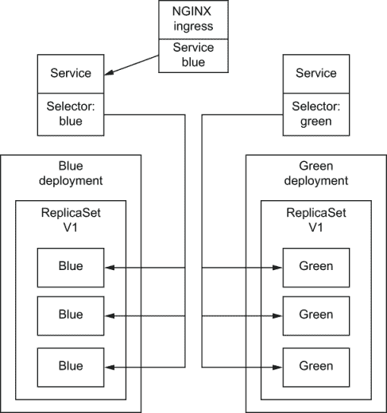

图 5.10 初始部署将配置 NGINX Controller 以将所有流量发送到蓝色服务。蓝色服务将反过来将流量发送到蓝色 Pods。

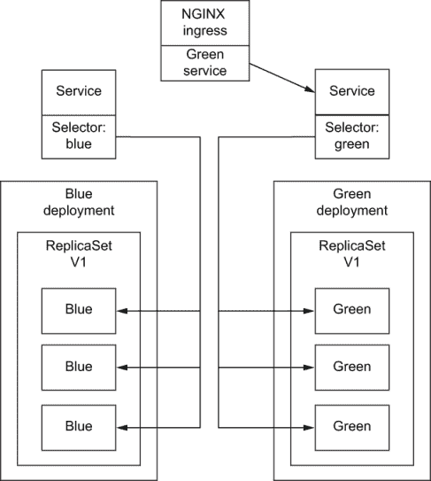

图 5.11 在 NGINX 控制器配置更新后，所有流量都将发送到绿色服务。绿色服务将反过来将流量发送到绿色 Pods。

### 5.2.1 使用 Deployment 的蓝绿部署

在本教程中，我们将使用原生的 Kubernetes Deployment 和 Service 执行蓝绿部署。

注意 请参考本教程之前 5.1.4 节中如何启用入口和在您的 Kubernetes 集群中安装 Argo Rollouts 的说明。

1.  创建蓝色部署和服务。

1.  创建入口以将流量定向到蓝色服务。

1.  在浏览器中查看应用程序（蓝色）。

1.  部署绿色部署和服务，并等待所有 Pods 准备就绪。

1.  更新入口以将流量定向到绿色服务。

1.  再次在浏览器中查看网页（绿色）。

我们将首先通过应用 blue_deployment.yaml 创建蓝色部署：

```
$ kubectl apply -f blue_deployment.yaml 
deployment.apps/blue created
service/blue-service created
```

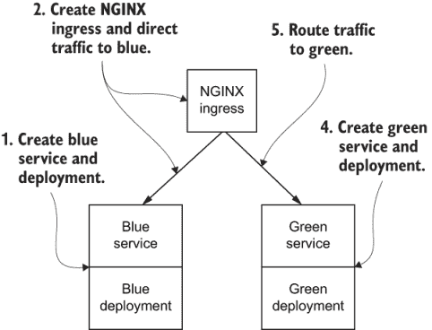

图 5.12 使用蓝色服务和部署以及 NGINX Ingress Controller 将流量定向到蓝色服务创建初始状态。然后创建绿色服务和部署，并通过更改 NGINX Ingress Controller 的配置将流量定向到绿色服务。

列表 5.4  blue_deployment.yaml

```
apiVersion: apps/v1
kind: Deployment
metadata:
  name: blue
  labels:
    app: blue
spec:
  replicas: 3
  selector:
    matchLabels:
      app: blue
  template:
    metadata:
      labels:
        app: blue
    spec:
      containers:
      - name: demo
        image: argoproj/rollouts-demo:blue
        imagePullPolicy: Always
        ports:
        - containerPort: 8080
---
apiVersion: v1
kind: Service
metadata:
  name: blue-service
  labels:
    app: blue
spec:
  ports:
  - protocol: TCP
    port: 80
    targetPort: 8080
  selector:
    app: blue
  type: NodePort
```

现在我们可以公开一个入口控制器，通过应用 blue_ingress.yaml，`blue` 服务可以通过你的浏览器访问。`kubectl get ingress` 命令将返回入口控制器的主机名和 IP 地址：

```
$ kubectl apply -f blue_ingress.yaml 
ingress.extensions/demo-ingress created
configmap/nginx-configuration created
$ kubectl get ingress
NAME           HOSTS       ADDRESS          PORTS   AGE
demo-ingress   demo.info   192.168.99.111   80      60s
```

注意 NGINX Ingress Controller 将仅拦截自定义规则中定义的主机名的流量。请确保你将 demo.info 及其 IP 地址添加到你的 /etc/hosts。

列表 5.5  blue_ingress.yaml

```
apiVersion: extensions/v1beta1
kind: Ingress
metadata:
  name: demo-ingress
spec:
  rules:
  - host: demo.info                    ❶
    http:
      paths:
      - path: /                        ❷
        backend:
          serviceName: blue-service    ❸
          servicePort: 80               
---
apiVersion: v1                          
kind: ConfigMap                        ❹
metadata:
  name: nginx-configuration
data:
  allow-backend-server-header: "true"  ❺
  use-forwarded-headers: "true"        ❻
```

❶ 为入口控制器分配主机名 demo.info

❷ 路由所有流量

❸ 将流量路由到 80 端口的蓝色服务

❹ 用于自定义 NGINX 中头部控制的 ConfigMap

❺ 启用从后端返回头部服务器而不是通用的 NGINX 字符串

❻ 将传入的 X-Forwarded-* 头部传递给上游

一旦你创建了入口控制器、蓝色服务和部署，并更新了 /etc/hosts 中的 demo.info 和正确的 IP 地址，你就可以输入 URL demo.info 并看到蓝色服务正在运行。

注意：演示应用程序将继续在后台调用活动服务并显示右侧的最新结果。蓝色（打印中的较深灰色）是运行版本，绿色（打印中的较浅灰色）是新版本。

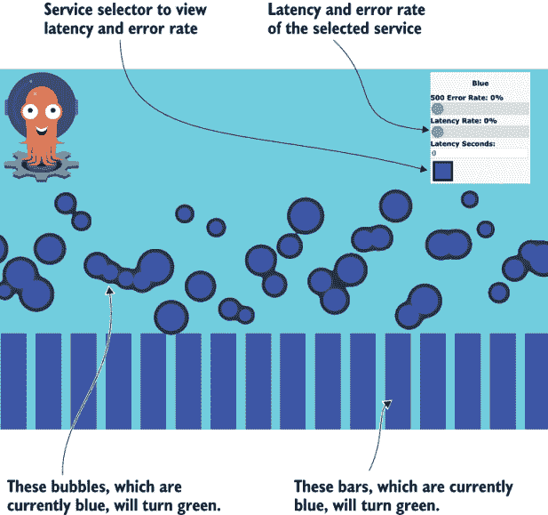

图 5.13 HTML 页面将在柱状图中每两秒刷新一次，在气泡图中每 100 毫秒刷新一次，以显示蓝色或绿色服务响应。最初，HTML 页面将显示所有蓝色，因为所有流量都流向蓝色部署。

现在我们准备部署新的绿色版本。让我们应用 green_deployment.yaml 来创建绿色服务和部署：

```
$ kubectl apply -f green_deployment.yaml 
deployment.apps/green created
service/green-service created
```

列表 5.6  green_deployment.yaml

```
apiVersion: apps/v1
kind: Deployment
metadata:
  name: green
  labels:
    app: green
spec:
  replicas: 3
  selector:
    matchLabels:
      app: green
  template:
    metadata:
      labels:
        app: green
    spec:
      containers:
      - name: green
        image: argoproj/rollouts-demo:green
        imagePullPolicy: Always
        ports:
        - containerPort: 8080
---
apiVersion: v1
kind: Service
metadata:
  name: green-service
  labels:
    app: green
spec:
  ports:
  - protocol: TCP
    port: 80
    targetPort: 8080
  selector:
    app: green
  type: NodePort
```

绿色服务和部署准备就绪后，我们现在可以更新入口控制器以将流量路由到绿色服务：

```
$ kubectl apply -f green_ingress.yaml 
ingress.extensions/demo-ingress configured
configmap/nginx-configuration unchanged
```

列表 5.7  green_ingress.yaml

```
apiVersion: extensions/v1beta1
kind: Ingress
metadata:
  name: demo-ingress
spec:
  rules:
  - host: demo.info                     
    http:
      paths:
      - path: /
        backend:
          serviceName: green-service    ❶
          servicePort: 80               
---
apiVersion: v1
kind: ConfigMap
metadata:
  name: nginx-configuration
data:
  allow-backend-server-header: "true"
  use-forwarded-headers: "true"         
```

❶ 将流量路由到绿色服务而不是蓝色服务

如果你回到你的浏览器，你应该看到服务正在变绿！

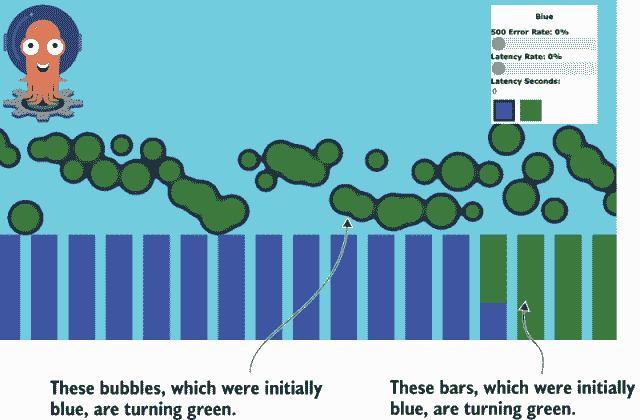

图 5.14 绿色部署完成后，将 NGINX Ingress Controller 更新为指向绿色部署后，HTML 页面将开始显示绿色气泡和柱状图。

如果你满意部署，你可以删除蓝色服务及其部署，或者将蓝色部署缩放到 0。

练习 5.1

你会如何以声明式的方式缩小蓝色部署？

练习 5.2

如果你想快速回滚，你应该删除部署还是将其缩放到 0？

### 5.2.2 使用 Argo Rollouts 的蓝绿部署

蓝绿部署肯定可以在生产中使用本地的 Kubernetes Deployment 通过额外的流程和自动化来实现。更好的方法是使整个蓝绿部署过程完全自动化和声明式；因此，Argo Rollouts 应运而生。

Argo Rollouts 引入了一个名为 `Rollout` 的新自定义资源，为 Kubernetes 提供了额外的部署策略，如蓝绿、金丝雀（第 5.3 节）和渐进式交付（第 5.4 节）。`Rollout` 自定义资源提供了与 Deployment 资源相同的功能，并增加了额外的部署策略。在下一教程中，你将看到使用 Argo Rollouts 部署蓝绿是多么简单。

注意：请参考本教程之前的 5.1.4 节，了解如何启用入口并在你的 Kubernetes 集群中安装 Argo Rollouts。

1.  部署 NGINX 入口控制器。

1.  使用 Argo Rollouts 部署生产服务和（蓝色）部署。

1.  更新清单以使用绿色镜像。

1.  应用更新的清单以部署新的绿色版本。

首先，我们将创建入口控制器、`demo-service` 和蓝色部署：

```
$ kubectl apply -f ingress.yaml 
ingress.extensions/demo-ingress created
configmap/nginx-configuration created
$ kubectl apply -f bluegreen_rollout.yaml 
rollout.argoproj.io/demo created
service/demo-service created
$ kubectl get ingress
NAME           HOSTS       ADDRESS          PORTS   AGE
demo-ingress   demo.info   192.168.99.111   80      60s
```

列表 5.8  ingress.yaml

```
apiVersion: extensions/v1beta1
kind: Ingress
metadata:
  name: demo-ingress
spec:
  rules:
  - host: demo.info
    http:
      paths:
      - path: /
        backend:
          serviceName: demo-service
          servicePort: 80
---
apiVersion: v1
data:
  allow-backend-server-header: "true"
  use-forwarded-headers: "true"
kind: ConfigMap
metadata:
  name: nginx-configuration   
```

列表 5.9  bluegreen_rollout.yaml

```
apiVersion: argoproj.io/v1alpha1
kind: Rollout                               ❶
metadata:
  name: demo
  labels:
    app: demo
spec:
  replicas: 3
  selector:
    matchLabels:
      app: demo
  template:
    metadata:
      labels:
        app: demo
    spec:
      containers:
      - name: demo
        image: argoproj/rollouts-demo:blue  ❷
        imagePullPolicy: Always
        ports:
        - containerPort: 8080
  Strategy:       
    bluegreen:                              ❸
      autoPromotionEnabled: true            ❹
      activeService: demo-service           ❺
---
apiVersion: v1
kind: Service
metadata:
  name: demo-service
  labels:
    app: demo
spec:
  ports:
  - protocol: TCP
    port: 80
    targetPort: 8080
  selector:
    app: demo
  type: NodePort
```

❶ 指定类型为 Rollout 而不是 Deployment

❷ 使用蓝色镜像设置初始部署

❸ 使用蓝绿部署策略而不是滚动更新

❹ 自动更新 demo-service 中的选择器，将所有流量发送到绿色 Pods

❺ 指定 demo-service 为此滚动对象的前端流量

注意：Argo Rollouts 内部将维护一个用于蓝色和一个用于绿色的 ReplicaSet。它还将确保在更新服务选择器以将所有流量发送到绿色之前，绿色部署已完全扩展。（因此，在这种情况下只需要一个服务。）此外，Argo Rollouts 还将等待 30 秒，以确保所有蓝色流量完成并缩小蓝色部署。

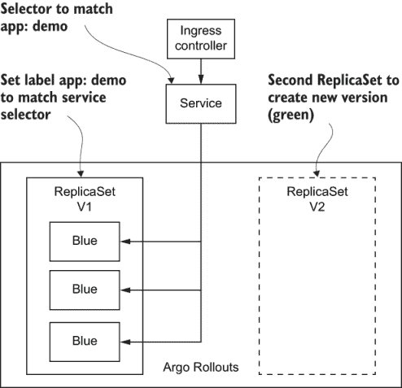

图 5.15 Argo Rollouts 与使用一个或多个 ReplicaSet 来满足部署请求的 Deployment 类似。在初始状态下，Argo Rollouts 为蓝色 Pods 创建 ReplicaSet V1。

一旦创建了入口控制器、服务以及更新了 /etc/hosts，你就可以输入 URL demo.info 来查看正在运行的蓝色服务。

注意：NGINX 入口控制器只会拦截自定义规则中定义的主机名的流量。请确保你将 demo.info 及其 IP 地址添加到你的 /etc/hosts 中。

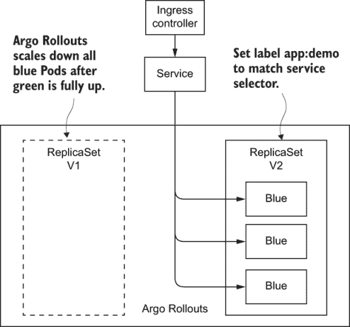

图 5.16 Argo Rollouts 为绿色 Pods 创建 ReplicaSet V2。一旦所有绿色 Pods 都启动并运行，Argo Rollouts 将自动缩小所有蓝色 Pods。

现在我们将更新清单以部署新版本，绿色。一旦你应用了更新的清单，你就可以回到浏览器中，看到所有条形和点都变成了绿色（图 5.16）：

```
$ sed -i .bak 's/demo:blue/demo:green/g' bluegreen_rollout.yaml
$ kubectl apply -f bluegreen_rollout.yaml
deployment.apps/demo configured
service/demo-service unchanged
```

## 5.3 金丝雀

金丝雀部署是一种技术，通过在将新软件版本提供给所有用户之前，先对一小部分用户进行短期部署来降低在生产环境中引入新软件版本的风险。金丝雀作为故障的早期指标，可以避免有问题的部署一次性对所有客户造成全面影响。如果一个金丝雀部署失败，其他服务器不会受到影响，你可以简单地终止金丝雀并对问题进行分类。

注意：根据我们的经验，大多数生产事件都是由于系统中的更改，例如新的部署。金丝雀部署是在新版本达到所有用户群体之前测试新发布的另一个机会。

我们的金丝雀示例与蓝绿示例类似。

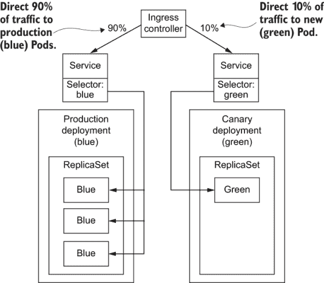

图 5.17 入口控制器将同时面向蓝色和绿色服务，但在此情况下，90% 的流量将流向蓝色（生产）服务，10% 将流向绿色（金丝雀）服务。由于绿色服务只获得 10% 的流量，因此我们只扩容一个绿色 Pod 以最小化资源使用。

当金丝雀运行并获取生产流量时，我们可以在固定时间段（例如一小时）内监控金丝雀的健康状况（延迟、错误等），以确定是否扩容绿色部署并将所有流量路由到绿色服务，或者在没有问题的情况下将所有流量路由回蓝色服务并终止绿色 Pod。

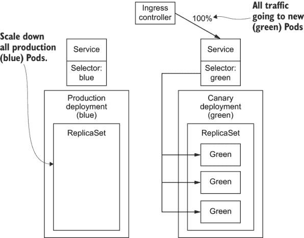

图 5.18 如果金丝雀 Pod 没有错误，绿色部署将扩容到三个 Pod 并接收 100% 的生产流量。

### 5.3.1 使用 Deployment 的金丝雀

在本教程中，我们将使用原生的 Kubernetes Deployment 和 Service 执行金丝雀部署。

注意：请在本教程之前参考 5.1.4 节了解如何启用入口并在您的 Kubernetes 集群中安装 Argo Rollouts。

1.  创建蓝色部署和服务（生产）。

1.  创建入口以将流量导向蓝色服务。

1.  在浏览器中查看应用程序（蓝色）。

1.  部署绿色部署（一个 Pod）和服务，并等待所有 Pod 准备就绪。

1.  创建金丝雀入口，将 10% 的流量导向绿色服务。

1.  再次在浏览器中查看网页（10% 绿色且无错误）。

1.  将绿色部署扩容到三个 Pod。

1.  更新金丝雀入口以将 100% 的流量发送到绿色服务。

1.  将蓝色部署缩放到 0。

我们可以通过应用 blue_deployment.yaml（列表 5.4）来创建生产部署：

```
$ kubectl apply -f blue_deployment.yaml 
deployment.apps/blue created
service/blue-service created
```

现在，我们可以通过应用 blue_ingress.yaml（列表 5.5）来公开入口控制器，这样我们就可以通过浏览器访问蓝色服务：`kubectl get ingress` 命令将返回入口控制器的主机名和 IP 地址：

```
$ kubectl apply -f blue_ingress.yaml 
ingress.extensions/demo-ingress created
configmap/nginx-configuration created
$ kubectl get ingress
NAME           HOSTS       ADDRESS          PORTS   AGE
demo-ingress   demo.info   192.168.99.111   80      60s
```

注意：NGINX 入口控制器只会拦截自定义规则中定义的主机名的流量。请确保您已将 demo.info 及其 IP 地址添加到您的 /etc/hosts。

一旦创建了入口控制器、蓝色服务和部署，并已更新 /etc/hosts 中的 demo.info 和正确的 IP 地址，你就可以输入 URL demo.info 并看到蓝色服务正在运行。

现在我们已经准备好部署新的绿色版本。让我们应用 green_deployment.yaml 来创建绿色服务和部署：

```
$ kubectl apply -f green_deployment.yaml 
deployment.apps/green created
service/green-service created
```

列表 5.10  green_deployment.yaml

```
apiVersion: apps/v1
kind: Deployment
metadata:
  name: green
  labels:
    app: green
spec:
  replicas: 1         ❶
  selector:
    matchLabels:
      app: green
  template:
    metadata:
      labels:
        app: green
    spec:
      containers:
      - name: green
        image: argoproj/rollouts-demo:green
        imagePullPolicy: Always
        ports:
        - containerPort: 8080
---
apiVersion: v1
kind: Service
metadata:
  name: green-service
  labels:
    app: green
spec:
  ports:
  - protocol: TCP
    port: 80
    targetPort: 8080
  selector:
    app: green
  type: NodePort
```

❶ 初始绿色部署的 ReplicaSet 设置为 1。

接下来，我们将创建 `canary_ingress` 以将 10% 的流量路由到金丝雀（绿色）服务：

```
$ kubectl apply -f canary_ingress.yaml 
ingress.extensions/canary-ingress configured
configmap/nginx-configuration unchanged
```

列表 5.11  canary_ingress.yaml

```
apiVersion: extensions/v1beta1
kind: Ingress
metadata:
  name: canary-ingress
  annotations:
    nginx.ingress.kubernetes.io/canary: "true"        ❶
    nginx.ingress.kubernetes.io/canary-weight: "10"   ❷
spec:
  rules:
  - host: demo.info
    http:
      paths:
      - path: /
        backend:
          serviceName: green-service
          servicePort: 80
---
apiVersion: v1
data:
  allow-backend-server-header: "true"
  use-forwarded-headers: "true"
kind: ConfigMap
metadata:
  name: nginx-configuration
```

❶ 告诉 NGINX 入口控制器将其标记为金丝雀，并通过匹配主机和路径将此入口与主入口关联

❷ 将 10% 的流量路由到 green-service

现在，你可以回到浏览器并监控绿色服务。

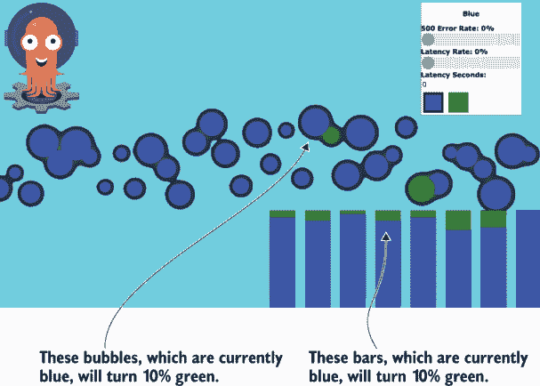

图 5.19 HTML 页面将在气泡图和柱状图中显示蓝色和绿色的混合，因为 10% 的流量将流向绿色 Pod。

如果你能够看到正确的结果（健康的金丝雀），你就可以完成金丝雀部署（绿色服务）。然后我们将扩展绿色部署，将所有流量发送到绿色服务，并缩减蓝色部署：

```
$ sed -i .bak 's/replicas: 1/replicas: 3/g' green_deployment.yaml
$ kubectl apply -f green_deployment.yaml
deployment.apps/green configured
service/green-service unchanged
$ sed -i .bak 's/10/100/g' canary_ingress.yaml
$ kubectl apply -f canary_ingress.yaml
ingress.extensions/canary-ingress configured
configmap/nginx-configuration unchanged
$ sed -i .bak 's/replicas: 3/replicas: 0/g' blue_deployment.yaml
$ kubectl apply -f blue_deployment.yaml
deployment.apps/blue configured
service/blue-service unchanged
```

现在你应该能够看到所有绿色柱子和点，因为 100% 的流量被路由到绿色服务。

注意：在真正的生产环境中，我们将在将 100% 的流量发送到金丝雀服务之前，需要确保所有绿色 Pod 都处于运行状态。可选地，我们可以在绿色部署扩展的同时，逐步增加发送到绿色服务的流量百分比。

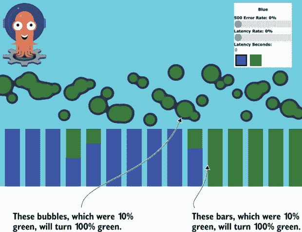

图 5.20 如果金丝雀没有错误，绿色部署将扩展，蓝色部署将缩减。在蓝色部署完全缩减后，气泡图和柱状图将显示 100% 绿色。

### 5.3.2 使用 Argo Rollouts 进行金丝雀部署

如 5.3.1 节中所示，使用金丝雀部署可以帮助早期检测问题，以防止有问题的部署，但将在部署过程中涉及许多额外的步骤。在下一教程中，我们将使用 Argo Rollouts 简化金丝雀部署的过程。

注意：请参考本教程之前的 5.1.4 节，了解如何在 Kubernetes 集群中启用入口并安装 Argo Rollouts。

1.  创建入口、生产部署和服务（蓝色）。

1.  在浏览器中查看应用程序（蓝色）。

1.  使用带有 10% 金丝雀流量的绿色镜像应用清单 60 秒。

1.  创建将 10% 的流量引导到绿色服务的金丝雀入口。

1.  在浏览器中再次查看网页（10% 绿色，无错误）。

1.  等待 60 秒。

1.  再次在浏览器中查看应用程序（全部绿色）。

首先，我们将创建入口控制器（列表 5.8）、`demo-service` 和蓝部署（列表 5.12）：

```
$ kubectl apply -f ingress.yaml 
ingress.extensions/demo-ingress created
configmap/nginx-configuration created
$ kubectl apply -f canary_rollout.yaml 
rollout.argoproj.io/demo created
service/demo-service created
$ kubectl get ingress
NAME           HOSTS       ADDRESS          PORTS   AGE
demo-ingress   demo.info   192.168.99.111   80      60s
```

列表 5.12  canary_rollout.yaml

```
apiVersion: argoproj.io/v1alpha1
kind: Rollout                                 ❶
metadata:
  name: demo
  labels:
    app: demo
spec:
  replicas: 3
  selector:
    matchLabels:
      app: demo
  template:
    metadata:
      labels:
        app: demo
    spec:
      containers:
      - name: demo
        image: argoproj/rollouts-demo:blue
        imagePullPolicy: Always
        ports:
        - containerPort: 8080
  strategy:
    canary:                                   ❷
      maxSurge: "25%"
      maxUnavailable: 0
      steps:
      - setWeight: 10                         ❸
      - pause:
          duration: 60                        ❹
---
apiVersion: v1
kind: Service
metadata:
  name: demo-service
  labels:
    app: demo
spec:
  ports:
  - protocol: TCP
    port: 80
    targetPort: 8080
  selector:
    app: demo
  type: NodePort
```

❶ 当 Rollout 首次部署时，策略被忽略，并执行常规部署。

❷ 使用金丝雀策略部署

❸ 将 Pod 数量扩展到足以服务 10%的流量。在本例中，Rollout 将扩展一个绿色 Pod 以及三个蓝色 Pod，使得绿色 Pod 获得 25%的流量。Argo Rollouts 可以与服务网格或 NGINX Ingress Controller 配合进行细粒度流量路由。

❹ 等待 60 秒。如果没有错误或用户中断发生，将绿色 Pod 扩展到 100%。

注意对于初始部署（蓝色），`Rollout`将忽略金丝雀设置并执行常规部署。

一旦创建了 ingress 控制器、服务以及更新了包含 demo.info 和正确 IP 地址的/etc/hosts 文件，您就可以输入 URL demo.info 并看到蓝色服务正在运行。

注意 NGINX Ingress Controller 只会拦截自定义规则中定义的主机名的流量。请确保您已将 demo.info 及其 IP 地址添加到您的/etc/hosts 文件中。

一旦蓝色服务完全启动并运行，我们现在可以更新清单，使用绿色镜像并应用清单：

```
$ sed -i .bak 's/demo:blue/demo:green/g' canary_rollout.yaml
$ kubectl apply -f canary_rollout.yaml 
rollout.argoproj.io/demo configured
service/demo-service unchanged
```

一旦金丝雀启动，你应该会看到与第 5.3.1 节中的图 5.19 类似的内容。经过一分钟，绿色 ReplicaSet 将扩展，而蓝色部署将缩减，所有条形和点都将变为绿色（第 5.3.1 节中的图 5.20）。

## 5.4 渐进式交付

渐进式交付也可以被视为金丝雀部署的完全自动化版本。与在扩展金丝雀部署之前监控固定时间段（例如一小时）不同，渐进式交付将连续监控 Pod 的健康状况，直到完全扩展。

### 5.4.1 使用 Argo Rollouts 进行渐进式交付

Kubernetes 不提供分析工具来确定新部署的正确性。在本教程中，我们将使用 Argo Rollouts 来实现渐进式交付。Argo Rollouts 使用金丝雀策略以及`AnalysisTemplate`来实现渐进式交付。


图 5.21 渐进式交付持续收集和分析新 Pod 的健康状况；扩展渐进式部署（绿色）；缩减生产部署（蓝色），只要分析确定成功。

注意请参考第 5.1.4 节了解如何在本次教程之前在 Kubernetes 集群中启用 ingress 并安装 Argo Rollouts。

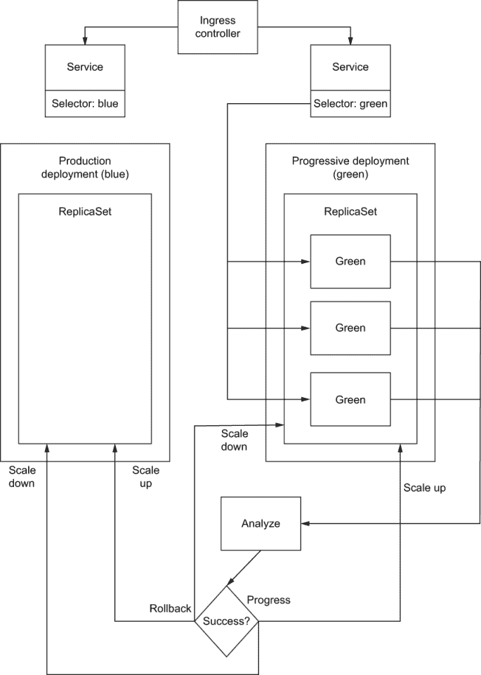

图 5.22 此图展示了完成的渐进式交付，绿色部署完全扩展，蓝色部署缩减。

1.  创建`AnalysisTemplate`。

1.  创建 ingress、生产部署和服务（蓝色）。

1.  创建 ingress 以将流量导向生产服务。

1.  再次在浏览器中查看应用程序（蓝色）。

1.  使用 Pass 模板更新并应用包含绿色镜像的清单。

1.  在浏览器中再次查看网页（绿色）。

1.  使用 Fail 模板更新并应用包含绿色镜像的清单。

1.  再次在浏览器中查看应用程序。仍然是蓝色！

首先，我们将为`Rollout`创建用于收集指标并确定 Pod 健康状况的`AnalysisTemplate`（列表 5.13）。为了简单起见，我们将创建一个总是返回 0（健康）的`AnalysisTemplate` `pass`，以及一个总是返回 1（不健康）的`AnalysisTemplate` `fail`。此外，Argo Rollouts 内部维护多个 ReplicaSet，因此不需要多个服务。接下来，我们将创建入口控制器（列表 5.8）、`demo-service`和蓝色部署（列表 5.14）：

```
$ kubectl apply -f analysis-templates.yaml 
analysistemplate.argoproj.io/pass created
analysistemplate.argoproj.io/fail created
$ kubectl apply -f ingress.yaml 
ingress.extensions/demo-ingress created
configmap/nginx-configuration created
$ kubectl apply -f rollout-with-analysis.yaml 
rollout.argoproj.io/demo created
service/demo-service created
$ kubectl get ingress
NAME           HOSTS       ADDRESS          PORTS   AGE
demo-ingress   demo.info   192.168.99.111   80      60s
```

注意：对于生产环境，`AnalysisTemplate`支持 Prometheus、Wavefront 和 Netflix Kayenta，或者可以扩展以支持其他指标存储。

列表 5.13  analysis-templates.yaml

```
apiVersion: argoproj.io/v1alpha1
kind: AnalysisTemplate
metadata:
  name: pass
spec:
  metrics:
  - name: pass
    interval: 15s                     ❶
    failureLimit: 1
    provider:
      job:
        spec:
          template:
            spec:
              containers:
              - name: sleep
                image: alpine:3.8
                command: [sh, -c]
                args: [exit 0]        ❷
              restartPolicy: Never
          backoffLimit: 0

---
apiVersion: argoproj.io/v1alpha1
kind: AnalysisTemplate
metadata:
  name: fail
spec:
  metrics:
  - name: fail
    interval: 15s                   ❸
    failureLimit: 1
    provider:
      job:
        spec:
          template:
            spec:
              containers:
              - name: sleep
                image: alpine:3.8
                command: [sh, -c]
                args: [exit 1]      ❹
              restartPolicy: Never
          backoffLimit: 0
```

❶ 运行 15 秒

❷ 返回 0（总是通过）

❸ 运行 15 秒

❹ 返回 1（总是失败）

列表 5.14  rollout-with-analysis.yaml

```
apiVersion: argoproj.io/v1alpha1
kind: Rollout
metadata:
  name: demo
spec:
  replicas: 3
  revisionHistoryLimit: 1
  selector:
    matchLabels:
      app: demo
  strategy:
    Canary:                   ❶
      analysis:
        templateName: pass    ❷
      steps:
      - setWeight: 10         ❸
      - pause:
          duration: 20        ❹
  template:
    metadata:
      labels:
        app: demo
    spec:
      containers:
      - image: argoproj/rollouts-demo:blue
        imagePullPolicy: Always
        name: demo
        ports:
        - containerPort: 8080
---
apiVersion: v1
kind: Service
metadata:
  name: demo-service
  labels:
    app: demo
spec:
  ports:
  - protocol: TCP
    port: 80
    targetPort: 8080
  selector:
    app: demo
  type: NodePort
```

❶ 使用 Canary 策略部署

❷ 指定 AnalysisTemplate 通过

❸ 扩展足够的 Pods 以服务 10%的流量。在这个例子中，Rollout 将扩展一个绿色 Pod 以及三个蓝色 Pod，导致绿色 Pod 获得 25%的流量。Argo Rollouts 可以与 Service Mesh 或 NGINX Ingress Controller 一起工作，以进行细粒度流量路由。

❹ 在全规模扩展前等待 20 秒

注意：对于初始部署（蓝色），`Rollout`将忽略`Canary`设置并执行常规部署。

一旦您创建了入口控制器、服务以及更新了`/etc/hosts`文件中的 demo.info 和正确的 IP 地址，您就可以输入 URL demo.info 并看到蓝色服务正在运行。

一旦蓝色服务完全启动并运行，我们现在可以更新清单以使用绿色镜像并应用清单。您应该看到蓝色逐步变为绿色，并在 20 秒后完全变为绿色：

```
$ sed -i .bak 's/demo:blue/demo:green/g' rollout-with-analysis.yaml
$ kubectl apply -f rollout-with-analysis.yaml 
rollout.argoproj.io/demo configured
service/demo-service unchanged

```

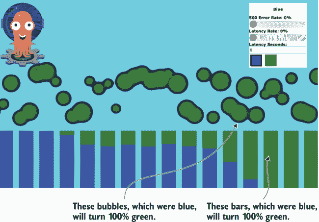

图 5.23 当绿色部署逐步扩展时，如果没有任何错误，气泡图和柱状图都将逐渐变为全绿色。

现在让我们再次部署并回到蓝色图像。这次我们还将切换到“Fail”`AnalysisTemplate`，该模板将在 15 秒后返回失败状态。我们应该看到蓝色在浏览器中逐步出现，但在 15 秒后变回绿色：

```
$ sed -i .bak 's/demo:green/demo:blue/g' rollout-with-analysis.yaml
$ sed -i .bak 's/templateName: pass/templateName: fail/g' rollout-with-analysis.yaml
$ kubectl apply -f rollout-with-analysis.yaml 
rollout.argoproj.io/demo configured
service/demo-service unchanged
```

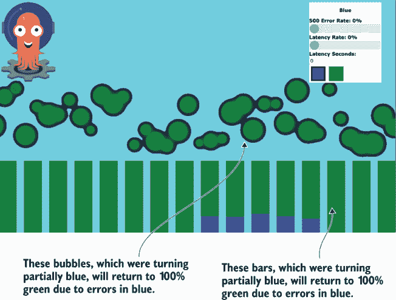

图 5.24 蓝色部署逐步扩展但返回错误。在失败期间，蓝色部署将被缩减规模，并且气泡图和柱状图都将返回绿色。

注意：演示部署在失败后将标记为已中止，并且只有在中止状态设置为`false`之后才会再次部署。

从本教程中，你可以看到，如果 `AnalysisTemplate` 继续根据收集的指标报告成功，Argo Rollouts 会使用金丝雀策略逐步扩展绿色部署。如果 `AnalysisTemplate` 报告失败，Argo Rollouts 将通过缩小绿色部署和扩大蓝色部署回其原始状态来回滚。参见表 5.1 进行部署比较。

表 5.1 部署策略比较

|  | 优点 | 缺点 |
| --- | --- | --- |
| 部署 | 内置于 Kubernetes，滚动更新，所需硬件最少 | 仅适用于向后兼容和无状态的应用程序 |
| 蓝绿 | 与有状态应用程序和非向后兼容的部署一起工作，快速回滚 | 需要额外的自动化，部署期间需要两倍的硬件 |
| 金丝雀 | 使用生产流量和依赖关系的一部分用户验证新版本 | 需要额外的自动化，部署过程更长，仅适用于向后兼容和无状态的应用程序 |
| 持续交付 | 逐步将新版本部署到一部分用户，如果指标良好则持续扩展到所有用户；如果指标不佳则自动回滚 | 需要额外的自动化，需要收集和分析指标，部署过程更长，仅适用于向后兼容和无状态的应用程序 |

## 摘要

+   ReplicaSet 不是声明式的，也不适合 GitOps。

+   Deployment 完全声明式，与 GitOps 相辅相成。

+   Deployment 执行滚动更新，最适合无状态和向后兼容的部署。

+   Deployment 可以通过 `max` `surge` 来指定新 Pod 的数量，并通过 `max` `unavailable` 来限制正在终止的 Pod 的数量。

+   蓝绿部署适合不兼容回滚的部署或粘性会话服务。

+   蓝绿部署可以通过利用两个 Deployment（每个都有自定义标签）和更新 Service 中的 `selector` 来路由 100% 的流量到活动部署来实现。

+   金丝雀作为故障的早期指标，可以避免有问题的部署一次性对所有客户造成全面影响。

+   金丝雀部署可以通过利用两个 Deployment 和 NGINX Ingress Controller 逐步调整流量来实现。

+   持续交付是金丝雀部署的高级版本，使用实时指标来继续或中止部署。

+   Argo Rollouts 是一个开源项目，可以简化蓝绿、金丝雀和持续部署。

+   每种部署策略都有其优缺点，选择适合你应用程序的正确策略非常重要。

* * *

1.[`kubernetes.io/docs/concepts/workloads/controllers/replicaset/`](https://kubernetes.io/docs/concepts/workloads/controllers/replicaset/).

2.[`kubernetes.io/docs/concepts/workloads/controllers/deployment/`](https://kubernetes.io/docs/concepts/workloads/controllers/deployment/).

3.[`kubernetes.github.io/ingress-nginx/user-guide/basic-usage/`](https://kubernetes.io/ingress-nginx/user-guide/basic-usage/).

4.[`istio.io/latest/docs/reference/config/networking/gateway/`](https://istio.io/latest/docs/reference/config/networking/gateway/).

5.[`github.com/argoproj/argo-rollouts`](https://github.com/argoproj/argo-rollouts).

6.[`kubernetes.io/docs/tasks/access-application-cluster/ingress-minikube/`](https://kubernetes.io/docs/tasks/access-application-cluster/ingress-minikube/).

7.[`argoproj.github.io/argo-rollouts/getting-started/`](https://argoproj.github.io/argo-rollouts/getting-started/).

8.[`kubernetes.io/docs/concepts/services-networking/service/`](https://kubernetes.io/docs/concepts/services-networking/service/).

9.[`en.wikipedia.org/wiki/Iptables`](https://en.wikipedia.org/wiki/Iptables).
