# 6 访问控制和安全

本章涵盖

+   使用 GitOps 驱动的部署时的攻击区域

+   确保关键基础设施组件得到保护

+   选择正确配置管理模式的指南

+   提升安全性以避免 GitOps 中的安全陷阱

访问控制和安全主题始终是必不可少的，尤其是在部署和基础设施管理方面尤为重要。在这种情况下，攻击面包括像基础设施这样的昂贵事物，像政策和合规性这样的危险事物，以及像包含用户数据的数据存储这样的最重要的事物。现代运维方法使工程团队能够以更快的速度移动，并优化快速迭代。然而，更多的发布也意味着引入漏洞的机会更多，给安全团队带来了新的挑战。依赖于人类操作知识的传统安全流程可能仍然有效，但难以扩展并满足利用 GitOps 和自动化构建及发布基础设施的企业需求。

在阅读本章之前，我们建议您先阅读第一章和第二章。

## 6.1 访问控制简介

安全主题既关键又复杂。通常，它由安全专家甚至整个专门的安全团队处理。那么，为什么在讨论 GitOps 时还要谈论它呢？GitOps 以同样的方式改变了安全责任，就像它改变了运营责任边界一样。有了 GitOps 和 Kubernetes，工程团队能够通过编写 Kubernetes 访问配置和使用 Git 来强制执行适当的配置更改流程来参与安全。鉴于安全团队不再是瓶颈，它可以卸载一些责任给开发者，并专注于提供安全基础设施。GitOps 促进了安全工程师和 DevOps 工程师之间更紧密和更有效的合作，允许任何影响环境安全性的变更在影响生产之前经过适当的网络安全审查和批准。

### 6.1.1 什么是访问控制？

为了更好地理解访问控制与 GitOps 结合的细微差别，让我们首先了解什么是访问控制。

访问控制是一种限制对系统或物理或虚拟资源的访问的方式。它规定了谁可以访问受保护资源以及允许执行哪些操作。访问控制由两部分组成：身份验证，确保用户是他们所说的那个人；以及授权，确保他们有权对指定的资源执行请求的操作。无论在哪个领域，访问控制都包括三个主要组件：主体、对象和引用监控器。

访问控制系统最直接的演示是现实世界的一个例子：一个人试图通过门进入大楼。这个人是一个主题，他试图访问对象，即大楼。门是一个引用监控器，只有当试图进入的人有门钥匙时，它才会授权访问请求。

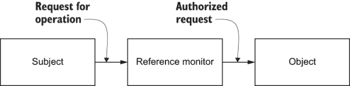

图 6.1 主题是请求访问对象的实体。对象是被访问的实体或资源。引用监控器是控制对受保护对象访问的实体。

练习 6.1

一个电子邮件客户端正在尝试从电子邮件服务器读取电子邮件。你能识别出这个场景中的主题、对象和引用监控器是什么吗？

### 6.1.2 要保护什么

在端到端安全应用程序交付到 Kubernetes 集群的过程中，许多不同的组件需要被保护。这些包括（但不限于）

+   CI/CD 管道

+   容器注册库

+   Git 仓库

+   Kubernetes 集群

+   云服务提供商或数据中心

+   应用程序本身

+   GitOps 操作员（如果适用）

这些每个组件都有其独特的安全关注点、身份验证机制和基于角色的访问控制（RBAC）模型，并且将根据许多因素和考虑进行不同的配置。由于安全性的强弱取决于最薄弱的环节，所有组件在集群的整体安全性中都扮演着同等重要的角色。

一般而言，安全选择往往是安全和便利之间的权衡。一个可能非常安全的系统可能因为不便而变得无法使用。作为一个操作员，目标是尽可能使用户体验方便，同时不牺牲安全。

影响组件安全性的考虑因素包括

+   可能的攻击向量

+   如果组件被攻破的最坏后果

+   应该允许哪些人访问该服务

+   不同用户具有的权限（RBAC）

+   可以采取哪些保护措施来减轻风险

下几节将描述这些组件以及一些独特的安全考虑因素。

CI/CD 管道

CI/CD 构建和部署管道是将新构建的软件交付到 Kubernetes 集群的起点。Jenkins、Circle CI 和 Travis CI 是一些流行的 CI/CD 系统的例子。由于大多数的思考和精力都集中在保护生产环境和生产数据上，安全通常是被事后考虑的。然而，CI/CD 同样是拼图中不可或缺的一部分。这是因为 CI/CD 管道最终控制着新软件如何被推送到环境中。一旦被攻破，它就有能力将 *有害* 的软件推送到集群中。

构建系统通常配置有足够的凭证来执行其职责。例如，为了发布新的容器镜像，CI/CD 管道可能需要访问容器注册表的凭证。传统上，构建系统也被赋予访问和凭证以访问 Kubernetes 集群，以执行实际的部署。但正如我们将在本章后面看到的那样，随着 GitOps 的出现，直接访问集群不再必要。

能够访问 CI/CD 构建系统的攻击者可以通过多种方式危害安全。例如，可以将管道修改为暴露之前提到的容器注册表或集群凭证。另一个例子是管道可能被劫持，从而将恶意容器部署到集群中，而不是预期的容器。

甚至在某些情况下，恶意行为者可能仅通过使用 CI 系统的标准功能就可能会危害安全。例如，当对代码仓库发起拉取请求时，它将启动一个执行一系列步骤以验证和测试更改的管道。这些步骤的内容通常定义在代码仓库中的一个文件中（例如 Jenkins 的 Jenkinsfile 或 Circle CI 的.circleci/config.yml）。打开新拉取请求的能力通常对公众开放，以便任何人都可以提出对项目的贡献。然而，攻击者可以简单地发起一个修改管道以执行恶意操作的拉取请求。因此，许多 CI 系统集成了防止在不受信任的来源发起 PR 时执行管道的功能。

容器注册表

容器注册表存储了将在集群中部署的容器镜像。由于注册表中的容器镜像有可能在集群中运行，因此注册表的内容以及可以向该注册表推送的用户都需要受到信任。由于任何人都可以向公共注册表（如 DockerHub、Quay.io 和 grc.io）发布镜像，因此企业中阻止从这些不受信任的容器注册表拉取镜像是一项标准的安全措施。相反，所有镜像都将从内部、受信任的注册表拉取，该注册表可以定期扫描存储库中的漏洞。

拥有对受信任容器注册表权限的攻击者可以向注册表推送镜像并覆盖现有的、之前受信任的镜像。例如，假设您的集群已经运行了某个镜像 mycompany/guestbook:v1.0。如果攻击者能够访问注册表，他们可以推送一个新的镜像并覆盖现有的 guestbook:v1.0 标签，改变该镜像的含义为恶意内容。然后，下一次容器启动（可能是由于 Pod 重新调度）时，它将运行受损害的镜像版本。

这种攻击可能不会被检测到，因为从 Kubernetes 和 GitOps 系统的角度来看，一切如预期；实时清单与 Git 中的配置清单相匹配。为了应对这个问题，可以在某些仓库中将镜像标签（或镜像版本）指定为不可变的，这样一旦写入，该镜像标签的含义就永远不会改变。

不可变镜像标签 一些镜像仓库（如 DockerHub）提供了一种使镜像标签不可变的功能。这意味着一旦镜像标签已经存在，就无法覆盖它，从而本质上防止了镜像标签被重复使用。使用此功能通过防止现有已部署的镜像标签被修改来增加额外的安全性。

Git 仓库

在 GitOps 的背景下，Git 仓库定义了将安装到集群中的资源**是什么**。存储在 Git 仓库中的 Kubernetes 清单最终将出现在集群中。因此，任何可以访问 Git 仓库的人都应该被信任来决定集群的构成，包括像部署（Deployments）、容器镜像、角色（Roles）、角色绑定（RoleBindings）、入口（Ingresses）和网络策略（NetworkPolicies）等。

在最坏的情况下，一个拥有对 Git 仓库完全访问权限的攻击者可以向 Git 仓库推送一个新的提交，更新部署以在集群中运行恶意容器。他们还可能添加一个角色和角色绑定，这可能会赋予部署足够的权限来读取机密信息并泄露敏感数据。

好消息是，由于攻击者需要向仓库推送提交，恶意行为将公然进行，并且可以被审计和追踪。然而，对 Git 仓库的提交和拉取请求访问应该仅限于一小部分人，这些人将有效拥有完整的集群管理权限。

Kubernetes 集群

保护 Kubernetes 集群本身就是一个值得单独成书的话题，因此我们只旨在涵盖与 GitOps 最相关的主题。如您所知，Kubernetes 集群是运行您的应用程序代码的基础设施平台。一个已经获得集群访问权限的攻击者可以说是最坏的情况。因此，Kubernetes 集群对于攻击者来说是一个极具价值的目标，集群的安全性至关重要。

GitOps 为您提供了全新的选择，以决定如何授予用户对集群的访问权限。这一点将在本章的后续部分进行深入探讨，但就目前而言，GitOps 为操作员提供了一种新的方式来提供对集群的访问（例如通过 Git），这与传统的直接授予用户对集群访问的方法（例如使用个性化的 kubeconfig 文件）形成对比。

传统上，在 GitOps 之前，开发者通常需要直接访问 Kubernetes 集群来管理和更改他们的环境。但有了 GitOps，对集群的直接访问就不再是严格必要的，因为环境管理可以通过一个新的媒介，Git 来进行。假设所有开发者对集群的访问都可以通过 Git 进行。在这种情况下，这也意味着运营商可以选择完全关闭对集群的传统直接访问（或者至少是写访问），并强制所有更改都通过 Git 进行。

云提供商或数据中心

虽然在 GitOps 的背景下可能不在考虑范围内，但这对安全性的讨论仍然很重要，即 Kubernetes 集群运行的底层云提供商（如 AWS）或物理数据中心。通常，在 Kubernetes 中运行的应用程序将依赖于云中的一些管理资源或服务，例如数据库、DNS、对象存储（如 S3）、消息队列等。由于开发者和应用程序都需要访问这些资源，运营商需要考虑如何授予用户创建和访问这些云提供商资源的权限。

开发者可能需要访问他们的数据库以执行诸如数据库模式迁移或生成报告之类的操作。虽然 GitOps 本身并不提供针对数据库本身的安全解决方案，但当数据库配置不可避免地开始出现在 Kubernetes 清单中（这些清单是通过 GitOps 管理的）时，GitOps 就会发挥作用。例如，运营商可能采用的一种帮助确保数据库访问安全的机制是在 Kubernetes NetworkPolicy 中的 IP 白名单。由于 NetworkPolicy 是可以通过 Git 管理的标准 Kubernetes 资源，因此 NetworkPolicy 的 *内容*（IP 白名单）对运营商来说作为一个安全问题变得很重要。

第二个考虑因素是 Kubernetes 资源可以对云提供商资源产生深远的影响。例如，一个被允许创建普通 Kubernetes 服务对象的用户可能会在云提供商中创建许多昂贵的负载均衡器，并无意中向外界暴露服务。因此，集群运营商对 Kubernetes 资源与云提供商资源之间的关系以及允许用户自行管理这些资源的后果有深入理解至关重要。

GitOps 运营商

根据你选择的 GitOps 操作员，保护操作员可能是一个选项，也可能不是。一个基本的 GitOps 操作员，例如我们在第二章中的穷人版基于 CronJob 的 GitOps 操作员示例，由于它不是一个可以公开暴露的服务，也没有任何管理方面，因此没有其他安全影响。另一方面，像 Argo CD、Helm 或 Jenkins X 这样的工具旨在向最终用户公开。因此，它有额外的安全考虑，因为它可能成为攻击的途径。

### 6.1.3 GitOps 中的访问控制

首先，让我们确定在持续交付（CD）安全模型中的访问控制主体和对象。正如我们已经学到的，对象是需要保护的资源。CD 表面攻击很大，但不可变基础设施和 Kubernetes 将其缩小到只有两件事：Kubernetes 配置和部署工件。

正如你所知道的那样，Kubernetes 配置由一组 Kubernetes 资源表示。资源清单存储在 Git 中，并自动应用到目标 Kubernetes 集群。部署工件是容器镜像。有了这两者，你可以以任何方式塑造你的生产环境，甚至可以在任何时候从头开始重新创建它。

在这个例子中，访问控制主体是工程师和自动化流程，例如 CI 管道。工程师正在利用自动化来持续产生新的容器镜像，并更新 Kubernetes 配置以部署它们。

除非你使用 GitOps，否则 Kubernetes 配置要么是手动更新，要么在持续集成中脚本化。这种方法，有时被称为 CIOps^(1)，通常会让安全团队感到紧张。

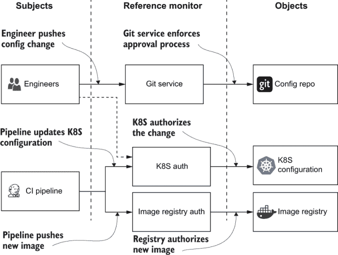

图 6.2 CIOps 安全模型不安全，因为它允许工程师和 CI 系统访问集群。这里的问题是 CI 系统获得了对集群的控制权，并被允许进行任意的 Kubernetes 配置更改。这大大增加了攻击面，使得保护集群变得困难。

那么 GitOps 是如何改善这种情况的呢？GitOps 统一了从 Git 仓库应用到集群的更改过程。这允许将访问令牌更靠近集群，并将保护集群访问的负担有效地转移到 Git 仓库。

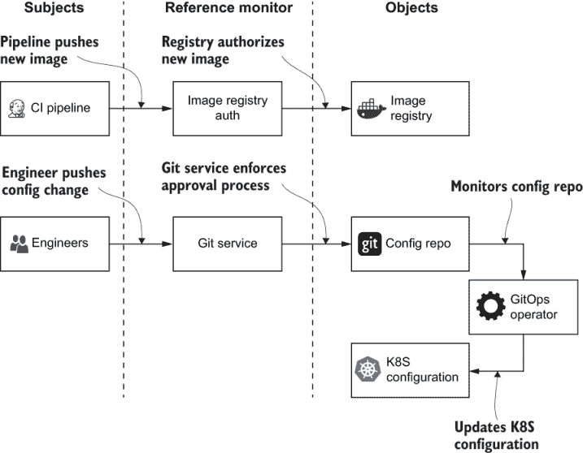

图 6.3 GitOps 安全模型仅限制集群访问 GitOps 操作员。攻击面大大减少，保护集群变得更加简单。

在 Git 仓库中保护配置仍然需要付出努力。它的好处是我们可以使用与保护应用程序源代码相同的工具。Git 托管提供商，如 GitHub 和 GitLab，允许我们为每个更改定义和执行变更过程，如强制审查或静态分析。由于 GitOps 操作者是唯一具有集群访问权限的主题，因此定义工程团队能够部署到集群中的内容以及不能部署的内容变得更加容易，从而显著提高了集群的安全性。

让我们继续学习如何在 Git 仓库中保护 Kubernetes 配置以及如何微调 Kubernetes 访问控制。

## 6.2 访问限制

如本章开头所述，涉及保护集群的组件有很多，包括 CI/CD 构建系统、容器注册库以及实际的 Kubernetes 集群。每个组件都实现了特定的访问控制机制，以允许或拒绝访问。

### 6.2.1 Git 仓库访问

Git 是一个完全面向开发者的工具。默认情况下，它被配置得非常容易在任何时候更改任何内容。这种简单性是 Git 在开发者社区中如此受欢迎的原因。

然而，Git 是建立在坚实的加密基础之上的：它使用 Merkle 树作为基本的数据结构。相同的结构被用作区块链的基础.^(2) 因此，Git 可以用作分布式账本，使其成为出色的审计日志存储。

Merkle 树 *Merkle 树* 是一种树，其中每个叶子节点都标记有数据块的哈希值，每个非叶子节点都标记有其子节点标签的加密哈希值.^(3)

这里是 Git 的工作原理的简要概述。每次开发者想要保存一组更改时，Git 都会计算引入的差异并创建一个包含引入的更改、各种元数据字段（如日期和作者）以及指向表示先前仓库状态的父捆绑包的引用的捆绑包。最后，该捆绑包被哈希处理并存储在仓库中。这个捆绑包被称为提交。该算法基本上与在区块链中使用的算法相同。

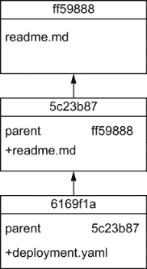

图 6.4 每个 Git 提交都引用前一个提交并形成一个类似树的数据结构。所有修改都在 Git 仓库中得到完全跟踪。

哈希用作保证所使用的代码与提交的代码相同，并且没有被篡改。因此，Git 仓库是一个由密码学保护的提交链，可以防止隐藏的修改。由于背后有密码学算法的支持，我们可以安全地信任 Git 实现，因此我们可以将其用作审计日志。

创建部署仓库

让我们创建一个示例部署仓库，然后看看使其准备好进行 GitOps 部署需要什么。为了您的方便，让我们使用在[`github.com/gitopsbook/sample-app-deployment`](https://github.com/gitopsbook/sample-app-deployment)可用的现有部署仓库。该仓库包含 Kubernetes 服务和一个部署资源的部署清单。部署资源的清单如下所示。

列表 6.1 示例应用部署 [(http://mng.bz/ao1z)](https://shortener.manning.com/ao1z)

```
apiVersion: apps/v1
kind: Deployment
metadata:
  name: sample-app
spec:
  replicas: 1
  revisionHistoryLimit: 3
  selector:
    matchLabels:
      app: sample-app
  template:
    metadata:
      labels:
        app: sample-app
    spec:
      containers:
      - image: gitopsbook/sample-app:v0.1
        name: sample-app
        command:
          - /app/sample-app
        ports:
        - containerPort: 8080
```

正如之前提到的，Git 是一个分布式版本控制系统。这意味着每个开发者都有一个完整的本地仓库副本，可以完全访问以进行更改。然而，还有一个所有团队成员都用来交换更改的公共仓库。这个公共远程仓库由 GitHub 或 GitLab 等 Git 托管服务托管。托管服务提供一系列安全功能，允许保护仓库免受未授权修改，强制提交作者身份，防止历史覆盖，等等。

作为第一步，导航到 gitopsbook/sample-app-deployment 仓库，并在您的 GitHub 账户中创建一个分支^(4)：

```
https://github.com/gitopsbook/sample-app-deployment
```

一旦创建了分支，使用以下命令在本地克隆仓库并准备进行更改：

```
$ git clone https://github.com/<username>/sample-app-deployment.git
Cloning into 'sample-app-deployment'...
remote: Enumerating objects: 14, done.
remote: Total 14 (delta 0), reused 0 (delta 0), pack-reused 14
Receiving objects: 100% (14/14), done.
Resolving deltas: 100% (3/3), done.
```

尽管仓库是公开的，但这并不意味着拥有 GitHub 账户的每个人都可以在没有适当权限的情况下进行更改。GitHub 确保用户要么是仓库所有者，要么被邀请为协作者.^(5)

练习 6.2

使用 HTTPS URL 克隆仓库，并尝试推送任何更改，而不提供您的 GitHub 用户名和密码：

```
git clone https://github.com/<username>/sample-app-deployment.git
```

而不是创建个人仓库，您可能创建一个组织^(6)并使用团队来管理访问权限。这一套访问管理功能非常全面，涵盖了从单个开发者到大型组织的大部分用例。然而，这还不够。

练习 6.3

创建第二个 GitHub 用户，并将该用户邀请为协作者。尝试使用第二个 GitHub 用户的凭据推送任何更改。

执行代码审查流程

无论是通过加密保护还是授权设置都无法防止恶意开发者有意引入或由于糟糕的编码实践不小心引入的漏洞。无论应用程序源代码中的漏洞是有意引入的还是不是，推荐的解决方案是相同的：部署仓库中的所有更改都必须通过 Git 托管提供商强制执行的代码审查流程。

让我们确保对 sample-app-deployment 仓库主分支的任何更改都经过代码审查流程，并且至少由一位审查员批准。启用强制审查流程的步骤在[`mng.bz/OExn`](http://mng.bz/OExn)中描述：

1.  在存储库设置中导航到“分支”部分。

1.  点击“添加规则”按钮。

1.  输入所需的分支名称。

1.  启用“合并前要求拉取请求审查”和“包括管理员”设置。

接下来，让我们尝试进行配置更改并将其推送到主分支：

```
$ sed -i .bak 's/v0.1/v0.2/' deployment.yaml
$ git commit -am 'Upgrade image version'
$ git push
remote: error: GH006: Protected branch update failed for refs/heads/master.
remote: error: At least 1 approving review is required by reviewers with write access.
To github.com:<username>/sample-app-deployment.git
 ! [remote rejected] master -> master (protected branch hook declined)
error: failed to push some refs to 'github.com:<username>/sample-app-deployment.git'
```

由于分支受到保护，需要拉取请求和审查，`git` `push` 失败。这保证了至少有一个人将审查更改并签署部署。

在移动到下一段之前，不要忘记运行清理。删除保护主分支的规则，并运行以下命令以重置本地更改：

```
$ git reset HEAD¹ --hard
```

练习 6.4

在“合并前要求拉取请求审查”部分探索额外的设置。考虑哪种设置组合适合您的项目或组织。

强制执行自动化检查

除了人工判断外，拉取请求还允许我们结合自动化清单分析，这有助于在早期捕捉到安全问题。尽管 Kubernetes 安全工具生态系统仍在发展，但已经有几个选项可用。两个很好的例子是 kubeaudit^(7) 和 kubesec.^(8)。这两个工具都受 Apache 许可证保护，并允许扫描 Kubernetes 清单以查找弱安全参数。

由于我们的存储库是开源的，并由 GitHub 托管，我们可以免费使用 CI 服务，例如 [`travis-ci.org`](https://travis-ci.org/) 或 [`circleci.com`](https://circleci.com/)！让我们配置自动 kubeaudit 使用，并使用 [`travis-ci.org`](https://travis-ci.org/) 对每个拉取请求进行成功验证：

```
git add .travis.yml
git commit -am 'Add travis config'
git push
```

列表 6.2 .travis.yml

```
language: bash
install:
  - curl -sLf -o kubeaudit.tar.gz  https://github.com/Shopify/kubeaudit/releases/download/v0.7.0/kubeaudit_0.7.0_linux_amd64.tar.gz
  - tar -zxvf kubeaudit.tar.gz
  - chmod +x kubeaudit
script:
  -  ./kubeaudit nonroot -f deployment.yaml &> errors
  - if [ -s errors ] ; then cat errors; exit -1; fi
```

一旦配置就绪，我们只需在 [`mng.bz/Gxyq`](http://mng.bz/Gxyq) 上启用 CI 集成并创建拉取请求：

```
$ git checkout -b change1
Switched to a new branch 'change1'

$ sed -i .bak 's/v0.1/v0.2/' deployment.yaml

$ git commit -am 'Upgrade image version'
[change1 c52535a] Upgrade image version
 1 file changed, 1 insertion(+), 1 deletion(-)

$ git push --set-upstream origin change1
Enumerating objects: 5, done.
Counting objects: 100% (5/5), done.
Delta compression using up to 8 threads
Compressing objects: 100% (3/3), done.
Writing objects: 100% (3/3), 359 bytes | 359.00 KiB/s, done.
Total 3 (delta 1), reused 0 (delta 0), pack-reused 0
remote: Resolving deltas: 100% (1/1), completed with 1 local object.
remote:
remote: Create a pull request for 'change1' on GitHub by visiting:
remote: https://github.com/<username>/sample-app-deployment/pull/new/change1
remote:
To github.com:<username>/sample-app-deployment.git
 * [new branch]      change1 -> change1
Branch 'change1' set up to track remote branch 'change1' from 'origin'.
```

CI 应在创建 PR 后立即触发，并出现以下错误消息：

```
time="2019-12-17T09:05:41Z" level=error msg="RunAsNonRoot is not set in ContainerSecurityContext, which results in root user being allowed!  Container=sample-app KubeType=deployment Name=sample-app"

```

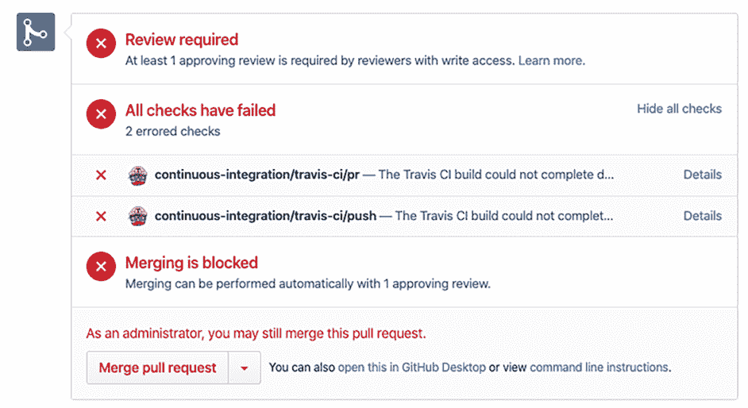

图 6.5 Travis 运行验证部署清单的 CI 作业。验证失败，因为检测到漏洞。

kubeaudit 检测到 Pod 安全上下文缺少防止以 root 用户身份运行容器的 `runAsNonRoot` 属性。这是一个有效的安全问题。为了修复安全问题，请按以下代码列表更改 Pod 清单。

列表 6.3 示例应用部署 [(http://mng.bz/zxXa)](https://shortener.manning.com/zxXa)

```
apiVersion: apps/v1
kind: Deployment
metadata:
  name: sample-app
spec:
  replicas: 1
  revisionHistoryLimit: 3
  selector:
    matchLabels:
      app: sample-app
  template:
    metadata:
      labels:
        app: sample-app
    spec:
      containers:
      - image: gitopsbook/sample-app:v0.1
        name: sample-app
        command:
          - /app/sample-app
        ports:
        - containerPort: 8080
+     securityContext:
+       runAsNonRoot: true
```

提交更改并通过推送 `change1` 分支更新拉取请求：

```
git commit -am 'Update deployment'
git push upstream change1
```

拉取请求应通过验证！

练习 6.5

了解 kubeaudit 应用程序提供的附加审计。尝试使用 `kubeaudit` `autofix` `-f` `deployment.yaml` 命令。

保护提交作者身份

到目前为止，我们的仓库安全托管在 GitHub 上。我们控制哪些 GitHub 账户可以在仓库中做出更改，对每个更改执行代码审查流程，甚至对每个拉取请求运行静态分析。这很好，但仍不够。正如经常发生的那样，社会工程攻击可以绕过所有这些安全关卡。

如果你的老板给你发送了一个拉取请求并要求你立即合并，你会怎么做？在压力之下，一个工程师可能会决定快速查看拉取请求并未经仔细测试就批准它。由于我们的仓库托管在 GitHub 上，我们知道哪个用户创建了提交。不可能代表别人进行提交，对吧？

不幸的是，事实并非如此。Git 并非设计为具有强身份保证的工具。正如我们之前提到的，Git 是一个完全面向开发者的工具。提交的每一部分都在工程师的控制之下，包括提交作者的信息。因此，入侵者可以轻松创建一个提交并将你老板的名字放入提交元数据中。让我们做一个简单的练习来展示这个漏洞。

打开控制台，使用以下命令在 master 分支上创建一个新的提交：

```
echo '# hacked' >> ./deployment.yaml
git commit --author='Joe Beda <joe.github@bedafamily.com>' -am 'evil commit'
git push upstream master
```

打开 GitHub 上你仓库的提交历史，并检查最新的提交信息。看，Joe Beda^(9)刚刚更新了我们的 Pod 清单！

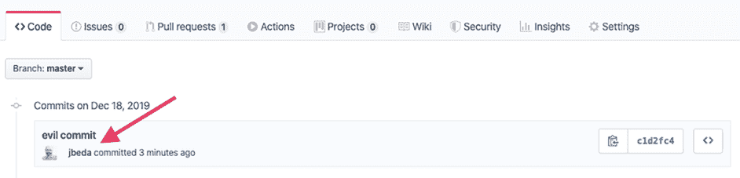

图 6.6 GitHub 提交历史包含 Joe Beda 的头像。默认情况下，GitHub 不会执行任何验证，并使用存储在提交元数据中的作者信息。

这看起来相当吓人，但这并不意味着在以后，你需要在批准之前亲自验证每个拉取请求作者的姓名。与其手动验证提交的作者是谁，你可能会利用数字加密签名。

加密工具如 GPG 允许你在提交元数据中注入加密签名。稍后，这个签名可能会被 Git 托管服务或 GitOps 操作员验证。学习 GPG 签名的工作原理可能需要太多时间，但我们确实可以使用它来保护我们的部署仓库。

不幸的是，GPG 配置过程可能很困难。它包括多个步骤，这些步骤可能因操作系统而异。请参考附录 C 中描述的步骤和 GitHub 在线文档^(10)来配置 GPG 密钥。

最后，我们准备好提交并签名。以下命令创建了一个新的更改到部署清单，并使用与你的 GitHub 账户关联的 GPG 密钥进行签名：

```
echo '# signed change' >> ./deployment.yaml
git add .
git commit -S -am 'good commit'
git push upstream master
```

现在，GitHub 的提交历史包括基于 GPG 密钥的作者信息，这些信息无法伪造。

GitHub 允许你要求对特定仓库的所有提交都必须进行签名。要求签名的提交设置可以在仓库设置的受保护分支部分找到。

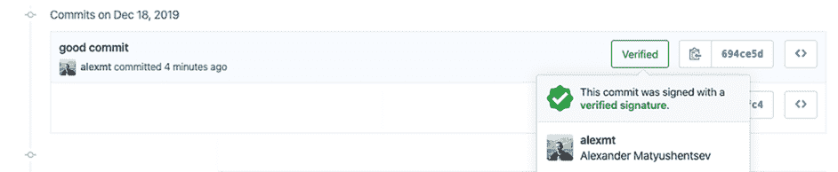

图 6.7 使用密码学签名 Git 可以保护作者身份。GitHub 用户界面可视化了 GPG 验证结果。

除了 Git 托管服务确认之外，您可能还需要配置您的 GitOps 操作员在更新 Kubernetes 集群配置之前自动验证 GPG 签名。幸运的是，一些 GitOps 操作员已经内置了签名验证支持，无需复杂的配置。这一主题将在接下来的章节中介绍。

### 6.2.2 Kubernetes RBAC

如您所知，GitOps 方法假设 CI 管道没有访问 Kubernetes 集群的权限。唯一具有直接集群访问权限的自动化工具是位于集群内部的 GitOps 操作员。这已经比传统的 DevOps 模型具有很大的优势。然而，这并不意味着 GitOps 应该拥有神级访问权限。我们仍然需要仔细考虑操作员应该获得哪种权限级别。集群内部的操作员，所谓的拉取模型，并不是唯一的选择。您可以考虑将 GitOps 操作员放置在受保护的安全区域内，并通过使用推送模型和管理多个集群使用一个操作员来减少管理开销。每种考虑都有其优缺点。为了做出有意义的决策，您需要对 Kubernetes 访问模型有良好的理解。因此，让我们回顾一下，了解 Kubernetes 内置了哪些安全工具，以及我们如何使用它们。

访问控制类型

有四种著名的访问控制类型：

+   *基于任意访问控制*（DAC）——在 DAC 模型中，数据所有者决定访问权限。DAC 是一种基于用户指定的规则分配访问权限的手段。

+   *强制访问控制*（MAC）——MAC 是使用非自主模型开发的，其中人们根据信息清分类别授予访问权限。MAC 是一种基于中央权威机构规定的法规分配访问权限的政策。

+   *基于角色的访问控制*（RBAC）——RBAC 根据用户的角色授予访问权限，并实现了关键的安全原则，如最小权限和权限分离。因此，试图访问信息的人只能访问他们认为对其角色必要的数据。

+   *基于属性的访问控制*（ABAC）——ABAC，也称为基于策略的访问控制，定义了一种访问控制范式，通过使用结合属性的策略来授予用户访问权限。

ABAC 非常灵活，可能是列表中最强大的模型。由于其强大功能，ABAC 最初被选为 Kubernetes 安全模型。然而，后来社区意识到 ABAC 概念及其在 Kubernetes 中的实现方式难以理解和使用。因此，引入了一种基于 RBAC 的新授权机制。2017 年，基于 RBAC 的授权被移至测试版，ABAC 被宣布为过时。目前，RBAC 是 Kubernetes 中首选的授权机制，并建议用于在 Kubernetes 上运行的每个应用程序。

RBAC 模型包括以下三个主要元素：主体、资源和动词。主体代表想要访问资源的用户或进程，动词是对资源可以执行的操作。

这些元素是如何映射到 Kubernetes API 对象的？RBAC 资源由一个常规的 Kubernetes 资源表示，例如 Pod 或 Deployment。为了表示动词，Kubernetes 中引入了两套新的专用资源。动词由 Role 和 RoleBinding 资源表示，而主体由 User 和 ServiceAccount 资源表示。

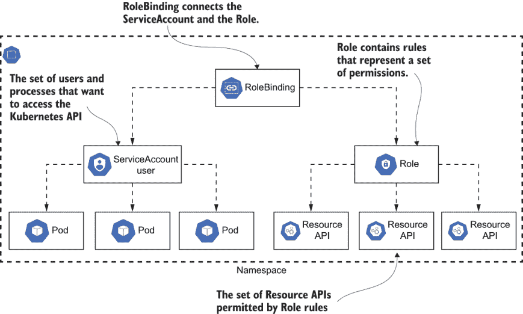

图 6.8 Kubernetes RoleBinding 授予 Role 中定义的权限给 Users 和 ServiceAccounts。ServiceAccount 为在 Pod 中运行的进程提供身份。

Role 和 RoleBinding

Role 资源旨在连接动词和 Kubernetes 资源。以下代码示例展示了 Role 的一个示例定义。

列表 6.4 示例 Role [(http://mng.bz/0mKx)](https://shortener.manning.com/0mKx)

```
apiVersion: rbac.authorization.k8s.io/v1
kind: Role
metadata:
  name: sample-role
rules:
- apiGroups:
  - ""
  resources:
  - configmaps
  verbs:
  - get
  - list
```

`verbs` 部分包含允许的操作列表。因此，该 Role 允许列出与集群相关的配置映射，并获取每个配置映射的详细信息。Role 的优点是它是一个可重用的对象，并且可以用于不同的主体。例如，你可以定义只读的 Role 并将其分配给各种主体，而无需重复 `resources` 和 `verbs` 定义。

需要知道的是，Role 是命名空间资源，并提供对同一命名空间中定义的资源访问权限.^(11) 这意味着单个 Role 不能提供对多个命名空间或集群级别资源的访问权限。为了提供集群级别的访问权限，你可能可以使用一个称为 ClusterRole 的等效资源。ClusterRole 资源具有与 Role 相当多的字段集，除了命名空间字段外。

RoleBinding 使 Role 能够与主体连接。以下是一个 RoleBinding 的示例定义。

列表 6.5 示例 RoleBinding [(http://mng.bz/KMeK)](https://shortener.manning.com/KMeK)

```
apiVersion: rbac.authorization.k8s.io/v1
kind: RoleBinding
metadata:
  name: sample-role-binding
roleRef:
  apiGroup: rbac.authorization.k8s.io
  kind: Role
  name: sample-role
subjects:
- kind: ServiceAccount
  name: sample-service-account
```

示例 RoleBinding 将名为`sample-role`的 Role 中定义的一组权限授予名为`sample-service-account`的 ServiceAccount。类似于 Role，RoleBinding 有一个等效的对象，ClusterRoleBinding，它允许将主体与 ClusterRole 连接起来。

用户和 ServiceAccount

最后，Kubernetes 主体由 ServiceAccounts 和 Users 表示。

基本的 GitOps 操作员 RBAC

在第二章中，我们在实现基本的 GitOps 操作员时配置了 Kubernetes RBAC。让我们利用本章学到的知识来加强操作员权限，并限制其可以部署的内容。

要开始，请确保你已经完成了基本的 GitOps 操作员教程。你可能还记得，我们配置了一个 CronJob，以及 ServiceAccount 和 ClusterRoleBinding 资源。让我们再次查看 ServiceAccount 和 ClusterRoleBinding 的定义，并找出应该更改什么来提高安全性。

列表 6.6 rbac.yaml

```
---
apiVersion: v1
kind: ServiceAccount
metadata:
  name: gitops-serviceaccount
  namespace: gitops

---
apiVersion: rbac.authorization.k8s.io/v1
kind: ClusterRoleBinding
metadata:
  name: gitops-operator
roleRef:
  apiGroup: rbac.authorization.k8s.io
  kind: ClusterRole
  name: admin
subjects:
- kind: ServiceAccount
  name: gitops-serviceaccount
  namespace: gitops
```

ClusterRoleBinding 定义了名为 admin 的 ClusterRole 与 GitOps 操作员 CronJob 所使用的 ServiceAccount 之间的联系。admin ClusterRole 在集群中默认存在，并为整个集群提供上帝级别的访问权限。这意味着 GitOps 操作员没有限制，只要在 Git 仓库中定义了资源，就可以部署任何资源。

那么，这个 RBAC 配置中有什么问题呢？问题是，这只有在假设具有 Git 仓库写权限的开发者已经拥有完整的集群访问权限的情况下才是安全的。由于 GitOps 操作员可以创建任何资源，开发者可能会添加额外的角色和角色绑定清单，并授予自己管理员权限。这不是我们想要的，尤其是在多租户环境中。

另一个考虑因素是人为错误。当多个团队使用一个集群时，我们需要确保一个团队不能触及另一个团队的资源。正如你在第三章所学，团队通常通过 Kubernetes Namespaces 相互隔离。因此，将 GitOps 操作员权限限制在一个 Namespace 内是有意义的。

最后，我们希望控制 GitOps 操作员可以管理的 Namespace 级别资源。虽然让开发者管理像 Deployments、ConfigMaps 和 Secrets 这样的资源是完全可以接受的，但有一些资源应该只由集群管理员管理。网络资源的一个很好的例子是 NetworkPolicy。NetworkPolicy 控制允许进入 Namespace 内 Pods 的流量，通常由集群管理员管理。

让我们继续更新操作员的 RBAC 配置。我们需要做出以下更改以确保安全配置：

+   将 GitOps 操作员权限限制在一个 Namespace 内。

+   移除安装集群级别资源的权限。

+   将操作员权限限制在选定的 Namespaced 资源中。

更新的 RBAC 配置在此表示。

列表 6.7 updated-rbac.yaml

```
---
apiVersion: v1
kind: ServiceAccount
metadata:
  name: gitops-serviceaccount
  namespace: gitops

---
apiVersion: rbac.authorization.k8s.io/v1
kind: Role
metadata:
  name: gitops-role
  namespace: gitops
rules:
- apiGroups:
  - ""
  resources:
  - secrets
  - configmaps
  verbs:
  - '*'
- apiGroups:
  - "extensions"
  - "apps"
  resources:
  - deployments
  - statefulsets
  verbs:
  - '*'

---
apiVersion: rbac.authorization.k8s.io/v1
kind: RoleBinding
metadata:
  name: gitops-role-binding
  namespace: gitops
roleRef:
  apiGroup: rbac.authorization.k8s.io
  kind: Role
  name: gitops-role
subjects:
- kind: ServiceAccount
  name: gitops-serviceaccount
```

这里是应用变更的总结：

+   将 ClusterRoleBinding 替换为 RoleBinding 以确保只有命名空间级别的访问。

+   我们不是使用内置的 admin 角色，而是使用自定义的命名空间`Role`。

+   命名空间角色只提供对指定 Kubernetes 资源的访问。这确保了操作员不能修改像 NetworkPolicy 这样的资源。

### 6.2.3 镜像注册表访问

通过确保 Kubernetes 集群的安全，我们保证集群配置描述了正确的负载，这些负载引用了正确的 Docker 镜像，并最终运行了我们想要的软件。受保护的部署存储库和完全自动化的 GitOps 驱动部署流程提供了可审计性和可观察性。仍然没有保护的最后一块拼图是 Docker 镜像本身。

我们将在最后讨论 Docker 镜像保护，但这绝对不是最不重要的话题。镜像内容最终定义了在集群内部将要执行的二进制文件。所以即使其他一切都很安全，Docker 注册表保护的漏洞会破坏所有其他安全门。

那么，在实践中 Docker 镜像保护意味着什么？我们必须注意以下两个问题：

+   没有权限，无法更改注册表中的镜像。

+   镜像被安全地交付到 Kubernetes 集群中。

注册表镜像保护

类似于 Git 仓库，Docker 仓库保护由托管服务提供。最流行的 Docker 仓库托管服务可能是 DockerHub。该服务允许访问成千上万的 Docker 镜像。该服务由 Docker Inc.提供，并且对任何开源项目都是完全免费的。

要获得 DockerHub 的实际操作经验，您需要在 DockerHub 上获取一个账户，创建一个仓库，并推送一个镜像。除非您已经有了账户，否则请导航到[`hub.docker.com/signup`](https://hub.docker.com/signup)并创建一个账户。作为下一步，您需要创建一个名为 gitops-k8s-security-alpine 的 Docker 仓库，如 DockerHub 文档中所述.^(12) 最后，您准备好验证 DockerHub 是否正在保护仓库，但首先您需要获取一个示例 Docker 镜像。最简单的方法是拉取一个现有的镜像并重命名它。以下命令从官方 DockerHub 仓库拉取 Alpine Linux 镜像并将其重命名为<username>/gitops-k8s-security-alpine，其中<username>是您的 DockerHub 账户名称：

```
docker pull alpine
docker tag alpine <username>/gitops-k8s-security-alpine:v0.1
```

下一个命令将镜像推送到 gitops-k8s-security-alpine Docker 注册表：

```
docker push <username>/gitops-k8s-security-alpine:v0.1
```

然而，本地的 Docker 客户端没有访问 DockerHub 仓库的凭证，所以`push`命令应该失败。为了修复错误，运行以下命令并提供您的 DockerHub 账户用户名和密码：

```
docker login
```

一旦成功登录，Docker 客户端就知道你是谁，并且可以执行 Docker 的`push`命令。

确保图像交付安全

将镜像安全地交付到集群中意味着回答问题：“我们是否信任镜像的来源？”信任意味着我们想要确保镜像是由授权的作者创建的，并且在从仓库传输过程中镜像内容没有被篡改。因此，这是保护镜像作者身份的问题。解决方案与保护 Git 提交作者身份的解决方案非常相似：

+   个人或自动化过程使用数字签名对镜像的内容进行签名。

+   签名由消费者使用，以验证镜像是由受信任的作者创建的，并且内容没有被篡改。

好消息是，这已经由 Docker 客户端和镜像注册库支持。Docker 的功能名为内容信任，允许对镜像进行签名并将其连同签名一起推送到注册库。消费者可以使用内容信任功能来验证已签名的镜像内容未被更改。

因此，在理想场景下，CI 管道应发布已签名的镜像，并且 Kubernetes 应配置为要求每个在生产环境中运行的镜像都具备有效的签名。坏消息是，截至版本 1.17，Kubernetes 仍然没有提供强制执行镜像签名验证的配置。因此，我们能做的最好的事情就是在修改 Kubernetes 清单之前验证镜像签名。

内容信任配置相当简单。您必须设置 `DOCKER_CONTENT_TRUST` 环境变量：

```
export DOCKER_CONTENT_TRUST=1
```

一旦设置了环境变量，Docker 命令 `run` 和 `pull` 应该会验证镜像签名。我们可以通过拉取我们刚刚推送到 gitops-k8s-security-alpine 仓库的未签名镜像来确认这一点：

```
$ docker pull <username>/gitops-k8s-security-alpine:v0.1
Error: remote trust data does not exist for docker.io/<username>/gitops-k8s-security-alpine: 
       notary.docker.io does not have trust data for docker.io/<username>/gitops-k8s-security-alpine
```

命令如预期失败，因为 <username>/gitops-k8s-security-alpine:v0.1 镜像未签名。让我们修复它。确保 `DOCKER_CONTENT_TRUST` 环境变量仍然设置为 `1`，并使用以下命令创建一个已签名的镜像：

```
$ docker tag alpine <username>/gitops-k8s-security-alpine:v0.2
$ docker push  <username>/gitops-k8s-security-alpine:v0.2
The push refers to repository [docker.io/<username>/gitops-k8s-security-alpine]
6b27de954cca: Layer already exists
v0.2: digest: sha256:3983cc12fb9dc20a009340149e382a18de6a8261b0ac0e8f5fcdf11f8dd5937e size: 528
Signing and pushing trust metadata
You are about to create a new root signing key passphrase. This passphrase
will be used to protect the most sensitive key in your signing system. Please
choose a long, complex passphrase and be careful to keep the password and the
key file itself secure and backed up. It is highly recommended that you use a
password manager to generate the passphrase and keep it safe. There will be no
way to recover this key. You can find the key in your config directory.
Enter passphrase for new root key with ID cfe0184:
Repeat passphrase for new root key with ID cfe0184:
Enter passphrase for new repository key with ID c7eba93:
Repeat passphrase for new repository key with ID c7eba93:
Finished initializing "docker.io/<username>/gitops-k8s-security-alpine"
Successfully signed docker.io/<username>/gitops-k8s-security-alpine:v0.2
```

这次，`docker push` 命令在推送镜像之前对它进行签名。如果您是第一次推送已签名的镜像，Docker 将在 ~/.docker/trust/ 目录中生成密钥，并提示您输入用于根密钥和仓库密钥的密码短语。在提供密码短语后，已签名的镜像将被推送到 Docker Hub。最后，我们可以通过再次运行 `docker pull` 命令来验证推送的镜像具有正确的签名：

```
docker pull <username>/gitops-k8s-security-alpine:v0.2
```

命令成功完成。我们的镜像具有正确的签名，并且 Docker 客户端能够验证它！

## 6.3 模式

好吧，让我们面对现实。全新的绿色项目并不一定是以一个完美的部署流程开始的。事实上，年轻的项目甚至没有自动部署流程。首席工程师可能是唯一能够部署项目的人，他们可能从他们的笔记本电脑上部署。通常，随着部署所有应用程序服务的耗时越来越多，团队开始添加自动化。随着未经授权访问的潜在成本和损害的增加，该自动化的安全性变得越来越关键。

### 6.3.1 完全访问

几乎每个新项目的初始安全模型完全基于团队成员之间的信任。每个团队成员都有完全访问权限，部署更改不一定被记录并在以后可供审计。

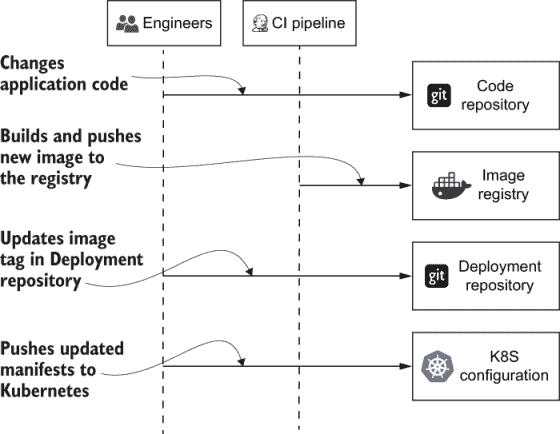

图 6.9 全访问安全模型假设工程师和 CI 系统都有完全访问 Kubernetes 集群的权限。这种权衡是速度胜过安全。这种模型更适合处于早期阶段的新项目。

在开始时，弱安全性并不一定是一件坏事。完全访问意味着更少的障碍，使团队能够更加灵活并更快地移动。当生产环境中没有重要客户数据时，这是一个专注于速度并塑造项目直到你准备好进入生产的完美机会。但可能更早而不是更晚，你需要实施适当的控制措施，不仅是为了生产中的客户数据，还要确保部署到生产中的代码的完整性。

### 6.3.2 部署存储库访问

默认情况下禁用开发人员的直接 Kubernetes 访问是一个从安全角度迈出的巨大进步。如果你使用 GitOps，这是最常见的模式。在这个模型中，开发人员仍然可以完全访问部署存储库，但必须依赖 GitOps 操作员将更改推送到 Kubernetes 集群。

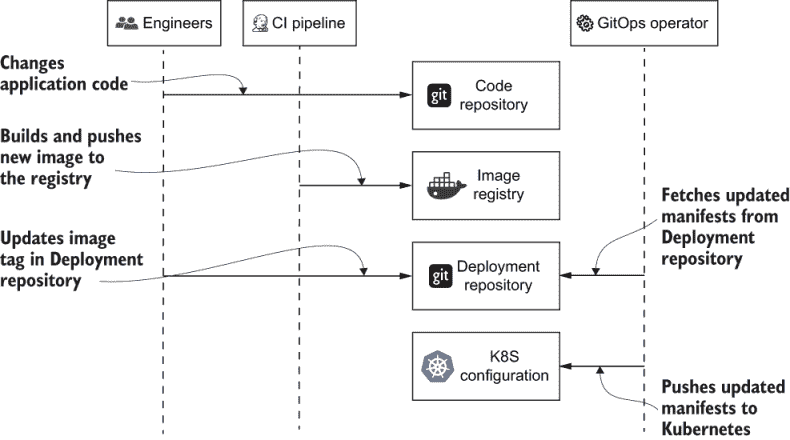

图 6.10 GitOps 操作员允许移除集群访问。此时，工程师只需要访问部署存储库。

除了更好的安全性外，此模式还提供了可审计性。假设没有人可以访问 Kubernetes 配置，部署存储库的历史记录包含了所有集群配置更改。

当项目成熟并且团队不断改进部署配置时，手动更新部署存储库仍然感觉非常合适。然而，经过一段时间，每个应用程序发布可能只需要更改图像标签。在这个阶段，维护部署存储库仍然非常有价值，但可能感觉有很多开销。

### 6.3.3 仅代码访问

代码访问仅模式是部署存储库访问仅方法的逻辑延续。如果部署存储库中的发布更改是可预测的，那么在 CI 管道中可以将其配置更改过程编码化。

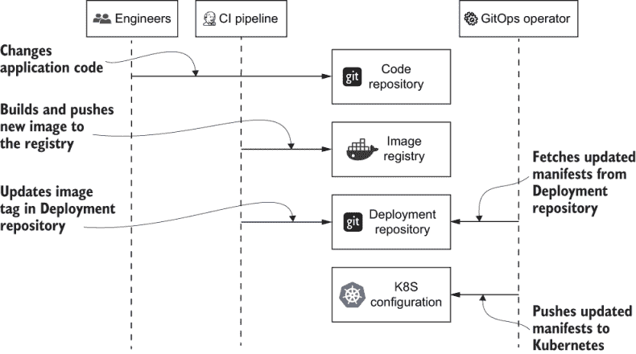

图 6.11 代码访问仅模式假设部署存储库和 Kubernetes 集群的更改都是完全自动化的。工程师只需要对代码存储库的访问权限。

这种模式简化了开发过程，并显著减少了手动工作量的需求。它还在几个方面提高了部署的安全性：

+   开发团队不再需要访问部署存储库。只有专门的自动化账户才有权限向存储库推送。

+   由于部署存储库的更改是自动化的，因此配置 GPG 签名过程并将其在 CI 管道中自动化的过程要容易得多。

练习 6.6

选择最适合您项目的模式。尽量详细地阐述每种模式的优缺点，并解释您为什么选择该模式。

## 6.4 安全问题

我们已经学习了如何从最基本的部分开始，保护我们的部署过程端到端，一直到配置更改和新图像的身份保护。最后，让我们学习必须涵盖的重要边缘情况，以确保您集群的安全性。

### 6.4.1 防止从不受信任的注册表拉取图像

在 6.2.3 节中，我们展示了如何在对公共注册表（如 docker.io）实施安全控制，以确保图像是由授权用户按预期发布的，并且在拉取时没有被篡改。然而，事实是公共注册表超出了您的可见性和控制范围。您必须信任公共注册表维护者遵循安全最佳实践。即使他们确实如此，他们作为公共注册表的事实意味着任何互联网用户都可以向其推送图像。对于一些对安全性要求极高的企业来说，这是不可接受的。

为了解决这个问题，许多企业将维护自己的私有 Docker 图像注册表，以确保可靠性、性能、隐私和安全。在这种情况下，新图像应该推送到私有注册表（如 docker.mycompany.com），而不是公共注册表（如 docker.io）。这可以通过修改 CI 管道，将成功构建的新图像推送到私有注册表来实现。

部署到 Kubernetes 应该也只从私有仓库拉取镜像。但如何强制执行这一规定？如果一位天真无邪的开发者不小心从 docker.io 拉取了病毒或恶意软件感染的镜像怎么办？或者，一个没有权限向私有仓库推送镜像的恶意开发者试图从他们的公共 DockerHub 仓库中侧加载镜像怎么办？当然，使用 GitOps 将确保这些操作被记录在审计跟踪中，因此那些负责的人应该能够被识别。然而，如何从一开始就预防这种情况呢？

这可以通过使用 Open Policy Agent (OPA) 和一个拒绝引用来自禁止镜像仓库的镜像的 admission webhook 来实现。

### 6.4.2 Git 仓库中的集群级资源

正如您从本章中了解到的，Kubernetes 访问设置是通过 Kubernetes 资源（如 Role 和 ClusterRole）控制的。RBAC 资源管理是 GitOps 运营商的一个完全有效的用途。将应用程序部署的定义与所需的 Kubernetes 访问设置打包在一起是一种常见的做法。然而，存在一个可能被用来提升权限的安全漏洞。因为 Kubernetes 访问设置由资源管理，这些资源可以被放入部署仓库并由 GitOps 运营商交付。入侵者可能会创建一个 ClusterRole 并授予服务账户权限，该服务账户后来可能被用作后门。

防止权限提升的实用规则是限制 GitOps 运营商的权限。如果利用 GitOps 运营商的开发团队不应该管理 ClusterRoles，那么 GitOps 运营商就不应该拥有那个权限。如果 GitOps 运营商被多个团队共享，运营商应该适当配置并执行特定于团队的网络安全检查。

练习 6.7

参考穷人的 GitOps 运营商教程。审查 RBAC 配置并检查它是否允许安全权限提升攻击。

## 摘要

+   由于工程师和 CI 系统的访问，传统的 CI/Ops 安全模型具有广泛的攻击面。GitOps 安全模型显著减少了集群的攻击面，因为只有 GitOps 运营商可以访问集群。

+   Git 的底层数据结构使用 Merkle 树，它提供了一个具有加密保护的树状结构，以提供防篡改的提交日志。

+   除了 Git 的数据结构安全优势外，使用拉取请求进行的代码审查过程以及使用 kubeaudit 和 kubesec 等工具进行的自动化检查可以检测到清单中的安全漏洞。

+   Git 本身并不保护提交作者的标识。使用 GPG 可以通过在提交元数据中注入数字加密签名来保证提交作者的认证性。

+   RBAC 是在 Kubernetes 中实现访问控制的推荐方式。用户和 GitOps 运营商的访问控制都可以通过 RBAC 进行配置。

+   与 Git 类似，所有 Docker 镜像都应该使用数字签名进行签名，以使用内容信任功能验证其真实性。

+   新项目可以从完全访问权限（集群、部署仓库和代码仓库）开始，以便工程师最初专注于开发速度。随着项目的成熟和准备进行初始生产发布，集群和部署仓库的访问权限应受到限制，以强调安全性而不是速度。

* * *

1.[`mng.bz/MXB7`](https://shortener.manning.com/MXB7).

2.[`en.wikipedia.org/wiki/Blockchain`](https://en.wikipedia.org/wiki/Blockchain).

3.[`en.wikipedia.org/wiki/Merkle_tree`](https://en.wikipedia.org/wiki/Merkle_tree).

4.[`mng.bz/goBl`](https://shortener.manning.com/goBl).

5.[`mng.bz/e51z`](https://shortener.manning.com/e51z).

6.[`mng.bz/pVPG`](https://shortener.manning.com/pVPG).

7.[`github.com/Shopify/kubeaudit`](https://github.com/Shopify/kubeaudit).

8.[`kubesec.io/`](https://kubesec.io/).

9.Joe Beda ([`www.linkedin.com/in/jbeda`](https://www.linkedin.com/in/jbeda)) 是 Kubernetes 的主要创始人之一。

10.[`help.github.com/en/github/authenticating-to-github/adding-a-new-gpg-key-to-your-github-account`](https://help.github.com/en/github/authenticating-to-github/adding-a-new-gpg-key-to-your-github-account).

11.[`mng.bz/9MDl`](http://mng.bz/9MDl).

12.[`docs.docker.com/docker-hub/repos`](https://docs.docker.com/docker-hub/repos/).
