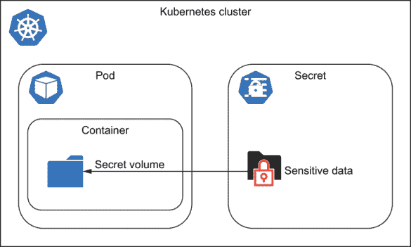
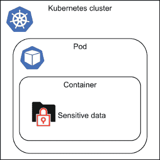
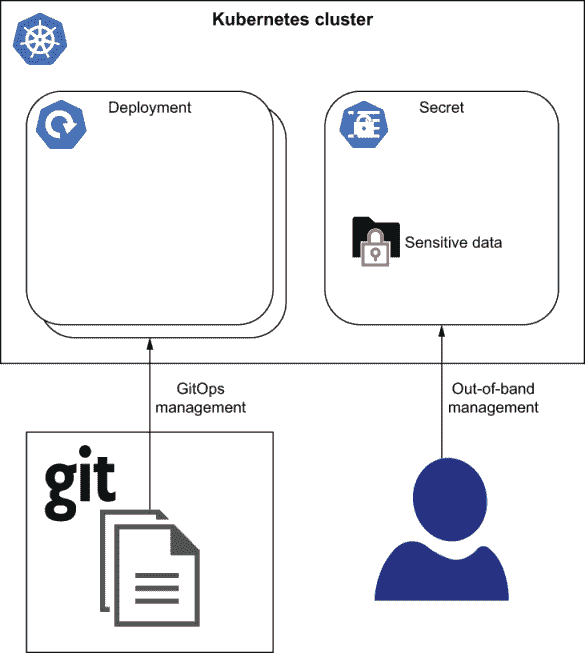
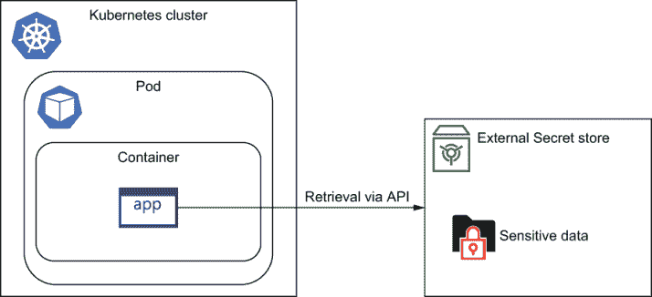
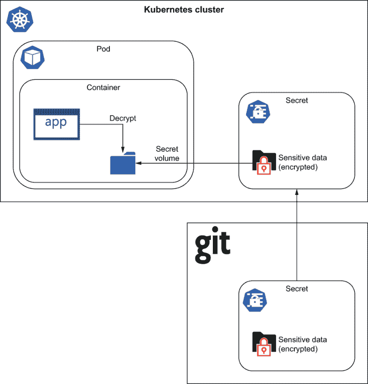
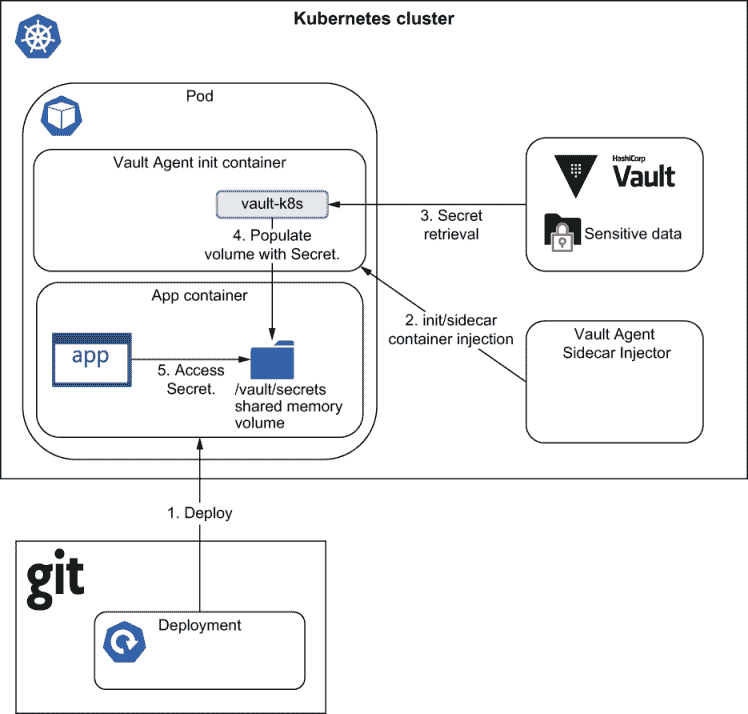
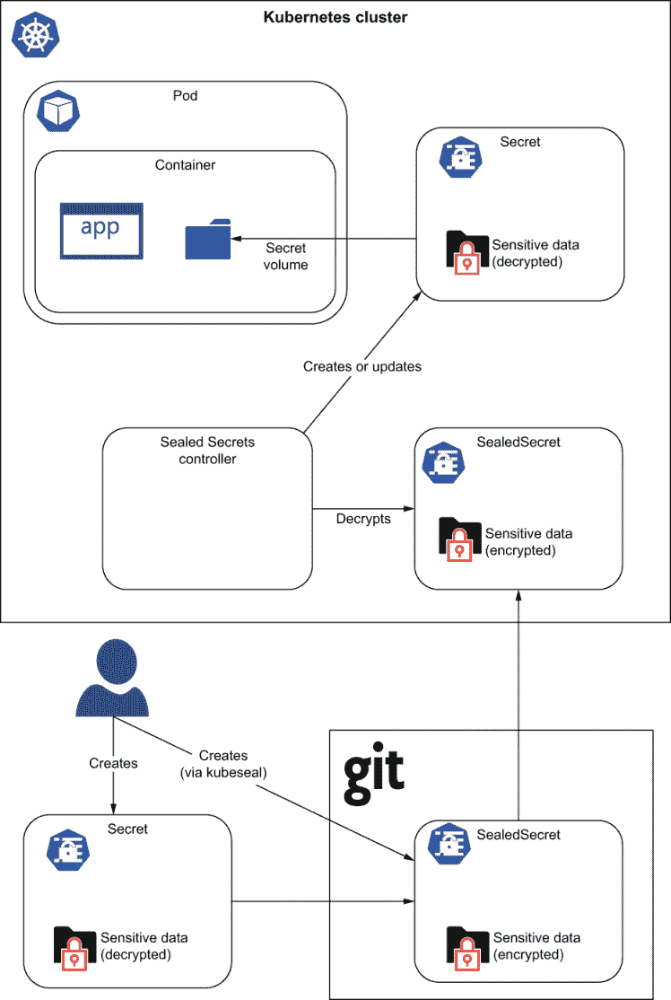
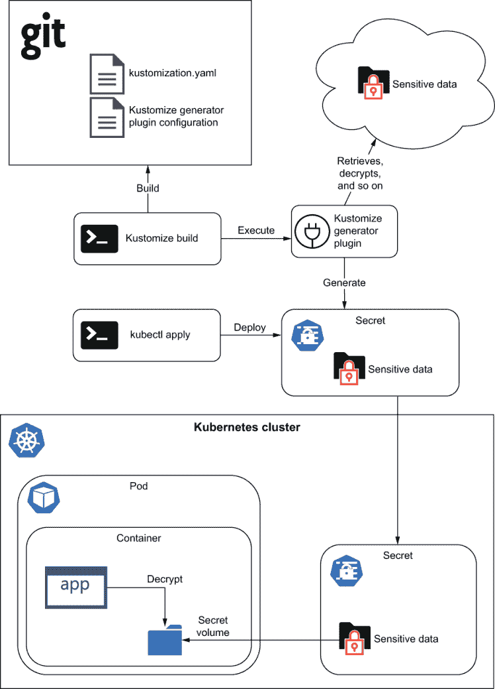

# 7 秘密

本章涵盖了

+   Kubernetes Secrets

+   GitOps 管理秘密的策略

+   管理秘密的工具

Kubernetes 提供了一种机制，允许用户在称为 Secret 的受保护资源对象中存储少量敏感信息。Secret 是您想要严格控制访问权限的任何内容。您可能希望存储在 Secret 中的常见数据包括用户名和密码凭证、API 密钥、SSH 密钥和 TLS 证书。在本章中，您将了解在使用 GitOps 系统时不同的秘密管理策略。您还将简要介绍一些可用于存储和管理秘密的不同工具。

我们建议您在阅读本章之前先阅读第一章和第二章。

## 7.1 Kubernetes Secrets

一个简单的 *Kubernetes Secret* 是一个由三部分信息组成的数据结构：

+   秘密的名称

+   秘密的类型（可选）

+   字段名到敏感数据的映射，以 Base64 编码

一个基本的秘密看起来如下。

列表 7.1 example-secret.yaml

```
apiVersion: v1
kind: Secret
metadata:
  name: login-credentials
type: Opaque                  ❶
data:
  username: YWRtaW4=          ❷
  password: UEA1NXcwcmQ=      ❸
```

❶ 秘密的类型，用于简化对秘密数据的程序化处理

❷ 字符串“admin”Base64 编码

❸ 字符串“P@55w0rd”Base64 编码

当第一次查看秘密的值时，您可能会错误地认为秘密值是用加密保护的，因为字段对人类不可读，并且不以纯文本形式呈现。但您是错误的，并且重要的是要理解

+   秘密值是 Base64 编码的。

+   Base64 编码与加密不同。

+   应将查看视为与纯文本相同。

Base64 编码 Base64 是一种编码算法，它允许您将任何字符转换成一个由拉丁字母、数字、加号和斜杠组成的字母表。它允许二进制数据以 ASCII 字符串格式表示。Base64 编码**不**提供加密。

Kubernetes 对数据进行 Base64 编码的原因是它允许秘密存储二进制数据。这对于将证书等存储为秘密非常重要。如果没有 Base64 编码，将无法将二进制配置作为秘密存储。

### 7.1.1 为什么使用秘密？

在 Kubernetes 中使用秘密是可选的，但比其他技术（如直接在 Pod 规范中放置敏感值或在构建时将值烘焙到容器镜像中）更方便、更灵活、更安全。就像 ConfigMaps 一样，秘密允许将应用程序的配置与构建工件分离。

### 7.1.2 如何使用秘密

Kubernetes Secrets，就像 ConfigMaps 一样，可以用几种方式使用：

+   作为 Pod 中挂载的文件

+   作为 Pod 中的环境变量

+   Kubernetes API 访问



图 7.1 使用机密卷传递敏感信息，如密码，到 Pod。机密卷由 tmpfs（一个基于 RAM 的文件系统）支持，因此它们永远不会写入非易失性存储。

Pod 中的文件卷挂载机密信息

利用机密的第一种技术是将它们挂载到 Pod 中作为卷。为此，你首先声明以下内容。

列表 7.2 secret-volume.yaml

```
apiVersion: v1
kind: Pod
metadata:
  name: secret-volume-pod
spec:
  Volumes:                      ❶
  - name: foo
    secret:
      secretName: mysecret
  containers:
  - name: mycontainer
    image: redis
    volumeMounts:               ❷
    - name: foo
      mountPath: /etc/foo
      readOnly: true
```

❶ 在 Pod 中声明了一个类型为 Secret 的卷，具有任意名称。

❷ 需要机密信息的容器指定了挂载机密数据卷的路径。

当将机密（或 ConfigMap）投影到 Pod 作为文件卷时，底层机密的变化最终会更新 Pod 中挂载的文件。这为应用程序提供了重新配置自己或热重载的机会，而无需重启容器/Pod。

将机密作为环境变量使用

利用 Kubernetes 机密的第二种方式是将它们设置为环境变量。

列表 7.3 secret-environment-variable.yaml

```
apiVersion: v1
kind: Pod
metadata:
  name: secret-env-pod
spec:
  containers:
  - name: mycontainer
    image: redis
    env:
    - name: SECRET_USERNAME
      valueFrom:
        secretKeyRef:
          name: mysecret       ❶
          key: username        ❷
    - name: SECRET_PASSWORD
      valueFrom:
        secretKeyRef:
          name: mysecret       ❶
          key: password        ❷
```

❶ 机密的名称

❷ 机密数据映射的键

将机密作为环境变量暴露给容器，虽然方便，但可能不是消费机密的最佳方式，因为它比将其作为卷挂载文件消费的安全性更低。当机密被设置为环境变量时，容器中的所有进程（包括子进程）都将继承操作系统环境并能够读取环境变量值，从而读取机密数据。例如，一个分叉的 shell 脚本可以通过运行`env`实用程序来读取环境变量。

机密环境变量的缺点 使用机密作为环境变量的第二个缺点是，与投影到卷中的机密不同，如果容器启动后机密被更新，机密环境变量的值将不会更新。需要容器或 Pod 重启才能注意到变化。

使用 K8s API 中的机密

最后，Kubernetes 机密也可以直接从 Kubernetes API 中检索。假设你有一个以下带有密码字段的机密。

列表 7.4 secret.yaml

```
apiVersion: v1
kind: Secret
metadata:
  name: my-secret
type: Opaque
data:
  password: UEA1NXcwcmQ=
```

要检索机密，Pod 本身可以直接从 Kubernetes 中检索机密值，例如，通过使用`kubectl`命令或 REST API 调用。以下`kubectl`命令检索名为`my-secret`的机密，对密码字段进行 Base64 解码，并将纯文本值打印到标准输出：

```
$ kubectl get secret my-secret -o=jsonpath='{.data.password}' | base64 --decode
P@55w0rd
```

这种技术要求 Pod 有权限检索机密。

机密类型

机密类型字段是数据包含在机密中的类型的指示。它主要用于软件程序识别它们可能感兴趣的相关的机密，以及安全地做出关于机密内部可用的字段设置的假设。

以下表格描述了内置的 Kubernetes 机密类型，以及每种类型所需的字段。

表 7.1 内置机密类型

| 类型 | 描述 | 必需字段 |
| --- | --- | --- |
| Opaque | 默认类型。包含任意用户定义的数据。 |  |
| kubernetes.io/service-account-token | 包含一个标识 Kubernetes API 中服务账户的令牌。 | data["token"] |
| kubernetes.io/dockercfg | 包含一个序列化的 ~/.dockercfg 文件。 | data[".dockercfg"] |
| kubernetes.io/dockerconfigjson | 包含一个序列化的 ~/.docker/config.json 文件。 | data[".dockerconfigjson"] |
| kubernetes.io/basic-auth | 包含基本的用户名/密码凭证。 | data["username"]data["password"] |
| kubernetes.io/ssh-auth | 包含用于身份验证所需的私有 SSH 密钥。 | data["ssh-privatekey"] |
| kubernetes.io/tls | 包含 TLS 私钥和证书。 | data["tls.key"]data["tls.crt"] |

## 7.2 GitOps 和密钥

Kubernetes GitOps 实践者不可避免地会遇到相同的问题：虽然用户在 Git 中存储配置时感到非常舒适，但当涉及到敏感数据时，由于安全顾虑，他们不愿意在 Git 中存储这些数据。Git 被设计为一个协作工具，使得多人团队可以轻松访问代码并查看彼此的更改。但正是这些相同的属性使得使用 Git 来存储密钥成为一种极其危险的做法。有许多担忧和原因说明为什么在 Git 中存储密钥是不合适的，我们将在下面进行说明。

### 7.2.1 没有加密

如我们之前所学的，Kubernetes 并不对 Secret 的内容进行加密，值的 Base64 编码应被视为与纯文本相同。此外，Git 本身也不提供任何形式的内置加密。因此，当在 Git 仓库中存储密钥时，密钥对任何有权访问 Git 仓库的人来说都是公开的。

### 7.2.2 分布式 Git 仓库

使用 GitOps，你和你的同事将本地克隆 Git 仓库到你的笔记本电脑和工作站，目的是管理应用程序的配置。但这样做的同时，你也会在许多系统中传播和分发密钥，而没有足够的审计或跟踪。如果其中任何系统遭到破坏（被黑客攻击或甚至物理丢失），有人将能够访问你所有的密钥。

### 7.2.3 没有细粒度（文件级）访问控制

Git 不提供对 Git 仓库子路径或子文件的读取保护。换句话说，不可能限制对某些文件的访问，而不限制对其他文件的访问。在处理密钥时，理想情况下应根据需要了解情况来授予读取访问权限。例如，如果你有一个需要部分访问 Git 仓库的临时工作人员，你希望尽可能少地给予该用户访问内容。不幸的是，Git 不提供任何实现此目的的设施，在授予仓库权限时是一个全有或全无的决定。

### 7.2.4 不安全存储

Git 从来没有打算用作 Secret 管理系统。因此，它没有将标准安全功能（如静态加密）设计到系统中。因此，如果 Git 服务器被入侵，它可能会泄露它所管理的所有存储库的 Secrets，使其成为攻击的主要目标。

Git 提供商功能 虽然 Git 本身不提供静态加密等安全功能，但 Git 提供商通常会在 Git 之上提供这些功能。例如，GitHub 声称会对存储库进行静态加密。但此功能可能因提供商而异。

### 7.2.5 完整提交历史

一旦 Secret 被添加到 Git 提交历史中，就很难删除。如果 Secret 被检查到 Git 中，然后后来被删除，那么在 Secret 被删除之前的存储库历史中的早期点仍然可以检索到该 Secret。即使 Secret 被加密，当用于加密 Secret 的密钥后来被轮换，并且使用新密钥重新加密 Secret 时，使用旧密钥加密的 Secret 仍然存在于存储库历史中。

## 7.3 Secrets 管理策略

在 GitOps 中处理 Secrets 有许多不同的策略，这些策略在灵活性、可管理性和安全性方面存在权衡。在介绍实现这些策略的工具之前，我们首先从概念层面概述一些策略。

### 7.3.1 在 Git 中存储 Secrets

GitOps 和 Secrets 的第一策略就是根本不制定策略。换句话说，你只需像管理其他 Kubernetes 资源一样，将 Secrets 提交到 Git 并接受其安全后果。

你可能会想，“将我的 Secrets 存储在 Git 中有什么不好？”即使你有私有 GitHub 存储库，只有你的团队成员可以访问，你也可能希望允许第三方访问 Git 仓库——CI/CD 系统、安全扫描器、静态分析等。通过向这些第三方软件系统提供你的 Secrets Git 仓库，你实际上是在将你的 Secrets 交托给他们。

因此，在实践中，唯一真正可以接受的将 Secrets 以原样存储在 Git 中的场景是当 Secrets 不包含任何真正敏感数据时，例如开发和测试环境。

### 7.3.2 将 Secrets 集成到容器镜像中

一种可能想到的简单策略是直接将敏感数据集成到容器镜像中，以避免在 Git 中存储 Secrets。在这种方法中，Secret 数据作为 Docker 构建过程的一部分直接复制到容器镜像中。



图 7.2 将 Secret 集成到容器镜像中。Docker 构建过程将敏感数据（例如，通过将敏感文件复制到容器中）集成到镜像中。没有使用任何 Secret 存储库（Kubernetes 或外部），但容器注册库变得敏感，因为它实际上是一个 Secret 存储库。

一个简单的 Dockerfile，将秘密烘焙到镜像中可能看起来像这样。

列表 7.5 带有秘密的 Dockerfile

```
FROM scratch

COPY ./my-app /my-app
COPY ./credentials.txt /credentials.txt

ENTRYPOINT [“/my-app”]
```

这种方法的优点是它消除了 Git 和甚至 Kubernetes 本身。实际上，由于秘密数据被烘焙到容器镜像中，该镜像可以在任何地方运行，而不仅仅是 Kubernetes，并且无需任何配置即可工作。

然而，将敏感数据直接烘焙到容器镜像中有一些非常严重的缺点，这应该自动将其排除为可行的选项。第一个问题是容器镜像本身现在变得敏感。由于敏感数据被烘焙到镜像中，现在任何或任何可以访问容器镜像的人或事物（例如通过 `docker pull`），现在可以轻易地复制和检索秘密。

另一个问题是因为秘密被烘焙到镜像中，秘密数据的更新非常繁琐。每当需要轮换凭证时，都需要完全重建容器镜像。

第三个问题是容器镜像不够灵活，无法适应需要使用不同秘密数据集运行相同镜像的情况。假设你有三个环境，这个容器镜像将被部署到这些环境中：

+   开发环境

+   测试环境

+   生产环境

每个这些环境都需要一组不同的凭证，因为它们连接到三个不同的数据库。将秘密数据烘焙到容器镜像中的方法在这里不起作用，因为它只能选择将其中一个数据库凭证烘焙到镜像中。

### 7.3.3 非带管理

处理 GitOps 中秘密的另一种方法是完全在 GitOps 之外管理秘密。采用这种方法，除了 Kubernetes 秘密之外的所有内容都将定义在 Git 中并通过 GitOps 部署，但将使用某种其他机制来部署秘密，即使它是手工的。

例如，用户可以将他们的秘密存储在数据库中，云提供商管理的秘密存储中，甚至是在他们本地工作站上的文本文件中。当部署时，用户将手动运行 `kubectl apply` 将秘密部署到集群中，然后让 GitOps 运营商部署其他所有内容。



图 7.3 在非带管理中，GitOps 用于部署常规资源。但使用某种其他机制（如手动 `kubectl apply`）来部署秘密。

这种方法的明显缺点是，你需要有两种不同的机制来将资源部署到集群中：一种是通过 GitOps 部署常规 Kubernetes 资源，另一种专门用于部署秘密。

### 7.3.4 外部秘密管理系统

在 GitOps 中处理密钥的另一种策略是使用除 Kubernetes 之外的外部密钥管理系统。在这种策略中，而不是使用 Kubernetes 的本地功能将密钥存储和加载到容器中，应用程序容器本身在运行时、使用点动态检索密钥值。

存在着各种密钥管理系统，但最流行和最广泛使用的是 HashiCorp Vault，这是我们讨论外部密钥管理系统时将主要关注的工具。各个云服务提供商也提供了自己的密钥管理服务，例如 AWS Secrets Manager、Google Cloud Secret Manager 和 Microsoft Azure Key Vault。这些工具在功能和特性集上可能有所不同，但基本原则是相同的，并且应该适用于所有情况。



图 7.4 从外部密钥存储检索密钥。在这种方法中，敏感数据不是作为 Kubernetes 密钥存储的。相反，它存储在外部系统中，该系统将在运行时由容器检索（例如通过 API 调用）。

通过选择使用外部密钥管理系统（如 Vault）来管理您的密钥，您实际上是在做出一个决定，即不使用 Kubernetes 密钥。这是因为当使用这种策略时，您依赖于外部密钥管理系统来存储和检索您的密钥，而不是 Kubernetes。一个重要的后果是，您也无法利用 Kubernetes 密钥提供的一些便利，例如从密钥设置环境变量的值或将密钥映射为卷中的文件。

当使用外部密钥存储时，应用程序有责任安全地从存储中检索密钥。例如，当应用程序启动时，它可以在运行时动态地从密钥存储中检索密钥值，而不是使用 Kubernetes 机制（环境变量、卷挂载等）。这把保管密钥的责任转移给了必须安全检索密钥的应用程序开发人员和外部密钥存储的管理员。

这种技术的另一个后果是，由于密钥是在单独的数据库中管理的，因此您无法像 Git 中管理的配置那样拥有密钥更改的历史/记录。这甚至可能影响您以可预测的方式回滚的能力。例如，在回滚过程中，应用上一个 Git 提交的清单可能不足以完成。您还必须同时回滚密钥到 Git 提交时的先前值。根据所使用的密钥存储，这可能在最好情况下不方便，在最坏情况下甚至不可能。

### 7.3.5 在 Git 中加密密钥

由于 Git 被认为不适合存储纯文本 Secrets，一种策略是加密敏感数据，使其在 Git 中存储是安全的，然后在接近使用点的地方解密加密数据。执行解密的操作者必须拥有解密加密 Secret 所需的密钥。这可能是由应用程序本身、填充应用程序使用的卷的 init 容器，或者是一个控制器，以无缝地处理这些任务。 



图 7.5 Secrets 与其他 Kubernetes 资源一起在 Git 中加密并安全存储。在运行时，应用程序可以在使用之前解密内容。

一个流行的工具，有助于在 Git 中加密 Secrets 的技术是 Bitnami SealedSecrets，我们将在本章后面详细讨论。

Git 中加密 Secrets 的挑战在于，仍然涉及一个最后的 Secret，那就是用于加密这些 Secrets 的加密密钥。如果没有对加密密钥的充分保护，这种技术就毫无意义，因为任何能够访问加密密钥的人现在都有能力解密并获取清单中的敏感数据。

### 7.3.6 策略比较

在 Kubernetes 中管理 Secrets 有许多不同的方法，每种方法都有其权衡。在决定适合您需求的解决方案和/或工具之前，请考虑以下优点和缺点。

表 7.2 GitOps Secrets 管理策略

| 类型 | 优点 | 缺点 |
| --- | --- | --- |
| 存储在 Git 中 | 简单方便 Secrets 和配置在同一个地方（Git）管理 | 完全不安全 |
| 将其嵌入到镜像中 | 简单方便 | 容器镜像敏感。轮换 Secrets 需要重新构建镜像。镜像不可移植。Secrets 不能在 Pod 之间共享。 |
| 离线管理 | 仍然能够利用原生 Kubernetes Secrets 功能（如卷挂载和环境变量） | 部署 Secrets 和配置修改到 Secrets 的过程不同，Git 历史记录中未记录，可能会影响回滚的能力。 |

## 7.4 工具

在 Kubernetes 生态系统内外，已经出现了许多项目来帮助用户解决 Secrets 的问题。所有这些项目都使用之前讨论过的 Secret 管理策略之一。在本节中，我们将介绍一些更受欢迎的工具，这些工具可以通过 GitOps 方法补充 Kubernetes 环境。

### 7.4.1 HashiCorp Vault

HashiCorp 的 Vault 是一个专为以安全方式存储和管理 Secrets 而构建的开源工具。Vault 提供命令行界面（CLI）、用户界面（UI）以及用于以编程方式访问 Secret 数据的 API。Vault 不仅限于 Kubernetes，并且作为独立的 Secret 管理系统而广受欢迎。

Vault 安装和设置

安装和运行 Vault 有许多方法。但如果你是 Vault 的新手，推荐且最简单的方法是使用由 HashiCorp 维护的官方 Helm 图表安装 Vault。为了简化我们的教程，我们将以开发模式安装 Vault，这种模式适用于实验、开发和测试。此外，该命令还安装了 Vault Agent Sidecar Injector，我们将在下一节中介绍并使用：

```
# NOTE: requires Helm v3.0+

$ helm repo add hashicorp https://helm.releases.hashicorp.com

$ helm install vault hashicorp/vault \
    --set server.dev.enabled=true \
    --set injector.enabled=true
```

非 Kubernetes 安装注意：在 Kubernetes 环境中运行 Vault 并非必需。Vault 是一个通用的密钥管理系统，适用于 Kubernetes 以外的应用程序和平台。许多企业选择为公司运行一个集中管理的 Vault 实例，因此单个 Vault 实例可以为多个 Kubernetes 集群和虚拟机提供服务，同时也可以被来自企业网络和工作站的开发人员和运维人员访问。

Vault CLI 可以从[`www.vaultproject.io/downloads`](https://www.vaultproject.io/downloads)下载，或者（对于 macOS）通过使用`brew`软件包管理器：

```
$ brew install vault
```

安装完成后，Vault 可以通过标准端口转发访问，并访问 http://localhost:8200 的 UI：

```
# Run the following from a different terminal, or background it with ‘&’
$ kubectl port-forward vault-0 8200

$ export VAULT_ADDR=http://localhost:8200

# In dev mode, the token is the word: root
$ vault login
Token (will be hidden):
Success! You are now authenticated. The token information displayed below
is already stored in the token helper. You do NOT need to run "vault login"
again. Future Vault requests will automatically use this token.

Key                  Value
---                  -----
token                root
token_accessor       o4SQvGgg4ywEv0wnGgqHhK1h
token_duration       ∞
token_renewable      false
token_policies       ["root"]
identity_policies    []
policies             ["root"]

$ vault status
Key             Value
---             -----
Seal Type       shamir
Initialized     true
Sealed          false
Total Shares    1
Threshold       1
Version         1.4.0
Cluster Name    vault-cluster-23e9c708
Cluster ID      543c058a-a9d4-e838-e270-33f7e93814f2
HA Enabled      false
```

Vault 使用

一旦 Vault 安装到您的集群中，就是时候在 Vault 中存储您的第一个密钥了：

```
$ vault kv put secret/hello foo=world
Key              Value
---              -----
created_time     2020-05-15T12:36:21.956834623Z
deletion_time    n/a
destroyed        false
version          1
```

要检索密钥，运行`vault kv get`命令：

```
$ vault kv get secret/hello
====== Metadata ======
Key              Value
---              -----
created_time     2020-05-15T12:36:21.956834623Z
deletion_time    n/a
destroyed        false
version          1

=== Data ===
Key    Value
---    -----
foo    world
```

默认情况下，`vault kv get`将以表格格式打印密钥。虽然这种格式以易于阅读的方式呈现，并且非常适合人类阅读，但它不太容易通过自动化解析，也不太容易被应用程序消费。为了帮助解决这个问题，Vault 提供了一些额外的输出格式化方法和提取密钥特定字段的方法：

```
$ vault kv get -field foo secret/hello
world

$ vault kv get -format json secret/hello
{
  "request_id": "825d85e4-8e8b-eab0-6afb-f6c63856b82c",
  "lease_id": "",
  "lease_duration": 0,
  "renewable": false,
  "data": {
    "data": {
      "foo": "world"
    },
    "metadata": {
      "created_time": "2020-05-15T12:36:21.956834623Z",
      "deletion_time": "",
      "destroyed": false,
      "version": 1
    }
  },
  "warnings": null
}
```

这使得 Vault CLI 在启动脚本中使用变得容易，这可能

1.  运行`vault kv get`命令以检索密钥的值。

1.  将密钥值设置为环境变量或文件。

1.  启动主应用程序，现在它可以从环境变量或文件中读取密钥。

这样的启动脚本可能看起来如下所示。

列表 7.6 vault-startup.sh

```
#!/bin/sh

export VAULT_TOKEN=your-vault-token
export VAULT_ADDR=https://your-vault-address.com:8200
export HELLO_SECRET=$(vault kv get -field foo secret/hello)./guestbook
```

要将其与 Kubernetes 应用程序集成，此启动脚本将用作容器的入口点，用启动脚本替换正常的应用程序命令，启动脚本会在密钥被检索并设置为环境变量之后启动应用程序**之后**。

关于这种方法需要注意的一点是，`vault` `kv` `get` 命令*本身*需要权限来访问 Vault。因此，为了使此脚本工作，`vault` `kv` `get` 需要安全地与 Vault 服务器通信，通常使用 Vault 令牌。另一种说法是，您仍然需要一个机密来获取更多机密。这提出了一个“先有鸡还是先有蛋”的问题，即您现在需要以某种方式安全地配置和存储用于检索应用程序机密的 Vault 机密。解决方案在于 Kubernetes-Vault 集成，我们将在下一节中介绍。

### 7.4.2 Vault Agent 侧边注入器

由于 Vault 的流行，已经创建了众多 Vault 和 Kubernetes 集成，以使其更容易使用。由 HashiCorp 开发并支持的官方 Kubernetes 集成是 Vault Agent 侧边注入器。

如前节所述，为了从 Vault 中检索机密，使用了专门的脚本，该脚本在启动应用程序之前执行了一些先决步骤。这包括检索和准备应用程序的机密。这种方法存在一些问题：

+   尽管以安全的方式检索了应用程序机密，但该技术仍需要处理保护用于访问应用程序机密的 Vault 机密。

+   容器需要是 Vault 意识的，也就是说，容器需要使用一个专门的脚本构建，该脚本了解如何检索特定的 Vault 机密并将其传递给应用程序。

为了解决这个问题，HashiCorp 开发了 Vault Agent 侧边注入器，以通用方式解决了这两个问题。Vault Agent 侧边注入器自动修改以特定方式注释的 Pods，并安全地检索注释的机密引用（应用程序机密）并将这些值渲染到应用程序容器可访问的共享卷中。通过将机密渲染到共享卷中，Pod 内的容器可以在不了解 Vault 的情况下消费 Vault 机密。

工作原理

Vault Agent 注入器修改 Pod 规范以包含 Vault Agent 容器，这些容器将 Vault 机密填充到应用程序可访问的共享内存卷中。为了实现这一点，您使用 Kubernetes 中的一个功能，称为修改性准入网关。

修改性准入网关修改性准入网关是扩展 Kubernetes API 服务器以添加额外功能的方式之一。修改性网关作为 HTTP 回调实现，它拦截准入请求（创建、更新、补丁请求）并以某种方式修改对象。

图 7.6 解释了 Vault Agent 注入器的工作原理。



图 7.6 正常创建了一个 Pod，但它具有 Vault Agent 侧边注入器可以理解的特殊注释。根据这些注释，包含所需机密的目录将被挂载到容器中，以便应用程序使用。

采用这种方法涉及的一系列步骤如下：

1.  将工作负载资源（Deployment、Job、ReplicaSet 等）部署到集群中。这最终会创建一个 Kubernetes Pod。

1.  随着 Pod 的创建，Kubernetes API 服务器调用 Vault Agent Sidecar Injector 的修改 webhook 调用。Vault Agent Sidecar Injector 通过向 Pod 注入一个 init 容器（以及可选的 sidecar）来修改 Pod。

1.  当 Vault Agent Init 容器运行时，它会安全地与 Vault 通信以检索 Secret。

1.  Secret 被写入共享内存卷，该卷由 init 容器和应用容器共享。

1.  当应用容器运行时，它现在能够从共享内存卷中检索 Secret。

Vault Agent Sidecar Injector 安装和设置

在本章前面的部分，我们描述了如何使用官方 Helm 图表安装 Vault。此图表还包括 Agent Sidecar Injector。以下重复了这些说明。请注意，示例假设您的当前 kubectl 上下文指向默认命名空间：

```
# NOTE: requires Helm v3.0+

$ helm repo add hashicorp https://helm.releases.hashicorp.com

$ helm install vault hashicorp/vault \
    --set server.dev.enabled=true \
    --set injector.enabled=true
```

使用

当应用程序希望从 Vault 中检索其 Secrets 时，Pod 规范至少需要包含以下 Vault 代理注解。

列表 7.7 vault-agent-inject-annotations.yaml

```
annotations:
  vault.hashicorp.com/agent-inject: "true"
  vault.hashicorp.com/agent-inject-secret-hello.txt: secret/hello
  vault.hashicorp.com/role: app
```

分解来看，这些注解传达了几个信息点：

+   注解键 `vault.hashicorp.com/agent-inject:` `"true"` 通知 Vault Agent Sidecar Injector，对于这个 Pod 应该进行 Vault 秘密注入。

+   注解值 `secret/hello` 指示要将哪个 Vault 秘密键注入到 Pod 中。

+   注解 `vault.hashicorp.com/agent-inject-secret-hello.txt` 的后缀 `hello.txt` 指示在共享内存卷中应该在一个名为 hello.txt 的文件下填充 Secret，最终路径为 /vault/secrets/hello.txt。

+   来自 `vault.hashicorp.com/role` 的注解值指示在检索 Secret 时应使用哪个 Vault 角色。

现在我们用一个真实示例来尝试。要运行本教程中的所有 Vault 命令，您首先需要获取 Vault 内部的控制台访问权限。运行 `kubectl exec` 以访问 Vault 服务器的交互式控制台：

```
$ kubectl exec -it vault-0 -- /bin/sh
/ $
```

如果您还没有这样做，请遵循之前关于在 Vault 中创建第一个名为“hello”的 Secret 的指南：

```
$ vault kv put secret/hello foo=world
Key              Value
---              -----
created_time     2020-05-15T12:36:21.956834623Z
deletion_time    n/a
destroyed        false
version          1
```

接下来，我们需要配置 Vault 以允许 Kubernetes Pods 进行身份验证并检索 Secrets。为此，运行以下 Vault 命令以启用 Kubernetes `auth` 方法：

```
$ vault auth enable kubernetes
Success! Enabled kubernetes auth method at: kubernetes/

$ vault write auth/kubernetes/config \
    token_reviewer_jwt="$(cat /var/run/secrets/kubernetes.io/serviceaccount/token)" \
    kubernetes_host="https://$KUBERNETES_PORT_443_TCP_ADDR:443" \
    kubernetes_ca_cert=@/var/run/secrets/kubernetes.io/serviceaccount/ca.crt
Success! Data written to: auth/kubernetes/config
```

这两个命令配置 Vault 使用 Kubernetes 认证方法，使用服务账户令牌、Kubernetes 主机的位置及其证书。

接下来，我们定义一个名为“app”的策略以及一个名为“app”的角色，该角色将具有对“hello”Secret 的读取权限：

```
# Create a policy "app" which will have read privileges to the "secret/hello" secret
$ vault policy write app - <<EOF
path "secret/hello" {
  capabilities = ["read"]
}
EOF

# Grants a pod in the "default" namespace using the "default" service account
# privileges to read the "hello" secret
$ vault write auth/kubernetes/role/app \
    bound_service_account_names=default \
    bound_service_account_namespaces=default \
    policies=app \
    ttl=24h
```

现在是时候部署一个 Pod，该 Pod 将自动获取我们注入的 Vault Secret。应用以下 Deployment 清单，其中包含我们在 Pod 上描述的 Vault 注解。

列表 7.8 vault-agent-inject-example.yaml

```
apiVersion: apps/v1
kind: Deployment
metadata:
  name: vault-agent-inject-example
spec:
  selector:
    matchLabels:
      app: vault-agent-inject-example
  template:
    metadata:
      labels:
        app: vault-agent-inject-example
      annotations:
        vault.hashicorp.com/agent-inject: "true"
        vault.hashicorp.com/agent-inject-secret-hello.txt: secret/hello
        vault.hashicorp.com/role: app
    spec:
      containers:
      - name: debian
        image: debian:latest
        command: [sleep, infinity]
```

当部署运行时，我们可以访问 Pod 的控制台并验证 Pod 确实已经将 Secret 挂载在其中：

```
$ kubectl exec deploy/vault-agent-inject-example -it -c debian -- bash
root@vault-agent-inject-example-5c48967c97-hgzds:/# cat /vault/secrets/hello.txt
data: map[foo:world]
metadata: map[created_time:2020-10-14T17:58:34.5584858Z deletion_time: destroyed:false version:1]
```

正如你所见，使用 Vault Agent Sidecar Injector 是将 Vault Secrets 无缝安全地注入到你的 Pods 中的最简单方法之一。

### 7.4.3 Sealed Secrets

Sealed Secrets，由 Bitnami 提供，是 GitOps Secret 问题的另一种解决方案，并恰当地描述了问题为“我可以管理我在 Git 中的所有 K8s 配置，除了 Secrets。”虽然不是唯一的工具，但目前 Sealed Secrets 是那些更愿意在 Git 中加密他们的 Secrets 的团队中最受欢迎和最广泛使用的工具。这允许包括 Secrets 在内的一切都可以在 Git 中完全和彻底地管理。

Sealed Secrets 采用加密敏感数据以安全存储在 Git 中的策略，并在集群内部解密。使其独特的是，它提供了一个控制器和命令行界面，有助于自动化此过程。

它是如何工作的

Sealed Secrets 由以下内容组成：

+   一个新的 CustomResourceDefinition，称为 SealedSecret，它将生成一个正常的 Secret

+   一个在集群中运行的控制器，负责解密 SealedSecret，并生成一个包含解密数据的正常 Kubernetes Secret

+   一个命令行工具，kubeseal，它将敏感数据加密到 SealedSecret 中，以在 Git 中安全存储

当用户希望使用 Git 管理一个 Secret 时，他们将通过 kubeseal CLI 将 Secret 封装或加密为 SealedSecret 自定义资源，并将其存储在 Git 中，与其他应用程序资源（Deployments、ConfigMaps 等）一起。SealedSecret 的部署就像任何其他 Kubernetes 资源一样。

当一个 SealedSecret 部署时，`sealed-secrets-controller` 将解密数据并生成一个具有相同名称的正常 Kubernetes Secret。此时，与 SealedSecret 和正常 Kubernetes Secret 的体验没有区别，因为常规 Kubernetes Secret 可供 Pods 使用。



图 7.7 用户将 Secret 加密为 SealedSecret 并存储在 Git 中。Sealed Secrets 控制器解密 SealedSecret，并制定一个相应的 Kubernetes Secret，供 Pod 使用常规 Kubernetes 功能。

安装

CRD 和控制器：

```
$ kubectl apply -f https://github.com/bitnami-labs/sealed-secrets/releases/download/v0.12.4/controller.yaml
```

Kubeseal CLI：

+   从 https://github.com/bitnami-labs/sealed-secrets/releases 下载二进制文件。

使用

要使用 SealedSecrets，你首先创建一个常规 Kubernetes Secret，就像你通常使用你喜欢的技术一样，并将其放置在某个本地文件路径。在这个简单的例子中，我们将使用 `kubectl create secret` 命令创建一个密码 Secret。`--dry-run` 标志用于将值打印到 stdout，然后重定向到临时文件。我们将其存储在临时位置，因为包含未加密数据的 Secret 应该被丢弃，不应持久化在 Git（或任何其他地方）。

```
$ kubectl create secret generic my-password --from-literal=password=Pa55Word1 --dry-run -o yaml > /tmp/my-password.yaml
```

不要使用 kubectl create secret --from-literal 在前面的例子中，使用 `--from-literal` 只是为了演示和练习目的，它永远不应该与任何敏感数据一起使用。这是因为你的 shell 将最近运行的命令记录到历史文件中，以便方便检索。如果你希望使用 kubectl 生成 Secret，请考虑使用 `--from-file` 代替。

前一个命令将生成以下临时 Kubernetes Secret 文件。

列表 7.9 my-password.yaml

```
apiVersion: v1
kind: Secret
metadata:
  name: my-password
data:
  password: UGE1NVdvcmQx
```

下一步是使用 kubeseal CLI 对临时 Secret 进行密封或加密。以下命令基于我们刚刚创建的临时 Secret 文件创建一个 SealedSecret 对象：

```
$ kubeseal -o yaml </tmp/my-password.yaml > my-sealed-password.yaml
```

这将生成以下 SealedSecret 资源，可以安全地存储在 Git 中。

列表 7.10 my-sealed-password.yaml

```
apiVersion: bitnami.com/v1alpha1
kind: SealedSecret
metadata:
  creationTimestamp: null
  name: my-password
  namespace: default
spec:
  encryptedData:
    password: AgAF7r6v4LG/JPU7TiOi77bhd1NJ9ua9gldvzNw7wBKK2LLJyndSR8GShF3f1zRY+cNM0iOGTkcaFrNRCG/CMrLiwNltQv1gZKqryFugjcp7tiM0dwmmi4M0aIeqRfXq3+vL/Mmdc/xEsK/FtuKOg18rWoG/wEhvNhtvXu1t4kXHTSVL5xa4KmYD8Hn8p8CNZrGATLfy6rIlZsydM9DoB1nSFDsfG5kHlE++RbyXxd6Y6vckK1DPl6oqI5GidnrEQlQmkhEr+h/YuUrajAxMFNZpqzs9yaTkURdc0xDp2w
     MiycBooEn7eRzTt2aTohO4q9rgoiWwjztCyXdOCyCt+eisoG0QsqC697PiQV35IFuNbkpty
     FUU04nfMtxYfb2aZEHfVt8/j3xl9JlqKQ16zy9g0jhj1QLxhBjmRK9EyqTxqVGRTfrHaHqqz
     7mzSy/x2H6lkfBBVFLWSvwOFkYD82wdQRfTYBF5Uu/cnjeB2Uob8JkM91nEtXhLWAwtl2K5
     w0LYyUd3qOaNEEXgyv+dN/4pTHK1V+LF6IHNDOFau8QVNmqJrxrXv8yEnRGzBYg60J99Kl9
     vhp8pfbHAYfn2Tb9o8WxWjWD0YAc+pAuFAGjUmJKEJmaPr0vUo0k67BlXj77LVuHPH6
     Ei6JxGYOZA0B2WElmOwILHzDl7unWXnI+Q7Hmk2TEYSeEo81x+I9mLd8D6EpunG2lFndo=
  template:
    metadata:
      creationTimestamp: null
      name: my-password
      namespace: default
```

SealedSecret 现在可以存储在与你的其他应用程序清单一起，并像正常资源一样部署，无需任何特殊处理。

无集群访问权限密封 Secret 默认情况下，kubeseal 将使用 `sealed-secrets-controller` 的证书加密 Secret。为此，它需要访问 Kubernetes 集群以直接从 `sealed-secrets-controller` 获取证书。可以在不直接访问集群的情况下离线密封 Secret。或者，可以使用不同的方式提供证书，通过使用 `kubeseal` 的 `--cert` 标志，该标志允许你指定证书的本地路径或甚至 URL。

当你比较原始 Kubernetes Secret 和 SealedSecret 时，你可能已经注意到，SealedSecret 在元数据中指定了命名空间，而原始 Secret 没有指定。这意味着 SealedSecret 比原始 Secret 的可移植性要低得多，因为它不能在不同的命名空间中部署。这实际上是 SealedSecret 的一个安全特性，被称为 *严格范围*。在严格范围内，SealedSecret 以一种方式加密 Secret，使其只能用于加密的命名空间，并且与完全相同的 Secret 名称（在我们的例子中是 my-password）。这个特性防止了攻击者将 SealedSecret 部署到不同的命名空间或名称，该攻击者有权访问，以查看 Secret 的敏感数据。

在非多租户环境中，严格的范围可以被放宽，使得相同的 SealedSecret 可以在集群中的任何命名空间中使用。为此，你可以在密封过程中指定 `--scope cluster-wide` 标志：

```
$ kubeseal -o yaml --scope cluster-wide </tmp/my-password.yaml > my-cluster-sealed-password.yaml
```

这将生成一个略微不同的集群范围 SealedSecret，现在它不再包含命名空间。

列表 7.11 my-clusterwide-sealed-password.yaml

```
apiVersion: bitnami.com/v1alpha1
kind: SealedSecret
metadata:
  annotations:
    sealedsecrets.bitnami.com/cluster-wide: "true"
  creationTimestamp: null
  name: my-password
spec:
  encryptedData:
    password: AgBjcpeaU2SKqOTMQ2SxYnxoJgy19PR7uzi1qrP5e3PqCPRi7yWD6TvozJE2r9O
     rey0zLL0/yTuIHn0Z5S7FBQT6p7FA19FGxcCu+Xdd1p/purofibL5xR8Zfk/VxEAH2RSVPS
     UGdMwpMRqhKFrsK2rZujjrDjOdC/7zTRgueSMJ6RTIWSCctXZ5htaWIBvN3nUJKGAWsrG/cF1xA6pPANE6eZTjyX3+pEQ3YPmPqkc4chseU/aUqk3fXN5tEcwuLWFXFkihN5hMnhKUH8
     CePk7IWB/BXATxLNYlGRzrcYAoXZOyYGkUlw24yVMl0AbpmlmqYiCdlnQMEhTilc9iyKKT3
     ASplH+T/WMr7DdKcDpbTcgL0wI0EeBtUXV2zBWdNWquVA6oPCJmo4TruiBtLDZjeu6xj9fV
     tlZD/HETGLgeDuBSw/BN7fUqi6GuRObFMiZUhoN4ynm2jNHTe0bVDV6QOidbTvy6FcPjHV
     qjwKsLu2jN/TYhLTkbzHjL9Or2dZX8gI/BrmMOtoRDzSK2C4T9KqyAxipRgYkSH9cImdT9
     ChCPA9jIQUZRZGMS48Yg/SDRvA/d+QaGdMhhbhtmApWPWMaA/0+adxnPcoKBnVtuzAlPla
     YN64JCBzyJkKDVutm/wvMYtoZ95vMnLDG1d/b9CmYobAyeuz9AGZ5UeZWoZ32DMMhc5kXecR/FsnfMWeCaHiT+6423nJU=
  template:
    metadata:
      annotations:
        sealedsecrets.bitnami.com/cluster-wide: "true"
      creationTimestamp: null
      name: my-password
```

集群范围内的 SealedSecret 作用域的一个后果是，SealedSecret 现在可以在集群的任何命名空间中部署和解密。这意味着任何拥有集群中单个命名空间权限的人都可以简单地在自己的命名空间中部署 SealedSecret，以便查看敏感数据。

使用 SealedSecrets 的一个挑战是，用于加密 Secrets 的加密密钥对于每个集群都是不同的。当`sealed-secrets-controller`将普通 Kubernetes Secret 转换为 SealedSecret 并加密时，该 SealedSecret 对象仅对签名控制器有效，其他地方无效。这意味着每个集群在 Git 中都有一个不同的 SealedSecret 对象。如果您只处理单个集群，这个挑战可能不会成为问题。然而，如果同一个 Secret 需要部署到更多集群，那么这就会成为一个配置管理问题，因为需要为每个环境生成 SealedSecret。

虽然可以为多个集群使用相同的加密密钥，但这会带来不同的挑战：它变得难以在所有集群中安全地分发、管理和保护该密钥。加密密钥将分布到许多位置，提供了更多机会使其被破坏，最终允许攻击者访问每个集群中的每个 Secret。

### 7.4.4 Kustomize Secret 生成插件

使用 Kustomize 管理 Kubernetes 配置的用户可以访问一个独特的功能，即 Kustomize 插件，这些插件可以用于检索 Secrets。Kustomize 的插件功能允许 Kustomize 在构建过程中调用用户定义的逻辑来生成或转换 Kubernetes 资源。插件非常强大，可以编写为从外部源检索 Secrets，例如数据库、RPC 调用，甚至外部 Secret 存储库，如 Vault。该插件甚至可以编写为执行加密数据的解密并将其转换为 Kubernetes Secret。重要的是要记住，Kustomize 插件提供了一种非常灵活的机制来生成 Secrets，并且可以根据您的需求实现任何逻辑。



图 7.8 与将 Secret 存储在 Git 中不同，生成或检索该 Secret 的配方（作为 Kustomize Secret 生成器）被存储。这种方法意味着渲染后的 Secret 将在渲染后立即应用于集群（Kustomize 构建）。

它是如何工作的

正如我们在前面的章节中学到的，Kustomize 是一个配置管理工具，通常不涉及管理或检索 Secrets。但是，通过使用 Kustomize 的插件功能，可以在 `kustomize build` 命令中注入一些用户定义的逻辑来生成 Kubernetes 清单。由于 `kustomize build` 常常是渲染清单实际部署之前发生的最后一步，因此这是一个在部署之前安全检索 Secret 的完美机会，并最终避免在 Git 中存储 Secrets。

Kustomize 有两种类型的插件：exec 插件和 Go 插件。exec 插件简单地说是一个可执行文件，它接受单个命令行参数：插件 YAML 配置文件的路径。还支持 Go 插件，这些插件是用 Golang 编写的，但开发起来更复杂。在接下来的练习中，我们将编写一个 exec 插件，因为它更容易编写和理解。

在这个练习中，我们将实现一个 Kustomize Secret 检索插件，该插件将通过密钥名称“检索”特定的 Secret，并从中生成 Kubernetes Secret。这里的“检索”一词加了引号，因为在现实中，这个例子将仅仅假装检索一个 Secret，并使用硬编码的值。

要使用 Kustomize 生成器插件，我们只需在 kustomization.yaml 中引用插件配置。

列表 7.12 kustomization.yaml

```
apiVersion: kustomize.config.k8s.io/v1beta1
kind: Kustomization

generators:
- my-password.yaml
```

引用的插件配置 YAML 的内容特定于插件。Kustomize 插件规范中包含的内容没有标准。在这个练习中，我们的插件规范非常简单，只包含两件必要的信息：

+   创建 Kubernetes Secret 的名称（我们将使用与插件配置名称相同的名称）

+   要从外部 Secret 存储中检索的密钥（插件将假装获取）

列表 7.13 my-password.yaml

```
apiVersion: gitopsbook    ❶
kind: SecretRetriever
metadata:
  name: my-password       ❷
spec:
  keyName: foo            ❸
```

❶ `apiVersion` 和 `kind` 字段被 Kustomize 用于发现要运行哪个插件。

❷ 在这个例子中，插件将选择使用配置名称作为生成的 K8s Secret 名称。然而，Kustomize 插件可以自由忽略 `metadata.name`。

❸ `keyName` 将是“从外部存储检索”的密钥。

最后，我们到达实际的插件实现，我们将以 shell 脚本的形式编写它。此插件接受插件配置的路径，解析出 Secret 名称和密钥以生成最终要部署的 Kubernetes Secret。

列表 7.14 gitopsbook/secretretriever/SecretRetriever

```
#!/bin/bash

config=$(cat $1)                                                    ❶

secretName=$(echo "$config" | grep "name:" | awk -F: '{print $2}')  ❷

keyName=$(echo "$config" | grep "keyName:" | awk -F: '{print $2}')  ❸

password="Pa55w0rd!"                                                ❹

base64password=$(echo -n $password | base64)                        ❺

echo "                                                              ❻
kind: Secret
apiVersion: v1
metadata:
  name: $secretName
data:
  $keyName: $base64password
"
```

❶ Kustomize 插件的第一参数是插件配置文件的路径，该路径在 kustomization.yaml 中被引用。这一行只是简单地获取其内容。

❷ 解析插件配置，并使用配置的名称作为生成的 K8s Secret 的名称。

❸ 从插件配置中解析 `keyName`，并将其用作 K8s Secret 中的密钥。

❹ 为了演示目的，我们使用一个硬编码的值。这通常会被替换为检索和/或解密秘密的逻辑。

❺ Kubernetes 秘密需要 Base64 编码。

❻ 将最终的 Kubernetes 秘密打印到标准输出。

此示例也可以从 GitOps 资源 Git 仓库中运行：

```
$ git clone https://github.com/gitopsbook/resources

$ cd resources/chapter-07/kustomize-secret-plugin

$ export KUSTOMIZE_PLUGIN_HOME=$(pwd)/plugin

$ kustomize build ./config --enable_alpha_plugins
apiVersion: v1
data:
  foo: UGE1NXcwcmQh
kind: Secret
metadata:
  name: my-password
```

使用 Kustomize 插件，可以选择几乎任何技术来生成秘密，包括本章中提到的所有不同策略。这包括通过引用检索秘密、在 Git 中解密加密的秘密、访问秘密管理系统等。选项留给用户决定哪种策略对他们的情况最有意义。

## 摘要

+   Kubernetes 秘密是简单的数据结构，允许将应用程序的配置与构建工件分离。

+   Kubernetes 秘密可以通过多种方式被 Pod 使用，包括卷挂载、环境变量或直接从 Kubernetes API 中检索。

+   由于缺乏加密和路径级访问控制，Git 不适合用于秘密。

+   将烘焙秘密嵌入容器意味着容器本身也是敏感的，配置与构建工件之间没有分离。

+   离线秘密管理允许使用原生 Kubernetes 功能，但会导致管理/部署秘密和配置的不同机制。

+   外部秘密管理提供了灵活性，但失去了使用 Kubernetes 原生秘密功能的可能性。

+   HashiCorp Vault 是一个安全的外部秘密存储库，可以使用 `brew` 安装。Vault 还提供了一个 CLI 工具 vault 来管理存储中的秘密。Pod 启动时可以使用 CLI 和脚本从外部存储库检索秘密。

+   Vault Agent Sidecar 注入器可以在不使用 CLI 和脚本的情况下自动化将秘密注入到 Pod 中。

+   Sealed Secrets 是一个用于保护 Kubernetes 秘密数据的自定义资源定义 (CRD)。Sealed Secrets 可以通过应用 Sealed Secrets 清单安装到集群中。Sealed Secrets 随附一个 CLI 工具 kubeseal，用于加密 Kubernetes 秘密中的数据。

+   Kustomize 秘密生成插件允许用户在构建过程中定义逻辑以注入秘密。
