# 8 可观察性

本章涵盖

+   将 GitOps 与可观察性联系起来

+   为集群操作员提供 Kubernetes 的可观察性

+   通过 Kubernetes 的可观察性启用 GitOps

+   通过 GitOps 提高系统的可观察性

+   使用工具和技术确保您的云原生应用程序也具有可观察性

可观察性对于正确管理系统、确定系统是否正常工作以及决定需要做出哪些更改以修复、更改或改进其行为（例如如何控制系统）至关重要。可观察性一直是云原生社区的一个研究热点，许多项目和产品被开发出来以允许系统和应用程序的可观察性。云原生计算基金会最近成立了一个专门致力于可观察性的特别兴趣小组（SIG）1。

在本章中，我们将讨论在 GitOps 和 Kubernetes 环境下的可观察性。正如之前提到的，GitOps 是通过 GitOps 操作员（或控制器）或服务实现的，它必须管理和控制 Kubernetes 集群。GitOps 的关键功能是将系统的期望状态（存储在 Git 中）与系统的当前实际状态进行比较，并执行必要的操作以使两者收敛。这意味着 GitOps 依赖于 Kubernetes 和应用程序的可观察性来完成其工作。但 GitOps 也是一个必须提供可观察性的系统。我们将探讨 GitOps 可观察性的两个方面。

我们建议您在阅读本章之前先阅读第一章和第二章。

## 8.1 什么是可观察性？

可观察性是一个系统能力，就像可靠性、可伸缩性或安全性一样，必须在系统设计、编码和测试期间设计和实现到系统中。在本节中，我们将探讨 GitOps 和 Kubernetes 为集群提供可观察性的各种方式。例如，最近部署到集群中的应用程序版本是什么？谁部署了它？一个月前为该应用程序配置了多少个副本？应用程序性能的下降是否可以与对应用程序或 Kubernetes 配置的更改相关联？

在管理一个系统时，重点是控制该系统并应用某种方式改进系统的更改，无论是通过增加功能、提高性能、提高稳定性还是其他有益的更改。但您如何知道如何控制系统以及要做出哪些更改？一旦应用了更改，您如何知道它们是否改进了系统而没有使其变得更糟？

记得回到前面的章节。我们之前讨论了 GitOps 如何将系统的期望状态存储在 Git 中的声明性格式中。GitOps 操作员（或服务）通过改变（控制）系统的运行状态来匹配系统的期望状态。GitOps 操作员必须能够观察被管理的系统，在我们的案例中是 Kubernetes 和在 Kubernetes 上运行的应用程序。更重要的是，GitOps 操作员本身也必须提供可观察性，以便最终用户可以控制 GitOps。

好的，但在实际操作中，这究竟意味着什么呢？

如前所述，可观察性是一个涵盖多个方面的系统功能。这些方面中的每一个都必须设计和构建到系统中。让我们简要地检查这三个方面：事件记录、指标和跟踪。

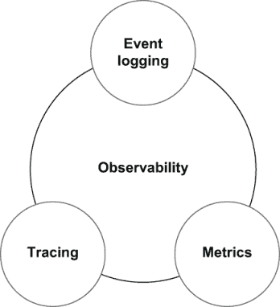

图 8.1 可观察性由三个主要方面组成：事件记录、指标和跟踪。这些方面结合在一起，提供了操作洞察力，使得正确管理系统成为可能。

### 8.1.1 事件记录

大多数开发者都熟悉日志的概念。随着代码的执行，可以输出日志消息来指示重要事件、错误或更改。每个事件日志都有时间戳，并且是特定系统组件内部操作的不可变记录。当发生罕见或不可预测的故障时，事件日志可能提供细粒度的上下文，指示出了什么问题。

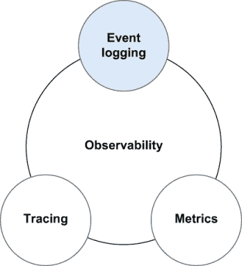

图 8.2 事件日志有时间戳，并提供特定系统组件内部操作的不可变记录。

在调试表现不当的应用程序时，通常的第一步是查看应用程序的日志以获取线索。日志是开发者观察和调试系统和应用程序的无价工具。日志和记录的保留也可能需要符合适用的行业标准。

对于 Kubernetes 来说，可观察性的一个基本方面是显示集群中所有各种 Pods 的日志输出。应用程序将有关其运行状态的调试信息输出到 stdout（标准输出），由 Kubernetes 捕获并保存到 Pod/容器运行的 Kubernetes 节点上的文件。可以使用 `kubectl logs <pod_name>` 命令显示特定 Pod 的日志。

为了说明日志、指标和跟踪的各个方面，我们将使用一个名为 Hot ROD 的共享出行应用程序作为示例.^(2) 让我们在 minikube 集群中启动该应用程序，以便我们可以查看其日志。以下是应用程序部署的清单。

列表 8.1 Hot ROD 应用程序部署 [(http://mng.bz/vzPJ)](https://shortener.manning.com/vzPJ)

```
apiVersion: v1
kind: List
items:
  - apiVersion: apps/v1
    kind: Deployment
    metadata:
      name: hotrod
    spec:
      replicas: 1
      selector:
        matchLabels:
          app: hotrod
      template:
        metadata:
          labels:
            app: hotrod
        spec:
          containers:
            - args: ["-m", "prometheus", "all"]
              image: jaegertracing/example-hotrod:latest
              name: hotrod
              ports:
                - name: frontend
                  containerPort: 8080
  - apiVersion: v1
    kind: Service
    metadata:
      name: hotrod-frontend
    spec:
      type: LoadBalancer
      ports:
        - port: 80
          targetPort: 8080
      selector:
        app: hotrod
```

使用以下命令部署 Hot ROD 应用程序：

```
$ minikube start
$ kubectl apply -f hotrod-app.yaml
deployment.apps/hotrod created
service/hotrod-frontend created

```

现在我们来看看 Pod 的日志消息：

```
$ kubectl get pods
NAME                      READY   STATUS    RESTARTS   AGE
hotrod-59c88cd9c7-dxd55   1/1     Running   0          6m4s

$ kubectl logs hotrod-59c88cd9c7-dxd55
2020-07-10T02:19:56.940Z  INFO  cobra@v0.0.3/command.go:792  Using Prometheus
                                                             as metrics
                                                             backend
2020-07-10T02:19:56.940Z  INFO  cobra@v0.0.3/command.go:762  Starting all
                                                             services
2020-07-10T02:19:57.048Z  INFO  route/server.go:57     Starting {"service": "route", "address": "http://0.0.0.0:8083"}
2020-07-10T02:19:57.049Z  INFO  frontend/server.go:67  Starting {"service": "frontend", "address": "http://0.0.0.0:8080"}
2020-07-10T02:19:57.153Z  INFO  customer/server.go:55  Starting {"service": "customer", "address": "http://0.0.0.0:8081"}
```

输出告诉我们，每个微服务（`路由`、`前端`和`客户`）都处于“启动”状态。但在此阶段，日志中并没有太多信息。而且，可能并不完全清楚每个微服务是否成功启动。

使用`minikube service hotrod-frontend`命令在您的工作站上为`hotrod-frontend`服务创建隧道，并在网页浏览器中打开 URL：

```
$ minikube service hotrod-frontend
|-----------|-----------------|-------------|-------------------------|
| NAMESPACE |      NAME       | TARGET PORT |           URL           |
|-----------|-----------------|-------------|-------------------------|
| default   | hotrod-frontend |          80 | http://172.17.0.2:31725 |
|-----------|-----------------|-------------|-------------------------|
🏃   Starting tunnel for service hotrod-frontend.
|-----------|-----------------|-------------|------------------------|
| NAMESPACE |      NAME       | TARGET PORT |          URL           |
|-----------|-----------------|-------------|------------------------|
| default   | hotrod-frontend |             | http://127.0.0.1:53457 |
|-----------|-----------------|-------------|------------------------|
🎉     Opening service default/hotrod-frontend in default browser...
```

这将打开一个网页浏览器到应用程序。当它打开时，点击每个按钮以模拟为每位客户请求一次乘车。

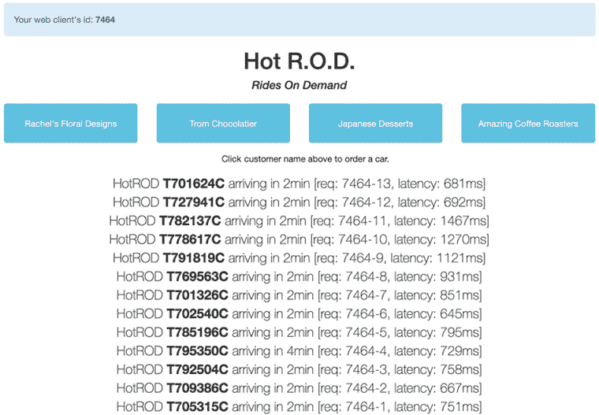

图 8.3 Hot ROD 示例应用程序的截图，该应用程序模拟了一个拼车系统。点击页面顶部的按钮将启动一个调用多个微服务的过程，以将客户与司机和路线匹配起来。

现在，在另一个终端窗口中，让我们查看应用程序的日志：

```
$ kubectl logs hotrod-59c88cd9c7-dxd55
:
2020-07-10T03:02:13.012Z  INFO  frontend/server.go:81  HTTP request received             {"service": 
                                                                                          "frontend", "method": "GET", "url": "/dispatch?customer=567&nonse=0.6850439192313089"}
2020-07-10T03:02:13.012Z   INFO   customer/client.go:54    Getting customer              {"service": 
                                                                                          "frontend", "component": "customer_client", "customer_id": "567"}
http://0.0.0.0:8081/customer?customer=567
2020-07-10T03:02:13.015Z   INFO   customer/server.go:67    HTTP request received         {"service": 
                                                                                          "customer", "method": "GET", "url": "/customer?customer=567"}
2020-07-10T03:02:13.015Z   INFO   customer/database.go:73  Loading customer              {"service": 
                                                                                          "customer", "component": "mysql", "customer_id": "567"}
2020-07-10T03:02:13.299Z   INFO   frontend/best_eta.go:77  Found customer                {"service": 
                                                                                          "frontend", "customer": {"ID":"567","Name":"Amazing Coffee Roasters","Location":"211,653"}}
2020-07-10T03:02:13.300Z   INFO   driver/client.go:58      Finding nearest drivers       {"service": 
                                                                                          "frontend", "component": "driver_client", "location": "211,653"}
2020-07-10T03:02:13.301Z   INFO   driver/server.go:73      Searching for nearby drivers  {"service": 
                                                                                          "driver", "location": "211,653"}
2020-07-10T03:02:13.324Z   INFO   driver/redis.go:67       Found drivers                 {"service": 
                                                                                          "driver", "drivers": ["T732907C", "T791395C", "T705718C", 
                                                                                          "T724516C", "T782991C", "T703350C", "T771654C", "T724823C", 
                                                                                          "T718650C", "T785041C"]}
:
```

日志记录非常灵活，它还可以用来推断关于应用程序的大量信息。例如，您可以在日志片段的第一行看到`HTTP 请求` `接收`，这表明一个前端服务请求。您还可以看到与加载客户信息、定位最近的司机等相关日志消息。每个日志消息上都有一个时间戳，这样您就可以通过从结束时间减去开始时间来计算特定请求所需的时间量。您还可以计算在给定时间间隔内处理了多少个请求。要进行此类大规模日志分析，您需要集群级别的日志记录^(3)以及像 Elasticsearch 加 Kibana^(4)或 Splunk.^(5)这样的中央日志后端。

在 Hot ROD 应用程序中点击更多按钮。我们可以通过计算前端服务收到的`HTTP 请求接收`消息的数量来确定请求数量：

```
$ kubectl logs hotrod-59c88cd9c7-sdktk | grep -e "received" | grep frontend | wc -l
       7
```

从这个输出中，我们可以看到自 Pod 启动以来已经收到了七个前端请求。

然而，尽管日志记录既关键又灵活，但它有时并不是观察系统某些方面的最佳工具。日志是可观察性的一个非常低级方面。使用日志消息来推导出诸如处理请求数量、每秒请求数等指标可能相当昂贵，并且可能无法提供您所需的所有信息。此外，如果没有对代码的深入理解，仅通过解析日志消息来确定系统在任何给定时刻的状态可能相当棘手，甚至不可能。通常，日志消息来自系统的不同线程和子进程，必须将它们相互关联以跟踪系统的当前状态。因此，虽然日志很重要，但 Pod 日志只是刚刚触及 Kubernetes 可观察性能力的表面。

在下一节中，我们将看到如何使用指标来观察系统的属性，而不是进行低级日志解析。

练习 8.1

使用 `kubectl logs` 命令显示 Hot ROD Pod 的日志消息，并查找任何错误消息（提示：使用 `grep` 查找字符串 `ERROR`）。如果有，你看到了哪些类型的错误？

### 8.1.2 指标

可观测性的另一个关键方面是衡量系统或应用程序性能和操作的指标。在基本层面上，指标是一组键值对，提供了关于系统操作的详细信息。你可以将指标视为系统每个组件的可观察属性。一些适用于所有组件的核心资源指标包括 CPU、内存、磁盘和网络利用率。其他指标可能特定于应用程序，例如遇到特定类型错误的数量或等待处理的队列中项的数量。

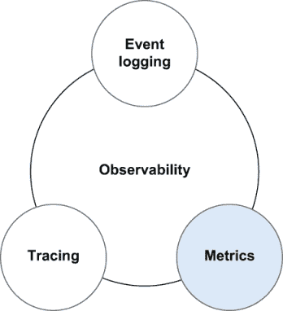

图 8.4 指标是一组键值对，提供了关于系统操作的详细信息。

Kubernetes 使用一个名为 `metrics-server` 的可选组件提供基本指标。可以通过运行以下命令在 minikube 中启用 `metrics-server`：

```
$ minikube addons enable metrics-server
🌟  The 'metrics-server' addon is enabled
```

一旦启用 `metrics-server` 并等待几分钟以收集足够的指标，你就可以使用 `kubectl top nodes` 和 `kubectl top pods` 命令访问 `metrics-server` 的 [数据](https://github.com/gitopsbook/sample-app-deployment)。

列表 8.2 `kubectl top nodes` 和 `kubectl top pods` 的输出

```
$ kubectl top nodes
NAME       CPU(cores)   CPU%   MEMORY(bytes)   MEMORY%
minikube   211m         5%     805Mi           40%

$ kubectl top pods --all-namespaces
NAMESPACE     NAME                               CPU(cores)   MEMORY(bytes)
default       hotrod-59c88cd9c7-sdktk            0m           4Mi
kube-system   coredns-66bff467f8-gk4zp           4m           8Mi
kube-system   coredns-66bff467f8-qqxdv           4m           20Mi
kube-system   etcd-minikube                      28m          44Mi
kube-system   kube-apiserver-minikube            62m          260Mi
kube-system   kube-controller-manager-minikube   26m          63Mi
kube-system   kube-proxy-vgzw2                   0m           22Mi
kube-system   kube-scheduler-minikube            5m           12Mi
kube-system   metrics-server-7bc6d75975-lc5h2    0m           9Mi
kube-system   storage-provisioner                0m           35Mi
```

此输出显示了节点（minikube）和运行 Pods 的 CPU 和内存利用率。

除了所有 Pods 都有的通用 CPU 和内存利用率之外，应用程序可以通过公开一个返回键值对形式指标列表的 HTTP `metrics endpoint` 来提供自己的指标。让我们看看我们在上一节中使用的 Hot ROD 应用程序指标端点。

在另一个终端中，使用 `kubectl port-forward` 命令将你的工作站上的一个端口转发到 Hot ROD 的指标端点，该端点在 Pod 的 8083 端口上公开：

```
$ kubectl port-forward hotrod-59c88cd9c7-dxd55 8083
Forwarding from 127.0.0.1:8083 -> 8083
Forwarding from [::1]:8083 -> 8083
```

一旦建立端口转发连接，请在您的网页浏览器中打开 http://localhost:8083/metrics，或者从命令行运行 `curl http://localhost:8083/metrics`。

列表 8.3 Hot ROD 指标端点的输出

```
$ curl http://localhost:8083/metrics
# HELP go_gc_duration_seconds A summary of the GC invocation durations.
# TYPE go_gc_duration_seconds summary
go_gc_duration_seconds{quantile="0"} 6.6081e-05
go_gc_duration_seconds{quantile="0.25"} 8.1335e-05
go_gc_duration_seconds{quantile="0.5"} 0.000141919
go_gc_duration_seconds{quantile="0.75"} 0.000197202
go_gc_duration_seconds{quantile="1"} 0.000371112
go_gc_duration_seconds_sum 0.000993336
go_gc_duration_seconds_count 6
# HELP go_goroutines Number of goroutines that currently exist.
# TYPE go_goroutines gauge
go_goroutines 26
# HELP go_info Information about the Go environment.
# TYPE go_info gauge
go_info{version="go1.14.4"} 1
:
:
```

指标本身提供了在特定时间点系统组件性能和操作的快照。通常，指标会定期收集并存储在时间序列数据库中，以观察指标的历史趋势。在 Kubernetes 中，这通常由一个名为 Prometheus 的 Cloud Native Computing Foundation (CNCF) 开源项目来完成（[`prometheus.io`](https://prometheus.io)）。

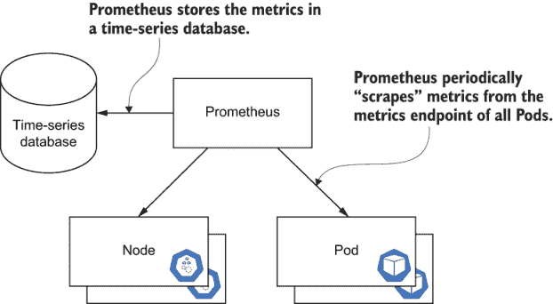

图 8.5 单个 Prometheus 部署可以抓取集群中节点和 Pods 的指标端点。指标以可配置的间隔抓取并存储在时间序列数据库中。

如本章前面所述，一些指标可以通过检查日志消息来推断。然而，让系统或应用程序直接测量其指标并提供程序性访问以查询指标值更为高效。

练习 8.2

查找不同 HTTP 请求的数量。（提示：搜索名为`http_requests`的指标）。应用程序处理了多少`GET` `/dispatch`、`GET` `/customer`和`GET` `/route`请求？您如何从应用程序的日志中获取类似的信息？

### 8.1.3 跟踪

通常，分布式跟踪数据需要一个特定于应用程序的代理，该代理知道如何收集被跟踪代码的详细执行路径。分布式跟踪框架捕获系统内部运行的详细数据，从初始终端用户请求开始，通过可能数十（数百？）次调用到不同的

微服务和其他外部依赖项，可能托管在另一个系统上。而指标通常提供特定系统中的应用程序的聚合视图，而跟踪数据通常提供单个请求执行流程的详细情况，可能跨越多个服务和系统。在微服务时代，一个“应用程序”可能利用来自数十或数百个服务的功能，跨越多个操作边界，这一点尤为重要。如前文第 8.1.1 节所述，Hot ROD 应用程序由四个不同的微服务（前端、客户、司机和路线）和两个模拟存储后端（MySql 和 Redis）组成。

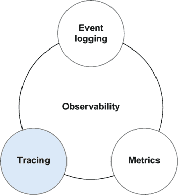

图 8.6 跟踪捕获了系统内部运行的详细数据。

为了说明这一点，让我们看看一个流行的跟踪框架 Jaeger，以及第 8.1.1 节和第 8.1.2 节中的示例 Hot ROD 应用程序。首先，在 minikube 集群上安装 Jaeger，并使用以下命令验证它是否成功运行：

```
$ kubectl apply -f https://raw.githubusercontent.com/gitopsbook/resources/master/chapter-08/jaeger/jaeger-all-in-one.yaml
deployment.apps/jaeger created
service/jaeger-query created
service/jaeger-collector created
service/jaeger-agent created
service/zipkin created

$ kubectl get pods -l app=jaeger
NAME                     READY   STATUS    RESTARTS   AGE
jaeger-f696549b6-f7c9h   1/1     Running   0          2m33s
```

现在 Jaeger 正在运行，我们需要更新 Hot ROD 应用程序部署，以便将跟踪数据发送到 Jaeger。这可以通过简单地向`hotrod`容器添加`JAEGER_AGENT_HOST`环境变量来完成，指示在前一步骤中由 jaeger-all-in-one.yaml 部署的`jaeger-agent`服务：

```
$ diff --context=4 hotrod-app.yaml hotrod-app-jaeger.yaml
*** hotrod-app.yaml             2020-07-20 17:57:07.000000000 -0700
--- hotrod-app-jaeger.yaml      2020-07-20 17:57:07.000000000 -0700
***************
*** 22,29 ****
--- 22,32 ----
                  #- "--fix-disable-db-conn-mutex"
                  - "all"
                image: jaegertracing/example-hotrod:latest
                name: hotrod
+               env:
+                 - name: JAEGER_AGENT_HOST
+                   value: "jaeger-agent"
                ports:
                  - name: frontend
                    containerPort: 8080
                  - name: customer
***************
*** 41,45 ****
          - port: 80
            targetPort: 8080
        selector:
          app: hotrod
!       type: LoadBalancer
\ No newline at end of file
--- 44,48 ----
          - port: 80
            targetPort: 8080
        selector:
          app: hotrod
!       type: LoadBalancer
```

由于我们已经配置了`hotrod-app`向 Jaeger 发送数据，我们需要通过打开`hotrod-app` UI 并点击几个按钮来生成一些跟踪数据，就像我们在事件日志部分所做的那样。

使用`minikube service hotrod-frontend`命令在您的工作站上为`hotrod-frontend`服务创建隧道，并在网络浏览器中打开 URL：

```
$ minikube service hotrod-frontend
|-----------|-----------------|-------------|------------------------|
| NAMESPACE |      NAME       | TARGET PORT |          URL           |
|-----------|-----------------|-------------|------------------------|
| default   | hotrod-frontend |             | http://127.0.0.1:52560 |
|-----------|-----------------|-------------|------------------------|
🎉 Opening service default/hotrod-frontend in default browser...
```

这将打开一个网络浏览器到应用程序。当它打开时，点击每个按钮以模拟为每位客户请求一次乘车。

现在我们应该有一些跟踪数据，通过运行`minikube` `service` `jaeger-query`来打开 Jaeger UI：

```
$ minikube service jaeger-query
|-----------|--------------|-------------|-----------------------------|
| NAMESPACE | NAME | TARGET PORT | URL |
|-----------|--------------|-------------|-----------------------------|
| default   | jaeger-query | query-http  | http://192.168.99.120:30274 |
|-----------|--------------|-------------|-----------------------------|
🎉 Opening service default/jaeger-query in default browser...
```

这将在你的默认浏览器中打开 Jaeger UI。或者，你也可以打开之前输出中列出的 URL（例如 http://127.0.0.1:51831）。当你完成本章的 Jaeger 练习后，你可以按 Ctrl-C 关闭到`jaeger-query`服务的隧道。

从 Jaeger UI 中，你可以选择服务“前端”和操作“HTTP GET /dispatch”，然后点击查找跟踪以获取所有`GET` `/dispatch`调用图跟踪的列表。

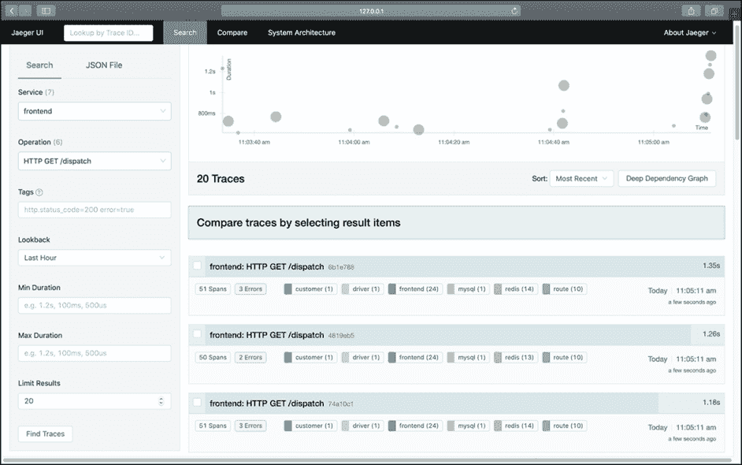

图 8.7 Jaeger 搜索标签显示在过去一小时中前端服务发生的`GET` `/dispatch`请求。右上角的图表显示了每个请求随时间的变化持续时间，每个圆圈的大小代表每个请求中的跨度数量。右下角列出了所有请求，并且可以点击每一行以获取更多详细信息。

从那里，你可以选择要检查的跟踪。以下屏幕截图显示了 Jaeger UI 中前端`GET` `/dispatch`请求的调用图。

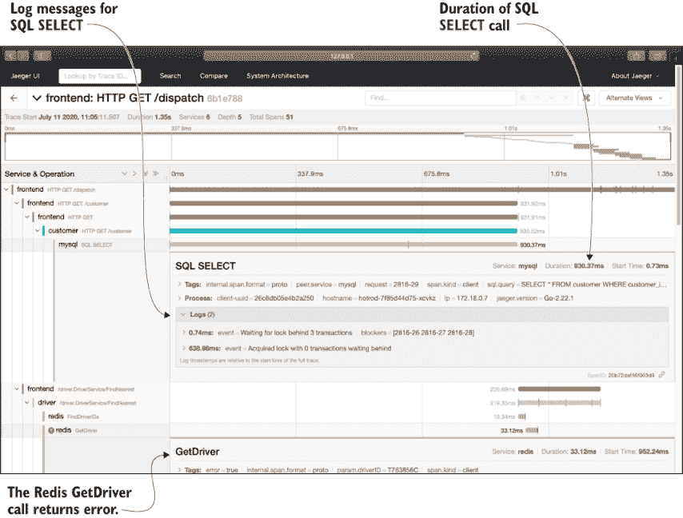

图 8.8 在这个`GET` `/dispatch`跟踪的详细视图下，Jaeger 显示了从原始请求发起的所有调用跨度。这个例子展示了诸如 SQL `SELECT`调用的持续时间以及 Redis `GetDriver`调用返回错误等详细信息。

如图 8.8 所示，关于`GET` `/dispatch`请求处理有很多有价值的信息。从这里，你可以看到正在调用的代码的分解，它的响应（成功或失败），以及它花费了多长时间。例如，在屏幕截图中，这个请求使用的 SQL 查询耗时 930.37 毫秒。这是否合理？应用程序开发者可以进行更多测试并深入挖掘，看看这个查询是否可以优化，或者代码的哪个区域可以通过额外的优化受益。

再次强调，正如之前提到的，开发者可以在他们的代码中添加日志语句，以便在应用程序日志中拥有“跟踪数据”，但这是一种成本高且效率低的方法。使用合适的跟踪框架要理想得多，并且从长远来看会提供更好的结果。

如你所想，跟踪数据可能相当大，并且可能无法为每个单独的请求收集数据。跟踪数据通常以配置的速率进行采样，并且可能比应用程序日志或指标有更短的保留期。

跟踪与 GitOps 有什么关系？老实说，关系不大。但跟踪是可观察性的一个基本且不断发展的部分，有许多新工具和服务的发展有助于提供、管理和分析分布式跟踪数据，因此了解它在整体可观察性系统中的位置很重要。也有可能在未来，跟踪工具（如 OpenTelemetry）将通过扩展到覆盖指标和日志来用于更多可观察性的方面。

练习 8.3

使用 Jaeger 分布式跟踪平台在 Hot ROD 中识别性能瓶颈.^(6) 要这样做，请在浏览器窗口中打开 Hot ROD UI。在 Hot ROD UI 中点击几个客户（例如日本甜点和惊人的咖啡烘焙师）以在应用程序中安排行程。实际上，尽情点击不同的客户按钮。

一旦你对应用程序进行了一些操作，请按照本节前面所述打开 Jaeger UI。使用搜索功能查找各种服务和请求的跟踪记录以回答以下问题。你可能需要将“限制结果”更改为更大的值，比如 200：

1.  你是否有包含错误的跟踪记录？如果有，是哪个组件导致了错误？

1.  当你缓慢或非常快速地点击客户按钮时，你是否注意到请求延迟有任何差异？你是否有一些超过 1000 毫秒的调度请求？

1.  使用 Jaeger 搜索根据 Hot ROD 应用程序使用驾驶员 ID（粗体显示）的最长延迟跟踪记录。提示：使用“标签”过滤器并搜索“driver=T123456C”，其中“T123456C”是您最长延迟请求的驾驶员 ID。

1.  应用程序在哪里花费的时间最多？哪个跨度是最长的？

1.  长跨度日志中说了什么？提示：日志消息以`Waiting` `for...`开头。

1.  根据你在上一个问题中发现的内容，什么可能影响了 Hot ROD 应用程序的性能？请检查以下链接中的代码：

    [`mng.bz/QmRw`](https://shortener.manning.com/QmRw)

练习 8.4

通过向 `hotrod` 容器添加 `--fix-disable-db-conn-mutex` 参数并更新部署来解决 Hot ROD 应用程序的性能瓶颈。（提示：查看 GitHub 上的 hotrod-app-jaeger.yaml 文件，并取消注释相应的行。）这模拟了在代码中修复数据库锁竞争：

1.  通过添加 `--fix-disable-db-conn-mutex` 参数更新 `hotrod` 容器。

1.  重新部署更新的 hotrod-app-jaeger.yaml 文件。

1.  测试 `hotrod` UI。你是否注意到每个调度的延迟有差异？你是否能让调度请求超过 1000 毫秒？

1.  查看 Jaeger UI。你是否注意到跟踪记录的差异？添加 `--fix-disable-db-conn-mutex` 参数后有什么不同？

要深入了解 Jaeger 和 Hot ROD 示例应用程序，请参阅 README 页面顶部的博客和视频链接.^(7)

### 8.1.4 可视化

所讨论的可观察性的各个方面实际上都是关于系统提供自身数据。这累积了大量的数据，可能难以理解。可观察性的最后一个方面是可视化工具，它有助于将所有这些可观察性数据转换为信息和洞察。

许多工具提供了可观察性数据的可视化。在上一节中，我们讨论了 Jaeger，它提供了跟踪数据的可视化。但现在，让我们看看另一个提供 Kubernetes 集群当前运行状态可视化的工具，即 K8s 仪表板。

您可以使用以下命令启用 K8s 仪表板 minikube 插件^(8)：

```
$ minikube stop                         ❶
✋   Stopping "minikube" in docker ...
🛑   Powering off "minikube" via SSH ...
🛑   Node "minikube" stopped.
$ minikube addons enable dashboard      ❷
🌟   The 'dashboard' addon is enabled
```

❶ 如果 minikube 已经在运行，则停止它

❷ 启用仪表板插件

一旦启用，您就可以启动 minikube 集群并显示仪表板：

```
$ minikube start
😁  minikube v1.11.0 on Darwin 10.15.5
✨  Using the docker driver based on existing profile
👍  Starting control plane node minikube in cluster minikube
✨  minikube 1.12.0 is available! Download it: https://github.com/kubernetes/minikube/releases/tag/v1.12.0
💡  To disable this notice, run: 'minikube config set WantUpdateNotification false'

🔄  Restarting existing docker container for "minikube" ...
🐳  Preparing Kubernetes v1.18.3 on Docker 19.03.2 ...
     ▪  kubeadm.pod-network-cidr=10.244.0.0/16
🔎  Verifying Kubernetes components...
🌟  Enabled addons: dashboard, default-storageclass, metrics-server, storage-provisioner   ❶
🏄  Done! kubectl is now configured to use "minikube"
$ minikube dashboard
```

❶ 仪表板插件与 minikube 一起启动。

命令`minikube dashboard`将打开一个类似于图 8.9 的浏览器窗口。

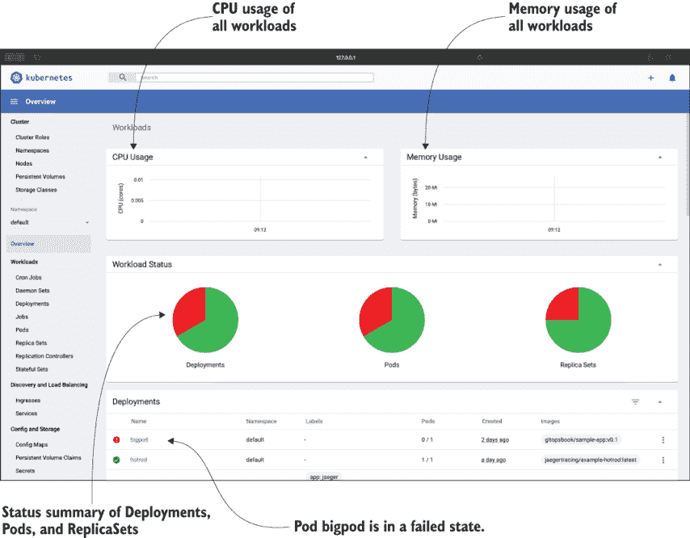

图 8.9 Kubernetes 仪表板的概览页面显示了集群上当前运行的工作负载的 CPU 和内存使用情况，以及每种类型工作负载的摘要图表（部署、Pod 和 ReplicaSet）。页面右下角的面板显示了每个工作负载`GET` `/dispatch`的列表，并且可以点击每一行以获取更多详细信息。

Kubernetes 仪表板提供了对 Kubernetes 集群许多不同方面的可视化，包括您的部署、Pod 和 ReplicaSet 的状态。我们可以看到`bigpod`部署存在问题。看到这一点后，Kubernetes 管理员应该采取行动，将此部署恢复到健康状态。

练习 8.5

在 minikube 上安装仪表板插件。打开仪表板 UI，探索可用的不同面板，并执行以下操作：

1.  切换到所有命名空间视图。minikube 上运行的总 Pod 数量是多少？

1.  选择 Pod 面板。通过点击 Pod 面板右上角的过滤器图标，过滤 Pod 列表以包含名称中带有“dns”的 Pod。通过点击该 Pod 的动作图标并选择删除来删除一个与 DNS 相关的 Pod。会发生什么？

1.  在仪表板 UI 的右上角点击加号图标（+），然后选择“从表单创建”。使用`nginx`镜像创建一个新的包含三个 Pods 的 NGINX 部署。尝试使用“从输入创建”和“从文件创建”选项，也许可以使用前面章节中的代码列表。

### 8.1.5 可观察性在 GitOps 中的重要性

好的，现在您已经知道了什么是可观察性，以及它通常是一件好事，但您可能想知道为什么一本关于 GitOps 的书会专门用一整章来介绍可观察性。可观察性跟 GitOps 有什么关系？

正如第二章所讨论的，使用 Kubernetes 的声明式配置可以精确地定义系统的期望状态。但您如何知道系统的运行状态是否与期望状态一致？您如何知道特定的部署是否成功？更广泛地说，您如何判断系统是否按预期工作？这些问题是 GitOps 和可观察性应该帮助解决的问题。

Kubernetes 中有几个可观察性的方面对于 GitOps 系统良好运行和回答关于系统的关键问题至关重要：

+   应用健康状态—应用是否正常运行？如果应用的新版本正在使用 GitOps 进行部署，系统是否“更好”于之前？

+   应用同步状态—应用的运行状态是否与在部署 Git 仓库中定义的期望状态相同？

+   配置漂移—应用配置是否在声明式 GitOps 系统之外（如手动或命令式）进行了更改？

+   GitOps 变更日志—最近对 GitOps 系统做了哪些更改？谁做的，出于什么原因？

本章的其余部分将涵盖 Kubernetes 系统和应用的可观察性如何使 GitOps 系统能够回答这些问题，以及 GitOps 系统如何反过来提供可观察性功能。

## 8.2 应用健康状态

可观察性与 GitOps 的第一和最重要的关联方式是观察应用健康状态。在本章开头，我们讨论了运营一个系统实际上就是管理该系统，使其整体随着时间的推移不断改进和变得更好，而不是变得更糟。GitOps 在系统期望状态（假设比当前状态“更好”）提交到 Git 仓库，然后 GitOps 操作员将此期望状态应用到系统中，使其成为当前状态的地方至关重要。

例如，想象一下，当在本章前面讨论的 Hot ROD 应用最初部署时，它有相对较小的运行需求。然而，随着时间的推移，随着应用变得越来越受欢迎，数据集增长，分配给 Pod 的内存不再足够。Pod 会定期耗尽内存并被终止（称为“OOMKilled”的事件）。Hot ROD 应用的应用健康状态会显示它定期崩溃和重启。系统操作员可以检查 Hot ROD 应用的 Git 部署仓库中的更改，以增加其请求的内存。然后 GitOps 操作员将应用该更改，增加运行中的 Hot ROD 应用的内存。

也许我们可以就此结束。毕竟，有人对系统进行了更改，GitOps 应该只是按照指示行事。但假设提交的更改实际上使事情变得更糟呢？假设在部署最新更改后，应用重新启动但开始返回比之前更多的错误？或者更糟的是，假设它根本无法重新启动？在这个例子中，如果操作员为 Hot ROD 应用增加了过多的内存，导致集群上运行的其他应用耗尽内存怎么办？

使用 GitOps，我们至少希望检测到那些在部署后系统“变得更糟”的条件，并且至少提醒用户他们可能应该考虑回滚最近的变化。这只有在系统和应用程序具有 GitOps 操作员可以观察到的强大可观察性特征的情况下才可能实现。

### 8.2.1 资源状态

在基本层面上，Kubernetes 的一个关键特性是它如何通过声明性配置同时维护所需的配置和活动状态，从而使其内部状态可观察。这允许在任何时候检查每个 Kubernetes 资源，以查看资源是否处于所需状态。每个组件或资源在任何给定时间都将处于特定的操作状态。例如，资源可能处于`INITIALIZED`或`NOT READY`状态。它也可能处于`PENDING`、`RUNNING`或`COMPLETED`状态。通常，资源的状态与其类型特定。

应用程序健康的第一方面是确定与应用程序相关的所有 Kubernetes 资源都处于良好状态。例如，所有 Pod 是否都已成功调度，并且它们是否处于`Running`状态？让我们看看如何确定这一点。

Kubernetes 为每个 Pod 提供了额外的信息，以指示 Pod 是否健康。让我们在`etcd` Pod 上运行`kubectl describe`命令：

```
$ kubectl describe pod etcd-minikube -n kube-system
Name:                 etcd-minikube
Namespace:            kube-system
Priority:             2000000000
Priority Class Name:  system-cluster-critical
Node:                 minikube/192.168.99.103
Start Time:           Mon, 10 Feb 2020 22:54:14 -0800
:
Status:               Running
IP:                   192.168.99.103
IPs:
  IP:           192.168.99.103
Controlled By:  Node/minikube
Containers:
  etcd:
    :
    Command:
      :
    State:          Running
      Started:      Mon, 10 Feb 2020 22:54:05 -0800
    Ready:          True
    Restart Count:  0
    Liveness:       http-get http://127.0.0.1:2381/health delay=15s timeout=15s period=10s #success=1 #failure=8
    Environment:    <none>
    Mounts:
      :
Conditions:
  Type              Status
  Initialized       True
  Ready             True
  ContainersReady   True
  PodScheduled      True
Volumes:
  :
QoS Class:         BestEffort
Node-Selectors:    <none>
Tolerations:       :NoExecute
Events:            <none>
```

这个输出已被截断以节省空间，但请仔细查看它并与您 minikube 的输出进行比较。您是否看到了 Pod 的任何可能有助于可观察性的属性？最上面一个非常重要（且明显）的一个是`Status: Running`，这表示 Pod 所处的阶段。Pod 阶段是对 Pod 在其生命周期中位置的简单、高级总结。条件数组、原因和消息字段以及单个容器状态数组包含了关于 Pod 状态的更多详细信息。

表 8.1 Pod 阶段

| 阶段值 | 描述 |
| --- | --- |
| `Pending` | Kubernetes 系统已接受 Pod，但一个或多个容器镜像尚未创建。这包括在调度之前的时间以及通过网络下载镜像所花费的时间，这可能需要一段时间。 |
| `Running` | Pod 已被绑定到节点，并且所有容器都已创建。至少有一个容器仍在运行或正在启动或重启过程中。 |
| `Succeeded` | Pod 中的所有容器都已成功终止，并且不会被重新启动。 |
| `Failed` | Pod 中的所有容器都已完成，并且至少有一个容器已失败终止。容器要么以非零状态退出，要么被系统终止。 |
| `Unknown` | 由于某种原因，无法获取 Pod 状态，通常是由于与 Pod 的主机通信错误。 |

这就是可观察性：Pod 的内部状态可以轻松查询，因此可以做出关于控制系统的决策。对于 GitOps 来说，如果部署了应用程序的新版本，查看由此产生的新 Pod 的状态以确保其成功是非常重要的。

但 Pod 状态（阶段）只是一个总结，要了解 Pod 为什么处于特定状态，你需要查看 `Conditions`。Pod 有四个条件，可以是 `True`、`False` 或 `Unknown`。

表 8.2 Pod 条件

| 阶段值 | 描述 |
| --- | --- |
| `PodScheduled` | Pod 已成功调度到集群中的某个节点。 |
| `Initialized` | 所有 init 容器都已成功启动。 |
| `ContainersReady` | Pod 中的所有容器都已就绪。 |
| `Ready` | Pod 可以提供服务，应该被添加到所有匹配服务的负载均衡池中。 |

练习 8.6

使用 `kubectl describe` 命令显示在 `kube-system` 命名空间中运行的其它 Pods 的信息。

Pod 可能进入不良状态的一个基本例子是提交一个请求比集群中可用的资源更多的资源的 Pod。这将导致 Pod 进入 `Pending` 状态。可以通过运行 `kubectl describe pod <pod_name>` 来“观察”Pod 的状态。

列表 8.4 http://mng.bz/yYZG

```
apiVersion: v1
kind: Pod
metadata:
  name: bigpod
spec:
  containers:
    - command:
        - /app/sample-app
      image: gitopsbook/sample-app:v0.1
      name: sample-app
      ports:
        - containerPort: 8080
      resources:
        requests:
          memory: "999Gi"    ❶
          cpu: "99"          ❷
```

❶ 请求了不可能的内存量

❷ 请求了不可能数量的 CPU 核心

如果你应用此 YAML 并检查 Pod 状态，你会注意到 Pod 是 `Pending` 状态。当你运行 `kubectl describe` 时，你会看到 Pod 处于 `Pending` 状态，因为 minikube 集群无法满足 999 GB RAM 或 99 个 CPU 的请求：

```
$ kubectl apply -f bigpod.yaml
deployment.apps/bigpod created

$ kubectl get pod
NAME                      READY   STATUS    RESTARTS   AGE
bigpod-7848f56795-hnpjx   0/1     Pending   0          5m41s

$ kubectl describe pod bigpod-7848f56795-hnpjx
Name:           bigpod-7848f56795-hnpjx
Namespace:      default
Priority:       0
Node:           <none>
Labels:         app=bigpod
                pod-template-hash=7848f56795
Annotations:    <none>
Status:         Pending                                                  ❶
IP:
IPs:            <none>
Controlled By:  ReplicaSet/bigpod-7848f56795
Containers:
  bigpod:
    Image:      gitopsbook/sample-app:v0.1
    Port:       8080/TCP
    Host Port:  0/TCP
    Command:
      /app/sample-app
    Requests:
      cpu:        99
      memory:     999Gi
    Environment:  <none>
    Mounts:
      /var/run/secrets/kubernetes.io/serviceaccount from default-token-8dzwz (ro)
Conditions:
  Type           Status
  PodScheduled   False                                                   ❷

Volumes:
  default-token-8dzwz:
    Type:        Secret (a volume populated by a Secret)
    SecretName:  default-token-8dzwz
    Optional:    false
QoS Class:       Burstable
Node-Selectors:  <none>
Tolerations:     node.kubernetes.io/not-ready:NoExecute for 300s
                 node.kubernetes.io/unreachable:NoExecute for 300s
Events:
  Type     Reason            Age        From               Message       ❸
  ----     ------            ----       ----               -------
  Warning  FailedScheduling  <unknown>  default-scheduler  0/1 nodes are available: 1 Insufficient cpu, 1 Insufficient memory.
  Warning  FailedScheduling  <unknown>  default-scheduler  0/1 nodes are available: 1 Insufficient cpu, 1 Insufficient memory.
```

❶ Pod 状态是 Pending。

❷ PodScheduled 条件为 False。

❸ 没有足够的内存或 CPU 的节点可以调度 Pod。

练习 8.7

使用更合理的 CPU 和内存请求更新 bigpod.yaml，并重新部署 Pod。（提示：将 CPU 更改为 `99m`，内存更改为 `999Ki`。）在更新的 Pod 上运行 `kubectl describe`，并将输出与更改前的输出进行比较。更新的 Pod 的 `Status`、`Conditions` 和 `Events` 是什么？

### 8.2.2 准备就绪和活跃性

如果你仔细查看表 8.2 中列出的 Pod `Conditions`，可能会发现一些不同之处。`Ready` 状态声称“Pod 可以提供服务。”它是如何知道的？如果 Pod 需要执行一些初始化怎么办？Kubernetes 如何知道 Pod 已经就绪？答案是 Pod 本身会根据其自身的应用特定逻辑通知 Kubernetes 它已经就绪。

Kubernetes 使用就绪探针来决定何时 Pod 可用于接受流量。Pod 中的每个容器都可以指定一个就绪探针，形式为命令或 HTTP 请求，以指示容器何时为 `Ready`。容器需要提供关于其内部状态的可观察性。一旦所有 Pod 容器都 `Ready`，则 Pod 本身被认为是 `Ready`，可以被添加到匹配服务的负载均衡器中，并开始处理请求。

同样，每个容器可以指定一个存活探针，以指示容器是否存活，例如，是否处于某种死锁状态。Kubernetes 使用存活探针来确定何时重启进入不良状态的容器。

因此，这里再次提到了 Kubernetes 内置的可观察性的一个方面。应用程序 Pod 通过就绪和存活探针提供其内部状态的可视性，以便 Kubernetes 系统可以决定如何控制它们。应用程序开发者必须正确实现这些探针，以便应用程序提供其操作的正确可观察性。

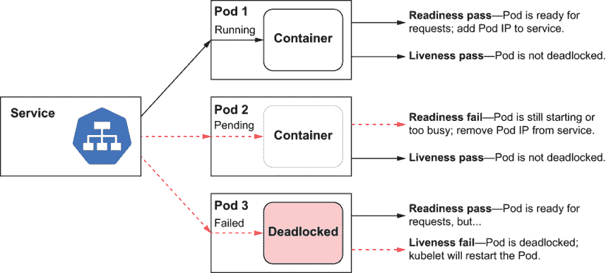

图 8.10 Kubernetes 使用就绪和存活探针来确定哪些 Pod 可用于接受流量。Pod 1 处于 `Running` 状态，就绪和存活探针都通过。Pod 2 处于 `Pending` 状态，尽管存活探针通过，但就绪探针未通过，因为 Pod 正在启动。Pod 3 通过就绪探针但未通过存活探针，这意味着它可能很快会被 kubelet 重启。

练习 8.8

创建一个 Pod 规范，使用初始化容器创建一个文件并配置应用程序容器的存活和就绪探针，以期望该文件存在。创建 Pod 后，观察其行为。进入 Pod 删除文件并观察其行为。

### 8.2.3 应用程序监控和警报

除了状态和就绪/存活之外，应用程序通常有一些关键的指标可以用来确定它们的整体健康状况。这是运营监控和警报的基础：监视一组指标，并在它们偏离允许值时触发警报。但应该监控哪些指标，以及允许的值是什么？

幸运的是，已经对这个主题进行了大量研究，并在其他书籍和文章中得到了很好的覆盖。Rob Ewaschuk 将“四个黄金信号”描述为在高级别上最重要的指标。这提供了一个有用的框架来思考指标：^(9)

+   *延迟*—处理请求所需的时间

+   *流量*—对系统需求的衡量

+   *错误*—未成功请求的比率

+   *饱和度*—你的服务“多满”

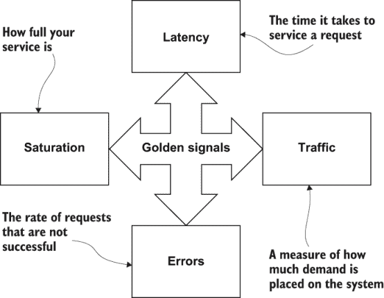

图 8.11 四个“黄金信号”，延迟、流量、错误和饱和度，是衡量系统整体健康状况的关键指标。每个指标都衡量系统的一个特定操作方面。系统中的任何给定问题都可能通过负面影响一个或多个“黄金信号”指标来表现出来。

布伦丹·格雷格提出了用于描述系统资源性能（如基础设施，例如 Kubernetes 节点）的 USE 方法^(10)。

+   *利用率*—资源忙于服务工作的平均时间

+   *饱和度*—资源额外工作量的程度，通常排队

+   *错误*—错误事件的计数

对于请求驱动的应用程序（如微服务），汤姆·威尔基定义了 RED 方法^(11)。

+   *速率*—服务每秒处理的请求数量

+   *错误*—每秒失败的请求数量

+   *持续时间*—每个请求所需时间的分布

虽然通过指标确定应用程序健康状况的更深入讨论超出了本书的范围，但我们强烈推荐阅读这里总结的三个相关脚注参考文献。

一旦你确定了评估应用程序健康状况的指标，你需要监控它们，并在它们超出允许值时生成警报。在传统的运营环境中，这通常由一个人类操作员盯着仪表板来完成，但可能由一个自动化的系统来完成。如果监控检测到问题，就会发出警报，触发值班工程师检查系统。值班工程师分析系统并确定解决警报的正确行动方案。这可能包括停止向服务器群集推出新版本，或者甚至回滚到上一个版本。

所有这些都需要时间，并延迟了系统恢复到最佳运行状态。如果 GitOps 系统能帮助改善这种情况呢？

考虑所有 Pod 都成功启动的情况。所有就绪性检查都成功了，但一旦应用程序开始处理，处理每个请求所需的时间突然增加了两倍（RED 方法的持续时间）。可能是因为最近的代码更改引入了一个性能错误，这正在降低应用程序的性能。

理想情况下，这样的性能问题应该在预生产测试期间被发现。如果没有，GitOps 运营商和部署机制是否可以自动停止或回滚部署，如果特定的黄金信号指标突然恶化并偏离既定的基线？

这在 8.3 节中作为高级可观测性用例讨论的一部分进行了更详细的说明。

## 8.3 GitOps 可观测性

经常管理员会根据观察到的应用程序健康特征更改 GitOps 中定义的系统配置。如果一个 Pod 由于内存不足条件而卡在`CrashLoopBackoff`状态，Pod 的清单可能被更新以请求更多内存。如果内存泄漏导致应用程序中的内存不足条件，也许 Pod 的镜像将被更新为包含修复内存泄漏的镜像。也许应用程序的黄金信号表明它正在达到饱和状态，无法处理负载，因此 Pod 清单可能被更新以请求更多 CPU，或者 Pod 副本的数量增加以水平扩展应用程序。

这些都是基于应用程序的可观察性而采取的 GitOps 操作。但 GitOps 过程本身呢？GitOps 部署的可观察特征是什么？

### 8.3.1 GitOps 指标

如果 GitOps 操作员或服务是一个应用程序，它的黄金信号是什么？让我们考虑每个领域，以了解 GitOps 操作员提供的某些可观察性特征：

+   延迟

    +   部署系统并使其运行状态与期望状态匹配所需的时间

+   流量

    +   部署频率

    +   正在进行的部署数量

+   错误

    +   失败的部署数量以及当前处于失败状态的部署数量

    +   系统运行状态与期望状态不匹配的离线部署数量

+   饱和度

    +   部署排队等待处理的时间长度

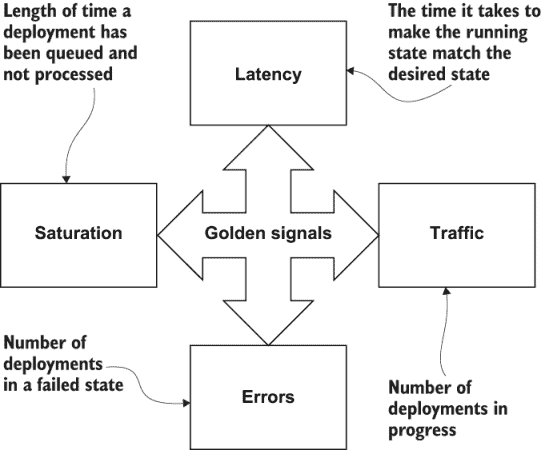

图 8.12 GitOps 的四个黄金信号表示 GitOps 持续部署系统的健康状况。GitOps 操作员/服务的问题可能会通过负面影响一个或多个这些黄金信号指标来体现。

这些指标的实现方式以及它们如何被公开将因每个 GitOps 工具而异。这将在本书的第三部分中更详细地介绍。

### 8.3.2 应用程序同步状态

GitOps 操作员必须提供的最重要状态是 Git 仓库中应用程序的期望状态是否与当前应用程序状态（同步）相同，或者不同（不同步）。如果应用程序不同步，用户应被提醒可能需要进行部署（或重新部署）。

但是什么原因导致应用程序变得不同步？这是 GitOps 的常规操作的一部分；用户将更改提交到系统的期望状态。在更改提交的那一刻，应用程序的当前状态与期望状态不匹配。

让我们考虑第二章 2.5.1 节中描述的基本 GitOps 操作员是如何工作的。在那个例子中，CronJob 定期运行基本 GitOps 操作员，以便检出仓库，并将仓库中包含的清单自动应用到运行系统中。

在这个 GitOps 运算符的基本示例中，为了简化示例，完全回避了应用程序同步状态的问题。基本的 GitOps 运算符假设在每次计划执行（或轮询间隔）时应用程序都处于不同步状态，需要部署。这种简单的方法不适合实际生产使用，因为用户无法看到是否存在需要部署的更改，以及这些更改是什么。这也可能给 GitOps 操作、Git 服务器和 Kubernetes API 服务器增加不必要的额外负载。

样本应用程序

让我们通过几个不同的部署场景来运行我们的 `sample-app`，以探索其他应用程序同步状态方面。`sample-app` 是一个简单的 Go 应用程序，它返回一个 HTTP 响应消息“`Kubernetes ♡ <input>`”。

首先，登录到 GitHub 并分叉 [`github.com/gitopsbook/sample-app-deployment`](https://github.com/gitopsbook/sample-app-deployment) 仓库。如果您之前已分叉此仓库，建议删除旧的分叉并重新分叉，以确保从一个没有任何先前练习更改的干净仓库开始。

在分叉后，使用以下命令克隆您的分叉仓库：

```
$ git clone git@github.com:<username>/sample-app-deployment.git
$ cd sample-app-deployment
```

让我们手动将 `sample-app` 部署到 minikube：

```
$ minikube start
😁   minikube v1.11.0 on Darwin 10.14.6
✨   Automatically selected the hyperkit driver
👍   Starting control plane node minikube in cluster minikube
🔥   Creating hyperkit VM (CPUs=2, Memory=2200MB, Disk=20000MB) ...
🐳   Preparing Kubernetes v1.16.10 on Docker 19.03.8 ...
🔎   Verifying Kubernetes components...
🌟   Enabled addons: default-storageclass, storage-provisioner
🏄   Done! kubectl is now configured to use "minikube"
$ kubectl create ns sample-app
namespace/sample-app created
$ kubectl apply -f . -n sample-app
deployment.apps/sample-app created
service/sample-app created
```

注意：在撰写本文时，Kubernetes v1.18.3 使用 `kubectl diff` 命令报告了额外的差异。如果在完成以下练习时遇到此问题，您可以使用以下命令以较旧版本的 Kubernetes 启动 minikube：`minikube start --kubernetes-version=1.16.10`。

检测差异

现在，`sample-app` 已成功部署，让我们对部署做一些更改。让我们在 deployment.yaml 文件中将 `sample-app` 的副本数量增加到 3。使用以下命令更改 Deployment 资源中的副本数：

```
$ sed -i '' 's/replicas: .*/replicas: 3/' deployment.yaml
```

或者，您可以使用您喜欢的文本编辑器将 deployment.yaml 文件中的 `replicas:` `1` 更改为 `replicas:` `3`。一旦对 deployment.yaml 进行了更改，运行以下命令以查看 Git 分支仓库中的未提交差异：

```
$ git diff
diff --git a/deployment.yaml b/deployment.yaml
index 5fc3833..ed2398a 100644
--- a/deployment.yaml
+++ b/deployment.yaml
@@ -3,7 +3,7 @@ kind: Deployment
 metadata:
   name: sample-app
 spec:
-  replicas: 1
+  replicas: 3
   revisionHistoryLimit: 3
   selector:
     matchLabels:
```

最后，使用 `git commit` 和 `git push` 将更改推送到远程 Git 分支仓库：

```
$ git commit -am "update replica count"
[master 5a03ca3] update replica count
 1 file changed, 1 insertion(+), 1 deletion(-)
$ git push
Enumerating objects: 5, done.
Counting objects: 100% (5/5), done.
Delta compression using up to 4 threads
Compressing objects: 100% (3/3), done.
Writing objects: 100% (3/3), 353 bytes | 353.00 KiB/s, done.
Total 3 (delta 1), reused 0 (delta 0)
remote: Resolving deltas: 100% (1/1), completed with 1 local object.
To github.com:tekenstam/sample-app-deployment.git
   09d6663..5a03ca3  master -> master
```

现在，您已将更改提交到 `sample-app` 部署仓库，由于部署的当前状态仍然只有三个副本，`sample-app` 的 GitOps 同步状态处于不同步状态。让我们确认这一点：

```
$ kubectl get deployment sample-app -n sample-app
NAME         READY   UP-TO-DATE   AVAILABLE   AGE
sample-app   1/1     1            1           3m27s
```

从此命令中，您可以看到 `sample-app` 部署有 `1/1` 个 `READY` 副本。但有没有更好的方法来比较表示所需状态的部署仓库与运行应用程序的实际状态？幸运的是，Kubernetes 提供了检测差异的工具。

kubectl diff

Kubernetes 提供了 `kubectl diff` 命令，它接受一个文件或目录作为输入，并显示那些文件中定义的资源与 Kubernetes 集群中同名的当前资源之间的差异。如果我们对现有的部署仓库运行 `kubectl diff`，我们会看到以下内容：

```
$ kubectl diff -f . -n sample-app
@@ -6,7 +6,7 @@
   creationTimestamp: "2020-06-01T04:17:28Z"
-  generation: 2
+  generation: 3
   name: sample-app
   namespace: sample-app
   resourceVersion: "2291"
@@ -14,7 +14,7 @@
   uid: eda45dca-ff29-444c-a6fc-5134302bcd81
 spec:
   progressDeadlineSeconds: 600
-  replicas: 1
+  replicas: 3
   revisionHistoryLimit: 3
   selector:
     matchLabels:
```

从这个输出中，我们可以看到 `kubectl diff` 正确地识别出 `replicas` 从 `1` 更改为 `3`。

虽然这是一个基本的例子，用于说明这个观点，但同样的技术可以识别多个不同资源之间的更广泛的变化。这赋予了 GitOps 运营商或服务确定 Git 中包含所需状态的部署仓库是否与 Kubernetes 集群的当前实时状态不同步的能力。更重要的是，`kubectl diff` 输出提供了如果部署仓库同步，将应用到集群中的更改的预览。这是 GitOps 可观察性的一个关键特性。

练习 8.9

将 `sample-app` 部署仓库进行分支。按照 `sample-app-deployment` README.md 中的说明将 `sample-app` 部署到您的 minikube 集群。现在将 `sample-app` 服务的 `type:` 改为 `LoadBalancer`。运行 `kubectl diff `-f` `.` `-n` `sample-app` 命令。您是否看到了任何意外的更改？为什么？使用 `kubectl apply `-f` `.` `-n` `sample-app` 应用更改。现在您应该可以通过命令 `minikube service sample-app `-n sample-app` 来看到 `sample-app` 网页。

kubediff

在前面的章节中，我们介绍了如何使用 `git` `diff` 来查看 Git 仓库中修订之间的差异，以及如何使用 `kubectl diff` 来查看 Git 仓库与实时 Kubernetes 集群之间的差异。在两种情况下，diff 工具都提供了非常原始的差异视图，输出差异前后的行以提供上下文。而且 `kubectl diff` 也可能报告系统管理（如 `generation`）的差异，这些差异与 GitOps 用例不相关。如果有一个工具能给出每个资源特定属性差异的简洁报告，那岂不是很好？事实上，Weaveworks^(12) 的人们已经发布了一个名为 `kubediff`^(13) 的开源工具，它正是这样做的。

以下是针对我们的 `sample-app` 部署仓库运行 `kubediff` 的输出：

```
$ kubediff --namespace sample-app .
## sample-app/sample-app (Deployment.v1.apps)

.spec.replicas: '3' != '1'
```

`kubediff` 还可以输出 JSON 结构化的输出，这使得它更容易被程序化使用。以下是使用 JSON 输出运行的相同命令：

```
$ kubediff --namespace sample-app . --json
{
  "./deployment.yaml": [
    ".spec.replicas: '3' != '1'"
  ]
}
```

练习 8.10

对 `sample-app-deployment` 仓库运行 `kubediff`。如果您的环境中尚未安装，您首先需要安装 Python 和 `pip`，然后按照 `kubediff` README 中的说明运行 `pip install` `-r` `requirements.txt`。

### 8.3.3 配置漂移

但应用程序如何才能与 Git 仓库中定义的期望状态不同步呢？可能是用户直接修改了正在运行的应用程序（例如，通过在 Deployment 资源上执行`kubectl edit`），而没有将期望的更改提交到 Git 仓库。我们称这种情况为配置漂移。

在使用 GitOps 管理系统时，这通常是一个大忌；你应该避免在 GitOps 之外直接修改系统。例如，如果你的 Pod 资源不足，你可能只是简单地执行一个`kubectl edit`命令来增加副本数量以增加容量。

这种情况有时会发生。当这种情况发生时，GitOps 操作员需要“观察”当前状态，检测与期望状态的差异，并向用户指示应用程序不同步。一个特别激进的 GitOps 操作员可能会自动重新部署之前部署的最后配置，从而覆盖手动更改。

使用 minikube 和我们在上一节中使用的`sample-app-deployment`仓库，运行`kubectl apply -f . -n sample-app`以确保当前内容已部署到 Kubernetes。现在运行`kubectl diff -f . -n sample-app`；你应该看不到任何差异。

现在，让我们通过运行以下命令来模拟在 GitOps 系统之外对应用程序部署进行更改：

```
$ kubectl scale deployment --replicas=4 sample-app -n sample-app
deployment.apps/sample-app scaled
```

现在，如果我们重新运行`kubectl diff`命令，我们会看到应用程序不同步，我们已经经历了配置漂移：

```
$ kubectl diff -f . -n sample-app
@@ -6,7 +6,7 @@
   creationTimestamp: "2020-06-01T04:17:28Z"
-  generation: 6
+  generation: 7
   name: sample-app
   namespace: sample-app
   resourceVersion: "16468"
@@ -14,7 +14,7 @@
   uid: eda45dca-ff29-444c-a6fc-5134302bcd81
 spec:
   progressDeadlineSeconds: 600
-  replicas: 4
+  replicas: 3
   revisionHistoryLimit: 3
   selector:
     matchLabels:
```

或者，如果你运行`kubediff`，你会看到以下内容：

```
$ kubediff --namespace sample-app .
## sample-app/sample-app (Deployment.v1.apps)

.spec.replicas: '3' != '4'
```

配置漂移与应用程序不同步非常相似。事实上，正如你所看到的，效果是相同的；当前配置的实时状态与在 Git 部署仓库中定义的期望配置不同。区别在于，通常当 Git 部署仓库中提交了尚未部署的新版本时，应用程序会不同步。相比之下，配置漂移发生在配置更改在 GitOps 系统之外进行时。

通常情况下，当遇到配置漂移时，必须发生以下两种情况之一。一些系统会将配置漂移视为错误状态，并允许启动自愈过程以同步系统回到声明的状态。其他系统可能会检测到这种漂移，并允许手动更改被整合回保存在 Git 中的声明状态（例如双向同步）。然而，我们的观点是双向同步并不可取，因为它允许并鼓励手动更改集群，绕过了 GitOps 提供作为其核心优势之一的安保和审查流程。

练习 8.11

在 `sample-app-deployment` 中运行命令 `kubectl delete -f . -n sample-app`。哎呀，你刚刚删除了你的应用程序！运行 `kubectl diff -f . -n sample-app`。你看到了什么差异？你如何将应用程序恢复到运行状态？提示：这应该很容易。

### 8.3.4 GitOps 变更日志

在本章前面，我们讨论了事件日志是可观察性的一个关键方面。对于 GitOps 来说，应用程序部署的“事件日志”主要是由部署仓库的提交历史组成的。由于所有对应用程序部署的更改都是通过更改表示应用程序期望状态的文件来进行的，通过观察提交、拉取请求批准和合并请求，我们可以了解集群中发生了哪些更改。

例如，在 `sample-app-deployment` 仓库上运行 `git log` 命令会显示自创建以来对这个仓库所做的所有提交：

```
$ git log --no-merges
commit ce920168912a7f3a6cdd57d47e630ac09aebc4e1 (origin/tekenstam-patch-2)
Author: Todd Ekenstam <tekenstam@gmail.com>
Date:   Mon Nov 9 13:59:25 2020 -0800

    Reduce Replica count back to 1

commit 8613d1b14c75e32ae04f3b4c0470812e1bdec01c (origin/tekenstam-patch-1)
Author: Todd Ekenstam <tekenstam@gmail.com>
Date:   Mon Nov 9 13:58:26 2020 -0800

    Update Replica count to 3

commit 09d6663dcfa0f39b1a47c66a88f0225a1c3380bc
Author: tekenstam <tekenstam@gmail.com>
Date:   Wed Feb 5 22:14:35 2020 -0800

    Update deployment.yaml

commit 461ac41630bfa3eee40a8d01dbcd2a5cd032b8f1
Author: Todd Ekenstam <Todd_Ekenstam@intuit.com>
Date:   Wed Feb 5 21:51:03 2020 -0800

    Update sample-app image to gitopsbook/sample-app:cc52a36

commit 99bb7e779d960f23d5d941d94a7c4c4a6047bb22
Author: Alexander Matyushentsev <amatyushentsev@gmail.com>
Date:   Sun Jan 26 22:01:20 2020 -0800

    Initial commit
```

从这个输出中，我们可以看到 Alex 在 1 月 26 日创建了该仓库的第一个提交。最近的提交是由 Todd 完成的，根据提交标题，将副本数量减少到 1。我们可以通过运行以下命令来查看提交的实际差异：

```
$ git show ce920168912a7f3a6cdd57d47e630ac09aebc4e1
commit ce920168912a7f3a6cdd57d47e630ac09aebc4e1 (origin/tekenstam-patch-2)
Author: Todd Ekenstam <tekenstam@gmail.com>
Date:   Mon Nov 9 13:59:25 2020 -0800

    Reduce Replica count back to 1

diff --git a/deployment.yaml b/deployment.yaml
index ed2398a..5fc3833 100644
--- a/deployment.yaml
+++ b/deployment.yaml
@@ -3,7 +3,7 @@ kind: Deployment
 metadata:
   name: sample-app
 spec:
-  replicas: 3
+  replicas: 1
   revisionHistoryLimit: 3
   selector:
     matchLabels:
```

从这里我们可以看到，行 `replicas:` `3` 被更改为 `replicas: 1`。

相同的信息也可在 GitHub UI 中找到。

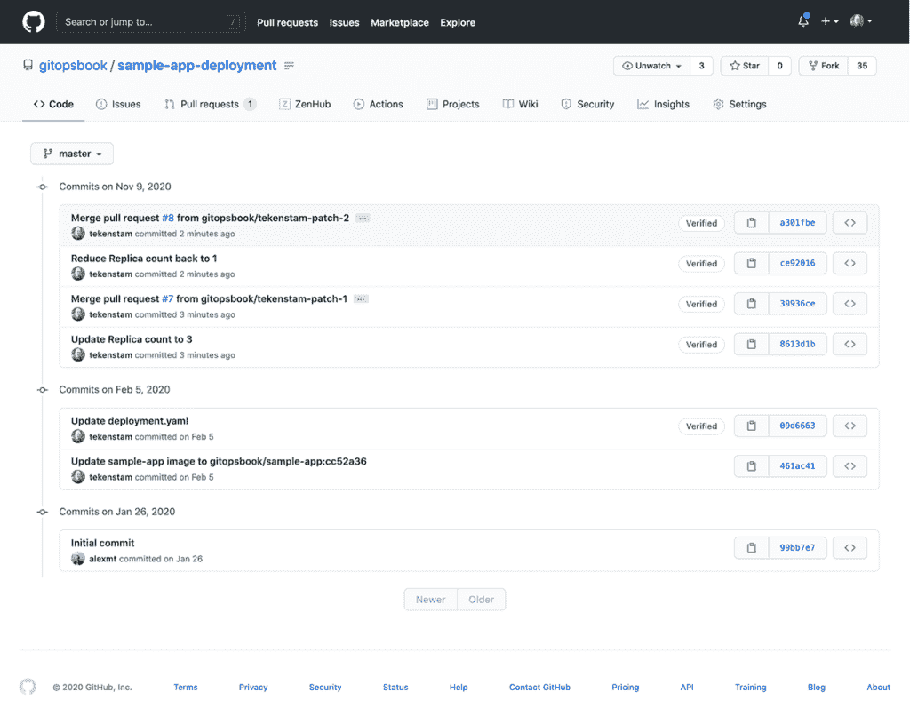

图 8.13 通过审查部署仓库的 GitHub 提交历史，可以看到应用程序部署随时间所做的所有更改。

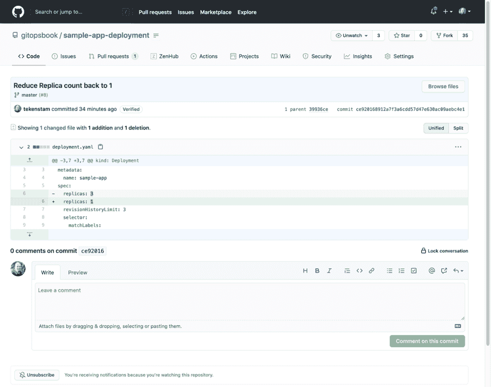

图 8.14 可以检查单个提交的详细信息。

为你集群中部署的每个应用程序拥有一个部署审计日志对于大规模管理它们至关重要。如果只有一个人更改集群，如果出现问题，那个人很可能会知道他们可能做了什么更改导致了问题。但是，如果你有多个团队，可能在不同的地理位置和时间区域，能够回答“谁最后部署了应用程序，他们做了什么更改？”这个问题是至关重要的。

正如我们在前面的章节中学到的，GitOps 仓库是一系列对表示系统期望状态的仓库文件的更改、添加和删除的集合。对仓库的每一次修改都称为一个提交。就像应用程序日志有助于提供代码中发生的历史记录一样，Git 提供了一个日志，提供了仓库更改的历史记录。我们可以检查 Git 日志来观察仓库随时间发生的变化。

对于 GitOps 来说，查看部署存储库的日志与查看应用日志一样重要，因为 GitOps 存储库是系统期望状态的真相来源。检查存储库的日志显示我们何时以及为什么（如果提交注释足够描述性）对系统的期望状态进行了更改，以及谁进行了更改并批准了这些更改。

这是 GitOps 向用户提供可观察性的一个关键方面。虽然 GitOps 操作员或服务也可能提供详细说明其执行的日志，但部署存储库的 Git 日志通常能给你一个很好的理解，了解系统中发生了哪些变化。

练习 8.12

使用你在这章中一直使用的`sample-app-deployment`存储库的相同 Git 分叉，运行`git log`命令。检查输出。你能通过本章的各个部分追踪你的过程吗？你看到作者对这个存储库的任何早期提交吗？

## 摘要

+   可观察性的方面可以通过监控事件日志、指标和跟踪来衡量。

+   数据收集器，如 Logstash、Fluentd 或 Scribe，可以收集应用输出（事件），并将日志消息存储在集中式数据存储中，以供后续分析。

+   使用`kubectl logs`观察应用输出。

+   Prometheus 从节点和 Pod 收集指标，以提供所有系统组件性能和操作的快照。

+   使用 Jaeger（Open Tracing）来监控分布式调用，以获得系统洞察，如错误和延迟。

+   应用健康状态：应用是否正常运行？如果应用的新版本正在使用 GitOps 进行部署，系统是否“更好”于之前？

+   使用`kubectl describe`来监控应用健康状态。

+   应用同步状态：应用的运行状态是否与部署 Git 存储库中定义的期望状态相同？

+   配置漂移：应用配置是否在声明式 GitOps 系统之外（例如手动或强制）被更改？

+   使用`kubectl diff`和`kubediff`检测应用同步状态和配置漂移

+   GitOps 变更日志：最近对 GitOps 系统做了哪些更改？谁做的，为什么？

* * *

1.[`github.com/cncf/sig-observability`](https://github.com/cncf/sig-observability).

2.[`mng.bz/4Z6a`](https://shortener.manning.com/4Z6a).

3.[`kubernetes.io/docs/concepts/cluster-administration/logging/`](https://kubernetes.io/docs/concepts/cluster-administration/logging/).

4.[`www.elastic.co/what-is/elk-stack`](https://www.elastic.co/what-is/elk-stack).

5.[`www.splunk.com/`](https://www.splunk.com/).

6.[`github.com/jaegertracing/jaeger/tree/master/examples/hotrod`](https://github.com/jaegertracing/jaeger/tree/master/examples/hotrod).

7.[`mng.bz/XdqG`](http://mng.bz/XdqG).

8.[`minikube.sigs.k8s.io/docs/tasks/addons/`](https://minikube.sigs.k8s.io/docs/tasks/addons/).

9.[`landing.google.com/sre/sre-book/chapters/monitoring-distributed-systems/`](https://landing.google.com/sre/sre-book/chapters/monitoring-distributed-systems/).

10.[`www.brendangregg.com/usemethod.html`](http://www.brendangregg.com/usemethod.html).

11.[`mng.bz/MX97`](http://mng.bz/MX97).

12.[`www.weave.works/`](https://www.weave.works/).

13.[`github.com/weaveworks/kubediff`](https://github.com/weaveworks/kubediff).
