# 9 Argo CD

本章涵盖

+   什么是 Argo CD？

+   使用 Argo CD 部署应用程序

+   使用 Argo CD 企业功能

在本章中，您将学习如何使用 Argo CD GitOps 运营商将参考示例应用程序部署到 Kubernetes。您还将了解 Argo CD 如何解决企业考虑因素，例如单点登录 (SSO) 和访问控制。

我们建议您在阅读本章之前阅读第 1、2、3 和 5 章。

## 9.1 什么是 Argo CD？

Argo CD 是一个开源的 GitOps 运营商，用于 Kubernetes.^(1) 该项目是 Argo 家族的一部分，是一套用于在 Kubernetes 上运行和管理作业和应用程序的云原生工具集。与 Argo Workflows、Rollouts 和 Events 一起，Argo CD 专注于应用程序交付用例，并简化了三种计算模式的结合：服务、工作流和基于事件的处理。在 2020 年，Argo CD 被云原生计算基金会 (CNCF) 批准为孵化级托管项目。

CNCF 云原生计算基金会是一个 Linux 基金会项目，它托管着全球技术基础设施的关键组件。

Argo CD 背后的公司是 Intuit，它是 TurboTax 和 QuickBooks 的创造者。在 2018 年初，Intuit 决定采用 Kubernetes 来加速云迁移。当时，市场上已经存在几个针对 Kubernetes 的成功的持续部署工具，但它们都没有完全满足 Intuit 的需求。因此，而不是采用现有的解决方案，公司决定投资一个新的项目，并开始开发 Argo CD。Intuit 的需求有什么特别之处？这个问题的答案解释了 Argo CD 与其他 Kubernetes CD 工具的不同之处，以及其主要项目用例。

### 9.1.1 主要用例

GitOps 方法论的重要性以及将基础设施表示为代码的好处是不容置疑的。然而，企业规模的需求需要额外的要求。Intuit 是一家基于云的软件即服务公司。拥有大约 5,000 名开发者，该公司成功地在本地和云端运行了数百个微服务。鉴于这种规模，期望每个团队都运行自己的 Kubernetes 集群是不合理的。相反，决定由一个集中式平台团队运行和维护整个公司的多租户集群。同时，最终用户应该有自由和必要的工具来管理这些集群中的工作负载。这些考虑因素在决定使用 GitOps 的基础上定义了以下额外的要求。

作为服务提供

如果您试图将数百个微服务迁移到 Kubernetes，一个简单的入门流程至关重要。与其要求每个团队安装、配置和维护部署操作员，不如由集中团队提供。随着数千名新用户的加入，SSO 集成至关重要。该服务必须与各种 SSO 提供商集成，而不是引入自己的用户管理。

启用多租户和多集群管理

在多租户环境中，用户需要一个有效且灵活的访问控制系统。Kubernetes 有一个出色的内置基于角色的访问控制系统，但当您必须处理数百个集群时，这还不够。持续部署工具应在多个集群上提供访问控制，并无缝集成到现有的 SSO 提供商中。

启用可观察性

最后，但同样重要的是，持续部署工具应向开发者提供有关管理应用程序状态的了解。这假设有一个用户友好的界面，可以快速回答以下问题：

+   应用程序配置是否与 Git 中定义的配置同步？

+   究竟是什么不匹配？

+   应用程序是否已启动并运行？

+   究竟是什么出了问题？

该公司需要为企业规模准备好的 GitOps 操作员。团队评估了几个 GitOps 操作员，但没有一个满足所有要求，因此决定实施 Argo CD。

练习 9.1

反思您组织的需要，并将它们与 Argo CD 专注于的使用案例进行比较。尝试决定 Argo CD 是否解决了您团队面临的痛点。

### 9.1.2 核心概念

为了有效地使用 Argo CD，我们应该了解两个基本概念：应用程序和项目。让我们首先更详细地看看应用程序。

应用程序

应用程序提供 Kubernetes 资源的逻辑分组，并定义资源清单的源和目标。

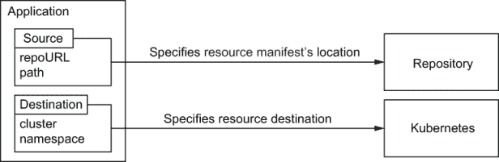

图 9.1 Argo CD 应用程序的主要属性是源和目标。源指定资源清单在 Git 仓库中的位置。目标指定资源应在 Kubernetes 集群中的何处创建。

应用程序源包括仓库 URL 和仓库内的目录。通常，仓库包含多个目录，每个应用程序环境一个，例如 QA 和 Prod。此类仓库的示例目录结构如下所示：

```
├──  prod
│   └──  deployment.yaml
└──  qa
 └── deployment.yaml
```

每个目录不一定包含纯 YAML 文件。Argo CD 不强制使用任何配置管理工具，而是提供对各种配置管理工具的一级支持。因此，目录可能也包含与 Helm 图表定义一起的 YAML 文件以及 Kustomize 遮罩。

应用程序目标定义了资源必须部署的位置，包括目标 Kubernetes 集群的 API 服务器 URL 以及集群命名空间名称。API 服务器 URL 识别所有应用程序清单必须部署的集群。无法在多个集群之间部署应用程序清单，但不同的应用程序可能被部署到不同的集群中。命名空间名称用于识别所有命名空间级别应用程序资源的目标命名空间。

因此，Argo CD 应用程序代表在 Kubernetes 集群中部署的环境，并将其连接到 Git 仓库中存储的期望状态。

练习 9.2

考虑您组织中实际部署的服务，并为您列表中的应用程序制定一个 Argo CD 应用程序列表。定义一个应用程序的源仓库 URL、目录和目标集群以及命名空间。

### 9.1.3 同步和健康状态

除了源和目标之外，Argo CD 应用程序还有两个更重要的属性：同步和健康状态。

同步状态回答观察到的应用程序资源状态是否与存储在 Git 仓库中的资源状态不同。偏差计算背后的逻辑等同于 `kubectl` `diff` 命令的逻辑。同步状态的值可能是同步或不同步。同步状态表示每个应用程序资源都被找到，并且完全匹配预期的资源状态。不同步状态表示至少有一个资源状态与预期状态不匹配，或者在目标集群中未找到。

应用程序的健康状态汇总了构成应用程序的每个资源的观察到的健康状态。对于每个 Kubernetes 资源类型，健康评估逻辑不同，并导致以下值之一：

+   *健康*——例如，如果所需的 Pod 数量正在运行，并且每个 Pod 成功通过了就绪和存活探针，则认为 Kubernetes 部署是健康的。

+   *进行中*——表示尚未健康但预计将达到健康状态的资源。如果 Deployment 尚未健康但尚未指定由 `progressingDeadlineSeconds`2 字段指定的超时时间，则认为它是进行中的。

+   *退化*——健康状态的相反。例如，一个 Deployment 在预期超时内无法达到健康状态。

+   *缺失*——表示存储在 Git 中但未部署到目标集群的资源。

汇总的应用程序状态是每个应用程序资源的最差状态。健康状态是最好的，依次下降到进行中、退化、缺失（最差）。因此，如果所有应用程序资源都是健康的，而只有一个资源是退化的，则汇总状态也是退化的。

练习 9.3

考虑一个由两个 Deployment 组成的应用程序。关于资源的以下信息是已知的：

+   部署 1 有一个与 Git 仓库中存储的镜像不匹配的镜像。由于部署`progressingDeadlineSeconds`设置为 10 分钟，所有部署 Pod 已经失败启动数小时。

+   部署 2 没有完全匹配预期的状态，并且所有 Pod 都在运行。

应用程序的同步和健康状态是什么？

健康和同步状态回答了关于应用程序最重要的两个问题：

+   我的应用程序是否在运行？

+   我是否运行了预期的内容？

项目

Argo CD 应用程序提供了一种非常灵活的方式来独立管理不同的应用程序。这种功能为团队提供了关于每项基础设施的非常有用的见解，并大大提高了生产力。然而，这还不足以支持具有不同访问级别的多个团队：

+   应用程序的混合列表造成了混淆，这可能导致人为错误的可能性。

+   不同的团队有不同的访问级别。正如第六章所述，个人可能会使用 GitOps 操作员来提升自己的权限以获得完整的集群访问权限。

这些问题的解决方案是为每个团队创建一个单独的 Argo CD 实例。这不是一个完美的解决方案，因为单独的实例意味着管理开销。为了避免管理开销，Argo CD 引入了项目抽象。图 9.2 说明了应用程序和项目之间的关系。

项目为应用程序提供了一个逻辑分组，隔离了团队之间的联系，并允许在每个项目中进行细粒度的访问控制调整。

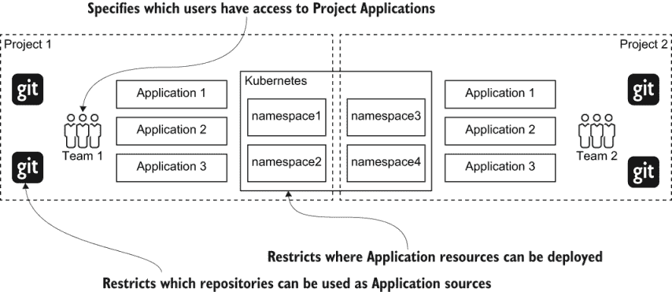

图 9.2 展示了应用程序和项目之间的关系。项目为应用程序提供了一个逻辑分组，隔离了团队之间的联系，并允许在多租户环境中使用 Argo CD。

除了分离应用程序集之外，项目还提供以下功能集：

+   限制项目应用程序可能使用的 Kubernetes 集群和 Git 存储库

+   限制项目内每个应用程序可以部署的 Kubernetes 资源

练习 9.4

尝试列出你组织中的项目列表。使用项目，你可以限制用户可以部署的资源类型、源存储库以及项目内可用的目标集群。你会为你的项目配置哪些限制？

### 9.1.4 架构

初看起来，GitOps 操作员的实现并不太复杂。从理论上讲，你所需要做的就是克隆包含清单的 Git 仓库，并使用`kubectl` `diff`和`kubectl` `apply`来检测和处理配置漂移。这在你尝试为多个团队自动化此过程并同时管理数十个集群的配置时是正确的。逻辑上，这个过程分为三个阶段，每个阶段都有其自身的挑战：

+   获取资源清单。

+   检测并修复偏差。

+   将结果呈现给最终用户。

每个阶段消耗不同的资源，每个阶段的实现必须以不同的方式扩展。每个阶段都有一个单独的 Argo CD 组件负责。

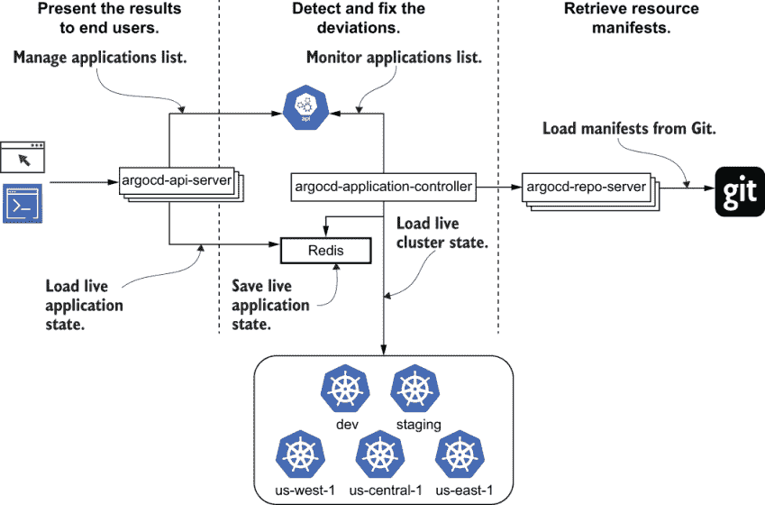

图 9.3 Argo CD 由三个主要组件组成，实现了 GitOps 协调周期阶段。`argocd-repo-server` 从 Git 中检索清单。`argocd-application-controller` 将 Git 中的清单与 Kubernetes 集群中的资源进行比较。`argocd-api-server` 向用户展示协调结果。

让我们逐一了解每个阶段及其对应的 Argo CD 组件实现细节。

检索资源清单

Argo CD 中的清单生成由 `argocd-repo-server` 组件实现。这个阶段带来了一系列挑战。

生成清单需要您下载 Git 仓库内容并生成可用的清单 YAML 文件。首先，每次需要检索预期的资源清单时都下载整个仓库内容是非常耗时的。Argo CD 通过在本地磁盘上缓存仓库内容并使用 `git` `fetch` 命令仅从远程 Git 仓库下载最近更改来解决此问题。下一个挑战与内存使用有关。在现实生活中，资源清单很少以纯 YAML 文件的形式存储。在大多数情况下，开发者更喜欢使用像 Helm 或 Kustomize 这样的配置管理工具。每次工具调用都会导致内存使用量的峰值。为了处理内存使用问题，Argo CD 允许用户限制并行生成清单的数量，并增加 `argocd-repo-server` 实例的数量以提高性能。

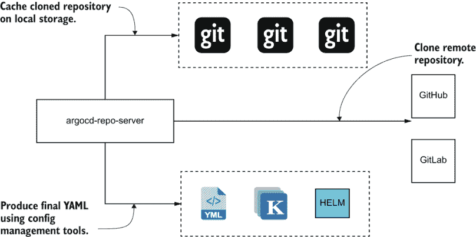

图 9.4 `argocd-repo-server` 在本地存储中缓存克隆的仓库，并封装与生成最终资源清单所需的配置管理工具的交互。

检测并修复偏差

协调阶段由 `argocd-application-controller` 组件实现。控制器加载实时 Kubernetes 集群状态，将其与 `argocd-repo-server` 提供的预期清单进行比较，并修补偏离的资源。这个阶段可能是最具挑战性的。为了正确检测偏差，GitOps 运营商需要了解集群中的每个资源，并比较和更新数千个资源。

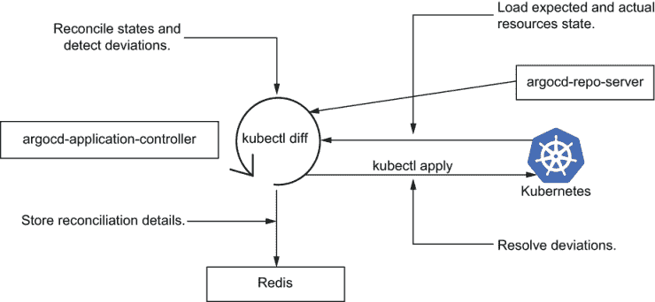

图 9.5 `argocd-application-controller` 执行资源协调。控制器利用 `argocd-repo-server` 组件检索预期的清单，并将清单与轻量级的内存中 Kubernetes 集群状态缓存进行比较。

控制器维护每个管理集群的轻量级缓存，并在后台使用 Kubernetes 监视 API 更新它。这使得控制器能够在几秒钟内对应用程序进行协调，并赋予其扩展和管理数十个集群的能力。每次协调后，控制器都会收集每个应用程序资源的详尽信息，包括同步和健康状态。控制器将这些信息保存到 Redis 集群中，以便稍后向最终用户展示。

向最终用户展示结果

最后，必须将协调结果展示给最终用户。这项任务由 `argocd-server` 组件执行。虽然繁重的工作已经由 `argocd-repo-server` 和 `argocd-application-controller` 完成，但这个最后阶段具有最高的弹性要求。`argocd-server` 是一个无状态的 Web 应用程序，它加载关于协调结果的信息并驱动 Web 用户界面。

架构设计使得 Argo CD 能够以最小的维护开销为大型企业提供 GitOps 操作。

练习 9.5

哪些组件服务于用户请求并需要多个副本以提高弹性？哪些组件可能需要大量内存以进行扩展？

## 9.2 部署您的第一个应用程序

虽然 Argo CD 是一个企业级、复杂的分布式系统，但它仍然轻量级，可以轻松运行在 minikube 上。安装过程简单，包括几个简单的步骤。请参阅附录 B 了解有关如何安装 Argo CD 的更多信息，或遵循官方 Argo CD 指令.^(3)

### 9.2.1 部署第一个应用程序

一旦 Argo CD 启动，我们就准备好部署我们的第一个应用程序。正如之前提到的，要部署 Argo CD 应用程序，我们需要指定包含部署清单的 Git 仓库，并针对 Kubernetes 集群和命名空间。为了进行此练习创建 Git 仓库，请打开以下 GitHub 仓库并创建一个仓库 fork:^(4)

```
https://github.com/gitopsbook/sample-app-deployment
```

Argo CD 可以部署到外部集群，也可以部署到它安装的同一集群。让我们使用第二种选项，将我们的应用程序部署到 minikube 集群的默认命名空间。

重置您的分支 在您之前章节的工作中已经 fork 了部署仓库吗？请确保重置更改以获得最佳体验。最简单的方法是删除之前 fork 的仓库并再次 fork。

应用程序可能通过 Web 用户界面、CLI 或甚至通过 REST 或 gRPC API 以编程方式创建。由于我们已安装并配置了 Argo CD CLI，让我们使用它来部署应用程序。请执行以下命令以创建应用程序：

```
$ argocd app create sample-app \                                 ❶
  --repo https://github.com/<username>/sample-app-deployment \   ❷
  --path . \                                                     ❸
  --dest-server https://kubernetes.default.svc \                 ❹
  --dest-namespace default                                       ❺
```

❶ 唯一的应用程序名称

❷ Git 仓库 URL

❸ Git 仓库内的目录路径

❹ Kubernetes API 服务器 URL。https://kubernetes.default.svc/是每个 Kubernetes 集群中可用的 API 服务器 URL。

❺ Kubernetes 命名空间名称

一旦应用创建，我们就可以使用 Argo CD CLI 获取应用状态信息。使用以下命令获取`sample-app`应用状态信息：

```
argocd app get sample-app                          ❶
Name:               sample-app
Project:            default
Server:             https://kubernetes.default.svc
Namespace:          default
URL:                https://<host>:<port>/applications/sample-app
Repo:               https://github.com/<username>/sample-app-deployment
Target:
Path:               .
SyncWindow:         Sync Allowed
Sync Policy:        <none>
Sync Status:        OutOfSync from  (09d6663)      ❷
Health Status:      Missing                        ❸

GROUP  KIND        NAMESPACE  NAME        STATUS     HEALTH   HOOK  MESSAGE
       Service     default    sample-app  OutOfSync  Missing
apps   Deployment  default    sample-app  OutOfSync  Missing
```

❶ 返回应用状态信息的 CLI 命令

❷ 应用同步状态，回答应用状态是否与预期状态匹配

❸ 应用聚合健康状态

如我们从命令输出中可以看到，应用已出现同步错误且不健康。默认情况下，如果 Argo CD 检测到偏差，它不会将 Git 仓库中定义的资源推送到集群中。除了高级摘要外，我们还可以看到每个应用资源的详细信息。Argo CD 检测到应用应该有一个 Deployment 和一个 Service，但这两个资源都缺失。要部署资源，我们需要配置使用同步策略的自动应用同步^(5)或手动触发同步。要触发同步并部署资源，请使用以下命令：

```
$ argocd app sync sample-app                                                                          ❶
TIMESTAMP                  GROUP    KIND        NAMESPACE   NAME    STATUS    HEALTH   HOOK  MESSAGE  ❷
2020-03-17T23:16:50-07:00  Service  default     sample-app  OutOfSync Missing
2020-03-17T23:16:50-07:00  apps     Deployment  default     sample-app  OutOfSync  Missing

Name:               sample-app
Project:            default
Server:             https://kubernetes.default.svc
Namespace:          default
URL:                https://<host>:<port>/applications/sample-app
Repo:               https://github.com/<username>/sample-app-deployment
Target:
Path:               .
SyncWindow:         Sync Allowed
Sync Policy:        <none>
Sync Status:        OutOfSync from  (09d6663)
Health Status:      Missing

Operation:          Sync
Sync Revision:      09d6663dcfa0f39b1a47c66a88f0225a1c3380bc
Phase:              Succeeded
Start:              2020-03-17 23:17:12 -0700 PDT
Finished:           2020-03-17 23:17:21 -0700 PDT
Duration:           9s
Message:            successfully synced (all tasks run)

GROUP  KIND        NAMESPACE  NAME        STATUS   HEALTH   HOOK  MESSAGE                             ❸
       Service     default    sample-app  Synced   Healthy        service/sample-app created
apps   Deployment  default    sample-app  Synced   Progressing    deployment .apps/sample-app created
```

❶ 触发应用同步的 CLI 命令

❷ 同步操作前的初始应用状态

❸ 同步完成后最终的 应用状态

一旦触发同步，Argo CD 将 Git 中存储的清单推送到 Kubernetes 集群，然后重新评估应用状态。当同步完成时，最终的应用状态将打印到控制台。`sample-app`应用成功同步，每个结果都与预期状态相匹配。

### 9.2.2 使用用户界面检查应用

除了 CLI 和 API 之外，Argo CD 还提供了一个用户友好的 Web 界面。使用 Web 界面，您可能会看到跨多个集群部署的所有应用的高级视图以及每个应用资源的非常详细的信息。打开 https://<host>:<port> URL 以在 Argo CD 用户界面中查看应用列表。

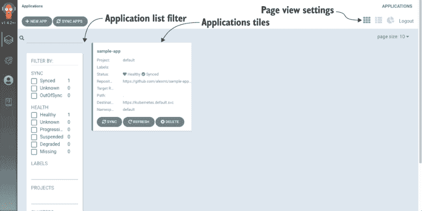

图 9.6 显示可用 Argo CD 应用的列表页面。页面提供了关于每个应用的高级信息，例如同步和健康状态。

应用列表页面提供了所有已部署应用的高级信息，包括健康和同步状态。使用此页面，您可以快速查找是否有任何应用出现降级或配置漂移。用户界面是为大型企业设计的，能够处理数百个应用。您可以使用搜索和各种过滤器快速找到所需的应用。

练习 9.6

尝试调整过滤器和平页面视图设置，以了解应用列表页面中其他哪些功能可用。

应用详情页面

关于应用程序的附加信息可在应用程序详情页面找到。通过点击“sample app”应用程序磁贴导航到应用程序详情页面。

应用程序详情页面可视化应用程序资源层次结构，并提供有关同步和健康状态的额外详细信息。让我们更仔细地查看应用程序资源树并了解它提供了哪些功能。

资源树的根元素是应用程序本身。下一级包括管理资源。管理资源是 Git 中定义并由 Argo CD 明确控制的资源。正如我们在第二章中学到的，Kubernetes 控制器通常利用委派并创建子资源来委派工作。第三级及更深层级代表这样的资源。这提供了关于每个应用程序元素的完整信息，使得应用程序详情页面成为一个极其强大的 Kubernetes 仪表板。

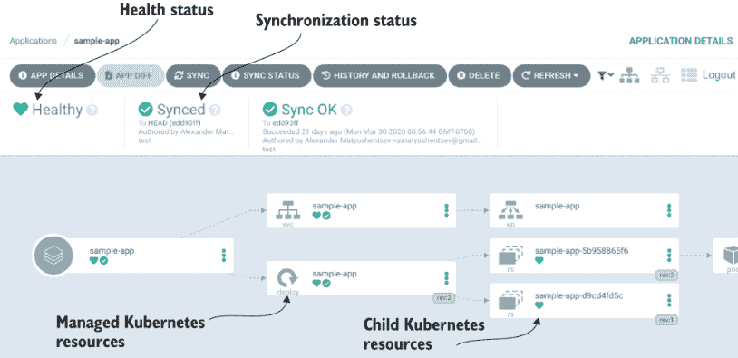

图 9.7 应用程序详情页面提供了关于应用程序资源层次结构以及每个资源的详细信息。

除了这些信息外，用户界面允许对每个资源执行各种操作。可以删除任何资源，通过运行同步操作重新创建它，使用内置的 YAML 编辑器更新资源定义，甚至运行特定于资源的操作，如 Deployment 重启。

练习 9.7

继续使用应用程序详情页面来检查你的应用程序。尝试找到查看资源清单、定位 Pod 和查看实时日志的方法。

## 9.3 深入了解 Argo CD 功能

到目前为止，我们已经学习了如何使用 Argo CD 部署新应用程序以及如何使用 CLI 和用户界面获取详细的应用程序信息。接下来，让我们学习如何使用 GitOps 和 Argo CD 部署新应用程序版本。

### 9.3.1 GitOps 驱动的部署

为了执行 GitOps 部署，我们需要更新资源清单并让 GitOps 操作员将更改推送到 Kubernetes 集群。作为第一步，使用以下命令克隆 Deployment 仓库：

```
$ git clone git@github.com:<username>/sample-app-deployment.git
$ cd sample-app-deployment
```

接下来，使用以下命令更改 Deployment 资源的形象版本：

```
$ sed -i '' 's/sample-app:v.*/sample-app:v0.2/' deployment.yaml
```

使用 `git diff` 命令确保你的 Git 仓库有预期的更改：

```
$ git diff                                                                                                                                                      
diff --git a/deployment.yaml b/deployment.yaml
index 5fc3833..397d058 100644
--- a/deployment.yaml
+++ b/deployment.yaml
@@ -16,7 +16,7 @@ spec:
       containers:
       - command:
         - /app/sample-app
-        image: gitopsbook/sample-app:v0.1
+        image: gitopsbook/sample-app:v0.2
         name: sample-app
         ports:
         - containerPort: 8080
```

最后，使用 `git commit` 和 `git push` 将更改推送到远程 Git 仓库：

```
$ git commit -am "update deployment image"
$ git push
```

让我们使用 Argo CD CLI 来确保 Argo CD 正确检测到 Git 中的清单更改并触发了同步过程以将更改推送到 Kubernetes 集群：

```
$ argocd app diff sample-app --refresh
===== apps/Deployment default/sample-app ======
21c21
<         image: gitopsbook/sample-app:v0.1
---
>         image: gitopsbook/sample-app:v0.2
```

练习 9.8

打开 Argo CD UI 并使用应用程序详情页面来检查应用程序同步状态并检查管理资源状态。

使用 `argocd sync` 命令触发同步过程：

```
$ argocd app sync sample-app
```

太好了，你刚刚使用 Argo CD 执行了 GitOps 部署！

### 9.3.2 资源钩子

资源清单同步只是基本用例。在现实生活中，我们通常需要在实际部署前后执行额外的步骤。例如，设置维护页面，在新版本部署前执行数据库迁移，最后移除维护页面。

传统上，这些部署步骤是在 CI 管道中编写的。然而，这又需要从 CI 服务器访问生产环境，这涉及到安全风险。为了解决这个问题，Argo CD 提供了一种名为*资源钩子*的功能。这些钩子允许在同步过程中在 Kubernetes 集群内部运行自定义脚本，通常打包成一个 Pod 或一个 Job。

钩子是一个存储在 Git 仓库中并带有`argocd.argoproj.io/hook`注解的 Kubernetes 资源清单。注解值包含一个逗号分隔的列表，表示钩子应该执行的阶段。以下阶段被支持：

+   *预同步*—在应用清单之前执行

+   *同步*—在所有预同步钩子完成且成功执行后执行，同时执行清单的应用

+   *跳过*—指示 Argo CD 跳过清单的应用

+   *同步后*—在所有同步钩子完成且成功执行、成功应用以及所有资源处于健康状态后执行

+   *同步失败*—在同步操作失败时执行

钩子在集群内部执行，因此无需从 CI 管道访问集群。指定同步阶段的能力提供了必要的灵活性，并允许解决大多数现实生活中的部署用例的机制。

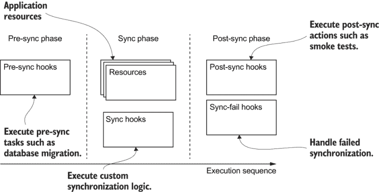

图 9.8 同步过程包括三个主要阶段。预同步阶段用于执行准备任务，如数据库迁移。同步阶段包括应用资源同步。最后，同步后阶段运行后处理任务，如发送电子邮件通知。

是时候看看钩子功能在实际中的应用了！将钩子定义添加到示例应用部署仓库中，并将更改推送到远程仓库：

```
$ git add pre-sync.yaml
$ git commit -am 'Add pre-sync hook'
$ git push
```

列表 9.1 http://mng.bz/go7l

```
apiVersion: batch/v1
kind: Job
metadata:
  name: before
  annotations:
    argocd.argoproj.io/hook: PreSync
spec:
  template:
    spec:
      containers:
      - name: sleep
        image: alpine:latest
        command: ["echo", "pre-sync"]
      restartPolicy: Never
  backoffLimit: 0
```

Argo CD 用户界面比 CLI 提供了更好的动态过程可视化。让我们使用它来更好地理解钩子是如何工作的。使用以下命令打开 Argo CD UI：

```
$ minikube service argocd-server -n argocd --url
```

导航到`sample-app`详情页面，并使用同步按钮触发同步过程。同步过程在图 9.9 中展示。

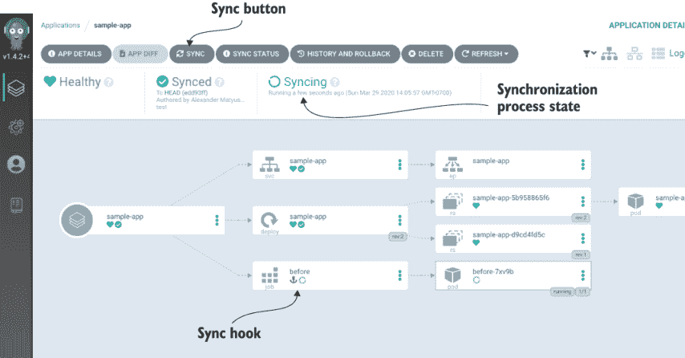

图 9.9 应用详情页面允许用户触发同步，以及查看同步进度的详细信息，包括同步钩子。

一旦开始同步，应用程序详情页面在右上角显示实时进程状态。状态包括操作开始时间和持续时间。您可以通过点击同步状态图标查看包含同步钩子结果的详细信息的同步状态面板。

钩子以常规资源清单的形式存储在 Git 仓库中，并在应用程序资源树中以常规资源的形式可视化。您可以看到“删除前”作业的实时状态，并使用 Argo CD 用户界面检查子 Pod。

除了阶段之外，您还可以自定义钩子删除策略。删除策略允许自动化钩子资源的删除，这将为您节省大量的手动工作。

练习 9.9

在 Argo CD 文档中阅读更多详细信息^(6) 并更改“删除前”作业的策略。使用 Argo CD 用户界面来观察不同的删除策略如何影响钩子行为。同步应用程序并观察 Argo CD 如何创建和删除钩子资源。

### 9.3.3 部署后验证

资源钩子允许封装应用程序同步逻辑，因此我们不必使用脚本和持续集成工具。然而，某些此类用例自然属于持续集成流程，并且仍然更倾向于使用像 Jenkins 这样的工具。

其中一个用例是部署后验证。这里的挑战在于 GitOps 部署本质上是异步的。在将提交推送到 Git 仓库之后，我们仍然需要确保更改已传播到 Kubernetes 集群。即使在更改已传播之后，启动测试也不是安全的。在大多数情况下，Kubernetes 资源更新也不是瞬时的。例如，Deployment 资源更新会触发滚动更新过程。滚动更新可能需要几分钟，如果新应用程序版本存在问题，甚至可能失败。因此，如果您开始测试过早，可能会测试之前部署的应用程序版本。

Argo CD 通过提供帮助监控应用程序状态的工具，使这个问题变得微不足道。`argocd app wait` 命令监控应用程序，在应用程序达到同步和健康状态后退出。一旦命令退出，您就可以假设所有更改都已成功部署，并且可以安全地开始部署后验证。`argocd app wait` 命令通常与 `argocd app sync` 一起使用。使用以下命令同步您的应用程序，并等待更改完全部署，应用程序准备就绪进行测试：

```
$ argocd app sync sample-app && argocd app wait sample-app
```

## 9.4 企业功能

Argo CD 非常轻量级，并且使用起来非常简单。同时，它对于大型企业具有良好的可扩展性，能够满足多个团队的需求。企业功能可以根据需要进行配置。如果您正在为您的组织部署 Argo CD，那么第一个问题就是如何配置最终用户并有效地管理访问控制。

### 9.4.1 单点登录

Argo CD 没有引入自己的用户管理系统，而是提供了与多个 SSO 服务的集成。该列表包括 Okta、Google OAuth、Azure AD 以及更多。

SSO SSO 是一种会话和用户身份验证服务，允许用户使用一组登录凭证访问多个应用程序。

SSO 集成非常出色，因为它可以为您节省大量的管理开销，并且最终用户无需记住另一组登录凭证。存在几种用于交换身份验证和授权数据的开放标准。其中最受欢迎的是 SAML、OAuth 和 OpenID Connect (OIDC)。在这三者中，SAML 和 OIDC 最符合典型企业的需求，可以用来实现 SSO。Argo CD 决定采用 OIDC，因为它具有强大的功能和简单的特性。

配置 OIDC 集成所需的步骤数量取决于您的 OIDC 提供者。Argo CD 社区已经为 Okta 和 Azure AD 等流行的 OIDC 提供者贡献了许多说明。在 OIDC 提供者端完成配置后，您需要将相应的配置添加到`argocd-cm` ConfigMap 中。以下是一个示例 Okta 配置片段：

```
apiVersion: v1
kind: ConfigMap
metadata:
  name: argocd-cm
  namespace: argocd
  labels:
    app.kubernetes.io/name: argocd-cm
    app.kubernetes.io/part-of: argocd
data:
  url: https://<myargocdhost>                          ❶
  oidc.config: |                                       ❷
    name: Okta
    issuer: https://yourorganization.oktapreview.com
    clientID: <your client id>
    clientSecret: <your client secret>
    requestedScopes: ["openid", "profile", "email", "groups"]
    requestedIDTokenClaims: {"groups": {"essential": true}}
```

❶ 面向外部的基 URL Argo CD URL

❷ 包含 Okta 应用程序客户端 ID 和密钥的 OIDC 配置

如果您的组织没有 OIDC 兼容的 SSO 服务怎么办？在这种情况下，您可以使用一个联邦 OIDC 提供者，Dex，^(7)，它默认包含在 Argo CD 中。Dex 充当其他身份提供者的代理，并允许与 SAML、LDAP 提供者或 GitHub 和 Active Directory 等服务建立集成。

GitHub 通常是一个非常吸引人的选择，尤其是如果它已经被您的组织中的开发者使用。此外，在 GitHub 中配置的组织和团队自然符合组织集群访问所需的访问控制模型。正如您很快就会学到的那样，使用 GitHub 团队成员资格来建模 Argo CD 访问非常简单。让我们使用 GitHub 来增强我们的 Argo CD 安装并启用 SSO 集成。

首先，我们需要创建一个 GitHub OAuth 应用程序。导航到[`github.com/settings/applications/new`](https://github.com/settings/applications/new)并配置应用程序设置，如图 9.10 所示。

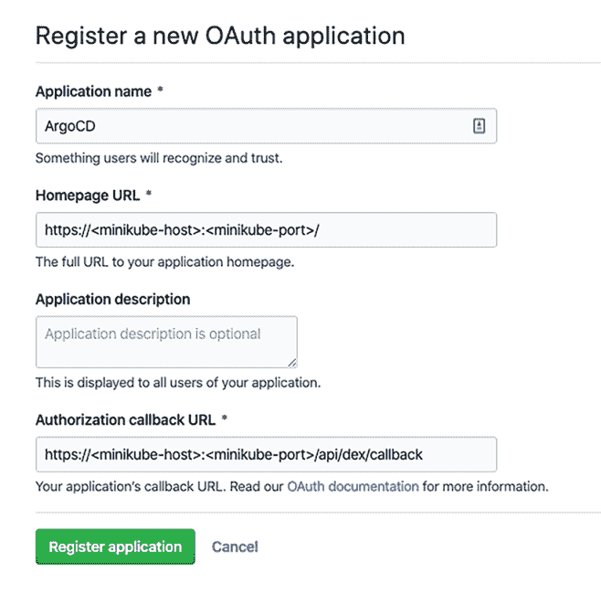

图 9.10 新的 GitHub OAuth 应用程序设置包括应用程序名称和描述、主页 URL，最重要的是，授权回调 URL。

指定您选择的应用程序名称和与 Argo CD 网页用户界面 URL 匹配的首页 URL。最重要的应用程序设置是回调 URL。回调 URL 的值是 Argo CD 网页用户界面 URL 加上 /api/dex/callback 路径。使用 minikube 的示例 URL 可能是 http://192.168.64.2:32638/api/dex/callback。

创建应用程序后，您将被重定向到 OAuth 应用程序设置页面。复制应用程序客户端 ID 和客户端密钥。这些值将用于配置 Argo CD 设置。

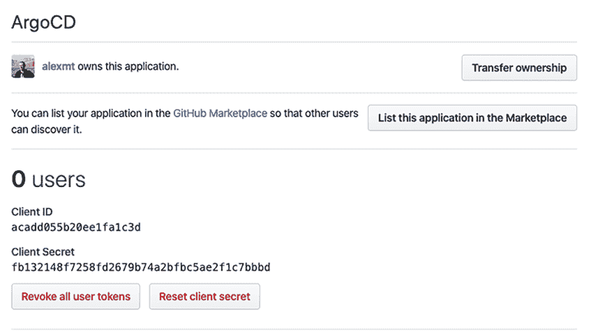

图 9.11 GitHub OAuth 应用程序设置页面显示客户端 ID 和客户端密钥值，这些值是配置 SSO 集成所必需的。

在 argocd-cm.yaml 文件中将占位符值替换为您的环境值。

列表 9.2 http://mng.bz/pV1G

```
apiVersion: v1
kind: ConfigMap
metadata:
  name: argocd-cm
  labels:
    app.kubernetes.io/name: argocd-cm
    app.kubernetes.io/part-of: argocd
data:
  url: https://<minikube-host>:<minikube-port>   ❶

  dex.config: |
    connectors:
      - type: github
        id: github
        name: GitHub
        config:
          clientID: <client-id>                  ❷
          clientSecret: <client-secret>          ❸
          loadAllGroups: true
```

❶ 面向外部的基 URL Argo CD URL

❷ GitHub OAuth 应用程序客户端 ID

❸ GitHub OAuth 应用程序客户端密钥

使用 `kubectl apply` 命令更新 Argo CD ConfigMap：

```
$ kubectl apply -f ./argocd-cm.yaml -n argocd
```

您已经准备就绪！在浏览器中打开 Argo CD 用户界面并使用“通过 GitHub 登录”按钮。

### 9.4.2 访问控制

您可能会注意到，使用 GitHub SSO 集成成功登录后，应用程序列表页面为空。如果您尝试创建新的应用程序，您将看到“权限拒绝”错误。这种行为是预期的，因为我们尚未为新 SSO 用户授予任何权限。为了向用户提供适当的访问权限，我们需要更新 Argo CD 访问控制设置。

Argo CD 提供了一个灵活的基于角色的访问控制（RBAC）系统，其实施基于 Casbin，^(8) 一个强大的开源访问控制库。Casbin 提供了一个非常坚实的基础，并允许配置各种访问控制规则。

RBAC Argo CD 设置是通过 `argocd-rbac-cm` `ConfigMap` 配置的。为了快速深入了解配置细节，让我们更新 ConfigMap 字段，然后一起查看每个更改。

在 argocd-rbac-cm.yaml 文件中将 `<username>` 占位符替换为您的 GitHub 账户用户名。

列表 9.3 http://mng.bz/OEPn

```
apiVersion: v1
kind: ConfigMap
metadata:
  name: argocd-rbac-cm
  labels:
    app.kubernetes.io/name: argocd-rbac-cm
    app.kubernetes.io/part-of: argocd
data:

  policy.csv: |                                      ❶
    p, role:developer, applications, *, */*, allow                   
    g, role:developer, role:readonly                                 

    g, <username>, role:developer                                    

  scopes: '[groups, preferred_username]'             ❷
```

❶ policy.csv 包含基于角色的访问规则。

❷ 范围设置指定了用于推断用户组的 JWT 声明。

使用 `kubectl apply` 命令应用 RBAC 更改：

```
$ kubectl apply -f ./argocd-rbac-cm.yaml -n argocd
```

此配置中的 `policy.csv` 字段定义了一个名为 `role:developer` 的角色，该角色对 Argo CD 应用程序拥有完全权限，并且对 Argo CD 系统设置拥有只读权限。该角色授予任何属于名称与您的 GitHub 账户用户名匹配的组的用户。一旦应用更改，刷新应用程序列表页面并尝试同步 `sample-app` 应用程序。

我们介绍了一些新的术语。让我们回顾一下角色、组和声明是什么，以及它们是如何协同工作的。

角色

角色允许或拒绝对 Argo CD 对象上的特定主题执行一组动作。角色以以下形式定义

```
p, subject, resource, action, object, effect
```

其中

+   `p`表示 RBAC 策略行。

+   `subject`是一个组。

+   `resource`是 Argo CD 资源类型之一。Argo CD 支持以下资源：`"clusters"`、`"projects"`、`"applications"`、`"repositories"`、`"certificates"`、`"accounts"`。

+   `action`是对资源可能执行的动作名称。所有 Argo CD 资源都支持以下动作：`"get"`、`"create"`、`"update"`、`"delete"`。`"*"`值匹配任何动作。

+   `object`是一个标识特定资源实例的模式。`"*"`值匹配任何实例。

+   `effect`定义了角色是授予还是拒绝动作。

此示例中的`role:developer`角色允许对任何 Argo CD 应用程序执行任何动作：

```
p, role:developer, applications, *, */*, allow
```

组

组提供识别一组用户的能力，并与 OIDC 集成协同工作。在成功执行 OIDC 身份验证后，最终用户会收到一个 JWT 令牌，该令牌验证用户身份并提供存储在令牌断言中的额外元数据。

JWT 令牌 JWT 令牌是一个互联网标准，用于创建基于 JSON 的访问令牌，该令牌断言一些断言。^(9)

令牌随每个 Argo CD 请求提供。Argo CD 从配置的令牌断言列表中提取用户所属的组列表，并使用它来验证用户权限。

以下是由 Dex 生成的令牌断言示例：

```
{
  "iss": "https://192.168.64.2:32638/api/dex",
  "sub": "CgY0MjY0MzcSBmdpdGh1Yg",
  "aud": "argo-cd",
  "exp": 1585646367,
  "iat": 1585559967,
  "at_hash": "rAz6dDHslBWvU6PiWj_o9g",
  "email": "AMatyushentsev@gmail.com",
  "email_verified": true,
  "groups": [
    "gitopsbook"
  ],
  "name": "Alexander Matyushentsev",
  "preferred_username": "alexmt"
}
```

令牌包含两个可能对授权有用的断言：

+   `groups`包括用户所属的 GitHub 组织和团队列表。

+   `preferred_username`是 GitHub 账户用户名。

默认情况下，Argo CD 使用`groups`从 JWT 令牌中检索用户组。我们已通过`scopes`设置添加了`preferred_username`断言，以便可以通过名称识别 GitHub 用户。

练习 9.10

更新`argocd-rbac-cm` ConfigMap，以便根据用户的电子邮件提供对 GitHub 用户的管理员访问权限。

注意：本章涵盖了 Argo CD 的重要基础，并为您进一步学习做好准备。探索 Argo CD 文档，了解差异逻辑定制、微调配置管理工具、高级安全功能（如身份验证令牌）等。项目不断进化，并在每个版本中添加新功能。查看 Argo CD 博客以了解最新变化，并在 Argoproj 的 Slack 频道中不要犹豫提问。

### 9.4.3 声明式管理

正如你可能已经注意到的，Argo CD 提供了大量的配置设置。RBAC 策略、SSO 设置、应用程序和项目——所有这些都需要有人来管理。好消息是你可以利用 GitOps 并使用 Argo CD 来自动管理自己！

所有 Argo CD 设置都持久化在 Kubernetes 资源中。SSO 和 RBAC 设置存储在 ConfigMap 中，而应用程序和项目存储在自定义资源中，因此您可以将这些资源清单存储在 Git 仓库中，并配置 Argo CD 使用它作为真相来源。这项技术非常强大，允许我们管理配置设置，以及无缝升级 Argo CD 版本。

作为第一步，让我们演示如何将我们刚刚强制执行的 SSO 和 RBAC 更改转换为声明性配置。为此，我们需要创建一个 Git 仓库，用于存储每个 Argo CD 组件的清单定义。您可以直接从[`github.com/gitopsbook/resources`](https://github.com/gitopsbook/resources)仓库中的代码列表作为起点。导航到仓库的 GitHub URL，创建您个人的分叉，以便您可以存储特定于您环境的设置。

需要的清单文件位于第九章目录中，我们应该首先查看的文件如下所示。

列表 9.4 http://mng.bz/YqRN

```
apiVersion: kustomize.config.k8s.io/v1beta1
kind: Kustomization
resources:
- https://raw.githubusercontent.com/argoproj/argo-cd/stable/manifests/install.yaml                      ❶

patchesStrategicMerge:     
- argocd-cm.yaml                       ❷
- argocd-rbac-cm.yaml                  ❸
- argocd-server.yaml                   ❹
```

❶ 包含默认 Argo CD 清单的远程文件 URL

❷ 包含 argocd-cm ConfigMap 修改的文件路径

❸ 包含 argocd-rbac-cm ConfigMap 修改的文件路径

❹ 包含 argocd-server 服务修改的文件路径

kustomization.yaml 文件包含对默认 Argo CD 清单和具有特定环境更改的文件的引用。

下一步是将特定环境的更改移动到 Git 中，并将它们推送到远程 Git 仓库。克隆分叉的 Git 仓库：

```
$ git clone git@github.com:<USERNAME>/resources.git
```

重复第 9.4.1 节和第 9.4.2 节中描述的 argocd-cm.yaml 和 argocd-rbac-cm.yaml 文件的更改。在 argocd-cm.yaml 中的 ConfigMap 清单中添加 SSO 配置。更新 argocd-rbac-cm.yaml 文件中的 RBAC 策略。一旦文件更新，提交并将更改推回远程仓库：

```
$ git commit -am  "Update Argo CD configuration"
$ git push
```

最困难的部分已经完成！Argo CD 配置更改不受版本控制，可以使用 GitOps 方法进行管理。最后一步是创建一个 Argo CD 应用程序，将基于 Kustomize 的清单从您的 Git 仓库部署到`argocd`命名空间：

```
$ argocd app create argocd \                                                                                                                                                              
--repo https://github.com/<USERNAME>/resources.git \
--path chapter-09 \
--dest-server https://kubernetes.default.svc \
--dest-namespace argocd \
--sync-policy auto
application 'argocd' created
```

一旦创建应用程序，Argo CD 应该检测已部署的资源并可视化检测到的偏差。

那么，如何管理应用程序和项目呢？两者都由 Kubernetes 自定义资源表示，也可能使用 GitOps 进行管理。下一条清单中的清单代表了我们之前在章节中手动创建的`sample-app` Argo CD 应用程序的声明性定义。为了开始以声明性方式管理`sample-app`，将 sample-app.yaml 添加到 kustomization.yaml 的资源部分，并将更改推回您的仓库分叉。

列表 9.5 http://mng.bz/Gx9q

```
apiVersion: argoproj.io/v1alpha1
kind: Application
metadata:
  name: sample-app
spec:
  destination:
    namespace: default
    server: https://kubernetes.default.svc
  project: default
  source:
    path: .
    repoURL: https://github.com/<username>/sample-app-deployment
```

如您所见，您不必在声明式和管理式管理风格之间做出选择。Argo CD 支持同时使用这两种风格，以便某些设置使用 GitOps 管理，而某些设置使用命令式命令管理。

## 摘要

+   Argo CD 考虑到企业需求而设计，可以作为集中式服务提供给大型企业，以支持多租户和多集群。

+   作为持续部署工具，Argo CD 还提供了 Git、目标 Kubernetes 集群和运行状态之间的详细差异，以实现可观察性。

+   Argo CD 自动化部署的三个阶段：

    +   获取资源清单。

    +   检测并修复偏差。

    +   将结果呈现给最终用户。

+   Argo CD 提供了用于配置应用程序部署的 CLI，并且可以通过脚本集成到 CI 解决方案中。

+   Argo CD 的 CLI 和 Web 界面可用于检查应用程序的同步和健康状态。

+   Argo CD 提供资源钩子，以启用对部署生命周期的额外自定义。

+   Argo CD 还提供支持以确保部署完成和应用程序就绪。

+   Argo CD 支持企业级 SSO 和 RBAC 集成，以实现单点登录和访问控制。

* * *

1. [`argoproj.github.io/projects/argo-cd`](https://argoproj.github.io/projects/argo-cd).

2.[`mng.bz/aomz`](https://shortener.manning.com/aomz).

3.[`argoproj.github.io/argo-cd/getting_started/`](https://argoproj.github.io/argo-cd/getting_started/).

4.[`help.github.com/en/github/getting-started-with-github/fork-a-repo`](https://help.github.com/en/github/getting-started-with-github/fork-a-repo).

5.[`argoproj.github.io/argo-cd/user-guide/auto_sync/`](https://argoproj.github.io/argo-cd/user-guide/auto_sync/).

6.[`mng.bz/e5Ez`](http://mng.bz/e5Ez).

7.[`github.com/dexidp/dex`](https://github.com/dexidp/dex).

8.[`github.com/casbin/casbin`](https://github.com/casbin/casbin).

9.[`en.wikipedia.org/wiki/JSON_Web_Token`](https://en.wikipedia.org/wiki/JSON_Web_Token).
