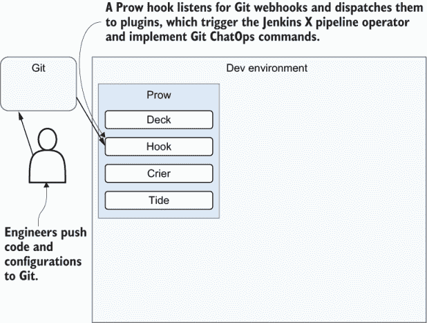
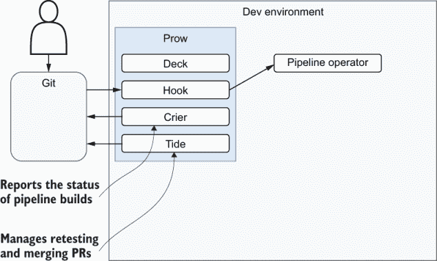
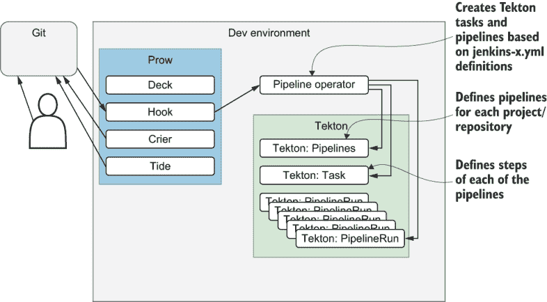
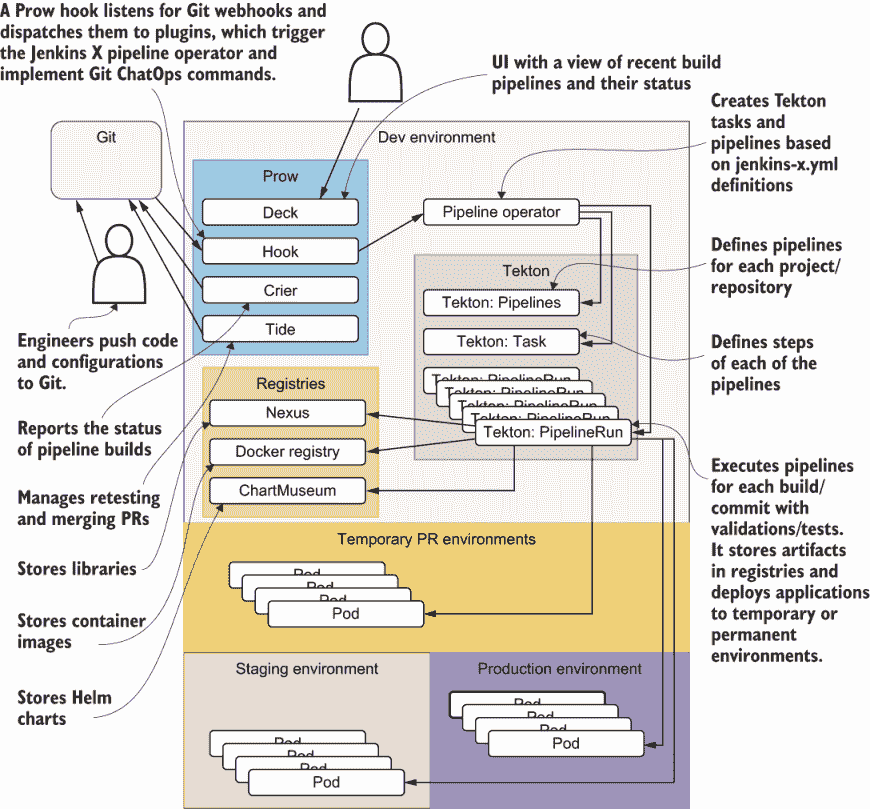
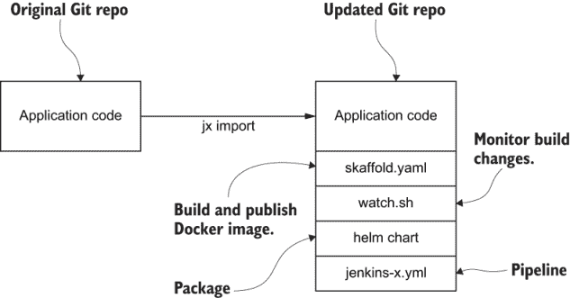
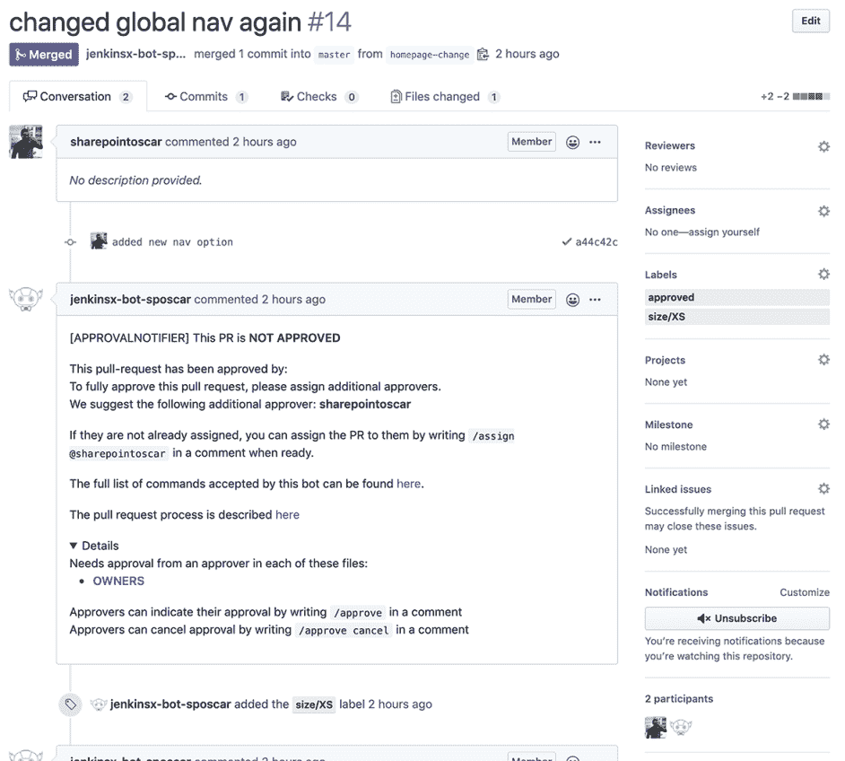
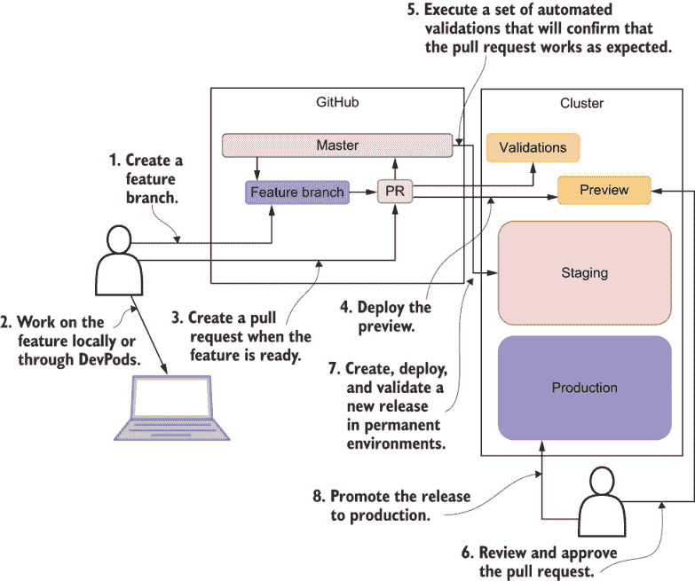

# 10 Jenkins X

本章涵盖

+   什么是 Jenkins X？

+   安装 Jenkins X

+   将项目导入 Jenkins X

+   在 Jenkins X 中将发布版本推送到生产环境

*本章由 Viktor Farcic 和 Oscar Medina 贡献。*

在本章中，你将学习如何使用 Jenkins X 将我们的参考示例应用程序部署到 Kubernetes。你还将了解 Prow、Jenkins X 管道操作员和 Tekton 如何协同工作以构建 CI/CD 管道。

我们建议你在阅读本章之前先阅读第 1、2、3 和 5 章。

## 10.1 什么是 Jenkins X？

要理解 Jenkins X 的复杂性和内部工作原理，我们需要了解 Kubernetes。然而，我们不需要了解 Kubernetes 就可以使用 Jenkins X。这是项目的主要贡献之一。Jenkins X 允许我们利用 Kubernetes 的力量，而无需花费无数的时间学习 Kubernetes 不断增长的“正确做事”的列表。Jenkins X1 是一个开源工具，它将复杂的过程简化为可以快速采用的概念，而无需花费数月时间试图弄清楚“正确做事的方式”。它通过移除和简化由 Kubernetes 及其生态系统的整体复杂性引起的一些问题来帮助用户。如果你确实是一个 Kubernetes 大师，你会欣赏 Jenkins X 所投入的所有努力。如果你不是，你将能够直接进入并利用 Kubernetes 的力量，而不会因为 Kubernetes 的复杂性而感到沮丧。在第 10.2 节中，我们将详细讨论 Jenkins X 的模式和工具。

注意：Jenkins X 是一个由 CloudBees 提供企业支持的免费、开源工具。2

现在，大多数软件供应商都在构建下一代软件以使其成为 Kubernetes 原生的，或者至少在 Kubernetes 内运行得更好。一个完整的生态系统正在出现，并将 Kubernetes 视为一个空白画布。因此，每天都有新的工具被添加，而且越来越明显，Kubernetes 提供了几乎无限的可能性。然而，这也带来了更高的复杂性。选择使用哪些工具比以往任何时候都更难。我们将如何开发我们的应用程序？我们将如何管理不同的环境？我们将如何打包我们的应用程序？我们将应用哪种流程来管理应用程序的生命周期？等等。组装一个包含所有工具和流程的 Kubernetes 集群需要时间，而学习如何使用我们所组装的就像是一个永无止境的故事。Jenkins X 的目标就是移除这些以及其他障碍。

Jenkins X 有自己的观点。它定义了软件开发生命周期的许多方面，并为我们做出决策。它告诉我们该做什么以及如何做。它就像一个度假时的导游，告诉你去哪里，看什么，何时拍照，何时休息。同时，它也是灵活的，允许高级用户调整它以满足他们的需求。

Jenkins X 的真正力量在于流程、工具的选择以及将一切包裹成一个易于学习和使用的整体粘合剂。我们（在软件行业工作的人）倾向于不断重新发明轮子。我们花费无数小时试图弄清楚如何更快地开发我们的应用程序，以及如何拥有尽可能接近生产环境的本地环境。我们投入时间寻找能够让我们更有效地打包和部署应用程序的工具。我们设计构成持续交付管道的步骤。我们编写脚本来自动化重复性任务。然而，我们无法摆脱这种感觉，我们可能正在重新发明别人已经完成的事情。Jenkins X 设计来帮助我们做出这些决定，并帮助我们选择适合工作的正确工具。它是一系列行业最佳实践的集合。在某些情况下，Jenkins X 是定义这些实践的人，而在其他情况下，它帮助我们采用其他人定义的实践。

如果我们即将开始一个新的项目，Jenkins X 将创建结构和所需的文件。如果我们需要一个包含所有工具、已安装和配置好的 Kubernetes 集群，Jenkins X 会这样做。如果我们需要创建 Git 仓库、设置 webhooks^(3) 和创建持续交付管道，我们只需要执行一个单一的 `jx` 命令。Jenkins X 所做的事情列表非常庞大，并且每天都在增长。

Jenkins 与 Jenkins X 如果你对 Jenkins 很熟悉，你需要清除你可能已经拥有的任何 Jenkins 经验。当然，Jenkins 是存在的，但它只是整个包的一部分。Jenkins X 与“传统 Jenkins”非常不同。差异如此之大，你唯一接受它的方式就是忘记你所知道的 Jenkins 知识，从头开始。

## 10.2 探索 Prow、Jenkins X 管道操作员和 Tekton

Jenkins X 的无服务器版本，或者有些人称之为 Jenkins X 新一代，是试图重新定义我们在 Kubernetes 集群内如何进行持续交付和 GitOps。它是通过将相当多的工具组合成一个易于使用的捆绑包来做到这一点的。因此，大多数人不需要理解各个部分独立工作或如何全部集成的复杂性。相反，许多人只需将更改推送到 Git，然后让系统完成剩余的工作。但是，总有那些想了解引擎盖下发生什么的人。为了满足那些渴望洞察的人，我们将探索在无服务器 Jenkins X 平台上涉及的过程和组件。了解由 Git webhook 启动的事件流将让我们了解解决方案是如何工作的，并有助于我们后来在深入研究每个新组件时。

一切从向 Git 仓库的推送开始，这反过来会向集群发送 webhook 请求。与传统 Jenkins 设置的不同之处在于，没有 Jenkins 来接受这些请求。相反，我们有 Prow.^(4) 它做很多事情，但在 webhook 的上下文中，它的任务是接收请求并决定下一步做什么。这些请求不仅限于推送事件，还包括我们可以通过拉取请求注释指定的斜杠命令（例如`/approve`）。

Prow 由几个不同的组件（deck、hook、crier、tide 等）组成。然而，我们不会深入探讨每个组件的角色。现在，重要的是要注意，Prow 是集群的入口点。它接收由 Git 动作（如推送）或通过评论中的斜杠命令生成的 Git 请求。

在收到请求后，Prow 可能会做很多事情。如果请求来自 Git 评论中的命令，它可能会重新运行测试、合并拉取请求、分配给某个人，或者执行许多其他与 Git 相关的操作。如果 webhook 通知它有新的推送，它将向 Jenkins X 管道操作员发送请求，确保运行与定义的管道对应的构建。最后，Prow 还将构建状态报告回 Git。



图 10.1 工程师将代码和配置推送到 Git。Prow 钩子监听 Git webhook 并分发到插件。

这些功能并不是 Prow 可能执行的所有动作类型，但到目前为止，你可能已经抓住了大概。Prow 负责 Git 和集群内部进程之间的通信。



图 10.2 当 Prow 钩子收到 Git webhook 的请求时，它将其转发到 Jenkins X 管道操作员。

操作员的角色是从启动过程的仓库中获取 jenkins-x.yml 文件，并将其转换为 Tekton 任务和管道。它们反过来定义了在向 Git 推送更改时应执行的整体管道。

Tekton Tekton 是一个 Kubernetes 原生开源框架 CI/CD 系统.^(5)



图 10.3 管道操作员简化了我们的持续交付流程的定义，而 Tekton 为每个项目/仓库定义管道时做繁重的工作。

Tekton 是一个非常底层的解决方案，并不打算直接使用。编写 Tekton 定义可能会非常痛苦且复杂。管道操作员通过易于学习和使用的 YAML 格式简化了定义管道的过程。列表 10.1 是基础管道将提供的内容示例。

注意：正如您将在第 10.3 节中发现的那样，您项目的管道文件将被称为 jenkins-x.yml，其中包含单行“`buildPack: go`”，以引用以下管道文件。如果您想了解更多关于管道如何工作，请参阅 Jenkins X 文档.^(6)

列表 10.1 http://mng.bz/zx0a

```
extends:
  import: classic
  file: go/pipeline.yaml
pipelines:
  pullRequest:
    build:
      steps:
      - sh: export VERSION=$PREVIEW_VERSION && skaffold build -f skaffold.yaml
        name: container-build
    postBuild:
      steps:
      - sh: jx step post build --image $DOCKER_REGISTRY/$ORG/$APP_NAME:$PREVIEW_VERSION
        name: post-build
    promote:
      steps:
      - dir: /home/jenkins/go/src/REPLACE_ME_GIT_PROVIDER/REPLACE_ME_ORG/REPLACE_ME_APP_NAME/charts/preview
        steps:
        - sh: make preview
          name: make-preview
        - sh: jx preview --app $APP_NAME --dir ../..
          name: jx-preview

  release:
    build:
      steps:
      - sh: export VERSION=`cat VERSION` && skaffold build -f skaffold.yaml
        name: container-build
      - sh: jx step post build --image $DOCKER_REGISTRY/$ORG/$APP_NAME:\$(cat VERSION)
        name: post-build
    promote:
      steps:
      - dir: /home/jenkins/go/src/REPLACE_ME_GIT_PROVIDER/REPLACE_ME_ORG/REPLACE_ME_APP_NAME/charts/REPLACE_ME_APP_NAME
        steps:
        - sh: jx step changelog --version v\$(cat ../../VERSION)
          name: changelog
        - comment: release the helm chart
          name: helm-release
          sh: jx step helm release
        - comment: promote through all 'Auto' promotion Environments
          sh: jx promote -b --all-auto --timeout 1h --version \$(cat ../../VERSION)
          name: jx-promote
```

Tekton 为每个推送到相关分支（主分支、PRs）的构建创建一个 `PipelineRun`。它执行所有我们需要验证推送的步骤。它运行测试，将二进制文件存储在注册表中（Docker 注册表、Nexus 和 ChartMuseum），并将发布部署到临时（PR）或永久阶段或生产环境。

完整流程可以在图 10.4 中看到。



图 10.4 事件完整流程从 PR 开始，经过 Prow 的 webhook，再到管道操作员，最后到 Tekton。Jenkins X 将为每个构建/提交执行管道并部署应用程序。

练习 10.1

哪个组件将接收 Git webhook 请求？哪个组件将协调部署？

## 10.3 将项目导入 Jenkins X

您可以看到我们如何使用 Jenkins X 快速入门来快速推进新应用程序的开发和持续交付。然而，您的公司可能不是昨天成立的。这意味着您已经有一些应用程序，并且您可能希望将它们迁移到 Jenkins X。

从 Jenkins X 的角度来看，导入现有项目相对简单。我们只需执行 `jx import` 命令，Jenkins X 就会施展其魔法。它会创建我们需要的文件。如果我们还没有 skaffold.yml，它将为我们生成。如果我们不创建 Helm 图表，它也会创建。没有 Dockerfile？没问题。我们也会得到它。从未为该项目编写过 Jenkins 管道？再次，这不是问题。我们将得到一个自动生成的 jenkins-x.yml 文件。Jenkins X 将重用我们已有的东西，并创建我们缺少的东西。

导入过程不仅限于创建缺失的文件并将它们推送到 Git。它还会在 Jenkins 中创建一个作业，在 GitHub 中创建钩子，以及许多其他事情。

注意：有关如何安装 Jenkins X 的更多信息，请参阅附录 B。

### 10.3.1 导入项目

我们将导入存储在 `gitopsbook/sample-app` 仓库中的应用程序。我们将用它作为测试导入过程以及解决可能遇到的问题的试验品。

但是，在我们导入仓库之前，您必须先分叉代码。否则，由于您还不是该特定仓库的协作者（尚不是），您将无法推送更改：

```
$ open "https://github.com/gitopsbook/sample-app"
```

确保您已登录，并点击位于右上角的 Fork 按钮。按照屏幕上的说明操作。

接下来，您需要克隆您刚刚分叉的仓库：

```
$ GH_USER=[...]                                          ❶
$ git clone https://github.com/$GH_USER/sample-app.git
$ cd sample-app
```

❶ 在执行后续命令之前，请将 [...] 替换为您的 GitHub 用户名。

现在你应该已经在你分叉的仓库的主分支中有了预期的代码。你可以自由地查看我们有什么，只需在浏览器中打开仓库即可。幸运的是，有一个`jx`命令可以做到这一点：

```
$ jx repo --batch-mode
```

在我们将项目导入到 Jenkins X 之前，让我们快速探索一下项目的文件：

```
$ ls -1
Dockerfile
Makefile
README.md
main.go
```

如你所见，那个仓库中几乎什么都没有，只有 Go^(7)代码 (*.go)。

这个项目是我们可能想要导入到 Jenkins X 中的可能项目范围的一个极端。它只有应用程序的代码。有一个`Dockerfile`。然而，没有 Helm 图表或构建二进制的脚本，也没有运行测试的机制，并且肯定没有定义应用程序持续交付管道的`jenkins-x.yml`文件。这里只有代码，几乎没有其他东西。

这种情况可能并不适用于你。也许你确实有运行测试或构建代码的脚本。或者，你可能已经是 Kubernetes 的重度用户，并且已经有一个 Helm 图表。你可能还有其他文件。我们稍后会讨论这些情况。现在，我们将专注于没有任何东西，只有应用程序代码的情况。

让我们看看当我们尝试将那个仓库导入到 Jenkins X 中会发生什么：

```
$ jx import
intuitdep954b9:sample-app byuen$ jx import
WARNING: No username defined for the current Git server!
? github.com username: billyy                                         ❶
To be able to create a repository on github.com we need an API Token
Please click this URL and generate a token                            ❷
https://github.com/settings/tokens/new?scopes=repo, read:user,read:org,user:email,write:repo_hook,delete_repo

Then COPY the token and enter it below:

? API Token: ****************************************
performing pack detection in folder /Users/byuen/git/sample-app
--> Draft detected Go (48.306595%)
selected pack: /Users/byuen/.jx/draft/packs/github.com/jenkins-x-buildpacks/jenkins-x-kubernetes/packs/go
replacing placeholders in directory /Users/byuen/git/sample-app
app name: sample-app, git server: github.com, org: billyy, Docker registry org: hazel-charter-283301
skipping directory "/Users/byuen/git/sample-app/.git"
Draft pack go added
? Would you like to define a different preview Namespace? No          ❸
Pushed Git repository to https://github.com/billyy/sample-app.git
Creating GitHub webhook for billyy/sample-app for url http://hook-jx.34.74.32.142.nip.io/hook
Created pull request: https://github.com/billyy/environment-cluster-1-dev/pull/1
Added label updatebot to pull request https://github.com/billyy/environment-cluster-1-dev/pull/1
created pull request https://github.com/billyy/environment-cluster-1-dev/pull/1 on the development 
    git repository https://github.com/billyy/environment-cluster-1-dev.git
regenerated Prow configuration
PipelineActivity for billyy-sample-app-master-1
upserted PipelineResource meta-billyy-sample-app-master-cdxm7 
    for the git repository https://github.com/billyy/sample-app.git
upserted Task meta-billyy-sample-app-master-cdxm7-meta-pipeline-1
upserted Pipeline meta-billyy-sample-app-master-cdxm7-1
created PipelineRun meta-billyy-sample-app-master-cdxm7-1
created PipelineStructure meta-billyy-sample-app-master-cdxm7-1

Watch pipeline activity via:    jx get activity -f sample-app -w
Browse the pipeline log via:    jx get build logs billyy/sample-app/master
You can list the pipelines via: jx get pipelines
When the pipeline is complete:  jx get applications

For more help on available commands see: https://jenkins-x.io/developing/browsing/

Note that your first pipeline may take a few minutes to start while the necessary images get downloaded!
```

❶ GitHub 用户名

❷ 生成新的令牌

❸ 预览命名空间默认为“否”

从输出中我们可以看到，Jenkins X 检测到项目 100%是用 Go 编写的，因此选择了 Go 构建包。它将构建包应用到本地仓库，并将更改推送到 GitHub。此外，它还创建了一个 Jenkins 项目以及一个 GitHub webhook，每当我们将更改推送到所选分支之一时，它都会触发构建。这些分支默认为主分支、develop、PR-.*和 feature.*。我们可以通过添加`--branches`标志来更改模式。但是，就我们的目的而言，以及许多其他情况，这些分支正是我们所需要的。



图 10.5 `jx` `import` 添加的文件

现在，让我们再次查看本地仓库副本中的文件：

```
$ ls -1
Dockerfile
Makefile
OWNERS
OWNERS_ALIASES
README.md
charts
jenkins-x.yml
main.go
skaffold.yaml
watch.sh
```

我们可以看到，通过导入过程，项目添加了相当多的新文件。我们有一个`Dockerfile`，它将被用来构建容器镜像，我们还有一个 jenkins-x.yml，它定义了我们管道的所有步骤。

我们还得到了一个 Makefile，它定义了构建、测试和安装应用程序的目标。还有一个包含用于打包、安装和升级我们应用程序的 Helm 格式的文件的 charts 目录。我们还得到了 watch.sh，它监控构建更改并调用 skaffold.yaml。skaffold.yaml 包含构建和发布容器镜像的指令。还有一些其他新文件（例如：OWNERS）被添加到混合中。

现在项目已经在 Jenkins X 中，我们应该将其视为一项活动，并观察第一次构建的实际操作。您已经知道我们可以限制 Jenkins X 活动的检索范围到特定的项目，并且可以使用`--watch`来监视进度。

注意：在继续教程的其余部分之前，请等待`jx` `promote`和`PullRequest`完成。如果过程超过 60 分钟，拉取请求将显示“失败”状态。如果您检查 GitHub，PR 将在`jx` `promote`完成后仍然合并。

```
$ jx get activities --filter sample-app --watch
STEP                                                         STARTED AGO DURATION STATUS
billyy/sample-app/master #1                                  11h31m0s  1h4m20s Succeeded Version: 0.0.1
 meta pipeline                                                1h25m2s      31s Succeeded 
    Credential Initializer                                    1h25m2s       0s Succeeded 
    Working Dir Initializer                                   1h25m2s       1s Succeeded 
    Place Tools                                               1h25m1s       1s Succeeded 
    Git Source Meta Billyy Sample App Master R Xnfl4 Vrvtm    1h25m0s       8s Succeeded https://github.com/billyy/sample-app.git
    Setup Builder Home                                       1h24m52s       0s Succeeded 
    Git Merge                                                1h24m52s       1s Succeeded 
    Merge Pull Refs                                          1h24m51s       1s Succeeded 
    Create Effective Pipeline                                1h24m50s       7s Succeeded 
    Create Tekton Crds                                       1h24m43s      12s Succeeded 
  from build pack                                            1h23m49s 1h13m39s Succeeded 
    Credential Initializer                                   1h23m49s       2s Succeeded 
    Working Dir Initializer                                  1h23m47s       2s Succeeded 
    Place Tools                                              1h23m45s       4s Succeeded 
    Git Source Billyy Sample App Master Releas 658x6 Nzdbp   1h23m41s      21s Succeeded https://github.com/billyy/sample-app.git
    Setup Builder Home                                       1h23m20s       2s Succeeded 
    Git Merge                                                1h23m18s      11s Succeeded 
    Setup Jx Git Credentials                                  1h23m7s      12s Succeeded 
    Build Make Build                                         1h22m55s       1s Succeeded 
    Build Container Build                                    1h22m54s   11m56s Succeeded 
    Build Post Build                                         1h10m58s       4s Succeeded 
    Promote Changelog                                        1h10m54s       6s Succeeded 
    Promote Helm Release                                     1h10m48s       8s Succeeded 
    Promote Jx Promote                                       1h10m40s  1h0m30s Succeeded 
  Promote: staging                                           1h10m31s          Running 
    PullRequest                                              1h10m31s  1h0m21s Failed  PullRequest: https://github.com/billyy/environment-cluster-1-staging/pull/1
```



图 10.6 Jenkins X 将生成一个拉取请求以添加我们应用程序的新版本。这就是 GitOps 在发挥作用！

管道活动为您提供了关于管道阶段和步骤的大量详细信息。然而，其中最重要的细节之一是合并到预发布环境的 PR。这告诉 Jenkins X 将我们的应用的新版本添加到 env/requirements.yaml 文件中。这就是 GitOps 在发挥作用！

到目前为止，Jenkins X 创建了它需要的文件，它创建了一个 GitHub webhook，它创建了一个管道，并将更改推送到 GitHub。因此，我们得到了第一次构建，从外观上看，它是成功的。但让我们再次检查一切是否正常。

通过点击活动输出中的链接，在浏览器中打开 PullRequest 链接，如图 10.5 所示。

到目前为止，一切顺利。`sample-app`作业向环境-cluster-1-staging 仓库创建了一个拉取请求。因此，该仓库的 webhook 应该已经启动了一个管道活动，结果应该是在预发布环境中的应用程序的新版本。我们暂时不会深入这个过程。现在，只需注意应用程序应该正在运行，我们很快就会检查这一点。

我们需要确认应用程序确实正在运行的信息在预发布环境中运行的应用程序列表中。我们将在稍后探索环境。现在，只需运行以下命令：

```
$ jx get applications
APPLICATION STAGING PODS URL
sample-app  0.0.1        http://sample-app-jx-staging.34.74.32.142.nip.io
```

我们可以在 URL 列中看到我们的应用程序应该通过哪个地址访问。复制它，并在随后的命令中使用它代替[...]：

```
$ STAGING_ADDR=[...]               ❶
$ curl "$STAGING_ADDR/demo/hello"
Kubernetes ♡ Golang!
```

❶ 预发布 URL 地址

输出显示`Kubernetes ♡ Golang!`，从而确认应用程序正在运行，并且我们可以访问它。

在我们继续之前，我们将离开 sample-app 目录。至少从应用程序生命周期角度来看，我们已经达到了最终阶段。

注意：有关完整的应用程序生命周期参考，请参阅第四章（管道）中的图 4.6。

实际上，我们跳过了创建拉取请求，这恰好是 Jenkins X 最重要功能之一。尽管如此，我们没有足够的空间来涵盖所有 Jenkins X 功能，所以我们将把 PR 和其他功能留给你自己探索（PR 可以从 `jx get activities` 命令的输出中找到）。现在，我们将通过探索推广到生产的过程来关注应用生命周期的最后阶段。我们已经涵盖了以下内容：

1.  我们看到了如何导入现有项目以及如何创建一个新项目。

1.  我们看到了如何开发构建包，这将简化那些现有构建包未涵盖或与之偏离的应用类型的流程。

1.  一旦我们将我们的应用添加到 Jenkins X 中，我们就探索了它是如何通过环境（如预发布和生产环境）实现 GitOps 流程的。

1.  然后我们进入了应用开发阶段，并探讨了 DevPods 如何帮助我们设置一个个人专用的应用环境，这简化了“传统”的设置，迫使我们花费无数小时在笔记本电脑上设置它，同时，也避免了共享开发环境的陷阱。

1.  一旦一个功能、变更或错误修复的开发完成，我们就创建了一个拉取请求，执行了自动验证，并将发布候选版本部署到了一个针对 PR 的特定预览环境中，以便我们可以手动检查它。一旦我们对所做的更改感到满意，我们就将其合并到主分支，这导致了部署到设置为接收自动推广的环境（如预发布环境）以及另一轮测试。现在，我们已经对我们的更改感到舒适，剩下要做的就是将我们的发布推广到生产环境。

需要注意的关键点是，将应用推广到生产并不是一个技术决策。当我们到达软件开发生命周期的最后一步时，我们应该已经知道发布是按预期工作的。我们已经收集了所有需要做出上线决策的信息。因此，这个选择与业务相关。“我们希望用户何时看到新版本？”我们知道每个通过管道所有步骤的发布都是生产就绪的，但我们不知道何时将其发布给用户。但是，在我们讨论何时将某个东西发布到生产之前，我们应该决定由谁来执行这个操作。执行者将决定何时是正确的时间。是一个人批准拉取请求，还是由机器来处理？

商业、市场和管理工作可能是由负责将内容升级到生产环境的决策者。在这种情况下，我们不能在代码合并到主分支时（就像在预览环境中一样）启动这个过程，这意味着我们需要一个机制通过命令手动启动这个过程。如果执行命令过于复杂和令人困惑，添加一个按钮应该很简单（我们将在稍后通过 UI 探索这一点）。也可能存在没有人决定将内容升级到生产环境的情况。相反，我们可以自动将每个更改升级到主分支。在这两种情况下，启动升级的命令是相同的。唯一的区别在于执行它的行为者。是我们（人类）还是 Jenkins X（机器）？

目前，我们的生产环境设置为手动升级。因此，我们正在采用完全自动化的持续交付，只需要一个手动操作就可以将版本升级到生产环境。剩下要做的就是点击一个按钮，或者在我们这个案例中，执行一个单独的命令。我们本来可以将升级生产的步骤添加到 `Jenkinsfile` 中，那样的话，我们就是在实践持续部署（而不是持续交付）。这将导致每次合并或推送到主分支时都会进行部署。但是，我们今天不实践持续部署，我们将坚持当前的设置，并跳到最后一个持续交付的阶段。我们将把我们的最新版本升级到生产环境。

### 10.3.2 将发布升级到生产环境

现在我们觉得我们的新版本已经准备好投入生产，我们可以将其升级到生产环境。但在我们这样做之前，我们将检查是否已经在生产环境中运行了某些内容：

```
$ jx get applications --env production
APPLICATION
sample-app
```

那么，关于预览环境呢？我们必须确保我们的 `sample-app` 应用程序的发布版本在那里运行。让我们再次检查：

```
$ jx get applications --env staging
APPLICATION STAGING PODS URL
sample-app  0.0.1   1/1  http://sample-app-jx-staging.34.74.32.142.nip.io
```

对于我们正在尝试做的事情，重要的信息是 `STAGING` 列中显示的版本。



图 10.7 `jx` `promote` 命令将在生产环境中创建一个新的分支并部署到预览环境。在命令执行结束时，新版本将被升级到生产环境。

现在我们可以将 `sample-app` 的特定版本升级到生产环境：

```
$ VERSION=[...]                                                     ❶
$ jx promote sample-app --version $VERSION --env production --batch-mode
```

❶ 在执行以下命令之前，请确保将 [...] 替换为上一个命令输出中的 `STAGING` 列中的版本。

升级过程可能需要一分钟左右才能完成。您可以使用以下命令再次运行以监控状态：

```
$ jx get activities
...
Promote: production                                          4m3s    1m36s  Succeeded
    PullRequest                                              4m3s    1m34s  Succeeded
    PullRequest: https://github.com/billyy/environment-cluster-1-production/pull/2 Merge SHA: 33b48c58b3332d3abc2b0c4dcaba8d7ddc33c4b3
    Update                                                  2m29s       2s  Succeeded
    Promoted                                                2m29s       2s  Succeeded
    Application is at: http://sample-app-jx-production.34.74.32.142.nip.io

```

我们刚才执行的命令将在生产环境（environment-pisco-sour-production）中创建一个新的分支。接下来，它将遵循与之前所做任何事情相同的基于拉取请求的实践。它将创建一个拉取请求，并等待 Jenkins X 构建完成并成功。你可能会看到错误信息表明它无法查询拉取请求。这是正常的。该过程是异步的，`jx`会定期查询系统，直到收到确认拉取请求已成功处理的信

一旦处理完拉取请求，它将被合并到主分支，这将启动另一个 Jenkins X 构建。它将运行我们在仓库的`Jenkinsfile`中定义的所有步骤。默认情况下，这些步骤仅将发布版部署到生产环境，但我们可以添加额外的验证，例如集成或其他类型的测试。一旦合并到主分支的构建完成，我们将在生产环境中运行发布版，最终输出将表明合并状态检查全部通过，所以升级成功了！

手动推广（生产）的过程与我们在自动化推广（预发布）中经历的过程相同。唯一的区别是执行推广的人。自动化的推广是由应用程序管道将更改推送到 Git 中触发的。另一方面，手动推广是由我们（人类）触发的。

接下来，我们将通过检索该环境中所有应用程序来确认发布版确实已部署到生产环境：

```
$ jx get applications --env production
APPLICATION PRODUCTION PODS URL
sample-app  0.0.1           http://sample-app-jx-production.35.185.219.24.nip.io
```

在我们的情况下，输出状态表明生产环境中只有一个应用程序（`sample-app`）正在运行，并且版本号为 0.0.1。

为了安全起见，我们将向运行在生产环境中的应用程序的发布版发送请求：

```
$ PROD_ADDR=[...]                 ❶
$ curl "$PROD_ADDR/demo/hello"
Kubernetes ♡ Golang!                                
```

❶ 在执行以下命令之前，请确保将 [...] 替换为上一条命令输出的 URL 列。

## 摘要

+   Jenkins X 定义了过程、工具的选择以及将一切封装成一个易于学习和使用的统一单元的粘合剂。

+   Prow 以政策执行和自动 PR 合并的形式提供 GitHub 自动化。

+   管道操作员用于编排和简化我们持续交付过程的定义。

+   Tekton 是一个 Kubernetes 原生开源框架，用于创建持续集成和交付（CI/CD）系统。

+   要将项目导入 Jenkins X，你只需执行`jx import`命令，它将为你的仓库添加所有必要的文件，并创建管道和环境。

+   要将发布版推广到生产环境，你可以简单地执行`jx promote`命令，该命令将生成 PR 以添加新发布版，部署到预览环境进行测试，并将（部署）到生产环境。

* * *

1.[`jenkins-x.io/`](https://jenkins-x.io/).

2.[`www.cloudbees.com/`](https://www.cloudbees.com/).

3.[`developer.github.com/webhooks/`](https://developer.github.com/webhooks/)

4.[`github.com/kubernetes/test-infra/tree/master/prow`](https://github.com/kubernetes/test-infra/tree/master/prow)

5.[`cloud.google.com/tekton`](https://cloud.google.com/tekton)

6.[`jenkins-x.io/docs/reference/components/build-packs/`](https://jenkins-x.io/docs/reference/components/build-packs/)

7.[`golang.org/`](https://golang.org/)
