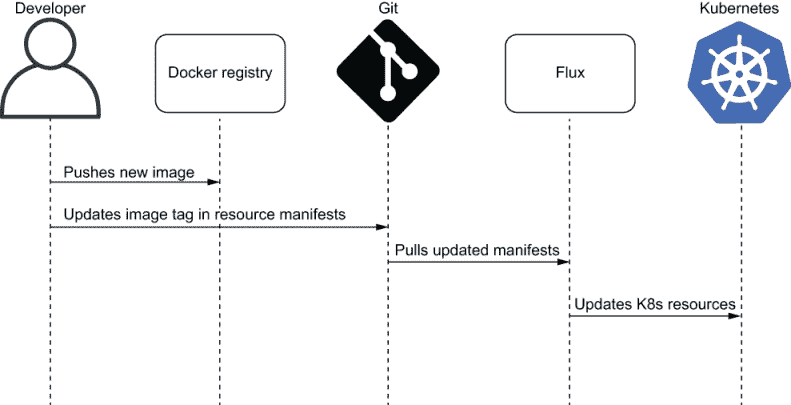
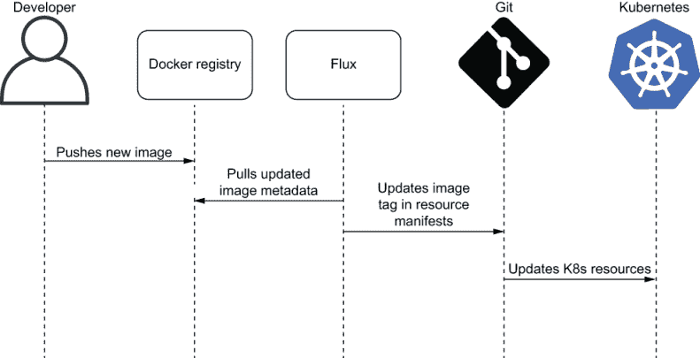
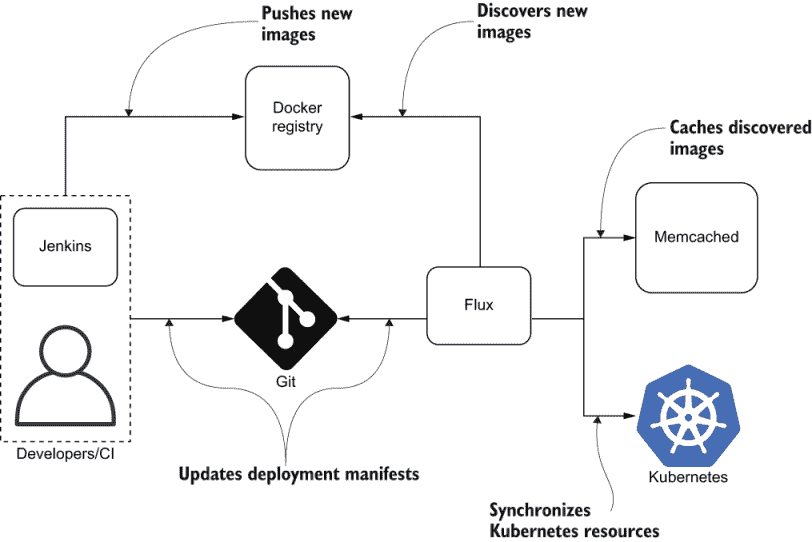
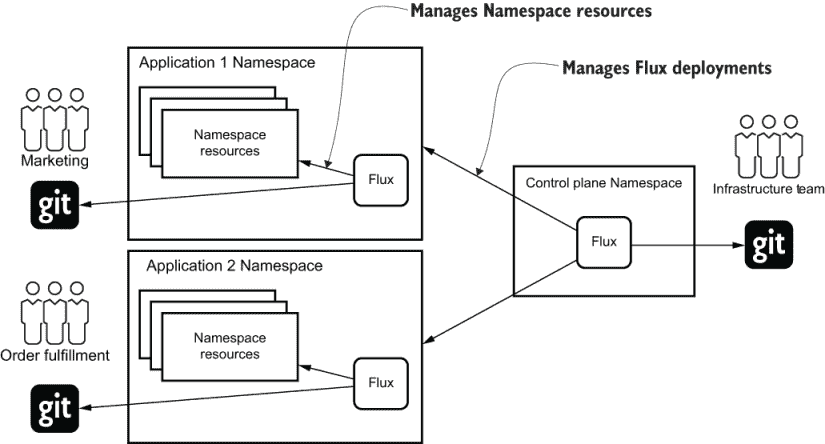

# 11 Flux

本章涵盖

+   什么是 Flux？

+   使用 Flux 部署应用程序

+   使用 Flux 设置多租户

在本章中，您将学习如何使用 Flux GitOps 操作员将我们的参考示例应用程序部署到 Kubernetes。您还将了解 Flux 如何作为多租户解决方案的一部分使用。

我们建议您在阅读本章之前阅读第 1、2、3 和 5 章。

## 11.1 什么是 Flux？

Flux 是一个开源项目，它实现了基于 GitOps 的 Kubernetes 持续部署。该项目始于 2016 年 Weaveworks，三年后加入了 CNCF 沙箱。

值得注意的是，Weaveworks 是提出*GitOps*术语的公司。该公司还制定了 Kubernetes 的 GitOps 最佳实践，并为 GitOps 的推广做出了大量贡献。Flux 的发展历程说明了 GitOps 理念如何基于实践经验随着时间的推移演变到当前的形式。

Flux 项目旨在自动化容器镜像交付到 Kubernetes，并填补持续集成和持续部署过程之间的差距。项目介绍博客中描述的工作流程专注于 Docker 注册扫描、计算最新镜像版本并将其提升到生产集群。经过多次迭代，Flux 团队意识到了以 Git 为中心的方法的所有优势。在发布 v1.0 版本之前，项目架构被重新设计，使用 Git 作为事实来源，并制定了 GitOps 工作流程的主要阶段。

### 11.1.1 Flux 做什么

Flux 专注于将清单自动交付到 Kubernetes 集群。该项目可能是本书中描述的操作员中最少有偏见的 GitOps 操作。Flux 不在 Kubernetes 之上引入任何额外的层，例如应用程序或其自己的访问控制系统。单个 Flux 实例管理一个 Kubernetes 集群，并要求用户维护一个代表集群状态的 Git 仓库。Flux 通常在管理的集群内部运行，并依赖于 Kubernetes RBAC。这种方法显著简化了 Flux 配置，并有助于降低学习曲线。

RBAC Kubernetes 支持基于角色的访问控制（RBAC），它允许容器绑定到赋予它们操作各种资源权限的角色。

Flux 的简单性也使得它几乎无需维护，并且易于集成到集群引导过程中，因为不需要新的组件或管理员权限。使用 Flux 命令行界面，Flux 部署可以轻松地集成到集群配置脚本中，以实现集群自动创建。

Flux 不仅限于集群引导。它作为应用程序的持续部署工具被成功使用。在多租户环境中，每个团队都可以安装一个具有有限访问权限的 Flux 实例，并使用它来管理单个命名空间。这完全赋予了团队管理应用程序命名空间中资源的能力，并且仍然 100%安全，因为 Flux 访问由 Kubernetes RBAC 管理。

项目的简单性带来了优点和缺点，不同团队有不同的看法。最重要的考虑因素之一是 Flux 必须由 Kubernetes 最终用户配置和维护。这意味着团队获得了更多权力，但也承担了更多责任。另一种方法，即 Argo CD 所采用的方法，是作为一项服务提供 GitOps 功能。

### 11.1.2 Docker 仓库扫描

除了 GitOps 的核心功能外，该项目还提供了一项显著的功能。Flux 能够扫描 Docker 仓库，并在新标签推送到仓库时自动更新部署仓库中的镜像。尽管这项功能不是 GitOps 的核心功能，但它简化了开发者的工作，提高了生产力。让我们考虑在没有自动化部署仓库更新的开发者工作流程。



图 11.1 开发者使用持续集成工具手动推送新镜像，然后使用新镜像的标签更新部署 Git 仓库。Flux 注意到 Git 中的清单变更并将其传播到 Kubernetes 集群。

开发团队经常抱怨第二步，因为它需要手动操作，所以他们试图自动化它。通常的解决方案是使用 CI 流水线自动化清单更新。CI 方法解决了问题，但需要脚本编写，可能不够稳定。

Flux 走得更远一步，自动化了部署仓库的更新。你不必使用 CI 系统和脚本，可以配置 Flux 在每次新镜像推送到 Docker 仓库时自动更新部署仓库。自动化 Docker 仓库扫描的开发者工作流程在图 11.2 中表示。

图 11.2 当启用自动化仓库更新时，Flux 完全控制部署仓库和 Kubernetes 集群管理。



开发者的唯一责任是进行代码更改，并让 CI 系统将更新的 Docker 镜像推送到仓库。如果镜像标签遵循语义版本控制约定，自动化的部署仓库管理特别有用。

语义版本控制 语义版本控制^(2) 是一种使用三部分版本号（主版本、次版本和修订版）来指定兼容性的正式约定。

Flux 允许配置利用语义版本约定进行图像标签过滤。典型用例是自动化次要和补丁版本，这些版本应该是安全且向后兼容的，而主要版本则需要手动部署。

与使用持续集成管道相比，Docker 仓库扫描功能的明显好处是你不需要花费时间在你的管道中实现仓库更新步骤。然而，这种便利性伴随着更多的责任。将部署仓库更新纳入持续集成管道提供了完全的控制权，并允许我们在将镜像推送到 Docker 仓库后运行更多测试。如果启用了 Flux Docker 仓库扫描，你必须确保在将其推送到 Docker 仓库之前对镜像进行了充分的测试，以避免意外部署到生产环境。

练习 11.1

考虑 Docker 仓库监控功能的优缺点，并尝试决定它是否适合你的团队。

### 11.1.3 架构

Flux 只由两个组件组成：Flux 守护进程和键值存储 Memcached.^(3)

Memcached Memcached 是一个开源的、高性能的、分布式内存对象缓存系统。

Flux 架构在图 11.3 中展示。



图 11.3 Flux 守护进程是负责 Flux 大多数功能的主要组件。它克隆 Git 仓库，生成清单，将更改传播到 Kubernetes 集群，并扫描 Docker 仓库。

在任何时候，Flux 守护进程只能有一个副本运行。然而，这并不是一个问题，因为即使守护进程在部署过程中崩溃，它也会快速且幂等地重新启动并继续部署过程。

Memcached 的主要目的是支持 Docker 仓库扫描。Flux 使用它来存储每个 Docker 图像的可用图像版本列表。Memcached 部署是一个可选组件，除非你想使用 Docker 仓库扫描功能，否则不需要。要移除它，只需在安装步骤中使用 `--registry-disable-scanning` 标志。

练习 11.2

你应该检查哪个组件的日志来排查部署问题？

## 11.2 简单应用部署

我们已经对 Flux 了解了很多，现在是时候看到它在实际中的应用了。首先，我们需要让它运行起来。Flux 安装包括两个步骤：安装 Flux CLI 和配置集群中的守护进程。使用附录 B 学习如何安装 `fluxctl` 并准备部署你的第一个应用。

### 11.2.1 部署第一个应用

`fluxctl` 和 `minikube` 应用程序是启动使用 Flux 管理 Kubernetes 资源所需的唯一两个组件。下一步是准备包含 Kubernetes 清单的 Git 仓库。我们示例应用的清单可在以下链接找到：

[`github.com/gitopsbook/sample-app-deployment`](https://github.com/gitopsbook/sample-app-deployment)

请继续创建一个仓库分支^(4) 作为第一步。Flux 需要部署仓库的写入权限以自动更新清单中的图像标签。

重置您的分支 在您之前章节工作时，您是否已经为部署仓库创建了分支？请确保撤销更改以获得最佳体验。最简单的方法是删除之前创建的分支仓库，然后再次创建。

使用 `fluxctl` 安装和配置 Flux 守护进程：

```
$ kubectl create ns flux
$ export GHUSER="YOURUSER"
$ fluxctl install \
--git-user=${GHUSER} \
--git-email=${GHUSER}@users.noreply.github.com \
--git-url=git@github.com:${GHUSER}/sample-app-deployment.git \
--git-path=. \
--namespace=flux | kubectl apply -f -
```

此命令创建 Flux 守护进程并将其配置为从您的 Git 仓库部署清单。请确保使用以下命令运行 Flux 守护进程：

```
$ kubectl rollout status deploy flux -n flux
```

作为本教程的一部分，我们将尝试自动仓库更新功能，因此我们需要给予 Flux 仓库写入访问权限。向 GitHub 仓库提供写入访问权限的方便且安全的方式是使用部署密钥。

部署密钥 部署密钥是存储在您的服务器上并授予对单个 GitHub 仓库访问权限的 SSH 密钥。

无需手动生成新的 SSH 密钥。Flux 在首次启动时生成密钥，并使用它来访问部署仓库。运行以下命令以获取生成的 SSH 密钥：

```
$ fluxctl identity --k8s-fwd-ns flux
```

导航到 [`github.com/<username>/sample-app-deployment/settings/keys /`](https://github.com/<username%3E/sample-app-deployment/settings/keys/)新，并使用 `fluxctl` 身份命令的输出创建一个新的部署密钥。请确保勾选“允许写入访问”复选框以提供对仓库的写入访问权限。

配置已完成！当您阅读此内容时，Flux 应该正在克隆仓库并部署清单。请继续检查 Flux 守护进程日志以确认。

您在日志中看到 `kubectl apply` 吗？

```
$ kubectl logs deploy/flux -n flux -f
caller=sync.go:73 component=daemon info="trying to sync git changes to the cluster" 
    old=6df71c4af912e2fc6f5fec5d911ac6ad0cd4529a new=1c51492fb70d9bdd2381ff2f4f4dc51240dfe118
caller=sync.go:539 method=Sync cmd=apply args= count=2
caller=sync.go:605 method=Sync cmd="kubectl apply -f -" took=1.224619981s err=null 
    output="service/sample-app configured\ndeployment.apps/sample-app configured"
caller=daemon.go:701 component=daemon event="Sync: 1c51492, default:service/sample-app" logupstream=false
```

太好了，这意味着 Flux 成功执行了部署。接下来，运行以下命令以确认已创建样本应用程序部署资源：

```
$ kubectl get deploy sample-app -n default
```

恭喜！您已成功使用 Flux 部署了您的第一个应用程序。

### 11.2.2 观察应用程序状态

阅读 Flux 守护进程的日志并不是获取 Flux 管理的资源信息的唯一方法。`fluxctl` CLI 提供了一组命令，允许我们获取有关集群资源的详细信息。我们应该尝试的第一个命令是 `fluxctl list-workloads`。该命令打印有关集群中管理 Pods 的所有 Kubernetes 资源的信息。运行以下命令以输出有关 `sample-app` 部署的信息：

```
$ fluxctl list-workloads --k8s-fwd-ns flux
WORKLOAD               CONTAINER   IMAGE                       RELEASE
deployment/sample-app  sample-app  gitopsbook/sample-app:v0.1  ready
```

如您从输出中看到的，Flux 正在管理一个部署，该部署使用 `gitopsbook/sample-app` 图像的 `v0.1` 版本创建了一个 `sample-app` 容器。

除了当前图像的信息外，Flux 还扫描了 Docker 仓库并收集了所有可用的图像标签。运行以下命令以打印发现的图像标签列表：

```
$ fluxctl list-images --k8s-fwd-ns flux -w default:deployment/sample-app
WORKLOAD              CONTAINER  IMAGE                  CREATED
deployment/sample-app sample-app gitopsbook/sample-app
                                           |   v0.2     27 Jan 20 05:46 UTC
                                           '-> v0.1     27 Jan 20 05:35 UTC
```

从命令输出中，我们可以看到 Flux 正确地发现了两个可用的镜像版本。此外，Flux 将 `v0.2` 识别为较新版本，并准备好升级我们的部署，如果我们配置了自动升级。让我们继续这样做。

### 11.2.3 升级部署镜像

默认情况下，Flux 不会升级资源镜像版本，除非资源具有 `fluxcd.io/automated:` `'true'` 注解。这个注解告诉 Flux 资源镜像是自动管理的，并且一旦将新版本推送到 Docker 仓库，镜像就应该升级。以下列表包含应用了注解的 `sample-app` 部署清单。

列表 11.1 deployment.yaml

```
apiVersion: apps/v1
kind: Deployment
metadata:
  name: sample-app
  annotations:
    fluxcd.io/automated: 'true'                ❶
spec:
  replicas: 1
  revisionHistoryLimit: 3
  selector:
    matchLabels:
      app: sample-app
  template:
    metadata:
      labels:
        app: sample-app
    spec:
      containers:
      - command:
        - /app/sample-app
        image: gitopsbook/sample-app:v0.1      ❷
        name: sample-app
        ports:
        - containerPort: 8080
```

❶ 启用自动化管理的注解

❷ 部署镜像标签

添加注解的一种方法是通过手动编辑 deployment.yaml 文件并将其提交到部署存储库。在下一个协调周期中，Flux 应该会检测到注解并启用自动化管理。`fluxctl` 提供了方便的命令 `automate` 和 `deautomate`，可以为你添加或删除注解。运行以下命令来自动化 `sample-app` 部署管理：

```
$ fluxctl automate --k8s-fwd-ns flux -w default:deployment/sample-app
WORKLOAD                       STATUS   UPDATES
default:deployment/sample-app  success
Commit pushed:          <commit-sha>
```

该命令更新清单并将更改推送到 Git 存储库。如果你使用 GitHub 检查存储库历史记录，你会看到两个提交，第一个提交更新了部署注解，第二个更新了镜像版本。

最后，让我们使用 `fluxctl` 的 `list-workloads` 命令来验证部署状态：

```
$ fluxctl list-workloads --k8s-fwd-ns flux
WORKLOAD               CONTAINER   IMAGE                       RELEASE  
deployment/sample-app  sample-app  gitopsbook/sample-app:v0.2  ready    
```

部署镜像已成功更新为使用 `gitopsbook/sample-app` 镜像的 `v0.2` 版本。别忘了将 Flux 执行的更改拉取到本地 Git 仓库中：

```
$ git pull
```

### 11.2.4 使用 Kustomize 生成清单

在部署存储库中管理纯 YAML 文件并不是一个很难的任务，但在现实生活中也不是非常实用。正如我们在前面的章节中学到的，维护应用程序的基础清单集并使用 Kustomize 或 Helm 等工具生成环境特定的清单是一种常见的做法。与配置管理工具的集成解决了这个问题，Flux 通过生成器实现了这一功能。让我们学习生成器是什么以及如何使用它们。

与为所选的配置管理工具集提供一级支持不同，Flux 提供了配置清单生成过程的能力，并能够与任何配置管理工具集成。生成器是一个命令，它在 Flux 守护进程内部调用配置管理工具，生成最终的 YAML 文件。生成器配置在存储在部署清单存储库中的名为 .flux.yaml 的文件中。

让我们深入探讨这个特性，并通过一个真实示例了解配置细节。首先，我们需要在 Flux 部署中启用清单生成。这是通过 Flux 守护进程的`--manifest-generation` CLI 标志来完成的。运行以下命令，使用 JSON 补丁将标志注入到 Flux 部署中：

```
kubectl patch deploy flux --type json -n flux -p \
'[{ "op": "add", "path": "/spec/template/spec/containers/0/args/-", "value": "--manifest-generation"}]'
```

JSON 补丁 JSON 补丁^(5) 是描述对 JSON 文档更改的格式。补丁文档是一个操作序列列表，这些操作应用于 JSON 对象，允许进行添加、删除和替换等更改。

一旦 Flux 配置更新，就是时候将 Kustomize 引入我们的部署仓库并开始利用它了。使用以下代码添加 kustomization.yaml 文件。

列表 11.2 kustomization.yaml

```
apiVersion: kustomize.config.k8s.io/v1beta1
kind: Kustomization

resources:                       ❶
- deployment.yaml
- service.yaml

images:
- name: gitopsbook/sample-app    ❷
  newTag: v0.1
```

❶ 包括资源清单在内的清单列表

❷ 更改镜像标签的转换器

下一步是配置一个使用 Kustomize 的生成器。将以下.flux.yaml 文件添加到`sample-app-deployment`仓库中：

列表 11.3 flux.yaml

```
version: 1
patchUpdated:
  generators:                    ❶
  - command: kustomize build .   ❷
  patchFile: flux-patch.yaml     ❸
```

❶ 生成器列表

❷ 利用 Kustomize 生成清单的生成器命令

❸ 存储清单修改的文件名；对于自动镜像更新是必需的

配置已完成。继续将更改推送到部署仓库：

```
$ git add -A
$ git commit -am "Introduce kustomize" && git push
```

让我们再次查看.flux.yaml，并详细了解配置了什么。生成器部分配置 Flux 使用 Kustomize 进行清单生成。您可以在本地运行完全相同的命令来验证 Kustomize 是否生成了预期的 YAML 清单。

但`patchFile`属性是什么？这是一个更新器配置。为了演示它是如何工作的，让我们使用以下命令触发 Flux 的发布：

```
$ kubectl patch deploy sample-app -p '[{ "op": "add", "path": "/spec/template/spec/containers/0/image", "value": "gitopsbook/sample-app:v0.1"}]' --type json -n default

$ fluxctl sync --k8s-fwd-ns flux
```

我们已将`sample-app`部署降级回`v0.1`版本，并要求 Flux 修复它。`sync`命令启动了协调循环，一旦完成，应该更新镜像标签并将更改推回 Git 仓库。由于现在清单是通过 Kustomize 生成的，Flux 不再知道哪个文件需要更新。`patchFile`属性指定了部署仓库中存储镜像标签更新的文件路径。该文件包含自动应用到生成器输出的 JSON 合并补丁。

JSON 合并补丁 JSON 合并补丁是一个描述对目标 JSON 进行更改的 JSON 文档，它包含目标文档的节点，在应用补丁后，这些节点应该不同。

生成的合并补丁包括管理资源镜像的更改。在同步过程中，Flux 生成并推送到 Git 仓库的文件包含合并补丁，并实时应用到生成的 YAML 清单上。

不要忘记将 Flux 执行的改变拉取到本地 Git 仓库中：

```
$ git pull
```

### 11.2.5 使用 GPG 保护部署

Flux 是一个非常实用的工具，专注于现实生活中的用例。部署更改验证就是其中之一。正如我们在第六章中学到的，部署存储库中的提交应该使用 GPG 密钥签署和验证，以确保提交的作者身份，防止未经授权的更改被推送到集群。

将 GPG 验证集成到持续集成管道中的典型方法是将 GPG 验证集成到持续集成管道中。Flux 提供了这种集成，无需额外操作，这节省了时间并提供了更稳健的实现。了解该功能如何操作的最佳方式是尝试它。

首先，我们需要一个有效的 GPG 密钥，它可以用来签署和验证 Git 提交。如果您已经完成了第六章的教程，那么您已经有一个 GPG 密钥并且可以签署提交。否则，使用附录 C 中描述的步骤创建 GPC 密钥。配置 GPG 密钥后，我们需要使其对 Flux 可用并启用提交验证。

为了验证提交，Flux 需要访问我们信任的哪个 GPG 密钥。密钥可以通过 ConfigMap 进行配置。使用以下命令创建 ConfigMap 并将您的公钥存储在其中：

```
$ kubectl create configmap flux-gpg-public-keys -n flux --from-literal=author.asc="$(gpg --export --armor <ID>)"
```

下一步是更新 Flux 部署以启用提交验证。更新以下列表中所示的 flux-deployment-patch.yaml 文件中的用户名。

列表 11.4 flux-deployment-patch.yaml

```
spec:
  template:
    spec:
      volumes:
      - name: gpg-public-keys                                 ❶
        configMap:
          name: flux-gpg-public-keys
          defaultMode: 0400
      containers:
      - name: flux
        volumeMounts:                                         ❷
        - name: gpg-public-keys
          mountPath: /root/gpg-public-keys
          readOnly: true
        args:
        - --memcached-service=
        - --ssh-keygen-dir=/var/fluxd/keygen
        - --git-url=git@github.com:<USERNAME>/sample-app-deployment.git
        - --git-branch=master
        - --git-path=.
        - --git-label=flux
        - --git-email=<USERNAME>@users.noreply.github.com
        - --manifest-generation=true
        - --listen-metrics=:3031
        - --git-gpg-key-import=/root/gpg-public-keys          ❸
        - --git-verify-signatures                             ❹
        - --git-verify-signatures-mode=first-parent           ❺
```

❶ 使用 ConfigMap 作为数据源的 Kubernetes 卷

❷ 将 ConfigMap 密钥存储在 /root/gpg-public-keys 目录的卷挂载

❸ --git-gpg-key-import 参数指定了受信任 GPG 密钥的位置。

❹ --git-verify-signatures 参数启用提交验证。

❺ --git-verify-signatures-modes=first-parent 参数允许在仓库历史中存在未签署的提交。

使用以下命令应用 Flux 部署修改：

```
$ kubectl patch deploy flux -n flux -p "$(cat ./flux-deployment-patch.yaml)"
```

提交验证现在已启用。为了证明它正在工作，尝试使用 `fluxctl sync` 命令触发同步：

```
$ fluxctl sync --k8s-fwd-ns flux
Synchronizing with ssh://git@github.com/<USERNAME>/sample-app-deployment.git
Failed to complete sync job
Error: verifying tag flux: no signature found, full output:
 error: no signature found

Run 'fluxctl sync --help' for usage.
```

命令如预期失败，因为部署存储库中最新的提交未签署。让我们继续修复它。首先使用此命令创建一个空的已签署 Git 提交，然后再次同步：

```
$ git commit --allow-empty -S -m "verified commit"
$ git push
```

下一步是签署由 Flux 维护的同步标签：

```
$ git tag --force --local-user=<GPG-KEY_ID> -a -m "Sync pointer" flux HEAD
$ git push --tags --force
```

仓库已成功同步。最后，使用 `fluxctl sync` 命令确认验证配置正确：

```
fluxctl sync --k8s-fwd-ns flux
Synchronizing with ssh://git@github.com/<USERNAME>/sample-app-deployment.git
Revision of master to apply is f20ac6e
Waiting for f20ac6e to be applied ...
Done.
```

## 11.3 使用 Flux 的多租户

Flux 是一个强大且灵活的工具，但它没有专门为多租户构建的功能。所以问题是，我们能否在一个拥有多个团队的大型组织中使用它？答案是绝对可以。Flux 赞同“Git PUSH 全部”的理念，并依靠 GitOps 来管理在多租户集群中部署的多个 Flux 实例。

在多租户集群中，集群用户只有有限的命名空间访问权限，不能创建新的命名空间或任何其他集群级资源。每个团队拥有自己的命名空间资源，并独立于其他团队进行操作。在这种情况下，强迫每个人都使用单个 Git 仓库并依赖基础设施团队审查每个配置更改是没有意义的。另一方面，基础设施团队负责集群的整体健康，需要工具来管理集群服务。应用团队仍然可以依赖 Flux 来管理应用资源。基础设施团队使用 Flux 提供命名空间以及配置了适当命名空间级访问权限的多个 Flux 实例。图 11.4 展示了这一概念。



图 11.4 集群有一个“控制平面”命名空间和一个由基础设施团队管理的集中式集群 Git 仓库。集中式仓库包含表示集中式 Flux 部署和特定团队命名空间以及 Flux 配置的清单。

```
├── infra
│      └── flux                   ❶
├── cluster
│      ├── team1
│      │      ├── ...
│      │      ├── namespace.yaml     ❷
│      │      └── flux.yaml          ❸
│      └── team2
│              ├── ...
│              ├── namespace.yaml
│              └── flux.yaml
```

❶ 集中式 Flux 部署，为特定团队提供命名空间

❷ 特定团队的命名空间清单

❸ 特定团队的 Flux 部署

应用团队可以通过向集中式仓库创建拉取请求并添加命名空间和 Flux 清单来自主加入。一旦拉取请求被合并，中央 Flux 就会创建命名空间并为特定团队提供 Flux，确保正确的 RBAC 设置。

特定团队的 Flux 实例配置为从由应用团队管理的单独 Git 仓库中拉取清单。这意味着应用团队完全独立，无需涉及基础设施团队来更新其命名空间内的资源。

## 摘要

+   Flux 易于安装和维护，因为 Flux 不需要新的组件，并使用 Kubernetes RBAC 进行访问控制。

+   Flux 可以通过自动仓库更新配置来自动部署新镜像。

+   由于 Flux 直接与 Git 或 Docker 注册库接口，Flux 消除了在 CI 管道中部署时进行自定义集成的需求。

+   Flux 附带 CLI 工具`fluxctl`，用于 Flux 的安装和部署应用。

+   Flux 不自带清单生成工具，但可以通过简单的配置轻松集成 Kustomize 等工具。

+   Flux 可以通过简单的配置轻松集成 GPG 以实现安全的部署。

+   Flux 可以通过集中提供命名空间（带有访问控制和命名空间特定的 Flux 实例）进行多租户配置。

* * *

1.[`www.weave.works/`](https://www.weave.works/).

2.[`semver.org/`](https://semver.org/).

3.[`memcached.org/`](https://memcached.org/).

4.[`help.github.com/en/github/getting-started-with-github/fork-a-repo`](https://help.github.com/en/github/getting-started-with-github/fork-a-repo).

5.[`jsonpatch.com/`](http://jsonpatch.com/).
