# 1 介绍基础设施即代码

本章涵盖

+   定义*基础设施*

+   定义*基础设施即代码*

+   理解基础设施即代码的重要性

如果你刚开始与公共云提供商或数据中心基础设施合作，你可能会觉得所有需要学习的内容让你感到不知所措。你不知道*需要知道什么*来完成你的工作！在数据中心基础设施概念、新的公共云服务、容器编排器、编程语言和软件开发之间，你需要研究很多东西。

除了学习尽可能多的知识外，你还必须跟上公司的创新和增长需求。构建支持所有这些的系统具有挑战性。你需要一种方式来支持更复杂的系统，最小化你的维护工作，并避免对你的应用程序使用者的服务中断。

你需要了解什么才能与云计算或数据中心基础设施合作？你如何在一个团队和组织中扩展你的系统？这两个问题的答案都涉及*基础设施即代码*（*IaC*），这是一种以编码方式自动化基础设施变更的过程，以实现可扩展性、可靠性和安全性。

每个人都可以使用 IaC，从系统管理员、站点可靠性工程师、DevOps 工程师、安全工程师和软件开发人员，到质量保证工程师。无论你是否刚刚完成了你的第一个 IaC 教程，或者已经通过了公共云认证（恭喜！），你都可以将 IaC 应用于更大的系统和团队，以简化、持续和扩展你的基础设施。

这本书通过将软件开发实践和模式应用于基础设施管理，提供了一种实用的基础设施即代码（IaC）方法。书中介绍了测试、持续交付、重构和设计模式等实践，并从基础设施的角度进行阐述。你将找到各种实践和模式，以帮助你在任何自动化、工具、平台或技术下管理你的基础设施。

我将这本书分为三个部分（图 1.1）。第一部分涵盖了你可以应用于编写 IaC 的实践，第二部分描述了你的团队在协作时使用的模式和实践。第三部分涵盖了在组织内扩展 IaC 的一些方法。

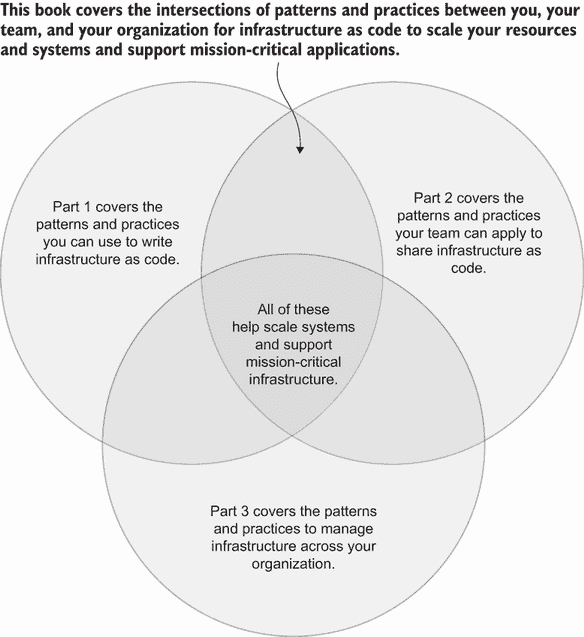

图 1.1 在本书中，你将学习到你的实践、团队和组织之间的交集，以及它们如何帮助你扩展系统和支持关键任务应用。

本书中的许多模式和实践都与这三个兴趣点相交。单独编写好的 IaC 可以帮助你更好地在团队和组织中共享和扩展它。良好的 IaC 有助于解决与*协作*相关的 IaC 问题，特别是随着越来越多的人采用它。

第一部分从定义*基础设施*和解释常见的 IaC 设计模式开始。这些主题涉及帮助你在团队中扩展 IaC 的基础概念。你可能已经熟悉本部分的一些材料，因此请回顾这些章节，为更高级的概念建立基础。

在第二部分和第三部分，你将学习到扩展系统和支持关键任务应用程序基础设施所需的模式和最佳实践。这些实践从你扩展到你的团队和组织，从为应用程序创建一个指标警报到在一个拥有 50,000 人的组织中实施网络变更。许多术语和概念在这些部分中相互依赖，因此你可能发现按顺序阅读章节会有所帮助。

## 1.1 什么是基础设施？

在我深入探讨基础设施即代码（IaC）之前，让我们先从*基础设施*的定义开始。当我开始在数据中心工作时，文献通常将基础设施定义为提供网络、存储或计算能力的硬件或设备。图 1.2 展示了应用程序如何在服务器上运行（计算）、通过交换机连接（网络），并在磁盘上维护数据（存储）。

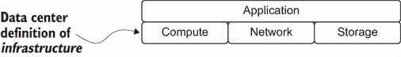

图 1.2 数据中心对*基础设施*的定义包括用于运行应用程序的网络、计算和存储资源。

这三个类别与我们管理的数据中心中的物理设备相匹配。我们通过扫描我们的 ID 进入大楼，插入设备，输入命令，并希望一切仍然正常工作。随着云计算的出现，我们继续使用这些类别来讨论特定设备的虚拟化。

然而，数据中心对基础设施的定义并不完全适用于今天的服务和产品。想象一下，另一个团队要求你帮助他们将应用程序交付给用户的生产环境。你通过一个清单，包括以下设置：

+   足够的服务器

+   用户网络连接

+   用于存储应用程序数据的数据库

完成这个清单意味着团队可以在生产中运行这个应用程序吗？不一定。你不知道你是否设置了足够的服务器或适当的访问权限来登录应用程序。你还需要知道网络延迟是否会影响应用程序的数据库连接。

在这个狭义的基础设施定义中，你省略了一些对于生产准备至关重要的任务，包括以下内容：

+   监控应用程序指标

+   导出指标以进行业务报告

+   为操作应用程序的团队设置警报

+   为服务器和数据库添加健康检查

+   支持用户身份验证

+   记录和汇总应用程序事件

+   在密钥管理器中存储和轮换数据库密码

您需要这些待办事项来交付一个可靠且安全的应用程序到生产环境中。您可能会将它们视为*运营*要求，但它们仍然需要基础设施资源。

除了与运营相关的基础设施之外，公共云提供商抽象化了基础网络、计算和存储的管理，并提供平台即服务（PaaS）产品，例如从存储桶到事件流平台如托管 Apache Kafka 等对象存储。提供商甚至提供函数即服务（FaaS）或容器即服务，这是计算资源的额外抽象。软件即服务（SaaS）市场的日益增长，如托管的应用性能监控软件，可能也需要支持生产中的应用程序，也可能被视为基础设施。

由于有如此多的服务，我们无法仅用计算、网络和存储类别来描述基础设施。我们需要在我们的应用程序交付中包括运营基础设施、PaaS 或 SaaS 产品。图 1.3 调整了基础设施模型，包括额外的服务产品，如 SaaS 和 PaaS，帮助我们交付应用程序。

由于日益增长的复杂性、不同的运营模式以及数据中心管理的用户抽象化，我们不能将*基础设施*的定义限制在硬件或与计算、网络或存储相关的物理设备上。

定义*基础设施*是指将应用程序交付或部署到生产环境的软件、平台或硬件。

这里是一个您可能遇到的非详尽的基础设施列表：

+   服务器

+   工作负载编排平台（例如，Kubernetes，HashiCorp Nomad）

+   网络交换机

+   负载均衡器

+   数据库

+   对象存储

+   缓存

+   队列

+   事件流平台

+   监控平台

+   数据管道系统

+   支付平台

扩展*基础设施*的定义为跨团队提供了管理各种目的资源的通用语言。例如，一个管理组织持续集成（CI）框架的团队可能使用来自持续集成 SaaS 或公共云的计算资源。另一个团队在此基础上构建，因此使其成为关键基础设施。

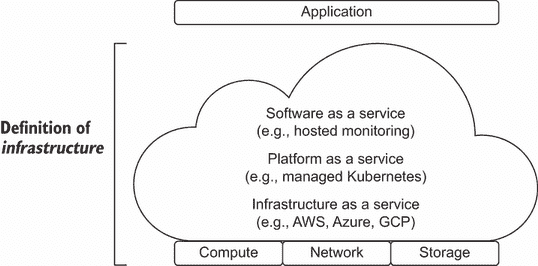

图 1.3 应用程序的基础设施可能包括公共云上的队列、运行应用程序的容器、用于额外处理的无服务器函数，甚至用于检查系统健康的监控服务。

## 1.2 什么是基础设施即代码？

在解释基础设施即代码之前，我们必须理解手动基础设施配置。在本节中，我概述了基础设施和手动配置的问题。然后我定义了*基础设施即代码*。

### 1.2.1 基础设施的手动配置

作为网络团队的一员，我学会了通过复制粘贴文本文档中的命令来更改网络交换机。我曾在粘贴时将`shutdown`误写成`no shutdown`，关闭了网络接口！我迅速将其重新打开，希望没有人注意到并且没有影响任何事情。然而，一周后，我发现它关闭了与一个关键应用程序的连接，并影响了几个客户请求。

回顾过去，我在手动复制粘贴命令和基础设施配置方面遇到了一些问题。首先，我不知道我的变更会影响哪些资源（也称为*爆炸半径*）。我不知道哪些网络或应用程序使用了该接口。

定义：*爆炸半径*指的是一个失败的变更对系统造成的影响。较大的爆炸半径通常会影响更多的组件或最关键的组件。

其次，网络交换机接受了我的命令，而没有测试其效果或检查其意图。最后，没有人知道是什么影响了应用程序处理客户请求，他们花了整整一周时间才确定根本原因是我的误复制命令。

以编码的方式编写基础设施如何帮助我发现误复制的网络交换机命令？我可以将我的配置和自动化存储在源代码管理中，以记录命令。为了防止未来出现错误，我创建了一个虚拟交换机和一个测试，该测试运行我的脚本并检查接口的健康状况。

测试通过后，我将变更推进到生产环境，因为测试会检查正确的命令。如果我应用了错误的命令，我可以搜索基础设施配置来确定哪些应用程序运行在受影响的网络上。你可以参考第六章了解测试实践，第十一章了解变更回滚。

除了配置错误的风险外，由于手动配置基础设施，我的开发进度有时会放缓。有一次，我花了近两个月的时间来测试我的应用程序与数据库的兼容性。在这两个月里，我的团队提交了超过 10 张与创建数据库、配置新的路由以将应用程序连接到数据库以及打开防火墙规则以允许我的应用程序相关的工单。平台团队在公共云中手动配置了一切。由于安全考虑，开发团队没有直接访问权限。

换句话说，随着系统和团队的增长，手动配置基础设施通常无法扩展。手动变更*增加了系统的变更失败率，减缓了开发进度**，并将系统的攻击面暴露于潜在的安全漏洞之中。你总会诱惑着将一些值更新到控制台。然而，这些变更会累积。

下一个人对系统进行更改时，可能会引入系统故障，因为更改尚未经过审计或整理。例如，在开发过程中更新防火墙以允许某些流量，可能会无意中使系统容易受到攻击。

### 1.2.2 基础设施即代码

如果不是手动更改，你应该做什么来更改基础设施？你可以将软件开发生命周期应用于基础设施资源和配置，形式为 IaC。然而，基础设施开发生命周期不仅限于配置文件和脚本。

基础设施需要扩展、管理故障、支持快速软件开发，并保护应用程序。基础设施开发生命周期涉及更具体的模式和流程来支持协作、部署和测试。在图 1.4 中，简化的工作流程通过使用配置或脚本更改基础设施，并将它们提交到版本控制。提交会自动启动一个工作流程来部署和测试对基础设施的更改。

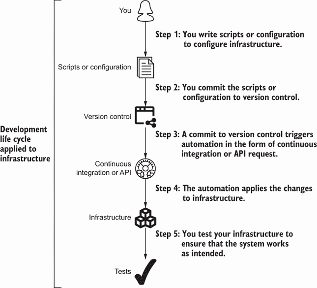

图 1.4 基础设施开发生命周期包括编写代码作为文档、将其提交到版本控制、以自动方式将其应用于基础设施，并对其进行测试。

为什么你应该记住开发生命周期？你可以将其用作管理更改和验证它们不会影响你系统的一般模式。生命周期捕捉到*基础设施即代码*，以编码方式自动化基础设施更改，并应用 DevOps 实践，如版本控制和持续交付。

定义 *基础设施即代码* (*IaC*) 将 DevOps 实践应用于以编码方式自动化基础设施更改，以实现可扩展性、弹性和安全性。

我经常发现 IaC 被引用为 DevOps 的必要实践。它确实解决了 CAMS 模型（文化、自动化、测量和共享）中的自动化部分。图 1.5 将 IaC 定位为 DevOps 模型中自动化实践和哲学的一部分。代码作为文档、版本控制、软件开发模式和持续交付的实践与之前讨论的开发生命周期工作流程相一致。

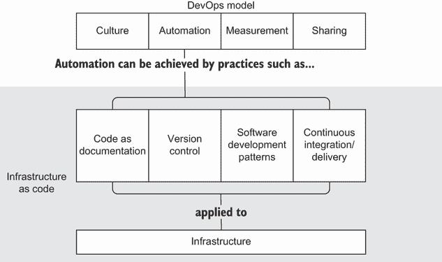

图 1.5 IaC 应用版本控制、软件开发模式、持续集成和代码作为文档到基础设施。

为什么在 DevOps 模型中将 IaC 作为自动化的一部分进行关注？你的组织不必采用 DevOps 就可以使用 IaC。它的好处可以提高 DevOps 的采用率和指标，但仍然适用于任何基础设施配置。你仍然可以使用 IaC 实践来改进基础设施更改的过程，而不会影响生产。

注意：您将在本书中看到一些 DevOps 实践，但我并不专注于其理论或原则。我推荐 Nicole Forsgren 等人所著的《加速》（IT Revolution Press，2018 年）以获得对 DevOps 的更高层次理解。您还可以阅读 Gene Kim 等人所著的《凤凰项目》（IT Revolution Press，2013 年），该书描述了一个采用 DevOps 的组织所进行的虚构转型。

本书涵盖了一些将基础设施编码化的方法，以消除扩展的摩擦，同时保持为应用程序用户维护基础设施的可靠性和安全性，无论您使用数据中心还是云。诸如配置文件版本控制、CI 管道和测试等软件开发实践可以帮助扩展和演进基础设施的变化，同时减轻停机时间并构建安全的配置。

### 1.2.3 什么是非基础设施即代码？

如果您在文档中键入一些配置，您是否在进行 IaC？您可能会认为 IaC 包括在变更票中添加配置指令。您可能会认为构建队列的教程或配置服务器的 shell 脚本算作 IaC。如果这些例子可以用来做到以下事项，那么它们*可以是*IaC 的形式：

+   可靠且准确地重现所表达的基础设施

+   将配置还原到特定版本或时间点

+   传达并评估变更对资源的爆炸半径

然而，配置或脚本通常过时、未版本化或意图不明确。您甚至可能发现自己难以理解和更改用 IaC 工具编写的配置。该工具促进了 IaC 工作流程，但并不一定促进允许系统在减少运营责任和降低变更失败率的同时增长的做法和途径。您需要一套原则来识别 IaC。

## 1.3 基础设施即代码的原则

正如我提到的，并非所有与基础设施相关的代码或配置都能进行扩展或减轻停机时间。在本书中，我强调了 IaC 原则如何应用于某些代码列表或实践。您甚至可以使用这些原则来评估您的 IaC。

当其他人可能对这个原则列表进行增减时，我记住四个最重要的原则，即通过记忆法“RICE”。这代表的是*可重现性、幂等性、可组合性和可扩展性*。我在以下章节中定义并应用每个原则。

### 1.3.1 可重现性

想象一下，有人要求您创建一个包含队列和服务器的发展环境。您与您的同事共享一组配置文件。他们用这些文件在不到一个小时的时间内为自己重新创建了一个新环境。图 1.6 显示了您如何共享配置并使您的同事能够重现一个新环境。您发现了*可重现性*的力量，这是 IaC 的第一个原则！

为什么 IaC 应符合这个可重复性原则？能够复制和重用基础设施配置可以节省您和您的团队在创建新环境或基础设施资源时的初始工程时间。您不必重新发明轮子来创建新环境或基础设施资源。

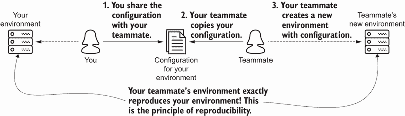

图 1.6 手动更改会在版本控制和实际状态之间引入漂移，影响可重复性，因此您应该更新版本控制中的更改。

定义 *可重复性原则* 意味着您可以使用相同的配置来重现环境或基础设施资源。

然而，您会发现遵循可重复性原则比复制粘贴配置要复杂得多。为了展示这种细微差别，想象您需要将网络地址空间从 `/16` 减少到 `/24`。您确实有表达网络的 IaC。然而，您决定选择登录云提供商并在文本框中输入 `/24` 的简单途径。

在您登录云提供商之前，您会反思您的更改工作流程是否遵循可重复性。您会问自己以下问题：

+   同事是否会知道您已更新了网络？

+   如果您运行您的配置，网络地址空间会返回到 `/16` 吗？

+   如果您使用版本控制中的配置创建新环境，它将具有 `/24` 的地址空间吗？

您对每个问题的回答都是否定。您无法保证您能成功重现手动更改。

如果您在云提供商的控制台中输入 `/24`，则您的网络已从 IaC（图 1.7）中表达的理想状态发生 *漂移*。为了符合可重复性，您决定更新版本控制配置为 `/24` 并应用自动化。

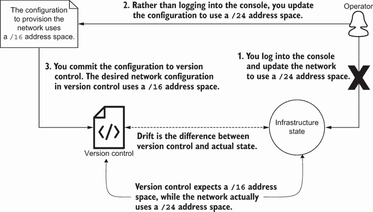

图 1.7 手动更改会在版本控制和实际状态之间引入漂移，影响可重复性，因此您应该更新版本控制中的更改。

这个场景展示了符合可重复性的挑战。您需要最小化预期和实际基础设施配置之间的一致性，也称为 *配置漂移*。

定义 *配置漂移* 是基础设施配置从期望配置到实际配置的偏差。

作为一种实践，您可以通过将配置文件放在版本控制中并尽可能保持版本控制更新来确保可重复性原则。维护可重复性原则有助于您更好地协作 *并且* 管理与生产环境类似的测试环境。

在第六章中，你将了解更多关于基础设施测试环境的内容，这些环境受益于可重复性。你还将将可重复性应用于测试和升级基础设施的实践和模式，从创建与生产环境镜像的测试基础设施到部署新的基础设施以替换旧系统（蓝绿部署）。

### 1.3.2 幂等性

一些基础设施即代码（IaC）将*可重复性*作为一个原则，这意味着运行相同的自动化操作并产生一致的结果。我认为 IaC 需要更严格的要求。运行自动化操作应该导致基础设施资源达到相同的*最终状态*。毕竟，我编写自动化脚本的主要目标就是能够多次运行自动化操作并获得相同的结果。

让我们考虑为什么 IaC 需要更严格的要求。想象一下，你编写了一个网络脚本，首先配置一个接口，然后重启。第一次运行脚本时，交换机配置了接口并重启。你将这个脚本保存为版本 1。

几个月后，你的同事要求你在交换机上再次运行这个脚本。你运行了脚本，交换机重启了。然而，重启断开了某些关键应用程序！你已经配置了网络接口。为什么还需要重启交换机？

如果你已经配置了网络接口，你找到了一种防止交换机重启的方法。在图 1.8 中，你创建了脚本的版本 2 并添加了一个条件`if`语句。该语句在重启交换机之前检查你是否已经配置了接口。当你再次运行版本 2 的脚本时，你不会断开应用程序。

条件语句符合幂等性原则。*幂等性*确保你可以重复自动化操作而不会影响基础设施，除非你更改了配置或发生了漂移。如果一个基础设施配置或脚本具有幂等性，你可以多次重新运行自动化操作，而不会影响资源的状态或可操作性。

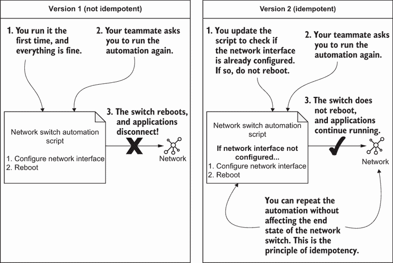

图 1.8 在脚本版本 1 中，每次运行脚本时都会重启交换机。在版本 2 中，你在重启交换机之前检查网络接口是否已配置。这保留了网络的正常工作状态。

定义 *幂等性原则* 确保你可以在基础设施上反复运行自动化操作，而不会影响其最终状态或产生任何副作用。你应该只在更新自动化操作中的基础设施属性时影响基础设施。

为什么你应该在你的 IaC 中坚持幂等性，比如在你的网络脚本中？在示例中，你希望避免重启网络交换机以保持网络的正常运行。你已经配置了网络接口；为什么还要重新配置？你应该只有在接口不存在或发生变化时才需要配置接口。

没有幂等性，你的自动化可能会意外中断。例如，你可能重复执行一个脚本，创建一组新的服务器，使它们的数量翻倍。更严重的是，你可能自动化了一个数据库更新，结果却删除了一个关键的数据库！

你可以通过检查脚本的重复性和配置来确保幂等性原则。作为一种一般做法，在运行自动化之前，包括一系列*条件语句*来检查配置是否与预期的一致。条件语句有助于在需要时应用更改，并避免可能影响基础设施操作性的副作用。

使用幂等性设计自动化可以降低风险，因为它鼓励包含逻辑以保留系统的最终预期状态。如果自动化失败一次并导致系统中断，组织不再希望再次自动化，因为其感知的风险。随着你学习如何在第十一章中安全地推进更改并在部署前预览自动化更改，幂等性将成为一个指导原则。

### 1.3.3 可组合性

你希望混合和匹配任何一组基础设施组件，无论工具或配置如何。你还需要在不影响整个系统的情况下更新单个配置。这两个要求都促进了模块化和解耦基础设施依赖，你将在第三章和第四章中了解更多关于这方面的内容。

例如，想象你为在 hello-world.com 上访问的应用程序创建基础设施。以下是你需要一个安全且生产就绪配置的最小资源：

+   服务器

+   负载均衡器

+   为服务器创建的私有网络

+   为负载均衡器创建的公共网络

+   允许从私有网络流出的流量路由规则

+   允许公共流量到达负载均衡器的路由规则

+   允许从负载均衡器到服务器的流量路由规则

+   为 hello-world.com 创建域名

你可以从头开始编写这个配置。然而，如果你发现预先构建的*模块*，这些模块可以组合你用来构建系统的基础设施组件，你会怎么办？现在你有多个模块可以创建以下内容：

+   网络（私有和公共网络、路由流量从私有网络的网关、允许流量从私有网络流出的路由规则）

+   服务器

+   负载均衡器（域名、允许流量从负载均衡器到服务器的路由规则）

在图 1.9 中，你选择了网络、服务器和负载均衡器模块来构建你的生产环境。后来，你意识到你需要一个高级负载均衡器。你用高级负载均衡器替换了标准负载均衡器，以便可以处理更多的流量。服务器和网络继续运行，不会影响用户。

你的队友甚至可以在不影响负载均衡器、服务器或网络的情况下将数据库添加到环境中。你可以以各种组合分组和选择基础设施资源，这符合*可组合性*原则。

定义 **组合性** 确保您能够组装任何基础设施资源的组合，并更新每一个资源而不会影响其他资源。

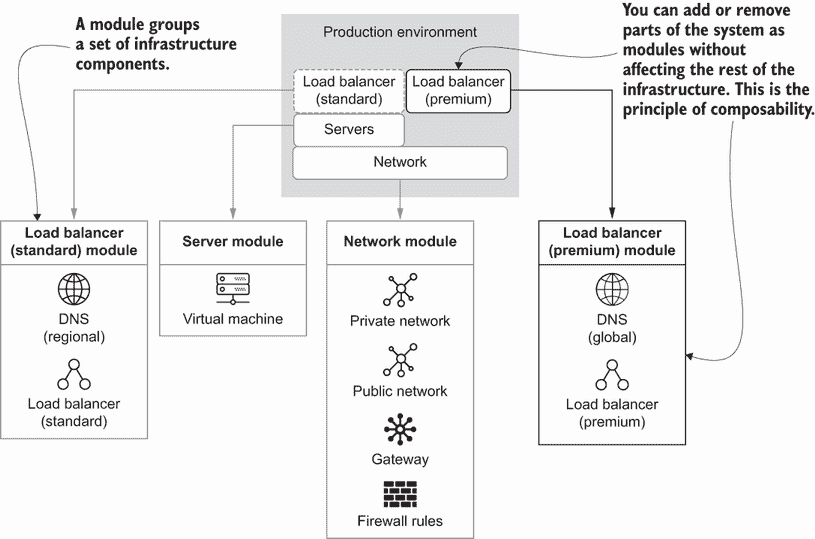

图 1.9 您使用基础设施的构建块构建生产环境，这样您可以轻松地添加新的资源，如高级负载均衡器。

您的配置越具有组合性，创建新系统就越容易，且所需努力更少。想象一下用构建块构建您的基础设施即代码（IaC）。您希望能够在不破坏整个系统的情况下更新或演进资源子集！如果您不考虑 IaC 的组合性，您可能会因为复杂基础设施系统中的未知依赖而导致变更失败。

组合性带来的自助服务优势可以帮助您的组织进行扩展，并赋予团队安全地与基础设施系统交互的能力。第三章和第四章探讨了可以帮助您接近更模块化基础设施构建并提高组合性的某些模式。

### 1.3.4 可进化性

您希望考虑到系统的规模和增长，但不要过早和不必要地优化配置。大部分基础设施配置会随着时间的推移而改变，包括其架构。

作为实际例子，您可能最初将基础设施资源命名为 `example`。后来，您需要将资源名称更改为 `production`。您开始变更的过程是查找并替换数百个标签、名称、依赖资源等。查找和替换的过程需要大量的努力。

当您应用变更时，您注意到您忘记更改了一些字段，并且您的新基础设施变更失败了。为了确保名称、标签和其他元数据的未来进化，您创建了一个名称变量，并且配置引用了这个变量。在图 1.10 中，您更新了全局 `NAME` 变量，并且变更在整个系统中传播。

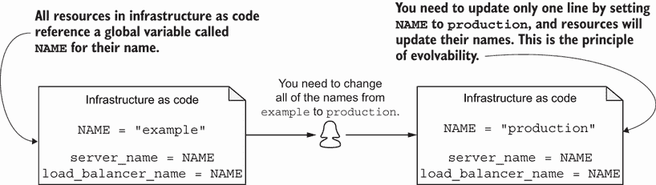

图 1.10 而不是查找并替换所有名称实例，您可以设置一个顶层变量，用于所有资源的名称。

这个例子似乎过于简单。为什么更改名称很重要？以 **可进化性** 为原则构建的 IaC 最小化了更改系统所需的努力（时间和成本）以及变更失败的风险。

定义 **可进化性原则** 确保您可以在最小化努力和失败风险的情况下更改基础设施资源，以适应系统规模或增长。

系统进化包括除微小变更之外的变化，例如名称变更。在基础设施架构中可能涉及更颠覆性的变化，比如用 Amazon Elastic Map Reduce (EMR) 替换 Google Cloud Bigtable。需要替换的应用程序已经使用 Apache HBase 进行了未来化，Apache HBase 是一个支持两种提供方式的开源分布式数据库，只需数据库端点即可。

我们通过输出数据库端点以检索应用程序，并在幕后创建配置以更新两种服务来在 IaC 中考虑这种演进。在测试了亚马逊网络服务（AWS）数据库后，我们输出其端点供应用程序使用。

注意，本书并未全面涵盖演进架构背后的理论。如果你想要了解更多，我强烈推荐 Neal Ford 等人所著的《构建演进式架构》（O’Reilly，2017）。这本书讨论了如何构建你的基础设施架构以适应变化。

你可能会发现自己难以演进你的系统，因为你没有使用允许其变化的模式和最佳实践。有用的 IaC 专注于促进未来演进的技巧。本书中的许多章节都展示了有助于保持可演进性和最小化对关键系统变更影响的模式。

### 1.3.5 应用原则

可重复性、幂等性、组合性和可演进性在定义上似乎很具体。然而，它们都帮助约束你的基础设施架构并定义了许多 IaC 工具的行为。你的 IaC 必须与所有四个原则一致才能扩展、协作和改变你的公司。图 1.11 总结了这四个重要原则及其定义。

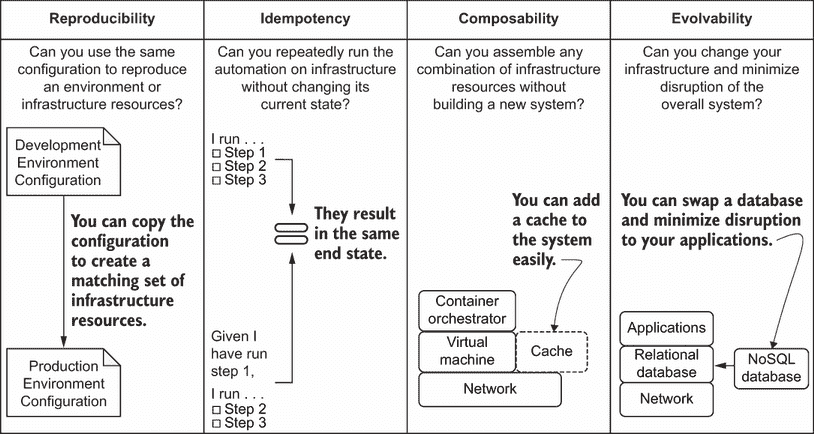

图 1.11 IaC 应该是可重复的、幂等的、可组合的和可演进的。你可以问自己一系列问题来确定你的 IaC 是否符合所有四个原则。

在编写 IaC 时，请思考你是否符合所有四个原则。这些原则帮助你更轻松地编写和分享 IaC，并理想情况下最小化对系统变更的影响。缺失的原则可能会阻碍基础设施资源的更新或增加潜在失败的影响范围。

在练习基础设施即代码（IaC）时，请思考你的配置或工具是否与最佳实践相符合。例如，对你的工具提出以下问题：

+   工具是否允许你重新创建整个环境？

+   当你重新运行工具以强制配置时会发生什么？

+   你能否混合和匹配各种配置片段来创建一组新的基础设施组件？

+   工具是否提供帮助你在不影响其他系统的情况下演进基础设施资源的功能？

本书使用这些原则来回答这些问题，并为你提供考虑弹性和可扩展性的技能来测试、升级和部署基础设施。

练习 1.1

选择你组织中的一个基础设施脚本或配置。评估它是否遵循 IaC 的原则。它是否促进可重复性、使用幂等性、帮助组合性和简化可演进性？

请参阅附录 B 以获取练习的答案。

## 1.4 为什么使用基础设施即代码？

IaC 通常被认为是一种 DevOps 实践。然而，你不必在整个组织中应用 DevOps 就可以使用它。你仍然希望以减少变更失败率和平均恢复时间（MTTR）的方式来管理你的基础设施，这样你就可以在周末睡懒觉，或者作为开发者有更多时间编写代码。即使你认为你不需要它，也有几个原因要使用 IaC。

### 1.4.1 变更管理

当你将变更应用到某些基础设施上，却意识到有人报告说它破坏了某些东西时，你可能会感到一种沉没感。组织试图通过*变更管理*来防止这种情况，这是一系列步骤和审查，以确保你的变更不会影响生产。这个过程通常包括一个变更审查委员会来审查变更，或者变更窗口来封锁执行变更的时间。

定义*变更管理*概述了你在公司中采取的一系列步骤和审查，以在生产中实施变更并防止其失败。

然而，没有任何变更是没有风险的。通过模块化你的基础设施（第三章）和向前滚动变更（第十一章）来限制影响范围，应用 IaC 实践可以减轻变更的风险。

在一个令人遗憾的例子中，我忽视了使用基础设施即代码（IaC）来减轻变更风险的直觉。我不得不在服务器上推出一个新的二进制文件，这要求它们重新启动一系列依赖服务。我编写了一个脚本，让我的队友检查它，并让变更审查委员会签字批准运行它。在周末应用并验证变更后，我周一来到办公室，看到几条消息告诉我支持对账应用程序的服务器在夜间崩溃。我的队友追踪到我的脚本中的依赖与较旧操作系统的不兼容性。

回顾过去，IaC 本可以减轻变更的风险。当我将 RICE 原则应用到变更上时，我意识到我忘记了以下内容：

+   *可重复性*——我没有在模拟各种服务器的各种测试实例上重复我的脚本。

+   *幂等性*——我没有在运行命令之前检查操作系统的逻辑。

+   *可组合性*——我没有将变更的影响范围限制在少量不太关键的服务器上。

+   *可进化性*——我没有更新服务器以使用较新的操作系统并减少基础设施中的差异。

减少差异允许基础设施进化和风险缓解，因为实际的配置与你在自动化过程中期望的配置相匹配，使变更更加直接和可靠地应用。我们将在第七章讨论如何将 IaC 融入你的变更管理流程。

### 1.4.2 时间投资回报

IaC 和时间投资可能难以证明其合理性，特别是如果你的设备或硬件没有合适的自动化接口。除了缺乏易于自动化的接口外，自动化一年或十年才做一次的任务可能也难以证明花费时间进行自动化是合理的。虽然 IaC 可能需要额外的时间来实现，但它从长远来看降低了执行变更所需的时间。这究竟是如何工作的呢？

想象一下，你需要更新 10 台服务器上的相同软件包。你以前没有使用 IaC 来做这件事。你会手动登录，更新软件包，验证一切是否正常工作，修复错误，然后转到下一台。平均来说，你会在更新服务器上花费 10 个小时。

图 1.12 显示，没有 IaC 的变更在时间上具有恒定的努力水平。如果你有额外的变更，你可能需要花费几个小时来修复或更新系统。一个失败的变更可能意味着你需要在几天内花费更多努力来修复系统。

你决定为这些服务器（图 1.12 中的实线）投入时间来构建 IaC。你减少了服务器的配置漂移，这大约需要 40 个小时。在你进行初步时间投资之后，每次进行更改时，你只需花费不到 5 分钟来更新所有服务器。

为什么需要理解基础设施即代码（IaC）中时间和努力之间的关系呢？预防有助于减少修复工作的努力。如果没有 IaC，你可能会发现自己花费数周时间来修复主要系统故障。你通常会在那几周内尝试逆向工程手动更改，撤销特定更改，或者在最糟糕的情况下，从头开始构建一个新的系统。

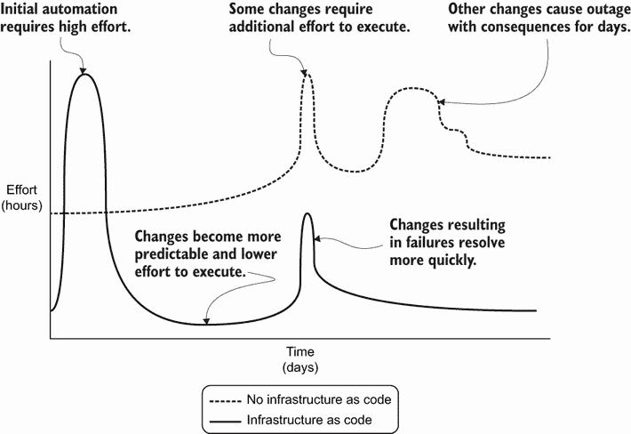

图 1.12 在经历初期的高自动化努力后，IaC 随时间推移所需的工作量减少。没有 IaC，执行变更所需的时间可能高度可变。

你*必须*在编写 IaC 上进行初步投资，即使这看起来成本很高。随着时间的推移，这项投资会帮助你，因为你将花费更少的时间调试失败的配置或恢复损坏的系统。如果你的系统有一天完全失败，你可以通过运行你的 IaC 轻松地重新创建它。

自动化和测试鼓励可预测性，并限制失败变更的影响范围。它们降低了失败系统的变更失败率和平均修复时间（MTTR）。随着你的基础设施系统发展和扩展，你可以使用本书中涵盖的详细测试实践来提高你系统中变更的失败率，并减轻未来变更的负担。

### 1.4.3 知识共享

IaC 传达基础设施架构和配置，这有助于减少人为错误并提高可靠性。一位工程师曾告诉我：“我们不需要为三级被动数据中心（用于备份）的网络交换机做 IaC。反正都是我在配置东西，而且我们只需要做一次这个更改，之后再也不用碰它了。”

工程师在配置开关后不久就离开了组织。后来，我的团队需要将三级被动数据中心转换为活动数据中心以满足合规性要求。在恐慌中，我们匆忙逆向工程开关上的配置。我们花了大约两个月的时间来弄清楚网络连接，重新配置其配置，并使用 IaC 进行管理。

即使一项任务看起来特别晦涩，或者配置基础设施的团队只有一个人，投入时间和精力以“代码即文档”的方式处理基础设施配置，可以帮助适应变化，尤其是在基础设施系统和团队规模扩大时。你会发现，当有人报告故障或向新团队成员教授服务器配置时，你会花更多时间记住如何配置那个晦涩的开关。

将任务“编写为代码”，也称为“代码即文档”，传达了基础设施和系统架构的预期状态。

定义：“代码即文档”确保代码在无需额外参考文档的情况下传达软件或系统的意图。

对于不熟悉该系统的某人来说，应检查基础设施配置并理解其意图。你不能期望所有代码从实用角度来说都能作为文档。然而，代码应反映你大部分的基础设施架构和系统期望。

### 1.4.4 安全性

在 IaC 中审计和检查不安全的配置可以突出显示开发过程中的早期安全关注。您听到的是“左移安全”。如果在流程中较早地纳入安全检查，当系统配置在生产环境中运行时，您会发现更少的漏洞。您将在第八章中了解更多关于安全模式和惯例的知识。

例如，您可能暂时增加对对象存储的访问权限，以便任何人在开发中都可以读写。您将其推送到生产环境。然而，存储中的一些对象允许每个人都可以读写。虽然这看起来像是一个简单的错误，但如果存储包含客户数据，配置的影响将是严重的。

注意：要了解更多不安全的配置示例，您可以在新闻中搜索一个配置错误的对象存储，该存储泄露了驾驶执照信息，甚至是一个默认密码泄露了数百万张消费者信用卡的数据库。一些安全漏洞涉及合法漏洞，但许多涉及不安全的配置。那些一开始就防止这些误配置的组织通常可以快速检查配置、审计访问控制、评估影响范围，并修复漏洞。

IaC 通过在单个配置中表达来简化访问控制。使用 IaC，你可以测试配置以确保对象存储不允许公开访问。此外，你可以包括生产检查以验证你的策略只允许对特定对象的读取访问。甚至数据中心中的安全策略，如防火墙规则，也可以用 IaC 表达并审计，以确保其规则只允许来自已知来源的入站连接。

如果你遇到安全漏洞，IaC 允许你检查配置，快速审计访问控制，评估影响范围，并修复漏洞。你可以使用相同的 IaC 实践来做出各种更改。你将在本书中找到一些实践，以帮助根据 IaC 原则审计和确保你的基础设施的安全。

## 1.5 工具

IaC 工具因应用于各种资源而差异很大。大多数工具属于以下三种用例之一，所有这些用例都解决非常不同的功能，并且在行为上差异很大，包括以下内容：

+   配置部署

+   配置管理

+   镜像构建

在本书中，我主要关注用于配置的工具体，这些工具部署和管理一组基础设施资源。我还包括一些配置管理和镜像构建的侧边栏和示例，以突出方法上的差异。

### 1.5.1 本书中的示例

在本书中，我面临了一个挑战，即构建与工具或平台无关的具体示例。作为模式和惯例的书籍，我需要找到一种方法，在通用编程语言中表达概念，而不需要重写工具的逻辑。

Python 和 Terraform

图 1.13 概述了代码列表和示例的工作流程。更多技术实现信息，请参阅附录 A。我使用 Python 编写代码列表，以创建 HashiCorp Terraform 消费的 JavaScript 对象表示法 (JSON) 文件，这是一个具有跨公共云和其他基础设施提供商各种集成的配置工具。

图 1.13 本书示例使用 Python 创建 Terraform 可以消费的 JSON 文件。

当你使用 `python run.py` 运行 Python 脚本时，代码会创建一个扩展名为 *.tf.json 的 JSON 文件。该 JSON 文件使用 Terraform 特定的语法。然后你可以进入包含 *.tf.json 文件的目录，并运行 `terraform init` 和 `terraform apply` 来创建资源。虽然 Python 代码看起来增加了不必要的抽象，但它确保我可以提供与平台和工具无关的具体示例。

我认识到这个工作流程的复杂性似乎没有意义。然而，它有两个目的。Python 文件提供了编程语言的通用模式和惯例的实现。JSON 配置允许你使用工具而不是我编写抽象来运行和创建资源。

注意：你可以在本书的代码库中找到完整的代码示例：[`github.com/joatmon08/manning-book`](https://github.com/joatmon08/manning-book)。

你不需要深入了解 Python 或 Terraform 就能理解代码示例。如果你想运行示例并创建资源，我建议你回顾一下 Terraform 或 Python 的入门教程，以了解语法和命令。

注意：你可以在 Terraform 和 Python 的众多资源中找到。查看 Scott Winkler 的《Terraform in Action》（Manning，2021 年），Naomi R. Cedar 的《The Quick Python Book》（Manning，2018 年），或 Reuven M. Lerner 的《Python Workout》（Manning，2020 年）。

Google Cloud Platform

虽然 AWS 或 Microsoft Azure 可能在出版时更为流行，但我决定使用 Google Cloud Platform（GCP）作为主要云提供商，主要有三个原因。首先，GCP 需要更少的资源来实现类似的架构。这减少了示例的冗长性，并专注于模式和途径，而不是配置。

其次，GCP 的提供的服务使用更直接的命名和通用的基础设施术语。如果你在数据中心工作，你仍然能够识别出服务创建的内容。例如，Google Cloud SQL 创建 SQL 数据库。

如果你运行示例，你将在 GCP 中使用以下资源：

+   网络管理（网络、负载均衡器和防火墙）

+   计算

+   管理队列（Pub/Sub）

+   存储（Cloud Storage）

+   身份和访问管理（IAM）

+   Kubernetes 提供的服务（Kubernetes Engine 和 Cloud Run）

+   数据库（Cloud SQL）

你*不需要*了解每个服务的细节。我使用它们来演示基础设施资源之间的依赖关系管理。我避免了使用每个云平台都不同的专用服务，例如机器学习。

AWS 和 Azure 等效

每个示例都包括与等效的 AWS 和 Azure 服务提供的侧边栏，以进一步巩固特定的模式和技巧。为了更新为你选择的云提供商的示例，你可能需要进行一些语言替换并更改一些依赖项。例如，你可以使用内置网关创建 GCP 网络，而在 AWS 网络中你必须明确构建它们。

书中的代码库中有一些示例具有 AWS 等效版本（[`github.com/joatmon08/manning-book`](https://github.com/joatmon08/manning-book)）。你还可以在附录 A 中找到有关设置 AWS 或 Azure 以与示例一起运行的更多信息。

第三个原因是我选择在 GCP 中编写示例涉及成本。GCP 提供免费使用层。如果你使用 GCP 创建新账户，你将获得高达$300 的免费试用（截至出版时）。如果你已有账户，你可以使用免费使用层中的服务。我会在出版时注明任何不符合免费使用层的所需资源。

使用 Google Cloud Platform

有关 GCP 免费计划的更多信息，请参阅其计划网页 [`cloud.google.com/free`](https://cloud.google.com/free)。

我建议创建一个单独的 GCP 项目来运行所有示例。单独的项目将隔离您的资源。当您完成这本书后，您可以删除项目及其资源。请参阅创建 GCP 项目的教程 [`mng.bz/e7QG`](http://mng.bz/e7QG)。

### 1.5.2 配置

*配置* *工具*为特定提供者创建和管理一组基础设施资源，无论是公共云、数据中心还是托管监控解决方案。*提供者*指的是负责提供基础设施资源的数据中心、IaaS、PaaS 或 SaaS。

定义 A *配置工具*为公共云、数据中心或托管监控解决方案创建和管理一组基础设施资源。

一些配置工具仅与特定提供者合作，而其他工具则与多个提供者集成（表 1.1）。

表 1.1 配置工具和提供者示例

| 工具 | 提供者 |
| --- | --- |
| AWS CloudFormation | 亚马逊网络服务 |
| Google Cloud Deployment Manager | Google Cloud Platform |
| Azure Resource Manager | 微软 Azure |
| Bicep | 微软 Azure |
| HashiCorp Terraform | 各种（完整列表，请参阅 [www.terraform.io/docs/providers/index.xhtml](http://www.terraform.io/docs/providers/index.xhtml)) |
| Pulumi | 各种（完整列表，请参阅 [www.pulumi.com/docs/intro/cloud-providers/](http://www.pulumi.com/docs/intro/cloud-providers/)) |
| AWS Cloud Development Kit | 亚马逊网络服务 |
| Kubernetes 清单 | Kubernetes（容器编排器） |

大多数配置工具可以预览系统更改，并表达基础设施资源之间的依赖关系，这被称为*干运行*。

定义 A *干运行*在您将更改应用到资源之前分析并输出预期的基础设施更改。

例如，您可以表达网络和服务器之间的依赖关系。如果您更改网络，配置工具将显示服务器也可能更改。

### 1.5.3 配置管理

*配置* *管理*工具确保服务器和计算机系统运行在所需的状态。大多数配置管理工具在设备配置方面表现卓越，例如服务器安装和维护。

定义 A *配置管理工具*配置一组服务器或资源上的软件包和属性。

例如，如果您数据中心有 10,000 台服务器，您如何确保它们都运行您安全团队批准的特定版本的软件包？手动登录 10,000 台服务器并手动输入命令来审查是不切实际的。如果您使用配置管理工具配置服务器，您只需运行一个命令即可审查所有 10,000 台服务器并执行软件包的更新。

解决此问题空间的一些配置管理工具的非详尽列表包括以下内容：

+   Chef

+   Puppet

+   Red Hat Ansible

+   Salt

+   CFEngine

虽然这本书侧重于供应工具和管理多提供者系统，但我将讨论一些与基础设施测试、更新基础设施和安全相关的配置管理实践。配置管理可以帮助调整你的服务器和网络基础设施。

注意：我推荐你选择配置管理工具的书籍和教程以获取更多信息。它们将提供针对其设计方法的更详细指南。

为了增加混乱，你可能注意到一些配置管理工具提供了与数据中心和云提供商的集成。因此，你可能会考虑将你的配置工具作为供应工具使用。虽然这是可能的，但这种方法可能不是最佳选择，因为供应工具通常针对基础设施资源之间的依赖关系具有不同的设计方法。我将在下一章探讨这个细微差别。

### 1.5.4 形象构建

当你创建服务器时，你必须指定一个带有操作系统的机器镜像。*形象构建*工具创建用于应用程序运行时的镜像，无论是容器还是服务器。

定义：*形象构建工具*用于为应用程序运行时构建机器镜像，例如容器或服务器。

大多数形象构建工具允许你指定运行环境和构建目标。表 1.2 概述了一些工具、它们支持的运行环境以及它们的构建目标和平台。

表 1.2 形象构建工具和提供者的示例

| 工具 | 运行环境 | 构建目标 |
| --- | --- | --- |
| HashiCorp Packer | 容器和服务器 | 各种（完整列表请参阅[www.packer.io/docs/builders](https://www.packer.io/docs/builders)） |
| Docker | 容器 | 容器注册库 |
| EC2 Image Builder | 服务器 | 亚马逊网络服务 |
| Azure VM Image Builder | 服务器 | 微软 Azure |

我在这本书中不包括关于形象构建的详细讨论。然而，第 6 至 8 章中测试、交付和合规性的模式确实有关于形象构建的边栏。在下一章中，你将了解不可变性，这是一个对形象构建者方法至关重要的范例。

图 1.14 展示了形象构建、配置管理和供应工具是如何协同工作的。部署新的服务器配置的过程通常从配置管理工具开始，正如你开始构建基础并测试你的服务器配置是否正确一样。

在确定你想要的服务器配置后，你使用形象构建工具来保存服务器的镜像及其版本和运行时。最后，你的供应工具引用形象构建器的快照来创建具有你想要配置的新生产服务器。

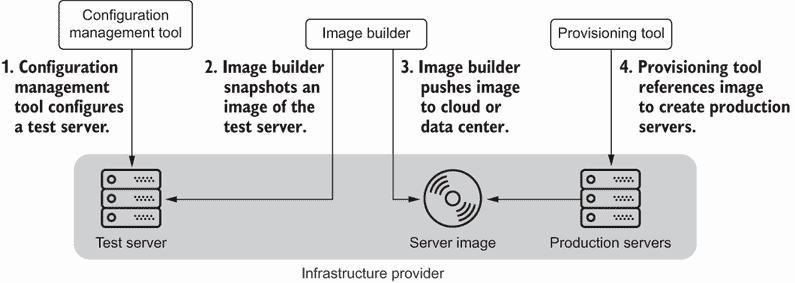

图 1.14 每种 IaC 工具都对服务器基础设施资源的生命周期做出贡献，从配置到镜像捕获和部署。

此工作流程代表了使用基础设施即代码（IaC）工具管理和部署服务器的理想端到端方法。然而，正如你将学到的，基础设施可能很复杂，这个工作流程可能并不适用于每个用例。各种基础设施系统和它们的依赖关系使得配置变得复杂，这也是我选择将此作为本书主要关注点的原因，因此示例使用了配置工具。

## 摘要

+   基础设施可以是软件、平台或硬件，它们将应用程序交付或部署到生产环境中。

+   基础设施即代码（Infrastructure as Code，简称 IaC）是一种 DevOps 实践，旨在通过自动化基础设施来实现可靠性、可扩展性和安全性。

+   IaC 的原则包括可重复性、幂等性、可组合性和可进化性。

+   通过遵循 IaC 的原则，你可以改善变更管理流程，长期降低修复失败系统所花费的时间，更好地共享知识和上下文，并将安全性融入你的基础设施。

+   IaC 工具包括配置、配置管理和镜像构建工具。
