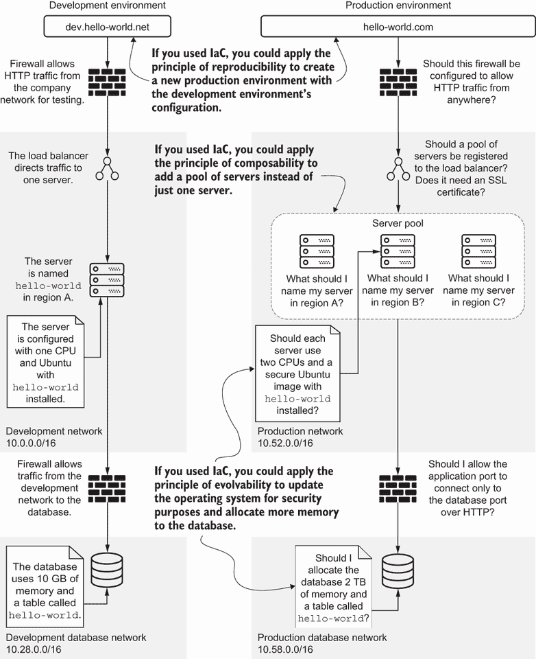
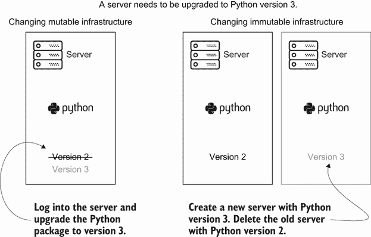
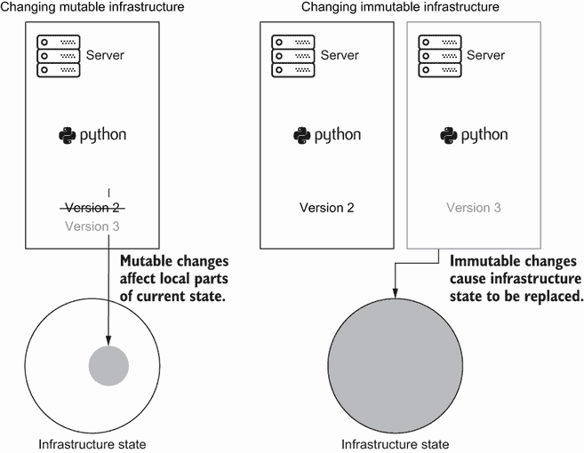
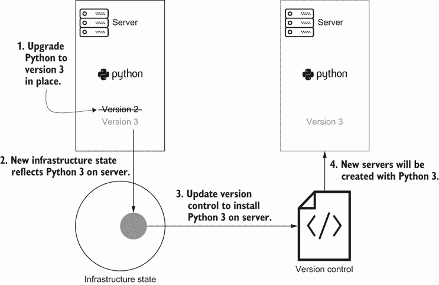
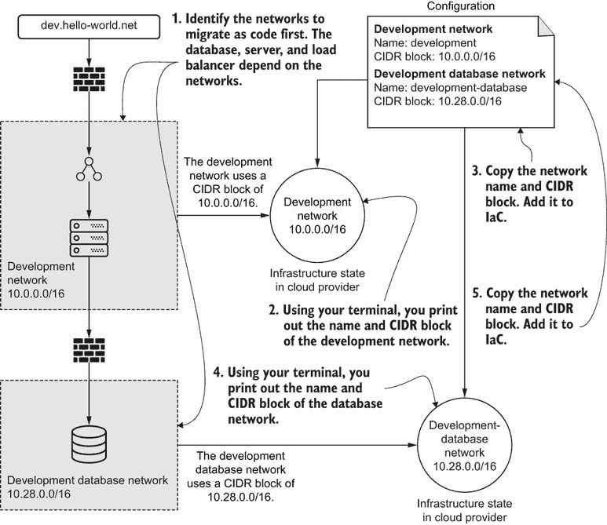
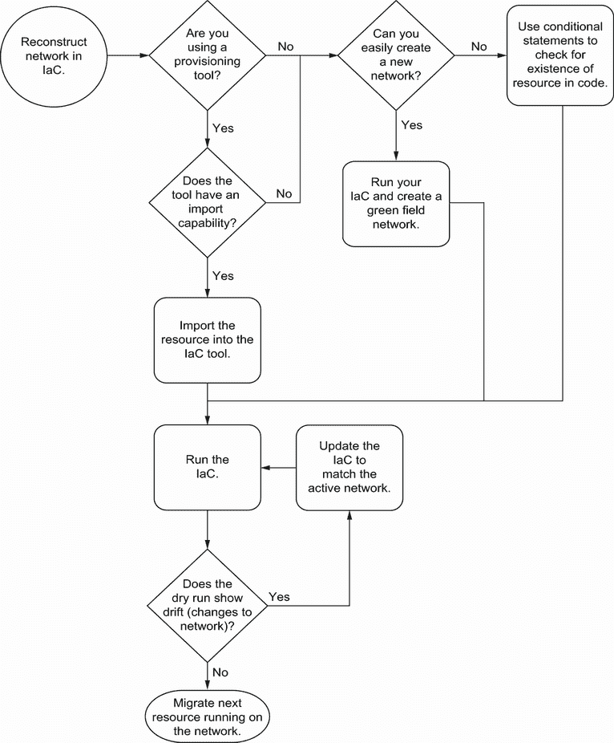
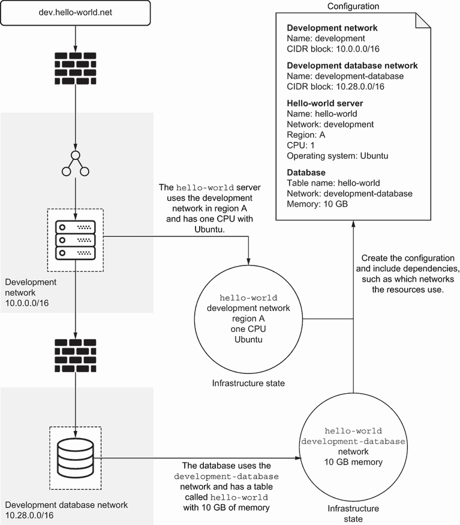
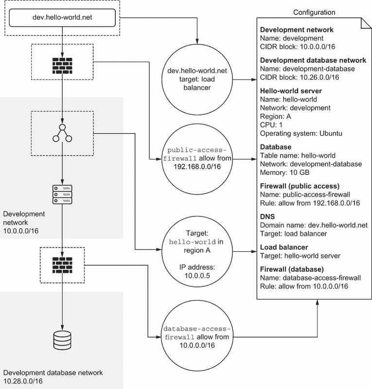
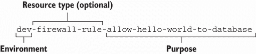
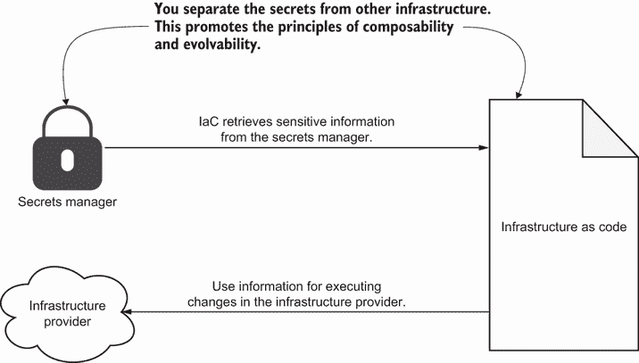

# 2 编写基础设施即代码

本章涵盖

+   当前基础设施状态如何影响基础设施的可重复性

+   检测和修复由于可变更改导致的基础设施漂移

+   实施编写可重复基础设施即代码的最佳实践

假设你已经为 hello-world 应用程序创建了一个开发环境。你有机地构建它，根据需要添加新组件。最终，你需要复制配置以供生产使用，人们可以公开访问。你还需要将生产扩展到三个地理区域以实现高可用性。

要做到这一点，你必须为生产环境创建和更新防火墙、负载均衡器、服务器和数据库，这些都在新的网络中。图 2.1 显示了开发环境中的防火墙、负载均衡器、服务器和数据库以及你需要在生产中复制的组件。

该图还概述了开发和生产之间的差异。生产配置需要三台服务器以实现高可用性，扩展的防火墙规则以允许所有 HTTP 流量，以及更严格的防火墙规则以供服务器连接到数据库。在审查所有差异后，你可能会对最佳和最简单的方法来做出这些更改有很多疑问。



图 2.1 当你基于开发创建生产环境时，你必须回答许多关于新基础设施配置的问题，并逆向工程开发环境的功能。

例如，你可能会想知道，为什么开发环境中缺乏基础设施即代码会影响你创建生产环境的能力。第一个原因是你不能轻松地*复制*基础设施资源。你必须逆向工程一周的手动配置！使用 IaC，你可以复制并粘贴一些配置，并对其进行修改以适应生产环境。

其次，你无法轻松地将基础设施资源与新资源*组合*。你需要一个用于生产的服务器池而不是单个服务器。如果你构建了一个基础设施模块，你可以使用这个构建块来创建多个服务器，而无需从头开始更新配置。

最后，你无法轻松地根据其特定要求*进化*生产环境。生产环境需要一些不同的基础设施资源，如安全的操作系统和更大的数据库。你将不得不手动调整配置，这些配置你在开发环境中从未运行过。

你可以通过两种方式解决这些挑战并提高可重复性、可组合性和可进化性。首先，你需要一种将手动配置的基础设施迁移到基础设施即代码（IaC）的方法。其次，你需要编写干净的 IaC 以促进可重复性和可进化性。

本章的第一部分概述了编写 IaC 和将现有基础设施迁移到代码的基本概念。本章的第二部分将代码卫生实践应用于基础设施。这些实践的组合将帮助您编写可重复的 IaC，并为未来系统的组合和演变奠定基础。

## 2.1 表达基础设施更改

我在第一章中提到，IaC 自动化更改。事实证明，随着时间的推移复制和自动化许多更改需要付出努力。例如，如果您想在 GCP 上配置和管理服务器，您通常会随着时间的推移进行以下更改：

1.  通过使用控制台、终端或代码在 GCP 中创建服务器。

1.  在 GCP 中读取服务器以检查您是否已使用正确的规格创建了服务器——例如，操作系统为 Ubuntu 18.04。

1.  使用公开可访问的网络地址更新 GCP 中的服务器以便登录。

1.  由于您不再需要它，请删除 GCP 中的服务器。

为了进行更复杂的更新或在另一个环境中复制服务器，您需要采取以下步骤：

1.  创建服务器。

1.  使用 `read` 命令检查其是否存在。

1.  如果需要登录，请更新它。

1.  如果您不再需要服务器，请删除它。

无论您自动化哪种资源，您都可以始终将您的更改分解为创建、读取、更新和删除（CRUD）。您创建一个基础设施资源，搜索其元数据，更新其属性，并在不再需要时删除它。

注意：您通常不会有明确表示“读取服务器”的更改记录。记录通常意味着读取步骤以验证资源是否已创建或更新。

CRUD 允许您按照特定顺序逐步自动化您的基础设施。这种被称为 *命令式风格* 的方法描述了如何配置基础设施。您可以将它想象成一本操作手册。

定义 IaC 的 *命令式风格* 描述了如何逐步配置基础设施资源。

虽然看起来直观，但命令式风格在您对系统进行更多更改时无法扩展。我曾经不得不基于开发环境创建一个新的数据库环境。我开始重建过去两年中提交给开发环境的 200 个更改请求。每个更改请求都变成了一系列创建、更新和删除资源的步骤。我花了整整一个月半的时间才完成了一个仍然与现有的开发环境不匹配的环境！

而不是费力地重新创建每个步骤，我希望能够仅根据开发环境的运行状态描述新的数据库环境，并让工具找出如何达到该状态。在大多数基础设施即代码（IaC）中，您会发现以声明式风格复制环境和进行更改更容易。*声明式风格* 描述了基础设施资源的期望最终状态。工具决定配置基础设施资源所需的步骤。

定义 IaC 的 *声明式风格* 描述了基础设施资源的期望最终状态。自动化和工具决定如何实现最终状态，而不需要你的知识。

使用 IaC 的此过程需要几个步骤。首先，你需要搜索库存源以获取有关数据库服务器的信息。接下来，你获取数据库 IP 地址。最后，你根据收集到的信息编写配置。

你的配置在版本控制中成为基础设施的 *真相源*。你声明新的数据库环境的期望状态，而不是描述可能不会产生相同结果的步骤集。

定义基础设施的 *真相源* 一致且唯一地结构化关于你的基础设施系统状态的信息。

你在基础设施的真相源上进行所有更改。然而，即使在理想情况下（例如在第七章中提到的 GitOps），随着时间的推移，你可能会有些配置漂移来自手动更改。如果你使用声明式风格并创建真相源，你可以使用不可变性来更改基础设施并降低失败的风险。

练习 2.1

以下配置基础设施是使用命令式还是声明式风格？

```
if __name__ == "__main__":
   update_packages()
   read_ssh_keys()
   update_users()
   if enable_secure_configuration:
       update_ip_tables()
```

请参阅附录 B 以获取练习的答案。

## 2.2 理解不可变性

你如何防止配置漂移并快速重建你的基础设施？这始于改变你对改变的看法。想象你用 Python 版本 2 创建了一个服务器。你可以更新你的脚本以登录服务器并升级 Python 而无需重启服务器。你可以将服务器视为 *可变基础设施*，因为你更新服务器而不重启它。

定义 *可变基础设施* 意味着你可以在不重新创建或重启的情况下更新基础设施资源。

然而，将服务器视为可变基础设施会引发一个问题。服务器上的其他包不与 Python 3 兼容。与其更新每个其他包并破坏服务器，你还可以更改你的更新脚本以创建一个 *新* 服务器，该服务器具有 Python 版本 3 和兼容的依赖项。然后你可以删除具有 Python 2 的旧服务器。图 2.2 展示了如何做到这一点。



图 2.2 你通过登录和更新 Python 包版本来可变地处理服务器。相比之下，你通过用升级到 Python 3 的新服务器替换旧服务器来不可变地处理服务器。

你新的脚本将服务器视为 *不可变基础设施*，在其中你可以用更改替换现有的基础设施。你不会更新现有的基础设施。不可变性意味着在你创建资源后，你不会更改其配置。

定义 *不可变* *基础设施* 意味着你必须为任何基础设施配置的改变创建一个新的资源。你不会在创建资源后对其进行修改。

为什么以两种不同的方式对待服务器的更新？如果你以可变的方式执行某些更改，它们可能会破坏资源。为了减轻失败的风险，你可以创建一个全新的资源，包含更新，然后用不可变性移除旧的一个。

不可变性依赖于一系列的创建和删除更改。创建新的资源可以缓解漂移（实际配置与预期配置之间的差异），因为新的资源与创建它的 IaC 相一致。你可以将此扩展到服务器资源，甚至到无服务器函数或整个基础设施集群。你选择通过创建新的资源来应用更改，而不是更新现有的资源。

注意：机器镜像构建器与不可变基础设施的概念一起工作。对服务器的任何更新都需要一个新的机器镜像，构建器生成并提供这个镜像。对服务器的修改，如 IP 地址注册，应作为参数传递给由镜像构建器定义的启动脚本。

不可变性的强制执行会影响你进行更改的方式。创建新的资源需要可重复性的原则。因此，IaC（基础设施即代码）在执行更改时很好地支持强制执行不可变性。例如，每次你需要更新防火墙时，你可能都会创建一个新的防火墙。新的防火墙会覆盖任何在 IaC 之外添加的手动规则，从而促进安全并减少漂移。

不可变性还促进了系统可用性，并减轻了对关键任务应用程序的任何故障。而不是原地更新现有资源，创建一个新的资源可以将更改隔离到新的资源中，如果出现问题，可以限制影响范围。我在第九章中对此有更多讨论。

然而，不可变性有时是以时间和精力为代价的。图 2.3 比较了可变与不可变基础设施的影响。当你将服务器视为可变资源时，你将 Python 原地更新的影响局部化。更新 Python 只会影响服务器整体状态的一小部分。当你以不可变的方式对待服务器时，你会替换掉**整个**服务器的状态，影响任何依赖于该服务器的资源。

在这里，为了不可变性而替换整个状态可能比改变为可变基础设施需要**更长**的时间！你不能期望一直以不可变的方式处理所有基础设施。如果你以不可变的方式更改成千上万的服务器，你可能需要花几天时间重新创建它们。如果一切顺利，原地更新可能只需要一天。



图 2.3 对可变资源的更改影响基础设施状态的一小部分，而不可变资源则替换整个资源状态。

您会发现，根据情况，您将在将基础设施视为可变和不可变之间切换。不可变基础设施有助于减轻系统潜在的故障风险，而可变基础设施则促进更快的变化。当您需要修复系统时，您通常将基础设施视为可变。您如何在这两种基础设施之间迁移？

### 2.2.1 修复带外更改

您不能期望每次更改都部署新的资源。有时更改可能看起来范围和影响很小。因此，您决定以可变的方式做出更改。

想象你和你的朋友在咖啡馆见面。你的朋友点了一杯不含乳制品的卡布奇诺。然而，咖啡师加了一些牛奶。咖啡师随后需要为你的朋友制作一杯新的卡布奇诺，因为牛奶影响了整杯咖啡。你的朋友等待了另外 5 到 10 分钟。你得到一杯咖啡，并根据自己的口味添加牛奶和糖。如果你没有足够的糖，你只需再加一些。

您更改您可变咖啡的时间比您朋友更改他们不可变的卡布奇诺的时间要少。同样，对可变资源执行更改所需的时间、精力和成本要低得多。当您暂时将基础设施视为可变资源时，您进行了一次*带外*更改。

定义：*带外更改*是一种快速实施的变化，暂时将不可变基础设施视为可变基础设施。

当您通过带外更改破坏不可变性时，您减少了更改时间，但增加了将来影响另一个更改的风险。在您进行带外更改后，您需要更新您的真相源以返回到不可变基础设施。您如何开始这个修复过程？

在进行带外更改时，您必须协调实际状态和所需配置。让我们将此应用于图 2.4 中的我的服务器示例。首先，您登录到服务器并将 Python 升级到版本 3。然后，您在版本控制中更改配置，以便新服务器安装 Python 版本 3。配置将服务器的状态与版本控制中的真相源相匹配。



图 2.4 更新可变资源后，您需要更新版本控制以考虑带外更改。

为什么您应该为带外更改更新 IaC？记住，从第一章中，手动更改可能会影响可重复性。确保将针对可变基础设施所做的更改过渡到未来的不可变基础设施，以保持可重复性。在修复带外更改并将其添加到 IaC 后，您可以重复部署更改到我的服务器，而且不应该有任何变化。这种行为符合幂等性！

如果你进行许多可变更改，你将不断协调状态和事实来源。你应该*优先考虑不可变性*以促进可重复性。在我的咖啡例子中，即使你把糖罐洒在你的可变咖啡里，咖啡师也可以总是替换我的饮料。我建议使用你组织的变更程序来限制带外更改，并确保更新与 IaC 中的配置一致。你总是可以使用不可变的基础设施配置来修复失败的可变更改。

练习 2.2

以下哪些更改受益于不可变性的原则？（选择所有适用的选项。）

A) 减少网络以拥有更少的 IP 地址

B) 向关系型数据库添加列

C) 向现有的 DNS 条目添加新的 IP 地址

D) 将服务器的软件包更新为向后不兼容的版本

E) 将基础设施资源迁移到另一个区域

请参阅附录 B 以获取练习的答案。

### 2.2.2 迁移到基础设施即代码

通过 IaC 的不可变性，版本控制可以管理基础设施配置作为事实来源，并促进未来的复制。事实上，遵守不可变性意味着你一直在创建新的资源。这对于没有活动资源的*绿色地带*环境来说效果很好。

然而，大多数组织都有*棕色地带*环境，这是一个包含活动服务器、负载均衡器和网络的现有环境。回想一下，本章的示例包括一个名为 hello-world 的棕色地带开发环境。你进入你的基础设施提供商并手动创建了一系列资源。

通常，棕色地带环境将基础设施视为可变的。你需要一种方法来改变你手动更改可变基础设施的做法，以自动更新不可变的 IaC。你如何将环境的基础设施资源迁移到不可变性？

让我们将 hello-world 开发环境迁移到不可变的 IaC。在你开始之前，你列出环境中基础设施资源清单。它包括网络、服务器、负载均衡器、防火墙和域名系统（DNS）条目。

基础设施

要开始，你找到其他资源需要使用的基基础设施资源。例如，每个基础设施资源都依赖于开发环境中的网络。你开始编写数据库和开发网络的 IaC，因为服务器、负载均衡器和数据库都运行在其上。除非网络以代码的形式存在，否则你无法重建运行在网络上任何资源。



图 2.5 首先逆向工程数据库和服务器网络，并将它们的配置编写为代码。

在图 2.5 中，你使用你的终端来访问基础设施提供者应用程序编程接口（API）。你的终端命令打印出开发数据库和开发网络的名称和 IP 地址范围（无类别域间路由，或 CIDR，块）。你通过将每个网络的名称和 CIDR 块复制到 IaC 中来重建每个网络。

为什么要在 IaC 中逆向工程和再现网络？你必须使 IaC 与网络的实际资源状态完全匹配。如果你有差异，即所谓的*漂移*，你可能会意外地发现你的 IaC 可能会破坏你的网络（以及它上面的任何东西）！

如果可能，将资源导入到 IaC 状态。资源已经存在，你需要你的配置工具识别这一点。导入步骤将现有资源迁移到 IaC 管理。为了完成网络资源迁移，再次运行 IaC 并检查你没有漂移。

许多配置工具都有导入资源的函数。例如，CloudFormation 使用`resource import`命令。同样，Terraform 提供`terraform import`。

如果你没有使用配置工具编写 IaC，你不需要直接导入功能。相反，你编写代码来创建一个新的资源。有时使用可重复性来创建全新的资源更容易。如果你不能轻松创建新资源，编写带有条件语句的代码来检查资源是否存在。



图 2.6 迁移决策流程帮助你决定如何使用配置工具导入你的基础设施，重新创建资源，或构建条件语句以检查资源是否存在。无论哪种选择，你都必须重新运行你的 IaC 并解决任何漂移。

图 2.6 捕捉了重建网络的全过程以及你是否可以使用配置工具将资源迁移到不可变性。该图包括创建新资源或为现有资源编写条件语句的考虑因素。在迁移过程中，你多次运行 IaC 以检查漂移。

为什么你有这么多迁移到不可变性决策流程？所有这些实践都遵循可重复性、幂等性和可组合性的原则。你希望尽可能准确地再现 IaC 中的资源。如果你无法导入资源，至少可以重新创建一个新的资源。

此外，重新运行代码使用幂等性原则，这确保了你不会重新创建资源（除非必要）。如果你解决漂移，幂等性不应改变活动网络。同样，可组合性允许你分别迁移每个资源，以避免破坏系统。

在处理其他资源时，请记住决策流程。你可以将其应用于你迁移到 IaC 的每个资源，直到完成迁移。当你第十章重构 IaC 时，你将重新访问这个决策流程的某些部分。

依赖于基础基础设施的资源

在重建基础网络基础设施之后，你可以开始处理服务器和其他组件。再次使用你的终端来打印出 hello-world 服务器的属性。它在区域 A 运行，使用 Ubuntu 操作系统和一颗 CPU。你将服务器规范写入其配置中，并注意其依赖于开发网络。同样，你使用终端了解到数据库使用了 10 GB 的内存。你将这个信息复制到 IaC 中，并记录其使用开发数据库网络。图 2.7 显示了将服务器和数据库迁移到代码的过程。

你想要迁移使用网络的第二组资源。使用可组合性来隔离这些基础设施资源，并进行迭代更新。对下一层次基础设施的小幅改动有助于防止更大的系统故障。在第七章中，你将学习更多关于向基础设施部署小幅改动的内容。

在迁移下一组资源之前，通过运行 IaC 并检查漂移来完成迁移周期。确保网络、服务器和数据库在其 IaC 中不显示任何变化。在解决任何新的漂移后，你可以继续迁移剩余的资源（DNS、防火墙规则和负载均衡器）。



图 2.7 在迁移了基础基础设施，如网络之后，迁移服务器和数据库资源。它们依赖于基础基础设施，但彼此之间并不依赖。

最后，图 2.8 重建了 DNS、防火墙规则和负载均衡器的剩余配置。它们依赖于服务器和数据库的现有配置。没有其他资源依赖于它们。



图 2.8 最后，迁移依赖性最少或需要服务器和数据库配置的资源。

为什么要经历重建各个层次基础设施的繁琐过程？你的棕色地带环境没有一个一致的*真相来源*，因此你需要建立一个。当你完成将基础设施资源添加到配置中后，你重建了环境的真相来源。IaC 中的真相来源允许你将棕色地带环境视为不可变基础设施。

除了示例之外，你总会从基础资源迁移到顶层资源的不可变性。在开始迁移时，识别出其他人高度依赖的资源。将这些低级资源——如网络、账户或项目以及 IAM——写入 IaC 中。

接下来，选择服务器、队列或数据库等资源。防火墙、负载均衡器、DNS 和警报依赖于服务器、队列和数据库的存在。你可以在过程结束时迁移依赖性最少的资源。我们将在第四章中讨论更多关于基础设施依赖的内容。

注意：**依赖关系图**表示基础设施资源之间的依赖关系。例如，Terraform 等 IaC 工具使用这个概念以结构化的方式应用更改。当您迁移资源时，您会重新构建依赖关系图。您可以调查工具，这些工具可以帮助您映射实时基础设施状态并突出显示依赖关系，从而使这更容易。

迁移步骤

我通常遵循以下一般步骤来评估依赖关系并将现有资源结构化迁移到 IaC：

1.  迁移**初始登录、账户和提供者资源隔离结构**。例如，我为云提供商的账户或项目以及我的初始服务账户编写了自动化配置。

1.  如果适用，迁移**网络、子网络**、路由和**根 DNS**配置。根 DNS 配置可以包括安全套接字层（SSL）证书。例如，我创建了根域名 hello-world.net 及其 SSL 证书，为 dev.hello-world.net 等子域做准备。

1.  迁移**计算资源**，例如应用程序服务器或数据库。

1.  如果您使用计算编排平台，则需要迁移**计算编排平台及其组件**。例如，我将我的 Kubernetes 集群迁移以跨服务器调度工作负载。

1.  如果您使用计算编排平台，则需要将**应用程序部署迁移到计算编排平台**。例如，我将部署在 Kubernetes 上的 hello-world 应用程序的配置回滚。

1.  迁移**消息队列**、**缓存**或**事件流平台**。在您能够重新构建它们之前，这些服务具有应用程序依赖项。例如，我为 hello-world 和另一个应用程序之间的通信编写了消息队列的配置。

1.  迁移**DNS 子域**、**负载均衡器**和**防火墙**。例如，我为 hello-world 应用程序及其数据库之间的防火墙规则重新创建了一个配置。

1.  迁移与资源相关的**警报或监控**。例如，我重构了我的配置，以便在 hello-world 应用程序失败时通知我。

1.  最后，迁移**SaaS 资源**，例如不依赖于应用程序的数据处理或存储库。例如，这可能是 GCP 上对数据库有单一依赖的数据转换作业。

在每个步骤之间，确保您通过重新运行配置来**测试**您是否已正确迁移了初始资源。您很少能在第一次尝试时就获得所有所需的参数和依赖项。

注意：重新运行迁移后的配置**不应**因为幂等性而更改现有基础设施。您应该重新应用配置并检查 dry run。dry run 中的更改意味着您的配置没有准确捕捉到资源的实际状态。

如果您运行配置并输出更改，您必须纠正您的配置！这个过程需要反复试验。因此，我建议您测试和验证每一组资源。

迁移到不可变性成为减少漂移的练习。这个过程展示了配置与状态相差甚远的极端情况。你通过在版本控制中更新其配置来努力调和真相来源。将现有资源导入新真相来源的过程适用于重构 IaC，我们将在第十章中讨论这一点。

## 2.3 编写干净的基础设施代码

除了使用不可变性之外，通过干净地编写配置，你还可以通过以下方式促进可重复性：*代码卫生*指的是一套旨在提高代码可读性和结构的实践。

定义：*代码卫生*是一套旨在提高代码可读性和可维护性的实践和风格。

基础设施即代码的卫生有助于在需要重用配置时节省时间。我经常发现基础设施配置被复制、粘贴并使用硬编码的值进行编辑。硬编码的值降低了可读性和可重复性。虽然许多这些实践来自软件开发，但我建议一些特定于基础设施的实践。

### 2.3.1 版本控制传达上下文

你如何有效地使用版本控制来实现可重复性？围绕版本控制的系统化实践可以帮助你快速重现配置并做出明智的更改。例如，你可能在开发中更新了防火墙规则，允许`app-network`网络流量访问`shared-services-network`。你添加以下提交信息来描述为什么添加了权限：

```
$ git commit -m "Allow app to connect to queues
app-network needs to connect to shared-services-network 
because the application uses queues. 
All ports need to be open."
```

几周后，你在生产环境中重新创建了网络。然而，你忘记了为什么添加了权限。当你检查提交历史时，你记得你的描述性信息。你现在有了应用程序需要访问队列的信息。

当你为 IaC 编写提交信息时，你不需要解释配置。更改已经捕捉到了配置将是什么样子。相反，使用提交信息来解释你想要进行更改的原因以及它将如何影响其他基础设施。

注意：在这本书中，我讨论了与基础设施即代码（IaC）相关的特定版本控制实践。要了解更多关于版本控制的信息，请查看“入门指南——关于版本控制”的 Git 教程，网址为[`mng.bz/pOBR`](http://mng.bz/pOBR)。有关编写良好的提交信息，请查看“分布式 Git——为项目做贡献”的相关内容，网址为[`mng.bz/OoMj`](http://mng.bz/OoMj)。这两部分内容均来自 Scott Chacon 和 Ben Straub 所著的《Pro Git》（Apress，2014 年）。

你可能还有审计要求，需要在提交信息的前面加上问题编号或工单编号以实现可追溯性。例如，你可能正在处理编号为 TICKET-002 的工单。它包含允许应用程序和共享服务之间流量请求。为了将工单与你的提交关联起来，你将工单添加到提交信息的开头：

```
$ git commit -m "TICKET-002 Allow app to connect to queues
app-network needs to connect to shared-services-network 
because the application uses queues. 
All ports need to be open."
```

将工作项或票据信息添加到提交信息中可以使跟踪更改变得更容易。配置成为变更文档，因为它是基础设施资源的真相来源。版本控制也变成了记录变更的机制。您可以通过检查版本控制和配置来重建变更历史并重现环境。

### 2.3.2 代码检查和格式化

在提交代码之前，您希望对其进行代码检查和格式化。IaC（基础设施即代码）通常不会执行，因为您遗漏了一个或两个空格，或者使用了错误的字段名称。错误的字段名称可能会导致错误。代码对齐不当通常会导致您误读或跳过配置行。

想象一下您配置了一个服务器，它需要一个名为`ip_address`的字段。相反，您将字段命名为`ip`，后来意识到您无法使用 IaC 创建该服务器。您如何确保您已将字段编写为`ip_address`？

您可以使用*代码检查*来分析您的代码并验证非标准或不正确的配置。大多数工具都提供了一种检查配置或代码的方法。对`ip_address`的代码检查可以在开发早期捕捉到`ip`字段名称的错误。

定义 *代码检查* 自动检查代码的非标准配置风格。

为什么要检查非标准或不正确的配置？您希望确保您编写了正确的配置，并且没有遗漏关键的语法。如果工具没有代码检查功能，您总是可以找到一个社区扩展或使用编程语言编写自己的代码检查规则。您应该包括解决安全标准的代码检查规则，例如不要将秘密提交到版本控制（第八章）。

除了代码检查之外，您还可以使用*格式化*来检查空格和配置格式。格式化在软件开发实践中可能看起来很显然，但在 IaC 中变得更为关键。

定义 *格式化* 自动对齐您的代码以正确设置空格和配置格式。

大多数工具使用特定于域的语言（DSLs），这为编程语言提供了更高层次的表达。如果您不了解编程语言，DSL 提供了一个较低的入门门槛。这些语言使用具有特定格式要求的 YAML 或 JSON 数据格式。拥有检查格式的工具，例如检查您的 YAML 文件中是否遗漏了空格，是有帮助的！

您还可以添加版本控制钩子，在提交代码之前运行格式化检查。例如，您可能使用 YAML 数据格式使用 CloudFormation 创建您的基础设施资源。为了验证基础设施资源字段和值，您使用 AWS CloudFormation Linter（[`mng.bz/YGrj`](http://mng.bz/YGrj)）。您还使用 AWS CloudFormation Template Formatter（[`mng.bz/GEVA`](http://mng.bz/GEVA)）对 YAML 文件进行格式化。

而不是每次都记得输入这些命令，你可以将这些命令添加为预提交的 Git 钩。每次你运行 `git commit`，该命令都会在将它们推送到仓库之前检查配置和格式是否正确。你还可以将它们添加到持续交付工作流程中，这我在第七章中有所介绍。

### 2.3.3 资源命名

当你的基础设施即代码（IaC）成为文档时，你的资源、配置和变量需要具有描述性的名称。我曾经创建了一个防火墙规则来测试某些内容，并将其命名为 `firewall-rule-1`。两周后，当我想要将其复制到生产环境中时，我记不起为什么我在开发环境中创建了这个规则。

回顾起来，我应该给防火墙规则起一个更具描述性的名字。我花了另外 30 分钟追踪该规则的 IP 地址和权限。命名可能会影响你花费在解析基础设施做什么以及它在另一个环境中如何不同的时间。

资源名称应包括*环境*、*基础设施资源类型*和其*用途*。图 2.9 将防火墙规则命名为 `dev-firewall-rule-allow-hello-world-to-database`，其中包括环境（`dev`）、资源类型（`firewall-rule`）和用途（`allow-hello-world-to-database`）。



图 2.9 资源名称应包括环境、类型和用途。

为什么名字需要包含这么多细节呢？你希望快速识别资源以进行故障排除、共享和审计。一眼就能识别环境可以确保你配置了正确的环境（而不是意外地配置了生产环境）。目的告诉其他人并提醒自己资源的作用。

可选地，你可以包括资源类型。我通常在名称中省略资源类型，因为我从资源元数据中识别它。省略资源类型可以使你符合云提供商的字符限制。如果你想包含更多关于资源用途或类型的信息，你总是可以在资源的标签（第八章）中包含它。

向其他人描述资源

当我为资源命名时，我会尝试向其他人描述它。如果其他人根据名称就能理解资源，我知道这是一个好名字。然而，如果有人需要就环境或资源类型提出更多问题，我知道它还需要更多信息。

这个练习可能会使名称变得稍微长一些，但我更倾向于更详细的描述。根据名称识别资源的用途可以节省宝贵的时间来重建环境。

除了资源名称之外，你还希望变量和配置尽可能具有描述性。大多数基础设施提供商都有特定的资源属性命名。AWS 将网络的 IP 地址称为 `CidrBlock`，而 Azure 则将其称为 `address_space`。

我倾向于使用提供者的特定命名来方便查找提供者的文档，以便稍后进行更改和复制。如果我将 Azure 的配置重命名为 `cidr_block`，我必须记得将其参数转换为 `address_space` 以供 Azure 使用。你需要记得将更通用的字段名称翻译为变量或配置的另一个提供者或环境。

### 2.3.4 变量和常量

除了命名变量，你如何知道哪些值应该作为变量？比如说，hello-world 应用程序始终在端口 8080 上提供服务。你并不打算经常更改端口，所以你在配置文件的开头将其设置为 `application_port = 8080`。然而，你直接将 `hello-world` 编译到你的基础设施资源的 `name` 属性中。

一年后，你为 hello-world 的新版本在端口 3000 上重新创建了环境。你希望新的 `name` 值为 `hello-world-v2`。你将配置文件开头的 `application_port` 更新为 `3000`。将端口放入变量中允许你在整个配置中引用 `application_port` 并将值存储在一个地方。你为自己不需要在配置中查找并替换 8080 的实例而感到自豪。然而，你花了整整一个小时在基础设施配置中寻找所有 `hello-world` 的实例以更改其名称。

在这个例子中，你有两种类型的输入。一个 *变量* 存储一个由基础设施配置引用的值。大多数基础设施值最好存储在变量中并由配置引用。

定义 A *变量* 存储一个由基础设施配置引用的值。你期望在创建新资源或环境时随时更改变量的值。

你应该将应用程序的名称 `hello-world` 设置为变量，因为它将根据环境、版本或目的而变化。然而，端口不会根据环境或目的而变化。一个 *常量* 变量在一系列资源中设置一个共同的值，并且很少随着环境或目的而变化。

定义 A *常量* 变量在基础设施配置中建立了一个共同的值。你不会经常更改常量。

在决定何时将配置值设置为变量或常量时，考虑更改值的影响和安全影响。变化的频率并不重要。如果更改值会影响基础设施依赖项或泄露敏感信息，则将其设置为变量。你应该始终将名称或环境设置为变量。

与软件开发不同，软件开发倾向于使用更少的常量，IaC *更重视常量而非变量*。避免设置过多的变量，因为它们会使配置难以维护。相反，你可以通过定义具有静态配置的本地变量来设置常量。

例如，Terraform 使用本地值([www.terraform.io/docs/language/values/locals.xhtml](https://www.terraform.io/docs/language/values/locals.xhtml))来存储常量。常见定义的常量包括操作系统、标签、账户标识符或域名。在`internal`或`external`等基础设施提供商上标准化的值，用于描述网络类型，也可以是常量。

### 2.3.5 参数化依赖

当你创建服务器时，你需要指定它需要使用的网络。你最初通过硬编码你想要的网络名称来表达这一点，特别是`development`。当你读取配置时，你确切地知道服务器使用的是哪个网络。

然而，当你需要为生产环境重现此操作时，你需要搜索并替换所有对`development`的引用。问题在于，你有多个对`development`的引用！你的搜索和替换任务变成了几个小时的繁琐工作。

代码示例

你决定将 GCP 网络参数化为变量，这样你就可以在另一个环境中使用不同的网络重现服务器。当你传递网络名称作为变量时，你更改了任何引用该网络的任何服务器的网络。让我们按照以下方式在代码中将网络名称作为变量传递。

列表 2.1 将网络作为变量参数化

```
import json

def hello_server(name, network):                                       ❶
   return {
       'resource': [
           {
               'google_compute_instance': [                            ❷
                   {
                       name: [
                           {
                               'allow_stopping_for_update': True,
                               'zone': 'us-central1-a',
                               'boot_disk': [
                                   {
                                       'initialize_params': [
                                           {
                                               'image': 'ubuntu-1804-lts'
                                           }
                                       ]
                                   }
                               ],
                               'machine_type': 'f1-micro',
                               'name': name,
                               'network_interface': [
                                   {
                                       'network': network              ❸
                                   }
                               ],
                               'labels': {
                                   'name': name,
                                   'purpose': 'manning-infrastructure-as-code'
                               }
                           }
                       ]
                   }
               ]
           }
       ]
   }

if __name__ == "__main__":
   config = hello_server(name='hello-world', network='default')        ❹

   with open('main.tf.json', 'w') as outfile:                          ❺
       json.dump(config, outfile, sort_keys=True, indent=4)            ❺
```

❶ 将名称和网络作为参数传递给配置

❷ 使用 Terraform 的 google_compute_instance 资源配置服务器

使用“network”变量设置网络

❹ 当你运行脚本时，将网络依赖设置为默认网络

❺ 创建包含服务器对象的 JSON 文件，并使用 Terraform 运行它

AWS 和 Azure 等效

在 AWS 中，你会使用带有要使用网络引用的`aws_instance` Terraform 资源([`mng.bz/z4j6`](http://mng.bz/z4j6))。你可以在默认的虚拟专用云(VPC)上创建此资源。

在 Azure 中，你需要创建虚拟网络和子网，然后在网络上创建`azurerm_linux_virtual_machine` Terraform 资源([`mng.bz/064E`](http://mng.bz/064E))。

为什么传递名称和网络作为变量？你经常根据环境更改名称和网络。参数化这些值有助于可重复性和可组合性。你可以在不同的网络上创建新资源，并且可以构建多个资源而不用担心冲突。

运行示例

我将逐步运行示例，以庆祝我们的第一个 hello-world 服务器。有关示例所需的工具的更多信息，请参阅第一章，有关详细使用说明，请参阅附录 A。以下是步骤：

1.  通过在终端中输入命令来使用 Python 运行脚本：

    ```
    $ python main.py
    ```

    命令创建一个扩展名为*.tf.json 的文件。Terraform 将自动搜索此文件扩展名以创建资源。

1.  通过在终端中列出文件来检查文件是否存在：

    ```
    $ ls *.tf.json
    ```

    输出应如下所示：

    ```
    main.tf.json
    ```

1.  在终端中验证 GCP：

    ```
    $ gcloud auth login
    ```

1.  将您想要使用的 GCP 项目设置为`CLOUDSDK_CORE_PROJECT`环境变量：

    ```
    $ export CLOUDSDK_CORE_PROJECT=<your GCP project>
    ```

1.  在终端中初始化 Terraform 以检索 GCP 插件：

    ```
    $ terraform init
    ```

    输出应包括以下内容：

    ```
    Initializing the backend...

    Initializing provider plugins...
    - Finding latest version of hashicorp/google...
    - Installing hashicorp/google v3.58.0...
    - Installed hashicorp/google v3.58.0 (signed by HashiCorp)

    Terraform has created a lock file .terraform.lock.hcl to 
    ➥record the provider selections it made above.
    ➥Include this file in your version control repository
    ➥so that Terraform can guarantee to make the same
    ➥selections by default when
    ➥you run "terraform init" in the future.

    Terraform has been successfully initialized!

    You may now begin working with Terraform. Try running 
    ➥"terraform plan" to see any changes that are
    ➥required for your infrastructure. All Terraform commands
    ➥should now work.

    If you ever set or change modules or backend configuration
    ➥for Terraform, rerun this command to reinitialize
    ➥your working directory. If you forget, other
    ➥commands will detect it and remind you to do so if necessary.
    ```

1.  在终端中应用 Terraform 配置。确保您输入`yes`以应用更改并创建实例：

    ```
    $ terraform apply
    ```

    您的输出应包括服务器实例的配置和名称：

    ```
    Do you want to perform these actions?
      Terraform will perform the actions described above.
      Only 'yes' will be accepted to approve.

      Enter a value: yes

    google_compute_instance.hello-world: Creating...
    google_compute_instance.hello-world: Still creating... [10s elapsed]
    google_compute_instance.hello-world: Still creating... [20s elapsed]
    google_compute_instance.hello-world: Creation complete after 24s 
    ➥[id=projects/infrastructure-as-code-book/zones
    ➥/us-central1-a/instances/hello-world]

    Apply complete! Resources: 1 added, 0 changed, 0 destroyed.
    ```

    注意：在这本书中，我不会详细介绍 Terraform 的所有细微差别。有关开始使用 Terraform 的详细信息，请查看 HashiCorp 的“入门”教程[`learn.hashicorp.com/terraform`](https://learn.hashicorp.com/terraform)。您可以在[`mng.bz/Kx2g`](http://mng.bz/Kx2g)找到有关 Terraform 如何与 GCP 一起工作的附加文档。

1.  您可以在 GCP 控制台中检查服务器的网络和元数据。否则，您可以使用 Cloud SDK 命令行界面（CLI）在终端中检查网络。输入命令以过滤出 hello-world 服务器：

    ```
    $ gcloud compute instances list --filter="name=( 'hello-world' )" \
      --format="table(name,networkInterfaces.network)"
    ```

    输出应包括网络的 GCP URL：

    ```
    NAME         NETWORK
    hello-world  ['https://www.googleapis.com/compute/v1/projects/
    ➥<your GCP project>/global/networks/default']
    ```

GCP 服务器使用`default`网络，您将其作为变量传递给示例。如果您想更改网络，请更新新变量。您的 IaC 工具将检测到更改并创建新的服务器。

要销毁服务器，您可以在终端中使用 Terraform。确保您输入`yes`以完全删除服务器：

```
$ terraform destroy
```

当您将依赖项定义为变量时，您将两个基础设施资源松散耦合。第四章介绍了您可以用来进一步解耦基础设施资源和依赖项的具体模式。如果可能，您应该避免硬编码依赖项，并将它们作为参数传递。

### 2.3.6 保持秘密

IaC 通常需要使用*密钥*，如令牌、密码或密钥来执行对提供者的更改。

定义 A *密钥* 是像密码、令牌或密钥这样的敏感信息。

当您在 GCP 中创建服务器时，您需要一个访问项目和服务器资源的服务帐户密钥或令牌。为了确保您可以创建资源，您将密钥作为基础设施配置的一部分维护。配置中的密钥可能存在问题。如果有人可以读取我的密钥，他们可以使用它来访问我的 GCP 帐户以创建资源并访问受限制的数据！

您可能还需要将密钥作为配置的一部分传递。例如，您使用 IaC 设置负载均衡器的 SSL 证书。SSL 证书在两年后到期。两年后，您重新创建环境。然而，您发现证书的加密字符串已过期。您无法解密它，现在必须颁发新的证书。

图 2.10 展示了如何最佳地保护你的证书，同时在未来提高其可扩展性。你将证书作为输入变量传递，以便为每个环境提供不同的证书。然后你将新的证书放入密钥管理器中，它为你存储和管理证书。



图 2.10 从密钥管理器检索敏感信息以使用基础设施提供者更改资源。

每当证书发生变化时，你需要在密钥管理器中更新它。当基础设施即代码（IaC）从密钥管理器读取证书时，它会更新其配置。将证书管理的关注点与配置分离可以减轻你以后在证书过期时遇到的问题。

为什么要在 IaC 之外存储密钥？你刚刚应用了将密钥与其他基础设施资源分离的可组合性和可扩展性原则。这种分离确保了没有人可以通过检查你的 IaC 来获取密码或用户名。你还可以通过重新运行 IaC 来轮换密钥时最小化失败的影响。

总是将密钥作为变量传递到 IaC 中，并在内存中使用它。这包括安全外壳协议（SSH）密钥、证书、私钥、API 令牌、密码以及其他登录信息。应有一个单独的实体来存储和管理敏感的认证数据，例如密钥管理器。分离密钥管理有助于重现，尤其是在你需要为每个环境提供不同的密码和令牌时。你绝不应该以明文形式硬编码或提交密钥到版本控制中。

## 摘要

+   优先考虑不可变性可以减少配置漂移，维护一个真相来源，并提高可重复性。

+   为了符合不可变性，对资源的更改将创建一个全新的资源并替换其状态。

+   如果你进行可变更改，你必须协调基础设施状态中的本地化更改与你的配置。

+   在编写 IaC 时，使用版本控制中的提交来传达更改和上下文，并格式化代码以提高可读性。

+   对名称、环境和依赖其他基础设施进行参数化。如果你将配置属性范围限定在资源上，你可以将其设置为常量。

+   密钥应始终作为变量传递，绝不能硬编码或以明文形式提交到版本控制中。

+   在编写脚本时，始终简化创建、读取、更新和删除命令以重现资源。
