# 3 种基础设施模块的模式

本章涵盖

+   根据功能将基础设施资源分组为可组合的模块

+   使用软件开发设计模式构建基础设施模块

+   将模块模式应用于常见的基础设施用例

在上一章中，我介绍了基础设施即代码的基本实践。尽管我知道这些基本实践，但我的第一个 Python 自动化脚本将代码分组到一个文件中，其中包含混乱的函数。多年以后，我学习了软件设计模式。它们提供了一套标准的模式，使我更容易修改脚本并将其转交给另一位队友进行维护。

在接下来的两个章节中，我将展示如何将设计模式应用于 IaC 配置和依赖关系。软件*设计模式*可以帮助您识别常见问题并构建可重用、面向对象的解决方案。

定义 A *设计模式*是针对软件中常见问题的可重复解决方案。

将软件设计模式应用于 IaC 有其陷阱。IaC 有可重用对象（作为基础设施资源）。然而，其有偏见的特性和 DSL 并不直接映射到软件设计模式。

IaC 提供了一层不可变的抽象层，这就是为什么本章借鉴了*创建型*（用于创建对象）和*结构型*（用于结构化对象）设计模式来对基础设施进行近似。大多数 IaC 都关注不可变性，这会在更改时自动创建新的资源。因此，依赖于可变性的设计模式不适用。

注意：我改编了许多来自 Erich Gamma 等人所著的《设计模式：可复用面向对象软件元素》（Addison-Wesley Professional，1994 年）的图案应用到 IaC 中。如果您想了解更多关于原始软件设计模式的信息，我建议您参考那本书。

我包括创建 Terraform JSON 文件的 Python 代码示例。它们引用了 GCP 资源。您可以将这些模式扩展到 DSL，如 Terraform、CloudFormation 或 Bicep。根据您选择的 DSL 和工具，它可能使用不同的机制或功能。在可能的情况下，我会指出 DSL 的限制以及 AWS 和 Azure 的等效功能。

## 3.1 单例

假设您需要从头开始在 GCP 中创建一组数据库服务器。数据库系统需要一个 GCP 项目、自定义数据库网络、服务器模板和服务器组。服务器模板会在每个服务器上安装软件包，而服务器组描述了您需要的数据库服务器数量。

图 3.1 显示了如何将项目、数据库网络、服务器模板和服务器组添加到一个目录中。您确定 GCP 项目名称及其组织的属性。接下来，您确定网络应具有名为`development-database-network`的名称，其 IP 地址范围为 10.0.3.0/16。最后，您表达数据库应具有三个使用 MySQL 模板的服务器。您将这些属性作为代码写入一个配置文件中。

数据库系统配置使用单例模式，该模式将一组资源声明为系统中的单个实例。

定义 单例模式将一组资源声明为系统中的单个实例。它使用单个命令部署所有资源。

我们为什么称之为单例模式？您创建一个具有静态配置的单个文件或目录。此外，您定义几个参数以单行方式创建所有基础设施资源。该配置表达了资源在由配置创建的环境中的独特性和特定性。

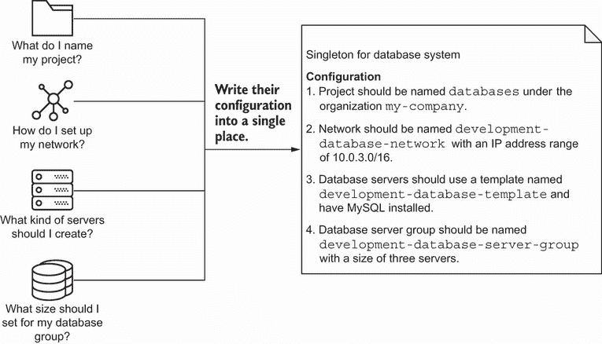

图 3.1 单例模式表达了一组初始资源（如项目、网络和数据库）的配置，这些资源在一个文件中。这种模式捕捉了资源之间的关系。

单例模式简化了 IaC（基础设施即代码）的编写，因为您将所有内容放入一个配置中。当您在一个配置中表达每个基础设施资源时，您将获得一个单独的引用来调试和解决供应顺序和所需参数。

然而，从单例模式开始通常会导致后续的挑战。当我开始使用单例模式时，我把基础设施配置当作一个杂物抽屉——存放那些没有其他地方可放的随机物品。如果您找不到某物，抽屉将成为您首先查看的地方（图 3.2）。


图 3.2 如果您不知道将对象放在哪里，请将其添加到杂物抽屉中，该抽屉使用单例模式来聚合所有资源。

由于我不知道其他地方可以配置基础设施资源，所以我只是将它们添加到一个文件中。最终，单例模式变得像杂物抽屉一样混乱！我不得不在单例中搜索基础设施资源。此外，单例中的基础设施资源数量意味着识别、更改和创建资源需要花费时间。

随着系统随着更多资源的增长而扩展，单例模式对可重复性提出了挑战。为生产环境生成配置意味着将其复制并粘贴到新文件中。当您有更多资源需要更新时，复制和粘贴配置无法扩展！单例以可扩展性和可组合性为代价。它适用于少量基础设施资源，但不能与复杂系统一起扩展。

你应该在何时使用单例？当您有一个只需要单个实例且很少更改的资源时，它效果最好，例如 GCP 项目。网络、数据库服务器模板和服务器组必须放入另一个配置中。

所有 GCP 项目都必须有一个唯一的标识符，这使得单例模式非常理想。项目只能有一个实例。例如，你可以创建一个名为 *databases* 的项目，并根据当前系统用户名生成一个唯一标识符。以下列表显示了实现使用系统用户名创建 GCP 项目的单例模式的代码。

列表 3.1 使用单例模式在 GCP 中创建项目

```
import json
import os

class DatabaseGoogleProject:
   def __init__(self):                                                   ❶
       self.name = 'databases'                                           ❷
       self.organization = os.environ.get('USER')                        ❸
       self.project_id = f'{self.name}-{self.organization}'              ❹
       self.resource = self._build()                                     ❺

   def _build(self):
       return {
           'resource': [
               {
                   'google_project': [                                   ❷
                       {
                           'databases': [
                               {
                                   'name': self.name,                    ❷
                                   'project_id': self.project_id         ❹
                               }
                           ]
                       }
                   ]
               }
           ]
       }

if __name__ == "__main__":
   project = DatabaseGoogleProject()                                     ❺

   with open('main.tf.json', 'w') as outfile:                            ❻
       json.dump(project.resource, outfile, sort_keys=True, indent=4)    ❻
```

❶ 为数据库 Google 项目创建一个对象

❷ 使用名为“databases”的 Terraform 资源设置 Google 项目

❸ 获取操作系统用户并将其设置为组织变量

❹ 根据项目名称和操作系统用户创建一个唯一的项目 ID，以便 GCP 可以创建项目

❺ 创建一个 `DatabaseGoogleProject` 来生成项目的 JSON 配置

❻ 将 Python 字典写入 JSON 文件，以便 Terraform 以后执行

AWS 和 Azure 等效

你可以将 GCP 项目等同于 AWS 账户。为了自动化 AWS 账户的创建，你需要使用 AWS Organizations ([`aws.amazon.com/organizations/`](https://aws.amazon.com/organizations/))。

在 Azure 中，你会创建一个订阅和一个资源组。你可以通过使用 `azurerm_resource_group` Terraform 资源来创建资源组 ([`mng.bz/1orq`](http://mng.bz/1orq))。

假设你想要在你的数据库项目中创建一个服务器。你可以调用 `DatabaseGoogleProject` 单例并从 JSON 配置中提取项目标识符。单例包含独特的资源，你可以通过模块的调用来引用它们。例如，如果你引用 `database` 项目，你将始终得到正确的项目，而不会是另一个项目。

你使用一个单例来表示 GCP 项目，因为你只创建它一次，并且很少更改。你可以将单例模式应用于很少更改的 *全局* 资源，例如提供者账户、项目、域名注册或根 SSL 证书。它也适用于静态环境，例如低使用率的数据中心环境。

## 3.2 组合

你可以将数据库系统组织到单个单例中，而不是用模块来组织组件。*模块* 将具有相同功能或业务领域的基础设施资源分组在一起。模块允许你更改部分自动化，而不会影响整体。

定义 A *模块* 通过功能或业务领域组织基础设施资源。其他工具或资源可能将它们称为 *基础设施堆栈* 或 *集合*。

你可以使用模块作为构建块来构建你的系统。其他团队可以将模块作为构建块来构建他们独特的基础设施系统。

图 3.3 展示了你的公司如何组织团队并创建报告结构。每个团队或经理向另一个经理报告，最终达到管理层。公司使用团队的组合来实现共同目标。

为什么您的公司会将报告结构分解为模块？这种模式确保了新的倡议或商业机会有一个团队来支持它们。随着公司的发展，它促进了可组合性和可扩展性。

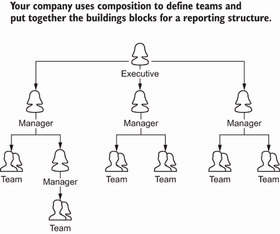

图 3.3 您的公司可能会使用组合模式将员工分组到报告结构中，从而允许管理者组织团队及其目标。

以类似的方式，大多数 IaC 都依赖于*组合模式*来分组、排序和结构化一组模块。您通常会找到组合模式被归类为结构模式，因为它以层次结构结构化对象。

定义 *组合模式* 将基础设施模块视为单个实例，并允许您在系统中组装、分组和排序模块。

工具通常都有自己的模块化功能。Terraform 和 Bicep 使用它们自己的模块框架来嵌套和组织模块。您可以在 CloudFormation 中使用嵌套堆栈或 StackSets 来重用模板（模块）或跨区域创建堆栈。像 Ansible 这样的配置管理工具可以让您构建顶层剧本，导入其他任务。

您如何实现一个模块？想象一下，您需要为数据库服务器设置网络。然而，服务器需要一个子网络（子网）。您将网络和子网络组合到一个模块中，如图 3.4 所示。您首先确定如何设置网络，并将其写入模块中。然后，您写下子网络的配置并将其添加到模块中。

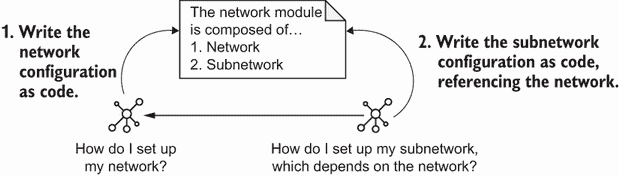

图 3.4 网络模块可以使用组合模式将网络和子网络资源分组。

模块包含网络和子网络的配置。如果您需要在生产环境中重现网络系统，您始终可以复制并粘贴整个模块来创建新的网络和子网络。网络组合模式确保您可以始终重现一组相互依赖的资源。

您可以在模块中实现网络配置的组合模式。如下所示，模块创建了一个网络和子网络。您传递网络和子网络的 CIDR 范围，模块为网络生成一个标准化的名称。

列表 3.2 创建网络和子网络

```
import json

class Network:                                                              ❶
   def __init__(self, region='us-central1'):                                ❷
       self._network_name = 'my-network'                                    ❸
       self._subnet_name = f'{self._network_name}-subnet'                   ❹
       self._subnet_cidr = '10.0.0.0/28'                                    ❺
       self._region = region                                                ❷
       self.resource = self._build()                                        ❻

   def _build(self):                                                        ❻
       return {
           'resource': [
               {
                   'google_compute_network': [                              ❸
                       {
                           f'{self._network_name}': [                       ❸
                               {
                                   'name': self._network_name               ❸
                               }
                           ]
                       }
                   ]
               },
               {
                   'google_compute_subnetwork': [                           ❼
                       {
                           f'{self._subnet_name}': [                        ❽
                               {                                            ❽
                                   'name': self._subnet_name,               ❽
                                   'ip_cidr_range': self._subnet_cidr,      ❾
                                   'region': self._region,                  ❷
                                   'network': f'${{google_compute_network
                                   ➥.{self._network_name}.name}}'          ❼
                               }
                           ]
                       }
                   ]
               }
           ]
       }

if __name__ == "__main__":
   network = Network()                                                      ❿

   with open('main.tf.json', 'w') as outfile:                               ⓫
       json.dump(network.resource, outfile, sort_keys=True, indent=4)       ⓫
```

❶ 创建一个网络模块，该模块使用组合模式将网络和子网络捆绑在一起

❷ 将区域设置为默认区域，us-central1

❸ 使用名为“my-network”的 Terraform 资源设置 Google 网络。GCP 不需要定义网络 CIDR 块。

❹ 使用名为“my-network-subnet”的 Terraform 资源设置 Google 子网络

❺ 将子网的 CIDR 块设置为 10.0.0.0/28

❻ 使用模块创建网络和子网络的 JSON 配置

❼ 通过使用 Terraform 变量在网络上创建 Google 子网。Terraform 会动态引用网络 ID，并将其插入到子网配置中，供您使用。

❽ 使用名为“my-network-subnet”的 Terraform 资源设置 Google 子网

❾ 将子网的 CIDR 块设置为 10.0.0.0/28

❿ 使用模块创建网络的 JSON 配置和子网

⓫ 将 Python 字典写入 JSON 文件，以便稍后由 Terraform 执行

AWS 和 Azure 的等效模式

您可以将 GCP 网络和子网等同于 AWS VPC 和子网，或者等同于 Azure 虚拟网络和子网。然而，在 AWS 和 Azure 中，您需要在每个子网中定义网关和路由表。当您创建网络时，GCP 会自动为您定义这些。

为什么需要将模块与网络和子网组合？除非您有一个子网，否则您无法使用 GCP 网络！组合允许您一起创建一组资源。将所需的资源捆绑在一起可以帮助您的队友，他们可能不太了解网络。组合模式改进了可组合性原则，因为它将必须作为一个单元部署的常见资源分组和组织。

组合模式对于基础设施来说效果很好，因为基础设施资源具有层次结构。遵循此模式的模块反映了资源之间的关系，并促进了它们的管理。如果您需要更新路由，您将更新网络组合配置。您可以通过参考网络配置来确定子网 CIDR 范围并计算网络地址空间。

您可以通过根据功能、业务单元或运营责任对资源进行分组来应用组合模式。在您起草初始模块时，您可能需要添加变量以允许更灵活的参数或分发配置给其他团队。我在第五章中讨论了如何共享模块。然而，您可以在通用组合模式之外应用其他模式，以进一步提高 IaC 的可重复性。

## 3.3 工厂

之前，您使用单例模式为数据库系统创建了一个 GCP 项目。然后您应用了组合模式，并在不同的模块中构建了网络。然而，现在您意识到您需要一个分为三个子网的数据库网络。与其复制和粘贴三个子网，您希望创建一个接受子网名称和 IP 地址范围输入的配置。

创建三个子网和一个网络配置需要许多参数，这些参数可能很繁琐，难以包含和维护。如果有一个类似工厂的设施来制造所有具有默认意见的资源会怎样？图 3.5 显示，您可以创建一个网络工厂来批量生产类似网络。您可以将所需的参数减少到两个输入，并将其他配置设置为默认值。

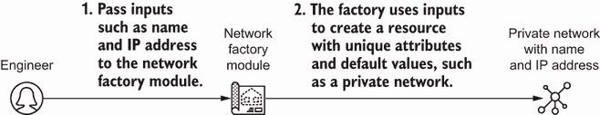

图 3.5 工厂模式模块包含一组最小资源配置的默认值，并通过接受输入变量来启用定制。

当你知道网络有特定的默认属性时，你可以最小化输入，并更轻松地生成多个资源。我称这种方法为*工厂模式*。使用工厂模式的模块接受一组输入，例如名称和 IP 地址范围，并根据输入创建一组基础设施资源。

定义：*工厂模式*接受一组输入变量，并根据输入变量和默认常量创建一组基础设施资源。

你希望提供足够的灵活性以进行更改，例如子网的 IP 地址和名称。通常，你需要在模块中在提供足够的定制和使用有偏见的默认属性之间找到平衡。毕竟，你希望促进可重复性原则，同时保持资源的可发展性。我们将在第五章中讨论更多关于共享资源，如模块的内容，并在第八章中标准化模块的安全实践。

让我们回到我们的例子。如何在不传递名称列表的情况下创建三个子网？模块可以自动命名子网，这样你就可以避免硬编码它们。图 3.6 显示了如何将一些逻辑添加到网络工厂模块中，以根据网络地址标准化子网的名称。

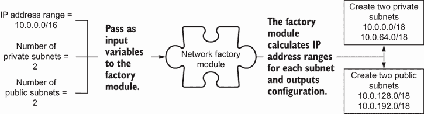

图 3.6 网络工厂模块可以包括计算子网寻址并创建网络多个子网资源的转换。

使用工厂模式的模块可以将输入变量转换为标准模板，这是一种常见的生成名称或标识符的做法。当你在代码中实现使用工厂模式的网络模块时，你会添加一个`SubnetFactory`模块。列表 3.3 构建了一个工厂模块来生成子网的名称。

列表 3.3 使用工厂模式在 GCP 中创建三个子网

```
import json
import ipaddress

def _generate_subnet_name(address):                                    ❶
   address_identifier = format(ipaddress.ip_network(                   ❶
       address).network_address).replace('.', '-')                     ❶
   return f'network-{address_identifier}'                              ❶

class SubnetFactory:                                                   ❷
   def __init__(self, address, region):
       self.name = _generate_subnet_name(address)                      ❶
       self.address = address                                          ❸
       self.region = region                                            ❹
       self.network = 'default'                                        ❺
       self.resource = self._build()                                   ❻

   def _build(self):                                                   ❻
       return {
           'resource': [
               {
                   'google_compute_subnetwork': [                      ❼
                       {                                               ❼
                           f'{self.name}': [                           ❼
                               {                                       ❼
                                   'name': self.name,                  ❼
                                   'ip_cidr_range': self.address,      ❼
                                   'region': self.region,              ❼
                                   'network': self.network             ❼
                               }                                       ❼
                           ]                                           ❼
                       }                                               ❼
                   ]                                                   ❼
               }
           ]
       }

if __name__ == "__main__":
   subnets_and_regions = {                                             ❽
       '10.0.0.0/24': 'us-central1',                                   ❽
       '10.0.1.0/24': 'us-west1',                                      ❽
       '10.0.2.0/24': 'us-east1',                                      ❽
   }                                                                   ❽

   for address, region in subnets_and_regions.items():                 ❽

       subnetwork = SubnetFactory(address, region)                     ❻

       with open(f'{_generate_subnet_name(address)}.tf.json',
                 'w') as outfile:                                      ❾
           json.dump(subnetwork.resource, outfile,                     ❾
                 sort_keys=True, indent=4)                             ❾
```

❶ 对于给定的子网，通过用短横线分隔 IP 地址范围并将其附加到“网络”来生成子网名称

❷ 为子网创建一个模块，该模块使用工厂模式生成任意数量的子网

❸ 将子网的地址传递给工厂

❹ 将子网的区域传递给工厂

❺ 在此示例中，在“默认”网络上创建子网

❻ 使用该模块创建网络和子网络的 JSON 配置

❼ 使用基于名称、地址、区域和网络的基础设施资源创建 Google 子网

❽ 对于每个使用其 IP 地址范围和区域定义的子网，使用工厂模块创建子网

❾ 将 Python 字典写入 JSON 文件，以便 Terraform 稍后执行

为什么我会将子网分离到自己的工厂模块中？为子网创建单独的模块促进了可扩展性的原则。我可以更改生成任何数量子网名称的逻辑。我还可以更新名称格式，而不会影响网络。

大多数工厂模块包括*转换或动态生成*属性。例如，你可以修改网络工厂模块以计算子网的 IP 地址范围。计算自动构建正确数量的私有或公共子网。

然而，我建议尽可能减少添加到工厂模块中的转换。它们可能会增加资源配置的复杂性。你的转换逻辑越复杂，你需要进行测试以检查转换的情况就越多。在第六章中，我将介绍如何测试模块和基础设施配置。

工厂模式平衡了基础设施资源的可重复性和可扩展性。它通过名称、大小或其他属性上的微小差异制造出相似的基础设施。如果你需要构建适用于常见资源（如网络或服务器）的配置模块，你将想要构建一个工厂模块。

每次运行工厂模块时，你都可以期待获得你请求的具体资源集合。该模块不包含很多逻辑来确定*哪些*资源要构建。相反，工厂模块专注于设置资源的属性。

我经常编写具有*许多默认常量*和*少量输入变量*的工厂模块。这样，我减少了维护和验证输入的开销。通常使用工厂模块的基础设施包括网络和子网络、服务器集群、托管数据库、托管队列或托管缓存等。

## 3.4 原型

现在你已经创建了一个构建数据库网络的模块，你可以创建数据库服务器。但是，你必须使用客户名称、业务单元和成本中心对数据库系统中的所有资源进行标记。审计团队还要求你包含`automated=true`以标识自动化资源。

理想情况下，标签（或在 GCP 中的标签）必须在所有资源上保持一致。如果你更新了标签，你的自动化应该将它们复制到每个资源上。你将在第八章中了解更多关于标签重要性的内容。

如果你能将所有标签放在一个地方并一次性更新会怎样？图 3.7 显示你可以将所有标签放入一个模块中。数据库服务器引用标签的通用模块，并将静态值应用于服务器。

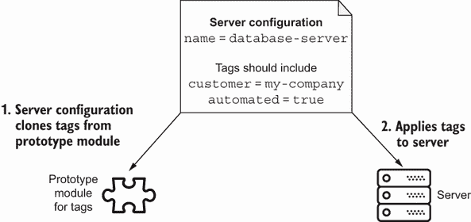

图 3.7 使用原型模式的模块返回静态值（如标签）的副本，供其他基础设施资源使用。

而不是为每个标签硬编码，你创建了一个实现*原型模式*的模块，以表达一组供其他模块使用的静态默认值。原型模块生成配置的副本，以附加到其他资源。

定义 原型模式使用一组输入变量来构建一组静态默认值，供其他模块消费。它们通常不会直接创建基础设施资源，而是导出配置值。

您可以将原型视为一个存储单词和定义的字典（图 3.8）。字典的创建者会更改单词和定义。您可以引用它并更新您的文本或词汇。

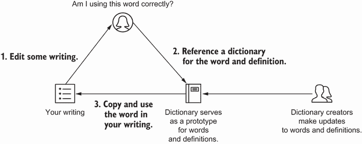

图 3.8 您使用字典作为原型来引用单词和定义，并在您的写作中更新它们。

为什么使用原型模块来引用常用元数据？原型模式促进了可扩展性和可重复性原则。它确保资源之间配置的一致性，并简化了常用配置的演变。您不需要在文件中查找和替换字符串！

让我们使用原型模式实现标签模块。列表 3.4 创建了一个使用原型模式返回一组标准标签的模块。在后续的基础设施资源中，您可以通过引用模块中的 `StandardTags` 来包含所需的任何标签。该模块不会创建标签资源。相反，它返回预定义标签的副本。

列表 3.4 使用原型模式创建标签模块

```
import json

class StandardTags():                                                     ❶
   def __init__(self):                                                    ❶
       self.resource = {                                                  ❶
           'customer': 'my-company',                                      ❶
           'automated': True,                                             ❶
           'cost_center': 123456,                                         ❶
           'business_unit': 'ecommerce'                                   ❶
       }                                                                  ❶

class ServerFactory:                                                      ❷
   def __init__(self, name, network, zone='us-central1-a', tags={}):      ❸
       self.name = name
       self.network = network
       self.zone = zone
       self.tags = tags                                                   ❸
       self.resource = self._build()                                      ❹

   def _build(self):
       return {
           'resource': [
               {
                   'google_compute_instance': [                           ❺
                       {
                           self.name: [
                               {
                                   'allow_stopping_for_update': True,
                                   'boot_disk': [
                                       {
                                           'initialize_params': [
                                               {
                                                   'image': 'ubuntu-1804-lts'
                                               }
                                           ]
                                       }
                                   ],
                                   'machine_type': 'f1-micro',
                                   'name': self.name,
                                   'network_interface': [
                                       {
                                           'network': self.network
                                       }
                                   ],
                                   'zone': self.zone,
                                   'labels': self.tags                   ❻
                               }
                           ]
                       }
                   ]
               }
           ]
       }

if __name__ == "__main__":
   config = ServerFactory(                                               ❼
       name='database-server', network='default',                        ❼
       tags=StandardTags().resource)                                     ❽

   with open('main.tf.json', 'w') as outfile:                            ❾
       json.dump(config.resource, outfile,                               ❾
                 sort_keys=True, indent=4)                               ❾
```

❶ 使用原型模式创建一个返回标准标签副本的模块，例如客户、成本中心和业务单元

❷ 使用工厂模式创建一个基于名称、网络和标签的 Google 计算实例（服务器）模块

❸ 将标签作为变量传递给服务器模块

❹ 使用模块创建“默认”网络上的服务器 JSON 配置

❺ 使用 Terraform 资源创建 Google 计算实例（服务器）

❻ 将存储在变量中的标签添加到 Google 计算实例资源

❼ 使用模块创建“默认”网络上的服务器 JSON 配置

❽ 使用标准标签模块向服务器添加标签

❾ 将 Python 字典写入 JSON 文件，供 Terraform 后续执行

AWS 和 Azure 等效

要将列表 3.4 转换为其他云提供商，将资源更改为 Amazon EC2 实例或 Azure Linux 虚拟机。然后，将 `self.tags` 传递给 AWS 或 Azure 资源的 `tags` 属性。

让我们运行 Python 脚本以创建服务器配置，如列表 3.5 所示。当您检查服务器的 JSON 输出时，您会注意到服务器包含一组标签。这些标签与您的原型模块中的标准标签相匹配！

列表 3.5 使用模块中的标签创建服务器配置

```
{
   "resource": [
       {
           "google_compute_instance": [                             ❶
               {
                   "database-server": [                             ❷
                       {
                           "allow_stopping_for_update": true,
                           "boot_disk": [
                               {
                                   "initialize_params": [
                                       {
                                           "image": "ubuntu-1804-lts"
                                       }
                                   ]
                               }
                           ],
                           "labels": {                              ❸
                               "automated": true,                   ❸
                               "business_unit": "ecommerce",        ❸
                               "cost_center": 123456,               ❸
                               "customer": "my-company"             ❸
                           },     
                           "machine_type": "f1-micro",
                           "name": "database-server",               ❷
                           "network_interface": [
                               {
                                   "network": "default"
                               }
                           ],
                           "zone": "us-central1-a"                  ❹
                       }
                   ]
               }
           ]
       }
   ]
}
```

❶ JSON 文件使用 Terraform 资源定义了一个 Google 计算实例。

❷ Terraform 将资源识别为数据库服务器。JSON 配置与您在服务器工厂模块中使用 Python 定义的配置相匹配。

❸ 将标准标签原型模块中的标签添加到服务器配置中的标签字段

❹ JSON 配置检索区域变量并将其填充到 JSON 文件中。

你会注意到你的服务器配置中包含了很多硬编码的值，比如操作系统和机器类型。这些值作为全局默认值存在。随着时间的推移，你会在你的工厂模块中不断增加全局默认值，并发现它们已经超出了模块的容量！

为了理清和整理全局默认值，你可以在原型模块中定义它们。该模块使得随着时间的推移演变默认值并与其他值组合变得更加容易。原型成为资源的静态、明确定义的默认值。

在这样的情况中，我开始编写一个工厂模块来在基础设施上创建一组警报。最初，我传递环境名称和指标阈值来参数化警报及其配置。我发现警报不需要环境名称，并且指标阈值在各个环境中没有变化。

因此，我将这个模块转换成了原型。需要将指标添加到他们系统的团队导入了这个模块。该模块向他们的配置中添加了预定义的警报资源。

领域特定语言

Terraform、Kubernetes、CloudFormation 和 Bicep 等工具的领域特定语言没有像编程语言那样的全局常量。然而，它们确实支持模块引用和对象结构。你可以通过创建一个作为对象的原型来使用与编程语言相同的模式。

原型使得创建一组标准的资源或配置变得更容易。它消除了设置输入值的不确定性。然而，你会有一些标准值之外的例外。作为解决方案，你可以根据资源覆盖或添加配置。例如，我通常将特定于资源的自定义标签与标准标签列表合并。

除了标签之外，我通常还会使用原型模块来处理区域、可用区域或账户标识符。当我需要具有许多全局默认值或复杂转换的**静态配置**时，我会使用原型模式来创建模块。例如，你可能有一个在启用 SSL 时运行的服务器初始化脚本。你可以创建一个原型模块来根据是否使用 SSL 来模板化脚本。

## 3.5 构建器

你学习了如何应用单例模式来创建项目，工厂来创建网络，原型来设置数据库服务器的标签。接下来，你将构建一个连接到数据库的负载均衡器。

但首先，你会遇到一个具有挑战性的需求。该模块必须允许你创建私有或公共负载均衡器！私有负载均衡器需要不同的服务器和网络配置。你必须构建一个模块，它能够提供选择私有或公共负载均衡器的灵活性，并根据你的选择配置服务器和网络。

图 3.9 演示了一个模块，该模块根据您的负载均衡器类型选择防火墙和服务器配置。您可以使用相同的模块创建外部或内部负载均衡器。该模块处理负载均衡器及其所需防火墙规则的正确配置。

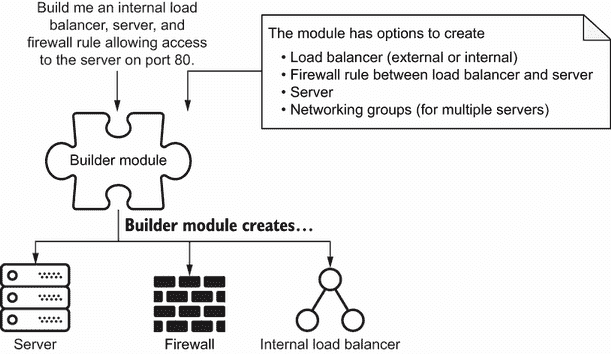

图 3.9 数据库的构建器模块将包括参数以选择模块必须创建的负载均衡器类型和防火墙规则。

该模块为您提供了选择构建所需系统的选项，有助于系统的可扩展性和可组合性。该模块遵循*构建器模式*，它捕获一些默认值，但允许您组合所需的系统。构建器模式组织了一组相关的资源，您可以根据所需的系统启用或禁用这些资源。

定义 *构建器模式* 组装一组您可以选择启用或禁用以实现所需配置的基础设施资源。

在数据库模块中实现构建器模式允许您根据选择生成资源组合。构建器模式使用输入来决定需要构建哪些资源，而工厂模块根据输入变量配置资源属性。该模式就像为房地产开发建造房屋。您从预设的蓝图中选择，并告诉构建者您想要的布局更改（图 3.10）。例如，一些构建者可能会通过移除车库来增加一个额外的房间。

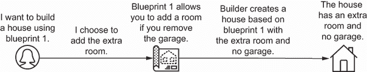

图 3.10 一个构建器模块使用预设蓝图构建房屋，允许进行布局更改，例如增加一个房间。

让我们开始实现构建器模式，如下所示列表。首先，您通过使用工厂模式定义一个负载均衡器模块。您使用工厂模式来自定义负载均衡器（在 GCP 中也称为*计算转发规则*）。该模块将负载均衡器的方案设置为外部或内部。

列表 3.6 使用工厂模块为负载均衡器

```
class LoadBalancerFactory:                                                ❶
   def __init__(self, name, region='us-central1', external=False):        ❶
       self.name = name
       self.region = region
       self.external = external                                           ❶
       self.resources = self._build()                                     ❷

   def _build(self):
       scheme = 'EXTERNAL' if self.external else 'INTERNAL'               ❸
       resources = []
       resources.append({
           'google_compute_forwarding_rule': [{                           ❹
               'db': [
                   {
                       'name': self.name,
                       'target': r'${google_compute_target_pool.db.id}',  ❺
                       'port_range': '3306',                              ❻
                       'region': self.region,
                       'load_balancing_scheme': scheme,
                       'network_tier': 'STANDARD'
                   }
               ]
           }
           ]
       })
       return resources
```

❶ 创建一个负载均衡器模块，该模块使用工厂模式生成内部或外部负载均衡器

❷ 使用该模块创建负载均衡器的 JSON 配置

❸ 将方案设置为内部或外部负载均衡。负载均衡器默认为内部配置。

❹ 使用 Terraform 资源创建 Google 计算转发规则。这是 GCP 中负载均衡的等效功能。

❺ 将负载均衡器的目标设置为数据库服务器组。这使用 Terraform 内置的变量插值功能来动态解析数据库服务器组的 ID。

❻ 允许流量通过 3306 端口，这是 MySQL 数据库端口

AWS 和 Azure 等效功能

您可以将 GCP 计算转发规则等同于 AWS 弹性负载均衡器 (ELB) 或 Azure 负载均衡器。同样，AWS 安全组或 Azure 网络安全组大致等同于 GCP 防火墙规则。有关 AWS 的示例，请参阅代码仓库[`github.com/joatmon08/manning-book`](https://github.com/joatmon08/manning-book)。

然而，外部负载均衡器需要额外的防火墙规则配置。您必须允许外部源流量访问数据库端口。让我们定义一个使用工厂模式的模块，以允许外部源流量，如下面的列表所示。

列表 3.7 使用工厂模块创建防火墙规则

```
class FirewallFactory:                                ❶
   def __init__(self, name, network='default'):
       self.name = name
       self.network = network
       self.resources = self._build()                 ❷

   def _build(self):
       resources = []
       resources.append({
           'google_compute_firewall': [{              ❸
               'db': [
                   {
                       'allow': [                     ❹
                           {                          ❹
                               'protocol': 'tcp',     ❹
                               'ports': ['3306']      ❹
                           }                          ❹
                       ],                             ❹
                       'name': self.name,
                       'network': self.network
                   }
               ]
           }]
       })
       return resources
```

❶ 创建了一个使用工厂模式生成防火墙规则的防火墙模块

❷ 使用该模块创建负载均衡器的 JSON 配置

❸ 使用 Terraform 资源创建 Google 计算防火墙。这是 GCP 中防火墙规则的等效物。

❹ 防火墙规则应默认允许 TCP 流量访问端口 3306。

多亏了可组合性原则，您将负载均衡器和工厂模块放入数据库构建器模块中。该模块需要一个变量，帮助您选择负载均衡器的类型以及是否应包含防火墙规则以允许流量访问负载均衡器。

当您在列表 3.8 中实现数据库构建器模块时，您将其设置为默认创建数据库服务器组和网络。然后构建器接受两个选项：内部或外部负载均衡器以及额外的防火墙规则。

列表 3.8 使用构建器模式构建数据库

```
import json
from server import DatabaseServerFactory                               ❶
from loadbalancer import LoadBalancerFactory                           ❶
from firewall import FirewallFactory                                   ❶

class DatabaseModule:                                                  ❷
   def __init__(self, name):

       self._resources = []
       self._name = name
       self._resources = DatabaseServerFactory(self._name).resources   ❸

   def add_internal_load_balancer(self):                               ❹
       self._resources.extend(
           LoadBalancerFactory(
               self._name, external=False).resources)

   def add_external_load_balancer(self):                               ❺
       self._resources.extend(
           LoadBalancerFactory(
               self._name, external=True).resources)

   def add_google_firewall_rule(self):                                 ❻
       self._resources.extend(
           FirewallFactory(
               self._name).resources)

   def build(self):                                                    ❼
       return {                                                        ❼
           'resource': self._resources                                 ❼
       }                                                               ❼

if __name__ == "__main__":
   database_module = DatabaseModule('development-database')            ❽
   database_module.add_external_load_balancer()                        ❽
   database_module.add_google_firewall_rule()                          ❽

   with open('main.tf.json', 'w') as outfile:                          ❾
       json.dump(database_module.build(), outfile,                     ❾
                 sort_keys=True, indent=4)                             ❾
```

❶ 导入工厂模块以创建数据库服务器组、负载均衡器和防火墙

❷ 为数据库创建了一个模块，该模块使用构建器模式生成所需的数据库服务器组、网络、负载均衡器和防火墙

❸ 总是通过使用工厂模块创建数据库服务器组和网络。构建器模块需要数据库服务器组。

❹ 添加了一个方法，以便您可以选择构建内部负载均衡器

❺ 添加了一个方法，以便您可以选择构建外部负载均衡器

❻ 添加了一个方法，以便您可以选择构建防火墙规则以允许流量访问数据库

❼ 使用构建器模块返回您自定义数据库资源的 JSON 配置

❽ 使用数据库构建器模块创建具有外部访问（负载均衡器和防火墙规则）的数据库服务器组

❾ 将 Python 字典写入 JSON 文件，以便 Terraform 后续执行

运行 Python 脚本后，您将找到一个包含实例模板、服务器组、服务器组管理器、外部负载均衡器和防火墙规则的冗长 JSON 配置。构建器生成了构建外部可访问数据库所需的所有资源。请注意，列表为了清晰起见省略了其他组件。

列表 3.9 截断的数据库系统配置

```
[
  {
    "google_compute_forwarding_rule": [                             ❶
      {
        "db": [
          {
            "load_balancing_scheme": "EXTERNAL",                    ❷
            "name": "development-database",
            "network_tier": "STANDARD",
            "port_range": "3306",                                   ❸
            "region": "us-central1",
            "target": "${google_compute_target_pool.db.id}"         ❹
          }
        ]
      }
    ]
  },
  {
    "google_compute_firewall": [                                    ❺
      {
        "db": [
          {
            "allow": [                                              ❸
              {                                                     ❸
                "ports": [                                          ❸
                  "3306"                                            ❸
                ],                                                  ❸
                "protocol": "tcp"                                   ❸
              }                                                     ❸
            ],
            "name": "development-database",
            "network": "default"
          }
        ]
      }
    ]
  }
]
```

❶ JSON 文件使用 Terraform 资源定义了一个 Google 计算转发规则和防火墙，为了清晰起见，文件省略了实例模板、服务器组和服务器组。

❷ 使用 EXTERNAL 方案创建一个负载均衡器，使其可以从外部源访问

❸ 创建一个防火墙，允许在端口 3306 上进行 TCP 流量，这是 MySQL 数据库端口

❹ 将负载均衡器的目标设置为数据库服务器组。这使用 Terraform 内置的变量插值功能来动态解析数据库服务器组的 ID。

❺ JSON 文件使用 Terraform 资源定义了一个 Google 计算转发规则和防火墙，为了清晰起见，文件省略了实例模板和服务器组。

构建者模式帮助你遵循可扩展性原则。你可以选择你需要的一组资源。采用这种模式的模块可以消除配置正确属性和资源组合的挑战。

此外，你可以使用构建者模式在云提供商的资源周围包装一个通用接口。Python 示例提供了 `add_external_load_balancer` 构建方法，它围绕 GCP 计算转发规则进行包装。当你使用该模块时，该选项描述了创建通用负载均衡器的意图，而不是 GCP 转发规则。

领域特定语言

一些 DSL 提供了 if-else（条件）语句或循环（迭代），你可以用于构建者模式。Terraform 提供了 `count` 参数，可以根据条件语句创建一定数量的资源。CloudFormation 支持用户输入的条件，可以用于选择堆栈。Bicep 使用部署条件。对于 Ansible，你可以使用条件导入来选择任务或剧本。

例如，你可以设置一个名为 `add_external_load_balancer` 的布尔变量。如果你将 `true` 传递给该变量，DSL 将添加一个条件语句来构建外部负载均衡器资源。否则，它将创建一个内部负载均衡器。

一些领域特定语言（DSL）不提供条件语句。你可能需要一些类似于本书中代码示例的代码，以模板化 DSL。例如，你可以使用 Helm 来模板化和发布 Kubernetes YAML 文件。

构建者模式最适合创建多个资源的模块。这些用例包括 Kubernetes 等容器编排器的配置、具有集群架构的平台、应用程序和系统指标的仪表板等。这些用例的构建者模块允许你选择你想要的资源，而无需传递特定的输入属性。

然而，构建者模块可能很复杂，因为它们引用其他模块和多个资源。模块配置错误的风险可能非常高。第六章涵盖了测试策略，以确保构建者模块的功能性和稳定性。

## 3.6 选择一个模式

在本章中，我展示了如何将一些资源分组到数据库系统的各种模块模式中。你如何选择使用哪种模块模式？关于我未提及的数据库系统中的其他资源呢？

你可以为具有不同业务功能和目的的新基础设施资源创建单独的模块。本章中的数据库示例将 Google 项目的配置（单例）、网络（工厂）和数据库集群（工厂）分离成模块。每个模块作为不同的资源独立发展，具有不同的输入变量和默认值。

示例使用组合模式来组合系统中所有的模块模式。它使用工厂模式来处理网络、负载均衡器和数据库集群模块，以传递属性并定制每个资源。标签通常使用原型模式，因为它们涉及将一致的元数据复制到其他资源。你将使用工厂和原型模式来编写大多数模块，因为它们提供了可组合性、可复制性和可扩展性。

相比之下，你将 Google 项目作为一个单例来构建，因为没有其他人会更改我项目单例的属性。项目变化不大，所以你使用了一个更简单的模式。然而，你解决了使用构建器模式创建数据库系统的复杂问题。构建器模块允许你选择要创建的特定资源。

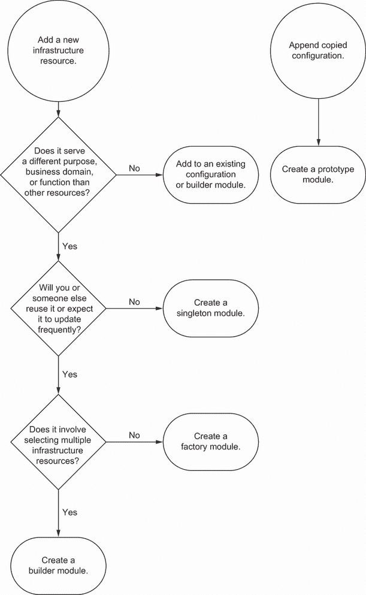

图 3.11 为了决定你想使用哪种模块模式，你必须评估你如何使用资源及其行为。

图 3.11 提供了一个决策树，用于确定使用哪种模式。你将针对目的、重用和更新频率以及多个资源的组合提出一系列问题。基于这些标准，你创建一个具有特定模式的模块。

遵循决策树可以帮助构建更可组合和可扩展的模块。你希望平衡标准属性的预测性与覆盖特定资源配置的灵活性。然而，保持开放的心态。模块可能会超出其功能并发生变化。仅仅因为你用一种模式构建了一个模块，并不意味着你未来不会将其转换为另一种模式！

练习 3.1

以下 IaC（基础设施即代码）适用于哪些模块模式？（选择所有适用的。）

```
if __name__ == "__main__":
  environment = 'development'
  name = f'{environment}-hello-world'
  cidr_block = '10.0.0.0/16'

  # NetworkModule returns a subnet and network
  network = NetworkModule(name, cidr_block)

  # Tags returns a default list of tags
  tags = TagsModule()

  # ServerModule returns a single server
  server = ServerModule(name, network, tags)
```

A) 工厂

B) 单例

C) 原型

D) 构建器

E) 组合

请参阅附录 B 以获取练习题的答案。

注意，本章中的许多模式都侧重于使用 IaC 工具构建模块。有时你可能需要在编程语言中编写自动化脚本，因为你找不到 IaC 支持。这种情况在遗留基础设施中最为常见。例如，想象你需要创建一个 GCP 中的数据库系统。然而，你没有 IaC 工具，只能直接访问 GCP API。

要使用 GCP API 创建数据库系统，您将每个基础设施资源分离成具有四个函数（创建、读取、更新和删除）的工厂模块。对资源的更改使用这些函数的组合。您可以根据您想要对每个资源执行的操作检查每个函数中的错误。

图 3.12 实现了服务器、网络和负载均衡器的工厂模块。您可以创建、读取、更新和删除每个模块。数据库的构建者模块使用组合模式来创建、读取、更新和删除网络、服务器和负载均衡器。

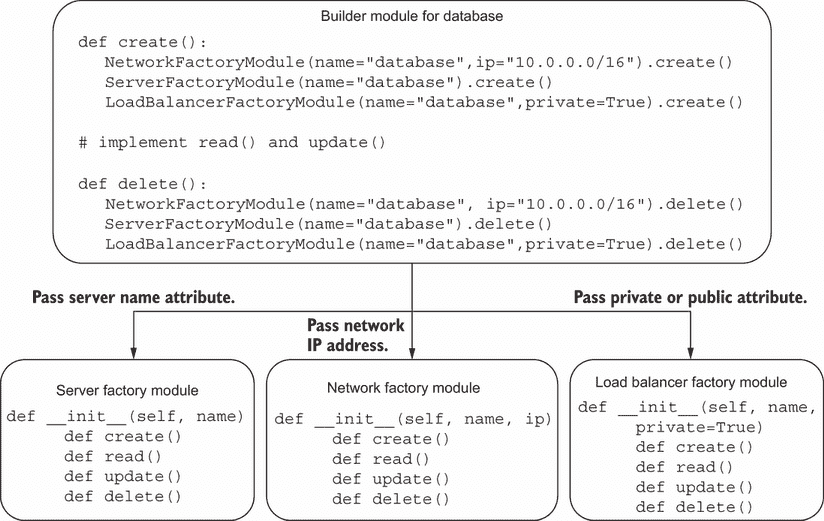

图 3.12 要编写自动化脚本，为单个资源创建工厂模块，然后构建创建、读取、更新和删除资源的函数。

将对资源的更新拆分为四个函数可以组织自动化流程。即使是构建者模式也使用创建、读取、更新和删除函数。这些函数定义了您想要用于配置资源的自动化行为。然而，您应该测试每个函数以确保幂等性。每次运行函数时，它都应该导致相同的配置。

您可以将本章中的模块模式应用于任何基础设施的自动化和实施基础设施即代码（IaC）。随着您开发 IaC，确定您可以将基础设施系统拆分为模块的地方。在决定何时以及如何模块化时，请考虑以下因素：

+   资源是否已共享？

+   它服务于哪个业务领域？

+   哪个环境使用该资源？

+   哪个团队管理基础设施？

+   资源是否使用不同的工具？

+   您如何更改资源而不影响模块中的其他内容？

通过评估哪些资源与不同的业务单元、团队或功能相匹配，您可以构建更小的基础设施集合。作为一般做法，尽可能少地编写模块。资源较少的模块可以加快供应速度并最小化故障的影响范围。更重要的是，您可以在将它们应用于更广泛的系统之前，对较小的模块进行部署、测试和调试。

将资源分组到模块中为您、您的团队和您的公司带来了一些好处。对于您来说，模块可以提高基础设施资源的可扩展性和弹性。您通过最小化模块更改的影响范围来提高整体系统的弹性。

对于您的团队来说，模块为其他团队成员提供了一个自助机制，以便复制您的模块并创建基础设施。您的队友可以使用模块并传递他们想要定制的变量，而不是寻找和替换属性。您将在第五章中了解更多关于模块共享的内容。

对于你的组织来说，模块可以帮助你在资源之间标准化更好的基础设施和安全实践。你可以使用相同的配置来批量生成类似的负载均衡器和受限防火墙规则。模块还有助于你的安全团队审核和强制执行这些实践，如第八章所述。

## 摘要

+   应用模块模式，如单例、工厂、原型和构建器，以便你可以构建可组合的基础设施配置。

+   使用组合模式将基础设施资源分组到层次结构中，并为自动化对其进行结构化。

+   你可以使用单例模式来管理基础设施的单个实例，这适用于很少更改的基础设施资源。

+   使用原型模式来复制和应用全局配置参数，例如标签或通用配置。

+   工厂模块接收输入以使用特定配置构建基础设施资源。

+   构建模块接收输入以决定要创建哪些资源。构建模块可以由工厂模块组成。

+   在决定如何模块化以及如何模块化时，评估基础设施配置服务于哪些功能或业务领域。

+   如果你编写脚本来自动化基础设施，构建具有创建、读取、更新和删除功能的工厂模块，并在构建模块中引用它们。
