# 基础设施依赖关系的 4 种模式

本章涵盖

+   使用依赖模式编写松散耦合的基础设施模块

+   识别解耦基础设施依赖关系的方法

+   识别依赖模式的基础设施用例

基础设施系统涉及一组相互依赖的资源。例如，服务器依赖于网络的存在。您如何在创建服务器之前知道网络是否存在？您可以使用*基础设施依赖*来表示这一点。当资源在创建或修改第一个资源之前需要另一个资源存在时，就会发生基础设施依赖。

定义 一个*基础设施依赖*表达了基础设施资源依赖于另一个资源的存在和属性的关系。

通常，您通过硬编码网络标识符来识别服务器对网络的依赖。然而，硬编码更紧密地绑定服务器和网络之间的依赖关系。每次您更改网络时，都必须更新硬编码的依赖关系。

在第二章中，您学习了如何使用变量避免硬编码值以促进可重复性和可演化性。将网络标识符作为变量传递可以更好地解耦服务器和网络。然而，变量仅在相同模块的资源之间工作。您如何表达*模块之间*的依赖关系？

前一章将资源分组到模块中以提高可组合性。本章涵盖了管理基础设施依赖关系以增强可演化的模式（变更）。当它们具有松散依赖关系时，您可以更容易地用另一个模块替换一个模块。

在现实中，基础设施系统可能相当复杂，而且在不造成某些干扰的情况下无法交换模块。松散耦合的依赖关系可以减轻变更失败的风险，但并不能保证 100%的可用性！

## 4.1 单向关系

不同的依赖关系会影响基础设施变更。想象一下，每次您创建一个新的应用程序时，都会添加一个防火墙规则。防火墙规则对应用程序 IP 地址有一个*单向依赖*，以允许流量。任何对应用程序的更改都会反映在防火墙规则中。

定义 一个*单向依赖*表达了一种单向关系，其中只有一个资源引用另一个资源。

您可以在任何一组资源或模块之间表达单向依赖关系。图 4.1 描述了防火墙规则与应用程序之间的单向关系。规则*依赖于*应用程序，这使得它在基础设施堆栈中的位置高于较低级别的应用程序。

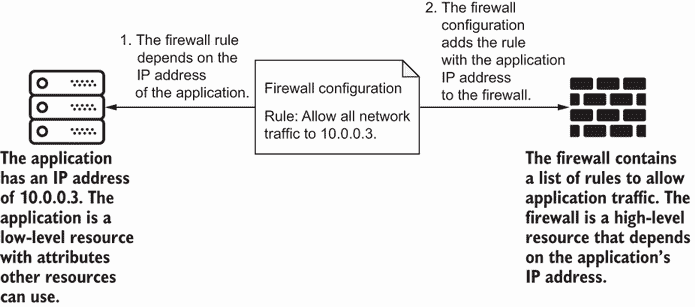

图 4.1 防火墙规则单向依赖于应用程序的 IP 地址。

当您表达依赖关系时，您有一个*高级* *资源*，如防火墙，它依赖于*低级* *资源*，如应用程序的存在。

定义 一个*高级资源*依赖于另一个资源或模块。一个*低级资源*有高级资源依赖于它。

假设一个报告应用程序需要一个防火墙的规则列表。它将规则发送到审计应用程序。然而，防火墙需要知道报告应用程序的 IP 地址。您应该先更新报告应用程序的 IP 地址还是防火墙规则？图 4.2 展示了决定应该先更新哪个应用程序的困境。

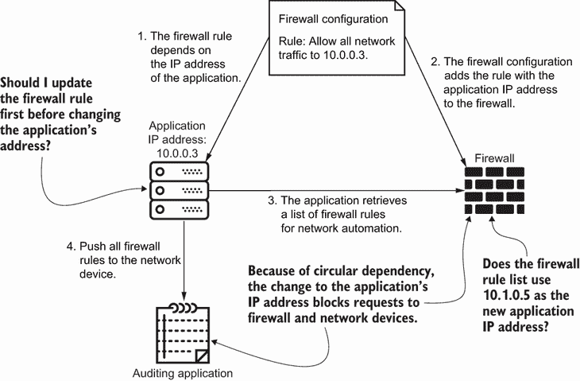

图 4.2 报告应用程序和防火墙相互之间存在循环依赖。变更阻止了对应用程序的连接。

此示例遇到了循环依赖，这引入了一个“先有鸡还是先有蛋”的问题。您不能更改一个资源而不影响另一个资源。如果您首先更改报告应用程序的地址，防火墙规则必须更改。然而，报告应用程序失败，因为它无法连接。您可能已经阻止了它的请求！

循环依赖在变更过程中会导致意外的行为，这最终会影响可组合性和可扩展性。您不知道应该先更新哪个资源。相比之下，您可以确定低级模块的变更可能会如何影响高级模块。单向依赖关系使变更更加可预测。毕竟，成功的基础设施变更取决于两个因素：可预测性和隔离性。

## 4.2 依赖注入

单向依赖有助于您设计方法以最小化低级模块变更对高级模块的影响。例如，网络变更不应干扰高级资源，如队列、应用程序或数据库。本节将软件开发中的依赖注入概念应用于基础设施，并进一步解耦单向依赖。依赖注入涉及两个原则：控制反转和依赖反转。

### 4.2.1 控制反转

当您在基础设施依赖中强制执行单向关系时，您的高级资源会获取有关低级资源的信息。然后它可以运行其变更。例如，服务器在声明 IP 地址之前会获取有关网络 ID 和 IP 地址范围的详细信息（图 4.3）。

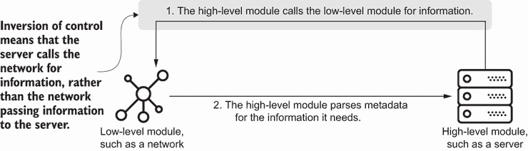

图 4.3 在控制反转中，高级资源或模块调用低级模块以获取信息，并解析其元数据以查找任何依赖项。

服务器调用网络，自然应用了称为*控制反转*的软件开发原则。在更新之前，高级资源会调用低级资源以获取信息。

定义 *控制反转*是高级资源调用低级资源以获取属性或引用的原则。

作为非技术示例，当你通过电话预约医生而不是由医生办公室自动预约时，你使用控制反转。

让我们应用控制反转来实现服务器对网络的依赖。你通过使用网络模块创建网络。在下面的列表中，网络模块输出一个网络名称并将其保存到名为 terraform.tfstate 的文件中。高级资源，如服务器，可以从此 JSON 文件中解析网络名称。

列表 4.1 网络模块在 JSON 文件中的输出

```
{
 "outputs": {                           ❶
   "name": {                            ❷
     "value": "hello-world-subnet",     ❷
     "type": "string"                   ❷
   }
 }                                      ❸
}
```

❶ 使用 Terraform 创建网络生成一个包含输出列表的 JSON 文件。Terraform 使用此文件来跟踪它创建的资源。

❷ 网络模块以字符串形式输出子网名称。

❸ 为了清晰起见，省略了 JSON 文件的其余部分。

使用控制反转，服务器在列表 4.2 中调用网络的 terraform.tfstate 文件并读取子网名称。由于模块在 JSON 文件中表达输出，你的服务器模块需要解析子网名称的值（`hello-world-subnet`）。

列表 4.2 应用控制反转在网络中创建服务器

```
import json

class NetworkModuleOutput:                                             ❶
   def __init__(self):
       with open('network/terraform.tfstate', 'r') as network_state:
           network_attributes = json.load(network_state)
       self.name = network_attributes['outputs']['name']['value']      ❷

class ServerFactoryModule:                                             ❸
   def __init__(self, name, zone='us-central1-a'):                     ❹
       self._name = name
       self._network = NetworkModuleOutput()                           ❺
       self._zone = zone
       self.resources = self._build()                                  ❻

   def _build(self):                                                   ❻
       return {
           'resource': [{
               'google_compute_instance': [{                           ❹
                   self._name: [{
                       'allow_stopping_for_update': True,
                       'boot_disk': [{
                           'initialize_params': [{
                               'image': 'ubuntu-1804-lts'
                           }]
                       }],
                       'machine_type': 'f1-micro',
                       'name': self._name,                             ❹
                       'zone': self._zone,                             ❹
                       'network_interface': [{
                           'subnetwork': self._network.name            ❼
                       }]
                   }]
               }]
           }]
       }

if __name__ == "__main__":                                             ❽
   server = ServerFactoryModule(name='hello-world')                    ❽
   with open('main.tf.json', 'w') as outfile:                          ❽
       json.dump(server.resources, outfile, sort_keys=True, indent=4)    
```

❶ 创建一个对象来捕获网络模块输出的模式。这使得服务器更容易检索子网名称。

❷ 解析网络输出对象的子网名称值。

❸ 创建一个服务器模块，它使用工厂模式

❹ 使用具有名称和区域的 Terraform 资源创建 Google 计算实例

❺ 服务器模块调用包含从网络模块的 JSON 文件中解析出的子网名称的网络输出对象。

❻ 使用模块根据子网名称创建服务器的 JSON 配置

❽ 服务器模块引用网络输出的名称并将其传递给“子网”字段。

❽ 将 Python 字典写入 JSON 文件，以便 Terraform 稍后执行

AWS 和 Azure 的等效方案

在 AWS 中，你会使用带有网络引用的`aws_instance` Terraform 资源（[`mng.bz/PnPR`](http://mng.bz/PnPR)）。在 Azure 中，使用网络上的`azurerm_linux_virtual_machine` Terraform 资源（[`mng.bz/J2DZ`](http://mng.bz/J2DZ)）。

实现控制反转可以消除服务器模块中对子网的直接引用。你也可以控制并限制网络为高级资源返回的信息。更重要的是，你提高了我的可组合性，因为你可以使用网络模块提供的子网名称创建其他服务器和高级资源。

如果其他高级资源需要其他低级属性怎么办？例如，你可能创建一个需要子网 IP 地址范围的队列。为了解决这个问题，你将网络模块进化为输出子网 IP 地址范围。队列可以引用它需要的地址的输出。

控制反转通过高级资源需要不同的属性来提高可进化性。你可以不重写高级资源的基础设施代码来进化低级资源。然而，你需要一种方法来保护高级资源免受低级资源任何属性更新或重命名的影响。

### 4.2.2 依赖倒置

虽然控制反转使得高级模块能够进化，但它并不能保护它们免受低级模块变更的影响。让我们想象一下，你将网络名称更改为其 ID。下次你部署服务器模块的变更时，它就崩溃了！服务器模块无法识别网络 ID。

为了保护你的服务器模块免受网络输出的变更影响，你在网络输出和服务器之间添加了一层抽象。在图 4.4 中，服务器通过 API 或存储的配置访问网络的属性，而不是网络输出。所有这些接口都作为抽象来检索网络元数据。

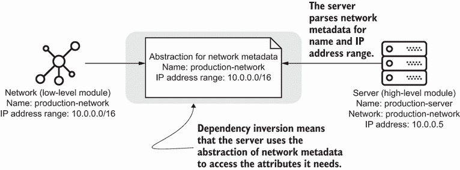

图 4.4 依赖倒置将低级资源元数据的抽象返回给依赖它的资源。

你可以使用依赖倒置来隔离对低级模块的变更，并减轻对其依赖的破坏。*依赖倒置*原则规定，高级和低级资源应通过抽象表达依赖关系。

定义*依赖倒置*是通过抽象表达高级和低级模块或资源之间依赖关系的原则。

抽象层充当一个翻译者，用于传达所需的属性。它作为低级模块对高级模块变更的缓冲。一般来说，你可以从三种类型的抽象中进行选择：

+   资源属性插值（模块内）

+   模块输出（模块之间）

+   基础设施状态（模块之间）

一些抽象，如属性插值或模块输出，取决于你的工具。通过基础设施状态进行的抽象将取决于你的工具或基础设施 API。图 4.5 显示了通过属性插值、模块输出或基础设施状态来传递网络元数据到服务器的抽象。

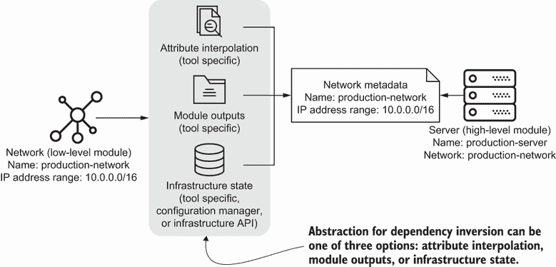

图 4.5 根据工具和依赖关系，依赖倒置的抽象可以使用属性插值、模块输出或基础设施状态。

让我们通过构建列表 4.3 中的网络和服务器模块来检查如何通过实现三种类型的抽象。我将从属性插值开始。属性插值处理模块或配置内资源或任务之间的属性传递。使用 Python，子网通过访问分配给网络对象的`name`属性来插值网络名称。

列表 4.3 使用属性插值获取网络名称

```
import json

class Network:                                                    ❶
   def __init__(self, name="hello-network"):                      ❶
       self.name = name
       self.resource = self._build()                              ❷

   def _build(self):                                              ❷
       return {
           'google_compute_network': [                            ❶
               {
                   f'{self.name}': [
                       {
                           'name': self.name                      ❶
                       }
                   ]
               }
           ]
       }

class Subnet:                                                     ❸
   def __init__(self, network, region='us-central1'):             ❹
       self.network = network                                     ❹
       self.name = region                                         ❸
       self.subnet_cidr = '10.0.0.0/28'
       self.region = region
       self.resource = self._build()

   def _build(self):
       return {
           'google_compute_subnetwork': [                         ❸
               {
                   f'{self.name}': [
                       {
                           'name': self.name,                     ❸
                           'ip_cidr_range': self.subnet_cidr,
                           'region': self.region,
                           'network': self.network.name           ❺
                       }
                   ]
               }
           ]
       }

if __name__ == "__main__":
   network = Network()                                            ❻
   subnet = Subnet(network)                                       ❼

   resources = {                                                  ❽
       "resource": [                                              ❽
           network.resource,                                      ❻
           subnet.resource                                        ❼
       ]                                                          ❽
   }                                                              ❽

   with open(f'main.tf.json', 'w') as outfile:                    ❾
       json.dump(resources, outfile, sort_keys=True, indent=4)    ❾
```

❶ 使用名为“hello-network”的 Terraform 资源创建 Google 网络

❷ 使用模块创建网络的 JSON 配置

❸ 使用名为 us-central1 的区域名称的 Terraform 资源创建 Google 子网

❹ 将整个网络对象传递给子网。子网调用网络对象以获取它需要的属性。

❺ 通过从对象中检索来插值网络名称

❻ 使用模块创建网络的 JSON 配置

❼ 使用模块创建子网和网络 JSON 配置，并将网络对象传递给子网

❽ 将网络和子网 JSON 对象合并为 Terraform 兼容的 JSON 结构

❾ 将 Python 字典写入 JSON 文件，供 Terraform 后续执行

领域特定语言

使用 DSL 的 IaC 工具提供自己的变量插值格式。在 Terraform 中的示例将使用 `google_compute_network.hello-world-network .name` 动态传递网络名称到子网。CloudFormation 允许您使用 `Ref` 引用参数。在 Bicep 中，您可以引用资源的 `properties`。

在配置中的模块或资源之间可以进行属性插值。然而，插值仅适用于特定工具，并不一定适用于所有工具。当在组合中有更多资源和模块时，您不能使用插值。

属性插值的另一种替代方法是使用显式的模块输出在模块之间传递资源属性。您可以自定义输出以符合任何所需的模式或参数。例如，您可以将子网和网络组合到一个模块中，并导出其属性以供服务器使用。让我们重构子网和网络，并添加服务器，如下所示。

列表 4.4 将子网名称设置为模块的输出

```
import json

                                                                   ❶
class NetworkModule:                                               ❷
   def __init__(self, region='us-central1'):
       self._region = region
       self._network = Network()                                   ❷
       self._subnet = Subnet(self._network)                        ❷
       self.resource = self._build()                               ❸

   def _build(self):                                               ❸
       return [                                                    ❸
           self._network.resource,                                 ❸
           self._subnet.resource                                   ❸
       ]                                                           ❸

   class Output:                                                   ❹
       def __init__(self, subnet_name):                            ❹
           self.subnet_name = subnet_name                          ❹

   def output(self):                                               ❺
       return self.Output(self._subnet.name)                       ❺

class ServerModule:                                                ❻
   def __init__(self, name, network,                               ❼
                zone='us-central1-a'):
       self._name = name
       self._subnet_name = network.subnet_name                     ❽
       self._zone = zone
       self.resource = self._build()                               ❾

   def _build(self):                                               ❾
       return [{
           'google_compute_instance': [{
               self._name: [{
                   'allow_stopping_for_update': True,
                   'boot_disk': [{
                       'initialize_params': [{
                           'image': 'ubuntu-1804-lts'
                       }]
                   }],
                   'machine_type': 'e2-micro',
                   'name': self._name,
                   'zone': self._zone,
                   'network_interface': [{
                       'subnetwork': self._subnet_name
                   }]
               }]
           }]
       }]

if __name__ == "__main__":
   network = NetworkModule()                                       ❿
   server = ServerModule("hello-world",                            ❻
                         network.output())                         ❼
   resources = {                                                   ⓫
       "resource": network.resource + server.resource              ⓫
   }                                                               ⓫

   with open(f'main.tf.json', 'w') as outfile:                     ⓬
       json.dump(resources, outfile, sort_keys=True, indent=4)     ⓬
```

❶ 为了清晰起见省略了网络和子网对象

❷ 将网络和子网创建重构为一个模块。这遵循了组合模式。该模块使用 Terraform 资源创建 Google 网络和子网。

❸ 使用模块创建网络和子网的 JSON 配置

❹ 为网络模块输出创建一个嵌套类。该嵌套类导出子网名称，以便高级属性可以使用。

❺ 为网络模块创建一个输出函数，以检索和导出所有网络输出

❻ 此模块使用 Terraform 资源创建 Google 计算实例（服务器）。

❼ 将网络输出作为输入变量传递给服务器模块。服务器将选择它需要的属性。

❽ 使用网络输出对象，获取子网名称并将其设置为服务器的子网名称属性

❾ 使用模块创建服务器的 JSON 配置

❿ 将网络和子网创建重构为一个模块。这遵循了组合模式。该模块使用 Terraform 资源创建 Google 网络和子网。

⓫ 将网络和服务器 JSON 对象合并为 Terraform 兼容的 JSON 结构

⓬ 将 Python 字典写入 JSON 文件，供 Terraform 后续执行

专用领域语言

对于像 CloudFormation、Bicep 或 Terraform 这样的配置工具，您为模块或堆栈生成输出，以便高级工具可以消费。例如，Ansible 这样的配置管理工具通过标准输出在自动化任务之间传递变量。

模块输出有助于暴露高级资源的特定参数。这种方法复制并重复值。然而，模块输出可能会变得复杂！您通常会忘记您暴露了哪些输出以及它们的名称。第六章中的合同测试可能有助于您强制执行所需的模块输出。

而不是使用输出，您可以使用基础设施状态作为状态文件或基础设施提供者的 API 元数据。许多工具保留基础设施状态的一个副本，我称之为 *工具状态*，以检测实际资源状态与配置之间的偏差，并跟踪它管理的资源。

定义 *工具状态* 是 IaC 工具存储的基础设施状态表示。它跟踪工具管理的资源配置。

工具通常将它们的状态存储在文件中。您已经在列表 4.2 中遇到了使用工具状态的例子。您从名为 terraform.tfstate 的文件中解析了网络名称，这是 Terraform 的工具状态。然而，并非所有工具都提供状态文件。因此，您可能难以在工具之间解析低级资源属性。

如果您的系统中有多达多个工具和提供者，您有两个主要选项。首先，考虑使用配置管理器作为标准接口来传递元数据。*配置管理器*，如键值存储，管理一组字段及其值。

配置管理器帮助您为工具状态创建自己的抽象层。例如，一些网络自动化脚本可能读取存储在键值存储中的 IP 地址值。但是，您必须维护配置管理器，并确保您的 IaC 可以访问它。

作为第二个选项，考虑使用基础设施提供者的 API。基础设施 API 不常更改；它们提供详细的信息，并考虑到状态文件可能不包括的带外更改。您可以使用客户端库从基础设施 API 中访问信息。

专用领域语言

许多配置工具提供了一种能力，可以向基础设施 API 发起 API 调用。例如，AWS 特定的参数类型和 CloudFormation 中的 `Fn::ImportValue` 从 AWS API 或其他堆栈检索值。Bicep 提供了一个名为 `existing` 的关键字，用于导入当前文件之外的资源属性。

Terraform 提供数据源，可以从 API 中读取基础设施资源的元数据。同样，模块可以引用 Ansible 事实，这些事实收集有关资源或您环境的元数据。

使用基础设施 API 时，您会遇到一些缺点。不幸的是，您的 IaC 需要网络访问。您只有在运行 IaC 之后才知道属性的*值*，因为代码必须向 API 发出请求。如果基础设施 API 出现故障，您的 IaC 可能无法解析低级资源的属性。

当您使用依赖反转添加抽象时，您会保护高级资源免受低级资源属性更改的影响。虽然您不能防止所有故障或中断，但您可以通过更新低级资源最小化潜在故障的破坏范围。将其视为一项合同：如果高级和低级资源就它们需要的属性达成一致，它们可以独立于彼此发展。

### 4.2.3 应用依赖注入

当您结合控制反转和依赖反转时会发生什么？图 4.6 显示了如何结合这两个原则来解耦服务器和网络示例。服务器调用网络以获取属性，并使用基础设施 API 或状态解析元数据。如果您更改网络名称，它将更新元数据。服务器检索更新后的元数据并单独调整其配置。

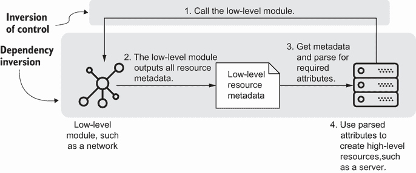

图 4.6 依赖注入结合了控制反转和控制依赖反转，以放宽基础设施依赖并隔离低级和高级资源。

利用这两个原则的力量有助于促进演化和可组合性，因为抽象层充当系统每个构建块之间的缓冲区。您使用 *依赖注入* 来结合控制反转和依赖反转。控制反转隔离了高级模块或资源的更改，而依赖反转隔离了低级资源的更改。

定义 *依赖注入* 结合了控制反转和控制依赖反转的原则。高级模块或资源通过抽象从低级资源请求属性。

让我们使用 Apache Libcloud 库为服务器和网络示例实现依赖注入，Apache Libcloud 是一个用于 GCP API 的库，如列表 4.5 所示。您使用 Libcloud 来搜索网络。服务器调用 GCP API 获取子网名称，解析 GCP API 元数据，并将网络范围内的第五个 IP 地址分配给自己。

列表 4.5 使用依赖注入在网络上创建服务器

```
import credentials
import ipaddress
import json
from libcloud.compute.types import Provider                              ❶
from libcloud.compute.providers import get_driver                        ❶

def get_network(name):                                                   ❷
   ComputeEngine = get_driver(Provider.GCE)                              ❸
   driver = ComputeEngine(                                               ❹
       credentials.GOOGLE_SERVICE_ACCOUNT,                               ❹
       credentials.GOOGLE_SERVICE_ACCOUNT_FILE,                          ❹
       project=credentials.GOOGLE_PROJECT,                               ❹
       datacenter=credentials.GOOGLE_REGION)                             ❹
   return driver.ex_get_subnetwork(                                      ❺
       name, credentials.GOOGLE_REGION)                                  ❺

class ServerFactoryModule:                                               ❻
   def __init__(self, name, network, zone='us-central1-a'):
       self._name = name
       gcp_network_object = get_network(network)                         ❷
       self._network = gcp_network_object.name                           ❼
       self._network_ip = self._allocate_fifth_ip_address_in_range(      ❽
           gcp_network_object.cidr)                                      ❽
       self._zone = zone
       self.resources = self._build() 

   def _allocate_fifth_ip_address_in_range(self, ip_range):              ❽
       ip = ipaddress.IPv4Network(ip_range)                              ❽
       return format(ip[-2])                                             ❽

   def _build(self):                                                     ❾
       return {
           'resource': [{
               'google_compute_instance': [{                             ❻
                   self._name: [{
                       'allow_stopping_for_update': True,
                       'boot_disk': [{
                           'initialize_params': [{
                               'image': 'ubuntu-1804-lts'
                           }]
                       }],
                       'machine_type': 'f1-micro',
                       'name': self._name,
                       'zone': self._zone,
                       'network_interface': [{
                           'subnetwork': self._network,                 ❿
                           'network_ip': self._network_ip               ⓫
                       }]
                   }]
               }]
           }]
       }

if __name__ == "__main__":
   server = ServerFactoryModule(name='hello-world', network='default')  ⓬
   with open('main.tf.json', 'w') as outfile:                           ⓭
       json.dump(server.resources, outfile, sort_keys=True, indent=4)   ⓭
```

❶ 导入 Libcloud 库，该库允许您访问 GCP API。您必须导入提供者对象和 Google 驱动程序。

❷ 此函数使用 Libcloud 库检索网络信息。网络和子网是分别创建的。为了清晰起见，它们的代码已被省略。

❸ 导入 Libcloud 的 Google Compute Engine 驱动程序

❹ 将您希望 Libcloud 用于访问 GCP API 的 GCP 服务帐户凭据传递过去

❺ 使用 Libcloud 驱动程序通过名称获取子网信息

❻ 此模块使用 Terraform 资源创建 Google 计算实例（服务器）

❼ 从 Libcloud 返回的 GCP 网络对象中解析子网名称，并使用它来创建服务器

❽ 从 Libcloud 返回的 GCP 网络对象中解析 CIDR 块，并使用它来计算网络上的第五个 IP 地址。服务器使用此结果作为其网络 IP 地址。

❾ 使用该模块创建服务器的 JSON 配置

❿ 从 Libcloud 返回的 GCP 网络对象中解析子网名称，并使用它来创建服务器

⓫ 从 Libcloud 返回的 GCP 网络对象中解析 CIDR 块，并使用它来计算网络上的第五个 IP 地址。服务器使用此结果作为其网络 IP 地址。

⓬ 此模块使用 Terraform 资源创建 Google 计算实例（服务器）。

⓭ 将 Python 字典写入 JSON 文件，供 Terraform 稍后执行

AWS 和 Azure 等效

要转换列表 4.5，你需要更新 IaC 以创建 Amazon Elastic Compute Cloud (EC2)实例或 Azure Linux 虚拟机。你需要更新 Libcloud 驱动程序以使用 Amazon EC2 Driver ([`mng.bz/wo95`](http://mng.bz/wo95))或 Azure ARM Compute Driver ([`mng.bz/qY9x`](http://mng.bz/qY9x))。

使用基础设施 API 作为抽象层，你可以独立于服务器进化网络。例如，当你更改网络的 IP 地址范围时会发生什么？在运行服务器的 IaC 之前，你将更新部署到网络的更新。服务器调用基础设施 API 以获取网络属性，并识别新的 IP 地址范围。然后它重新计算第五个 IP 地址。

图 4.7 显示了由于依赖注入而导致的服务器对变化的响应。当你更改网络的 IP 地址范围时，你的服务器会获取更新的地址范围，并在需要时重新分配 IP 地址。

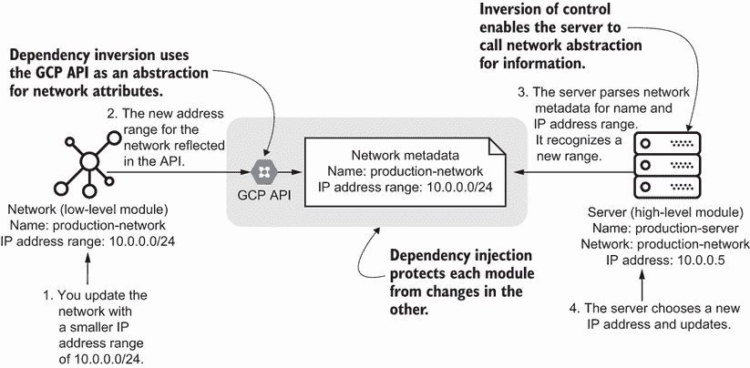

图 4.7 依赖注入允许我更改低级模块（网络）并自动将更改传播到高级模块（服务器）。

多亏了依赖反转，你可以独立于依赖关系进化低级资源。控制反转有助于高级资源响应低级资源的变化。将两者结合为依赖注入确保了系统的可组合性，因为你可以向低级资源添加更多高级资源。由于依赖注入导致的解耦有助于你最小化系统模块中失败更改的爆炸半径。

通常，你应该将依赖注入作为基础设施依赖管理的基本原则。如果你在编写基础设施配置时应用依赖注入，你就可以充分解耦依赖关系，以便你可以独立地更改它们而不会影响其他基础设施。随着你的模块增长，你可以继续重构以使用更具体的模式，并进一步根据资源类型和模块类型解耦基础设施。

## 4.3 外观模式

应用依赖注入原则生成表达依赖关系的类似模式。这些模式与软件开发中的结构设计模式相一致。在追求解耦依赖的过程中，我经常在我的基础设施即代码（IaC）中重复使用相同的三个模式。

想象一下，你想要创建一个存储桶来存储静态文件。你可以使用 GCP 中的访问控制 API 来控制谁可以访问文件。图 4.8 创建了桶并设置输出以包括桶的名称。桶的访问控制规则可以使用输出获取桶的名称。

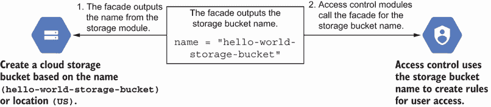

图 4.8 外观模式简化了属性，将其作为存储桶的名称供访问控制模块使用。

使用输出和抽象层的模式看起来 *非常熟悉*。实际上，你在章节的前半部分就遇到了它。你一直在不知不觉中使用外观模式在模块之间传递多个属性！

*外观模式* 使用模块输出作为依赖注入的抽象。它像一个镜子，将属性反射到其他模块和资源。

定义 *外观模式* 从模块的资源中输出属性以进行依赖注入。

外观模式只反映属性，没有更多。该模式解耦了高层和底层资源之间的依赖关系，并符合依赖注入的原则。高层资源仍然调用底层资源以获取信息，而输出充当抽象。

以下代码示例通过构建一个输出方法实现了外观模式。你的桶模块在其输出方法中返回桶对象和名称。你的访问模块使用输出方法来检索桶对象并访问其名称。

列表 4.6 将桶名称作为外观用于访问控制规则

```
import json
import re

class StorageBucketFacade:                                  ❶
   def __init__(self, name):                                ❶
       self.name = name                                     ❶

class StorageBucketModule:                                  ❷
   def __init__(self, name, location='US'):                 ❸
       self.name = f'{name}-storage-bucket'
       self.location = location
       self.resources = self._build()

   def _build(self):
       return {
           'resource': [
               {
                   'google_storage_bucket': [{              ❸
                       self.name: [{
                           'name': self.name,
                           'location': self.location,
                           'force_destroy': True            ❹
                       }]
                   }]
               }
           ]
       }

   def outputs(self):                                       ❺
       return StorageBucketFacade(self.name)   

class StorageBucketAccessModule:                            ❻
   def __init__(self, bucket, user, role):                  ❼
       if not self._validate_user(user):                    ❽
           print("Please enter valid user or group ID")
           exit()
       if not self._validate_role(role):                    ❾
           print("Please enter valid role")
           exit()
       self.bucket = bucket                                 ❼
       self.user = user
       self.role = role
       self.resources = self._build()

   def _validate_role(self, role):                          ❾
       valid_roles = ['READER', 'OWNER', 'WRITER']
       if role in valid_roles:
           return True
       return False

   def _validate_user(self, user):                          ❽
       valid_users_group = ['allUsers', 'allAuthenticatedUsers']
       if user in valid_users_group:
           return True
       regex = r'^[a-z0-9]+[\._]?[a-z0-9]+[@]\w+[.]\w{2,3}$'
       if(re.search(regex, user)):
           return True
       return False

   def _change_case(self):
       return re.sub('[⁰-9a-zA-Z]+', '_', self.user)

   def _build(self):
       return {
           'resource': [{
               'google_storage_bucket_access_control': [{
                   self._change_case(): [{
                       'bucket': self.bucket.name,          ❿
                       'role': self.role,
                       'entity': self.user
                   }]
               }]
           }]
       }

if __name__ == "__main__":
   bucket = StorageBucketModule('hello-world')
   with open('bucket.tf.json', 'w') as outfile:
       json.dump(bucket.resources, outfile, sort_keys=True, indent=4)

   server = StorageBucketAccessModule(
       bucket.outputs(), 'allAuthenticatedUsers', 'READER')
   with open('bucket_access.tf.json', 'w') as outfile:
       json.dump(server.resources, outfile, sort_keys=True, indent=4)
```

❶ 使用外观模式，将桶名称作为存储输出对象的一部分输出。这实现了依赖反转，以抽象掉不必要的桶属性。

❷ 为 GCP 存储桶创建一个低级模块，该模块使用工厂模式生成一个桶

❸ 使用基于名称和位置的 Terraform 资源创建 Google 存储桶

❹ 在 Google 存储桶上设置一个属性，当删除 Terraform 资源时销毁它

❺ 为模块创建一个输出方法，返回存储桶的属性列表

❻ 创建一个高级模块，向存储桶添加访问控制规则

❼ 将桶的输出外观传递给高级模块

❽ 验证传递给模块的用户是否与所有用户或所有认证用户的有效用户组类型匹配

❾ 验证传递给模块的角色是否与 GCP 中的有效角色匹配

❿ 使用 Terraform 资源创建 Google 存储桶访问控制规则

AWS 和 Azure 的等效产品

Google 云平台（GCP）存储桶类似于 Amazon Simple Storage Service（S3）桶或 Azure Blob Storage。

为什么输出整个桶对象而不是只输出名称？记住，你想要构建一个抽象层，以符合依赖反转原则。如果你创建了一个依赖于桶位置的模块，你可以更新桶对象的外观以输出名称和位置。更新不会影响访问模块。

你可以以低努力成本实现外观，同时仍然从依赖解耦中获得好处。这样的好处之一包括在一个模块中执行隔离、自包含更新而不会影响其他模块的灵活性。添加新的高级依赖关系不需要太多努力。

外观模式还使得调试问题更加容易。它镜像输出而不添加解析逻辑，这使得追踪问题到源头并修复系统变得简单。你将在第十一章中了解更多关于回滚失败更改的内容。

领域特定语言

使用领域特定语言（DSL），你可以通过使用具有自定义名称的输出变量来模拟外观。高级资源引用自定义输出名称。

作为一般做法，你应该从一个或两个字段开始创建外观。始终将其保持为所需的最小字段数，用于高级资源。每几周审查并修剪不需要的字段。

外观模式适用于更简单的依赖关系，例如几个高级模块到一个低级模块。然而，当你添加许多高级模块并且依赖关系的深度增加时，你将难以维护低级模块的外观模式。当你需要更改输出中的字段名称时，你必须更改引用它的每个模块。当你有数百个资源依赖于一个低级模块时，更改每个模块引用的缩放性不好。

## 4.4 适配器

外观将一个基础设施模块的值作为输出镜像到上一节的高级模块。这对于简单的依赖关系工作良好，但在更复杂的模块中会崩溃。更复杂的模块通常涉及一对一或多对一的依赖关系，或者跨越多个基础设施提供者。

假设你有一个身份模块，它传递一个用户和角色的列表来配置基础设施。该身份模块需要在多个平台上工作。在图 4.9 中，你设置模块以输出一个 JSON 格式的对象，将权限如 `read`、`write` 或 `admin` 与相应的用户名相对应。团队必须将这些用户名及其通用权限映射到 GCP 特定的术语。GCP 的访问管理使用 `viewer`、`editor` 和 `owner`，它们分别转换为 `read`、`write` 和 `admin`。

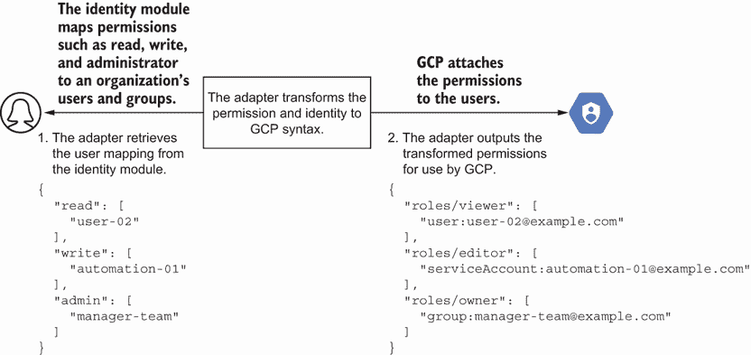

图 4.9 适配器模式将属性转换为高级模块可以消费的不同接口。

如何将一组通用角色映射到特定基础设施提供商的角色？映射需要确保你可以在多个基础设施提供商上复制和扩展模块。你希望在将来扩展模块，以添加跨平台的等效角色中的用户。

作为解决方案，*适配器模式* 将低级资源的元数据转换，以便任何高级资源都可以使用它。适配器的作用就像旅行插头。你可以根据国家的插座更换插头，仍然可以使用你的电子设备。

定义 *适配器模式* 将低级资源或模块的元数据转换并输出，以便任何高级资源或模块都可以使用它。

首先，你创建一个字典，将通用角色名称映射到用户。在列表 4.7 中，你想要将只读角色分配给审计团队和两个用户。这些通用角色和用户名与 GCP 的权限和角色不匹配。

列表 4.7 创建将通用角色映射到用户名的静态对象

```
class Infrastructure:
   def __init__(self):
       self.resources = {
           'read': [                     ❶
               'audit-team',             ❶
               'user-01',                ❶
               'user-02'                 ❶
           ],
           'write': [                    ❷
               'infrastructure-team',    ❷
               'user-03',                ❷
               'automation-01'           ❷
           ],
           'admin': [                    ❸
               'manager-team'            ❸
           ]                             ❸
       }
```

❶ 将 audit-team、user-01 和 user-02 分配到只读角色。映射描述了用户只能读取任何基础设施提供商上的信息。

❷ 将 infrastructure-team、user-02 和 automation-01 分配到写角色。映射描述了用户可以更新任何基础设施提供商上的信息。

❸ 将 manager team 分配到管理员角色。映射描述了用户可以管理任何基础设施提供商。

AWS 和 Azure 的等效项

对于那些更熟悉 AWS 的人来说，每个权限集的等效策略将是 `admin` 的 `AdministratorAccess`，`write` 的 `PowerUserAccess`，以及 `read` 的 `ViewOnlyAccess`。Azure 基于角色的访问控制使用 `Owner` 代表 `admin`，`Contributor` 代表 `write`，`Reader` 代表 `read`。

然而，你无法在角色映射中的静态对象上做任何事情。GCP 不理解用户名或角色！实现适配器模式以将通用权限映射到特定于基础设施的权限。

下面的列表构建了一个针对 GCP 特定的身份适配器，它将通用权限如 `read` 映射到 GCP 特定的术语如 `roles/viewer`。GCP 可以使用此映射将用户、服务帐户和组添加到正确的角色中。

列表 4.8 使用适配器模式转换通用权限

```
import json
import access

class GCPIdentityAdapter:                                                  ❶
   EMAIL_DOMAIN = 'example.com'                                            ❷

   def __init__(self, metadata):
       gcp_roles = {                                                       ❸
           'read': 'roles/viewer',                                         ❸
           'write': 'roles/editor',                                        ❸
           'admin': 'roles/owner'                                          ❸
       }  
       self.gcp_users = []
       for permission, users in metadata.items():                          ❹
           for user in users:                                              ❹
               self.gcp_users.append(                                      ❹
                   (user, self._get_gcp_identity(user),                    ❺
                       gcp_roles.get(permission)))                         ❹

   def _get_gcp_identity(self, user):                                      ❺
       if 'team' in user:                                                  ❻
           return f'group:{user}@{self.EMAIL_DOMAIN}'                      ❻
       elif 'automation' in user:                                          ❼
           return f'serviceAccount:{user}@{self.EMAIL_DOMAIN}'             ❼
       else:                                                               ❽
           return f'user:{user}@{self.EMAIL_DOMAIN}'                       ❽

   def outputs(self):                                                      ❾
       return self.gcp_users                                               ❾

class GCPProjectUsers:                                                     ❿
   def __init__(self, project, users):
       self._project = project
       self._users = users
       self.resources = self._build()                                      ⓫

   def _build(self):                                                       ⓫
       resources = []
       for (user, member, role) in self._users:                            ⓬
           resources.append({
               'google_project_iam_member': [{                             ⓭
                   user: [{                                                ⓭
                       'role': role,                                       ⓭
                       'member': member,                                   ⓭
                       'project': self._project                            ⓭
                   }]                                                      ⓭
               }]                                                          ⓭
           })
       return {
           'resource': resources
       }

if __name__ == "__main__":
   users = GCPIdentityAdapter(access.Infrastructure().resources).outputs() ⓮

   with open('main.tf.json', 'w') as outfile:                              ⓯
       json.dump(                                                          ⓯
           GCPProjectUsers(                                                ⓯
               'infrastructure-as-code-book',                              ⓯
               users).resources, outfile, sort_keys=True, indent=4)        ⓯
```

❶ 创建一个适配器，将通用角色类型映射到 Google 角色类型

❷ 将电子邮件域名设置为常量，您将将其附加到每个用户

❸ 创建一个字典，将通用角色映射到 GCP 特定权限和角色

❹ 对于每个权限和用户，构建一个包含用户、GCP 身份和角色的元组

❺ 将用户名转换为 GCP 特定的成员术语，该术语使用用户类型和电子邮件地址

❻ 如果用户名包含“团队”，则 GCP 身份需要以“group”为前缀，以电子邮件域为后缀。

❼ 如果用户名包含“自动化”，则 GCP 身份需要以“serviceAccount”为前缀，以电子邮件域为后缀。

❽ 对于所有其他用户，GCP 身份需要以“user”为前缀，以电子邮件域为后缀。

❾ 输出包含用户、GCP 身份和角色的元组列表

❿ 创建一个 GCP 项目用户模块，该模块使用工厂模式将用户附加到给定项目的 GCP 角色中

⓫ 使用该模块创建项目的用户和角色的 JSON 配置

⓬ 创建一个字典，将通用角色映射到 GCP 特定权限和角色

⓭ 使用 Terraform 资源创建一个 Google 项目 IAM 成员列表。该列表检索 GCP 身份、角色和项目，以便将用户名附加到 GCP 中的读取、写入或管理员权限。

⓮ 创建一个适配器，将通用角色类型映射到 Google 角色类型

⓯ 将 Python 字典写入 JSON 文件，以便 Terraform 后续执行

AWS 和 Azure 等效

要将代码列表转换为 AWS，您需要将 GCP 项目的引用映射到 AWS 账户。GCP 项目用户与 AWS IAM 用户及其附加的角色相对应。同样，您会在 Azure 订阅中创建一个用户账户，并在 Azure Active Directory 中添加其 API 权限。

您可以将您的身份适配器扩展到将通用访问要求字典映射到另一个基础设施提供者，如 AWS 或 Azure。一般来说，适配器将特定提供者或原型模块特定的语言转换为通用术语。此模式最适合具有不同基础设施提供者或依赖项的模块。我还使用适配器模式为资源参数定义不佳的基础设施提供者创建一个一致的接口。

对于一个更复杂的示例，想象配置两个云之间的虚拟专用网络（VPN）连接。而不是通过外观传递每个提供者的网络信息，您使用适配器，如图 4.10 所示。每个提供者的网络模块输出一个具有更通用字段（如 `name` 和 `IP` `address`）的网络对象。此用例受益于适配器，因为它协调了两种不同语言的语义（例如，GCP 云 VPN 网关和 AWS 客户端网关）。

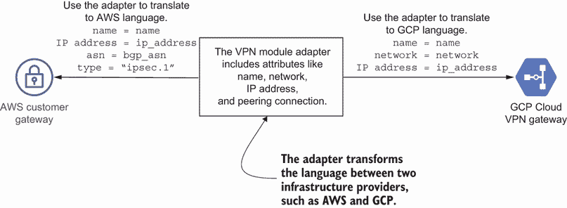

图 4.10 一个适配器在两个云服务提供商之间转换语言和属性。

Azure 等效

Azure VPN 网关实现了与 AWS 客户网关和 GCP 云 VPN 网关类似的功能。

为什么使用适配器来提高可组合性和可扩展性？该模式严重依赖于依赖反转来抽象资源之间任何属性转换。适配器充当模块间的契约。只要两个模块都同意适配器概述的契约，你就可以在一定程度上独立地更改高级和低级模块。

专用领域语言

专用领域语言（DSL）将提供者或资源特定的语言或资源进行转换。DSL 在它们的框架内实现适配器，以表示基础设施状态。基础设施状态通常包括与基础设施 API 相同的资源元数据。一些工具将允许你与状态文件接口，并将模式视为高级模块的适配器。

然而，适配器模式仅在您*维护模块间的契约*时才有效。回想一下，你构建了一个适配器来将权限和用户名转换为 GCP。如果你的队友不小心将只读角色的映射更新为`roles/reader`，而这个角色不存在，会发生什么？图 4.11 展示了如果你不使用针对 GCP 的特定角色，你的基础设施即代码（IaC）将失败。

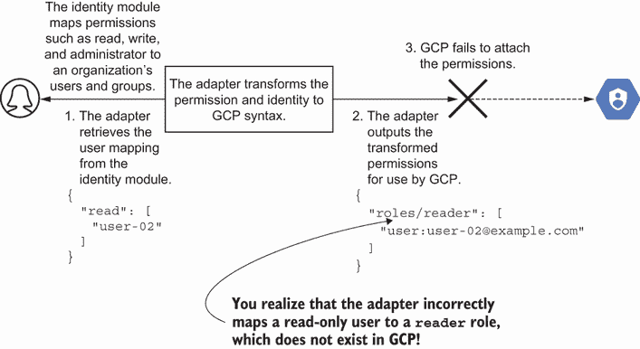

图 4.11 你需要调试和测试适配器以正确映射字段。

在这个例子中，你破坏了通用角色和 GCP 角色之间的契约！破坏的契约导致你的 IaC 失败。确保你维护并更新适配器中的正确映射，以最大限度地减少失败。

此外，使用适配器后，调试变得更加困难。该模式模糊了依赖于特定适配器属性的资源。你需要调查错误是否由源模块输出的错误字段、适配器中的错误属性或依赖模块消费的错误字段引起的。第五章和第六章分别介绍了模块版本控制和测试，可以缓解适配器的挑战和调试问题。

## 4.5 中介者

适配器和外观模式隔离了变化，并使管理单个依赖变得容易。然而，基础设施即代码（IaC）通常包括复杂的资源依赖关系。为了解开依赖关系的网，你可以构建有见地的自动化，以确定何时以及如何创建资源。

想象一下，你想要在我们的标准服务器和网络示例中添加一条防火墙规则，允许 SSH 访问服务器的 IP 地址。然而，只有当服务器存在时，你才能创建防火墙规则。同样，只有当网络存在时，你才能创建服务器。你需要自动化来捕捉防火墙、服务器和网络之间关系的复杂性。

让我们尝试捕捉创建网络、服务器和防火墙的逻辑。自动化可以帮助 *调解* 首先创建哪些资源。图 4.12 绘制了自动化的工作流程。如果资源是服务器，IaC 首先创建网络，然后是服务器。如果资源是防火墙规则，IaC 首先创建网络，然后是服务器，最后是防火墙规则。

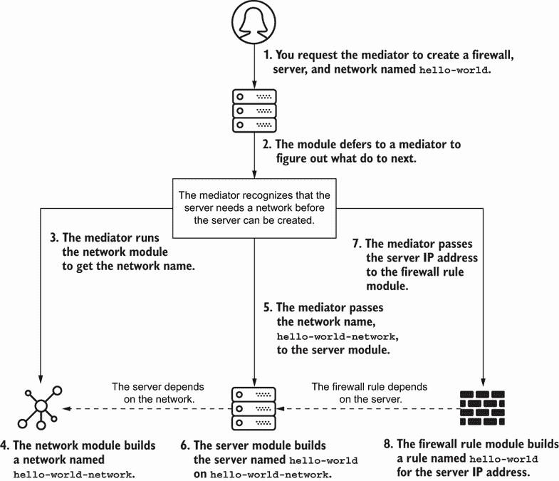

图 4.12 中介成为决定首先配置哪个资源的权威机构。

IaC 实现了依赖注入来抽象和控制网络、服务器和防火墙的依赖关系。它依赖于幂等性原则来持续运行并达到相同的目标状态（网络、服务器和防火墙），无论现有资源如何。可组合性还有助于建立基础设施资源和依赖关系的基本构建块。

这种 *中介模式* 的工作方式类似于机场的空中交通管制。它控制和管理工作站的进出航班。中介的唯一目的是组织这些资源之间的依赖关系，并根据需要创建或删除对象。

定义 *中介模式* 组织基础设施资源之间的依赖关系，并包含基于其依赖关系创建或删除对象的逻辑。

让我们实现网络、服务器和防火墙的中介模式。在 Python 中实现中介模式需要一些 if-else 语句来检查每种资源类型并构建其低级依赖。在列表 4.9 中，防火墙依赖于首先创建服务器和网络。

列表 4.9 使用中介模式组织服务器和依赖

```
import json
from server import ServerFactoryModule                                   ❶
from firewall import FirewallFactoryModule                               ❶
from network import NetworkFactoryModule                                 ❶

class Mediator:                                                          ❷
   def __init__(self, resource, **attributes):
       self.resources = self._create(resource, **attributes)

   def _create(self, resource, **attributes):                            ❸
       if isinstance(resource, FirewallFactoryModule):                   ❹
           server = ServerFactoryModule(resource._name)                  ❹
           resources = self._create(server)                              ❹
           firewall = FirewallFactoryModule(                             ❺
               resource._name, depends_on=resources[1].outputs())        ❺
           resources.append(firewall)                                    ❺
       elif isinstance(resource, ServerFactoryModule):                   ❻
           network = NetworkFactoryModule(resource._name)                ❻
           resources = self._create(network)                             ❻
           server = ServerFactoryModule(                                 ❼
               resource._name, depends_on=network.outputs())             ❼
           resources.append(server)                                      ❼
       else:                                                             ❽
           resources = [resource]                                        ❽
       return resources

   def build(self):                                                      ❾
       metadata = []                                                     ❾
       for resource in self.resources:                                   ❾
           metadata += resource.build()                                  ❾
       return {'resource': metadata}                                     ❾

if __name__ == "__main__":
   name = 'hello-world'
   resource = FirewallFactoryModule(name)                                ❿
   mediator = Mediator(resource)                                         ❿

   with open('main.tf.json', 'w') as outfile:                            ⓫
       json.dump(mediator.build(), outfile, sort_keys=True, indent=4)    ⓫
```

❶ 导入网络、服务器和防火墙的工厂模块

❷ 创建一个中介来决定如何以及按何种顺序自动化资源更改

❸ 当你调用中介来创建网络、服务器或防火墙等资源时，你允许中介决定所有要配置的资源。

❹ 如果你想创建一个作为资源的防火墙规则，中介将递归地调用自己以首先创建服务器。

❺ 在中介创建服务器配置后，它构建防火墙规则配置。

❻ 如果你想创建一个作为资源的服务器，中介将递归地调用自己以首先创建网络。

❼ 在中介创建网络配置后，它构建服务器配置。

❽ 如果你向中介传递任何其他资源，例如网络，它将构建其默认配置。

❾ 使用模块从中介创建资源列表并渲染 JSON 配置

❿ 将防火墙资源传递给中介。中介将创建网络、服务器，然后是防火墙配置。

将 Python 字典写入 JSON 文件，以便 Terraform 后续执行

AWS 和 Azure 的等效功能

GCP 的防火墙规则在行为上与 AWS 安全组或 Azure 网络安全组的规则相似。这些规则控制来自和发往标记目标的 IP 地址范围的网络流量。

如果你有一个新的资源，例如负载均衡器，你可以在服务器或防火墙之后扩展中介器来构建它。中介器模式最适合具有多层依赖关系和多个系统组件的模块。

然而，你可能发现实现中介器具有挑战性。中介器模式必须遵循幂等性。你需要多次运行并达到相同的目标状态。你必须编写和测试中介器中的所有逻辑。如果你不测试你的中介器，你可能会意外地破坏资源。编写自己的中介器需要大量的代码！

幸运的是，你通常不需要自己实现中介器。大多数基础设施即代码（IaC）工具都充当中介器，以解决复杂的依赖关系并决定如何创建资源。大多数配置工具都内置了中介器来识别依赖关系和操作顺序。例如，Kubernetes 的容器编排使用中介器来协调集群中资源的变更。Ansible 使用中介器来确定从各种配置模块中组合和运行哪些自动化步骤。

注意：一些 IaC 工具通过使用图论来映射资源之间的依赖关系来实现中介器模式。资源作为节点。链接将属性传递给依赖资源。如果你没有工具来创建资源，你可以手动在你的系统中绘制依赖关系图。图可以帮助组织你的自动化和代码。它们还可以确定你可以解耦哪些模块。绘制依赖关系的练习可能有助于你实现中介器。

我只在找不到工具或需要在工具之间添加某些内容时实现中介器模式。例如，我有时会编写一个中介器来控制在一个工具中创建 Kubernetes 集群，在另一个工具部署 Kubernetes 集群上的服务之前。中介器协调这两个工具之间的自动化，例如在第二个工具部署服务之前检查集群健康。

## 4.6 选择一个模式

门面、适配器和中介器都使用依赖注入来解耦高级模块和低级模块之间的更改。你可以应用任何一种模式，它们将表达模块之间的依赖关系并在其中隔离更改。随着你的系统增长，你可能需要根据模块的结构更改这些模式。

你选择模式取决于你对低级模块或资源的依赖数量。外观模式适用于一个低级模块到几个高级模块。如果你有一个具有许多高级模块依赖的低级模块，请考虑适配器。当你模块之间存在许多依赖时，你可能需要一个中介者来控制资源自动化。图 4.13 概述了确定使用哪种依赖模式的决策树。

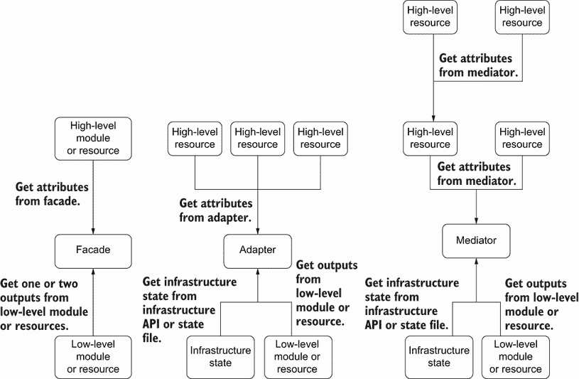

图 4.13 选择你的抽象取决于依赖关系的关系，无论是模块内、一对一还是一对多。

所有模式都通过依赖注入促进幂等性、可组合性和可进化性。然而，为什么你会从外观（facade）开始，然后考虑适配器（adapter）或中介者（mediator）呢？随着你的系统增长，你需要优化你的依赖管理模式以减少变更的操作负担。

图 4.14 显示了故障排除和实施工作量与外观、中介者和适配器模式的可扩展性和隔离性之间的关系。例如，外观在实施和故障排除方面具有最小努力的优势，但不能随着更多资源的增加而扩展或隔离变更。适配器和中介者在故障排除和实施工作量的代价下提供了改进的可扩展性和隔离性。

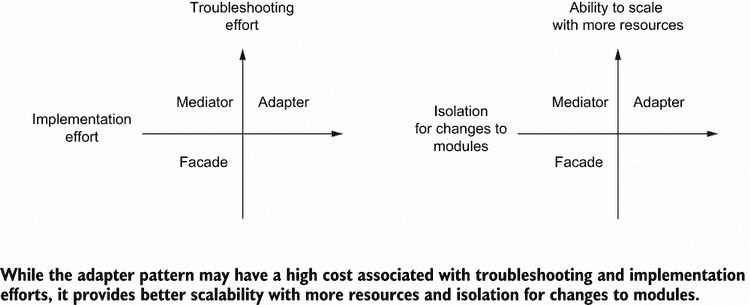

图 4.14 一些模式可能有较低的故障排除和实施成本，但不能隔离模块的变更和扩展。

通过选择具有中介者实现的工具来降低初始工作量。然后使用工具内置的外观实现来管理模块或资源之间的依赖关系。当你发现难以管理外观，因为你有许多系统相互依赖时，你可以开始检查适配器或中介者。

适配器的实现需要更多的工作，但它为你扩展和增长基础设施系统提供了最佳基础。你总是可以添加新的基础设施提供者和系统，而不用担心更改低级模块。然而，你不能期望为每个模块都使用适配器，因为它需要时间来实现和故障排除。

使用中介者的工具选择哪些组件需要更新以及何时更新。现有的工具可以降低你的整体实施工作量，但在故障排除期间会引入一些问题。你需要了解你的工具行为来排除依赖失败的变更。根据你如何使用工具，具有中介者的工具允许你扩展，但可能无法完全隔离模块的变更。

练习 4.1

我们如何通过以下 IaC 更好地解耦数据库对网络的依赖？

```
class Database:
  def __init__(self, name):
    spec = {
      'name': name,
      'settings': {
        'ip_configuration': {
          'private_network': 'default'
        }
      }
    }
```

A) 该方法充分解耦了数据库和网络。

B) 将网络 ID 作为变量传递，而不是将其硬编码为 `default`。

C) 为所有网络属性实现并传递一个`NetworkOutput`对象到数据库模块。

D) 向网络模块添加一个函数，将其网络 ID 推送到数据库模块。

E) 向数据库模块添加一个函数，用于调用基础设施 API 以获取`default`网络 ID。

请参阅附录 B 以获取练习题的答案。

## 摘要

+   应用基础设施依赖模式，如外观模式、适配器模式和中介者模式，以解耦模块和资源，这样你可以独立地对模块进行更改。

+   控制反转表明高级资源调用低级资源以获取属性。

+   依赖倒置原则表明高级资源应该使用低级资源元数据的抽象。

+   依赖注入结合了控制反转和依赖倒置的原则。

+   如果你没有识别出适用的模式，你可以使用依赖注入，让高级资源调用低级资源，并解析其对象结构以获取所需的值。

+   使用外观模式引用属性的简化接口。

+   使用适配器模式将一种资源中的元数据转换为另一种资源以使用。这种模式与来自不同基础设施提供商或原型模块的资源配合得最好。

+   中介者模式组织这些资源之间的依赖关系，并根据需要创建或删除对象。大多数工具都充当资源之间的中介。
