# 5 结构化和共享模块

本章涵盖

+   构建基础设施变更的模块版本和标签

+   选择单个仓库与多个仓库

+   在团队间组织共享的基础设施模块

+   发布基础设施模块而不影响关键依赖

到目前为止，本书你已经学习了编写基础设施代码和实践以及将它们划分为基础设施组件组的模式。然而，即使你编写了最优的配置，仍然可能难以维护和减轻系统故障的风险。困难发生的原因是因为在更新基础设施模块时，你的团队没有标准化协作实践。

想象一家公司，蔬菜数据中心，它从自动化草药的种植操作开始。GCP 中的应用程序监控和调整以实现最佳草药生长。每个团队使用单例模式并创建独特的的基础设施配置。

随着时间的推移，蔬菜数据中心变得越来越受欢迎，并希望扩展到所有蔬菜。它雇佣了一个新的应用开发团队，专门为从草药到叶类蔬菜到根茎类蔬菜的各种蔬菜的种植软件。每个团队创建了一个独立于其他团队的基础设施配置。

蔬菜数据中心雇佣你来开发一个种植水果的应用程序。你意识到你不能重用任何基础设施配置，因为它们对每个蔬菜团队都是独特的。公司需要一个一致、可重用的方式来构建、安全和管理工作基础设施。

你意识到蔬菜数据中心可以利用第三章中的一些模块模式来组织基础设施配置，将其划分为模块以提高可组合性。你绘制了一个图，如图 5.1 所示，用于组织和协调多个团队的基础设施。草药、根茎类蔬菜、叶类蔬菜和水果的团队都可以使用标准化的网络、数据库和服务器配置。

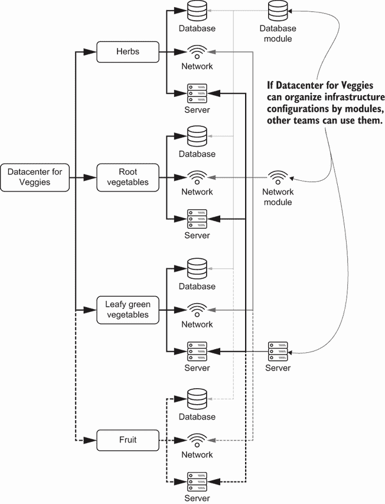

图 5.1 蔬菜数据中心可以使用模块来组织和标准化跨应用团队的基础设施配置。

在团队间共享模块促进可重复性、可组合性和可扩展性。团队不需要花费太多时间构建 IaC，因为他们可以复制已建立的配置。团队成员可以选择如何组合他们的系统，并覆盖特定需求的配置。

为了充分利用标准化模块的好处，你需要将它们视为一个独立于常规基础设施变更的开发生命周期。本章涵盖了共享和管理基础设施模块的实践。你将学习到如何发布稳定的模块，同时避免对高级依赖引入关键故障的技术和实践。

## 5.1 仓库结构

假设数据中心蔬菜的每个团队都为其基础设施使用单例模式。草药和叶绿蔬菜团队意识到他们使用的是类似配置的服务器、网络和数据库。他们能否将他们的基础设施配置合并到一个模块中？

与复制粘贴彼此的配置不同，草药和叶绿蔬菜团队希望在一个地方更新配置并在他们的配置中引用它。数据中心蔬菜应该将所有基础设施放在一个仓库中吗？还是应该将模块分散到多个仓库中？

### 5.1.1 单一仓库

起初，每个蔬菜数据中心团队都将其基础设施配置存储在单个代码仓库中。每个团队将其配置组织到一个专用目录中，以避免配置混淆。如果团队想要引用一个模块，团队将通过使用本地文件路径来导入模块。

图 5.2 显示了蔬菜数据中心如何构建其单一代码仓库。仓库包含顶级目录中的两个文件夹，分别用于模块和环境。公司为每个团队细分环境目录，例如叶绿蔬菜团队。叶绿蔬菜团队通过开发和生产环境来分离配置。

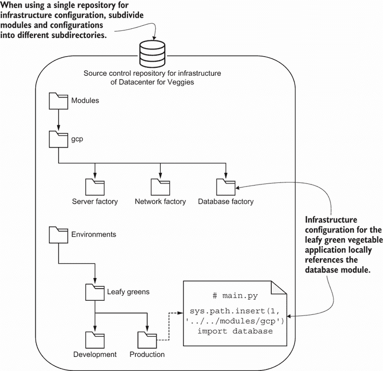

图 5.2 叶绿蔬菜团队的生产和开发环境在一个单一仓库结构中使用了包含服务器、网络和数据库工厂模块的目录。

当叶绿蔬菜团队成员想要创建数据库时，他们可以使用模块文件夹中的一个模块。在他们的基础设施即代码（IaC）中，他们通过设置本地路径来导入模块。导入后，他们可以使用数据库工厂并在生产环境中构建资源。

蔬菜数据中心开始使用*单一仓库*（也称为*单仓库*，或*monorepo*）来包含每个团队的全部配置和模块。

定义 A *单一仓库*结构（也称为*单仓库*，或*monorepo*）包含一个团队或功能的全部基础设施即代码（配置和模块）。

通常情况下，公司喜欢使用单一仓库结构。所有团队都可以通过复制粘贴来重现他们的配置，并且可以通过为模块添加一个新的文件夹来创建新的资源。在列表 5.1 中，叶绿蔬菜团队成员构建了一个新的数据库模块。他们使用 Python，通过`sys.path`方法将本地文件路径插入到模块中。他们通过将模块导入到代码库中来使用数据库。

列表 5.1 在不同目录中引用基础设施模块

```
import sys
sys.path.insert(1, '../../modules/gcp')                                   ❶

from database import DatabaseFactoryModule                                ❷
from server import ServerFactoryModule                                    ❷
from network import NetworkFactoryModule                                  ❷

import json

if __name__ == "__main__":
   environment = 'production'
   name = f'{environment}-hello-world'
   network = NetworkFactoryModule(name)                                   ❷
   server = ServerFactoryModule(name, environment, network)               ❷
   database = DatabaseFactoryModule(name, server, network, environment)   ❷
   resources = {                                                          ❸
       'resource': network.build() + server.build() + database.build()    ❸
   }                                                                      ❸

   with open('main.tf.json', 'w') as outfile:                             ❹
       json.dump(resources, outfile, sort_keys=True, indent=4)            ❹
```

❶ 导入包含模块的目录，因为它存在于同一个仓库中

❷ 导入生产环境的服务器、数据库和网络工厂模块

❸ 使用模块创建网络、服务器和数据库的 JSON 配置

❹ 将 Python 字典写入 JSON 文件，以便 Terraform 稍后执行

使用本地文件夹存储模块有助于团队引用他们想要的工具。每个人都可以在同一个存储库中查找模块或检查其他团队的配置。如果草药团队的某个人想了解水果团队的 IaC，他们可以使用`tree`命令来检查目录结构：

```
$ tree .
.
├── environments
│     ├── fruits
│     │     ├── development
│     │     └── production
│     ├── herbs
│     │     ├── development
│     │     └── production
│     ├── leafy-greens
│     │      ├── development
│     │      └── production
│     └── roots
│             ├── development
│             └── production
└── modules
 └── gcp
 ├── database.py
 ├── network.py
 ├── server.py
 └── tags.py
```

为了更好地组织配置，每个团队都将开发和生产环境配置放入单独的文件夹中。这些目录隔离了每个环境的配置和更改。理想情况下，所有环境都应该是相同的。现实情况下，您将在环境之间有差异，以解决成本或资源限制。

其他工具

单个存储库结构适用于许多其他 IaC 工具。您可以将单个存储库结构应用于重用角色和剧本到配置管理工具，如 Ansible。您可以根据单个存储库中的每个本地目录引用和构建剧本或配置管理模块。

CloudFormation 的工作方式略有不同。您可以将所有堆栈定义文件托管在单个存储库中。但是，您必须将子模板（我认为它是一个模块）发布到 S3 存储桶，并在`AWS::CloudFormation::Stack`资源中使用`TemplateURL`参数引用它。在本章的后面部分，您将了解如何交付和发布模块的更改。

蔬菜数据中心使用一个基础设施提供商，即 GCP。未来，团队可以为不同的基础设施工具或提供商添加新的目录。这些工具可以更新服务器或网络（ansible 目录），构建虚拟机镜像（packer 目录），或将数据库部署到 AWS（aws 目录）：

```
$ tree .
.
├── environments
│     ├── development
│     └── production
└── modules
     ├── ansible
     ├── aws
     ├── gcp
     └── packer
```

您可能在其他 IaC 材料中遇到“不要重复自己”的原则（*DRY*）。DRY 原则促进重用和可组合性。基础设施模块减少了配置中的重复和冗余，符合 DRY 原则。如果您能够拥有相同的生产和开发环境，您就可以省略开发和生产目录，并引用一个模块而不是单独的环境文件。

您无法在基础设施中完全遵守 DRY 原则。根据基础设施或工具的语言和语法，您总会遇到重复的配置。因此，您可以在配置更清晰或工具或平台限制的范围内偶尔重复。

### 5.1.2 多个存储库

随着蔬菜数据中心的发展，其基础设施存储库有数百个文件夹。每个文件夹包含更多嵌套的文件夹。每周，您都要花费时间将所有存储库的更新与配置进行合并。每次您将更改推送到生产环境时，您也要等待 20 分钟，因为您的 CI 框架必须递归地搜索更改。安全团队也表达了担忧，因为与绿叶蔬菜团队合作的承包商可以访问水果团队的整个基础设施！

你将网络、标签、服务器和数据库模块分别划分到单独的仓库中。每个仓库都有自己的构建和交付模块的工作流程，这减少了 CI 框架的时间。你可以控制对每个仓库的访问，允许绿叶团队的外包人员只能访问绿叶配置。

蔬菜数据中心的不同团队可以使用模块的仓库或打包版本。每个团队将其配置和模块存储在单独的仓库中。公司中的任何人都可以下载和使用配置中的模块。

图 5.3 显示了蔬菜数据中心用于创建 IaC 的代码仓库。每个团队和模块都有自己的代码仓库。当绿叶团队想要创建数据库时，它会从 GitHub 仓库 URL 下载并导入数据库模块，而不是从本地文件夹中导入。如果团队有多个环境，他们可以将代码仓库细分到文件夹中。

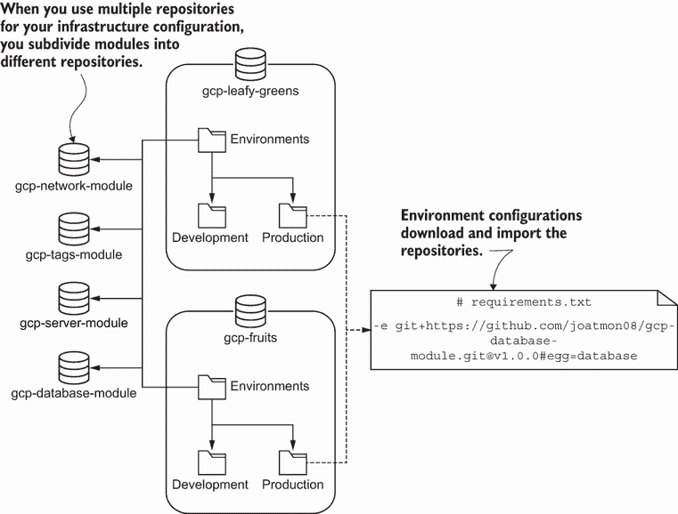

图 5.3 在多仓库结构中，你将每个模块存储在其自己的代码仓库中。配置引用仓库 URL 以使用模块。

蔬菜数据中心已从单一仓库结构迁移到多仓库结构，或称为多仓库结构。公司根据团队将模块分离到不同的仓库中。

定义 A 多仓库结构（也称为多仓库）根据团队或功能将 IaC（配置或模块）分离到不同的仓库中。

回想一下，单一仓库模式促进了可重复性和可组合性。多仓库模式有助于提高可进化性原则。将模块分离到各自的仓库中有助于结构化每个模块的生命周期和管理。

要实现多仓库结构，你需要将模块拆分到各自的版本控制仓库中。在下面的列表中，你通过在 requirements.txt 文件中将每个模块添加为库依赖项来配置 Python 的包管理器以下载每个模块。每个库依赖项必须包含一个指向版本控制仓库的 URL 和一个特定的标签以下载。

列表 5.2 Python requirements.txt 引用模块仓库

```
-e git+https://github.com/joatmon08/gcp-tags-module.git@1.0.0#egg=tags         ❶
-e git+https://github.com/joatmon08/gcp-network-module.git@1.0.0#egg=network   ❷
-e git+https://github.com/joatmon08/gcp-server-module.git@0.0.1#egg=server     ❷
-e git+https://github.com/joatmon08/gcp-database-module.git@1.0.0#egg=database ❷
```

❶ 从 GitHub 仓库下载标签的原型模块。根据标签选择模块版本。

❷ 从 GitHub 仓库下载网络、服务器和数据库的工厂模块。根据标签选择模块版本。

首先，你为水果应用程序基础设施的生产配置创建一个仓库。创建仓库后，你将其添加到 requirements.txt 文件中。然后，你运行 Python 的包安装管理器以下载基础设施配置的每个模块：

```
$ pip install -r requirements.txt
Obtaining tags from 
git+https://github.com/joatmon08/
➥gcp-tags-module.git@1.0.0#egg=tags
...
Successfully installed database network server tags
```

而不是设置本地路径并导入模块，你需要先运行 Python 的包安装管理器从远程仓库下载。下载模块后，团队可以使用列表 5.3 中的 Python 来在环境配置中导入它们。

列表 5.3 导入模块以用于基础设施配置

```
from tags import StandardTags                                             ❶
from server import ServerFactoryModule                                    ❶
from network import NetworkFactoryModule                                  ❶
from database import DatabaseFactoryModule                                ❶

import json

if __name__ == "__main__":
   environment = 'production'
   name = f'{environment}-hello-world'

   tags = StandardTags(environment)
   network = NetworkFactoryModule(name)
   server = ServerFactoryModule(name, environment, network, tags.tags)
   database = DatabaseFactoryModule(
       name, server, network, environment, tags.tags)
   resources = {
       'resource': network.build() + server.build() + database.build()    ❷
   }

   with open('main.tf.json', 'w') as outfile:                             ❸
       json.dump(resources, outfile, sort_keys=True, indent=4)            ❸
```

❶ 导入由包管理器下载的模块

❷ 使用模块创建网络、服务器和数据库的 JSON 配置

❸ 将 Python 字典写入 JSON 文件，以便 Terraform 稍后执行

记住，Veggies 数据中心分别配置开发和生产环境。团队将实现代码以引用版本控制中托管的相同工厂和原型模块。开发和生产环境的一致模块可以防止环境漂移，并帮助你在生产前测试模块更改。你将在第六章中了解更多关于测试和环境的内容。

多仓库的 IaC 实现与单仓库的实现差异不大。两种结构都支持可重复性和可组合性。然而，它们的不同之处在于你可以在外部仓库中独立地演进一个模块。

在多仓库结构中更新配置涉及使用包管理器重新下载新的模块。运行包管理器以使用新模块可能会在 IaC 工作流程中引入摩擦。有人可能更新了一个模块，除非你审查其仓库，否则你不会知道。在本章的后面部分，你将了解如何通过版本控制来解决这个问题。

领域特定语言

如果一个工具可以引用带有版本控制或工件 URL 的模块或库，它就可以支持多仓库结构。

当你采用多仓库结构时，你必须建立一些标准实践来共享和维护模块。首先，标准化模块文件结构和格式。这有助于组织中的团队在版本控制中识别和筛选模块。模块仓库的一致文件结构和命名也有助于审计和未来的自动化。

例如，Veggies 数据中心的基础设施模块遵循相同的模式和文件结构。它们的名称包括*基础设施提供者、资源*和*工具*或*目的*。在图 5.4 中，`gcp-server-module`描述 GCP 作为基础设施提供者，`server`作为资源类型，`module`作为目的。

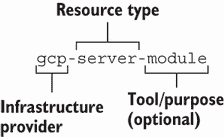

图 5.4 仓库名称应包括基础设施提供者、资源类型和目的。

如果你的模块使用特定的工具或具有独特目的，你可以将其附加到仓库名称的末尾。将工具添加到名称中可以帮助识别模块类型。类似于第二章中概述的实践，你希望你的模块名称足够描述性，以便团队成员可以识别。

您可以将存储库命名方法应用于单个存储库中的文件夹命名。然而，单个存储库中的子目录使得嵌套和识别基础设施提供者和资源类型更加容易。根据您组织和团队的偏好，您始终可以向存储库名称添加更多字段。

### 5.1.3 选择存储库结构

您的系统可扩展性和 CI 框架决定了您是使用单个存储库还是多个存储库。数据中心从单个存储库开始，由于它有数十个模块和几个环境，所以效果很好。每个模块有两个环境，用于开发和生产。每个环境需要几台服务器、一个数据库、一个网络和一个监控系统。

使用单个存储库提供了一些好处。图 5.5 概述了一些优点和局限性。首先，您的团队中的任何人都可以访问一个存储库中的模块和配置。其次，您只需要去一个地方就可以比较和识别环境之间的差异。例如，您可以在存储库中比较两个文件，以检查开发是否使用三台服务器，而生产是否使用五台服务器。

借鉴 IaC 原则，单个存储库结构仍然提供可组合性、可扩展性和可重复性。任何人都可以进入一个文件夹并演进一个模块。您仍然可以在模块之间构建，因为您有一个对所有基础设施和配置的单一视图。

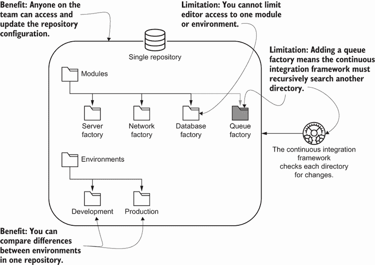

图 5.5 单个存储库为所有模块和配置提供了一个视图，但限制了 CI 框架或细粒度访问控制。

另一方面，单个存储库结构有一些局限性。如果任何人都可以更改一个模块，它可能会破坏依赖于它的 IaC！此外，您的 CI 系统可能会崩溃，因为它递归地检查每个目录中的更改。

因此，您需要采用实践和工具来处理单个存储库。这包括有偏见的版本控制和专门的构建系统。如果您的组织无法构建或采用帮助减轻单个存储库管理的工具，您可以选择多个存储库结构。

注意：您会发现一些有助于构建和管理单个存储库的工具。它们包含额外的代码来处理嵌套子目录和单个构建工作流程。其中一些包括 Bazel、Pants 和 Yarn。

从单个存储库结构迁移到多个存储库结构的发生频率可能比你想象的要高。我不得不做两次！一个组织从三个环境和四个模块开始。几年后，IaC 增长到数百个模块和环境。

不幸的是，CI 框架（Jenkins）运行标准更改以扩展服务器需要近三个小时。框架的大部分时间都花在搜索每个目录和嵌套目录中的更改上！我们最终将配置和模块重构为多个存储库。

将配置重构为多仓库结构缓解了 CI 框架的一些问题。多仓库结构还提供了对特定模块的更细粒度的访问控制。安全团队可以向特定团队授予模块编辑访问权限。你将在第十章中了解更多关于重构的信息。

图 5.6 展示了多仓库的好处和局限性，包括细粒度的访问控制和可扩展的 CI 工作流程。然而，多仓库结构减少了你对组织模块和配置的单一视角。

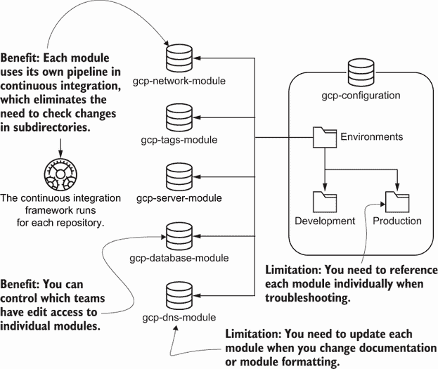

多仓库有助于减轻使用 CI 框架运行测试和配置的负担，但需要不断验证格式和故障排除的一致性。

通过将配置重构为多仓库结构，你可以隔离对特定团队的基础设施配置的访问和演进。你对模块的演进和生命周期有更大的控制权。大多数 CI 框架都支持多仓库，并且当框架检测到特定仓库的更改时，将并行运行工作流程。

然而，多仓库确实有一些缺点。想象一下“蔬菜数据中心”有十个或更多模块分布在不同的仓库中。你如何知道它们是否都符合相同的文件标准和命名？

图 5.7 展示了解决文件和标准一致性问题的一个解决方案。你可以将所有格式化和 linting 检查的测试捕获到一个原型模块中。然后，CI 框架在服务器、网络、数据库和 DNS 模块中下载测试并检查 README 和 Python 文件。

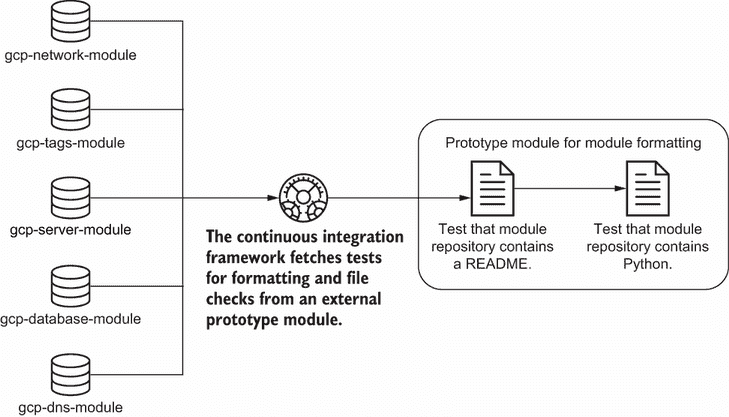

图 5.7 创建一个包含所有模块仓库格式检查的原型模块将有助于修复不符合新标准的旧仓库。

带有测试的原型模块有助于强制执行不常使用的旧模块（如 DNS）的格式。如果你想添加一个新标准，你只需更新原型模块中的新测试。下次有人更新模块或配置时，他们需要更新他们的模块格式以符合标准。

标准化的检查集有助于减轻在数百个仓库中查找和替换文件的操作负担。它将更新模块仓库的责任分配给模块的维护者。有关模块一致性测试和将模块集成到工作流程中的更多信息，你可以在第 6、7 和 8 章中应用这些实践。

多仓库结构的第二个缺点涉及故障排除的挑战。当你在配置中引用一个模块时，你需要搜索模块仓库以确定它需要哪些输入和输出。在调试配置中的失败时，搜索增加了额外的努力和时间。

如果你有一个可以处理单个存储库构建要求的构建系统，你可以为所有内容使用单个存储库。然而，大多数构建系统不会随着递归目录搜索进行扩展。为了解决这个问题，你可以使用单存储库和多存储库的组合。

让我们将这个解决方案应用到蔬菜数据中心。他们为不同类型的果实和蔬菜分别分离每个配置。叶菜类蔬菜使用一个存储库，而水果使用另一个。它们都引用共享的网络、标签、数据库和 DNS 模块。

图 5.8 显示，水果团队需要一个队列，而叶菜类蔬菜团队不需要。因此，水果存储库包括一个用于创建队列的本地模块。水果团队使用单个存储库进行其独特的配置，但引用多个存储库的常见模块。

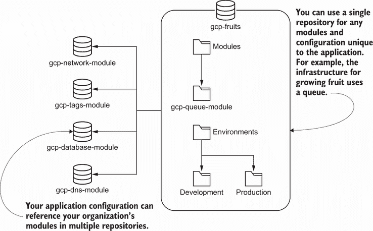

图 5.8 你的组织可以使用单个存储库来组合多个存储库，以进行应用程序或系统特定的配置。

当你使用这种混合匹配方法时，要认识到你希望为单个存储库或共享配置设置哪种访问控制。如果你想提高其他团队的组合性和可重复性，你可能将一个模块放在它自己的存储库中。然而，如果你想保持特定配置的可扩展性，你可能需要使用你的配置在本地管理该模块。

当你选择你的存储库结构时，要认识到方法之间的权衡，并在模块和配置数量增长时进行重构。当你将更多配置和资源添加到单个存储库中时，你需要确保工具和流程与其一起扩展！

## 5.2 版本控制

在本章的整个过程中，你已经使用了将基础设施配置或代码保存在版本控制中的实践。例如，蔬菜数据中心团队可以始终根据提交哈希引用基础设施。有一天，蔬菜数据中心的安全团队对土壤监测数据库的用户名和密码的年龄表示了担忧。

团队建议使用密钥管理器存储和每 30 天轮换密码。问题在于，*所有*团队都使用土壤监测数据库模块。图 5.9 显示，应用程序当前引用了土壤监测模块的输出。该模块输出数据库的密码，应用程序使用该密码来写入和读取数据。安全团队希望你使用密钥管理器。

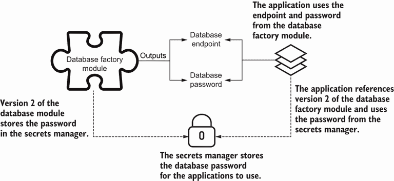

图 5.9 应用程序引用了土壤监测模块的数据库端点和密码，但应使用密钥管理器的密码。

数据库模块的输出会影响密钥的可扩展性和安全性。我们如何更新数据库以使用密钥管理器而不干扰土壤数据收集？蔬菜数据中心的基础设施团队决定向数据库模块添加*版本控制*。

定义 *版本控制* 是将唯一版本分配给代码迭代的过程。

让我们来看看蔬菜数据中心团队如何实现模块版本。该团队使用版本控制来标记数据库模块的当前版本为 `v1.0.0`。版本 v1.0.0 将为应用程序输出数据库密码：

```
$ git tag v1.0.0
```

他们将 v1.0.0 的标签推送到版本控制：

```
$ git push origin v1.0.0
Total 0 (delta 0), reused 0 (delta 0), pack-reused 0
 * [new tag]         v1.0.0 -> v1.0.0
```

你必须重构水果、叶菜、谷物和香草生长的配置，以使用名为 *版本锁定* 的过程中数据库模块的 v1.0.0 版本。版本锁定保持幂等性。当你运行 IaC 时，配置将继续使用数据库模块的输出。你不应该检测到锁定模块和现有基础设施之间的任何漂移。

在所有团队将版本锁定到 v1.0.0 之后，你可以重写模块以使用秘密管理器。数据库模块将密码存储在秘密管理器中。团队将新的数据库模块标记为 `v2.0.0`，该版本输出数据库端点和秘密管理器中密码的位置：

```
$ git tag v2.0.0
```

他们将 v2.0.0 的标签推送到版本控制：

```
$ git push origin v2.0.0
Total 0 (delta 0), reused 0 (delta 0), pack-reused 0
 * [new tag]         v2.0.0 -> v2.0.0
```

你可以根据提交历史来检查模块两个版本的差异：

```
$ git log --oneline
7157d3e (HEAD -> main, tag: v2.0.0, origin/main) 
➥Change database module to store password in secrets manager
5c5fd65 (tag: v1.0.0) Add database factory module
```

既然你已经创建了数据库工厂模块的新版本，你要求一些团队尝试使用它。水果团队勇敢地自告奋勇。水果团队目前使用版本 1.0.0。该模块版本输出数据库端点和密码。

当更新到模块版本 2.0.0 时，如图 5.10 所示，水果团队需要考虑模块工作流程的变化。团队不能使用模块输出中的数据库密码。模块输出一个指向存储在秘密管理器中的数据库密码的 API 路径。因此，水果团队重构其 IaC，在创建数据库之前从秘密管理器获取数据库密码。

你将应用一些基本的模块版本控制实践。首先，确保你在更新之前运行你的 IaC 并消除任何漂移。其次，建立一个不 *引用* 模块最新版本的版本控制方法。

蔬菜数据中心遵循 *语义版本控制*，分配传达配置基本信息的版本号。你可以通过几种方式指定模块版本，包括在版本控制中用数字标记提交，或在工件存储库中打包和标记模块。

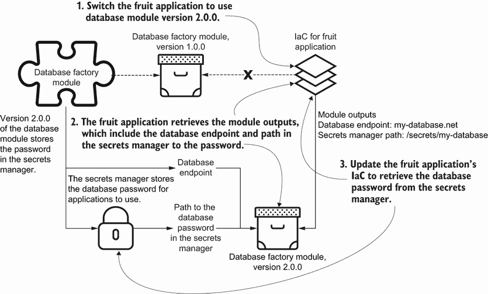

图 5.10 你可以将水果应用程序重构为引用数据库模块的版本 2.0.0 并从秘密管理器检索数据库密码。

注意：我经常更新主版本，以删除输入、输出和资源的重要更新。如果我只更新配置值、输入或输出到不影响依赖项的模块，我通常更新次版本。最后，我将更改补丁版本，以针对模块及其资源范围内的次要配置值更改。有关语义版本化和其方法的更多详细信息，请参考[`semver.org/`](https://semver.org/)。

使用一致的版本控制方法，你可以更有效地演进下游基础设施资源，而不会破坏上游资源，因为你控制了它们的依赖关系。版本控制还有助于对活跃版本进行审计。为了节省资源、减少混淆并推广最新更改，版本控制允许你识别和弃用模块的较旧、非活动版本。

然而，你必须持续记住并执行某些版本控制实践。你等待更新应用程序以使用数据库的 v2.0.0 版本的时长越长，它失败的可能性就越高。你可能需要考虑为模块版本 v1.0.0 的使用设定一个时间表。你不需要立即删除数据库模块的 v1.0.0 版本。通常，我在几个小版本更改内升级依赖模块。尝试在版本之间进行更广泛的“跳跃”升级会增加变更的风险和可能的失败率。

注意：如果你使用基于特性的开发或 Git Flow，你可以在软件开发的工作流程中容纳补丁或热修复。你可以基于版本标签创建一个分支，更新更改，增加补丁版本，并为热修复分支添加一个新的标签。你需要保留分支以保留提交历史。

此版本控制过程适用于多仓库结构。那么对于单一仓库呢？你仍然可以应用版本控制标签方法。你可能想在标签前添加模块名称的前缀（`module-name-v2.0.0`）。然后你可以将模块打包并发布到工件存储库。你的构建系统将打包模块子目录的内容，并在工件存储库中标记版本。你的配置引用工件存储库中的远程模块，而不是本地文件。

## 5.3 发布

我解释了模块版本控制的实践，以帮助模块演进并最小化对系统的干扰。然而，你不想每个团队都立即更新其 IaC 到最新的模块。相反，你想要确保模块在投入生产使用之前能够正常工作且不会破坏你的基础设施。

图 5.11 展示了在允许所有蔬菜数据中心团队使用之前，你如何评估你的数据库模块更新。在你将数据库模块更新为在密钥管理器中存储密码后，你将更改推送到版本控制。你要求水果团队在一个独立的环境中**测试**该模块，并确认模块可以正常工作。他们确认它工作正确。你使用新版本 2.0.0 标记发布，并更新了密钥管理器上的文档。

在上一节中，蔬菜数据中心的基础设施团队更新了模块，并首先与水果团队的开发环境进行了测试。现在模块通过了测试，其他团队可以使用带有密钥管理器的新数据库模块。团队遵循了一个**发布**流程来确保其他团队可以使用新模块。

定义 **发布** 是将软件分发给消费者的过程。

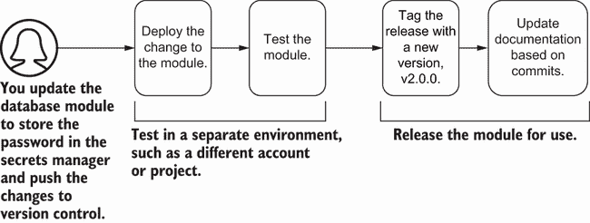

图 5.11 当你进行模块更新时，确保在发布模块和更新其文档之前包括一个测试阶段。

发布流程识别并隔离了模块更新中可能出现的任何问题。除非测试证明新模块可以正常工作，否则你不会打包新模块。

我建议在一个专门的测试环境中运行模块测试，远离开发和生产工作负载。为模块测试设置一个单独的账户或项目可以帮助你跟踪测试的成本，并将故障隔离在活动环境中。你将在第六章中了解更多关于测试和测试环境的内容。

注意：有关发布模块的持续交付管道的详细代码列表，请参阅[`mng.bz/PnaR`](http://mng.bz/PnaR)。GitHub Actions 管道在测试成功时根据提交消息自动构建 GitHub 发布。

测试模块后，你为团队使用的新版本标记发布。蔬菜数据中心发布数据库模块为版本 v2.0.0，并使用 Python 包管理器引用该标记。或者，你也可以打包模块并将其推送到工件存储库或存储桶。

例如，想象一下蔬菜数据中心有一些团队使用 CloudFormation。这些团队更喜欢引用存储在 Amazon S3 存储桶中的模块（或 CloudFormation 堆栈）。在图 5.12 中，团队在他们的交付管道中添加了一个步骤，以压缩他们的模块并将它们上传到 S3 存储桶。作为最后一步，他们更新了概述他们所做的更改的文档。

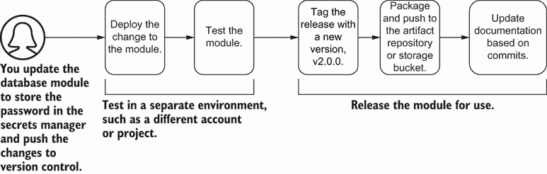

图 5.12 测试后，你可以选择将模块打包并推送到一个工件存储库或存储桶。

一些组织更喜欢打包工件并将其存储在单独的存储库中，以实现额外的安全控制。如果你有一个安全的网络，无法访问外部版本控制端点，你可以引用工件存储库。只需确保将标签保留在版本控制中，以便有人可以将工件与正确的代码版本关联起来。

在打包和推送工件后，你应该更新概述你更改的文档。这种文档称为*发布说明*，概述了输出和输入的破坏性更改。发布说明向其他团队传达了更改的摘要。

定义 *发布说明* 列出了给定版本的代码更改。你应该将它们存储在存储库中的文档中，通常称为变更日志。

你可以手动更新发布说明，但我更喜欢使用自动语义发布工具（如 semantic-release）来检查提交历史并为我构建发布说明。确保你使用正确的提交信息格式，以便工具能够匹配和解析更改。第二章强调了编写描述性提交信息的重要性。你也会发现它们对自动发布工具很有帮助。

例如，数据库模块将密码存储在密钥管理器中。对于蔬菜数据中心来说，这是一个主要特性，因此你在提交信息前加上`feat`前缀：

```
$ git log -n 1 --oneline
1b65555 (HEAD -> main, tag: v0.0.1, origin/main, origin/HEAD) 
➥feat(security): store password in secrets manager
```

自动发布工具中的提交分析器会根据这个提交自动更新标签的主版本号为 v2.0.0。

图像构建

你可能会遇到使用图像构建工具来构建不可变服务器或容器镜像的做法。通过将你想要的软件包烘焙到服务器或容器镜像中，你可以创建带有更新的新服务器，而无需担心就地更新问题。当你发布不可变镜像时，使用工作流程基于该镜像创建测试服务器，检查其是否正常运行，并更新镜像标签的版本。第七章涵盖了这些工作流程的一些内容。

除了更新发布说明外，确保你更新常用文件和文档。常用文件有助于你的队友使用该模块。例如，蔬菜数据中心同意团队必须始终包含一个 README 文件。README 记录了每个模块的目的、输入和输出。

定义 *README* 是存储库中的一个文档，它解释了代码的使用和贡献说明。对于 IaC，使用它来记录模块的目的、输入和输出。

使用代码检查规则来检查 README 文件的存在。在第二章中，我讨论了一些代码检查实践，以确保干净的 IaC。将此模式应用于常用文件和文档有助于你格式化和组织大量的 IaC。

在 Python 示例中，模块包括常见的文件，如用于识别包的`__init__.py`和用于模块配置的`setup.py`。我经常将具有配置或元数据、有助于特定工具或语言的文件称为**辅助文件**。它们会根据你使用的工具和平台而变化。你希望在整个组织中标准化它们，以便可以通过自动化并行更改或搜索它们。

## 5.4 分享模块

随着数据中心为蔬菜生产更多产品，它增加了自动化谷物、茶叶、咖啡和豆类生长的**新团队**。公司还创建了一个研究野生蔬菜品种的新团队。每个团队都需要能够扩展现有模块并创建新的模块。

例如，豆类团队需要更改数据库模块以使用 PostgreSQL 版本 12。那些团队成员是否应该能够编辑模块并更新版本？或者他们应该向你，基础设施团队，提交工单以更新它？

你需要授权不同的团队使用 IaC（基础设施即代码）创建和更新模块。然而，你想要确保团队不会更改属性而损害安全性或功能性。你将发现一些可以帮助你在组织中共享模块的实践。

假设数据中心为蔬菜的各个团队都需要一个数据库。你创建了一个新的、有偏见的数据库模块，该模块建立了一组默认参数以提供安全性和功能性。数据库模块使用内嵌的默认值作为模块输入，以覆盖数据中心为蔬菜的许多用例。即使咖啡团队不知道如何创建数据库，该团队也可以使用该模块构建一个安全、可工作的数据库。

作为一项通用实践，在你的模块中设置**有偏见的默认值**。你希望偏向于规定性的一边。如果团队需要更多的灵活性，它可以更新模块或覆盖默认属性。预设的默认值有助于教授部署特定基础设施资源的安全和标准实践。

在这种情况下，豆类团队表达了对更多灵活性的需求。该模块没有使用新的数据库版本，即 PostgreSQL 版本 12。没有其他团队使用该版本的 PostgreSQL。豆类团队决定更新数据库版本并将更改推送到仓库。

然而，更改不会立即发布。构建系统向基础设施团队的模块审批者发送通知。在图 5.13 中，基础设施团队暂停了构建系统并审查了更改。如果更改通过了团队的批准，构建系统将发布模块。豆类团队可以使用带有 PostgreSQL 版本 12 的新版本的数据库模块。

为什么你应该允许 Beans 团队更改基础设施模块？*自助服务*的模块变更赋予所有团队更新其系统的权力，并减轻基础设施和平台团队的负担。你希望平衡他们的开发进度与安全和基础设施的可用性。在模块发布前添加审批可以识别潜在故障或非标准的基础设施变更。

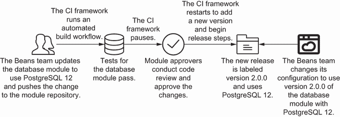

图 5.13 一个应用团队可以更新数据库模块。然而，该团队必须等待主题专家的批准才能使用新版本。

允许任何团队使用模块并经审批者编辑的做法，在建立了模块开发标准和流程的情况下效果最佳。如果你没有建立模块标准，这种方法就会失效，并给将基础设施变更交付到生产中增加摩擦。

让我们回到例子。基础设施团队对变更没有太多信心，因此团队请求数据库管理员进行额外审查。数据库管理员指出，如果 Beans 团队升级其模块版本，导致的行为将删除之前的数据库，并使用新版本创建一个空的数据库！这将严重干扰支持豆类生长的应用程序。

在图 5.14 中，Beans 团队向数据库团队提交了求助请求。管理员推荐了一些有助于更新数据库而不删除数据的做法。Beans 团队实施了这些做法，并请求模块审批者进行第二次审查。一旦模块发布，团队就可以使用该模块，而不用担心会干扰其应用程序。

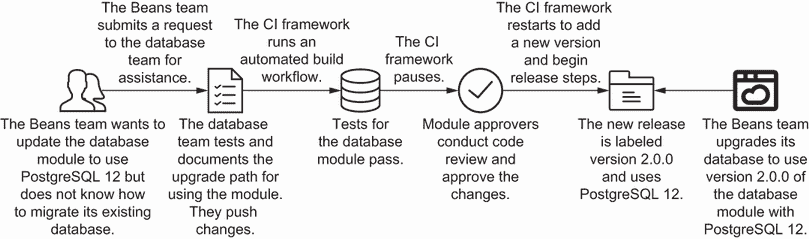

图 5.14 对于破坏性的模块更新，应用团队提交工单给数据库团队，以在发布新模块版本之前验证数据库迁移步骤。

如果你担心某个变更可能会特别破坏系统的架构、安全或可用性，在发布新版本之前，*请向主题专家请求审查*。主题专家可以帮助识别任何会影响使用该模块的其他团队的问题，并就如何最佳更新它提供建议。审查过程有助于你演进你的基础设施即代码（IaC），并识别来自基础设施变更的潜在故障。

通常，你需要一个流程，赋予你的团队能够进行基础设施变更的权力，并且提供团队完成这些变更所需的知识和支持，而不会干扰关键系统。手动审查可能看起来很繁琐，但有助于教育你的团队并防止生产中出现问题。你的团队必须在快速部署变更到生产中和等待主题专家手动审查之间找到平衡，这一点我将在第七章中进一步阐述。

通过在模块上协作工作，您可以在团队间共享基础设施即代码（IaC）知识，并集体识别对关键基础设施的潜在干扰。您可以将模块视为组织内使用的*工件*，类似于共享的应用程序库、容器镜像或虚拟机镜像。公司中的任何人都可使用和更新模块（如有需要，可提供额外帮助！）以演进基础设施架构、安全或可用性。

## 摘要

+   在单一存储库或多个存储库中结构化和共享模块和配置。

+   单一存储库结构将所有配置和模块组织在一个地方，这使得故障排除和识别可用资源变得更加容易。

+   多存储库结构将所有配置和模块组织到各自的代码存储库中，按业务领域、功能、团队或环境划分。

+   多存储库结构允许对单个基础设施配置或模块进行更好的访问控制，并简化每个存储库的管道执行。

+   随着越来越多的人参与基础设施即代码（IaC）协作并需要额外的资源来快速处理更改，单一存储库可能无法扩展。

+   将单一存储库重构为多个存储库，每个模块一个存储库。

+   为模块选择一致的版本控制方法，并使用 Git 标签进行更新。

+   将模块打包并发布到工件存储库，这将允许组织中的任何人都可检索特定模块版本。

+   在团队间共享模块时，在模块中建立有见地的默认参数以维护安全和功能。

+   允许组织中的任何人为模块提出更新建议，但添加治理机制以识别可能对架构、安全或基础设施可用性造成干扰的模块更改。
