# 6 测试

本章涵盖

+   确定为基础设施系统编写哪种类型的测试

+   编写测试以验证基础设施配置或模块

+   理解各种类型测试的成本

从第一章回忆起，基础设施即代码涉及将更改推送到系统的一个完整过程。您通过更新脚本或配置来应用基础设施更改，将它们推送到版本控制系统，并以自动化的方式应用更改。然而，您可以使用第三章和第四章中的每个模块和依赖模式，但仍可能遇到失败的更改！如何在将更改应用到生产之前捕捉到失败的更改？

您可以通过实现 IaC 的测试来解决此问题。*测试*是一个评估系统是否按预期工作的过程。本章回顾了与测试 IaC 相关的一些考虑因素和概念，以降低变更失败率并增强对基础设施变更的信心。

定义*测试*IaC 是一个评估基础设施是否按预期工作的过程。

想象您使用新的网络段配置了一个网络交换机。您可以通过对每个网络上的每台服务器进行 ping 测试并验证其连通性来手动测试现有网络。为了测试您是否正确设置了新网络，您创建了一个新的服务器并检查当您连接到它时它是否响应。这种手动测试对于两个或三个网络可能需要几个小时。

随着您创建更多的网络，您可能需要几天时间来验证您的网络连通性。对于每个网络段更新，您必须手动验证网络的连通性以及运行在网络上服务器、队列、数据库和其他资源。您*不能*测试一切，所以您只检查几个资源。不幸的是，这种方法可能会留下隐藏的虫子或问题，这些问题可能只会在几周甚至几个月后出现！

为了减轻手动测试的负担，您可以通过编写脚本来自动化测试，每个命令都编写一个脚本。您的脚本在新的网络上创建一个服务器，检查其连通性，并测试与现有网络的连接。您投入一些时间和精力来编写测试，但通过运行自动化脚本来对网络的任何后续更改进行验证，可以节省数小时的手动验证时间。

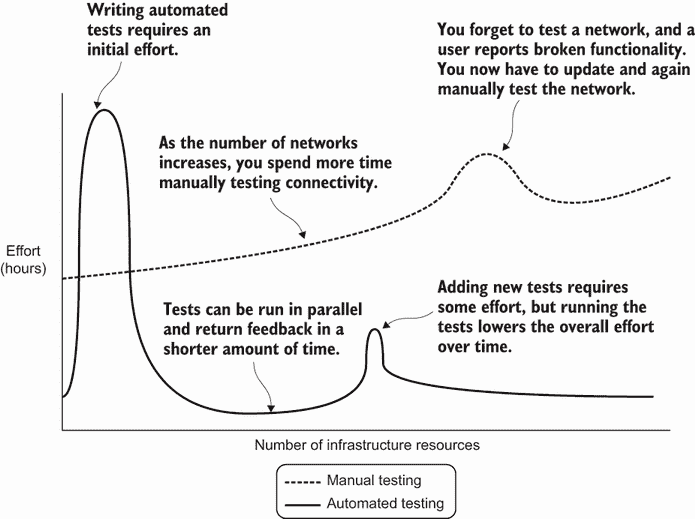

图 6.1 手动测试可能最初需要较低的努力，但随着您系统中基础设施资源的增加，这种努力也会增加。自动化测试需要较高的初始努力，但随着您系统的扩展，这种努力会减少。

图 6.1 显示了手动和自动测试时，每小时所需的工作量与基础设施资源数量的对比。当你手动运行网络测试时，你必须在测试上花费大量时间。随着你向系统中添加更多资源，工作量也会增加。相比之下，编写自动化测试需要初始的努力。然而，随着系统的增长，维护测试所需的工作量通常会减少。你甚至可以并行运行自动化测试以减少总体测试工作量。

当然，测试并不能捕捉到每个问题或消除系统中的所有故障。然而，自动化测试作为每次你进行变更时你应该在系统中测试什么的文档。如果一个隐藏的 bug 选择出现，你需要花费一些努力编写一个新的测试来验证 bug 不会再次发生！随着时间的推移，测试可以降低总体运营工作量。

你可以使用基础设施提供商或工具的测试框架，或者使用编程语言中的原生测试库。代码示例使用了一个名为`pytest`的 Python 测试框架和 Apache Libcloud，这是一个连接到 GCP 的 Python 库。我编写的测试侧重于*测试验证的内容*而不是语法。你可以将这种方法应用于任何工具或框架。

更多关于 pytest 和 Apache Libcloud 的信息

要运行测试，请参考[`github.com/joatmon08/manning-book`](https://github.com/joatmon08/manning-book)中的说明、示例和依赖项。它包括有关如何开始使用 pytest 和 Libcloud 的链接和参考。

*不要*为系统中每一块 IaC 编写测试。测试可能变得难以维护，有时甚至可能是冗余的。相反，我将解释如何评估何时编写测试以及适用于你正在更改的资源类型的测试类型。基础设施测试是一种启发式方法；你永远无法完全预测或模拟生产中的变更。一个有用的测试可以提供配置基础设施或变更如何影响系统的见解和实践。我还会区分哪些测试适用于如工厂、原型或构建器等模块，以及针对实时环境的通用复合或单例*配置*。

## 6.1 基础设施测试周期

测试可以帮助你建立信心并评估对基础设施系统变更的影响。然而，在没有首先创建系统的情况下，你如何测试一个系统呢？此外，你如何知道在应用变更后系统是否正常工作？

你可以使用图 6.2 中的基础设施测试周期来构建你的测试工作流程。在你定义基础设施配置后，运行初始测试以检查你的配置。如果测试通过，你可以将变更应用到活动基础设施并测试系统。

在这个工作流程中，您运行两种类型的测试。一种是在您部署基础设施更改之前对配置进行静态分析，另一种是对基础设施资源进行动态分析，以确保它仍然正常工作。大多数测试都遵循在更改部署前后运行的这种模式。

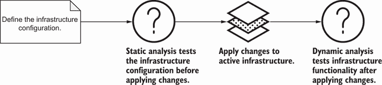

图 6.2 基础设施测试表明您是否可以应用更改到系统中。在应用更改后，您可以使用额外的测试来确认更改是否成功。

### 6.1.1 静态分析

您会如何将基础设施测试周期应用到我们的网络示例中？想象一下，您解析网络脚本以验证新的网络段是否具有正确的 IP 地址范围。您不需要将更改部署到网络中。相反，您分析脚本，这是一个静态文件。

在图 6.3 中，您定义网络脚本并运行静态分析。如果您发现错误的 IP 地址，测试将失败。您可以回滚或修复您的网络更改并重新运行测试。如果它们通过，您可以将正确的网络 IP 地址应用到活动网络中。

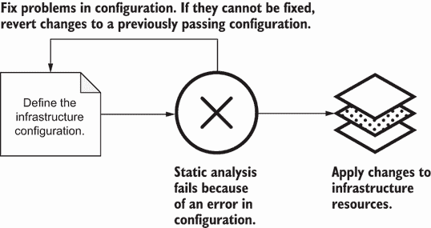

图 6.3 您可以选择固定配置以通过测试，或者在静态分析失败时恢复到之前成功的配置。

在将更改部署到基础设施资源之前评估基础设施配置的测试执行*静态分析*。

对于 IaC 的*静态分析*定义，在将更改部署到实际基础设施资源之前，验证明文基础设施配置。

静态分析的测试不需要基础设施资源，因为它们通常解析配置。它们不会对任何活动系统造成影响的风险。如果静态分析测试通过，我们更有信心可以应用更改。

我经常使用静态分析测试来检查基础设施命名标准和依赖关系。它们在应用更改之前运行，并在几秒钟内识别任何不一致的命名或配置问题。我可以纠正更改，重新运行测试以通过，并将更改应用到基础设施资源中。请参阅第二章以获取干净的 IaC、linting 和格式化规则。

静态分析的测试不会对活动基础设施进行更改，这使得回滚更加直接。如果静态分析的测试失败，您可以返回到基础设施配置，纠正问题，并再次提交更改。如果您无法修复配置以通过静态分析，您可以回滚您的提交到一个成功的版本！您将在第十一章中了解更多关于回滚更改的内容。

### 6.1.2 动态分析

如果静态分析通过，您可以部署更改到网络。然而，您不知道网络段是否实际上工作。毕竟，服务器需要连接到网络。为了测试连通性，您在网络中创建一个服务器并运行测试脚本以检查入站和出站连通性。

图 6.4 显示了测试网络功能性的周期。一旦你将更改应用到活动基础设施环境，你就运行测试来检查系统的功能。如果测试脚本失败并显示服务器无法连接，你将返回到配置并修复它以供系统使用。

注意，你的测试脚本需要一个活动网络来创建服务器并测试其连接性。在将更改应用到活动基础设施资源后验证基础设施功能性的测试执行*动态分析*。

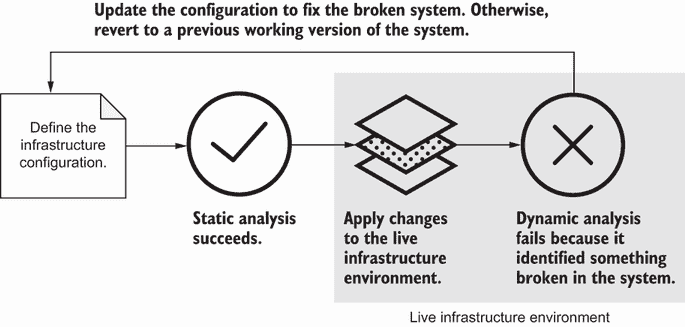

图 6.4 当动态分析失败时，你可以通过更新配置或回滚到之前可工作的配置来修复测试环境。

定义 对于 IaC 的*动态分析*验证在将更改应用到活动基础设施资源后系统功能。

当这些测试通过时，我们更有信心更新成功。然而，如果它们失败，它们会识别系统中的问题。如果测试失败，你知道你需要调试，修复配置或脚本，并重新运行测试。它们为可能破坏基础设施资源和系统功能的变化提供了一个早期预警系统。

你只能动态分析一个活动环境。如果你不知道更新是否可行怎么办？你能将这些测试从生产环境中隔离出来吗？与其将所有更改应用到生产环境并测试它，你可以在中间测试环境中分离你的更新并测试它们。

### 6.1.3 基础设施测试环境

一些组织在单独的环境中复制整个网络，以便他们可以测试更大的网络更改。将更改应用到测试环境中可以更容易地识别和修复损坏的系统，更新配置，并提交新更改，而不会影响业务关键系统。

当你在提升到活动环境之前在单独的环境中运行测试时，你增加了基础设施测试周期。在图 6.5 中，你保留了静态分析步骤。然而，你在测试环境中应用网络更改并运行动态分析。如果它通过了测试环境，你就可以将更改应用到生产，并在生产中运行动态分析。

一个*测试环境*将更改和测试与生产环境隔离开。

定义 一个*测试环境*与生产环境分离，用于测试基础设施更改。

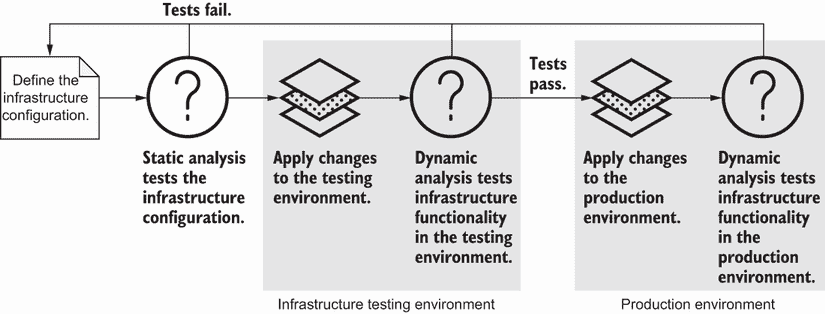

图 6.5 在将更改应用到生产之前，你可以在测试环境中运行基础设施的静态和动态分析。

在生产之前设置一个测试环境可以帮助你在部署到生产环境之前*练习*和*检查*更改。这样你就能更好地理解它们如何影响现有系统。如果你无法修复更新，你可以将测试环境回滚到一个可工作的配置版本。你可以使用测试环境进行以下操作：

+   在将基础设施更改应用于生产系统之前检查其影响

+   隔离基础设施模块的测试（有关模块共享实践，请参阅第五章）

然而，请注意，你必须像维护生产环境一样维护测试环境。当可能时，基础设施测试环境应遵守以下要求：

+   它的配置必须尽可能接近生产环境。

+   它必须与应用程序的开发环境不同。

+   它必须是持久的（即，每次测试时不要创建和销毁它）。

在前面的章节中，我提到了减少环境漂移的重要性。如果你的基础设施测试环境与生产环境相同，你将获得更准确的测试行为。你还希望将基础设施更改的测试与专门用于应用程序的开发环境隔离。一旦你确认你的基础设施更改没有破坏任何东西，你就可以将它们推送到应用程序的开发环境。

拥有一个持久的测试基础设施环境很有帮助。这样，你可以测试运行中的基础设施更新是否可能影响业务关键系统。不幸的是，从成本或资源角度来看，维护一个基础设施测试环境可能并不实际。我在第十二章概述了一些测试环境成本管理的技巧。

在本章的剩余部分，我将讨论执行静态和动态分析的不同类型的测试以及它们如何适应你的测试环境。一些测试将允许你减少对测试环境的依赖。其他测试对于评估更改后的生产系统功能至关重要。在第十一章中，我涵盖了特定于生产的回滚技术，并将测试纳入持续基础设施交付。

## 6.2 单元测试

我提到了在基础设施即代码（IaC）上运行静态分析的重要性。静态分析评估文件的具体配置。你可以为静态分析编写哪些类型的测试？

假设你有一个工厂模块来创建一个名为`hello-world-network`的网络和三个具有 10.0.0.0/16 IP 地址范围的子网。你想要验证它们的网络名称和 IP 地址范围。你*期望*子网将 10.0.0.0/16 范围分配给自己。

作为解决方案，你可以在不创建网络和子网的情况下编写测试来检查网络名称和子网 IP 地址范围。这种静态分析可以在几秒钟内验证配置参数的预期值。

图 6.6 显示，你的静态分析包括同时运行的几个测试。你检查网络名称、子网数量和子网的 IP 地址范围。

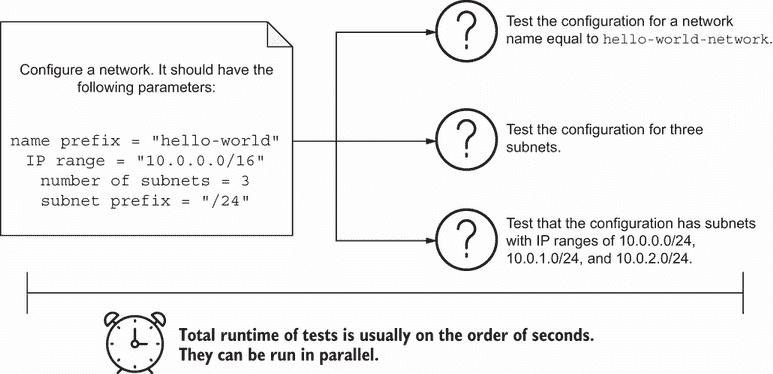

图 6.6 单元测试验证配置参数，例如网络名称，是否等于预期值。

我们刚刚对网络 IaC 运行了单元测试。*单元测试* 在隔离环境中运行，并静态分析基础设施配置或状态。这些测试不依赖于活动的基础设施资源或依赖，并检查配置的最小子集。

定义 *单元测试* 静态分析纯文本基础设施配置或状态。它们不依赖于实时基础设施资源或依赖。

注意，单元测试可以分析基础设施配置或状态文件中的元数据。一些工具直接在配置中提供信息，而其他工具则通过状态暴露值。接下来的几节将提供测试这两种类型文件的示例。根据你的 IaC 工具、测试框架和偏好，你可能测试其中一种、两种或全部。

### 6.2.1 测试基础设施配置

我们将首先编写使用模板生成基础设施配置的模块的单元测试。我们的网络工厂模块使用一个函数来创建具有网络配置的对象。你需要知道函数 `_network_configuration` 是否生成正确的配置。

对于网络工厂模块，你可以使用 pytest 编写单元测试来检查生成网络和子网 JSON 配置的函数。测试文件包括三个测试，一个用于网络名称，一个用于子网数量，一个用于 IP 范围。

Pytest 通过寻找以 test_ 前缀的文件和测试来识别测试。在列表 6.1 中，我们命名了测试文件为 test_network.py，这样 pytest 就能找到它。文件中的每个测试都有 test_ 前缀以及描述测试检查内容的说明信息。

列表 6.1 使用 pytest 在 test_network.py 中运行单元测试

```
import pytest                                                            ❶
from main import NetworkFactoryModule                                    ❷

NETWORK_PREFIX = 'hello-world'                                           ❸
NETWORK_IP_RANGE = '10.0.0.0/16'                                         ❸

@pytest.fixture(scope="module")                                          ❹
def network():                                                           ❹
   return NetworkFactoryModule(                                          ❹
       name=NETWORK_PREFIX,                                              ❹
       ip_range=NETWORK_IP_RANGE,                                        ❹
       number_of_subnets=3)                                              ❹

@pytest.fixture                                                          ❺
def network_configuration(network):                                      ❺
   return network._network_configuration()['google_compute_network'][0]  ❺

@pytest.fixture                                                          ❻
def subnet_configuration(network):                                       ❻
   return network._subnet_configuration()[                               ❻
       'google_compute_subnetwork']                                      ❻

def test_configuration_for_network_name(network, network_configuration): ❼
   assert network_configuration[network._network_name][
       0]['name'] == f"{NETWORK_PREFIX}-network"

def test_configuration_for_three_subnets(subnet_configuration):          ❽
   assert len(subnet_configuration) == 3

def test_configuration_for_subnet_ip_ranges(subnet_configuration):       ❾
   for i, subnet in enumerate(subnet_configuration):
       assert subnet[next(iter(subnet))
                     ][0]['ip_cidr_range'] == f"10.0.{i}.0/24"
```

❶ 导入 pytest，一个 Python 测试库。你需要命名文件和以 test_ 前缀的测试，以便 pytest 能够运行它们。

❷ 从 main.py 中导入网络工厂模块。你需要运行网络配置的方法。

❸ 将预期值设置为常量，例如网络前缀和 IP 范围

❹ 根据预期值从模块中创建网络作为测试固定装置。此装置为所有测试提供了一个一致的网络对象以供引用。

❺ 由于需要解析 google_compute_network，因此为网络配置创建了一个单独的固定装置。一个测试使用此装置来测试网络名称。

❻ 由于需要解析 google_compute_subnetwork，因此为子网配置创建了一个单独的固定装置。两个测试使用此装置来检查子网数量及其 IP 地址范围。

❼ Pytest 将运行此测试以检查网络名称是否匹配 hello-world-network。它引用了 network_configuration 固定装置。

❽ Pytest 将运行此测试以检查子网数量是否等于 3。它引用了 subnet_configuration 固定装置。

❾ Pytest 将检查网络示例配置中的正确子网 IP 范围。它引用了 subnet_configuration 固定装置。

AWS 和 Azure 等效

要将列表 6.1 转换为 AWS，请使用`aws_subnet` Terraform 资源([`mng.bz/J2vZ`](https://shortener.manning.com/J2vZ))并检索`cidr_block`属性的值。

对于 Azure，请使用`azurerm_subnet` Terraform 资源([`mng.bz/wo05`](https://shortener.manning.com/wo05))并检索`address_prefixes`属性的值。

测试文件包括在测试之间传递的静态网络对象。此 *测试固定装置* 创建一个一致的网络对象，每个测试都可以引用。它减少了构建测试资源时使用的重复代码。

定义 A *测试固定装置* 是用于运行测试的已知配置。它通常反映了给定基础设施资源的已知或预期值。一些固定装置会分别解析网络和子网信息。每次我们添加新的测试时，我们不必复制和粘贴解析。相反，我们引用固定装置以获取配置。

您可以在命令行中运行 pytest 并传递一个带有测试文件的参数。pytest 运行一组三个测试并输出它们的成功：

```
$ pytest test_network.py
==================== test session starts ====================
collected 3 items

test_network.py ...                                    [100%]

===================== 3 passed in 0.06s =====================
```

在此示例中，您导入网络工厂模块，创建一个带有配置的网络对象，并对其进行测试。您不需要将任何配置写入文件。相反，您引用函数并测试对象。

此示例使用我用于单元测试应用程序代码的相同方法。这通常会导致更小、更模块化的函数，您可以更有效地进行测试。生成网络配置的函数需要输出测试配置。否则，测试无法解析和比较值。

### 6.2.2 测试特定领域语言

如果您使用 DSL，您如何测试您的网络和子网配置？您没有可以在测试中调用的函数。相反，您的单元测试必须从配置或干运行文件中解析值。这两种类型的文件都存储有关基础设施资源的一些 plaintext 元数据。

想象一下，您使用 DSL 而不是 Python 来创建您的网络。此示例创建一个与 Terraform 兼容的配置的 JSON 文件。该 JSON 文件包含所有三个子网、它们的 IP 地址范围和名称。在图 6.7 中，您决定针对网络的 JSON 配置文件运行单元测试。测试运行得很快，因为您没有部署网络。

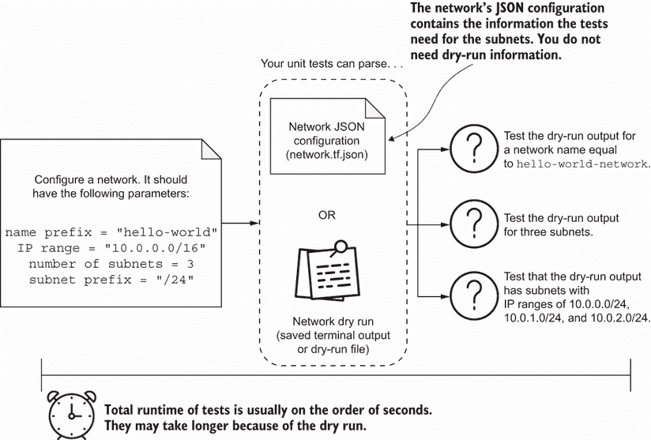

图 6.7 单元测试与干运行测试需要生成基础设施资源的更改预览，并检查其有效参数。

通常，您始终可以对您用于定义 IaC 的文件进行单元测试。如果工具使用配置文件，如 CloudFormation、Terraform、Bicep、Ansible、Puppet、Chef 等，您可以对配置中的任何行进行单元测试。

在列表 6.2 中，您可以在不生成干运行的情况下测试您的网络模块的网络名称、子网数量和子网 IP 地址范围。我用 pytest 运行类似的测试来检查相同的参数。

列表 6.2 使用 pytest 在 test_network_configuration.py 中运行单元测试

```
import json                                                     ❶
import pytest

NETWORK_CONFIGURATION_FILE = 'network.tf.json'                  ❷

expected_network_name = 'hello-world-network'                   ❸

@pytest.fixture(scope="module")                                 ❹
def configuration():                                            ❹
   with open(NETWORK_CONFIGURATION_FILE, 'r') as f:             ❹
       return json.load(f)                                      ❹

@pytest.fixture
def resource():                                                 ❺
   def _get_resource(configuration, resource_type):             ❺
       for resource in configuration['resource']:               ❺
           if resource_type in resource.keys():                 ❺
               return resource[resource_type]                   ❺
   return _get_resource                                         ❺

@pytest.fixture                                                 ❻
def network(configuration, resource):                           ❻
   return resource(configuration, 'google_compute_network')[0]  ❻

@pytest.fixture                                                 ❼
def subnets(configuration, resource):                           ❼
   return resource(configuration, 'google_compute_subnetwork')  ❼

def test_configuration_for_network_name(network):               ❽
   assert network[expected_network_name][0]['name'] \           ❽
       == expected_network_name                                 ❽

def test_configuration_for_three_subnets(subnets):              ❾
   assert len(subnets) == 3                                     ❾

def test_configuration_for_subnet_ip_ranges(subnets):           ❿
   for i, subnet in enumerate(subnets):                         ❿
       assert subnet[next(iter(subnet))                         ❿
                     ][0]['ip_cidr_range'] == f"10.0.{i}.0/24"  ❿
```

❶ 导入 Python 的 JSON 库，因为你需要加载 JSON 文件

❷ 设置一个常量，用于网络配置的预期文件名。测试从 network.tf.json 读取网络配置。

❸ 设置预期的网络名称为 hello-world-network

❹ 打开包含网络配置的 JSON 文件并将其作为测试固定配置加载

❺ 创建一个新的测试固定配置，它引用已加载的 JSON 配置并解析任何资源类型。它根据 Terraform 的 JSON 资源结构解析 JSON。

❻ 从 JSON 文件中获取 google_compute_network Terraform 资源

❼ 从 JSON 文件中获取 google_compute_subnetwork Terraform 资源

❽ Pytest 将运行此测试以检查网络名称配置是否与 hello-world-network 匹配。它引用了网络固定配置。

❾ Pytest 将运行此测试以检查子网数量配置是否等于 3。它引用了子网固定配置。

❿ Pytest 将检查正确的子网 IP 范围配置。它引用了子网固定配置。

AWS 和 Azure 等效

要将列表 6.2 转换为 AWS，使用 `aws_subnet` Terraform 资源 ([`mng.bz/J2vZ`](https://shortener.manning.com/J2vZ)) 并检索 `cidr_block` 属性的值。

对于 Azure，使用 `azurerm_subnet` Terraform 资源 ([`mng.bz/wo05`](https://shortener.manning.com/wo05)) 并检索 `address_prefixes` 属性的值。

你可能会注意到 DSL 的单元测试看起来与编程语言的测试相似。它们检查网络名称、子网数量和 IP 地址。一些工具具有专门的测试框架。它们通常使用相同的流程生成干运行或状态文件，并解析其中的值。

然而，你的配置文件可能不包含所有内容。例如，你不会在 Terraform 或 Ansible 中拥有某些配置，直到 *之后* 你进行了干运行。*干运行* 预览 IaC 变更而不部署它们，并内部识别和解决潜在问题。

定义 A *干运行* 预览 IaC 变更而不部署它们。它内部识别并解决潜在问题。

干运行有不同的格式和标准。大多数干运行输出到终端，并且你可以将输出保存到文件。一些工具将自动将干运行生成到文件。

为单元测试生成干运行

一些工具将它们的干运行保存到文件中，而其他工具则在终端中输出更改。如果你使用 Terraform，你可以使用以下命令将 Terraform 计划写入 JSON 文件：

```
$ terraform plan -out=dry_run && terraform show -json dry_run > dry_run.json
```

AWS CloudFormation 提供更改集，你可以在完成后解析更改集描述。同样，你可以使用 `kubectl` `run` 的 `-–dry-run=client` 选项获取 Kubernetes 干运行信息。

作为一般做法，我优先考虑检查配置文件的测试。当我无法从配置文件中获取值时，我会编写解析 dry-run 的测试。dry-run 通常需要访问基础设施提供者 API 的网络，并且运行需要一些时间。有时，输出或文件包含我不想让测试明确解析的敏感信息或标识符。

虽然 dry-run 配置可能不符合更传统的软件开发定义的单元测试，但解析 dry-run 不需要对活动基础设施进行任何更改。它仍然是一种静态分析。dry-run 本身作为单元测试，用于在应用更改之前验证和输出预期的更改行为。

### 6.2.3 你应该在什么时候编写单元测试？

单元测试帮助你验证你的逻辑生成正确的名称，产生正确数量的基础设施资源，并计算正确的 IP 范围或其他属性。一些单元测试可能与格式化和 linting 重叠，这些概念我在第二章中提到。我将 linting 和 formatting 归类为单元测试的一部分，因为它们帮助你了解如何命名和组织你的配置。

图 6.8 总结了单元测试的一些用例。你应该编写额外的单元测试来验证你用于生成基础设施配置的任何逻辑，特别是涉及循环或条件（if-else）语句的逻辑。单元测试还可以捕获错误或问题配置，例如错误的操作系统。

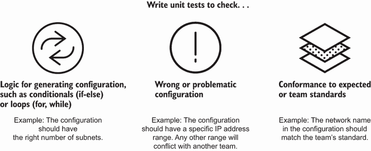

图 6.8 编写单元测试以验证资源逻辑，突出潜在问题或确定团队标准。

由于单元测试是在隔离状态下检查配置，它们并不能精确反映更改将如何影响系统。因此，你不能期望单元测试在生产更改期间防止重大故障。然而，你仍然应该编写单元测试！虽然它们在运行更改时不会识别问题，但单元测试可以在生产之前*预防*问题配置。

例如，有人可能会不小心为 1,000 台服务器而不是 10 台服务器输入配置。一个验证配置中服务器最大数量的测试可以防止某人压倒基础设施并管理成本。单元测试还可以防止从生产环境中出现任何不安全或不合规的基础设施配置。我在第八章中介绍了如何将单元测试应用于安全和审计基础设施配置。

除了早期识别错误的配置值之外，单元测试还有助于自动化检查复杂系统。当你有许多由不同团队管理的基础设施资源时，你不能再手动搜索一个资源列表并检查每个配置。单元测试将最重要的或标准配置传达给其他团队。当你为基础设施模块编写单元测试时，你验证模块的内部逻辑是否产生了预期的资源。

单元测试自动化

优秀的单元测试需要一本书来描述！我在本节中限定了对基础设施配置的测试解释。然而，你可能会编写一个直接访问基础设施 API 的定制自动化工具。自动化使用更顺序的方法逐步配置资源（也称为命令式风格）。

你应该使用单元测试来检查单个步骤及其幂等性。单元测试应该在各种先决条件下运行单个步骤，并检查它们是否具有相同的结果。如果你需要访问基础设施 API，你可以在单元测试中模拟 API 响应。

单元测试的用例包括检查你是否创建了预期的数量的基础设施资源，固定了特定版本的基础设施，或者使用了正确的命名标准。单元测试运行迅速，几乎零成本（在你编写它们之后！）提供快速反馈。它们的运行时间在秒级，因为它们不需要向基础设施发布更新或创建活动的基础设施资源。如果你编写单元测试来检查干运行的结果，你会因为生成干运行所花费的初始时间而增加一点时间。

## 6.3 合同测试

单元测试验证配置或模块的独立性，但模块之间的依赖关系怎么办？在第四章中，我提到了依赖关系之间合同的想法。一个模块的输出必须与另一个模块的预期输入一致。你可以使用测试来强制执行这种一致性。

例如，让我们在网络上创建一个服务器。服务器通过使用外观来访问网络名称和 IP 地址，该外观反映了网络的名称和 IP 地址范围。你如何知道网络模块输出的是网络名称和 IP CIDR 范围，而不是另一个标识符或配置？

你在图 6.9 中使用了合同测试来测试网络模块是否正确输出外观。外观必须包含网络名称和 IP 地址范围。如果测试失败，则表明服务器无法在网络中创建自身。

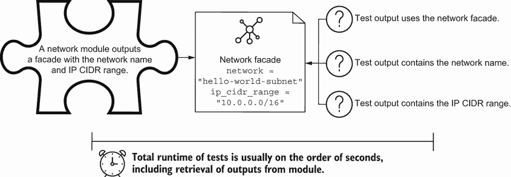

图 6.9 合同测试可以快速验证配置参数是否等于预期值，例如具有正确输出的网络外观。

*合同测试*通过静态分析来检查模块的输入和输出是否与预期值或格式匹配。

定义 *合同测试* 静态分析并比较模块或资源的输入和输出，以匹配预期值或格式。

合同测试有助于使单个模块具有可扩展性，同时保持两者之间的集成。当你有许多基础设施依赖项时，你不能手动检查它们的所有共享属性。相反，合同测试自动化了模块之间属性的类型和值的验证。

你会发现合同测试对于检查高度参数化模块（如工厂、原型或构建器模式）的输入和输出最有用。编写和运行合同测试有助于检测错误的输入和输出，并记录模块的最小资源。当你没有为你的模块编写合同测试时，你不会知道你在系统中破坏了什么，直到你下一次将配置应用到实际环境中。

让我们在列表 6.3 中实现服务器和网络合同测试。使用 pytest，你通过创建一个带有工厂模块的网络来设置测试。然后你验证网络输出是否包含具有网络名称和 IP 地址范围的外观对象。你将这些测试添加到服务器的单元测试中。

列表 6.3 比较模块输出与输入的合同测试

```
from network import NetworkFactoryModule, NetworkFacade
import pytest

network_name = 'hello-world'                                      ❶
network_cidr_range = '10.0.0.0/16'                                ❷

@pytest.fixture
def network_outputs():                                            ❸
   network = NetworkFactoryModule(                                ❹
       name=network_name,                                         ❹
       ip_range=network_cidr_range)                               ❹
   return network.outputs()                                       ❺

def test_network_output_is_facade(network_outputs):               ❻
   assert isinstance(network_outputs, NetworkFacade)              ❻

def test_network_output_has_network_name(network_outputs):        ❼
   assert network_outputs._network == f"{network_name}-subnet"    ❼

def test_network_output_has_ip_cidr_range(network_outputs):       ❽
   assert network_outputs._ip_cidr_range == network_cidr_range    ❽
```

❶ Pytest 将运行此测试以检查网络名称是否与预期值匹配，hello-world。

❷ Pytest 将运行此测试以检查网络输出的 IP CIDR 范围是否与 10.0.0.0/16 匹配。

❸ 使用网络工厂模块和返回其输出的固定装置设置测试

❹ 使用带有名称和 IP 地址范围的网络工厂模块创建网络

❺ 测试固定装置应返回具有不同输出属性的网络外观。

❻ Pytest 将运行此测试以检查模块是否输出网络外观对象。

❼ Pytest 将运行此测试以检查网络名称是否与预期值匹配，hello-world。

❽ Pytest 将运行此测试以检查网络输出的 IP CIDR 范围是否与 10.0.0.0/16 匹配。

假设你更新了网络模块，以输出网络 ID 而不是名称。这破坏了上游服务器模块的功能，因为服务器期望网络名称！合同测试确保当你更新任何一个模块时，你不会破坏两个模块之间的 *合同*（或接口）。使用合同测试来验证你在表达资源之间的依赖关系时使用的外观和适配器。

为什么你应该将示例合同测试添加到服务器，一个更高级的资源？你的服务器**期望**从网络获得特定的输出。如果网络模块发生变化，你希望首先从高级模块检测到它。

通常，一个高级模块应该推迟对低级模块的更改，以保持可组合性和可扩展性。你希望避免对低级模块的接口进行重大更改，因为这可能会影响依赖于它的其他模块。

领域特定语言

列表 6.3 使用 Python 验证模块输出。如果你使用具有 DSL 的工具，你可能能够使用内置功能来验证输入是否遵循某些类型或正则表达式（例如检查有效的 ID 或名称格式）。如果一个工具没有验证函数，你可能需要使用单独的测试框架来解析一个模块配置的输出类型，并将其与高级模块输入进行比较。

基础设施合同测试需要一种方法来提取预期的输入和输出，这可能涉及对基础设施提供商的 API 调用，并验证模块的响应是否符合预期值。有时这涉及到创建测试资源来检查参数和理解字段如 ID 应该如何结构化。当你需要执行 API 调用或创建临时资源时，你的合同测试可能比单元测试运行时间更长。

## 6.4 集成测试

你如何知道你可以将你的配置或模块更改应用到基础设施系统中？你需要将更改应用到测试环境中，并*动态分析*运行中的基础设施。*集成测试*针对测试环境运行，以验证模块或配置的成功更改。

定义*集成测试*针对测试环境运行，并动态分析基础设施资源，以验证它们是否受到模块或配置更改的影响。

集成测试需要一个隔离的测试环境来验证模块和资源的集成。在接下来的章节中，你将了解可以为基础设施模块和配置编写的集成测试。

### 6.4.1 测试模块

想象一个创建 GCP 服务器的模块。你想要确保你可以成功创建和更新服务器，因此你编写了一个集成测试，如图 6.10 所示。

首先，你配置服务器并将更改应用到测试环境中。然后，你运行集成测试以检查你的配置更新是否成功，创建一个服务器，并将其命名为`hello-world-test`。测试的总运行时间需要几分钟，因为你需要等待服务器配置完成。

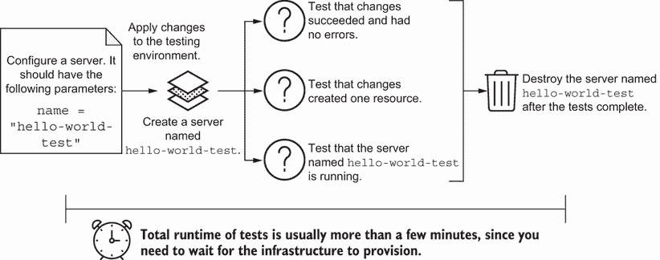

图 6.10 集成测试通常在测试环境中创建和更新基础设施资源，测试其配置和状态的正确性或可用性，并在测试后删除它们。

当你实现集成测试时，你需要比较活动资源与你的 IaC。活动资源告诉你你的模块是否成功部署。如果有人无法部署模块，他们可能破坏了他们的基础设施。

集成测试必须使用基础设施提供者的 API 获取活动资源的有关信息。例如，你可以在服务器模块的集成测试中导入一个 Python 库来访问 GCP API。集成测试导入 Libcloud，一个 Python 库，作为 GCP API 的客户端 SDK。

列表 6.4 中的测试通过使用模块构建服务器的配置，等待服务器部署，并在 GCP API 中检查服务器的状态。如果服务器返回 `running` 状态，则测试通过。否则，测试失败并识别模块中的问题。最后，测试会拆除它创建的测试服务器。

列表 6.4 test_integration.py 中的服务器创建集成测试

```
from libcloud.compute.types import NodeState                    ❶
from main import generate_json, SERVER_CONFIGURATION_FILE
import os
import pytest
import subprocess
import test_utils

TEST_SERVER_NAME = 'hello-world-test'

@pytest.fixture(scope='session')                                ❷
def apply_changes():                                            ❷
   generate_json(TEST_SERVER_NAME)                              ❸
   assert os.path.exists(SERVER_CONFIGURATION_FILE)             ❸
   assert test_utils.initialize() == 0                          ❹
   yield test_utils.apply()                                     ❹
   assert test_utils.destroy() == 0                             ❺
   os.remove(SERVER_CONFIGURATION_FILE)                         ❺

def test_changes_have_successful_return_code(apply_changes):    ❻
   return_code = apply_changes[0]
   assert return_code == 0

def test_changes_should_have_no_errors(apply_changes):          ❼
   errors = apply_changes[2]
   assert errors == b''

def test_changes_should_add_1_resource(apply_changes):          ❽
   output = apply_changes[1].decode(encoding='utf-8').split('\n')
   assert 'Apply complete! Resources: 1 added, 0 changed, ' + \
      '0 destroyed' in output[-2]

def test_server_is_in_running_state(apply_changes):             ❾
   gcp_server = test_utils.get_server(TEST_SERVER_NAME)         ❾
   assert gcp_server.state == NodeState.RUNNING                 ❾
```

❶ Pytest 使用 Libcloud 调用 GCP API 并获取服务器的当前状态。它检查服务器是否正在运行。

❷ 在测试会话期间，使用 pytest 测试 fixture 应用配置并在 GCP 上创建测试服务器

❸ 生成一个使用服务器模块的 Terraform JSON 文件

❹ 使用 Terraform，通过 Terraform JSON 文件初始化和部署服务器

❺ 在测试会话结束时使用 Terraform 删除测试服务器并移除 JSON 配置文件

❻ Pytest 将运行此测试以验证更改的输出状态是否成功。

❼ Pytest 将运行此测试以验证更改不会返回错误。

❽ Pytest 将运行此测试并检查配置是否添加了一个资源，即服务器。

❾ Pytest 使用 Libcloud 调用 GCP API 并获取服务器的当前状态。它检查服务器是否正在运行。

AWS 和 Azure 的等效项

要转换列表 6.4，你需要更新 IaC 以创建一个 Amazon EC2 实例或 Azure Linux 虚拟机。然后你需要更新 Apache Libcloud 驱动程序以使用 Amazon EC2 驱动程序 ([`mng.bz/qYex`](https://shortener.manning.com/qYex)) 或 Azure ARM Compute 驱动程序 ([`mng.bz/7yjQ`](https://shortener.manning.com/7yjQ))。驱动程序和 IaC 的初始化将发生变化，但测试不会。

当你在命令行中运行此文件中的测试时，你会注意到它需要几分钟的时间，因为测试会话会创建并删除服务器：

```
$ pytest test_integration.py
========================== test session starts =========================
collected 4 items

test_integration.py ....                                          [100%]

==================== 4 passed in 171.31s (0:02:51) =====================
```

服务器集成测试应用了两种主要实践。首先，测试遵循以下顺序：

1.  如果适用，渲染配置

1.  将更改部署到基础设施资源

1.  运行测试，访问基础设施提供者的 API 进行比较

1.  如果适用，删除基础设施资源。

此示例使用 fixture 实现了序列。你可以用它来应用任何任意的基础设施配置，并在测试后移除它。

注意 集成测试对于配置管理工具的工作方式非常相似。例如，你可以在服务器上安装软件包并运行进程。在运行测试后，你可以通过检查服务器的软件包和进程以及销毁服务器来扩展服务器集成测试。与其使用编程语言编写测试，我建议评估专门的服务器测试工具，该工具登录到服务器并针对系统运行测试。

其次，你在远离支持应用程序的测试或生产环境的单独 *模块测试环境*（例如测试账户或项目）中运行模块集成测试。为了避免与环境中其他模块测试发生冲突，你根据特定的模块类型、版本或提交哈希对资源进行标记和命名。

定义 A *模块测试环境* 是与生产环境分开的，用于测试模块更改。

在与测试或生产环境不同的环境中测试模块有助于将失败的模块与具有应用程序的活跃环境隔离。你还可以从测试模块中测量和控制你的基础设施成本。第十二章更详细地介绍了云计算的成本。

### 6.4.2 环境配置测试

基础设施模块的集成测试可以在测试环境中创建和删除资源，但环境配置的集成测试则不能。想象一下，你需要向由组合或单例配置设置的当前域名添加一个 A 记录。你该如何编写集成测试来检查你是否正确添加了该记录？

你会遇到两个问题。首先，你不能简单地在集成测试中创建和销毁 DNS 记录，因为这可能会影响应用程序。其次，A 记录的存在依赖于在配置域名之前的服务器 IP 地址。

而不是在测试环境中创建和销毁服务器和 A 记录，你可以在与生产环境匹配的 *持久性* 测试环境中运行集成测试。在图 6.11 中，你更新测试环境的 IaC 中的 DNS 记录。你的集成测试检查测试环境中的 DNS 是否与预期的正确 DNS 记录匹配。测试通过后，你可以更新生产环境的 DNS 记录。

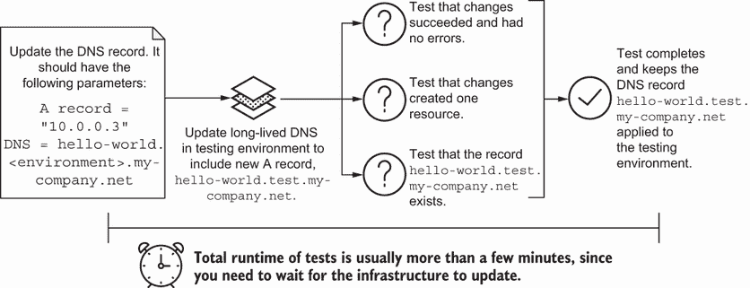

图 6.11 你可以对具有长期资源的测试环境运行集成测试，以隔离生产环境中的更改并减少你需要为测试创建的依赖。

为什么要在 *持久性* 测试环境中运行 DNS 测试？首先，创建测试环境可能需要很长时间。作为高级资源，DNS 依赖于许多低级资源。其次，你希望在更新生产环境之前，对更改的行为有一个准确的表示。

测试环境捕获了生产系统的一部分依赖和复杂性，以便您可以检查您的配置是否按预期工作。保持与生产环境相似的测试环境意味着测试中的变化可以提供一个准确的生产行为视角。您希望尽早检测测试环境中的问题。

### 6.4.3 测试挑战

没有集成测试，您将不知道服务器模块或 DNS 记录更新是否成功，直到您手动检查。它们加快了验证您的 IaC 是否工作的过程。然而，您在集成测试中会遇到一些挑战。

您可能难以确定要测试哪些配置参数。您是否应该编写集成测试来验证您在基础设施即代码（IaC）中配置的每个配置参数是否与实际资源匹配？不一定！

大多数工具已经具有*验收测试*，这些测试会创建一个资源，更新其配置，然后销毁该资源。验收测试可以证明工具能够发布新的代码更改。这些测试必须通过，以便工具能够支持基础设施的更改。

您不希望花费额外的时间或精力编写与验收测试相匹配的测试。因此，您的集成测试应该涵盖*多个*资源是否具有正确的配置和依赖关系。如果您编写自定义自动化，您将需要编写集成测试来创建、更新和删除资源。

另一个挑战涉及决定在每个测试期间是否应该创建或删除资源，或者运行持久测试环境。图 6.12 显示了是否为集成测试创建、删除或使用持久测试环境的决策树。

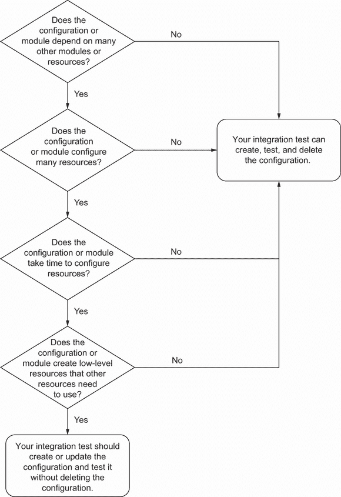

图 6.12 您的集成测试应根据模块或配置类型及其依赖关系创建和删除资源。

通常情况下，如果一个配置或模块没有太多依赖，您可以创建、测试和删除它。然而，如果您的配置或模块创建需要花费时间或需要许多其他资源的存在，您将需要使用持久测试环境。

并非所有模块都从创建和删除的集成测试方法中受益。我建议为低级模块，如网络或 DNS，运行集成测试，并避免删除资源。这些模块通常需要在具有最小财务成本的环境中就地更新。我经常发现测试更新比创建和删除资源更现实。

中级模块（如工作负载编排器）的集成测试创建的资源可能是持久的或临时的，这取决于模块和资源的大小。模块越大，需要长期存在的可能性就越高。你可以为高级模块（如应用部署或 SaaS）运行集成测试，每次都创建和删除资源。

持久的测试环境确实有其局限性。集成测试通常需要很长时间才能运行，因为创建或更新资源需要时间。一般来说，保持模块较小，资源较少。这种做法可以减少你需要进行模块集成测试的时间。

即使你保持配置和模块较小，资源较少，集成测试也常常成为你基础设施提供商账单成本增加的罪魁祸首。许多测试需要长期资源，如网络、网关等。权衡运行集成测试和发现问题与配置错误或损坏的基础设施资源成本之间的关系。

你可以考虑使用基础设施模拟来降低运行集成测试（或任何测试）的成本。一些框架为本地测试复制了基础设施提供者的 API。我不建议过度依赖模拟。基础设施提供者经常更改 API，并且经常有复杂的错误和行为，这些模拟通常无法捕捉。在第十二章中，我讨论了管理测试环境成本和避免模拟的技术。

## 6.5 端到端测试

虽然集成测试在资源创建或更新期间动态分析配置并捕获错误，但它们并不表明基础设施资源是否*可用*。可用性要求你或团队成员按预期使用该资源。

例如，你可能会使用一个模块在 GCP Cloud Run 上创建一个名为*服务*的应用程序。GCP Cloud Run 将任何服务部署到容器中，并返回一个 URL 端点。你的集成测试通过，表明你的模块正确创建了服务资源以及访问服务的权限。

你如何知道某人能否访问应用程序 URL？图 6.13 显示了如何检查服务端点是否工作。首先，你编写一个测试来从你的基础设施配置中检索应用程序 URL 作为输出。然后，你向该 URL 发出 HTTP 请求。总运行时间需要几分钟，其中大部分时间用于创建服务。

你已经创建了一个与集成测试不同的动态分析测试，称为*端到端测试*。它验证了基础设施的最终用户功能。

定义*端到端测试*动态分析基础设施资源和端到端系统功能，以验证它们是否受到 IaC 更改的影响。

示例端到端测试验证了最终用户访问页面的端到端工作流程。它**不**检查基础设施配置的成功配置。

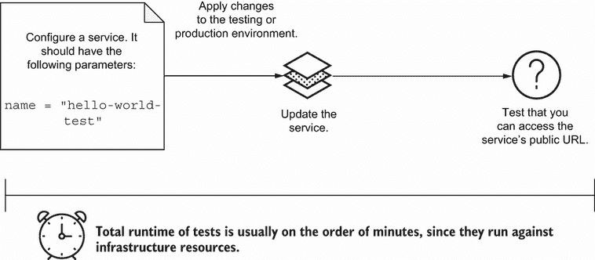

图 6.13 端到端测试通过访问应用程序的 URL 中的网页来验证最终用户的流程。

端到端测试对于确保你的更改不会破坏上游功能至关重要。例如，你可能会意外更新一个允许认证用户访问 GCP Cloud Run 服务 URL 的配置。更改后，你的端到端测试失败，表明有人可能无法再访问该服务。

让我们在下面的列表中实现一个在 Python 中针对应用程序 URL 的端到端测试。此示例的测试需要向服务的公共 URL 发送 API 请求。它使用 pytest 夹具创建 GCP Cloud Run 服务，测试运行页面的 URL，并从测试环境中删除服务。

列表 6.5 GCP Cloud Run 服务的端到端测试

```
from main import generate_json, SERVICE_CONFIGURATION_FILE
import os
import pytest
import requests                       
import test_utils                                                     ❶

TEST_SERVICE_NAME = 'hello-world-test'

@pytest.fixture(scope='session')                                      ❷
def apply_changes():                                                  ❷
   generate_json(TEST_SERVICE_NAME)                                   ❸
   assert os.path.exists(SERVICE_CONFIGURATION_FILE)                  ❸
   assert test_utils.initialize() == 0                                ❷
   yield test_utils.apply()                                           ❷
   assert test_utils.destroy() == 0                                   ❹
   os.remove(SERVICE_CONFIGURATION_FILE)                              ❹

@pytest.fixture                                                       ❺
def url():                                                            ❺
   output, error = test_utils.output('url')                           ❺
   assert error == b''                                                ❺
   service_url = output.decode(encoding='utf-8').split('\n')[0]       ❺
   return service_url                                                 ❺

def test_url_for_service_returns_running_page(apply_changes, url):    ❻
   response = requests.get(url)                                       ❻
   assert "It's running!" in response.text                            ❼
```

❶ 使用 Terraform，通过 Terraform JSON 文件初始化和部署服务

❷ 在测试会话期间，使用 pytest 测试夹具应用配置并在 GCP 上创建测试服务

❸ 生成一个使用 GCP Cloud Run 模块的 Terraform JSON 文件

❹ 在测试环境中销毁 GCP Cloud Run 服务，这样你就不需要在 GCP 项目中有一个持久的服务

❺ 使用 pytest 夹具解析服务 URL 配置的输出

❻ 在测试中，使用 Python 的 requests 库向服务的 URL 发送 API 请求

❼ 在测试中，检查包含特定字符串的服务 URL 响应，以指示服务正在运行

AWS 和 Azure 的等效产品

AWS Fargate 与 Amazon Elastic Kubernetes Service (EKS) 或 Azure Container Instances (ACI) 大约等同于 GCP Cloud Run。

注意，如果你想在生产环境中运行端到端测试，你不想删除服务。你通常会在现有环境中运行端到端测试，而不是创建新的或测试资源。你将对现有系统应用更改，并在活动基础设施资源上运行测试。

烟雾测试

作为一种端到端测试，烟雾测试可以快速提供有关更改是否破坏了关键业务功能的反馈。运行所有端到端测试可能需要时间，你需要快速修复更改失败。

如果你首先运行烟雾测试，你可以验证更改没有造成灾难性的后果，然后继续进行进一步测试。正如一位质量保证分析师曾经告诉我的，“如果你启动一些硬件并且它冒烟，你就知道有问题。不值得你花时间去进一步测试。”

更复杂的系统架构受益于端到端测试，因为它们成为更改是否影响关键业务功能的主要指标。因此，它们有助于测试组合或单例配置。除非模块具有许多资源和依赖项，否则通常不会在模块上运行端到端测试。

我为网络或计算资源编写了大部分端到端测试。例如，你可以编写一些测试来检查网络对等。这些测试在每个网络上配置一个服务器，并检查服务器是否可以连接。

端到端测试的另一个用例是向工作负载协调器提交一个作业并完成它。这个测试确定工作负载协调器是否在应用部署方面正常工作。我曾经包含了一些端到端测试，这些测试使用不同负载的 HTTP 请求来确保上游服务可以互相调用而不会中断，无论负载大小或协议。

除了网络或计算用例之外，端到端测试可以验证任何系统的预期行为。如果你使用配置管理工具进行配置，你的端到端测试将验证你是否可以连接到服务器并运行预期的功能。对于监控和警报，你可以运行端到端测试来模拟预期的系统行为，验证是否已收集指标，并测试警报的触发。

然而，端到端测试在时间和资源方面是最昂贵的测试。大多数端到端测试需要所有基础设施资源来完全评估系统。因此，你可能只针对生产基础设施运行端到端测试。你可能在测试环境中无法运行它们，因为为测试获取足够的资源通常花费太多金钱。

## 6.6 其他测试

你可能会遇到单元、契约、集成和端到端测试之外的测试类型。例如，假设你想要将减少内存的配置更改部署到生产服务器。然而，你不知道内存减少是否会影响整个系统。

图 6.14 显示，你可以通过使用系统监控来检查你的更改是否影响了系统。监控持续聚合服务器内存上的指标。如果你收到服务器内存达到其容量百分比的警报，你知道你可能影响了整个系统。

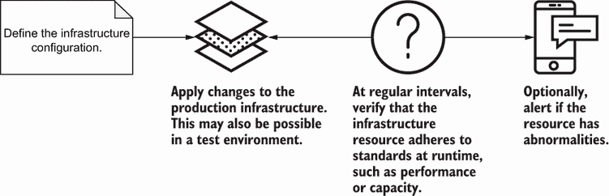

图 6.14 短时间间隔内运行的连续测试，以验证一组指标是否不超过阈值。

监控通过“测试”实现 *连续测试*，以检查指标是否在规律、频繁的时间间隔内超过阈值。

定义 *连续测试*（例如监控）在规律、频繁的时间间隔内运行，以检查当前值是否与预期值匹配。

连续测试包括监控系统指标和安全事件（当 root 用户登录到服务器时）。它们在活动基础设施环境中提供动态分析。大多数连续测试以警报的形式出现，通知你任何问题。

你可能会遇到另一种称为**回归测试**的测试类型。例如，你可能会在一段时间内运行测试，以检查你的服务器配置是否符合你组织的期望。回归测试定期运行，但频率低于监控或其他形式的持续测试。你可以选择每隔几周或几个月运行它们，以检查异常情况。

定义**回归测试**在较长时间内定期运行，以检查基础设施配置是否符合预期的状态或功能。它们可以帮助缓解配置漂移。

持续和回归测试通常需要特殊的软件或系统来运行。它们确保运行的基础设施具有预期的功能和性能。这些测试还为自动化系统以响应异常奠定了基础。

例如，配置了基础设施即代码（IaC）和持续测试的系统可以使用自动扩展来根据 CPU 或内存等指标调整资源。这些系统还可以实施其他自我修复机制，例如在出现错误时将流量重定向到应用程序的旧版本。

## 6.7 选择测试

我解释了基础设施中最常见的测试，从单元测试到端到端测试。然而，你是否需要编写所有这些测试？你在编写它们时应该在哪里投入时间和精力？你的**基础设施测试策略**将根据你系统的复杂性和增长而演变。因此，你将不断评估哪些测试能帮助你捕捉到生产前的配置问题。

我将金字塔形状作为基础设施测试策略的**指南**。在图 6.15 中，金字塔最宽的部分表示你应该有更多这种类型的测试，而最窄的部分表示你应该有更少的测试。金字塔的顶部是端到端测试，由于它们需要活跃的基础设施系统，因此可能需要更多的时间和金钱。金字塔的底部是单元测试，它们可以在几秒钟内运行，并且不需要整个基础设施系统。

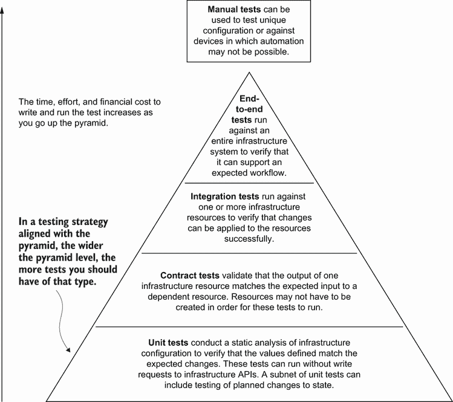

图 6.15 根据测试金字塔，你应该有比端到端测试更多的单元测试，因为运行它们花费的时间、金钱和资源更少。

这个被称为**测试金字塔**的指南为不同类型的测试、它们的范围和频率提供了一个框架。我将测试金字塔从软件测试改编到基础设施，修改了它以适应基础设施工具和约束。

定义**测试金字塔**作为你整体测试策略的指南。随着你向上移动金字塔，测试类型将花费更多的时间和金钱。

实际上，你的测试金字塔可能更像是一个矩形或梨形，有时会有缺失的层级。你**不会**，**也不应该**为每种基础设施配置编写每种类型的测试。在某个时候，测试变得重复且难以维护。

根据你想要测试的系统，可能无法在实际中完全遵循理想的测试金字塔。然而，避免我戏称为*测试路标*的做法。路标倾向于许多手动测试，而其他方面则很少。

### 6.7.1 模块测试策略

在第五章中，我提到了在发布模块之前测试模块的做法。让我们回到那个例子，你更新了一个数据库模块到 PostgreSQL 12。而不是手动创建模块并测试其是否工作，你添加了一系列自动化测试。它们检查模块的格式并创建一个在隔离的模块测试环境中的数据库。

图 6.16 更新了模块发布工作流程，其中包含了你可以添加以检查模块是否正常工作的单元测试、契约测试和集成测试。在契约测试通过后，你运行一个集成测试，在网络上设置数据库模块并检查数据库是否运行。完成集成测试后，你删除由模块创建的测试数据库并发布模块。

单元测试、契约测试和集成测试的组合可以充分代表模块是否能够正确工作。单元测试检查模块格式和你的团队的标准配置。你首先运行它们，以便快速获得关于格式或配置违规的反馈。


图 6.16 你可以将模块发布工作流程的测试阶段分解为包括单元测试、契约测试和集成测试。

接下来，你运行一些契约测试。在数据库模块的情况下，你检查输入到数据库模块的网络 ID 是否与网络模块输出的网络 ID 匹配。捕捉这些错误将有助于在部署过程中早期识别依赖项之间的问题。

专注于单元测试或契约测试，以确保适当的配置、正确的模块逻辑以及特定的输入和输出。图 6.16 中概述的测试工作流程最适合使用工厂、构建器或原型模式的模块。这些模式隔离了基础设施组件的最小子集，并为你的队友提供了一组灵活的变量，以便进行定制。

根据你的开发环境成本，你可以编写一些集成测试，针对临时基础设施资源运行，并在测试结束时删除这些资源。通过投入一些时间和精力来编写具有许多输入和输出的模块的测试，你可以确保更改不会影响上游配置，并且该模块可以独立成功运行。

练习 6.1

你注意到负载均衡器模块的新版本破坏了你的 DNS 配置。一位队友更新了该模块，使其输出私有 IP 地址而不是公共 IP 地址。你能做些什么来帮助你的团队更好地记住该模块需要公共 IP 地址？

A) 为私有 IP 地址创建一个单独的负载均衡器模块。

B) 添加模块合同测试，以验证模块输出私有和公开 IP 地址。

C) 在模块的文档中添加备注，说明它需要公开 IP 地址。

D) 在模块上运行集成测试，并检查 IP 地址是否公开可访问。

请参阅附录 B 以获取练习的答案。

### 6.7.2 配置测试策略

活动环境的配置使用更复杂的模式，如单例或组合。单例或组合配置有许多基础设施依赖项，并且经常引用其他模块。将端到端测试添加到你的测试工作流程中可以帮助识别基础设施和模块之间的问题。

想象一下，你有一个单例配置，其中包含一个网络上的应用服务器。图 6.17 概述了在更新服务器大小后的每个步骤。在将更改推送到版本控制后，你将更改部署到测试环境。你的测试工作流程从单元测试开始，以快速验证格式和配置。

接下来，你运行集成测试以应用更改并验证服务器是否仍在运行以及具有新的大小。你通过使用端到端测试来测试整个系统来完成你的验证。端到端测试向应用程序端点发出 HTTP GET 请求。图 6.17 在生产中重复此过程以确保系统没有损坏。

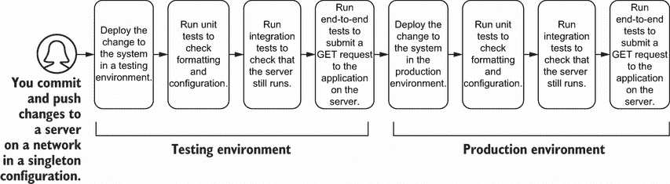

图 6.17 使用单例和组合模式进行 IaC 应该在将更改部署到生产之前在测试环境中运行单元、集成和端到端测试。

仅因为你成功创建或更新了服务器，并不意味着它所托管的应用程序可以处理请求！在复杂的系统架构中，你需要额外的测试来验证基础设施之间的依赖或通信。端到端测试可以帮助保持系统的功能。

在测试和生产环境之间重复相同的测试提供质量控制。如果你在测试和生产环境之间存在任何配置漂移，你的测试可能会反映这些差异。你可以根据环境启用或禁用特定测试。

镜像构建和配置管理

镜像构建和配置管理工具的测试遵循与测试配置工具配置类似的方法。单元测试镜像构建或配置管理元数据涉及检查配置。除非你模块化配置管理，并遵循模块的测试方法，否则你不需要合同测试。集成测试应在测试环境中运行，以测试服务器是否能够使用新镜像成功启动或应用正确的配置。端到端测试确保你的新镜像和配置不会影响系统的功能。

练习 6.2

你添加防火墙规则以允许应用程序访问新的队列。对于这个更改，哪种测试组合对你的团队最有价值？

A) 单元和集成测试

B) 合同和端到端测试

C) 合同和集成测试

D) 单元和端到端测试

请参阅附录 B 以获取练习的答案。

### 6.7.3 识别有用的测试

模块和配置的测试策略可以帮助指导你编写有价值测试的初始方法。图 6.18 总结了你可能考虑用于模块和配置的测试类型。模块依赖于单元、合同和集成测试，而配置依赖于单元、集成和端到端测试。

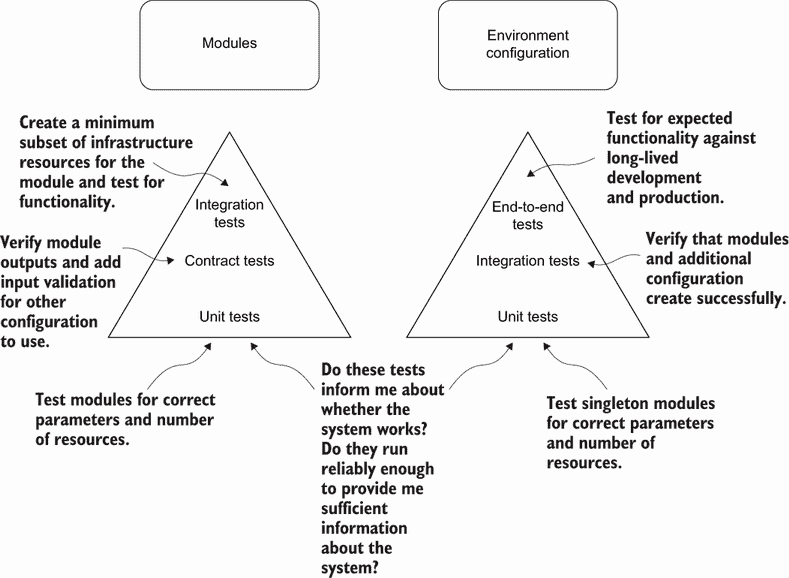

图 6.18 你编写模块或环境配置时，你的测试方法会有所不同。

你如何知道何时编写测试？想象一下，你的队友可能知道数据库密码需要是 16 位数的字母数字字符。然而，你可能直到更新一个 24 位密码、部署更改并等待五分钟以查看更改是否失败，才知道这个事实。

我认为更新测试的做法是将系统中的未知已知转化为已知已知。毕竟，你使用可观察性来调试未知未知，使用监控来跟踪已知未知。在图 6.19 中，你将其他人可能知道但孤立的（未知已知）知识转化为测试（已知已知），以反映团队的知识。新的测试通常反映了团队应该知道并承认的孤岛知识。

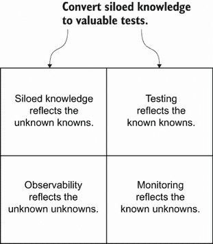

图 6.19 展示了基础设施测试如何将孤岛知识（其他人可能知道的知识）转化为测试，以反映团队的知识。

一个好的测试会将知识分享给团队的其他成员。你不必总是构建一个新的测试。相反，你可能找到一个现有的测试，它没有检查所有内容。使用测试来防止你的团队重复出现相同的问题。

除了添加测试，你还将移除测试。你可能编写了一个测试，但发现它有一半的时间会失败。由于其不可靠性，它并没有提供有用的信息，也没有增加你对系统的信心。移除测试可以清理你的测试套件，并帮助消除那些经常失败但并不表明系统真正失败的不可靠测试。

此外，你将移除测试，因为你可能不需要它们。例如，你可能不需要为每个模块编写合同测试，或者为每个环境配置编写集成测试。始终问自己测试是否提供了价值，以及它们是否运行得足够可靠，以便你能够获得足够的信息来了解系统。

下一章将展示如何为你的 IaC 添加测试到交付管道。即使你选择不自动化测试工作流程，你也有机会检查更改可能如何影响你的基础设施。

## 摘要

+   测试金字塔概述了一种测试方法。金字塔中测试级别越高，测试成本越高。

+   单元测试验证模块或配置中的静态参数。

+   合同测试验证模块的输入和输出是否与预期值和格式匹配。

+   集成测试创建测试资源，验证其配置和创建，然后删除它们。

+   端到端测试验证基础设施系统的最终用户能否运行预期的功能。

+   使用工厂、构建器或原型模式的模块可以从单元、合同和集成测试中受益。

+   在环境中应用组合或单例模式配置可以从单元、集成和端到端测试中受益。

+   其他测试包括持续监测系统指标、回归测试用于处理带外手动更改，或安全测试用于配置错误。
