# 7 持续交付和分支模型

本章涵盖

+   设计交付管道以避免将失败推送到生产系统

+   为团队协作选择基础设施配置的分支模型

+   审查和管理团队内部基础设施资源的变更

在前面的章节中，你学习了如何编写模块和依赖项的模式。你还应用了一些编写基础设施代码和共享模块的一般实践。这些模式、实践和工作流程有很多步骤。

此外，许多工作流程需要仔细协调变更。有一天，你可能会尝试进行一个变更，却发现你的队友的更新可能会覆盖你的变更！你如何确保你在开发过程中管理好冲突？

一种解决方案是向票务系统提交变更请求。例如，如果你想更改服务器，你需要在票务系统中填写变更请求。然后，这个变更请求将由你的同行（通常是你的团队）和变更咨询委员会（代表公司）进行审查。

大多数公司使用这个被称为*变更管理*的过程来确定哪些变更存在冲突。基础设施变更管理涉及提交一个变更请求，详细说明部署和回滚步骤，供同行审查批准。

定义*变更管理*对于基础设施来说是一个促进系统变更的过程。它通常涉及在批准投入生产之前，在整个公司中详细审查和审查变更。

变更管理依赖于同行审查，以防止变更相互覆盖。示例中的同行审查和变更咨询委员会充当质量门。*质量门*验证变更请求不会损害系统的安全或可用性。一旦你的变更通过了这些门，你就可以安排它并相应地更新服务器。

定义*IaC*的*质量门*通过审查或测试来强制执行系统的安全性、可用性和弹性。

变更管理和质量门如何帮助解决变更之间的冲突？想象一下，你将变更管理流程应用于你和你的队友的冲突变更。在图 7.1 中，你和你的队友向票务系统提交变更请求。组织内的同行手动审查每个变更，并确定你的队友的变更对用户的影响最小。他们重新安排你的变更，以避免与你的队友的变更冲突。

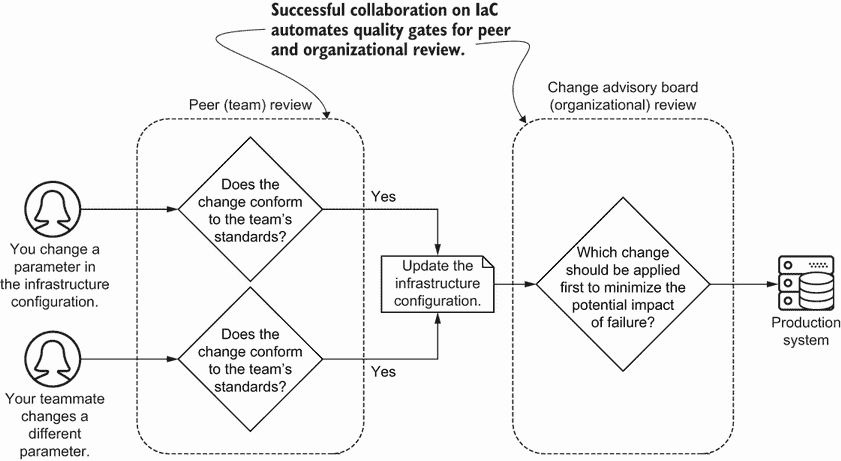

图 7.1 IaC 的协作涉及简化同行和组织审查变更的过程。

变更管理可能需要几周才能完成。人工审查无法发现每个问题或防止每个基础设施变更冲突。你仍然需要了解如何撤销变更。你将在第十一章学习如何修复变更失败。

而不是依赖变更管理，你可以使用基础设施即代码（IaC）通过代码来*沟通*变更并*自动化*变更管理。本章重点介绍通过扩展和自动化团队和公司内的 IaC 开发流程来简化变更管理。你将面临在尝试不破坏生产系统的情况下，同时处理同一或依赖资源上工作的挑战。

构建和配置管理

在整本书中，我专注于基础设施供应的使用案例。构建和配置管理的使用案例应遵循本章中交付管道的一般模式。评估基础设施更改和纳入自动化测试的模式和实践对所有使用案例都是一致的。

## 7.1 将更改交付到生产环境

你如何控制 IaC 对生产环境的更改？你应用软件开发实践，如持续集成、交付或部署（CI/CD），来组织来自各种协作者的代码更改，并准备将 IaC 发布到生产环境。

CI/CD 需要自动化测试来自动化更改的发布和管理。我将解释你如何自动化基础设施更改并充分利用其优势。它使用你在上一章中学到的测试实践以及本章中的交付管道模式。

### 7.1.1 持续集成

回想一下你与队友遇到的 IaC 冲突。你不知道你的队友的更改会影响你的，反之亦然。你如何在同行审查你的更改之前自动识别冲突？

图 7.2 中的一个解决方案是要求你的团队定期将其更改合并到主 IaC 中。如果你的团队持续地将更改*集成*到主配置中，你和你的队友可以更早地识别冲突，在它们覆盖你的更新之前。

你可以将*持续集成*（CI）的实践应用到合并更改到主配置中，每天多次，并检查它们是否与协作者冲突。

对于 IaC，*持续集成*（CI）的定义是在测试环境中验证更改后，定期和频繁地将更改合并到你的存储库中。

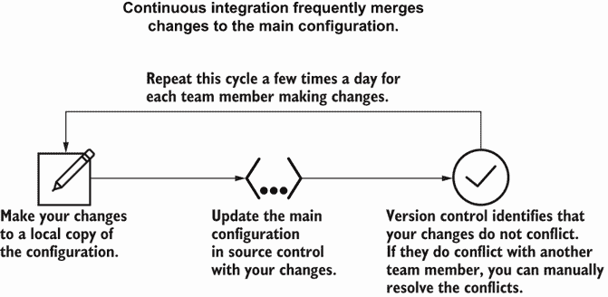

图 7.2 持续集成涉及频繁地将更改合并到主配置中，从而允许更早地识别更改中的冲突。

你应该多久合并一次？知道何时合并需要一些经验，并取决于你想要进行的更改类型。作为一个一般规则，当我积累了几行配置更改（可能）不会破坏系统时，我会合并。有时，这意味着我一天内可能合并几次。有时，对于困难的更改，我可能一天只合并一次或两次。其余的团队也会继续每天几次地工作并合并他们的更改。

每当团队成员合并他们的更改时，构建工具（如 CI 框架）应该启动一个工作流程来测试更改并将它们部署。图 7.3 显示了构建工具可能运行的一个示例工作流程。该工作流程检查 IaC 的合并冲突，运行单元测试以验证格式，并暂停进行同行评审。一旦通过同行评审，构建工具将更改部署到生产环境。

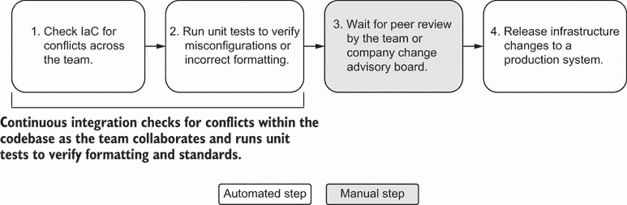

图 7.3 在交付管道中的 CI 包括在等待手动批准到生产之前自动化的单元测试。

你可以将这个工作流程表达为*交付管道*的一部分。管道组织并自动化一系列阶段，用于构建、测试、部署和发布你的基础设施即代码（IaC）。

定义 IaC 的*交付管道*表达并自动化一个工作流程，用于构建、测试、部署和发布对基础设施的更改。

基础设施交付管道首先检查配置冲突或语法问题。CI 管道中的单元测试让你有信心没有更改冲突。然后你可以将更改提交给团队或公司进行审查。管道会自动将其发布（或应用）到生产环境中。

为什么你应该设计一个交付管道并将其添加到构建工具中？你可能不会记得发布更改到生产所需的全部步骤。交付管道将过程编码化，这样你就不需要记住它。同意基础设施的交付管道可以帮助你一致且可重复地扩展基础设施更改，无论基础设施资源如何。

### 7.1.2 持续交付

你使用了持续集成（CI）来合并更改并检查冲突，但你如何知道系统是否按预期运行？CI 验证格式和标准，但你不知道配置是否在发布前工作。你对单元测试有信心，但你需要更多的测试来对更新感到舒适。

图 7.4 重新构想了你为 IaC 开始的 CI 工作流程。你在单元测试之后更新你的交付管道，添加额外的阶段。在提交更改进行同行评审之前，你将配置部署到测试环境，并使用集成和端到端测试进行测试。同行评审后，你*交付*更改到生产，并重新运行端到端测试以验证生产功能。

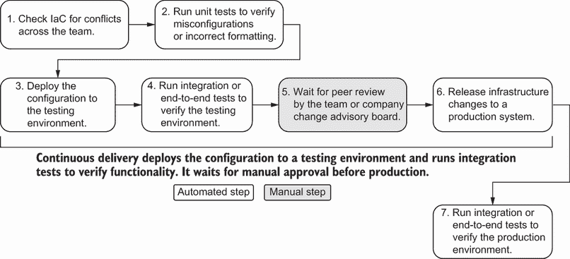

图 7.4 持续交付自动在测试环境中部署和运行基础设施更改，并等待手动批准到生产。

你通过实践*持续交付*（*CD*）扩展了你的交付管道。CD 在通过单元测试后，将你的基础设施配置部署到测试环境进行集成或端到端测试的步骤添加到你的交付管道中。

定义 *持续交付* (*CD*) 对于基础设施即代码 (IaC)，在将您的更改合并到存储库后，将基础设施更改部署到测试环境进行集成或端到端测试。在将更改发布到生产环境之前，它可能涉及一个手动质量关卡。

每当有人将更改推送到源代码控制时，它就会启动管道的工作流程，以在测试环境中验证这些更改。一旦集成和端到端测试通过，管道可以等待人工审批，然后再将更改部署到生产环境。

为什么使用 CD 而不是 CI？CD 包含了您在第六章中努力编写的所有自动化测试。此外，其交付管道包括 *作为质量关卡* 的测试。审查您更改的队友可能会对测试是否验证更改实现更有信心。

注意 持续交付需要整本书来介绍！我已经直接将其应用于基础设施，并试图在单节中涵盖它。如果您想查看一个更实际的例子，我创建了一个示例管道，[`mng.bz/mOy8`](http://mng.bz/mOy8)。该管道使用 GitHub Actions 将 hello-world 服务部署到 Google Cloud Run。其阶段包括单元测试、测试环境部署和集成测试。

CD 应该涉及对代码的小幅度和频繁更改。您将这些更改自动推送到测试环境，并在将其推送到生产环境之前等待人工审批。然而，等待人工审批的更改会像交通堵塞一样积累。几辆减速的汽车可能会连锁反应到许多汽车，最终影响您的预期到达时间！

人工审批步骤会构建一批更改，这会引入一些问题。当您在图 7.5 中推送大量更改到生产环境时，您需要等待系统处理和部署这些更改。不幸的是，您也可能引入了意外的失败，因为一些更改存在冲突。您的团队可能需要花费数天时间追踪导致失败的更改组合。

当您使用 CD 时，尽可能快速地审批更改。为人工审批实施更短的反馈周期。您还可以限制一次审批的更改数量。这两种解决方案都减轻了人工审批引入的一些风险。我将在下一节中介绍另一种解决方案，该方案完全省略了人工审批过程。

### 7.1.3 持续部署

您能否通过在交付管道中消除人工阶段来防止大量更改？您可以！然而，在移除人工审批之前，您必须练习 CI/CD。

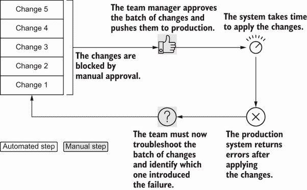

图 7.5 避免在引入人工审批时推送大量更改到生产环境，以防止复杂的故障排除。

从您的管道中移除手动批准意味着您必须对您的*测试*有信心。图 7.6 中的管道增加了更多的集成和端到端测试来验证系统，并自动将更改推送到生产环境。您有信心认为您的测试充分检查了系统功能，并且您可以轻松地撤销更改。您移除了手动批准，并立即将更改提升到生产环境。

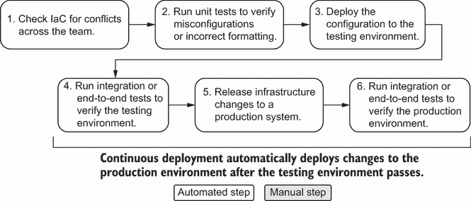

图 7.6 持续部署完全自动化了测试和将更改应用到生产的过程。

*持续部署*消除了手动批准步骤，并直接从测试环境将更改提升到生产。

定义*IaC 的持续部署*：将基础设施更改部署和测试到测试环境，并在测试通过时自动将更改提升到生产。

自动部署防止了更改的拥堵。推送基础设施更改通常需要数小时，并影响未知依赖项。如果您有全面的测试策略和修复故障的熟悉度，您可以使用持续部署进行基础设施。

使用第十一章中的技术来修复故障可以帮助您练习持续部署。然而，大多数组织并没有完全接受持续部署用于他们的基础设施，因为他们对测试或撤销更改没有信心。在这些模式上投入时间和实践可以帮助您更接近持续部署模型。

### 7.1.4 选择交付方法

持续交付和部署创建了一个工作流程，用于测试和将 IaC 交付到生产环境。然而，您不能期望您的组织对直接自动化所有更改到生产感到舒适！我建议将持续交付和部署应用于基础设施变更管理。首先，您必须在选择交付方法之前对您实施的更改类型进行分类。

基础设施更改的类型

变更类型影响您将其交付到生产的方式。您需要与您组织的变更审查委员会合作，对变更类型进行分类，并为每个变更自动化测试和审查。否则，您可能会发现自己不符合审计要求。

想象一下，您每周都会对服务器进行常规更改。您使用新的标签更新服务器的 IaC。自动化从未改变，并且很少失败。当它确实失败时，您知道如何修复它。服务器的常规更改成为持续部署的良好候选。

在图 7.7 中，您将服务器更改直接连续部署到生产环境，无需手动批准。管道在测试环境之后替换了手动批准步骤，用测试来检查提交信息中的前缀。您的服务器更改具有`标准`更改的提交信息，因此管道绕过了手动批准。

你通常会定期对你的基础设施进行*标准变更*。标准变更的例子包括在编排器中升级容器镜像、部署新的队列或向你的监控系统添加新的警报。如果变更失败，你可以参考运行手册来回滚变更，而不会影响任何东西。

定义 基础设施的*标准变更*是一个常见实施、具有定义良好的行为和回滚计划的变更。

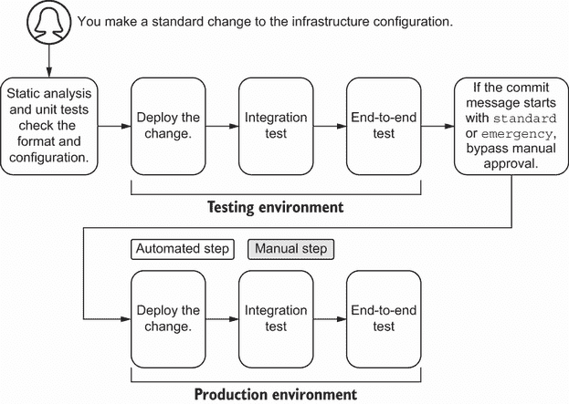

图 7.7 在你的交付管道自动将变更推送到生产之前，标准或紧急变更可以有一个初始的同行评审。

为什么你应该考虑为标准变更使用持续部署？标准变更通常涉及一个常见的自动化、定义良好的修复。你不想让你的团队成员暂停来审查和批准重复的变更。标准变更会分散他们的注意力，使他们无法关注更重要的事。

其他类型的变更也受益于持续部署。想象一下，你发现服务器上的一个应用程序停止运行。你需要快速让应用程序重新运行。与其运行标准变更，不如在 IaC 中实施修复，并使用`emergency`更新其提交信息。在推送变更后，你的构建系统会绕过手动批准阶段，因为提交信息将变更标识为紧急。

除了持续交付标准变更外，你还可以选择为紧急情况持续交付*紧急变更*以修复生产。当可能时，使用 IaC 和提交信息来标识紧急变更，通过使用 IaC 推送修复。

定义 基础设施的*紧急变更*是指你必须快速在生产中实施以修复系统功能的变更。

紧急变更直接进入生产，无需手动批准，因为你通常需要快速修复系统。手动批准可能会阻碍问题的解决。因此，为紧急变更添加绕过有助于你快速解决问题并记录你的解决历史。

要持续部署标准和紧急变更，你*必须*在添加绕过手动批准步骤的能力之前在你的管道中进行自动化测试。此外，你需要标准化绕过提交信息的结构。绕过允许工程师在没有变更积压的情况下部署修复。它还允许合规性和安全团队审计变更序列。

我就不能手动运行一个紧急变更吗？

我强烈建议你使用 IaC 和你的交付管道来制作紧急变更。提交记录了解决步骤的历史，你的管道在运行自动化之前会测试你的变更，以防止系统变得更糟。

然而，当你试图快速推出修复时，你可能发现部署管道运行时间过长。你可能考虑进行手动变更，认识到你可能无法从管道中解决的自动化测试和检查中受益。

在进行手动变更后，将实际基础设施状态与预期的 IaC 进行核对。核对的做法涉及手动更新配置以匹配基础设施资源（请参阅第二章中介绍的技术）。 

其他变更不应使用持续交付。想象一下，你被分配了一个新的项目。你需要启用所有网络上的 IPv6。通过进行这个网络变更，你可能会影响网络中的每个应用和系统！

对于这个新的和重大变更，你*不*想跳过手动批准。你希望有经验的网络工程师审查你的基础设施即代码（IaC）。在图 7.8 中，你更新网络的 IaC 以 IPv6，并在生产前等待手动批准。手动批准步骤会通知其他应用和工程团队，如果变更失败，它们可能具有很大的影响范围。

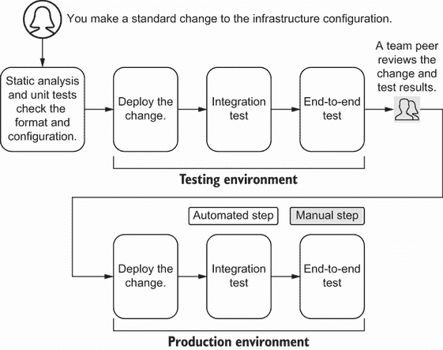

图 7.8 新或重大变更在生产应用前应进行手动同行批准。

*新或重大变更*可能影响系统的架构、安全或可用性。这些变更应要求提交问题或工单，并提供一些理由和讨论。它们还涉及团队或公司内部同行对手动变更的审查。

定义一个对基础设施的*新或重大变更*可能影响系统的架构、安全或可用性。这些变更没有明确定义的实现或回滚计划。

重大变更可能产生重大影响或存在高风险失败的可能性。同样，新的或未知变更可能导致不可预测的结果和复杂的回滚步骤。请求手动批准表明，如果变更失败，你可能需要一些帮助。其他新的或重大变更的例子通常包括更新网络 CIDR 块（如果它们影响其他分配）、DNS、证书变更、升级工作负载编排器或平台重构（例如，向应用程序添加密钥管理器）。

基于变更类型的交付方法

在对所做的变更及其类型进行分类后，你可以决定你的交付方法。就大多数情况而言，标准和紧急变更使用持续交付，而新的和重大变更使用 CD。

表 7.1 概述了一些变更类型、它们的交付方法和一个示例。然而，这些一般实践有例外。一些标准变更可能需要持续交付，因为它们会影响其他资源。相比之下，与绿色（新）环境相关的变更可以实施持续交付方法，因为它不会影响其他系统。

表 7.1 变更类型和交付方法

| 变更类型 | 交付方法 | 生产前是否需要手动批准 | 示例 |
| --- | --- | --- | --- |
| 标准 | 持续交付 | 否 | 向扩展组添加服务器 |
| 紧急 | 持续交付或手动变更 | 否 | 将操作系统镜像回滚到先前的版本 |
| 主要 | 持续交付 | 是 | 为所有服务和基础设施启用 SSL |
| 新增 | 持续交付 | 是 | 部署新的基础设施组件 |

持续集成、交付和部署也适用于软件开发生命周期。然而，将这些概念应用于基础设施生命周期将推动您组织变更和审查流程的极限。定期对您的变更进行分类并评估您的变更和审查流程可以帮助平衡生产力和治理，这是我作为模块共享实践的一部分提到的。

配置管理

配置管理工具应采用类似的方法来评估变更类型并应用持续交付或部署。

作为一般规则，确保快速审查和批准变更，并*尽快将它们推入生产*。大量变更的爆炸半径更大。如果您将每个变更作为一个批次推送并影响业务关键应用程序，您必须对批次中的每个变更进行故障排除。当您需要确定哪个变更影响了系统时，故障排除的复杂性会增加。

练习 7.1

在您的组织中选择一个标准的基础设施变更。您需要什么才能自信地将变更持续交付到生产环境中？持续部署呢？概述或绘制您的交付管道中的阶段。

请参阅附录 B 以获取练习的答案。

### 7.1.5 模块

模块的交付管道呢？您在第五章中学习了关于共享、发布和管理基础设施模块版本的内容，并在第六章中测试了它们的功能。我提到了自动化测试和发布模块过程的想法，但没有完全解释它们的交付管道。

基础设施模块的交付管道与我为生产配置概述的示例略有不同。您将图 7.9 中的交付管道更改，以便在测试后发布模块而不是交付到生产。您保留一个手动批准步骤，以便团队审查模块。

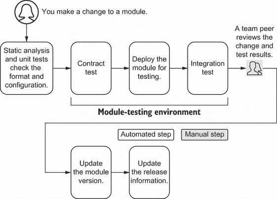

图 7.9 在测试模块后，等待团队审查变更和测试结果，然后再更新和发布新模块版本。

您可以使用与配置相同的变更类型来对模块变更进行分类，包括标准、紧急、主要和新增变更。表 7.2 概述了变更类型、它们的交付方法和一个示例。大部分它们与为配置推荐的方法相匹配。

表 7.2 模块变更类型和交付方法

| 变更类型 | 交付方法 | 生产前手动批准？ | 示例 |
| --- | --- | --- | --- |
| 标准 | 持续部署 | 否 | 启用对现有默认参数的覆盖 |
| 紧急 | 持续部署或分支 | 否 | 将操作系统镜像回滚到先前版本 |
| 主要 | 持续交付 | 是 | 通过使用数据更新数据库或基础设施 |
| 新建 | 持续交付 | 是 | 部署新的服务器模块 |

一些模块更改可以从与主题专家（如数据库配置或其他涉及数据的专用基础设施）的审查或结对编程中受益。然而，模块上的紧急更改可能采用不同的交付方法。

模块上的紧急更改意味着将快速修复隔离到模块的不同版本。你可以通过两种方式实现隔离。你可以实施修复并持续部署和发布带有更改的新模块版本。或者，你可以创建模块存储库的 *分支* 并更新你的基础设施配置以引用该分支。

定义 版本控制中的 *分支* 是指向代码快照的指针。它允许你基于该快照单独实施更改。

验证分支后，你可以使用标准更改更新模块的主分支。分支模块可以帮助你快速实施紧急模块更改，并在以后协调模块更改。

如果我知道其他团队锁定他们的版本，我更喜欢持续部署带有修复的新模块版本。虽然分支可以隔离紧急更改，但我必须记得将其合并回模块的主发布版本。在下一节中，你将了解分支模型以及如何将它们应用于 IaC 更改。

图像构建和配置管理

图像构建和配置管理模块的交付管道遵循与提供工具模块类似的方法。在将它们部署到生产之前，确保对图像进行版本控制和测试更改。

## 7.2 分支模型

除了实施持续交付或部署之外，你还需要标准化更改合并到主配置的方式。版本控制中的主分支是配置的真相来源。更新配置需要团队内部额外的协调和协作。

假设你想要在队友刷新其许可证的同时减少防火墙的访问权限。你的团队有一个 CD 管道来测试和手动批准对生产防火墙的更改。然而，你和队友的更改提出了两个问题。

首先，你们两个人如何独立地工作和测试你们的更改？其次，你们如何控制哪个更改应该先进行？图 7.10 概述了你们和你们的队友在谁应该先部署他们的更改方面的困境。你们想要避免同时推送两个更改。如果防火墙导致网络访问失败，你们将不知道是哪个更改导致了问题。

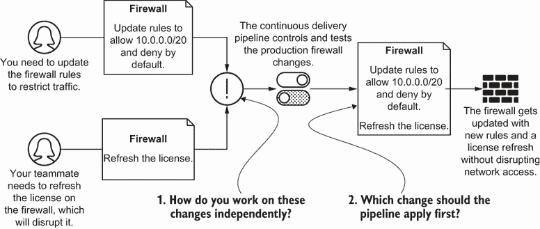

图 7.10 即使你有 CD 管道将更改部署到防火墙，你仍需要额外的开发协调来识别哪些更改必须首先应用。

*分支模型* 协调你的团队如何使用版本控制来启用并行工作，同时最小化中断和故障排除复杂性。你可以选择两种类型的分支模型：基于特征的或基于主干线的开发。

定义 *分支模型* 定义了你的团队如何使用版本控制来启用并行工作并解决他们努力中的冲突。

每种分支模型在实施过程中都伴随着其复杂性，尤其是在基础设施即代码（IaC）中。我将描述如何将这两种开发模型应用于协调你和你的队友之间的防火墙规则和许可证变更。然后，我将讨论每种方法的局限性以及你的团队如何进行选择。

### 7.2.1 基于特征的开发

如果你和你的队友在合并之前能够在隔离状态下对变更进行工作会怎样？如果你的队友创建了一个包含许可证变更的 *分支*，而你创建了一个包含防火墙变更的分支，你将你的变更彼此隔离。当你们都完成时，你们将变更合并到主分支，并解决彼此之间的冲突。

图 7.11 展示了你和你队友如何在不同的分支上编排你们的变更。你将你的分支命名为 `TICKET-002` 以表示防火墙规则，而你的队友将他们的分支命名为 `TICKET-005` 以表示许可证更新。你的防火墙规则变更首先获得批准，因此你将它们放入主分支并部署到生产环境中。你的队友继续进行许可证更新工作。他们在合并变更回主分支之前，将你的防火墙规则更新检索到他们的分支中进行进一步测试。

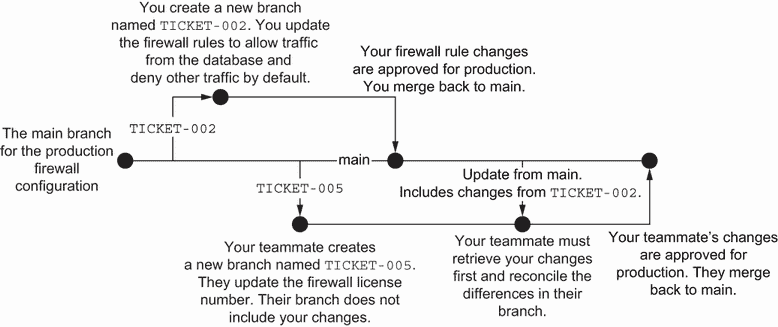

图 7.11 当你使用基于特征的开发时，你将你的变更隔离到你的分支中，并与主配置进行冲突协调。

*基于特征的开发* 允许你通过将变更隔离到分支中来独立于你的队友进行变更的演进。

定义 *基于特征的开发*（也称为 *功能分支* 或 *Git Flow*）是一种将不同的变更分离到单独分支的分支模式。在测试后，你将特定分支上的变更合并到主配置中。

基于特征的开发流程有助于你专注于你的变更的可组合性，而无需考虑其他人的变更。然而，你需要不断地从主分支获取变更，并将它们与你自己的分支进行协调。当每个团队成员勤奋地更新和测试他们的分支时，基于特征的开发效果最佳。

让我们看看基于特征的开发在实际中的应用。想象一下，你通过从版本控制中克隆配置的本地副本来开始基于特征的防火墙开发工作流程：

```
$ git clone git@github.com:myorganization/firewall.git
```

你创建一个分支，这将为你的更新创建一个指针。我建议将分支命名为与变更相关的票号（例如 `TICKET-002`），尽管你也可以使用描述性的破折号分隔的名称：

```
$ git checkout -b TICKET-002
```

你在分支上对防火墙规则进行更改。然后你使用命令行将你的更改提交到你的本地分支：

```
$ git commit -m "TICKET-002 Only allow traffic from database"
[TICKET-002 cdc9056] TICKET-002 Only allow traffic from database
 1 file changed, 0 insertions(+), 0 deletions(-)
 create mode 100644 firewall.py
```

你在本地有你的更改，但你想让别人审查你的更改。你将更改推送到远程分支：

```
$ git push --set-upstream origin TICKET-002
Enumerating objects: 7, done.
Counting objects: 100% (7/7), done.
Delta compression using up to 8 threads
Compressing objects: 100% (3/3), done.
Writing objects: 100% (5/5), 1.06 KiB | 1.06 MiB/s, done.
Total 5 (delta 1), reused 0 (delta 0), pack-reused 0
remote: Resolving deltas: 100% (1/1), completed with 1 local object.
To github.com:myorganization/firewall.git
 * [new branch]      TICKET-002 -> TICKET-002
Branch 'TICKET-002' set up to track remote branch 
➥'TICKET-002' from 'origin'.
```

同时，你的队友在`TICKET-005`上工作，更新许可证。他们创建了一个名为`TICKET-005`的新分支，其中包含的更改*不包括*你的防火墙规则更新。注意，你的分支不包括他们的更新许可证，他们的分支不包括你的更新防火墙规则。你可以审查两个分支之间的差异：

```
$ git diff TICKET-002..TICKET-005
diff --git a/firewall.py b/firewall.py
index 74daecd..aaf6cf4 100644
--- firewall.py
+++ firewall.py
@@ -1,3 +1,3 @@
-print("License number is 1234")
+print("License number is 5678")

-print("Firewall rules should allow from database and deny by default.")
\ No newline at end of file
+print("Firewall rules allow all.")
\ No newline at end of file
```

你打开一个*拉取请求*，通知你的团队你已经完成了你的更改。

定义 A *拉取请求*通知存储库的维护者，你有一些外部更改希望合并到主配置中。

你将更改顾问委员会的成员添加到审查你的拉取请求中。他们批准更改，然后你将你的更改合并回主分支。

你的队友尚未获得更新许可证的批准。为了确保他们不会影响生产配置，他们需要从主分支检索所有更改，包括你在`TICKET-002`中的更改：

```
$ git checkout main
Switched to branch 'main'
Your branch is behind 'origin/main' by 1 commit, and can be fast-forwarded.
  (use "git pull" to update your local branch)

$ git pull --rebase
Updating 22280e7..084855a
Fast-forward
 firewall.py | 2 +-
 1 file changed, 1 insertion(+), 1 deletion(-)
```

然后他们回到他们名为`TICKET-005`的分支，并将主分支的更改合并到`TICKET-005`分支：

```
$ git checkout TICKET-005
Switched to branch 'TICKET-005'
Your branch is up to date with 'origin/TICKET-005'.

$ git merge main
Auto-merging firewall.py
Merge made by the 'recursive' strategy.
 firewall.py | 2 +-
 1 file changed, 1 insertion(+), 1 deletion(-)
```

当你的队友审查防火墙配置时，他们会找到来自`TICKET-002`的你的更改。他们可以将主分支的更改更新到他们的分支：

```
$ git push --set-upstream origin TICKET-005
Enumerating objects: 7, done.
Counting objects: 100% (7/7), done.
Delta compression using up to 8 threads
Compressing objects: 100% (3/3), done.
Writing objects: 100% (5/5), 1.06 KiB | 1.06 MiB/s, done.
Total 5 (delta 1), reused 0 (delta 0), pack-reused 0
remote: Resolving deltas: 100% (1/1), completed with 1 local object.
To github.com:myorganization/firewall.git
 * [new branch]      TICKET-005 -> TICKET-005
Branch 'TICKET-005' set up to track remote branch 'TICKET-005' from 'origin'.
```

一旦你的队友的更改获得批准，你的队友可以将新的防火墙许可证合并到主分支。

基于特性的开发需要每个团队成员进行多个步骤。你可以通过自动化测试和合并过程来简化工作流程。使用交付管道来组织跨分支的更改。

图 7.12 为你和你的队友组织了基于特性的交付管道开发工作流程。你和你的队友各自获得一个带有自己测试环境的分支管道。例如，你有一个名为`TICKET-002`的分支和一个隔离你更改的新防火墙环境。你在`TICKET-002`防火墙环境中运行单元测试，部署更改，并运行集成和端到端测试。

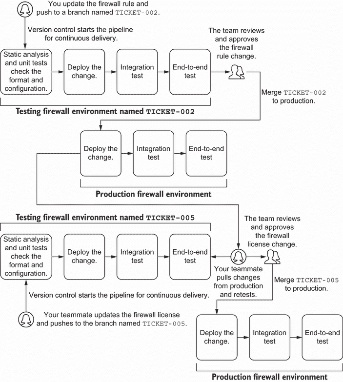

图 7.12 你可以使用基于特性的开发来隔离分支上你的更改的测试。

一旦你的分支测试通过，你将更改合并到主分支。在你工作于你的更改的同时，你的队友分别创建了他们自己的名为`TICKET-005`的分支和防火墙环境。你的队友意识到你最近更新了防火墙配置。

在图 7.12 中，你的队友从主分支检索更改，并确保这些更改仍然与他们的分支和环境兼容。一旦你的队友在他们分支上运行相同的单元、集成和端到端测试，他们将合并`TICKET-005`更改到主分支以进行生产部署。

为什么为每个分支创建一个测试环境？每个分支的测试环境可以隔离您的更改，并相对于主分支进行测试。作为临时环境，分支的测试环境可以最小化对持久测试环境的需求，并降低整体基础设施成本。然而，创建测试环境可能需要一些时间。

您的团队从基于功能的开发中获得一些好处，包括以下内容：

+   能够隔离分支上的更改。

+   在分支内测试更改的能力。

+   隐含的同行评审步骤。只有当有人批准更改时，您才能将更改合并到生产环境中。

+   在分支上分离紧急更改。在验证紧急更改后，您可以将它合并到主分支。

幸运的是，代码库托管服务（例如，GitHub 或 GitLab）具有可以帮助您自动化基于功能的开发模型的功能。这些功能包括用于跟踪特定功能的标签、在合并分支之前进行集成测试的状态检查，以及自动删除旧分支。您还可以定义一个审阅者列表，并自动将他们添加到拉取请求中。

### 7.2.2 主干开发

假设您的组织不想为每个分支创建测试环境，并且许多工程师对基于功能的开发工作流程感到不舒服。相反，您和您的队友可以在主分支上一起工作。

图 7.13 展示了您和您的队友如何在主分支上进行协作。您首先更新防火墙规则并推送更改。然后您的队友更新他们的本地仓库以包含您的更改，并将他们的更改推送到主分支。

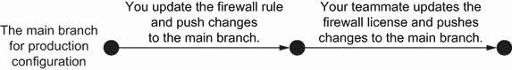

图 7.13 当您使用主干开发时，您维护一个主分支并直接更新生产配置。

由于您俩都推送到一个分支，工作流程看起来更加流畅。*主干开发* 意味着您直接将更改推送到主分支，而不在版本控制中隔离您的更改。

定义 *主干开发*（也称为 *推送到主分支*）是一种将所有更改直接推送到主分支的分支模式。它倾向于进行小改动，并使用测试环境来验证更改是否成功。

主干开发不允许您独立于队友进行更改的演变。然而，这种限制变成了一个优势。主干开发迫使您以 *特定顺序* 实施更改。您可以快速识别导致更改的提交并解决它。该模式提供了一种有见地的方法来编排和应用基础设施即代码（IaC）更改。

让我们将主干开发应用于您的防火墙规则和您的队友的防火墙许可证更新。您首先从版本控制中克隆防火墙配置的本地副本。当您克隆配置时，您可以检查主分支：

```
$ git clone git@github.com:myorganization/firewall.git
$ git branch --show-currentmain
```

你将防火墙规则更改提交到主分支。提交你的更改：

```
$ git commit -m "TICKET-002 Only allow traffic from database"
[TICKET-002 cdc9056] TICKET-002 Only allow traffic from database
 1 file changed, 0 insertions(+), 0 deletions(-)
 create mode 100644 firewall.py
```

更新你的本地副本以确保从主分支检索新更改。使用 `git pull` `--rebase` 从远程仓库获取更改，将它们合并到你的本地副本中，并与远程历史记录进行变基：

```
$ git pull --rebase
Already up to date.
```

现在，你可以将更改推送到主分支。你的推送应该启动图 7.14 所示的交付流水线。你的流水线会对测试环境执行单元和集成测试。在所有测试阶段通过后，流水线等待你的团队手动批准。你的队友可以审查你的更改并批准它们。一旦他们批准了你的更改，流水线就会将你的防火墙规则更改部署到生产环境中。

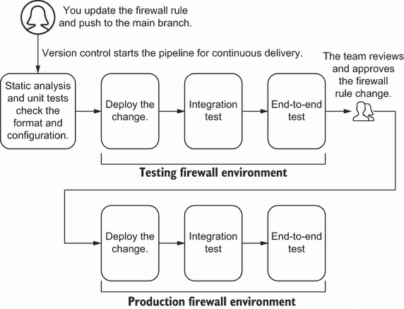

图 7.14 基于主干线的开发需要一条流水线来持续将其交付到生产环境中。

如果你的防火墙规则更改失败，它会在进入生产之前停止交付流水线。你会在测试环境阶段注意到失败并撤销更改。其他人可以继续将他们的更改推送到生产环境，而你则需要实施修复。

基于主干线的开发高度依赖于交付流水线来测试和部署更改。交付流水线应包括一个持久测试环境来评估更改之间的冲突。虽然持久测试环境会产生成本，但该环境更准确地反映了更改在生产中的行为。

基于主干线的开发的工作流程步骤非常少。大多数基础设施团队发现这个工作流程在做出更改时很有帮助，因为它按照特定的顺序排列更改。基于主干线的开发创建了一个持续反馈循环，展示了不同的更改如何相互影响。它还促进了一种实践，即进行小幅度更改，解决主配置的更新，并将更改推送到生产环境。当你的团队更改发生冲突时，你可以快速识别哪些依赖项影响了测试环境。

然而，基于主干线的开发确实需要练习来解决更改并保持纪律以协调更改。你不会隔离你的更改，在一个分支上工作可能会使协作变得具有挑战性。一旦你解决了最初的协作冲突，你可能会发现基于主干线的开发为你团队中的 IaC 更改提供了更好的可见性。

### 7.2.3 选择分支模型

我与软件和基础设施团队花费了数小时讨论基于功能或基于主干线的开发的优点。在这些会议结束时，我总是意识到分支模型的选择取决于团队的舒适度、规模和环境设置。本节涵盖了将这两种分支模型应用于基础设施时的某些局限性和担忧。

基于功能的开发挑战

许多应用程序和基础设施的开源项目成功使用了基于特性的开发。基于特性的开发提供了一个框架，可以独立测试和评估关键更改。它将更改分散到许多协作者之间，并在合并到主分支之前强制执行手动审查阶段。源代码控制或 CI 框架提供了原生集成以支持基于特性的开发。

IaC 从基于特性的开发中获得了相同的益处。团队在将基础设施更改推送到生产之前，可以将其隔离到分支中。图 7.15 测试了您在`TICKET-002`环境中对防火墙规则更改的验证，来自您的队友在`TICKET-005`环境中的许可更改。您可以在您的分支上应用更改，而不会与其他人冲突。

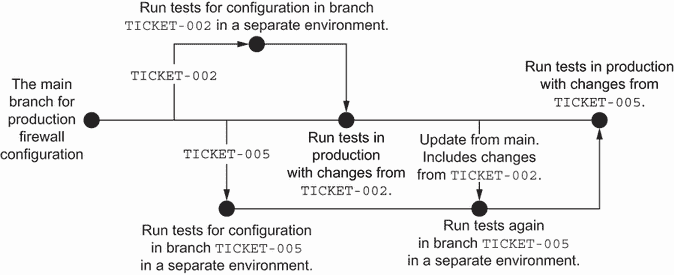

图 7.15 您可以为每个特性分支创建一个新的测试环境，以验证单个更改。

然而，基于特性的开发有几个挑战。首先，创建新环境可能需要时间和金钱（有关成本管理，请参阅第十二章）。当多个团队成员在许多分支上配置时，您的管道可能难以启动新环境。

为了加快测试环境的创建，您可以为您的管道框架投资运行器以并行运行测试。或者，您也可以为所有分支创建一个持久测试环境。然而，基于特性的开发可能会在持久测试环境中引起冲突，因为每个分支都是异步应用更改的。

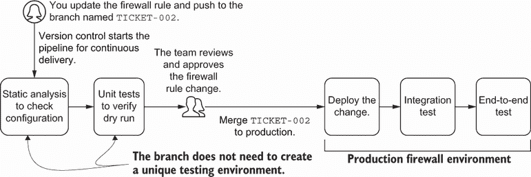

图 7.16 您可以省略分支的集成和端到端测试，以减轻多个环境和管道并发成本。

而不是创建一个持久的测试环境，您还可以省略除了主分支之外的所有分支的集成和端到端测试，以优化成本。例如，您的防火墙更改可能只需要静态分析、单元测试和团队审查，然后才能合并到生产中，如图 7.16 所示。您不需要为分支创建唯一的测试环境，在人工审查后，将分支合并到生产中。

您在基于特性的开发中面临的另一个挑战涉及版本控制的纪律和熟悉度。如果您还没有使用版本控制，您需要习惯特性分支的工作流程。该工作流程增加了逆向工程合并更改和解决冲突的挑战。

例如，有人可能在本周末创建一个分支来修复防火墙规则。他们忘记合并热修复，而您不知道他们更改了防火墙。在更新防火墙规则时，您意外地覆盖了他们的配置！随着时间的推移，您积累了大量的分支，必须解决哪些分支已经应用。

你还会遇到长期分支的挑战。想象一下，你的队友已经花了一个月的时间更新许可证。他们创建了一个名为 `TICKET-005` 的新分支。每隔几天，他们需要检查主分支的更新并将它们添加到他们的修复中。

有一天，你需要进行一个依赖于你的队友许可证更新的变更。你开始在名为 `TICKET-002` 的分支上工作你的变更，如图 7.17 所示。你完成了工作，但意识到你的队友在 `TICKET-005` 上还有工作要做！你等待了另外两个月，直到你的队友完成他们的防火墙许可证更新。一旦他们完成，你花费数小时更新你的 `TICKET-002` 分支，以便最终将你的变更部署到生产环境中。

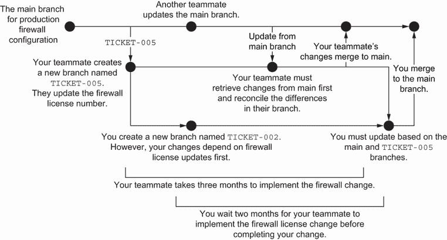

图 7.17 长寿命的分支可能会阻止其他变更部署到生产环境，并在分支过程中引入复杂性。

基于功能的开发鼓励你长时间保留分支。你必须警惕地更新长期分支，以跟上主分支。否则，你将遇到难以轻易解决的冲突。有时，你唯一的解决方案是删除你废弃的分支，并在新的、更新的分支上重新开始你的变更。

基于主干开发的挑战

基于主干的开发与基础设施变更和缓解环境之间配置漂移的需求相得益彰。你省略了合并和管理功能分支的复杂性，特别是如果你需要建立 Git 技能的信心。

基于主干开发倾向于小变更而不是大而重要的变更。你逐步实施变更，而不是一次性测试它们。在第十章中，我将介绍使用功能切换来逐步实施一组变更并降低对基础设施的风险。

基于主干开发有几个缺点。在将变更推送到生产之前，它需要一个专门的测试环境。图 7.18 概述了基于主干开发的理想工作流程。在你运行单元测试后，你将变更部署到一个长期测试环境中进行集成和端到端测试。如果变更在测试环境中通过测试，它可以接受队友的审查。一旦他们批准变更，它将进入生产环境进行集成和端到端测试。

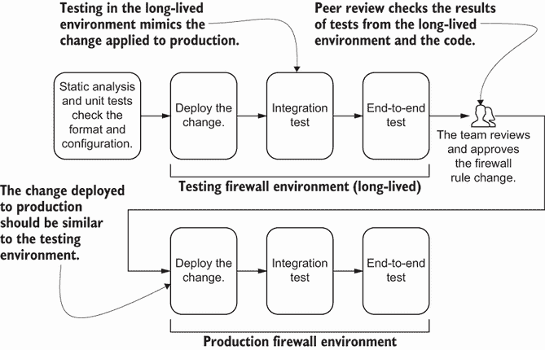

图 7.18 基于主干的开发需要一个专门的测试环境来模拟生产中的变更，并帮助建立同行审查的信心。

你需要彻底的单元测试来格式化和检查团队的标准，以及集成测试来验证功能。一个持久的测试环境会增加基于主干开发的总体成本。更小、更模块化的基础设施配置可以减少资源或模块内的冲突，并降低测试所需基础设施的总体成本。

你可能会发现，基于主干的发展与手动变更审批相冲突。手动变更审批只能在有人将更改推送到主分支之后进行。你的审阅者需要知道你的变更是否成功，他们才能验证其格式和配置。如果你将一个损坏的配置推送到测试环境，你需要迅速识别并回滚，以免其他人审阅。

表 7.3 总结了基于特征和基于主干发展的优点和局限性。选择取决于你的团队配置的基础设施类型及其对版本控制的熟悉程度。

表 7.3 基于特征和基于主干的发展比较

| 开发模型 | 优点 | 局限性 |
| --- | --- | --- |
| 基于特征的发展 | 使用分支隔离变更，使用分支隔离测试，组织代码的手动审查，跨多个团队和协作者扩展 | 需要勤奋和熟悉更新分支，鼓励长期分支，增加金钱和时间成本 |
| 基于主干的发展 | 提供更好的变更行为表示，使用一个版本控制工作流程处理所有变更，鼓励增量基础设施变更以减少影响范围 | 需要长期测试环境，不包括手动审查阶段，需要纪律和组织才能跨多个团队和协作者扩展 |

你必须在团队内部建立并达成一致的开发模型。对开发模型的达成一致有助于促进变更的可重复性和系统的整体可用性。注意每种方法的局限性，并始终尽量保持你的变更尽可能小。无论你的团队采用哪种模型，尽可能频繁地将变更应用到生产环境中，以减少变更的影响范围。

## 7.3 同行评审

在本章和第五章中，我强调了在交付管道和模块变更中包含审查步骤的重要性。为什么你应该花时间审查你的队友的 IaC？在审查时你应该寻找什么？

*同行评审*允许你的队友检查你的基础设施配置以获得建议、标准和格式。

定义 *同行评审* 是一种允许你的队友或其他团队检查你的基础设施配置以获得建议、标准和格式的实践。

作为审阅者，我关注的是配置是否能够在团队间扩展，保持安全，或者影响高级基础设施依赖。这种审阅视角有时会阻止变更合并到生产环境中。然而，同行评审过程为团队提供了标准化实践和新模式的教育机会。你和你的团队可能需要花时间讨论设计或实现的优点或缺点。

要理解同行评审的重要性和缺点，想象一个新的库存团队需要读取 GCP 项目的访问权限。在列表 7.1 中，您更新了访问管理规则的代码，从 JSON 对象中读取用户列表。新代码通过了所有测试，您等待了几天，等待您的队友审查更改。

列表 7.1 向 GCP 项目添加新团队的首次实现

```
import json

GCP_PROJECT_USERS = [                                   ❶
   (
       'operations',
       'group:team-operations@example.com',
       'roles/editor'
   ),
   (
       'inventory',                                     ❷
       'group:inventory@example.com',                   ❷
       'roles/viewer'                                   ❷
   )
]

class GCPProjectUsers:                                  ❸
   def __init__(self, project, users):
       self._project = project
       self._users = users
       self.resources = self._build()                   ❹

   def _build(self):                                    ❹
       resources = []
       for user, member, role in self._users:           ❺
           resources.append({                           ❺
               'google_project_iam_member': [{          ❺
                   user: [{                             ❺
                       'role': role,                    ❺
                       'member': member,                ❺
                       'project': self._project         ❺
                   }]                                   ❺
               }]                                       ❺
           })                                           ❺
       return {
           'resource': resources
       }

if __name__ == "__main__":
   with open('main.tf.json', 'w') as outfile:           ❻
       json.dump(GCPProjectUsers(                       ❻
           'infrastructure-as-code-book',               ❻
           GCP_PROJECT_USERS).resources, outfile,       ❻
           sort_keys=True, indent=2)                    ❼
```

❶ 定义要添加到 GCP 项目的用户和组列表

❷ 将库存团队作为只读组添加到项目中

❸ 为 GCP 项目用户创建一个模块，该模块使用工厂模式将用户附加到角色

❹ 使用该模块为要附加到 GCP 角色的用户列表创建 JSON 配置

❺ 对于列表中的每个组，创建一个 Google 项目 IAM 成员，并将用户附加到其分配的角色。此资源将用户添加到 GCP 的角色中。

❻ 将 Python 字典写入由 Terraform 稍后执行的 JSON 文件

❼ 当您将 JSON 文件写入由 Terraform 执行的文件时，使用两个空格缩进。

AWS 和 Azure 等效

要将代码列表转换为 AWS，您需要将 GCP 项目的引用映射到 AWS 账户。GCP 项目用户与 AWS IAM 用户相对应。同样，您会创建一个 Azure 订阅并将用户账户添加到 Azure Active Directory。

您等待三天后，您的队友返回并提供了以下反馈：

+   您必须使用四个空格缩进您的 JSON 基础设施配置。

+   您必须将组重命名为`team-inventory@example.com`。

+   您必须将库存团队添加到`viewer`角色的用户列表中，而不是为该组定义角色。

您的队友解释说，前两个符合团队标准。最后一个要求符合访问控制权威绑定安全标准（它定义了角色的用户列表而不是将角色添加到用户）。您已经因为等待同行评审而延迟了三天！现在，您需要修复它并等待另外几天以获得批准。

记住第六章中您想要将孤岛知识的未知已知捕获到测试中。您的队友有一些您不知道的知识。您决定添加一些单元测试来帮助您记住团队标准。

列表 7.2 中的新代码包括新的单元测试（linting 规则），以验证您的团队配置和安全标准。一个测试检查 JSON 中是否有四个空格的正确缩进。另一个测试检查所有组是否符合命名标准。最后一个测试检查您是否使用了正确的资源将用户绑定到角色。

列表 7.2 向团队开发标准添加单元测试以进行 lint

```
import pytest
from main import GCP_PROJECT_USERS, GCPProjectUsers                        ❶

GROUP_CONFIGURATION_FILE = 'main.tf.json'                                  ❷

@pytest.fixture                                                            ❷
def json():                                                                ❷
   with open(GROUP_CONFIGURATION_FILE, 'r') as f:                          ❷
       return f.readlines()                                                ❷

@pytest.fixture                                                            ❸
def users():                                                               ❸
   return GCP_PROJECT_USERS                                                ❸

@pytest.fixture                                                            ❹
def binding():                                                             ❹
   return GCPProjectUsers(                                                 ❹
       'testing',                                                          ❹
       [('test', 'test', 'roles/test')]).resources['resource'][0]          ❹

def test_json_configuration_for_indentation(json):                         ❺
   assert len(json[1]) - len(json[1].lstrip()) == 4, \                     ❺
       "output JSON with indent of 4"                                      ❺

def test_user_configuration_for_standard_team_name(users):                 ❸
   for _, member, _ in GCP_PROJECT_USERS:                                  ❸
       assert member.startswith('team-'), \                                ❸
           "group should always start with `team-`"                        ❸

def test_authoritative_project_iam_binding(binding):                       ❹
   assert 'google_project_iam_binding' in binding.keys(), \                ❻
       "use `google_project_iam_binding` to add team members to roles"     ❻
```

❶ 导入 GCP 用户和角色的列表

❷ 使用 Python 读取 Terraform JSON 配置文件。测试使用此固定值来验证 JSON 具有四个空格的缩进。

❸ 将 GCP 用户和角色的列表（包括库存团队）作为固定值导入测试。测试检查每个用户都有一个“team-”前缀来识别它作为一个组。

❹ 使用工厂模块创建一个示例 GCP 项目用户

❺ 使用 Python 读取 Terraform JSON 配置文件。测试使用此固定值来验证 JSON 有四个空格的缩进。

❻ 检查工厂模块是否使用了正确的 Google 项目 IAM 绑定 Terraform 资源而不是成员。这使用权威绑定将团队成员添加到特定角色

AWS 和 Azure 的等效资源

GCP 项目 IAM 绑定类似于`aws_iam_policy_attachment` Terraform 资源([`mng.bz/5QW7`](http://mng.bz/5QW7))。绑定或附件会权威性地撤销任何未定义为 Terraform 资源一部分的用户。在发布时，Azure 的访问控制模型使用的是累加策略方法，并且没有明确的方式来定义权威的角色附加或绑定定义。

由于自动代码审查和单元测试，你可以在同行评审之前纠正错误并缩短反馈循环。你的队友不需要对格式和标准吹毛求疵。然而，你和你的队友仍在争论是否应该将用户添加到角色中，或者将角色添加到用户中。你决定将这个架构决策提交给更广泛的团队进行考虑。

图 7.19 演示了有效的同行评审遵循示例的工作流程，将自动化测试与更广泛的架构讨论相结合。在自动化测试、同行评审和协作之间，你维护了安全、弹性和可扩展的 IaC。

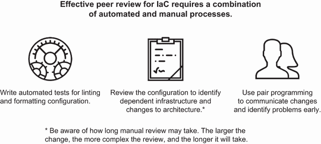

图 7.19 自动化一些检查并保持对任何手动审查过程的意识将有助于加快同行评审。

然而，测试自动化和审阅者并不能捕捉到所有内容。在开发过程的后期进行同行评审可能会令人沮丧。为了在 IaC 编写过程中尽早解决差距和提出架构问题，你可以与队友一起编程。这种技术称为*结对编程*，使用两位工程师来减轻同行评审的摩擦。

定义*结对编程*是两位程序员在一台工作站上共同工作的实践。

一位工程师可能会捕捉到另一位没有意识到的东西，反之亦然。结对编程有许多挑战，包括资源限制和个性冲突。大多数公司不采用它，因为它最初会减慢交付速度并影响团队容量。有些人不喜欢它，因为他们的配对伙伴可能工作速度不同。结对编程需要自我意识和纪律。

尽可能地进行 IaC 的结对编程。基础设施通常包括特定的术语和制度知识。例如，当前和未来的团队成员必须理解为什么有人为项目访问控制使用了权威绑定。结对编程促进了知识共享，并在开发过程中内置了变更审查。随着时间的推移，你的团队在快速交付基础设施变更方面变得更加熟练，而无需手动变更审查的摩擦。

注意同行（或代码）评审和结对编程应该为团队中的每个人提供一个安全的空间，以便学习如何考虑最佳实践来编写代码。关于这些过程的特定细节超出了本书的范围。有关代码评审的更多信息，我建议查看谷歌的工程实践[`mng.bz/6XNR`](http://mng.bz/6XNR)。有关结对编程的更多信息，请参阅[`mng.bz/o2GD`](http://mng.bz/o2GD)。你可以使用各种技术来平衡配对关系，例如每 30 分钟切换键盘或指定驾驶员和导航员。

基础设施的改变可能会影响关键业务系统的可用性。批量进行许多改变可能会加剧故障，因为难以追踪到一个根本原因。如果你能通过组合结对编程和测试自动化来缩短同行评审过程，你就可以专注于审查基础设施变更的架构和影响。

## 7.4 GitOps

当你结合持续部署、声明性配置、漂移检测和版本控制时会发生什么？所有这些模式似乎相当不同，但将它们一起使用为管理基础设施提供了一种有见地的方法。你声明你希望为基础设施设置的配置，将其添加到版本控制中，并将其部署到生产环境中。

想象一下，你想将支付服务从版本 3.0 更新到 3.2。支付服务运行在工作负载编排器（例如，Kubernetes）上。编排器提供了一个使用 DSL 的声明性配置接口。你可以传递 YAML 文件来配置编排器中的资源。

图 7.20 实现了一个通过结合持续部署、声明性配置和版本控制来响应变更的工作流程。你使用版本 3.2 更新声明性配置。一个控制器检测当前配置与版本控制中的配置之间的偏差。它启动一个交付管道来部署新版本并运行测试以检查其功能。

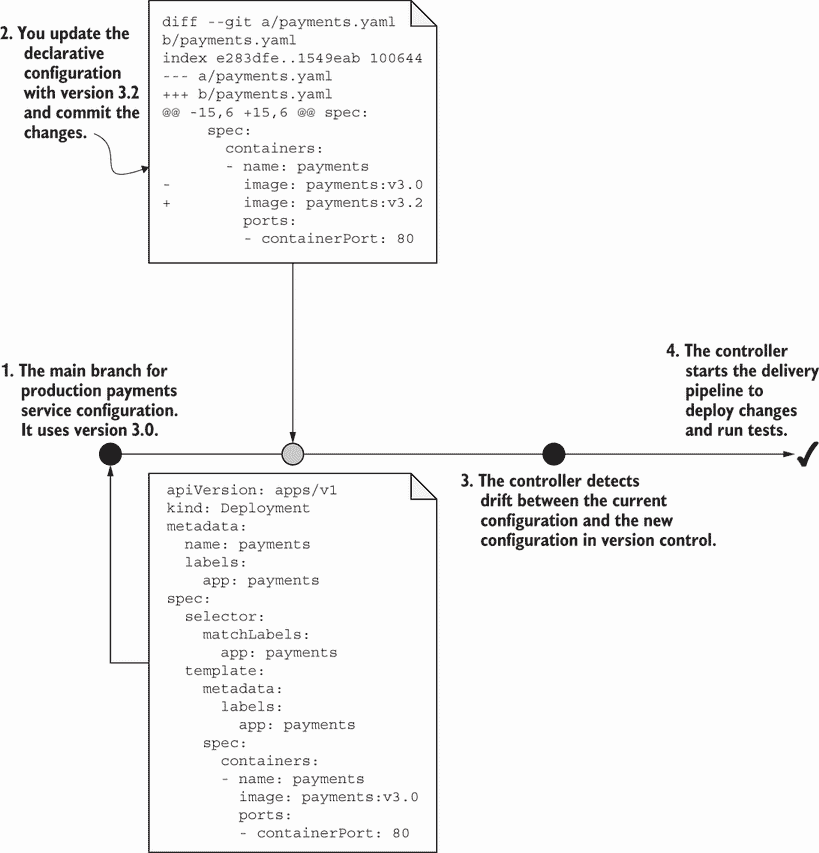

图 7.20 GitOps 的一个实现可以使用基于特性的开发来打开一个拉取请求，在分支上测试变更，添加审阅者，并合并变更。

为什么你要让控制器持续检测和应用变更？控制器减少了预期配置与实际状态之间的偏差。这确保了你的系统保持更新。

您可能会从这个工作流程中感受到似曾相识的感觉。毕竟，它结合了所有关于编写基础设施即代码（IaC）、测试和交付的实践。本书对 IaC 持有非常坚定的立场，与称为 GitOps 的概念相一致。*GitOps*定义了一种方法，允许团队通过版本控制管理基础设施变更，通过 IaC 进行声明性更改，并持续部署更新到基础设施。

定义：*GitOps*是一种使用声明性 IaC 通过版本控制管理基础设施变更并将其持续部署到生产的方法。

您最常将 GitOps 与 Kubernetes 生态系统联系起来。然而，GitOps 为在整个组织中扩展 IaC 实践提供了一个有见地的范例。您不再通过填写包含相关详细信息的工单来实施更改。

相反，组织中的任何人都可分支 IaC 并提交更改。持续部署减少漂移，保持基础设施更新，并始终运行测试。您可以通过拉取请求和提交历史记录跟踪谁请求并进行了更改。

注意：想了解更多关于 GitOps 和 Kubernetes 的信息，请参阅 Billy Yuen 等人所著的*GitOps and Kubernetes*（Manning，2021）。您可以在[`opengitops.dev`](https://opengitops.dev)找到关于 GitOps 的一般实践。

## 摘要

+   将基础设施更改交付到生产通常涉及一个变更审查流程，该流程手动验证更改的架构和影响。

+   持续集成涉及频繁地将更改合并到基础设施配置的主分支。

+   持续交付将更改部署到测试环境进行自动测试，并在将其推送到生产之前等待手动审批。

+   持续部署直接将更改部署到生产环境，无需手动审批阶段。

+   您可以根据更改的类型和频率，使用持续集成、交付或部署来推送 IaC 更改，并带有自动测试。

+   您的团队可以通过使用基于特性的开发或主干开发来协作进行 IaC。

+   基于特性的开发为每个更改创建一个分支，允许隔离测试，但需要熟悉版本控制实践。

+   基于主干的开发将所有更改应用于主分支，这会识别更改之间的冲突，但在生产之前需要测试环境。

+   您可以自动化检查格式和标准，并手动审查配置架构和依赖关系。

+   配对编程可以帮助在开发早期阶段识别更改中的冲突和问题。

+   GitOps 结合了版本控制、声明性基础设施配置和持续部署，使任何人都能通过代码提交自动化基础设施变更。
