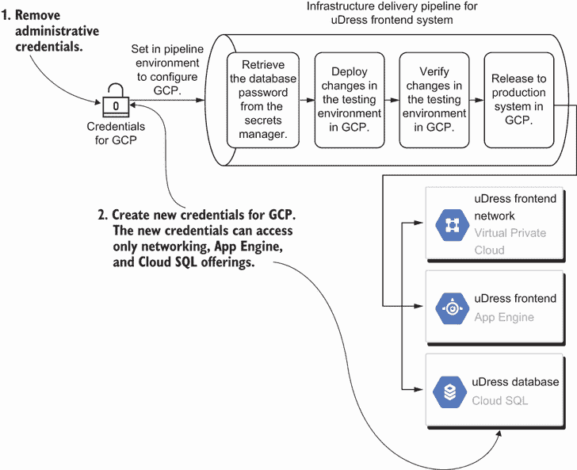
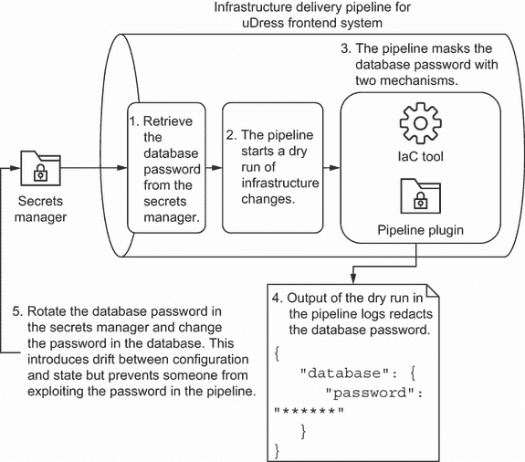
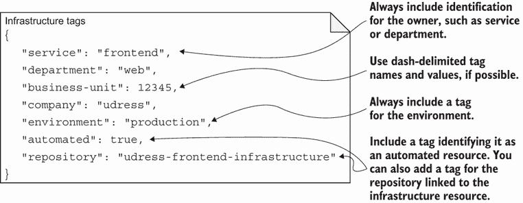
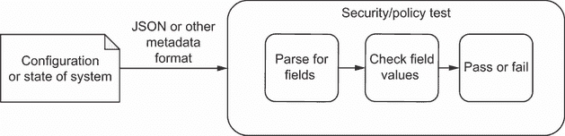
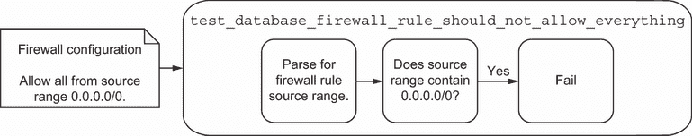
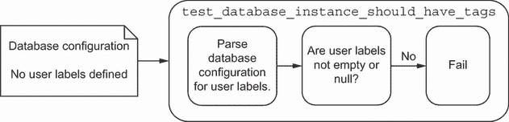
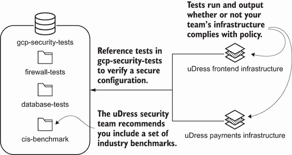
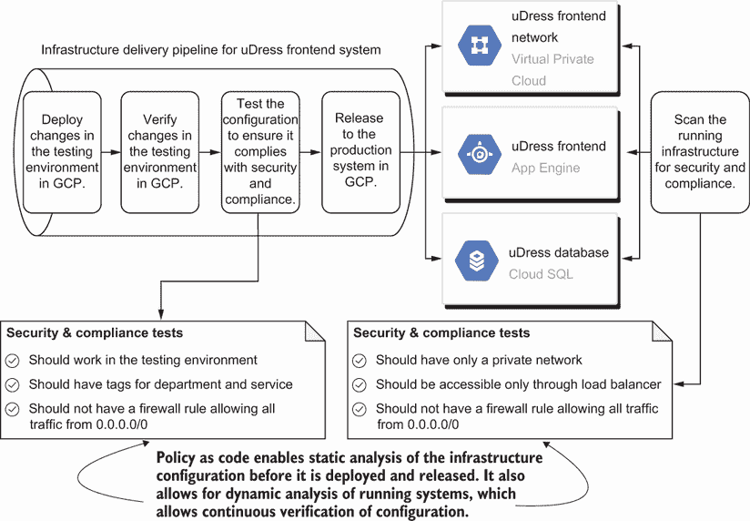
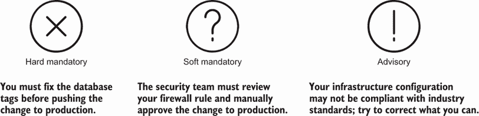
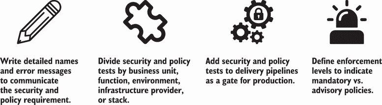

# 8 安全和合规

本章涵盖

+   在 IaC 中选择凭证和秘密的保护措施

+   实施政策以确保合规和安全的架构

+   准备端到端测试以确保安全和合规

在前面的章节中，我提到了确保基础设施代码的安全以及检查其是否符合你组织的安全和合规要求的重要性。通常，你不会处理这些要求直到你的工程过程后期。到那时，你可能已经部署了一个不安全的配置或违反了关于数据隐私的合规要求！

例如，想象一下你为一家名为 uDress 的零售公司工作。你的团队有六个月的时间在 GCP 上构建一个新的前端应用程序。公司需要在假日季节前使其可用。你的团队非常努力地工作，开发出足够的功能以便上线。然而，在你部署和测试新应用程序的一个月前，合规和安全团队进行了一次审计——你失败了。

现在，你需要在你的待办事项中添加新的项目来解决安全和合规问题，并遵守公司政策。不幸的是，这些修复延迟了你的交付时间表，在最坏的情况下，破坏了功能。你可能希望从一开始就知道这些，至少这样你可以为它们做出计划！

你的公司的*政策*确保系统符合安全、审计和组织要求。此外，你的安全或合规团队通常根据行业、国家等因素定义政策。

定义 A *政策* 是你组织中的一套规则和标准，以确保符合安全、行业或监管要求。

本章将教你如何保护凭证和秘密，并编写测试以强制执行安全和合规政策。如果你在编写 IaC 之前考虑这些实践，你可以构建安全、合规的基础设施，并避免交付时间表上的延误。受一位我以前共事过的经理的启发，“我们正在将安全烘焙到基础设施中，而不是在之后添加糖霜。”

## 8.1 管理访问和秘密

我已经在第二章中介绍了将“烘焙”安全理念融入 IaC 的想法。IaC 使用两套秘密。你使用 API 凭证来自动化基础设施，并将敏感变量（如密码）传递给资源。你可以在秘密管理器中存储这两个秘密以处理其保护和轮换。

在本节中，我专注于确保 IaC 交付管道的安全。IaC 表达了基础设施的预期状态，这通常包括根密码、用户名、私钥和其他敏感信息。基础设施交付管道控制需要这些信息的基础设施的部署和发布。

让我们设想你为新的 uDress 系统构建交付管道以部署基础设施。这些管道使用一组基础设施提供者凭证来创建和更新资源。每个管道还从密钥管理器中读取数据库密码，并将其作为属性传递以创建数据库。

你的安全团队指出你方法中的两个问题。首先，基础设施交付管道使用完整的管理凭证来配置 GCP。其次，你的团队的交付管道意外地在日志中打印出了根数据库密码！

你的交付管道增加了你系统**攻击面**（不同攻击点的总和）。

定义 **攻击面** 描述了未经授权的用户可以损害系统的不同攻击点的总和。

任何人都可以使用管理凭证或根数据库密码来获取信息并损害你的系统。你需要一个解决方案来更好地保护凭证和数据库密码。该解决方案应有望最小化攻击面。

### 8.1.1 最小权限原则

IaC 交付管道存在攻击点，允许未经授权的用户使用具有提升访问权限的凭证。例如，你使用第七章构建了一个管道，该管道持续将基础设施更改交付到生产环境中。该管道需要一些权限来更改 GCP 中的基础设施。

初始时，你的团队授予管道完整的管理凭证，以便它可以创建 GCP 中的所有资源。如果有人访问这些凭证，他们可以在 uDress 系统中创建和更新任何内容！有人可能会利用你团队的管道来运行机器学习模型或访问其他客户数据！

管道不需要访问每个资源。你决定更新凭证，使其仅使用更新特定资源所需的最小权限集。你确定 IaC 仅创建网络、Google App Engine 和 Cloud SQL 资源。你从凭证中移除了管理访问权限，并用对三个资源的写入访问权限替换它们。

当管道运行时，如图 8.1 所示，新的凭证恰好有足够的访问权限来更新三组资源。它还在部署网络、应用程序和数据库更新之前从密钥管理器中检索数据库密码。在将更改部署到测试环境后，你添加了一个单元测试来验证凭证不再具有管理访问权限。



图 8.1 从 uDress 前端交付管道中移除管理凭证，并限制其访问网络、应用程序和数据库。

你通过使用**最小权限原则**解决了管道凭证的安全问题。这个原则确保用户或服务帐户只能获得完成其任务所需的最小访问权限。

定义 *最小权限原则* 指出，用户或服务帐户应具有对系统的最低访问要求。他们应该只有完成其任务所需的最少权限。

维护最小权限原则需要时间和精力。您通常在向 IaC 添加新资源时更改访问权限。通常，将角色附加到交付管道凭证。将访问权限分组到角色中有助于提高可组合性，因此您可以按需添加和删除访问权限。

将第三章中的模块实践应用于提供权限集模块。例如，您可以为 uDress 的 Web 应用程序提供一个工厂模块来自定义网络、应用程序和数据库的写入访问权限。任何 Web 应用程序都可以使用该模块，并正确地复制它所需的最低权限集。

让我们使用访问管理模块在列表 8.1 中实现 uDress 前端交付管道的最小权限访问管理。您将管道限制为网络、应用程序和 Cloud SQL 管理凭证。这些凭证允许管道创建、删除和更新网络、应用程序和数据库，但不能更新其他资源类型。

列表 8.1 前端最小权限访问管理策略

```
import json
import iam                                                      ❶

def build_frontend_configuration():
   name = 'frontend'
   roles = [
       'roles/compute.networkAdmin',                            ❷
       'roles/appengine.appAdmin',                              ❷
       'roles/cloudsql.admin'                                   ❷
   ]

   frontend = iam.ApplicationFactoryModule(name, roles)         ❶
   resources = {
       'resource': frontend._build()                            ❸
   }
   return resources

if __name__ == "__main__":
   resources = build_frontend_configuration()                   ❸

   with open('main.tf.json', 'w') as outfile:                   ❹
       json.dump(resources, outfile, sort_keys=True, indent=4)  ❹
```

❶ 根据服务帐户的角色列表创建角色配置，包括网络、App Engine 和 Cloud SQL

❷ 导入应用程序访问管理工厂模块以创建前端应用程序的访问管理角色

❸ 使用该方法创建管道访问权限的 JSON 配置

❹ 将 Python 字典写入 JSON 文件，以便稍后由 Terraform 执行

AWS 和 Azure 的等效功能

Google App Engine 类似于 AWS Elastic Beanstalk 或 Azure App Service，它们将 Web 应用程序和服务部署到提供商管理的环境中。

Google Cloud SQL 类似于 Amazon 关系数据库服务（RDS），它部署不同的托管数据库。Azure 为特定数据库提供不同的服务，例如 Azure Database for PostgreSQL 或 Azure SQL Database 服务。

在遵循最小权限原则的同时，移除权限时要小心。有时，管道需要更具体的权限来读取或更新依赖项。如果没有足够的权限，可能会破坏基础设施或应用程序。

一些基础设施提供商，包括 GCP，分析服务帐户或用户使用的权限，并输出一组多余的权限。您还可以运行其他第三方工具来分析访问并识别未使用的权限。我建议在每次添加新的基础设施资源时，使用这些工具检查和更新您的访问控制。

### 8.1.2 配置中的保密性保护

除了使用来自管道的管理凭证访问基础设施提供商外，有人可能会更改管道以打印有关基础设施的敏感信息。例如，前端交付管道在日志中输出根数据库密码。任何从管道访问日志的人都可以使用根密码登录数据库！

为了解决这个安全问题，你决定通过使用你的 IaC 工具将密码标记为*敏感变量*。该工具在日志中删除密码。你还在管道工具中*安装了一个插件*，用于识别和删除任何敏感信息，例如密码。你将这些两个配置添加到图 8.2 中的管道中，以避免在管道日志中泄露数据库密码。作为安全预防措施，你在密钥管理器中轮换数据库密码，并直接更改数据库中的密码，而不是使用 IaC。

你可以通过抑制或删除明文信息来使用工具在交付管道中掩码密码。

定义*掩码*你的敏感信息意味着抑制或删除其明文格式，以防止某人读取信息。

使用一种或两种机制可以防止敏感信息出现在管道日志中。敏感信息可能包括密码、加密密钥或像 IP 地址这样的基础设施标识符。如果你认为有人可以利用这些信息访问你的系统，考虑在管道中掩码这些值。

然而，掩码敏感信息并不能保证防止未授权访问。你仍然需要一个工作流程，以尽可能快地*修复*暴露的凭证。作为一个解决方案，在使用它们配置 IaC 之后，使用密钥管理器存储和轮换凭证。



图 8.2 你可以通过使用工具掩码值并在应用 IaC 更改后轮换凭证来保护根数据库密码。

分别管理密钥会在你的基础设施即代码（IaC）中引入可变性，或者说是在原地更改。虽然这会在实际根数据库密码和 IaC 中表达的密码之间引入漂移，但以可变方式管理密码可以防止某人利用 IaC 管道并使用凭证。

当你构建 IaC 时，考虑以下安全要求清单，以最小化你的交付管道的攻击面：

1.  从一开始就检查基础设施提供商凭证的*最小权限访问*。你应该提供足够的权限来应用和确保你的 IaC。

1.  通过使用一个函数来生成随机字符串或从密钥管理器中读取密钥来生成一个密钥。避免将密钥作为静态变量传递到你的配置中。

1.  检查你的管道在模拟运行能力或命令输出中是否*掩码敏感配置数据*。

1.  提供一种机制，以便快速*撤销和旋转受损的凭证*或数据。

你可以用秘密管理器解决清单中的许多要求。秘密管理器可以省略在配置中静态定义秘密的需要。虽然一些要求作为交付管道的一般安全实践，但它们也适用于安全的 IaC。你可以查看第二章以了解使用秘密管理器保护秘密的模式。

## 8.2 标签化基础设施

在确保你的基础设施安全之后，你面临运行和支持它的挑战。操作基础设施需要一组故障排除和审计模式和惯例。随着你继续向系统中添加基础设施，你需要一种方法来识别资源的目的和生命周期。

想象一下，uDress 前端应用程序上线了。然而，你的团队收到了来自财务团队的消息。你的基础设施提供商在过去两三个月的账单已经超过了预期的预算。你搜索提供商的界面以确定哪些资源对成本贡献最大。你如何知道每个资源的所有者和环境？

GCP 提供了使用标签的功能，这允许你为你的资源添加元数据以用于标识和审计目的。你更新这些标签以包括所有者和环境。在图 8.3 中，uDress 包括所有者和环境的标识、标签格式的标准以及自动化元数据。你决定使用短横线分隔标签名称和值，以便标签与 GCP 兼容。



图 8.3 标签应包括所有者、环境和自动化标识，以便于故障排除。

在 GCP 之外，其他基础设施提供商允许你添加元数据以标识资源。在你的组织中，你将制定一个*标签策略*来定义一组用于审计基础设施系统的标准元数据。

定义*标签策略*定义了一组用于审计、管理和保护组织中基础设施资源的元数据（也称为*标签*）。

为什么使用标签形式的元数据？标签可以帮助你搜索和审计资源，这对于计费和合规性是必要的。你还可以使用标签来对基础设施资源进行批量自动化。批量自动化包括清理或破窗（手动更改以稳定或修复系统故障）对资源子集的更新。

让我们在以下列表中为 uDress 实现标准标签。从第三章开始，你应用原型模式来定义一组标准标签。你参考 uDress 标签模块来在你的代码中创建 GCP 服务器的标签列表。

列表 8.2 使用标签模块为服务器设置标准标签

```
class TagsPrototypeModule():                                        ❶
   def __init__(
           self, service, department,
           business_unit, company, team_email,
           environment):
       self.resource = {                                            ❷
           'service': service,                                      ❷
           'department': department,                                ❷
           'business-unit': business_unit,                          ❷
           'company': company,                                      ❷
           'email': team_email,                                     ❷
           'environment': environment,                              ❷
           'automated': True,                                       ❷
           'repository': f"${company}-${service}-infrastructure"    ❷
       }   

class ServerFactory:
   def __init__(self, name, network, zone='us-central1-a', tags={}):
       self.name = name
       self.network = network
       self.zone = zone
       self.tags = TagsPrototypeModule(                             ❸
           'frontend', 'web', 12345, 'udress',                      ❸
           'frontend@udress.net', 'production')                     ❸
       self.resource = self._build()

   def _build(self):                                                ❹
       return {
           'resource': [
               {
                   'google_compute_instance': [                     ❺
                       {
                           self.name: [
                               {
                                   'allow_stopping_for_update': True,
                                   'boot_disk': [
                                       {
                                           'initialize_params': [
                                               {
                                                   'image': 'ubuntu-1804-lts'
                                               }
                                           ]
                                       }
                                   ],
                                   'machine_type': 'f1-micro',
                                   'name': self.name,
                                   'network_interface': [
                                       {
                                           'network': self.network
                                       }
                                   ],
                                   'zone': self.zone,
                                   'labels': self.tags             ❻
                               }
                           ]
                       }
                   ]
               }
           ]
       }
```

❶ 标签模块使用原型模式定义一组标准的标签。

❷ 设置标签以标识所有者、部门、业务单元用于计费，以及资源存储库

❸ 将必需的参数传递给前端应用程序设置标签

❹ 使用模块创建服务器的 JSON 配置

❺ 通过 Terraform 资源创建 Google 计算实例（服务器）

❻ 将标签模块中的标签添加为 Google 计算实例的标签

AWS 和 Azure 等效项

要将列表 8.2 转换为另一个云服务提供商，将资源更改为 Amazon EC2 实例或 Azure Linux 虚拟机。然后，将`self.tags`传递给 AWS 或 Azure 资源的`tags`属性。

你如何知道要添加哪些标签？回想第二章，你必须标准化你的基础设施资源的命名*和*标签。与合规性、安全和财务团队讨论这些考虑因素。这将有助于确定你需要哪些标签以及如何使用它们。至少，我*总是*为以下内容添加一个标签：

+   服务或团队

+   团队电子邮件或通讯渠道

+   环境（开发或生产）

例如，假设 uDress 安全团队审计前端资源并发现一些配置错误的基础设施。团队成员可以检查标签，识别有问题的服务和环境，并联系创建该资源的团队。

你还可以包括以下标签：

+   自动化，帮助你识别手动创建的资源与自动化资源

+   仓库，允许你将资源与其在版本控制中的原始配置相关联

+   业务单元，用于识别会计的计费或冲销标识符

+   合规性，用于识别资源是否具有处理个人信息的合规性或策略要求

在你决定标签时，确保它符合一组通用的约束条件，这样你就可以在任何基础设施提供商上应用相同的标签。大多数基础设施提供商对标签有字符限制。我通常更喜欢*短横线命名法*，它使用小写标签名称，值由短横线分隔。虽然你可以使用驼峰命名法（从风格上讲，camelCase），但并非所有提供商都有大小写敏感的标签。

标签字符限制也因基础设施提供商而异。大多数提供商支持标签键的最大长度为 128 个字符，标签值的最大长度为 256 个字符。你必须平衡描述性名称的冗长性（在第二章中描述）与提供商的标签限制！

你的标签策略的另一部分涉及决定是否*删除未标记的资源*。考虑在生产环境中强制对所有资源进行标记。测试环境可以支持未标记的资源进行手动测试。一般来说，我不建议在没有仔细检查的情况下立即删除未标记的资源。你不希望意外删除一个重要的资源。

## 8.3 编码策略

在基础设施交付管道中保护访问和秘密以及管理基础设施提供者中的标签可以提高安全和合规实践。然而，你可能希望在配置进入生产之前就识别不安全或不合规的基础设施配置。你希望在有人在你生产系统中发现问题之前就捕捉到问题。

想象一下将 uDress 前端应用程序连接到另一个数据库。你打开防火墙规则以允许所有流量进入用于测试的管理数据库。测试完成后，你预计会删除数据库，因此你没有对其进行标记。

你忘记了防火墙和标签配置，并将其发送进行审查。不幸的是，你的队友在代码审查中错过了它们，并将更改推送到生产环境。两周后，你发现一个未知实体访问了一些数据！然而，你没有标签来识别受损害的数据库。

你本可以做什么不同？回想一下第六章中提到的单元测试或基础设施配置的静态分析的重要性。你可以应用 *相同* 的技术来编写专门针对安全和策略的测试。

而不是依赖队友来发现问题，你可以将策略表达为代码以静态分析配置中的宽松防火墙规则或缺少标签。*策略即代码* 测试基础设施元数据，并验证其是否符合安全或合规要求。

定义 *策略即代码*（也称为 *左移安全测试* 或 *基础设施即代码的静态分析*）在推送更改到生产之前测试基础设施元数据，并验证其值是否符合安全或合规要求。策略即代码包括你为动态分析工具或漏洞扫描编写的规则。

我在第一章和第六章中讨论了自动化和测试基础设施的长期好处。你同样需要初始的短期时间投资来编写策略即代码。策略检查会持续验证你想要对生产环境进行的每个更改的合规性。你最小化了合规性和安全团队审计你的系统后的惊喜。随着时间的推移，你通过缩短生产时间来减少长期的时间投资。

### 8.3.1 策略引擎和标准

工具可以通过根据一组规则评估元数据来帮助运行策略即代码。这个领域的大多数测试工具都使用策略引擎。*策略引擎* 以策略作为输入，并评估基础设施资源以验证其合规性。

定义 A *策略引擎* 以策略作为输入，并评估资源元数据是否符合策略。

许多策略引擎会解析和检查基础设施配置或状态中的字段。在图 8.4 中，策略引擎从基础设施即代码(IaC)或系统状态中提取 JSON 或其他元数据。然后，它将这些元数据传递给安全或策略测试。引擎运行测试以解析字段，检查它们的值，如果实际值与预期值不匹配，则失败。



图 8.4 安全和策略测试解析系统的配置或状态以获取正确的字段值，如果它们与预期值不匹配则失败。

此工作流程适用于策略代码工具以及您自己编写的任何测试。策略代码工具使得测试值更加直接，因为这些工具抽象了解析字段和检查值的复杂性。然而，工具并不涵盖您想要测试的所有值或用例。

因此，您通常需要编写自己的策略引擎以满足您的需求。在本章的示例中，我使用 pytest，一个 Python 测试框架，作为原始的“策略引擎”来检查安全且合规的配置。

策略引擎

策略代码生态系统为不同的目的提供了不同的工具。大多数工具都分为三个用例之一，所有这些用例都解决非常不同的功能，并且行为差异很大：

1.  特定平台的网络安全测试

1.  行业或监管标准的策略测试

1.  自定义策略

表 8.1 包含了一个非详尽的策略引擎列表，用于*配置*工具，包括供应商和开源。我概述了每个工具的一些技术集成和用例类别。

表 8.1 配置工具的策略引擎示例

| 工具 | 用例 | 技术集成 |
| --- | --- | --- |
| AWS CloudFormation Guard | 特定平台的网络安全测试自定义策略 | AWS CloudFormation |
| HashiCorp Sentinel | 特定平台的网络安全测试自定义策略 | HashiCorp Terraform |
| Pulumi CrossGuard | 特定平台的网络安全测试自定义策略 | Pulumi SDK |
| Open Policy Agent（Fugue、Conftest、Kubernetes Gatekeeper 等底层技术） | 特定平台的网络安全测试（工具相关）行业或监管标准的策略测试（工具相关）自定义策略 | 各种（要获取完整列表，请参阅[www.openpolicyagent.org/docs/latest/ecosystem/](http://www.openpolicyagent.org/docs/latest/ecosystem/)） |
| Chef InSpec | 特定平台的网络安全测试自定义策略 | 各种（要获取完整列表，请搜索 Chef 市场[`supermarket.chef.io`](https://supermarket.chef.io)） |
| Kyverno | 特定平台的网络安全测试自定义策略 | Kubernetes |

您通常需要*混合搭配*工具以覆盖所有用例。没有单个工具可以覆盖所有用例。一些工具提供定制化，您可以使用它来构建自己的策略。通常，考虑通过自定义策略扩展现有工具，以便您可以与您的安全、合规和工程团队建立有见地的模式和默认值。实际上，您可能需要采用五到六个策略引擎来覆盖所需的工具、平台和政策。

注意，我没有包括任何特定于数据中心设备的特定安全或策略工具，这些工具通常依赖于你组织的采购要求。你也许还会在表 8.1 中列出的示例之外找到一些社区项目。我经常发现这些工具及其集成被更新的工具所取代，因为生态系统变化迅速。

镜像构建和配置管理

镜像构建工具没有太多安全或策略工具，因为你倾向于为他们编写测试。配置管理工具遵循与配置工具类似的方法。你需要找到社区或内置工具来验证安全和策略配置。

行业或监管标准

你可能会查看表 8.1 并发现，很少有工具包括针对行业或监管标准的策略测试。大多数这些策略以文档形式存在，你通常需要自己编写它们。有时，你可以找到社区创建的策略测试套件，你需要用你自己的内容来补充。

例如，美国国家标准与技术研究院（NIST）作为国家清单计划的一部分发布了安全基准列表（[`ncp.nist.gov/repository`](https://ncp.nist.gov/repository)）。这本书的审稿人也推荐了美国国防部发布的《安全技术实施指南》（STIGs），包括技术测试和配置标准。

注意：是的，我在这一节中遗漏了许多工具或标准。我包括的标准适用于美国，但不一定适用于全球。在你阅读这段文字的时候，策略引擎可能已经改变了功能、集成或开源状态，行业或监管标准也可能已经更新了草案。如果你想推荐一个，请通过[`github.com/joatmon08/tdd-infrastructure`](https://github.com/joatmon08/tdd-infrastructure)告诉我。

### 8.3.2 安全测试

你应该测试什么来确保你的基础设施安全？一些策略即代码工具提供了有见地的默认设置，这些设置捕获了安全系统的最佳实践。然而，你可能需要为你公司的特定平台和基础设施编写自己的设置。

让我们从修复你的数据库安全漏洞开始。幸运的是，测试数据中没有重要信息。然而，在未来，你不想你的队友复制并部署配置到生产环境中。为了防止测试环境的 IaC（基础设施即代码）部署到生产环境，你编写了一个测试来为数据库安全网络。

数据库需要一个非常严格的、最小权限（最小访问）防火墙规则。图 8.5 展示了如何实现一个测试来从 IaC 中检索防火墙配置。配置传递给一个测试，该测试解析防火墙规则中的源范围。如果该范围包含一个允许规则，`0.0.0.0/0`，则测试失败。



图 8.5 从防火墙规则配置中检索源地址范围值并确定是否包含过于宽泛的范围。

GCP 使用 `0.0.0.0/0` 来表示任何 IP 地址都可以访问数据库。如果有人访问了你的网络，并且他们有用户名和密码，他们就可以访问你的数据库。你的新测试在过于宽泛的规则 `0.0.0.0/0` 进入生产之前就会失败。

列表 8.3 使用 Python 实现了防火墙规则的测试。在你的测试中，你实现代码以打开 JSON 配置文件，检索 `source_ranges` 列表，并检查列表中是否包含 `0.0.0.0/0`。

列表 8.3 使用测试解析 `0.0.0.0` 的防火墙规则

```
import json
import pytest
from main import APP_NAME, CONFIGURATION_FILE

@pytest.fixture(scope="module")
def resources():
   with open(CONFIGURATION_FILE, 'r') as f:                            ❶
       config = json.load(f)                                           ❶
   return config['resource']                                           ❷

@pytest.fixture
def database_firewall_rule(resources):                                 ❸
   return resources[0][                                                ❸
       'google_compute_firewall'][0][APP_NAME][0]                      ❸

def test_database_firewall_rule_should_not_allow_everything(           ❹
       database_firewall_rule):
   assert '0.0.0.0/0' not in \                                         ❺
       database_firewall_rule['source_ranges'], \                      ❺
       'database firewall rule must not ' + \                          ❻
       'allow traffic from 0.0.0.0/0, specify source_ranges ' + \      ❻
       'with exact IP address ranges'                                  ❻
```

❶ 从 JSON 文件加载基础设施配置

❷ 从 JSON 配置文件中解析资源块

❸ 从 JSON 配置中解析 Terraform 定义的 Google 计算防火墙资源

❹ 使用描述性的测试名称解释防火墙规则的政策，该规则不应允许所有流量

❺ 检查规则源地址范围中是否定义了 `0.0.0.0/0` 或允许所有流量

❻ 使用描述性的错误消息描述如何更正防火墙规则，例如从源地址范围中删除 0.0.0.0/0

AWS 和 Azure 的等效选项

GCP 中的防火墙规则相当于 AWS 安全组 ([`mng.bz/Qvvm`](http://mng.bz/Qvvm)) 或 Azure 网络安全组 ([`mng.bz/XZZY`](http://mng.bz/XZZY))。要更新代码，在您选择的云服务提供商中创建安全组资源。然后，编辑测试以将 GCP 的 `source_ranges` 与 Azure 的 `security_rule.source_port_range` 属性或 AWS 的 `ingress.cidr_blocks` 属性进行切换。

想象一下你的新队友想要从他们的笔记本电脑上对数据库进行一些测试。他们在 IaC 中更改了防火墙规则，将其设置为 `0.0.0.0/0`。管道运行 Python 代码以生成 JSON：

```
$ python main.py
```

管道运行单元测试，检查配置的 JSON 文件。它识别到防火墙规则在允许的源地址范围列表中包含 `0.0.0.0/0` 并抛出错误：

```
$ pytest test_security.py
====== short test summary info ======
FAILED test_security.py::test_database_firewall_rule_should_not_allow_everything - 
     ➥AssertionError: database firewall rule must not allow traffic 
     ➥from 0.0.0.0/0, specify source_ranges with exact IP address ranges
===== 1 failed in 0.04s ======
```

你的队友阅读了错误描述，并意识到防火墙规则不应该允许所有流量。他们可以更正他们的配置，将他们的笔记本电脑 IP 地址添加到源地址范围中。

就像第六章中的功能测试一样，安全测试 *教育* 你的团队了解基础设施的理想安全实践。虽然测试不一定能够捕获所有安全违规，但它们传达了关于安全期望的重要信息。将安全最佳实践的 *未知已知* 转变为 *已知已知* 消除了重复的错误。

这些测试也有助于扩大你组织中的安全实践。你的队友感到有力量更正配置。此外，你的安全团队对安全违规的调查和跟进更少。将安全作为每个人的责任可以减少未来补救的时间和精力。

正测试与负测试对比

在数据库 IP 地址范围的示例中，您检查了一个 IP 地址范围不匹配每个 IP 地址（0.0.0.0/0）。这被称为负测试，这个过程断言该值不匹配。您还可以使用正测试来断言属性确实与预期值匹配。

一些参考资料建议您使用一种类型来表达所有安全或策略测试。然而，我通常使用正负测试断言来编写测试。这种组合更好地表达了安全和策略要求的目的。例如，您可以使用负测试来检查任何 IP 地址范围是否与任何团队编写的任何基础设施配置匹配。另一方面，如果您有一个每个防火墙规则都必须包含的 IP 地址范围，例如 VPN 连接，您可以使用正测试。

您可以编写测试来检查其他安全配置，包括以下内容：

+   其他网络策略上的端口、IP 范围或协议

+   对基础设施资源、服务器或容器无管理或 root 访问的访问控制

+   缓解实例元数据被滥用的元数据配置

+   安全信息和事件管理（SIEM）的访问和审计日志配置，例如用于负载均衡器、IAM 或存储桶

+   用于修复漏洞的软件包或配置版本

这个非详尽的列表涵盖了某些一般配置。然而，您应咨询您的安全团队或其他行业标准以获取更多信息并进行测试。

### 8.3.3 策略测试

安全测试验证您最小化了 IaC 中配置错误的攻击面。然而，您还需要其他测试来进行审计、报告、计费和故障排除。例如，您的测试数据库应该有一个标签，以便有人可以识别其所有者并报告安全漏洞。

uDress 合规团队提醒您为您的 GCP 数据库添加标签，以便他们可以识别数据库所有者。他们还通知您，安全漏洞导致数据库资源扩展，这增加了您的云计算账单。没有标签，合规团队很难确定联系谁以解决安全问题以及增加的账单。

您将标签添加到数据库配置中。为了在将来提醒自己进行标签操作，您使用图 8.6 所示的流程来实现一个单元测试来检查标签。与防火墙规则配置的安全测试一样，您解析包含数据库配置的 JSON 文件，以检查您是否正确地用标签填充了标签。如果测试中有空标签，则测试失败。



图 8.6 您实现了一个测试，用于解析数据库配置并检查数据库用户标签中的标签列表。

策略测试的行为与安全测试相似。然而，它测试的是标签而不是 IP 源范围。虽然策略并不能更好地保护基础设施，但它提高了你排查问题和识别资源的能力。

让我们实现测试工作流程。在下面的列表中，你编写一个测试来检查 GCP `user_labels`参数下是否有超过零个标签。

列表 8.4 使用测试解析数据库配置以获取标签

```
import json
import pytest
from main import APP_NAME, CONFIGURATION_FILE

@pytest.fixture(scope="module")
def resources():                                                   ❶
   with open(CONFIGURATION_FILE, 'r') as f:                        ❶
       config = json.load(f)                                       ❶
   return config['resource']                                       ❷

@pytest.fixture
def database_instance(resources):
   return resources[2][                                            ❸
       'google_sql_database_instance'][0][APP_NAME][0]             ❸

def test_database_instance_should_have_tags(database_instance):    ❹
   assert database_instance['settings'][0]['user_labels'] \        ❺
       is not None                                                 ❺
   assert len(                                                     ❻
       database_instance['settings'][0]['user_labels']) > 0, \     ❻
       'database instance must have `user_labels`' + \             ❻
       'configuration with tags'                                   ❻
```

❶ 从 JSON 文件加载基础设施配置

❷ 从 JSON 配置文件中解析资源块

❸ 从 Terraform 定义的 JSON 配置中解析 Google SQL 数据库实例中的用户标签

❹ 使用描述性的测试名称解释数据库标签策略

❺ 检查数据库上的用户标签列表不为空或为 null 值

❻ 使用描述性的错误信息描述向 GCP 用户标签添加标签

AWS 和 Azure 的等效项

要将列表 8.4 转换为 AWS 或 Azure，将 Google SQL 数据库实例更改为来自任一云的 PostgreSQL 服务。你可以使用 AWS RDS ([`mng.bz/yvvJ`](http://mng.bz/yvvJ)) 或 Azure Database for PostgreSQL ([`mng.bz/M552`](http://mng.bz/M552))。然后，解析数据库实例资源中的`tags`属性。Azure 和 AWS 都使用标签。

你将测试添加到你的安全测试中。下次你的队友进行更改并忘记添加标签时，测试将失败。你的队友阅读错误信息并纠正他们的 IaC 以包含标签。你可以为其他组织策略实施测试，包括以下这些：

+   所有资源所需标签

+   变更的审批人数

+   基础设施资源的地理位置

+   审计日志输出和目标服务器

+   将开发数据与生产数据分开

这个非详尽的列表涵盖了某些通用配置。然而，你应该咨询你的合规团队或其他行业标准以获取更多信息并进行测试。在你编写测试时，确保你包括清晰的错误信息，说明测试检查了哪些策略。

### 8.3.4 实践和模式

随着你编写更多的安全和策略测试，你将更有信心你的配置保持安全和合规。你如何在整个团队和公司中传授这些知识？你可以将一些测试的实践和模式应用于检查基础设施安全和合规性。接下来，我将更详细地介绍编写安全和策略测试的实践和模式。

使用详细的测试名称和错误信息

你会注意到 uDress 策略和安全测试的*详细*测试名称和错误消息。这些名称和消息看起来冗长，但精确地传达给队友策略寻找的内容以及他们应该如何纠正它！我在第二章介绍了一种技术来验证你的命名和代码的质量。试着让其他人阅读测试。如果他们能理解其目的，他们就可以更新他们的配置以符合策略作为代码。

模块化测试

你可以将第三章中的一些*模块模式*应用到策略作为代码中。例如，uDress 支付团队要求借用你的安全和策略测试来测试他们的基础设施。你将你的数据库策略划分为`database-tests`，并将防火墙策略划分为`firewall-tests`。

安全团队还要求你添加一个互联网安全中心（CIS）基准。这个行业标准基准包括验证 GCP 上安全配置最佳实践的测试。在添加安全基准后，你意识到你在多个仓库中有太多测试需要跟踪。

图 8.7 将所有这些测试移动到一个名为`gcp-security-test`的仓库中。该仓库组织了 uDress 的 GCP 基础设施的所有测试。uDress 的前端和支付团队可以参考共享仓库，导入测试，并针对他们的配置运行它们。同时，安全团队可以在`gcp-security-tests`仓库的一个地方更新安全基准。



图 8.7 将策略作为代码添加到共享仓库，以便所有创建基础设施的团队进行分发。

就像你的基础设施方法到代码仓库结构一样，你可以选择将组织的策略作为代码放在单个仓库中，或者根据环境将其分散到多个仓库中。在任何结构中，确保所有团队都能看到组织的安全和策略测试，以便学习如何部署符合规定的基础设施。

此外，根据业务单元、功能、环境、基础设施提供商、基础设施资源、堆栈或基准来划分测试。你希望随着业务的变化单独发展测试类型。某些业务单元可能需要一种类型的测试，而另一种则不需要。划分测试并选择性运行有助于。

将策略作为代码添加到交付管道中

你的团队想要确保在推送到生产之前运行安全和策略测试，因此他们将它们添加为交付管道的*一个阶段*。策略作为代码在将更改部署到测试环境后运行，但在发布到生产之前。你可以快速获得关于基础设施更改的反馈，优先考虑功能，但在生产之前检查策略。

安全团队还将策略作为代码添加到扫描*运行中*的生产环境。这种动态分析持续验证对基础设施的任何紧急或破窗更改的安全性和合规性。

图 8.8 显示了交付管道中静态分析的工作流程和运行基础设施的动态分析，以检查配置更改并主动解决资源问题。在将更改部署到测试环境后，你运行安全和策略测试。在将更改发布到生产之前，它们应该通过测试。当资源获得更改时，你使用类似的测试扫描运行中的基础设施，以进行运行时安全和策略检查。



图 8.8 对安全和策略检查进行测试，以防止不正确的基础设施配置更改并阻止更改进入生产。

你可能需要对静态分析和动态分析进行不同的测试。一些测试，例如端点访问的实时验证，只能在运行的基础设施上工作。因此，你希望在推送到生产之前和之后运行一些测试。

如果你的静态分析测试花费时间过长，你可以在将更改推送到生产后运行测试子集。然而，你必须迅速解决任何安全和合规违规问题。因此，我建议将最关键的安全和策略测试作为你管道的一部分运行。

图像构建

你可能会遇到构建不可变服务器或容器镜像的做法。通过将你想要的软件包烘焙到服务器或容器镜像中，你可以创建带有更新的新服务器，而不会遇到就地更新的问题。

使用策略代码的基础设施管道的相同工作流程来构建不可变镜像。该工作流程包括单元测试，用于检查特定安装要求（如公司软件包注册表）的脚本，以及针对测试服务器的集成测试，以验证软件包版本符合策略和安全要求。

你始终可以使用动态分析的形式，例如代理，扫描服务器并确保其配置符合规则。例如，Sysdig 提供 Falco，这是一个在服务器上运行的运行时安全工具，用于检查规则合规性。

大多数团队*不*希望他们的安全或策略测试阻止所有更改进入生产环境。例如，如果客户需要访问基础设施的公共端点怎么办？仅检查私有网络的测试可能不适用。有时你会在你的安全策略中找到例外。

定义执行级别

随着你构建越来越多的策略代码，你必须确定最重要的那些，并对其他策略进行例外处理。例如，uDress 安全团队将数据库标记策略确定为强制执行。如果交付管道找不到标记，它必须*失败*，并且有人必须添加标记。

您定义了如图 8.9 所示的三个政策类别。安全团队要求您在生产之前修复数据库标签。然而，团队对您的防火墙规则做了例外，因为客户需要访问您的端点。团队还包括一些关于更安全的基础设施配置的建议。



图 8.9 您可以将政策作为代码分为三个强制执行类别，以在生产之前阻止更改。

我将政策作为代码分为三个强制执行类别（借鉴自 HashiCorp Sentinel 的术语）：

+   *强制执行* 对于必需的政策

+   *软强制* 对于可能需要手动分析以处理例外的政策

+   *建议* 用于最佳实践的知识共享

安全团队将防火墙规则归类为*软强制*。一些公共负载均衡器必须允许从 0.0.0.0/0 访问。如果防火墙规则测试失败，安全团队中的人必须审查该规则，并手动批准更改进入生产流程。

安全团队将 CIS 基准作为知识共享和最佳实践的*建议*。他们要求您尽可能纠正配置，但他们在生产之前不要求强制执行。

在更改进入生产之前，您必须运行安全测试吗？毕竟，它们需要一段时间才能运行！如果您担心安全和政策测试会阻碍更改太长时间，请在部署到生产之前运行*强制执行*测试。

您可以异步运行软强制或建议测试，因此只有必要的测试会阻塞您的管道。我不建议异步运行*所有*安全和政策测试，因为您可能会在生产中临时引入一个不符合规定的配置，即使您在异步测试后快速修复它！

图 8.10 总结了测试模式和最佳实践，例如编写详细的测试名称和错误消息。类似于基础设施，您可以根据功能模块化测试，并将测试添加到生产交付管道中。



图 8.10 测试安全性和检查不恰当的基础设施配置，以防止更改进入生产环境。

无论工具、安全基准或政策规则如何，您都应该以测试的形式表达和传达实践。遵循这些模式和最佳实践将帮助您和您的队友提高安全和合规知识。

随着您的组织成长并制定更多政策，您也会相应地扩展您的安全和政策测试。早期采用政策作为代码为将安全和合规实践融入您的 IaC 奠定基础。如果您找不到运行所需测试的工具，可以考虑编写自己的测试来解析 IaC。

## 摘要

+   公司政策确保系统符合安全、审计和组织要求。您的公司根据行业、国家和其他因素制定政策。

+   最小权限原则只授予用户或服务账户他们所需的最小访问权限。

+   确保你的基础设施即代码（IaC）使用具有最小权限访问基础设施提供者的凭证。最小权限可以防止有人利用凭证在你的环境中创建未经授权的资源。

+   使用工具来抑制或编辑交付管道中的明文、敏感信息。

+   在管道中应用基础设施即代码后，旋转任何由基础设施即代码生成的用户名或密码。

+   使用服务、所有者、电子邮件、会计信息、环境和自动化细节对基础设施进行标记，使其更容易识别和审计安全和计费。

+   策略即代码测试一些基础设施元数据，并验证其是否符合安全或合规的配置。

+   在将系统功能测试后但推送至生产之前，使用策略即代码来测试你基础设施的安全性和合规性。

+   应用清洁的基础设施即代码和模块模式来管理和扩展策略即代码。

+   将每个安全和策略测试分类到三个执行类别之一，例如强制性的（必须修复）、软性强制性的（手动审查）和咨询性的（最佳实践，但不会阻止生产）。
