# 9 进行变更

本章涵盖

+   确定何时使用如蓝绿部署等模式来更新基础设施

+   使用 IaC 在多个区域创建环境以建立不可变性

+   确定更新有状态基础设施的变更策略

在前面的章节中，我们介绍了模块化、解耦、测试和部署基础设施变更的有用实践和模式。然而，您还需要使用基础设施即代码技术来管理基础设施的变更。在本章中，您将学习如何通过应用不可变性策略来最小化潜在失败的影响，从而改变 IaC。

让我们回到第五章中提到的“蔬菜数据中心”及其模块化 IaC 的挑战。该公司收购了“肉食植物数据中心”作为子公司。其肉食植物，如捕蝇草，需要特定的生长条件。

因此，肉食植物数据中心需要全球网络和网络优化的服务器和组件。大多数团队配置了他们的 IaC，但意识到他们的代码无法处理如此广泛的变化。他们向您，一位在 IaC 方面有一定经验的“蔬菜数据中心”工程师，寻求帮助。

工程团队指导您先更新“开普敦捕蝇草”团队的基础设施。作为一种耐寒的肉食植物，开普敦捕蝇草最能处理由温度和浇水波动引起的任何系统停机时间。开普敦捕蝇草基础设施的所有基础设施资源都存在于一个单一存储库中，只有几个配置文件。

您调查并绘制了捕蝇草系统的架构。图 9.1 显示了一个区域转发规则（负载均衡器），它将流量发送到具有容器集群和三个服务器的区域网络。所有流量都在同一区域内循环，而不是全球范围内。

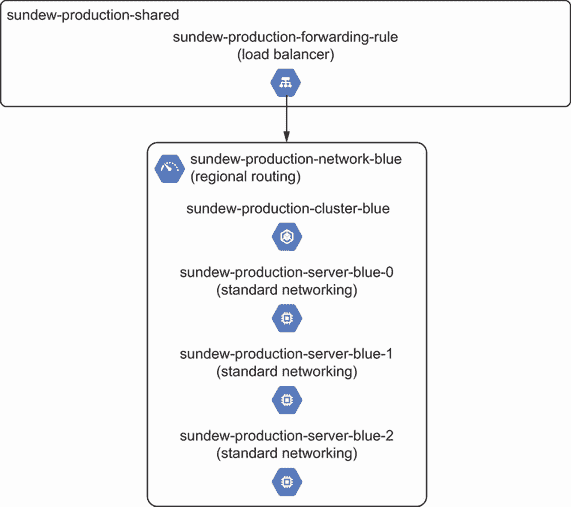

图 9.1 开普敦捕蝇草应用程序使用了一个具有共享负载均衡资源、三个服务器和一个容器集群的基础设施系统。

您希望将所有资源更改为将流量发送到全球，而不是在单个区域内路由。然而，捕蝇草团队在同一个 IaC 中定义了所有这些资源，也称为单例模式（参见第三章）。这些资源还共享基础设施状态。

您如何将网络变更部署到系统中并最小化其影响？如果您通过就地更改来以可变的方式处理基础设施，您会担心会干扰到浇水应用程序。例如，将您的网络更改为使用全局路由可能会影响支持浇水应用程序的服务器。

您可以从第二章中回忆起，您可以使用不可变性的概念来构建带有新变更的新基础设施。如果您可以将这些技术应用于系统，您可以在不影响旧环境的情况下，在一个新环境中隔离和测试变更。在本章中，您将学习如何隔离和更改 IaC。

注意 展示更改策略需要足够大（且复杂）的示例。如果你运行完整的示例，你将产生超过 GCP 免费层的成本。本书仅包括相关的代码行，为了可读性省略了其余部分。对于完整的代码列表，请参阅本书的代码仓库[`github.com/joatmon08/manning-book/tree/main/ch09`](https://github.com/joatmon08/manning-book/tree/main/ch09)。如果你将这些示例转换为 AWS 和 Azure，你也将产生成本。在可能的情况下，我提供将示例转换为所选云提供商的注释。

## 9.1 更改前的实践

你直接开始改变捕蝇草系统。不幸的是，你意外删除了一个配置属性，该属性用`blue`标记了一个服务器，这允许网络中所有蓝色实例之间的流量。你将你的更改推送到交付管道以测试配置并将其应用到生产中。

测试遗漏了已删除的标签。幸运的是，你的监控系统向你发送了警报，表示浇水应用程序无法与你的新服务器通信！你将所有请求重定向到副本服务器实例，以确保在调试过程中捕蝇草仍然得到浇水。

你意识到你*不应该*开始改变系统。捕蝇草系统有现有的架构和工具，在你开始之前你需要了解。你还需要知道，如果系统有备份或备选环境可供使用，以防你破坏了某些东西。在你进行更改之前，你应该做什么？

### 9.1.1 遵循检查清单

在更改 IaC 时，你总是存在引入错误和其他问题的风险。你需要测试、监控和可观察性（从系统的输出推断系统内部状态的能力）来确保你在更改过程中没有影响系统。如果你对你的系统没有一定的可见性，你就不能快速从破坏性更改中排除问题。

在你改变捕蝇草系统之前，你决定回顾一下你的系统。图 9.2 显示了你要回顾的内容。你首先添加一个测试来检查你的已删除标签。接下来，你检查你的监控系统，进行系统和应用程序的健康检查和指标。最后，你创建副本服务器作为备份，以防你破坏现有的服务器。如果你意外影响了更新的服务器，你可以将流量发送到备份服务器。

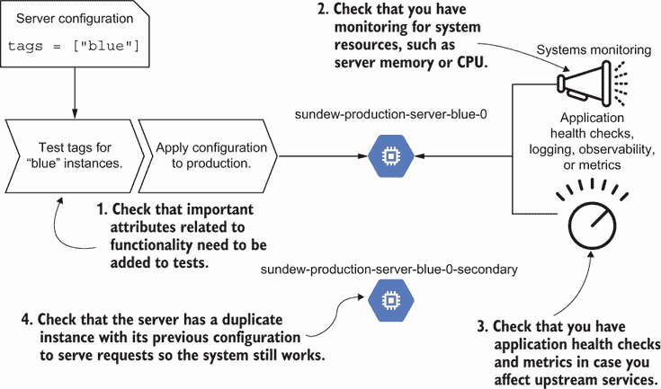

在更新网络之前，你需要验证测试覆盖率、系统和应用程序监控以及冗余。

你为什么创建副本服务器作为备份？当主要资源失败时，拥有额外资源来复制你之前使用的配置是有帮助的。这种*冗余*使你的系统保持运行。

定义 *冗余* 是指复制资源以提高系统的性能。如果更新的组件失败，系统可以使用具有先前配置的工作资源。

通常，在您进行更改之前，请审查以下清单：

+   您能否在每个更改之前预览并**测试**在隔离环境中进行的更改？

+   系统是否配置了**监控和警报**以识别任何异常？

+   应用程序是否通过**健康检查、日志记录、可观察性或指标**跟踪错误响应？

+   应用程序及其系统是否有任何**冗余**？

列表中的项目侧重于可见性和意识。如果没有监控系统或测试来帮助识别问题，您可能难以识别或解决损坏的更改。我曾经推送了一个破坏应用程序的更改，直到**两周**后才得知。由于我们没有在应用程序上设置警报，所以花了这么长时间才意识到问题！

在更改之前，检查清单为调试任何问题以及如果更改失败建立任何备份计划奠定了基础。您甚至可以使用第六章和第八章中的实践，将此检查清单构建到交付管道中作为质量门。

### 9.1.2 添加可靠性

在审查更改前的检查清单后，您意识到您需要在系统中有一个更好的备份环境。为了确保您在持续的重构工作中不会使整个捕蝇草系统崩溃，您需要额外的冗余。当您最终将更改部署到捕蝇草团队的模块时，您不需要担心会破坏系统。

不幸的是，捕蝇草系统仅存在于`us-central1`。如果该区域失败，捕蝇草不会得到浇水！您决定在另一个区域（`us-west1`）构建一个闲置的生产捕蝇草系统，这样您就可以重新启动浇水应用程序。您使用 IaC 将`us-central1`中的主动区域**复制**到`us-west1`中的被动（闲置）区域。

您现在可以使用被动区域中的环境作为备份。在图 9.3 中，您更新捕蝇草团队的配置以使用服务器模块，并将更改推送到主动环境。如果它不起作用，您在调试问题时暂时将所有流量发送到被动环境。否则，您运行测试并使用模块更改更新被动环境。

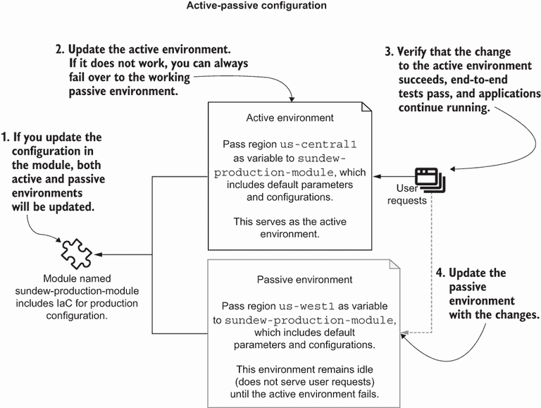

图 9.3 您使用 IaC 为捕蝇草系统实现主动-被动配置，以在更改期间提高其可靠性。

现在的捕蝇草系统采用了一种**主动-被动配置**，其中一个环境处于闲置状态，作为备份。

定义在**主动-被动配置**中，一个系统是用于完成用户请求的主动环境，另一个是备份环境。

如果`us-central1`中的环境停止工作，您始终可以将流量发送到`us-west1`中的另一个被动环境。从失败的主动环境切换到工作的被动环境遵循**故障转移**的过程。

定义**故障转移**是在主要资源失败时使用被动（或备用）资源接管的做法。

你为什么想要一个活动-被动配置？在第二个区域构建一个被动环境可以提高系统的整体可靠性。*可靠性*衡量的是系统在一段时间内正确运行的时间。

定义 *可靠性*衡量的是系统在一段时间内正确运行的时间。

你希望在执行 IaC 更改时保持系统的可靠性。提高可靠性可以最小化对业务关键应用的干扰，并最终减少对最终用户的影响。你可以通过将流量切换到一个工作状态下的被动环境来减少对活动环境的破坏范围。

让我们在代码中创建一个活动-被动配置。在你的终端中，你将名为 blue.py 的文件（包含 sundew 的基础设施资源）复制到一个名为 passive.py 的新文件中：

```
$ cp blue.py passive.py
```

在列表 9.1 中的 passive.py 中，你更新了一些变量以创建被动 sundew 环境，包括区域和名称。

列表 9.1 更新`us-west1`的被动 sundew 环境

```
TEAM = 'sundew'
ENVIRONMENT = 'production'
VERSION = 'passive'                                                 ❶
REGION = 'us-west1'                                                 ❷
IP_RANGE = '10.0.1.0/24'                                            ❸

zone = f'{REGION}-a'
network_name = f'{TEAM}-{ENVIRONMENT}-network-{VERSION}'            ❹
server_name = f'{TEAM}-{ENVIRONMENT}-server-{VERSION}'              ❹

cluster_name = f'{TEAM}-{ENVIRONMENT}-cluster-{VERSION}'            ❹
cluster_nodes = f'{TEAM}-{ENVIRONMENT}-cluster-nodes-{VERSION}'     ❹
cluster_service_account = f'{TEAM}-{ENVIRONMENT}-sa-{VERSION}'      ❹

labels = {                                                          ❺
   'team': TEAM,                                                    ❺
   'environment': ENVIRONMENT,                                      ❺
   'automated': True                                                ❺
}                                                                   ❺
```

❶ 设置版本以识别被动环境。

❷ 将被动环境的区域从 us-central1 更改为 us-west1。

❸ 更新被动环境的不同 IP 地址范围，以避免发送请求。

❹ 剩余的变量和函数引用被动环境的常量，包括区域。

❺ 为资源定义标签，以便你可以识别生产环境。

AWS 和 Azure 等效项

GCP 标签类似于 AWS 和 Azure 标签。你可以将`labels`变量中定义的对象传递给 AWS 和 Azure 资源标签。

现在你有一个备份环境，以防你的模块更改出错。想象一下，你推送更改并破坏了`us-central1`中的活动环境。你可以更新并推送配置，以便生产全局负载均衡器故障切换并将所有流量发送到被动环境。在下面的列表中，你更改全局负载均衡器的权重，以便将 100%的流量发送到被动环境。

列表 9.2 在`us-west1`中故障切换到被动 sundew 环境

```
import blue                                                       ❶
import passive                                                    ❶

services_list = [
   {
       'version': 'blue',                                         ❷
       'zone': blue.zone,
       'name': f'{shared_name}-blue',
       'weight': 0                                                ❸
   }, {
       'version': 'passive',                                      ❷
       'zone': passive.zone,
       'name': f'{shared_name}-passive',
       'weight': 100                                              ❹
   }
]

def _generate_backend_services(services):                         ❺
   backend_services_list = []
   for service in services:
       version = service['version']
       weight = service['weight']
       backend_services_list.append({
           'backend_service': (                                   ❻
               '${google_compute_backend_service.'                ❻
               f'{version}.id}}'                                  ❻
           ),                                                     ❻
           'weight': weight,                                      ❻
       })
   return backend_services_list

def load_balancer(name, default_version, services):
   return [{
       'google_compute_url_map': {                                ❼
           TEAM: [{
               'name': name,
               'path_matcher': [{
                   'name': 'allpaths',
                   'path_rule': [{                                ❽
                       'paths': [                                 ❽
                           '/*'                                   ❽
                       ],                                         ❽
                       'route_action': {                          ❾
                           'weighted_backend_services':           ❾
                               _generate_backend_services(        ❾
                                   services)                      ❾
                       }                                          ❾
                   }]
               }]
           }]
       }
   }]
```

❶ 导入蓝色（活动环境）和被动环境的 IaC。

❷ 为每个环境定义一个版本列表，以便将其附加到负载均衡器，蓝色和被动。

❸ 配置负载均衡器，将 0%的流量发送到蓝色版本。

❹ 配置负载均衡器，将 100%的流量发送到被动版本。

❺ 将两个版本及其权重作为路由添加到负载均衡器的负载均衡规则中。

❻ 定义了蓝色和被动环境的后端服务，并为每个环境分配权重以引导流量。

❼ 使用基于路径、蓝色（活动）和被动服务器以及权重的 Terraform 资源创建 Google 计算 URL 映射（负载均衡规则）。

❽ 设置路径规则，将所有路径导向活动或被动服务器。

❾ 将两个版本及其权重作为路由添加到负载均衡器的负载均衡规则中。

AWS 和 Azure 等效项

Google Cloud URL 映射类似于 AWS 应用负载均衡器（ALB）或 Azure 流量管理器和应用程序网关。要将列表 9.2 转换为 AWS，您需要更新资源以创建 AWS ALB 和监听器规则。然后，向 ALB 监听器规则添加路径路由和权重属性。

对于 Azure，您需要将 Azure 流量管理器配置文件和端点链接到 Azure 应用程序网关。更新 Azure 流量管理器，设置权重并将它们路由到连接到 Azure 应用程序网关的正确后端地址池。

在将系统故障转移到被动环境后，Sundew 团队报告了浇水应用程序的回归。您有机会在蓝色（主动）环境中调试模块的问题。主动-被动配置将保护未来单个区域中的故障。

Sundew 团队成员告诉您，最终，他们希望将流量发送到两个区域。每个区域中的两个环境都处理请求。图 9.4 显示了他们的理想配置。下次，他们想更新模块并将其推送到一个区域。如果某个区域出现故障，*大多数*请求仍然会由系统处理。您减少对 Sundews 的浇水频率，但有机会修复损坏的区域。

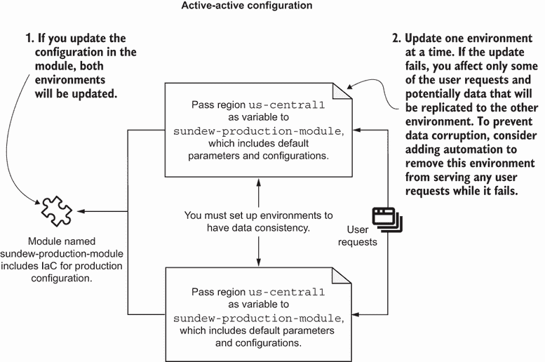

图 9.4 在未来，Sundew 团队将进一步重构系统配置以支持活动-活动配置并向两个区域发送请求。

为什么要追求运行两个活跃环境？许多分布式系统都在 *活动-活动配置* 下运行，这意味着两个系统都处理和接受请求，并在它们之间复制数据。公共云架构建议使用多区域、活动-活动配置来提高系统的可靠性。

定义 在 *活动-活动配置* 中，多个系统是完成用户请求和它们之间数据复制的活跃环境。

您对 IaC 的更改将取决于主动-被动或主动-活动配置。Sundew 团队的主动-活动配置必须将 IaC 重构为更模块化的组件，并支持环境之间的数据复制。假设 Sundew 团队重构其应用程序以支持主动-活动配置，您需要在 IaC 中实现某种形式的全局负载均衡并将其连接到每个区域。

IaC 符合 *可重复性*，我们在第一章中讨论了这一点。多亏了这个原则，我们只需对属性进行少量更新，就可以在新的区域中创建一个新环境。您不必像我们在第二章中所做的那样，逐个资源地痛苦地重建环境资源。

然而，您可能会发现自己正在大量复制粘贴相同的配置。尝试将区域作为输入传递，并将您的 IaC 模块化以减少复制粘贴。将共享资源配置，如全局负载均衡器定义，从环境配置中分离出来。

多区域环境在金钱和时间上都会产生成本，但可以帮助提高系统可靠性。IaC 加速在其他区域创建新环境的副本，并强制跨区域保持一致配置。区域之间的不一致性可能导致重大的系统故障并增加维护工作量！第十二章讨论了成本管理和其考虑因素。

## 9.2 蓝绿部署

现在您有另一个环境可以作为备选，以防您意外损坏活动环境，您可以从更新 sundew 系统以使用全局网络和高级别网络访问服务器开始。sundew 系统使用主动-被动配置，这意味着在新的区域中复制整个新环境只是为了进行更改。

您意识到某些更改不需要在多个区域复制整个环境。为什么要有整个被动环境只是为了更新服务器？难道不能只更新一台服务器吗？毕竟，我们希望最小化故障的爆炸半径并优化资源效率。除了使用主动-被动配置外，您还可以将此模式应用于规模更小的少量资源。

在图 9.5 中，您使用全局网络而不是整个环境重新创建了一个新的*网络*。您将新的网络标记为`绿色`，并在其上部署了一组三台服务器和一个集群。在测试新资源后，您使用全局负载均衡器将一小部分流量发送到新资源。请求成功，表明全局路由的更新工作正常。

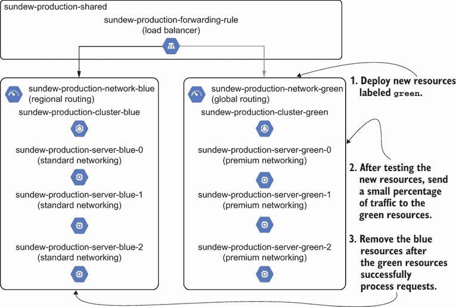

图 9.5 使用蓝绿部署为全球网络创建绿色环境，将部分流量发送到新资源，并移除旧资源。

创建一组新资源并逐渐切换到它们的模式，应用了您系统的可组合性和可进化性原则。您向环境中添加一组新的`绿色`资源，并允许它们独立于旧资源独立进化。如果您想更改基础设施，重复此工作流程以减少更改的爆炸半径，并在将流量发送到它们之前测试新资源。

这种称为*蓝绿部署*的模式创建了一个新的基础设施资源子集，用于阶段化您想要进行的更改，标记为`绿色`。然后，您将一些请求定向到绿色阶段化基础设施资源，并确保一切正常。随着时间的推移，您将所有请求发送到绿色基础设施资源，并移除标记为`蓝色`的旧生产资源。

定义*蓝绿部署*是一种创建包含您想要进行更改的新子集基础设施资源的模式。您逐渐将流量从旧资源集（蓝色）转移到新资源集（绿色），并最终移除旧资源。

蓝绿部署允许您在发送请求之前在（暂时性）新的预发布环境中隔离和测试更改。在验证绿色环境后，您可以将新环境切换到生产环境并删除旧环境。您暂时为两个环境支付几周的费用，但最大限度地减少维护持久环境的总体成本。

注意：蓝绿部署有几个不同的标签，有时根据上下文会有细微的差别。无论您将环境标记为哪种颜色或名称，只要您能识别出哪个环境作为现有的生产环境或新的预发布环境即可。我还在蓝绿部署期间使用了生产/预发布和版本编号（v1/v2）来识别旧资源和新资源。

您应该使用蓝绿部署模式来重构或更新您的 IaC 超过一些最小配置。蓝绿部署依赖于不可变性原则来创建新资源，将流量或功能切换到它们，并删除旧资源。大多数重构（第十章）和更改 IaC 的模式通常涉及可重复性原则。

镜像构建和配置管理

您可以通过应用蓝绿部署模式类似地减轻失败机器镜像或配置的风险。将机器镜像或配置管理更新隔离到新的服务器（绿色），将其发送流量，并在删除旧服务器（蓝色）之前测试其功能。

您已经有一个用于现有 `blue` 网络的全局负载均衡器，您可以在以后用它来连接新的 `green` 网络。在接下来的章节中，我们将实现 sundew 系统的蓝绿部署的每个步骤。

### 9.2.1 部署绿色基础设施

要为 sundew 系统的全局网络和高级服务器启动蓝绿部署，您复制现有蓝色网络的配置。您创建名为 green.py 的文件并将蓝色网络配置粘贴进去。在下面的列表中，您对网络定义进行修改，使其使用全局路由模式。

列表 9.3 创建绿色网络

```
TEAM = 'sundew'
ENVIRONMENT = 'production'
VERSION = 'green'                                            ❶
REGION = 'us-central1'
IP_RANGE = '10.0.0.0/24'                                     ❷

zone = f'{REGION}-a'
network_name = f'{TEAM}-{ENVIRONMENT}-network-{VERSION}'     ❸

labels = {
   'team': TEAM,
   'environment': ENVIRONMENT,
   'automated': True
}

def build():                                                 ❸
   return network()                                          ❸

def network(name=network_name,                               ❸
           region=REGION,
           ip_range=IP_RANGE):
   return [
       {
           'google_compute_network': {                       ❹
               VERSION: [{
                   'name': name,
                   'auto_create_subnetworks': False,
                   'routing_mode': 'GLOBAL'                  ❺
               }]
           }
       },
       {
           'google_compute_subnetwork': {                    ❻
               VERSION: [{
                   'name': f'{name}-subnet',
                   'region': region,
                   'network': f'${{google_compute_network.{VERSION}.name}}',
                   'ip_cidr_range': ip_range
               }]
           }
       }
   ]
```

❶ 将新网络版本的名称设置为“绿色”

❷ 保持绿色网络的 IP 地址范围与蓝色网络相同。如果您没有设置对等连接，GCP 允许两个网络具有相同的 CIDR 块。

❸ 使用模块为绿色网络和子网络创建 JSON 配置

❹ 使用基于名称和全局路由模式的 Terraform 资源创建 Google 网络

❺ 将绿色网络的路由模式更新为全局，以在全球范围内暴露路由

❻ 使用基于名称、区域、网络和 IP 地址范围的 Terraform 资源创建 Google 子网络

AWS 和 Azure 的等效方案

如果你将列表 9.3 转换为 AWS 或 Azure，全局路由模式不适用。你仍然可以通过更改 Google 的网络和子网络为 VPC 或虚拟网络，以及更改子网和路由表来更新代码列表以适用于 AWS 或 Azure。

当可能时，你希望保持蓝色和绿色资源的相同配置。它们应该只在你想对绿色资源进行的更改上有所不同。然而，你可能有某些差异！

例如，如果我为我的一些网络有特定的对等配置，我*不能*使用蓝网络的 IP 地址范围用于绿色网络。相反，我需要一个不同的 IP 地址范围，如 10.0.1.0/24，并更新任何依赖以与另一个 IP 地址范围通信。

蓝绿部署倾向于不可变性，创建新的、更新的资源并将更改与旧资源隔离。然而，部署低级资源如网络的新版本并不意味着你可以立即向其发送实时流量。你总是从更改和测试你想要更新的基础设施资源开始。然后，你必须更改和测试*其他*依赖于它的资源。

### 9.2.2 将高级依赖部署到绿色基础设施

当你使用蓝绿部署模式时，你总是需要部署一个新的基础设施资源及其依赖的新一组高级资源。你完成了网络的更新，但除非你有服务器和应用程序在上面，否则你不能使用它。新的网络需要依赖于它的高级基础设施。

你向露珠团队传达部署新集群和服务器到绿色网络的指示，如图 9.6 所示。服务器必须在全局网络上使用高级网络。露珠团队还将其应用程序部署到集群和服务器上。

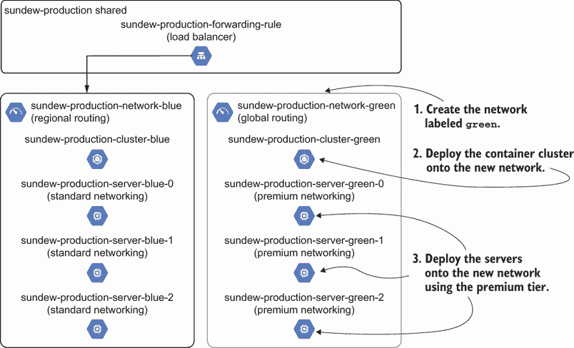

图 9.6 在创建网络，一个低级基础设施资源之后，你还需要创建新的高级资源，如依赖于它的服务器和容器集群。

在这个例子中，更改低级基础设施资源如网络会影响高级资源。服务器必须使用高级网络运行。将原始`blue`网络就地从区域路由更新为全局路由可能会影响服务器和集群。使用蓝绿部署，你*演进*服务器的网络属性，而不影响实时环境。

让我们回顾一下露珠团队成员添加到以下列表中的 IaC 样本，用于将集群部署到`green`网络。他们从`blue`资源复制了集群配置，并更新了其属性以在`green`网络上运行。

列表 9.4 向绿色网络添加新的集群

```
VERSION = 'green'                                                                ❶

cluster_name = f'{TEAM}-{ENVIRONMENT}-cluster-{VERSION}'                         ❶
cluster_nodes = f'{TEAM}-{ENVIRONMENT}-cluster-nodes-{VERSION}'                  ❶
cluster_service_account = f'{TEAM}-{ENVIRONMENT}-sa-{VERSION}'                   ❶

def build():                                                                     ❷
   return network() + \
       cluster()                                                                 ❸

def cluster(name=cluster_name,                                                   ❹
           node_name=cluster_nodes,                                              ❹
           service_account=cluster_service_account,                              ❹
           region=REGION):                                                       ❹
   return [
       {
           'google_container_cluster': {                                         ❺
               VERSION: [
                   {
                       'initial_node_count': 1,   
                       'location': region,
                       'name': name,                                             ❺
                       'remove_default_node_pool': True,
                       'network': f'${{google_compute_network.{VERSION}.name}}', ❻
                       'subnetwork': \                                           ❻
                         f'${{google_compute_subnetwork.{VERSION}.name}}'        ❻
                   }
               ]
           }
       }
   ]
```

❶ 将集群的新版本标记为“green”

❷ 使用模块创建绿色网络的网络、子网络和集群的 JSON 配置

❸ 在绿色网络和子网络上构建集群

❹ 将所需的属性传递给集群，包括名称、节点名称、自动化服务账户和区域

❺ 使用具有一个节点和绿色网络的 Terraform 资源创建 Google 容器集群

❻ 在绿色网络和子网络上构建集群

AWS 和 Azure 等效

您可以通过将 Google 容器集群更改为 Amazon EKS 集群或 Azure Kubernetes 服务 (AKS) 集群来更新代码。您将需要一个 Amazon VPC 和 Azure 虚拟网络用于 Kubernetes 节点池（也称为组）。

集群不需要任何更改即可适应全局网络配置。然而，服务器需要高级网络。您从 `blue` 复制服务器配置，并将其更改为在 green.py 中使用高级网络属性。

列表 9.5 向绿色网络上的服务器添加高级网络

```

VERSION = 'green'                                           ❶

server_name = f'{TEAM}-{ENVIRONMENT}-server-{VERSION}'      ❷

def build():                                                ❸
   return network() + \
       cluster() + \
       server0() + \                                        ❹
       server1() + \                                        ❹
       server2()                                            ❹

def server0(name=f'{server_name}-0',                        ❺
           zone=zone):                                      ❺
   return [
       {
           'google_compute_instance': {                     ❻
               f'{VERSION}_0': [{
                   'allow_stopping_for_update': True,
                   'boot_disk': [{
                       'initialize_params': [{
                           'image': 'ubuntu-1804-lts'    
                       }]
                   }],
                   'machine_type': 'f1-micro',          
                   'name': name,
                   'zone': zone,
                   'network_interface': [{
                       'subnetwork': \
                            f'${{google_compute_subnetwork.{VERSION}.name}}',
                       'access_config': {
                           'network_tier': 'PREMIUM'        ❼
                       }
                   }]
               }]
           }
       }
   ] 
```

❶ 将新版本的“绿色”网络进行标记

❷ 创建服务器名称模板，包括团队、环境和版本（蓝色或绿色）

❸ 使用模块创建网络、子网络、集群和绿色网络的 JSON 配置

❹ 在绿色网络上构建与集群相关的三个服务器

❺ 复制并粘贴每个服务器配置。此代码片段展示了第一个服务器，server0。为了清晰起见，省略了其他服务器配置。

❻ 使用绿色网络上的 Terraform 资源创建一个小型 Google 计算实例（服务器）

❼ 设置网络层以使用高级网络。这使它与使用全局路由的底层子网兼容。

AWS 和 Azure 等效

如果将列表 9.5 转换为 AWS 或 Azure，则网络层不适用。您仍然可以通过将 Google 计算实例更改为 Amazon EC2 实例或带有 Ubuntu 18.04 映像的 Azure Linux 虚拟机来更新代码。首先您需要一个 Amazon VPC 和 Azure 虚拟网络。

将网络层更新为高级 *不应* 影响应用程序的功能，尽管您并不完全确定！绿色环境允许您在影响太阳草生长之前识别和缓解任何问题。在太阳草团队进行更新后，它将更改推送到交付管道并检查测试结果。

测试包括单元测试、集成测试和端到端测试，以确保您可以在新的容器集群上运行应用程序并向新的绿色服务器发送请求。幸运的是，测试通过了，您感觉准备好将实时流量发送到绿色资源。

### 9.2.3 使用金丝雀部署到绿色基础设施

您可以立即将所有流量发送到绿色网络、服务器和集群。然而，您不希望关闭 sundew 系统！理想情况下，当您发现系统有问题时，您希望将所有流量切换回蓝色。在图 9.7 中，您调整全局负载均衡器，将 90% 的流量发送到蓝色网络，并将 10% 的流量发送到绿色网络上的服务。

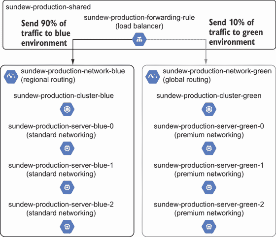

图 9.7 配置全局负载均衡器以运行金丝雀测试并向绿色资源发送少量流量。

如果发送到您系统的少量流量（称为 *金丝雀部署*）导致请求错误，您需要调试和修复您的更改。

定义 *金丝雀部署* 是一种模式，它将少量流量发送到系统中的更新资源。如果请求成功完成，您将随着时间的推移逐渐增加流量的百分比。

为什么首先发送少量流量？您不希望所有请求都失败。向更新的资源发送少量请求有助于在影响整个系统之前识别关键问题。

矿井中的金丝雀

在软件或基础设施中，*金丝雀* 作为新系统、功能或应用程序是否工作的第一个指标。这个术语来自表达“矿井中的金丝雀”。

您在软件开发中经常会发现对金丝雀测试的引用，它衡量应用程序或功能新版本的用户体验。我强烈推荐金丝雀部署，这是一种将少量流量发送到新资源的技术，您在做出重大基础设施更改时应该使用它。

注意，您**不必**使用负载均衡器来实现金丝雀部署。您可以使用任何方法向更新的基础设施资源发送少量请求。例如，您可以将一个更新的应用程序实例添加到现有的三个应用程序实例池中。轮询负载均衡方案会将大约 25% 的请求发送到新的、更新的实例，并将 75% 的请求发送到旧的、现有的应用程序实例。

对于 sundew 团队，您将全局负载均衡器配置与绿色和蓝色环境分开。这提高了负载均衡器的可扩展性。您将绿色服务器作为单独的后端服务添加到负载均衡器中，并控制绿色和蓝色环境之间的请求。

您在以下列表中定义了名为 shared.py 的文件中的负载均衡器。让我们将网络的绿色版本（包括服务器和集群）添加到具有 10 个权重的版本化环境列表中。

列表 9.6 将绿色版本添加到负载均衡服务列表中

```
import blue                                         ❶
import green                                        ❶

shared_name = f'{TEAM}-{ENVIRONMENT}-shared'        ❷

services_list = [                                   ❸
   {
       'version': 'blue',                           ❹
       'zone': blue.zone,                           ❹
       'name': f'{shared_name}-blue',               ❹
       'weight': 90                                 ❺
   },
   {
       'version': 'green',                          ❻
       'zone': green.zone,                          ❻
       'name': f'{shared_name}-green',              ❻
       'weight': 10                                 ❼
   }
]

def _generate_backend_services(services):           ❽
   backend_services_list = []
   for service in services:                         ❾
       version = service['version']                 ❾
       weight = service['weight']                   ❾
       backend_services_list.append({
           'backend_service': (                     ❾
               '${google_compute_backend_service.'  ❾
               f'{version}.id}}'                    ❾
           ),    
           'weight': weight,                        ❾
       })
   return backend_services_list
```

❶ 导入蓝色和绿色环境的 IaC

❷ 根据团队和环境创建共享全局负载均衡器的名称

❸ 定义每个环境的版本列表，以便附加到负载均衡器，包括蓝色和绿色环境

❸ 将蓝色网络、服务器和集群添加到负载均衡器列表中。从其 IaC 中检索蓝色环境的可用区。

❺ 将流量权重设置为蓝色服务器实例的 90%，代表 90% 的请求

❻ 将绿色网络、服务器和集群添加到负载均衡器列表中。从其 IaC 中检索绿色环境的可用区。

❷ 将流量权重设置为绿色服务器实例的 10%，代表 10% 的请求

❽ 创建一个函数以生成负载均衡器的后端服务列表

❾ 对于每个环境，定义一个具有版本和权重的 Google 负载均衡后端服务

AWS 和 Azure 的等效功能

列表 9.6 中的后端服务类似于 AWS ALB 的 AWS 目标组。然而，Azure 需要额外的资源。您需要创建 Azure Traffic Manager 配置文件和端点，并将其链接到附加到 Azure Application Gateway 的后端地址池。

shared.py 中的负载均衡器已经可以接受具有不同权重的后端服务列表。一旦您在以下列表中部署了权重和服务列表，负载均衡器配置开始将 10% 的流量发送到绿色网络。

列表 9.7 更新负载均衡器以将流量发送到绿色环境

```
default_version = 'blue'                                       ❶

def load_balancer(name, default_version, services):            ❷
   return [{
       'google_compute_url_map': {                             ❸
           TEAM: [{
               'default_service': (                            ❶
                   '${google_compute_backend_service.'         ❶
                   f'{default_version}.id}}'                   ❶
               ),    
               'description': f'URL Map for {TEAM}',
               'host_rule': [{
                   'hosts': [
                       f'{TEAM}.{COMPANY}.com'
                   ],
                   'path_matcher': 'allpaths'
               }],
               'name': name,
               'path_matcher': [{
                   'default_service': (                        ❶
                       '${google_compute_backend_service.'     ❶
                       f'{default_version}.id}}'               ❶
                   ),                                          ❶
                   'name': 'allpaths',
                   'path_rule': [{
                       'paths': [
                           '/*'
                       ],
                       'route_action': {
                           'weighted_backend_services':        ❹
                               _generate_backend_services(     ❹
                                   services)                   ❹
                       }
                   }]
               }]
           }]
       }
   }]
```

❶ 默认将所有流量从负载均衡器发送到蓝色环境

❸ 使用该模块创建负载均衡器的 JSON 配置，以将 10% 的流量发送到绿色，90% 的流量发送到蓝色

❸ 使用基于路径、蓝色和绿色环境以及权重的 Terraform 资源创建 Google 计算 URL 映射（负载均衡规则）

❹ 在负载均衡器上设置路由规则，将 10% 的流量发送到绿色，90% 的流量发送到蓝色。

AWS 和 Azure 的等效功能

Google Cloud URL 映射类似于 AWS ALB 或 Azure Traffic Manager 和 Application Gateway。要将列表 9.7 转换为 AWS，您需要更新资源以创建 AWS ALB 和监听器规则。然后，向 ALB 监听器规则添加路径路由和权重属性。

对于 Azure，您需要将 Azure Traffic Manager 配置文件和端点链接到 Azure Application Gateway。更新 Azure Traffic Manager，使用权重并将它们路由到附加到 Azure Application Gateway 的正确后端地址池。

您在列表 9.8 中运行 Python 以构建用于审查的 Terraform JSON 配置。负载均衡器的 JSON 配置包括组织蓝色服务器和绿色服务器的实例组、针对蓝色和绿色实例组的后端服务以及加权路由操作。

列表 9.8 负载均衡器的 JSON 配置

```
{
   "resource": [
       {
           "google_compute_url_map": {                                    ❶
               "sundew": [
                   {
                       "default_service": \                               ❷
                           "${google_compute_backend_service.blue.id}",   ❷
                       "description": "URL Map for sundew",
                       "host_rule": [
                           {
                               "hosts": [
                                   "sundew.dc4plants.com"
                               ],
                               "path_matcher": "allpaths"
                           }
                       ],
                       "name": "sundew-production-shared",
                       "path_matcher": [
                           {
                               "default_service": 
                                 "${google_compute_backend_service.blue.id}",
                               "name": "allpaths",
                               "path_rule": [
                                   {
                                       "paths": [                         ❸
                                           "/*"                           ❸
                                       ],                                 ❸
                                       "route_action": {
                                           "weighted_backend_services": [
                                               {
                                                   "backend_service": 
                                   "${google_compute_backend_             ❹
                                   service.blue.id}",                     ❹
                                                   "weight": 90,          ❹
                                               },
                                               {
                                                   "backend_service":
                                   "${google_compute_backend_             ❺
                                   service.green.id}",                    ❺
                                                   "weight": 10,          ❺
                                               }
                                           ]
                                       }
                                   }
                               ]
                           }
                       ]
                   }
               ]
           }
       }
   ]
}
```

❷ 使用基于路径、蓝色和绿色环境以及权重的 Terraform 资源定义 Google 计算 URL 映射（负载均衡规则）

❷ 为 Google 计算 URL 映射（负载均衡规则）定义默认服务为蓝色环境

❸ 根据权重将所有请求发送到蓝色或绿色环境

❹ 将 90%的流量发送到使用蓝色网络的蓝色后端服务

❺ 将 10%的流量发送到使用绿色网络的绿色后端服务

为什么默认将所有流量发送到蓝色环境？你知道蓝色环境可以成功处理请求。如果你的绿色环境出现问题，你可以快速切换负载均衡器，将流量发送到默认的蓝色环境。

通常，复制、粘贴并更新`green`资源。如果您在模块中表达`blue`资源，您只需更改传递给模块的属性。在可能的情况下，我将绿色和蓝色环境定义分开在单独的文件夹或文件中，这使得以后更容易识别环境。

您可能会注意到在 shared.py 中的一些 Python 代码，这些代码使得更容易进化环境列表和附加到负载均衡器的默认环境。我通常定义一个环境列表和一个默认环境变量。然后，我遍历环境列表，并将属性附加到一个负载均衡器上。这确保了高级负载均衡器可以进化以适应不同的资源和环境。

当您添加新资源时，您可以调整您的负载均衡器以将流量发送到额外的环境。您可能会发现自己每次想要运行蓝绿部署时都要更新负载均衡器的 IaC。花时间和精力配置负载均衡器有助于减轻更改带来的任何问题，并控制可能具有破坏性的更新的发布。

### 9.2.4 执行回归测试

如果您立即将所有流量发送到绿色网络并且它失败了，您可能会破坏开普敦捕蝇草的灌溉系统。因此，您从金丝雀部署开始，每天将发送到绿色网络的流量比例增加 10%。这个过程大约需要两周时间，但您对自己更新网络的正确性感到自信！如果您发现问题，您会减少发送到绿色网络的流量并调试。

图 9.8 显示了您逐渐增加流量并在一段时间内测试绿色环境的过程。您逐渐减少发送到蓝色环境的流量，直到达到 0%。然后，您反向增加发送到绿色环境的流量，直到达到 100%。在禁用蓝色网络之前，您运行绿色环境一周或两周，以防更改破坏了绿色环境中的系统。

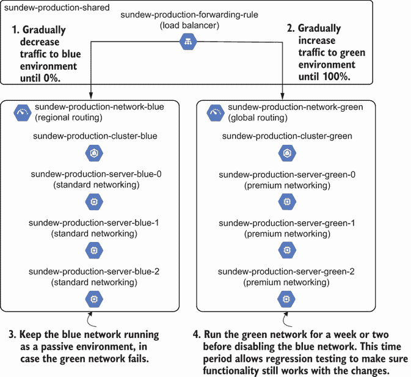

图 9.8 在切断所有流量到新网络并移除旧网络之前，允许一周时间进行回归测试，这为验证功能提供了时间。

逐渐增加流量并在一周前进行的过程似乎很痛苦！然而，您需要让系统通过绿色环境运行足够的流量以确定是否可以继续。一些故障仅在系统通过足够的流量时出现，而其他故障则需要时间来检测。

您花费在测试、观察和监控系统错误的时间窗口成为系统回归测试的一部分。*回归测试* 检查系统更改是否影响现有或新功能。随着时间的推移逐渐增加流量允许您评估系统的功能，同时减轻潜在的失败影响。

定义 *回归测试* 检查系统更改是否影响现有或新功能。

您应该增加多少流量到绿色环境？每天增加 1%的流量不会提供太多信息，除非您的系统每天处理数百万个请求。*逐渐增加*并没有提供明确的增量标准。我建议评估您系统每天处理的请求数量和失败的成本（例如用户请求上的错误）。

我通常从 10%的增量开始，并检查这对系统意味着多少请求。如果我没有获得足够的请求样本量来识别失败，我会增加增量。您希望在每次百分比增加之间插入一个回归测试窗口以识别系统故障。

即使将负载均衡器增加到将所有流量发送到绿色网络，您仍然希望运行测试并监控系统功能一周或两周。为什么运行几周的回归测试？有时您可能会遇到来自应用程序请求的边缘情况，这会破坏功能。通过允许进行回归测试的期间，您可以观察系统是否可以处理意外或不常见的负载或请求。

### 9.2.5 删除蓝色基础设施

您观察捕蝇草系统两周并解决任何错误。您知道蓝色网络大约两周内没有处理任何请求或数据，这意味着您可以在不进行额外迁移步骤的情况下将其删除。您通过与同伴或变更咨询委员会审查来确认其不活跃状态。在从 IaC 中删除蓝色环境之前，图 9.9 更新了默认服务到绿色环境。

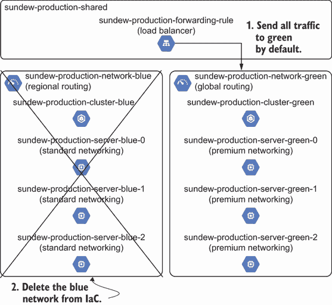

图 9.9 通过从 IaC 中删除它并移除所有引用来退役旧网络。

我认为删除带有网络的蓝色环境是一个重大的变更，需要额外的同行审查。你可能不知道谁在使用该网络。其他你不会与其他团队共享的资源，如服务器，可能不需要额外的同行审查或变更批准。评估删除环境的潜在影响，并根据第七章中的模式对变更进行分类。让我们通过将默认服务设置为绿色网络并从其后端服务中删除蓝色网络来调整 shared.py 中的负载均衡器，如下所示。

列表 9.9 删除蓝色环境负载均衡器

```
import blue                             ❶
import green                            ❶

TEAM = 'sundew'
ENVIRONMENT = 'production'
PORT = 8080

shared_name = f'{TEAM}-{ENVIRONMENT}-shared'

default_version = 'green'               ❷

services_list = [                       ❸
   {
       'version': 'green',
       'zone': green.zone,
       'name': f'{shared_name}-green',
       'weight': 100                    ❹
   }
]
```

❶ 导入蓝色和绿色环境的 IaC

❷ 将负载均衡器的网络默认版本更改为绿色

❸ 从要生成的后端服务列表中删除蓝色网络和实例

❹ 将所有流量发送到绿色网络

AWS 和 Azure 等效物

列表 9.9 在 AWS 和 Azure 中保持不变。你将需要将版本、可用区、名称和权重映射到 AWS ALB 或 Azure Traffic Manager。

你将更改应用到负载均衡器。然而，你**不**立即删除蓝色资源，因为你必须确保负载均衡器不引用任何蓝色资源。在测试更改后，你从 main.py 中删除构建蓝色环境的代码，并保留绿色环境，如下所示。

列表 9.10 从 main.py 中删除蓝色环境

```
import green
import json

if __name__ == "__main__":
   resources = {
       'resource':
       shared.build() +                              ❶
       green.build()                                 ❷
   }

   with open('main.tf.json', 'w') as outfile:        ❸
       json.dump(resources, outfile,                 ❸
                 sort_keys=True, indent=4)           ❸
```

❶ 使用共享模块创建全局负载均衡器的 JSON 配置

❷ 使用绿色模块创建具有全局路由、带高级网络的服务器和集群的网络的 JSON 配置

❸ 将 Python 字典写入 JSON 文件，供 Terraform 后续执行

你应用了更改，你的 IaC 工具删除了所有蓝色资源。你决定删除 blue.py 文件，以防止任何人创建新的蓝色资源。我建议删除你不再使用的任何文件，以减少未来队友的困惑。否则，你可能会拥有比你需要的更多资源的系统。

练习 9.1

考虑以下代码：

```
if __name__ == "__main__":
  network.build()
  queue.build(network)
  server.build(network, queue)
  load_balancer.build(server)
  dns.build(load_balancer)
```

队列依赖于网络。服务器依赖于网络和队列。你将如何运行蓝绿部署以升级带有 SSL 的队列？

请参阅附录 B 以获取练习答案。

### 9.2.6 其他考虑事项

假设 sundew 团队需要再次更改网络。而不是创建一个新的绿色网络，团队可以创建一个新的蓝色网络并重复部署、回归测试和删除过程！由于旧的蓝色网络不再存在，这次更新不会与现有环境冲突。

您为更改的版本或迭代命名的内容并不重要，只要您能够区分新旧资源即可。对于网络而言，您可以考虑分配两组 IP 地址范围。您应该永久保留一组用于蓝色网络，另一组用于绿色网络。这种分配将允许您通过使用蓝绿部署来灵活地做出更改，而无需寻找开放的网络安全空间。

通常，当我遇到以下情况时，我会决定使用蓝绿部署策略：

+   回滚资源更改需要很长时间。

+   我不确定我能否在部署后回滚资源更改。

+   资源有许多我难以轻易识别的高级依赖项。

+   资源更改会影响不能停机的时间关键应用程序。

并非所有基础设施资源都应该使用蓝绿部署。例如，您可以就地更新 IAM 策略，并在发现问题时快速回滚。您将在第十一章中了解更多关于回滚更改的内容。

蓝绿部署策略在时间和金钱上比维护多个环境成本更低。然而，当您必须部署像网络、项目或账户这样的低级基础设施资源时，这种策略将**更贵**！我通常认为这种模式值得成本。它将更改隔离到特定资源，并为部署更改和最小化系统中断提供一种风险较低的方法。

## 9.3 有状态基础设施

在本章中，示例省略了一个重要的基础设施资源类别。然而，捕蝇草系统包括许多处理、管理和存储数据的资源。例如，捕蝇草系统包括一个在具有区域路由的网络上运行的 Google SQL 数据库。

### 9.3.1 蓝绿部署

捕蝇草应用程序团队成员提醒您，他们需要更新数据库以使用具有全局路由的新网络。您在 IaC 中更新私有网络 ID 并将更改推送到您的仓库。您的部署管道在合规性测试（您在第八章中学到的）中失败。

您注意到测试检查了干运行（计划）是否失败，以确定数据库删除操作：

```
$ pytest . -q

F                                                 [100%]
====== FAILURES ======
_____ test_if_plan_deletes_database _____

database = {'address': 'google_sql_database_instance.blue', 'change': 
➥{'actions': ['delete'], 'after': None, 'after_sensitive': False, 
➥'after_unknown': {}, ...}, 'mode': 'managed', 'name': 'blue', ...}

    def test_if_plan_deletes_database(database):
>       assert database['change']['actions'][0] != 'delete'
E       AssertionError: assert 'delete' != 'delete'

test/test_database_plan.py:35: AssertionError
======= short test summary info =======
FAILED test/test_database_plan.py::test_if_plan_deletes_database - 
➥AssertionError: assert 'delete' != 'delete'
1 failed in 0.04s
```

合规性测试阻止您删除关键数据库！如果您在没有测试的情况下应用更改，您将删除**所有**的捕蝇草数据！捕蝇草团队对在原地更新数据库的网络表示担忧，因此您需要进行蓝绿部署。

在图 9.10 中，您手动验证是否可以将数据库迁移到绿色网络。然而，您发现无法迁移数据库。捕蝇草系统可以处理缺失的数据，因此您复制蓝色数据库的 IaC 并在高级网络中创建一个新的绿色数据库实例。在将数据从蓝色数据库迁移到绿色数据库后，您切换应用程序以使用新的数据库，并删除旧的数据库。

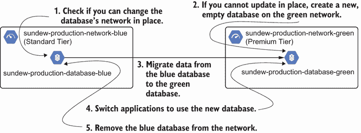

图 9.10 如果你无法就地更新数据库，你必须部署一个新的绿色数据库，迁移和协调数据，并将数据库端点从蓝色更改为绿色。

蓝绿部署策略适用于数据库，这是一类关注状态的底层基础设施资源。*有状态的*基础设施资源，如数据库，存储和管理数据。实际上，所有应用程序都会处理和存储一定量的数据。然而，有状态的基础设施需要额外的关注，因为变化可能会直接影响到数据。这类基础设施包括数据库、队列、缓存或流处理工具。

定义 *有状态的* 基础设施描述的是存储和管理数据的底层基础设施资源。

为什么要在具有数据的底层基础设施上使用蓝绿部署？有时你无法使用 IaC 就地更新资源。替换资源可能会损坏或丢失数据，这会影响你的应用程序。蓝绿部署可以帮助你在应用程序使用之前测试新数据库的功能。

### 9.3.2 更新交付管道

让我们回到捕蝇草团队。你必须修复交付管道以自动化数据库的更新。在图 9.11 中，你通过添加一个步骤来更新你的交付管道，该步骤会自动将数据从蓝色数据库迁移到绿色数据库。当你添加绿色数据库并部署它时，你的管道会部署新的数据库，运行集成测试，自动将数据从蓝色迁移到绿色数据库，并通过端到端测试完成管道。

在自动化迁移步骤时保持*幂等性*。你的迁移脚本或自动化工具应该每次都产生相同的数据库状态。它应该避免在每次运行自动化时重复数据。数据迁移过程取决于你所拥有的有状态基础设施的类型（数据库、队列、缓存或流处理工具）。

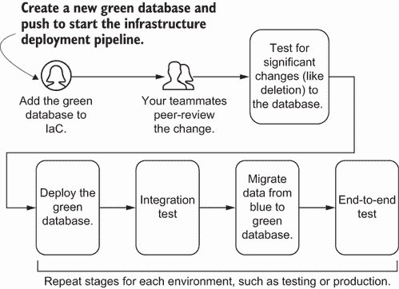

图 9.11 基础设施部署管道应该添加绿色数据库并将数据从蓝色复制到绿色。

注意 你可以写整本书来介绍如何迁移和管理有状态的基础设施，同时尽量减少（或零）停机时间。我推荐 Laine Campbell 和 Charity Majors 的《数据库可靠性工程》（O’Reilly，2017），其中包含其他关于管理数据库的模式和实践。你可以参考其他有状态基础设施资源迁移、升级和可用性的具体文档。

根据你更新有状态基础设施的频率，你应该将自动化的数据迁移捕获到你的部署管道中，而不是在 IaC 中。分离数据迁移允许你更改任何步骤并独立于创建和删除有状态资源来调试迁移问题。

### 9.3.3 金丝雀部署

要完成捕蝇草团队的数据库更新，你需要更改应用配置以使用绿色数据库。作为高级资源，应用依赖于数据库，就像负载均衡器将流量发送到服务器一样。你可以使用修改后的金丝雀部署形式切换到新数据库。

图 9.12 显示了回归测试的模式以及配置应用以使用数据库。经过一段时间的回归测试（以确保功能仍然正常），你更新应用以*写入*数据到绿色数据库。经过另一段时间的回归测试后，你更新应用以从绿色数据库*读取*数据。

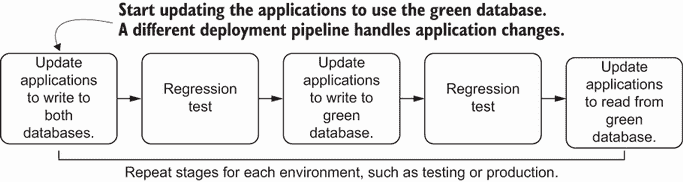

图 9.12 你逐步更新应用部署管道以写入两个数据库，写入绿色数据库，然后从绿色数据库读取。

如果你在应用中遇到问题，可以逐步推出更改以恢复到蓝色数据库。由于应用写入两个数据库，你可能需要编写额外的自动化脚本来协调数据。然而，写入新的有状态基础设施确保你可以测试与存储和更新数据相关的任何关键功能。只有在这种情况下，应用才能正确读取和处理数据。

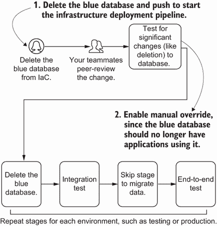

图 9.13 通过从 IaC 中删除蓝色数据库并将其推送到部署管道中来删除蓝色数据库。

现在，由于捕蝇草应用使用绿色数据库，图 9.13 通过从 IaC 中删除它来删除蓝色数据库。请注意，当你删除数据库时，合规性测试将失败，因为你删除了一个数据库！如果你计划删除绿色数据库而不是蓝色数据库，请更新测试以失败。手动覆盖允许你删除蓝色数据库，因为应用不再使用它。

像金丝雀部署这样的技术可以提供快速反馈以减轻失败的影响，尤其是在涉及数据处理的情况中。它可能意味着在数据库中修复几个错误条目与从备份中完全恢复数据库之间的区别！我知道我在一个隔离的绿色环境中对有状态基础设施进行更改，而不是在实时生产系统中，这让我感到安心。

使用不可变性（如蓝绿部署）的策略提供了一个结构化的过程来做出更改并最小化潜在失败的影响范围。多亏了可重复性原则，你通常可以通过复制和编辑配置来使用不可变方法更改 IaC。该原则还允许你通过类似的过程提高基础设施系统的冗余性。

## 摘要

+   在开始任何基础设施更新之前，确保你的系统具有基础设施和应用的测试、监控和可观察性。

+   在 IaC 中的冗余意味着向配置中添加额外的空闲资源，以便在组件故障时进行故障转移。

+   向基础设施即代码（IaC）中添加冗余配置可以提高系统可靠性，衡量系统在一定时期内正确运行的时间。

+   主动-被动配置包括一个主动环境处理请求，以及当主动环境失败时用于替换的重复空闲环境。

+   故障转移将流量从失败的主动环境切换到空闲的被动环境。

+   主动-主动配置设置两个主动环境来处理请求，这两个环境都可以使用 IaC 进行复制和管理。

+   蓝绿部署创建了一个新的基础设施资源子集，用于阶段性地实施您想要进行的更改，并逐渐将请求切换到新的子集。然后您可以删除旧的资源集。

+   在蓝绿部署中，部署您想要更改的资源以及依赖于它的顶级资源。

+   金丝雀部署将一小部分流量发送到新的基础设施资源，以验证系统是否正确工作。随着时间的推移，您会增加流量的百分比。

+   给出几周的时间进行回归测试，以检查系统更改是否影响现有或新的功能。

+   有状态基础设施资源——如数据库、缓存、队列和流处理工具——存储和管理数据。

+   将迁移步骤添加到有状态基础设施资源的蓝绿部署中。您必须在蓝色和绿色有状态基础设施之间复制数据。
