# 10 重构

本章涵盖

+   确定何时重构 IaC 以避免影响系统

+   将功能标志应用于可变地更改基础设施属性

+   解释滚动更新以完成就地更新

随着时间的推移，您可能会超出您用于协作基础设施代码的模式和实践。即使是像蓝绿部署这样的变更技术也无法解决在您的团队处理某些 IaC 时的配置或更改冲突。您必须对 IaC 进行一系列重大更改，并解决实践扩展中的问题。

例如，食肉植物数据中心团队表示，它不能再轻松自信地推出其系统的新更改。团队将所有基础设施资源放在一个仓库中（按照单例模式），以快速交付系统，并且只是不断地在上面添加新的更新。

sundew 团队概述了其系统的一些问题。首先，团队发现其对基础设施配置的更新不断重叠。一位队友正在更新服务器，却发现另一位队友已经更新了网络，这将影响他们的更改。

其次，运行单个更改需要超过 30 分钟。一个更改会对您的基础设施 API 进行数百次调用以检索资源状态，这会减慢反馈周期。

最后，安全团队表示担忧，sundew 基础设施可能存在不安全的配置。当前的配置没有使用标准化的、加固的公司基础设施模块。

您意识到需要更改 sundew 团队的配置。配置应使用安全团队批准的现有服务器模块。您还需要将配置分解为单独的资源，以最小化更改的影响范围。

本章讨论了一些 IaC 模式和技巧，用于分解具有数百个资源的大型单例仓库。作为 sundew 团队的 IaC 助手，您将重构系统的单例配置到单独的仓库中，并将服务器配置结构化以使用模块，以避免冲突并符合安全标准。

注意：演示重构需要足够大（且复杂）的示例。如果您运行完整示例，您将承担超出 GCP 免费层的费用。本书仅包含相关的代码行，为了可读性省略了其余部分。对于完整的列表，请参考本书的代码仓库[`github.com/joatmon08/manning-book/tree/main/ch10`](https://github.com/joatmon08/manning-book/tree/main/ch10)。如果您将这些示例转换为 AWS 和 Azure，您也将产生费用。在可能的情况下，我提供将示例转换为所选云提供商的注释。

## 10.1 最小化重构影响

捕蝇草团队需要帮助分解其基础设施配置。你决定重构基础设施即代码（IaC），以更好地隔离冲突，减少将更改应用到生产所需的时间，并按照公司标准进行安全加固。重构 IaC 涉及重新构建配置或代码，而不影响现有的基础设施资源。

定义重构 IaC 是指在不对现有基础设施资源造成影响的情况下重新构建配置或代码的实践。

你向捕蝇草团队传达，其配置需要进行重构以修复问题。虽然团队成员支持你的努力，但他们要求你尽量减少重构的影响。接受挑战：你在重构 IaC 时应用了一些技术来减少潜在的破坏范围。

技术债务

重构通常可以解决技术债务。技术债务最初是一个隐喻，用来描述任何使整体系统难以更改或扩展的代码或方法的成本。

为了理解应用于 IaC 的技术债务，回想一下捕蝇草团队将所有基础设施资源放入了一个仓库。捕蝇草团队在时间和精力上积累债务。一个本应花费一天的服务器更改需要四天，因为团队需要解决与其他更改的冲突并等待数百次对基础设施 API 的请求。请注意，在复杂的系统中，你总是会有些技术债务，但你需要持续的努力来最小化它。

管理团队害怕听到你需要解决技术债务，因为你没有在开发新功能。我争辩说，你在基础设施中积累的技术债务总是会回来困扰你。技术债务的鬼魂以某人更改基础设施并导致应用程序停机，或者更糟糕的是，导致个人信息泄露并产生货币成本的安全漏洞的形式出现。评估不修复技术债务的影响有助于证明努力的合理性。

### 10.1.1 通过滚动更新减少破坏范围

食肉植物数据中心和安全团队提供了一个具有安全配置的服务器模块，你可以用它来构建捕蝇草系统。捕蝇草团队的基础设施配置有三个服务器配置，但没有使用安全模块。你如何更改捕蝇草的 IaC 以使用该模块？

想象一下，你一起创建了三个新的服务器，并立即向它们发送流量。如果应用程序在服务器上运行不正确，你可能会完全破坏捕蝇草系统，而这些可怜的植物得不到浇水！相反，你可能通过逐个逐步更改服务器来减少服务器模块重构的破坏范围。

在图 10.1 中，你使用模块创建一个服务器配置，将应用程序部署到新服务器，验证应用程序是否正常工作，然后删除旧服务器。你为每个服务器重复此过程两次。你逐渐将更改推广到一台服务器，然后再更新下一台。

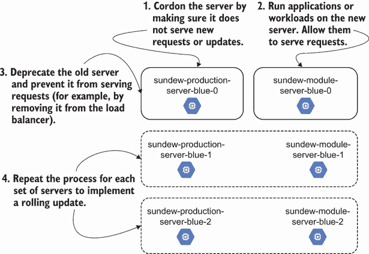

图 10.1 使用滚动更新创建每个新服务器，部署应用程序，并测试其功能，同时最大限度地减少对其他资源的干扰。

**滚动更新**逐个逐渐更改相似资源，并在继续更新之前测试**每个**资源。

定义：**滚动更新**是一种逐个更改一组相似资源并测试它们，然后再将更改实施到下一个资源中的实践。

将滚动更新应用于雾水团队配置，每次更新时都会将故障隔离到单个服务器，并允许你在进行下一个更新之前测试服务器的功能。

滚动更新的实践可以让你避免处理大量失败更改或错误配置的 IaC（基础设施即代码）带来的痛苦。例如，如果食肉植物数据中心模块在一台服务器上不起作用，你还没有将其推广出去并影响到其他服务器。滚动更新让你在继续下一个服务器之前检查每个服务器是否都有适当的 IaC。渐进的方法还可以减轻应用程序的任何停机时间或服务器更新中的故障。

注意：我借鉴了来自工作负载协调器（如 Kubernetes）的**滚动更新**方法进行重构。当你需要为工作负载协调器更新新的节点（虚拟机）时，你可能发现它使用了一个自动化的滚动更新机制。协调器隔离旧节点，防止新的工作负载在其上运行，然后在新的节点上启动所有运行中的进程，将旧节点上的所有进程移除，并将工作负载和请求发送到新节点。当你重构时，你应该模仿这个工作流程！

多亏了滚动更新和增量测试，你知道服务器可以与安全模块一起运行。你告诉团队你已经完成了服务器的重构，并确认它们可以与内部服务一起工作。雾水团队现在可以将所有客户流量发送到新安全服务器。然而，团队成员告诉你，他们需要首先更新面向客户的负载均衡器！

### 10.1.2 使用功能标志进行阶段重构

你需要一种方法在几天内将新服务器从面向客户的负载均衡器中隐藏，并在团队批准后将其附加。然而，你已经有所有配置就绪！你希望用一个变量来隐藏服务器附加，以简化雾水团队的工作。当团队成员完成负载均衡器更新后，他们只需要更新一个变量，将新服务器添加到负载均衡器中。

图 10.2 概述了如何设置变量以添加由模块创建的新服务器。您创建一个布尔值来启用或禁用新服务器模块，使用 `True` 或 `False`。然后，您在 IaC 中添加一个引用布尔值的 `if` 语句。`True` 变量将新服务器添加到负载均衡器。`False` 变量从负载均衡器中删除服务器。

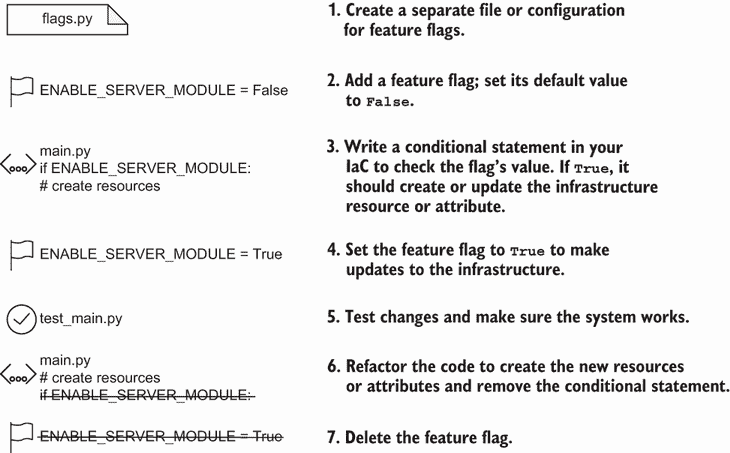

图 10.2 概述了在基础设施即代码（IaC）中特性标志的创建、管理和删除过程。

布尔变量有助于 IaC 的可组合性或可进化性。对变量的单个更改会添加、删除或更新配置。这个变量被称为 *特性标志*（或 *特性开关*），用于启用或禁用基础设施资源、依赖项和属性。您通常在基于主干的开发模型（这些只在主分支上工作）的软件开发中找到特性标志。

定义 *特性标志*（也称为 *特性开关*）通过布尔值启用或禁用基础设施资源、依赖项或属性。

标志隐藏某些特性或代码，并防止它们影响主分支上的其他团队。对于捕蝇草团队，您将新服务器从负载均衡器中隐藏，直到团队完成负载均衡器更改。同样，您可以在 IaC 中使用特性标志进行配置阶段，并通过单个变量推送更新。

设置标志。

要开始实施特性标志并为新服务器进行阶段更改，您添加一个标志并将其设置为 `False`。您将特性标志默认设置为 `False` 以保留原始基础设施状态，如图 10.3 所示。捕蝇草配置默认禁用服务器模块，因此原始服务器不会受到影响。

让我们在 Python 中实现特性标志。您在名为 flags.py 的单独文件中将服务器模块标志的默认值设置为 `False`。该文件定义了标志 `ENABLE_SERVER_MODULE` 并将其设置为 `False`：

```
ENABLE_SERVER_MODULE = False
```

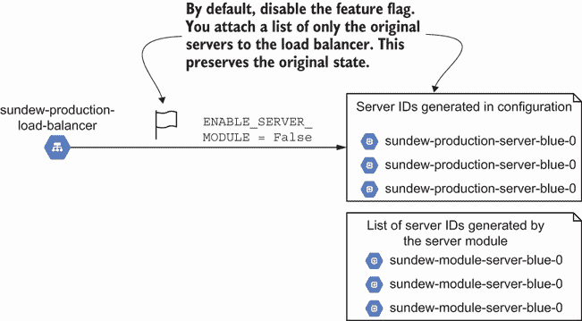

图 10.3 通过将特性标志默认设置为 `False` 来保留基础设施资源的原始状态和依赖项。

您也可以在其他文件中嵌入特性标志作为变量，但您可能会失去对它们的跟踪！您决定将它们放在一个单独的 Python 文件中。

注意：我总是在一个文件中定义特性标志，以便在一个地方识别和更改它们。

以下列表在 main.py 中导入特性标志，并添加生成要添加到负载均衡器的服务器列表的逻辑。

列表 10.1 包含将服务器添加到负载均衡器的特性标志。

```
import flags                                                         ❶

def _generate_servers(version):
   instances = [                                                     ❷
       f'${{google_compute_instance.{version}_0.id}}',               ❷
       f'${{google_compute_instance.{version}_1.id}}',               ❷
       f'${{google_compute_instance.{version}_2.id}}'                ❷
   ]                                                                 ❷
   if flags.ENABLE_SERVER_MODULE:                                    ❸
       instances = [                                                 ❹
           f'${{google_compute_instance.module_{version}_0.id}}',    ❹
           f'${{google_compute_instance.module_{version}_1.id}}',    ❹
           f'${{google_compute_instance.module_{version}_2.id}}',    ❹
       ]                           
   return instances
```

❶ 导入定义所有特性标志的文件。

❷ 使用系统中的 Terraform 资源定义现有 Google 计算实例（服务器）列表。

❸ 使用条件语句评估特性标志，并将服务器模块的资源添加到负载均衡器。

❹ 将功能标志设置为 `True` 将会将模块创建的服务器附加到负载均衡器。否则，它将保持原始服务器

AWS 和 Azure 的等效功能

将列表 10.1 转换为 AWS 或 Azure，请使用 AWS EC2 Terraform 资源（[`mng.bz/VMMr`](http://mng.bz/VMMr)）或 Azure Linux 虚拟机 Terraform 资源（[`mng.bz/xnnq`](http://mng.bz/xnnq)）。您只需更新实例列表中的引用即可。

关闭功能标志运行 Python 生成 JSON 配置。生成的 JSON 配置仅将原始服务器添加到负载均衡器，从而保留现有基础设施资源的状态。

列表 10.2 禁用功能标志的 JSON 配置

```
{
   "resource": [
       {
           "google_compute_instance_group": {                          ❶
               "blue": [
                   {
                       "instances": [
                           "${google_compute_instance.blue_0.id}",     ❷
                           "${google_compute_instance.blue_1.id}",     ❷
                           "${google_compute_instance.blue_2.id}"      ❷
                       ]
                   }
               ]
           }
       }
   ]
}
```

❶ 使用 Terraform 资源创建一个 Google 计算实例组，并将其附加到负载均衡器

❷ 配置包括原始 Google 计算实例的列表，保留基础设施资源的当前状态

AWS 和 Azure 的等效功能

Google 计算实例组在 AWS 或 Azure 中没有直接的等效功能。相反，您需要将计算实例组替换为 AWS Target Group 的资源定义，以用于负载均衡器。对于 Azure，您需要一个后端地址池和三个虚拟机实例的地址（[`mng.bz/ZAAj`](http://mng.bz/ZAAj)）。

默认情况下，功能标志设置为 `False` 使用幂等原则。当您运行 IaC 时，您的基础设施状态不应发生变化。设置标志确保您不会意外更改现有基础设施。保留现有服务器的原始状态，最小化对依赖应用程序的干扰。

启用标志

Sundew 团队对其更改进行了修改，并批准将模块创建的新服务器添加到负载均衡器。您将功能标志设置为 `True`，如图 10.4 所示。当您部署更改时，您将模块创建的服务器附加到负载均衡器，并移除旧服务器。

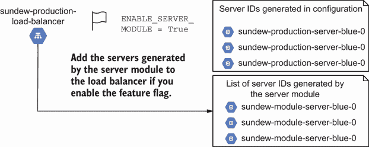

图 10.4 将功能标志设置为 `True`，将模块创建的三个新服务器附加到负载均衡器，并断开旧服务器的连接。

让我们来看看更新后的功能标志在实际操作中的效果。您首先将服务器的功能标志设置为 `True`：

```
ENABLE_SERVER_MODULE = True
```

运行 Python 生成新的 JSON 配置。以下列表中的配置现在包括您将附加到负载均衡器的模块创建的服务器。

列表 10.3 启用功能标志的 JSON 配置

```
{
   "resource": [
       {
           "google_compute_instance_group": {
               "blue": [
                   {
                       "instances": [
                           "${google_compute_instance.module_blue_0.id}",  ❶
                           "${google_compute_instance.module_blue_1.id}",  ❶
                           "${google_compute_instance.module_blue_2.id}"   ❶
                       ]
                   }
               ]
           }
       }
   ]
}
```

❶ 由于您启用了功能标志，模块创建的新服务器替换了旧服务器。

功能标志允许您在不影响负载均衡器高级依赖的情况下，分阶段部署模块的低级服务器资源。您可以通过关闭功能切换重新运行代码，以重新附加旧服务器。

为什么使用功能标志来切换到服务器模块？功能标志在准备好部署与其相关的资源之前，将功能隐藏在生产环境中。你提供一个变量来添加、删除或更新一组资源。你还可以使用相同的变量来撤销更改。

移除标志

在运行服务器一段时间后，sundew 团队报告称新的服务器模块工作正常。你现在可以移除列表 10.4 中的旧服务器。你不再需要功能标志，并且你不想在团队成员阅读代码时造成混淆。你重构负载均衡器的 Python 代码以移除旧服务器和删除功能标志。

列表 10.4：更改完成后移除功能标志

```
import blue                                                       ❶

def _generate_servers(version):
   instances = [                                                  ❷
       f'${{google_compute_instance.module_{version}_0.id}}',     ❷
       f'${{google_compute_instance.module_{version}_1.id}}',     ❷
       f'${{google_compute_instance.module_{version}_2.id}}',     ❷
   ]    
   return instances
```

❶ 你可以移除功能标志的导入，因为你不再需要它来配置你的服务器。

❷ 永久地将模块创建的服务器附加到负载均衡器并移除功能标志

领域特定语言

列表 10.4 展示了编程语言中的功能标志。你还可以在 DSL 中使用功能标志，尽管你必须根据你的工具语法进行适配。在 Terraform 中，你可以通过使用变量和 `count` 元参数来模拟功能标志([`mng.bz/R44n`](http://mng.bz/R44n))：

```
variable "enable_server_module" {
 type        = bool
 default     = false
 description = "Choose true to build servers with a module."
}
module "server" {
 count   = var.enable_server_module ? 1 : 0
 ## omitted for clarity
}
```

在 AWS CloudFormation 中，你可以传递一个参数并设置一个条件([`mng.bz/2nnN`](http://mng.bz/2nnN))来启用或禁用资源创建：

```
AWSTemplateFormatVersion: 2010-09-09
Description: Truncated example for CloudFormation feature flag
Parameters:
 EnableServerModule:
   AllowedValues:
     - 'true'
     - 'false'
   Default: 'false'
   Description: Choose true to build servers with a module.
   Type: String
Conditions:
 EnableServerModule: !Equals
   - !Ref EnableServerModule
   - true
Resources:
 ServerModule:
   Type: AWS::CloudFormation::Stack
   Condition: EnableServerModule
   ## omitted for clarity
```

除了使用功能标志来启用和禁用整个资源外，你还可以使用条件语句来启用或禁用资源的特定属性。

作为一般规则，在完成更改后*移除*功能标志。过多的功能标志会使你的基础设施配置逻辑变得复杂，难以排查问题。

用例

该示例使用功能标志将*单例配置重构为基础设施模块*。我经常将功能标志应用于此用例以简化基础设施资源的创建和删除。功能标志的其他用例包括以下内容：

+   在*相同基础设施*资源或依赖项上进行协作并避免更改冲突

+   预先准备*一系列更改*，并通过更新标志进行快速部署

+   *测试*更改并在失败时快速禁用

功能标志提供了一种在重构基础设施配置时隐藏或隔离基础设施资源、属性和依赖项更改的技术。然而，更改切换仍然可能破坏系统。在 sundew 团队服务器的例子中，我们不能简单地切换功能标志为 `True` 并期望服务器运行应用程序。相反，我们结合功能标志和其他技术，如滚动更新，以最小化对系统的影响。

## 10.2 分解单体

雨燕团队成员表示，他们仍然在系统中遇到问题。您将具有数百个资源和属性的单一配置识别为根本原因。每当有人进行更改时，团队成员必须与其他人解决冲突。他们还必须等待 30 分钟才能进行更改。

对于基础设施即代码（IaC）的单体架构意味着在同一个地方定义所有基础设施资源。您需要将 IaC 的单体分解成更小的、模块化的组件，以最小化团队成员之间的工作冲突并加快更改的部署速度。

定义 A 单体架构的 IaC 定义了单个配置和相同状态下的所有基础设施资源。

在本节中，我们将逐步介绍对雨燕团队单体架构的重构。最关键的一步是从识别和分组高级基础设施资源和依赖关系开始。我们通过完成对低级基础设施资源的重构来完成重构工作。

单体与单仓库

回想一下，您可以将您的基础设施配置放入单个存储库（第五章）。单个存储库是否意味着您有一个单体架构？不一定。您可以将单个存储库细分为单独的子目录。每个子目录包含独立的 IaC。

单体架构意味着您需要一起管理许多资源，并将它们紧密耦合在一起，这使得单独更改子集变得困难。单体通常是由一个初始的单例模式（所有配置都在一个地方）随着时间的推移而扩展形成的。

您可能已经注意到，我在第三章和第四章中立即开始使用模块化基础设施资源和依赖关系的模式。为什么不在更早的时候介绍这一章关于重构的内容？如果您能在 IaC 开发早期识别并应用一些模式，您就可以避免单体架构。然而，您有时会继承一个单体，并且通常需要对其进行重构。

### 10.2.1 重构高级资源

雨燕团队在一组配置文件中管理数百个资源。您应该从哪里开始分解 IaC？您决定寻找不依赖于其他资源的*高级基础设施资源*。

雨燕团队在 GCP 项目级 IAM 服务账户和角色中有一套高级基础设施。IAM 服务账户和角色在设置项目中的用户和服务账户规则之前不需要创建网络或服务器。其他资源都不依赖于 IAM 角色和服务账户。您可以首先对它们进行分组和提取。

由于 GCP 不允许重复策略，因此您不能使用蓝绿部署方法。然而，您不能简单地从单体配置中删除角色和账户并将它们复制到新的存储库中。删除它们会阻止所有人登录项目！您该如何提取它们？

您可以将配置复制粘贴到其单独的存储库或目录中，初始化分离配置的状态，并将资源导入与新的配置相关联的基础设施状态。然后，您删除单体配置中的 IAM 配置。与滚动更新一样，您逐步更改每一组基础设施资源，测试更改，然后进行下一步。

图 10.5 概述了重构单体以处理高级资源的解决方案。您将代码从单体复制到新文件夹，并将实时基础设施资源导入新文件夹中的代码状态。您重新部署代码以确保它不会更改现有基础设施。最后，从单体中删除高级资源。

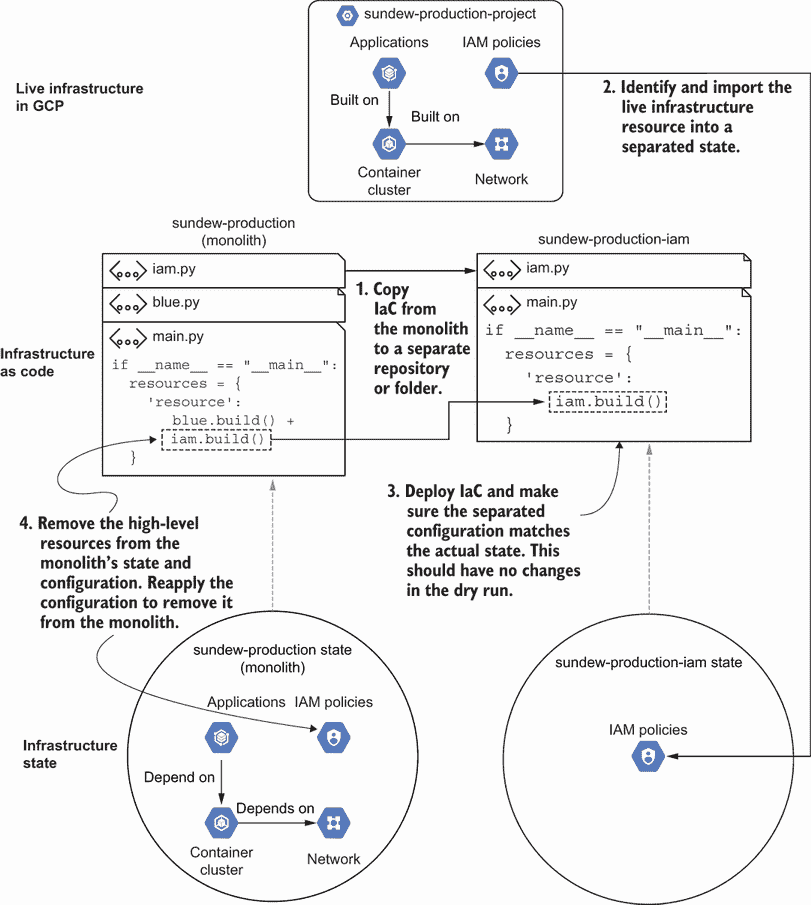

图 10.5 Sundew 系统的 GCP 项目 IAM 策略没有依赖关系，您可以轻松重构而不会干扰其他基础设施。

与功能标志一样，我们使用幂等性原则来运行基础设施即代码（IaC）并验证我们不会影响活动基础设施状态。每次重构时，确保您部署更改并检查预览运行。您不希望意外更改现有资源并影响其依赖项。

我们将在接下来的几节中重构示例。请继续关注！我知道重构往往感觉枯燥，但逐步的方法可以确保您不会将广泛的故障引入您的系统。

从单体复制到单独的状态

您的初始重构开始于将代码复制到新目录以创建 IAM 角色和服务账户。Sundew 团队希望保持单个存储库结构，该结构存储所有 IaC 在一个源代码控制存储库中，但将配置分离到文件夹中。

您确定要复制的 IAM 角色和服务账户，并将团队的代码复制到新文件夹，如图 10.6 所示。GCP 中的活动 IAM 策略及其基础设施状态保持不变。

为什么要在单独的文件夹中重现 IAM 策略的 IaC？您希望分割您的单体 IaC 而不影响任何活动资源。重构时最重要的实践是保持幂等性。当您移动 IaC 时，您的活动状态不应发生变化。

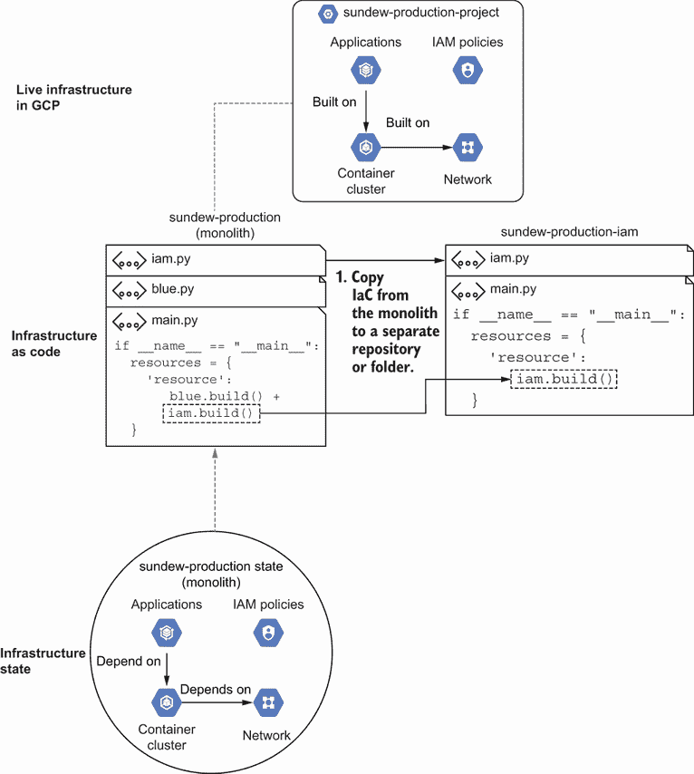

将 IAM 策略的文件复制到新的目录以用于 `sundew-production-iam` 配置，并避免更改 GCP 中的实时基础设施资源。

让我们开始从单体中重构 IAM 策略。创建一个仅管理 GCP 项目 IAM 策略的新目录：

```
$ mkdir -p sundew_production_iam
```

将 IAM 配置从单体复制到新目录：

```
$ cp iam.py sundew_production_iam/
```

您不需要更改任何内容，因为 IAM 策略不依赖于其他基础设施。以下列表中的文件 iam.py 分离了用户集合的创建和角色分配。

列表 10.5 从单体中分离的 IAM 配置

```
import json

TEAM = 'sundew'
TERRAFORM_GCP_SERVICE_ACCOUNT_TYPE = 'google_service_account'             ❶
TERRAFORM_GCP_ROLE_ASSIGNMENT_TYPE = 'google_project_iam_member'          ❶

users = {                                                                 ❷
   'audit-team': 'roles/viewer',                                          ❷
   'automation-watering': 'roles/editor',                                 ❷
   'user-02': 'roles/owner'                                               ❷
}                                                                         ❷

def get_user_id(user):
   return user.replace('-', '_')

def build():
   return iam()

def iam(users=users):                                                     ❸
   iam_members = []
   for user, role in users.items():
       user_id = get_user_id(user)
       iam_members.append({
           TERRAFORM_GCP_SERVICE_ACCOUNT_TYPE: [{                         ❹
               user_id: [{                                                ❹
                   'account_id': user,                                    ❹
                   'display_name': user                                   ❹
               }]                                                         ❹
           }]                                                             ❹
       })
       iam_members.append({
           TERRAFORM_GCP_ROLE_ASSIGNMENT_TYPE: [{                         ❺
               user_id: [{                                                ❺
                   'role': role,                                          ❺
                   'member': 'serviceAccount:${google_service_account.'   ❺
                   + f'{user_id}' + '.email}'                             ❺
               }]                                                         ❺
           }]                                                             ❺
       })
   return iam_members
```

❶ 将 Terraform 使用的资源类型设置为常量，以便您在需要时可以引用它们

❷ 将您添加到项目中的所有用户作为单体的一部分保留

❸ 使用模块创建 IAM 策略的 JSON 配置，这些配置位于单体之外

❹ 为 sundew 生产项目中的每个用户创建一个 GCP 服务账户

❺ 分配为每个服务账户定义的特定角色，例如查看者、编辑器或所有者

AWS 和 Azure 的等效功能

列表 10.5 创建所有用户和组作为 GCP 中的服务账户，以便您可以完成示例。您通常使用服务账户进行自动化。

GCP 中的服务账户类似于 AWS IAM 用户，专门用于服务自动化或与客户端密钥注册的 Azure Active Directory 应用。为了在 AWS 或 Azure 中重建代码，调整查看者、编辑器和所有者角色以适应 AWS 或 Azure 角色。

在分离配置时设置常量并创建输出资源类型和标识符的方法。您始终可以使用它们进行其他自动化和持续的系统维护，尤其是在您继续重构单体时！

在以下列表中，在 sundew_production_iam 文件夹中创建一个 main.py 文件，该文件引用 IAM 配置并输出其 Terraform JSON。

列表 10.6 构建单独 IAM JSON 配置的入口点

```
import iam                                       ❶
import json

if __name__ == "__main__":
   resources = {
       'resource': iam.build()                   ❶
   }

   with open('main.tf.json', 'w') as outfile:    ❷
       json.dump(resources, outfile,             ❷
                 sort_keys=True, indent=4)       ❷
```

❶ 导入 IAM 配置代码并构建 IAM 策略

❷ 将 Python 字典写入 JSON 文件，稍后由 Terraform 执行

不要运行 Python 来创建 Terraform JSON 或部署 IAM 策略！您已经将 IAM 策略定义为 GCP 的一部分。如果您运行 `python` `main.py` 并使用分离的 IAM 配置应用 Terraform JSON，GCP 会抛出一个错误，指出用户账户和分配已存在：

```
$ python main.py

$ terraform apply -auto-approve
## output omitted for clarity
| Error: Error creating service account: googleapi:
➥Error 409: Service account audit-team already exists within project 
➥projects/infrastructure-as-code-book., alreadyExists
```

雨燕团队成员不希望您删除并创建新的账户和角色。如果您删除并创建新账户，他们将无法登录到他们的 GCP 项目。您需要一种方法来迁移单体中定义的现有资源并将它们链接到其自己的文件夹中定义的代码。

将资源导入新状态

有时使用重构后的 IaC 创建新资源可能会干扰开发团队和业务关键系统。您不能使用不可变性的原则来删除旧资源并创建新资源。相反，您必须将活动资源从一个 IaC 定义迁移到另一个。

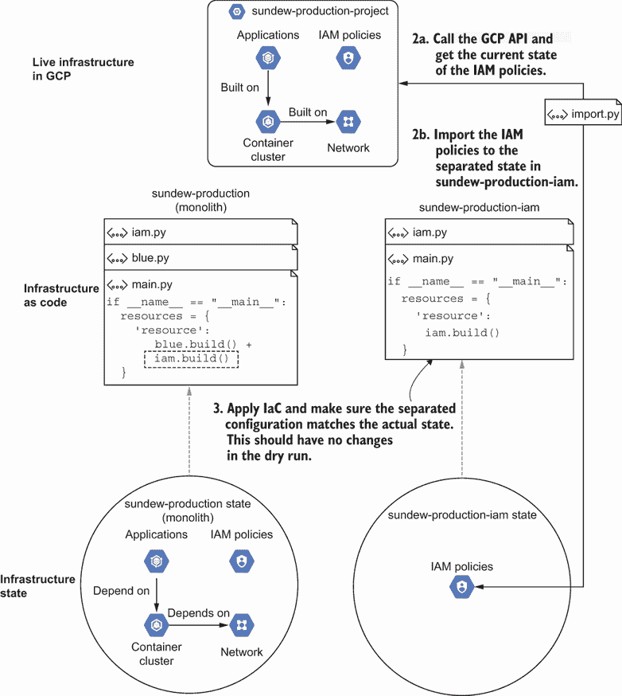

图 10.7 从基础设施提供者获取分离资源的当前状态并在重新应用 IaC 之前导入标识符。

在雾莲团队的情况下，你从单体配置中提取每个服务帐户的标识符，并将它们“移动”到新的状态中。图 10.7 演示了如何从单体中分离每个服务帐户及其角色分配，并将它们附加到 sundew_production_iam 目录中的 IaC。你调用 GCP API 以获取 IAM 策略的当前状态，并将实时基础设施资源导入到分离的配置和状态中。运行 IaC 应该不会显示任何干燥运行的变化。

为什么使用 GCP API 导入 IAM 策略信息？你想要导入资源的更新、活动状态。云提供商的 API 提供了资源的最最新配置。你可以调用 GCP API 来检索雾莲团队的用户电子邮件、角色和标识符。

而不是编写自己的导入功能并将标识符保存到文件中，你决定使用 Terraform 的导入功能将现有资源添加到状态中。你编写了一些 Python 代码，以下列表展示了如何封装 Terraform 来自动化 IAM 资源的批量导入，以便雾莲团队能够重用它。

列表 10.7 文件 import.py 单独导入雾莲 IAM 资源

```
import iam                                                              ❶
import os
import googleapiclient.discovery                                        ❷
import subprocess

PROJECT = os.environ['CLOUDSDK_CORE_PROJECT']                           ❸

def _get_members_from_gcp(project, roles):                              ❷
   roles_and_members = {}                                               ❷
   service = googleapiclient.discovery.build(                           ❷
       'cloudresourcemanager', 'v1')                                    ❷
   result = service.projects().getIamPolicy(                            ❷
       resource=project, body={}).execute()                             ❷
   bindings = result['bindings']                                        ❷
   for binding in bindings:                                             ❷
       if binding['role'] in roles:                                     ❷
           roles_and_members[binding['role']] = binding['members']      ❷
   return roles_and_members                                             ❷

def _set_emails_and_roles(users, all_members):                          ❹
   members = []                                                         ❹
   for username, role in users.items():                                 ❹
       members += [(iam.get_user_id(username), m, role)                 ❹
                   for m in all_members[role] if username in m]         ❹
   return members                                                       ❹

def check_import_status(ret, err):
   return ret != 0 and \
       'Resource already managed by Terraform' 
       ➥not in str(err)

def import_service_account(project_id, user_id, user_email):            ❺
   email = user_email.replace('serviceAccount:', '')                    ❺
   command = ['terraform', 'import', '-no-color',                       ❺
              f'{iam.TERRAFORM_GCP_SERVICE_ACCOUNT_TYPE}.{user_id}',    ❺
              f'projects/{project_id}/serviceAccounts/{email}']         ❺
   return _terraform(command)                                           ❺

def import_project_iam_member(project_id, role,                         ❻
                             user_id, user_email):                      ❻
   command = ['terraform', 'import', '-no-color',                       ❻
              f'{iam.TERRAFORM_GCP_ROLE_ASSIGNMENT_TYPE}.{user_id}',    ❻
              f'{project_id} {role} {user_email}']                      ❻
   return _terraform(command)                                           ❻

def _terraform(command):                                                ❼
   process = subprocess.Popen(                                          ❼
       command,                                                         ❼
       stdout=subprocess.PIPE,                                          ❼
       stderr=subprocess.PIPE)                                          ❼
   stdout, stderr = process.communicate()                               ❼
   return process.returncode, stdout, stderr                            ❼

if __name__ == "__main__":
   sundew_iam = iam.users                                               ❽
   all_members_for_roles = _get_members_from_gcp(                       ❾
       PROJECT, set(sundew_iam.values()))                               ❾
   import_members = _set_emails_and_roles(                              ❿
       sundew_iam, all_members_for_roles)                               ❿
   for user_id, email, role in import_members:
       ret, _, err = import_service_account(PROJECT, user_id, email)    ❺
       if check_import_status(ret, err):                                ⓫
           print(f'import service account failed: {err}')               ⓫
       ret, _, err = import_project_iam_member(PROJECT, role,           ❻
                                               user_id, email)          ❻
       if check_import_status(ret, err):                                ⓫
           print(f'import iam member failed: {err}')                    ⓫
```

❶ 从 sundew_production_iam 中的 iam.py 检索雾莲用户列表

❷ 使用 Google Cloud Client Libraries for Python 获取分配给 GCP 项目中角色的成员列表

❸ 从 CLOUDSDK_CORE_PROJECT 环境变量中检索 GCP 项目 ID

❹ 仅获取雾莲 IAM 成员的电子邮件和用户 ID

❺ 根据项目和使用者电子邮件，将服务帐户导入到 sundew_production_iam 状态中，使用你在 iam.py 中设置的资源类型常量

❻ 根据项目、角色和使用者电子邮件，将角色分配导入到 sundew_production_iam 状态中，使用你在 iam.py 中设置的资源类型常量

❼ 两种导入方法都封装了 Terraform CLI 命令，并返回任何错误和输出。

❽ 从 sundew_production_iam 中的 iam.py 检索雾莲用户列表

❾ 使用 Google Cloud Client Libraries for Python 获取分配给 GCP 项目中角色的成员列表

❿ 仅获取雾莲 IAM 成员的电子邮件和用户 ID

⓫ 如果导入失败且资源尚未导入，则输出错误

Libcloud 与云提供商 SDKs 的比较

本章中的示例需要使用 Google Cloud Client Library for Python 而不是我在第四章中展示的 Apache Libcloud。虽然 Apache Libcloud 可以用于检索虚拟机信息，但它不适用于 GCP 中的其他资源。有关 Google Cloud Client Library for Python 的更多信息，请参阅[`mng.bz/1ooZ`](https://shortener.manning.com/1ooZ)。

您可以将列表 10.7 更新为使用 Python 的 Azure 库([`mng.bz/Pnn2`](https://shortener.manning.com/Pnn2))或 AWS SDK for Python([`aws.amazon.com/sdk-for-python/`](https://aws.amazon.com/sdk-for-python/))来检索有关用户的信息。这些将替换 GCP API 客户端库。

与定义依赖关系一样，您希望从基础设施提供者 API 动态检索您要导入的资源标识符。您永远不知道何时有人会更改资源，您认为需要的标识符可能不再存在！使用您的标签和命名约定在 API 响应中搜索所需的资源。

当您运行 `python import.py` 并使用分离的 IAM 配置对 Terraform JSON 进行干运行时，您会收到一条消息，表明您不需要做出任何更改。您已成功将现有的 IAM 资源导入到其单独的配置和状态中：

```
$ python main.py

$ terraform plan
No changes. Your infrastructure matches the configuration.

Terraform has compared your real infrastructure against your configuration
➥and found no differences, so no changes are needed.

Apply complete! Resources: 0 added, 0 changed, 0 destroyed.
```

有时您的干运行指示活动资源状态和分离配置之间的漂移。您复制的配置与资源的活动状态不匹配。差异通常来自有人在手动更改期间或更改属性默认值时更改基础设施资源的活动状态。更新您的分离 IaC 以**匹配活动基础设施资源**的属性。

带和不带配置工具导入

许多配置工具都有一个导入资源的函数。例如，AWS CloudFormation 使用 `resource import` 命令。示例使用 Python 包装 `terraform import` 命令来移动服务账户。没有它，分解单体配置将变得繁琐。

如果您没有使用工具编写 IaC，则不需要直接导入功能。相反，您需要逻辑来检查资源是否存在。露水服务账户和角色分配可以在没有 Terraform 或 IaC 导入功能的情况下工作：

1.  调用 GCP API 检查露水团队的服务账户和角色附件是否存在。

1.  如果它们存在，检查服务账户属性的 API 响应是否与您期望的配置匹配。根据需要更新服务账户。

1.  如果它们不存在，则创建服务账户和角色附件。

从单体中移除重构的资源

您成功提取并移动了露水团队的服务账户和角色分配到单独的 IaC。然而，您不希望资源留在单体中。在重新应用和更新工具之前，您从单体状态和配置中移除了资源，如图 10.8 所示。

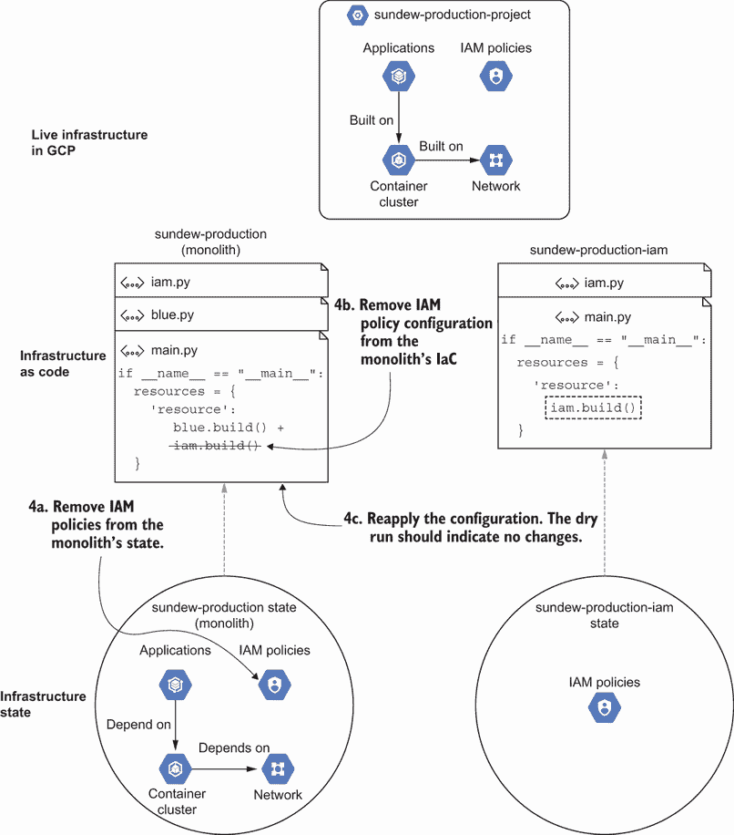

在应用更新并完成重构之前，从单体状态和配置中移除策略 10.8。

此步骤有助于维护 IaC 卫生。记得从第二章中，我们的 IaC 应该作为**真相来源**。您不希望用两套 IaC 管理一个资源。如果它们冲突，资源可能影响依赖关系和系统的配置的两个 IaC 定义。

您希望 IAM 策略目录作为真相来源。从现在起，sundew 团队需要在单独的目录中声明其 IAM 策略的更改，而不是在单体中。为了避免混淆，让我们从 IaC 单体中删除 IAM 资源。

要开始，您必须从 Terraform 状态中删除 sundew IAM 资源，表示为 JSON 文件。Terraform 包含一个状态删除命令，您可以使用它根据资源标识符从 JSON 中取出部分内容。列表 10.8 使用 Python 代码包装 Terraform 命令。该代码允许您传递您想要从基础设施状态中删除的任何资源类型和标识符。

列表 10.8 文件 remove.py 从单体状态中删除资源。

```
from sundew_production_iam import iam                                  ❶
import subprocess

def check_state_remove_status(ret, err):                               ❷
   return ret != 0 \                                                   ❷
       and 'No matching objects found' not in str(err)                 ❷

def state_remove(resource_type, resource_identifier):                  ❸
   command = ['terraform', 'state', 'rm', '-no-color',                 ❸
              f'{resource_type}.{resource_identifier}']                ❸
   return _terraform(command)                                          ❸

def _terraform(command):                                               ❹
   process = subprocess.Popen(
       command,
       stdout=subprocess.PIPE,
       stderr=subprocess.PIPE)
   stdout, stderr = process.communicate()
   return process.returncode, stdout, stderr

if __name__ == "__main__":
   sundew_iam = iam.users                                              ❶
   for user in iam.users:                                              ❺
       ret, _, err = state_remove(                                     ❻
           iam.TERRAFORM_GCP_SERVICE_ACCOUNT_TYPE,                     ❻
           iam.get_user_id(user))                                      ❻
       if check_state_remove_status(ret, err):                         ❼
           print(f'remove service account from state failed: {err}')   ❼
       ret, _, err = state_remove(                                     ❽
           iam.TERRAFORM_GCP_ROLE_ASSIGNMENT_TYPE,                     ❽
           iam.get_user_id(user))                                      ❽
       if check_state_remove_status(ret, err):                         ❼
           print(f'remove role assignment from state failed: {err}')   ❼
```

❶ 从 sundew_production_iam 中的 sundew_users.py 获取 sundew 用户列表。通过引用分离的 IaC 中的变量，您可以运行未来重构努力的删除自动化。

❷ 如果删除失败且尚未删除资源，则输出错误。

❸ 创建了一个围绕 Terraform 状态删除命令的方法。该命令传递资源类型，例如服务账户和标识符以进行删除。

❹ 打开一个子进程，运行 Terraform 命令以从状态中删除资源。

❺ 从 sundew_production_iam 中的每个用户中删除他们的服务账户和角色分配。

❻ 根据 GCP 服务账户的用户标识符从单体 Terraform 状态中删除 GCP 服务账户。

❼ 检查子进程的 Terraform 命令是否成功从单体状态中删除了资源。

❽ 根据 GCP 角色标识符从单体 Terraform 状态中删除 GCP 角色分配。

不要运行 `python remove.py`！您的单体仍然包含 IAM 策略的定义。打开您的单体 IaC 的 main.py。在以下列表中，删除为 sundew 团队构建 IAM 服务账户和角色分配的代码。

列表 10.9 从单体代码中删除 IAM 策略

```
import blue                                      ❶
import json                                      ❶

if __name__ == "__main__":
   resources = {
       'resource': blue.build()                  ❷
   }

   with open('main.tf.json', 'w') as outfile:    ❸
       json.dump(resources, outfile,             ❸
                 sort_keys=True, indent=4)       ❸
```

❶ 删除 IAM 策略的导入。

❷ 删除在单体中构建 IAM 策略的代码，并保留其他资源。

❸ 将配置写入 JSON 文件，供 Terraform 后续执行。配置不包括 IAM 策略。

您现在可以更新您的单体。首先，使用 `python remove.py` 从单体状态中删除 IAM 资源：

```
$ python remove.py
```

此步骤表示单体不再作为 IAM 策略和服务账户的真相来源。您**不**删除 IAM 资源！您可以想象这是将 IAM 资源的所有权移交给单独文件夹中的新 IaC。

在你的终端中，你最终可以更新单体。生成一个不带 IAM 策略的新 Terraform JSON 并应用更新；你应该没有任何更改：

```
$ python main.py

$ terraform apply
google_service_account.blue: Refreshing state...
google_compute_network.blue: Refreshing state...
google_compute_subnetwork.blue: Refreshing state...
google_container_cluster.blue: Refreshing state...
google_container_node_pool.blue: Refreshing state...

No changes. Your infrastructure matches the configuration.

Terraform has compared your real infrastructure against your configuration 
➥and found no differences, so no changes are needed.

Apply complete! Resources: 0 added, 0 changed, 0 destroyed.
```

如果你的 dry run *包括* 你重构的资源，你知道你没有从单体状态或配置中删除它。你需要检查资源并确定是否需要手动删除它们。

### 10.2.2 重构具有依赖关系的资源

现在，你可以开始处理具有依赖关系的低级基础设施资源，例如 sundew 团队的容器编排器。sundew 团队成员要求你避免创建新的编排器并销毁旧的编排器，因为他们不想中断应用程序。你需要重构并提取现有的低级容器编排器。

开始从单体中复制容器配置，重复你在重构 IAM 服务帐户和角色时使用的相同过程。你创建一个名为 sundew_production_orchestrator 的单独文件夹：

```
$ mkdir -p sundew_production_orchestrator
```

你选择并复制创建集群的方法到 sundew_production_orchestrator/cluster.py。然而，你遇到了一个问题。容器编排器 *需要网络和子网名称*。当容器编排器无法引用单体时，你如何获取网络和子网名称？

图 10.9 实现了使用基础设施提供者 API 作为抽象层的现有单体依赖注入。创建集群的 IaC 调用 GCP API 获取网络信息。你将网络 ID 传递给集群以使用。

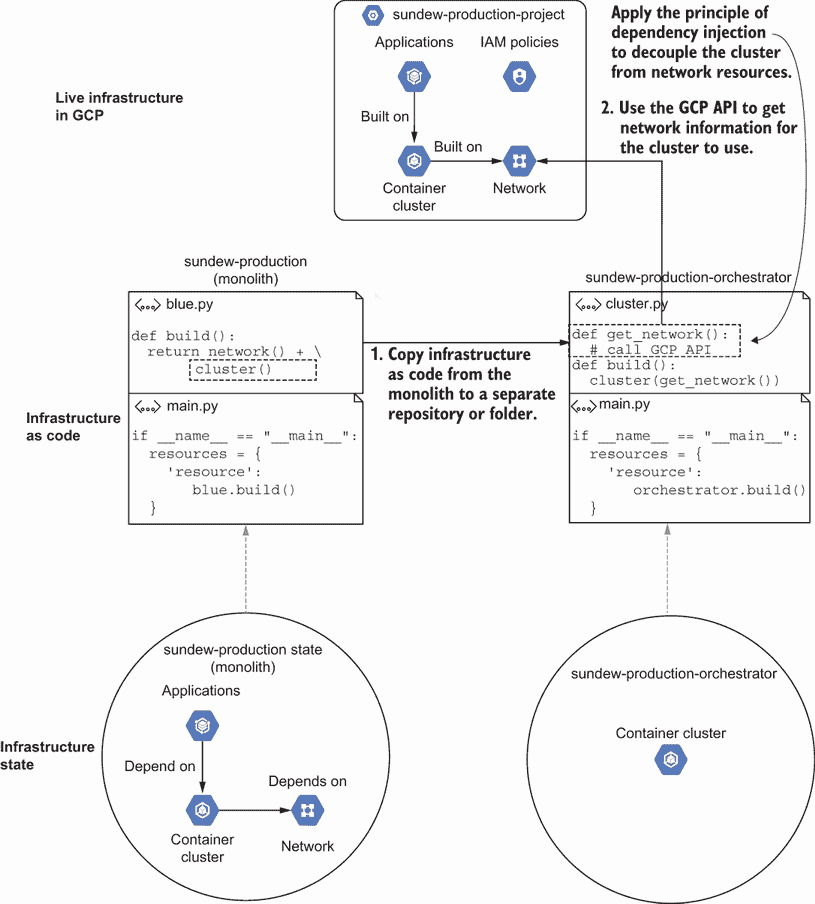

图 10.9 复制基础设施并添加新方法以调用 GCP API 并获取集群的网络 ID。

一个单体通过资源显式传递依赖。当你创建一个新文件夹时，你的分离资源需要关于其低级依赖的信息。回想一下，你可以通过 *依赖注入*（之前在第四章中介绍）解耦基础设施模块。一个高级模块调用抽象层以获取低级依赖的标识符。

当你开始重构具有依赖关系的资源时，你必须实现一个用于依赖注入的接口。在 sundew 团队的代码列表 10.10 中，更新 sundew_production_orchestrator/cluster.py 以使用 Google Cloud Client Library 并检索集群配置的子网和网络名称。

注意：为了增加清晰度，列表 10.10 中已删除一些依赖项、变量和导入。有关完整示例，请参阅书籍的代码仓库 [`github.com/joatmon08/manning-book/tree/main/ch10/s03/s02`](https://github.com/joatmon08/manning-book/tree/main/ch10/s03/s02)。

列表 10.10 使用依赖反转在集群中处理网络名称

```
import googleapiclient.discovery                                   ❶

def _get_network_from_gcp():                                       ❷
   service = googleapiclient.discovery.build(                      ❶
       'compute', 'v1')                                            ❶
   result = service.subnetworks().list(                            ❸
       project=PROJECT,                                            ❸
       region=REGION,                                              ❸
       filter=f'name:"{TEAM}-{ENVIRONMENT}-*"').execute()          ❸
   subnetworks = result['items'] if 'items' in result else None
   if len(subnetworks) != 1:                                       ❹
       print("Network not found")                                  ❹
       exit(1)                                                     ❹
   return subnetworks[0]['network'].split('/')[-1], \              ❺
       subnetworks[0]['name']                                      ❺

def cluster(name=cluster_name,                                     ❻
           node_name=cluster_nodes,
           service_account=cluster_service_account,
           region=REGION):
   network, subnet = _get_network_from_gcp()                       ❼
   return [
       {
           'google_container_cluster': {                           ❽
               VERSION: [
                   {
                       'name': name,
                       'network': network,                         ❾
                       'subnetwork': subnet                        ❾
                   }
               ]
           },
           'google_container_node_pool': {                         ❽
               VERSION: [                                          ❽
                   {                                               ❽
                       'cluster':                                  ❽
                       '${google_container_cluster.' +             ❽
                           f'{VERSION}' + '.name}'                 ❽
                   }                                               ❽
               ]                                                   ❽
           },                                                      ❽
           'google_service_account': {                             ❽
               VERSION: [
                   {
                       'account_id': service_account,
                       'display_name': service_account
                   }
               ]
           }
       }
   ]
```

❶ 使用 Python 的 Google Cloud Client Library 设置对 GCP API 的访问

❷ 创建一个方法，从 GCP 获取网络信息并实现依赖注入

❸ 查询 GCP API 以获取以 sundew-production 开头的子网名称列表

❹ 如果 GCP API 未找到子网，则抛出错误

❺ 返回网络名称和子网名称

❻ 已从代码列表中删除了几个依赖项、变量和导入，以增加清晰度。请参阅书籍的代码存储库以获取完整示例。

❼ 应用依赖倒置原则并调用 GCP API 以检索网络和子网名称

❽ 通过使用 Terraform 资源创建 Google 容器集群、节点池和服务帐户

❾ 使用网络和子网名称更新容器集群

AWS 和 Azure 等效

您可以将列表 10.10 更新为使用 Azure Python 库([`mng.bz/Pnn2`](https://shortener.manning.com/Pnn2))或 AWS SDK for Python([`aws.amazon.com/sdk-for-python/`](https://aws.amazon.com/sdk-for-python/))来替换 GCP API 客户端库。

接下来，更新资源。为 Kubernetes 节点池（也称为 *groups*）创建一个 Amazon VPC 和 Azure 虚拟网络。然后，将 Google 容器集群切换到 Amazon EKS 集群或 AKS 集群。

当重构具有依赖关系的资源时，您必须实现依赖注入以检索低级资源属性。列表 10.10 使用了基础设施提供者的 API，但您可以使用您选择的任何抽象层。基础设施提供者的 API 通常提供了最直接的抽象。您可以使用它来避免实现自己的。

在将容器集群复制并更新以引用来自 GCP API 的网络和子网名称后，您将重复图 10.10 中显示的重构工作流程。您将实时基础设施资源导入 sundew_production_orchestrator，应用单独的配置，检查活动状态和 IaC 之间的任何偏差，并从单体状态中删除资源的配置和引用。

将高级资源重构与从单体中重构低级资源的主要区别在于依赖注入的实现。您可以选择要使用的依赖注入类型，例如基础设施提供者的 API、模块输出或基础设施状态。请注意，如果您不使用基础设施提供者的 API，可能需要更改单体 IaC 以输出属性。

否则，确保通过在重构后重新运行 IaC 来应用幂等性。您希望避免影响活动资源并将所有更改隔离到 IaC 中。如果您的 dry run 反映了更改，您必须在继续其他资源之前修复重构代码与基础设施状态之间的偏差。

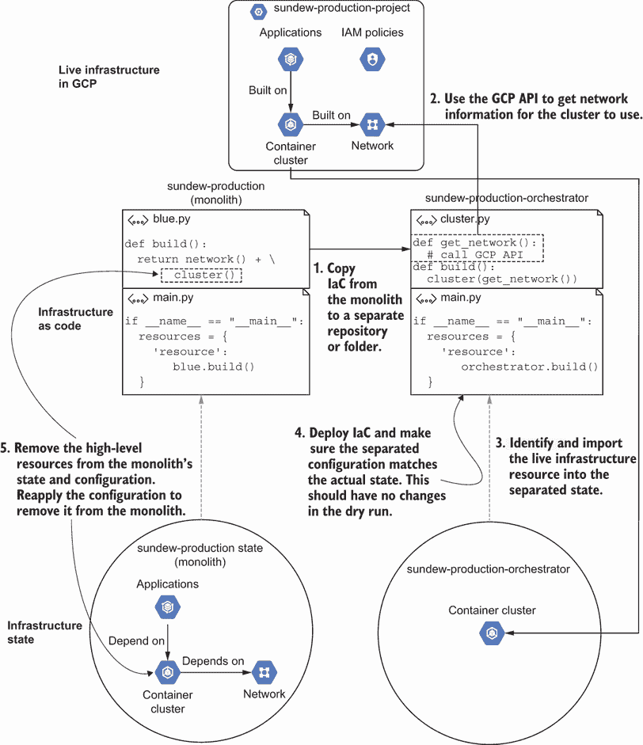

图 10.10 在继续重构低级资源之前，使用 GCP API 重构高级资源以获取低级标识符。

### 10.2.3 重复重构工作流程

在你提取了 IAM 服务账户和角色以及容器编排器之后，你可以继续分解雨燕系统的单体 IaC 配置。图 10.11 中的工作流程总结了分解单体 IaC 的一般模式。你确定哪些资源相互依赖，提取它们的配置，并更新它们的依赖关系以使用依赖注入。

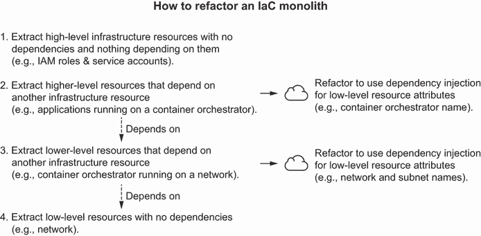

图 10.11 重构 IaC 单体的工作流程首先识别没有依赖关系的顶层资源。

识别不依赖于任何事物或没有事物依赖于它们的顶层基础设施资源。我使用顶层资源来测试复制、分离、导入和从单体中删除它们的流程。接下来，我识别依赖于其他资源的更高层资源。在复制过程中，我将它们重构为通过依赖注入引用属性。我通过系统识别并重复此过程，最终得出没有依赖关系的最低层资源。

配置管理

虽然本章主要关注 IaC 部署工具，但配置管理也可能变成自动化单体，并导致相同的挑战，包括运行时间过长或配置部分有冲突的更改。你可以应用类似的重构工作流程来处理单体配置管理：

1.  提取没有依赖关系的最独立的部分，并将它们分离成模块。

1.  运行配置管理器并确保你没有更改你的资源状态。

1.  识别依赖于较低级别自动化输出或存在性的配置。提取它们，并应用依赖注入以检索配置所需的任何值。

1.  运行配置管理器并确保你没有更改你的资源状态。

1.  重复此过程，直到你有效地达到配置管理器的第一步。

当你重构 IaC 单体时，确定将资源相互解耦的方法。我发现重构是一个挑战，并且很少没有一些失败和错误。隔离单个组件并仔细测试它们将有助于识别问题并最小化对系统的影响。如果我真的遇到失败，我会使用第十一章中的技术来修复它们。

练习 10.1

给定以下代码，你会使用什么顺序和资源分组来重构和分解单体？

```
if __name__ == "__main__":
  zones = ['us-west1-a', 'us-west1-b', 'us-west1-c']
  project.build()
  network.build(project)
  for zone in zones:
    subnet.build(project, network, zone)
  database.build(project, network)
  for zone in zones:
    server.build(project, network, zone)
  load_balancer.build(project, network)
  dns.build()
```

A) DNS，负载均衡器，服务器，数据库，网络 + 子网，项目

B) 负载均衡器 + DNS，数据库，服务器，网络 + 子网，项目

C) 项目，网络 + 子网，服务器，数据库，负载均衡器 + DNS

D) 数据库，负载均衡器 + DNS，服务器，网络 + 子网，项目

请参阅附录 B 以获取练习答案。

## 摘要

+   重构 IaC 涉及在不影响现有基础设施资源的情况下重构配置或代码。

+   重构解决了技术债务，这是一个描述更改代码成本的隐喻。

+   滚动更新会逐个更改相似的基础设施资源，并在移动到下一个资源之前测试每个资源。

+   滚动更新允许你增量地实施和调试更改。

+   功能标志（也称为*功能开关*）可以启用或禁用基础设施资源、依赖项或属性。

+   在将更改应用到生产之前，应用功能标志以测试、预览和隐藏更改。

+   在一个地方（例如文件或配置管理器）定义功能标志，以便一目了然地识别它们的值。

+   当你不再需要功能标志时，请将其移除。

+   当你在同一个地方定义所有的基础设施资源时，就会发生单体 IaC，移除一个资源会导致整个配置失败。

+   将资源重构出单体架构涉及将配置分离并复制到新的目录或仓库中，将其导入新的独立状态，并从单体配置和状态中移除资源。

+   如果你的资源依赖于另一个资源，请更新你的分离资源配置以使用依赖注入并从基础设施提供者 API 检索标识符。

+   将单体拆分首先从重构无依赖的高层资源或配置开始，然后是具有依赖的资源或配置，最后是低层资源或无依赖的配置。
