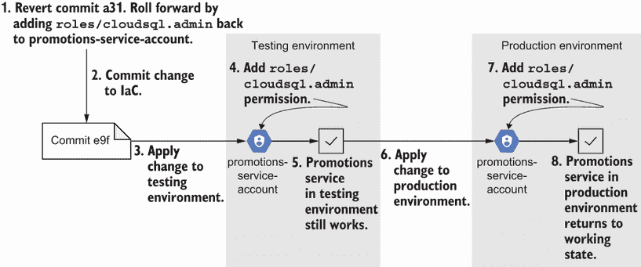
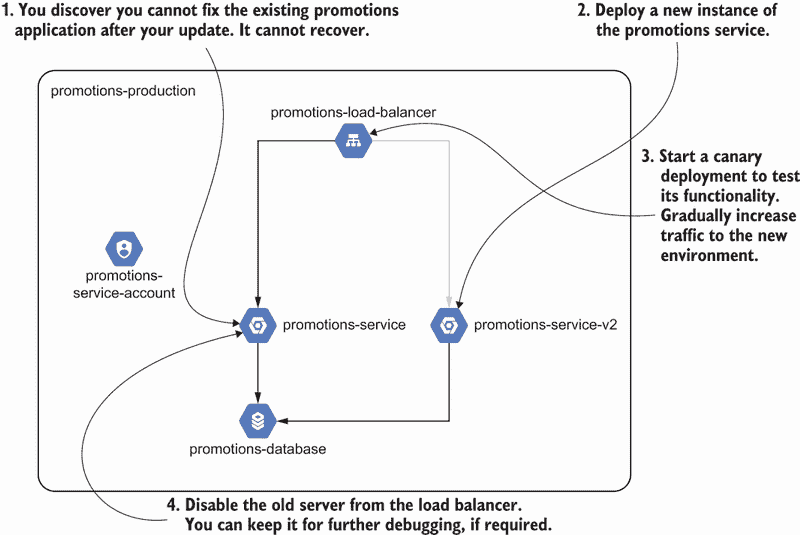
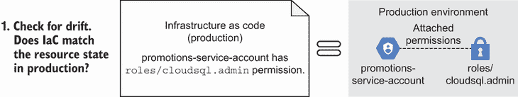
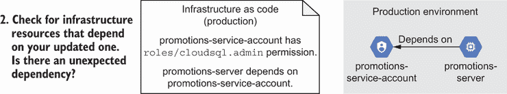
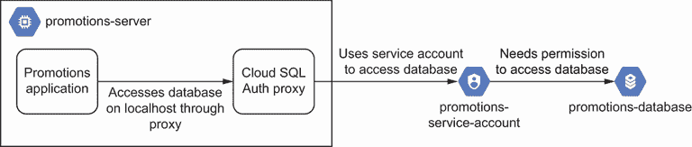
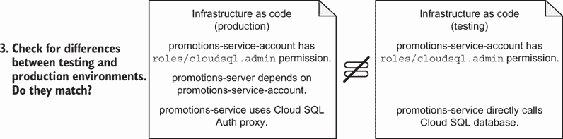
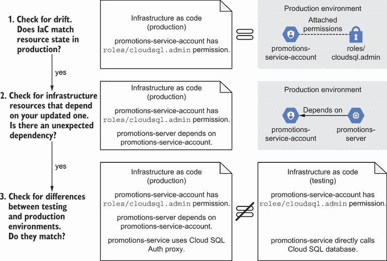
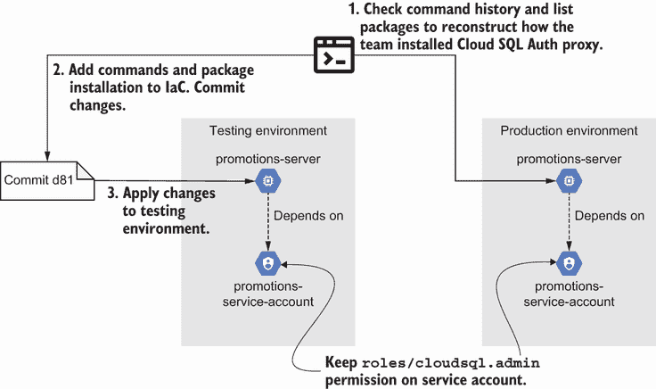
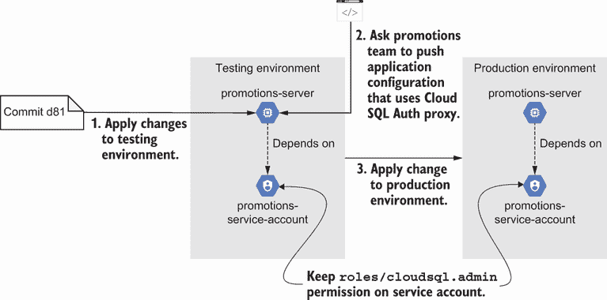
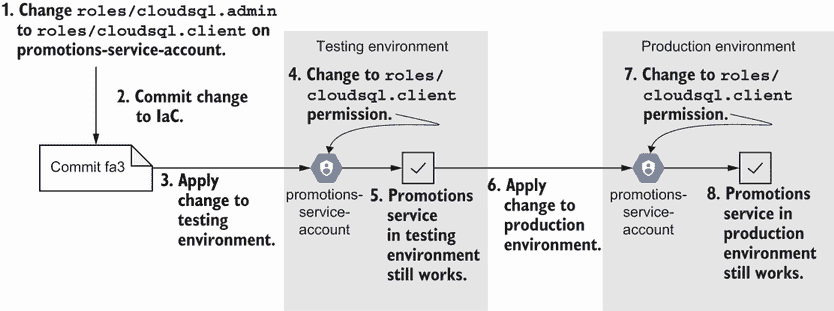

# 11 修复失败

本章涵盖

+   确定如何回滚失败更改以恢复功能

+   组织 IaC 故障排除的方法

+   对失败更改的分类修复

我们花费了很多章节来讨论编写和协作基础设施即代码。您为 IaC 学习的所有实践和原则都积累到了一个关键时刻，那就是您推送更改，它导致您的系统失败，您需要将其回滚！然而，IaC 不支持回滚。您不能完全撤销 IaC 更改。如果不回滚，修复失败意味着什么呢？

本章重点介绍如何修复 IaC 中的失败更改。首先，我们将讨论通过“回滚”来“撤销”IaC 更改的含义。然后，您将学习故障排除和修复失败更改的工作流程。虽然本章中介绍的技术可能不适用于您在系统中遇到的所有场景，但它们建立了一套广泛的实践，您可以使用这些实践开始修复 IaC 失败。

故障排除和站点可靠性工程

在本书中，我不会深入探讨故障系统故障排除的过程和原则。关于故障排除的大部分讨论都集中在 IaC 的上下文中如何管理它。有关故障排除和构建可靠系统的更多信息，我推荐 Betsy Beyer 等人所著的《站点可靠性工程》（O’Reilly，2016 年）。

作为一般规则，在进一步调试根本原因（导致问题的那个问题）之前，优先考虑服务和客户的稳定性和功能恢复。临时修补提供了您进行故障排除并实施系统长期修复的机会。

## 11.1 恢复功能

想象一下，您在一家名为 Cool Caps for Keys 的公司工作。该公司创建定制的键盘帽，并将客户与艺术家联系起来以设计帽。作为安全工程师，您需要缩小 GCP 项目中应用程序和用户的访问控制。

您复制 Google Cloud SQL 数据库配置并更新访问控制，以实现团队成员和应用程序的最小权限访问。您选择不同应用程序使用基础设施所需的政策，并验证应用程序仍然可以工作。

接下来，您与推广团队交谈。其应用程序通过使用数据库用户名和密码直接访问数据库。直接访问数据库意味着您可以从推广应用程序的服务帐户中移除`roles/cloudsql.admin`策略。您移除策略，测试更改，与推广团队确认更改没有影响其在测试环境中的应用，然后将它推送到生产环境；见图 11.1。


图 11.1 在移除推广服务的数据库管理访问权限后，您发现更改破坏了服务访问数据库的能力。

一小时后，促销团队告诉您，其应用程序持续抛出错误，无法访问数据库！您怀疑您的更改可能引入了问题。虽然您可以开始挖掘问题，但您优先修复促销服务，以便在进一步调查之前能够访问数据库。

### 11.1.1 回滚以撤销更改

您需要修复服务，以便用户可以向系统发出请求。然而，您不能简单地将系统恢复到之前的工作状态。IaC 优先考虑不可变性，这意味着对系统的任何更改，包括 *撤销* 的更改，都必须创建新的资源！

例如，让我们通过撤销更改并添加角色到服务账户来修复 Cool Caps for Keys 的促销服务。在图 11.2 中，您撤销了提交并将 `roles/cloudsql.admin` 添加回服务账户。然后，您将更改推送到测试和生产环境。



图 11.2 您为促销服务添加了管理数据库角色，以便将系统回滚到工作状态。

您撤销了提交并将更改推送到测试和生产环境。您通过 IaC 推进更改，因为它使用不可变性将系统恢复到工作状态。

定义 *回滚* IaC 的实践是将系统中的更改撤销，并使用不可变性将系统恢复到工作状态。

回滚意味着您将基础设施回滚到之前的状态。实际上，IaC 的不可变性意味着您在每次更改时都会创建一个新的状态。您无法完全恢复基础设施到之前的状态。有时您实际上无法将基础设施恢复到之前的状态，因为您的更改具有很大的影响范围。

让我们撤销对服务账户的更改，并将更改回滚以恢复权限。首先，检查您的提交历史，因为版本控制会跟踪您所做的所有更改。带有 `a31` 前缀的提交包括您移除 `roles/cloudsql.admin` 的操作：

```
$ git log --oneline -2
a3119fc (HEAD -> main) Remove database admin access from promotions
6f84f5d Add database admin to promotions service
```

应用第七章中的 GitOps 实践，您希望避免进行手动、破坏性的更改。相反，您更倾向于通过基础设施即代码（IaC）进行操作更改！您撤销提交以推送更新，以恢复促销服务到工作状态：

```
$ git revert a3119fc
```

您推送了提交，并且管道将角色添加回服务账户。在您回滚后，应用程序再次工作。您已成功将基础设施状态恢复到工作状态。然而，您从未实现状态的完全恢复。相反，您推出了一个与之前工作状态匹配的新状态。

回滚 IaC 通常意味着将更改回滚到基础设施状态。您使用 `git revert` 作为向前移动的撤销来保留不可变性，并将撤销更新回滚到基础设施。

配置管理

配置管理不优先考虑不可变性，但仍然将撤销的变更向前推进到服务器或资源。例如，想象你安装了一个版本为 3.0.0 的包，需要回滚到 2.0.0。你的配置管理工具可能会选择卸载新版本并重新安装旧版本。你并没有将包及其配置恢复到先前的状态。你只是将服务器恢复到一个带有较旧包的新工作状态。

### 11.1.2 向前推进以实施新变更

采用向前推进的心态带来的好处是扩展了你的故障排除方法。在示例中，你撤销了一个损坏的提交，并通过将新状态与先前的有效状态匹配来恢复促销服务的功能。然而，有时撤销提交并不能修复你的系统，反而使情况变得更糟！相反，你可以向前推进*新变更*并恢复功能。

让我们假设在向前推进变更后，促销服务仍然无法工作。与其试图修复应用程序，不如创建一个新的环境，其中包含变更和新的促销服务。你从第九章开始使用金丝雀部署技术，逐渐增加流量以完全恢复应用程序，如图 11.3 所示。在所有请求都转到新服务实例后，你禁用失败的环境进行调试。



图 11.3 当无法恢复促销应用程序时，你可以使用金丝雀部署将流量切换到新实例并恢复系统。

IaC（基础设施即代码）允许你以更少的努力重现环境。此外，遵循不可变性意味着你已经有一个创建新环境以进行变更的模式。这两个原则的结合有助于减轻具有更大影响范围的更高风险变更。

涉及数据或完全无法恢复的资源的使用案例不能回滚到先前的状态。在解决级联故障的过程中，你可能会损坏应用程序数据或影响其他基础设施。与其回滚以恢复，不如通过应用第九章中的变更技术，向前推进并实施新的变更。

你也可以通过撤销和完全新的变更的组合来恢复功能。将你的向前推进心态扩展到包括在撤销旧变更之外的新变更，为快速恢复功能并提供了一种有用的替代方案，同时最大限度地减少对系统其他部分的干扰。

## 11.2 故障排除

你给你的系统贴上了一个创可贴，这样促销团队仍然可以发送 Cool Caps for Keys 的促销活动。然而，你仍然需要确保应用程序的 IAM（身份和访问管理）安全！当你移除了促销团队不需要的管理权限时，你从哪里开始查找促销服务失败的原因？

故障排除您的 IaC 也遵循特定的模式。即使在最复杂的系统基础设施中，许多失败的 IaC 变更通常来自三个原因：漂移、依赖项或差异。检查您的配置以查找任何这些原因有助于您识别问题以及潜在的解决方案。

### 11.2.1 检查漂移

许多损坏的基础设施变更源于配置与资源状态之间的配置漂移。在图 11.4 中，您首先检查漂移。确保服务帐户的 IaC 与 GCP 中服务帐户的状态相匹配。



图 11.4 首先检查基础设施即代码（IaC）与状态之间的漂移。

检查代码与状态之间的漂移可以确保您消除由于两者之间的差异而导致的任何故障。代码与状态之间的差异可能会引入意外问题。消除这些差异可以确保您的更改行为按预期工作。

在 Cool Caps for Keys 的情况下，您将审查在 IaC 中定义的推广服务帐户的权限。以下列表概述了定义服务和角色的 IaC。

列表 11.1 具有数据库管理员权限的推广服务帐户

```
from os import environ
import database                                                     ❶
import iam                                                          ❷
import network                                                      ❸
import server                                                       ❹
import json
import os

SERVICE = 'promotions'
ENVIRONMENT = 'prod'
REGION = 'us-central1'
ZONE = 'us-central1-a'
PROJECT = os.environ['CLOUDSDK_CORE_PROJECT']
role = 'roles/cloudsql.admin'                                       ❺

if __name__ == "__main__":
   resources = {                                                    ❻
       'resource':
       network.Module(SERVICE, ENVIRONMENT, REGION).build() +       ❼
       iam.Module(SERVICE, ENVIRONMENT, REGION, PROJECT,            ❽
                  role).build() +                                   ❽
       database.Module(SERVICE, ENVIRONMENT, REGION).build() +      ❾
       server.Module(SERVICE, ENVIRONMENT, ZONE).build()            ❿
   }

   with open('main.tf.json', 'w') as outfile:                       ⓫
       json.dump(resources, outfile,                                ⓫
                 sort_keys=True, indent=4)                          ⓫
```

❶ 导入数据库模块以构建 Google Cloud SQL 数据库

❷ 导入 Google 服务帐户模块并创建具有权限的配置

❸ 导入网络模块以构建 Google 网络

❹ 导入服务器模块以构建 Google 计算实例

❺ 推广服务帐户应具有访问数据库的“cloudsql.admin”角色的权限

❻ 使用模块创建数据库、网络、服务帐户和服务器的 JSON 配置

❼ 导入网络模块以构建 Google 网络

❽ 导入 Google 服务帐户模块并创建具有权限的配置

❾ 导入数据库模块以构建 Google Cloud SQL 数据库

❿ 导入服务器模块以构建 Google 计算实例

⓫ 将 Python 字典写入 JSON 文件，以便 Terraform 后续执行

AWS 和 Azure 等效

GCP Cloud SQL 管理员权限的 AWS 等效是 `AmazonRDSFullAccess`。Azure 没有确切的等效项。相反，您需要将 Azure Active Directory 帐户直接添加到数据库中，并授予 Azure SQL Database API 权限的管理同意。

然后，将代码与 GCP 中推广应用程序的服务帐户权限进行比较。服务帐户只有与您的 IaC 一致的 `roles/cloudsql.admin` 权限：

```
$ gcloud projects get-iam-policy $CLOUDSDK_CORE_PROJECT
bindings:
- members:
  - serviceAccount:promotions-prod@infrastructure-as-code-book
  ➥.iam.gserviceaccount.com
  role: roles/cloudsql.admin
version: 1
```

如果你发现 IaC 和活动资源状态之间存在配置漂移，你可以进一步调查它是否影响系统功能。你可以选择消除一些漂移，以确保它不会导致根本原因。然而，仅仅因为检测到一些漂移并不意味着它会破坏你的系统！一些漂移可能与失败无关。

### 11.2.2 检查依赖关系

如果你确定漂移没有导致失败，你可以检查依赖于你的更新资源的资源。在图 11.5 中，你开始绘制依赖于服务账户的资源。在 IaC 和生产环境中，服务器都依赖于服务账户。



图 11.5 修复任何依赖于您想要更新的资源的错误。

你想要检查预期的依赖关系是否与实际匹配。意外的依赖关系会干扰更改行为。当你审查以下列表中的代码时，你验证服务账户的电子邮件是否传递给了服务器。

列表 11.2 推广服务器依赖于推广服务账户

```
class Module():                                                       ❶
   def __init__(self, service, environment,
                zone, machine_type='e2-micro'):
       self._name = f'{service}-{environment}'
       self._environment = environment
       self._zone = zone
       self._machine_type = machine_type

   def build(self):                                                   ❶
       return [
           {
               'google_compute_instance': {                           ❷
                   self._environment: {
                       'allow_stopping_for_update': True,
                       'boot_disk': [{
                           'initialize_params': [{
                               'image': 'ubuntu-1804-lts'
                           }]
                       }],
                       'machine_type': self._machine_type,
                       'name': self._name,
                       'zone': self._zone,
                       'network_interface': [{
                           'subnetwork':
                           '${google_compute_subnetwork.' +
                           f'{self._environment}' + '.name}',
                           'access_config': {
                               'network_tier': 'STANDARD'
                           }
                       }],
                       'service_account': [{                          ❸
                           'email': '${google_service_account.' +     ❸
                           f'{self._environment}' + '.email}',        ❸
                           'scopes': ['cloud-platform']               ❸
                       }]                                             ❸
                   }
               }
           }
       ]
```

❶ 使用模块创建服务器的 JSON 配置

❷ 通过基于名称、地址、区域和网络使用 Terraform 资源创建 Google 计算实例

❸ 推广应用程序服务器的工厂使用服务账户访问 GCP 服务。

AWS 和 Azure 的等效选项

在 AWS 或 Azure 中创建一个网络。然后，更新代码列表以使用带有托管身份块的 Azure Linux 虚拟机 Terraform 资源 ([`mng.bz/J22p`](https://shortener.manning.com/J22p))。`identity`块应包含具有访问 Azure 权限的用户 ID 列表。对于 AWS，您将为 AWS EC2 Terraform 资源定义 IAM 实例配置文件。

然而，推广团队提到，其应用程序*直接*通过使用其 IP 地址、用户名和密码访问数据库。如果应用程序从文件中读取数据库连接字符串，服务器为什么还需要服务账户？

你意识到这突显了一个差异。你要求推广团队向你展示应用程序代码。应用程序配置没有使用数据库 IP 地址、用户名或密码！

在与推广团队进行额外的调试后，你发现推广应用程序连接到本地的数据库。配置使用 Cloud SQL Auth 代理 ([`cloud.google.com/sql/docs/mysql/sql-proxy`](https://cloud.google.com/sql/docs/mysql/sql-proxy))，该代理处理连接并登录到数据库！因此，连接到服务器的服务账户需要数据库访问权限。

图 11.6 显示，推广应用程序通过代理访问数据库。代理使用服务账户进行身份验证并访问数据库。服务账户需要具有策略的数据库访问权限。



图 11.6 推广应用程序通过代理访问数据库，该代理需要一个具有数据库权限的服务账户。

AWS 和 Azure 的等效选项

GCP Cloud SQL Auth 代理的 AWS 等效选项是 Amazon RDS Proxy。代理有助于强制执行数据库连接，并避免在应用程序代码中需要数据库用户名和密码。

Azure 没有等效的 SQL 代理选项。相反，你必须设置一个指向数据库的 Azure Private Link。这在你选择的私有网络上分配了一个 IP 地址。你可以配置你的数据库，允许你的应用程序使用 Azure Active Directory 服务主体登录。

恭喜你，你发现了为什么当你移除服务账户时推广应用程序会损坏的原因！然而，你有点怀疑。你不应该在测试环境中发现相同的问题吗？毕竟，你在测试环境中测试了更改，应用程序并没有损坏。

### 11.2.3 检查环境差异

为什么更改在测试环境中有效但在生产环境中无效？你检查了测试环境中的推广应用程序。该应用程序*不*连接到`localhost`上的数据库。相反，它使用数据库 IP 地址、用户名和密码。

你向应用程序团队解释说，生产 IaC 使用 Cloud SQL Auth 代理，而测试 IaC 直接调用数据库；参见图 11.7。两种配置都使用`roles/cloudsql.admin`权限。



图 11.7 检查测试和生产环境之间的差异，以解决任何失败的测试更改。

在与推广团队进一步讨论后，你发现该团队实施了一个紧急更改，使用 Cloud SQL Auth 代理来保护生产环境。然而，团队没有机会更新测试环境以匹配！这种不匹配使得你的更新在测试环境中成功，但在生产环境中失败。

你希望测试和生产环境尽可能相似。然而，你无法总是复制生产环境。因此，你将遇到由于两者之间的差异而失败的更改。系统地识别测试和生产环境之间的差异有助于突出测试和变更交付中的差距。

虽然 IaC 应该记录系统中所有的更改和配置，但你可能在 IaC 和环境之间仍然会发现一些惊喜。图 11.8 总结了你在推广应用程序 IaC 中调试失败更改的结构化方法。你检查漂移、依赖关系，最后检查环境之间的差异。



图 11.8 你通过检查漂移、意外的依赖关系和测试与生产之间的差异，使用 IaC 来调试你的损坏更改。

在确定根本原因后，你最终可以实施一个长期的修复方案。你现在必须协调测试环境和生产环境之间的差异，并重新审视对促销应用程序服务账户的最小权限访问。

练习 11.1

一支团队报告称，其应用程序无法连接到另一个应用程序。该应用程序上周还能正常工作，但自周一以来请求都失败了。该团队没有对其应用程序进行任何更改，并怀疑问题可能是防火墙规则。你可以采取哪些步骤来排查这个问题？（选择所有适用的选项。）

A) 登录云服务提供商并检查应用程序的防火墙规则。

B) 在绿色环境中部署新的基础设施和应用程序进行测试。

C) 检查应用程序的 IaC 更改。

D) 将云服务提供商中的防火墙规则与 IaC 进行比较。

E) 编辑防火墙规则，允许应用程序之间的所有流量。

请参阅附录 B 以获取练习的答案。

## 11.3 修复

你为 Cool Caps for Keys 的原任务是更新每个应用程序的服务账户权限，以确保对服务的最小权限访问。你尝试从促销应用程序的服务账户中移除数据库管理访问权限，但失败了。在排查了问题之后，你现在可以修复这个问题。

你可能会觉得有点不耐烦！毕竟，你还没有完成 Cool Caps for Keys 中其他应用程序的访问更新。然而，不要一次性改变所有东西。推送一批更改可能会使调试失败原因变得困难（如第七章中提到的）。你的测试环境仍然与生产环境不匹配，如果你一次性做出太多更改，你仍然可能会影响促销应用程序。

在整本书中，我提到了通过进行小改动来最小化潜在失败的影响范围的过程。同样，*增量修复*将系统需要做出的更改分解成更小的部分，以防止未来的失败。

定义 *增量修复* 将更改分解成更小的部分，以逐步改进系统并防止未来的失败。

进行小范围的配置更改并逐步部署有助于你识别麻烦的第一迹象，并为未来的 IaC 成功做好准备。

### 11.3.1 协调漂移

如我在第二章中提到的，你需要协调对基础设施状态进行的任何手动更改与 IaC。如果你发现一些漂移，你需要首先解决它！如果你优先考虑使用 IaC，你的系统不应该有太多的紧急更改。

回想一下，Cool Caps for Keys 的促销应用程序实现了一个玻璃破碎更改，导致测试和生产环境之间存在差异。生产应用程序使用 Cloud SQL Auth 代理连接到数据库，而测试应用程序直接通过 IP 地址和密码连接到数据库。你需要在测试环境中构建一个 Cloud SQL Auth 代理。

要开始修复漂移，你需要将基础设施的当前状态重构到配置中。图 11.9 根据生产服务器重构了 Cloud SQL Auth 代理的安装命令。然后，你将这些命令添加到 IaC 中，并应用到测试环境中。



图 11.9 在测试中，你需要将 Cloud SQL Auth 代理包安装到促销应用程序的服务器上，以解决玻璃破碎更改的漂移。

在此示例中，团队没有为手动更改添加 IaC。因此，你需要额外的时间来重建 Cloud SQL Auth 代理的安装。像代理这样的带外更改导致更改失败，修复它需要更多的时间和精力。

为了帮助最小化这些问题，请使用第二章中描述的迁移到 IaC 的过程。将手动更改作为 IaC 捕获有助于最小化环境之间的差异以及 IaC 和实际状态之间的漂移。如果你需要重建基础设施的状态，请记住第二章包括将现有基础设施迁移到 IaC 的高级示例。然而，你通常需要找到或编写一个工具将状态转换为 IaC。

让我们编写安装代理的 IaC 脚本。你检查了生产环境中促销应用程序服务器的命令历史，并重新构建了 Cloud SQL Auth 代理的安装过程。以下列表自动化了促销应用程序服务器启动脚本中的命令和安装过程。

列表 11.3 在服务器启动脚本中安装 Cloud SQL Auth 代理

```
class Module():
   def _startup_script(self):                                            ❶
       proxy_download = 'https://dl.google.com/cloudsql/' + \            ❷
           'cloud_sql_proxy.linux.amd64'                                 ❷
       exec_start = '/usr/local/bin/cloud_sql_proxy ' + \                ❸
           '-instances=${google_sql_database_instance.' + \              ❸
           f'{self._environment}.connection_name}}=tcp:3306'             ❸

       return f"""                                                       ❹
       #!/bin/bash
       wget {proxy_download} -O /usr/local/bin/cloud_sql_proxy
       chmod +x /usr/local/bin/cloud_sql_proxy

       cat << EOF > /usr/lib/systemd/system/cloudsqlproxy.service        ❺
       [Install]
       WantedBy=multi-user.target

       [Unit]
       Description=Google Cloud Compute Engine SQL Proxy
       Requires=networking.service
       After=networking.service

       [Service]
       Type=simple
       WorkingDirectory=/usr/local/bin
       ExecStart={exec_start}
       Restart=always
       StandardOutput=journal
       User=root
       EOF

       systemctl daemon-reload                                           ❺
       systemctl start cloudsqlproxy                                     ❺
       """

   def build(self):                                                      ❻
       return [
           {
               'google_compute_instance': {                              ❼
                   self._environment: {                                  ❼
                       'metadata_startup_script': self._startup_script() ❼
                   }                                                     ❼
               }                                                         ❼
           }
       ]
```

❶ 创建一个启动脚本，以重构 Cloud SQL Auth 代理的手动安装命令

❷ 设置一个变量作为代理下载 URL

❸ 设置一个变量，在端口 3306 上运行 Cloud SQL Auth 代理二进制文件

❹ 返回一个安装代理并使用服务器启动它的 shell 脚本

❺ 配置 systemd 守护进程以启动和停止 Cloud SQL Auth 代理

❻ 使用模块创建 Google 计算实例的 JSON 配置，并包括一个启动脚本以安装代理

❼ 将启动脚本添加到服务器。为了清晰起见，我省略了其他属性。

AWS 和 Azure 的等效方案

对于 AWS 和 Azure，你不需要在实例上安装代理的软件。如果你想在 AWS 和 Azure 中练习重现列表 11.3，你可以将启动脚本作为`user_data`传递给 AWS 实例或`custom_data`传递给 Azure Linux 虚拟机。

你**不**更新服务账户以添加新权限！本着增量修复的精神，你希望在推向生产时避免添加更多需要跟踪的变更。你将启动脚本添加到促销应用程序的服务器，并更改测试环境而无需更多更新。

启动脚本、配置管理器，还是镜像构建器？

在这个例子中，我使用启动脚本字段来避免引入更多语法。相反，你应该使用**配置管理器**或**镜像构建器**来实施任何新软件包或进程的配置。

例如，配置管理器会将 Cloud SQL Auth 代理安装过程推送到任何带有促销应用程序的服务器。同样，镜像构建器为每个你烘焙的镜像配置代理！每次你引用促销应用程序的镜像时，你总是会在服务器中内置了代理。

### 11.3.2 调和环境之间的差异

当你更新你的基础设施即代码（IaC）以处理漂移时，你还需要确保测试和生产环境使用你的新 IaC。对于 Cool Caps for Keys，你确保数据库连接在测试环境中工作。然后，你要求促销团队更新其应用程序配置，通过 `localhost` 上的代理连接到数据库。

促销团队将其应用程序配置推送到测试环境以使用 Cloud SQL Auth 代理，运行测试，并更新生产环境，如图 11.10 所示。你保留服务账户上的 `roles/cloudsql.admin` 权限，因为代理需要它。



图 11.10 你需要将你的 IaC 变更推送到测试和生产环境中的促销应用程序服务器。

推送重新创建带有新启动脚本的生成服务器。在为促销应用程序进行额外的端到端测试之后，你确认你成功更新了测试和生产环境。

为什么在生产环境和测试环境之间的差异之前先调和漂移？在这个例子中，你选择先调和漂移，因为你将花费更多时间手动在测试环境中安装软件包。如果你更新你的 IaC 并自动化软件包安装，你可以在将其推送到生产环境之前确保更改在测试环境中工作。

你可能会选择首先调和测试环境和生产环境，因为你有很多漂移。在这种情况下，在修复漂移之前先匹配测试环境和生产环境。在你实施调和变更之前，你希望有一个准确的测试环境。

调和漂移和环境差异，以帮助下一个人更新系统。他们不必担心了解配置差异或手动配置代理。你花费在更新你的 IaC 上的额外时间可以帮助你避免额外的调试时间！

### 11.3.3 实施原始变更

现在您通过对齐漂移和更新环境最小化了潜在失败的范围，您最终可以推进原始更改。您的调试和增量修复更改了您的基础设施。当您返回实施原始更改时，您可能需要调整您的代码。

让我们完成 Cool Caps for Keys 促销应用程序的原始更改。回想一下，安全团队要求您从服务账户中移除管理权限。这个过程确保了最小权限访问，并考虑到了使用 Cloud SQL Auth 代理。

您知道服务账户必须具有数据库访问权限，因为应用程序使用了 Cloud SQL Auth 代理。现在，您试图弄清楚应用程序*应该*使用什么样的最小访问权限。`roles/cloudsql.client`权限为服务账户提供了足够的访问权限，以便获取实例列表并连接到它们。

在图 11.11 中，您将服务账户的权限从管理访问更改为`roles/cloudsql.client`。您将此更改推送到测试环境，验证促销是否仍然工作，并将`roles/cloudsql.client`权限部署到生产环境。



图 11.11 您需要将 IaC 更改推送到测试和生产环境中的促销应用程序服务器。

您已对代理的测试和生产环境之间的差异进行了对齐。理论上，测试环境现在应该能够捕捉到您更改中的任何问题。任何失败的更改现在应该出现在测试环境中。让我们在以下列表中将服务账户的权限从`roles/cloudsql.admin`更改为`roles/cloudsql.client`。

列表 11.4 将服务账户角色更改为数据库客户端

```
from os import environ
import database
import iam
import network
import server
import json
import os

SERVICE = 'promotions'
ENVIRONMENT = 'prod'
REGION = 'us-central1'
ZONE = 'us-central1-a'
PROJECT = os.environ['CLOUDSDK_CORE_PROJECT']
role = 'roles/cloudsql.client'                                    ❶

if __name__ == "__main__":
   resources = {                                                  ❷
       'resource':                                                ❷
       network.Module(SERVICE, ENVIRONMENT, REGION).build() +     ❷
       iam.Module(SERVICE, ENVIRONMENT, REGION, PROJECT,          ❸
                  role).build() +                                 ❸
       database.Module(SERVICE, ENVIRONMENT, REGION).build() +    ❷
       server.Module(SERVICE, ENVIRONMENT, ZONE).build()          ❷
   }                                                              ❷

   with open('main.tf.json', 'w') as outfile:
       json.dump(resources, outfile,
                 sort_keys=True, indent=4)
```

❶ 将促销服务账户角色更改为客户端访问，允许连接到数据库实例

❷ 不更改资源导入网络、数据库和服务器模块

❸ 导入服务账户并将其“roles/cloudsql.client”角色附加到其权限

AWS 和 Azure 的等效权限

AWS 中与 GCP 云 SQL 管理员权限等效的是`AmazonRDSFullAccess`。Azure 没有确切的等效权限。相反，您需要直接将 Azure Active Directory 账户添加到数据库中，并授予 Azure SQL 数据库 API 权限的管理权限。

在 AWS 中，您可以将`rds-db:connect`操作添加到附加到 EC2 实例的 IAM 角色中。在 Azure 中，您需要撤销管理访问权限，并授予与数据库用户链接的 Azure AD 用户的`SELECT`访问权限（[`mng.bz/woo7`](https://shortener.manning.com/woo7)）。

您提交并应用更改。测试环境应用更改并验证应用程序仍然可以工作！您与促销团队确认，该团队批准了生产更改。

团队将新的权限更改推广到生产环境，运行端到端测试，并确认推广应用程序可以访问数据库！经过几周的调试和更改后，你终于可以修复 Cool Caps for Keys 中的其他应用程序了。

为什么用一个修复失败的更改的例子来单独占据一整章？这代表了修复基础设施即代码（IaC）的现实。你希望尽快解决问题，而不要使问题变得更糟。

向前滚动有助于恢复系统的正常工作状态并最小化对基础设施资源的影响。然后，你可以着手排查根本原因。许多基础设施故障源于漂移、依赖关系或测试和生产环境之间的差异。在你解决这些差异之后，你实施你的原始更改。

学习滚动前进基础设施即代码的艺术需要时间和经验。虽然你可以直接登录云服务提供商的控制台进行手动更改以使系统工作，但请记住，这种临时修补很快就会失效，而且不会促进长期系统的修复。使用 IaC 跟踪和逐步修复系统可以最小化维修的影响，并为其他更新系统的人提供上下文。

## 摘要

+   对于基础设施即代码的故障修复，涉及向前滚动修复而不是回滚。

+   向前滚动基础设施即代码使用不可变性将系统恢复到工作状态。

+   在进行调试和实施长期修复之前，应优先稳定系统并恢复其到工作状态。

+   在排查基础设施即代码的问题时，检查漂移、意外的依赖关系以及环境之间的差异，作为根本原因的一部分。

+   专注于增量修复，以便快速识别并减少潜在故障的影响范围。

+   在重新实施失败的原始更改之前，确保你解决了漂移和环境之间的差异，以便进行准确的测试和未来的系统更新。

+   在基础设施即代码（IaC）中重建状态以解决漂移问题，涉及聚合服务器配置的手动命令或将基础设施元数据转换为 IaC。
