# 12 云计算的成本

本章涵盖

+   调查云成本的成本驱动因素

+   比较成本优化实践

+   实施符合成本规范的 IaC 测试

+   计算基础设施成本估算

当您使用云服务提供商时，您会对配置的便捷性感到非常兴奋。毕竟，您只需点击鼠标或执行一个命令即可创建资源。然而，随着组织的规模扩大和增长，云计算的成本就会成为一个问题。您对基础设施即代码的更新可能会影响云的整体成本！

我们必须像在基础设施中建立安全性一样，将成本考虑纳入其中。如果您发现您的系统成本超支，您在尝试移除资源并减少您的云计算账单时可能会破坏系统。在第八章中，我建议像烘焙蛋糕一样将安全性融入 IaC。原料的成本会影响我们可以烘焙的蛋糕数量，这在您开始之前是至关重要的。

本章介绍了您可以与基础设施即代码（IaC）结合使用的实践，以管理云计算的成本并减少未使用的资源。您将发现一些高级的、通用的成本控制实践和模式，这些模式我在 IaC 的背景下进行了描述。然而，根据客户需求、组织规模和云服务提供商的计费情况，随着系统的演变，您需要定期应用这些实践以重新优化成本。

我的数据中心或托管服务的成本如何？

我主要关注云计算，因为它具有灵活性和按需计费。您通常使用组织的计费系统来计算数据中心计算的成本。每个业务单元为其数据中心资源设立预算，技术部门根据资源使用情况发出*计费*，并考虑数据中心运营成本。

您始终可以应用管理成本驱动因素的成本控制和估算实践。然而，我概述的成本降低和优化技术可能并不适用于所有情况（无论您是否使用云、数据中心或托管服务）。根据您的规模、地理架构、业务领域或数据中心使用情况，您的用例和系统可能需要专门的评估或重新平台化。

## 12.1 管理成本驱动因素

假设您是一家公司的顾问，该公司需要将其支持会议和活动的平台迁移到公共云。公司要求您将数据中心中的配置“迁移和转换”到公共云。您帮助公司的团队在 GCP 中构建基础设施，应用您从本书中学到的所有原则和实践。最终，您的团队在 GCP 上推出了平台，并成功支持了其第一位客户：一场为期三小时的社区会议。

事件几周后，您的客户安排了一场神秘的会议。当会议开始时，客户向您展示了他们的云账单。仅一个三小时的会议的开发和支持费用就超过$10,000！财务团队似乎对成本不太满意，尤其是公司举办会议还亏损了。您接下来的任务是：*尽可能降低每场会议的成本*。

您是否使用实际的云账单？

上述示例使用了一个虚构的、*非常*简化的云账单，该账单基于 GCP 定价计算器（[`cloud.google.com/products/calculator`](https://cloud.google.com/products/calculator)）2021 年的价格，近似计算了会议平台服务的成本。这些估计可能不包括您需要的所有服务、平台的更新定价、环境之间的差异或您可能在类似系统中使用的尺寸。我将小计四舍五入以简化示例。

如果您运行示例，可能会达到 N2D 机器类型实例的 GCP 配额。服务器将超过平台的免费层！您可以将机器类型更改为免费层实例，以便免费运行示例。

感谢您从第八章借用的标记实践，账单使用标记来识别哪些资源属于社区会议及其环境。您设法将云计算账单分解，如表 12.1 所示，并按基础设施资源的类型和大小识别成本。

表 12.1 按服务和环境划分的云账单

| 服务 | 测试环境小计 | 生产环境小计 | 小计 |
| --- | --- | --- | --- |
| 计算机服务器 | $400 | $3,600 | $4,000 |
| 数据库（云 SQL） | $250 | $2,250 | $2,500 |
| 消息传递（Pub/Sub） | $100 | $900 | $1,000 |
| 对象存储（云存储） | $100 | $900 | $1,000 |
| 数据传输（网络出口） | $100 | $900 | $1,000 |
| 其他（云 CDN、支持） | $50 | $450 | $500 |
| 总计 | $1,000 | $9,000 | $10,000 |

AWS 和 Azure 等效服务

云账单主要抽象了等效的 Azure 和 AWS 服务的具体名称。为了清晰起见，我列出了一些 GCP 服务及其对 AWS 或 Azure 的近似值：

+   *数据库（云 SQL）*—Amazon RDS、Azure SQL 数据库

+   *消息传递（Pub/Sub）*—Amazon Simple Queue Service (SQS) 和 Simple Notification Service (SNS)、Azure Service Bus

+   *对象存储（云存储）*—Amazon S3、Azure Blob 存储

+   *其他（云 CDN、支持）*—Amazon CloudFront、Azure 内容分发网络（CDN）

按服务和环境划分成本有助于您确定哪些因素导致成本，以及您应该进一步调查的地方。为了开始减少账单，您必须确定*成本驱动因素*，即影响总成本的因素或活动。

定义*成本驱动因素*是影响您总云计算成本的因素或活动。

当你评估成本驱动因素时，计算云服务的百分比成本。某些服务始终比其他服务成本更高。你仍然可以使用这种分解来帮助你识别可以优化的服务。按环境分解成本有助于你识别测试环境和生产环境的足迹。比较这两个环境将为你提供一个更好的图景，了解哪个环境存在你可以减少的低效率。

根据你的分解，你计算每个服务和环境的百分比。在图 12.1 中，你绘制出计算资源占账单的 40%。你还发现，团队在测试环境中花费了总成本的 10%，在生产环境中花费了 90%。

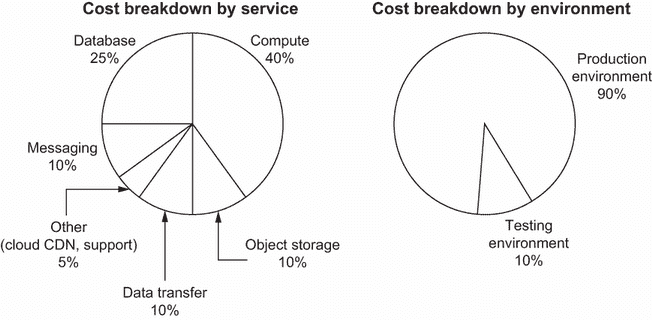

图 12.1 资源标签按服务和环境分解成本。

账单的大部分都花在了计算资源上——特别是服务器。如果你的团队成员需要支持更大型的会议，他们需要控制他们创建的资源类型，并根据使用情况优化资源大小。你决定调查控制团队可以使用的服务器和类型的方法。

### 12.1.1 实施测试以控制成本

你检查了会议的指标和每个服务器的资源使用情况。没有服务器超过它们的虚拟 CPU（vCPU）或内存使用量。大部分情况下，你确定你的生产环境最多需要 32 个 vCPU。你的客户的 IT 团队确认最大使用量不超过 32 个 vCPU。

注意 GCP 使用术语*机器类型*来指代一个预定义的虚拟机形状，具有特定的 vCPU 和内存比率，以适应你的工作负载需求。同样，AWS 使用术语*实例类型*，而 Azure 使用术语*大小*。

然而，公共云使得任何人都可以轻松地将服务器调整为使用 48 个 vCPU。由于额外的 CPU，你的账单增加了 50%，而你甚至没有使用完所有这些 CPU。为了更积极地使用 IaC 来控制成本，你结合了第六章中的单元测试和第八章中的策略执行。

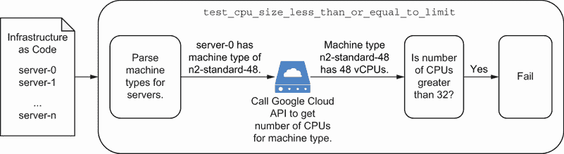

图 12.2 你的测试应该从服务器配置中解析机器类型，检查 GCP API 中的 CPU 数量，并验证它们不超过限制。

图 12.2 在服务器的交付管道中添加了一个新的策略测试。该测试检查 IaC 中定义的每个服务器的 vCPU 数量，并将其与 GCP API 返回的值进行比较。如果 API 的信息超过了你 32 个最大 vCPU 限制，则测试失败。

为什么调用基础设施提供商的 API 来获取 vCPU 信息？许多基础设施提供商提供 API 或客户端库，可以从他们的目录中检索有关给定机器类型的信息。你可以使用它来动态获取关于 CPU 数量和内存的信息。

基础设施提供商经常更改其产品。此外，你无法计算每种可能的服务器类型。编写测试以调用基础设施提供商 API 以获取最新信息有助于提高测试的整体可扩展性。

在列表 12.1 中，让我们实现策略测试以检查最大 vCPU 限制。首先，你构建一个方法来调用 GCP API 以获取给定机器类型的 vCPU 数量。

列表 12.1 从 GCP API 检索机器类型的 vCPU 计数

```
import googleapiclient.discovery

class MachineType():                                     ❶
   def __init__(self, gcp_json):                         ❶
       self.name = gcp_json['name']                      ❶
       self.cpus = gcp_json['guestCpus']                 ❶
       self.ram = self._convert_mb_to_gb(                ❷
           gcp_json['memoryMb'])                         ❷
       self.maxPersistentDisks = gcp_json[               ❷
           'maximumPersistentDisks']                     ❷
       self.maxPersistentDiskSizeGb = gcp_json[          ❷
           'maximumPersistentDisksSizeGb']               ❷
       self.isSharedCpu = gcp_json['isSharedCpu']        ❷

   def _convert_mb_to_gb(self, mb):                      ❷
       GIGABYTE = 1.0/1024                               ❷
       return GIGABYTE * mb                              ❷

def get_machine_type(project, zone, type):
   service = googleapiclient.discovery.build(
       'compute', 'v1')
   result = service.machineTypes().list(                 ❸
       project=project,                                  ❸
       zone=zone,                                        ❸
       filter=f'name:"{type}"').execute()                ❸
   types = result['items'] if 'items' in result else None
   if len(types) != 1:
       return None
   return MachineType(types[0])                          ❹
```

❶ 定义一个机器类型对象以存储你可能需要检查的任何属性，包括 vCPU 数量

❷ 将兆字节内存转换为千兆字节以实现一致的单位度量

❸ 调用 GCP API 以检索给定机器类型的 vCPU 数量

❹ 返回一个包含 vCPU 和磁盘属性的机器类型对象

AWS 和 Azure 等效

你可以使用 AWS 的 Python SDK 来检索 EC2 实例并解析实例类型。然后，描述实例类型以获取 vCPU 和内存信息（[`mng.bz/qYYK`](http://mng.bz/qYYK)）。

要从 Azure 获取机器类型和库存单位（SKU），请使用 Python 的 Azure 库。在从实例列表中检索大小后，你可以调用资源 SKU API 以获取 CPU 数量和内存信息（[`mng.bz/YG1N`](http://mng.bz/YG1N)）。

每次使用新的机器类型时，你都可以使用相同的函数来检索 vCPU 和内存。接下来，你编写一个测试来解析配置中定义的每个服务器的机器类型。在下面的列表中，你检索服务器列表中机器类型的 vCPU 数量，并验证 vCPU 数量不超过 32 的限制。

列表 12.2 编写策略测试以检查服务器是否不超过 32 个 vCPU

```
import pytest
import os
import compute
import json

ENVIRONMENTS = ['testing', 'prod']                                      ❶
CONFIGURATION_FILE = 'main.tf.json'                                     ❶

PROJECT = os.environ['CLOUDSDK_CORE_PROJECT']                           ❶

@pytest.fixture(scope="module")                                         ❶
def configuration():                                                    ❶
   merged = []                                                          ❶
   for environment in ENVIRONMENTS:                                     ❶
       with open(f'{environment}/{CONFIGURATION_FILE}', 'r') as f:      ❶
           environment_configuration = json.load(f)                     ❶
           merged += environment_configuration['resource']              ❶
   return merged                                                        ❶

def resources(configuration, resource_type):                            ❶
   resource_list = []                                                   ❶
   for resource in configuration:                                       ❶
       if resource_type in resource.keys():                             ❶
           resource_name = list(                                        ❶
               resource[resource_type].keys())[0]                       ❶
           resource_list.append(                                        ❶
               resource[resource_type]                                  ❶
               [resource_name])                                         ❶
   return resource_list                                                 ❶

@pytest.fixture                                                         ❶
def servers(configuration):                                             ❶
   return resources(configuration,
                    'google_compute_instance')

def test_cpu_size_less_than_or_equal_to_limit(servers):
   CPU_LIMIT = 32                                                       ❷
   non_compliant_servers = []                                           ❸
   for server in servers:
       type = compute.get_machine_type(                                 ❹
           PROJECT, server['zone'],                                     ❹
           server['machine_type'])                                      ❹
       if type.cpus > CPU_LIMIT:                                        ❺
           non_compliant_servers.append(server['name'])                 ❺
   assert len(non_compliant_servers) == 0, \                            ❻
       f'Servers found using over {CPU_LIMIT}' + \                      ❻
       f' vCPUs: {non_compliant_servers}'                               ❻
```

❶ 解析和提取测试和生产环境中任何服务器的 JSON 配置

❷ 将 CPU 限制设置为 32，这是应用程序所需的最大值

❸ 初始化一个超过 32 个 vCPU 限制的不合规服务器列表

❹ 对于每个服务器配置，检索机器类型属性并调用 GCP API 获取更多信息

❺ 如果服务器配置中包含超过 32 个 vCPU 的机器类型，将其添加到不符合规定的服务器列表中。

❻ 检查所有服务器是否遵守 CPU 限制。如果不遵守，则测试失败，并对超过 32 个 CPU 的服务器抛出错误。

你使用软强制性执行策略配置测试。*软强制性执行*意味着在你创建之前，你的团队会审查和批准更昂贵的资源类型。如果你有业务理由，你可以将机器类型覆盖为更大的尺寸。

除了检查机器类型的 vCPU 和内存限制外，你可能还需要为适用于某些用例（如机器学习）的独特架构或机器类型添加覆盖。然而，它们比通用资源类型成本更高。

您可以通过测试 IaC 默认使用通用资源来验证。通用机器或资源类型提供更低成本的选项。如果有人需要专用、更昂贵的资源，您可以通过软强制性执行来启用它。

其他测试可能包括对特定配置的检查，如计划重启、自动扩展或私有网络。这些配置中的每一个都有助于优化您资源的成本。在 IaC 中表达它们可以让您验证配置是否符合最佳实践，从而在开发早期阶段降低成本。

### 12.1.2 自动化成本估算

您通过策略测试来应对过大或昂贵的资源变更以控制成本。那么，如果您想通过改变成本驱动因素来主动检查您的预算如何变化呢？想象一下，您想知道将您的生产服务器大小调整为`n2d-standard-16`（16 个 vCPU）的机器类型可能会如何影响未来不同三小时会议的成本。

图 12.3 概述了使用机器类型`n2d-standard-16`估算五台服务器成本的流程。一旦计算出价格，您就可以添加策略测试来验证总额不超过您的月度预算。

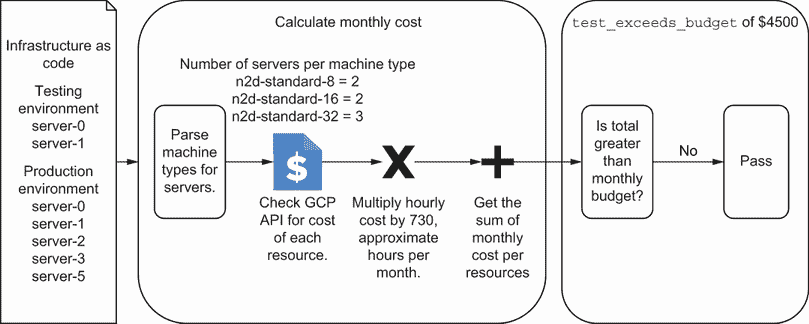

图 12.3 成本估算解析 IaC 的机器类型，计算资源的月度成本，并生成一个与您预期预算进行比较的值。

*成本估算* 解析您的 IaC 以获取资源属性并生成其成本的估算。您可以使用成本估算来检查您的更改是否在预算范围内，或评估对成本驱动因素的调整。

定义 *成本估算* 从基础设施资源属性中提取并生成其总成本的估算。

成本估算如何帮助您演进您的基础设施？成本估算提供了对可能影响您架构的成本驱动因素的额外透明度。随着您改变系统，您可以使用这些测试来帮助预算和跨团队之间的费用报销沟通。

成本估算示例和工具

我编写了最少的代码来展示成本估算的一般工作流程。为了清晰起见，我从文本中省略了一些代码。您可以在[`github.com/joatmon08/manning-book/tree/main/ch12`](https://github.com/joatmon08/manning-book/tree/main/ch12)找到所有组织好的代码。

该示例使用 Google Cloud Billing Catalog API，该 API 提供了一个包含定价的服务目录。我还使用了一个专门的 Python 客户端库来访问 Cloud Catalog 的 API（[`mng.bz/mOOn`](http://mng.bz/mOOn)）。该示例没有考虑专门的定价，例如持续使用折扣或预留实例（在 AWS 中相当于 spot instances）。

您会发现一些提供成本估算的工具。每个云服务提供商都为其资源提供自己的成本估算用户界面。其他工具实现了一个比我的示例代码更可扩展的工作流程，用于解析配置、调用云服务提供商的 API 并计算成本估算。我不会在本章中列出它们，因为它们经常变化，并且取决于云服务提供商和您的 IaC 工具。

获取单价

我建议动态地从云服务提供商的服务目录 API 请求信息。单价可能会变化，而硬编码价格通常会导致成本估算错误。要在示例中开始实现成本估算，您需要一些逻辑来调用云服务提供商的目录并获取基于您的机器类型的单价。

Google Cloud 计费目录 API 根据每单位 CPU 或内存（RAM）的价格提供服务和 SKU 列表。在列表 12.3 中，您获取了 Google Compute Engine 服务的服务标识符。Google Cloud 计费目录 API 根据服务标识符对价格进行分类，您必须动态检索这些标识符。

列表 12.3 从目录中获取 Google Compute Engine 服务

```
from google.cloud import billing_v1

class ComputeService:
   def __init__(self):
       self.billing = \                                               ❶
           billing_v1.services.cloud_catalog.CloudCatalogClient()     ❶
       for result in self.billing.list_services():
           if result.display_name == 'Compute Engine':                ❷
               self.name = result.name
```

❶ 使用 Python 库创建 Google Cloud 计费目录 API 的客户端

❷ 在目录中获取 Google Compute Engine 的服务标识符

AWS 和 Azure 的等效功能

将 GCP 客户端库更新为调用 AWS 成本探索器 API ([`mng.bz/5Qm4`](http://mng.bz/5Qm4)) 用于 AWS。另一方面，Azure 提供了一个用于零售价格的开放 REST API 端点 ([`mng.bz/6X9G`](http://mng.bz/6X9G))。您可以编写一些额外的代码来请求目录信息。

您可以在列表 12.4 中再次调用 Google Cloud 计费目录 API 来获取机器类型的成本。使用上一步中的服务标识符，您获取了 Google Compute Engine 服务的 SKU 列表。您编写一些代码来解析其 SKU 列表响应，以匹配机器类型和用途，并检索每 CPU 或每千兆内存的单元价格。

列表 12.4 获取 Compute Engine SKU 的 CPU 和 RAM 价格

```
from google.cloud import billing_v1

class ComputeSKU:
   def __init__(self, machine_type, service_name):
       self.billing = \                                              ❶
           billing_v1.services.cloud_catalog.CloudCatalogClient()    ❶
       self.service_name = service_name
       type_name = machine_type.split('-')                           ❷
       self.family = type_name[0]                                    ❷
       self.exclude = [                                              ❸
           'custom',                                                 ❸
           'preemptible',                                            ❸
           'sole tenancy',                                           ❸
           'commitment'                                              ❸
       ] if type_name[1] == 'standard' else []                       ❸

   def _filter(self, description):                                   ❸
       return not any(                                               ❸
           type in description for type in self.exclude              ❸
       )                                                             ❸

   def _get_unit_price(self, result):                                ❹
       expression = result.pricing_info[0]
       unit_price = expression. \
           pricing_expression.tiered_rates[0].unit_price.nanos \
           if expression else 0
       category = result.category.resource_group
       if category == 'CPU':
           self.cpu_pricing = unit_price
       if category == 'RAM':
           self.ram_pricing = unit_price

   def get_pricing(self, region):                                    ❺
       for result in self.billing.list_skus(parent=self.service_name):
           description = result.description.lower()                  ❻
           if region in result.service_regions and \                 ❻
                   self.family in description and \                  ❻
                   self._filter(description):                        ❻
               self._get_unit_price(result)
       return self.cpu_pricing, self.ram_pricing
```

❶ 使用 Python 库创建 Google Cloud 计费目录 API 的客户端

❷ 对于像 n2d-standard-16 这样的机器类型，提取机器系列（N2D）和用途（标准）以识别 SKU

❸ 如果您使用标准机器类型，不要在目录中搜索任何专门的计算服务 SKU。

❹ 获取每 CPU 或 RAM 的单价（以纳美元计，10^(-9)）

❺ 调用 Google Cloud 计费目录并检索计算服务的 SKU 列表

❻ 根据机器类型的描述，找到与区域、机器系列和用途匹配的 SKU

Google Cloud 计费目录根据 CPU 数量和内存的千兆字节数设定单价。因此，您不能根据机器类型的名称进行搜索。相反，您需要将通用机器类型与目录描述相关联。

计算单个资源的月度成本

一旦你检索到给定机器类型的 CPU 和 RAM 单价，你可以用它来计算单个实例的月度成本。一些云目录通过一个因子设置单价。例如，GCP 使用纳单位，这意味着你还需要乘以这个因子。列表 12.5 实现了计算单个服务器月度成本的代码。你将单价乘以每月平均小时数，730，以及纳单位。

列表 12.5 计算单个服务器的月度成本

```
HOURS_IN_MONTH = 730                                      ❶
NANO_UNITS = 10**-9                                       ❶

def calculate_monthly_compute(machine_type, region):
   service_name = ComputeService().name                   ❷ 
   sku = ComputeSKU(machine_type.name, service_name)      ❸
   cpu_price, ram_price = sku.get_pricing(region)         ❸

   cpu_cost = machine_type.cpus * cpu_price * \           ❹
       HOURS_IN_MONTH if cpu_price else 0                 ❹
   ram_cost = machine_type.ram * ram_price * \            ❺
       HOURS_IN_MONTH if ram_price else 0                 ❺
   return (cpu_cost + ram_cost) * NANO_UNITS              ❻
```

❶ 设置一个常量，表示一个月 730 小时的平均值，并将纳美元转换为美元（10^(-9)）。

❷ 从 Google Cloud Billing Catalog API 获取 Compute Engine 服务标识符

❸ 为机器类型设置 SKU 并获取其 CPU 和 RAM 单价

❹ 将机器类型的 CPU 数量乘以单价和该月的小时数

❺ 将机器类型的内存（RAM）容量（以千兆字节为单位）乘以单价和该月的小时数

❻ 将 CPU 和 RAM 成本相加，并将其转换为美元单位

现在你已经有一个最小化的成本估算形式，它可以计算单个服务器的成本。通过单个服务器的初始成本计算，你可以解析所有服务器的 IaC，检索它们的机器类型和区域，并计算总成本。在未来，你可以添加更多逻辑来检索其他服务的 SKU，如数据库或消息传递。

检查你的成本是否不超过预算

你决定你可以用你的成本估算做更多的事情。你编写了一个带有软强制性执行方法的测试，以检查你的估算成本是否超过了你的月度预算。例如，你的客户告诉你，一个会议不应超过 4500 美元的月度预算。你可以将你的成本估算与预算进行比较，并主动识别任何成本驱动因素。

让我们编写一个测试来估算服务器的新的成本，并将其与预算进行比较。在以下列表中，你解析所有服务器的 IaC 并计算具有特定机器类型和区域的服务器数量。

列表 12.6 解析所有服务器的 IaC

```
from compute import get_machine_type
import pytest
import os
import json

ENVIRONMENTS = ['testing', 'prod']
CONFIGURATION_FILE = 'main.tf.json'

@pytest.fixture(scope="module")
def configuration():                             ❶
   merged = []
   for environment in ENVIRONMENTS:
       with open(f'{environment}/{CONFIGURATION_FILE}', 'r') as f:
           environment_configuration = json.load(f)
           merged += environment_configuration['resource']
   return merged

@pytest.fixture
def servers(configuration):                      ❷
   servers = dict()
   server_configs = resources(configuration,
                              'google_compute_instance')
   for server in server_configs:
       region = server['zone'].rsplit('-', 1)[0]
       machine_type = server['machine_type']
       key = f'{region},{machine_type}'
       if key not in servers:
           type = get_machine_type(              ❸
               PROJECT, server['zone'],          ❸
               machine_type)                     ❸
           servers[key] = {                      ❹
               'type': type,                     ❹
               'num_servers': 1                  ❹
           }                                     ❹
       else:                                     ❹
           servers[key]['num_servers'] += 1      ❹
   return servers
```

❶ 读取定义每个环境的配置文件，例如测试和生产

❷ 对于配置文件中的每个服务器，创建它们的区域和机器类型列表

❸ 调用 Google Compute API 并获取有关机器类型的详细信息，例如其 CPU 数量和内存

❹ 跟踪具有特定机器类型和区域的服务器数量，以简化你需要检索的 SKU

你可以在测试中调用这些方法来检索特定区域中每种机器类型的成本信息，并计算总成本。以下列表中的测试检查总成本是否超过 4500 美元的月度预算。

列表 12.7 获取 Compute Engine SKU 的 CPU 和 RAM 价格

```
from estimation import calculate_monthly_compute

PROJECT = os.environ['CLOUDSDK_CORE_PROJECT']
MONTHTLY_COMPUTE_BUDGET = 4500                                           ❶

def test_monthly_compute_budget_not_exceeded(servers):                   ❷
   total = 0
   for key, value in servers.items():
       region, _ = key.split(',')
       total += calculate_monthly_compute(value['type'], region) * \     ❸
           value['num_servers']                                          ❸
   assert total < MONTHTLY_COMPUTE_BUDGET                                ❹
```

❶ 设置一个常量，以传达预期的月度计算预算

❷ 测试你的服务器成本是否不超过月度计算预算

❸ 根据机器类型和区域计算每台服务器的月度总成本，乘以该机器类型的服务器数量，然后汇总总成本

❹ 确认估算的总成本不超过月度计算预算

你现在有一个测试来估算计算资源的总月度成本，并将其与你的预算进行比较！每次有人更改基础设施时，测试都会重新计算系统的新的成本。

成本估算可以给你提供一个关于基础设施成本的一般视图，但可能无法准确反映你的实际账单。你必须考虑到一定的误差范围。如果你的估算超过了月度预算，这可能表明你需要重新评估规模和资源使用。你还将根据你系统的增长，随着时间的推移调整你的月度预算。

带有成本估算的持续交付

你如何检查基础设施变更是否不超过你的预算？每次你更改 IaC 并将其推送到仓库时，你的成本估算和预算测试都会运行。管道中的预算测试帮助你识别昂贵的基础设施变更并在测试环境中优化资源。这个过程可以防止生产环境中的费用追回。

例如，假设你想要为不同的会议向测试环境添加另一台服务器。在图 12.4 中，你创建了一个配置来添加一台具有`n2d-standard-8`机器类型的另一台服务器。管道运行一个测试来计算带有新服务器的月度成本，并将其与月度预算进行比较。

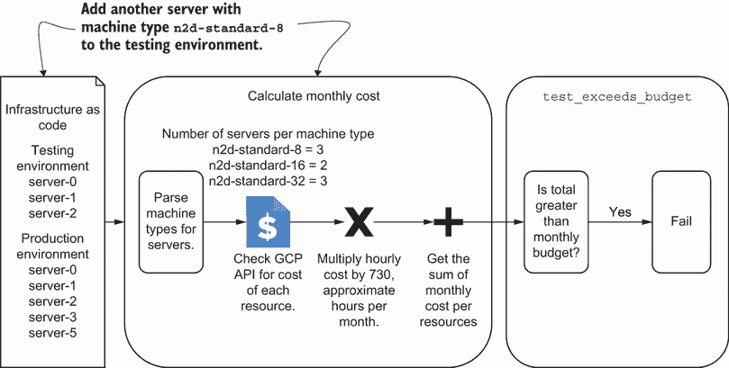

图 12.4 添加另一台服务器超出了 4,500 美元的预算，导致测试失败。

你将配置推送到仓库，并且你的交付管道会运行测试来检查预算合规性。管道失败了！你检查日志并发现你的成本估算超过了预期的月度预算：

```
$ pytest test_budget.py
FAILED test_budget.py::test_monthly_compute_budget_not_exceeded – 
➥assert 4687.6161600000005 < 4500
```

你与财务团队进行了沟通。财务分析师确认预算可以增加以适应新的测试实例。你更新了测试中的月度预算，将其调整为 4,700 美元，以应对未来的变化！

无论你是编写成本估算机制还是使用工具，你应该考虑将其添加到你的交付管道中作为另一个策略测试。估算有助于指导实例大小和用量。它应该*永远*不会在生产前阻止变更。相反，它应该为你提供一个*机会*来重新评估资源的需求。

不要将每个成本驱动因素都计入你的成本估算中。相反，选择构成你账单大部分的资源。示例侧重于计算资源，如服务器，这些资源通常对成本贡献很大。你可能还需要对其他资源，如数据库或消息框架，实施成本估算。

总是质疑你的成本估算的准确性！你不能预测你将创建的资源或你如何使用它们。例如，你可能发现很难估算在不同区域或服务之间传输数据的成本，直到它发生。将你的成本估算与你的月度账单对账，并评估哪些成本驱动因素导致了差异。

每月比较可以帮助你识别任何变化，并根据估算的乘数预算实际成本。在本章的剩余部分，我们将讨论减少云浪费和优化成本的方法，这些方法超出了主动措施，如测试或估算。

练习 12.1

给定以下代码，以下哪些陈述是正确的？（选择所有适用的选项。）

```
HOURS_IN_MONTH = 730
MONTHLY_BUDGET = 5000
DATABASE_COST_PER_HOUR = 5
NUM_DATABASES = 2
BUFFER = 0.1

def test_monthly_budget_not_exceeded():
   total = HOURS_IN_MONTH * NUM_DATABASES * DATABASE_COST_PER_HOUR
   assert total < MONTHLY_BUDGET + MONTHLY_BUDGET * BUFFER
```

A) 测试将通过，因为数据库的成本在预算内。

B) 测试估算数据库的每月成本。

C) 测试不考虑不同数据库类型。

D) 测试计算每个数据库实例的每月成本。

E) 测试包括 10%的缓冲，作为软强制性政策，以应对任何成本超支。

请参阅附录 B 以获取练习的答案。

## 12.2 减少云浪费

你可以使用 IaC（基础设施即代码）来实施主动措施，以管理云计算的成本驱动因素。然而，你需要将它们与其他实践相结合，以继续减少和优化成本。毕竟，在示例中，你的客户仍然不欣赏为三小时会议支付 10,000 美元的云账单！

如果你配置了一个大服务器但未使用所有 CPU 或内存，你浪费了未使用的 CPU 或内存。你有机会降低你的云计算成本！你可以采取的一种改进账单状态的方法是消除*云浪费*，即未使用或利用率不足的基础设施资源。

定义*云浪费*是指未使用或利用率不足的基础设施资源。

你可以通过删除、过期或停止未使用的资源；根据使用情况安排或调整实例；以及评估适合你系统的正确资源大小或类型来减少云浪费；参见图 12.5。

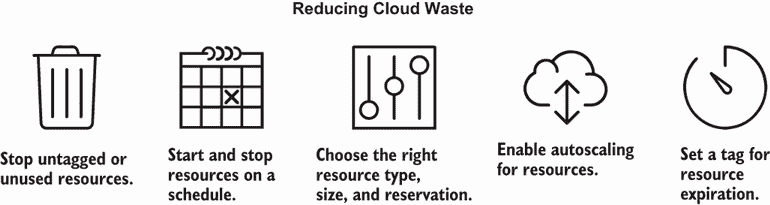

图 12.5 你可以通过删除未使用的资源，或安排和调整资源以适应使用模式来减少云浪费。

识别云浪费通常是从对公共云账单上令人惊讶的成本的第一反应开始的。然而，你可以在数据中心使用这些技术，特别是对于私有云。虽然它们不会提供即时的短期利益，但它们有助于优化数据中心资源使用和长期成本降低。

### 12.2.1 停止未标记或未使用的资源

有时你和你的团队会创建基础设施资源进行测试或其他配置。你最终会忘记它们，直到它们出现在你的云账单上。作为减少云浪费的第一步迭代，你可以识别未使用的资源并将它们删除。

回想一下，你有一个使命，那就是降低你客户举办会议的运营成本。你能通过识别未使用资源来降低成本吗？是的！有时我们的团队为测试创建了资源，却忘记了移除它们。

例如，你检索了你 Google Cloud 项目中的服务器列表，并在表 12.2 中检查它们。虽然许多测试和生产中的服务器都有标签，但你注意到有两个实例没有标签。`n2d-standard-16` 机器的费用约为 $700（占月度总账单的 7%）。

表 12.2 按类型和环境划分的服务器成本

| 机器类型 | 环境 | 服务器数量 | 小计 |
| --- | --- | --- | --- |
| `n2d-standard-8` | 测试 | 2 | $400 |
| `n2d-standard-16` | 生产 | 2 | $700 |
| `n2d-standard-32` | 生产 | 3 | $2,900 |
| 总计 | $4,000 |

你询问团队关于生产中的未标记实例。他们为沙盒创建了服务器以验证应用程序，但从未使用过它们。为了确保，你检查了整个月的服务器使用指标，它们都保持在零。你识别了一些云浪费！

团队确实使用基础设施即代码(IaC)创建了服务器。你删除了配置并推送更改以移除未使用的实例。删除配置会移除附加到实例的磁盘和资源。幸运的是，你下一次会议的云账单反映了这种减少。

为什么你会通过指标和团队成员确认服务器的使用情况？你不想意外地删除资源。有时你对看似未使用的资源有意外依赖。

确保你打算删除的资源没有其他依赖。如果你对删除未标记或未使用的资源有顾虑，你可以总是停止资源一周或两周，等待确定它是否破坏了系统，然后删除它。

### 12.2.2 按计划启动和停止资源

你的下一次云账单比上次减少了 7%，这得益于未使用服务器的移除。然而，财务团队希望你能进一步降低成本。你对此感到困惑，直到你与客户团队的一员交谈。他们提到，他们周末从不运行测试或使用任何基础设施资源。客户需要在会议前一周的平台可用。

你能否找到一种方法在周五晚上关闭服务器，并在每周一打开它们？你不会因为关闭服务器 48 小时而付费。安排定期关机意味着成本降低。

你发现 GCP 使用计算资源策略定义了一个实例关机时间表([`mng.bz/o25N`](http://mng.bz/o25N))。你每周一启动服务器，每周六关闭它们，如图 12.6 所示。


图 12.6 你可以通过安排资源在不使用时启动和停止来降低成本。

按计划关闭实例可以减轻运行服务器的成本。然而，这项技术*仅*在你了解你系统的行为时才有效。按计划启动和停止资源可能会干扰开发工作。

一些应用程序没有容错机制，即使资源成功重启，也会继续失败。一般来说，大多数重启计划只在测试环境中运行。该计划为你提供了一个机会来验证你系统的弹性，因为每个周末你都有一个计划中的停机。

列表 12.8 在 GCP 中实现了实例调度的资源策略。该计划在会议前一周到期，因此周末不会关闭服务器。开发团队可能需要在会议前的几天内在该平台上工作。

列表 12.8 为实例调度创建资源策略

```
def build(name, region, week_before_conference):
   expiration_time = datetime.strptime(                      ❶
       week_before_conference,                               ❶
       '%Y-%m-%d').replace(                                  ❶
           tzinfo=timezone.utc).isoformat().replace(         ❶
               '+00:00', 'Z')                                ❶
   return {
       'google_compute_resource_policy': {
           'weekend': {
               'name': name,
               'region': region,
               'description':
               'start and stop instances over the weekend',
               'instance_schedule_policy': {                 ❷
                   'vm_start_schedule': {                    ❸
                       'schedule': '0 0 * * MON'             ❸
                   },                                        ❸

                   'vm_stop_schedule': {                     ❹
                       'schedule': '0 0 * * SAT'             ❹
                   },                                   
                   'time_zone': 'US/Central',                ❺
                   'expiration_time': expiration_time     
               }
           }
       }
   }
```

❶ 在会议前一周使用 RFC 3339 日期格式过期计划

❷ 创建一个具有实例调度的计算资源策略

❸ 每周一午夜启动虚拟机

❹ 每周六午夜停止虚拟机

❺ 在美国中部时区运行计划，因为开发团队在中部美国工作

AWS 和 Azure 的等效功能

其他公共云提供商通常提供类似的自动化功能，以按计划启动和停止虚拟机。例如，AWS 使用实例调度器来启动和停止服务器和数据库([`mng.bz/nNev`](http://mng.bz/nNev))。同样，Azure 基于 Azure 函数使用启动/停止虚拟机工作流([`mng.bz/v6Xx`](http://mng.bz/v6Xx))。

如果你的公共或私有云平台不提供计划关闭功能，你需要编写自动化代码以定期运行。我在使用各种工具之前实现了这一点，包括无服务器函数、容器编排器上的 cron 作业或持续集成框架上的计划运行。

与每月运行 730 小时的服务器相比，你大约少运行了 144 小时（假设一个月有三个周末和 48 小时的关闭时间）。使用你的成本估算代码，你更新了每月 586 小时的计算。它输出你将整体成本降低了 700 美元（总月账单的 7%）！

该示例将计划添加到测试环境中。然而，如果你有一个具有周期性使用模式的运行环境，你也可以将重启计划添加到生产环境中。例如，会议平台按需运行三小时，仅在周一至周五服务用户流量。关闭服务器和数据库 48 小时不会干扰用户流量。然而，你可能不希望在持续服务请求的生产环境中实施重启计划。

### 12.2.3 选择正确的资源类型和大小

如果您的生产环境需要每天 24 小时、每周 7 天服务客户，您仍然可以通过评估资源类型和大小来减少云浪费，而无需资源计划。许多资源并没有充分利用它们的 CPU 或内存。

许多时候，我们分配更大的资源是因为我们不知道需要多少。运行系统一段时间后，您可以调整资源的大小以适应其实际使用。您可以通过更改资源类型、大小、预留、副本甚至云服务提供商来降低成本，如图 12.7 所示。

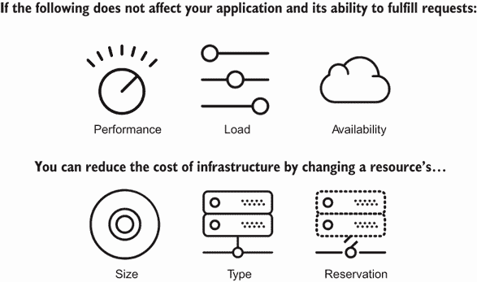

图 12.7 您可以通过更改资源的属性来更好地利用它并降低其成本。

您决定调查客户的会议平台以找到资源类型和大小上的云浪费。您意识到您无法降低计算资源的成本，因此您检查了数据库（Cloud SQL）。团队为生产数据库预留了 4 TB 的固态硬盘（SSD）存储，详情见表 12.3。

表 12.3 按提供和资源计算您的云账单

| 提供商 | 类型 | 环境 | 数量 | 小计 |
| --- | --- | --- | --- | --- |
| Cloud SQL | $2,500 |
|  | db-standard-1, 400 GB SSD, 600 GB backup | 测试 | 1 | $250 |
|  | db-standard-4, 4 TB SSD, 6 TB backup | 生产 | 1 | $2,250 |

在检查指标和数据库使用情况后，您意识到它只需要 1 TB 的 SSD。您更新了 IaC 中数据库的磁盘大小。调整大小将数据库成本降低了$1,350（占月度总账单的 22.5%）！

您可能以许多其他方式没有充分利用资源。如果它使用更昂贵的机器类型，您可能需要考虑更改资源类型。您需要问自己和您的团队，“如果我们不运行性能测试，我们是否真的需要在测试环境中运行这个高性能数据库？”

可能不是！为特定环境选择正确的大小和类型可能需要几次迭代。您希望选择一个资源类型、大小和副本，以模拟生产环境，而不使其在成本上完全相同。

对于会议示例，您可能在生产中有三个`n2d-standard-32`实例，在测试环境中有三个`n2d-standard-8`实例。配置仍然测试了三个应用程序实例，而没有产生 72 个 CPU 的成本。

有时，您还可以更改资源的预留类型。GCP 和许多其他云服务提供商提供了一种*短暂性*（也称为*现货*或*可抢占性*）的资源类型。这种资源成本较低，但云服务提供商保留停止资源并将 CPU 或内存分配给其他客户的权利。虽然短暂性资源预留可以降低成本，但您需要仔细考虑您的应用程序和系统是否能够处理这种中断。

### 12.2.4 启用自动扩展

您试图在环境中识别尽可能多的云浪费，但仍希望进一步降低成本。许多系统具有客户使用模式，这些模式不需要系统中的 CPU、内存或带宽在每天每小时都使用。

例如，会议平台只在会议的三小时内需要其全部容量！您能否根据需求自动增加或减少服务器数量？

图 12.8 将目标利用率设置为 CPU 使用量的 75%，以便 GCP 管理实例组启动和停止服务器以匹配目标指标。它根据需求增加和减少组的大小。

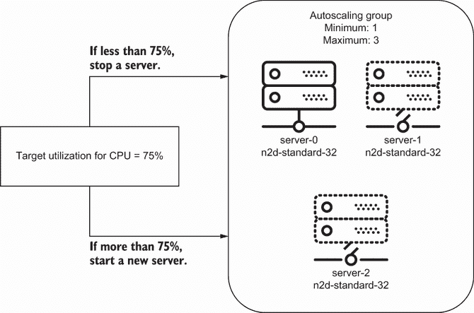

图 12.8 自动扩展组包括一个目标利用率，这允许它自动启动和停止资源以调整使用情况。

您为每个服务器组添加了自动扩展。*自动扩展* 根据指标（如 CPU 或内存）增加或减少组中的资源数量。许多公共云提供商提供自动扩展组资源，您可以使用基础设施即代码（IaC）创建。

定义 *自动扩展* 是根据指标自动增加或减少组中资源数量的实践。

GCP 自动扩展要求您设置一个目标指标以扩展或缩减资源以达到。在大多数月份的低流量期间，您预计只需使用一台服务器。然而，当高峰流量通过您的会议平台时，您需要最多三台。您决定使用 CPU 利用率作为指标，并将目标设置为 75%。

您更新了服务器的 IaC。在列表 12.9 中，您用托管实例组和自动扩展策略替换了原始的服务器和实例调度资源策略。自动扩展计划每天早上启动，增加或减少实例以达到 75% 的 CPU 利用率，并在每天晚上将实例扩展为零。

列表 12.9 基于 CPU 利用率创建自动扩展组

```
def build(name, machine_type, zone,
         min, max, cpu_utilization,
         cooldown=60,
         network='default'):
   region = zone.rsplit('-', 1)[0]
   return [{                                                             ❶
       'google_compute_autoscaler': {                                    ❶
           name: {                                                       ❶
               'name': name,                                             ❶
               'zone': zone,                                             ❶
               'target': '${google_compute_instance_group_manager.' +    ❶
               f'{name}.id}}',
               'autoscaling_policy': {
                   'max_replicas': max,                                  ❷
                   'min_replicas': 0,                                    ❸
                   'cooldown_period': cooldown,
                   'cpu_utilization': {
                       'target': cpu_utilization                         ❹
                   },
                   'scaling_schedules': {                                ❺
                       'name': 'weekday-scaleup',                        ❺
                       'min_required_replicas': min,                     ❺
                       'schedule': '0 6 * * MON-FRI',                    ❺
                       'duration_sec': '57600',                          ❺
                       'time_zone': 'US/Central'                         ❺
                   }                                                     ❺
               }
           }
       }
   }]
```

❶ 将实例组附加到自动扩展资源。我们省略了实例组以保持清晰。

❷ 当 CPU 利用率超过 75% 时，设置最大副本数以扩展

❸ 默认将最小副本数设置为零，这意味着它停止虚拟机

❹ 将 CPU 利用率作为自动扩展组的目标指标

❺ 设置一个扩展计划，每周一至周五上午增加开发团队使用模式下的最小副本数

AWS 和 Azure 等效

GCP 将托管实例组附加到自动扩展策略中。GCP 不允许您附加资源策略。您必须在自动扩展组中实现计划。

其他公共云提供商也提供服务器和有时数据库的自动扩展功能。AWS 使用自动扩展组。Azure 使用自动扩展规则进行规模集。

你可以在示例中设置一个扩展计划来模拟你之前实施的周末关闭。一般来说，使用模块的模式来创建自动扩展模块。该模块应根据你的工作负载设置一个有见地的默认目标指标。

如果你有一个不适合模块预设目标指标的独特工作负载，你可以将其默认设置为针对 CPU 利用率或内存，并评估其随时间的行为。当你推出实例组时，应用第九章中的蓝绿部署模式来替换活动工作负载或实例。推出计划和自动扩展组不应干扰应用程序。

为了鼓励团队使用自动扩展组和调度，你可以创建几个策略测试，以确保你的自动扩展组减少云浪费。例如，一个测试可以验证你的 IaC 没有单独的服务器，只包含自动扩展组。这个测试鼓励团队利用弹性。

你可以添加另一个测试，涉及检查最大副本限制。假设你的应用程序突然消耗了大量的 CPU 或内存，或者一个恶意行为者在你的机器上注入了加密货币挖矿的二进制文件。在这种情况下，你不想自动扩展组自动将其容量增加到 100 台机器。

### 12.2.5 设置资源过期标签

你可以通过根据利用率动态扩展和缩减资源来减少云浪费，但你还需要适应按需手动创建的资源。例如，客户端团队成员抱怨他们经常需要创建沙盒服务器进行进一步测试。然而，他们经常忘记服务器。如果没有人更新它们，你能在一段时间后“过期”服务器吗？

你决定更新你的标签模块，在测试环境中附加一个新的标签用于**过期日期**。回想一下，你可以使用原型模式（第三章）来建立标准标签。在应用第八章中的策略测试以检查标签合规性之后，你知道测试环境中的每个资源都将有一个过期日期。

例如，团队成员可能会创建一个初始过期日期为 2 月 2 日的服务器，如图 12.9 所示。然而，他们决定更新服务器。作为变更的一部分，标签模块检索当前日期（2 月 5 日），添加七天，并将服务器上的标签更新为新日期（2 月 12 日）。

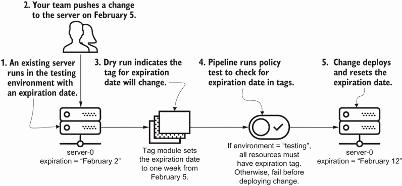

图 12.9 在标签模块中创建一个过期日期，将模块的过期日期重置为更改后的一个星期。

为什么要在标签模块中使用设置过期日期？你的标签模块应该应用于你所有的 IaC。这允许你建立一个**默认持续时间**为七天，并将其应用于所有基础设施资源。

您还可以控制何时应用到期标签作为模块的一部分。只有当您在生产环境中未创建资源或持续在测试环境中运行时，模块才会应用到期标签。以下列表更新了具有到期日期的默认标签的原型模块。

列表 12.10 带有到期日期的标签模块

```
import datetime

EXPIRATION_DATE_FORMAT = '%Y-%m-%d'                        ❶
EXPIRATION_NUMBER_OF_DAYS = 7                              ❷

class DefaultTags():
   def __init__(self, environment, long_term=False):
       self.tags = {
           'customer': 'community',
           'automated': True,
           'cost_center': 123456,
           'environment': environment
       }
       if environment != 'prod' and not long_term:         ❸
           self._set_expiration()                          ❸

   def get(self):
       return self.tags

   def _set_expiration(self):
       expiration_date = (                                ❹
           datetime.datetime.now() +                      ❹
           datetime.timedelta(                            ❹
               days=EXPIRATION_NUMBER_OF_DAYS)            ❹
       ).strftime(EXPIRATION_DATE_FORMAT)                 ❺
       self.tags['expiration'] = expiration_date
```

❶ 将日期格式化为年、月、日的字符串

❷ 从当前日期计算七天后的到期日期

❸ 如果在生产环境中未创建资源或将其标记为长期资源，则设置到期标签

❹ 从当前日期计算七天后的到期日期

❺ 将日期格式化为年、月、日的字符串

您将一周设为默认值，因为这给团队成员足够的时间开发和测试资源。他们可以通过运行交付管道自动更新标签来续订另一周。然而，您确实需要启用覆盖，以便在测试环境中允许长期资源。

如何默认强制执行到期日期标签，但豁免资源不设置到期日期？您可以创建一个具有软强制性执行的策略测试。软强制性策略允许对测试环境中的长期资源进行例外和审计。

让我们编写一个测试，强制执行列表 12.11 中每个服务器资源的到期标签。如果服务器不在免于策略的资源列表中，测试将失败，并停止交付管道部署所有更改到生产环境。

列表 12.11 测试检查测试资源是否具有到期日期

```
import pytest

def test_all_nonprod_resources_should_have_expiration_tag(
       servers, server_exemptions):                             ❶
   noncompliant = []
   for name, values in servers.items():
       if 'expiration' not in values['labels'].keys() and \     ❷
               name not in server_exemptions:                   ❸
           noncompliant.append(name)                            ❸
   assert len(noncompliant) == 0, \
       'all nonprod resources should have ' + \
       f'expiration tag, {noncompliant}'
```

❶ 从配置中检索服务器列表以及免于策略的服务器

❷ 检查服务器标签中是否存在到期标签

❸ 如果您未豁免服务器，您必须将服务器标记为不符合策略。

将资源添加到豁免列表意味着您的团队成员将仔细检查哪些资源持续存在于测试环境中。在同行评审（第七章）期间，您可以根据豁免列表的更改识别任何新的持久资源。测试环境中的持久资源单一来源确保您可以在开发早期审计和讨论成本控制。

在 IaC 中实现到期标签后，您需要编写一个每天运行的脚本。图 12.10 显示了脚本的流程。它检查到期日期是否与当前日期匹配。如果是，自动化会删除资源。

为什么使用 IaC 设置到期日期？使用标签模块设置到期日期的工作流程内置了更新资源到期日期的能力！而不是通过添加单独的自动化来引入开发摩擦，您将续订纳入开发过程。


图 12.10 设置到期标签允许每日自动化确定是否删除临时资源，从而降低成本。

例如，如果一个团队仍然需要资源，它总是可以重新运行其 IaC 交付管道来重置有效期，再延长七天。对资源的主动更改也会重置有效期。如果您更改了基础设施，您可能仍然需要该资源。

当资源到期而您仍然需要它时会发生什么？您总是可以重新运行您的 IaC 并创建一个新的。使用 IaC 添加和更新到期日期提供跨团队的成本合规性和功能可见性。

注意：有时您会发现针对自动标记的单独自动化。自动化在创建基础设施资源后添加到期日期。虽然自动标记意味着对成本合规性有更大的控制，但它也引入了实际配置和预期配置之间的偏差。此外，自动到期通常会让团队成员感到困惑。除非他们注意到了您的沟通，否则他们可能会在几天后发现他们的资源被删除了！

您总是可以将到期时间间隔设置为几天以外的其他时间。如果您想为团队提供更多灵活性，您可以通过标签模块提供一系列天数。我建议计算绝对到期日期并将其添加到标签中，而不是时间间隔，以便更容易进行清理自动化。

在示例中的所有更改之后，您的客户的云计算账单发生了什么变化？您的账单从略高于 10,000 美元降至约 6,500 美元（减少了 35%）！您的客户感谢他们云资源的有效使用。

在现实中，您可能无法实现与示例相同的戏剧性成本降低。然而，您始终可以将这些实践和技术应用于您的 IaC，以在可能的情况下引入减少成本的小幅变化。通过测试捕获成本降低实践确保每个人在考虑成本约束的情况下编写代码。

练习 12.2

假设您有三台服务器。您检查它们的利用率，并注意到以下情况：

+   您需要一个服务器来处理最小流量。

+   您需要三个服务器来处理最大流量。

+   服务器每天 24 小时、每周 7 天处理流量。

您可以做什么来优化下个月服务器的成本？

A) 将资源安排在周末停止。

B) 添加一个基于内存的`autoscaling_policy`进行扩展。

C) 为所有服务器设置三小时的到期时间。

D) 将服务器更改为较小的 CPU 和内存机器类型。

E) 将应用程序迁移到容器中，并在服务器上更密集地打包应用程序。

请参阅附录 B 以获取练习的答案。

## 12.3 优化成本

您可以将其他基础设施即代码（IaC）原则和实践应用于减少云浪费和管理成本驱动因素。例如，按需构建环境、更新区域间的路由或在生产环境中进行测试等技术可以使用 IaC 进一步优化成本，如图 12.11 所示。

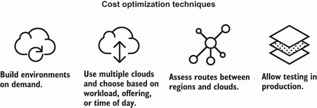

图 12.11 成本优化需要 IaC 实践来扩展和部署基础设施资源。

尤其是可重复性、可组合性和可进化性的原则可以帮助通过创造性的技术进一步优化成本。这些技术包括按需复制环境以减少持久测试环境、跨云提供商组合基础设施以及跨区域和云提供商演进生产基础设施。

回想一下，你通过减少客户用于会议的云计算成本 35%。一年后，财务团队请求你的帮助来优化他们平台的成本。他们的业务已经增长，并希望优化数百名客户和托管服务的成本。

### 12.3.1 按需构建环境

从更广泛的角度来看，你需要检查测试和生产中存在哪些环境。你可能从减少所有环境中的云浪费开始。然而，随着你的公司发展壮大，它需要添加更多环境来支持和支持更多产品。

想象一下你检查了客户的架构。客户有许多测试环境。你确定其中三到四个环境持续运行并支持专业测试。例如，质量保证（QA）团队每年使用其中一个环境进行性能测试两次。在其余的一年中，这些环境保持休眠状态。

你决定*移除持续运行的环境*。如果 QA 团队需要用于性能测试的环境，他们可以按需创建。团队会复制生产环境，包括其工厂和构建模块，这些模块允许输入。这些模块提供了指定不同环境变量和参数的灵活性。

图 12.12 显示了创建按需环境的其余工作流程。QA 团队将 IaC 复制到组织多仓库结构中针对测试环境的特定新仓库。团队更新参数和变量，运行其测试，并移除环境。

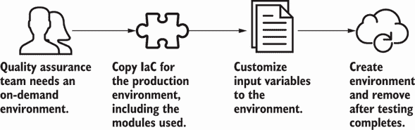

图 12.12 你可以复制生产环境的配置来创建和定制用于测试的按需环境。

为什么使用可重复性按需创建新环境并删除它们？一个新的、更新的环境确保最新的配置与生产环境匹配。如果你一年只使用一次环境，你不想让它持续运行 11 个月。

虽然创建新环境需要时间，但你可能花费同样多的时间试图修复测试环境和生产环境之间的漂移。识别不必要的长时间运行的环境并将它们切换到按需模式可以帮助减轻成本，尤其是如果你可以轻松地重新创建它们。

### 12.3.2 使用多个云

在有限的云提供商选项中，您也可以考虑部署到其他云，并根据资源、工作负载和一天中的时间优化成本。IaC 可以帮助标准化和组织多个云的配置。部署到多个云可以满足需要特定基础设施资源的专业工作负载或团队。

例如，假设您的客户使用 Google Cloud Dataflow 进行流数据处理。然而，成本取决于管道的类型。您说服一些报告团队将一些批处理管道转换为 Amazon EMR 以降低整体成本。

Azure 等效

Azure 中与 Amazon EMR 或 Google Cloud Dataflow 等效的是 Azure HDInsight。

在图 12.13 中，报告服务团队将其 IaC 切换到使用 Amazon EMR 模块。为了最小化作业的中断，团队成员使用第九章中提到的蓝绿部署模式，逐渐增加他们在 Amazon EMR 中运行的作业数量。

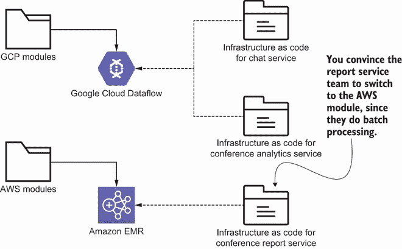

图 12.13 报告服务通过引用不同的模块将其批处理作业切换到使用 Amazon EMR 而不是 Google Cloud Dataflow。

可组合性原则成为多云配置的重要组成部分。IaC 使得管理并识别不同云提供商的基础设施资源变得更加容易。使用模块来表示云之间的依赖关系也有助于您随着时间的推移演进资源。

在第五章中，我们将 IaC 配置根据工具和提供商分到了不同的文件夹中。许多 IaC 工具不提供云提供商资源的统一数据模型。为每个计划支持的云构建不同的模块。按提供商分离模块可以降低复杂性并支持模块的独立测试。为每个云提供商维护独立的模块也有助于轻松识别基础设施资源和提供商。

### 12.3.3 评估区域和云之间的数据传输

随着多云的采用，您可能会发现您并没有降低整体云计算账单。您需要仔细考虑多云，因为提供商将根据区域间和云网络外的数据传输收费。数据传输成本以令人惊讶的方式累积！

您检查客户的云计算账单，发现大部分成本来自区域间和网络外的数据传输。经过一些调查，您发现许多服务和测试环境都在跨区域、可用区和公共互联网中进行通信。

例如，`us-central1-a`中聊天服务的集成测试使用了`us-central1-b`中用户配置文件服务的公网 IP 地址！你意识到集成测试环境中的所有服务都不需要跨区域、可用区或网络外进行测试。

集成测试仅测试服务相对于其他服务的功能，而不是系统本身。图 12.14 使用第十章中的重构技术将集成测试环境中的基础设施资源整合到一个可用区。

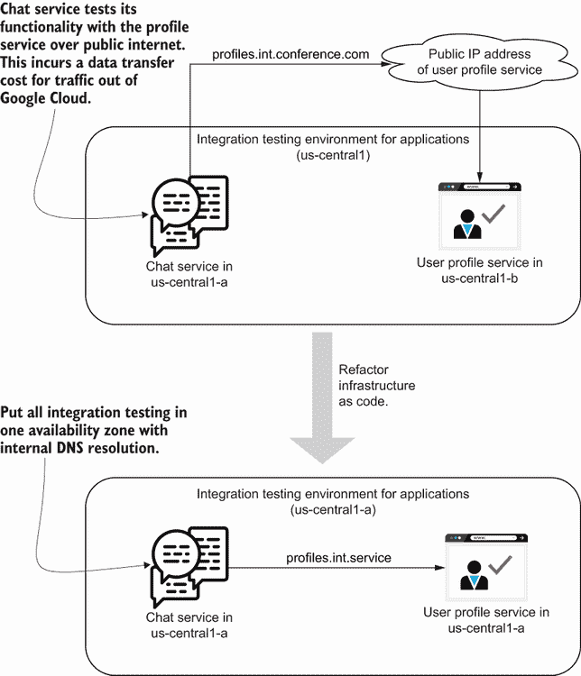

图 12.14 重构您的 IaC 以支持单个可用区中的集成测试环境，并解析到私有 IP 地址。

如果可用区失败会怎样？您始终可以将 IaC 切换到不同的区域或地区。应用程序仍然通过私有网络进行通信，并且不会对谷歌云网络之外的数据传输或区域和区域之间的数据传输收费。

优先考虑私有网络而非公共网络，这不仅关乎安全，还关乎成本和效率。如果您使用多个云，了解哪些资源需要在云之间进行通信。有时，您可能会发现将整个服务集转移到另一个云比支付云之间的数据传输费用更经济高效。应用第九章和第十章中的更改和重构技术可以帮助整合服务和通信。

### 12.3.4 生产环境测试

即使在转移到多个云并优化数据传输之后，您可能会发现您的测试环境无法完全模拟生产环境，并且运行成本过高。在某个时候，您无法在隔离环境中进行测试。与其完全模拟生产环境，不如通过直接在生产环境中进行测试来继续优化成本。

在会议平台的案例中，您帮助视频服务团队实施更改以进行生产测试。在图 12.15 中，团队成员使用功能标志隐藏预期更改，并创建了一组新的基础设施资源。然后，他们切换标志以将所有应用程序和用户流量导向，并在生产环境中验证其功能。这两组资源同时运行几周。几周后，他们删除了旧的基础设施资源。

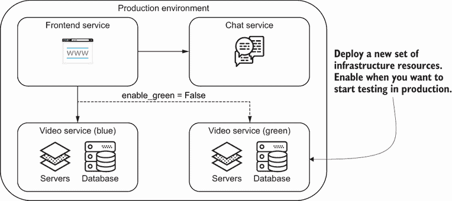

图 12.15 展示了 IaC 在生产环境中的测试应用了蓝绿部署和功能标志来针对一组资源。

团队通过使用蓝绿服务而不是测试环境来在生产环境中测试其服务。*生产环境测试*涉及一系列实践，这些实践使您能够对生产数据和服务运行测试。

定义*生产环境测试*是一系列实践，允许您对生产数据和服务运行测试。

在软件开发中，您使用特征标志等技术来在生产环境中隐藏某些功能以进行测试。同样，您可以使用金丝雀部署在向平台上的所有人提供之前，先对一小组用户的功能进行测试。

对于基础设施即代码（IaC），在生产环境中进行测试并不完全符合软件开发实践。你不想测试代码是否与一小群用户兼容。你只想知道你是否创建了可能*影响*用户的损坏的基础设施系统！你可以应用一些技术，比如功能标志和金丝雀部署。我们在第九章和第十章中就是这样做的。

你可以直接在生产环境中测试 IaC，而不需要蓝绿部署模式或功能标志。然而，在出现故障的情况下，你需要一个已建立的回滚计划。我在一个组织工作，该组织在将更改推送到生产之前完全依赖于本地测试。如果我们的更改失败，我们会尝试将系统更新到之前的状态。如果所有其他方法都失败了，我们会创建一个全新的基础设施环境，并将所有应用程序和用户流量直接导向新环境。

你可能已经尝试了所有成本优化、云浪费减少和成本驱动控制技术，但*仍然*无法完全优化你的云账单！随着时间的推移，你组织的使用和产品需求会发生变化。

如果你系统中有适当的监控和仪表，你可能会发现你有需求更高或更低的时间段。例如，你的客户的平台在 5 月、6 月、10 月和 11 月需求最高，因为这是高峰会议季节。

注意：你可能需要重新架构你的系统，以利用公共云的*弹性*，即扩展或缩减的能力，并随着时间的推移降低成本。某些软件架构并不容易让你动态地扩展或缩减资源。通常，解决方案需要重构或重新平台化应用程序，以提高系统成本效率。

了解你的系统在一段时间内的资源使用和需求可以帮助你进一步优化成本，超出我在本章中描述的技术。你还可以通过与基础设施提供商协商合同来进一步降低成本。选择新的定价模型让你可以在一定数量的预留实例或基于容量的折扣上节省费用。

系统运行时间越长，你聚集的指标就越多。这些信息可以帮助你在基础设施即代码中迭代成本驱动控制、云浪费减少和整体成本优化。你还可以使用这些信息与云提供商协商，减少云计算账单中的意外费用！

## 摘要

+   在更改 IaC 以优化成本之前，确定可能影响总成本的成本驱动因素（资源或活动）。

+   通过添加策略测试来检查资源类型、大小和预留，管理基础设施中的成本驱动因素，例如计算资源。

+   成本估算解析你的 IaC 以获取资源属性，并根据云提供商的 API 生成其成本的估算。

+   你可以添加策略测试来检查成本估算的输出，以近似你是否超出了预算。

+   云浪费描述了未使用或利用率不足的基础设施资源。

+   消除云浪费可以帮助降低您的云计算成本。

+   通过移除或停止未标记或未使用的资源、按计划启动和停止资源、为更好的利用调整基础设施资源的大小、启用自动扩展以及标记资源到期日期来减少云浪费。

+   自动扩展根据如 CPU 或内存等指标增加或减少给定组中资源数量或数量。

+   优化云计算成本的技术包括按需构建环境、使用多云、评估数据传输以及在生产中进行测试。

+   生产测试使用如蓝绿部署和功能标志等实践来测试基础设施更改，而不需要测试环境。
