# 13 管理工具

本章涵盖

+   评估开源基础设施模块和工具的使用

+   应用技术来更新或迁移 IaC 工具

+   实施事件驱动 IaC 的模块模式

您已经学会了如何编写基础设施代码，通过使用交付管道和测试与团队一起更新它，并在组织内部管理其安全和成本。随着您的基础设施系统的发展，您会适应这些模式和策略，并调整它们以适应新的工作流程和用例。同样，工具会发生变化，但不应破坏扩展、协作和操作基础设施的模式和策略。

更新您的工具可能需要采取几个步骤。您可以选择升级到新版本，用新工具替换它，或者处理更动态的 IaC 用例。本章讨论了处理 IaC 工具更新的常见模式和策略。

这些模式适用于任何涵盖*提供**、**配置管理**和**镜像构建**用例的工具。您会发现它们也适用于软件开发，尽管我根据基础设施的观点对这些模式进行了调整。使用这些模式和策略来减轻更新的影响范围，跨团队扩展新工具，并继续发展您的系统以支持业务需求。

注意：本章不包括任何代码列表。添加示例意味着引入另一个工具。我在更高层次上描述了模式和策略。您可以将这些技术应用于支持 DSLs 或编程语言的任何工具。

您已经阅读了本书中的许多章节，并在不同行业和公司中实践了 IaC。您在建立和扩展 IaC 实践方面建立了声誉。有一天，一家社交媒体公司向您提供了一个平台团队的角色。

该公司已经建立了其 IaC 实践几年了。员工需要您的帮助来维护和更新他们用于 IaC 的工具。您接受了这个提议，并在第一天就接到了一系列待办项目。

## 13.1 使用开源工具和模块

版本控制和公共仓库的易用性使得在编写自己的工具或基础设施模块时，搜索现有工具或模块变得更加简单。您可以去 GitHub 或其他任何服务上寻找满足您需求的自动化和工具。然而，在将新工具引入任何组织之前，您需要确保您已经做了充分的尽职调查。

例如，让我们想象一下维护社交媒体的推送功能团队成员向您提出的情况。他们在网上搜索并找到了一个用于创建数据库的基础设施模块。他们希望使用它。他们希望加快他们的开发过程，避免等待另一个团队审查他们的数据库配置。毕竟，为什么要重新发明轮子呢？

您提出帮助审查该模块的安全性和最佳实践。在您将模块介绍给社交媒体公司的其他团队之前，您使用图 13.1 评估数据库模块的功能、安全和生命周期，然后正式采用它。

每次开源维护者发布新的数据库模块时，您都会重新评估该模块。您可以将此决策流程应用于安全地采用外部 IaC 模块和工具。您想确保您可以使用该工具或模块，并避免在您的基础设施系统中造成不安全的配置，从而允许恶意行为者利用您的系统。

### 13.1.1 功能性

您可能会发现一个模块或工具很有前景。它允许您非常灵活地配置所需的属性。然而，回想一下第二章和第三章，模块应包含一些具有意见的默认值。没有它们，过于灵活的模块或工具可能会导致一次性配置，最终破坏您的系统。

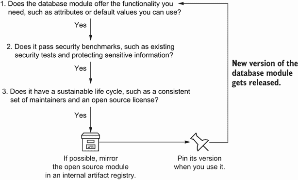

图 13.1 在您使用工具或模块之前，您评估其功能、安全和生命周期。

您鼓励数据源团队验证数据库模块中的默认值。团队评估该模块，如图 13.2 所示。该模块使用非常具有意见的默认值，固定了数据库版本，并彻底测试了兼容性。

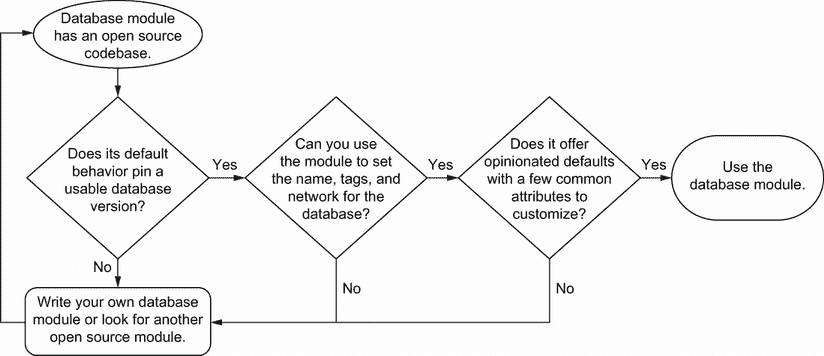

图 13.2 基于功能评估模块或工具使用的决策流程

文档指出，该模块将数据库版本固定，以彻底测试配置及其与特定版本的兼容性。数据源团队成员确认他们使用该数据库版本，并批准了该模块为其设置的默认值。

接下来，他们评估模块的输入变量。数据库模块允许他们设置所需的属性，例如数据库名称。它还允许他们设置标签和网络。数据源团队成员确认他们不需要设置超过这些变量。

由于该模块并未将每个属性都作为输入变量提供，并且提供了适合团队的默认值，因此您根据功能批准该模块。一般来说，请审查模块的文档和提交历史。如果该模块测试了版本兼容性以及适合您功能的一组默认值，您就可以继续进行安全评估。

如果您发现该模块没有提供您需要更改的一些特定默认值或输入变量，您可以找到另一个模块，编写自己的模块，或者带着其限制使用该模块。同样，您可以将决策流程应用于工具，并发现其不足。一个工具不能做所有事情！您必须平衡其在功能上的灵活性与其在基础设施变更中的可预测性。

### 13.1.2 安全性

虽然你可能首先评估模块或工具的功能，但接下来你应该评估其安全性。安全性往往是决定你是否应该使用开源工具或模块的关键标准。如果没有仔细评估开源模块或工具的安全配置或代码，你可能会无意中为恶意行为者打开一扇门，使其能够损害系统。

在饲料团队成员可以使用他们的数据库模块之前，他们需要你检查该模块是否存在任何安全顾虑。你检查数据库模块是否暴露或输出敏感信息，是否向第三方端点发送信息，以及是否通过现有的安全性和合规性测试，如图 13.3 所示。

图 13.3 基于安全性的模块或工具使用评估决策流程

在示例中，数据库模块不会输出密码或任何敏感配置，也不会将信息发送到第三方端点。该模块还通过了你在第八章中编写的数据库的安全和合规性测试。为什么在采用模块之前你应该验证这三个检查？

一个模块可能会意外地暴露或输出敏感信息。例如，在模拟运行期间，配置可能会意外地输出密码。如果确实如此，确保你有方法来缓解或隐藏密码并更换它。

类似地，一个模块不应写入或向未经授权的第三方发送信息。恶意行为者可能会添加一个小的配置，将你的网络信息发送到 HTTP 端点。审查每个资源并检查它们是否没有向第三方发送任何信息。

安全性和开源

软件供应链攻击发生在行为者在供应商的软件中包含恶意代码时，该软件被发送给客户并损害了他们的数据和系统。开源的好处在于，在作为客户的你决定使用它之前，你可以检查代码中包含的内容。

在本节中，我意识到我在防御供应链攻击的风险评估和防护措施上过于简化了。更多详细信息，请参阅 NIST 的白皮书([`mng.bz/449B`](https://shortener.manning.com/449B))，它更好地组织了一些实践。

最后，运行你为基础设施资源编写的现有安全性和合规性测试。你希望拥有*安全*和*合规*的资源。否则，你需要回过头来更新模块以满足你的要求。

在你的基础设施即代码（IaC）中，在一个隔离的测试环境中部署该模块。然后对该模块运行安全性和合规性测试。将模块隔离在其自己的环境中可以确保你不会向运行环境引入不合规的配置。

请记住，并非所有的安全性和合规性测试都会通过。那些失败的测试需要对模块进行一些小的重构才能工作。所有测试通过后，你可以批准该模块作为安全模块使用。

工具在评估其安全性时遵循类似的决策流程。然而，IaC 工具的安全性和合规性测试可能包括静态代码分析和来自您组织的额外审查。对于在干运行期间输出配置或其他信息的工具，您将希望应用第八章中的修复步骤。

### 13.1.3 生命周期

您检查了模块的功能和安全，但合规性团队成员提出了一个非常好的问题。他们询问 *谁* 维护公共模块。如果维护者不再更新它，您的组织将需要对该模块或工具拥有私人（或可能是公共）所有权。

您检查了文档以了解模块的生命周期以及谁在维护它，如图 13.4 所示。如果数据库模块有公司赞助和适当的许可证，您很可能可以使用它。

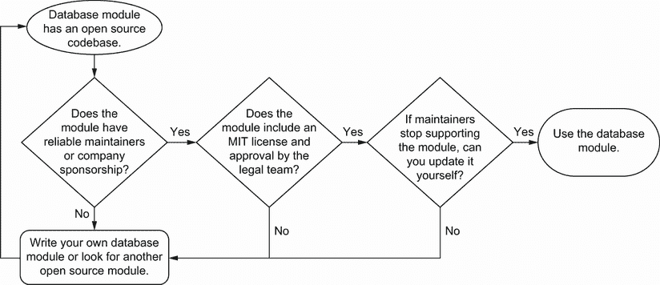

图 13.4 基于工具或模块生命周期评估模块或工具使用的决策流程

您检查了数据库模块的维护者。维护者来自一家知名科技公司，并且有许多贡献者，这意味着项目培养了一个活跃的社区。他们每隔几个月就会更新和发布模块的新版本。每个贡献都必须通过测试套件来验证更改不会破坏模块。

接下来，您检索有关数据库模块开源许可证的信息。您不知道开源许可证如何影响您的公司，因此您联系了您的法律团队。法律团队在数据团队可以使用之前审查了许可证。

该模块包含一个 MIT 许可证。作为一种 *宽松的开源许可证*，MIT 许可证意味着如果您分叉（维护副本）或修改数据库模块，您必须包含许可证副本和原始版权声明。如果维护者废弃了模块或工具，宽松的许可证类型允许您自己修改和更新模块。

定义 A *宽松的开源许可证* 允许您在包含许可证副本和原始版权声明的情况下分叉或修改代码。

您的法律团队批准了许可证，因为该模块对整体基础设施配置的风险极低。公司如果需要可以编辑该模块，但不必公开发布。也许您甚至可以自己为开源模块做出贡献，前提是获得法律批准。

模块或工具还可以包含属于版权左开类别的开源许可证。许可证的 *版权左开* 类别包含一个条款，您必须发布带有您修改的代码库。

定义 A *版权左开的开源许可证* 允许您在发布带有您修改的代码库的情况下分叉或修改代码。

许可证的 copyleft 类别通常包括对修改和分发工具或模块的更多限制。您的公司的法律团队将评估公司是否可以使用具有更严格许可的开源 IaC。

注意：有关开源许可的更多信息，请参阅开源倡议概述的许可和标准（[`opensource.org/licenses`](https://opensource.org/licenses)）。

（兴奋的）饲料团队可以使用数据库模块。您建议团队通过将其镜像到内部工件存储库来锁定模块版本。镜像模块确保团队只能在内部存储库中使用经过批准的模块。如果模块的公共端点出现故障，团队始终可以在内部存储库中找到副本。每次维护者发布新的模块版本时，您都必须检查更改并批准最新版本。

如果您的组织允许，请考虑为开源项目做出贡献。从开源模块或工具中分叉并自行维护，同时保持与公共发布的同步，这将产生运营开销。您可能需要投入许多小时来协调开源版本和您的版本之间的更改。创建一个直接向公共发布贡献更改的流程有助于减少维护独特更改的开销，这些更改可能会破坏您的基础设施。

## 13.2 升级工具

当您运行 IaC 实践几年后，您不可避免地会达到一个需要升级工具或其使用的插件的点。工具版本与最新版本之间的差距越大，您在最小干扰的情况下更新基础设施就越困难！

我们在第五章中了解了模块版本化的挑战。在本节中，我将介绍一些您在需要升级工具时可以使用的考虑因素和模式。

注意：您不会找到可以完美迁移所有内容的魔法工具。升级工具始终会面临挑战。您 IaC 中的独特模式（如内联脚本）可能在升级过程中破坏系统！因此，尽可能限制您 IaC 逻辑的复杂性。

想象一下，您审计了公司的 IaC 工具（提供、配置管理和镜像构建）。公司的大部分 IaC 使用工具版本 1.7。然而，最新工具版本是 4.0。您的第一个主要项目涉及将 IaC 更新为使用工具版本 4.0。

### 13.2.1 升级前清单

在开始升级工具或插件之前，您需要检查一些基本实践，这些实践将有助于最大限度地减少对您基础设施的潜在干扰。您的清单应包括一些步骤来解耦、稳定和协调 IaC。

图 13.5 显示了此清单。您解耦所有依赖项，检查版本，锁定所有版本，并将 IaC 部署以减少漂移。

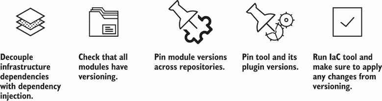

图 13.5 在升级工具之前，你的清单应该包括固定和检查模块、插件和工具的所有版本。

如果工具升级添加或删除字段，你需要传递每个资源子集期望的正确信息。依赖注入为基础设施资源之间的配置属性提供了一层抽象（参见图 4）。它保护每个子集免受其他子集变更的影响。

你需要检查你是否为所有 IaC 模块（第五章）添加了模块版本号。同样，你也要确保任何使用该模块的 IaC 或存储库将其固定到特定版本。

例如，社交媒体公司的一个团队总是使用模块的最新版本。你将模块版本 2.3.1 添加到团队的存储库中。当你使用工具升级发布模块版本 3.0.0 时，团队的 IaC 不会因为破坏性变更而升级。你可以在不固定模块版本的情况下更新模块并将破坏性变更推送给所有使用它的人！

你还要验证每个团队是否将工具及其插件版本固定到当前版本。虽然插件可能没有向前兼容性，但你希望保留当前版本，并避免在另一个版本中添加新的配置。最后，将所有固定的模块、工具和插件版本推送到每个 IaC 模块和配置中。你确保版本固定不会引入新的变更。

在完成你的预升级清单后，你必须规划你的工具升级路径。图 13.6 显示，从 1.0 升级到 4.0 的工具引入了一些破坏性变更！你决定可以升级到 3.0，它提供了与 1.7 的向后兼容性。然后你可以从 3.0 升级到 4.0，这应该减少其他破坏性变更。

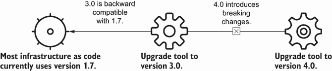

图 13.6 你规划工具升级路径，并考虑向后兼容版本和具有破坏性变更的版本。

不要立即升级到最新版本。相反，检查你的工具中的破坏性变更列表，并评估你是否可以适应这些变更。我避免一次性升级超过两个版本（或 beta 发布中的子版本）。大多数工具在行为或语法上都会有破坏性变更。

在将升级部署到生产环境之前，考虑在测试环境中测试升级。根据你的系统和测试环境，你可以确定工具升级是否可能破坏基础设施。升级永远不会像你预期的那样顺利，测试环境有助于在升级生产之前识别重大问题。

### 13.2.2 向后兼容性

许多 IaC 工具为变更提供某种向后兼容性。它们通常在废弃旧功能之前，支持一个或两个版本的旧和新功能。即使一个工具支持向后兼容性，也要确保尽快将代码移植和重构到新功能。

你的示例将工具从版本 1.7 升级到 3.0。幸运的是，版本 3.0 确实支持与 1.7 的向后兼容性。它提供了新功能，但没有破坏性更改会影响你的 IaC。当然，你采取了谨慎的方法进行升级。

你从同意在升级期间提供帮助的饲料团队成员开始。饲料团队部署所有更改，并确保不要向 IaC 添加新的更改。然后，你检查配置，以找到升级工具而不中断社交媒体流量的最佳方式。

在图 13.7 中，你将第十章中提到的重构技术应用于工具的升级。你从高级资源开始，因为其他资源不依赖于它们，部署更改，测试系统，然后升级底层资源。

你通知饲料团队，你将首先升级 DNS 和负载均衡器基础设施资源。其他资源不依赖于它们。首先更新它们允许你测试你的升级模式是否有效。你可以通过更改版本并运行 IaC 来升级资源的工具版本。你检查交付管道中的干运行和测试，以确保你没有中断任何内容。

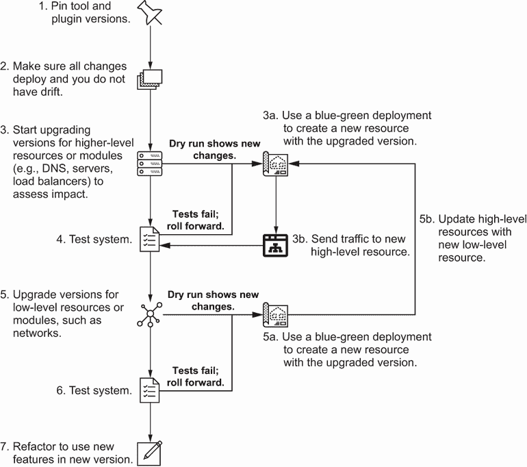

图 13.7 将重构技术应用于从高级到低级资源的向后兼容性工具版本升级。

高级资源如 DNS 和负载均衡器更新时没有任何中断。接下来，你转向更底层的资源。你开始使用第十章中提到的滚动更新模式更新服务器。你不会同时升级所有服务器，而是从一台开始升级，很快遇到了问题。

生产服务器配置有一个覆盖脚本，在升级工具时会中断。幸运的是，由于你使用了滚动更新，你只影响了一台服务器。毕竟，你希望保持社交媒体流量的运行和可用性。

在图 13.8 中，你应用第十一章中提到的回滚技术来修复不再工作的服务器。你实施手动修复，并调试旧服务器以解决问题。一旦你在测试环境中修复了问题，你就将更改推送到覆盖脚本，并继续进行服务器的滚动更新。

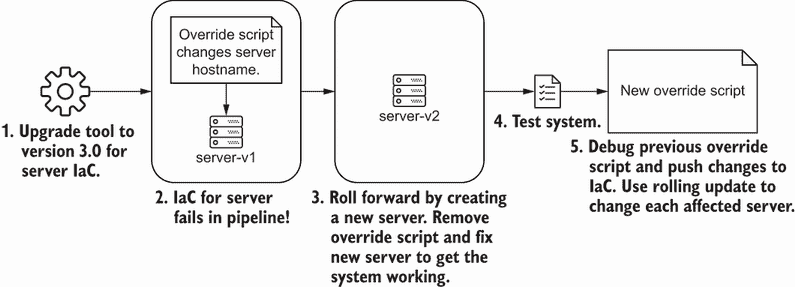

图 13.8 你可以使用滚动更新模式来最小化失败的工具升级的影响范围，并在更改失败时回滚。

服务器通过了测试。你转向最低级别的资源，即网络。以防万一，你使用第九章中提到的蓝绿部署模式部署了网络的第二个版本。将所有内容部署到新网络后，你运行了所有端到端测试，并检查系统是否仍然正常工作。你完成了工具升级！

为什么要回顾重构、蓝绿部署和滚动升级等模式？你希望最小化潜在失败的影响范围。许多这些模式看似重复，但它们提供了结构化、风险较低的升级系统的方法。改变你的工具*确实*会改变你的基础设施，因此你可以应用非常相似的技术并获得相同的结果。

通常，使用滚动升级进行 IaC 升级到服务器或其他计算资源。蓝绿部署有助于高风险、低级基础设施资源的工具升级。你通常可以在原地更新高级资源。

然而，你无法预防所有的失败。在这种情况下，如果系统崩溃，可以使用第十一章中的回滚实践和模式。高级资源可以回滚配置，而低级资源则通过创建具有先前更改的新资源来受益。

### 13.2.3 升级中的破坏性变更

有时，你会发现你的基础设施工具或插件发布了包含破坏性变更的新版本。带有破坏性变更的新版本通常发生在工具的早期版本中，例如当工具处理新的或边缘用例时。如果你需要执行带有破坏性变更或功能的工具升级，请使用第九章中描述的更改技术。

对于社交媒体公司，你将饲料团队的工具从版本 1.7 升级到 3.0。然而，从版本 3.0 升级到 4.0 涉及一些破坏性变更！版本 4.0 包含后端架构更改，可能会影响你的资源。你如何在不影响系统的情况下将你的基础设施更新到版本 4.0？

记住，在第四章中，我提到了*工具状态*的存在。工具保留基础设施状态的副本，以检测实际资源状态与配置之间的偏差，并跟踪它管理的资源。工具状态与实际基础设施状态不同。当你更新工具时，你希望将旧工具状态与新的工具状态分开。

在我们的例子中，你希望将版本 3.0 的旧工具状态与版本 4.0 的新工具状态隔离开。通过隔离工具状态，可以最小化潜在失败的影响范围，因为这样可以隔离工具需要更改的基础设施资源。资源越少，恢复越快，并且可能对系统其他部分的影响越小。

在图 13.9 中，社交媒体公司的每个团队都将其工具状态分离到不同的位置。分离的工具状态确保对饲料团队蓝色基础设施的更改不会影响绿色基础设施。

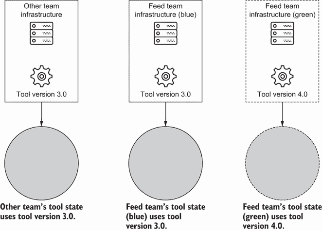

图 13.9 工具状态捕获了工具的基础设施状态，以便进行比较，并且可以存在于工具使用的不同位置。

首先，你在整个饲料团队的 IaC 中固定工具和模块版本。接下来，你更新基础设施模块到工具版本 4.0。你发布模块的新版本，并记录破坏性变更。

接下来，您将现有配置复制到一个新文件夹中。每个新文件夹创建一个新的工具状态。找到网络文件夹，并使用工具版本 4.0 创建一个新的网络。现在，您应该有来自工具版本 3.0 的原始“蓝色”资源，以及来自工具版本 4.0 的新“绿色”资源。

您将**蓝绿部署策略**应用于工具状态，以创建带有新工具的新资源！使用新版本创建一组新资源确保任何破坏性更改都不会影响现有基础设施。

定义**工具状态蓝绿部署**是一种模式，它创建了一个带有新工具版本的新基础设施资源子集。您逐渐将流量从旧资源集（蓝色）转移到新资源集（绿色）。该模式将破坏性更改隔离到新资源集以进行测试。

在创建低级资源之后，将高级资源复制到一个新文件夹中。更新其依赖项以使用来自工具版本 4.0 的低级资源。毕竟，你希望所有使用新工具版本的资源。

图 13.10 总结了该策略。创建高级资源，运行您的测试，并将流量发送到新资源。

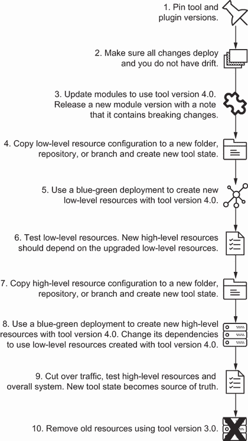

图 13.10 在出现破坏性更改时，考虑在另一种状态中创建一个新的资源，并将流量切换到使用工具最新版本的资源。

这种方法与第九章中提到的蓝绿部署不同。您创建了一组全新的资源，以及一个全新的工具状态。如果您松散耦合了依赖项，资源子集可以有不同的工具版本，而不会影响系统的功能。

回想一下，您可以使用不同的存储库结构（第五章）和分支模型（第七章）进行 IaC 的工作。根据您的存储库结构和分支模型，您可以以不同的方式隔离工具状态。您始终可以合并一个新的分支并修改其管道以部署基础设施，或者将单独的文件夹复制到存储库的主配置中。

假设您的组织对交付管道有特定的方法，并且只允许在主分支上进行生产部署。在这种情况下，您可以创建一个新的存储库用于工具升级，并将旧的存储库存档。

如果您彻底测试了更改并进行了干运行，则可以应用就地升级。如果失败，您可以在新的工具状态中创建一个全新的资源，并使用升级后的工具。如有疑问，请参考工具的升级文档。作为一个一般做法，如果工具提供某种类型的迁移工具或脚本以简化更新，我将尝试就地升级。

## 13.3 替换工具

我试图在提供具体示例以展示模式和做法的同时，使本书尽可能不依赖于任何工具！在运行 IaC 一段时间后，您不可避免地会为了改进功能或供应商支持而更改工具。在迁移到新工具时，我们应该使用哪些模式？

本书中的许多模式和做法应该有助于保护您的系统免受这些变化的影响。使用第三章中的模式对您的基础设施进行范围和模块化，以及使用第四章中的模式解耦您的依赖关系，允许您的团队使用适合其用例的工具，并在需要时替换它们。如果您没有这些模式，您在迁移到新工具时可能会遇到一些困难。

想象一下您完成了社交媒体公司的 IaC 工具升级。当网络团队成员请求您的帮助时，您考虑休息一下。他们希望从供应商的 DSL 迁移到开源 DSL。他们的配置需要社交媒体推送团队进行额外的审查，该团队对供应商一无所知。

您的研究无法找到供应商或开源脚本以简化直接的迁移。您希望有一种可以将供应商的 DSL 翻译为开源 DSL 的工具。没有它，您和网络团队需要谨慎进行迁移。

### 13.3.1 新工具支持导入

您找不到“翻译”工具之间的自动化工具。然而，您可以将本书中的模式应用于迁移到不同的工具。一些工具支持导入功能，可以将新资源添加到工具的状态中。您可以使用第二章中的实践将现有资源迁移到新工具。

在图 13.11 中，您将模块升级以使用新的开源 DSL。您还更新了其测试，并且测试通过。首先，确定一些可以更改的低级资源。您创建一个单独的文件夹、分支或仓库，以将新的 DSL 与供应商的 DSL 隔离。在为新 DSL 编写配置后，您将现有资源导入到新 DSL 的状态中。

再次重写测试以测试开源 DSL 的新语法。它们通过，然后您继续编写配置和导入高级资源。最后，您删除 IaC。

在使用开源 DSL 编写每个新的 IaC 周期中，您想要检查您的干运行并重写您的测试。干运行显示新工具的默认设置是否与您的现有状态不匹配。如果不匹配，您需要更新新的 IaC 并修复漂移。

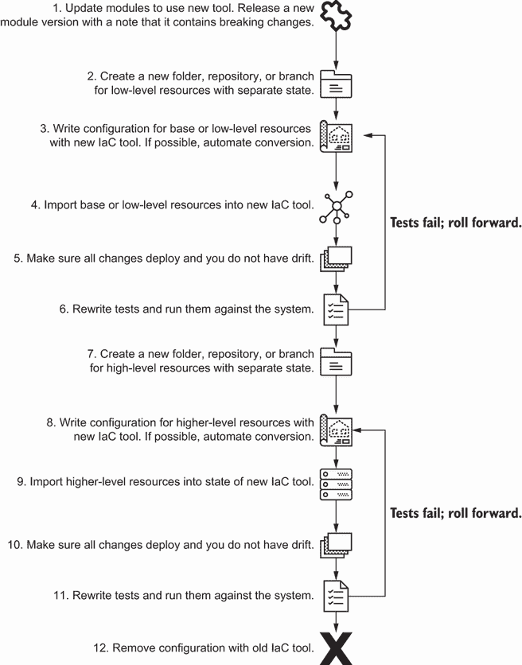

图 13.11 支持导入资源的工具允许您在不更改现有资源的情况下迁移到新工具。

### 13.3.2 没有导入功能

一些工具不支持导入功能，你需要为新工具创建新的资源。想象一下，如果网络团队要求你帮助他们从一家供应商的 DSL 转换到另一家。然而，新的供应商 DSL 不允许将现有资源导入其状态。

如果你的新工具不支持导入现有资源，你需要使用蓝绿部署策略重新创建工具状态下的资源。在图 13.12 中，你首先编写新的基础设施即代码（IaC）用于低级资源，并对新工具进行测试重构。随着你重复此过程并完成高级资源的迁移，你将切换流量并测试整个系统。

图 13.12 一个无法导入资源的全新工具需要使用蓝绿部署策略进行工具迁移。

工具迁移的模式保持一致，无论是否有导入能力。然而，没有导入能力的迁移需要更多努力，因为你需要重新创建系统。即使你有一个可以将从一个工具迁移到另一个工具的神奇脚本，你也可能考虑应用一些这些模式和做法，以避免破坏关键基础设施资源，如网络。

你总是会替换或添加工具到你的基础设施生态系统中。你的组织将选择适合其架构目标的工具。应用模块化、隔离和管理 IaC 的技术将适应你的 IaC 发展。我总是回到这些实践和模式，以使基础设施、IaC、模块、工具和组织的变化，并减轻它们对关键系统的风险。

无论工具是否具有导入功能，你都需要为每个重构的资源重写测试。图 13.13 显示，在迁移过程中，你必须对每个模块和资源子集的重构单元测试和契约测试进行重构。然而，你的端到端和集成测试可能保持不变。

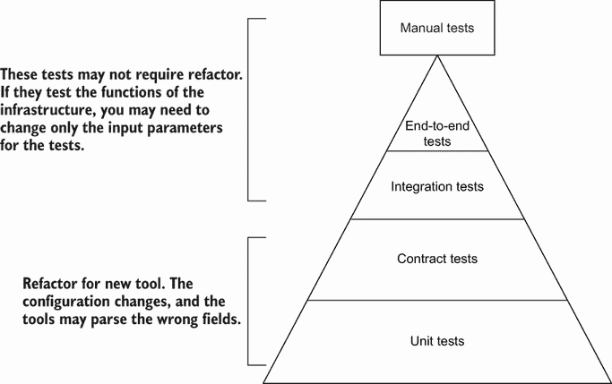

图 13.13 当你升级工具时，你需要重写单元测试和契约测试，而集成、端到端和手动测试可能保持基本不变。

新工具将影响单元测试和契约测试，因为该工具使用不同的状态和元数据格式。测试无法从新工具中解析出正确信息。集成和端到端测试可能保持不变，因为它们评估的是基础设施的功能，而不是工具本身。

在重构测试的同时进行重构，允许你添加更多测试，删除冗余测试，或对更广泛的安全或策略测试进行更新。由于你有不同的资源，你应该更新你的手册、集成和端到端测试，以包含新的输入参数。然而，测试本身的变化不大，因为它们测试的是系统的功能，而不是基础设施属性。

## 13.4 事件驱动 IaC

本书的大部分内容涵盖了协作编写 IaC 以减少关键系统潜在故障影响的实践。一旦你熟悉了原则和实践，你就可以将它们扩展到更多动态用例。

例如，一个开发团队希望在其 IaC 中实现一些非常动态的自动化。每当开发团队成员部署应用程序的新实例时，他们需要更新防火墙规则以允许从实例访问数据库。而不是推送新实例然后记住稍后更新防火墙规则，他们希望有一些自动化在应用程序实例启动后运行基础设施模块来配置防火墙规则。

图 13.14 展示了你实现的自动化。你部署了一个带有新 IP 地址的新应用程序。一个自动脚本来捕获新的 IP 地址并运行一些 IaC。配置更新了防火墙以包含新的 IP 地址。每次你部署带有新 IP 地址的新应用程序时，这种自动化都会重复。

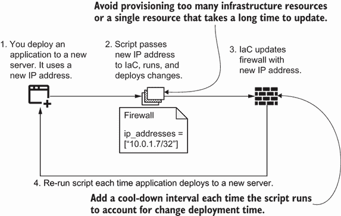

图 13.14 每当应用程序实例获得新的 IP 地址时，基础设施模块都会使用新的 IP 地址更新防火墙规则。

当系统发生变化时，你可能考虑自动运行基础设施模块。*事件驱动的 IaC*意味着运行最小范围的基础设施模块以响应事件来配置基础设施。你可以使用自动化来更新其他资源或根据事件修复系统。

定义 *事件驱动的 IaC* 运行最小范围的基础设施模块以响应事件来配置基础设施。

更新应用程序等同于一个事件。某些脚本、应用程序或自动化检测到事件，并通过运行基础设施模块来响应！你可以编写自己的或找到开源工具来识别和响应事件。你可以使用的某些实际自动化工具包括 Kubernetes 的操作员、无服务器函数或从事件队列中消费的应用程序。

这不是 GitOps 吗？

在第七章中，我提到本书中的一些实践和模式倾向于 GitOps。GitOps 结合了声明性配置、漂移检测、版本控制和持续部署。这种方法实现了事件驱动的 IaC。我认为 GitOps 是事件驱动的 IaC 的一个子集，因为它的自动化响应配置漂移的事件。

如果 GitOps 框架检测到漂移，它会运行自动化操作来协调配置。例如，容器编排器 Kubernetes 使用控制器来自动协调声明性配置与资源状态。然而，事件驱动的 IaC 描述的是由更广泛的事件集自动化的 IaC，而不仅仅是漂移。

随着动态服务和应用程序的普及，事件驱动的 IaC 用例变得更加普遍。如果你确实使用事件驱动的 IaC，请记住以下几点：

+   避免创建或配置时间较长的基础设施资源。你不想包含一个需要一小时来创建的基础设施资源。

+   不要向事件驱动模块添加太多资源。否则，你将花费很长时间来创建许多实例。

+   平衡运行更改所需的时间与模块之间的时间间隔。

+   将第二章中的模块实践与第六章中的测试模式结合起来，以验证事件驱动 IaC 运行快速且正确。

一些事件发生频率很高。你需要比事件频率部署更快的基础设施，或者一个自动化脚本来在特定间隔批量更改。你应该选择与事件驱动 IaC 一起部署的最小基础设施资源子集。

从基于代码提交部署的静态基础设施即代码（IaC）到为事件运行动态 IaC，你应用相同的模式、实践和原则来管理和协作。你的目标、团队的需求以及你组织的业务将随着时间的推移而演变和改变——希望你的 IaC 实践也能随之增长。请记住你的测试策略、基础设施成本以及维护其安全和合规性。

## 摘要

+   在你的组织中采用开源工具或模块之前，请审查其功能、安全性和生命周期。

+   开源工具或模块应具有默认值或行为，这些值或行为在更改中提供可预测性和稳定性。否则，你将不得不编写一层代码，在你的组织中添加具有偏见的默认属性。

+   通过扫描基础设施工具或模块以检查安全性、检查第三方数据收集以及运行你的安全和合规性测试来保护你的基础设施免受供应链攻击。

+   维护者类型和数量以及与工具或模块关联的许可证也会影响你组织的使用。

+   开源工具和模块可以有两个类别的许可证：宽松和 copyleft。

+   宽松许可证允许你修改和更新模块或工具，只要你包括许可证副本及其原始版权声明。

+   copyleft 许可证允许你修改和更新模块或工具，只要你包括许可证副本、其原始版权声明并开源你的副本。

+   在升级你的 IaC 工具之前，解耦基础设施依赖项并固定模块、插件和工具版本。

+   使用向后兼容性开始工具更新，通过可变地重构高级资源并继续到低级资源。

+   对于工具状态，采用蓝绿部署策略意味着创建一组具有与现有配置分离的状态的新基础设施资源。

+   工具状态是指 IaC 工具用来检测漂移或其管理下的资源的基础设施状态副本。

+   通过对工具状态应用蓝绿部署策略，从底层资源到高层资源，开始一个带有破坏性变更的工具更新。

+   当用一个新的工具替换另一个工具时，使用新工具的导入功能将现有资源迁移到新工具。从底层资源开始，并将它们应用到高层资源。然后，移除旧工具的配置。

+   如果新工具没有现有基础设施资源的导入功能，您将需要为工具状态应用蓝绿部署策略。

+   事件驱动的基础设施即代码（IaC）在响应系统事件时运行一个最小的 IaC 模块，以自动化基础设施变更。

+   确保事件驱动的 IaC 模块以尽可能少的资源快速部署。
